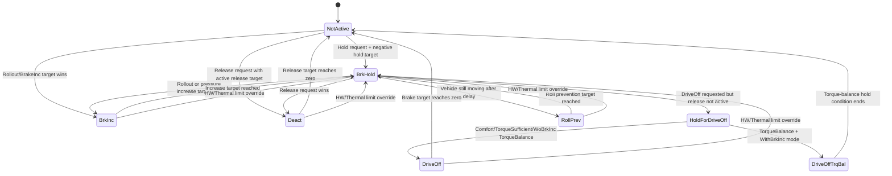

# CsmHoldState 状态机跳变深度分析报告

## 1. 分析对象与结论

- 分析日期：2026-08-15
- ASCET 数据库：`C:\Repo\13_XIAOMIAVH\px_Backup\px_Backup`
- 状态枚举：`PlatformLibrary\Package\CSM_CentralizedStandstillManagement\Public\Enumeration\CSM_HoldState`
- 核心状态生成器：`PlatformLibrary\Package\CSM_CentralizedStandstillManagement\Private\Hold\CSM_HoldBrkReq`
- 核心调度模块：`PlatformLibrary\Package\CSM_CentralizedStandstillManagement\Private\Hold\CSM_CoreHoldService`
- 外部安全钳制：`PlatformLibrary\Package\CSM_CentralizedStandstillManagement\Private\Post_Wrapper\CSM_HoldSafetyLimiter_PostCore`

核心结论：`CsmHoldState` 不是传统的“当前状态 + 事件 -> 下一状态”的显式状态机，而是每个周期从 `NotActive` 开始，根据多个并行制动服务的 Active 标志和目标减速度重新仲裁。数值更小、通常更负的 `CsmHoldATarBrk` 表示更强制动请求。最终状态由目标制动力竞争、固定执行顺序、特殊保持逻辑以及硬件限制共同决定。

## 2. 枚举值

| 数值 | 枚举值 | 含义 |
|---:|---|---|
| 0 | `CSMHoldState_NotActive` | Hold 服务未激活 |
| 1 | `CSMHoldState_BrkHold` | 常规液压保持 |
| 2 | `CSMHoldState_HoldForDriveOff` | 已收到 DriveOff 请求，但仍需继续保持 |
| 3 | `CSMHoldState_BrkInc` | Rollout 或 Brake Increase 正在增压 |
| 4 | `CSMHoldState_RollPrev` | 防溜坡增压 |
| 5 | `CSMHoldState_DriveOffTrqBal` | 带增压能力的扭矩平衡起步 |
| 6 | `CSMHoldState_DriveOff` | 普通/舒适/无增压扭矩平衡释放 |
| 7 | `CSMHoldState_Deact` | Hold 主动释放/退出 |

实现类型为 `uint8`，有效实现范围 `[0, 7]`。

## 3. 状态生成总算法

`CSM_HoldBrkReq.calc()` 每周期执行以下步骤：

```text
state = NotActive
target = 0
active = false

1. Deact 候选：      active 且 deactTarget <= target 时选中
2. DriveOff 候选：   active 且 driveOffTarget <= target 时选中
3. BrakeHold 候选：  active 且 holdTarget <= target 时选中
4. Rollout 候选：    active 且 rolloutTarget < target 时选中，状态记为 BrkInc
5. BrakeInc 候选：   active 且 brkIncTarget < target 时选中，状态记为 BrkInc
6. RollPrev 候选：   active 时无条件覆盖状态为 RollPrev，target 取两者最小值

7. 若 target < 0 或 Plain Release Ramp > 1：保持选中状态并置 active=true
   否则：仅允许特殊 DriveOffTrqBal 保持；其余回到 NotActive

8. 若 target <= HW/Thermal limit：
   target = limit
   state = BrkHold
```

### 3.1 同周期优先级

这不是简单的枚举优先级，而是“目标制动力优先 + 执行顺序处理相等值”：

1. `RollPrev`：只要 Active，就在普通候选选择之后无条件覆盖。
2. 其余服务：目标减速度更负者获胜。
3. 目标相等时：
   - `BrakeHold` 可覆盖 `DriveOff`，因为使用 `<=`；
   - `DriveOff` 可覆盖 `Deact`，因为使用 `<=`；
   - `Rollout`、`BrakeInc` 使用严格 `<`，相等时不覆盖前序状态。
4. HW/Thermal Limit 是最终绝对覆盖：条件成立时状态强制变成 `BrkHold`。
5. PostCore 有效性检查可再把任何状态强制变为 `NotActive`。

## 4. 各状态的进入、保持和退出条件

表中“当前候选 target”指本周期已经由前序分支选出的目标值，不是上一周期状态。

### 4.1 `NotActive (0)`

进入条件：

- 所有候选最终没有形成负制动请求，即 `CsmHoldATarBrk >= 0`；
- 且 `CsmHoldDeactRampPlain <= 1`；
- 且不满足 `DriveOffTrqBal` 特殊保持条件。

外部强制条件：

- `CsmHoldReqValid20ms == false` 且 `CsmHoldReqValid5ms == false` 时，PostCore 将任何内部状态强制输出为 `NotActive`。

典型来源：无有效 Hold/DriveOff/Release 请求，候选目标均为 0，或者请求虽存在但没有形成有效负制动力。

### 4.2 `BrkHold (1)`

正常进入条件：

- `in_CsmHoldBrkHoldActive == true`；
- `in_CsmHoldBrkHoldATarBrk <= 当前候选 target`；
- `in_CsmHoldBrkHoldForDriveOffActive == false`。

`in_CsmHoldBrkHoldActive` 的上游条件按顺序为：

1. `CsmHoldBrkHoldReqActive > 0`；或
2. `CsmHoldStandbyReqActive > 0`，并且此前 BrakeHold 已激活或 Rollout 正在激活；或
3. DriveOff 请求期间仍需保持，但此时会进入 `HoldForDriveOff`，不是普通 `BrkHold`。

强制进入条件：

- 无论此前选中 `Deact`、`DriveOff`、`BrkInc` 或 `RollPrev`，只要
  `CsmHoldATarBrk <= in_CsmHoldATarBrkLimit`，最终状态强制为 `BrkHold`。
- 条件使用 `<=`，在目标恰好等于限制值时也会覆盖。

退出条件：

- Hold 请求消失，且没有 Standby 保持条件；
- DriveOff 接管；
- Deact 接管；
- 更强的 Rollout/BrakeInc/RollPrev 接管；
- PostCore 请求有效性丢失后直接输出 `NotActive`。

### 4.3 `HoldForDriveOff (2)`

进入条件：

- `CsmHoldDriveReqActive > 0`；
- 且满足以下之一：
  - BrakeHold 已激活、但 `CsmHoldDriveOffActive == false`；
  - Rollout 已激活；
- `CSM_BrakeHoldDetermination` 因此置：
  - `CsmHoldBrkHoldActive = true`；
  - `CsmHoldBrkHoldForDriveOffActive = true`；
- 其 Hold target 在本周期候选中胜出。

含义：DriveOff 请求已到达，但真正的释放算法尚未接管，系统继续维持制动。

退出条件：

- DriveOff 算法激活并胜出，进入 `DriveOff` 或 `DriveOffTrqBal`；
- DriveOff 请求撤销后回到普通 `BrkHold` 或 `NotActive`；
- Rollout/BrakeInc/RollPrev 或 HW limit 覆盖。

### 4.4 `BrkInc (3)`

该状态由两条完全不同的路径产生。

#### 路径 A：Rollout

- `CsmHoldRolloutActive == true`；
- `in_CsmHoldRolloutATarBrk < 当前候选 target`。

Rollout 的主要使能条件：

- `VVehComfort < C_CSM_RolloutVMax`；
- 停车时间没有超过 `C_CSM_RolloutAvoidInStop`；
- `CsmHoldRolloutReq != CSMRolloutReq_Off`；
- 存在 Standby、Hold，或允许通过增压响应的 DriveOff 请求。

Rollout 的主要触发条件：

- 预计达到目标制动力所需时间大于等于预计停车时间，或满足低速/停车/回滚等特殊锚点；
- `AVehForTrigger` 达到标定的减速度条件；
- 当前制动力尚未达到保持目标。

保持到目标保持水平达到；达到热限制时立即停止 Rollout。

#### 路径 B：Brake Increase

- `CsmHoldBrkIncActive == true`；
- `in_CsmHoldBrkIncATarBrk < 当前候选 target`。

`CsmHoldBrkIncActive` 的主要条件：

- `CsmHoldBrkHoldReqActive > 0`；
- CSM 级或功能级的 Comfort/Performance/Emergency/FunctionSpecific 增压请求至少一个使能；
- 对应目标尚未达到；
- 或扭矩平衡 DriveOff 下降沿触发 Performance 增压补偿。

退出条件：目标达到、热限制达到、Hold 请求消失，或被 `RollPrev`/HW limit 覆盖。

### 4.5 `RollPrev (4)`

直接进入条件：

- `in_CsmHoldRollPrevActive == true`。

它在 `CSM_HoldBrkReq` 中不参与普通 target 竞争，而是在最后无条件把状态改为 `RollPrev`。其目标值再与当前 target 取最小值。

上游激活条件：

- BrakeHold 已激活；
- `VehStop == false`；
- `TRollPrevDelay <= 0`；
- `CsmEnaRollPrev == true`；
- 且满足以下之一：
  - BrakeInc 和 Rollout 均未激活；
  - RollPrev 已经激活；
  - 当前车辆减速度不足，即 `AxVehComfort > C_CSM_RollPrevAVehAcceptedWhileBrkInc`。

退出条件：

- RollPrev target 已达到最终目标；
- `CsmEnaRollPrev == false`；
- BrakeHold 不再激活；
- HW limit 最终覆盖为 `BrkHold`；
- PostCore 有效性丢失后输出 `NotActive`。

### 4.6 `DriveOffTrqBal (5)`

正常进入必须同时满足：

1. `in_CsmHoldDriveOffActive == true`；
2. DriveOff target 在候选竞争中胜出；
3. `in_CsmHoldDriveOffType == CSMDrvOffType_TorqueBalance`；
4. 最终模式为以下之一：
   - `CSMDrvOffTrqBalMode_SensitiveWithBrkInc`；
   - `CSMDrvOffTrqBalMode_LessSensitiveWithBrkInc`。

注意：TorqueBalance 的无增压模式不会输出 `DriveOffTrqBal`，而会输出普通 `DriveOff`。

TorqueBalance 上游主要激活条件：

- `CsmHoldDriveReqActive > 0`；
- TorqueBalance 模式不是 Off；
- `CsmDrvOffTrqBalance == true`；
- BrakeHold 已激活或 TorqueBalance 已经激活；
- DriveOff 尚未完成；
- 当前仍有制动力，或处于允许反向增压的 WithBrkInc 模式；
- LessSensitive 模式还要求平衡减速度达到鲁棒性阈值。

特殊保持条件：

即使最终 target 已不小于 0，只要：

- DriveOff 类型仍为 TorqueBalance；
- 模式仍为两个 WithBrkInc 模式之一；
- `CsmHoldStateK1 == CSMHoldState_DriveOffTrqBal`；

则状态继续保持 `DriveOffTrqBal`，并令 `CsmHoldActive = true`。这是为了允许释放后再次增压。

退出条件：DriveOff 完成、请求撤销、模式关闭、其它更强候选接管、HW limit 覆盖，或 PostCore 有效性丢失。

### 4.7 `DriveOff (6)`

进入条件：

- `in_CsmHoldDriveOffActive == true`；
- DriveOff target 在候选竞争中胜出；
- 且不满足 `DriveOffTrqBal` 的 WithBrkInc 模式判定。

它包括：

- Comfort Release；
- Torque Sufficient；
- Torque Balance 的 `SensitiveWoBrkInc` 或 `LessSensitiveWoBrkInc` 模式。

DriveOff Handling 的实际选择顺序：

1. Comfort Release；
2. Torque Sufficient；
3. Torque Balance；
4. 否则 NotActive。

Comfort Release 激活条件：

- Comfort Release 功能使能；
- Comfort Release 请求成立；
- `CsmHoldDriveReqActive > 0`；
- 车辆静止，或允许移动中舒适释放且车速低于阈值；
- `ADrvBrk + offset` 计算出的目标仍小于 0。

Torque Sufficient 的主触发条件：

- `CsmHoldDriveReqActive > 0`；
- `DrvOffTrqSufficient == true`；
- 当前 DriveOff target 小于 0。

其后可在自身已激活、Comfort Release、Deact 或前一周期 TorqueBalance 的释放过程中继续保持到目标归零。

### 4.8 `Deact (7)`

直接进入条件：

- `in_CsmHoldDeactActive == true`；
- `in_CsmHoldDeactATarBrk <= 当前候选 target`；
- 且未被后续 DriveOff、BrakeHold、Rollout、BrakeInc、RollPrev 或 HW limit 覆盖。

`in_CsmHoldDeactActive` 的根条件非常直接：

- `CsmHoldDeactReqActive > 0`。

默认释放策略：

- Park Brake 已应用：`Time2Move` ramp；
- 检测到 `SkidYawRate`：Plain ramp；
- 其它情况：Time ramp。

退出条件：释放目标归零后通常转 `NotActive`；也可能在释放过程中由 DriveOff 接管，或者因 HW limit 被强制标记为 `BrkHold`。

## 5. 请求仲裁对状态跳变的影响

`CSM_Arbitrator_Hold` 的注释和实现定义请求优先级：

```text
Hold > DriveOff > Release > Standby > None
```

此外存在重要的 Standby 升级规则：

当请求是 Standby，且当前状态不是 `NotActive`、`DriveOff`、`Deact`、`DriveOffTrqBal` 时，Standby 会被改写为 Hold。也就是说，在 `BrkHold`、`HoldForDriveOff`、`BrkInc`、`RollPrev` 中，Standby 倾向于继续维持 Hold，而不是直接退出。

## 6. 典型状态路径



该图描述典型路径，不是限制性转移图。由于状态每周期重算，在输入突变时理论上可从任一状态直接跳到任一获胜状态。

## 7. 覆盖关系总结

| 覆盖源 | 可覆盖对象 | 条件 |
|---|---|---|
| DriveOff | Deact | DriveOff target `<=` 当前 target |
| BrakeHold | Deact/DriveOff | Hold target `<=` 当前 target |
| Rollout | 前序候选 | Rollout target严格 `<` 当前 target |
| BrakeInc | 前序候选 | BrakeInc target严格 `<` 当前 target |
| RollPrev | 所有普通候选 | RollPrev Active，无条件改状态 |
| HW/Thermal Limit | 所有内部状态 | final target `<= limit`，强制 BrkHold |
| PostCore validity | 所有输出状态 | 20 ms 与 5 ms 请求均无效，强制 NotActive |

## 8. 发现的高风险或可疑实现

### 8.1 DriveOff service bit 疑似写反

`CSM_HoldBrkReq` 中：

- `in_CsmHoldDriveOffTrqSuffActive` 写入 `CSMHoldServiceID_DriveOffComfortRelease`；
- `in_CsmHoldDriveOffComfortReleaseActive` 写入 `CSMHoldServiceID_DriveOffTrqSuff`。

按命名判断二者疑似互换。它不直接改变 `CsmHoldState`，但可能导致 `CsmHoldServiceStates` 诊断位错误。

### 8.2 DriveOffTrqBal 保持条件重复

特殊保持条件连续两次检查完全相同的：

```text
CsmHoldStateK1 == CSMHoldState_DriveOffTrqBal
```

第二个条件没有增加约束，疑似复制错误或遗漏了另一个 K1 条件。

### 8.3 TorqueBalance 优先级注释与代码不一致

注释称 TorqueBalance 优先级更高，但 `CSM_HoldDriveOffHandling` 的代码顺序是：

```text
ComfortRelease -> TorqueSufficient -> TorqueBalance
```

当 TorqueSufficient 与 TorqueBalance 同时首次成立时，TorqueSufficient 会先命中；TorqueBalance 只有在 TorqueSufficient 不成立，或此前类型已经是 TorqueBalance 时才有机会接管。需要确认这是设计还是缺陷。

### 8.4 HW limit 会掩盖真实业务状态

到达限制时状态统一改为 `BrkHold`。因此日志中看到 `BrkHold` 不一定表示正常 Hold，也可能表示 Deact、DriveOff、BrkInc 或 RollPrev 的目标被硬件/热限制钳制。

### 8.5 Brake Increase 明确留有迟滞 TODO

`CSM_HoldBrkIncCtrl` 中存在注释 `hysterese einbauen`，当前 Active 判定在阈值附近可能出现周期抖动，需要结合测量确认。

## 9. 建议测量信号

要准确解释一次实际跳变，至少同时记录：

- `CsmHoldState`、`CsmHoldStateK1`、`CsmHoldATarBrk`；
- `in_CsmHoldATarBrkLimit`、`CsmHoldBrkLimitReached`；
- `in_CsmHoldDeactActive/ATarBrk`；
- `in_CsmHoldDriveOffActive/Type/ATarBrk`；
- `CsmDrvOffTrqBalMode`；
- `in_CsmHoldBrkHoldActive/ForDriveOffActive/ATarBrk`；
- `in_CsmHoldRolloutActive/ATarBrk`；
- `in_CsmHoldBrkIncActive/ATarBrk`；
- `in_CsmHoldRollPrevActive/ATarBrk`；
- `CsmHoldDeactRampPlain`；
- `CsmHoldReqValid20ms`、`CsmHoldReqValid5ms`；
- `CsmHoldBrkHoldReqActive`、`CsmHoldDriveOffReqActive`、`CsmHoldDeactReqActive`、`CsmHoldStandbyReqActive`。

仅记录 `CsmHoldState` 无法区分“业务状态胜出”“HW limit 覆盖”和“PostCore 有效性强制”三类原因。
