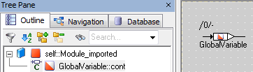
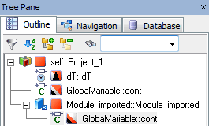
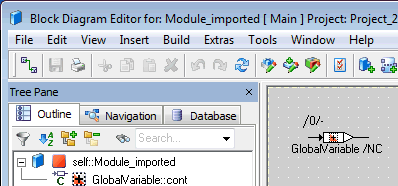

A module Module_imported contains an imported global variable. Without project context, the variable is represented as follows.

Module_imported is then added to Project_1, which contains an exported GlobalVariable with the attributes Non-Volatile and Calibration. In the Outline tab of the project editor, the imported variable in the module is displayed with the same overlay icon as the exported one. If the module is opened from the project editor, the graphical representation of GlobalVariable represents the properties of the exported variable, too.

 

Next, Module_imported is added to Project_2, which contains an exported GlobalVariable with the attribute Virtual. The imported variable in the module is again displayed with the same overlay icon as the exported one, which means that it looks different than in the context of Project_1.

 

# Imported Elements

An imported element derives its attributes (volatile/non-volatile etc., see [Properties Editor for Basic Elements - Attributes](EED_Element_Editor_Basic_Elements.md#Attributes)) from the exported counterpart. Therefore, the Attributes area in the properties editor is deactivated for imported elements.

The properties editor offers a button to synchronize the properties of an imported element with the corresponding exported element in the current project context. However, since imported and exported elements are mapped only via their instance names, synchronization will fail in the following cases:

- The kind of the exported element is not supported in the component that contains the imported element (e.g., when you try to synchronize an imported element of a class with an exported message).
- The exported element has a different dimension than the imported element (e.g., when you try to synchronize a scalar imported element with an exported array, matrix or characteristic line/map).
- The exported element is a complex element while the imported element is a basic element (or vice versa).

In these cases, a message window with a description of the failure opens.

When you create an imported element, none of the attributes are set. In the context of a project, an imported element shows the attributes of the exported counterpart in the properties editor and in the graphical representation. This means that the graphical representation of a particular imported element will differ.

##### [Example](javascript:kadovTextPopup(this))<!-- kadovTextPopupInit('a1'); //-->

See also

[Properties Editor for Basic Elements](EED_Element_Editor_Basic_Elements.md)

[Editing the Element Scope](EEd_EditElementScope.md)

[Introduction - The Scope of Elements](introductionenglishus.chm::/INT_the_scope_of_elements.htm)

/* Heikki Komulainen, Comet Computer GmbH 2004 */ cc_plus_pic = '&nbsp;'; cc_minus_pic = '&nbsp;'; cc_stat_pic = '&nbsp;'; gpstyle = ''; var iframes_created = 0; if (document.body && document.body.insertAdjacentHTML && document.getElementsByTagName && document.getElementById) { collect_popups(); set_poplinks_pictures(); if (iframes_created) { document.write(gpstyle); document.write('
<nobr><a id="einauslink" style="position:absolute;top:expression(document.body.scrollTop + this.offsetHeight - this.offsetHeight);left:expression(document.body.offsetWidth - (this.offsetWidth + 28));background:white;padding:5px" href="javascript:show_all_poptext()">Show all hidden text</a></nobr>
'); } } function collect_popups() { bsscpopups = new Array(); for (x = 0; x < document.links.length; x++) { if (document.links[x].href.indexOf("BSSCPopup")>-1) { seekmatch = /BSSCPopup.'[^'](.+)'/; poplink = seekmatch.exec(document.links[x].href); poplink = "" + poplink; poplink = poplink.substring(poplink.indexOf("'")+1, poplink.lastIndexOf("'")); ifid = "CCGENIFRAMEID" + x; new_iframe = '<iframe id="' + ifid + '"src="' + poplink + '" onload="get_text(\'' + ifid + '\')" width="0" height="0" frameborder=0></iframe>'; document.links[x].parentNode.insertAdjacentHTML("afterEnd", new_iframe); gpid = "CCID_" + ifid; document.links[x].href = "javascript:expand_poptext('" + gpid + "')"; cc_plus = '' + cc_plus_pic + ''; document.links[x].insertAdjacentHTML("afterBegin", cc_plus); iframes_created = 1; } } }// end function function get_text(ifr_id) { frpars = document.frames[ifr_id].document.getElementsByTagName("body"); popbody = frpars[0].innerHTML; gpid = "CCID_" + ifr_id; if (!document.getElementById(gpid)) { //avoiding doubles document.getElementById(ifr_id).insertAdjacentHTML("afterEnd", '
'+popbody+'
'); } }//end function function expand_poptext(x_frame_id) { if (!document.getElementById(x_frame_id)) return; if (document.getElementById(x_frame_id).className == "CCGENPOPTEXTH") { document.getElementById(x_frame_id).className = "CCGENPOPTEXTV"; document.getElementById(x_frame_id).style.visibility = "visible"; if (document.getElementById("CCPMB_" + x_frame_id )) { document.getElementById("CCPMB_" + x_frame_id ).innerHTML = cc_minus_pic; } } else { document.getElementById(x_frame_id).className = "CCGENPOPTEXTH"; document.getElementById(x_frame_id).style.visibility = "hidden"; if (document.getElementById("CCPMB_" + x_frame_id )) { document.getElementById("CCPMB_" + x_frame_id ).innerHTML = cc_plus_pic; } } }// end function function show_all_poptext() { var pulldowntxt = document.getElementsByTagName("div"); for (b = 0; b < pulldowntxt.length; b++) { if (pulldowntxt[b].className == "droptext") { pulldowntxt[b].style.display=""; } } var gptxt = document.getElementsByTagName("div"); for (z = 0; z < gptxt.length; z++) { if (gptxt[z].className == "CCGENPOPTEXTH") { gptxt[z].className = "CCGENPOPTEXTV"; gptxt[z].style.visibility = "visible"; if (document.getElementById("CCPMB_" + gptxt[z].id )) { document.getElementById("CCPMB_" + gptxt[z].id ).innerHTML = cc_minus_pic; } } } var dxpoplinks = document.getElementsByTagName("a"); if (dxpoplinks) { for (pxl = 0; pxl < dxpoplinks.length; pxl++) { if (dxpoplinks[pxl].href.indexOf("kadovTextPopup")>-1) { if (document.getElementById("CCPMB_" + dxpoplinks[pxl].id)) { document.getElementById("CCPMB_" + dxpoplinks[pxl].id).innerHTML = cc_stat_pic; dxpoplinks[pxl].symbol = "minus"; } } } } document.getElementById('einauslink').innerText = 'Hide all hideable text'; document.getElementById('einauslink').href = "javascript:self.location.reload()"; self.focus(); }// end function function eat_click() { return false; }// end function function set_poplinks_pictures() { var dpoplinks = document.getElementsByTagName("a"); if (dpoplinks) { for (pl = 0; pl < dpoplinks.length; pl++) { if (dpoplinks[pl].href.indexOf("kadovTextPopup")>-1) { cc_plus = '' + cc_stat_pic + ''; //dpoplinks[pl].onmouseup = plusminuspoplink; dpoplinks[pl].insertAdjacentHTML("afterBegin", cc_plus); dpoplinks[pl].symbol = "plus"; } } } }// end function function plusminuspoplink() { if (document.getElementById("CCPMB_" + this.id)) { if (this.symbol == "plus") { document.getElementById("CCPMB_" + this.id).innerHTML = cc_minus_pic; this.symbol = "minus"; } else { document.getElementById("CCPMB_" + this.id).innerHTML = cc_plus_pic; this.symbol = "plus"; } } return true; }
