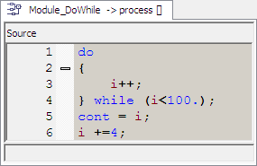

# Example: Do ... While

This is a simple example of a do...while loop:

During loop execution, i reaches a value of 100.0. With that, the condition i<100. is no longer true, the loop exits and the statements following the loop are executed, i.e. cont is set to 100.0, and i is set to 104.0.

The next time this procedure is executed, the start value of i is 104.0. The loop statement is executed, i.e. i is set to 105.0. Since the condition i<100. is false, the loop exits, cont is set to 105.0, and i is set to 109.0.

The oscilloscope shows several consecutive executions of the procedure.

