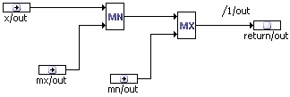

# Accessing Block Diagrams from ESDL

This section guides you through building a simple limited integrator in ESDL. The integrator uses a limiter element from the Systemlib_ETAS folder to determine the bandwidth of the outgoing signal.

The limiter element has a single method out with three parameters mn, x, mx. The out method either returns mn if x <mn,x if mn <=x<=mx,or mx if x >mx

The block diagram for the limiter element is displayed below.

The example shows how to use an existing module as a building block for a new one. The second statement in the compute method limits the integrator signal. The limiter’s out method returns the signal value or the lower or upper bound, which is assigned to the integrator’s memory.

See also

[Example: To Build the Integrator Element](ESDL_Example__To_Build_the_Integrator_Element.md)

[Overview](BlockDiagramEditorEnglishUS.chm::/BDE_Overview.htm)
