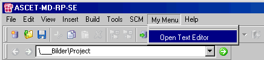

# Hints for Defining Menu Items

If you want to define several menu items in the same or in different ASCET windows, you have to create a section for each individual menu item. Constructions like the following do not work, the first definition is ignored.

[EXPORT]

WINDOW=databasebrowser

MENU=~My Menu

ITEM=~Open Text Editor

DESCRIPTION=open external text editor

FILE=openeditor.txt

ITEM=O~pen PSP

DESCRIPTION=opens a screenshot tool

FILE=openpsp.txt

The sections can either be in the same or in separate *.ini files. The advantage of using separate files is that it is easier to control the order of the menu items in a menu using the file names.

If you use one *.ini file for several items, make sure that each name is only used once. If a name occurs a second time, the first definition is executed a second time regardless of what the second definition is.

An example: The following sections are to be used to generate the menu My Menu with option Open PSP, in the project editor and the menu My Menu with option Open Text Editor in the Component Manager.

[Input]

WINDOW=projecteditor

MENU=~My Menu

ITEM=O~pen PSP

DESCRIPTION=opens a screenshot tool

SEPARATOR=After

FILE=openpsp.txt

[INPUT]

WINDOW=databasebrowser

MENU=~My Menu

ITEM=~Open Text Editor

DESCRIPTION=open external text editor

SEPARATOR=Before

FILE=openeditor.txt

As there is no distinction between upper and lower case, the names of the sections are identical and the first section is ignored, i.e. only Open Text Editor is generated under My Menu in the Component Manager.

See also

[Defining Menu Items](to_define_menu_items.md)
