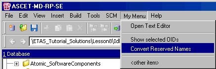

# MENUITEM

You can use the MENUITEM keyword to invoke an existing menu item from the active window.

Example

Only valid for databases!

The My Menu menu was added in the Component Manager. The menu function Convert Reserved Names invokes the convertnames.txt file with the following contents:

MENUITEM Tools>Database>Convert>Reserved component names

The original comment can be found in the Tools menu, Database submenu, Convert submenu, Reserved component names menu item.

If this menu item is invoked, components that have reserved names are renamed.

See also

[Structure of the Script Files](structure_script_file.md)
