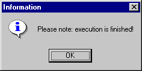

# OBJECT

The keyword OBJECT can be used together with a range of identifiers for different commands.

- help: <editor>

Displays the exe_hlp.txt help file in the specified editor.

Example: OBJECT help: notepad displays the help in the Notepad editor.

The blank after the colon is mandatory for all identifiers. The command cannot be executed if the colon is forgotten.

- log: <editor>

Displays the exe_log.txt log file in the specified editor.

Example: OBJECT log: notepad

- message: <text>

Opens a window with a message for the user.

Example: OBJECT message: Please note: execution is finished! results in the following window:

- popWindow: <title>

The ASCET window with the specified name pops up. <title> does not have to be the complete name, part of the name specified in the title bar is sufficient.

Example: OBJECT popWindow: Database – the Component Manager pops up.

- generatePopWindowCommandFile: <filename>

Creates a file with the specified name in which the correct popWindow command is generated for the ASCET window currently active. The required file ending must be specified in <filename>, path specifications are optional.

Example:

OBJECT generatePopWindowCommandFile: pop.txt

generates the pop.txt file with the following contents when invoked from the Component Manager (only ASCET-MD is installed):

OBJECT popWindow: ASCET-MD

- wait: <n>

Interrupts execution of the script file for n seconds.

Example: the lines

OBJECT wait: 5

EXECUTE C:\WINNT\system32\notepad.exe

result in a 5-second delay before Notepad is started.

- windows: <editor>

Displays a list (exe_win.txt) of the Smalltalk names of all open ASCET windows in the specified editor.

Example:

OBJECT windows: notepad

displays the list in Notepad.

See also

[Structure of the Script Files](structure_script_file.md)
