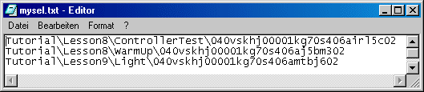

# SELECTOR

The keyword SELECTOR is used to invoke a range of predefined commands in the Component Manager or the specification editors.

Example:

Output of object IDs of selected components

SELECTOR executerFileOutSelectedElementsTo: <filename>

creates a file which contains the object IDs. The required file ending must be specified in <filename>, path specifications are optional.

The blank after the colon is mandatory for all predefined commands. The command cannot be executed if the colon is forgotten. If you make path specifications in <filename>, make sure that all subdirectories exist. Otherwise the file cannot be created.

A menu item is added to the Component Manager which invokes the following script file.

SELECTOR executerFileOutSelectedElementsTo: .\Executer\mysel.txt

EXECUTE C:\WINNT\system32\notepad.exe .\Executer\mysel.txt

MENUITEM View>Update

The ControllerTest, WarmUp and Light components are selected and then the menu item is invoked. The following takes place:

- The first line (SELECTOR ...) creates the mysel.txt file in the Executer subdirectory of the installation directory.
- The second line (EXECUTE ...) opens the newly created file in Notepad.

- The third line (MENUITEM ...) updates the Component Manager once Notepad has been closed.

See also

[Structure of the Script Files](structure_script_file.md)

[Available SELECTOR Commands](Available_SELECTOR_Commands.md)
