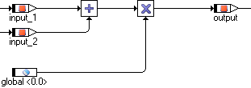
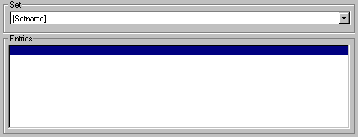

# Merged CHM Content

## Overview

_Source: `markdown/AS_Overview.md`_

# Overview

ASCET offers its users the ability to define so-called arithmetic services and use them to optimize elementary operations, such as addition operations, and to extend such operations by special properties, such as limiters or overflow handling.

An arithmetic service is a C function, which is made available by the user and can be called, in place of a standard operation, from within the code generated by ASCET.

For example, in place of the normal add operation,

c = a + b

a function call is generated:

c = add(a, b)

The code generator can replace, among others, the following standard operations with user-defined service function calls:

- Addition, subtraction, multiplication and division
- Negation and absolute value
- Combined operations, such as multiplication with subsequent division

Arithmetic services can be used for all physical specification types (ESDL, block diagrams) and all complex elements (classes, modules, finite automata or state machines), and are supported for all target types (micro-controller targets, experimental targets [rapid prototyping] and PC) both in off-line and in online experiments with one of the implementation code experiments ([Build Node](ProjectEditorEnglishUS.chm::/Build_Options.htm)).

ASCET finds the information on the presence and type of services from a services.ini file, which is stored for each target in a corresponding target directory (ASCET<n>\target\<target>). These files match the Windows standard for *.ini files. They can be created and edited using any common text editor or using the AS Editor provided.

The arithmetic services are not made available by ASCET directly. The user has the option of making the service functions available in a form best suited for the pertinent application of them: as a library, object code, C code or with the aid of the ASCET C code editors.

See also

[Using Arithmetic Services in ASCET](markdown/AS_Using_Arith_Serv_ASCET.md)

[Selecting a Set](markdown/selecting_a_set.md)

[Arithmetic Services and Constants](markdown/Arithmetic_Services_and_Constants.md)

[Potential Error Conditions](markdown/AS_Potential_Error_Conditions.md)

[Interface Editor for Arithmetic Services](markdown/interface_editor_as.md)

[Managing Sets](markdown/AS_Managing_Sets.md)

[Managing Entries](markdown/AS_Managing_Entries.md)

[Build Node](ProjectEditorEnglishUS.chm::/Build_Options.htm)

[Functionality of an Arithmetic Service](markdown/AS_Functionality_of_an_Arithmetic_Service.md)

[Defining Arithmetic Services](markdown/AS_Def_Arith_Serv_.md)

---

## Using Arithmetic Services in ASCET

_Source: `markdown/AS_Using_Arith_Serv_ASCET.md`_

# Using Arithmetic Services in ASCET

ASCET supports the use of arithmetic services:

- For physical specifications in ESDL and in the block diagram.
- In classes, modules and state machines.
- For off-line and online experiments.
- For micro-controller targets, experimental targets (rapid prototyping) and PC.

The use of arithmetic services is directly linked to the code generation. The code generator takes the information regarding the function to be selected from the data types of the elements, which are linked with the corresponding inputs and outputs of an operation.

If, for example, an addition has two inputs of the unsigned integer 8 bit type (uint8) and one output of the unsigned integer 16 bit type (uint16), the code generator searches the current set for the +|u8|u8|u16 key. If the key is found, the code generator uses the function call stored there. Otherwise, depending on the type of the operation, it either uses the standard operation or generates an error message.

See also

[Selecting a Set of Arithmetic Services](markdown/select_set_arith_services.md)

[Potential Error Conditions](markdown/AS_Potential_Error_Conditions.md)

---

## Selecting a Set in a Project

_Source: `markdown/AS_Selecting_a_Set.md`_

# Selecting a Set in a Project

Selecting a set of arithmetic services takes place within the scope of a project in ASCET.

You can use a different set (if available) each time you run the code generator. You can also choose not to use a set (by selecting None). In this case, the code generator applies the standard operations.

ASCET saves the information regarding the set that was last selected and last used for each individual project. If a set that is not stored in the current services.ini file is configured for a project (for example if a project has been loaded from another computer, which uses another file), the following error message is generated:

The selected set of arithmetic services ... is not available. Please check the services.ini file.

If a set does not yet have functions defined in it, which are required by the code generator to generate code, either an error message is displayed, or the standard operation is applied and a warning displayed – depending on the type of operation. For more information on this, refer to [Potential Error Conditions](markdown/AS_Potential_Error_Conditions.md).

See also

[Selecting a Set of Arithmetic Services](markdown/select_set_arith_services.md)

[Potential Error Conditions](markdown/AS_Potential_Error_Conditions.md)

---

## Arithmetic Services and Constants

_Source: `markdown/Arithmetic_Services_and_Constants.md`_

# Arithmetic Services and Constants

A special case for using arithmetic services arises when constants are used in an operation. Constants defined in ASCET and literals do not have any specific type. If the user has selected to use arithmetic services, types are automatically assigned to these values during the code generation process. In this case, the code generator selects the first type from the list that is suitable for the value of the constant:

sint8, uint8, sint16, uint16, sint32, uint32

An exception to this rule occurs if a binary operator has as its input both a constant of an undefined type and a variable with a defined type.

- If the value of the constant is positive and the type of the variable is unsigned, the constant is assigned the same type as the variable. The purpose of this exception is to achieve, in as many cases as possible, a uniform type for the inputs of an operation.

- If the value of the constant is negative, a signed type must be selected for it. There are two possibilities:

1. The variable is unsigned:

In this case, type uniformity is impossible.

1. The variable is signed:

If the value of the constant conforms to the type of the variable, the type of the variable is assigned to the constant. Otherwise, type uniformity is impossible.

---

## Potential Error Conditions

_Source: `markdown/AS_Potential_Error_Conditions.md`_

# Potential Error Conditions

If the use of arithmetic services is enabled, the code generator depends on the validity and completeness of the arithmetic services.

The following error message is generated for all targets if an arithmetic service is required for an operation but is not found in the selected set:

Arithmetic service <name> required but not defined.

This behavior is limited to all operations that are derived from purely arithmetic operations (+, -, *, /, abs, neg).

Unlike earlier versions of ASCET, no standard operations are used in this case by this version!

To ensure that a corresponding arithmetic service is defined for each operation, the standard operations can be integrated into the corresponding set by adding wildcard functions. In this case, a corresponding entry must be present for each operation that is derived from an arithmetic operation (+, -, *, /, abs, neg).

For an addition, this entry would appear as follows:

+|*|*|*=(%i1% + %i2%)

For a combined multiplication/division, it would appear as such:

*/|*|*|*|*=((%i1% * %i2%) / %i3%)

The code generator then replaces the wildcards *) with all theoretically possible combinations of types.

If, for a special type combination (such as +|u8|s8|s8 = add_u8s8_s8(%i1%, %i2%)), there is a function definition in the current set, it takes precedence over the standard operation.

ASCET generates this warning

Usage of arithmetic service <name> requires extra code for requantization

if all elements that are directly connected to an arithmetic operation (+, -, *, /, abs, neg) are implementation casts and the user has specified differing quantizations for these.

If there are no defined functions in the current set for the services getHighPart and modulo, the code generator uses the standard operations from ASCET without generating a warning message or notification.

---

## Managing Sets

_Source: `markdown/AS_Managing_Sets.md`_

# Managing Sets

After a file has been loaded, all of the sets it contains are listed for selection in the Sets combo box.

See also

[Selecting a Set](markdown/selecting_a_set.md)

[Creating a Set](markdown/creating_set.md)

[Duplicating a Set](markdown/duplicating_set.md)

[Renaming a Set](markdown/renaming_set.md)

[Deleting a Set](markdown/deleting_set.md)

---

## Managing Entries

_Source: `markdown/AS_Managing_Entries.md`_

# Managing Entries

If a file has been loaded and a set selected, all of the entries belonging to the current set are displayed in the Entries field. If there too many entries to be displayed in the list box, a scrollbar is provided to the right of the field. To view in the edit area all of the information pertaining to an entry, simply select one of the listed entries by clicking it with the mouse.

See also

[Selecting an Entry](markdown/AS_selecting_entry.md)

[Creating an Entry](markdown/creating_entry.md)

[Specifying an Entry](markdown/specifying_entry.md)

[Updating an Entry](markdown/updating_entry.md)

[Deleting an Entry](markdown/AS_deleting_entry.md)

[Converting an Entry into a Comment](markdown/converting_comment_entry.md)

[Searching for an Entry](markdown/searching_entry.md)

---

## Functionality of an Arithmetic Service

_Source: `markdown/AS_Functionality_of_an_Arithmetic_Service.md`_

# Functionality of an Arithmetic Service

In addition to C code descriptions of classes, modules etc., ASCET offers the ability to describe these graphically (in block diagrams) or in an abstract language (ESDL). In order to generate executable code for a control unit or an experiment from such descriptions, the descriptions have to be converted into C code. For this purpose, ASCET is equipped with a code generator. The following example is provided to illustrate why the code generator needs an arithmetic service and what effect this has.

The block diagram above graphically depicts two operations: one addition and one multiplication. There are two possible ways of converting this function into C code.

1. using standard C operations, + and *
1. using separate functions for the addition and multiplication operations

For the addition operation, the standard operation would look like this:

output := input_1 + input_2;

The following would be feasible as a second option:

uint8 add(uint8 summand_1, uint8 summand_2)

{

return summand_1 + summand_2

}

...

output := add(input_1, input_2);

By default, ASCET would apply the standard + operator for the simple addition. By creating an arithmetic service, the user can specify that the second variant is to be applied.

This requires two steps:

1. First, prepare the function code for the uint8 add(uint8 summand_1, uint8 summand_2) function.

This is typically done outside of ASCET, for example in the form of a function library, but can also be carried out within the model.

1. Then define the service call to be applied.

For the simple addition in the example above, this would appear as such:

+|u8|u8|u8 = add(%i1%, %i2%)

The syntax of this definition is explained in the sections below.

Based on this definition, the code generator generates the add(%i1%, %i2%) function call in place of the standard + operation for each addition of two uint8 values that yield one uint8 result. In doing so, the formal arguments %i1% and %i2% are replaced by the corresponding, concrete arguments (e.g. input_1 and input_2).

---

## Defining Arithmetic Services

_Source: `markdown/AS_Def_Arith_Serv_.md`_

# Defining Arithmetic Services

Arithmetic services consist of two parts: the definition of the service call and the preparation of the function code. While the function code does not have to follow any hard rules except that it must be valid C code, which has to be provided to ASCET (see [External Source editor](CCodeEditorEnglishUS.chm::/using_external_source.htm)), the definition of these service calls must be of a form that can be understood by ASCET. The definition of the service call for an arithmetic service follows a strict syntax:

operation|opType1|opType2|opType3|resType=function

Every definition consists of two parts:

- Function key

- operation|opType1|opType2|opType3|resType

- Function call in C syntax

- function

The function key serves to unambiguously assign a standard operation to an arithmetic service. The function call exactly represents the function call to be used by the code generator.

Every theoretically possible standard operation is to be described by exactly one key, and there can be only one defined service per key.

See also

[External Source Editor](CCodeEditorEnglishUS.chm::/using_external_source.htm)

[Function Key](markdown/AS_Function_Key.md)

[Allowable Arithmetic Services](markdown/AS_Allowable_Arithmetic_Services.md)

[Allowable Types](markdown/AS_Allowable_Types.md)

[Function Declaration](markdown/AS_Function_Declaration.md)

---

## Function Key

_Source: `markdown/AS_Function_Key.md`_

# Function Key

Function keys are always formed according to the following syntax:

operation|opType1|opType2|opType3|resType

The individual elements of the key carry the following meanings:

- operation - a character string that unambiguously identifies the corresponding operation.
- opType - a character string that unambiguously describes the type of operands necessary.
- resType - a character string that unambiguously describes the type of result of the operation.

---

## Allowable Arithmetic Services

_Source: `markdown/AS_Allowable_Arithmetic_Services.md`_

# Allowable Arithmetic Services

For all calculations that occur in ASCET, there is a corresponding arithmetic service, which the user can customize and optimize to suit specific needs. The table below lists all of the arithmetic services that are understood by ASCET, as well as the corresponding number and the type of the parameters (O = operation; 1,2,3 = operand1, 2, 3; R = result) and the meaning of the function. In addition, it specifies a standard function definition as can be generated automatically by the AS Editor (see [Interface Editor for Arithmetic Services](markdown/interface_editor_as.md)).

The number and order of the parameters in the table is the default. In principle, kind, number and order of the parameters is not restricted (as long as the C syntax is correct), you can add more parameters for special purposes ([Specifying an entry](markdown/specifying_entry.md)).

<table style="x-cell-content-align: Top;
				margin-top: 3px;
				border-left-style: Outset;
				border-top-style: Outset;
				border-right-style: Outset;
				border-bottom-style: Outset;
				border-left-width: 1px;
				border-right-width: 1px;
				border-top-width: 1px;
				border-bottom-width: 1px;" x-use-null-cells="">
<col/>
<col/>
<col/>
<col/>
<tr class="hcp1" valign="top">
<td class="hcp2">

Function Key
</td>
<td class="hcp2">

Standard Function Definition
</td>
<td class="hcp2">

Parameters
</td>
<td class="hcp2">

Meaning
</td></tr>
<tr class="hcp1" valign="top">
<td class="hcp2">

abs|*|*
</td>
<td class="hcp2">

abs_%t1%_%tr% (%i1%)
</td>
<td class="hcp2">

O|1|R
</td>
<td class="hcp2">

Deriving the absolute value
</td></tr>
<tr class="hcp1" valign="top">
<td class="hcp2">

neg|*|*
</td>
<td class="hcp2">

neg_%t1%_%tr% (%i1%)
</td>
<td class="hcp2">

O|1|R
</td>
<td class="hcp2">

Negating a value
</td></tr>
<tr class="hcp1" valign="top">
<td class="hcp2" colspan="1" rowspan="1">

+|*|*|*
</td>
<td class="hcp2" colspan="1" rowspan="1">

add_%t1%%t2%_%tr%(%i1%, %i2%)
</td>
<td class="hcp2" colspan="1" rowspan="1">

O|1|2|R
</td>
<td class="hcp2" colspan="1" rowspan="1">

Addition of two values
</td></tr>
<tr class="hcp1" valign="top">
<td class="hcp2" colspan="1" rowspan="1">

+l|*|*|*
</td>
<td class="hcp2" colspan="1" rowspan="1">

addl_%t1%%t2%_%tr%(%i1%, %i2%)
</td>
<td class="hcp2" colspan="1" rowspan="1">

O|1|2|R
</td>
<td class="hcp2" colspan="1" rowspan="1">

Addition of two values with saturationa
</td></tr>
<tr class="hcp1" valign="top">
<td class="hcp2" colspan="1" rowspan="1">

-|*|*|*
</td>
<td class="hcp2" colspan="1" rowspan="1">

sub_%t1%%t2%_%tr%(%i1%, %i2%)
</td>
<td class="hcp2" colspan="1" rowspan="1">

O|1|2|R
</td>
<td class="hcp2" colspan="1" rowspan="1">

Subtraction of two values
</td></tr>
<tr class="hcp1" valign="top">
<td class="hcp2" colspan="1" rowspan="1">

-l|*|*|*
</td>
<td class="hcp2" colspan="1" rowspan="1">

subl_%t1%%t2%_%tr%(%i1%, %i2%)
</td>
<td class="hcp2" colspan="1" rowspan="1">

O|1|2|R
</td>
<td class="hcp2" colspan="1" rowspan="1">

Subtraction of values with saturationa
</td></tr>
<tr class="hcp1" valign="top">
<td class="hcp2" colspan="1" rowspan="1">

*|*|*|*
</td>
<td class="hcp2" colspan="1" rowspan="1">

mul_%t1%%t2%_%tr%(%i1%, %i2%)
</td>
<td class="hcp2" colspan="1" rowspan="1">

O|1|2|R
</td>
<td class="hcp2" colspan="1" rowspan="1">

Multiplication of two values
</td></tr>
<tr class="hcp1" valign="top">
<td class="hcp2" colspan="1" rowspan="1">

*l|*|*|*
</td>
<td class="hcp2" colspan="1" rowspan="1">

mull_%t1%%t2%_%tr%(%i1%, %i2%)
</td>
<td class="hcp2" colspan="1" rowspan="1">

O|1|2|R
</td>
<td class="hcp2" colspan="1" rowspan="1">

Multiplication of values with saturationa
</td></tr>
<tr class="hcp1" valign="top">
<td class="hcp2" colspan="1" rowspan="1">

/|*|*|*
</td>
<td class="hcp2" colspan="1" rowspan="1">

div_%t1%%t2%_%tr%(%i1%, %i2%)
</td>
<td class="hcp2" colspan="1" rowspan="1">

O|1|2|R
</td>
<td class="hcp2" colspan="1" rowspan="1">

Division of two values
</td></tr>
<tr class="hcp1" valign="top">
<td class="hcp2" colspan="1" rowspan="1">

/l|*|*|*
</td>
<td class="hcp2" colspan="1" rowspan="1">

divl_%t1%%t2%_%tr%(%i1%, %i2%)
</td>
<td class="hcp2" colspan="1" rowspan="1">

O|1|2|R
</td>
<td class="hcp2" colspan="1" rowspan="1">

Division of two values with saturationa
</td></tr>
<tr class="hcp1" valign="top">
<td class="hcp2" colspan="1" rowspan="1">

%|*|*|*
</td>
<td class="hcp2" colspan="1" rowspan="1">

mod_%t1%%t2%_%tr%(%i1%, %i2%)
</td>
<td class="hcp2" colspan="1" rowspan="1">

O|1|2|R
</td>
<td class="hcp2" colspan="1" rowspan="1">

Modulo calculation of two values
</td></tr>
<tr class="hcp1" valign="top">
<td class="hcp2" colspan="1" rowspan="1">

%l|*|*|*
</td>
<td class="hcp2" colspan="1" rowspan="1">

modl_%t1%%t2%_%tr%(%i1%, %i2%)
</td>
<td class="hcp2" colspan="1" rowspan="1">

O|1|2|3|R
</td>
<td class="hcp2" colspan="1" rowspan="1">

Modulo calculation of two values with saturationa
</td></tr>
<tr class="hcp1" valign="top">
<td class="hcp2" colspan="1" rowspan="1">

*&gt;|*|*|*|*
</td>
<td class="hcp2" colspan="1" rowspan="1">

mul_r_%t1%%t2%_%tr%(%i1%, %i2%, %i3%)
</td>
<td class="hcp2" colspan="1" rowspan="1">

O|1|2|3|R
</td>
<td class="hcp2" colspan="1" rowspan="1">

Multiplication of two values with subsequent right 
 shift
</td></tr>
<tr class="hcp1" valign="top">
<td class="hcp2" colspan="1" rowspan="1">

*&gt;l|*|*|*|*
</td>
<td class="hcp2" colspan="1" rowspan="1">

mul_rl_%t1%%t2%_%tr%(%i1%, %i2%, %i3%)
</td>
<td class="hcp2" colspan="1" rowspan="1">

O|1|2|3|R
</td>
<td class="hcp2" colspan="1" rowspan="1">

Multiplication of two values with subsequent right 
 shift and result limitation
</td></tr>
<tr class="hcp1" valign="top">
<td class="hcp2" colspan="1" rowspan="1">

/&gt;|*|*|*|*
</td>
<td class="hcp2" colspan="1" rowspan="1">

div_r_%t1%%t2%_%tr%(%i1%, %i2%, %i3%)
</td>
<td class="hcp2" colspan="1" rowspan="1">

O|1|2|3|R
</td>
<td class="hcp2" colspan="1" rowspan="1">

Division of two values with subsequent right shift
</td></tr>
<tr class="hcp1" valign="top">
<td class="hcp2" colspan="1" rowspan="1">

/&gt;l|*|*|*|*
</td>
<td class="hcp2" colspan="1" rowspan="1">

div_rl_%t1%%t2%_%tr%(%i1%, %i2%, %i3%)
</td>
<td class="hcp2" colspan="1" rowspan="1">

O|1|2|3|R
</td>
<td class="hcp2" colspan="1" rowspan="1">

Division of two values with subsequent right shift 
 and result limitation
</td></tr>
<tr class="hcp1" valign="top">
<td class="hcp2" colspan="1" rowspan="1">

*/|*|*|*|*
</td>
<td class="hcp2" colspan="1" rowspan="1">

muldiv_%t1%%t2%%t3%_%tr%(%i1%, %i2%, %i3%)
</td>
<td class="hcp2" colspan="1" rowspan="1">

O|1|2|3|R
</td>
<td class="hcp2" colspan="1" rowspan="1">

Multiplication of two values with subsequent division
</td></tr>
<tr class="hcp1" valign="top">
<td class="hcp2" colspan="1" rowspan="1">

*/l|*|*|*|*
</td>
<td class="hcp2" colspan="1" rowspan="1">

muldivl_%t1%%t2%%t3%_%tr%(%i1%, %i2%, %i3%)
</td>
<td class="hcp2" colspan="1" rowspan="1">

O|1|2|3|R
</td>
<td class="hcp2" colspan="1" rowspan="1">

Multiplication of two values with subsequent division 
 and saturationa
</td></tr>
<tr class="hcp1" valign="top">
<td class="hcp2" colspan="1" rowspan="1">

getHighPart
</td>
<td class="hcp2" colspan="1" rowspan="1">

_(%i1%)
</td>
<td class="hcp2" colspan="1" rowspan="1">

O
</td>
<td class="hcp2" colspan="1" rowspan="1">

Returns the highest bit of a value
</td></tr>
<tr class="hcp1" valign="top">
<td class="hcp2" colspan="4" rowspan="1">

a: Saturation refers to the act of limiting results 
 to within maximum possible range of values for the relevant type of result.
</td>
</tr>
</table>

See also

[Interface Editor for Arithmetic Services](markdown/interface_editor_as.md)

[Specifying an entry](markdown/specifying_entry.md)

---

## Allowable Types

_Source: `markdown/AS_Allowable_Types.md`_

# Allowable Types

| Column 1 | Column 2 |
| --- | --- |
| Character String | Type |
| u8 | unsigned integer 8 bit |
| u16 | unsigned integer 16 bit |
| u32 | unsigned integer 32 bit |
| s8 | signed integer 8 bit |
| s16 | signed integer 16 bit |
| s32 | signed integer 32 bit |
| * | All of the types mentioned above are allowed |

Table 4-2 Allowable Types for Operands and Results

The presence of a result type and the number of operands depend on the selected operation. For example, an addition has two operands, while a negation has only one, and a multiplication with right shift requires three.

---

## Function Declaration

_Source: `markdown/AS_Function_Declaration.md`_

| Column 1 | Column 2 |
| --- | --- |
| Argument | Meaning |
| %i1% | Expression for the 1st operand |
| %i2% | Expression for the 2nd operand |
| %i3% | Expression for the 3rd operand |
| %t1% | Short type (e.g. u8) for the 1st operand |
| %t2% | Short type (e.g. u8) for the 2nd operand |
| %t3% | Short type (e.g. u8) for the 3rd operand |
| %ft1% | Long type (e.g. uint8) for the 1st operand |
| %ft2% | Long type (e.g. uint8) for the 2nd operand |
| %ft3% | Long type (e.g. uint8) for the 3rd operand |
| %tr% | Short type (e.g. u8) for the result |
| %ftr% | Long type (e.g. uint8) for the result |
| %c1% | Automatically determined type-cast of the first operand |
| %c2% | Automatically determined type-cast of the second operand |
| %c3% | Automatically determined type-cast of the third operand |
| %op% | Name of the operation |
| %il% | Bit length of input |

# Function Declaration

The function declaration describes in C syntax the function call that is to be applied by the code generator in place of the standard operation. If, for example, a function is defined in C as

int Add (int operand1, int operand2) {...},

then the corresponding function call would be

Add (operand1, operand2);

Because the concrete character strings for operand1 and operand2 are not known for the declaration of the function in the services.ini file, formal arguments are used in place of these. These placeholders are recognized by the code generator, which replaces them by corresponding character strings during the code generation process. The function call above would appear as follows in the services.ini file:

Add(%i1%, %i2%);

[Table 1](javascript:kadovTextPopup(this))<!-- kadovTextPopupInit('a1'); //--> provides a list of all formal arguments for the Mul und Div (with and without shift and limitation), Add, Sub, Muldiv (with and without limitation), Mod, Neg, Abs, getHighPart operations.

The multitude of possible arguments is based on the syntax of possible C function calls:

(%ftr%)functionname(%i1%, %i2%, %i3%);

Additionally, the code generator can generate the concrete function names as long as these follow this syntax:

%op%_%t1%%t2%%t3%_%tr%

Function names can be selected in any manner, though we recommend using the syntax described above.

/* Heikki Komulainen, Comet Computer GmbH 2004 */ cc_plus_pic = '&nbsp;'; cc_minus_pic = '&nbsp;'; cc_stat_pic = '&nbsp;'; gpstyle = ''; var iframes_created = 0; if (document.body && document.body.insertAdjacentHTML && document.getElementsByTagName && document.getElementById) { collect_popups(); set_poplinks_pictures(); if (iframes_created) { document.write(gpstyle); document.write('
<nobr><a id="einauslink" style="position:absolute;top:expression(document.body.scrollTop + this.offsetHeight - this.offsetHeight);left:expression(document.body.offsetWidth - (this.offsetWidth + 28));background:white;padding:5px" href="javascript:show_all_poptext()">Show all hidden text</a></nobr>
'); } } function collect_popups() { bsscpopups = new Array(); for (x = 0; x < document.links.length; x++) { if (document.links[x].href.indexOf("BSSCPopup")>-1) { seekmatch = /BSSCPopup.'[^'](markdown/+)'/; poplink = seekmatch.exec(document.links[x].href); poplink = "" + poplink; poplink = poplink.substring(poplink.indexOf("'")+1, poplink.lastIndexOf("'")); ifid = "CCGENIFRAMEID" + x; new_iframe = '<iframe id="' + ifid + '"src="' + poplink + '" onload="get_text(\'' + ifid + '\')" width="0" height="0" frameborder=0></iframe>'; document.links[x].parentNode.insertAdjacentHTML("afterEnd", new_iframe); gpid = "CCID_" + ifid; document.links[x].href = "javascript:expand_poptext('" + gpid + "')"; cc_plus = '' + cc_plus_pic + ''; document.links[x].insertAdjacentHTML("afterBegin", cc_plus); iframes_created = 1; } } }// end function function get_text(ifr_id) { frpars = document.frames[ifr_id].document.getElementsByTagName("body"); popbody = frpars[0].innerHTML; gpid = "CCID_" + ifr_id; if (!document.getElementById(gpid)) { //avoiding doubles document.getElementById(ifr_id).insertAdjacentHTML("afterEnd", '
'+popbody+'
'); } }//end function function expand_poptext(x_frame_id) { if (!document.getElementById(x_frame_id)) return; if (document.getElementById(x_frame_id).className == "CCGENPOPTEXTH") { document.getElementById(x_frame_id).className = "CCGENPOPTEXTV"; document.getElementById(x_frame_id).style.visibility = "visible"; if (document.getElementById("CCPMB_" + x_frame_id )) { document.getElementById("CCPMB_" + x_frame_id ).innerHTML = cc_minus_pic; } } else { document.getElementById(x_frame_id).className = "CCGENPOPTEXTH"; document.getElementById(x_frame_id).style.visibility = "hidden"; if (document.getElementById("CCPMB_" + x_frame_id )) { document.getElementById("CCPMB_" + x_frame_id ).innerHTML = cc_plus_pic; } } }// end function function show_all_poptext() { var pulldowntxt = document.getElementsByTagName("div"); for (b = 0; b < pulldowntxt.length; b++) { if (pulldowntxt[b].className == "droptext") { pulldowntxt[b].style.display=""; } } var gptxt = document.getElementsByTagName("div"); for (z = 0; z < gptxt.length; z++) { if (gptxt[z].className == "CCGENPOPTEXTH") { gptxt[z].className = "CCGENPOPTEXTV"; gptxt[z].style.visibility = "visible"; if (document.getElementById("CCPMB_" + gptxt[z].id )) { document.getElementById("CCPMB_" + gptxt[z].id ).innerHTML = cc_minus_pic; } } } var dxpoplinks = document.getElementsByTagName("a"); if (dxpoplinks) { for (pxl = 0; pxl < dxpoplinks.length; pxl++) { if (dxpoplinks[pxl].href.indexOf("kadovTextPopup")>-1) { if (document.getElementById("CCPMB_" + dxpoplinks[pxl].id)) { document.getElementById("CCPMB_" + dxpoplinks[pxl].id).innerHTML = cc_stat_pic; dxpoplinks[pxl].symbol = "minus"; } } } } document.getElementById('einauslink').innerText = 'Hide all hideable text'; document.getElementById('einauslink').href = "javascript:self.location.reload()"; self.focus(); }// end function function eat_click() { return false; }// end function function set_poplinks_pictures() { var dpoplinks = document.getElementsByTagName("a"); if (dpoplinks) { for (pl = 0; pl < dpoplinks.length; pl++) { if (dpoplinks[pl].href.indexOf("kadovTextPopup")>-1) { cc_plus = '' + cc_stat_pic + ''; //dpoplinks[pl].onmouseup = plusminuspoplink; dpoplinks[pl].insertAdjacentHTML("afterBegin", cc_plus); dpoplinks[pl].symbol = "plus"; } } } }// end function function plusminuspoplink() { if (document.getElementById("CCPMB_" + this.id)) { if (this.symbol == "plus") { document.getElementById("CCPMB_" + this.id).innerHTML = cc_minus_pic; this.symbol = "minus"; } else { document.getElementById("CCPMB_" + this.id).innerHTML = cc_plus_pic; this.symbol = "plus"; } } return true; }

---

## The AS Editor

_Source: `markdown/interface_editor_as.md`_

# Interface Editor for Arithmetic Services

The arithmetic services interface editor (henceforth AS editor) is included with ASCET as a tool which can be used for creating and editing files that contain interface definitions for arithmetic services. These files are named services.ini, and they have to be located in each ASCET target directory.

The files for arithmetic services (AS files) contain the interface definitions that are necessary for generating code with ASCET. The structure of AS files conforms to the Windows standard for *.ini files. These files contain only definitions of sets, interface definitions and comments.

A set definition is a character string enclosed in square brackets ([ ]), an interface definition takes the form of any character string that conforms to predetermined syntax, and a comment is any character string that starts with a semicolon.

An AS file should contain at least one set and no more than 255 sets of arithmetic services. A set begins with the declaration of its name and contains all of the interface definitions below it up to the next set definition or the end of the file.

An AS file might look like this:

[Set name]

Function

Function

...

[Set name]

;Comment

Function

Function

...

See [Creating and Saving Arithmetic Services](markdown/AS_Creating_and_Saving_Arith_Ser.md) for a detailed description of the syntax of the AS file layout.

See also

[Functions of the AS Editor](markdown/functions_as_editor.md)

[Launching the AS Editor](markdown/AS_Launching_the_AS_Editor.md)

[User Interface of the AS Editor](markdown/user_interface_as-editor.md)

[Loading a File](markdown/loading_file.md)

[Creating and Saving Arithmetic Services](markdown/AS_Creating_and_Saving_Arith_Ser.md)

---

## Functions of the AS Editor

_Source: `markdown/functions_as_editor.md`_

# Functions of the AS Editor

The AS editor can open existing AS files, create new AS files and save changes made to these files.

Furthermore, the AS editor provides these functions:

- Creating a new (empty) set
- Deleting a set
- Duplicating a set
- Renaming a set
- Creating a new (empty) interface definition
- Deleting an interface definition
- Modifying an interface definition in all of its parts
- Creating a standard function call for an interface definition
- Verifying the syntax of an entry
- Converting an interface definition to a comment
- Converting a comment to an interface definition
- Finding interface definitions within a set

All changes made to an interface definition are done so by selecting various, predefined values from selection lists. Changes to an AS file cannot be entered manually in the AS editor.

The AS editor only allows the user to create entries that are syntactically correct, and only creates AS files that conform completely to the requirements of the ASCET code generator.

---

## Launching the AS Editor

_Source: `markdown/AS_Launching_the_AS_Editor.md`_

# Launching the AS Editor

The AS editor is a separate tool, which can be launched independently of or from within ASCET.

See also

[Launching the AS Editor from ASCET](markdown/launching_as_ascet.md)

[Launching the AS Editor from Windows Explorer](markdown/launching_as_windows.md)

[Launching the AS Editor from the ASCET Start Menu](markdown/launching_as_ascet_start.md)

---

## Selecting a Set of Arithmetic Services

_Source: `markdown/select_set_arith_services.md`_

# Selecting a Set of Arithmetic Services

Selecting a set of arithmetic services takes place within the scope of a projects in ASCET.

To select a set of arithmetic services, proceed as follows:

1. Open the project to whose scope the arithmetic services you want to use apply.
1. In the project editor, click the Project Properties  button.

The Project Properties dialog window opens to the Build node.

1. In the Code Generator combo box, select the Implementation Experiment or Object Based Controller Implementation entry.

The settings in the Integer Arithmetic node are not available for Physical Experiment or Quantized Physical Experiment.

1. Open the Integer Arithmetic node.

All available sets of arithmetic services are listed in the Arithmetic Service set combo box.

1. Select the set you want to use from the combo box.

When a new project is created, the first set found in the current services.ini file is applied automatically for the project. If the current file does not contain any sets, or contains only an empty set, or the first set in the file is an empty set labeled [None], None is preselected automatically in the Arithmetic Service set combo box.

---

## Launching the AS Editor from ASCET

_Source: `markdown/launching_as_ascet.md`_

# Launching the AS Editor from ASCET

To launch the AS editor from ASCET, proceed as follows:

1. In the component manager, point to the Tools menu and select Arithmetic Service Editor.

This menu contains all targets that are installed on your computer. The >PC< entry is always available.

1. Select the target whose AS file you want to edit, such as in the Tools menu, point to Arithmetic Service Editor and select >PC<.

The AS editor starts and opens the AS file for the target you have selected.

If there is no services.ini file in the target directory, the AS editor automatically creates a new file and names it accordingly.

See also

[Creating and Saving Arithmetic Services](markdown/AS_Creating_and_Saving_Arith_Ser.md)

[Managing Sets](markdown/AS_Managing_Sets_instr.md)

[Managing Entries](markdown/AS_Managing_Entries_instr.md)

[Saving a File](markdown/saving_file.md)

[Loading a File](markdown/loading_file.md)

[Changing the View of the AS Editor](markdown/change_view_as_editor.md)

---

## Launching the AS Editor from Windows Explorer

_Source: `markdown/launching_as_windows.md`_

# Launching the AS Editor from Windows Explorer

You can launch the AS Editor independently of ASCET from the Windows Explorer.

1. Open Windows Explorer.
1. Switch to the ETAS\Ascet<n>\Tools\ASEditor subdirectory (<n> being the ASCET version) of your ASCET installation.
1. From here, run the Editor.exe application.

The AS editor starts.

See also

[Creating and Saving Arithmetic Services](markdown/AS_Creating_and_Saving_Arith_Ser.md)

[Managing Sets](markdown/AS_Managing_Sets_instr.md)

[Managing Entries](markdown/AS_Managing_Entries_instr.md)

[Saving a File](markdown/saving_file.md)

[Loading a File](markdown/loading_file.md)

[Changing the View of the AS Editor](markdown/change_view_as_editor.md)

---

## Launching the AS Editor from the ASCET Start Menu

_Source: `markdown/launching_as_ascet_start.md`_

# Launching the AS Editor from the ASCET Start Menu

As a third option, you can launch the AS editor from the ASCET Start menu.

1. In the Windows taskbar, click Start.
1. Open the ETAS program group, then open the ASCET <n> folder (<n> being the ASCET version number) and select AS-Editor.

The AS editor starts.

See also

[Creating and Saving Arithmetic Services](markdown/AS_Creating_and_Saving_Arith_Ser.md)

[Managing Sets](markdown/AS_Managing_Sets_instr.md)

[Managing Entries](markdown/AS_Managing_Entries_instr.md)

[Saving a File](markdown/saving_file.md)

[Loading a File](markdown/loading_file.md)

[Changing the View of the AS Editor](markdown/change_view_as_editor.md)

---

## Changing the View of the AS Editor

_Source: `markdown/change_view_as_editor.md`_

# Changing the View of the AS Editor

Use the View menu to toggle the view of various elements of the AS editors.

1. In the View menu, select Symbolbar to hide or show the standard toolbar.

This menu item is checked when the toolbar is visible.

1. In the View menu, select Toolbar to hide or show the editor toolbar.
1. In the View menu, select Statusbar to hide or show the statusbar.

---

## Creating and Saving Arithmetic Services

_Source: `markdown/AS_Creating_and_Saving_Arith_Ser.md`_

# Creating and Saving Arithmetic Services

The definitions of arithmetic services are maintained outside of ASCET in a services.ini file. A file of this type is stored separately for each target in a corresponding target directory. The file complies with the Windows standard for *.ini files.

To be able to quickly change the ASCET code generator for different requirements within a target, and thus gain the ability to use self-defined arithmetic service routines with great flexibility, it is possible to define and keep various sets of arithmetic services within one services.ini file. When it initializes, ASCET loads all of the information from the file for the current target, thus making it possible to apply any of the defined sets each time the code generator is run.

The entries in these files must follow this syntax (in BNF):

SERVICE-FILE ::= [ENTRY]+

ENTRY ::= [FUNCTION] | [COMMENT] | [SET]

COMMENT ::= ";" ∑*

SET ::= "[“∑+"]"

FUNCTION ::= [OPERATION](markdown/„|“[OPERAND])+ "=" ∑*

OPERATION ::= "abs" | "neg" | "+" | "-" | "*" | "/" | "%" | "+l" | "-l" | "*l" | "/l" | "*>" | "/>" | "*>l" | "/>l" | "*/" | "*/l"

OPERAND ::= "*" | "u8" | "u16" | "u32" | "s8" | "s16" | "s32" | "r32" | "r64"

For more details regarding the services.ini files and how to create and edit them, see [Interface Editor for Arithmetic Services](markdown/interface_editor_as.md).

See also

[Interface Editor for Arithmetic Services](markdown/interface_editor_as.md)

---

## Saving a File

_Source: `markdown/saving_file.md`_

# Saving a File

To save a file, proceed as follows:

1. Do one of the following to save the current file:
1. If this is the case, select a file name and a directory for the new file.
1. Do one of the following:

- Confirm your input by clicking Save.
- Click Cancel to cancel the procedure.

---

## Loading a File

_Source: `markdown/loading_file.md`_

# Loading a File

To load a file in the AS editor, proceed as follows:

1. Do one of the following:
1. Select the file you want to open.
1. Do one of the following:

- Click Open to load the file.
- Click Cancel to cancel the procedure.

You can open one of the four last opened files directly from the File menu.

When you open a file, the program loads the contents of the file. If, during this process, the program detects errors in entries, it generates messages accordingly and lists the results in the Parsing Summary window after it has finished loading the file.

Entries with errors are converted automatically to comment lines and provided with a description of the error. Such entries as easy to find in the Entries field, as they are indicated with a red or yellow LED symbol.

When loading a file, the program ignores all entries that are located above the first set definition (i.e. above the first left square bracket [). Likewise, all empty lines are ignored and are not loaded.

After all entries have been loaded, those entries belonging to the first set found in the file are listed in the Entries field.

See also

[Saving a File](markdown/saving_file.md)

---

## Managing Sets

_Source: `markdown/AS_Managing_Sets_instr.md`_

# Managing Sets

Managing sets contains the following tasks:

1. [Creating a Set](markdown/creating_set.md)
1. [Selecting a Set](markdown/selecting_a_set.md)
1. [Duplicating a Set](markdown/duplicating_set.md)
1. [Renaming a Set](markdown/renaming_set.md)
1. [Deleting a Set](markdown/deleting_set.md)

---

## Selecting a Set in the AS Editor

_Source: `markdown/selecting_a_set.md`_

# Selecting a Set in the AS Editor

To select a set, proceed as follows:

1. Click in the Set combo box directly, or on the arrow button to its right.
1. Select an entry from the drop-down list that appears.

If the number of sets it too large to fit within the drop-down list box, a scrollbar appears to the right of the list.

The set you select is activated and its entries are listed in the Entries field.

---

## Creating a Set

_Source: `markdown/creating_set.md`_

# Creating a Set

To create a set, proceed as follows:

1. Do one of the following:
1. Enter a name for the new set.
1. Confirm your input by clicking OK.

The new set is appended to the end of the list of existing sets and then automatically selected as the currently active set. The Entries field is now empty, as the new set does not yet contain any entries

Cancel aborts the procedure.

---

## Duplicating a Set

_Source: `markdown/duplicating_set.md`_

# Duplicating a Set

To duplicate a set, proceed as follows:

1. In the Set combo box, select the arithmetic service set you want to duplicate.
1. Do one of the following:
1. Enter a name for the new set.
1. Confirm the procedure by clicking OK.

The duplicate copy of the current set is assigned the new name, appended to the end of the list of existing sets, and then automatically selected as the currently active set

Click Cancel to cancel the procedure.

---

## Renaming a Set

_Source: `markdown/renaming_set.md`_

# Renaming a Set

To rename a set, proceed as follows:

1. In the Set combo box, select the arithmetic service set you want to rename.
1. Do one of the following:
1. Enter the new name for the set in the Please enter name of new set dialog.
1. Confirm the procedure by clicking OK

Click Cancel to cancel the procedure.

---

## Deleting a Set

_Source: `markdown/deleting_set.md`_

# Deleting a Set

To delete a set, proceed as follows.

1. In the Set combo box, select the arithmetic service set you want to delete.
1. Do one of the following:
1. Confirm to delete the set by clicking OK

Click Cancel to cancel the procedure.

This permanently deletes the set and all of its entries.

---

## Managing Entries

_Source: `markdown/AS_Managing_Entries_instr.md`_

# Managing Entries

Managing entries contains the following tasks:

1. [Creating an Entry](markdown/creating_entry.md)
1. [Selecting an Entry](markdown/AS_selecting_entry.md)
1. [Specifying an Entry](markdown/specifying_entry.md)
1. [Updating an Entry](markdown/updating_entry.md)
1. [Deleting an Entry](markdown/AS_deleting_entry.md)
1. [Converting an Entry into a Comment](markdown/converting_comment_entry.md)
1. [Converting a Comment into an Entry](markdown/converting_entry_comment.md)
1. [Searching for an Entry](markdown/searching_entry.md)

---

## Selecting an Entry

_Source: `markdown/AS_selecting_entry.md`_

# Selecting an Entry

To select an entry, proceed as follows:

- Click an entry in the Entries field.

The values that belong to the entry are displayed in the edit area. The arrow in the illustration above indicate which component of the entry is represented by which field in the edit area.

If the entry contains errors (indicated by a yellow or red LED symbol), it is handled automatically like a comment.

Basically, there are two types of entries: functions and comments. Comments always begin with a ;. If the entry you have selected is a comment, all of the fields in the edit area are disabled except the Code for representation and Parameters fields. If the entry you have selected is a function, fields are enabled and disabled based on the operation and the relevant values are displayed in these fields.

---

## Creating an Entry

_Source: `markdown/creating_entry.md`_

# Creating an Entry

To create an entry, proceed as follows.

1. In the Set combo box, select the arithmetic service set to which you want to add an entry.
1. Do one of the following:

- In the Entry menu, select New.
- Click the  button in the toolbar.
- Click the New Entry button in the button area.

This creates a new, empty entry in the selected set, below the entry previously selected, and causes all elements of the edit area to become enabled.

The new entry is a function. To create a comment, simply convert the entry you have just created directly into a comment (see [Converting an Entry into a Comment](markdown/converting_comment_entry.md)).

You cannot directly modify entries in the AS editor by editing the character string. Instead, you can influence the individual parameters of the entry by selecting different inputs (see [Specifying an Entry](markdown/specifying_entry.md)). To prevent an entry from being modified inadvertently, all changes have to be applied manually by executing an update.

See also

[Converting an Entry into a Comment](markdown/converting_comment_entry.md)

[Specifying an Entry](markdown/specifying_entry.md)

[Updating an Entry](markdown/updating_entry.md)

---

## Specifying an Entry

_Source: `markdown/specifying_entry.md`_

# Specifying an Entry

To specify an entry, proceed as follows:

1. In the list of entries in the Entries field, select the entry you want to change.
1. In the Operation combo box, select the desired arithmetic operation.
1. In the Shift combo box, select the desired type of shift.
1. In the Operand* combo box, select the desired types of operators.
1. Select the type of result from the Result combo box.
1. Enable the Limitation option if you want to limit the operation.
1. Do one of the following:
1. When you need further parameters, you can select them one by one from the Parameters combo box.

The selected parameter is inserted at the end of the string in the Code for representation field.

After you have completed all necessary changes, you have to update the entry (see [Updating an Entry](markdown/updating_entry.md)).

The entry in the Generated Key field cannot be edited. This value is generated by the program automatically as soon as the changes have been applied.

See also

[Updating an Entry](markdown/updating_entry.md)

---

## Updating an Entry

_Source: `markdown/updating_entry.md`_

# Updating an Entry

To update an entry, proceed as follows.

1. Do one of the following:
1. In the Entry menu, select Update
1. Click the Update Entry button in the toolbar
1. Click the Update Entry button in the button area.

This applies the values from the edit area and initiates a syntax check. If all of the inputs are correct, the changes are applied to the current entry.

When entries are updated to apply new changes, the program automatically runs a check on the values. This consists of the following criteria:

1. Complete input,
1. Correct syntax of the input,
1. Check for duplicates within the current set.

The changes are only applied if all input is complete and syntactically correct and there is not a duplicate entry for this function key present in the set already. Otherwise, an error message is generated and the entry is left unchanged.

If you leave the Code for representation field blank, the program derives a standard function definition from the other input data. This definition should be considered a suggested definition, which can be replaced by another at any time.

If the user manually specifies the input in the Code for representation field, the input is not checked. In all cases, the user is solely responsible for ensuring that the functional definition specified is also actually available when code generation is carried out using ASCET!

A list of code that can be generated by the editor is provided in [Allowable Arithmetic Services](markdown/AS_Allowable_Arithmetic_Services.md). The following example is intended to better illustrate the process:

| Column 1 | Column 2 |
| --- | --- |
| Function key: | Generates standard function definition: |
| +l\|*\|*\|* | addl_%t1%%t2%_%tr%(%i1%, %i2%) |
| +l\|*\|u8\|* | addl_%t1%u8_%tr%(%i1%, %i2%) |
| +l\|u16\|u8\|* | addl_u16u8_%tr%(%i1%, %i2%) |
| +l\|u16\|u8\|u32 | addl_u16u8_u32(%i1%, %i2%) |

The user can change how the editor generates function definitions. To do so, you have to edit both the operations.ini and type.ini files, which are located in the same directory as the editor (by default, ..\ETAS\Ascet<n>\ASEditor, <n> being the ASCET version). In these files, a character string can be defined for each operation and each type. These will then be used by the editor in place of the standard strings.

When editing the operations.ini and type.ini files, be careful not to change the file names, as the AS editor would otherwise not be able to find them and would resort to using the standard settings.

Example: In the operations.ini file, the entry,

add = add_

is replaced by

add = doAddition_

Now the code for the key,

+|*|*|*

will no longer be

add_%t1%%t2%_%tr%(%i1%, %i2%)

but instead it will be

doAddition_%t1%%t2%_%tr%(%i1%, %i2%)

See also

[Allowable Arithmetic Services](markdown/AS_Allowable_Arithmetic_Services.md)

---

## Deleting an Entry

_Source: `markdown/AS_deleting_entry.md`_

# Deleting an Entry

The delete process does not provide a prompt for confirmation. An entry that has been deleted cannot be restored. Use this function with caution.

To delete an entry, proceed as follows:

- In the Entries menu, select Delete.

or

- Click the  Delete Entry button.

This deletes the selected entry without any further prompts.

When an entry is deleted, the selection automatically moves down to the next entry in the list. If the deleted entry was the last in the list, the previous entry is selected. This allows you to delete several entries quickly in succession.

The AS editor provides the ability to insert comments in an AS file, for example to provide short descriptions or explanations of the individual entries. This function can also be applied, however, in order to convert existing entries into comments. This simply entails inserting a ; in front of the actual entry. Both ASCET and the AS editor handle lines preceded with ; as comments.

---

## Converting an Entry into a Comment

_Source: `markdown/converting_comment_entry.md`_

# Converting an Entry into a Comment

To convert an entry into a comment, proceed as follows:

1. Select an entry in from the list of entries in the Entries field.
1. Do one of the following:

- In the Entries menu, select Comment.
- Click the  Make Comment button in the toolbar.
- Click the Comment button in the button area.

In certain circumstances, comments can be converted to entries. This is possible only if the comment, without its preceding ;, would represent a valid entry. This function can also be used to correct entries that contain errors.

If you choose to convert a comment into an entry, the text contained in the Code for representation field is again checked by the parser. If the parser does not detect any errors, the comment is converted into an entry. On the other hand, if the text found in the field does not correspond to a valid entry, the comment is left as a comment (i.e. an entry with an error remains an entry with an error).

---

## Converting a Comment into an Entry

_Source: `markdown/converting_entry_comment.md`_

# Converting a Comment into an Entry

To convert a comment into an entry, proceed as follows:

1. Select a comment in the Entries field.
1. Do one of the following.

- In the Entries menu, select Comment.
- Click the Uncomment button in the button area.

The selected comment is converted into an entry, if it is syntactically correct. If it is not syntactically correct, no changes are made.

---

## Searching for an Entry

_Source: `markdown/searching_entry.md`_

# Searching for an Entry

Sometimes you may need to find a particular entry within a set. To do so, it is possible to search for an entry by its unique function key.

1. In the edit area, select the values of the function you are looking for in the Operation, Operand1, Operand2, Operand3, Shift and Result fields.
1. Set the Limitation and Rounded options to match those of the function you are looking for.
1. Do one of the following:

- Click the Find Entry button in the button area.
- In the Entries menu, select Find.

If the values you have specified match those of an existing entry, the entry is selected automatically and displayed in the Entries field.

If no matching function exists, or if the matching function is already selected, a corresponding message is displayed.

---

## User Interface of the AS Editor

_Source: `markdown/user_interface_as-editor.md`_

# User Interface of the AS Editor

After you start the AS editor, the program window opens.

See also

[Elements of the Browse Area](markdown/elements_browse_area.md)

[Elements of the Edit Area](markdown/elements_edit_area.md)

[Elements of the Button Area](markdown/elements_button_area.md)

---

## Elements of the Browse Area

_Source: `markdown/elements_browse_area.md`_

# Elements of the Browse Area

The browse area displays all of the information and entries of the current AS file. After a file has been loaded successfully, all of the sets found within it are listed by name in the Set combo box. All of the entries belonging to the set selected in the combo box are listed in the Entries area. If a different set is selected in the combo box, the entries in the Entries field are updated accordingly.

The Set field is a combo box, allowing you to open a list by clicking the arrow and then select exactly one element by mouse. The entries in this list cannot be edited directly and are generated by the program.

The Entries field is a list box. It also allows you to select exactly one element from the list. Likewise, the entries here cannot be edited directly and are entered into the field by the program.

The LED symbol in front of each entry indicates the current status of the entry. Green means that the entry is syntactically correct, red means the entry contains a syntax error. Yellow identifies entries that are syntactically correct, but do not fulfill the rules of an AS file (for example in the case of duplicate entries).

---

## Elements of the Edit Area

_Source: `markdown/elements_edit_area.md`_

# Elements of the Edit Area

The edit area displays the data pertaining to an entry in expanded form. Here you can also modify any of the values that form the entry.

The Operation field is a combo box from which you can select exactly one entry. The entries in this list show all possible and permitted operations and cannot be edited. If you select an operation from this list, any fields that are impertinent to the operation are automatically disabled. The following operations are available:

ADD, SUB, MUL, DIV, MOD, MULDIV, NEG, ABS

The Shift, Operand1, Operand2, Operand3 and Result fields are also combo boxes. The entries for all five of these fields are the same, and list all permissible types. These are:

ALL, UINT8, UINT16, UINT32, SINT8, SINT16, SINT32, REAL32, REAL64

The ALL type does not stand for any particular type, but is provided as a wildcard. You can also choose not to select a type. This option, however, is only allowed for operations that allow the use of optional parameters.

The Limitation option can be enabled for some operations.

The Generated Key field displays the key for the function, which is needed by ASCET. This field cannot be edited because these keys can be generated only by the program.

The Code for representation field shows the function call used for generating code in ASCET. In principle, any entry is allowed here because this does not have to follow any particular syntax and cannot be verified for correct syntax by the program.

The Parameters field is a combo box where you can select a parameter (such as %i1%) from a list. The parameter you select is added to the Code for representation automatically.

---

## Elements of the Button Area

_Source: `markdown/elements_button_area.md`_

# Elements of the Button Area

This area provides the command buttons for the most frequently called-for functions.

| Column 1 | Column 2 |
| --- | --- |
|  | Creates a new (empty) set. |
|  | Creates a new (empty) entry. |
|  | Deletes the current entry. |
|  | Converts the current entry to a comment. |
|  | Uncomment (replaces the Comment button if a comment is selected) – Converts the current comment to an entry. |
|  | Applies the changes for the current entry. |
|  | Searches for an entry. |

Buttons can be enabled or disabled based on the current status of the program.

---

## Menu Bar

_Source: `markdown/AS_menu_bar.md`_

# Menu Bar

The commands provided on the menu bar allow you to call up all file functions (File), edit sets (Sets) and entries (Entries), change the appearance of the AS Editor (View) and call up information about the program (?).

- [File](markdown/AS_file_menu.md)
- [Sets](markdown/AS_sets__menu.md)
- [Entries](markdown/enteries_menu.md)
- [View](markdown/AS_view_menu.md)
- [?](markdown/AS_about_menu.md)

---

## File Menu

_Source: `markdown/AS_file_menu.md`_

# File Menu

This menu contains the following options:

New (Ctrl + n)

Creates a new (empty) AS file.

Open (Ctrl + o)

Opens an existing AS file.

Save (Ctrl + s)

Saves the current AS file.

Save as

Saves the current AS file under a new name.

1 .. 4

Opens one of the 4 AS files that have been opened most recently.

Exit

Closes the AS editor.

---

## Sets Menu

_Source: `markdown/AS_sets__menu.md`_

# Sets Menu

This menu contains the following options:

New (Ctrl + Alt + s)

Creates a new (empty) set.

Copy

Creates a copy of the current set.

Rename

Renames the current set.

Delete

Deletes the current set.

---

## Entries Menu

_Source: `markdown/enteries_menu.md`_

# Entries Menu

This menu contains the following options:

New (Ctrl + Alt + e)

Creates a new (empty) entry.

Copy (Ctrl + Alt + c)

Copies the current entry to the clipboard.

Paste (Ctrl + Alt + v)

Creates a new entry and pastes the options from the clipboard to the Operation field.

Update (Ctrl + Alt + u)

Applies the changes for the current entry.

Delete (Ctrl + Alt + d)

Deletes the current entry.

Comment (Ctrl + Alt + o)

Converts the current entry to a comment.

Find (Ctrl + Alt + f)

Searches for an entry.

---

## View Menu

_Source: `markdown/AS_view_menu.md`_

# View Menu

This menu contains the following options:

Symbolbar

Hides/shows the standard toolbar.

Toolbar

Hides/shows the specific toolbar for sets and entries.

Statusbar

Hides/shows the statusbar.

---

## ? Menu

_Source: `markdown/AS_about_menu.md`_

# ? Menu

This menu contains the following option:

About Editor

Displays information about the program.

---

## Toolbar

_Source: `markdown/AS_tool_bars.md`_

# Toolbar

The tool bar contains the following buttons:

| Column 1 | Column 2 |
| --- | --- |
|  | Creates a new (empty) AS file. |
|  | Opens an existing AS file. |
|  | Saves the current AS file. |
|  | Creates a new (empty) set. |
|  | Deletes the current set. |
|  | Renames the current set. |
|  | Creates a copy of the current set. |
|  | Creates a new (empty) entry. |
|  | Deletes the current entry. |
|  | Applies the changes for the current entry. |
|  | Converts the current entry to a comment. |

---

## Statusbar

_Source: `markdown/AS_status_bar.md`_

# Statusbar

The statusbar provides tips and information on the functions of graphic operating elements and displays the index of the current set and of the current entry. It also shows the status of the Num, Caps Lock and Scroll Lock buttons.

---

