# Merged CHM Content

## Overview - Software Component Editor

_Source: `markdown/ASCeditorOverview.md`_

# Overview - Software Component Editor

AUTOSAR software components are generic application-level components that are designed to be independent of both CPU and location in the vehicle network. An AUTOSAR software component (SWC) can be mapped to any available ECU during system configuration, subject to constraints imposed by the system designer.

An AUTOSAR software component is therefore the atomic unit of distribution in an AUTOSAR system; it must be mapped completely onto one ECU.

Before an SWC can be created, its component type (SWC type) must be defined. The SWC type identifies fixed characteristics of an SWC, i.e. port names, how ports are typed by interfaces, how the SWC behaves, etc. The SWC type is named, and the name must be unique within the system. Thus, an SWC consists of the following parts:

- A complete formal SWC description that indicates how the infrastructure of the component must be configured.
- An SWC implementation that contains the functionality (in the form of C code or object code).

To allow an SWC to be used, it needs to be instantiated at configuration time. Furthermore, it is possible to configure an SWC in a way that it can be multiply instantiated. The distinction between type and instance is analogous to types and variables in conventional programming languages. You define an application-wide unique type name (SWC type), and declare one or more uniquely named variables of that type (one or more SWC instances).

The software component editor of ASCET allows defining and implementing the behavior of AUTOSAR-compliant vehicle functions in terms of software components. ASCET supports AUTOSAR SWC descriptions and the generation of AUTOSAR-compliant SWC production code according to AUTOSAR R3.0, R3.1, and R4.0.

Explaining AUTOSAR is not part of the ASCET online help. For questions regarding AUTOSAR details, refer to the ASCET AUTOSAR User's Guide and to the publications on the [AUTOSAR web site](http://www.autosar.org).

See also

[Ports and Interfaces](markdown/ASCportsInterfaces.md)

[Runnable Entities and Events](markdown/ASCRunnableEntity.md)

[Modes and Mode Groups](SenderReceiverEditorEnglishUS.chm::/SREmodesModeGroups.htm)

[http://www.autosar.org](http://www.autosar.org)

---

## Ports and Interfaces

_Source: `markdown/ASCportsInterfaces.md`_

# Ports and Interfaces

In the VFB model, software components (SWC) interact through ports which are typed by interfaces. The interface controls what can be communicated, as well as the semantics of communication. The port provides the SWC access to the interface. The combination of port and port interface is named AUTOSAR interface.

There are two classes of ports:

- Provided ports (Pports) are used by an SWC to provide data or services to other SWC. Pports are implemented either as sender ports or as server ports.
- Required ports (Rports) are used by an SWC to require data or services from other SWC. Rports are implemented either as receiver ports or as client ports.

In the following, AUTOSAR ports are referred to as Rports or Pports, to avoid confusion with non-AUTOSAR ports.

The current ASCET version supports the following interface types:

- Sender-receiver (signal passing)
- NVData (same as Sender-receiver, but all interface elements are non-volatile)
- Client-server (function invocation)
- Calibration

Each Pport and Rport of an SWC must define the interface type it provides or requires.

If a system is built from SWC instances, the Rports and Pports of the instances are connected. One sender must be connected with one or more receivers, one client with one server, and one calibration parameter must be mapped to one imported parameter.

See also

[Sender-Receiver Communication](markdown/ASCsenderReceiverCommunication.md)

[Client-Server Communication](markdown/ASCClientServerCommunication.md)

[Calibration](markdown/ASCcalibration.md)

---

## Sender-Receiver Communication

_Source: `markdown/ASCsenderReceiverCommunication.md`_

The figure shows an example for a Pport used in a method (A) called by a runnable (B).

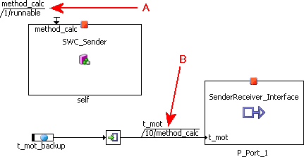

# Sender-Receiver Communication

Sender-receiver communication involves the transmission and reception of signals consisting of atomic data elements sent by one SWC and received by one or more SWC.

An SWC type can have multiple sender-receiver ports.

Each sender-receiver port can contain multiple data elements each of which can be sent and received independently. Data elements within the interface can be simple (integer, float, ...) or complex (array, record) types.

Sender-receiver communication is one-way; each reply by a receiver must be modeled as separate sender-receiver communication.

An Rport of an SWC that requires a sender-receiver interface can read the data elements of the interface. A Pport that provides the interface can write the data elements.

Sender-receiver communication can be 1:n (one sender, several receivers) or n:1 (several senders, one receiver). In the second case, no synchronization is imposed on the senders.

In ASCET, the SenderReceiver Interface and NVData Interface components are used to specify sender-receiver communication. These components are inserted into software components as SenderReceiver / NVData interface prototypes that can be used either as Pport or as Rport. They can be connected to appropriate diagram elements; the connections can be set up as implicit or explicit read/write. The following rules apply:

- Rports and Pports must be used in runnables or in methods called by runnables.

[Example: method called by runnable](javascript:kadovTextPopup(this))<!-- kadovTextPopupInit('a1'); //-->

- A direct connection between Rport and Pport cannot be explicit.
- Implicit read/write uses a buffer.
- Implicit read delivers a value (basic element) or a reference to the buffer (complex element).
- The result of an implicit write is available outside the runnable when the execution of the runnable is finished.
- Explicit read needs a data element.
- Explicit write transfers a value (basic element) or address (complex element). A data structure in the software component is required for the latter.
- The result of an explicit write is available outside the runnable as soon as the write process is done.

ASCET provides a built-in enumeration type Std_ReturnType that contains possible error codes. All enumeration values defined by the AUTOSAR standard are made known to each SWC and thus are valid to be used even if no element with such a type has been created. Enumeration types used in an SWC must not specify any (symbolic) value used already by Std_ReturnType.

See also

[Ports and Interfaces](markdown/ASCportsInterfaces.md)

[Basics - SenderReceiver and NVData Interfaces](SenderReceiverEditorEnglishUS.chm::/SREeditorOverview.htm)

[Specifying a SenderReceiver or NVData Interface Prototype](markdown/ASCspecifySRIprototype.md)

[Sending to a Port](markdown/ASCsendToPort.md)

[Receiving from a Port](markdown/ASCreceiveFromPort.md)

/* Heikki Komulainen, Comet Computer GmbH 2004 */ cc_plus_pic = '&nbsp;'; cc_minus_pic = '&nbsp;'; cc_stat_pic = '&nbsp;'; gpstyle = ''; var iframes_created = 0; if (document.body && document.body.insertAdjacentHTML && document.getElementsByTagName && document.getElementById) { collect_popups(); set_poplinks_pictures(); if (iframes_created) { document.write(gpstyle); document.write('
<nobr><a id="einauslink" style="position:absolute;top:expression(document.body.scrollTop + this.offsetHeight - this.offsetHeight);left:expression(document.body.offsetWidth - (this.offsetWidth + 28));background:white;padding:5px" href="javascript:show_all_poptext()">Alle texte einblenden</a></nobr>
'); } } function collect_popups() { bsscpopups = new Array(); for (x = 0; x < document.links.length; x++) { if (document.links[x].href.indexOf("BSSCPopup")>-1) { seekmatch = /BSSCPopup.'[^'](markdown/+)'/; poplink = seekmatch.exec(document.links[x].href); poplink = "" + poplink; poplink = poplink.substring(poplink.indexOf("'")+1, poplink.lastIndexOf("'")); ifid = "CCGENIFRAMEID" + x; new_iframe = '<iframe id="' + ifid + '"src="' + poplink + '" onload="get_text(\'' + ifid + '\')" width="0" height="0" frameborder=0></iframe>'; document.links[x].parentNode.insertAdjacentHTML("afterEnd", new_iframe); gpid = "CCID_" + ifid; document.links[x].href = "javascript:expand_poptext('" + gpid + "')"; cc_plus = '' + cc_plus_pic + ''; document.links[x].insertAdjacentHTML("afterBegin", cc_plus); iframes_created = 1; } } }// end function function get_text(ifr_id) { frpars = document.frames[ifr_id].document.getElementsByTagName("body"); popbody = frpars[0].innerHTML; gpid = "CCID_" + ifr_id; if (!document.getElementById(gpid)) { //avoiding doubles document.getElementById(ifr_id).insertAdjacentHTML("afterEnd", '
'+popbody+'
'); } }//end function function expand_poptext(x_frame_id) { if (!document.getElementById(x_frame_id)) return; if (document.getElementById(x_frame_id).className == "CCGENPOPTEXTH") { document.getElementById(x_frame_id).className = "CCGENPOPTEXTV"; document.getElementById(x_frame_id).style.visibility = "visible"; if (document.getElementById("CCPMB_" + x_frame_id )) { document.getElementById("CCPMB_" + x_frame_id ).innerHTML = cc_minus_pic; } } else { document.getElementById(x_frame_id).className = "CCGENPOPTEXTH"; document.getElementById(x_frame_id).style.visibility = "hidden"; if (document.getElementById("CCPMB_" + x_frame_id )) { document.getElementById("CCPMB_" + x_frame_id ).innerHTML = cc_plus_pic; } } }// end function function show_all_poptext() { var pulldowntxt = document.getElementsByTagName("div"); for (b = 0; b < pulldowntxt.length; b++) { if (pulldowntxt[b].className == "droptext") { pulldowntxt[b].style.display=""; } } var gptxt = document.getElementsByTagName("div"); for (z = 0; z < gptxt.length; z++) { if (gptxt[z].className == "CCGENPOPTEXTH") { gptxt[z].className = "CCGENPOPTEXTV"; gptxt[z].style.visibility = "visible"; if (document.getElementById("CCPMB_" + gptxt[z].id )) { document.getElementById("CCPMB_" + gptxt[z].id ).innerHTML = cc_minus_pic; } } } var dxpoplinks = document.getElementsByTagName("a"); if (dxpoplinks) { for (pxl = 0; pxl < dxpoplinks.length; pxl++) { if (dxpoplinks[pxl].href.indexOf("kadovTextPopup")>-1) { if (document.getElementById("CCPMB_" + dxpoplinks[pxl].id)) { document.getElementById("CCPMB_" + dxpoplinks[pxl].id).innerHTML = cc_stat_pic; dxpoplinks[pxl].symbol = "minus"; } } } } document.getElementById('einauslink').innerText = 'Alle texte ausblenden'; document.getElementById('einauslink').href = "javascript:self.location.reload()"; self.focus(); }// end function function eat_click() { return false; }// end function function set_poplinks_pictures() { var dpoplinks = document.getElementsByTagName("a"); if (dpoplinks) { for (pl = 0; pl < dpoplinks.length; pl++) { if (dpoplinks[pl].href.indexOf("kadovTextPopup")>-1) { cc_plus = '' + cc_stat_pic + ''; //dpoplinks[pl].onmouseup = plusminuspoplink; dpoplinks[pl].insertAdjacentHTML("afterBegin", cc_plus); dpoplinks[pl].symbol = "plus"; } } } }// end function function plusminuspoplink() { if (document.getElementById("CCPMB_" + this.id)) { if (this.symbol == "plus") { document.getElementById("CCPMB_" + this.id).innerHTML = cc_minus_pic; this.symbol = "minus"; } else { document.getElementById("CCPMB_" + this.id).innerHTML = cc_plus_pic; this.symbol = "plus"; } } return true; }

---

## Client-Server Communication

_Source: `markdown/ASCClientServerCommunication.md`_

# Client-Server Communication

Client-server communication involves a component invoking a defined “server” function in another component which may or may not return a reply.

A component type can define multiple ports categorized by client-server interfaces.

Each client-server interface can contain multiple operations, each of which can be invoked separately. An Rport of an SWC that requires an AUTOSAR client-server interface to the SWC can independently invoke any of the operations defined in the interface by making a client-server call to a Pport providing the service. A Pport that provides the client-service interface provides implementations of the operations.

Client-server communication can be n:1 (n > 0, multiple clients invoking the same server). It is not possible for a client to invoke multiple servers with a single request (i.e. 1:n communication). A client can, of course, call more than one server by making more than one request.

In ASCET, the ClientServer Interface component is used to specify client-server communication. These components are inserted into software components as ClientServer interface prototypes that can be used either as Pport or as Rport. They can be connected to appropriate diagram elements.

In ASCET, clients (Rports) can access servers (Pports) synchronously, which means that the client is blocked while the server processes the request. When the server has processed the request, the result is passed back to the client and the client continues the execution. The user has to ensure that the client is triggered by an RTE event.

See also

[Basics - ClientServer Interfaces](SenderReceiverEditorEnglishUS.chm::/SREBasicsClientServerInterfaces.htm)

[Specifying a ClientServer Interface Prototype](markdown/ASCspecifyClientServerInterfacePrototype.md)

[Enabling Concurrent Invocation of a Server Runnable](markdown/ASCenableConcurrentInvocation_ServerRunnable.md)

[Making a Client Request on a Port](markdown/ASCmakeClientRequest_on_Port.md)

---

## Calibration

_Source: `markdown/ASCcalibration.md`_

# Calibration

Calibration interfaces are used for communication with Calibration components.

Each calibration interface can contain multiple calibration parameters. A port of a software component that requires an AUTOSAR calibration interface to the component can independently access any of the parameters defined in the interface by making an RTE API to the required port. Calibration components provide the calibration interface and thus provide implementations of the calibration parameters.

In ASCET, the Calibration Interface component is used to specify communication with Calibration components. The Calibration interface components are inserted into SWC as Calibration interface prototypes. They can be connected to appropriate diagram elements (see [Accessing Calibration Parameters](markdown/ASCaccessCalibrationParameters.md)).

See also

[Basics - Calibration Interfaces](senderreceivereditorenglishus.chm::/SREBasicsCalibrationInterfaces.htm)

[Accessing Calibration Parameters](markdown/ASCaccessCalibrationParameters.md)

[Specifying a Calibration Interface Prototype](markdown/ASCspecifyCalibrationInterfacePrototype.md)

---

## Runnable Entities and Events

_Source: `markdown/ASCRunnableEntity.md`_

# Runnable Entities and Events

A runnable entity, or runnable, is a piece of code in a software component that is triggered by the runtime environment or RTE (see the ASCET AUTOSAR User's Guide or the publications at [http://www.autosar.org](http://www.autosar.org) for details) at runtime. It corresponds largely to the processes known in ASCET.

A software component comprises one or more runnable entities, and each runnable entity must have a unique handle so that the RTE can access it at runtime. Runnable entities can be triggered by events of various types. ASCET supports the following events:

- TIMING-EVENT – these events activate a runnable entity periodically. The timing event allows you to execute a runnable entity to poll an Rport to check if data has been received, periodically call a server (i.e. be a client), periodically send data on a Pport or simply to execute some internal software component functionality. Runnable entities that are activated in response to a timing event are said to be time-triggered.
- MODE-SWITCH-EVENT - these events activate a runnable entity on either entry to, or exit from a mode.
- OPERATION-INVOKED-EVENT – these events activate a runnable entity to handle a server call for an operation on a Pport characterized by a ClientServer interface.

AUTOSAR runnable entities can be sorted in several categories. ASCET supports runnable entities of category 1.

The name given to a runnable entity at its creation in ASCET denotes the name of the runnable entity in the XML namespace, but it does not tell the RTE what the associated function body you will provide in your code is called. This information is provided in the Symbol field of the runnable's implementation editor. The value entered there must be a valid C identifier; it is the C function name used by the generated C code.

In order to be executed, runnable entities must be assigned to the tasks of an AUTOSAR operating system. However, this is not part of ASCET.

ASCET allows the configuration of interrunnable variables that provide a way for the runnable entities of a software component to communicate with each other. These interrunnable variables can be measured during an experiment.

See also

[Creating a Runnable](markdown/ASCcreateRunnable.md)

[Specifying Events](markdown/ASCSpecifyingEvents.md)

[Modes and Mode Groups](SenderReceiverEditorEnglishUS.chm::/SREmodesModeGroups.htm)

[Interrunnable Variables](markdown/ASC_InterrunnableVariables.md)

---

## Exclusive Areas

_Source: `markdown/ASCexclusiveAreas.md`_

# Exclusive Areas

Software components that need to provide mutual exclusion over data shared by two (or more) of their runnable entities do so by configuring exclusive areas. The RTE generator uses exclusive area configuration to create operating system configuration files and to optimize exclusive areas. For example, if the only components that access a region are mapped to the same task then the entire region can be elided.

ASCET automatically creates an exclusive area in a software component, which is always called ASCET_exclusive_area. The user can additionally create exclusive areas by means of ASCET resources (see [Creating an Exclusive Area](markdown/ASCcreateExclusiveArea.md)). ASCET defines exclusive areas with explicit access (access macros [RTE_Enter and RTE_Exit](markdown/ASCrteEnterRTEExit.md)). Explicit access is similar to a standard resource in OSEK OS.

The scope of any user-defined exclusive areas is the software component instance. It is not possible to define exclusive areas that cross software component boundaries.

Each runnable can declare if it uses one of the named exclusive areas. There are two alternative ways to use exclusive areas in ASCET:

1. Modeling with ASCET messages and use the exclusive area ASCET_exclusive_area.
1. Assigning sequences of a runnable entity in a user-defined exclusive area.

See also

[Creating an Exclusive Area](markdown/ASCcreateExclusiveArea.md)

[Using Exclusive Areas](markdown/ASCusingExclusiveAreas.md)

[RTE_Enter and RTE_Exit](markdown/ASCrteEnterRTEExit.md)

[Introduction - Resources](IntroductionEnglishUS.chm::/INT_resources.htm)

---

## Interrunnable Variables

_Source: `markdown/ASC_InterrunnableVariables.md`_

# Interrunnable Variables

AUTOSAR allows the configuration of interrunnable variables that provide a way for runnable entities of one SWC to communicate between themselves.

While inter-runnable communication is possible through user code and shared variable access (protected by [exclusive areas](markdown/ASCexclusiveAreas.md)), this can be inefficient when handling primitive data types since the exclusive area API calls are typically mapped onto the underlying Operating System’s resource control mechanism.

Interrunnable variables can be used as lightweight mechanisms for inter-runnable communication. They can be of scalar (i.e. cont, limitInt, wrapInt, sdisc, udisc, log), enum, composite (i.e. array) or complex (i.e. record) type. The main purpose of complex interrunnable variables is to guarantee data consistency over the values grouped in the record.

Interrunnable variables are declared by the RTE; they use similar communication mechanisms as sender-receiver communication, i.e. implicit and explicit (only scalar and composite interrunnable variables) communication. Depending on the communication mode, interrunnable variables are displayed as shown in the table.

<table style="x-cell-content-align: Top;
				margin-top: 3px;
				border-left-style: Outset;
				border-top-style: Outset;
				border-right-style: Outset;
				border-bottom-style: Outset;
				border-left-width: 1px;
				border-right-width: 1px;
				border-top-width: 1px;
				border-bottom-width: 1px;" x-use-null-cells="">
<col/>
<col/>
<col/>
<col/>
<tr class="hcp1" valign="top">
<td class="hcp2">

communication mode
</td>
<td class="hcp2">

type
</td>
<td class="hcp2">

in Outline tab
</td>
<td class="hcp2">

in drawing area
</td></tr>
<tr class="hcp1" valign="top">
<td class="hcp2" colspan="1" rowspan="2">

Explicit
</td>
<td class="hcp2">

Scalar
</td>
<td class="hcp2">

</td>
<td class="hcp2">

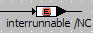
</td></tr>
<tr class="hcp1" valign="top">
<td class="hcp2">

Array
</td>
<td class="hcp2">

</td>
<td class="hcp2">

</td></tr>
<tr class="hcp1" valign="top">
<td class="hcp2" colspan="1" rowspan="3">

Implicit
</td>
<td class="hcp2">

Scalar
</td>
<td class="hcp2">

</td>
<td class="hcp2">

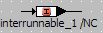
</td></tr>
<tr class="hcp1" valign="top">
<td class="hcp2">

Array
</td>
<td class="hcp2">

</td>
<td class="hcp2">

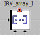
</td></tr>
<tr class="hcp1" valign="top">
<td class="hcp2">

Record
</td>
<td class="hcp2">

</td>
<td class="hcp2">

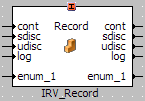
</td></tr>
</table>

Rules for non-scalar interrunnable variables:

- Composite interrunnable variables must be of [array](IntroductionEnglishUS.chm::/INT_Array.htm) type.

They can have implicit or explicit behavior (see also [Rte_IrvIRead and Rte_IrvIWrite](markdown/asc_rte_irviread_rte_irviwrite.md) and [Rte_IrvRead and Rte_IrvWrite](markdown/asc_rteirv_read_rte_irvwrite.md)).

- Complex interrunnable variables must be of [record](RecordsEnglishUS.chm::/RC_overview.htm) type.

They must have implicit behavior (see also [Rte_IrvIRead and Rte_IrvIWrite](markdown/asc_rte_irviread_rte_irviwrite.md)).

- Complex interrunnable variables can only be used with AUTOSAR R4.0.2 or higher. With older AUTOSAR versions, an error (MMdl650) is issued during code generation.
- Records used as complex interrunnable variables must not contain or matrices, or other records that contain matrices. If a record used as interrunnable variable contains a matrix, an error (MMdl651) is issued during code generation.

See also

[Creating a Scalar Interrunnable Variable](markdown/asc_createinterrunnablevariable.md)

[C](markdown/RCE_CreateInterrunnableVariable_Record.md)reating an Interrunnable Variable of Non-Scalar Type

[R](markdown/asc_rte_irviread_rte_irviwrite.md)te_IrvIRead and Rte_IrvIWrite

[Rte_IrvRead and Rte_IrvWrite](markdown/asc_rteirv_read_rte_irvwrite.md)

[Exclusive Areas](markdown/ASCexclusiveAreas.md)

[Sender-Receiver Communication](markdown/ASCsenderReceiverCommunication.md)

[Runnable Entities and Events](markdown/ASCRunnableEntity.md)

[Records - Overview](RecordsEnglishUS.chm::/RC_overview.htm)

---

## Message Mapping

_Source: `markdown/ASC_MessageMapping.md`_

| Column 1 | Column 2 |
| --- | --- |
| message type | AUTOSAR element type |
| Continuous (cont) | cont / limitInt / wrapInt / sdisc / udisc |
| Limited Integer (limitInt) | limitInt / wrapInt |
| Wrap-Around Integer (wrapInt) | wrapInt |
| Signed Discrete (sdisc) | cont / limitInt / wrapInt / sdisc / udisc |
| Unsigned Discrete (udisc) | cont / limitInt / wrapInt / sdisc / udisc |
| Logic (log) | log |
| Enumeration (enum) | Enumeration of the same type |

# Message Mapping

AUTOSAR does not know the concept of ASCET messages. In case an ASCET module containing ASCET messages is used within an AUTOSAR software component, all messages must be mapped to semantically equivalent AUTOSAR elements.

For this purpose, ASCET provides a special editor in the Message Mapping view of the software component editor.

In that editor, messages can be mapped to AUTOSAR elements according to the following rules:

- Messages can be mapped as shown in the following table. internal mapping external mapping scalar messages to scalar interrunnable variables to scalar elements of SenderReceiver or NVData interfaces to scalar elements of complex interrunnable variables (records) to scalar elements of complex elements (records) in SenderReceiver or NVData interfaces composite messages (arrays) to composite interrunnable variables (arrays) to composite elements (arrays) of SenderReceiver or NVData interfaces to composite elements of complex interrunnable variables (records) to composite elements of complex elements (records) in SenderReceiver or NVData interfaces complex messages (records) to complex interrunnable variables (records) to complex elements (records) in SenderReceiver or NVData interfaces
- Scalar and composite elements of nested records (record A contains record B, which contains record C, etc.) used as SenderReceiver/NVData interface elements or interrunnable variables are available for message mapping.

Recursively nested records (record A contains record B, which contains record A) are forbidden; using them leads to a code generation error (EMake10).

- Complex elements of nested records (record A contains record B, which contains record C, etc.) used as SenderReceiver/NVData interface elements or interrunnable variables are not available for message mapping.
- A scalar message must be mapped to a scalar element of [compatible type](javascript:kadovTextPopup(this))<!-- kadovTextPopupInit('a1'); //-->.

If you map a scalar message to an element of compatible, but non-identical type, a warning (WMdl635) is issued during code generation.

If you map a scalar message to an element of incompatible type, an error (MMdl635) is issued during code generation.

- A composite message (array) must be mapped to an array of identical size, data type and implementation.

Otherwise, the mapping is indicated as invalid, and an error (MMdl635) is issued during code generation.

- A complex message must be mapped to a record of identical type and implementation.
- Redundant data storage must not be activated for mapped messages.

If it is, the following error (MMdl37) is issued during code generation:

redundant data flag is set for <message>, but redundant data and mapped messages cannot be combined.

- A pure send message can only be mapped to one or more elements of SenderReceiver interfaces used as Pport (external mapping), since the message value is not used within the SWC and thus provided to be used by another SWC.

A pure send message is a send message that appears in only one module of the software component, i.e. it is not received by another module. Its Get method is not activated.

- A send message with activated Get method can be mapped to one interrunnable variable (internal mapping) and/or one or more elements of SenderReceiver interfaces used as Pport (external mapping).
- A pure receive message can only be mapped to an element of an NVData interface or a SenderReceiver interface used as Rport (external mapping), since the message value is not given within the SWC and must therefore be given by another SWC. Internal mapping is not provided for pure receive messages.

A pure receive message is a receive message that is not used as send message within the modules of the SWC. Its Set method is not activated.

- A receive message with activated Set method can be mapped to one interrunnable variable (internal mapping) and/or one element of an NVData interface or a SenderReceiver interface used as Rport (external mapping).

If you map such a message to an element of a Pport, an error (MMdl271) is issued during code generation:

Invalid external access mapping for element "<message>" in "<component>" - mapping to elements of require port supported only

- All other messages, i.e. SendReceive messages and messages specified as send message in one module and as receive message in another module, can be mapped to an interrunnable variable (internal mapping) or to an element of a SenderReceiver interface used as Pport (external mapping).

If you map a SendReceive message with activated Get and/or Set method to an element of an Rport, an error (MMdl271) is issued during code generation.

- Pure receive messages can have one external mapping. Pure send messages and other messages can have multiple external mappings.

- Pure send messages and pure receive messages cannot have an internal mapping. Other messages can have one internal mapping.
- Imported messages must have only one internal mapping. If you apply an external mapping, too, an error (MMdl274) is issued during code generation.

Internal mapping is indicated as complete if each mappable message is mapped. External mapping is indicated as complete if each mappable message is mapped once. However, you can still map messages that allow multiple mapping.

To ease reuse of ASCET modules in SWC, it is possible to export mappings from one SWC and import them into another SWC. You can export mappings either in an XML format or as a list of comma-separated values (*.csv). In both cases, the following information is stored for each mapping:

mapping location, message name, AUTOSAR element name

In addition, the XML export file contains further details on message and AUTOSAR element.

Both valid and invalid mappings are exported; incomplete mappings are not exported. Examples for both export formats are given in [Example: Mapping Export Files](markdown/ASCexampleMappingExportFiles.md).

You can

[Access ASCET messages](markdown/asc_accessmessages.md)

[Export message/parameter mappings](markdown/ASC_ExportMessageParameterMappings.md)

[Import message/parameter mappings](markdown/ASC_ImportMessageParameterMappings.md)

See also

[Example: Mapping Export Files](markdown/ASCexampleMappingExportFiles.md)

[Introduction - Messages](IntroductionEnglishUS.chm::/INT_messages.htm)

[Message Mapping View](markdown/ASC_MessageMappingView.md)

[Ports and Interfaces](markdown/ASCportsInterfaces.md)

/* Heikki Komulainen, Comet Computer GmbH 2004 */ cc_plus_pic = '&nbsp;'; cc_minus_pic = '&nbsp;'; cc_stat_pic = '&nbsp;'; gpstyle = ''; var iframes_created = 0; if (document.body && document.body.insertAdjacentHTML && document.getElementsByTagName && document.getElementById) { collect_popups(); set_poplinks_pictures(); if (iframes_created) { document.write(gpstyle); document.write('
<nobr><a id="einauslink" style="position:absolute;top:expression(document.body.scrollTop + this.offsetHeight - this.offsetHeight);left:expression(document.body.offsetWidth - (this.offsetWidth + 28));background:white;padding:5px" href="javascript:show_all_poptext()">Show all hidden text</a></nobr>
'); } } function collect_popups() { bsscpopups = new Array(); for (x = 0; x < document.links.length; x++) { if (document.links[x].href.indexOf("BSSCPopup")>-1) { seekmatch = /BSSCPopup.'[^'](markdown/+)'/; poplink = seekmatch.exec(document.links[x].href); poplink = "" + poplink; poplink = poplink.substring(poplink.indexOf("'")+1, poplink.lastIndexOf("'")); ifid = "CCGENIFRAMEID" + x; new_iframe = '<iframe id="' + ifid + '"src="' + poplink + '" onload="get_text(\'' + ifid + '\')" width="0" height="0" frameborder=0></iframe>'; document.links[x].parentNode.insertAdjacentHTML("afterEnd", new_iframe); gpid = "CCID_" + ifid; document.links[x].href = "javascript:expand_poptext('" + gpid + "')"; cc_plus = '' + cc_plus_pic + ''; document.links[x].insertAdjacentHTML("afterBegin", cc_plus); iframes_created = 1; } } }// end function function get_text(ifr_id) { frpars = document.frames[ifr_id].document.getElementsByTagName("body"); popbody = frpars[0].innerHTML; gpid = "CCID_" + ifr_id; if (!document.getElementById(gpid)) { //avoiding doubles document.getElementById(ifr_id).insertAdjacentHTML("afterEnd", '
'+popbody+'
'); } }//end function function expand_poptext(x_frame_id) { if (!document.getElementById(x_frame_id)) return; if (document.getElementById(x_frame_id).className == "CCGENPOPTEXTH") { document.getElementById(x_frame_id).className = "CCGENPOPTEXTV"; document.getElementById(x_frame_id).style.visibility = "visible"; if (document.getElementById("CCPMB_" + x_frame_id )) { document.getElementById("CCPMB_" + x_frame_id ).innerHTML = cc_minus_pic; } } else { document.getElementById(x_frame_id).className = "CCGENPOPTEXTH"; document.getElementById(x_frame_id).style.visibility = "hidden"; if (document.getElementById("CCPMB_" + x_frame_id )) { document.getElementById("CCPMB_" + x_frame_id ).innerHTML = cc_plus_pic; } } }// end function function show_all_poptext() { var pulldowntxt = document.getElementsByTagName("div"); for (b = 0; b < pulldowntxt.length; b++) { if (pulldowntxt[b].className == "droptext") { pulldowntxt[b].style.display=""; } } var gptxt = document.getElementsByTagName("div"); for (z = 0; z < gptxt.length; z++) { if (gptxt[z].className == "CCGENPOPTEXTH") { gptxt[z].className = "CCGENPOPTEXTV"; gptxt[z].style.visibility = "visible"; if (document.getElementById("CCPMB_" + gptxt[z].id )) { document.getElementById("CCPMB_" + gptxt[z].id ).innerHTML = cc_minus_pic; } } } var dxpoplinks = document.getElementsByTagName("a"); if (dxpoplinks) { for (pxl = 0; pxl < dxpoplinks.length; pxl++) { if (dxpoplinks[pxl].href.indexOf("kadovTextPopup")>-1) { if (document.getElementById("CCPMB_" + dxpoplinks[pxl].id)) { document.getElementById("CCPMB_" + dxpoplinks[pxl].id).innerHTML = cc_stat_pic; dxpoplinks[pxl].symbol = "minus"; } } } } document.getElementById('einauslink').innerText = 'Hide all hideable text'; document.getElementById('einauslink').href = "javascript:self.location.reload()"; self.focus(); }// end function function eat_click() { return false; }// end function function set_poplinks_pictures() { var dpoplinks = document.getElementsByTagName("a"); if (dpoplinks) { for (pl = 0; pl < dpoplinks.length; pl++) { if (dpoplinks[pl].href.indexOf("kadovTextPopup")>-1) { cc_plus = '' + cc_stat_pic + ''; //dpoplinks[pl].onmouseup = plusminuspoplink; dpoplinks[pl].insertAdjacentHTML("afterBegin", cc_plus); dpoplinks[pl].symbol = "plus"; } } } }// end function function plusminuspoplink() { if (document.getElementById("CCPMB_" + this.id)) { if (this.symbol == "plus") { document.getElementById("CCPMB_" + this.id).innerHTML = cc_minus_pic; this.symbol = "minus"; } else { document.getElementById("CCPMB_" + this.id).innerHTML = cc_plus_pic; this.symbol = "plus"; } } return true; }

---

## Expressions

_Source: `markdown/ascexpressions.md`_

# Expressions

Expressions are formed in software components by connecting elements or other expressions with operators. Like in ESDL, expressions are built up recursively, as follows:

- An element is an expression.
- The result of an operator is an expression (the operands itself are expressions).
- The return value of a method call is an expression. If arguments are supplied to the method, these arguments also belong to the expression.

The range of an expression is therefore limited by the base expressions in that expression, which are either elements or return values of methods without arguments.

Expressions are built graphically by connecting the return pins of elements or operators with the argument pins of methods or other operators.

There are no precedence rules for operators in the software component editor, since the expressions are “bracketed” by the way the lines and operators are connected. The following example shows the difference between the expressions (a*b)+c and a*(b+c) in the graphical representation.

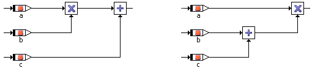

The evaluation order of the arguments of operators is sometimes very important. In the graphical representation this sequence is always from top to bottom, except for the four basic arithmetic operators with at most three inputs. The order of evaluation is illustrated in the following diagram:

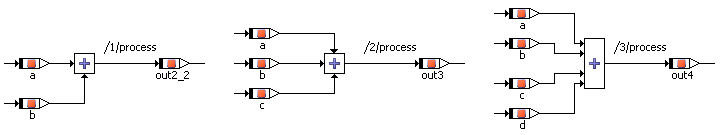

In software components, the number of arguments to the operators is often limited to a maximum of 10 or 20 inputs. The evaluation order of method arguments depends on the order in which they are defined. Since the layout of an element can be changed, the order in the layout must not coincide with that in the definition.

---

## Statements

_Source: `markdown/ascstatements.md`_

# Statements

Graphical specifications of software components can be hierarchically distributed over several diagrams. In a diagram, one or more runnables or methods can be described which can be executed independently of each other. The order in which calculations are executed, as well as the particular runnable or method a calculation belongs to is determined by sequence calls.

For each statement of an SWC, there is a sequence call that assigns it to a runnable or method. The order within a particular runnable is determined by the sequence number that is part of the sequence call. Sequence calls are represented graphically as follows:

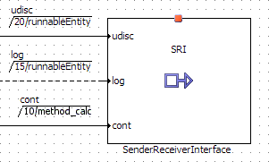 (10, 15, 20 being the sequence numbers)

With the sequence numbers, the order of the operations belonging to one runnable or method can be determined by the user. A built-in sequencing algorithm can be used to assign sequence numbers that correspond to the evaluation order of standard block diagrams.

A sequence call generally consists of three fields:

- The name of the method called.
- The sequence number determining the position of the called method in the calling method or process.

- The name of the method or process calling.

In the case of scalar elements, the name of the method called is left blank as this is always the assignment of a new value.

There are three kinds of statements:

- Assignment statements
- Method calls
- [Control Flow Statements](markdown/ASCcontrolFlowOperators.md), e.g. if…then…else, while

See also

[Sequence Calls](markdown/ascsequencecalls.md)

[Control Flow Operators](markdown/ASCcontrolFlowOperators.md)

[Method Call and Assignment](markdown/ascassignment.md)

---

## Method Call and Assignment

_Source: `markdown/ascassignment.md`_

# Method Call and Assignment

An assignment statement is the assignment of the value of an expression to an element. In case of an assignment to a complex element, only an element of the same type can be assigned. The assignment is then not the assignment of a value but of a reference.

A special case is that of assigning a value to the return value of a method. The associated sequence call must be the last sequence call of that method.

An assignment is a special case of a method call. When calling a method in an SWC, the corresponding sequence call has to be filled in properly and the arguments to the method have to be supplied.

See also

[Statements](markdown/ascstatements.md)

[Sequence Calls](markdown/ascsequencecalls.md)

---

## RTE Access Macros

_Source: `markdown/ASCrteAccessMacros.md`_

# RTE Access Macros

The runtime environment or RTE specifies access macros for each communication mechanism.

- [Rte_IRead](markdown/ASCrteIRead.md)
- [Rte_IWrite](markdown/ASCrteIWrite.md)
- [Rte_IWriteRef](markdown/ASCrteIWriteRef.md)
- [Rte_Read](markdown/ASCrteRead.md)
- [Rte_Write](markdown/ASCrteWrite.md)
- [RTE_DRead](markdown/asc_rtedread.md)
- [Rte_IrvIRead and Rte_IrvIWrite](markdown/asc_rte_irviread_rte_irviwrite.md)
- [Rte_IrvRead and Rte_IrvWrite](markdown/asc_rteirv_read_rte_irvwrite.md)
- [Rte_Mode](markdown/ASCrteMode.md)
- [Rte_Enter and Rte_Exit](markdown/ASCrteEnterRTEExit.md)
- [Rte_Call](markdown/ASCrteCall.md)
- [Rte_Calprm](markdown/ASCrteCalprm.md)

The AUTOSAR RTE specification contains a list of error codes that can be returned by RTE access macros. These error codes can be accessed in the model via the RTE Status element in the Basic Blocks palette or toolbar.

ASCET provides a built-in enumeration type Std_ReturnType that contains possible error codes. All enumeration values defined by the AUTOSAR standard are made known to each SWC and thus are valid to be used even if no element with such a type has been created. Enumeration types used in an SWC must not specify any (symbolic) value used already by Std_ReturnType.

<table style="x-cell-content-align: Top;
				margin-top: 3px;
				border-left-style: Outset;
				border-top-style: Outset;
				border-right-style: Outset;
				border-bottom-style: Outset;
				border-left-width: 1px;
				border-right-width: 1px;
				border-top-width: 1px;
				border-bottom-width: 1px;" x-use-null-cells="">
<col/>
<col/>
<col/>
<tr class="hcp1" valign="top">
<td class="hcp2">

<a name="ErrorCode">Error code</a>
</td>
<th colspan="2" rowspan="1" style="padding-top: 2px;
			padding-bottom: 2px;
			border-left-style: Inset;
			border-top-style: Inset;
			border-right-style: Inset;
			border-bottom-style: Inset;
			padding-left: 2px;
			padding-right: 2px;
			border-left-width: 1px;
			border-top-width: 1px;
			border-right-width: 1px;
			border-bottom-width: 1px;">

Available in AUTOSAR Release
</th>
</tr>
<tr class="hcp1" valign="top">
<td class="hcp2">

 
</td>
<td class="hcp2" colspan="1" rowspan="1">

R3.*
</td>
<td class="hcp2">

R4.0.*
</td></tr>
<tr class="hcp1" valign="top">
<td class="hcp2">

RTE_E_COM_STOPPED
</td>
<td class="hcp2" colspan="1" rowspan="1">

x
</td>
<td class="hcp2">

x
</td></tr>
<tr class="hcp1" valign="top">
<td class="hcp2">

RTE_E_COMMS_ERROR
</td>
<td class="hcp2" colspan="1" rowspan="1">

 
</td>
<td class="hcp2">

 
</td></tr>
<tr class="hcp1" valign="top">
<td class="hcp2">

RTE_E_LIMIT
</td>
<td class="hcp2" colspan="1" rowspan="1">

x
</td>
<td class="hcp2">

x
</td></tr>
<tr class="hcp1" valign="top">
<td class="hcp2">

RTE_E_LOST_DATA
</td>
<td class="hcp2" colspan="1" rowspan="1">

x
</td>
<td class="hcp2">

x
</td></tr>
<tr class="hcp1" valign="top">
<td class="hcp2" colspan="1" rowspan="1">

RTE_E_MAXAGE_EXCEEDED
</td>
<td class="hcp2" colspan="1" rowspan="1">

x
</td>
<td class="hcp2" colspan="1" rowspan="1">

x
</td></tr>
<tr class="hcp1" valign="top">
<td class="hcp2">

RTE_E_NO_DATA
</td>
<td class="hcp2" colspan="1" rowspan="1">

x
</td>
<td class="hcp2">

x
</td></tr>
<tr class="hcp1" valign="top">
<td class="hcp2">

RTE_E_OK
</td>
<td class="hcp2" colspan="1" rowspan="1">

x
</td>
<td class="hcp2">

x
</td></tr>
<tr class="hcp1" valign="top">
<td class="hcp2">

RTE_E_TIMEOUT
</td>
<td class="hcp2" colspan="1" rowspan="1">

x
</td>
<td class="hcp2">

x
</td></tr>
<tr class="hcp1" valign="top">
<td class="hcp2" colspan="1" rowspan="1">

RTE_E_TRANSMIT_ACK
</td>
<td class="hcp2" colspan="1" rowspan="1">

x
</td>
<td class="hcp2" colspan="1" rowspan="1">

x
</td></tr>
</table>

---

## Rte_IRead

_Source: `markdown/ASCrteIRead.md`_

# Rte_IRead

Rte_IRead implements implicit data read access on a data element prototype of an Rport of a SenderReceiver or NVData interface.

Implicit data read access of a runnable entity means that at the beginning of the runnable entity the RTE copies the value of the 'master data element' to a dedicated buffer for that runnable. The content of the buffer will remain unchanged until termination of the runnable. All Rte_IRead calls in the runnable entity return the content of this buffer.

In the software component editor, implicit read access can be specified as follows:

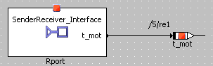

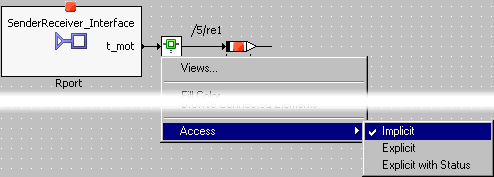

See also

[Receiving from a Port](markdown/ASCreceiveFromPort.md)

---

## Rte_IWrite

_Source: `markdown/ASCrteIWrite.md`_

# Rte_IWrite

Rte_IWrite implements implicit data write access on a data element prototype of an Pport of a SenderReceiver or NVData interface.

Implicit data write access of a runnable entity means that all Rte_IWrite calls in the runnable entity modify the content of a dedicated buffer for the respective data element for the respective runnable entity. At the end of the runnable entity, the RTE copies the value of this buffer to the 'master message'. If Rte_IWrite is called more than once during the runnable entity, only the values of the last call are copied to the 'master message'.

In the software component editor, implicit write access can be specified as follows:

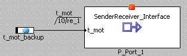

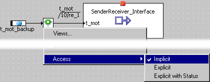

See also

[Rte_IWriteRef](markdown/ASCrteIWriteRef.md)

[Sending to a Port](markdown/ASCsendToPort.md)

---

## Rte_IWriteRef

_Source: `markdown/ASCrteIWriteRef.md`_

# Rte_IWriteRef

Rte_IWriteRef implements implicit data write access, too (see [RTE_IWrite](markdown/ASCrteIWrite.md)). In contrast to Rte_IWrite, which copies the value of its IN parameter to the RTE buffer of the respective Pport, Rte_IWriteRef returns a pointer to the respective data element in the RTE buffer of the Pport, which allows to manipulate the buffer directly.

In the software component editor, Rte_IWriteRef can be specified as follows:

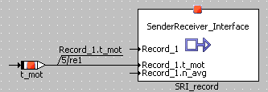

SRI_record is a SenderReceiver interface that contains a record; one of the record elements is accessed.

See also

[Rte_IWrite](markdown/ASCrteIWrite.md)

[Sending to a Port](markdown/ASCsendToPort.md)

---

## Rte_Read

_Source: `markdown/ASCrteRead.md`_

# Rte_Read

Rte_Read implements explicit data read access on a data element prototype of an Rport of a SenderReceiver or NVData interface. The return value of Rte_Read represents the status of the operation, whereas the value of the read element is assigned to a variable passed as argument with direction out to Rte_Read.

Explicit data read access of a runnable entity means that the current value of the data element is read from the RTE. Subsequent explicit read access operations within the same runnable entity may result in different values of the data element.

In the software component editor, explicit read access can be specified as follows:

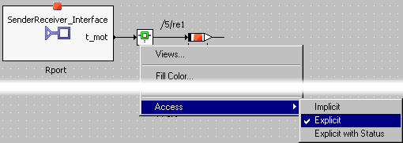

With Explicit access, the return value of Rte_Read is assigned to a temporary variable.

You can also select Explicit with Status. In that case, the return value is assigned to a special runnable-local variable named _ASCET_RteStatus. This variable must be assigned to a model variable, see [Receiving from a Port - Explicit with Status](markdown/ASCreceiveFromPort.md#ExplicitStatus).

Rte_Read is non-blocking even if no data is present to be read. If no data is present, the return value from the call is RTE_E_NO_DATA.

See also

[Receiving from a Port](markdown/ASCreceiveFromPort.md)

---

## Rte_Write

_Source: `markdown/ASCrteWrite.md`_

# Rte_Write

Rte_Write implements explicit data write access on a data element prototype of an Rport of a SenderReceiver or NVData interface.

Explicit data write access of a runnable entity means that the value of the data element is published immediately; (other) runnable entities can access the new value when they read the data element afterwards. Subsequent explicit write operations change the value of the data element.

In the software component editor, explicit write access can be specified as follows:

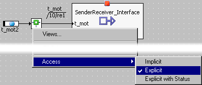

With Explicit access, the return value of Rte_Write is assigned to a temporary variable.

You can also select Explicit with Status. In that case, the return value is assigned to a special runnable-local variable named _ASCET_RteStatus. This variable must be assigned to a model variable, see [Sending to a Port - Explicit with Status](markdown/ASCsendToPort.md#ExplicitStatus).

See also

[Sending to a Port](markdown/ASCsendToPort.md)

---

## Rte_DRead

_Source: `markdown/asc_rtedread.md`_

# Rte_DRead

For explicit read without status, AUTOSAR R4 provides another macro, Rte_DRead.

Rte_DRead implements explicit data read access on a primitive (cont, limitInt, wrapInt, sdisc, udisc, log, enum) data element prototype of an Rport of a SenderReceiver or NVData interface. The return value of Rte_DRead represents the status of the operation, whereas the value of the read element is assigned to a variable passed as argument with direction out to Rte_DRead.

In the software component editor, explicit read access can be specified as follows:

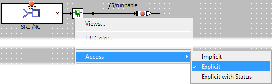

Rte_DRead is non-blocking even if no data is present to be read. If no data is present, the return value from the call is RTE_E_NO_DATA.

See also

[Receiving from a Port](markdown/ASCreceiveFromPort.md)

---

## Rte_IrvIRead and Rte_IrvIWrite

_Source: `markdown/asc_rte_irviread_rte_irviwrite.md`_

# Rte_IrvIRead and Rte_IrvIWrite

##### Rte_IrvIRead

Rte_IrvIRead implements implicit data read access on an interrunnable variable.

For scalar interrunnable variables, implicit data read access of a runnable entity means that at the beginning of the runnable entity the RTE copies the value of the 'master interrunnable variable' to a dedicated buffer for that runnable. The content of the buffer will remain unchanged until termination of the runnable. All IrvIRead calls in the runnable entity return the content of this buffer.

For complex interrunnable variables (i.e. interrunnable variables of record type), implicit data read access returns a "non-modifiable pointer" to the record from which the values of the fields can be read.

##### Rte_IrvIWrite

Rte_IrvIWrite implements implicit data write access on an interrunnable variable.

For scalar interrunnable variables, implicit data write access of a runnable entity means that all Rte_IrvIWrite calls in the runnable entity modify the content of a dedicated buffer for the respective interrunnable variable for the respective runnable entity. At the end of the runnable entity, the RTE copies the value of this buffer to the 'master interrunnable variable'. If Rte_IrvIWrite is called more than once during the runnable entity, only the values of the last call are copied to the 'master interrunnable variable'.

For complex interrunnable variables, implicit data write access means the following:

- For each runnable with write access to a complex interrunnable variable, an additional runnable-specific instance of the record type is provided.
- At the beginning of the runnable, this runnable-specific instance is filled with the current values, i.e. Rte_IrvIRead is issued and the values of all fields are transferred to the runnable-specific instance.
- All write (and additional read) accesses during the execution of the runnable access the runnable-specific instance.
- At the end of the runnable execution, the runnable-specific instance is written using the Rte_IrvIWrite macro.

This guarantees data consistency over the values of a record, since the record is written only once, prior to exiting the runnable.

In the software component editor, implicit read /write access to an interrunnable variable access is specified as follows:

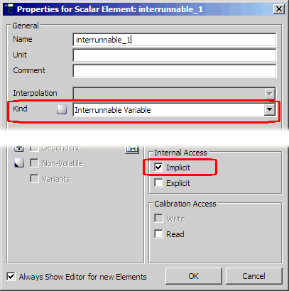 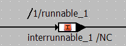

See also

[Interrunnable Variables](markdown/ASC_InterrunnableVariables.md)

---

## Rte_IrvRead and Rte_IrvWrite

_Source: `markdown/asc_rteirv_read_rte_irvwrite.md`_

# Rte_IrvRead and Rte_IrvWrite

ASCET supports explicit access only for scalar interrunnable variables. Complex interrunnable variables always use implicit access.

##### Rte_IrvRead

Rte_IrvRead implements explicit data read access on an interrunnable variable.

Explicit data read access of a runnable entity means that the current value of the data element is read from the RTE. Subsequent explicit read access operations within the same runnable entity may result in different values of the data element.

##### Rte_IrvWrite

Rte_IrvWrite implements explicit data write access to an interrunnable variable.

Explicit data write access of a runnable entity means that the value of the scalar interrunnable variable is published immediately; (other) runnable entities can access the new value when they read the interrunnable variable afterwards. Subsequent explicit write operations change the value of the interrunnable variable.

In the software component editor, implicit read /write access to a scalar interrunnable variable access is specified as follows:

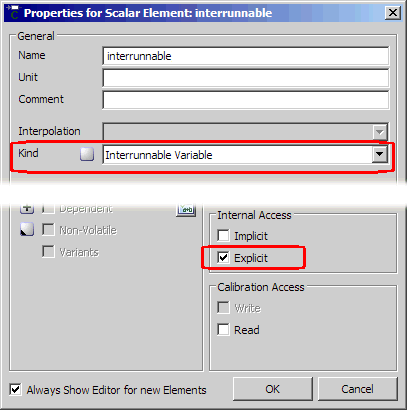 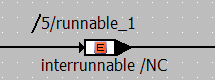

See also

[Interrunnable Variables](markdown/ASC_InterrunnableVariables.md)

---

## Rte_Mode

_Source: `markdown/ASCrteMode.md`_

# RTE_Mode

RTE_Mode implements explicit data write access on a data element prototype of an Rport of a SenderReceiver interface.

AUTOSAR provides a mode concept:

1. Entry into or exit from a mode can trigger the execution of a runnable entity.
1. Runnable entities can be generally disabled for certain modes, i.e. the defined trigger events for the runnable entity do not cause its execution if the RTE is in the respective mode (see [Setting Up an Event](markdown/ASCsetUpEvent.md)).

Precondition for using this mechanisms is the presence of an Rport of a SenderReceiver interface containing a mode group (see [Modes and Mode Groups](SenderReceiverEditorEnglishUS.chm::/SREmodesModeGroups.htm)). The current mode of the RTE can be explicitly queried by a software component by reading this mode group.

The main use case of mode groups in software components is the specification of ModeSwitch events (see [Enabling/Disabling Modes](markdown/ASCenableDisableModes.md)).

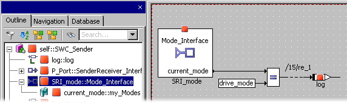

See also

[Modes and Mode Groups](SenderReceiverEditorEnglishUS.chm::/SREmodesModeGroups.htm)

[Setting Up an Event](markdown/ASCsetUpEvent.md)

---

## Rte_Enter and Rte_Exit

_Source: `markdown/ASCrteEnterRTEExit.md`_

# Rte_Enter and Rte_Exit

AUTOSAR provides exclusive areas as a concept for mutual exclusion of runnables. In the software component editor of ASCET, exclusive areas are specified via resources. Reserving a resource is equivalent to entering an exclusive area (Rte_Enter), releasing a resource is equivalent to exiting an exclusive area (Rte_Exit).

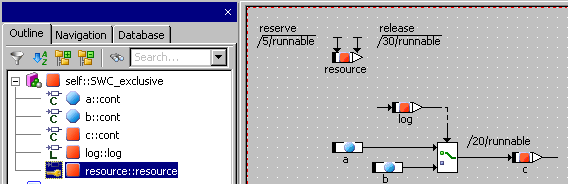

See also

[Exclusive Areas](markdown/ASCexclusiveAreas.md)

[Creating an Exclusive Area](markdown/ASCcreateExclusiveArea.md)

---

## Rte_Call

_Source: `markdown/ASCrteCall.md`_

# Rte_Call

Rte_Call initiates client-server communication, selectively with synchronous or asynchronous semantics.

In the software component editor, a client request can be specified as follows:

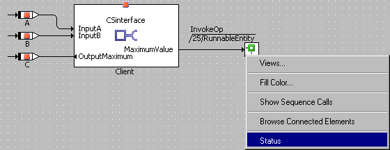

With the default settings, the return value of Rte_Call is assigned to a temporary variable.

You can also select Status. In that case, the return value is assigned to a special runnable-local variable named _ASCET_RteStatus. This variable must be assigned to a model variable, see [Making a Client Request on a Port - Explicit with Status](markdown/ASCmakeClientRequest_on_Port.md#ExplicitStatus).

See also

[Making a Client Request on a Port](markdown/ASCmakeClientRequest_on_Port.md)

---

## Rte_Calprm

_Source: `markdown/ASCrteCalprm.md`_

# Rte_Calprm

Rte_Calprm implements an access to a calibration parameter requested at an Rport typed by a Calibration interface. Calling this access-macro, the runnable will read the parameter value from the RTE.

In the software component editor, access to a calibration parameter can be specified by mapping imported parameters from classes or modules to calibration parameters in the Calibration interface.

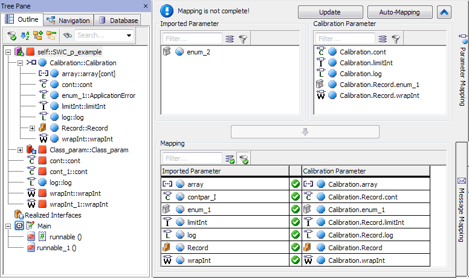

See also

[Accessing Calibration Parameters](markdown/ASCaccessCalibrationParameters.md)

[Example: Accessing Calibration Parameters](markdown/ASC_ExampleAccessingCalibrationParameters.md)

---

## Comments and Notes in Software Components

_Source: `markdown/asccommentsandnotes.md`_

# Comments and Notes in Software Components

Comments do not in any way influence the functionality of a component. They only contain explanatory text that can help document your software model.

See also

[Adding and Editing a Comment](BlockDiagramEditorEnglishUS.chm::/Addcomment.htm)

[Editing the Notes for a Component](markdown/asceditnotes.md)

---

## Components as Complex Elements in SWC

_Source: `markdown/asccomplexelements.md`_

# Components as Complex Elements in Software Components

Components can be used as complex elements within software components. Whereas basic elements are defined in the software component they are contained in, complex elements are included by reference, i.e. if the included component is changed, those changes are effective within the including software component. You can connect other diagram items to the inputs and outputs of the included component.

See also

[Including a Component as a Complex Element](markdown/ascincludecomponent.md)

---

## Sequence Calls

_Source: `markdown/ascsequencecalls.md`_

The sequencing algorithm will notice that the addition d = a + c has to be computed last because it depends on the results of the additions a = b + 1 and c = b + 2. Therefore, the addition d = a + c will be assigned the highest sequence number. However, the algorithm cannot decide whether a or c needs to be computed first. The lowest sequence number is assigned arbitrarily either to a = b + 1 or to c = b + 2.

[If statement](markdown/ascuseif.md)

Even though the lower action on the Then branch, b = b + a, depends on the upper action a = 1.0, the sequencing algorithm may assign the lower sequence number to b = b + a.

a class with three methods (compute, reset, out)

- Sequence call A can only be assigned to the reset method because the initValue argument is not available in the other methods. If another method is selected for sequencing, this sequence call remains empty.
- Sequence call B can only be assigned to the out method. If another method is selected for sequencing, this sequence call remains empty.
- Sequence call C can only be assigned to the compute method. If another method is selected for sequencing, this sequence call remains empty.
- Sequence call D can only be assigned to the compute method because the local variable locvar argument is not available in the other methods. If another method is selected for sequencing, this sequence call remains empty.
- Sequence call E does not belong to a particular method. It will be assigned to whichever method is selected for sequencing.

# Sequence Calls

A sequence call is linked to every assignment operation or every method call of an included component. Every sequence call represents an instruction in an ASCET diagram. Sequence calls determine the control flow in diagrams by assigning every instruction to a method and determining the order of the instructions within a method.

In the software component editor, connecting lines between elements and/or operators are shown as colored lines as long as the sequencing for the instruction or operation linked to the element has not been resolved. The color indicates that the sequencing still has to be resolved. All lines to which a sequence call has been assigned are shown in black.

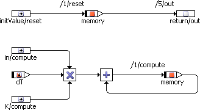

You can edit the sequence calls individually or in groups, manually or automatically. A large number of sequence calls may be necessary in complex diagrams. In this case it is useful to be able to edit the sequence calls in groups. You can change all sequence calls of selected blocks, individual processes or methods or a complete diagram.

Connectors are used to connect an assignment with a control flow instruction such as If Then or If Then Else.

## Editing Several Sequence Calls

A large number of sequence calls may be necessary in complex diagrams. In that case, the possibilities to edit sequence calls in groups can be helpful. You can edit all sequence calls in a selected part of the diagram, all sequence calls assigned to a selected method/runnable, or all sequence calls in a complete diagram.

The sequencing algorithm uses a logical model graph that is computed from the inputs and outputs of all graphical elements. The algorithm tries to find dependencies between the graphical elements, but severe restrictions apply.

- independent subgraphs

One diagram can have several independent subgraphs. The order the sequencing algorithm assigns to the independent subgraphs cannot be predicted.

[Example](javascript:kadovTextPopup(this))<!-- kadovTextPopupInit('a1'); //-->

- control flow elements

If the branch of a control flow element is connected to more than one action, the sequencing algorithm cannot decide which action has to be computed first. The sequence numbers of the connectors are assigned arbitrarily.

[Example](javascript:kadovTextPopup(this))<!-- kadovTextPopupInit('a2'); //-->

- several methods/processes

One diagram can contain several methods or runnable. Elements that belong to a method or runnable (i.e. arguments, return values, method-/runnable-local variables) can be used only in that particular method or runnab,e, but all other elements can be computed in any method or runnable. For these elements, the sequencing algorithm tries to determine a method/runnable by checking whether the inputs/outputs of a computation chain belong to a particular method/runnable. If that check fails, any method/runnable can be used.

[Example](javascript:kadovTextPopup(this))<!-- kadovTextPopupInit('a3'); //-->

See also

[Editing Individual Sequence Calls](markdown/ASCeditSequenceCalls.md#EditingIndividual)

[Editing Several Sequence Calls](markdown/ASCeditSequenceCalls.md#EditingSeveral)

[Connectors](markdown/ASCeditSequenceCalls.md#Connectors)

[Block-Local Sequence Calls](markdown/asc_blocklocalsequencecalls.md)

/* Heikki Komulainen, Comet Computer GmbH 2004 */ cc_plus_pic = '&nbsp;'; cc_minus_pic = '&nbsp;'; cc_stat_pic = '&nbsp;'; gpstyle = ''; var iframes_created = 0; if (document.body && document.body.insertAdjacentHTML && document.getElementsByTagName && document.getElementById) { collect_popups(); set_poplinks_pictures(); if (iframes_created) { document.write(gpstyle); document.write('
<nobr><a id="einauslink" style="position:absolute;top:expression(document.body.scrollTop + this.offsetHeight - this.offsetHeight);left:expression(document.body.offsetWidth - (this.offsetWidth + 28));background:white;padding:5px" href="javascript:show_all_poptext()">Show all hidden text</a></nobr>
'); } } function collect_popups() { bsscpopups = new Array(); for (x = 0; x < document.links.length; x++) { if (document.links[x].href.indexOf("BSSCPopup")>-1) { seekmatch = /BSSCPopup.'[^'](markdown/+)'/; poplink = seekmatch.exec(document.links[x].href); poplink = "" + poplink; poplink = poplink.substring(poplink.indexOf("'")+1, poplink.lastIndexOf("'")); ifid = "CCGENIFRAMEID" + x; new_iframe = '<iframe id="' + ifid + '"src="' + poplink + '" onload="get_text(\'' + ifid + '\')" width="0" height="0" frameborder=0></iframe>'; document.links[x].parentNode.insertAdjacentHTML("afterEnd", new_iframe); gpid = "CCID_" + ifid; document.links[x].href = "javascript:expand_poptext('" + gpid + "')"; cc_plus = '' + cc_plus_pic + ''; document.links[x].insertAdjacentHTML("afterBegin", cc_plus); iframes_created = 1; } } }// end function function get_text(ifr_id) { frpars = document.frames[ifr_id].document.getElementsByTagName("body"); popbody = frpars[0].innerHTML; gpid = "CCID_" + ifr_id; if (!document.getElementById(gpid)) { //avoiding doubles document.getElementById(ifr_id).insertAdjacentHTML("afterEnd", '
'+popbody+'
'); } }//end function function expand_poptext(x_frame_id) { if (!document.getElementById(x_frame_id)) return; if (document.getElementById(x_frame_id).className == "CCGENPOPTEXTH") { document.getElementById(x_frame_id).className = "CCGENPOPTEXTV"; document.getElementById(x_frame_id).style.visibility = "visible"; if (document.getElementById("CCPMB_" + x_frame_id )) { document.getElementById("CCPMB_" + x_frame_id ).innerHTML = cc_minus_pic; } } else { document.getElementById(x_frame_id).className = "CCGENPOPTEXTH"; document.getElementById(x_frame_id).style.visibility = "hidden"; if (document.getElementById("CCPMB_" + x_frame_id )) { document.getElementById("CCPMB_" + x_frame_id ).innerHTML = cc_plus_pic; } } }// end function function show_all_poptext() { var pulldowntxt = document.getElementsByTagName("div"); for (b = 0; b < pulldowntxt.length; b++) { if (pulldowntxt[b].className == "droptext") { pulldowntxt[b].style.display=""; } } var gptxt = document.getElementsByTagName("div"); for (z = 0; z < gptxt.length; z++) { if (gptxt[z].className == "CCGENPOPTEXTH") { gptxt[z].className = "CCGENPOPTEXTV"; gptxt[z].style.visibility = "visible"; if (document.getElementById("CCPMB_" + gptxt[z].id )) { document.getElementById("CCPMB_" + gptxt[z].id ).innerHTML = cc_minus_pic; } } } var dxpoplinks = document.getElementsByTagName("a"); if (dxpoplinks) { for (pxl = 0; pxl < dxpoplinks.length; pxl++) { if (dxpoplinks[pxl].href.indexOf("kadovTextPopup")>-1) { if (document.getElementById("CCPMB_" + dxpoplinks[pxl].id)) { document.getElementById("CCPMB_" + dxpoplinks[pxl].id).innerHTML = cc_stat_pic; dxpoplinks[pxl].symbol = "minus"; } } } } document.getElementById('einauslink').innerText = 'Hide all hideable text'; document.getElementById('einauslink').href = "javascript:self.location.reload()"; self.focus(); }// end function function eat_click() { return false; }// end function function set_poplinks_pictures() { var dpoplinks = document.getElementsByTagName("a"); if (dpoplinks) { for (pl = 0; pl < dpoplinks.length; pl++) { if (dpoplinks[pl].href.indexOf("kadovTextPopup")>-1) { cc_plus = '' + cc_stat_pic + ''; //dpoplinks[pl].onmouseup = plusminuspoplink; dpoplinks[pl].insertAdjacentHTML("afterBegin", cc_plus); dpoplinks[pl].symbol = "plus"; } } } }// end function function plusminuspoplink() { if (document.getElementById("CCPMB_" + this.id)) { if (this.symbol == "plus") { document.getElementById("CCPMB_" + this.id).innerHTML = cc_minus_pic; this.symbol = "minus"; } else { document.getElementById("CCPMB_" + this.id).innerHTML = cc_plus_pic; this.symbol = "plus"; } } return true; }

---

## Implementation Casts in Software Components

_Source: `markdown/ascimplementationcasts.md`_

# Implementation Casts in Software Components

In the software component editor, implementation casts (see also [Overview - Implementation Casts](IntroductionEnglishUS.chm::/INT_implementation_casts.htm)) can be inserted in the same way as all other elements using the relevant button in the Elements palette or toolbar (here: , ). Once generated, they can be added to the drawing area from the Outline tab by Drag & Drop and can be connected there in the same way as all other elements.

Implementation casts cannot be applied to logical elements. If you connect an implementation cast to a logical element, the connecting line is shown in red to indicate the error.

There are no sequence calls for implementation casts, the correct order is determined from the context by code generation.

In the software component editor, there is another very convenient way of adding implementation casts. This is particularly useful for existing arithmetical calculation chains. Using the context menu of the arithmetic operators +, -, *, /, abs and neg you can add implementation casts automatically for all inputs and outputs of the operation by selecting Add Implementation Casts.

See also

[Overview - Implementation Casts](IntroductionEnglishUS.chm::/INT_implementation_casts.htm)

[Adding Implementation Casts to Operators](markdown/ascaddimplementationcast.md)

[Adding Implementation Casts to a Connection](markdown/ascaddimplcasttoconnect.md)

---

## Implementation Data Type Bool

_Source: `markdown/ascImplementationDataTypeBool.md`_

# Implementation Data Type Bool

ASCET introduces a new implementation data type, Bool, for logical elements. With that, ASCET can properly handle the Boolean type defined by AUTOSAR.

If used outside the AUTOSAR context, the implementation data type Bool is treated the same way as implementation type uint8 for simulation targets (i.e. PC, ES113x, ES910, Prototyping). For ASCET-SE targets, a suitable base type definition is available.

If the Bit implementation data type is used within an AUTOSAR context, a warning is issued during code generation, and Bit is replaced by Bool for method arguments, return values, method-local variables and all data elements of SenderReceiver and NVData interfaces.

See also

[Editing Implementations - Specifying the Implementation for a Logical Element](ImplementationEditorEnglishUS.chm::/specify_impl-logicalelement.htm)

---

## Editing Software Components

_Source: `markdown/asceditingswc.md`_

# Editing Software Components

Editing software components describes the general editing features of the drawing area, and the features that modify the appearance of diagram items.

In some cases it is useful to retrace actions taken or to return to an earlier version of the diagram in order to rework it from there. To do this, the actions carried out in the diagram are recorded step by step on the internal clipboard. However, you can only return to an earlier version of the diagram if you are working in an open editor. When you exit from the editor, only the most recently edited version is saved; the versions recorded in the clipboard are deleted.

See also

[Defining the SWC Signature](markdown/ASCdefineSWCsignature.md)

[Creating the SWC Content](markdown/ASCcreateSWCcontent.md)

[Viewing all Graphical Occurrences of an Element](markdown/ascviewoccurrence.md)

[Changing the Appearance of a Diagram Item](markdown/ascchangeappearance.md)

[Layout of Included Components](markdown/asclayoutincludedcomponents.md)

[Changing the Software Component Display](markdown/ascchangeASWCDisplay.md)

---

## Software Components with Multiple Diagrams

_Source: `markdown/ASCswcMultipleDiagrams.md`_

# Software Components with Multiple Diagrams

The specification for a software component can consist of more than one diagram. This feature is useful for structuring complex specifications. A diagram can either be public, i.e. contain only public runnables and methods, or private, i.e. contain only private runnables and methods.

Public methods can be accessed from other components, private methods cannot. Private methods can only be accessed from inside the component.

Each software component contains at least one public diagram named Main. It can have any number of public or private diagrams.

See also

[Creating a New Diagram](markdown/asccreatediagram.md)

[Loading a Diagram](markdown/ascloaddiagram.md)

[Renaming or Deleting a Diagram, Runnable or Method](markdown/ascrenameordelete.md)

[Moving Runnables and Methods between Diagrams](markdown/ascmoveRunnablesMethods.md)

---

## Graphical Hierarchies in SWC

_Source: `markdown/ascgraphicalhierarchies.md`_

# Graphical Hierarchies in SWC

To organize complex diagrams more clearly, you can group parts of a diagram into a hierarchy block, which is then only visible as a symbol on the top level of the diagram. Whether any diagram item is inside a hierarchy block or not, does not in any way affect its functionality, hierarchies serve only for graphical structuring. Hierarchies can be nested so that hierarchy blocks can contain other hierarchy blocks.

See also

[Adding a Hierarchy](markdown/ascaddhierarchy.md)

[Converting Diagram Elements into a Hierarchy Block](markdown/ascconverthierarchy.md)

[Moving Elements Into or Out of a Hierarchy Frame](markdown/ascmoveelements.md)

[Resolving a Hierarchy Block](markdown/ascresolvinghierarchy.md)

[Changing the Appearance of a Hierarchy Block](markdown/ascappearancehierarchy.md)

[Navigating between Hierarchy Levels](markdown/ascnavigatehierarchy.md)

[Adding Input and Output Pins to the Hierarchy](markdown/ascaddinputhiera.md)

[Changing the Appearance of Input and Output Pins](markdown/ascchangeinputpins.md)

---

## Statement Blocks

_Source: `markdown/asc_statementblocks.md`_

# Statement Blocks

Statement blocks can be used to encapsulate a continuous set of statements.

Each statement block must have an unambiguous name. If a statement block has the same name as another statement block, a normal hierarchy, a method, process, or runnable, an error is issued during code generation.

YBdl75 - Duplicate name "<name>" for statement block

A statement block is very similar to a graphical hierarchy, except that

- a statement block has a sequence call, and
- sequence calls inside a statement block are local to that block (see [Block-Local Sequence Calls](markdown/asc_blocklocalsequencecalls.md)).

Changing the block's sequence call does not change the execution sequence within the block. During code generation, the statement block is generated in the place indicated by the block's sequence call. The content of the statement block is generated in the order determined by the block-local sequence calls (see [Example: Statement Block](markdown/asc_examplestatementblock.md)).

Data flow between the various hierarchy/statement block levels works via input and output pins. These are simply connection lines that extend across the levels. In statement blocks, input and output pins are not intended for control flow. If a control-flow element is connected to the input pin of a statement block, an warning is issued during code generation.

WBdl31 - A statement block should not have a control-flow pin

By default, this warning is promoted to an error.

See also

[Block-Local Sequence Calls](markdown/asc_blocklocalsequencecalls.md)

[Example: Statement Block](markdown/asc_examplestatementblock.md)

[Graphical Hierarchies in SWC](markdown/ascgraphicalhierarchies.md)

[Using Graphical Hierarchies and Statement Blocks](markdown/ASC_UseGraphicalHierarchies_StatementBlocks.md)

---

## Block-Local Sequence Calls

_Source: `markdown/asc_blocklocalsequencecalls.md`_

# Block-Local Sequence Calls

The sequence calls inside a [statement block](markdown/asc_statementblocks.md) are local to that block. They consist of a sequence number and the name of the enclosing statement block. (Normal sequence calls consist of a number and a method/process name.)

The following rules apply:

- A block-local sequence call must not be used outside its enclosing statement block.

If a block-local sequence call is used outside its statement block (e.g., in the main diagram, in a different statement block, or in a graphical hierarchy inside or outside the statement block), an error is issued during code generation:

YBdl74 - Statement block-local sequence call used in %1

with %1 being top level diagram, different executable hierarchy named %2, or different regular hierarchy named %2.

- Only block-local sequence calls are allowed in a statement block.

If a normal sequence call is used in a statement block - either directly or indirectly (i.e. in a graphical hierarchy inside the statement block) -, a warning is issued during code generation:

WBdl30 - Method sequence call should not be used inside a statement block

You can convert a block-local sequence call to a connector and vice versa, see [Toggling Between Connector and Block-Local Sequence Call](markdown/asc_convertconnectorsequencecall.md).

See also

[Statement Blocks](markdown/asc_statementblocks.md)

[Sequence Calls](markdown/ascsequencecalls.md)

[Toggling Between Connector and Block-Local Sequence Call](markdown/asc_convertconnectorsequencecall.md)

---

## Example: Statement Block

_Source: `markdown/asc_examplestatementblock.md`_

# Example: Statement Block

The following screenshot shows a simple block diagram with a statement block. The (diagram-wide) sequence calls are numbered A, B, and C.

The statement block contains the following sub-graph. The block-local sequence calls are numbered B.1 and B.2.

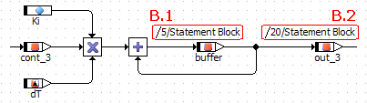

During code generation, the statement block is generated in the place indicated by the block's sequence call (B). The content of the statement block is generated in the order determined by the block-local sequence calls (B.1 and B.2).

| Column 1 | Column 2 |
| --- | --- |
|  | /* public process [] */ |
|  | void MODULE_BDE_EXHIER_IMPL_process(void) |
|  | { |
|  | /* temp. variables */ |
|  | sint16 _t1sint16; |
| A | /* process: sequence call #5 */ |
|  | _t1sint16 = (sint16)_cont_1 + _cont_2; |
|  | _out1 = _t1sint16; |
| B.1 | /* Statement Block: sequence call #5 */ |
|  | _buffer = (sint16)((_cont_3 * ((sint32)_dT * _Ki)) + _buffer); |
| B.2 | /* Statement Block: sequence call #20 */ |
|  | _out_3 = _buffer; |
| C | /* process: sequence call #15 */ |
|  | _t1sint16 = (sint16)_cont_1 + _cont_2; |
|  | _out2 = (sint32)_t1sint16 * _cont_2; |
|  | } |

The example code was generated with the ANSI-C target (available in ASCET-SE) for better readability.

---

## Layout of Included Components

_Source: `markdown/asclayoutincludedcomponents.md`_

# Layout of Included Components

If you add a component to your SWC (see [Including a Component as a Complex Element](markdown/ascincludecomponent.md)) and place it in the drawing area, the default layout of the added component, defined in the layout editor, is displayed. If this default layout does not suit your purposes, you can react in two different ways.

One possibility is to adapt the default layout in the [layout editor](LayoutEditorEnglishUS.chm::/LEd_Overview.htm). Changes in the layout editor do not, however, have any influence on individual graphical occurrences of the component in SWC and other block diagrams. Existing diagrams remain unchanged, you have to replace the occurrences manually to load the changed layout.

The other possibility is to adapt the layout of a specific graphical occurrence in the SWC diagram. You can enable or disable flexible layout for each included component individually, either in the component manager (see [Activating/Deactivating Flexible Layout](ComponentManagerEnglishUS.chm::/Activating_Flexible_Layout.htm)) or via the Activate flexible layout menu option in the layout editor.

Only the layout of the edited graphical occurrence is modified, neither the default layout nor the layout of other graphical occurrences of the same component in the diagram is changed automatically. This means that, if necessary, you can assign each graphical occurrence of the same component a different layout.

You can change the size of a block and move, show or hide the ports. The following must, however, be taken into consideration:

1. A graphical occurrence must at least be the size of an addition operator with two inputs.
1. The minimum size of a graphical occurrence is also limited by the number of visible ports: two ports cannot have the same position.
1. If the default layout contains an icon, it is cut off if the size of the graphical occurrence is smaller than the icon itself.

If you copy or cut out a graphical occurrence which has been edited in this way and insert it at a different location as described in [Cut, Copy and Paste a Diagram Item](markdown/asccutcopypaste.md), the inserted graphical occurrence is assigned the layout of the copied/cut out graphical occurrence.

See also

[Including a Component as a Complex Element](markdown/ascincludecomponent.md)

[Activating/Deactivating Flexible Layout](ComponentManagerEnglishUS.chm::/Activating_Flexible_Layout.htm)

[Layout Editor - Overview](LayoutEditorEnglishUS.chm::/LEd_Overview.htm)

[Cut, Copy and Paste a Diagram Item](markdown/asccutcopypaste.md)

[Editing the Size of a Graphical Occurrence](BlockDiagramEditorEnglishUS.chm::/Editsize.htm)

[Editing Ports](BlockDiagramEditorEnglishUS.chm::/Editports.htm)

[Show/Hide Ports of an Included Component](BlockDiagramEditorEnglishUS.chm::/Public_Methods.htm)

[Using Changes as a New Default Layout](BlockDiagramEditorEnglishUS.chm::/BDE_Defaultlayout.htm)

[Restoring the Default Layout](BlockDiagramEditorEnglishUS.chm::/Restoredefault.htm)

---

## Analysis of Software Components

_Source: `markdown/ASCanalyzeAtomicSWC.md`_

# Analysis of Software Components

After you have created an software component, you will usually want to see whether code generation works as intended.

The software component must be integrated into a project. A so-called default project can be defined for each software component for that purpose. This is the only way to access the implementation information. Without project context, the conversion formulas as well as all implementations of imported entities are missing.

See also

[Analyzing a Diagram](BlockDiagramEditorEnglishUS.chm::/AnalyzeDiagram.htm)

[Generating Code for a Component](BlockDiagramEditorEnglishUS.chm::/GenerateCode.htm)

[Viewing the Generated Code](BlockDiagramEditorEnglishUS.chm::/Viewcode.htm)

[Project Editor - Banners in the Generated Code](ProjectEditorEnglishUS.chm::/PE_Banners_in_GeneratedCode.htm)

---

## Data Exchange

_Source: `markdown/ASCDataExchange.md`_

# Data Exchange

A data set is always associated with the component it came from. Data can be imported and exported in the software component editor, via the Import and Export submenus of the File menu.

See also

[Exporting the Data Set of a Software Component](markdown/ascexportdata.md)

[Writing the Data from an Array or a Table to a File](BlockDiagramEditorEnglishUS.chm::/WriteData.htm)

[Reading the Data for an Array or a Table from a File](BlockDiagramEditorEnglishUS.chm::/ReadData.htm)

---

## Creating a Software Component

_Source: `markdown/ASCcreateAtomicSoftwareComponent.md`_

# Creating a Software Component

To create a software component, proceed as follows.

1. In the ASCET options window, [Modeling](ComponentManagerEnglishUS.chm::/CM_General_Options.htm) node, activate the Enable Creation of AUTOSAR Components option
1. Do one of the following:
1. If you are working with a database larger than 3 GB, [another step is inserted](javascript:BSSCPopup('codegen_dbtoolarge.htm');)<!-- kadovFilePopupInit('a1'); //-->.
1. Edit the name and press Enter.

See also

[Opening the Software Component Editor](markdown/ascopeneditor.md)

[Defining the SWC Interface](markdown/ASCdefineSWCsignature.md)

[Creating the SWC Content](markdown/ASCcreateSWCcontent.md)

[Modeling Options](ComponentManagerEnglishUS.chm::/CM_Modeling_Node.htm)

[Reserved Keywords](IntroductionEnglishUS.chm::/INT_Reserved_Keywords.htm)

/* Heikki Komulainen, Comet Computer GmbH 2004 */ cc_plus_pic = '&nbsp;'; cc_minus_pic = '&nbsp;'; cc_stat_pic = '&nbsp;'; gpstyle = ''; var iframes_created = 0; if (document.body && document.body.insertAdjacentHTML && document.getElementsByTagName && document.getElementById) { collect_popups(); set_poplinks_pictures(); if (iframes_created) { document.write(gpstyle); document.write('
<nobr><a id="einauslink" style="position:absolute;top:expression(document.body.scrollTop + this.offsetHeight - this.offsetHeight);left:expression(document.body.offsetWidth - (this.offsetWidth + 28));background:#ffffe0;padding:5px" href="javascript:show_all_poptext()">Show all hidden text</a></nobr>
'); } } function collect_popups() { bsscpopups = new Array(); for (x = 0; x < document.links.length; x++) { if (document.links[x].href.indexOf("BSSCPopup")>-1) { seekmatch = /BSSCPopup.'[^'](markdown/+)'/; poplink = seekmatch.exec(document.links[x].href); poplink = "" + poplink; poplink = poplink.substring(poplink.indexOf("'")+1, poplink.lastIndexOf("'")); ifid = "CCGENIFRAMEID" + x; new_iframe = '<iframe id="' + ifid + '"src="' + poplink + '" onload="get_text(\'' + ifid + '\')" width="0" height="0" frameborder=0></iframe>'; document.links[x].parentNode.insertAdjacentHTML("afterEnd", new_iframe); gpid = "CCID_" + ifid; document.links[x].href = "javascript:expand_poptext('" + gpid + "')"; cc_plus = '' + cc_plus_pic + ''; document.links[x].insertAdjacentHTML("afterBegin", cc_plus); iframes_created = 1; } } }// end function function get_text(ifr_id) { frpars = document.frames[ifr_id].document.getElementsByTagName("body"); popbody = frpars[0].innerHTML; gpid = "CCID_" + ifr_id; if (!document.getElementById(gpid)) { //avoiding doubles document.getElementById(ifr_id).insertAdjacentHTML("afterEnd", '
'+popbody+'
'); } }//end function function expand_poptext(x_frame_id) { if (!document.getElementById(x_frame_id)) return; if (document.getElementById(x_frame_id).className == "CCGENPOPTEXTH") { document.getElementById(x_frame_id).className = "CCGENPOPTEXTV"; document.getElementById(x_frame_id).style.visibility = "visible"; if (document.getElementById("CCPMB_" + x_frame_id )) { document.getElementById("CCPMB_" + x_frame_id ).innerHTML = cc_minus_pic; } } else { document.getElementById(x_frame_id).className = "CCGENPOPTEXTH"; document.getElementById(x_frame_id).style.visibility = "hidden"; if (document.getElementById("CCPMB_" + x_frame_id )) { document.getElementById("CCPMB_" + x_frame_id ).innerHTML = cc_plus_pic; } } }// end function function show_all_poptext() { var pulldowntxt = document.getElementsByTagName("div"); for (b = 0; b < pulldowntxt.length; b++) { if (pulldowntxt[b].className == "droptext") { pulldowntxt[b].style.display=""; } } var gptxt = document.getElementsByTagName("div"); for (z = 0; z < gptxt.length; z++) { if (gptxt[z].className == "CCGENPOPTEXTH") { gptxt[z].className = "CCGENPOPTEXTV"; gptxt[z].style.visibility = "visible"; if (document.getElementById("CCPMB_" + gptxt[z].id )) { document.getElementById("CCPMB_" + gptxt[z].id ).innerHTML = cc_minus_pic; } } } var dxpoplinks = document.getElementsByTagName("a"); if (dxpoplinks) { for (pxl = 0; pxl < dxpoplinks.length; pxl++) { if (dxpoplinks[pxl].href.indexOf("kadovTextPopup")>-1) { if (document.getElementById("CCPMB_" + dxpoplinks[pxl].id)) { document.getElementById("CCPMB_" + dxpoplinks[pxl].id).innerHTML = cc_stat_pic; dxpoplinks[pxl].symbol = "minus"; } } } } document.getElementById('einauslink').innerText = 'Hide all hideable text'; document.getElementById('einauslink').href = "javascript:self.location.reload()"; self.focus(); }// end function function eat_click() { return false; }// end function function set_poplinks_pictures() { var dpoplinks = document.getElementsByTagName("a"); if (dpoplinks) { for (pl = 0; pl < dpoplinks.length; pl++) { if (dpoplinks[pl].href.indexOf("kadovTextPopup")>-1) { cc_plus = '' + cc_stat_pic + ''; //dpoplinks[pl].onmouseup = plusminuspoplink; dpoplinks[pl].insertAdjacentHTML("afterBegin", cc_plus); dpoplinks[pl].symbol = "plus"; } } } }// end function function plusminuspoplink() { if (document.getElementById("CCPMB_" + this.id)) { if (this.symbol == "plus") { document.getElementById("CCPMB_" + this.id).innerHTML = cc_minus_pic; this.symbol = "minus"; } else { document.getElementById("CCPMB_" + this.id).innerHTML = cc_plus_pic; this.symbol = "plus"; } } return true; }

---

## Opening the Software Component Editor

_Source: `markdown/ascopeneditor.md`_

# Opening the Software Component Editor

To open the software component editor, proceed as follows:

1. In the Component Manager, select the desired software component.
1. Perform one of the following actions.

The selected item opens in the software component editor.

When you open an SWC that exceeds the currently selected size of the drawing area (see [Setting the Size of the Drawing Area](markdown/ascsetsizedrawingarea.md)), a message window opens. It displays the size of the drawing area and the size of the component, and offers the possibility to adjust the former.

See also

[Defining the SWC Signature](markdown/ASCdefineSWCsignature.md)

[Creating the SWC Content](markdown/ASCcreateSWCcontent.md)

[Setting the Size of the Drawing Area](markdown/ascsetsizedrawingarea.md)

---

## Specifying a Software Component

_Source: `markdown/ASCspecifyAtomicSWC.md`_

# Specifying a Software Component

This topic lists the steps required to specify a software component. Detailed information on the steps can be found in the linked topics.

1. [Create a software component.](markdown/ASCcreateAtomicSoftwareComponent.md)
1. [Create the AUTOSAR interfaces you need for the software component.](SenderReceiverEditorEnglishUS.chm::/SREcreateSenderReceiverInterface.htm)
1. Set up the [SenderReceiver](SenderReceiverEditorEnglishUS.chm::/SREsetupSenderReceiverInterface.htm), [NVData](SenderReceiverEditorEnglishUS.chm::/SREsetupSenderReceiverInterface.htm), [ClientServer](SenderReceiverEditorEnglishUS.chm::/SRE_SetUp_ClientServerInterface.htm) and [Calibration](SenderReceiverEditorEnglishUS.chm::/SREsetupCalibrationInterface.htm) interfaces.
1. [Insert the AUTOSAR interfaces into the software component.](markdown/ascincludecomponent.md)
1. Set up the [SenderReceiver](markdown/ASCspecifySRIprototype.md), [NVData](SenderReceiverEditorEnglishUS.chm::/SREsetupSenderReceiverInterface.htm), [ClientServer](markdown/ASCspecifyClientServerInterfacePrototype.md) or [Calibration](markdown/ASCspecifyCalibrationInterfacePrototype.md) interface prototypes in the software component.
1. [Define the SWC signature.](markdown/ASCdefineSWCsignature.md)
1. [Create the SWC content.](markdown/ASCcreateSWCcontent.md)
1. [Specify the necessary events](markdown/ASCcreateEvent.md) and [assign them to the runnables](markdown/ASCassignEventsToRunnables.md).
1. [Insert the software component into a project.](ProjectEditorEnglishUS.chm::/specifyingproject.htm)
1. In the project, [select an appropriate target, compiler and operating system](markdown/ASCadjustProjectSettingsSWC.md) and [configure the AUTOSAR XML output](markdown/ascconfigureautosarxmloutput.md).
1. [Generate AUTOSAR code.](markdown/ASCgenerateAUTOSARCode.md)

---

## Creating a New Diagram

_Source: `markdown/asccreatediagram.md`_

# Creating a New Diagram

To create a diagram, proceed as follows:

1. Go to the Outline tab.
1. In the Insert menu, point to Diagram and select Public or Private
1. In the context menu, point to Add Diagram and select Public or Private.
1. Type in a name and press Enter.
1. Add the runnables and methods necessary to specify the functionality of the diagram.

In the software component editor, you work on one diagram at a time. If an software component contains more than one diagram, you can switch between diagrams by [loading another diagram](markdown/ascloaddiagram.md) into the drawing area.

See also

[Creating a Runnable](markdown/ASCcreateRunnable.md)

[Creating a Method](markdown/asccreatemethod.md)

[Loading a Diagram](markdown/ascloaddiagram.md)

[Renaming or Deleting a Diagram, Runnable or Method](markdown/ascrenameordelete.md)

---

## Loading a Diagram

_Source: `markdown/ascloaddiagram.md`_

# Loading a Diagram

To load a diagram, proceed as follows:

1. Select a diagram.
1. In the Windows menu, select Load Diagram

or

1. In the context menu, select Load Diagram.

The diagram is loaded in the drawing area.

If there are unsaved changes in the current diagram, you are prompted to save the current diagram before the new diagram is loaded.

---

## Saving a Software Component

_Source: `markdown/ascsavecomponent.md`_

# Saving a Software Component

To save the specified software component, proceed as follows:

1. Perform one of the following actions.
1. To make the changes permanent, go to the Component Manager, do one of the following.
1. open the File menu and select Save.
1. Click on the Save button in the Component Manager.

The Save command in the Component Manager stores all the changes you have made in the database/workspace.

---

## Exiting the Software Component Editor

_Source: `markdown/ascexiteditor.md`_

# Exiting the Software Component Editor

To exit the software component editor, proceed as follows:

1. In the software component editor, perform one of the following actions.
1. Activate the option Remember my Decision if you want to give the same answer to all questions of this type.
1. Click Yes to confirm the saving.
1. Click No to reject the changes.
1. Click Cancel to abort closing the software component editor.

See also

[Confirmation Dialog Options](ComponentManagerEnglishUS.chm::/CM_Options_for_Confirmation_Dialogs.htm)

---

## Specifying Events

_Source: `markdown/ASCSpecifyingEvents.md`_

# Specifying Events

Specifying events includes the following steps:

1. [Creating an Event](markdown/ASCcreateEvent.md)
1. [Setting Up an Event](markdown/ASCsetUpEvent.md)
1. [Enabling/Disabling Modes](markdown/ASCenableDisableModes.md)
1. [Assigning Events to Runnables](markdown/ASCassignEventsToRunnables.md)
1. [Deassigning Events from Runnables](markdown/ASCdeassignEventsFromRunnables.md)
1. [Renaming or Deleting Events](markdown/ASCrenameDeleteEvents.md)

---

## Creating an Event

_Source: `markdown/ASCcreateEvent.md`_

# Creating an Event

Events are required to trigger runnables. To create a timing or mode-switch event, proceed as follows.

Operation-invoked events are created, set up and assigned automatically at need (see [Specifying a ClientServer Interface Prototype](markdown/ASCspecifyClientServerInterfacePrototype.md)). They cannot be altered manually.

1. In the software component editor, open the Event Specification view.
1. Do one of the following:
1. Enter a name for the event and press Return.
1. [Set up the event.](markdown/ASCsetUpEvent.md)
1. [Assign the event to a runnable.](markdown/ASCassignEventsToRunnables.md)

See also

[Setting Up an Event](markdown/ASCsetUpEvent.md)

[Assigning Events to Runnables](markdown/ASCassignEventsToRunnables.md)

[Renaming or Deleting Events](markdown/ASCrenameDeleteEvents.md)

[Deassigning Events from Runnables](markdown/ASCdeassignEventsFromRunnables.md)

[Reserved Keywords](IntroductionEnglishUS.chm::/INT_Reserved_Keywords.htm)

---

## Setting Up an Event

_Source: `markdown/ASCsetUpEvent.md`_

- In the Period field, enter the period in seconds (e.g., 0.01 for a period of 10 milliseconds).

or

The mode you select here must be enabled for the event. Otherwise, the assigned runnable is never triggered.

# Setting Up an Event

Events are created as timing events with a default period. To set up an event, proceed as follows.

1. In the software component editor, open the Event Specification view.
1. In the Events field, select the event you want to set up.
1. If applicable, enable the modes during which the event shall be available. Disable all other modes.
1. In the Event Kind combo box, select the event type.
1. To set up a Timing event, [proceed as follows](javascript:kadovTextPopup(this))<!-- kadovTextPopupInit('a1'); //-->.
1. To set up a ModeSwitch event, [proceed as follows](javascript:kadovTextPopup(this))<!-- kadovTextPopupInit('a2'); //-->.
1. [Enable/disable individual modes](markdown/ASCenableDisableModes.md) for an event.

See also

[Creating an Event](markdown/ASCcreateEvent.md)

[Assigning Events to Runnables](markdown/ASCassignEventsToRunnables.md)

[Specifying a ClientServer Interface Prototype](markdown/ASCspecifyClientServerInterfacePrototype.md)

[Enabling/Disabling Modes](markdown/ASCenableDisableModes.md)

/* Heikki Komulainen, Comet Computer GmbH 2004 */ cc_plus_pic = '&nbsp;'; cc_minus_pic = '&nbsp;'; cc_stat_pic = '&nbsp;'; gpstyle = ''; var iframes_created = 0; if (document.body && document.body.insertAdjacentHTML && document.getElementsByTagName && document.getElementById) { collect_popups(); set_poplinks_pictures(); if (iframes_created) { document.write(gpstyle); document.write('
<nobr><a id="einauslink" style="position:absolute;top:expression(document.body.scrollTop + this.offsetHeight - this.offsetHeight);left:expression(document.body.offsetWidth - (this.offsetWidth + 28));background:white;padding:5px" href="javascript:show_all_poptext()">Alle texte einblenden</a></nobr>
'); } } function collect_popups() { bsscpopups = new Array(); for (x = 0; x < document.links.length; x++) { if (document.links[x].href.indexOf("BSSCPopup")>-1) { seekmatch = /BSSCPopup.'[^'](markdown/+)'/; poplink = seekmatch.exec(document.links[x].href); poplink = "" + poplink; poplink = poplink.substring(poplink.indexOf("'")+1, poplink.lastIndexOf("'")); ifid = "CCGENIFRAMEID" + x; new_iframe = '<iframe id="' + ifid + '"src="' + poplink + '" onload="get_text(\'' + ifid + '\')" width="0" height="0" frameborder=0></iframe>'; document.links[x].parentNode.insertAdjacentHTML("afterEnd", new_iframe); gpid = "CCID_" + ifid; document.links[x].href = "javascript:expand_poptext('" + gpid + "')"; cc_plus = '' + cc_plus_pic + ''; document.links[x].insertAdjacentHTML("afterBegin", cc_plus); iframes_created = 1; } } }// end function function get_text(ifr_id) { frpars = document.frames[ifr_id].document.getElementsByTagName("body"); popbody = frpars[0].innerHTML; gpid = "CCID_" + ifr_id; if (!document.getElementById(gpid)) { //avoiding doubles document.getElementById(ifr_id).insertAdjacentHTML("afterEnd", '
'+popbody+'
'); } }//end function function expand_poptext(x_frame_id) { if (!document.getElementById(x_frame_id)) return; if (document.getElementById(x_frame_id).className == "CCGENPOPTEXTH") { document.getElementById(x_frame_id).className = "CCGENPOPTEXTV"; document.getElementById(x_frame_id).style.visibility = "visible"; if (document.getElementById("CCPMB_" + x_frame_id )) { document.getElementById("CCPMB_" + x_frame_id ).innerHTML = cc_minus_pic; } } else { document.getElementById(x_frame_id).className = "CCGENPOPTEXTH"; document.getElementById(x_frame_id).style.visibility = "hidden"; if (document.getElementById("CCPMB_" + x_frame_id )) { document.getElementById("CCPMB_" + x_frame_id ).innerHTML = cc_plus_pic; } } }// end function function show_all_poptext() { var pulldowntxt = document.getElementsByTagName("div"); for (b = 0; b < pulldowntxt.length; b++) { if (pulldowntxt[b].className == "droptext") { pulldowntxt[b].style.display=""; } } var gptxt = document.getElementsByTagName("div"); for (z = 0; z < gptxt.length; z++) { if (gptxt[z].className == "CCGENPOPTEXTH") { gptxt[z].className = "CCGENPOPTEXTV"; gptxt[z].style.visibility = "visible"; if (document.getElementById("CCPMB_" + gptxt[z].id )) { document.getElementById("CCPMB_" + gptxt[z].id ).innerHTML = cc_minus_pic; } } } var dxpoplinks = document.getElementsByTagName("a"); if (dxpoplinks) { for (pxl = 0; pxl < dxpoplinks.length; pxl++) { if (dxpoplinks[pxl].href.indexOf("kadovTextPopup")>-1) { if (document.getElementById("CCPMB_" + dxpoplinks[pxl].id)) { document.getElementById("CCPMB_" + dxpoplinks[pxl].id).innerHTML = cc_stat_pic; dxpoplinks[pxl].symbol = "minus"; } } } } document.getElementById('einauslink').innerText = 'Alle texte ausblenden'; document.getElementById('einauslink').href = "javascript:self.location.reload()"; self.focus(); }// end function function eat_click() { return false; }// end function function set_poplinks_pictures() { var dpoplinks = document.getElementsByTagName("a"); if (dpoplinks) { for (pl = 0; pl < dpoplinks.length; pl++) { if (dpoplinks[pl].href.indexOf("kadovTextPopup")>-1) { cc_plus = '' + cc_stat_pic + ''; //dpoplinks[pl].onmouseup = plusminuspoplink; dpoplinks[pl].insertAdjacentHTML("afterBegin", cc_plus); dpoplinks[pl].symbol = "plus"; } } } }// end function function plusminuspoplink() { if (document.getElementById("CCPMB_" + this.id)) { if (this.symbol == "plus") { document.getElementById("CCPMB_" + this.id).innerHTML = cc_minus_pic; this.symbol = "minus"; } else { document.getElementById("CCPMB_" + this.id).innerHTML = cc_plus_pic; this.symbol = "plus"; } } return true; }

---

## Enabling/Disabling Modes

_Source: `markdown/ASCenableDisableModes.md`_

# Enabling/Disabling Modes

By default, all modes in all mode groups used in the SWC are activated for an event. To deactivate a mode, proceed as follows.

1. In the Event Specification tab of the software component editor, [create](markdown/ASCcreateEvent.md) and [set up](markdown/ASCsetUpEvent.md) an event.
1. To disable an enabled mode, do one of the following:
1. To enable a disabled mode, do one of the following:
1. Activate the option next to the desired disabled mode.
1. Right-click the desired disabled mode and select Toggle Mode Enablement from the context menu.

See also

[Creating an Event](markdown/ASCcreateEvent.md)

[Setting Up an Event](markdown/ASCsetUpEvent.md)

---

## Assigning Events to Runnables

_Source: `markdown/ASCassignEventsToRunnables.md`_

# Assigning Events to Runnables

Each runnable needs one or more events that trigger its execution. To assign an event to a runnable, proceed as follows.

1. In the software component editor, open the Event Specification view.
1. In the Runnables field, select a runnable.
1. In the Events field, select the event you want to assign to the runnable.
1. Do one of the following:

The event is assigned to the runnable. It is shown below the runnable in the Runnables field.

Each event can be assigned to only one runnable. If you want two runnables to be triggered with the same period or by the same mode, you must create two events with identical specification.

See also

[Creating an Event](markdown/ASCcreateEvent.md)

[Setting Up an Event](markdown/ASCsetUpEvent.md)

[Renaming or Deleting Events](markdown/ASCrenameDeleteEvents.md)

[Deassigning Events from Runnables](markdown/ASCdeassignEventsFromRunnables.md)

---

## Deassigning Events from Runnables

_Source: `markdown/ASCdeassignEventsFromRunnables.md`_

# Deassigning Events from Runnables

To deassign an event from a runnable, proceed as follows.

1. In the software component editor, open the Event Specification view.
1. In the Runnables field, select the event occurrence you want to deassign.
1. Do one of the following:

- Right-click the event and select Deassign Event from the context menu
- In the Runnable menu, select Deassign Event.
- Click on the << button .

The event is deassigned from the runnable.

See also

[Creating an Event](markdown/ASCcreateEvent.md)

[Setting Up an Event](markdown/ASCsetUpEvent.md)

[Assigning Events to Runnables](markdown/ASCassignEventsToRunnables.md)

[Renaming or Deleting Events](markdown/ASCrenameDeleteEvents.md)

---

## Renaming or Deleting Events

_Source: `markdown/ASCrenameDeleteEvents.md`_

# Renaming or Deleting Events

To rename or delete an event, proceed as follows:

1. In the software component editor, open the Event Specification view.
1. In the Events field, select the event.
1. To rename the element, do one of the following:
1. To delete the event, do one of the following:

See also

[Creating an Event](markdown/ASCcreateEvent.md)

[Setting Up an Event](markdown/ASCsetUpEvent.md)

[Assigning Events to Runnables](markdown/ASCassignEventsToRunnables.md)

[Deassigning Events from Runnables](markdown/ASCdeassignEventsFromRunnables.md)

[Reserved Keywords](IntroductionEnglishUS.chm::/INT_Reserved_Keywords.htm)

---

## AUTOSAR Interfaces

_Source: `markdown/ASC_AUTOSAR_Interfaces.md`_

# AUTOSAR Interfaces

Using AUTOSAR interfaces in an SWC contains the following steps.

##### SenderReceiver and NVData Interfaces

1. [Specifying a SenderReceiver or NVData Interface Prototype](markdown/ASCspecifySRIprototype.md)
1. [Sending to a Port](markdown/ASCsendToPort.md)
1. [Receiving from a Port](markdown/ASCreceiveFromPort.md)
1. [Using Mode Groups](markdown/ASCusingModeGroups.md)

##### ClientServer Interfaces

1. [Specifying a ClientServer Interface Prototype](markdown/ASCspecifyClientServerInterfacePrototype.md)
1. [Enabling Concurrent Invocation of a Server Runnable](markdown/ASCenableConcurrentInvocation_ServerRunnable.md)
1. [Making a Client Request on a Port](markdown/ASCmakeClientRequest_on_Port.md)

##### Calibration Interfaces

1. [Specifying a Calibration Interface Prototype](markdown/ASCspecifyCalibrationInterfacePrototype.md)
1. [Accessing Calibration Parameters](markdown/ASCaccessCalibrationParameters.md)

---

## Specifying a SenderReceiver/NVData Interface Prototype

_Source: `markdown/ASCspecifySRIprototype.md`_

# Specifying a SenderReceiver or NVData Interface Prototype

To specify a SenderReceiver or NVData interface prototype, proceed as follows.

1. [Create](SenderReceiverEditorEnglishUS.chm::/SREcreateSenderReceiverInterface.htm) and [set up](SenderReceiverEditorEnglishUS.chm::/SREsetupSenderReceiverInterface.htm) a SenderReceiver/NVData interface.
1. Include the SenderReceiver/NVData interface in the software component as described in [Including a Component as a Complex Element](markdown/ascincludecomponent.md).
1. If the properties editor did not open automatically, right-click the SenderReceiver/NVData interface prototype in the Outline tab and select Properties from the context menu.
1. Determine the port type of the SenderReceiver/NVData interface prototype as follows:
1. Place the SenderReceiver/NVData interface prototype in the drawing area.

All graphical occurrences of a SenderReceiver/NVData interface prototype have the same port type. If you want to use the same SenderReceiver/NVData interface as Pport and Rport, you have to include the SenderReceiver/NVData interface a second time.

See also

[Creating an AUTOSAR Interface](SenderReceiverEditorEnglishUS.chm::/SREcreateSenderReceiverInterface.htm)

[Setting Up a SenderReceiver or NVData Interface](SenderReceiverEditorEnglishUS.chm::/SREsetupSenderReceiverInterface.htm)

[Including a Component as a Complex Element](markdown/ascincludecomponent.md)

[Basics - SenderReceiver and NVData Interfaces](senderreceivereditorenglishus.chm::/SREeditorOverview.htm)

[Ports and Interfaces](markdown/ASCportsInterfaces.md)

[Sender-Receiver Communication](markdown/ASCsenderReceiverCommunication.md)

[Sending to a Port](markdown/ASCsendToPort.md)

[Receiving from a Port](markdown/ASCreceiveFromPort.md)

[Showing and Hiding Confirmation Dialog Windows](ComponentManagerEnglishUS.chm::/CM_Showing_and_Hiding_Confirmation_Dialog_Windows.htm)

---

## Sending to a Port

_Source: `markdown/ASCsendToPort.md`_

# Sending to a Port

If your software component uses a SenderReceiver or NVData interface as Pport, at least one runnable entity must send data over the interface. Use one of the following possibilities to specify sending data:

- [Implicit](#Implicit)
- [Implicit with RTE Access operator](#Implicit_RTEAccess)
- [Explicit](#Explicit)

##### Implicit:

1. Open the SWC you want to edit.
1. Place the SenderReceiver/NVData interface prototype in the drawing area.
1. Connect a suitable output (of, e.g., an operation or a variable) directly to the SenderReceiver or NVData interface prototype.
1. Edit the Pport sequence call [manually](markdown/ASCEditSequence.md) or [automatically](markdown/ASCassignindividual.md).

##### Implicit with RTE Access operator:

1. Open the SWC you want to edit.
1. Place the SenderReceiver/NVData interface prototype in the drawing area.
1. In the Basic Blocks palette or toolbar, click on the  RTE Access button to add an RTE Access operator.
1. Place the operator in the drawing area.
1. Right-click the RTE Access operator, open the Access context menu and select Implicit.
1. Connect the right side of the operator to the SenderReceiver/NVData interface prototype and the left side to an appropriate diagram element.
1. Edit the Pport sequence call [manually](markdown/ASCEditSequence.md) or [automatically](markdown/ASCassignindividual.md).

##### Explicit:

1. Open the SWC you want to edit.
1. Place the SenderReceiver/NVData interface prototype in the drawing area.
1. In the Basic Blocks palette or toolbar, click on the  RTE Access button to add an RTE Access operator.
1. Place the operator in the drawing area.
1. Connect the right side of the operator to the SenderReceiver/NVData interface prototype and the left side to an appropriate diagram element.
1. Edit the Pport sequence call [manually](markdown/ASCEditSequence.md) or [automatically](markdown/ASCassignindividual.md).
1. To select explicit access with status information, right-click the RTE Access operator, open the Access context menu and select Explicit with Status.
1. Specify the status inquiry as follows:

See also

[Sender-Receiver Communication](markdown/ASCsenderReceiverCommunication.md)

[Editing a Sequence Call in the Sequence Editor](markdown/ASCEditSequence.md)

[Automatically Assigning Individual Sequence Calls](markdown/ASCassignindividual.md)

[Specifying a SenderReceiver or NVData Interface Prototype](markdown/ASCspecifySRIprototype.md)

[RTE Access Macros - Error Codes](markdown/ASCrteAccessMacros.md#ErrorCode)

[Adding and Editing a Literal](BlockDiagramEditorEnglishUS.chm::/BDE_AddLiteral.htm)

---

## Receiving from a Port

_Source: `markdown/ASCreceiveFromPort.md`_

# Receiving from a Port

If your software component uses a SenderReceiver or NVData interface as Rport, at least one runnable entity must receive data over the interface. Use one of the following possibilities to specify receiving data:

- [Implicit](#Implicit)
- [Implicit with RTE Access operator](#Implicit_RTEAccess)
- [Explicit](#Explicit)

##### Implicit:

1. Open the SWC you want to edit.
1. Place the SenderReceiver/NVData interface prototype in the drawing area.
1. Connect a suitable input (of, e.g., an operation or a variable) directly to the SenderReceiver/NVData interface prototype.
1. Edit the Rport sequence call [manually](markdown/ASCEditSequence.md) or [automatically](markdown/ASCassignindividual.md).

##### Implicit with RTE Access operator:

1. In the Basic Blocks palette or toolbar, click on the  RTE Access button to add an RTE Access operator.
1. Place the operator in the drawing area.
1. Right-click the RTE Access operator, open the Access context menu and select Implicit.
1. Connect the left side of the operator to the SenderReceiver/NVData interface prototype and the right side to an appropriate diagram element.
1. Edit the Rport sequence call [manually](markdown/ASCEditSequence.md) or [automatically](markdown/ASCassignindividual.md).

##### Explicit:

1. Open the SWC you want to edit.
1. Place the SenderReceiver/NVData interface prototype in the drawing area.
1. In the Basic Blocks palette or toolbar, click on the  RTE Access button to add an RTE Access operator.
1. Place the operator in the drawing area.
1. Connect the left side of the operator to the SenderReceiver/NVData interface prototype and the right side to an appropriate diagram element, e.g., an operator input (explicit without status only) or a variable.
1. Edit the Rport sequence call [manually](markdown/ASCEditSequence.md) or [automatically](markdown/ASCassignindividual.md).
1. To select explicit access with status information, right-click the RTE Access operator, open the Access context menu and select Explicit with Status.
1. Specify the status inquiry as follows:

See also

[Sender-Receiver Communication](markdown/ASCsenderReceiverCommunication.md)

[Editing a Sequence Call in the Sequence Editor](markdown/ASCEditSequence.md)

[Automatically Assigning Individual Sequence Calls](markdown/ASCassignindividual.md)

[Specifying a SenderReceiver or NVData Interface Prototype](markdown/ASCspecifySRIprototype.md)

[RTE Access Macros - Error Codes](markdown/ASCrteAccessMacros.md#ErrorCode)

[Adding and Editing a Literal](BlockDiagramEditorEnglishUS.chm::/BDE_AddLiteral.htm)

---

## Using Mode Groups

_Source: `markdown/ASCusingModeGroups.md`_

# Using Mode Groups

Using a mode group contains the following steps:

1. [Create a mode group](SenderReceiverEditorEnglishUS.chm::/SREcreateModeGroup.htm) and [insert the modes you need.](SenderReceiverEditorEnglishUS.chm::/SREeditModeGroup.htm)
1. [Add the mode group to a SenderReceiver interface.](SenderReceiverEditorEnglishUS.chm::/SREsetupSenderReceiverInterface.htm)
1. [Add the SenderReceiver interface to an SWC.](markdown/ASCspecifySRIprototype.md)
1. Open the SWC in the software component editor.
1. In the Event Specification tab of the software component editor, [create](markdown/ASCcreateEvent.md) and [set up](markdown/ASCsetUpEvent.md) a ModeSwitch event.
1. If desired, [disable individual modes](markdown/ASCenableDisableModes.md).
1. [Assign the ModeSwitch event to a runnable.](markdown/ASCassignEventsToRunnables.md)

With that, the runnable execution will be triggered by the ModeSwitch event.

See also

[Creating a Mode Group](SenderReceiverEditorEnglishUS.chm::/SREcreateModeGroup.htm)

[Editing a Mode Group](SenderReceiverEditorEnglishUS.chm::/SREeditModeGroup.htm)

[Setting Up a SenderReceiver or NVData Interface](SenderReceiverEditorEnglishUS.chm::/SREsetupSenderReceiverInterface.htm)

[Specifying a SenderReceiver or NVData Interface Prototype](markdown/ASCspecifySRIprototype.md)

[Creating an Event](markdown/ASCcreateEvent.md)

[Setting Up an Event](markdown/ASCsetUpEvent.md)

[Enabling/Disabling Modes](markdown/ASCenableDisableModes.md)

[Assigning Events to Runnables](markdown/ASCassignEventsToRunnables.md)

[Modes and Mode Groups](SenderReceiverEditorEnglishUS.chm::/SREmodesModeGroups.htm)

---

## Specifying a ClientServer Interface Prototype

_Source: `markdown/ASCspecifyClientServerInterfacePrototype.md`_

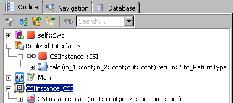

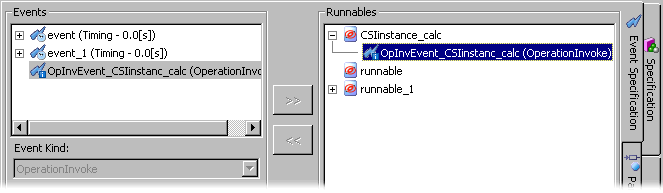

# Specifying a ClientServer Interface Prototype

To specify a ClientServer interface prototype, proceed as follows.

1. [Create](SenderReceiverEditorEnglishUS.chm::/SREcreateSenderReceiverInterface.htm) and [set up](senderreceivereditorenglishus.chm::/SRE_SetUp_ClientServerInterface.htm) a ClientServer interface.
1. Include the ClientServer interface in the software component as described in [Including a Component as a Complex Element](markdown/ascincludecomponent.md).
1. If the properties editor did not open automatically, right-click the ClientServer interface prototype in the Outline tab and select Properties from the context menu.
1. To create an Rport or client port, proceed as follows:
1. To create a Pport or server port, proceed as follows:

The following items appear [in the Outline tab](javascript:kadovTextPopup(this))<!-- kadovTextPopupInit('a1'); //-->:

- a server node named <instance name>::<interface component name> below the Realized Interfaces node
- a new diagram named <instance name>_<interface component name>
- in the new diagram, a server runnable named <instance name>_<operation name> for each operation in the client-server interface

In addition, an [operation-invoked event](javascript:kadovTextPopup(this))<!-- kadovTextPopupInit('a2'); //--> named OpInvEvent_<instance name>_<operation name> is added and assigned to the server runnable.

1. Open the <instance name>_<interface component name> diagram and specify the operation(s).

All graphical occurrences of a ClientServer interface prototype have the same port type. If you want to use the same ClientServer interface as Pport and Rport, you have to include the ClientServer interface a second time.

See also

[Enabling Concurrent Invocation of a Server Runnable](markdown/ASCenableConcurrentInvocation_ServerRunnable.md)

[Creating an AUTOSAR Interface](SenderReceiverEditorEnglishUS.chm::/SREcreateSenderReceiverInterface.htm)

[Setting Up a ClientServer Interface](SenderReceiverEditorEnglishUS.chm::/SRE_SetUp_ClientServerInterface.htm)

[Including a Component as a Complex Element](markdown/ascincludecomponent.md)

[Basics - ClientServer Interfaces](SenderReceiverEditorEnglishUS.chm::/SREBasicsClientServerInterfaces.htm)

[Ports and Interfaces](markdown/ASCportsInterfaces.md)

[Client-Server Communication](markdown/ASCClientServerCommunication.md)

[Showing and Hiding Confirmation Dialog Windows](ComponentManagerEnglishUS.chm::/CM_Showing_and_Hiding_Confirmation_Dialog_Windows.htm)

/* Heikki Komulainen, Comet Computer GmbH 2004 */ cc_plus_pic = '&nbsp;'; cc_minus_pic = '&nbsp;'; cc_stat_pic = '&nbsp;'; gpstyle = ''; var iframes_created = 0; if (document.body && document.body.insertAdjacentHTML && document.getElementsByTagName && document.getElementById) { collect_popups(); set_poplinks_pictures(); if (iframes_created) { document.write(gpstyle); document.write('
<nobr><a id="einauslink" style="position:absolute;top:expression(document.body.scrollTop + this.offsetHeight - this.offsetHeight);left:expression(document.body.offsetWidth - (this.offsetWidth + 28));background:white;padding:5px" href="javascript:show_all_poptext()">Alle texte einblenden</a></nobr>
'); } } function collect_popups() { bsscpopups = new Array(); for (x = 0; x < document.links.length; x++) { if (document.links[x].href.indexOf("BSSCPopup")>-1) { seekmatch = /BSSCPopup.'[^'](markdown/+)'/; poplink = seekmatch.exec(document.links[x].href); poplink = "" + poplink; poplink = poplink.substring(poplink.indexOf("'")+1, poplink.lastIndexOf("'")); ifid = "CCGENIFRAMEID" + x; new_iframe = '<iframe id="' + ifid + '"src="' + poplink + '" onload="get_text(\'' + ifid + '\')" width="0" height="0" frameborder=0></iframe>'; document.links[x].parentNode.insertAdjacentHTML("afterEnd", new_iframe); gpid = "CCID_" + ifid; document.links[x].href = "javascript:expand_poptext('" + gpid + "')"; cc_plus = '' + cc_plus_pic + ''; document.links[x].insertAdjacentHTML("afterBegin", cc_plus); iframes_created = 1; } } }// end function function get_text(ifr_id) { frpars = document.frames[ifr_id].document.getElementsByTagName("body"); popbody = frpars[0].innerHTML; gpid = "CCID_" + ifr_id; if (!document.getElementById(gpid)) { //avoiding doubles document.getElementById(ifr_id).insertAdjacentHTML("afterEnd", '
'+popbody+'
'); } }//end function function expand_poptext(x_frame_id) { if (!document.getElementById(x_frame_id)) return; if (document.getElementById(x_frame_id).className == "CCGENPOPTEXTH") { document.getElementById(x_frame_id).className = "CCGENPOPTEXTV"; document.getElementById(x_frame_id).style.visibility = "visible"; if (document.getElementById("CCPMB_" + x_frame_id )) { document.getElementById("CCPMB_" + x_frame_id ).innerHTML = cc_minus_pic; } } else { document.getElementById(x_frame_id).className = "CCGENPOPTEXTH"; document.getElementById(x_frame_id).style.visibility = "hidden"; if (document.getElementById("CCPMB_" + x_frame_id )) { document.getElementById("CCPMB_" + x_frame_id ).innerHTML = cc_plus_pic; } } }// end function function show_all_poptext() { var pulldowntxt = document.getElementsByTagName("div"); for (b = 0; b < pulldowntxt.length; b++) { if (pulldowntxt[b].className == "droptext") { pulldowntxt[b].style.display=""; } } var gptxt = document.getElementsByTagName("div"); for (z = 0; z < gptxt.length; z++) { if (gptxt[z].className == "CCGENPOPTEXTH") { gptxt[z].className = "CCGENPOPTEXTV"; gptxt[z].style.visibility = "visible"; if (document.getElementById("CCPMB_" + gptxt[z].id )) { document.getElementById("CCPMB_" + gptxt[z].id ).innerHTML = cc_minus_pic; } } } var dxpoplinks = document.getElementsByTagName("a"); if (dxpoplinks) { for (pxl = 0; pxl < dxpoplinks.length; pxl++) { if (dxpoplinks[pxl].href.indexOf("kadovTextPopup")>-1) { if (document.getElementById("CCPMB_" + dxpoplinks[pxl].id)) { document.getElementById("CCPMB_" + dxpoplinks[pxl].id).innerHTML = cc_stat_pic; dxpoplinks[pxl].symbol = "minus"; } } } } document.getElementById('einauslink').innerText = 'Alle texte ausblenden'; document.getElementById('einauslink').href = "javascript:self.location.reload()"; self.focus(); }// end function function eat_click() { return false; }// end function function set_poplinks_pictures() { var dpoplinks = document.getElementsByTagName("a"); if (dpoplinks) { for (pl = 0; pl < dpoplinks.length; pl++) { if (dpoplinks[pl].href.indexOf("kadovTextPopup")>-1) { cc_plus = '' + cc_stat_pic + ''; //dpoplinks[pl].onmouseup = plusminuspoplink; dpoplinks[pl].insertAdjacentHTML("afterBegin", cc_plus); dpoplinks[pl].symbol = "plus"; } } } }// end function function plusminuspoplink() { if (document.getElementById("CCPMB_" + this.id)) { if (this.symbol == "plus") { document.getElementById("CCPMB_" + this.id).innerHTML = cc_minus_pic; this.symbol = "minus"; } else { document.getElementById("CCPMB_" + this.id).innerHTML = cc_plus_pic; this.symbol = "plus"; } } return true; }

---

## Enabling Concurrent Invocation of a Server Runnable

_Source: `markdown/ASCenableConcurrentInvocation_ServerRunnable.md`_

# Enabling Concurrent Invocation of a Server Runnable

When a server runnable is set to be invoked concurrently, the RTE can optimize invocation by clients on the same ECU to a direct function call. This means that no queuing is required (or possible) and therefore multiple invocations of the server can occur concurrently.

Proceed as follows to allow concurrent invocation:

1. In the Outline tab, select the server runnable you want to modify.
1. Do one of the following:
1. Open the Settings tab.
1. Activate the Can be Invoked Concurrently option.
1. In the Minimum Start Time field, enter the start time in milliseconds.
1. Click OK to close the signature editor.

See also

[Editing the Signature of a Runnable or Method](markdown/asceditsignature.md)

---

## Making a Client Request on a Port

_Source: `markdown/ASCmakeClientRequest_on_Port.md`_

# Making a Client Request on a Port

If your software component uses a ClientServer interface as Rport, you must define at least one runnable entity that acts as the client. The user has to ensure that the client is triggered by an RTE event.

1. Open the SWC you want to edit.
1. Place the ClientServer interface prototype (Rport) in the drawing area.
1. In the Basic Blocks palette or toolbar, click on the  RTE Invoke button to add an RTE Invoke operator.
1. Place the operator in the drawing area.
1. Connect the return value of the desired operation in the Rport to the RTE Invoke operator.
1. Edit the operator sequence call [manually](markdown/ASCEditSequence.md) or [automatically](markdown/ASCassignindividual.md).
1. To select explicit access with status information, right-click the RTE Invoke operator and select Status from the context menu.
1. Specify the status inquiry as follows:

See also

[Editing a Sequence Call in the Sequence Editor](markdown/ASCEditSequence.md)

[Automatically Assigning Individual Sequence Calls](markdown/ASCassignindividual.md)

[Specifying a ClientServer Interface Prototype](markdown/ASCspecifyClientServerInterfacePrototype.md)

[Client-Server Communication](markdown/ASCClientServerCommunication.md)

[Enabling Concurrent Invocation of a Server Runnable](markdown/ASCenableConcurrentInvocation_ServerRunnable.md)

[RTE Access Macros - Error Codes](markdown/ASCrteAccessMacros.md#ErrorCode)

[Adding and Editing a Literal](BlockDiagramEditorEnglishUS.chm::/BDE_AddLiteral.htm)

---

## Specifying a Calibration Interface Prototype

_Source: `markdown/ASCspecifyCalibrationInterfacePrototype.md`_

# Specifying a Calibration Interface Prototype

To specify a Calibration interface prototype, proceed as follows.

1. [Create](SenderReceiverEditorEnglishUS.chm::/SREcreateSenderReceiverInterface.htm) and [set up](SenderReceiverEditorEnglishUS.chm::/SREsetupCalibrationInterface.htm) a Calibration interface.
1. Include the Calibration interface in the software component as described in [Including a Component as a Complex Element](markdown/ascincludecomponent.md).
1. If the properties editor did not open automatically, right-click the Calibration interface prototype in the Outline tab and select Properties from the context menu.
1. In the properties editor, enter a name and a comment for the Calibration interface.
1. Close the properties editor with OK.

See also

[Accessing Calibration Parameters](markdown/ASCaccessCalibrationParameters.md)

[Creating an AUTOSAR Interface](SenderReceiverEditorEnglishUS.chm::/SREcreateSenderReceiverInterface.htm)

[Setting Up a Calibration Interface](SenderReceiverEditorEnglishUS.chm::/SREsetupCalibrationInterface.htm)

[Including a Component as a Complex Element](markdown/ascincludecomponent.md)

[Basics - Calibration Interfaces](senderreceivereditorenglishus.chm::/SREBasicsCalibrationInterfaces.htm)

[Ports and Interfaces](markdown/ASCportsInterfaces.md)

[Calibration](markdown/ASCcalibration.md)

[Showing and Hiding Confirmation Dialog Windows](ComponentManagerEnglishUS.chm::/CM_Showing_and_Hiding_Confirmation_Dialog_Windows.htm)

---

## Accessing Calibration Parameters

_Source: `markdown/ASCaccessCalibrationParameters.md`_

- Parameters can be mapped as shown in the following table.

<table class="hcp1" x-use-null-cells="">
<col/>
<col/>
<tr class="hcp2" valign="top">
<td class="hcp3">

 
</td>
<td class="hcp3">

mapping
</td></tr>
<tr class="hcp2" valign="top">
<td class="hcp3" colspan="1" rowspan="2">

scalar parameters
</td>
<td class="hcp3">

to scalar elements of calibration interfaces
</td></tr>
<tr class="hcp2" valign="top">
<td class="hcp3">

to scalar elements of complex elements (records) 
 in calibration interfaces
</td></tr>
<tr class="hcp2" valign="top">
<td class="hcp3" colspan="1" rowspan="2">

composite parameters (arrays)
</td>
<td class="hcp3">

to composite elements (arrays) of calibration 
 interfaces
</td></tr>
<tr class="hcp2" valign="top">
<td class="hcp3">

to composite elements of complex elements (records) 
 in calibration interfaces
</td></tr>
<tr class="hcp2" valign="top">
<td class="hcp3" colspan="1" rowspan="2">

complex parameters (records)
</td>
<td class="hcp3" colspan="1" rowspan="1">

to complex elements (records) in calibration interfaces
</td></tr>
<tr class="hcp2" valign="top">
<td class="hcp3">

to complex elements of complex elements (records) 
 in calibration interfaces
</td></tr>
</table>

- A scalar parameter must be mapped to a scalar element of compatible type.

| Column 1 | Column 2 |
| --- | --- |
| parameter type | AUTOSAR element type |
| Continuous (cont) | cont / limitInt / wrapInt / sdisc / udisc |
| Limited Integer (limitInt) | limitInt / wrapInt |
| Wrap-Around Integer (wrapInt) | wrapInt |
| Signed Discrete (sdisc) | cont / limitInt / wrapInt / sdisc / udisc |
| Unsigned Discrete (udisc) | cont / limitInt / wrapInt / sdisc / udisc |
| Logic (log) | log |
| Enumeration (enum) | Enumeration of the same type |

When you map a scalar parameter to an element of compatible, but non-identical type, a warning (WMdl635) is issued during code generation.

When you map a scalar parameter to an element of incompatible type, an error (MMdl635) is issued during code generation.

- A composite parameter (array) must be mapped to an array of identical size, data type and implementation.

Otherwise, the mapping is indicated as invalid, and an error (MMdl635) is issued during code generation.

- A complex parameter must be mapped to a record of identical type and implementation.

Otherwise, the mapping is indicated as invalid, and an error (MMdl635) is issued during code generation.

1. Do one of the following:
1. Click on the Auto-Mapping button.

- Open the Mapping menu and select Auto-Mapping.

- Right-click in the Parameter Mapping view and select Auto-Mapping from the context menu.

All imported parameters and calibration parameters (including elements of records in the calibration interface) with identical element name and type are mapped. Names of interfaces or records are not considered. The results are shown in the Mapping field.

The mapped imported parameter and calibration parameter are removed from the upper table.

1. Double-click in a cell in the Calibration Parameter column.
1. Select a calibration parameter.

The mapping is performed. The results are shown in the Mapping field.

The mapped imported parameter and calibration parameter are removed from the upper table.

1. If necessary, click on  to show the upper table.
1. In the Imported Parameter column of the upper table, select an imported parameter.
1. In the Calibration Parameter column, select a calibration parameter.

The  button becomes available if the selected elements can be mapped.

1. Click on the  button to map the selected elements.

Or

1. Drag a message from the Messages column and drop it onto a suitable element in the Variables column.

The mapping is performed. The results are shown in the Mapping field.

The mapped imported parameter and calibration parameter are removed from the upper table.

1. In the Mapping field, Imported Parameter or Calibration Parameter column, select a mapped element.
1. Do one of the following:
1. Open the context menu or the Mapping menu and select Remove.
1. Press Delete.

1. Double-click a cell in the Calibration Parameter column and select <None>.

The mapping is removed. The imported parameter and the calibration parameter reappear in the upper table.

# Accessing Calibration Parameters

To access calibration parameters, proceed as follows.

1. [Specify the required Calibration interface prototype(s)](markdown/ASCspecifyCalibrationInterfacePrototype.md).
1. Open the Parameter Mapping tab.
1. If necessary, open the Mapping menu and select Update to import changes in the classes/modules and calibration interfaces into the SWC.
1. If desired, [filter](markdown/ASC_Filter_MappingViews.md) the columns.
1. To use automatic mapping, proceed [as follows](javascript:kadovTextPopup(this))<!-- kadovTextPopupInit('a1'); //-->.
1. To map imported parameters and calibration parameters manually in the Mapping field, proceed [as follows](javascript:kadovTextPopup(this))<!-- kadovTextPopupInit('a2'); //-->.
1. To map imported parameters and calibration parameters manually in the upper table (hidden by default), proceed [as follows](javascript:kadovTextPopup(this))<!-- kadovTextPopupInit('a3'); //-->.
1. If desired, [import](markdown/ASC_ImportMessageParameterMappings.md) an existing mapping.
1. To remove a mapping, proceed [as follows](javascript:kadovTextPopup(this))<!-- kadovTextPopupInit('a4'); //-->.

The middle column in the Mapping field shows the mapping status:  - unmapped /  - mapping is valid /  - mapping is invalid.

See also [Example: Accessing Calibration Parameters](markdown/ASC_ExampleAccessingCalibrationParameters.md)

See also

[Example: Accessing Calibration Parameters](markdown/ASC_ExampleAccessingCalibrationParameters.md)

[Parameter Mapping View](markdown/ASCParameterMappingView.md)

[Filtering the Mapping Views](markdown/ASC_Filter_MappingViews.md)

[Importing Message/Parameter Mappings](markdown/ASC_ImportMessageParameterMappings.md)

[Specifying a Calibration Interface Prototype](markdown/ASCspecifyCalibrationInterfacePrototype.md)

[Calibration](markdown/ASCcalibration.md)

/* Heikki Komulainen, Comet Computer GmbH 2004 */ cc_plus_pic = '&nbsp;'; cc_minus_pic = '&nbsp;'; cc_stat_pic = '&nbsp;'; gpstyle = ''; var iframes_created = 0; if (document.body && document.body.insertAdjacentHTML && document.getElementsByTagName && document.getElementById) { collect_popups(); set_poplinks_pictures(); if (iframes_created) { document.write(gpstyle); document.write('
<nobr><a id="einauslink" style="position:absolute;top:expression(document.body.scrollTop + this.offsetHeight - this.offsetHeight);left:expression(document.body.offsetWidth - (this.offsetWidth + 28));background:white;padding:5px" href="javascript:show_all_poptext()">Show all hidden text</a></nobr>
'); } } function collect_popups() { bsscpopups = new Array(); for (x = 0; x < document.links.length; x++) { if (document.links[x].href.indexOf("BSSCPopup")>-1) { seekmatch = /BSSCPopup.'[^'](markdown/+)'/; poplink = seekmatch.exec(document.links[x].href); poplink = "" + poplink; poplink = poplink.substring(poplink.indexOf("'")+1, poplink.lastIndexOf("'")); ifid = "CCGENIFRAMEID" + x; new_iframe = '<iframe id="' + ifid + '"src="' + poplink + '" onload="get_text(\'' + ifid + '\')" width="0" height="0" frameborder=0></iframe>'; document.links[x].parentNode.insertAdjacentHTML("afterEnd", new_iframe); gpid = "CCID_" + ifid; document.links[x].href = "javascript:expand_poptext('" + gpid + "')"; cc_plus = '' + cc_plus_pic + ''; document.links[x].insertAdjacentHTML("afterBegin", cc_plus); iframes_created = 1; } } }// end function function get_text(ifr_id) { frpars = document.frames[ifr_id].document.getElementsByTagName("body"); popbody = frpars[0].innerHTML; gpid = "CCID_" + ifr_id; if (!document.getElementById(gpid)) { //avoiding doubles document.getElementById(ifr_id).insertAdjacentHTML("afterEnd", '
'+popbody+'
'); } }//end function function expand_poptext(x_frame_id) { if (!document.getElementById(x_frame_id)) return; if (document.getElementById(x_frame_id).className == "CCGENPOPTEXTH") { document.getElementById(x_frame_id).className = "CCGENPOPTEXTV"; document.getElementById(x_frame_id).style.visibility = "visible"; if (document.getElementById("CCPMB_" + x_frame_id )) { document.getElementById("CCPMB_" + x_frame_id ).innerHTML = cc_minus_pic; } } else { document.getElementById(x_frame_id).className = "CCGENPOPTEXTH"; document.getElementById(x_frame_id).style.visibility = "hidden"; if (document.getElementById("CCPMB_" + x_frame_id )) { document.getElementById("CCPMB_" + x_frame_id ).innerHTML = cc_plus_pic; } } }// end function function show_all_poptext() { var pulldowntxt = document.getElementsByTagName("div"); for (b = 0; b < pulldowntxt.length; b++) { if (pulldowntxt[b].className == "droptext") { pulldowntxt[b].style.display=""; } } var gptxt = document.getElementsByTagName("div"); for (z = 0; z < gptxt.length; z++) { if (gptxt[z].className == "CCGENPOPTEXTH") { gptxt[z].className = "CCGENPOPTEXTV"; gptxt[z].style.visibility = "visible"; if (document.getElementById("CCPMB_" + gptxt[z].id )) { document.getElementById("CCPMB_" + gptxt[z].id ).innerHTML = cc_minus_pic; } } } var dxpoplinks = document.getElementsByTagName("a"); if (dxpoplinks) { for (pxl = 0; pxl < dxpoplinks.length; pxl++) { if (dxpoplinks[pxl].href.indexOf("kadovTextPopup")>-1) { if (document.getElementById("CCPMB_" + dxpoplinks[pxl].id)) { document.getElementById("CCPMB_" + dxpoplinks[pxl].id).innerHTML = cc_stat_pic; dxpoplinks[pxl].symbol = "minus"; } } } } document.getElementById('einauslink').innerText = 'Hide all hideable text'; document.getElementById('einauslink').href = "javascript:self.location.reload()"; self.focus(); }// end function function eat_click() { return false; }// end function function set_poplinks_pictures() { var dpoplinks = document.getElementsByTagName("a"); if (dpoplinks) { for (pl = 0; pl < dpoplinks.length; pl++) { if (dpoplinks[pl].href.indexOf("kadovTextPopup")>-1) { cc_plus = '' + cc_stat_pic + ''; //dpoplinks[pl].onmouseup = plusminuspoplink; dpoplinks[pl].insertAdjacentHTML("afterBegin", cc_plus); dpoplinks[pl].symbol = "plus"; } } } }// end function function plusminuspoplink() { if (document.getElementById("CCPMB_" + this.id)) { if (this.symbol == "plus") { document.getElementById("CCPMB_" + this.id).innerHTML = cc_minus_pic; this.symbol = "minus"; } else { document.getElementById("CCPMB_" + this.id).innerHTML = cc_plus_pic; this.symbol = "plus"; } } return true; }

---

## Example: Accessing Calibration Parameters

_Source: `markdown/ASC_ExampleAccessingCalibrationParameters.md`_

# Example: Accessing Calibration Parameters

The following class with several imported parameters is added to an SWC.

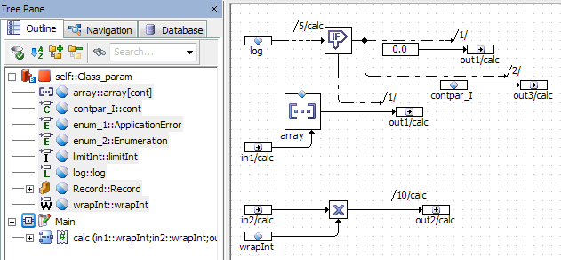

A Calibration interface with several parameters is also added to the SWC. Parameter mapping is performed with the Auto-Mapping button; contpar_I is manually mapped to the record element cont. The result is shown below.

With that mapping, the following C code is generated. Effects of the mapping are set in bold.

FUNC(void, SWC_p_example_CODE) CLASS_PARAM_IMPL_calc (

/* IN */ VAR(uint32, AUTOMATIC) in1,

/* IN */ VAR(uint32, AUTOMATIC) in2,

/* OUT */ P2VAR(float64, AUTOMATIC, RTE_APPL_DATA) out1,

/* OUT */ P2VAR(uint32, AUTOMATIC, RTE_APPL_DATA) out2,

/* OUT */ P2VAR(float64, AUTOMATIC, RTE_APPL_DATA) out3

)

{

/* calc: sequence call #5 */

if (Rte_Prm_Calibration_Record()->log)

{

/* If-block: sequence call #5/Then #1 */

(*out1) = 0.0;

/* If-block: sequence call #5/Then #2 */

(*out3) = Rte_Prm_Calibration_Record()->cont;

}

else

{

/* If-block: sequence call #5/Else #1 */

(*out1) = Rte_Prm_Calibration_array()[((in1 <= 3U) ? in1 : 3U)];

} /* end if */

/* calc: sequence call #10 */

(*out2) = in2 * Rte_Prm_Calibration_wrapInt();

}

---

## Creating an Exclusive Area

_Source: `markdown/ASCcreateExclusiveArea.md`_

# Creating an Exclusive Area

To create an exclusive area, proceed as follows.

1. In the Elements palette, click on the  Resource button.
1. Place the resource in the drawing area.
1. Edit the Reserve and Release methods [manually](markdown/ASCEditSequence.md) or [automatically](markdown/ASCassignindividual.md).
1. [Use the exclusive area](markdown/ASCusingExclusiveAreas.md).

See also

[Exclusive Areas](markdown/ASCexclusiveAreas.md)

[Using Exclusive Areas](markdown/ASCusingExclusiveAreas.md)

[Editing a Sequence Call in the Sequence Editor](markdown/ASCEditSequence.md)

[Automatically Assigning Individual Sequence Calls](markdown/ASCassignindividual.md)

[Introduction - Resources](IntroductionEnglishUS.chm::/INT_resources.htm)

---

## Using Exclusive Areas

_Source: `markdown/ASCusingExclusiveAreas.md`_

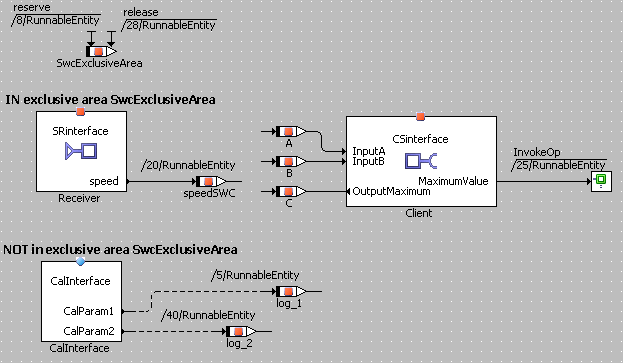

# Using Exclusive Areas

To use an exclusive area, proceed as follows.

1. [Create an exclusive area.](markdown/ASCcreateExclusiveArea.md)
1. Assign sequence numbers between the numbers of the Reserve and Release methods to all assignments you want to place in the exclusive area.
1. If desired, make sure that the return value of the access operation is written to a temporary variable.

See also

[Exclusive Areas](markdown/ASCexclusiveAreas.md)

[Creating an Exclusive Area](markdown/ASCcreateExclusiveArea.md)

[Editing a Sequence Call in the Sequence Editor](markdown/ASCEditSequence.md)

[Automatically Assigning Individual Sequence Calls](markdown/ASCassignindividual.md)

/* Heikki Komulainen, Comet Computer GmbH 2004 */ cc_plus_pic = '&nbsp;'; cc_minus_pic = '&nbsp;'; cc_stat_pic = '&nbsp;'; gpstyle = ''; var iframes_created = 0; if (document.body && document.body.insertAdjacentHTML && document.getElementsByTagName && document.getElementById) { collect_popups(); set_poplinks_pictures(); if (iframes_created) { document.write(gpstyle); document.write('
<nobr><a id="einauslink" style="position:absolute;top:expression(document.body.scrollTop + this.offsetHeight - this.offsetHeight);left:expression(document.body.offsetWidth - (this.offsetWidth + 28));background:white;padding:5px" href="javascript:show_all_poptext()">Alle texte einblenden</a></nobr>
'); } } function collect_popups() { bsscpopups = new Array(); for (x = 0; x < document.links.length; x++) { if (document.links[x].href.indexOf("BSSCPopup")>-1) { seekmatch = /BSSCPopup.'[^'](markdown/+)'/; poplink = seekmatch.exec(document.links[x].href); poplink = "" + poplink; poplink = poplink.substring(poplink.indexOf("'")+1, poplink.lastIndexOf("'")); ifid = "CCGENIFRAMEID" + x; new_iframe = '<iframe id="' + ifid + '"src="' + poplink + '" onload="get_text(\'' + ifid + '\')" width="0" height="0" frameborder=0></iframe>'; document.links[x].parentNode.insertAdjacentHTML("afterEnd", new_iframe); gpid = "CCID_" + ifid; document.links[x].href = "javascript:expand_poptext('" + gpid + "')"; cc_plus = '' + cc_plus_pic + ''; document.links[x].insertAdjacentHTML("afterBegin", cc_plus); iframes_created = 1; } } }// end function function get_text(ifr_id) { frpars = document.frames[ifr_id].document.getElementsByTagName("body"); popbody = frpars[0].innerHTML; gpid = "CCID_" + ifr_id; if (!document.getElementById(gpid)) { //avoiding doubles document.getElementById(ifr_id).insertAdjacentHTML("afterEnd", '
'+popbody+'
'); } }//end function function expand_poptext(x_frame_id) { if (!document.getElementById(x_frame_id)) return; if (document.getElementById(x_frame_id).className == "CCGENPOPTEXTH") { document.getElementById(x_frame_id).className = "CCGENPOPTEXTV"; document.getElementById(x_frame_id).style.visibility = "visible"; if (document.getElementById("CCPMB_" + x_frame_id )) { document.getElementById("CCPMB_" + x_frame_id ).innerHTML = cc_minus_pic; } } else { document.getElementById(x_frame_id).className = "CCGENPOPTEXTH"; document.getElementById(x_frame_id).style.visibility = "hidden"; if (document.getElementById("CCPMB_" + x_frame_id )) { document.getElementById("CCPMB_" + x_frame_id ).innerHTML = cc_plus_pic; } } }// end function function show_all_poptext() { var pulldowntxt = document.getElementsByTagName("div"); for (b = 0; b < pulldowntxt.length; b++) { if (pulldowntxt[b].className == "droptext") { pulldowntxt[b].style.display=""; } } var gptxt = document.getElementsByTagName("div"); for (z = 0; z < gptxt.length; z++) { if (gptxt[z].className == "CCGENPOPTEXTH") { gptxt[z].className = "CCGENPOPTEXTV"; gptxt[z].style.visibility = "visible"; if (document.getElementById("CCPMB_" + gptxt[z].id )) { document.getElementById("CCPMB_" + gptxt[z].id ).innerHTML = cc_minus_pic; } } } var dxpoplinks = document.getElementsByTagName("a"); if (dxpoplinks) { for (pxl = 0; pxl < dxpoplinks.length; pxl++) { if (dxpoplinks[pxl].href.indexOf("kadovTextPopup")>-1) { if (document.getElementById("CCPMB_" + dxpoplinks[pxl].id)) { document.getElementById("CCPMB_" + dxpoplinks[pxl].id).innerHTML = cc_stat_pic; dxpoplinks[pxl].symbol = "minus"; } } } } document.getElementById('einauslink').innerText = 'Alle texte ausblenden'; document.getElementById('einauslink').href = "javascript:self.location.reload()"; self.focus(); }// end function function eat_click() { return false; }// end function function set_poplinks_pictures() { var dpoplinks = document.getElementsByTagName("a"); if (dpoplinks) { for (pl = 0; pl < dpoplinks.length; pl++) { if (dpoplinks[pl].href.indexOf("kadovTextPopup")>-1) { cc_plus = '' + cc_stat_pic + ''; //dpoplinks[pl].onmouseup = plusminuspoplink; dpoplinks[pl].insertAdjacentHTML("afterBegin", cc_plus); dpoplinks[pl].symbol = "plus"; } } } }// end function function plusminuspoplink() { if (document.getElementById("CCPMB_" + this.id)) { if (this.symbol == "plus") { document.getElementById("CCPMB_" + this.id).innerHTML = cc_minus_pic; this.symbol = "minus"; } else { document.getElementById("CCPMB_" + this.id).innerHTML = cc_plus_pic; this.symbol = "plus"; } } return true; }

---

## Creating a Scalar Interrunnable Variable

_Source: `markdown/asc_createinterrunnablevariable.md`_

# Creating a Scalar Interrunnable Variable

To create a scalar interrunnable variable, proceed as follows:

1. In the Elements palette or toolbar, click on the  Interrunnable Variable button.
1. In the properties editor, Internal Access area, activate the Implicit or Explicit option to select the respective communication mode.
1. Set other properties according to your needs.
1. If you do not want to open the properties editor upon an element’s creation, deactivate the Always Show Editor for new Elements option at the bottom of the editor.
1. Close the properties editor with OK.
1. Click inside the drawing area to place the new element.

In the Outline tab, a new element is added.

You cannot use the  Interrunnable Variable button to create an interrunnable variable of non-scalar (i.e. array or record) type, and you cannot convert a scalar interrunnable variable into an interrunnable variable of non-scalar type. If you need an interrunnable variable of non-scalar type, proceed as described in [Creating an Interrunnable Variable of Non-Scalar Type](markdown/RCE_CreateInterrunnableVariable_Record.md).

See also

[Interrunnable Variables](markdown/ASC_InterrunnableVariables.md)

[Creating an Interrunnable Variable of Non-Scalar Type](markdown/RCE_CreateInterrunnableVariable_Record.md)

[Reserved Keywords](IntroductionEnglishUS.chm::/INT_Reserved_Keywords.htm)

[Editing Element Properties - Overview](ElementEditorEnglishUS.chm::/EEd_Overview.htm)

[Confirmation Dialog Options](ComponentManagerEnglishUS.chm::/CM_Options_for_Confirmation_Dialogs.htm)

---

## Creating an Interrunnable Variable of Non-Scalar Type

_Source: `markdown/RCE_CreateInterrunnableVariable_Record.md`_

# Creating an Interrunnable Variable of Non-Scalar Type

To create a non-scalar interrunnable variable (i.e. an interrunnable variable of array or record type), proceed as follows:

1. Do one of the following:
1. Open the Kind combo box and select Interrunnable Variable.
1. Adjust the other properties according to your needs and click OK.

The non-scalar interrunnable variable is listed in the Outline tab. Its elements are available for Message Mapping; they appear in the Internal Access tab. See [Accessing ASCET Messages](markdown/asc_accessmessages.md) for more details.

See also

[Interrunnable Variables](markdown/ASC_InterrunnableVariables.md)

[Creating a Scalar Interrunnable Variable](markdown/asc_createinterrunnablevariable.md)

[Accessing ASCET Messages](markdown/asc_accessmessages.md)

[Records - Overview](RecordsEnglishUS.chm::/RC_overview.htm)

---

## Mapping Messages and Parameters

_Source: `markdown/ASC_MapMessagesParameters.md`_

# Mapping Messages and Parameters

Mapping ASCET messages and imported parameters to suitable AUTOSAR elements includes the following steps:

- [Accessing ASCET Messages](markdown/asc_accessmessages.md)
- [Accessing Calibration Parameters](markdown/ASCaccessCalibrationParameters.md)
- [Exporting Message/Parameter Mappings](markdown/ASC_ExportMessageParameterMappings.md)
- [Importing Message/Parameter Mappings](markdown/ASC_ImportMessageParameterMappings.md)
- [Filtering the Mapping Views](markdown/ASC_Filter_MappingViews.md)

---

## Accessing ASCET Messages

_Source: `markdown/asc_accessmessages.md`_

1. Do one of the following:
1. Click on the Auto-Mapping button.

- Open the Mapping menu and select Auto-Mapping.

- Right-click in the Message Mapping view and select Auto-Mapping from the context menu.

Messages and interrunnable variables or elements of SenderReceiver/NVData interfaces with identical element name and type are mapped. Names of modules, interfaces or records are not considered. The results are shown in the Mapping field.

A message labeled as S or S/R in the Mapping field with several matching counterparts is mapped to each counterpart. Each mapping is represented by a separate row in the Mapping field.

A message labeled as R in the Mapping field is mapped to the first matching counterpart. Other counterparts are ignored.

Messages with no matching counterpart remain unmapped.

The mapped element is removed from the Variables column of the upper table. A mapped receive message is removed from the Messages column of the upper table.

You cannot use the Mapping field for multiple mappings of the same message.

1. Double-click in a cell in the Variables column.
1. Select an element.

The mapping is performed. The results are shown in the Mapping field.

The mapped element is removed from the Variables column of the upper table. A mapped receive message is removed from the Messages column of the upper table.

Or - as an alternative in the Internal Access tab -

1. In the Messages column, select an unmapped message.
1. Right-click the message and select Create Interrunnable

A new interrunnable variable with the same name, type, and implementation, as the message is created in the SWC, and mapped to the message.

The mapped message is removed from the Messages column of the upper table.

1. If necessary, click on  to show the upper table.
1. In the Messages column of the upper table, select a message.
1. In the Variables column, select an interrunnable variable or SenderReceiver/NVData interface element.
1. Click on  to map the selected elements.

Or

1. Drag a message from the Messages column and drop it onto a suitable element in the Variables column.

The mapping is performed. The results are shown in the Mapping field.

The mapped element is removed from the Variables column of the upper table. A mapped receive message is removed from the Messages column of the upper table, other messages remain in that column.

1. In the Mapping field, Messages or Variables column, select a mapped element.
1. Do one of the following:
1. Open the context menu or the Mapping menu and select Remove.
1. Press Delete.

Or

1. In the Mapping field, double-click a cell in the Variables column and select <None>.

The mapping is removed. If it was the 1+nth mapping of a Send or SendReceive message, the entire line is removed from the Mapping field.

The interrunnable variable or SenderReceiver/NVData interface element reappears in the upper table.

If the message is a Receive message, it reappears in the upper table, too.

# Accessing ASCET Messages

If your SWC uses one or more modules that contain ASCET messages, all messages must be mapped to suitable interrunnable variables or ports of SenderReceiver or NVData interfaces. To map messages and interrunnable variables or ports, proceed as follows.

1. [Include](markdown/ascincludecomponent.md) the necessary module(s) and SenderReceiver/NVData interface(s).
1. Open the Message Mapping view and go to the desired tab.
1. If necessary, open the Mapping menu and select Update to import changes in the modules and SenderReceiver/NVData interfaces into the SWC.
1. If desired, [filter](markdown/ASC_Filter_MappingViews.md) the columns.
1. To use automatic mapping, proceed [as follows](javascript:kadovTextPopup(this))<!-- kadovTextPopupInit('a2'); //-->.
1. To map messages and interrunnable variables or elements of SenderReceiver/NVData interfaces manually in the Mapping field, proceed [as follows](javascript:kadovTextPopup(this))<!-- kadovTextPopupInit('a3'); //-->.
1. To map messages and interrunnable variables or elements of SenderReceiver/NVData interfaces manually in the upper table (hidden by default), proceed [as follows](javascript:kadovTextPopup(this))<!-- kadovTextPopupInit('a4'); //-->.
1. If desired, [import](markdown/ASC_ImportMessageParameterMappings.md) an existing mapping.
1. To remove a mapping, proceed [as follows](javascript:kadovTextPopup(this))<!-- kadovTextPopupInit('a5'); //-->.

Changed mappings are indicated by blue font in the Variables column of the Mapping field.

The icon column in the Mapping field shows the mapping status:  - unmapped /  - mapping is valid /  - mapping is invalid.

See also [Example: Accessing ASCET Messages](markdown/ASC_ExampleAccessMessages.md)

See also

[Message Mapping](markdown/ASC_MessageMapping.md)

[Example: Accessing ASCET Messages](markdown/ASC_ExampleAccessMessages.md)

[Message Mapping View](markdown/ASC_MessageMappingView.md)

[Filtering the Mapping Views](markdown/ASC_Filter_MappingViews.md)

[Importing Message/Parameter Mappings](markdown/ASC_ImportMessageParameterMappings.md)

[Exporting Message/Parameter Mappings](markdown/ASC_ExportMessageParameterMappings.md)

[I](markdown/ascincludecomponent.md)ncluding a Component as a Complex Element

/* Heikki Komulainen, Comet Computer GmbH 2004 */ cc_plus_pic = '&nbsp;'; cc_minus_pic = '&nbsp;'; cc_stat_pic = '&nbsp;'; gpstyle = ''; var iframes_created = 0; if (document.body && document.body.insertAdjacentHTML && document.getElementsByTagName && document.getElementById) { collect_popups(); set_poplinks_pictures(); if (iframes_created) { document.write(gpstyle); document.write('
<nobr><a id="einauslink" style="position:absolute;top:expression(document.body.scrollTop + this.offsetHeight - this.offsetHeight);left:expression(document.body.offsetWidth - (this.offsetWidth + 28));background:white;padding:5px" href="javascript:show_all_poptext()">Show all hidden text</a></nobr>
'); } } function collect_popups() { bsscpopups = new Array(); for (x = 0; x < document.links.length; x++) { if (document.links[x].href.indexOf("BSSCPopup")>-1) { seekmatch = /BSSCPopup.'[^'](markdown/+)'/; poplink = seekmatch.exec(document.links[x].href); poplink = "" + poplink; poplink = poplink.substring(poplink.indexOf("'")+1, poplink.lastIndexOf("'")); ifid = "CCGENIFRAMEID" + x; new_iframe = '<iframe id="' + ifid + '"src="' + poplink + '" onload="get_text(\'' + ifid + '\')" width="0" height="0" frameborder=0></iframe>'; document.links[x].parentNode.insertAdjacentHTML("afterEnd", new_iframe); gpid = "CCID_" + ifid; document.links[x].href = "javascript:expand_poptext('" + gpid + "')"; cc_plus = '' + cc_plus_pic + ''; document.links[x].insertAdjacentHTML("afterBegin", cc_plus); iframes_created = 1; } } }// end function function get_text(ifr_id) { frpars = document.frames[ifr_id].document.getElementsByTagName("body"); popbody = frpars[0].innerHTML; gpid = "CCID_" + ifr_id; if (!document.getElementById(gpid)) { //avoiding doubles document.getElementById(ifr_id).insertAdjacentHTML("afterEnd", '
'+popbody+'
'); } }//end function function expand_poptext(x_frame_id) { if (!document.getElementById(x_frame_id)) return; if (document.getElementById(x_frame_id).className == "CCGENPOPTEXTH") { document.getElementById(x_frame_id).className = "CCGENPOPTEXTV"; document.getElementById(x_frame_id).style.visibility = "visible"; if (document.getElementById("CCPMB_" + x_frame_id )) { document.getElementById("CCPMB_" + x_frame_id ).innerHTML = cc_minus_pic; } } else { document.getElementById(x_frame_id).className = "CCGENPOPTEXTH"; document.getElementById(x_frame_id).style.visibility = "hidden"; if (document.getElementById("CCPMB_" + x_frame_id )) { document.getElementById("CCPMB_" + x_frame_id ).innerHTML = cc_plus_pic; } } }// end function function show_all_poptext() { var pulldowntxt = document.getElementsByTagName("div"); for (b = 0; b < pulldowntxt.length; b++) { if (pulldowntxt[b].className == "droptext") { pulldowntxt[b].style.display=""; } } var gptxt = document.getElementsByTagName("div"); for (z = 0; z < gptxt.length; z++) { if (gptxt[z].className == "CCGENPOPTEXTH") { gptxt[z].className = "CCGENPOPTEXTV"; gptxt[z].style.visibility = "visible"; if (document.getElementById("CCPMB_" + gptxt[z].id )) { document.getElementById("CCPMB_" + gptxt[z].id ).innerHTML = cc_minus_pic; } } } var dxpoplinks = document.getElementsByTagName("a"); if (dxpoplinks) { for (pxl = 0; pxl < dxpoplinks.length; pxl++) { if (dxpoplinks[pxl].href.indexOf("kadovTextPopup")>-1) { if (document.getElementById("CCPMB_" + dxpoplinks[pxl].id)) { document.getElementById("CCPMB_" + dxpoplinks[pxl].id).innerHTML = cc_stat_pic; dxpoplinks[pxl].symbol = "minus"; } } } } document.getElementById('einauslink').innerText = 'Hide all hideable text'; document.getElementById('einauslink').href = "javascript:self.location.reload()"; self.focus(); }// end function function eat_click() { return false; }// end function function set_poplinks_pictures() { var dpoplinks = document.getElementsByTagName("a"); if (dpoplinks) { for (pl = 0; pl < dpoplinks.length; pl++) { if (dpoplinks[pl].href.indexOf("kadovTextPopup")>-1) { cc_plus = '' + cc_stat_pic + ''; //dpoplinks[pl].onmouseup = plusminuspoplink; dpoplinks[pl].insertAdjacentHTML("afterBegin", cc_plus); dpoplinks[pl].symbol = "plus"; } } } }// end function function plusminuspoplink() { if (document.getElementById("CCPMB_" + this.id)) { if (this.symbol == "plus") { document.getElementById("CCPMB_" + this.id).innerHTML = cc_minus_pic; this.symbol = "minus"; } else { document.getElementById("CCPMB_" + this.id).innerHTML = cc_plus_pic; this.symbol = "plus"; } } return true; }

---

## Example: Accessing ASCET Messages

_Source: `markdown/ASC_ExampleAccessMessages.md`_

# Example: Accessing ASCET Messages

The following module with several messages is added to an SWC.

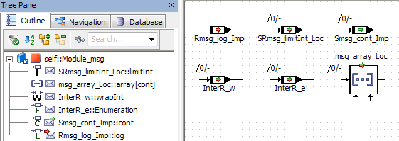

Several interrunnable variables are also added to the SWC. Message mapping is performed with the Auto-Mapping button, and two messages are mapped manually; the result is shown below.

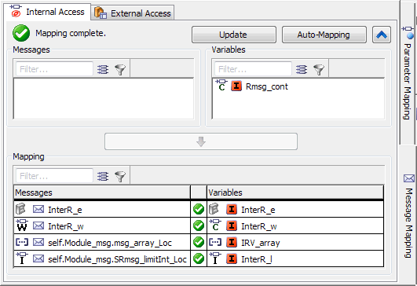

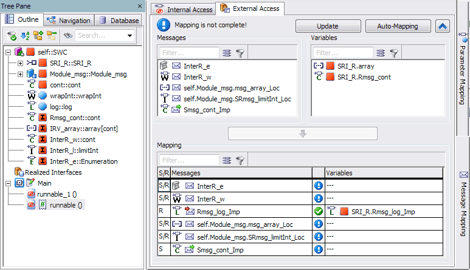

---

## Accessing Calibration Parameters

_Source: `markdown/ASCaccessCalibrationParameters.md`_

- Parameters can be mapped as shown in the following table.

<table class="hcp1" x-use-null-cells="">
<col/>
<col/>
<tr class="hcp2" valign="top">
<td class="hcp3">

 
</td>
<td class="hcp3">

mapping
</td></tr>
<tr class="hcp2" valign="top">
<td class="hcp3" colspan="1" rowspan="2">

scalar parameters
</td>
<td class="hcp3">

to scalar elements of calibration interfaces
</td></tr>
<tr class="hcp2" valign="top">
<td class="hcp3">

to scalar elements of complex elements (records) 
 in calibration interfaces
</td></tr>
<tr class="hcp2" valign="top">
<td class="hcp3" colspan="1" rowspan="2">

composite parameters (arrays)
</td>
<td class="hcp3">

to composite elements (arrays) of calibration 
 interfaces
</td></tr>
<tr class="hcp2" valign="top">
<td class="hcp3">

to composite elements of complex elements (records) 
 in calibration interfaces
</td></tr>
<tr class="hcp2" valign="top">
<td class="hcp3" colspan="1" rowspan="2">

complex parameters (records)
</td>
<td class="hcp3" colspan="1" rowspan="1">

to complex elements (records) in calibration interfaces
</td></tr>
<tr class="hcp2" valign="top">
<td class="hcp3">

to complex elements of complex elements (records) 
 in calibration interfaces
</td></tr>
</table>

- A scalar parameter must be mapped to a scalar element of compatible type.

| Column 1 | Column 2 |
| --- | --- |
| parameter type | AUTOSAR element type |
| Continuous (cont) | cont / limitInt / wrapInt / sdisc / udisc |
| Limited Integer (limitInt) | limitInt / wrapInt |
| Wrap-Around Integer (wrapInt) | wrapInt |
| Signed Discrete (sdisc) | cont / limitInt / wrapInt / sdisc / udisc |
| Unsigned Discrete (udisc) | cont / limitInt / wrapInt / sdisc / udisc |
| Logic (log) | log |
| Enumeration (enum) | Enumeration of the same type |

When you map a scalar parameter to an element of compatible, but non-identical type, a warning (WMdl635) is issued during code generation.

When you map a scalar parameter to an element of incompatible type, an error (MMdl635) is issued during code generation.

- A composite parameter (array) must be mapped to an array of identical size, data type and implementation.

Otherwise, the mapping is indicated as invalid, and an error (MMdl635) is issued during code generation.

- A complex parameter must be mapped to a record of identical type and implementation.

Otherwise, the mapping is indicated as invalid, and an error (MMdl635) is issued during code generation.

1. Do one of the following:
1. Click on the Auto-Mapping button.

- Open the Mapping menu and select Auto-Mapping.

- Right-click in the Parameter Mapping view and select Auto-Mapping from the context menu.

All imported parameters and calibration parameters (including elements of records in the calibration interface) with identical element name and type are mapped. Names of interfaces or records are not considered. The results are shown in the Mapping field.

The mapped imported parameter and calibration parameter are removed from the upper table.

1. Double-click in a cell in the Calibration Parameter column.
1. Select a calibration parameter.

The mapping is performed. The results are shown in the Mapping field.

The mapped imported parameter and calibration parameter are removed from the upper table.

1. If necessary, click on  to show the upper table.
1. In the Imported Parameter column of the upper table, select an imported parameter.
1. In the Calibration Parameter column, select a calibration parameter.

The  button becomes available if the selected elements can be mapped.

1. Click on the  button to map the selected elements.

Or

1. Drag a message from the Messages column and drop it onto a suitable element in the Variables column.

The mapping is performed. The results are shown in the Mapping field.

The mapped imported parameter and calibration parameter are removed from the upper table.

1. In the Mapping field, Imported Parameter or Calibration Parameter column, select a mapped element.
1. Do one of the following:
1. Open the context menu or the Mapping menu and select Remove.
1. Press Delete.

1. Double-click a cell in the Calibration Parameter column and select <None>.

The mapping is removed. The imported parameter and the calibration parameter reappear in the upper table.

# Accessing Calibration Parameters

To access calibration parameters, proceed as follows.

1. [Specify the required Calibration interface prototype(s)](markdown/ASCspecifyCalibrationInterfacePrototype.md).
1. Open the Parameter Mapping tab.
1. If necessary, open the Mapping menu and select Update to import changes in the classes/modules and calibration interfaces into the SWC.
1. If desired, [filter](markdown/ASC_Filter_MappingViews.md) the columns.
1. To use automatic mapping, proceed [as follows](javascript:kadovTextPopup(this))<!-- kadovTextPopupInit('a1'); //-->.
1. To map imported parameters and calibration parameters manually in the Mapping field, proceed [as follows](javascript:kadovTextPopup(this))<!-- kadovTextPopupInit('a2'); //-->.
1. To map imported parameters and calibration parameters manually in the upper table (hidden by default), proceed [as follows](javascript:kadovTextPopup(this))<!-- kadovTextPopupInit('a3'); //-->.
1. If desired, [import](markdown/ASC_ImportMessageParameterMappings.md) an existing mapping.
1. To remove a mapping, proceed [as follows](javascript:kadovTextPopup(this))<!-- kadovTextPopupInit('a4'); //-->.

The middle column in the Mapping field shows the mapping status:  - unmapped /  - mapping is valid /  - mapping is invalid.

See also [Example: Accessing Calibration Parameters](markdown/ASC_ExampleAccessingCalibrationParameters.md)

See also

[Example: Accessing Calibration Parameters](markdown/ASC_ExampleAccessingCalibrationParameters.md)

[Parameter Mapping View](markdown/ASCParameterMappingView.md)

[Filtering the Mapping Views](markdown/ASC_Filter_MappingViews.md)

[Importing Message/Parameter Mappings](markdown/ASC_ImportMessageParameterMappings.md)

[Specifying a Calibration Interface Prototype](markdown/ASCspecifyCalibrationInterfacePrototype.md)

[Calibration](markdown/ASCcalibration.md)

/* Heikki Komulainen, Comet Computer GmbH 2004 */ cc_plus_pic = '&nbsp;'; cc_minus_pic = '&nbsp;'; cc_stat_pic = '&nbsp;'; gpstyle = ''; var iframes_created = 0; if (document.body && document.body.insertAdjacentHTML && document.getElementsByTagName && document.getElementById) { collect_popups(); set_poplinks_pictures(); if (iframes_created) { document.write(gpstyle); document.write('
<nobr><a id="einauslink" style="position:absolute;top:expression(document.body.scrollTop + this.offsetHeight - this.offsetHeight);left:expression(document.body.offsetWidth - (this.offsetWidth + 28));background:white;padding:5px" href="javascript:show_all_poptext()">Show all hidden text</a></nobr>
'); } } function collect_popups() { bsscpopups = new Array(); for (x = 0; x < document.links.length; x++) { if (document.links[x].href.indexOf("BSSCPopup")>-1) { seekmatch = /BSSCPopup.'[^'](markdown/+)'/; poplink = seekmatch.exec(document.links[x].href); poplink = "" + poplink; poplink = poplink.substring(poplink.indexOf("'")+1, poplink.lastIndexOf("'")); ifid = "CCGENIFRAMEID" + x; new_iframe = '<iframe id="' + ifid + '"src="' + poplink + '" onload="get_text(\'' + ifid + '\')" width="0" height="0" frameborder=0></iframe>'; document.links[x].parentNode.insertAdjacentHTML("afterEnd", new_iframe); gpid = "CCID_" + ifid; document.links[x].href = "javascript:expand_poptext('" + gpid + "')"; cc_plus = '' + cc_plus_pic + ''; document.links[x].insertAdjacentHTML("afterBegin", cc_plus); iframes_created = 1; } } }// end function function get_text(ifr_id) { frpars = document.frames[ifr_id].document.getElementsByTagName("body"); popbody = frpars[0].innerHTML; gpid = "CCID_" + ifr_id; if (!document.getElementById(gpid)) { //avoiding doubles document.getElementById(ifr_id).insertAdjacentHTML("afterEnd", '
'+popbody+'
'); } }//end function function expand_poptext(x_frame_id) { if (!document.getElementById(x_frame_id)) return; if (document.getElementById(x_frame_id).className == "CCGENPOPTEXTH") { document.getElementById(x_frame_id).className = "CCGENPOPTEXTV"; document.getElementById(x_frame_id).style.visibility = "visible"; if (document.getElementById("CCPMB_" + x_frame_id )) { document.getElementById("CCPMB_" + x_frame_id ).innerHTML = cc_minus_pic; } } else { document.getElementById(x_frame_id).className = "CCGENPOPTEXTH"; document.getElementById(x_frame_id).style.visibility = "hidden"; if (document.getElementById("CCPMB_" + x_frame_id )) { document.getElementById("CCPMB_" + x_frame_id ).innerHTML = cc_plus_pic; } } }// end function function show_all_poptext() { var pulldowntxt = document.getElementsByTagName("div"); for (b = 0; b < pulldowntxt.length; b++) { if (pulldowntxt[b].className == "droptext") { pulldowntxt[b].style.display=""; } } var gptxt = document.getElementsByTagName("div"); for (z = 0; z < gptxt.length; z++) { if (gptxt[z].className == "CCGENPOPTEXTH") { gptxt[z].className = "CCGENPOPTEXTV"; gptxt[z].style.visibility = "visible"; if (document.getElementById("CCPMB_" + gptxt[z].id )) { document.getElementById("CCPMB_" + gptxt[z].id ).innerHTML = cc_minus_pic; } } } var dxpoplinks = document.getElementsByTagName("a"); if (dxpoplinks) { for (pxl = 0; pxl < dxpoplinks.length; pxl++) { if (dxpoplinks[pxl].href.indexOf("kadovTextPopup")>-1) { if (document.getElementById("CCPMB_" + dxpoplinks[pxl].id)) { document.getElementById("CCPMB_" + dxpoplinks[pxl].id).innerHTML = cc_stat_pic; dxpoplinks[pxl].symbol = "minus"; } } } } document.getElementById('einauslink').innerText = 'Hide all hideable text'; document.getElementById('einauslink').href = "javascript:self.location.reload()"; self.focus(); }// end function function eat_click() { return false; }// end function function set_poplinks_pictures() { var dpoplinks = document.getElementsByTagName("a"); if (dpoplinks) { for (pl = 0; pl < dpoplinks.length; pl++) { if (dpoplinks[pl].href.indexOf("kadovTextPopup")>-1) { cc_plus = '' + cc_stat_pic + ''; //dpoplinks[pl].onmouseup = plusminuspoplink; dpoplinks[pl].insertAdjacentHTML("afterBegin", cc_plus); dpoplinks[pl].symbol = "plus"; } } } }// end function function plusminuspoplink() { if (document.getElementById("CCPMB_" + this.id)) { if (this.symbol == "plus") { document.getElementById("CCPMB_" + this.id).innerHTML = cc_minus_pic; this.symbol = "minus"; } else { document.getElementById("CCPMB_" + this.id).innerHTML = cc_plus_pic; this.symbol = "plus"; } } return true; }

---

## Example: Accessing Calibration Parameters

_Source: `markdown/ASC_ExampleAccessingCalibrationParameters.md`_

# Example: Accessing Calibration Parameters

The following class with several imported parameters is added to an SWC.

A Calibration interface with several parameters is also added to the SWC. Parameter mapping is performed with the Auto-Mapping button; contpar_I is manually mapped to the record element cont. The result is shown below.

With that mapping, the following C code is generated. Effects of the mapping are set in bold.

FUNC(void, SWC_p_example_CODE) CLASS_PARAM_IMPL_calc (

/* IN */ VAR(uint32, AUTOMATIC) in1,

/* IN */ VAR(uint32, AUTOMATIC) in2,

/* OUT */ P2VAR(float64, AUTOMATIC, RTE_APPL_DATA) out1,

/* OUT */ P2VAR(uint32, AUTOMATIC, RTE_APPL_DATA) out2,

/* OUT */ P2VAR(float64, AUTOMATIC, RTE_APPL_DATA) out3

)

{

/* calc: sequence call #5 */

if (Rte_Prm_Calibration_Record()->log)

{

/* If-block: sequence call #5/Then #1 */

(*out1) = 0.0;

/* If-block: sequence call #5/Then #2 */

(*out3) = Rte_Prm_Calibration_Record()->cont;

}

else

{

/* If-block: sequence call #5/Else #1 */

(*out1) = Rte_Prm_Calibration_array()[((in1 <= 3U) ? in1 : 3U)];

} /* end if */

/* calc: sequence call #10 */

(*out2) = in2 * Rte_Prm_Calibration_wrapInt();

}

---

## Exporting Message/Parameter Mappings

_Source: `markdown/ASC_ExportMessageParameterMappings.md`_

- [Parameter Mapping View](markdown/ASCParameterMappingView.md)
- [Message Mapping View: Internal Access](markdown/ASC_MessageMappingView_InternalAccess.md)
- [Message Mapping View: External Access](markdown/ASC_MessageMappingView_ExternalAccess.md)

# Exporting Message/Parameter Mappings

You can export selected mappings from one [mapping tab](javascript:kadovTextPopup(this))<!-- kadovTextPopupInit('a1'); //-->, or you can export all mappings of one to three mapping tabs.

- [export selected mappings](#exportSelected)
- [export all mappings of one or more tabs](#exportAll)

##### To export selected mappings, proceed as follows.

1. Go to the mapping tab that contains the mappings you want to export.
1. In the Mapping field of that tab, select one or more mappings.
1. Do one of the following:
1. Click Save or Revert to continue.
1. Click OK to continue.
1. Select the export format and path and name for the export file.
1. Click Save to export the selected mappings.
1. Read the message carefully, then confirm with OK.

See also [Example: Mapping Export Files](markdown/ASCexampleMappingExportFiles.md).

##### To export all mappings of one or more tabs, proceed as follows.

1. Go to one of the mapping tabs.
1. Do one of the following:
1. In the Export Selections dialog window, select one or more mapping tabs in the Mapping Types area.
1. Click OK to continue.
1. Select the export format and path and name for the export file.
1. Click Save to export the selected mappings.
1. Read the message carefully, then confirm with OK.

See also [Example: Mapping Export Files](markdown/ASCexampleMappingExportFiles.md).

See also

[Example: Mapping Export Files](markdown/ASCexampleMappingExportFiles.md)

[Importing Message/Parameter Mappings](markdown/ASC_ImportMessageParameterMappings.md)

[Message Mapping](markdown/ASC_MessageMapping.md)

[Mapping Messages and Parameters](markdown/ASC_MapMessagesParameters.md)

/* Heikki Komulainen, Comet Computer GmbH 2004 */ cc_plus_pic = '&nbsp;'; cc_minus_pic = '&nbsp;'; cc_stat_pic = '&nbsp;'; gpstyle = ''; var iframes_created = 0; if (document.body && document.body.insertAdjacentHTML && document.getElementsByTagName && document.getElementById) { collect_popups(); set_poplinks_pictures(); if (iframes_created) { document.write(gpstyle); document.write('
<nobr><a id="einauslink" style="position:absolute;top:expression(document.body.scrollTop + this.offsetHeight - this.offsetHeight);left:expression(document.body.offsetWidth - (this.offsetWidth + 28));background:white;padding:5px" href="javascript:show_all_poptext()">Show all hidden text</a></nobr>
'); } } function collect_popups() { bsscpopups = new Array(); for (x = 0; x < document.links.length; x++) { if (document.links[x].href.indexOf("BSSCPopup")>-1) { seekmatch = /BSSCPopup.'[^'](markdown/+)'/; poplink = seekmatch.exec(document.links[x].href); poplink = "" + poplink; poplink = poplink.substring(poplink.indexOf("'")+1, poplink.lastIndexOf("'")); ifid = "CCGENIFRAMEID" + x; new_iframe = '<iframe id="' + ifid + '"src="' + poplink + '" onload="get_text(\'' + ifid + '\')" width="0" height="0" frameborder=0></iframe>'; document.links[x].parentNode.insertAdjacentHTML("afterEnd", new_iframe); gpid = "CCID_" + ifid; document.links[x].href = "javascript:expand_poptext('" + gpid + "')"; cc_plus = '' + cc_plus_pic + ''; document.links[x].insertAdjacentHTML("afterBegin", cc_plus); iframes_created = 1; } } }// end function function get_text(ifr_id) { frpars = document.frames[ifr_id].document.getElementsByTagName("body"); popbody = frpars[0].innerHTML; gpid = "CCID_" + ifr_id; if (!document.getElementById(gpid)) { //avoiding doubles document.getElementById(ifr_id).insertAdjacentHTML("afterEnd", '
'+popbody+'
'); } }//end function function expand_poptext(x_frame_id) { if (!document.getElementById(x_frame_id)) return; if (document.getElementById(x_frame_id).className == "CCGENPOPTEXTH") { document.getElementById(x_frame_id).className = "CCGENPOPTEXTV"; document.getElementById(x_frame_id).style.visibility = "visible"; if (document.getElementById("CCPMB_" + x_frame_id )) { document.getElementById("CCPMB_" + x_frame_id ).innerHTML = cc_minus_pic; } } else { document.getElementById(x_frame_id).className = "CCGENPOPTEXTH"; document.getElementById(x_frame_id).style.visibility = "hidden"; if (document.getElementById("CCPMB_" + x_frame_id )) { document.getElementById("CCPMB_" + x_frame_id ).innerHTML = cc_plus_pic; } } }// end function function show_all_poptext() { var pulldowntxt = document.getElementsByTagName("div"); for (b = 0; b < pulldowntxt.length; b++) { if (pulldowntxt[b].className == "droptext") { pulldowntxt[b].style.display=""; } } var gptxt = document.getElementsByTagName("div"); for (z = 0; z < gptxt.length; z++) { if (gptxt[z].className == "CCGENPOPTEXTH") { gptxt[z].className = "CCGENPOPTEXTV"; gptxt[z].style.visibility = "visible"; if (document.getElementById("CCPMB_" + gptxt[z].id )) { document.getElementById("CCPMB_" + gptxt[z].id ).innerHTML = cc_minus_pic; } } } var dxpoplinks = document.getElementsByTagName("a"); if (dxpoplinks) { for (pxl = 0; pxl < dxpoplinks.length; pxl++) { if (dxpoplinks[pxl].href.indexOf("kadovTextPopup")>-1) { if (document.getElementById("CCPMB_" + dxpoplinks[pxl].id)) { document.getElementById("CCPMB_" + dxpoplinks[pxl].id).innerHTML = cc_stat_pic; dxpoplinks[pxl].symbol = "minus"; } } } } document.getElementById('einauslink').innerText = 'Hide all hideable text'; document.getElementById('einauslink').href = "javascript:self.location.reload()"; self.focus(); }// end function function eat_click() { return false; }// end function function set_poplinks_pictures() { var dpoplinks = document.getElementsByTagName("a"); if (dpoplinks) { for (pl = 0; pl < dpoplinks.length; pl++) { if (dpoplinks[pl].href.indexOf("kadovTextPopup")>-1) { cc_plus = '' + cc_stat_pic + ''; //dpoplinks[pl].onmouseup = plusminuspoplink; dpoplinks[pl].insertAdjacentHTML("afterBegin", cc_plus); dpoplinks[pl].symbol = "plus"; } } } }// end function function plusminuspoplink() { if (document.getElementById("CCPMB_" + this.id)) { if (this.symbol == "plus") { document.getElementById("CCPMB_" + this.id).innerHTML = cc_minus_pic; this.symbol = "minus"; } else { document.getElementById("CCPMB_" + this.id).innerHTML = cc_plus_pic; this.symbol = "plus"; } } return true; }

---

## Importing Message/Parameter Mappings

_Source: `markdown/ASC_ImportMessageParameterMappings.md`_

- [Parameter Mapping View](markdown/ASCParameterMappingView.md)
- [Message Mapping View: Internal Access](markdown/ASC_MessageMappingView_InternalAccess.md)
- [Message Mapping View: External Access](markdown/ASC_MessageMappingView_ExternalAccess.md)

# Importing Message/Parameter Mappings

You can import mappings from a mapping export file. Proceed as follows:

1. Go to a [mapping tab](javascript:kadovTextPopup(this))<!-- kadovTextPopupInit('a1'); //-->.
1. Do one of the following:
1. Select the mapping export file you want to import.
1. Click Open to import the mappings in the selected file.
1. Check each mapping tab and correct invalid mappings.

See also

[Example: Mapping Export Files](markdown/ASCexampleMappingExportFiles.md)

[Accessing Calibration Parameters](markdown/ASCaccessCalibrationParameters.md)

[Accessing ASCET Messages](markdown/asc_accessmessages.md)

[Exporting Message/Parameter Mappings](markdown/ASC_ExportMessageParameterMappings.md)

[Message Mapping](markdown/ASC_MessageMapping.md)

/* Heikki Komulainen, Comet Computer GmbH 2004 */ cc_plus_pic = '&nbsp;'; cc_minus_pic = '&nbsp;'; cc_stat_pic = '&nbsp;'; gpstyle = ''; var iframes_created = 0; if (document.body && document.body.insertAdjacentHTML && document.getElementsByTagName && document.getElementById) { collect_popups(); set_poplinks_pictures(); if (iframes_created) { document.write(gpstyle); document.write('
<nobr><a id="einauslink" style="position:absolute;top:expression(document.body.scrollTop + this.offsetHeight - this.offsetHeight);left:expression(document.body.offsetWidth - (this.offsetWidth + 28));background:white;padding:5px" href="javascript:show_all_poptext()">Show all hidden text</a></nobr>
'); } } function collect_popups() { bsscpopups = new Array(); for (x = 0; x < document.links.length; x++) { if (document.links[x].href.indexOf("BSSCPopup")>-1) { seekmatch = /BSSCPopup.'[^'](markdown/+)'/; poplink = seekmatch.exec(document.links[x].href); poplink = "" + poplink; poplink = poplink.substring(poplink.indexOf("'")+1, poplink.lastIndexOf("'")); ifid = "CCGENIFRAMEID" + x; new_iframe = '<iframe id="' + ifid + '"src="' + poplink + '" onload="get_text(\'' + ifid + '\')" width="0" height="0" frameborder=0></iframe>'; document.links[x].parentNode.insertAdjacentHTML("afterEnd", new_iframe); gpid = "CCID_" + ifid; document.links[x].href = "javascript:expand_poptext('" + gpid + "')"; cc_plus = '' + cc_plus_pic + ''; document.links[x].insertAdjacentHTML("afterBegin", cc_plus); iframes_created = 1; } } }// end function function get_text(ifr_id) { frpars = document.frames[ifr_id].document.getElementsByTagName("body"); popbody = frpars[0].innerHTML; gpid = "CCID_" + ifr_id; if (!document.getElementById(gpid)) { //avoiding doubles document.getElementById(ifr_id).insertAdjacentHTML("afterEnd", '
'+popbody+'
'); } }//end function function expand_poptext(x_frame_id) { if (!document.getElementById(x_frame_id)) return; if (document.getElementById(x_frame_id).className == "CCGENPOPTEXTH") { document.getElementById(x_frame_id).className = "CCGENPOPTEXTV"; document.getElementById(x_frame_id).style.visibility = "visible"; if (document.getElementById("CCPMB_" + x_frame_id )) { document.getElementById("CCPMB_" + x_frame_id ).innerHTML = cc_minus_pic; } } else { document.getElementById(x_frame_id).className = "CCGENPOPTEXTH"; document.getElementById(x_frame_id).style.visibility = "hidden"; if (document.getElementById("CCPMB_" + x_frame_id )) { document.getElementById("CCPMB_" + x_frame_id ).innerHTML = cc_plus_pic; } } }// end function function show_all_poptext() { var pulldowntxt = document.getElementsByTagName("div"); for (b = 0; b < pulldowntxt.length; b++) { if (pulldowntxt[b].className == "droptext") { pulldowntxt[b].style.display=""; } } var gptxt = document.getElementsByTagName("div"); for (z = 0; z < gptxt.length; z++) { if (gptxt[z].className == "CCGENPOPTEXTH") { gptxt[z].className = "CCGENPOPTEXTV"; gptxt[z].style.visibility = "visible"; if (document.getElementById("CCPMB_" + gptxt[z].id )) { document.getElementById("CCPMB_" + gptxt[z].id ).innerHTML = cc_minus_pic; } } } var dxpoplinks = document.getElementsByTagName("a"); if (dxpoplinks) { for (pxl = 0; pxl < dxpoplinks.length; pxl++) { if (dxpoplinks[pxl].href.indexOf("kadovTextPopup")>-1) { if (document.getElementById("CCPMB_" + dxpoplinks[pxl].id)) { document.getElementById("CCPMB_" + dxpoplinks[pxl].id).innerHTML = cc_stat_pic; dxpoplinks[pxl].symbol = "minus"; } } } } document.getElementById('einauslink').innerText = 'Hide all hideable text'; document.getElementById('einauslink').href = "javascript:self.location.reload()"; self.focus(); }// end function function eat_click() { return false; }// end function function set_poplinks_pictures() { var dpoplinks = document.getElementsByTagName("a"); if (dpoplinks) { for (pl = 0; pl < dpoplinks.length; pl++) { if (dpoplinks[pl].href.indexOf("kadovTextPopup")>-1) { cc_plus = '' + cc_stat_pic + ''; //dpoplinks[pl].onmouseup = plusminuspoplink; dpoplinks[pl].insertAdjacentHTML("afterBegin", cc_plus); dpoplinks[pl].symbol = "plus"; } } } }// end function function plusminuspoplink() { if (document.getElementById("CCPMB_" + this.id)) { if (this.symbol == "plus") { document.getElementById("CCPMB_" + this.id).innerHTML = cc_minus_pic; this.symbol = "minus"; } else { document.getElementById("CCPMB_" + this.id).innerHTML = cc_plus_pic; this.symbol = "plus"; } } return true; }

---

## Example: Mapping Export Files

_Source: `markdown/ASCexampleMappingExportFiles.md`_

# Example: Mapping Export Files

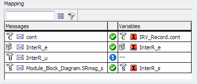

The image above shows the mappings in the Internal Access tab of the Message Mapping view. They are exported

1. [in XML format](#XML_Mapping),
1. [in CSV (comma-separated values) format](#CSV_Mapping).

For each exported mapping, the following information is stored (color-coding is repeated in the export files below):

mapping location, ASCET element name, AUTOSAR element name

In addition, the XML export file contains further details on ASCET element and AUTOSAR element.

##### Mapping Export: XML

<?xml version="1.0" encoding="UTF-8"?>

<AtomicSoftwareComponent>

<VariableMappingsInternal toolVersion="V6.4.0-0054" schemaVersion="6.4.0.2">

<ElementMapping elementName="cont">

<SourceObject displayName="cont" elementName="AUTOSAR\accessMsg\Module_Block_Diagram.cont"/>

<TargetObject displayName="IRV_Record.cont" elementName="Misc\records\Record.cont" modelName="IRV_Record.cont"/>

</ElementMapping>

<ElementMapping elementName="InterR_e">

<SourceObject displayName="InterR_e" elementName="AUTOSAR\accessMsg\Module_Block_Diagram.InterR_e"/>

<TargetObject displayName="InterR_e" elementName="AUTOSAR\accessMsg\SWC_V621.InterR_e" modelName="InterR_e"/>

</ElementMapping>

<ElementMapping elementName="Module_Block_Diagram.SRmsg_s">

<SourceObject displayName="Module_Block_Diagram.SRmsg_s" elementName="AUTOSAR\accessMsg\Module_Block_Diagram.SRmsg_s" modelName="Module_Block_Diagram.SRmsg_s"/>

<TargetObject displayName="InterR_s" elementName="AUTOSAR\accessMsg\SWC_V621.InterR_s" modelName="InterR_s"/>

</ElementMapping>

</VariableMappingsInternal>

<VariableMappingsExternal toolVersion="V6.4.0-0054" schemaVersion="6.4.0.2"/>

<ParameterMappings toolVersion="V6.4.0-0054" schemaVersion="6.4.0.2"/>

</AtomicSoftwareComponent>

##### Mapping Export: CSV

# ASCET CSV Mapping Export File 1.00

messageInternal,cont,IRV_Record.cont

messageInternal,InterR_e,InterR_e

messageInternal,Module_Block_Diagram.SRmsg_s,InterR_s

---

## Filtering the Mapping Views

_Source: `markdown/ASC_Filter_MappingViews.md`_

Mapping field without text filter:

Mapping field with active text filter for Inter:

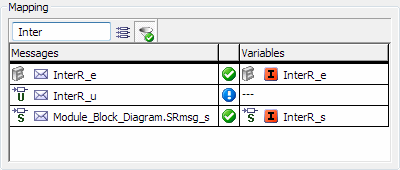

# Filtering the Mapping Views

You can filter the columns in the Parameter Mapping or Message Mapping view for more clearness. You can filter for element names or for element properties.

1. To filter for element properties, do the following:
1. To filter for element names, do the following:
1. If desired, combine both filters.
1. To deactivate all filters in a list, click on the  button of the respective list.

The filter is deactivated, all entries of the respective list are shown. The filter settings, i.e. the text string in the input field and the settings in the Filter Criteria dialog window, are kept until you delete or overwrite them.

See also

[Filter Criteria Dialog Window](markdown/SWC_FilterCriteria_Window.md)

/* Heikki Komulainen, Comet Computer GmbH 2004 */ cc_plus_pic = '&nbsp;'; cc_minus_pic = '&nbsp;'; cc_stat_pic = '&nbsp;'; gpstyle = ''; var iframes_created = 0; if (document.body && document.body.insertAdjacentHTML && document.getElementsByTagName && document.getElementById) { collect_popups(); set_poplinks_pictures(); if (iframes_created) { document.write(gpstyle); document.write('
<nobr><a id="einauslink" style="position:absolute;top:expression(document.body.scrollTop + this.offsetHeight - this.offsetHeight);left:expression(document.body.offsetWidth - (this.offsetWidth + 28));background:white;padding:5px" href="javascript:show_all_poptext()">Show all hidden text</a></nobr>
'); } } function collect_popups() { bsscpopups = new Array(); for (x = 0; x < document.links.length; x++) { if (document.links[x].href.indexOf("BSSCPopup")>-1) { seekmatch = /BSSCPopup.'[^'](markdown/+)'/; poplink = seekmatch.exec(document.links[x].href); poplink = "" + poplink; poplink = poplink.substring(poplink.indexOf("'")+1, poplink.lastIndexOf("'")); ifid = "CCGENIFRAMEID" + x; new_iframe = '<iframe id="' + ifid + '"src="' + poplink + '" onload="get_text(\'' + ifid + '\')" width="0" height="0" frameborder=0></iframe>'; document.links[x].parentNode.insertAdjacentHTML("afterEnd", new_iframe); gpid = "CCID_" + ifid; document.links[x].href = "javascript:expand_poptext('" + gpid + "')"; cc_plus = '' + cc_plus_pic + ''; document.links[x].insertAdjacentHTML("afterBegin", cc_plus); iframes_created = 1; } } }// end function function get_text(ifr_id) { frpars = document.frames[ifr_id].document.getElementsByTagName("body"); popbody = frpars[0].innerHTML; gpid = "CCID_" + ifr_id; if (!document.getElementById(gpid)) { //avoiding doubles document.getElementById(ifr_id).insertAdjacentHTML("afterEnd", '
'+popbody+'
'); } }//end function function expand_poptext(x_frame_id) { if (!document.getElementById(x_frame_id)) return; if (document.getElementById(x_frame_id).className == "CCGENPOPTEXTH") { document.getElementById(x_frame_id).className = "CCGENPOPTEXTV"; document.getElementById(x_frame_id).style.visibility = "visible"; if (document.getElementById("CCPMB_" + x_frame_id )) { document.getElementById("CCPMB_" + x_frame_id ).innerHTML = cc_minus_pic; } } else { document.getElementById(x_frame_id).className = "CCGENPOPTEXTH"; document.getElementById(x_frame_id).style.visibility = "hidden"; if (document.getElementById("CCPMB_" + x_frame_id )) { document.getElementById("CCPMB_" + x_frame_id ).innerHTML = cc_plus_pic; } } }// end function function show_all_poptext() { var pulldowntxt = document.getElementsByTagName("div"); for (b = 0; b < pulldowntxt.length; b++) { if (pulldowntxt[b].className == "droptext") { pulldowntxt[b].style.display=""; } } var gptxt = document.getElementsByTagName("div"); for (z = 0; z < gptxt.length; z++) { if (gptxt[z].className == "CCGENPOPTEXTH") { gptxt[z].className = "CCGENPOPTEXTV"; gptxt[z].style.visibility = "visible"; if (document.getElementById("CCPMB_" + gptxt[z].id )) { document.getElementById("CCPMB_" + gptxt[z].id ).innerHTML = cc_minus_pic; } } } var dxpoplinks = document.getElementsByTagName("a"); if (dxpoplinks) { for (pxl = 0; pxl < dxpoplinks.length; pxl++) { if (dxpoplinks[pxl].href.indexOf("kadovTextPopup")>-1) { if (document.getElementById("CCPMB_" + dxpoplinks[pxl].id)) { document.getElementById("CCPMB_" + dxpoplinks[pxl].id).innerHTML = cc_stat_pic; dxpoplinks[pxl].symbol = "minus"; } } } } document.getElementById('einauslink').innerText = 'Hide all hideable text'; document.getElementById('einauslink').href = "javascript:self.location.reload()"; self.focus(); }// end function function eat_click() { return false; }// end function function set_poplinks_pictures() { var dpoplinks = document.getElementsByTagName("a"); if (dpoplinks) { for (pl = 0; pl < dpoplinks.length; pl++) { if (dpoplinks[pl].href.indexOf("kadovTextPopup")>-1) { cc_plus = '' + cc_stat_pic + ''; //dpoplinks[pl].onmouseup = plusminuspoplink; dpoplinks[pl].insertAdjacentHTML("afterBegin", cc_plus); dpoplinks[pl].symbol = "plus"; } } } }// end function function plusminuspoplink() { if (document.getElementById("CCPMB_" + this.id)) { if (this.symbol == "plus") { document.getElementById("CCPMB_" + this.id).innerHTML = cc_minus_pic; this.symbol = "minus"; } else { document.getElementById("CCPMB_" + this.id).innerHTML = cc_plus_pic; this.symbol = "plus"; } } return true; }

---

## Defining the SWC Signature

_Source: `markdown/ASCdefineSWCsignature.md`_

# Defining the SWC Signature

Defining the interface of a software component includes the following steps:

1. [Creating a Runnable](markdown/ASCcreateRunnable.md)
1. [Editing the Implementation of a Runnable](markdown/ASCeditImplementationRunnable.md)
1. [Creating a Method](markdown/asccreatemethod.md)
1. [Editing the Signature of a Runnable or Method](markdown/asceditsignature.md)
1. [Adding Local Variables to a Runnable or Method](markdown/ASCaddLocalvariables.md)
1. [Adding an Argument to a Method](markdown/ascaddargument.md)
1. [Adding a Return Value to a Method](markdown/ascaddreturnvalue.md)
1. [Editing Arguments and Local Variables](markdown/asceditarguments.md)
1. [Shifting a Diagram, Runnable or Method](markdown/ascshiftDiagramRunnableMethod.md)
1. [Moving Runnables and Methods between Diagrams](markdown/ascmoveRunnablesMethods.md)
1. [Renaming or Deleting a Diagram, Runnable or Method](markdown/ascrenameordelete.md)
1. [Searching/Deleting Unused Methods/Runnables](markdown/asc_searchdel_unused_methodsrunnables.md)

---

## Creating a Runnable

_Source: `markdown/ASCcreateRunnable.md`_

# Creating a Runnable

Each software component must contain one or more runnables. To create a runnable, proceed as follows:

1. In the Outline pane, select a diagram.
1. Do one of the following:
1. Type in a name for the method and press Enter.
1. [Edit the implementation of the runnable.](ImplementationEditorEnglishUS.chm::/IEd_edit_process_method.htm)

A runnable can have a number of local variables. The local variables can be created and modified using the signature editor.

See also

[Editing a Process/Method/Runnable Implementation](ImplementationEditorEnglishUS.chm::/IEd_edit_process_method.htm)

[Adding Local Variables to a Runnable or Method](markdown/ASCaddLocalvariables.md)

[Editing Arguments and Local Variables](markdown/asceditarguments.md)

[Reserved Keywords](IntroductionEnglishUS.chm::/INT_Reserved_Keywords.htm)

---

## Editing the Implementation of a Runnable

_Source: `markdown/ASCeditImplementationRunnable.md`_

# Editing the Implementation of a Runnable

To edit the implementation of a runnable, proceed as follows:

1. Open the specification editor for the desired SWC.
1. In the Outline tab, select the runnable you want to edit.
1. Do one of the following:
1. Activate the Use FPU option if you want to save the Floating Point Unit registers of your microcontroller target upon task switching.
1. From the Memory Location combo box, select the memory area where the code should run.
1. Accept the default setting in the Memory Segment combo box.
1. In the Symbol field, enter the character string you want to use as C function name for the runnable entity in the currently selected implementation of the SWC.

Valid strings are any valid C identifier, any sequence of ASCET naming macros (see the list in [Implementation Editor for Methods/Processes/Runnables](ImplementationEditorEnglishUS.chm::/ied_implementation_editor_methodsprocesses.htm)), or any combination thereof.

An empty Symbol field means that the default naming convention (as specified in the codegen.ini file) is used.

See also

[Implementation Editor for Methods/Processes/Runnables](ImplementationEditorEnglishUS.chm::/ied_implementation_editor_methodsprocesses.htm)

[Runnable Entities and Events](markdown/ASCRunnableEntity.md)

[Implementation Editor for Methods, Processes and Runnables](ImplementationEditorEnglishUS.chm::/ied_implementation_editor_methodsprocesses.htm)

---

## Creating a Method

_Source: `markdown/asccreatemethod.md`_

# Creating a Method

To create a method, proceed as follows:

1. Activate the Outline tab.
1. Select a diagram.
1. In the Insert menu, select Method
1. click the  button.
1. Type in a name for the method and press Enter.

Each software component can contain one or more methods. A method can have a number of arguments and a return value. The arguments and the return value can be modified using the method signature editor.

See also

[Adding an Argument to a Method](markdown/ascaddargument.md)

[Adding a Return Value to a Method](markdown/ascaddreturnvalue.md)

[Adding Local Variables to a Runnable or Method](markdown/ASCaddLocalvariables.md)

[Editing Arguments and Local Variables](markdown/asceditarguments.md)

[Reserved Keywords](IntroductionEnglishUS.chm::/INT_Reserved_Keywords.htm)

---

## Selecting a Default Method/Runnable

_Source: `markdown/ascselectdefaultmethodrunnable.md`_

# Selecting a Default Method/Runnable

In each diagram, one method or one runnable can be selected as default method/runnable. The default method/runnable is selected automatically for [sequencing](markdown/ascsequencecalls.md).

Proceed as follows.

1. In the Outline tab, open the method/runnable list of a diagram.
1. Do one of the following:
1. Right-click the method you want to select as default method, and select Default Method from the context menu.
1. Right-click the runnable you want to select as default runnable, and select Default Runnable from the context menu.

The selected method or runnable is now the default method/runnable.

See also

[Sequence Calls](markdown/ascsequencecalls.md)

---

## Editing the Signature of a Runnable or Method

_Source: `markdown/asceditsignature.md`_

# Editing the Signature of a Runnable or Method

To edit the signature of a runnable or method, proceed as follows:

1. In the Outline tab, select the name of the runnable or method you want to modify.
1. Do one of the following:
1. Define the arguments and return value for the method as described in [Adding an Argument to the Method](markdown/ascaddargument.md) and [Adding a Return Value to the Method](markdown/ascaddreturnvalue.md).
1. Define local variables for the runnable or method as described in [Adding Local Variables to a Runnable or Method](markdown/ASCaddLocalvariables.md).
1. Click OK to close the signature editor.

See also

[Adding an Argument to a Method](markdown/ascaddargument.md)

[Adding a Return Value to a Method](markdown/ascaddreturnvalue.md)

[Adding Local Variables to a Runnable or Method](markdown/ASCaddLocalvariables.md)

[Editing Arguments and Local Variables](markdown/asceditarguments.md)

---

## Adding Local Variables to a Runnable or Method

_Source: `markdown/ASCaddLocalvariables.md`_

1. In the Max Size x (and Max Size y) field(s), enter the array or matrix size.
1. To specify a [variant size](IntroductionEnglishUS.chm::/INT_VariantSize_ArraysMatrices.htm), use the Variant Size x (and Variant Size y) field(s) to select the system constants you want to use as dimension values.

The value of a system constant should be in the range 1 ... X (or 1 ... Y).

1. To specify a [variable size](IntroductionEnglishUS.chm::/INT_VariableSize_ArraysMatrices.htm), use the Variant Size x (and Variant Size y) field(s) to select *.

The Max Size x (and Max Size y) field(s) are disabled.

1. Click OK to close the window and accept your settings.

# Adding Local Variables to a Runnable or Method

To add local variables to a runnable or method, proceed as follows:

1. [Open the signature editor](markdown/asceditsignature.md) for the runnable or method.
1. Go to the Locals tab of the signature editor.
1. Do one of the following:
1. Enter a name for the local variable.
1. Specify the type for the local variable.
1. Enter a comment and a unit for the variable.
1. To edit the array/matrix size, open the Local Variable menu or the context menu and select Edit Max Size.
1. In the Max and Variant Size for: <local> window, [do the following](javascript:kadovTextPopup(this))<!-- kadovTextPopupInit('a1'); //-->.
1. Activate (deactivate) the Reference option to mark the local variable as explicit reference (instance).
1. Use the Read for Referenced Element and Write for Referenced Element options to set internal access to the referenced element to Read, Write, or both.

Non-scalar local variables specified as instances must be initialized before they are read. For method-/runnable-local records marked as instances, the separate assignment to each record element is recognized as initialization. The expression must only contain accesses to record elements that are already initialized. Assigning each element of an array or matrix is recognized as initialization. Passing a local variable of array, matrix or record type as [Out argument](BlockDiagramEditorEnglishUS.chm::/BDE_DirectionsMethodArguments.htm) is recognized as initialization.

See also

[Editing the Signature of a Runnable or Method](markdown/asceditsignature.md)

[Locals Tab](markdown/asclocalstab.md)

[Editing Arguments and Local Variables](markdown/asceditarguments.md)

[Directions of Method Arguments](BlockDiagramEditorEnglishUS.chm::/BDE_DirectionsMethodArguments.htm)

[Introduction - Variant Size of Arrays and Matrices](IntroductionEnglishUS.chm::/INT_VariantSize_ArraysMatrices.htm)

[I](IntroductionEnglishUS.chm::/INT_VariableSize_ArraysMatrices.htm)ntroduction - Variable Size for Arrays and Matrices

[I](IntroductionEnglishUS.chm::/INT_ExplicitReferences.htm)ntroduction - Explicit References

[Reserved Keywords](IntroductionEnglishUS.chm::/INT_Reserved_Keywords.htm)

/* Heikki Komulainen, Comet Computer GmbH 2004 */ cc_plus_pic = '&nbsp;'; cc_minus_pic = '&nbsp;'; cc_stat_pic = '&nbsp;'; gpstyle = ''; var iframes_created = 0; if (document.body && document.body.insertAdjacentHTML && document.getElementsByTagName && document.getElementById) { collect_popups(); set_poplinks_pictures(); if (iframes_created) { document.write(gpstyle); document.write('
<nobr><a id="einauslink" style="position:absolute;top:expression(document.body.scrollTop + this.offsetHeight - this.offsetHeight);left:expression(document.body.offsetWidth - (this.offsetWidth + 28));background:white;padding:5px" href="javascript:show_all_poptext()">Show all hidden text</a></nobr>
'); } } function collect_popups() { bsscpopups = new Array(); for (x = 0; x < document.links.length; x++) { if (document.links[x].href.indexOf("BSSCPopup")>-1) { seekmatch = /BSSCPopup.'[^'](markdown/+)'/; poplink = seekmatch.exec(document.links[x].href); poplink = "" + poplink; poplink = poplink.substring(poplink.indexOf("'")+1, poplink.lastIndexOf("'")); ifid = "CCGENIFRAMEID" + x; new_iframe = '<iframe id="' + ifid + '"src="' + poplink + '" onload="get_text(\'' + ifid + '\')" width="0" height="0" frameborder=0></iframe>'; document.links[x].parentNode.insertAdjacentHTML("afterEnd", new_iframe); gpid = "CCID_" + ifid; document.links[x].href = "javascript:expand_poptext('" + gpid + "')"; cc_plus = '' + cc_plus_pic + ''; document.links[x].insertAdjacentHTML("afterBegin", cc_plus); iframes_created = 1; } } }// end function function get_text(ifr_id) { frpars = document.frames[ifr_id].document.getElementsByTagName("body"); popbody = frpars[0].innerHTML; gpid = "CCID_" + ifr_id; if (!document.getElementById(gpid)) { //avoiding doubles document.getElementById(ifr_id).insertAdjacentHTML("afterEnd", '
'+popbody+'
'); } }//end function function expand_poptext(x_frame_id) { if (!document.getElementById(x_frame_id)) return; if (document.getElementById(x_frame_id).className == "CCGENPOPTEXTH") { document.getElementById(x_frame_id).className = "CCGENPOPTEXTV"; document.getElementById(x_frame_id).style.visibility = "visible"; if (document.getElementById("CCPMB_" + x_frame_id )) { document.getElementById("CCPMB_" + x_frame_id ).innerHTML = cc_minus_pic; } } else { document.getElementById(x_frame_id).className = "CCGENPOPTEXTH"; document.getElementById(x_frame_id).style.visibility = "hidden"; if (document.getElementById("CCPMB_" + x_frame_id )) { document.getElementById("CCPMB_" + x_frame_id ).innerHTML = cc_plus_pic; } } }// end function function show_all_poptext() { var pulldowntxt = document.getElementsByTagName("div"); for (b = 0; b < pulldowntxt.length; b++) { if (pulldowntxt[b].className == "droptext") { pulldowntxt[b].style.display=""; } } var gptxt = document.getElementsByTagName("div"); for (z = 0; z < gptxt.length; z++) { if (gptxt[z].className == "CCGENPOPTEXTH") { gptxt[z].className = "CCGENPOPTEXTV"; gptxt[z].style.visibility = "visible"; if (document.getElementById("CCPMB_" + gptxt[z].id )) { document.getElementById("CCPMB_" + gptxt[z].id ).innerHTML = cc_minus_pic; } } } var dxpoplinks = document.getElementsByTagName("a"); if (dxpoplinks) { for (pxl = 0; pxl < dxpoplinks.length; pxl++) { if (dxpoplinks[pxl].href.indexOf("kadovTextPopup")>-1) { if (document.getElementById("CCPMB_" + dxpoplinks[pxl].id)) { document.getElementById("CCPMB_" + dxpoplinks[pxl].id).innerHTML = cc_stat_pic; dxpoplinks[pxl].symbol = "minus"; } } } } document.getElementById('einauslink').innerText = 'Hide all hideable text'; document.getElementById('einauslink').href = "javascript:self.location.reload()"; self.focus(); }// end function function eat_click() { return false; }// end function function set_poplinks_pictures() { var dpoplinks = document.getElementsByTagName("a"); if (dpoplinks) { for (pl = 0; pl < dpoplinks.length; pl++) { if (dpoplinks[pl].href.indexOf("kadovTextPopup")>-1) { cc_plus = '' + cc_stat_pic + ''; //dpoplinks[pl].onmouseup = plusminuspoplink; dpoplinks[pl].insertAdjacentHTML("afterBegin", cc_plus); dpoplinks[pl].symbol = "plus"; } } } }// end function function plusminuspoplink() { if (document.getElementById("CCPMB_" + this.id)) { if (this.symbol == "plus") { document.getElementById("CCPMB_" + this.id).innerHTML = cc_minus_pic; this.symbol = "minus"; } else { document.getElementById("CCPMB_" + this.id).innerHTML = cc_plus_pic; this.symbol = "plus"; } } return true; }

---

## Adding an Argument to a Method

_Source: `markdown/ascaddargument.md`_

1. In the Max Size x (and Max Size y) field(s), enter the array or matrix size.
1. To specify a [variant size](IntroductionEnglishUS.chm::/INT_VariantSize_ArraysMatrices.htm), use the Variant Size x (and Variant Size y) field(s) to select the system constants you want to use as dimension values.

The value of a system constant should be in the range 1 ... X (or 1 ... Y).

1. To specify a [variable size](IntroductionEnglishUS.chm::/INT_VariableSize_ArraysMatrices.htm), use the Variant Size x (and Variant Size y) field(s) to select *.

The Max Size x (and Max Size y) field(s) are disabled.

1. Click OK to close the window and accept your settings.

# Adding an Argument to a Method

To add an argument to the method, proceed as follows:

1. [Open the signature editor](markdown/asceditsignature.md) for the method.
1. In the signature editor, activate the Arguments tab.
1. Do one of the following:
1. Name the argument and press Enter.
1. Specify the type of argument by selecting the value you want from the Argument Type combo box.
1. When you selected an array or matrix as type, open the Argument menu or the context menu and select Edit Max Size.
1. In the Max and Variant Size for: <argument> window, [do the following](javascript:kadovTextPopup(this))<!-- kadovTextPopupInit('a2'); //-->.
1. Enter a unit for the argument in the Unit box.
1. Type a comment relating to the argument into the Comment box.
1. In the Direction combo box, select a direction for the argument.

In - the argument can be read in the method; Out - the argument can be written in the method; InOut - the argument can be read and written in the method. See also [Directions of Method Arguments](BlockDiagramEditorEnglishUS.chm::/BDE_DirectionsMethodArguments.htm).

When the argument is of type array, matrix, or component, the selection in the Direction combo box also determines internal access to the referenced element: In - read access; Out - write access; InOut - read and write access.

See also

[Editing the Signature of a Runnable or Method](markdown/asceditsignature.md)

[Directions of Method Arguments](BlockDiagramEditorEnglishUS.chm::/BDE_DirectionsMethodArguments.htm)

[I](IntroductionEnglishUS.chm::/INT_VariantSize_ArraysMatrices.htm)ntroduction - Variant Size of Arrays and Matrices

[Introduction - Variable Size for Arrays and Matrices](IntroductionEnglishUS.chm::/INT_VariableSize_ArraysMatrices.htm)

[I](IntroductionEnglishUS.chm::/INT_ExplicitReferences.htm)ntroduction - Explicit References

[Assigning a Component as an Argument](markdown/ASCAssignComponent.md)

[Creating a Matrix Argument](markdown/ascmatrixargument.md)

[Reserved Keywords](IntroductionEnglishUS.chm::/INT_Reserved_Keywords.htm)

/* Heikki Komulainen, Comet Computer GmbH 2004 */ cc_plus_pic = '&nbsp;'; cc_minus_pic = '&nbsp;'; cc_stat_pic = '&nbsp;'; gpstyle = ''; var iframes_created = 0; if (document.body && document.body.insertAdjacentHTML && document.getElementsByTagName && document.getElementById) { collect_popups(); set_poplinks_pictures(); if (iframes_created) { document.write(gpstyle); document.write('
<nobr><a id="einauslink" style="position:absolute;top:expression(document.body.scrollTop + this.offsetHeight - this.offsetHeight);left:expression(document.body.offsetWidth - (this.offsetWidth + 28));background:white;padding:5px" href="javascript:show_all_poptext()">Show all hidden text</a></nobr>
'); } } function collect_popups() { bsscpopups = new Array(); for (x = 0; x < document.links.length; x++) { if (document.links[x].href.indexOf("BSSCPopup")>-1) { seekmatch = /BSSCPopup.'[^'](markdown/+)'/; poplink = seekmatch.exec(document.links[x].href); poplink = "" + poplink; poplink = poplink.substring(poplink.indexOf("'")+1, poplink.lastIndexOf("'")); ifid = "CCGENIFRAMEID" + x; new_iframe = '<iframe id="' + ifid + '"src="' + poplink + '" onload="get_text(\'' + ifid + '\')" width="0" height="0" frameborder=0></iframe>'; document.links[x].parentNode.insertAdjacentHTML("afterEnd", new_iframe); gpid = "CCID_" + ifid; document.links[x].href = "javascript:expand_poptext('" + gpid + "')"; cc_plus = '' + cc_plus_pic + ''; document.links[x].insertAdjacentHTML("afterBegin", cc_plus); iframes_created = 1; } } }// end function function get_text(ifr_id) { frpars = document.frames[ifr_id].document.getElementsByTagName("body"); popbody = frpars[0].innerHTML; gpid = "CCID_" + ifr_id; if (!document.getElementById(gpid)) { //avoiding doubles document.getElementById(ifr_id).insertAdjacentHTML("afterEnd", '
'+popbody+'
'); } }//end function function expand_poptext(x_frame_id) { if (!document.getElementById(x_frame_id)) return; if (document.getElementById(x_frame_id).className == "CCGENPOPTEXTH") { document.getElementById(x_frame_id).className = "CCGENPOPTEXTV"; document.getElementById(x_frame_id).style.visibility = "visible"; if (document.getElementById("CCPMB_" + x_frame_id )) { document.getElementById("CCPMB_" + x_frame_id ).innerHTML = cc_minus_pic; } } else { document.getElementById(x_frame_id).className = "CCGENPOPTEXTH"; document.getElementById(x_frame_id).style.visibility = "hidden"; if (document.getElementById("CCPMB_" + x_frame_id )) { document.getElementById("CCPMB_" + x_frame_id ).innerHTML = cc_plus_pic; } } }// end function function show_all_poptext() { var pulldowntxt = document.getElementsByTagName("div"); for (b = 0; b < pulldowntxt.length; b++) { if (pulldowntxt[b].className == "droptext") { pulldowntxt[b].style.display=""; } } var gptxt = document.getElementsByTagName("div"); for (z = 0; z < gptxt.length; z++) { if (gptxt[z].className == "CCGENPOPTEXTH") { gptxt[z].className = "CCGENPOPTEXTV"; gptxt[z].style.visibility = "visible"; if (document.getElementById("CCPMB_" + gptxt[z].id )) { document.getElementById("CCPMB_" + gptxt[z].id ).innerHTML = cc_minus_pic; } } } var dxpoplinks = document.getElementsByTagName("a"); if (dxpoplinks) { for (pxl = 0; pxl < dxpoplinks.length; pxl++) { if (dxpoplinks[pxl].href.indexOf("kadovTextPopup")>-1) { if (document.getElementById("CCPMB_" + dxpoplinks[pxl].id)) { document.getElementById("CCPMB_" + dxpoplinks[pxl].id).innerHTML = cc_stat_pic; dxpoplinks[pxl].symbol = "minus"; } } } } document.getElementById('einauslink').innerText = 'Hide all hideable text'; document.getElementById('einauslink').href = "javascript:self.location.reload()"; self.focus(); }// end function function eat_click() { return false; }// end function function set_poplinks_pictures() { var dpoplinks = document.getElementsByTagName("a"); if (dpoplinks) { for (pl = 0; pl < dpoplinks.length; pl++) { if (dpoplinks[pl].href.indexOf("kadovTextPopup")>-1) { cc_plus = '' + cc_stat_pic + ''; //dpoplinks[pl].onmouseup = plusminuspoplink; dpoplinks[pl].insertAdjacentHTML("afterBegin", cc_plus); dpoplinks[pl].symbol = "plus"; } } } }// end function function plusminuspoplink() { if (document.getElementById("CCPMB_" + this.id)) { if (this.symbol == "plus") { document.getElementById("CCPMB_" + this.id).innerHTML = cc_minus_pic; this.symbol = "minus"; } else { document.getElementById("CCPMB_" + this.id).innerHTML = cc_plus_pic; this.symbol = "plus"; } } return true; }

---

## Assigning a Component or Enumeration as Argument

_Source: `markdown/ASCAssignComponent.md`_

# Assigning a Component or Enumeration as Argument

You can use enumerations and other components as interface elements of SWC. The procedure is described here for an argument of type user-defined. The same procedure can be used for a complex return value.

From ASCET V6.3.0 on, complex arguments are always explicit references, even though they are not marked with the overlay icon .

To assign a component as an argument, proceed as follows:

1. [Open the signature editor](markdown/asceditsignature.md) for the method to which you want to add the component.
1. From the Arguments list, select the item for which you want to specify the data type (or add a new item).
1. In the Argument Type list, select the entry <user defined>.

A selection dialog window opens for the current database.

1. From the 1 Database or 1 Workspace list, select the component or enumeration you want and click OK to close the dialog.

The selected component or enumeration appears in the Argument Type pane on the interface editor.

1. Click OK to store the changes you made to the signature.

See also

[Editing the Signature of a Runnable or Method](markdown/asceditsignature.md)

[Creating a Matrix Argument](markdown/ascmatrixargument.md)

---

## Adding a Return Value to a Method

_Source: `markdown/ascaddreturnvalue.md`_

1. In the Max Size x (and Max Size y) field(s), enter the array or matrix size.
1. To specify a [variant size](IntroductionEnglishUS.chm::/INT_VariantSize_ArraysMatrices.htm), use the Variant Size x (and Variant Size y) field(s) to select the system constants you want to use as dimension values.

The value of a system constant should be in the range 1 ... X (or 1 ... Y).

1. To specify a [variable size](IntroductionEnglishUS.chm::/INT_VariableSize_ArraysMatrices.htm), use the Variant Size x (and Variant Size y) field(s) to select *.

The Max Size x (and Max Size y) field(s) are disabled.

1. Click OK to close the window and accept your settings.

# Adding a Return Value to a Method

To add a return value to the method, proceed as follows:

1. [Open the signature editor](markdown/asceditsignature.md) for the method.
1. Activate the Return tab of the signature editor.
1. Activate the Return Value option, if the method is to have a return value.
1. Specify the data type of the return value.
1. Type in a comment and a unit.
1. To edit the array/matrix size, open the Return menu and select Edit Max Size.
1. In the Max and Variant Size for: return window, [do the following](javascript:kadovTextPopup(this))<!-- kadovTextPopupInit('a2'); //-->.
1. Use the Read for Referenced Element and Write for Referenced Element options to set internal access to the referenced element to Read, Write, or both.

See also

[Editing the Signature of a Runnable or Method](markdown/asceditsignature.md)

[Introduction - Variant Size of Arrays and Matrices](IntroductionEnglishUS.chm::/INT_VariantSize_ArraysMatrices.htm)

[Introduction - Variable Size for Arrays and Matrices](IntroductionEnglishUS.chm::/INT_VariableSize_ArraysMatrices.htm)

[Introduction - Explicit References](IntroductionEnglishUS.chm::/INT_ExplicitReferences.htm)

/* Heikki Komulainen, Comet Computer GmbH 2004 */ cc_plus_pic = '&nbsp;'; cc_minus_pic = '&nbsp;'; cc_stat_pic = '&nbsp;'; gpstyle = ''; var iframes_created = 0; if (document.body && document.body.insertAdjacentHTML && document.getElementsByTagName && document.getElementById) { collect_popups(); set_poplinks_pictures(); if (iframes_created) { document.write(gpstyle); document.write('
<nobr><a id="einauslink" style="position:absolute;top:expression(document.body.scrollTop + this.offsetHeight - this.offsetHeight);left:expression(document.body.offsetWidth - (this.offsetWidth + 28));background:white;padding:5px" href="javascript:show_all_poptext()">Show all hidden text</a></nobr>
'); } } function collect_popups() { bsscpopups = new Array(); for (x = 0; x < document.links.length; x++) { if (document.links[x].href.indexOf("BSSCPopup")>-1) { seekmatch = /BSSCPopup.'[^'](markdown/+)'/; poplink = seekmatch.exec(document.links[x].href); poplink = "" + poplink; poplink = poplink.substring(poplink.indexOf("'")+1, poplink.lastIndexOf("'")); ifid = "CCGENIFRAMEID" + x; new_iframe = '<iframe id="' + ifid + '"src="' + poplink + '" onload="get_text(\'' + ifid + '\')" width="0" height="0" frameborder=0></iframe>'; document.links[x].parentNode.insertAdjacentHTML("afterEnd", new_iframe); gpid = "CCID_" + ifid; document.links[x].href = "javascript:expand_poptext('" + gpid + "')"; cc_plus = '' + cc_plus_pic + ''; document.links[x].insertAdjacentHTML("afterBegin", cc_plus); iframes_created = 1; } } }// end function function get_text(ifr_id) { frpars = document.frames[ifr_id].document.getElementsByTagName("body"); popbody = frpars[0].innerHTML; gpid = "CCID_" + ifr_id; if (!document.getElementById(gpid)) { //avoiding doubles document.getElementById(ifr_id).insertAdjacentHTML("afterEnd", '
'+popbody+'
'); } }//end function function expand_poptext(x_frame_id) { if (!document.getElementById(x_frame_id)) return; if (document.getElementById(x_frame_id).className == "CCGENPOPTEXTH") { document.getElementById(x_frame_id).className = "CCGENPOPTEXTV"; document.getElementById(x_frame_id).style.visibility = "visible"; if (document.getElementById("CCPMB_" + x_frame_id )) { document.getElementById("CCPMB_" + x_frame_id ).innerHTML = cc_minus_pic; } } else { document.getElementById(x_frame_id).className = "CCGENPOPTEXTH"; document.getElementById(x_frame_id).style.visibility = "hidden"; if (document.getElementById("CCPMB_" + x_frame_id )) { document.getElementById("CCPMB_" + x_frame_id ).innerHTML = cc_plus_pic; } } }// end function function show_all_poptext() { var pulldowntxt = document.getElementsByTagName("div"); for (b = 0; b < pulldowntxt.length; b++) { if (pulldowntxt[b].className == "droptext") { pulldowntxt[b].style.display=""; } } var gptxt = document.getElementsByTagName("div"); for (z = 0; z < gptxt.length; z++) { if (gptxt[z].className == "CCGENPOPTEXTH") { gptxt[z].className = "CCGENPOPTEXTV"; gptxt[z].style.visibility = "visible"; if (document.getElementById("CCPMB_" + gptxt[z].id )) { document.getElementById("CCPMB_" + gptxt[z].id ).innerHTML = cc_minus_pic; } } } var dxpoplinks = document.getElementsByTagName("a"); if (dxpoplinks) { for (pxl = 0; pxl < dxpoplinks.length; pxl++) { if (dxpoplinks[pxl].href.indexOf("kadovTextPopup")>-1) { if (document.getElementById("CCPMB_" + dxpoplinks[pxl].id)) { document.getElementById("CCPMB_" + dxpoplinks[pxl].id).innerHTML = cc_stat_pic; dxpoplinks[pxl].symbol = "minus"; } } } } document.getElementById('einauslink').innerText = 'Hide all hideable text'; document.getElementById('einauslink').href = "javascript:self.location.reload()"; self.focus(); }// end function function eat_click() { return false; }// end function function set_poplinks_pictures() { var dpoplinks = document.getElementsByTagName("a"); if (dpoplinks) { for (pl = 0; pl < dpoplinks.length; pl++) { if (dpoplinks[pl].href.indexOf("kadovTextPopup")>-1) { cc_plus = '' + cc_stat_pic + ''; //dpoplinks[pl].onmouseup = plusminuspoplink; dpoplinks[pl].insertAdjacentHTML("afterBegin", cc_plus); dpoplinks[pl].symbol = "plus"; } } } }// end function function plusminuspoplink() { if (document.getElementById("CCPMB_" + this.id)) { if (this.symbol == "plus") { document.getElementById("CCPMB_" + this.id).innerHTML = cc_minus_pic; this.symbol = "minus"; } else { document.getElementById("CCPMB_" + this.id).innerHTML = cc_plus_pic; this.symbol = "plus"; } } return true; }

---

## Editing Arguments and Local Variables

_Source: `markdown/asceditarguments.md`_

# Editing Arguments and Local Variables

To edit arguments and local variables, proceed as follows:

1. [Open the signature editor](markdown/asceditsignature.md) for the runnable or method.
1. In the signature editor, go to the Locals tab.
1. In the Local Variable menu, select Rename to rename a local variable.
1. In the Local Variable menu, select Move Up or Move Down to move a local variable in the list.
1. To delete a selected local variable, do one of the following:

- In the Local Variable menu, select Delete
- Click on .

For editing arguments, the Arguments tab offers the Argument menu, which contains the same menu functions.

See also

[Editing the Signature of a Runnable or Method](markdown/asceditsignature.md)

---

## Shifting a Diagram

_Source: `markdown/ascshiftDiagramRunnableMethod.md`_

# Shifting a Diagram

In the Outline tab, the diagrams are shown in chronological order by default. Each new diagram is added at the end of the list. The order can be modified by shifting diagrams within the list.

Methods and runnables are listed, below their diagram, in alphabetical order. Their order cannot be changed.

To move a diagram, proceed as follows:

1. In the Outline tab, select the diagram you want to shift.
1. In the Window menu or in the context menu of the diagram, select Move Up Diagram to shift the selected diagram one position up in the list.
1. In the Window menu or in the context menu of the diagram, select Move Down Diagram to shift the selected diagram one position down in the list.

See also

[Moving Runnables and Methods between Diagrams](markdown/ascmoveRunnablesMethods.md)

---

## Moving Runnables and Methods between Diagrams

_Source: `markdown/ascmoveRunnablesMethods.md`_

# Moving Runnables and Methods between Diagrams

To move runnables or methods between diagrams, proceed as follows:

1. [Load the diagram](markdown/ascloaddiagram.md) that contains the runnable or method you want to move.
1. In the Outline tab, select the runnable/method you want to move.
1. Open the Window menu and select Move Method to.
1. In the Window menu, select Move Method to to move the runnable/method.
1. Select the diagram to which you want to move the runnable/method and click OK.

The selected runnable/method is moved to the target diagram. Any sequence calls present in the original diagram for the runnable/method are reset.

You can move methods only if their signature elements do not appear in the diagram. Otherwise, remove the graphical occurrences of signature elements first and then move the method.

See also

[Loading a Diagram](markdown/ascloaddiagram.md)

---

## Renaming or Deleting a Diagram, Runnable or Method

_Source: `markdown/ascrenameordelete.md`_

# Renaming or Deleting a Diagram, Runnable or Method

To rename or delete a diagram, runnable or method, proceed as follows:

1. Select the item in the Outline tab.
1. Do one of the following to rename the diagram, runnable or method:
1. Do one of the following to delete the diagram, method or process:

- In the Edit menu, select Delete.
- Press Del.

If only one diagram is present, this diagram cannot be deleted.

See also

[Reserved Keywords](IntroductionEnglishUS.chm::/INT_Reserved_Keywords.htm)

---

## Searching/Deleting Unused Methods/Runnables

_Source: `markdown/asc_searchdel_unused_methodsrunnables.md`_

= Block Diagram or ESDL or C Code

# Searching/Deleting Unused Methods/Runnables

You cannot search for unused methods/runnables in the SWC and its sub-components in the same way as for [unused elements](markdown/ASC_SearchDeleteUnusedElements.md). Instead, proceed as follows:

1. Do one of the following:
1. To delete an unused method/runnable, or an unused process in an included module, proceed as follows:

See also

[Searching/Deleting Unused Elements](markdown/ASC_SearchDeleteUnusedElements.md)

/* Heikki Komulainen, Comet Computer GmbH 2004 */ cc_plus_pic = '&nbsp;'; cc_minus_pic = '&nbsp;'; cc_stat_pic = '&nbsp;'; gpstyle = ''; var iframes_created = 0; if (document.body && document.body.insertAdjacentHTML && document.getElementsByTagName && document.getElementById) { collect_popups(); set_poplinks_pictures(); if (iframes_created) { document.write(gpstyle); document.write('
<nobr><a id="einauslink" style="position:absolute;top:expression(document.body.scrollTop + this.offsetHeight - this.offsetHeight);left:expression(document.body.offsetWidth - (this.offsetWidth + 28));background:white;padding:5px" href="javascript:show_all_poptext()">Show all hidden text</a></nobr>
'); } } function collect_popups() { bsscpopups = new Array(); for (x = 0; x < document.links.length; x++) { if (document.links[x].href.indexOf("BSSCPopup")>-1) { seekmatch = /BSSCPopup.'[^'](markdown/+)'/; poplink = seekmatch.exec(document.links[x].href); poplink = "" + poplink; poplink = poplink.substring(poplink.indexOf("'")+1, poplink.lastIndexOf("'")); ifid = "CCGENIFRAMEID" + x; new_iframe = '<iframe id="' + ifid + '"src="' + poplink + '" onload="get_text(\'' + ifid + '\')" width="0" height="0" frameborder=0></iframe>'; document.links[x].parentNode.insertAdjacentHTML("afterEnd", new_iframe); gpid = "CCID_" + ifid; document.links[x].href = "javascript:expand_poptext('" + gpid + "')"; cc_plus = '' + cc_plus_pic + ''; document.links[x].insertAdjacentHTML("afterBegin", cc_plus); iframes_created = 1; } } }// end function function get_text(ifr_id) { frpars = document.frames[ifr_id].document.getElementsByTagName("body"); popbody = frpars[0].innerHTML; gpid = "CCID_" + ifr_id; if (!document.getElementById(gpid)) { //avoiding doubles document.getElementById(ifr_id).insertAdjacentHTML("afterEnd", '
'+popbody+'
'); } }//end function function expand_poptext(x_frame_id) { if (!document.getElementById(x_frame_id)) return; if (document.getElementById(x_frame_id).className == "CCGENPOPTEXTH") { document.getElementById(x_frame_id).className = "CCGENPOPTEXTV"; document.getElementById(x_frame_id).style.visibility = "visible"; if (document.getElementById("CCPMB_" + x_frame_id )) { document.getElementById("CCPMB_" + x_frame_id ).innerHTML = cc_minus_pic; } } else { document.getElementById(x_frame_id).className = "CCGENPOPTEXTH"; document.getElementById(x_frame_id).style.visibility = "hidden"; if (document.getElementById("CCPMB_" + x_frame_id )) { document.getElementById("CCPMB_" + x_frame_id ).innerHTML = cc_plus_pic; } } }// end function function show_all_poptext() { var pulldowntxt = document.getElementsByTagName("div"); for (b = 0; b < pulldowntxt.length; b++) { if (pulldowntxt[b].className == "droptext") { pulldowntxt[b].style.display=""; } } var gptxt = document.getElementsByTagName("div"); for (z = 0; z < gptxt.length; z++) { if (gptxt[z].className == "CCGENPOPTEXTH") { gptxt[z].className = "CCGENPOPTEXTV"; gptxt[z].style.visibility = "visible"; if (document.getElementById("CCPMB_" + gptxt[z].id )) { document.getElementById("CCPMB_" + gptxt[z].id ).innerHTML = cc_minus_pic; } } } var dxpoplinks = document.getElementsByTagName("a"); if (dxpoplinks) { for (pxl = 0; pxl < dxpoplinks.length; pxl++) { if (dxpoplinks[pxl].href.indexOf("kadovTextPopup")>-1) { if (document.getElementById("CCPMB_" + dxpoplinks[pxl].id)) { document.getElementById("CCPMB_" + dxpoplinks[pxl].id).innerHTML = cc_stat_pic; dxpoplinks[pxl].symbol = "minus"; } } } } document.getElementById('einauslink').innerText = 'Hide all hideable text'; document.getElementById('einauslink').href = "javascript:self.location.reload()"; self.focus(); }// end function function eat_click() { return false; }// end function function set_poplinks_pictures() { var dpoplinks = document.getElementsByTagName("a"); if (dpoplinks) { for (pl = 0; pl < dpoplinks.length; pl++) { if (dpoplinks[pl].href.indexOf("kadovTextPopup")>-1) { cc_plus = '' + cc_stat_pic + ''; //dpoplinks[pl].onmouseup = plusminuspoplink; dpoplinks[pl].insertAdjacentHTML("afterBegin", cc_plus); dpoplinks[pl].symbol = "plus"; } } } }// end function function plusminuspoplink() { if (document.getElementById("CCPMB_" + this.id)) { if (this.symbol == "plus") { document.getElementById("CCPMB_" + this.id).innerHTML = cc_minus_pic; this.symbol = "minus"; } else { document.getElementById("CCPMB_" + this.id).innerHTML = cc_plus_pic; this.symbol = "plus"; } } return true; }

---

## Using a Matrix Argument (Example)

_Source: `markdown/ASC_UseMatrixArgument_Example.md`_

# Using a Matrix Argument (Example)

The following steps provide an example of using a matrix argument for a matrix addition.

1. [Creating the Matrix Argument](markdown/ascmatrixargument.md)
1. [Creating the Computation Class](markdown/ASC_CreateComputationClass.md)
1. [Specifying the Matrix Addition](markdown/ASC_SpecifyMatrixAddition.md)
1. [Performing the Calculation](markdown/ASC_PerformCalculation.md)

---

## Creating a Matrix Argument

_Source: `markdown/ascmatrixargument.md`_

# Creating a Matrix Argument

To create a matrix argument, proceed as follows:

1. [Add an argument](markdown/ascaddargument.md) with argument type mat[cont] to a method.
1. Place the argument in the drawing area.
1. Use the normal readout pins.

The procedure to return matrices or arrays is more complicated. It is described in the following paragraphs, using the addition of two matrices as an example.

See also

[Creating the Computation Class](markdown/ASC_CreateComputationClass.md)

[Specifying the Matrix Addition](markdown/ASC_SpecifyMatrixAddition.md)

[Performing the Calculation](markdown/ASC_PerformCalculation.md)

[Adding an Argument to a Method](markdown/ascaddargument.md)

---

## Creating the Computation Class

_Source: `markdown/ASC_CreateComputationClass.md`_

# Creating the Computation Class

To create the computation class, proceed as follows:

1. Create a class with a method to contain the matrix calculation.
1. In the method, add two arguments arg_matrix1 and arg_matrix2 of type mat[cont] for the matrices to be added.
1. Add another argument arg_OutMatrix of the same type, and with the direction InOut, for the result matrix.
1. Use the  button to create a matrix of type cont.
1. In the Properties editor, accept the preset values for the Dimension.
1. [Specify the Matrix Addition](markdown/ASC_SpecifyMatrixAddition.md).

---

## Specifying the Matrix Addition

_Source: `markdown/ASC_SpecifyMatrixAddition.md`_

# Specifying the Matrix Addition

To specify the matrix addition, proceed as follows:

1. Place the auxiliary matrix and the argument arg_OutMatrix in the drawing area.
1. Right-click on each element, and select Get/Set Ports from the context menu.
1. Assign the argument arg_OutMatrix to the auxiliary matrix via its Set port.
1. Select the sequence number 1 for the [sequence call](markdown/ascsequencecalls.md), so that the assignment is executed as the first step of the method.
1. Create the necessary indices, and specify the matrix addition.
1. [Perform the Calculation](markdown/ASC_PerformCalculation.md).

See also

[Sequence Calls](markdown/ascsequencecalls.md)

---

## Performing the Calculation

_Source: `markdown/ASC_PerformCalculation.md`_

# Performing the Calculation

To perform the calculation, proceed as follows:

1. Create a class or module.
1. In the Insert menu, select Component to include the computation class as a complex element.
1. Create two matrices of type cont, and fill them with the input data.
1. Create a third matrix of the same type and size for the result.
1. Place the elements in the drawing area, and connect them as shown below.

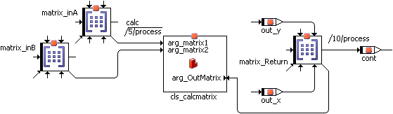

1. Use the output pins of the result matrix to read it.

When you assigned a size to these matrices other than the preset values in the Properties dialog, the code generation will produce an error message of the following kind: type mismatch: expected <mat[cont][3@3]> (<matrix name>), got <mat[cont][x@y]> (<matrix name>)

A frequently tried approach to return a matrix or an array is to add a return value of the respective type to a method, and access the return value via the Get/Set ports. The following figure shows such an arrangement, the class cls_calcmatrix contains the calc method with two matrix arguments and a matrix return value.

This does not work! The ports transfer pointers, in this case, pointers to a structure within the method. This structure, though, is only available while the method is computing - which means that, in the example, the data no longer exist at the time of the assignment to out_matrix.

See also

[Including a Component as a Complex Element](markdown/ascincludecomponent.md)

---

## Creating the SWC Content

_Source: `markdown/ASCcreateSWCcontent.md`_

# Creating the SWC Content

Defining the content of a software component includes the following steps:

1. [Placing a Signature Element](markdown/ascplaceelement.md)
1. Creating the necessary elements:
1. [creating operators](markdown/ascpositionoperator.md), among them [If statements](markdown/ascuseif.md), [switch](markdown/ascuseswitch.md) and the [while loop](markdown/ascusewhileloop.md)
1. [connecting diagram elements](markdown/ascconnectdiagram.md)
1. [edit the sequence calls](markdown/ASCeditSequenceCalls.md)
1. add implementation casts to [connections](markdown/ascaddimplcasttoconnect.md) or [operators](markdown/ascaddimplementationcast.md)
1. add [a comment](BlockDiagramEditorEnglishUS.chm::/Addcomment.htm) or [a literal](BlockDiagramEditorEnglishUS.chm::/BDE_AddLiteral.htm)
1. move or copy diagram items [in the same diagram](markdown/asccutcopypaste.md) or [between diagrams](markdown/asc_copymove_items_betweendiagram.md)
1. [rename or delete diagram items](markdown/ascrenamedeleteElement.md)
1. [search and delete unused elements](markdown/ASC_SearchDeleteUnusedElements.md)
1. [use graphical hierarchies and statement blocks](markdown/ASC_UseGraphicalHierarchies_StatementBlocks.md)

---

## Placing a Signature Element

_Source: `markdown/ascplaceelement.md`_

# Placing a Signature Element

To place a signature element, proceed as follows:

1. From the Outline tab, select the element you want and drag it to where you want it in the drawing area.

The element is positioned in the drawing area.

1. You can select and drag the element in the drawing area to move it to another position.

See also

[Creating a Basic Element](markdown/ascbasicelement.md)

[Inserting an Enumeration](markdown/ascinsertenumeration.md)

[Positioning an Operator](markdown/ascpositionoperator.md)

[Connecting Diagram Elements](markdown/ascconnectdiagram.md)

---

## Creating a Basic Element

_Source: `markdown/ascbasicelement.md`_

# Creating a Basic Element

To create a basic element, proceed as follows:

1. In the Elements palette or toolbar, click on the button for the element you want to create ( ) in order to load the mouse cursor with the corresponding type of element.
1. If you do not want to open the properties editor upon an element’s creation, deactivate the Always Show Editor for new Elements option at the bottom of the editor.
1. Click inside the drawing area to place the new element.

In the diagram, the element appears at the point where you clicked. You can drag it to another position.

In the Outline tab, a new element is added.

You can change the properties of an element later via [re-opening](ElementEditorEnglishUS.chm::/EEd_open_element_editor.htm) the [properties editor](ElementEditorEnglishUS.chm::/EEd_Overview.htm).

See also

[Reserved Keywords](IntroductionEnglishUS.chm::/INT_Reserved_Keywords.htm)

[Editing Element Properties - Overview](ElementEditorEnglishUS.chm::/EEd_Overview.htm)

[Opening the Properties Editor](ElementEditorEnglishUS.chm::/EEd_open_element_editor.htm)

[Confirmation Dialog Options](ComponentManagerEnglishUS.chm::/CM_Options_for_Confirmation_Dialogs.htm)

[Editor Options](ComponentManagerEnglishUS.chm::/cm_options_for_editors.htm)

---

## Inserting an Enumeration

_Source: `markdown/ascinsertenumeration.md`_

# Inserting an Enumeration

To insert an enumeration, proceed as follows:

1. Click on the  button of the Elements palette.
1. Select the enumeration you want from the combo box.
1. Click OK to close the selection window.
1. Adjust the element’s properties according to your needs and click OK.
1. Click in the drawing area.

This positions the enumeration.

See also

[Reserved Keywords](IntroductionEnglishUS.chm::/INT_Reserved_Keywords.htm)

---

## Creating an Array or Matrix

_Source: `markdown/asccreatearray.md`_

For arrays, <limit > is 2048.

For matrices, <limit > is 63@63.

1. If you want to suppress the warning for future occasions, activate Don't show this hint again.

You can revoke this setting in the ASCET options window, [Confirmation Dialogs](ComponentManagerEnglishUS.chm::/CM_Options_for_Confirmation_Dialogs.htm) node.

1. To return to the properties editor, click Cancel.
1. To select the system constant anyway, confirm the warning with OK.

# Creating an Array or Matrix

To create an array or matrix, proceed as follows:

1. In the Elements palette or toolbar, click on the  or  button.
1. Set the dimension(s) and the variant size(s) of the array or matrix.
1. Adjust the other element properties according to your needs and click OK.
1. Place the element in the drawing area.
1. If necessary, re-open the Properties editor and adjust the size.

See also

[Introduction - Variant Size of Arrays and Matrices](IntroductionEnglishUS.chm::/INT_VariantSize_ArraysMatrices.htm)

[Introduction - Variable Size for Arrays and Matrices](IntroductionEnglishUS.chm::/INT_VariableSize_ArraysMatrices.htm)

[Reserved Keywords](IntroductionEnglishUS.chm::/INT_Reserved_Keywords.htm)

[Confirmation Dialog Options](ComponentManagerEnglishUS.chm::/CM_Options_for_Confirmation_Dialogs.htm)

/* Heikki Komulainen, Comet Computer GmbH 2004 */ cc_plus_pic = '&nbsp;'; cc_minus_pic = '&nbsp;'; cc_stat_pic = '&nbsp;'; gpstyle = ''; var iframes_created = 0; if (document.body && document.body.insertAdjacentHTML && document.getElementsByTagName && document.getElementById) { collect_popups(); set_poplinks_pictures(); if (iframes_created) { document.write(gpstyle); document.write('
<nobr><a id="einauslink" style="position:absolute;top:expression(document.body.scrollTop + this.offsetHeight - this.offsetHeight);left:expression(document.body.offsetWidth - (this.offsetWidth + 28));background:white;padding:5px" href="javascript:show_all_poptext()">Alle texte einblenden</a></nobr>
'); } } function collect_popups() { bsscpopups = new Array(); for (x = 0; x < document.links.length; x++) { if (document.links[x].href.indexOf("BSSCPopup")>-1) { seekmatch = /BSSCPopup.'[^'](markdown/+)'/; poplink = seekmatch.exec(document.links[x].href); poplink = "" + poplink; poplink = poplink.substring(poplink.indexOf("'")+1, poplink.lastIndexOf("'")); ifid = "CCGENIFRAMEID" + x; new_iframe = '<iframe id="' + ifid + '"src="' + poplink + '" onload="get_text(\'' + ifid + '\')" width="0" height="0" frameborder=0></iframe>'; document.links[x].parentNode.insertAdjacentHTML("afterEnd", new_iframe); gpid = "CCID_" + ifid; document.links[x].href = "javascript:expand_poptext('" + gpid + "')"; cc_plus = '' + cc_plus_pic + ''; document.links[x].insertAdjacentHTML("afterBegin", cc_plus); iframes_created = 1; } } }// end function function get_text(ifr_id) { frpars = document.frames[ifr_id].document.getElementsByTagName("body"); popbody = frpars[0].innerHTML; gpid = "CCID_" + ifr_id; if (!document.getElementById(gpid)) { //avoiding doubles document.getElementById(ifr_id).insertAdjacentHTML("afterEnd", '
'+popbody+'
'); } }//end function function expand_poptext(x_frame_id) { if (!document.getElementById(x_frame_id)) return; if (document.getElementById(x_frame_id).className == "CCGENPOPTEXTH") { document.getElementById(x_frame_id).className = "CCGENPOPTEXTV"; document.getElementById(x_frame_id).style.visibility = "visible"; if (document.getElementById("CCPMB_" + x_frame_id )) { document.getElementById("CCPMB_" + x_frame_id ).innerHTML = cc_minus_pic; } } else { document.getElementById(x_frame_id).className = "CCGENPOPTEXTH"; document.getElementById(x_frame_id).style.visibility = "hidden"; if (document.getElementById("CCPMB_" + x_frame_id )) { document.getElementById("CCPMB_" + x_frame_id ).innerHTML = cc_plus_pic; } } }// end function function show_all_poptext() { var pulldowntxt = document.getElementsByTagName("div"); for (b = 0; b < pulldowntxt.length; b++) { if (pulldowntxt[b].className == "droptext") { pulldowntxt[b].style.display=""; } } var gptxt = document.getElementsByTagName("div"); for (z = 0; z < gptxt.length; z++) { if (gptxt[z].className == "CCGENPOPTEXTH") { gptxt[z].className = "CCGENPOPTEXTV"; gptxt[z].style.visibility = "visible"; if (document.getElementById("CCPMB_" + gptxt[z].id )) { document.getElementById("CCPMB_" + gptxt[z].id ).innerHTML = cc_minus_pic; } } } var dxpoplinks = document.getElementsByTagName("a"); if (dxpoplinks) { for (pxl = 0; pxl < dxpoplinks.length; pxl++) { if (dxpoplinks[pxl].href.indexOf("kadovTextPopup")>-1) { if (document.getElementById("CCPMB_" + dxpoplinks[pxl].id)) { document.getElementById("CCPMB_" + dxpoplinks[pxl].id).innerHTML = cc_stat_pic; dxpoplinks[pxl].symbol = "minus"; } } } } document.getElementById('einauslink').innerText = 'Alle texte ausblenden'; document.getElementById('einauslink').href = "javascript:self.location.reload()"; self.focus(); }// end function function eat_click() { return false; }// end function function set_poplinks_pictures() { var dpoplinks = document.getElementsByTagName("a"); if (dpoplinks) { for (pl = 0; pl < dpoplinks.length; pl++) { if (dpoplinks[pl].href.indexOf("kadovTextPopup")>-1) { cc_plus = '' + cc_stat_pic + ''; //dpoplinks[pl].onmouseup = plusminuspoplink; dpoplinks[pl].insertAdjacentHTML("afterBegin", cc_plus); dpoplinks[pl].symbol = "plus"; } } } }// end function function plusminuspoplink() { if (document.getElementById("CCPMB_" + this.id)) { if (this.symbol == "plus") { document.getElementById("CCPMB_" + this.id).innerHTML = cc_minus_pic; this.symbol = "minus"; } else { document.getElementById("CCPMB_" + this.id).innerHTML = cc_plus_pic; this.symbol = "plus"; } } return true; }

---

## Creating a Normal or Fixed Characteristic Line/Map

_Source: `markdown/asccreatenormal.md`_

For characteristic lines, <limit > is 2048.

For characteristic maps, <limit > is 63@63.

# Creating a Normal or Fixed Characteristic Line/Map

To create a normal or fixed characteristic line/map, proceed as follows:

1. In the combo box of the Elements palette or toolbar, select the table type Normal or Fixed.
1. Click on the  or  button.
1. Adjust the element’s properties according to your needs.
1. Adjust the maximum number of sample points in the Dimension fields.
1. In the Interpolation combo box, select an interpolation routine for the characteristic line/map.
1. Click OK.
1. Confirm the warning with OK.
1. Place the element in the drawing area.
1. If necessary, re-open the Properties editor and adjust the size.

See also

[User-Defined Interpolation Routines](IntroductionEnglishUS.chm::/INT_UserDefinedInterpolationRoutines.htm)

[Reserved Keywords](IntroductionEnglishUS.chm::/INT_Reserved_Keywords.htm)

/* Heikki Komulainen, Comet Computer GmbH 2004 */ cc_plus_pic = '&nbsp;'; cc_minus_pic = '&nbsp;'; cc_stat_pic = '&nbsp;'; gpstyle = ''; var iframes_created = 0; if (document.body && document.body.insertAdjacentHTML && document.getElementsByTagName && document.getElementById) { collect_popups(); set_poplinks_pictures(); if (iframes_created) { document.write(gpstyle); document.write('
<nobr><a id="einauslink" style="position:absolute;top:expression(document.body.scrollTop + this.offsetHeight - this.offsetHeight);left:expression(document.body.offsetWidth - (this.offsetWidth + 28));background:white;padding:5px" href="javascript:show_all_poptext()">Alle texte einblenden</a></nobr>
'); } } function collect_popups() { bsscpopups = new Array(); for (x = 0; x < document.links.length; x++) { if (document.links[x].href.indexOf("BSSCPopup")>-1) { seekmatch = /BSSCPopup.'[^'](markdown/+)'/; poplink = seekmatch.exec(document.links[x].href); poplink = "" + poplink; poplink = poplink.substring(poplink.indexOf("'")+1, poplink.lastIndexOf("'")); ifid = "CCGENIFRAMEID" + x; new_iframe = '<iframe id="' + ifid + '"src="' + poplink + '" onload="get_text(\'' + ifid + '\')" width="0" height="0" frameborder=0></iframe>'; document.links[x].parentNode.insertAdjacentHTML("afterEnd", new_iframe); gpid = "CCID_" + ifid; document.links[x].href = "javascript:expand_poptext('" + gpid + "')"; cc_plus = '' + cc_plus_pic + ''; document.links[x].insertAdjacentHTML("afterBegin", cc_plus); iframes_created = 1; } } }// end function function get_text(ifr_id) { frpars = document.frames[ifr_id].document.getElementsByTagName("body"); popbody = frpars[0].innerHTML; gpid = "CCID_" + ifr_id; if (!document.getElementById(gpid)) { //avoiding doubles document.getElementById(ifr_id).insertAdjacentHTML("afterEnd", '
'+popbody+'
'); } }//end function function expand_poptext(x_frame_id) { if (!document.getElementById(x_frame_id)) return; if (document.getElementById(x_frame_id).className == "CCGENPOPTEXTH") { document.getElementById(x_frame_id).className = "CCGENPOPTEXTV"; document.getElementById(x_frame_id).style.visibility = "visible"; if (document.getElementById("CCPMB_" + x_frame_id )) { document.getElementById("CCPMB_" + x_frame_id ).innerHTML = cc_minus_pic; } } else { document.getElementById(x_frame_id).className = "CCGENPOPTEXTH"; document.getElementById(x_frame_id).style.visibility = "hidden"; if (document.getElementById("CCPMB_" + x_frame_id )) { document.getElementById("CCPMB_" + x_frame_id ).innerHTML = cc_plus_pic; } } }// end function function show_all_poptext() { var pulldowntxt = document.getElementsByTagName("div"); for (b = 0; b < pulldowntxt.length; b++) { if (pulldowntxt[b].className == "droptext") { pulldowntxt[b].style.display=""; } } var gptxt = document.getElementsByTagName("div"); for (z = 0; z < gptxt.length; z++) { if (gptxt[z].className == "CCGENPOPTEXTH") { gptxt[z].className = "CCGENPOPTEXTV"; gptxt[z].style.visibility = "visible"; if (document.getElementById("CCPMB_" + gptxt[z].id )) { document.getElementById("CCPMB_" + gptxt[z].id ).innerHTML = cc_minus_pic; } } } var dxpoplinks = document.getElementsByTagName("a"); if (dxpoplinks) { for (pxl = 0; pxl < dxpoplinks.length; pxl++) { if (dxpoplinks[pxl].href.indexOf("kadovTextPopup")>-1) { if (document.getElementById("CCPMB_" + dxpoplinks[pxl].id)) { document.getElementById("CCPMB_" + dxpoplinks[pxl].id).innerHTML = cc_stat_pic; dxpoplinks[pxl].symbol = "minus"; } } } } document.getElementById('einauslink').innerText = 'Alle texte ausblenden'; document.getElementById('einauslink').href = "javascript:self.location.reload()"; self.focus(); }// end function function eat_click() { return false; }// end function function set_poplinks_pictures() { var dpoplinks = document.getElementsByTagName("a"); if (dpoplinks) { for (pl = 0; pl < dpoplinks.length; pl++) { if (dpoplinks[pl].href.indexOf("kadovTextPopup")>-1) { cc_plus = '' + cc_stat_pic + ''; //dpoplinks[pl].onmouseup = plusminuspoplink; dpoplinks[pl].insertAdjacentHTML("afterBegin", cc_plus); dpoplinks[pl].symbol = "plus"; } } } }// end function function plusminuspoplink() { if (document.getElementById("CCPMB_" + this.id)) { if (this.symbol == "plus") { document.getElementById("CCPMB_" + this.id).innerHTML = cc_minus_pic; this.symbol = "minus"; } else { document.getElementById("CCPMB_" + this.id).innerHTML = cc_plus_pic; this.symbol = "plus"; } } return true; }

---

## Creating a Distribution

_Source: `markdown/asccreatedistribution.md`_

For distributions, <limit > is 2048.

# Creating a Distribution

Distributions are required when you are using group characteristic lines or maps.

1. In the Elements palette or toolbar, click on the  Distribution button.
1. Adjust the element properties to your needs and click OK.
1. Confirm the warning with OK.
1. Place the element in the drawing area.
1. If necessary, re-open the Properties editor and adjust the size.

See also

[Group Tables](DataEditorEnglishUS.chm::/DEd_group_tables.htm)

[Creating a Group Characteristic Line/Map](markdown/asccreategroup.md)

[Reserved Keywords](IntroductionEnglishUS.chm::/INT_Reserved_Keywords.htm)

/* Heikki Komulainen, Comet Computer GmbH 2004 */ cc_plus_pic = '&nbsp;'; cc_minus_pic = '&nbsp;'; cc_stat_pic = '&nbsp;'; gpstyle = ''; var iframes_created = 0; if (document.body && document.body.insertAdjacentHTML && document.getElementsByTagName && document.getElementById) { collect_popups(); set_poplinks_pictures(); if (iframes_created) { document.write(gpstyle); document.write('
<nobr><a id="einauslink" style="position:absolute;top:expression(document.body.scrollTop + this.offsetHeight - this.offsetHeight);left:expression(document.body.offsetWidth - (this.offsetWidth + 28));background:white;padding:5px" href="javascript:show_all_poptext()">Alle texte einblenden</a></nobr>
'); } } function collect_popups() { bsscpopups = new Array(); for (x = 0; x < document.links.length; x++) { if (document.links[x].href.indexOf("BSSCPopup")>-1) { seekmatch = /BSSCPopup.'[^'](markdown/+)'/; poplink = seekmatch.exec(document.links[x].href); poplink = "" + poplink; poplink = poplink.substring(poplink.indexOf("'")+1, poplink.lastIndexOf("'")); ifid = "CCGENIFRAMEID" + x; new_iframe = '<iframe id="' + ifid + '"src="' + poplink + '" onload="get_text(\'' + ifid + '\')" width="0" height="0" frameborder=0></iframe>'; document.links[x].parentNode.insertAdjacentHTML("afterEnd", new_iframe); gpid = "CCID_" + ifid; document.links[x].href = "javascript:expand_poptext('" + gpid + "')"; cc_plus = '' + cc_plus_pic + ''; document.links[x].insertAdjacentHTML("afterBegin", cc_plus); iframes_created = 1; } } }// end function function get_text(ifr_id) { frpars = document.frames[ifr_id].document.getElementsByTagName("body"); popbody = frpars[0].innerHTML; gpid = "CCID_" + ifr_id; if (!document.getElementById(gpid)) { //avoiding doubles document.getElementById(ifr_id).insertAdjacentHTML("afterEnd", '
'+popbody+'
'); } }//end function function expand_poptext(x_frame_id) { if (!document.getElementById(x_frame_id)) return; if (document.getElementById(x_frame_id).className == "CCGENPOPTEXTH") { document.getElementById(x_frame_id).className = "CCGENPOPTEXTV"; document.getElementById(x_frame_id).style.visibility = "visible"; if (document.getElementById("CCPMB_" + x_frame_id )) { document.getElementById("CCPMB_" + x_frame_id ).innerHTML = cc_minus_pic; } } else { document.getElementById(x_frame_id).className = "CCGENPOPTEXTH"; document.getElementById(x_frame_id).style.visibility = "hidden"; if (document.getElementById("CCPMB_" + x_frame_id )) { document.getElementById("CCPMB_" + x_frame_id ).innerHTML = cc_plus_pic; } } }// end function function show_all_poptext() { var pulldowntxt = document.getElementsByTagName("div"); for (b = 0; b < pulldowntxt.length; b++) { if (pulldowntxt[b].className == "droptext") { pulldowntxt[b].style.display=""; } } var gptxt = document.getElementsByTagName("div"); for (z = 0; z < gptxt.length; z++) { if (gptxt[z].className == "CCGENPOPTEXTH") { gptxt[z].className = "CCGENPOPTEXTV"; gptxt[z].style.visibility = "visible"; if (document.getElementById("CCPMB_" + gptxt[z].id )) { document.getElementById("CCPMB_" + gptxt[z].id ).innerHTML = cc_minus_pic; } } } var dxpoplinks = document.getElementsByTagName("a"); if (dxpoplinks) { for (pxl = 0; pxl < dxpoplinks.length; pxl++) { if (dxpoplinks[pxl].href.indexOf("kadovTextPopup")>-1) { if (document.getElementById("CCPMB_" + dxpoplinks[pxl].id)) { document.getElementById("CCPMB_" + dxpoplinks[pxl].id).innerHTML = cc_stat_pic; dxpoplinks[pxl].symbol = "minus"; } } } } document.getElementById('einauslink').innerText = 'Alle texte ausblenden'; document.getElementById('einauslink').href = "javascript:self.location.reload()"; self.focus(); }// end function function eat_click() { return false; }// end function function set_poplinks_pictures() { var dpoplinks = document.getElementsByTagName("a"); if (dpoplinks) { for (pl = 0; pl < dpoplinks.length; pl++) { if (dpoplinks[pl].href.indexOf("kadovTextPopup")>-1) { cc_plus = '' + cc_stat_pic + ''; //dpoplinks[pl].onmouseup = plusminuspoplink; dpoplinks[pl].insertAdjacentHTML("afterBegin", cc_plus); dpoplinks[pl].symbol = "plus"; } } } }// end function function plusminuspoplink() { if (document.getElementById("CCPMB_" + this.id)) { if (this.symbol == "plus") { document.getElementById("CCPMB_" + this.id).innerHTML = cc_minus_pic; this.symbol = "minus"; } else { document.getElementById("CCPMB_" + this.id).innerHTML = cc_plus_pic; this.symbol = "plus"; } } return true; }

---

## Creating a Group Characteristic Line/Map

_Source: `markdown/asccreategroup.md`_

# Creating a Group Characteristic Line/Map

To create a group characteristic line/map, proceed as follows:

1. [Create a distribution.](markdown/asccreatedistribution.md)
1. In the combo box of the Elements palette or toolbar, select the table type Group.
1. Click on the  or  button.
1. In the Interpolation combo box, select an interpolation routine for the characteristic line/map.
1. Adjust the other element properties to your needs and click OK.
1. From the X-Distribution and Y-Distribution combo boxes, select suitable distributions.
1. Click OK.
1. Place the element in the drawing area.

See also

[Group Tables](DataEditorEnglishUS.chm::/DEd_group_tables.htm)

[Creating a Distribution](markdown/asccreatedistribution.md)

[User-Defined Interpolation Routines](IntroductionEnglishUS.chm::/INT_UserDefinedInterpolationRoutines.htm)

[Reserved Keywords](IntroductionEnglishUS.chm::/INT_Reserved_Keywords.htm)

---

## Including a Component as a Complex Element

_Source: `markdown/ascincludecomponent.md`_

# Including a Component as a Complex Element

To include a component, proceed as follows:

1. Do one of the following:
1. From the 1 Database or 1 Workspace list, select the component you want to add.
1. Click OK to add the component.
1. Adjust the properties according to your needs and click OK.
1. Drag the component to the drawing area to add it to the diagram.
1. [Connect](markdown/ascconnectdiagram.md) the pins of the component in the same way as the pins of other diagram items.

As an alternative to adding database/workspace items using the menu options described here, you can drag items from the Component Manager or from the Database/Workspace tab in the Tree pane onto the software component editor.

When you include a component, its instance name is shown in the Outline tab. The plus sign in front of the instance name indicates that the tree structure can be further expanded.

If you include the same component again, a new instance of the component is created and assigned a unique instance name. In the diagram, the instance name is displayed below the graphical block. In the Outline tab, both the instance and class name are displayed, using the following format: <instanceName>::<className>. You can adjust the width of the list to view its entire contents.

See also

[Including a Component via the Block Library](markdown/ascincludecomponentblocklibrary.md)

[Connecting Diagram Elements](markdown/ascconnectdiagram.md)

[Properties Editor for Included Components](ElementEditorEnglishUS.chm::/EEd_Element_Editor_Included_Component.htm)

---

## Including a Component via the Block Library

_Source: `markdown/ascincludecomponentblocklibrary.md`_

# Including a Component via the Block Library

If you want to use a component from a block library, proceed as follows.

1. In the Tree pane, go to the Outline tab.
1. In the Library palette, use the combo box to select the category that contains the desired item.
1. In the item list, select the item you want to add to the component.
1. Drag the item to the Outline tab or to the drawing area.
1. Adjust the properties according to your needs and click OK.
1. [Connect](markdown/ascconnectdiagram.md) the pins of the component in the same way as the pins of other diagram items.

See also

[Connecting Diagram Elements](markdown/ascconnectdiagram.md)

[Block Libraries](ComponentManagerEnglishUS.chm::/CM_BlockLibraries.htm)

[Library Palette](markdown/ASClibraryPalette.md)

[Including a Component as a Complex Element](markdown/ascincludecomponent.md)

---

## Positioning an Operator

_Source: `markdown/ascpositionoperator.md`_

# Positioning an Operator

To position an operator, proceed as follows:

1. In the No. of arguments combo box in the Basic Blocks palette or toolbar, select the number of inputs for the operator.
1. In the Basic Blocks palette or toolbar, select the operator you want to create.
1. Click inside the drawing area to position the operator.

The operator is added to the diagram. You can adjust its position by dragging it to another position.

The flow of information in diagrams is determined by connecting the items in the drawing area.

---

## Connecting Diagram Elements

_Source: `markdown/ascconnectdiagram.md`_

| Column 1 | Column 2 |
| --- | --- |
| black/solid | Connection between two numerical pins. |
| black/dashed | Connection between two logical pins. |
| black/dash-dotted | Control flow connection. |
| colored (default: green) | Comment line, the sequencing for this statement or operation is still unresolved. The color of comment lines can be selected in the ASCET options window, Colors node . |
| red | Wrong connection, e.g. between numerical and logical pins. |

# Connecting Diagram Elements

To connect diagram elements, proceed as follows:

1. To enter connection mode, do one of the following:
1. To start a connection, do one of the following:
1. Move the cursor to the end point of the connection to create a connection.
1. To complete the connection, do one of the following:
1. To end the connection mode, click again on the 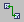 Switch to Connection mode button or right-click on an empty place of the drawing area.

When you drag an element, the connection line follows. It may however be necessary to change the path of a line to keep the diagram neat and clear. You can do this by simply dragging the line.

See also

[Connection Popup Window](BlockDiagramEditorEnglishUS.chm::/BDE_ConnectionPopupWindow.htm)

[Component Manager - Colors Node](ComponentManagerEnglishUS.chm::/cm_color_settings.htm)

[Using the If Statements](markdown/ascuseif.md)

[Sequence Calls](markdown/ascsequencecalls.md)

/* Heikki Komulainen, Comet Computer GmbH 2004 */ cc_plus_pic = '&nbsp;'; cc_minus_pic = '&nbsp;'; cc_stat_pic = '&nbsp;'; gpstyle = ''; var iframes_created = 0; if (document.body && document.body.insertAdjacentHTML && document.getElementsByTagName && document.getElementById) { collect_popups(); set_poplinks_pictures(); if (iframes_created) { document.write(gpstyle); document.write('
<nobr><a id="einauslink" style="position:absolute;top:expression(document.body.scrollTop + this.offsetHeight - this.offsetHeight);left:expression(document.body.offsetWidth - (this.offsetWidth + 28));background:white;padding:5px" href="javascript:show_all_poptext()">Alle texte einblenden</a></nobr>
'); } } function collect_popups() { bsscpopups = new Array(); for (x = 0; x < document.links.length; x++) { if (document.links[x].href.indexOf("BSSCPopup")>-1) { seekmatch = /BSSCPopup.'[^'](markdown/+)'/; poplink = seekmatch.exec(document.links[x].href); poplink = "" + poplink; poplink = poplink.substring(poplink.indexOf("'")+1, poplink.lastIndexOf("'")); ifid = "CCGENIFRAMEID" + x; new_iframe = '<iframe id="' + ifid + '"src="' + poplink + '" onload="get_text(\'' + ifid + '\')" width="0" height="0" frameborder=0></iframe>'; document.links[x].parentNode.insertAdjacentHTML("afterEnd", new_iframe); gpid = "CCID_" + ifid; document.links[x].href = "javascript:expand_poptext('" + gpid + "')"; cc_plus = '' + cc_plus_pic + ''; document.links[x].insertAdjacentHTML("afterBegin", cc_plus); iframes_created = 1; } } }// end function function get_text(ifr_id) { frpars = document.frames[ifr_id].document.getElementsByTagName("body"); popbody = frpars[0].innerHTML; gpid = "CCID_" + ifr_id; if (!document.getElementById(gpid)) { //avoiding doubles document.getElementById(ifr_id).insertAdjacentHTML("afterEnd", '
'+popbody+'
'); } }//end function function expand_poptext(x_frame_id) { if (!document.getElementById(x_frame_id)) return; if (document.getElementById(x_frame_id).className == "CCGENPOPTEXTH") { document.getElementById(x_frame_id).className = "CCGENPOPTEXTV"; document.getElementById(x_frame_id).style.visibility = "visible"; if (document.getElementById("CCPMB_" + x_frame_id )) { document.getElementById("CCPMB_" + x_frame_id ).innerHTML = cc_minus_pic; } } else { document.getElementById(x_frame_id).className = "CCGENPOPTEXTH"; document.getElementById(x_frame_id).style.visibility = "hidden"; if (document.getElementById("CCPMB_" + x_frame_id )) { document.getElementById("CCPMB_" + x_frame_id ).innerHTML = cc_plus_pic; } } }// end function function show_all_poptext() { var pulldowntxt = document.getElementsByTagName("div"); for (b = 0; b < pulldowntxt.length; b++) { if (pulldowntxt[b].className == "droptext") { pulldowntxt[b].style.display=""; } } var gptxt = document.getElementsByTagName("div"); for (z = 0; z < gptxt.length; z++) { if (gptxt[z].className == "CCGENPOPTEXTH") { gptxt[z].className = "CCGENPOPTEXTV"; gptxt[z].style.visibility = "visible"; if (document.getElementById("CCPMB_" + gptxt[z].id )) { document.getElementById("CCPMB_" + gptxt[z].id ).innerHTML = cc_minus_pic; } } } var dxpoplinks = document.getElementsByTagName("a"); if (dxpoplinks) { for (pxl = 0; pxl < dxpoplinks.length; pxl++) { if (dxpoplinks[pxl].href.indexOf("kadovTextPopup")>-1) { if (document.getElementById("CCPMB_" + dxpoplinks[pxl].id)) { document.getElementById("CCPMB_" + dxpoplinks[pxl].id).innerHTML = cc_stat_pic; dxpoplinks[pxl].symbol = "minus"; } } } } document.getElementById('einauslink').innerText = 'Alle texte ausblenden'; document.getElementById('einauslink').href = "javascript:self.location.reload()"; self.focus(); }// end function function eat_click() { return false; }// end function function set_poplinks_pictures() { var dpoplinks = document.getElementsByTagName("a"); if (dpoplinks) { for (pl = 0; pl < dpoplinks.length; pl++) { if (dpoplinks[pl].href.indexOf("kadovTextPopup")>-1) { cc_plus = '' + cc_stat_pic + ''; //dpoplinks[pl].onmouseup = plusminuspoplink; dpoplinks[pl].insertAdjacentHTML("afterBegin", cc_plus); dpoplinks[pl].symbol = "plus"; } } } }// end function function plusminuspoplink() { if (document.getElementById("CCPMB_" + this.id)) { if (this.symbol == "plus") { document.getElementById("CCPMB_" + this.id).innerHTML = cc_minus_pic; this.symbol = "minus"; } else { document.getElementById("CCPMB_" + this.id).innerHTML = cc_plus_pic; this.symbol = "plus"; } } return true; }

---

## Using the If Statements

_Source: `markdown/ascuseif.md`_

# Using the If Statements

To use the If statements, proceed as follows:

1. In the Basic Blocks palette or toolbar, click on the  or  button to load the mouse cursor with the respective block.
1. Place the block in the drawing area.
1. Connect the input to a logical element.
1. Specify the actions for the control flow branches.
1. Right-click on the sequence call you want to connect to a branch, and select Connector from the context menu.
1. Connect the desired branch to the connector.
1. Repeat these actions for the second branch of the If…Then…Else block.

See also

[Editing the Sequence Call in the Sequence Editor](markdown/ASCEditSequence.md)

[Using the Switch](markdown/ascuseswitch.md)

[Using the While Loop](markdown/ascusewhileloop.md)

---

## Using the Switch Operator

_Source: `markdown/ascuseswitch.md`_

# Using the Switch Operator

To use the [switch](markdown/ASCcontrolFlowOperators.md), proceed as follows:

1. From the No. of arguments combo box of the Basic Blocks palette or toolbar, select the number of branches for the switch.

You must select at least two branches. The default branch is not counted. You can adjust the number of branches later via the Add Condition and Remove Condition options in the context menu of the Switch block.

1. Click on the  button to load the mouse cursor with the respective block.
1. Place the block in the drawing area.
1. To change the values for the alternative branches, right-click on the block and select Edit Literals from the context menu.

An editor window opens, it contains one input field for each branch.

1. In the Literals field, enter the values for the branches.
1. Click OK to accept the changes.

1. Connect the input at the top of the block to a limitInt or wrapInt (sdisc or udisc) element.

If you connect the input to a cont pin, an error of type MMdl63 is displayed during code generation.

1. Specify the actions for the branches.
1. Right-click on the sequence call you want to connect to a branch, and select Connector from the context menu.

1. Connect the desired branch to the connector.

You can connect a branch to more than one actions. In that case, edit the connector numbers (according to [Editing the Sequence Call in the Sequence Editor](markdown/ASCEditSequence.md)). As for sequence calls, each number must be unique.

1. Repeat these actions for the other branches.

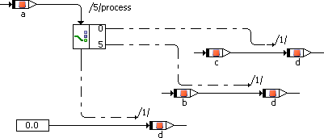 

See also

[Control Flow Operators](markdown/ASCcontrolFlowOperators.md)

[Editing the Sequence Call in the Sequence Editor](markdown/ASCEditSequence.md)

---

## Using the While Loop

_Source: `markdown/ascusewhileloop.md`_

# Using the While Loop

The only loop construct available in block diagrams is the While loop. To use the While loop, proceed as follows:

1. In the Basic Blocks palette or toolbar, click on the  button to load the mouse cursor with the respective block.
1. Place the block in the drawing area.
1. Specify the loop condition.
1. Connect the condition to the loop input.

1. Specify the loop action.
1. Right-click on the sequence call you want to connect to the loop output, and select Connector from the context menu.

The sequence call becomes a connector.

1. Connect the loop output to the connector.

You can connect the output to more than one actions. In that case, edit the connector numbers (according to [Editing the Sequence Call in the Sequence Editor](markdown/ASCEditSequence.md)). As for sequence calls, each number must be unique.

Make sure that you avoid infinite loops or loops unsuitable for real-time applications, e.g., via an appropriate setting for Max Number of Loop Iterations in the project properties, Experiment Code node, of the associated project.

See also

[Editing the Sequence Call in the Sequence Editor](markdown/ASCEditSequence.md)

[Project Editor - Experiment Code Node](ProjectEditorEnglishUS.chm::/Exp_Code_Options_Window.htm)

---

## Using the Conversion Operator

_Source: `markdown/asc_useconversionoperator.md`_

# Using the Conversion Operator

To use the Conversion operator, proceed as follows:

1. In the Basic Blocks palette or toolbar, click on the  Conversion Limit or  Conversion WrapAround button.
1. Place the operator in the drawing area.
1. To determine the conversion result, do the following:
1. Connect the operator input to a scalar element of numerical or enumeration type.
1. Connect the operator output to a suitable operator or element.

Some examples are given in [Examples: Conversion Operator](BlockDiagramEditorEnglishUS.chm::/BDE_Example_ConversionOperator.htm).

See also

[Converting sdisc/udisc to limitInt/wrapInt](IntroductionEnglishUS.chm::/INT_Convert_SdiscUdisc_to_limitInt_wrapInt.htm)

[Conversion Operator](markdown/asc_conversionoperator.md)

[Conversion Attributes Dialog Window](markdown/asc_conversionattributeswindow.md)

[Examples: Conversion Operator](BlockDiagramEditorEnglishUS.chm::/BDE_Example_ConversionOperator.htm)

---

## Using the Assert Operator

_Source: `markdown/asc_useassertoperator.md`_

# Using the Assert Operator

To use the Assert operator in a block diagram, proceed as follows:

1. In the Basic Blocks palette or toolbar, click on the  Assert button.
1. Place the operator in the drawing area.
1. To determine the interval for the operand, do the following:
1. Connect the operator input to a scalar operand of numerical type (i.e., cont, limitInt, wrapInt, sdisc or udisc).
1. Connect the operator output to a suitable operator or element.

An example is given in [Example: Assert Operator](markdown/asc_exampleassertoperator.md).

See also

[Assert Operator](markdown/asc_assertoperator.md)

[Example: Assert Operator](markdown/asc_exampleassertoperator.md)

[Assert Attributes Dialog Window](BlockDiagramEditorEnglishUS.chm::/BDE_AssertAttributes_Window.htm)

---

## Renaming or Deleting an Element

_Source: `markdown/ascrenamedeleteElement.md`_

# Renaming or Deleting an Element

To rename or delete an element, proceed as follows:

1. In the Outline tab, select an element.
1. In the Edit menu, select Rename to rename the element.
1. In the Edit menu, select Delete to delete the element.

Before deleting an element, you must remove its graphical occurrences from the diagram. You can use the Show Occurrences command in the Extras menu to select the graphical occurrences in the diagram for removal.

See also

[Searching/Deleting Unused Elements](markdown/ASC_SearchDeleteUnusedElements.md)

[Removing a Connection or an Element](BlockDiagramEditorEnglishUS.chm::/Deleteconnection.htm)

[Replacing a Diagram Item](BlockDiagramEditorEnglishUS.chm::/ReplaceDiagram.htm)

[Copying/Moving Diagram Items in the Same Diagram](markdown/asccutcopypaste.md)

[Copying/Moving Diagram Items Between Diagrams](markdown/asc_copymove_items_betweendiagram.md)

[Viewing all Graphical Occurrences of an Element](markdown/ascviewoccurrence.md)

[Reserved Keywords](IntroductionEnglishUS.chm::/INT_Reserved_Keywords.htm)

---

## Searching/Deleting Unused Elements

_Source: `markdown/ASC_SearchDeleteUnusedElements.md`_

# Searching/Deleting Unused Elements

To delete elements (scalar, composite or complex) not used in the SWC block diagram, proceed as follows:

1. In the Extras menu, select Show Unused Elements.
1. In the Elements tab of the Search Results view, select one, several - e.g., the unused interrunnable variables -, or all (Ctrl + a) elements.
1. Do one of the following:

- Open the context menu and select Delete.
- Press Delete.

The selected unused elements are deleted.

See also

[Search Results View](markdown/ASCSearchResultsView.md)

[Renaming or Deleting an Element](markdown/ascrenamedeleteElement.md)

[Reserved Keywords](IntroductionEnglishUS.chm::/INT_Reserved_Keywords.htm)

/* Heikki Komulainen, Comet Computer GmbH 2004 */ cc_plus_pic = '&nbsp;'; cc_minus_pic = '&nbsp;'; cc_stat_pic = '&nbsp;'; gpstyle = ''; var iframes_created = 0; if (document.body && document.body.insertAdjacentHTML && document.getElementsByTagName && document.getElementById) { collect_popups(); set_poplinks_pictures(); if (iframes_created) { document.write(gpstyle); document.write('
<nobr><a id="einauslink" style="position:absolute;top:expression(document.body.scrollTop + this.offsetHeight - this.offsetHeight);left:expression(document.body.offsetWidth - (this.offsetWidth + 28));background:#ffffe0;padding:5px" href="javascript:show_all_poptext()">Show all hidden text</a></nobr>
'); } } function collect_popups() { bsscpopups = new Array(); for (x = 0; x < document.links.length; x++) { if (document.links[x].href.indexOf("BSSCPopup")>-1) { seekmatch = /BSSCPopup.'[^'](markdown/+)'/; poplink = seekmatch.exec(document.links[x].href); poplink = "" + poplink; poplink = poplink.substring(poplink.indexOf("'")+1, poplink.lastIndexOf("'")); ifid = "CCGENIFRAMEID" + x; new_iframe = '<iframe id="' + ifid + '"src="' + poplink + '" onload="get_text(\'' + ifid + '\')" width="0" height="0" frameborder=0></iframe>'; document.links[x].parentNode.insertAdjacentHTML("afterEnd", new_iframe); gpid = "CCID_" + ifid; document.links[x].href = "javascript:expand_poptext('" + gpid + "')"; cc_plus = '' + cc_plus_pic + ''; document.links[x].insertAdjacentHTML("afterBegin", cc_plus); iframes_created = 1; } } }// end function function get_text(ifr_id) { frpars = document.frames[ifr_id].document.getElementsByTagName("body"); popbody = frpars[0].innerHTML; gpid = "CCID_" + ifr_id; if (!document.getElementById(gpid)) { //avoiding doubles document.getElementById(ifr_id).insertAdjacentHTML("afterEnd", '
'+popbody+'
'); } }//end function function expand_poptext(x_frame_id) { if (!document.getElementById(x_frame_id)) return; if (document.getElementById(x_frame_id).className == "CCGENPOPTEXTH") { document.getElementById(x_frame_id).className = "CCGENPOPTEXTV"; document.getElementById(x_frame_id).style.visibility = "visible"; if (document.getElementById("CCPMB_" + x_frame_id )) { document.getElementById("CCPMB_" + x_frame_id ).innerHTML = cc_minus_pic; } } else { document.getElementById(x_frame_id).className = "CCGENPOPTEXTH"; document.getElementById(x_frame_id).style.visibility = "hidden"; if (document.getElementById("CCPMB_" + x_frame_id )) { document.getElementById("CCPMB_" + x_frame_id ).innerHTML = cc_plus_pic; } } }// end function function show_all_poptext() { var pulldowntxt = document.getElementsByTagName("div"); for (b = 0; b < pulldowntxt.length; b++) { if (pulldowntxt[b].className == "droptext") { pulldowntxt[b].style.display=""; } } var gptxt = document.getElementsByTagName("div"); for (z = 0; z < gptxt.length; z++) { if (gptxt[z].className == "CCGENPOPTEXTH") { gptxt[z].className = "CCGENPOPTEXTV"; gptxt[z].style.visibility = "visible"; if (document.getElementById("CCPMB_" + gptxt[z].id )) { document.getElementById("CCPMB_" + gptxt[z].id ).innerHTML = cc_minus_pic; } } } var dxpoplinks = document.getElementsByTagName("a"); if (dxpoplinks) { for (pxl = 0; pxl < dxpoplinks.length; pxl++) { if (dxpoplinks[pxl].href.indexOf("kadovTextPopup")>-1) { if (document.getElementById("CCPMB_" + dxpoplinks[pxl].id)) { document.getElementById("CCPMB_" + dxpoplinks[pxl].id).innerHTML = cc_stat_pic; dxpoplinks[pxl].symbol = "minus"; } } } } document.getElementById('einauslink').innerText = 'Hide all hideable text'; document.getElementById('einauslink').href = "javascript:self.location.reload()"; self.focus(); }// end function function eat_click() { return false; }// end function function set_poplinks_pictures() { var dpoplinks = document.getElementsByTagName("a"); if (dpoplinks) { for (pl = 0; pl < dpoplinks.length; pl++) { if (dpoplinks[pl].href.indexOf("kadovTextPopup")>-1) { cc_plus = '' + cc_stat_pic + ''; //dpoplinks[pl].onmouseup = plusminuspoplink; dpoplinks[pl].insertAdjacentHTML("afterBegin", cc_plus); dpoplinks[pl].symbol = "plus"; } } } }// end function function plusminuspoplink() { if (document.getElementById("CCPMB_" + this.id)) { if (this.symbol == "plus") { document.getElementById("CCPMB_" + this.id).innerHTML = cc_minus_pic; this.symbol = "minus"; } else { document.getElementById("CCPMB_" + this.id).innerHTML = cc_plus_pic; this.symbol = "plus"; } } return true; }

---

## Copying/Moving Diagram Items in the Same Diagram

_Source: `markdown/asccutcopypaste.md`_

1. In the Edit menu, select Cut.
1. Press Ctrl + x.
1. Click on  Cut.

1. In the Edit menu, select Copy.
1. Press Ctrl + c.
1. Click on  Copy.

1. In the Edit menu, select Paste.
1. Press Ctrl + v.
1. Click on  Paste.

# Copying/Moving Diagram Items in the Same Diagram

You create a new graphical occurrence of the same element, not a new element, when you paste the diagram item from the clipboard to the diagram.

To cut, copy and paste diagram items in the same diagram, proceed as follows:

1. In the drawing area, select the diagram items you want to cut or copy.
1. To cut the selected items, do [one of the following](javascript:kadovTextPopup(this))<!-- kadovTextPopupInit('a1'); //-->.
1. To copy the selected items, do [one of the following](javascript:kadovTextPopup(this))<!-- kadovTextPopupInit('a2'); //-->.
1. To paste the items, do [one of the following](javascript:kadovTextPopup(this))<!-- kadovTextPopupInit('a3'); //-->.
1. Drag the new diagram items to a suitable location.
1. Edit the pasted sequence calls.
1. If your selection contained method-local elements, make sure that the return value is assigned only once and has the highest sequence number.

See also

[Copying/Moving Diagram Items Between Diagrams](markdown/asc_copymove_items_betweendiagram.md)

[Copying or Moving Graphical Items](BlockDiagramEditorEnglishUS.chm::/bde_copymove_graphicitems.htm)

[Editing Sequence Calls](markdown/ASCeditSequenceCalls.md)

/* Heikki Komulainen, Comet Computer GmbH 2004 */ cc_plus_pic = '&nbsp;'; cc_minus_pic = '&nbsp;'; cc_stat_pic = '&nbsp;'; gpstyle = ''; var iframes_created = 0; if (document.body && document.body.insertAdjacentHTML && document.getElementsByTagName && document.getElementById) { collect_popups(); set_poplinks_pictures(); if (iframes_created) { document.write(gpstyle); document.write('
<nobr><a id="einauslink" style="position:absolute;top:expression(document.body.scrollTop + this.offsetHeight - this.offsetHeight);left:expression(document.body.offsetWidth - (this.offsetWidth + 28));background:white;padding:5px" href="javascript:show_all_poptext()">Show all hidden text</a></nobr>
'); } } function collect_popups() { bsscpopups = new Array(); for (x = 0; x < document.links.length; x++) { if (document.links[x].href.indexOf("BSSCPopup")>-1) { seekmatch = /BSSCPopup.'[^'](markdown/+)'/; poplink = seekmatch.exec(document.links[x].href); poplink = "" + poplink; poplink = poplink.substring(poplink.indexOf("'")+1, poplink.lastIndexOf("'")); ifid = "CCGENIFRAMEID" + x; new_iframe = '<iframe id="' + ifid + '"src="' + poplink + '" onload="get_text(\'' + ifid + '\')" width="0" height="0" frameborder=0></iframe>'; document.links[x].parentNode.insertAdjacentHTML("afterEnd", new_iframe); gpid = "CCID_" + ifid; document.links[x].href = "javascript:expand_poptext('" + gpid + "')"; cc_plus = '' + cc_plus_pic + ''; document.links[x].insertAdjacentHTML("afterBegin", cc_plus); iframes_created = 1; } } }// end function function get_text(ifr_id) { frpars = document.frames[ifr_id].document.getElementsByTagName("body"); popbody = frpars[0].innerHTML; gpid = "CCID_" + ifr_id; if (!document.getElementById(gpid)) { //avoiding doubles document.getElementById(ifr_id).insertAdjacentHTML("afterEnd", '
'+popbody+'
'); } }//end function function expand_poptext(x_frame_id) { if (!document.getElementById(x_frame_id)) return; if (document.getElementById(x_frame_id).className == "CCGENPOPTEXTH") { document.getElementById(x_frame_id).className = "CCGENPOPTEXTV"; document.getElementById(x_frame_id).style.visibility = "visible"; if (document.getElementById("CCPMB_" + x_frame_id )) { document.getElementById("CCPMB_" + x_frame_id ).innerHTML = cc_minus_pic; } } else { document.getElementById(x_frame_id).className = "CCGENPOPTEXTH"; document.getElementById(x_frame_id).style.visibility = "hidden"; if (document.getElementById("CCPMB_" + x_frame_id )) { document.getElementById("CCPMB_" + x_frame_id ).innerHTML = cc_plus_pic; } } }// end function function show_all_poptext() { var pulldowntxt = document.getElementsByTagName("div"); for (b = 0; b < pulldowntxt.length; b++) { if (pulldowntxt[b].className == "droptext") { pulldowntxt[b].style.display=""; } } var gptxt = document.getElementsByTagName("div"); for (z = 0; z < gptxt.length; z++) { if (gptxt[z].className == "CCGENPOPTEXTH") { gptxt[z].className = "CCGENPOPTEXTV"; gptxt[z].style.visibility = "visible"; if (document.getElementById("CCPMB_" + gptxt[z].id )) { document.getElementById("CCPMB_" + gptxt[z].id ).innerHTML = cc_minus_pic; } } } var dxpoplinks = document.getElementsByTagName("a"); if (dxpoplinks) { for (pxl = 0; pxl < dxpoplinks.length; pxl++) { if (dxpoplinks[pxl].href.indexOf("kadovTextPopup")>-1) { if (document.getElementById("CCPMB_" + dxpoplinks[pxl].id)) { document.getElementById("CCPMB_" + dxpoplinks[pxl].id).innerHTML = cc_stat_pic; dxpoplinks[pxl].symbol = "minus"; } } } } document.getElementById('einauslink').innerText = 'Hide all hideable text'; document.getElementById('einauslink').href = "javascript:self.location.reload()"; self.focus(); }// end function function eat_click() { return false; }// end function function set_poplinks_pictures() { var dpoplinks = document.getElementsByTagName("a"); if (dpoplinks) { for (pl = 0; pl < dpoplinks.length; pl++) { if (dpoplinks[pl].href.indexOf("kadovTextPopup")>-1) { cc_plus = '' + cc_stat_pic + ''; //dpoplinks[pl].onmouseup = plusminuspoplink; dpoplinks[pl].insertAdjacentHTML("afterBegin", cc_plus); dpoplinks[pl].symbol = "plus"; } } } }// end function function plusminuspoplink() { if (document.getElementById("CCPMB_" + this.id)) { if (this.symbol == "plus") { document.getElementById("CCPMB_" + this.id).innerHTML = cc_minus_pic; this.symbol = "minus"; } else { document.getElementById("CCPMB_" + this.id).innerHTML = cc_plus_pic; this.symbol = "plus"; } } return true; }

---

## Copying/Moving Diagram Items Between Diagrams

_Source: `markdown/asc_copymove_items_betweendiagram.md`_

1. In the Edit menu, select Cut or Copy.
1. Press Ctrl + x or Ctrl + c.
1. Click on  Cut or  Copy.

1. Click in the drawing area of the target component.
1. In the Edit menu, select Paste.
1. Press Ctrl + v.
1. Click on  Paste.

| Column 1 | Column 2 |
| --- | --- |
| Keep | The existing element replaces the copied element. |
| Overwrite | The copied element replaces the existing element. |
| Create New (not available for return values) | Pastes the copied element to a new element named <element name>_<n> , <n> being the lowest integer number that causes no name clash. If the renamed element causes a new name conflict, renaming is done in alphabetical order; see the example . |
| Cancel | Aborts the paste procedure. |

The Apply to the next <x> conflicts option allows you to apply your selection to all name conflicts.

If arg_1 and arg_2 are pasted to a method with an existing arg_1, the following happens:

- The names of the copied arg_1 and the existing arg_1 conflict, and the copied arg_1 is renamed to arg_2.
- Now, the names of the copied arg_2 and the newly created arg_2 (the copied arg_1) conflict, and the copied arg_2 is renamed to arg_3.

| Column 1 | Column 2 |
| --- | --- |
| Keep | The existing element replaces the copied element. Keeping an element of different type (e.g., log vs. cont, array vs. scalar) than the copied element can lead to an invalid model. |
| Overwrite | The copied element replaces the existing element. Replacing an existing element with a copied element of different type (e.g., log vs. cont, array vs. scalar) can lead to an invalid model. |
| Create New (not available for return values) | Pastes the copied element to a new element named <element name> . If the new element causes a name conflict, it is renamed to <element name>_<n> ( <n> being the lowest integer number that causes no name clash); see the example . It is strongly recommended that you use Create New . |
| Cancel | Aborts the paste procedure. |

The Apply to the next <x> conflicts option allows you to apply your selection to all type conflicts, with the exception of conflicting return values.

If arg_1 (cont) is pasted to a method with existing arguments arg_1 (log) and arg_2 (cont), the following happens:

- The types of the copied arg_1 and the existing arg_1 conflict, and the copied arg_1 is renamed to arg_2.
- Now, the names of the newly created arg_2 (the copied arg_1) and the existing arg_2 conflict, and the newly created arg_2 is renamed to arg_3.

# Copying/Moving Diagram Items Between Diagrams

To cut/copy diagram items from one diagram and paste them to another diagram, proceed as follows:

1. In the drawing area, select the diagram items you want to cut or copy.
1. To cut or copy the selected items, do [one of the following](javascript:kadovTextPopup(this))<!-- kadovTextPopupInit('a1'); //-->.
1. Open the target component and load the target diagram.
1. To paste the items, do [one of the following](javascript:kadovTextPopup(this))<!-- kadovTextPopupInit('a3'); //-->.
1. In the Select Method window, select an existing method/runnable, or create a new one, and click OK.
1. In the Create new Method window, click Yes to create the new method/runnable and paste the diagram items.
1. In the Ignored Elements window, click Continue to paste the allowed diagram items.

The model will be invalid, due to the ignored elements. You must edit it before you can use it.

1. See also

[Copying/Moving Diagram Items in the Same Diagram](markdown/asccutcopypaste.md)

[Copying or Moving Graphical Items](BlockDiagramEditorEnglishUS.chm::/bde_copymove_graphicitems.htm)

[Editing Sequence Calls](markdown/ASCeditSequenceCalls.md)

/* Heikki Komulainen, Comet Computer GmbH 2004 */ cc_plus_pic = '&nbsp;'; cc_minus_pic = '&nbsp;'; cc_stat_pic = '&nbsp;'; gpstyle = ''; var iframes_created = 0; if (document.body && document.body.insertAdjacentHTML && document.getElementsByTagName && document.getElementById) { collect_popups(); set_poplinks_pictures(); if (iframes_created) { document.write(gpstyle); document.write('
<nobr><a id="einauslink" style="position:absolute;top:expression(document.body.scrollTop + this.offsetHeight - this.offsetHeight);left:expression(document.body.offsetWidth - (this.offsetWidth + 28));background:white;padding:5px" href="javascript:show_all_poptext()">Show all hidden text</a></nobr>
'); } } function collect_popups() { bsscpopups = new Array(); for (x = 0; x < document.links.length; x++) { if (document.links[x].href.indexOf("BSSCPopup")>-1) { seekmatch = /BSSCPopup.'[^'](markdown/+)'/; poplink = seekmatch.exec(document.links[x].href); poplink = "" + poplink; poplink = poplink.substring(poplink.indexOf("'")+1, poplink.lastIndexOf("'")); ifid = "CCGENIFRAMEID" + x; new_iframe = '<iframe id="' + ifid + '"src="' + poplink + '" onload="get_text(\'' + ifid + '\')" width="0" height="0" frameborder=0></iframe>'; document.links[x].parentNode.insertAdjacentHTML("afterEnd", new_iframe); gpid = "CCID_" + ifid; document.links[x].href = "javascript:expand_poptext('" + gpid + "')"; cc_plus = '' + cc_plus_pic + ''; document.links[x].insertAdjacentHTML("afterBegin", cc_plus); iframes_created = 1; } } }// end function function get_text(ifr_id) { frpars = document.frames[ifr_id].document.getElementsByTagName("body"); popbody = frpars[0].innerHTML; gpid = "CCID_" + ifr_id; if (!document.getElementById(gpid)) { //avoiding doubles document.getElementById(ifr_id).insertAdjacentHTML("afterEnd", '
'+popbody+'
'); } }//end function function expand_poptext(x_frame_id) { if (!document.getElementById(x_frame_id)) return; if (document.getElementById(x_frame_id).className == "CCGENPOPTEXTH") { document.getElementById(x_frame_id).className = "CCGENPOPTEXTV"; document.getElementById(x_frame_id).style.visibility = "visible"; if (document.getElementById("CCPMB_" + x_frame_id )) { document.getElementById("CCPMB_" + x_frame_id ).innerHTML = cc_minus_pic; } } else { document.getElementById(x_frame_id).className = "CCGENPOPTEXTH"; document.getElementById(x_frame_id).style.visibility = "hidden"; if (document.getElementById("CCPMB_" + x_frame_id )) { document.getElementById("CCPMB_" + x_frame_id ).innerHTML = cc_plus_pic; } } }// end function function show_all_poptext() { var pulldowntxt = document.getElementsByTagName("div"); for (b = 0; b < pulldowntxt.length; b++) { if (pulldowntxt[b].className == "droptext") { pulldowntxt[b].style.display=""; } } var gptxt = document.getElementsByTagName("div"); for (z = 0; z < gptxt.length; z++) { if (gptxt[z].className == "CCGENPOPTEXTH") { gptxt[z].className = "CCGENPOPTEXTV"; gptxt[z].style.visibility = "visible"; if (document.getElementById("CCPMB_" + gptxt[z].id )) { document.getElementById("CCPMB_" + gptxt[z].id ).innerHTML = cc_minus_pic; } } } var dxpoplinks = document.getElementsByTagName("a"); if (dxpoplinks) { for (pxl = 0; pxl < dxpoplinks.length; pxl++) { if (dxpoplinks[pxl].href.indexOf("kadovTextPopup")>-1) { if (document.getElementById("CCPMB_" + dxpoplinks[pxl].id)) { document.getElementById("CCPMB_" + dxpoplinks[pxl].id).innerHTML = cc_stat_pic; dxpoplinks[pxl].symbol = "minus"; } } } } document.getElementById('einauslink').innerText = 'Hide all hideable text'; document.getElementById('einauslink').href = "javascript:self.location.reload()"; self.focus(); }// end function function eat_click() { return false; }// end function function set_poplinks_pictures() { var dpoplinks = document.getElementsByTagName("a"); if (dpoplinks) { for (pl = 0; pl < dpoplinks.length; pl++) { if (dpoplinks[pl].href.indexOf("kadovTextPopup")>-1) { cc_plus = '' + cc_stat_pic + ''; //dpoplinks[pl].onmouseup = plusminuspoplink; dpoplinks[pl].insertAdjacentHTML("afterBegin", cc_plus); dpoplinks[pl].symbol = "plus"; } } } }// end function function plusminuspoplink() { if (document.getElementById("CCPMB_" + this.id)) { if (this.symbol == "plus") { document.getElementById("CCPMB_" + this.id).innerHTML = cc_minus_pic; this.symbol = "minus"; } else { document.getElementById("CCPMB_" + this.id).innerHTML = cc_plus_pic; this.symbol = "plus"; } } return true; }

---

## Adding Implementation Casts to Operators

_Source: `markdown/ascaddimplementationcast.md`_

<operator><m>_<pin type><n>

- <operator> can have, depending on the selected operator, the values add, sub, mul, div, abs or neg.
- <m> is the number of the operator. The first operator of a type for which implementation casts are generated in this way is assigned the number 1; further operators of the same type are then numbered consecutively (2,3,....).
- <pin type> is the description of the operator pin connected to the implementation cast, i.e. in for inputs and out for outputs.
- <n> is the number of the implementation cast. Implementation casts connected to the inputs and output of the operator are numbered separately.
- The implementation cast connected to the first operator input is assigned the number 1; further inputs are numbered consecutively. The number is omitted if the operator has only one input.
- If the operator output is connected to more than one element, the implementation casts are numbered, beginning with 1. If the operator input is connected to one element, the number is omitted.

# Adding Implementation Casts to Operators

The procedure only works if none of the inputs and outputs of the operator is directly connected to an implementation cast. Otherwise the following error message appears: This operator is already connected to at least one implementation cast. Please specify further implementation casts individually.

To add implementation casts to an operator, proceed as follows:

1. Select the operator which is to have implementation casts added to it.
1. Right-click the operator and select Add Implementation Cast from the context menu.
1. The implementation casts are named automatically in accordance with the [following scheme](javascript:kadovTextPopup(this))<!-- kadovTextPopupInit('a1'); //-->.

See also

[Implementation Casts in Software Components](markdown/ascimplementationcasts.md)

[Adding Implementation Casts to a Connection](markdown/ascaddimplcasttoconnect.md)

/* Heikki Komulainen, Comet Computer GmbH 2004 */ cc_plus_pic = '&nbsp;'; cc_minus_pic = '&nbsp;'; cc_stat_pic = '&nbsp;'; gpstyle = ''; var iframes_created = 0; if (document.body && document.body.insertAdjacentHTML && document.getElementsByTagName && document.getElementById) { collect_popups(); set_poplinks_pictures(); if (iframes_created) { document.write(gpstyle); document.write('
<nobr><a id="einauslink" style="position:absolute;top:expression(document.body.scrollTop + this.offsetHeight - this.offsetHeight);left:expression(document.body.offsetWidth - (this.offsetWidth + 28));background:white;padding:5px" href="javascript:show_all_poptext()">Alle texte einblenden</a></nobr>
'); } } function collect_popups() { bsscpopups = new Array(); for (x = 0; x < document.links.length; x++) { if (document.links[x].href.indexOf("BSSCPopup")>-1) { seekmatch = /BSSCPopup.'[^'](markdown/+)'/; poplink = seekmatch.exec(document.links[x].href); poplink = "" + poplink; poplink = poplink.substring(poplink.indexOf("'")+1, poplink.lastIndexOf("'")); ifid = "CCGENIFRAMEID" + x; new_iframe = '<iframe id="' + ifid + '"src="' + poplink + '" onload="get_text(\'' + ifid + '\')" width="0" height="0" frameborder=0></iframe>'; document.links[x].parentNode.insertAdjacentHTML("afterEnd", new_iframe); gpid = "CCID_" + ifid; document.links[x].href = "javascript:expand_poptext('" + gpid + "')"; cc_plus = '' + cc_plus_pic + ''; document.links[x].insertAdjacentHTML("afterBegin", cc_plus); iframes_created = 1; } } }// end function function get_text(ifr_id) { frpars = document.frames[ifr_id].document.getElementsByTagName("body"); popbody = frpars[0].innerHTML; gpid = "CCID_" + ifr_id; if (!document.getElementById(gpid)) { //avoiding doubles document.getElementById(ifr_id).insertAdjacentHTML("afterEnd", '
'+popbody+'
'); } }//end function function expand_poptext(x_frame_id) { if (!document.getElementById(x_frame_id)) return; if (document.getElementById(x_frame_id).className == "CCGENPOPTEXTH") { document.getElementById(x_frame_id).className = "CCGENPOPTEXTV"; document.getElementById(x_frame_id).style.visibility = "visible"; if (document.getElementById("CCPMB_" + x_frame_id )) { document.getElementById("CCPMB_" + x_frame_id ).innerHTML = cc_minus_pic; } } else { document.getElementById(x_frame_id).className = "CCGENPOPTEXTH"; document.getElementById(x_frame_id).style.visibility = "hidden"; if (document.getElementById("CCPMB_" + x_frame_id )) { document.getElementById("CCPMB_" + x_frame_id ).innerHTML = cc_plus_pic; } } }// end function function show_all_poptext() { var pulldowntxt = document.getElementsByTagName("div"); for (b = 0; b < pulldowntxt.length; b++) { if (pulldowntxt[b].className == "droptext") { pulldowntxt[b].style.display=""; } } var gptxt = document.getElementsByTagName("div"); for (z = 0; z < gptxt.length; z++) { if (gptxt[z].className == "CCGENPOPTEXTH") { gptxt[z].className = "CCGENPOPTEXTV"; gptxt[z].style.visibility = "visible"; if (document.getElementById("CCPMB_" + gptxt[z].id )) { document.getElementById("CCPMB_" + gptxt[z].id ).innerHTML = cc_minus_pic; } } } var dxpoplinks = document.getElementsByTagName("a"); if (dxpoplinks) { for (pxl = 0; pxl < dxpoplinks.length; pxl++) { if (dxpoplinks[pxl].href.indexOf("kadovTextPopup")>-1) { if (document.getElementById("CCPMB_" + dxpoplinks[pxl].id)) { document.getElementById("CCPMB_" + dxpoplinks[pxl].id).innerHTML = cc_stat_pic; dxpoplinks[pxl].symbol = "minus"; } } } } document.getElementById('einauslink').innerText = 'Alle texte ausblenden'; document.getElementById('einauslink').href = "javascript:self.location.reload()"; self.focus(); }// end function function eat_click() { return false; }// end function function set_poplinks_pictures() { var dpoplinks = document.getElementsByTagName("a"); if (dpoplinks) { for (pl = 0; pl < dpoplinks.length; pl++) { if (dpoplinks[pl].href.indexOf("kadovTextPopup")>-1) { cc_plus = '' + cc_stat_pic + ''; //dpoplinks[pl].onmouseup = plusminuspoplink; dpoplinks[pl].insertAdjacentHTML("afterBegin", cc_plus); dpoplinks[pl].symbol = "plus"; } } } }// end function function plusminuspoplink() { if (document.getElementById("CCPMB_" + this.id)) { if (this.symbol == "plus") { document.getElementById("CCPMB_" + this.id).innerHTML = cc_minus_pic; this.symbol = "minus"; } else { document.getElementById("CCPMB_" + this.id).innerHTML = cc_plus_pic; this.symbol = "plus"; } } return true; }

---

## Adding Implementation Casts to a Connection

_Source: `markdown/ascaddimplcasttoconnect.md`_

impl_cast_<n>

<n> is the number of the implementation cast. The first implementation cast created automatically on a connection is not assigned a number, the second one is assigned the number 1, further implementation casts created automatically on any connections are then numbered accordingly.

# Adding Implementation Casts to a Connection

You can add implementation casts to all connecting lines (data paths) of arithmetical values via the context menu.

This is not the case for connections with other operators than +, -, *, /, abs, neg, max, min, and mux, connections to logical elements or control flow connecting lines.

To add an implementation cast to a connection, proceed as follows:

1. Select the connection you want to add an implementation cast to.
1. Right-click on the connection and select Add Implementation Cast from the context menu.
1. Select an implementation cast from the list and click OK.

The implementation cast is added to the connection. If you selected <new implementation cast>, a new implementation cast is created.

The implementation casts are named automatically in accordance with the [following scheme](javascript:kadovTextPopup(this))<!-- kadovTextPopupInit('a1'); //-->.

This scheme applies to all implementation casts which were not created automatically for an operator (see [Adding Implementation Casts to Operators](markdown/ascaddimplementationcast.md)).

See also

[Implementation Casts in Software Components](markdown/ascimplementationcasts.md)

[Adding Implementation Casts to Operators](markdown/ascaddimplementationcast.md)

/* Heikki Komulainen, Comet Computer GmbH 2004 */ cc_plus_pic = '&nbsp;'; cc_minus_pic = '&nbsp;'; cc_stat_pic = '&nbsp;'; gpstyle = ''; var iframes_created = 0; if (document.body && document.body.insertAdjacentHTML && document.getElementsByTagName && document.getElementById) { collect_popups(); set_poplinks_pictures(); if (iframes_created) { document.write(gpstyle); document.write('
<nobr><a id="einauslink" style="position:absolute;top:expression(document.body.scrollTop + this.offsetHeight - this.offsetHeight);left:expression(document.body.offsetWidth - (this.offsetWidth + 28));background:white;padding:5px" href="javascript:show_all_poptext()">Alle texte einblenden</a></nobr>
'); } } function collect_popups() { bsscpopups = new Array(); for (x = 0; x < document.links.length; x++) { if (document.links[x].href.indexOf("BSSCPopup")>-1) { seekmatch = /BSSCPopup.'[^'](markdown/+)'/; poplink = seekmatch.exec(document.links[x].href); poplink = "" + poplink; poplink = poplink.substring(poplink.indexOf("'")+1, poplink.lastIndexOf("'")); ifid = "CCGENIFRAMEID" + x; new_iframe = '<iframe id="' + ifid + '"src="' + poplink + '" onload="get_text(\'' + ifid + '\')" width="0" height="0" frameborder=0></iframe>'; document.links[x].parentNode.insertAdjacentHTML("afterEnd", new_iframe); gpid = "CCID_" + ifid; document.links[x].href = "javascript:expand_poptext('" + gpid + "')"; cc_plus = '' + cc_plus_pic + ''; document.links[x].insertAdjacentHTML("afterBegin", cc_plus); iframes_created = 1; } } }// end function function get_text(ifr_id) { frpars = document.frames[ifr_id].document.getElementsByTagName("body"); popbody = frpars[0].innerHTML; gpid = "CCID_" + ifr_id; if (!document.getElementById(gpid)) { //avoiding doubles document.getElementById(ifr_id).insertAdjacentHTML("afterEnd", '
'+popbody+'
'); } }//end function function expand_poptext(x_frame_id) { if (!document.getElementById(x_frame_id)) return; if (document.getElementById(x_frame_id).className == "CCGENPOPTEXTH") { document.getElementById(x_frame_id).className = "CCGENPOPTEXTV"; document.getElementById(x_frame_id).style.visibility = "visible"; if (document.getElementById("CCPMB_" + x_frame_id )) { document.getElementById("CCPMB_" + x_frame_id ).innerHTML = cc_minus_pic; } } else { document.getElementById(x_frame_id).className = "CCGENPOPTEXTH"; document.getElementById(x_frame_id).style.visibility = "hidden"; if (document.getElementById("CCPMB_" + x_frame_id )) { document.getElementById("CCPMB_" + x_frame_id ).innerHTML = cc_plus_pic; } } }// end function function show_all_poptext() { var pulldowntxt = document.getElementsByTagName("div"); for (b = 0; b < pulldowntxt.length; b++) { if (pulldowntxt[b].className == "droptext") { pulldowntxt[b].style.display=""; } } var gptxt = document.getElementsByTagName("div"); for (z = 0; z < gptxt.length; z++) { if (gptxt[z].className == "CCGENPOPTEXTH") { gptxt[z].className = "CCGENPOPTEXTV"; gptxt[z].style.visibility = "visible"; if (document.getElementById("CCPMB_" + gptxt[z].id )) { document.getElementById("CCPMB_" + gptxt[z].id ).innerHTML = cc_minus_pic; } } } var dxpoplinks = document.getElementsByTagName("a"); if (dxpoplinks) { for (pxl = 0; pxl < dxpoplinks.length; pxl++) { if (dxpoplinks[pxl].href.indexOf("kadovTextPopup")>-1) { if (document.getElementById("CCPMB_" + dxpoplinks[pxl].id)) { document.getElementById("CCPMB_" + dxpoplinks[pxl].id).innerHTML = cc_stat_pic; dxpoplinks[pxl].symbol = "minus"; } } } } document.getElementById('einauslink').innerText = 'Alle texte ausblenden'; document.getElementById('einauslink').href = "javascript:self.location.reload()"; self.focus(); }// end function function eat_click() { return false; }// end function function set_poplinks_pictures() { var dpoplinks = document.getElementsByTagName("a"); if (dpoplinks) { for (pl = 0; pl < dpoplinks.length; pl++) { if (dpoplinks[pl].href.indexOf("kadovTextPopup")>-1) { cc_plus = '' + cc_stat_pic + ''; //dpoplinks[pl].onmouseup = plusminuspoplink; dpoplinks[pl].insertAdjacentHTML("afterBegin", cc_plus); dpoplinks[pl].symbol = "plus"; } } } }// end function function plusminuspoplink() { if (document.getElementById("CCPMB_" + this.id)) { if (this.symbol == "plus") { document.getElementById("CCPMB_" + this.id).innerHTML = cc_minus_pic; this.symbol = "minus"; } else { document.getElementById("CCPMB_" + this.id).innerHTML = cc_plus_pic; this.symbol = "plus"; } } return true; }

---

## Editing Sequence Calls

_Source: `markdown/ASCeditSequenceCalls.md`_

# Editing Sequence Calls

##### Editing individual sequence calls

1. [Editing a Sequence Call in the Sequence Editor](markdown/ASCEditSequence.md)
1. [Using Existing Sequence Numbers](markdown/ascusenumbers.md)
1. [Automatically Assigning Individual Sequence Calls](markdown/ASCassignindividual.md)
1. [Incrementing/Decrementing Individual Sequence Calls](markdown/ASCIncrementordecrement.md)
1. [Resetting an Individual Sequence Call](markdown/ASCResetindividual.md)
1. [Changing the Visibility of Individual Sequence Calls](markdown/ASCChangevisibility.md)

##### Editing several sequence calls

1. [Automatically Assigning Sequence Calls](markdown/ASCassignSequence.md)
1. [Automatically Assigning Sequence Calls from a Specific Number](markdown/ascautomaticallyassign.md)
1. [Adding Sequence Calls to an Existing Sequence](markdown/ascaddsequence.md)
1. [Scaling Sequence Calls](markdown/ascscalesequence.md)
1. [Shifting Several Sequence Calls](markdown/ascshiftsequence.md)
1. [Resetting Several Sequence Calls](markdown/ASCResetSequence.md)
1. [Creating a Sequence of Protected Sequence Calls](markdown/ASCCreatesequence.md)
1. [Moving Between Sequence Calls](markdown/ASCMovesequence.md)
1. [Changing the Visibility of Several Sequence Calls](markdown/ascchangesequence.md)

##### Connectors

1. [Creating Connectors](markdown/asccreateconnectors.md)
1. [Toggling Between Connector and Block-Local Sequence Call](markdown/asc_convertconnectorsequencecall.md)

- (item)

---

## Editing a Sequence Call in the Sequence Editor

_Source: `markdown/ASCEditSequence.md`_

- Only whole multiples of the value in the Sequence Step Size field (corresponds to Sequence Step Size in the Sequencing node of the ASCET option window,see [Sequencing Options](ComponentManagerEnglishUS.chm::/CM_SequencingNode.htm))are taken into consideration. If, for example, the value 5 is set, only the numbers 5, 10, 15, 20, ... are checked.
- If the Use Gaps option is activated, any gaps between existing sequence numbers are filled. The first condition still applies; gaps which are not whole multiples of the value in the Sequence Step Size box are not filled.

Example:

If, e.g. the numbers 1–3, 5–9 and 11 have already been assigned and 5 has been specified in the Sequence Step Size box, 10 is assigned, not 4.

The system saves the sequence number last assigned. Gaps below this number are not filled! When you leave the editor or reset one ([Resetting an Individual Sequence Call](markdown/ASCResetindividual.md)) or several sequence calls ([Resetting Several Sequence Calls](markdown/ASCResetSequence.md)), the number saved is reset, automatic numbering starts again at 1.

1. If the Use Gaps option is not activated, a search is carried out for the next whole multiple of the value in the Sequence Step Size field after the highest available number.

In the above example (1–3, 5–9 and 11 assigned), 15 is assigned.

# Editing a Sequence Call in the Sequence Editor

To edit a sequence call, block-local sequence call, or connector, in the Sequence Editor, proceed as follows:

1. Right-click a sequence call in the drawing area and select Edit from the context menu.
1. From the Method Name combo box, select the runnable/method for the sequence call.
1. Do one of the following:
1. In the Sequence Shift Offset field, enter the offset value for a sequence shift.
1. In the Sequence Step Size field, enter the step size for automatic determination of the sequence number.
1. Activate the Use Gaps option if gaps between existing numbers are to be taken into consideration in the automatic determination of sequence numbers.
1. Click OK.

A check is carried out to see whether the set combination of number and runnable/method has already been assigned. If not, the combination is assigned to the sequence call and displayed in the block diagram.

Sequence Shift Offset, Sequence Step Size and Use Gaps are accepted in the ASCET option window.

The [following rules](javascript:kadovTextPopup(this))<!-- kadovTextPopupInit('a1'); //--> apply for determining the number using Next free.

See also

[Sequence Calls](markdown/ascsequencecalls.md)

[Block-Local Sequence Calls](markdown/asc_blocklocalsequencecalls.md)

[Sequencing Options](ComponentManagerEnglishUS.chm::/CM_SequencingNode.htm)

[Sequence Editor](BlockDiagramEditorEnglishUS.chm::/Editingindividual.htm)

[Automatically Assigning Individual Sequence Calls](markdown/ASCassignindividual.md)

[Incrementing/Decrementing Individual Sequence Calls](markdown/ASCIncrementordecrement.md)

[Resetting an Individual Sequence Call](markdown/ASCResetindividual.md)

[Resetting Several Sequence Calls](markdown/ASCResetSequence.md)

[Using Existing Sequence Numbers](markdown/ascusenumbers.md)

/* Heikki Komulainen, Comet Computer GmbH 2004 */ cc_plus_pic = '&nbsp;'; cc_minus_pic = '&nbsp;'; cc_stat_pic = '&nbsp;'; gpstyle = ''; var iframes_created = 0; if (document.body && document.body.insertAdjacentHTML && document.getElementsByTagName && document.getElementById) { collect_popups(); set_poplinks_pictures(); if (iframes_created) { document.write(gpstyle); document.write('
<nobr><a id="einauslink" style="position:absolute;top:expression(document.body.scrollTop + this.offsetHeight - this.offsetHeight);left:expression(document.body.offsetWidth - (this.offsetWidth + 28));background:white;padding:5px" href="javascript:show_all_poptext()">Alle texte einblenden</a></nobr>
'); } } function collect_popups() { bsscpopups = new Array(); for (x = 0; x < document.links.length; x++) { if (document.links[x].href.indexOf("BSSCPopup")>-1) { seekmatch = /BSSCPopup.'[^'](markdown/+)'/; poplink = seekmatch.exec(document.links[x].href); poplink = "" + poplink; poplink = poplink.substring(poplink.indexOf("'")+1, poplink.lastIndexOf("'")); ifid = "CCGENIFRAMEID" + x; new_iframe = '<iframe id="' + ifid + '"src="' + poplink + '" onload="get_text(\'' + ifid + '\')" width="0" height="0" frameborder=0></iframe>'; document.links[x].parentNode.insertAdjacentHTML("afterEnd", new_iframe); gpid = "CCID_" + ifid; document.links[x].href = "javascript:expand_poptext('" + gpid + "')"; cc_plus = '' + cc_plus_pic + ''; document.links[x].insertAdjacentHTML("afterBegin", cc_plus); iframes_created = 1; } } }// end function function get_text(ifr_id) { frpars = document.frames[ifr_id].document.getElementsByTagName("body"); popbody = frpars[0].innerHTML; gpid = "CCID_" + ifr_id; if (!document.getElementById(gpid)) { //avoiding doubles document.getElementById(ifr_id).insertAdjacentHTML("afterEnd", '
'+popbody+'
'); } }//end function function expand_poptext(x_frame_id) { if (!document.getElementById(x_frame_id)) return; if (document.getElementById(x_frame_id).className == "CCGENPOPTEXTH") { document.getElementById(x_frame_id).className = "CCGENPOPTEXTV"; document.getElementById(x_frame_id).style.visibility = "visible"; if (document.getElementById("CCPMB_" + x_frame_id )) { document.getElementById("CCPMB_" + x_frame_id ).innerHTML = cc_minus_pic; } } else { document.getElementById(x_frame_id).className = "CCGENPOPTEXTH"; document.getElementById(x_frame_id).style.visibility = "hidden"; if (document.getElementById("CCPMB_" + x_frame_id )) { document.getElementById("CCPMB_" + x_frame_id ).innerHTML = cc_plus_pic; } } }// end function function show_all_poptext() { var pulldowntxt = document.getElementsByTagName("div"); for (b = 0; b < pulldowntxt.length; b++) { if (pulldowntxt[b].className == "droptext") { pulldowntxt[b].style.display=""; } } var gptxt = document.getElementsByTagName("div"); for (z = 0; z < gptxt.length; z++) { if (gptxt[z].className == "CCGENPOPTEXTH") { gptxt[z].className = "CCGENPOPTEXTV"; gptxt[z].style.visibility = "visible"; if (document.getElementById("CCPMB_" + gptxt[z].id )) { document.getElementById("CCPMB_" + gptxt[z].id ).innerHTML = cc_minus_pic; } } } var dxpoplinks = document.getElementsByTagName("a"); if (dxpoplinks) { for (pxl = 0; pxl < dxpoplinks.length; pxl++) { if (dxpoplinks[pxl].href.indexOf("kadovTextPopup")>-1) { if (document.getElementById("CCPMB_" + dxpoplinks[pxl].id)) { document.getElementById("CCPMB_" + dxpoplinks[pxl].id).innerHTML = cc_stat_pic; dxpoplinks[pxl].symbol = "minus"; } } } } document.getElementById('einauslink').innerText = 'Alle texte ausblenden'; document.getElementById('einauslink').href = "javascript:self.location.reload()"; self.focus(); }// end function function eat_click() { return false; }// end function function set_poplinks_pictures() { var dpoplinks = document.getElementsByTagName("a"); if (dpoplinks) { for (pl = 0; pl < dpoplinks.length; pl++) { if (dpoplinks[pl].href.indexOf("kadovTextPopup")>-1) { cc_plus = '' + cc_stat_pic + ''; //dpoplinks[pl].onmouseup = plusminuspoplink; dpoplinks[pl].insertAdjacentHTML("afterBegin", cc_plus); dpoplinks[pl].symbol = "plus"; } } } }// end function function plusminuspoplink() { if (document.getElementById("CCPMB_" + this.id)) { if (this.symbol == "plus") { document.getElementById("CCPMB_" + this.id).innerHTML = cc_minus_pic; this.symbol = "minus"; } else { document.getElementById("CCPMB_" + this.id).innerHTML = cc_plus_pic; this.symbol = "plus"; } } return true; }

---

## Using Existing Sequence Numbers

_Source: `markdown/ascusenumbers.md`_

# Using Existing Sequence Numbers

If you want to assign an existing combination of runnable/method or statement block and number to a normal or block-local sequence call, or an existing number to a connector (in the Sequence Editor or when incrementing/decrementing), a warning message is displayed

It is possible to shift the existing number as well as all higher numbers by an offset which can be defined. The order of the shifted sequence calls is retained.

1. In the warning message window, click No to assign the existing combination anyway.
1. To shift the existing number and all higher numbers, do the following:
1. To set another value, do the following:

1. Click Cancel to return to the Sequence Editor.
1. In the Sequence Editor, set a combination which has not yet been assigned.

1. See also
1. [Sequence Calls](markdown/ascsequencecalls.md)
1. [Block-Local Sequence Calls](markdown/asc_blocklocalsequencecalls.md)
1. [Sequencing Options](ComponentManagerEnglishUS.chm::/CM_SequencingNode.htm)

[Editing a Sequence Call in the Sequence Editor](markdown/ASCEditSequence.md)

/* Heikki Komulainen, Comet Computer GmbH 2004 */ cc_plus_pic = '&nbsp;'; cc_minus_pic = '&nbsp;'; cc_stat_pic = '&nbsp;'; gpstyle = ''; var iframes_created = 0; if (document.body && document.body.insertAdjacentHTML && document.getElementsByTagName && document.getElementById) { collect_popups(); set_poplinks_pictures(); if (iframes_created) { document.write(gpstyle); document.write('
<nobr><a id="einauslink" style="position:absolute;top:expression(document.body.scrollTop + this.offsetHeight - this.offsetHeight);left:expression(document.body.offsetWidth - (this.offsetWidth + 28));background:white;padding:5px" href="javascript:show_all_poptext()">Show all hidden text</a></nobr>
'); } } function collect_popups() { bsscpopups = new Array(); for (x = 0; x < document.links.length; x++) { if (document.links[x].href.indexOf("BSSCPopup")>-1) { seekmatch = /BSSCPopup.'[^'](markdown/+)'/; poplink = seekmatch.exec(document.links[x].href); poplink = "" + poplink; poplink = poplink.substring(poplink.indexOf("'")+1, poplink.lastIndexOf("'")); ifid = "CCGENIFRAMEID" + x; new_iframe = '<iframe id="' + ifid + '"src="' + poplink + '" onload="get_text(\'' + ifid + '\')" width="0" height="0" frameborder=0></iframe>'; document.links[x].parentNode.insertAdjacentHTML("afterEnd", new_iframe); gpid = "CCID_" + ifid; document.links[x].href = "javascript:expand_poptext('" + gpid + "')"; cc_plus = '' + cc_plus_pic + ''; document.links[x].insertAdjacentHTML("afterBegin", cc_plus); iframes_created = 1; } } }// end function function get_text(ifr_id) { frpars = document.frames[ifr_id].document.getElementsByTagName("body"); popbody = frpars[0].innerHTML; gpid = "CCID_" + ifr_id; if (!document.getElementById(gpid)) { //avoiding doubles document.getElementById(ifr_id).insertAdjacentHTML("afterEnd", '
'+popbody+'
'); } }//end function function expand_poptext(x_frame_id) { if (!document.getElementById(x_frame_id)) return; if (document.getElementById(x_frame_id).className == "CCGENPOPTEXTH") { document.getElementById(x_frame_id).className = "CCGENPOPTEXTV"; document.getElementById(x_frame_id).style.visibility = "visible"; if (document.getElementById("CCPMB_" + x_frame_id )) { document.getElementById("CCPMB_" + x_frame_id ).innerHTML = cc_minus_pic; } } else { document.getElementById(x_frame_id).className = "CCGENPOPTEXTH"; document.getElementById(x_frame_id).style.visibility = "hidden"; if (document.getElementById("CCPMB_" + x_frame_id )) { document.getElementById("CCPMB_" + x_frame_id ).innerHTML = cc_plus_pic; } } }// end function function show_all_poptext() { var pulldowntxt = document.getElementsByTagName("div"); for (b = 0; b < pulldowntxt.length; b++) { if (pulldowntxt[b].className == "droptext") { pulldowntxt[b].style.display=""; } } var gptxt = document.getElementsByTagName("div"); for (z = 0; z < gptxt.length; z++) { if (gptxt[z].className == "CCGENPOPTEXTH") { gptxt[z].className = "CCGENPOPTEXTV"; gptxt[z].style.visibility = "visible"; if (document.getElementById("CCPMB_" + gptxt[z].id )) { document.getElementById("CCPMB_" + gptxt[z].id ).innerHTML = cc_minus_pic; } } } var dxpoplinks = document.getElementsByTagName("a"); if (dxpoplinks) { for (pxl = 0; pxl < dxpoplinks.length; pxl++) { if (dxpoplinks[pxl].href.indexOf("kadovTextPopup")>-1) { if (document.getElementById("CCPMB_" + dxpoplinks[pxl].id)) { document.getElementById("CCPMB_" + dxpoplinks[pxl].id).innerHTML = cc_stat_pic; dxpoplinks[pxl].symbol = "minus"; } } } } document.getElementById('einauslink').innerText = 'Hide all hideable text'; document.getElementById('einauslink').href = "javascript:self.location.reload()"; self.focus(); }// end function function eat_click() { return false; }// end function function set_poplinks_pictures() { var dpoplinks = document.getElementsByTagName("a"); if (dpoplinks) { for (pl = 0; pl < dpoplinks.length; pl++) { if (dpoplinks[pl].href.indexOf("kadovTextPopup")>-1) { cc_plus = '' + cc_stat_pic + ''; //dpoplinks[pl].onmouseup = plusminuspoplink; dpoplinks[pl].insertAdjacentHTML("afterBegin", cc_plus); dpoplinks[pl].symbol = "plus"; } } } }// end function function plusminuspoplink() { if (document.getElementById("CCPMB_" + this.id)) { if (this.symbol == "plus") { document.getElementById("CCPMB_" + this.id).innerHTML = cc_minus_pic; this.symbol = "minus"; } else { document.getElementById("CCPMB_" + this.id).innerHTML = cc_plus_pic; this.symbol = "plus"; } } return true; }

---

## Automatically Assigning Individual Sequence Calls

_Source: `markdown/ASCassignindividual.md`_

# Automatically Assigning Individual Sequence Calls

You can edit individual normal or block-local sequence calls, empty or assigned, simply and quickly as follows:

1. In the Outline tab, select the method or runnable to which the sequence call is to be assigned.
1. Do one of the following:
1. Select Next Number from the context menu.

If no method/process has been selected, the system uses the method/runnable most recently assigned to a sequence call.

The selected method/process as well as the next free number are assigned to the sequence call.

The rules described in [Editing the Sequence Call in the Sequence Editor](markdown/ASCEditSequence.md) apply here as well, in using the values for Sequence Step Size and Use gaps set in the ASCET option window.

See also

[Editing a Sequence Call in the Sequence Editor](markdown/ASCEditSequence.md)

[Incrementing/Decrementing Individual Sequence Calls](markdown/ASCIncrementordecrement.md)

[Resetting an Individual Sequence Call](markdown/ASCResetindividual.md)

[Selecting a Default Method/Runnable](markdown/ascselectdefaultmethodrunnable.md)

1. [Sequence Calls](markdown/ascsequencecalls.md)
1. [Block-Local Sequence Calls](markdown/asc_blocklocalsequencecalls.md)

---

## Incrementing/Decrementing Individual Sequence Calls

_Source: `markdown/ASCIncrementordecrement.md`_

# Incrementing/Decrementing Individual Sequence Calls

To increment/decrement an individual sequence call (normal or block-local) or connector, proceed as follows:

1. Right-click the sequence call or connector whose number you want to edit.
1. In the context menu, point to Change and select Increment to increase the sequence number of the call by 1.
1. In the context menu, point to Change and select Decrement to decrease the sequence number of the call by 1.

1. See also
1. [Editing a Sequence Call in the Sequence Editor](markdown/ASCEditSequence.md)
1. [Automatically Assigning Individual Sequence Calls](markdown/ASCassignindividual.md)
1. [Resetting an Individual Sequence Call](markdown/ASCResetindividual.md)
1. [Sequence Calls](markdown/ascsequencecalls.md)
1. [Block-Local Sequence Calls](markdown/asc_blocklocalsequencecalls.md)

---

## Resetting an Individual Sequence Call

_Source: `markdown/ASCResetindividual.md`_

# Resetting an Individual Sequence Call

1. To reset an individual sequence call, block-local sequence call or connector, proceed as follows:
1. Right-click a sequence call.
1. In the context menu, point to Change and select Reset.

The current values of the sequence call are reset, the connecting line is again shown colored.

At the same time, the number last assigned saved internally is deleted so that automatic assignments start again at the lowest possible value.

1. See also
1. [Resetting Several Sequence Calls](markdown/ASCResetSequence.md)
1. [Sequence Calls](markdown/ascsequencecalls.md)
1. [Block-Local Sequence Calls](markdown/asc_blocklocalsequencecalls.md)
1. (item)

---

## Changing the Visibility of Individual Sequence Calls

_Source: `markdown/ASCChangevisibility.md`_

# Changing the Visibility of Individual Sequence Calls

To change the visibility of individual sequence calls, block-local sequence calls or connectors, proceed as follows.

##### Hiding a sequence call:

1. Do one of the following:

The sequence call/connector is hidden.

##### Showing a sequence call:

1. Do one of the following:

The sequence call/connector is displayed.

##### Highlighting a port:

1. Right-click a sequence call.
1. In the context menu, select Select Complete Port to mark the port to which the sequence call/connector is linked.

The input port of the relevant diagram element is shown in blue. This feature is useful in order to follow sequence calls in complex diagrams.

See also

1. [Sequence Calls](markdown/ascsequencecalls.md)
1. [Block-Local Sequence Calls](markdown/asc_blocklocalsequencecalls.md)
1. (item)

---

## Automatically Assigning Sequence Calls

_Source: `markdown/ASCassignSequence.md`_

# Automatically Assigning Sequence Calls

To assign sequence calls or block-local sequence calls automatically, proceed as follows:

1. To assign normal sequence calls automatically, do the following:
1. To assign normal sequence calls automatically, do the following:
1. In the Tools menu, point to Sequence Calls, then point to Sequencing and select Ignore Current.

This command analyzes the diagram and assigns the sequence calls in accordance with the integrated sequencing algorithm.

The sequencing algorithm is subject to several restrictions, see [Editing Several Sequence Calls](markdown/ascsequencecalls.md#EditingSeveral). It is therefore necessary that you proofread the automatic sequence call assignments, and correct them where necessary.

See also

[Sequence Calls](markdown/ascsequencecalls.md)

[Block-Local Sequence Calls](markdown/asc_blocklocalsequencecalls.md)

[Automatically Assigning Sequence Calls from a Specific Number](markdown/ascautomaticallyassign.md)

[Adding Sequence Calls to an Existing Sequence](markdown/ascaddsequence.md)

[Scaling Sequence Calls](markdown/ascscalesequence.md)

[Resetting Several Sequence Calls](markdown/ASCResetSequence.md)

[Editing a Sequence Call in the Sequence Editor](markdown/ASCEditSequence.md)

---

## Automatically Assigning Sequence Calls from a Specific Number

_Source: `markdown/ascautomaticallyassign.md`_

# Automatically Assigning Sequence Calls from a Specific Number

To automatically assign sequence calls or block-local sequence calls from a specific number, proceed as follows:

1. To assign normal sequence calls, do the following:
1. To assign block-local sequence calls, do the following:
1. In the Tools menu, point to Sequence Calls, then point to Sequencing and select Starting With.
1. Enter a number in the input box.

The selected diagram part is analyzed, and the sequence calls are assigned in accordance with the integrated sequencing algorithm. The specified sequence number is assigned as lowest sequence number.

The sequencing algorithm is subject to several restrictions, see [Editing Several Sequence Calls](markdown/ascsequencecalls.md#EditingSeveral). It is therefore necessary that you proofread the automatic sequence call assignments, and correct them where necessary.

See also

[Sequence Calls](markdown/ascsequencecalls.md)

[Block-Local Sequence Calls](markdown/asc_blocklocalsequencecalls.md)

[Automatically Assigning Sequence Calls](markdown/ASCassignSequence.md)

[Adding Sequence Calls to an Existing Sequence](markdown/ascaddsequence.md)

[Scaling Sequence Calls](markdown/ascscalesequence.md)

[Resetting Several Sequence Calls](markdown/ASCResetSequence.md)

[Editing a Sequence Call in the Sequence Editor](markdown/ASCEditSequence.md)

---

## Adding Sequence Calls to an Existing Sequence

_Source: `markdown/ascaddsequence.md`_

# Adding Sequence Calls to an Existing Sequence

It is possible to add normal or block-local sequence calls to a sequence which was defined earlier, i.e. to a number of sequence calls which have already been assigned to a runnable/method. In this case, the first of the newly assigned sequence calls receives a number which is one higher than the last one in the sequence defined earlier.

1. To assign normal sequence calls, do the following:
1. In the Tools menu, point to Sequence Calls, then point to Sequencing and select Appending.

The selected diagram part is analyzed, and the sequence calls are appended to the defined sequence for the selected runnable/method, in accordance with the integrated sequencing algorithm.

The sequencing algorithm is subject to several restrictions, see [Editing Several Sequence Calls](markdown/ascsequencecalls.md#EditingSeveral). It is therefore necessary that you proofread the automatic sequence call assignments, and correct them where necessary.

See also

[Automatically Assigning Sequence Calls](markdown/ASCassignSequence.md)

[Automatically Assigning Sequence Calls from a Specific Number](markdown/ascautomaticallyassign.md)

[Scaling Sequence Calls](markdown/ascscalesequence.md)

[Resetting Several Sequence Calls](markdown/ASCResetSequence.md)

[Editing a Sequence Call in the Sequence Editor](markdown/ASCEditSequence.md)

[Sequence Calls](markdown/ascsequencecalls.md)

[Block-Local Sequence Calls](markdown/asc_blocklocalsequencecalls.md)

---

## Scaling Sequence Calls

_Source: `markdown/ascscalesequence.md`_

# Scaling Sequence Calls

It is possible to scale all sequence calls of a process/method or the entire diagram.

1. In the Tools menu, point to Sequence Calls, then point to Scale to Step Size and select For Diagram.
1. In the Outline tab, select the process/method whose sequence calls you want to scale.
1. In the Tools menu, point to Sequence Calls, then point to Scale to Step Size and select For Method.

The sequence calls of the selected method/process are scaled in accordance with the value entered under Sequence Step Size in the Sequencing node of the ASCET option window.

See also

[Sequencing Options](ComponentManagerEnglishUS.chm::/CM_SequencingNode.htm)

[Editing Sequence Calls - Editing Several Sequence Calls](markdown/ASCeditSequenceCalls.md#EditingSeveral)

---

## Shifting Several Sequence Calls

_Source: `markdown/ascshiftsequence.md`_

# Shifting Several Sequence Calls

This instruction does not apply to block-local sequence calls.

Proceed as follows if you want to shift the sequence numbers of a group of sequence calls:

1. Right-click the sequence call with the lowest number.
1. In the context menu, point to Change and select Shift by offset.

The sequence number of the call and all calls with a higher number which are linked to the same method or the same process are offset upwards with the value set in the Sequence Shift Offset option in the ASCET option window (see [Sequencing Options](ComponentManagerEnglishUS.chm::/CM_SequencingNode.htm)).

See also

[Sequencing Options](ComponentManagerEnglishUS.chm::/CM_SequencingNode.htm)

[Editing Sequence Calls - Editing Several Sequence Calls](markdown/ASCeditSequenceCalls.md#EditingSeveral)

---

## Resetting Several Sequence Calls

_Source: `markdown/ASCResetSequence.md`_

# Resetting Several Sequence Calls

To reset several sequence calls, block-local sequence calls or connectors, proceed as follows:

##### Resetting all sequence calls and connectors of a diagram

1. In the Tools menu, point to Sequence Calls, then point to Reset and select For Diagram.
1. Confirm the safety inquiry with OK.

All sequence calls,block-local sequence calls and connectors of the current diagram are reset.

##### Resetting all sequence calls of a selected method or process

This resets only normal sequence calls. Connectors and block-local sequence calls are not reset.

1. In the Outline tab, select the method or process whose sequence calls you want to reset.
1. In the Tools menu, point to Sequence Calls, then point to Reset and select For Method/Process.
1. Confirm the safety inquiry with OK.

All sequence calls assigned to the selected method/process are reset.

##### Resetting selected sequence calls and connectors

1. In the drawing area, select the diagram elements whose sequence calls you want to reset.
1. In the Tools menu, point to Sequence Calls, then point to Reset and select For Selection.
1. Confirm the safety inquiry with OK.

All sequence calls, block-local sequence calls or connectors assigned to the selected elements are reset.

The relevant sequence numbers are set to 0 and the sequence names are deleted. The connecting lines are again shown colored.

See also

[Editing Sequence Calls - Editing Individual Sequence Calls](markdown/ASCeditSequenceCalls.md#EditingIndividual)

[Editing Sequence Calls - Editing Several Sequence Calls](markdown/ASCeditSequenceCalls.md#EditingSeveral)

[Sequence Calls](markdown/ascsequencecalls.md)

[Block-Local Sequence Calls](markdown/asc_blocklocalsequencecalls.md)

---

## Creating a Sequence of Protected Sequence Calls

_Source: `markdown/ASCCreatesequence.md`_

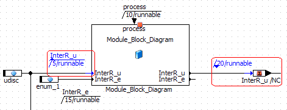

# Creating a Sequence of Protected Sequence Calls

A sequence of protected sequence calls or block-local sequence calls cannot be interrupted in a real-time environment. To create such a sequence, proceed as follows:

1. In the context menu of a sequence call select Atomic and then Start to start a sequence of protected sequence calls.
1. In the context menu of a sequence call select Atomic and then Stop to end a sequence of protected sequence calls.

Start and stop of a protected sequence are displayed in blue, and marked with a small upward or downward triangle (see the [example](javascript:kadovTextPopup(this))<!-- kadovTextPopupInit('a1'); //-->). All sequence calls or block-local sequence calls with numbers between start and stop numbers are part of the sequence.

See also

[Editing Sequence Calls](markdown/ASCeditSequenceCalls.md)

[Sequence Calls](markdown/ascsequencecalls.md)

[Block-Local Sequence Calls](markdown/asc_blocklocalsequencecalls.md)

/* Heikki Komulainen, Comet Computer GmbH 2004 */ cc_plus_pic = '&nbsp;'; cc_minus_pic = '&nbsp;'; cc_stat_pic = '&nbsp;'; gpstyle = ''; var iframes_created = 0; if (document.body && document.body.insertAdjacentHTML && document.getElementsByTagName && document.getElementById) { collect_popups(); set_poplinks_pictures(); if (iframes_created) { document.write(gpstyle); document.write('
<nobr><a id="einauslink" style="position:absolute;top:expression(document.body.scrollTop + this.offsetHeight - this.offsetHeight);left:expression(document.body.offsetWidth - (this.offsetWidth + 28));background:white;padding:5px" href="javascript:show_all_poptext()">Show all hidden text</a></nobr>
'); } } function collect_popups() { bsscpopups = new Array(); for (x = 0; x < document.links.length; x++) { if (document.links[x].href.indexOf("BSSCPopup")>-1) { seekmatch = /BSSCPopup.'[^'](markdown/+)'/; poplink = seekmatch.exec(document.links[x].href); poplink = "" + poplink; poplink = poplink.substring(poplink.indexOf("'")+1, poplink.lastIndexOf("'")); ifid = "CCGENIFRAMEID" + x; new_iframe = '<iframe id="' + ifid + '"src="' + poplink + '" onload="get_text(\'' + ifid + '\')" width="0" height="0" frameborder=0></iframe>'; document.links[x].parentNode.insertAdjacentHTML("afterEnd", new_iframe); gpid = "CCID_" + ifid; document.links[x].href = "javascript:expand_poptext('" + gpid + "')"; cc_plus = '' + cc_plus_pic + ''; document.links[x].insertAdjacentHTML("afterBegin", cc_plus); iframes_created = 1; } } }// end function function get_text(ifr_id) { frpars = document.frames[ifr_id].document.getElementsByTagName("body"); popbody = frpars[0].innerHTML; gpid = "CCID_" + ifr_id; if (!document.getElementById(gpid)) { //avoiding doubles document.getElementById(ifr_id).insertAdjacentHTML("afterEnd", '
'+popbody+'
'); } }//end function function expand_poptext(x_frame_id) { if (!document.getElementById(x_frame_id)) return; if (document.getElementById(x_frame_id).className == "CCGENPOPTEXTH") { document.getElementById(x_frame_id).className = "CCGENPOPTEXTV"; document.getElementById(x_frame_id).style.visibility = "visible"; if (document.getElementById("CCPMB_" + x_frame_id )) { document.getElementById("CCPMB_" + x_frame_id ).innerHTML = cc_minus_pic; } } else { document.getElementById(x_frame_id).className = "CCGENPOPTEXTH"; document.getElementById(x_frame_id).style.visibility = "hidden"; if (document.getElementById("CCPMB_" + x_frame_id )) { document.getElementById("CCPMB_" + x_frame_id ).innerHTML = cc_plus_pic; } } }// end function function show_all_poptext() { var pulldowntxt = document.getElementsByTagName("div"); for (b = 0; b < pulldowntxt.length; b++) { if (pulldowntxt[b].className == "droptext") { pulldowntxt[b].style.display=""; } } var gptxt = document.getElementsByTagName("div"); for (z = 0; z < gptxt.length; z++) { if (gptxt[z].className == "CCGENPOPTEXTH") { gptxt[z].className = "CCGENPOPTEXTV"; gptxt[z].style.visibility = "visible"; if (document.getElementById("CCPMB_" + gptxt[z].id )) { document.getElementById("CCPMB_" + gptxt[z].id ).innerHTML = cc_minus_pic; } } } var dxpoplinks = document.getElementsByTagName("a"); if (dxpoplinks) { for (pxl = 0; pxl < dxpoplinks.length; pxl++) { if (dxpoplinks[pxl].href.indexOf("kadovTextPopup")>-1) { if (document.getElementById("CCPMB_" + dxpoplinks[pxl].id)) { document.getElementById("CCPMB_" + dxpoplinks[pxl].id).innerHTML = cc_stat_pic; dxpoplinks[pxl].symbol = "minus"; } } } } document.getElementById('einauslink').innerText = 'Hide all hideable text'; document.getElementById('einauslink').href = "javascript:self.location.reload()"; self.focus(); }// end function function eat_click() { return false; }// end function function set_poplinks_pictures() { var dpoplinks = document.getElementsByTagName("a"); if (dpoplinks) { for (pl = 0; pl < dpoplinks.length; pl++) { if (dpoplinks[pl].href.indexOf("kadovTextPopup")>-1) { cc_plus = '' + cc_stat_pic + ''; //dpoplinks[pl].onmouseup = plusminuspoplink; dpoplinks[pl].insertAdjacentHTML("afterBegin", cc_plus); dpoplinks[pl].symbol = "plus"; } } } }// end function function plusminuspoplink() { if (document.getElementById("CCPMB_" + this.id)) { if (this.symbol == "plus") { document.getElementById("CCPMB_" + this.id).innerHTML = cc_minus_pic; this.symbol = "minus"; } else { document.getElementById("CCPMB_" + this.id).innerHTML = cc_plus_pic; this.symbol = "plus"; } } return true; }

---

## Moving Between Sequence Calls

_Source: `markdown/ASCMovesequence.md`_

# Moving Between Sequence Calls

To move between sequence calls, proceed as follows:

1. Select a sequence call in the drawing area.
1. In the View menu, select Sequence Calls and then Next to select the next call in the sequence.
1. In the View menu, select Sequence Calls and then Previous to select the previous call in the sequence.

---

## Changing the Visibility of Several Sequence Calls

_Source: `markdown/ascchangesequence.md`_

# Changing the Visibility of Several Sequence Calls

To change the visibility of several sequence calls, block-local sequence calls or connectors, proceed as follows.

##### Hiding all sequence calls in a diagram:

1. In the View menu, point to Sequence Calls and then to Hide and select For Diagram.

All sequence calls, block-local sequence calls and connectors in the current diagram are hidden.

##### Hiding all sequence calls of a method/process:

1. In the Outline tab, select the method/process whose sequence calls you want to hide.
1. In the View menu, point to Sequence Calls and then to Hide and select For Method/Process.

All sequence calls assigned to the selected method/process are hidden.

##### Hiding the sequence calls of selected elements:

1. In the drawing area, select the diagram elements whose sequence calls you want to hide.
1. In the View menu, point to Sequence Calls and then to Hide and select For Selection.

The sequence calls, block-local sequence calls or connectors of the selected elements are hidden.

##### Hiding unused sequence calls:

1. In the View menu, point to Sequence Calls and then to Hide and select Unused.

All unused sequence calls, block-local sequence calls and connectors are hidden.

In all four cases, blue color of highlighted ports (see [Changing the Visibility of Individual Sequence Calls](markdown/ASCChangevisibility.md)) and [protected sequences](markdown/ASCCreatesequence.md) remains visible.

The Show command reverts the effect of the Hide command with the same four options being available.

See also

[Changing the Visibility of Individual Sequence Calls](markdown/ASCChangevisibility.md)

[Creating a Sequence of Protected Sequence Calls](markdown/ASCCreatesequence.md)

[Editing Sequence Calls](markdown/ASCeditSequenceCalls.md)

[Statement Blocks](markdown/asc_statementblocks.md)

[Block-Local Sequence Calls](markdown/asc_blocklocalsequencecalls.md)

---

## Creating and Removing Connectors

_Source: `markdown/asccreateconnectors.md`_

# Creating and Removing Connectors

This instruction does not apply to connectors and block-local sequence calls in statement blocks.

To create a connector from a normal sequence call, proceed as follows:

1. Right-click the sequence call you want to change into a connector.
1. Select Connector from the context menu.
1. Connect the connector to a suitable control-flow element.
1. If necessary, edit the sequence number.

Connectors can be edited like sequence calls in the Sequence Editor (see [Editing the Sequence Call in the Sequence Editor](markdown/ASCEditSequence.md)). The Next free button and the Method/Process Name field are, however, deactivated. Double-clicking the connector and the context menu Next Number also open the Sequence Editor.

To remove a connector, proceed as follows.

1. Right-click the connector and select Connector from the context menu.
1. Edit the sequence call.

See also

[Editing the Sequence Call in the Sequence Editor](markdown/ASCEditSequence.md)

[Sequence Editor](BlockDiagramEditorEnglishUS.chm::/Editingindividual.htm)

---

## Toggling between Connector and Block-Local Sequence Call

_Source: `markdown/asc_convertconnectorsequencecall.md`_

# Toggling Between Connector and Block-Local Sequence Call

This instruction applies only to connectors and block-local sequence calls in statement blocks.

To convert a block-local sequence call into a connector, proceed as follows.

1. Right-click the block-local sequence call you want to convert.
1. Select Connector from the context menu.
1. Connect the connector to a suitable control-flow element.

To convert a connector into a block-local sequence call, proceed as follows.

1. Right-click the connector you want to convert.
1. Select Block-local sequence call from the context menu.

The connector is converted into a block-local sequence call. The number is kept, and the name of the statement block is inserted automatically.

See also

[Statement Blocks](markdown/asc_statementblocks.md)

[Block-Local Sequence Calls](markdown/asc_blocklocalsequencecalls.md)

---

## Using Graphical Hierarchies and Statement Blocks

_Source: `markdown/ASC_UseGraphicalHierarchies_StatementBlocks.md`_

# Using Graphical Hierarchies and Statement Blocks

Using graphical hierarchies contains the following steps:

- adding a [hierarchy](markdown/ascaddhierarchy.md) or a [statement block](markdown/ASC_addstatementblock.md)
- [adding input and output pins](markdown/ascaddinputhiera.md)
- converting diagram elements into a [hierarchy](markdown/ascconverthierarchy.md) or [statement block](markdown/ASC_ConvertDiagramElementsStatementBlock.md)
- [moving elements into/out of a hierarchy/statement block](markdown/ascmoveelements.md)
- [changing the appearance of a hierarchy/statement block](markdown/ascappearancehierarchy.md)
- [changing the appearance of input and output pins](markdown/ascchangeinputpins.md)
- [navigating between hierarchy/statement block levels](markdown/ascnavigatehierarchy.md)
- [resolving a hierarchy](markdown/ascresolvinghierarchy.md)

See also

[Graphical Hierarchies in SWC](markdown/ascgraphicalhierarchies.md)

[Statement Blocks](markdown/asc_statementblocks.md)

---

## Adding a Hierarchy

_Source: `markdown/ascaddhierarchy.md`_

# Adding a Hierarchy

To add a new hierarchy, proceed as follows:

1. In the Basic Blocks palette or toolbar, click on the  Hierarchy button to load the mouse cursor with a hierarchy.
1. Click inside the drawing area where you want to position the hierarchy.

The hierarchy block is added to the diagram.

See also

[Graphical Hierarchies in SWC](markdown/ascgraphicalhierarchies.md)

[Using Graphical Hierarchies and Statement Blocks](markdown/ASC_UseGraphicalHierarchies_StatementBlocks.md)

---

## Adding a Statement Block

_Source: `markdown/ASC_addstatementblock.md`_

# Adding a Statement Block

To add a new statement block, proceed as follows:

1. In the Basic Blocks palette or toolbar, click on the  Statement Block button.
1. Click inside the drawing area where you want to position the statement block.

The statement block is added to the diagram.

- See also

[Statement Blocks](markdown/asc_statementblocks.md)

[Using Graphical Hierarchies and Statement Blocks](markdown/ASC_UseGraphicalHierarchies_StatementBlocks.md)

---

## Adding Input and Output Pins to the Hierarchy

_Source: `markdown/ascaddinputhiera.md`_

# Adding Input and Output Pins to the Hierarchy/Statement Block

Data flow between the various hierarchy/statement block levels works via input and output pins. These are simply connection lines that extend across the levels.

To add input and output pins to the hierarchy/statement block, proceed as follows:

1. Right-click on the hierarchy/statement block.
1. Select Add Inpin or Add Outpin from the context menu.

You can add any number of input and output pins to the hierarchy/statement block. The input and output pins are represented by arrow symbols containing the pin name inside the block.

See also

[Graphical Hierarchies in SWC](markdown/ascgraphicalhierarchies.md)

[Statement Blocks](markdown/asc_statementblocks.md)

[Using Graphical Hierarchies and Statement Blocks](markdown/ASC_UseGraphicalHierarchies_StatementBlocks.md)

---

## Converting Diagram Elements into a Hierarchy Block

_Source: `markdown/ascconverthierarchy.md`_

# Converting Diagram Elements into a Hierarchy Block

To convert diagram elements into a hierarchy block, proceed as follows:

1. Select the diagram elements you want to put in a hierarchy block.
1. In the Basic Blocks palette or toolbar, click on the  Hierarchy button.

A hierarchy block that contains the selected elements is added to the diagram.

The selected diagram elements are placed inside a newly created hierarchy block. A pin with a default name is created for each line that connects a diagram element outside the hierarchy block with a diagram element inside. It is not possible to move diagram elements into a hierarchy block directly, e.g. by drag-and-drop. They always have to be [copied via the clipboard](markdown/ascmoveelements.md) or moved as described here.

- See also
- [Graphical Hierarchies in SWC](markdown/ascgraphicalhierarchies.md)
- [Using Graphical Hierarchies and Statement Blocks](markdown/ASC_UseGraphicalHierarchies_StatementBlocks.md)
- (item)

---

## Converting Diagram Elements into a Statement Block

_Source: `markdown/ASC_ConvertDiagramElementsStatementBlock.md`_

# Converting Diagram Elements into a Statement Block

To convert diagram elements into a statement block, proceed as follows:

1. Select the diagram elements you want to put in a statement block.
1. In the Basic Blocks palette or toolbar, click on the  Statement Block button.

A statement block that contains the selected elements is added to the diagram.

The selected diagram elements are placed inside a newly created statement block. Existing sequence calls are converted to [block-local sequence calls](markdown/asc_blocklocalsequencecalls.md). A pin with a default name is created for each line that connects a diagram element outside the statement block with a diagram element inside.

It is not possible to move diagram elements into a statement block directly, e.g. by drag-and-drop. They always have to be copied via the clipboard or moved as described here.

- See also

[Statement Blocks](markdown/asc_statementblocks.md)

[Block-Local Sequence Calls](markdown/asc_blocklocalsequencecalls.md)

[Using Graphical Hierarchies and Statement Blocks](markdown/ASC_UseGraphicalHierarchies_StatementBlocks.md)

---

## Moving Elements Into/Out of a Hierarchy or Statement Block

_Source: `markdown/ascmoveelements.md`_

# Moving Elements Into/Out of a Hierarchy or Statement Block

It is not possible to move diagram items into a hierarchy block directly, e.g. by drag-and-drop. They always have to be copied via the clipboard or moved as described here. To move elements into or out of a hierarchy frame, proceed as follows:

1. Use Cut or Copy to copy/move diagram elements to the clipboard.
1. Double-click on the hierarchy or statement block that is to contain the elements.
1. Use Paste to insert the diagram elements.
1. Edit the pasted sequence calls.
1. Double-click in the drawing area to return to the higher level.

Copying or moving existing elements from a hierarchy or statement block to a higher diagram level is done accordingly. The following happens to copied/moved sequence calls in that case:

- If you copied the elements from a hierarchy, the sequence calls are reset.
- If you copied the elements from a statement block, the block-local sequence calls are converted into connectors.

See also

[Graphical Hierarchies in SWC](markdown/ascgraphicalhierarchies.md)

[Statement Blocks](markdown/asc_statementblocks.md)

[Using Graphical Hierarchies and Statement Blocks](markdown/ASC_UseGraphicalHierarchies_StatementBlocks.md)

---

## Changing the Appearance of a Hierarchy or Statement Block

_Source: `markdown/ascappearancehierarchy.md`_

# Changing the Appearance of a Hierarchy or Statement Block

To change the appearance of a hierarchy or statement block, proceed as follows:

1. Right-click inside the hierarchy/statement block and select Rename Hierarchy or Rename Statement Block from the context menu to rename the hierarchy block.
1. Type the name into the prompt box and click OK.
1. Right-click inside the block and select Show/Hide Name from the context menu.
1. Select Change Icon from the context menu to assign an icon file to the hierarchy.
1. Select the image file you want and click OK.
1. Select Fill Color from the context menu to select a color for the hierarchy/statement block.
1. Select the hierarchy/statement block and drag the sizing handles to resize the block.
1. Select Set To Default Size from the context menu to revert to the default size of the hierarchy/statement block.

See also

[Reserved Keywords](IntroductionEnglishUS.chm::/INT_Reserved_Keywords.htm)

[Graphical Hierarchies in SWC](markdown/ascgraphicalhierarchies.md)

[Statement Blocks](markdown/asc_statementblocks.md)

[Using Graphical Hierarchies and Statement Blocks](markdown/ASC_UseGraphicalHierarchies_StatementBlocks.md)

---

## Changing the Appearance of Input and Output Pins

_Source: `markdown/ascchangeinputpins.md`_

# Changing the Appearance of Input and Output Pins

To change the appearance of input and output pins, proceed as follows:

1. Right-click on an input or output pin of the hierarchy/statement block element.
1. Do one of the following:
1. Right-click on the block and select Show Pin Names or Hide Pin Names to show or hide all the pin names for the hierarchy/statement block.

When you connect a diagram element to a pin, and then connect the pin to another item inside the hierarchy/statement block, it is equivalent to connecting the two elements directly.

See also

[Reserved Keywords](IntroductionEnglishUS.chm::/INT_Reserved_Keywords.htm)

[Graphical Hierarchies in SWC](markdown/ascgraphicalhierarchies.md)

[Statement Blocks](markdown/asc_statementblocks.md)

[Using Graphical Hierarchies and Statement Blocks](markdown/ASC_UseGraphicalHierarchies_StatementBlocks.md)

---

## Navigating Between Hierarchy/Statement Block Levels

_Source: `markdown/ascnavigatehierarchy.md`_

# Navigating Between Hierarchy/Statement Block Levels

The technique for navigating between hierarchy or statement block levels is the same as that for navigating between included components of a diagram.

To navigate between hierarchy/statement block levels, proceed as follows:

1. Do one of the following to enter a lower-level block:

You are inside the hierarchy/statement block, the content of the current block is shown in the drawing area.

1. Inside the hierarchy/statement block, double-click on the drawing area (not on a diagram item).

You leave the hierarchy/statement block and enter the parent level. The block you have left is selected.

See also

[Graphical Hierarchies in SWC](markdown/ascgraphicalhierarchies.md)

[Statement Blocks](markdown/asc_statementblocks.md)

[Using Graphical Hierarchies and Statement Blocks](markdown/ASC_UseGraphicalHierarchies_StatementBlocks.md)

---

## Resolving a Hierarchy or Statement Block

_Source: `markdown/ascresolvinghierarchy.md`_

# Resolving a Hierarchy or Statement Block

To resolve a hierarchy/statement block and keep its content, proceed as follows:

1. Right-click on the hierarchy block and select Resolve Hierarchy or Resolve Statement Block from the context menu.
1. If necessary, do the following for former block-local sequence calls:
1. If necessary, clean up the block diagram.

To remove a hierarchy/statement block and delete its content, proceed as follows:

1. Select a hierarchy/statement block.
1. In the Edit menu, select Delete.

The block, and all diagram elements it contains, are deleted.

See also

[Graphical Hierarchies in SWC](markdown/ascgraphicalhierarchies.md)

[Statement Blocks](markdown/asc_statementblocks.md)

[Using Graphical Hierarchies and Statement Blocks](markdown/ASC_UseGraphicalHierarchies_StatementBlocks.md)

[Sequence Calls](markdown/ascsequencecalls.md)

---

## Viewing all Graphical Occurrences of an Element

_Source: `markdown/ascviewoccurrence.md`_

# Viewing all Graphical Occurrences of an Element

To view all graphical occurrences of an element, proceed as follows:

1. Select the element, either in the drawing area or in the Outline pane.
1. Do one of the following:

- In the Extras menu, select Show Occurrences
- In the context menu, select Show Occurrences.

All graphical occurrences of the element in the current program are highlighted and the Occurrences for window opens in which all graphical occurrences of the selected element are listed.

See also

[Viewing All Elements Connected to an Item](markdown/ascviewconnectedelements.md)

---

## Viewing All Elements Connected to an Item

_Source: `markdown/ascviewconnectedelements.md`_

- [Editing Elements](componentmanagerenglishus.chm::/EditDatabaseB.htm)
- [Renaming Elements](ComponentManagerEnglishUS.chm::/Renaming_Elements_Views.htm)
- [Deleting Elements](ComponentManagerEnglishUS.chm::/Deleting_Elements_Views.htm)
- [Editing Data](ComponentManagerEnglishUS.chm::/Editdata.htm)
- [Copying Data](ComponentManagerEnglishUS.chm::/CM_Copying_Data.htm)
- [Editing Implementations](ComponentManagerEnglishUS.chm::/EditImplementation.htm)
- [Copying Implementations](ComponentManagerEnglishUS.chm::/Copying_Implementations.htm)

# Viewing All Elements Connected to an Item

You do not have to change to the browser view if you want to look at or edit the implementations of the elements connected directly to a graphic object (element, operator, connection). This function is of particular interest for testing the implementations of the inputs and outputs of an operator which is why this is the only case described below.

To view all elements connected to an item, proceed as follows:

1. Right-click on a graphic object and select Browse Connected Elements from the context menu.
1. Work in the tabs as described in the [following topics](javascript:kadovTextPopup(this))<!-- kadovTextPopupInit('a1'); //-->.
1. Click the X at the top right of the field to hide the field.
1. In the View menu, point to Show/ Hide and select Search Results.
1. You can redisplay the field via the View menu, Show/ Hide submenu, Search Results option, as well as with the context menu, although the content is not adapted to the current selection in the drawing area in the first case.

See also

[Search Results View](markdown/ASCSearchResultsView.md)

[Views in the Component Manager](ComponentManagerEnglishUS.chm::/ViewsinCM.htm)

/* Heikki Komulainen, Comet Computer GmbH 2004 */ cc_plus_pic = '&nbsp;'; cc_minus_pic = '&nbsp;'; cc_stat_pic = '&nbsp;'; gpstyle = ''; var iframes_created = 0; if (document.body && document.body.insertAdjacentHTML && document.getElementsByTagName && document.getElementById) { collect_popups(); set_poplinks_pictures(); if (iframes_created) { document.write(gpstyle); document.write('
<nobr><a id="einauslink" style="position:absolute;top:expression(document.body.scrollTop + this.offsetHeight - this.offsetHeight);left:expression(document.body.offsetWidth - (this.offsetWidth + 28));background:white;padding:5px" href="javascript:show_all_poptext()">Alle texte einblenden</a></nobr>
'); } } function collect_popups() { bsscpopups = new Array(); for (x = 0; x < document.links.length; x++) { if (document.links[x].href.indexOf("BSSCPopup")>-1) { seekmatch = /BSSCPopup.'[^'](markdown/+)'/; poplink = seekmatch.exec(document.links[x].href); poplink = "" + poplink; poplink = poplink.substring(poplink.indexOf("'")+1, poplink.lastIndexOf("'")); ifid = "CCGENIFRAMEID" + x; new_iframe = '<iframe id="' + ifid + '"src="' + poplink + '" onload="get_text(\'' + ifid + '\')" width="0" height="0" frameborder=0></iframe>'; document.links[x].parentNode.insertAdjacentHTML("afterEnd", new_iframe); gpid = "CCID_" + ifid; document.links[x].href = "javascript:expand_poptext('" + gpid + "')"; cc_plus = '' + cc_plus_pic + ''; document.links[x].insertAdjacentHTML("afterBegin", cc_plus); iframes_created = 1; } } }// end function function get_text(ifr_id) { frpars = document.frames[ifr_id].document.getElementsByTagName("body"); popbody = frpars[0].innerHTML; gpid = "CCID_" + ifr_id; if (!document.getElementById(gpid)) { //avoiding doubles document.getElementById(ifr_id).insertAdjacentHTML("afterEnd", '
'+popbody+'
'); } }//end function function expand_poptext(x_frame_id) { if (!document.getElementById(x_frame_id)) return; if (document.getElementById(x_frame_id).className == "CCGENPOPTEXTH") { document.getElementById(x_frame_id).className = "CCGENPOPTEXTV"; document.getElementById(x_frame_id).style.visibility = "visible"; if (document.getElementById("CCPMB_" + x_frame_id )) { document.getElementById("CCPMB_" + x_frame_id ).innerHTML = cc_minus_pic; } } else { document.getElementById(x_frame_id).className = "CCGENPOPTEXTH"; document.getElementById(x_frame_id).style.visibility = "hidden"; if (document.getElementById("CCPMB_" + x_frame_id )) { document.getElementById("CCPMB_" + x_frame_id ).innerHTML = cc_plus_pic; } } }// end function function show_all_poptext() { var pulldowntxt = document.getElementsByTagName("div"); for (b = 0; b < pulldowntxt.length; b++) { if (pulldowntxt[b].className == "droptext") { pulldowntxt[b].style.display=""; } } var gptxt = document.getElementsByTagName("div"); for (z = 0; z < gptxt.length; z++) { if (gptxt[z].className == "CCGENPOPTEXTH") { gptxt[z].className = "CCGENPOPTEXTV"; gptxt[z].style.visibility = "visible"; if (document.getElementById("CCPMB_" + gptxt[z].id )) { document.getElementById("CCPMB_" + gptxt[z].id ).innerHTML = cc_minus_pic; } } } var dxpoplinks = document.getElementsByTagName("a"); if (dxpoplinks) { for (pxl = 0; pxl < dxpoplinks.length; pxl++) { if (dxpoplinks[pxl].href.indexOf("kadovTextPopup")>-1) { if (document.getElementById("CCPMB_" + dxpoplinks[pxl].id)) { document.getElementById("CCPMB_" + dxpoplinks[pxl].id).innerHTML = cc_stat_pic; dxpoplinks[pxl].symbol = "minus"; } } } } document.getElementById('einauslink').innerText = 'Alle texte ausblenden'; document.getElementById('einauslink').href = "javascript:self.location.reload()"; self.focus(); }// end function function eat_click() { return false; }// end function function set_poplinks_pictures() { var dpoplinks = document.getElementsByTagName("a"); if (dpoplinks) { for (pl = 0; pl < dpoplinks.length; pl++) { if (dpoplinks[pl].href.indexOf("kadovTextPopup")>-1) { cc_plus = '' + cc_stat_pic + ''; //dpoplinks[pl].onmouseup = plusminuspoplink; dpoplinks[pl].insertAdjacentHTML("afterBegin", cc_plus); dpoplinks[pl].symbol = "plus"; } } } }// end function function plusminuspoplink() { if (document.getElementById("CCPMB_" + this.id)) { if (this.symbol == "plus") { document.getElementById("CCPMB_" + this.id).innerHTML = cc_minus_pic; this.symbol = "minus"; } else { document.getElementById("CCPMB_" + this.id).innerHTML = cc_plus_pic; this.symbol = "plus"; } } return true; }

---

## Changing the Software Component Display

_Source: `markdown/ascchangeASWCDisplay.md`_

# Changing the Software Component Display

To change the way a software component is displayed, proceed as follows:

1. In the Window menu, select Redraw to redraw the diagram.
1. In the Zoom combo box, select a value to scale the diagram.
1. In the Zoom combo box, select Page Layout to view one Print page.
1. In the Zoom combo box, select 100% to return to the default size.

See also

[Printing a Software Component](markdown/ascprintblock.md)

---

## Changing the Appearance of an SWC Item

_Source: `markdown/ascchangeappearance.md`_

1. Drag the name of the element's graphical occurrence to the place where you want it to appear.
1. In the context menu of an element, use the Fill Color menu option to select a color to fill the background of the respective item.
1. In the context menu of an array, matrix or characteristic line/map, use the Get/Set Ports menu option to show or hide the get and set pins of the occurrence.

1. Drag the name of the component's graphical occurrence to the place where you want it to appear.
1. In the context menu of an included component, point to Ports and select Unconnected Ports to show or hide unconnected ports of the graphical occurrence.

This way, ports are only hidden, not removed. Operations like Minimal Size behave as if the ports were visible.

1. In the context menu of an included component, point to Ports and select Get/Set to show or hide the get and set pins of the graphical occurrence.
1. Right-click on a port and select Pin Names <pin name> from the context menu to show/hide the display of the port name.
1. Right-click on a port with a sequence call and select Sequence Call from the context menu to show/hide the display of the sequence call.

If flexible layout is activated (see [Layout of Included Components](markdown/asclayoutincludedcomponents.md)), the following possibilities are also available.

1. Use the mouse to drag the port you want to move to the required position.
1. In the context menu of an included component, point to Layout and then select Attributes to open the Layout Settings window.
1. In the Layout Settings window, do the following:
1. In the context menu of the included component, point to Layout and click on Set Attributes as Default to make your individual layout of the included its default layout.

The default layout is adapted by every graphical occurrence of the respective item.

# Changing the Appearance of an SWC Item

To change the appearance of a certain graphical occurrence of a diagram item, proceed as follows:

[Elements](javascript:kadovTextPopup(this))<!-- kadovTextPopupInit('a2'); //--> (i.e. variables, parameters, characteristic line/map)

[Included components](javascript:kadovTextPopup(this))<!-- kadovTextPopupInit('a1'); //-->

See also

[Layout of Included Components](markdown/asclayoutincludedcomponents.md)

[Editing the Views of an SWC Item](AutomaticDocumentationEnglishUS.chm::/AD_EditView_of_DiagramItem.htm)

[Component Manager - Activating/Deactivating Flexible Layout](ComponentManagerEnglishUS.chm::/Activating_Flexible_Layout.htm)

/* Heikki Komulainen, Comet Computer GmbH 2004 */ cc_plus_pic = '&nbsp;'; cc_minus_pic = '&nbsp;'; cc_stat_pic = '&nbsp;'; gpstyle = ''; var iframes_created = 0; if (document.body && document.body.insertAdjacentHTML && document.getElementsByTagName && document.getElementById) { collect_popups(); set_poplinks_pictures(); if (iframes_created) { document.write(gpstyle); document.write('
<nobr><a id="einauslink" style="position:absolute;top:expression(document.body.scrollTop + this.offsetHeight - this.offsetHeight);left:expression(document.body.offsetWidth - (this.offsetWidth + 28));background:white;padding:5px" href="javascript:show_all_poptext()">Alle texte einblenden</a></nobr>
'); } } function collect_popups() { bsscpopups = new Array(); for (x = 0; x < document.links.length; x++) { if (document.links[x].href.indexOf("BSSCPopup")>-1) { seekmatch = /BSSCPopup.'[^'](markdown/+)'/; poplink = seekmatch.exec(document.links[x].href); poplink = "" + poplink; poplink = poplink.substring(poplink.indexOf("'")+1, poplink.lastIndexOf("'")); ifid = "CCGENIFRAMEID" + x; new_iframe = '<iframe id="' + ifid + '"src="' + poplink + '" onload="get_text(\'' + ifid + '\')" width="0" height="0" frameborder=0></iframe>'; document.links[x].parentNode.insertAdjacentHTML("afterEnd", new_iframe); gpid = "CCID_" + ifid; document.links[x].href = "javascript:expand_poptext('" + gpid + "')"; cc_plus = '' + cc_plus_pic + ''; document.links[x].insertAdjacentHTML("afterBegin", cc_plus); iframes_created = 1; } } }// end function function get_text(ifr_id) { frpars = document.frames[ifr_id].document.getElementsByTagName("body"); popbody = frpars[0].innerHTML; gpid = "CCID_" + ifr_id; if (!document.getElementById(gpid)) { //avoiding doubles document.getElementById(ifr_id).insertAdjacentHTML("afterEnd", '
'+popbody+'
'); } }//end function function expand_poptext(x_frame_id) { if (!document.getElementById(x_frame_id)) return; if (document.getElementById(x_frame_id).className == "CCGENPOPTEXTH") { document.getElementById(x_frame_id).className = "CCGENPOPTEXTV"; document.getElementById(x_frame_id).style.visibility = "visible"; if (document.getElementById("CCPMB_" + x_frame_id )) { document.getElementById("CCPMB_" + x_frame_id ).innerHTML = cc_minus_pic; } } else { document.getElementById(x_frame_id).className = "CCGENPOPTEXTH"; document.getElementById(x_frame_id).style.visibility = "hidden"; if (document.getElementById("CCPMB_" + x_frame_id )) { document.getElementById("CCPMB_" + x_frame_id ).innerHTML = cc_plus_pic; } } }// end function function show_all_poptext() { var pulldowntxt = document.getElementsByTagName("div"); for (b = 0; b < pulldowntxt.length; b++) { if (pulldowntxt[b].className == "droptext") { pulldowntxt[b].style.display=""; } } var gptxt = document.getElementsByTagName("div"); for (z = 0; z < gptxt.length; z++) { if (gptxt[z].className == "CCGENPOPTEXTH") { gptxt[z].className = "CCGENPOPTEXTV"; gptxt[z].style.visibility = "visible"; if (document.getElementById("CCPMB_" + gptxt[z].id )) { document.getElementById("CCPMB_" + gptxt[z].id ).innerHTML = cc_minus_pic; } } } var dxpoplinks = document.getElementsByTagName("a"); if (dxpoplinks) { for (pxl = 0; pxl < dxpoplinks.length; pxl++) { if (dxpoplinks[pxl].href.indexOf("kadovTextPopup")>-1) { if (document.getElementById("CCPMB_" + dxpoplinks[pxl].id)) { document.getElementById("CCPMB_" + dxpoplinks[pxl].id).innerHTML = cc_stat_pic; dxpoplinks[pxl].symbol = "minus"; } } } } document.getElementById('einauslink').innerText = 'Alle texte ausblenden'; document.getElementById('einauslink').href = "javascript:self.location.reload()"; self.focus(); }// end function function eat_click() { return false; }// end function function set_poplinks_pictures() { var dpoplinks = document.getElementsByTagName("a"); if (dpoplinks) { for (pl = 0; pl < dpoplinks.length; pl++) { if (dpoplinks[pl].href.indexOf("kadovTextPopup")>-1) { cc_plus = '' + cc_stat_pic + ''; //dpoplinks[pl].onmouseup = plusminuspoplink; dpoplinks[pl].insertAdjacentHTML("afterBegin", cc_plus); dpoplinks[pl].symbol = "plus"; } } } }// end function function plusminuspoplink() { if (document.getElementById("CCPMB_" + this.id)) { if (this.symbol == "plus") { document.getElementById("CCPMB_" + this.id).innerHTML = cc_minus_pic; this.symbol = "minus"; } else { document.getElementById("CCPMB_" + this.id).innerHTML = cc_plus_pic; this.symbol = "plus"; } } return true; }

---

## Exporting the Data Set of an SWC

_Source: `markdown/ascexportdata.md`_

# Exporting the Data Set of a Software Component

To export the data set of an software component, proceed as follows:

1. In the File menu, point to Export, then point to Data and select For Component.

The file selection dialog box opens.

1. Select a file name and a path name.
1. Click on OK.

The data set is written to the file selected.

---

## Printing a Software Component

_Source: `markdown/ascprintblock.md`_

# Printing a Software Component

To print a software component, proceed as follows:

1. In the File menu, select Print to print the drawing area.

The [Print Diagrams](BlockDiagramEditorEnglishUS.chm::/BDE_Print_Diagrams_Window.htm) Window opens.

1. In the Print Diagram window, set the print options.
1. Click OK.

The Printer Selection window opens.

1. In the Printers field, select a printer.

Use Setup to change the printer settings.

1. Click OK to accept the selection.

The software component is printed according to your settings.

See also

[Setting up the Printing Area](BlockDiagramEditorEnglishUS.chm::/BDE_Setting_up_the_Printing_Area.htm)

[Print Diagrams Window](BlockDiagramEditorEnglishUS.chm::/BDE_Print_Diagrams_Window.htm)

---

## Working on Included Components

_Source: `markdown/ASCworking_on_Included_Components.md`_

# Working on Included Components

Working on included components contains the following steps (in no particular order):

- [Editing Included Components](markdown/asceditincludedcomponent.md)
- [Editing the Size of an Occurrence](BlockDiagramEditorEnglishUS.chm::/Editsize.htm)
- [Editing Ports](BlockDiagramEditorEnglishUS.chm::/Editports.htm)
- [Show/Hide Ports of an Included Component](BlockDiagramEditorEnglishUS.chm::/Public_Methods.htm)
- [Using Changes as a New Default Layout](BlockDiagramEditorEnglishUS.chm::/BDE_Defaultlayout.htm)
- [Restoring the Default Layout](BlockDiagramEditorEnglishUS.chm::/Restoredefault.htm)
- [Editing the Notes for a Component](markdown/asceditnotes.md)
- [Replacing an Included Component](BlockDiagramEditorEnglishUS.chm::/bde_replaceincludedcomponent.htm)

---

## Editing Included Components

_Source: `markdown/asceditincludedcomponent.md`_

# Editing Included Components

To edit included components, proceed as follows:

1. In the drawing area or Outline pane, select the component you want to edit.
1. Do one of the following:
1. Edit the included component according to your needs.
1. To return to the parent SWC, do one of the following in the editor of the included component:
1. Click Yes (No) to return to the parent component and save (discard) your changes.

The editor window for the included component remains open.

---

## Editing the Notes for a Component

_Source: `markdown/asceditnotes.md`_

# Editing the Notes for a Component

You can also attach notes to the entire software component, or to an included component. The notes for a database item are entered in a separate editor window. When documentation is generated automatically, the notes are included.

To edit the notes for a component, proceed as follows:

1. If you want to change the notes of the edited software component, open the Edit menu, point to Component and select Notes.
1. In the Outline tab, highlight the included component whose notes you want to edit.
1. From the context menu of the highlighted component, select Notes.
1. [Edit the notes](AutomaticDocumentationEnglishUS.chm::/AD_Working_on_Notes.htm) according to your needs.

See also

[Notes](AutomaticDocumentationEnglishUS.chm::/AD_notes.htm)

[Working on Notes](AutomaticDocumentationEnglishUS.chm::/AD_Working_on_Notes.htm)

---

## Adjusting the Project Settings for the SWC

_Source: `markdown/ASCadjustProjectSettingsSWC.md`_

# Adjusting the Project Settings for the SWC

This task can only be performed when ASCET-SE is installed.

To adjust the code generation settings for a project, proceed as follows:

1. Open the project or default project of the software component.
1. Click on the  Project Properties button.
1. In the Target combo box, select the ANSI-C target.
1. In the Compiler combo box, select a suitable compiler for the target.
1. In the Operating System combo box, select RTE-AUTOSAR *.
1. [Configure the AUTOSAR XML output for the selected AUTOSAR version.](markdown/ascconfigureautosarxmloutput.md)
1. It is recommended that you open the Code Generation node and select the casting strategy MISRA compliant.
1. Click OK to confirm the settings and close the Project Properties dialog window.

See also

[Configuring the AUTOSAR XML Output](markdown/ascconfigureautosarxmloutput.md)

[Project Properties - Build Node](ProjectEditorEnglishUS.chm::/Build_Options.htm)

[Project Properties - Code Generation Node](projecteditorenglishus.chm::/PE_Code_Generation_Options.htm)

[Generating AUTOSAR Code](markdown/ASCgenerateAUTOSARCode.md)

---

## Configuring the AUTOSAR XML Output

_Source: `markdown/ascconfigureautosarxmloutput.md`_

| Column 1 | Column 2 |
| --- | --- |
| Package Templates | Each package template allows the specification of an AR XML package name following the scheme: /<Root-Package>/<Sub-Package>/.../<Short-Name> where specific template parameters (see the description in the Target Settings window) can be used. |
| Short Name Templates | Each short name template allows the specification of an ARXML short name. Specific template parameters (see the description in the Target Settings window) can be used. |
| Filename Templates | Each filename template allows the specification of a filename where the associated package will be generated into. Specific template parameters (see the description in the Target Settings window) can be used. |
| Miscellaneous | Each miscellaneous option represents an additional option - which might be a template - somehow relevant for the AR XML generation. |

# Configuring the AUTOSAR XML Output

This task can only be performed when you are using AUTOSAR.

To configure the AUTOSAR XML (ARXML) output for a particular AUTOSAR version, proceed as follows:

1. Open the project or default project of the software component.
1. Click the  Project Properties button to open the Project Properties dialog window.
1. If necessary, [adjust the project settings](markdown/ASCadjustProjectSettingsSWC.md).
1. Go to the OS Configuration node.
1. In the AUTOSAR XML Configuration File field, enter or select the configuration file.
1. Click on the  button to open the ARXML Configuration Settings dialog window.
1. In the ARXML Configuration Settings dialog window, enter naming templates for the AUTOSAR XML generation.
1. Click OK to confirm the settings and close the ARXML Configuration Settings dialog window.
1. Close the Project Properties dialog window.

The changes in the ARXML Configuration Settings dialog window are kept even if you leave Project Properties with Cancel.

See also

[Adjusting the Project Settings for the SWC](markdown/ASCadjustProjectSettingsSWC.md)

[Project Properties - OS Configuration Node](projecteditorenglishus.chm::/PE_OS_Configuration_Option.htm)

[Generating AUTOSAR Code](markdown/ASCgenerateAUTOSARCode.md)

/* Heikki Komulainen, Comet Computer GmbH 2004 */ cc_plus_pic = '&nbsp;'; cc_minus_pic = '&nbsp;'; cc_stat_pic = '&nbsp;'; gpstyle = ''; var iframes_created = 0; if (document.body && document.body.insertAdjacentHTML && document.getElementsByTagName && document.getElementById) { collect_popups(); set_poplinks_pictures(); if (iframes_created) { document.write(gpstyle); document.write('
<nobr><a id="einauslink" style="position:absolute;top:expression(document.body.scrollTop + this.offsetHeight - this.offsetHeight);left:expression(document.body.offsetWidth - (this.offsetWidth + 28));background:white;padding:5px" href="javascript:show_all_poptext()">Show all hidden text</a></nobr>
'); } } function collect_popups() { bsscpopups = new Array(); for (x = 0; x < document.links.length; x++) { if (document.links[x].href.indexOf("BSSCPopup")>-1) { seekmatch = /BSSCPopup.'[^'](markdown/+)'/; poplink = seekmatch.exec(document.links[x].href); poplink = "" + poplink; poplink = poplink.substring(poplink.indexOf("'")+1, poplink.lastIndexOf("'")); ifid = "CCGENIFRAMEID" + x; new_iframe = '<iframe id="' + ifid + '"src="' + poplink + '" onload="get_text(\'' + ifid + '\')" width="0" height="0" frameborder=0></iframe>'; document.links[x].parentNode.insertAdjacentHTML("afterEnd", new_iframe); gpid = "CCID_" + ifid; document.links[x].href = "javascript:expand_poptext('" + gpid + "')"; cc_plus = '' + cc_plus_pic + ''; document.links[x].insertAdjacentHTML("afterBegin", cc_plus); iframes_created = 1; } } }// end function function get_text(ifr_id) { frpars = document.frames[ifr_id].document.getElementsByTagName("body"); popbody = frpars[0].innerHTML; gpid = "CCID_" + ifr_id; if (!document.getElementById(gpid)) { //avoiding doubles document.getElementById(ifr_id).insertAdjacentHTML("afterEnd", '
'+popbody+'
'); } }//end function function expand_poptext(x_frame_id) { if (!document.getElementById(x_frame_id)) return; if (document.getElementById(x_frame_id).className == "CCGENPOPTEXTH") { document.getElementById(x_frame_id).className = "CCGENPOPTEXTV"; document.getElementById(x_frame_id).style.visibility = "visible"; if (document.getElementById("CCPMB_" + x_frame_id )) { document.getElementById("CCPMB_" + x_frame_id ).innerHTML = cc_minus_pic; } } else { document.getElementById(x_frame_id).className = "CCGENPOPTEXTH"; document.getElementById(x_frame_id).style.visibility = "hidden"; if (document.getElementById("CCPMB_" + x_frame_id )) { document.getElementById("CCPMB_" + x_frame_id ).innerHTML = cc_plus_pic; } } }// end function function show_all_poptext() { var pulldowntxt = document.getElementsByTagName("div"); for (b = 0; b < pulldowntxt.length; b++) { if (pulldowntxt[b].className == "droptext") { pulldowntxt[b].style.display=""; } } var gptxt = document.getElementsByTagName("div"); for (z = 0; z < gptxt.length; z++) { if (gptxt[z].className == "CCGENPOPTEXTH") { gptxt[z].className = "CCGENPOPTEXTV"; gptxt[z].style.visibility = "visible"; if (document.getElementById("CCPMB_" + gptxt[z].id )) { document.getElementById("CCPMB_" + gptxt[z].id ).innerHTML = cc_minus_pic; } } } var dxpoplinks = document.getElementsByTagName("a"); if (dxpoplinks) { for (pxl = 0; pxl < dxpoplinks.length; pxl++) { if (dxpoplinks[pxl].href.indexOf("kadovTextPopup")>-1) { if (document.getElementById("CCPMB_" + dxpoplinks[pxl].id)) { document.getElementById("CCPMB_" + dxpoplinks[pxl].id).innerHTML = cc_stat_pic; dxpoplinks[pxl].symbol = "minus"; } } } } document.getElementById('einauslink').innerText = 'Hide all hideable text'; document.getElementById('einauslink').href = "javascript:self.location.reload()"; self.focus(); }// end function function eat_click() { return false; }// end function function set_poplinks_pictures() { var dpoplinks = document.getElementsByTagName("a"); if (dpoplinks) { for (pl = 0; pl < dpoplinks.length; pl++) { if (dpoplinks[pl].href.indexOf("kadovTextPopup")>-1) { cc_plus = '' + cc_stat_pic + ''; //dpoplinks[pl].onmouseup = plusminuspoplink; dpoplinks[pl].insertAdjacentHTML("afterBegin", cc_plus); dpoplinks[pl].symbol = "plus"; } } } }// end function function plusminuspoplink() { if (document.getElementById("CCPMB_" + this.id)) { if (this.symbol == "plus") { document.getElementById("CCPMB_" + this.id).innerHTML = cc_minus_pic; this.symbol = "minus"; } else { document.getElementById("CCPMB_" + this.id).innerHTML = cc_plus_pic; this.symbol = "plus"; } } return true; }

---

## Generating AUTOSAR Code

_Source: `markdown/ASCgenerateAUTOSARCode.md`_

# Generating AUTOSAR Code

To generate code for a project containing software components, proceed as follows:

1. Open the project containing the software components.
1. [Adjust the project settings.](markdown/ASCadjustProjectSettingsSWC.md)
1. [Configure the AUTOSAR XML output.](markdown/ascconfigureautosarxmloutput.md)
1. Perform one of the following actions.
1. If you are working with a database larger than 3 GB, [another step is inserted](javascript:BSSCPopup('codegen_dbtoolarge.htm');)<!-- kadovFilePopupInit('a1'); //-->.
1. In the File menu, open the Export submenu, point to Generated Code and select Recursive.
1. Click OK to confirm the selection and close the Path to export Items window.

The XML files required for AUTOSAR are created.

When you want to create code for a single software component, you can set up the default project of the software component, and afterwards perform the above steps in the software component editor.

See also

[Adjusting the Project Settings for the SWC](markdown/ASCadjustProjectSettingsSWC.md)

[Configuring the AUTOSAR XML Output](markdown/ascconfigureautosarxmloutput.md)

[Component Manager - Paths Options (Build)](ComponentManagerEnglishUS.chm::/CM_PathsNode_Build.htm)

[Project Editor - Banners in the Generated Code](ProjectEditorEnglishUS.chm::/PE_Banners_in_GeneratedCode.htm)

/* Heikki Komulainen, Comet Computer GmbH 2004 */ cc_plus_pic = '&nbsp;'; cc_minus_pic = '&nbsp;'; cc_stat_pic = '&nbsp;'; gpstyle = ''; var iframes_created = 0; if (document.body && document.body.insertAdjacentHTML && document.getElementsByTagName && document.getElementById) { collect_popups(); set_poplinks_pictures(); if (iframes_created) { document.write(gpstyle); document.write('
<nobr><a id="einauslink" style="position:absolute;top:expression(document.body.scrollTop + this.offsetHeight - this.offsetHeight);left:expression(document.body.offsetWidth - (this.offsetWidth + 28));background:#ffffe0;padding:5px" href="javascript:show_all_poptext()">Show all hidden text</a></nobr>
'); } } function collect_popups() { bsscpopups = new Array(); for (x = 0; x < document.links.length; x++) { if (document.links[x].href.indexOf("BSSCPopup")>-1) { seekmatch = /BSSCPopup.'[^'](markdown/+)'/; poplink = seekmatch.exec(document.links[x].href); poplink = "" + poplink; poplink = poplink.substring(poplink.indexOf("'")+1, poplink.lastIndexOf("'")); ifid = "CCGENIFRAMEID" + x; new_iframe = '<iframe id="' + ifid + '"src="' + poplink + '" onload="get_text(\'' + ifid + '\')" width="0" height="0" frameborder=0></iframe>'; document.links[x].parentNode.insertAdjacentHTML("afterEnd", new_iframe); gpid = "CCID_" + ifid; document.links[x].href = "javascript:expand_poptext('" + gpid + "')"; cc_plus = '' + cc_plus_pic + ''; document.links[x].insertAdjacentHTML("afterBegin", cc_plus); iframes_created = 1; } } }// end function function get_text(ifr_id) { frpars = document.frames[ifr_id].document.getElementsByTagName("body"); popbody = frpars[0].innerHTML; gpid = "CCID_" + ifr_id; if (!document.getElementById(gpid)) { //avoiding doubles document.getElementById(ifr_id).insertAdjacentHTML("afterEnd", '
'+popbody+'
'); } }//end function function expand_poptext(x_frame_id) { if (!document.getElementById(x_frame_id)) return; if (document.getElementById(x_frame_id).className == "CCGENPOPTEXTH") { document.getElementById(x_frame_id).className = "CCGENPOPTEXTV"; document.getElementById(x_frame_id).style.visibility = "visible"; if (document.getElementById("CCPMB_" + x_frame_id )) { document.getElementById("CCPMB_" + x_frame_id ).innerHTML = cc_minus_pic; } } else { document.getElementById(x_frame_id).className = "CCGENPOPTEXTH"; document.getElementById(x_frame_id).style.visibility = "hidden"; if (document.getElementById("CCPMB_" + x_frame_id )) { document.getElementById("CCPMB_" + x_frame_id ).innerHTML = cc_plus_pic; } } }// end function function show_all_poptext() { var pulldowntxt = document.getElementsByTagName("div"); for (b = 0; b < pulldowntxt.length; b++) { if (pulldowntxt[b].className == "droptext") { pulldowntxt[b].style.display=""; } } var gptxt = document.getElementsByTagName("div"); for (z = 0; z < gptxt.length; z++) { if (gptxt[z].className == "CCGENPOPTEXTH") { gptxt[z].className = "CCGENPOPTEXTV"; gptxt[z].style.visibility = "visible"; if (document.getElementById("CCPMB_" + gptxt[z].id )) { document.getElementById("CCPMB_" + gptxt[z].id ).innerHTML = cc_minus_pic; } } } var dxpoplinks = document.getElementsByTagName("a"); if (dxpoplinks) { for (pxl = 0; pxl < dxpoplinks.length; pxl++) { if (dxpoplinks[pxl].href.indexOf("kadovTextPopup")>-1) { if (document.getElementById("CCPMB_" + dxpoplinks[pxl].id)) { document.getElementById("CCPMB_" + dxpoplinks[pxl].id).innerHTML = cc_stat_pic; dxpoplinks[pxl].symbol = "minus"; } } } } document.getElementById('einauslink').innerText = 'Hide all hideable text'; document.getElementById('einauslink').href = "javascript:self.location.reload()"; self.focus(); }// end function function eat_click() { return false; }// end function function set_poplinks_pictures() { var dpoplinks = document.getElementsByTagName("a"); if (dpoplinks) { for (pl = 0; pl < dpoplinks.length; pl++) { if (dpoplinks[pl].href.indexOf("kadovTextPopup")>-1) { cc_plus = '' + cc_stat_pic + ''; //dpoplinks[pl].onmouseup = plusminuspoplink; dpoplinks[pl].insertAdjacentHTML("afterBegin", cc_plus); dpoplinks[pl].symbol = "plus"; } } } }// end function function plusminuspoplink() { if (document.getElementById("CCPMB_" + this.id)) { if (this.symbol == "plus") { document.getElementById("CCPMB_" + this.id).innerHTML = cc_minus_pic; this.symbol = "minus"; } else { document.getElementById("CCPMB_" + this.id).innerHTML = cc_plus_pic; this.symbol = "plus"; } } return true; }

---

## Setting the Size of the Drawing Area

_Source: `markdown/ascsetsizedrawingarea.md`_

# Setting the Size of the Drawing Area

The size you set applies to all graphical editors—software component editor, block diagram editor (including CT blocks), state machine editor, project editor (Graphics tab). Currently open windows, however, are not affected by a change.

1. In the Tools menu, select Options to open the ASCET options window.
1. Open the [Paper Size](ComponentManagerEnglishUS.chm::/cm_page_layout_node.htm) node.
1. In the Drawing Area Size (px) combo box, select a size.

Three sizes are available: 2000 @ 2000, 5000 @ 5000, 10000 @ 10000

If you selected a size larger than 2000 @ 2000, the following message is displayed:

If a size > 2000 @ 2000 px is selected, components may be displayed incompletely in ASCET versions < V5.2.1!

1. Confirm the message with OK to select the size.
1. Click OK to close the options window.

The next time you open the software component editor (or another graphical editor), the drawing area has the selected size.

See also

[Component Manager - Paper Size Options](ComponentManagerEnglishUS.chm::/cm_page_layout_node.htm)

---

## Filtering the Tree Pane

_Source: `markdown/ascfiltercomponentpane.md`_

# Filtering the Tree Pane

The Outline and Navigation tabs can be filtered. To do so, proceed as follows.

1. In the tab you want to filter, click on the  button.

The Options window opens in the Outline Tree or Navigation Tree node.

1. In the Elements subnode or the Navigation Tree node, activate the options of the items you want to display in the tab.
1. If you are filtering the Outline tab, go to the Methods subnode to set filter options for processes and methods.
1. Click OK to close the Options window.

Only items with activated options are shown in the tab. The button is marked with a green symbol to indicate an active filter: 

The filter settings made here affect all component editors.

See also

[Searching the Tree Pane](IntroductionEnglishUS.chm::/INT_SearchTreePane.htm)

---

## Software Component Editor - Window Elements

_Source: `markdown/ASCwindowDesc.md`_

# Software Component Editor - Window Elements

The Software Component Editor contains the following window elements:

1. [Menu Bar](markdown/ASCmenuBar.md)
1. [Toolbar](markdown/ASCtoolbars.md) with following function blocks:
1. [Tree pane](markdown/ASCcomponentPane.md) with the following tabs:
1. View area contains following tabs and fields:
1. Palette Pane contains following palettes:
1. Status bar

The status bar contains information on the element currently selected in the Outline tab (if the Mouse Over option on the [Editors](ComponentManagerEnglishUS.chm::/cm_options_for_editors.htm) node of the ASCET options is deactivated) or on the element in the Outline tab or the drawing area the mouse is currently placed on (if the Mouse Over option is activated).

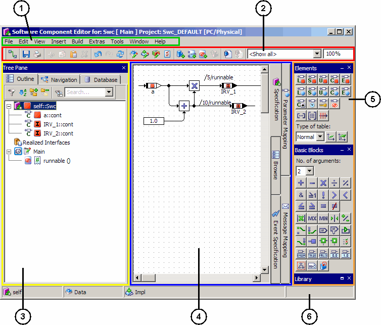

---

## Toolbars

_Source: `markdown/ASCtoolbars.md`_

# Toolbars

The toolbar is grouped by following functional blocks:

- [Basic Blocks](markdown/ASCtoolbarBasicBlocks.md)
- [General](markdown/ASCtoolbarGeneral.md)
- [Elements](markdown/ASCtoolbarElements.md)

---

## Toolbar General

_Source: `markdown/ASCtoolbarGeneral.md`_

# Toolbar General

The toolbar General contains following icons:

| Column 1 | Column 2 |
| --- | --- |
|  | Connect |
|  | Save |
|  | Print |
|  | Cut |
|  | Copy |
|  | Paste |
|  | Delete |
|  | Undo |
|  | Redo |
|  | Redraw |
|  | Edit Component Data |
|  | Edit Component Implementation |
|  | Edit Default Project |
|  | Tool Options |
|  | Insert Component |
|  | Insert Method |
|  | Insert Runnable |
|  | Browse to Parent Component |
|  | Generate Code |
|  | Compile generated code |
|  | Combo box to select a view |
|  | Combo box for the zoom factor |
|  | Set Zoom to 100% |
|  | Set Zoom to Page |
|  | Set Zoom to Fit |

Icons from this list that are not visible in the software component editor can be added; see [Configuring a Toolbar](IntroductionEnglishUS.chm::/INT_Configuring_Toolbar.htm).

---

## Toolbar Elements

_Source: `markdown/ASCtoolbarElements.md`_

# Toolbar Elements

The toolbar Elements contains the following icons:

<table style="x-cell-content-align: Top;
				margin-top: 3px;
				border-left-style: Outset;
				border-top-style: Outset;
				border-right-style: Outset;
				border-bottom-style: Outset;
				border-left-width: 1px;
				border-right-width: 1px;
				border-top-width: 1px;
				border-bottom-width: 1px;" x-use-null-cells="">
<col/>
<col/>
<col/>
<tr class="hcp1" valign="top">
<td class="hcp2" colspan="1" rowspan="1">

</td>
<td class="hcp2" colspan="1" rowspan="1">

Variable
</td>
<td class="hcp2" colspan="1" rowspan="2">

The  button opens the element 
 type selection menu.  The 
 Variable and Parameter buttons 
 can be used to create elements of type logic, limitInt, wrapInt, udisc, 
 sdisc, or cont.

By default, the limitInt and wrapInt types are displayed. To display the sdisc 
 and udisc types instead, the <a href="ComponentManagerEnglishUS.chm::/cm_options_for_editors.htm">editor 
 option</a> Use signed/unsigned discrete types must 
 be activated.

See also <a href="markdown/ascbasicelement.md">Creating a 
 Basic Element</a>.
</td></tr>
<tr class="hcp1" valign="top">
<td class="hcp2" colspan="1" rowspan="1">

</td>
<td class="hcp2" colspan="1" rowspan="1">

Parameter
</td>
</tr>
<tr class="hcp1" valign="top">
<td class="hcp2" colspan="1" rowspan="1">

</td>
<td class="hcp2" colspan="1" rowspan="1">

Implementation Cast
</td>
<td class="hcp2" colspan="1" rowspan="1">

See also <a href="markdown/ascimplementationcasts.md">Implementation 
 Casts in Software Components</a>.
</td></tr>
<tr class="hcp1" valign="top">
<td class="hcp2" colspan="1" rowspan="1">

</td>
<td class="hcp2" colspan="1" rowspan="1">

Delta T 
</td>
<td class="hcp2" colspan="1" rowspan="1">

dt system parameter

The name dT 
 is reserved for the system parameter. You cannot create any other element 
 with the name dT. 
 Since upper and lower case letters are not distinguished, the names DT, 
 dt, and Dt are reserved, too.
</td></tr>
<tr class="hcp1" valign="top">
<td class="hcp2" colspan="1" rowspan="1">

</td>
<td class="hcp2" colspan="1" rowspan="1">

Interrunnable Variable
</td>
<td class="hcp2" colspan="1" rowspan="1">

See also <a href="markdown/asc_createinterrunnablevariable.md">Creating 
 a Scalar Interrunnable Variable</a>. 
</td></tr>
<tr class="hcp1" valign="top">
<td class="hcp2" colspan="1" rowspan="1">

</td>
<td class="hcp2" colspan="1" rowspan="1">

Array
</td>
<td class="hcp2" colspan="1" rowspan="2">

See also <a href="markdown/asccreatearray.md">Creating an 
 Array or Matrix</a>.
</td></tr>
<tr class="hcp1" valign="top">
<td class="hcp2" colspan="1" rowspan="1">

</td>
<td class="hcp2" colspan="1" rowspan="1">

Matrix
</td>
</tr>
<tr class="hcp1" valign="top">
<td class="hcp2" colspan="1" rowspan="1">

</td>
<td class="hcp2" colspan="1" rowspan="1">

Distribution
</td>
<td class="hcp2" colspan="1" rowspan="1">

See also <a href="markdown/asccreatedistribution.md">Creating 
 a Distribution</a>.
</td></tr>
<tr class="hcp1" valign="top">
<td class="hcp2" colspan="1" rowspan="1">

</td>
<td class="hcp2" colspan="1" rowspan="1">

One D Table Parameter
</td>
<td class="hcp2" colspan="1" rowspan="2">

The  button opens the table type 
 selection menu. The table buttons can be used to create normal, group, 
 or fixed tables. 

See also <a href="markdown/asccreatenormal.md">Creating a 
 Normal or Fixed Characteristic Line/Map</a> and <a href="markdown/asccreategroup.md">Creating 
 a Group Characteristic Line/Map</a>.
</td></tr>
<tr class="hcp1" valign="top">
<td class="hcp2" colspan="1" rowspan="1">

</td>
<td class="hcp2" colspan="1" rowspan="1">

Two D Table Parameter
</td>
</tr>
</table>

See also

[Elements Palette](markdown/ASCelementsPalette.md)

---

## Toolbar Basic Blocks

_Source: `markdown/ASCtoolbarBasicBlocks.md`_

# Toolbar Basic Blocks

The toolbar Basic Blocks contains following operator groups:

- [Arithmetic Operators](markdown/ASCarithmeticOperators.md)
- [Logical Operators](markdown/ASClogicalOperators.md)
- [Comparison Operators](markdown/ASCcomparisonOperators.md)
- [Input Operators](markdown/ASCinputOperators.md)
- [Negation Operator](markdown/ascnegationoperator.md)
- [Conversion Operator](markdown/asc_conversionoperator.md)
- [A](markdown/asc_assertoperator.md)ssert Operator
- [Conditional Operators](markdown/ASCconditionaloperators.md)
- [Control Flow Operators](markdown/ASCcontrolFlowOperators.md)
- [Miscellaneous Basic Blocks](markdown/ascmiscbasicblocks.md)

Icons from these lists that are not visible in the SWC editor can be added; see [Configuring a Toolbar](IntroductionEnglishUS.chm::/INT_Configuring_Toolbar.htm).

See also

[Basic Blocks Palette](markdown/ASCbasicBlocksPalette.md)

---

## Arithmetic Operators

_Source: `markdown/ASCarithmeticOperators.md`_

# Arithmetic Operators

The meaning of the operators is the same as in [ESDL](ESDLEditorEnglishUS.chm::/Arithmetic_Operators.htm). The addition and multiplication operators can have between 2 and 20 arguments. The subtraction and division operators have only two arguments.

The following Arithmetic Operators are available:

| Column 1 | Column 2 |
| --- | --- |
|  | Addition |
|  | Subtraction |
|  | Multiplication |
|  | Division |
|  | Modulo |

See also

[Logical Operators](markdown/ASClogicalOperators.md)

[Comparison Operators](markdown/ASCcomparisonOperators.md)

[Input Operators](markdown/ASCinputOperators.md)

[Negation Operator](markdown/ascnegationoperator.md)

[Conditional Operators](markdown/ASCconditionaloperators.md)

[Control Flow Operators](markdown/ASCcontrolFlowOperators.md)

[Miscellaneous Basic Blocks](markdown/ascmiscbasicblocks.md)

---

## Logical Operators

_Source: `markdown/ASClogicalOperators.md`_

# Logical Operators

The meaning of the logical operators And, Or and Not is identical to their meaning in [ESDL](ESDLEditorEnglishUS.chm::/logical_operators.htm). The And and Or operators can be applied to more than two operands.

The following Logical Operators are available:

| Column 1 | Column 2 |
| --- | --- |
|  | And |
|  | Or |
|  | Not |

See also

[Arithmetic Operators](markdown/ASCarithmeticOperators.md)

[Comparison Operators](markdown/ASCcomparisonOperators.md)

[Input Operators](markdown/ASCinputOperators.md)

[Negation Operator](markdown/ascnegationoperator.md)

[Conditional Operators](markdown/ASCconditionaloperators.md)

[Control Flow Operators](markdown/ASCcontrolFlowOperators.md)

[Miscellaneous Basic Blocks](markdown/ascmiscbasicblocks.md)

---

## Comparison Operators

_Source: `markdown/ASCcomparisonOperators.md`_

# Comparison Operators

The comparison operators are identical to their counterparts in the textual representation with ESDL.

The Equal and Not Equal operators can also be applied to non-arithmetic elements.

The following Comparison Operators are available:

| Column 1 | Column 2 |
| --- | --- |
|  | Greater |
|  | Smaller |
|  | Smaller or Equal |
|  | Greater or Equal |
|  | Equal |
|  | Not Equal |
|  | Verify (see also Redundant Data Storage ) |

See also

[Arithmetic Operators](markdown/ASCarithmeticOperators.md)

[Logical Operators](markdown/ASClogicalOperators.md)

[Input Operators](markdown/ASCinputOperators.md)

[Conditional Operators](markdown/ASCconditionaloperators.md)

[Control Flow Operators](markdown/ASCcontrolFlowOperators.md)

[Miscellaneous Basic Blocks](markdown/ascmiscbasicblocks.md)

---

## Input Operators

_Source: `markdown/ASCinputOperators.md`_

# Input Operators

The following Input Operators are available:

| Column 1 | Column 2 |
| --- | --- |
|  | The Absolute operator returns the absolute value of the argument. Argument and return value have to be both either cont or discrete (see also Scalar Types - Summary ). |
|  | The Max operator returns the maximum input (argument). The operator can have 2 to 20 arguments and can be applied only to arithmetic elements. |
|  | The Min operator returns the minimum input (argument). The operator can have 2 to 20 arguments and can be applied only to arithmetic elements. |
|  | The Between operator checks if the argument value lies between the limiters min and max. If this is the case, the logical return value out_log is true, otherwise it is set to false. The graphical representation is equivalent to out_log = (( value >= min ) && ( value <= max )) . The argument and both limiters have to be either cont or discrete (see also Scalar Types - Summary ). |

See also

[Arithmetic Operators](markdown/ASCarithmeticOperators.md)

[Logical Operators](markdown/ASClogicalOperators.md)

[Comparison Operators](markdown/ASCcomparisonOperators.md)

[Negation Operator](markdown/ascnegationoperator.md)

[Conditional Operators](markdown/ASCconditionaloperators.md)

[Control Flow Operators](markdown/ASCcontrolFlowOperators.md)

[Miscellaneous Basic Blocks](markdown/ascmiscbasicblocks.md)

---

## Negation Operator

_Source: `markdown/ascnegationoperator.md`_

# Negation Operator

The Negation operator returns the negative value of the argument. Argument and return value can be cont or discrete (see also [Scalar Types - Summary](IntroductionEnglishUS.chm::/INT_scalar_summary.htm)); if the argument is cont, the type of the return value should be the same.

See also

[Scalar Types - Summary](IntroductionEnglishUS.chm::/INT_scalar_summary.htm)

[Arithmetic Operators](markdown/ASCarithmeticOperators.md)

[Logical Operators](markdown/ASClogicalOperators.md)

[Comparison Operators](markdown/ASCcomparisonOperators.md)

[Input Operators](markdown/ASCinputOperators.md)

[Conditional Operators](markdown/ASCconditionaloperators.md)

[Control Flow Operators](markdown/ASCcontrolFlowOperators.md)

[Miscellaneous Basic Blocks](markdown/ascmiscbasicblocks.md)

---

## Conversion Operator

_Source: `markdown/asc_conversionoperator.md`_

# Conversion Operator

 

The Conversion operator allows to convert scalar elements to [limitInt](IntroductionEnglishUS.chm::/INT_ScalarTypes_LimitedInteger.htm) or [wrapInt](IntroductionEnglishUS.chm::/INT_ScalarTypes_WrapAroundInteger.htm) types. The function of the convert operator is determined either via the button used to create the operator or via the Conversion Type submenu in the operator's context menu.

The Use Limiters option in the operator's context menu is used to determine if the limits for the converted type are user-defined or not.

The Conversion option in the operator's context menu opens the [Conversion Attributes](markdown/asc_conversionattributeswindow.md) dialog window, where you can enter min and max values and - for wrapInt - type for the converted type.

[Examples: Conversion Operator](BlockDiagramEditorEnglishUS.chm::/BDE_Example_ConversionOperator.htm) contains examples for using the conversion operator.

- The first example shows a cont variable converted to limitInt; min and max of the conversion are set manually.
- The second example shows a cont variable converted to limitInt; min and max of the conversion are set automatically.
- The third example shows a cont variable converted to wrapInt; min and max of the conversion are set manually.
- The fourth example shows a cont variable converted to wrapInt; min and max of the conversion are set automatically.

See also

[Scalar Types - Limited Integer](IntroductionEnglishUS.chm::/INT_ScalarTypes_LimitedInteger.htm)

[Scalar Types - Wrap-Around Integer](IntroductionEnglishUS.chm::/INT_ScalarTypes_WrapAroundInteger.htm)

[Context Menu - Operators: Conversion Operator](markdown/ASCcontextMenuOperators.md#Conversion)

[Examples: Conversion Operator](BlockDiagramEditorEnglishUS.chm::/BDE_Example_ConversionOperator.htm)

---

## Assert Operator

_Source: `markdown/asc_assertoperator.md`_

# Assert Operator (SWC Editor)

The Assert operator allows to specify lower and upper bound of an interval. This interval is then used by the code generator as the result interval of the Assert operator; the calculated interval of the operand is overwritten. It is possible to use the Assert operator with only one boundary; in that case, the other boundary is specified as -oo or +oo.

The result type of the assert operator is the same type as the operand, with the interval replaced by the interval specified on the assert operator.

The assert operator conveys user-defined interval information to the code generator. The Assert option in the operator's context menu opens the [Assert Attributes](BlockDiagramEditorEnglishUS.chm::/BDE_AssertAttributes_Window.htm) dialog window, where you can enter min and max values for the operand interval. The code generator can use this information to generate more efficient code. However, the correctness of the assertion must be reviewed manually; this is supported by the semantic analysis.

In addition, the assert operator is suitable to replace implementation casts with deactivated Limit Assignments option (see also [Setting the Limitation](ImplementationEditorEnglishUS.chm::/set_limitation.htm)).

The following semantic checks are performed:

- If the physical operand interval and the assert interval have no intersection, an error (MIle76) is issued during code generation, because this is most likely a modeling error.
- If the physical operand interval and the assert interval overlap, but neither interval is fully contained in the other, an information message (IIle76) is issued during code generation.

This is potentially a modeling error, so you might want to [promote](ComponentManagerEnglishUS.chm::/CM_Promoting_Messages.htm) the information to a warning.

- If the physical operand interval is contained in the assert interval, an information message (IIle77) is issued during code generation.

- If the model contains an implementation cast with deactivated Limit Assignments option, and if the formula of the implementation cast is the same as the formula of the operand, an information message (IIle78) is issued during implementation code generation.

This message informs you that the implementation cast can be replaced by an assert operator, and specifies the required assertion interval.

See also [Example: Assert Operator](markdown/asc_assertoperator.md).

See also

[Assert Attributes Dialog Window](BlockDiagramEditorEnglishUS.chm::/BDE_AssertAttributes_Window.htm)

[Context Menu - Operators: Assert Operator](markdown/ASCcontextMenuOperators.md#Assert)

[Example: Assert Operator](markdown/asc_assertoperator.md)

[Setting the Limitation](ImplementationEditorEnglishUS.chm::/set_limitation.htm)

[Promoting Messages](ComponentManagerEnglishUS.chm::/CM_Promoting_Messages.htm)

---

## Example: Assert Operator

_Source: `markdown/asc_exampleassertoperator.md`_

# Example: Assert Operator

A small block diagram example for the Assert operator has been created:

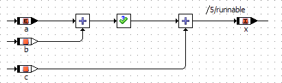

The explicit interrunnable variable a, variables b and c are implemented as sint8, the implicit interrunnable variable x is implemented as sint16. The assertion interval is set as follows:

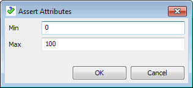

Code is generated for the ANSI-C target, the Object Based Controller Implementation code generator and an AUTOSAR operating system. The assertion is not visible in the generated code, except for brackets and possibly suppressed optimizations.

The resulting C code reads as follows:

| Column 1 | Column 2 |
| --- | --- |
| 1 | FUNC(void, CODE) SWC_assert_Impl_runnable (void) |
| 2 | { |
| 3 | Rte_IrvIWrite_runnable_x((SInt16)Rte_IrvRead_runnable_a() + _b + _c); |
| 4 | } |

See also

[Assert Operator](markdown/asc_assertoperator.md)

---

## Conditional Operators

_Source: `markdown/ASCconditionaloperators.md`_

The graphical representation of

(condition ? trueValue : falseValue)

is as follows:

The multiplex operator can also be used directly with several arguments (left image), the right image shows the identical functionality built as a cascade of several Mux operators:

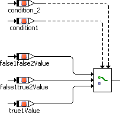 

The above example is equivalent to

(condition1 ? (true1Value : condition2 ? ( false1true2Value : false1false2Value))),

i.e., the first argument has priority over the others. A cascaded Mux operator with n logical condition arguments can select between n+1 arguments between which it switches. The type of the arguments is arbitrary, but all arguments must be of a compatible type.

The above example is equivalent to

switch (self->switch_value->val) { case 1 : { out_case = case_1; break; } case 2 : { out_case = case_2; break; } default: { out_case = case_default; break; } }

# Conditional Operators

The following Conditional Operators are available:

| Column 1 | Column 2 |
| --- | --- |
|  | The conditional operator ( ? : ) is named Multiplex operator (for short: Mux ) in the graphical representation. Example |
|  | The Case operator is a special case of the conditional operator. It does not take a logical value, but a switch value of discrete type (see also Scalar Types - Summary ). The Case operator has n arguments, n-1 of which are numbered consecutively. The last argument is the default case. Depending on the switch value, one of the arguments is selected. If the switch value is 1, the first argument is returned, if it is 2 the second is returned, and so on. If the switch value is less than 1, or n , or larger than n , the last argument is returned. Example |

See also

[Arithmetic Operators](markdown/ASCarithmeticOperators.md)

[Logical Operators](markdown/ASClogicalOperators.md)

[Comparison Operators](markdown/ASCcomparisonOperators.md)

[Input Operators](markdown/ASCinputOperators.md)

[Negation Operator](markdown/ascnegationoperator.md)

[Control Flow Operators](markdown/ASCcontrolFlowOperators.md)

[Miscellaneous Basic Blocks](markdown/ascmiscbasicblocks.md)

/* Heikki Komulainen, Comet Computer GmbH 2004 */ cc_plus_pic = '&nbsp;'; cc_minus_pic = '&nbsp;'; cc_stat_pic = '&nbsp;'; gpstyle = ''; var iframes_created = 0; if (document.body && document.body.insertAdjacentHTML && document.getElementsByTagName && document.getElementById) { collect_popups(); set_poplinks_pictures(); if (iframes_created) { document.write(gpstyle); document.write('
<nobr><a id="einauslink" style="position:absolute;top:expression(document.body.scrollTop + this.offsetHeight - this.offsetHeight);left:expression(document.body.offsetWidth - (this.offsetWidth + 28));background:white;padding:5px" href="javascript:show_all_poptext()">Alle texte einblenden</a></nobr>
'); } } function collect_popups() { bsscpopups = new Array(); for (x = 0; x < document.links.length; x++) { if (document.links[x].href.indexOf("BSSCPopup")>-1) { seekmatch = /BSSCPopup.'[^'](markdown/+)'/; poplink = seekmatch.exec(document.links[x].href); poplink = "" + poplink; poplink = poplink.substring(poplink.indexOf("'")+1, poplink.lastIndexOf("'")); ifid = "CCGENIFRAMEID" + x; new_iframe = '<iframe id="' + ifid + '"src="' + poplink + '" onload="get_text(\'' + ifid + '\')" width="0" height="0" frameborder=0></iframe>'; document.links[x].parentNode.insertAdjacentHTML("afterEnd", new_iframe); gpid = "CCID_" + ifid; document.links[x].href = "javascript:expand_poptext('" + gpid + "')"; cc_plus = '' + cc_plus_pic + ''; document.links[x].insertAdjacentHTML("afterBegin", cc_plus); iframes_created = 1; } } }// end function function get_text(ifr_id) { frpars = document.frames[ifr_id].document.getElementsByTagName("body"); popbody = frpars[0].innerHTML; gpid = "CCID_" + ifr_id; if (!document.getElementById(gpid)) { //avoiding doubles document.getElementById(ifr_id).insertAdjacentHTML("afterEnd", '
'+popbody+'
'); } }//end function function expand_poptext(x_frame_id) { if (!document.getElementById(x_frame_id)) return; if (document.getElementById(x_frame_id).className == "CCGENPOPTEXTH") { document.getElementById(x_frame_id).className = "CCGENPOPTEXTV"; document.getElementById(x_frame_id).style.visibility = "visible"; if (document.getElementById("CCPMB_" + x_frame_id )) { document.getElementById("CCPMB_" + x_frame_id ).innerHTML = cc_minus_pic; } } else { document.getElementById(x_frame_id).className = "CCGENPOPTEXTH"; document.getElementById(x_frame_id).style.visibility = "hidden"; if (document.getElementById("CCPMB_" + x_frame_id )) { document.getElementById("CCPMB_" + x_frame_id ).innerHTML = cc_plus_pic; } } }// end function function show_all_poptext() { var pulldowntxt = document.getElementsByTagName("div"); for (b = 0; b < pulldowntxt.length; b++) { if (pulldowntxt[b].className == "droptext") { pulldowntxt[b].style.display=""; } } var gptxt = document.getElementsByTagName("div"); for (z = 0; z < gptxt.length; z++) { if (gptxt[z].className == "CCGENPOPTEXTH") { gptxt[z].className = "CCGENPOPTEXTV"; gptxt[z].style.visibility = "visible"; if (document.getElementById("CCPMB_" + gptxt[z].id )) { document.getElementById("CCPMB_" + gptxt[z].id ).innerHTML = cc_minus_pic; } } } var dxpoplinks = document.getElementsByTagName("a"); if (dxpoplinks) { for (pxl = 0; pxl < dxpoplinks.length; pxl++) { if (dxpoplinks[pxl].href.indexOf("kadovTextPopup")>-1) { if (document.getElementById("CCPMB_" + dxpoplinks[pxl].id)) { document.getElementById("CCPMB_" + dxpoplinks[pxl].id).innerHTML = cc_stat_pic; dxpoplinks[pxl].symbol = "minus"; } } } } document.getElementById('einauslink').innerText = 'Alle texte ausblenden'; document.getElementById('einauslink').href = "javascript:self.location.reload()"; self.focus(); }// end function function eat_click() { return false; }// end function function set_poplinks_pictures() { var dpoplinks = document.getElementsByTagName("a"); if (dpoplinks) { for (pl = 0; pl < dpoplinks.length; pl++) { if (dpoplinks[pl].href.indexOf("kadovTextPopup")>-1) { cc_plus = '' + cc_stat_pic + ''; //dpoplinks[pl].onmouseup = plusminuspoplink; dpoplinks[pl].insertAdjacentHTML("afterBegin", cc_plus); dpoplinks[pl].symbol = "plus"; } } } }// end function function plusminuspoplink() { if (document.getElementById("CCPMB_" + this.id)) { if (this.symbol == "plus") { document.getElementById("CCPMB_" + this.id).innerHTML = cc_minus_pic; this.symbol = "minus"; } else { document.getElementById("CCPMB_" + this.id).innerHTML = cc_plus_pic; this.symbol = "plus"; } } return true; }

---

## Control Flow Operators

_Source: `markdown/ASCcontrolFlowOperators.md`_

The control flow output is connected to one or more sequence calls which are triggered whenever the control flow branch is activated. Whenever the input expression evaluates to True, the connected sequence calls are executed.

The example above is equivalent to

if (l) {

c = b

};

As for the if…else statement in ESDL, the generated code is optimized when the expression for If…Then is always true. [If…Else (ESDL)](ESDLEditorEnglishUS.chm::/ifelse.htm) describes how the optimization works.

The example above is equivalent to

if (l) {

d = b}

else {

c = b

};

As for the if…else statement in ESDL, the generated code is optimized when the expression for If…Then…Else is always true. [If…Else (ESDL)](ESDLEditorEnglishUS.chm::/ifelse.htm) describes how the optimization works.

Similarly to the If…Then statement, the control flow is activated when the value of the logical expression is True. The operation is executed as long as the value of the logical input remains True. Therefore, the value of the logical expression should be manipulated in the while loop.

In order to avoid infinite loops, the maximal number of loop iterations can be limited to a fixed number in the project properties, Experiment Code node, of the associated project (or default project).

The example above is equivalent to

while (i<10) {

c = b * c;

i = 1 + i;

};

For each alternative the value for the branch can be defined by the user. The last branch at the bottom is the default branch that is executed if the input value does not equal any of the values at the branches.

The example above is equivalent to

switch (a) {

case 0: {

d = c;

break; }

case 5: {

d = b;

break; }

default: {

d = 0;

break; }

}

# Control Flow Operators

The following Control Flow Operators are available:

| Column 1 | Column 2 |
| --- | --- |
|  | The If…Then statement evaluates a logical expression and activates a control flow branch if the result is True. Details |
|  | If…Then…Else is similar to If…Then , but has two control flow branches. Depending on the value of the logical expression, the left or right branch is executed, the right branch is executed if the value is True, the left one if it is False. Details |
|  | The only loop construct available in block diagrams is the While loop. Care has to be taken to avoid infinite loops or loops unsuitable for real-time applications. Details |
|  | The Switch construct is similar to the Case operator . A Switch evaluates a signed discrete or unsigned discrete value and, depending on that value, activates different control flow branches. These branches are separated from each other, so that a “fall through” like in the switch construct in C is not possible. Details |
|  | The break operator in the software component editor behaves similar to a C language return statement. In a method, the break operator causes an immediate return from the method. The user is responsible for the correct setting of any return values before the break operator is executed. In a process, the break operator causes a deferred exit. Deferred exit means that all send messages are sent before the exit occurs. The break operator in the software component editor behaves differently from the break statement in ESDL. |

See also

[Using the If Statements](markdown/ascuseif.md)

[Using the While Loop](markdown/ascusewhileloop.md)

[Using the Switch Operator](markdown/ascuseswitch.md)

[Arithmetic Operators](markdown/ASCarithmeticOperators.md)

[Logical Operators](markdown/ASClogicalOperators.md)

[Comparison Operators](markdown/ASCcomparisonOperators.md)

[Input Operators](markdown/ASCinputOperators.md)

[Negation Operator](markdown/ascnegationoperator.md)

[Conditional Operators](markdown/ASCconditionaloperators.md)

[Miscellaneous Basic Blocks](markdown/ascmiscbasicblocks.md)

[Project Editor - Experiment Code Node](ProjectEditorEnglishUS.chm::/Exp_Code_Options_Window.htm)

/* Heikki Komulainen, Comet Computer GmbH 2004 */ cc_plus_pic = '&nbsp;'; cc_minus_pic = '&nbsp;'; cc_stat_pic = '&nbsp;'; gpstyle = ''; var iframes_created = 0; if (document.body && document.body.insertAdjacentHTML && document.getElementsByTagName && document.getElementById) { collect_popups(); set_poplinks_pictures(); if (iframes_created) { document.write(gpstyle); document.write('
<nobr><a id="einauslink" style="position:absolute;top:expression(document.body.scrollTop + this.offsetHeight - this.offsetHeight);left:expression(document.body.offsetWidth - (this.offsetWidth + 28));background:white;padding:5px" href="javascript:show_all_poptext()">Alle texte einblenden</a></nobr>
'); } } function collect_popups() { bsscpopups = new Array(); for (x = 0; x < document.links.length; x++) { if (document.links[x].href.indexOf("BSSCPopup")>-1) { seekmatch = /BSSCPopup.'[^'](markdown/+)'/; poplink = seekmatch.exec(document.links[x].href); poplink = "" + poplink; poplink = poplink.substring(poplink.indexOf("'")+1, poplink.lastIndexOf("'")); ifid = "CCGENIFRAMEID" + x; new_iframe = '<iframe id="' + ifid + '"src="' + poplink + '" onload="get_text(\'' + ifid + '\')" width="0" height="0" frameborder=0></iframe>'; document.links[x].parentNode.insertAdjacentHTML("afterEnd", new_iframe); gpid = "CCID_" + ifid; document.links[x].href = "javascript:expand_poptext('" + gpid + "')"; cc_plus = '' + cc_plus_pic + ''; document.links[x].insertAdjacentHTML("afterBegin", cc_plus); iframes_created = 1; } } }// end function function get_text(ifr_id) { frpars = document.frames[ifr_id].document.getElementsByTagName("body"); popbody = frpars[0].innerHTML; gpid = "CCID_" + ifr_id; if (!document.getElementById(gpid)) { //avoiding doubles document.getElementById(ifr_id).insertAdjacentHTML("afterEnd", '
'+popbody+'
'); } }//end function function expand_poptext(x_frame_id) { if (!document.getElementById(x_frame_id)) return; if (document.getElementById(x_frame_id).className == "CCGENPOPTEXTH") { document.getElementById(x_frame_id).className = "CCGENPOPTEXTV"; document.getElementById(x_frame_id).style.visibility = "visible"; if (document.getElementById("CCPMB_" + x_frame_id )) { document.getElementById("CCPMB_" + x_frame_id ).innerHTML = cc_minus_pic; } } else { document.getElementById(x_frame_id).className = "CCGENPOPTEXTH"; document.getElementById(x_frame_id).style.visibility = "hidden"; if (document.getElementById("CCPMB_" + x_frame_id )) { document.getElementById("CCPMB_" + x_frame_id ).innerHTML = cc_plus_pic; } } }// end function function show_all_poptext() { var pulldowntxt = document.getElementsByTagName("div"); for (b = 0; b < pulldowntxt.length; b++) { if (pulldowntxt[b].className == "droptext") { pulldowntxt[b].style.display=""; } } var gptxt = document.getElementsByTagName("div"); for (z = 0; z < gptxt.length; z++) { if (gptxt[z].className == "CCGENPOPTEXTH") { gptxt[z].className = "CCGENPOPTEXTV"; gptxt[z].style.visibility = "visible"; if (document.getElementById("CCPMB_" + gptxt[z].id )) { document.getElementById("CCPMB_" + gptxt[z].id ).innerHTML = cc_minus_pic; } } } var dxpoplinks = document.getElementsByTagName("a"); if (dxpoplinks) { for (pxl = 0; pxl < dxpoplinks.length; pxl++) { if (dxpoplinks[pxl].href.indexOf("kadovTextPopup")>-1) { if (document.getElementById("CCPMB_" + dxpoplinks[pxl].id)) { document.getElementById("CCPMB_" + dxpoplinks[pxl].id).innerHTML = cc_stat_pic; dxpoplinks[pxl].symbol = "minus"; } } } } document.getElementById('einauslink').innerText = 'Alle texte ausblenden'; document.getElementById('einauslink').href = "javascript:self.location.reload()"; self.focus(); }// end function function eat_click() { return false; }// end function function set_poplinks_pictures() { var dpoplinks = document.getElementsByTagName("a"); if (dpoplinks) { for (pl = 0; pl < dpoplinks.length; pl++) { if (dpoplinks[pl].href.indexOf("kadovTextPopup")>-1) { cc_plus = '' + cc_stat_pic + ''; //dpoplinks[pl].onmouseup = plusminuspoplink; dpoplinks[pl].insertAdjacentHTML("afterBegin", cc_plus); dpoplinks[pl].symbol = "plus"; } } } }// end function function plusminuspoplink() { if (document.getElementById("CCPMB_" + this.id)) { if (this.symbol == "plus") { document.getElementById("CCPMB_" + this.id).innerHTML = cc_minus_pic; this.symbol = "minus"; } else { document.getElementById("CCPMB_" + this.id).innerHTML = cc_plus_pic; this.symbol = "plus"; } } return true; }

---

## Miscellaneous Basic Blocks

_Source: `markdown/ascmiscbasicblocks.md`_

# Miscellaneous Basic Blocks

The following miscellaneous basic blocks are available:

| Column 1 | Column 2 |
| --- | --- |
|  | Combo box to select the number of operator inputs |
|  | RTE Access, an operator that allows the selection of explicit or implicit access to a SenderReceiver or NVData interface. |
|  | RTE Invoke, an operator that is used to make a client request on a port . |
|  | RTE Status, inserts an element that returns the status of an explicit read or write procedure. |
|  | Enumeration Literal |
|  | Logic Literal true |
|  | Logic Literal false |
|  | Continuous Literal 0.0 |
|  | Continuous Literal 1.0 |
|  | Hierarchy |
|  | Statement Block |
|  | Comment |
|  | Self |

See also

[Arithmetic Operators](markdown/ASCarithmeticOperators.md)

[Logical Operators](markdown/ASClogicalOperators.md)

[Comparison Operators](markdown/ASCcomparisonOperators.md)

[Input Operators](markdown/ASCinputOperators.md)

[Negation Operator](markdown/ascnegationoperator.md)

[Conditional Operators](markdown/ASCconditionaloperators.md)

[Control Flow Operators](markdown/ASCcontrolFlowOperators.md)

---

## Menus

_Source: `markdown/ASCmenuBar.md`_

# Menu Bar

The menu bar contains the following menus:

- [File Menu](markdown/ASCfileMenu.md)
- [Edit Menu](markdown/ASCeditMenu.md)
- [View Menu](markdown/ASCviewMenu.md)
- [Insert Menu](markdown/ASCinsertMenu.md)
- [Build Menu](markdown/ASCbuildMenu.md)
- [Extras Menu](markdown/ASCextrasMenu.md)
- [Tools Menu](markdown/ASCtoolsMenu.md)
- [Windows Menu](markdown/ASCwindowsMenu.md)
- [Help Menu](markdown/ASChelpMenu.md)

Menus only visible in the Event Specification view:

- [Event Menu](markdown/ASCEventMenu.md)
- [Runnable Menu](markdown/ASCRunnableMenu.md)

Menus only visible in the Parameter Mapping and Message Mapping views

- [Mapping Menu](markdown/ASCMappingMenu.md)

---

## File Menu

_Source: `markdown/ASCfileMenu.md`_

# File Menu

The menu File contains the following functions:

##### Save (Ctrl + s)

Save current software component.

##### Import

Data

| Column 1 | Column 2 |
| --- | --- |
| For Selected Element | Imports data for selected element. |

Mapping

Imports message and parameter mappings.

##### Export

Component

Saves the current software component into an export file.

Generated Code

Exports the code generated in the file system.

| Column 1 | Column 2 |
| --- | --- |
| Flat | Exports the generated code for the edited component. |
| Recursive | Exports the generated code for the edited component and all referenced components. |
| Generic | Exports generic code for processing at a later point using external tools, e.g. an external Make/Build process. |

Data

Exports a component data set.

| Column 1 | Column 2 |
| --- | --- |
| For Component | Exports a component dataset. |
| For selected Element | Exports data for the selected elements. |

Graphic

| Column 1 | Column 2 |
| --- | --- |
| Postscript | Saves the diagram as Postscript file. |
| BMP | Saves the diagram as Bitmap graphic file. |
| GIF | Saves the diagram as .gif (Graphics Interchange Format) file. |
| RTF | Saves the diagram as .rtf (Rich Text Format) file. |

Mapping

Opens the Export Settings dialog window where you can export mappings to an *.xml or *.csv file.

##### Print

Prints the SWC block diagram.

##### Print Setup

Opens the printer setup window.

##### Close

Exits the software component editor.

See also

[Edit Menu](markdown/ASCeditMenu.md)

[View Menu](markdown/ASCviewMenu.md)

[Insert Menu](markdown/ASCinsertMenu.md)

[Build Menu](markdown/ASCbuildMenu.md)

[Extras Menu](markdown/ASCextrasMenu.md)

[Tools Menu](markdown/ASCtoolsMenu.md)

[Window Menu](markdown/ASCwindowsMenu.md)

[Help Menu](markdown/ASChelpMenu.md)

---

## Edit Menu

_Source: `markdown/ASCeditMenu.md`_

# Edit Menu

The menu Edit contains the following functions:

Undo (Ctrl + z)

Reverses the most recent action.

Redo (Ctrl + y)

Reverses an undo command.

Cut (Ctrl + x)

Cuts (deletes) a selected diagram element or method/process.

Copy (Ctrl + c)

Copies a selected diagram element or method/process to the ASCET clipboard.

Paste (Ctrl + v)

Pastes a diagram item.

Delete (Delete)

Deletes a selected element or method/runnable.

Rename (F2)

Renames a selected element or method/runnable.

Insert Event (Insert)

Only available in the Events field of the Event Specification view.

Inserts an event.

Search (Ctrl + Shift + s)

Searches the component as described in [Browsing the Database or Workspace](componentmanagerenglishus.chm::/Browsing.htm). The range is limited to the edited component and its included components.

Select All (Ctrl + a)

Selects all elements in the Specification Panel.

Replace Component

Replaces a component with another component. The name of the old component remains.

Open Component

Opens the specification editor for a selected included component.

Notes...

Opens the notes editor for an included component - you can make notes about the included component here.

Properties... (Ctrl + Shift + p)

Edits the properties of the selected element.

Data... (Ctrl + Shift + d)

Opens the data editor for the selected element.

Implementation (Ctrl + Shift + i)

The implementation editor for the selected element opens. Search of component implementations is possible.

Set Cache Locking

These menu options are used in connection with ASCET-RP. They are irrelevant for AUTOSAR.

Component

| Column 1 | Column 2 |
| --- | --- |
| Data | Opens the data editor for the component. Search of component data is possible. |
| Implementation | Opens the implementation editor for the component. Search of component implementations is possible. |
| Layout | Opens the layout editor for the component. |
| Notes | Opens the notes editor - you can make notes about the component here. |

See also

[Browsing the Database or Workspace](componentmanagerenglishus.chm::/Browsing.htm)

[File Menu](markdown/ASCfileMenu.md)

[View Menu](markdown/ASCviewMenu.md)

[Insert Menu](markdown/ASCinsertMenu.md)

[Build Menu](markdown/ASCbuildMenu.md)

[Extras Menu](markdown/ASCextrasMenu.md)

[Tools Menu](markdown/ASCtoolsMenu.md)

[Window Menu](markdown/ASCwindowsMenu.md)

[Help Menu](markdown/ASChelpMenu.md)

---

## View Menu

_Source: `markdown/ASCviewMenu.md`_

# View Menu

The menu View contains the following functions:

Show/Hide

Shows/hides several parts of the editor or the component.

| Column 1 | Column 2 |
| --- | --- |
| Tree Pane | Shows/hides Tree pane. |
| Search Results | Browse area for elements connected to a selected diagram element (see Viewing All Elements Connected to an Item ) or for unused elements (see Searching/Deleting Unused Elements ). |
| Toolbars | The General , Elements and Basic Blocks submenus show/hide the respective toolbars. |
| Palettes | The Elements , Basic Blocks and Block Library submenus show/hide the respective palettes. |

Configure

| Column 1 | Column 2 |
| --- | --- |
| Toolbar General | Select the buttons to be visible in the General toolbar (see Configuring a Toolbar ). |
| Toolbar Elements | Select the buttons to be visible in the Elements toolbar. |
| Toolbar Basic Blocks | Select the buttons to be visible in the Basic Blocks toolbar. |
| Reset Toolbar Configuration | Reset toolbar to default configuration. |

Sequence Calls

Show

Shows groups of sequence calls.

| Column 1 | Column 2 |
| --- | --- |
| For Diagram | For the whole diagram. |
| For Method/Process | For a single method/process. |
| For Selection | For selected blocks. |
| Unused | Unused sequence calls. |

Hide

| Column 1 | Column 2 |
| --- | --- |
| For Diagram | For the whole diagram. |
| For Method/Process | For a single method/process. |
| For Selection | For selected blocks. |
| Unused | Unused sequence calls. |

Next (Ctrl+Right)

Moves between sequence calls (next call).

Previous (Ctrl+Left)

Moves between sequence calls (previous call)

Page Layout

Portrait

Displays the diagram in portrait format.

Landscape

Displays the diagram in landscape format.

Grid

Modifies the grid in the drawing area.

See also

[Viewing All Elements Connected to an Item](markdown/ascviewconnectedelements.md)

[Searching/Deleting Unused Elements](markdown/ASC_SearchDeleteUnusedElements.md)

[Configuring a Toolbar](IntroductionEnglishUS.chm::/INT_Configuring_Toolbar.htm)

[File Menu](markdown/ASCfileMenu.md)

[Edit Menu](markdown/ASCeditMenu.md)

[Insert Menu](markdown/ASCinsertMenu.md)

[Build Menu](markdown/ASCbuildMenu.md)

[Extras Menu](markdown/ASCextrasMenu.md)

[Tools Menu](markdown/ASCtoolsMenu.md)

[Window Menu](markdown/ASCwindowsMenu.md)

[Help Menu](markdown/ASChelpMenu.md)

---

## Insert Menu

_Source: `markdown/ASCinsertMenu.md`_

# Insert Menu

The menu Insert contains the following functions:

Component

Inserts a component as a complex element.

Method

Creates a method.

Runnable

Creates a runnable.

Diagram

Creates a new diagram.

| Column 1 | Column 2 |
| --- | --- |
| Public | Contains only public methods. |
| Private | Contains only private methods. |

See also

[File Menu](markdown/ASCfileMenu.md)

[Edit Menu](markdown/ASCeditMenu.md)

[View Menu](markdown/ASCviewMenu.md)

[Build Menu](markdown/ASCbuildMenu.md)

[Extras Menu](markdown/ASCextrasMenu.md)

[Tools Menu](markdown/ASCtoolsMenu.md)

[Window Menu](markdown/ASCwindowsMenu.md)

[Help Menu](markdown/ASChelpMenu.md)

---

## Build Menu

_Source: `markdown/ASCbuildMenu.md`_

# Build Menu

The menu Build contains the following functions:

Touch

Forced regeneration during the next code generation.

| Column 1 | Column 2 |
| --- | --- |
| Flat | The edited component. |
| Recursive | The referenced components. |

Clean Code Generation Directory

Deletes all files in the code generation directory.

Update Interfaces

If a provided ClientServer interface has been changed in the [ClientServer interface editor](SenderReceiverEditorEnglishUS.chm::/SREwindowsDescription.htm), this menu option imports the changes into the SWC.

Analyze Diagram

Analyzes the current diagram.

View Generated Code

Generates the code for the component and displays it in a text editor. The text editor can be selected in the ASCET options window, [ASCII Editor](ComponentManagerEnglishUS.chm::/CM_ASCII_Editor_Options.htm) node (see [Setting ASCET Options](ComponentManagerEnglishUS.chm::/SettingASCET.htm)).

Generate Code (Ctrl + F7)

Generates the code for a component.

To generate code, you must select a microcontroller target and an AUTOSAR operating system in the default project, see [Generating AUTOSAR Code](markdown/ASCgenerateAUTOSARCode.md).

Compile

Compiles the generated code.

See also

[ASCII Editor Options](ComponentManagerEnglishUS.chm::/CM_ASCII_Editor_Options.htm)

[Setting ASCET Options](ComponentManagerEnglishUS.chm::/SettingASCET.htm)

[File Menu](markdown/ASCfileMenu.md)

[Edit Menu](markdown/ASCeditMenu.md)

[View Menu](markdown/ASCviewMenu.md)

[Insert Menu](markdown/ASCinsertMenu.md)

[Extras Menu](markdown/ASCextrasMenu.md)

[Tools Menu](markdown/ASCtoolsMenu.md)

[Window Menu](markdown/ASCwindowsMenu.md)

[Help Menu](markdown/ASChelpMenu.md)

---

## Extras Menu

_Source: `markdown/ASCextrasMenu.md`_

# Extras Menu

The menu Extras contains the following functions:

Browse to Parent Component

Opens an editor for the including component. (The option is only available if an included component is being edited.)

Browse to Parent Hierarchy

Displays the including graphical hierarchy or statement block (see [Graphical Hierarchies](BlockDiagramEditorEnglishUS.chm::/GraphicalHierarchies.htm) or [Statement Blocks](markdown/asc_statementblocks.md)).

Show Path

Shows the path of an element or included component.

Show Occurences

Shows all graphical occurrences of the item.

Copy Path to Clipboard

Copies the path of an included component to the clipboard.

| Column 1 | Column 2 |
| --- | --- |
| Model Path | Model Path. |
| Model asd:// Link | Path in ASCET protocol format that allows operating/referencing an ASCET component in a model as hyperlink. |
| Database Path | Database/workspace path. |
| Database asd:// Link | Path in ASCET protocol format that allows operating/referencing an ASCET component in the database/workspace as hyperlink. |

Create ASCET Link

Creates an [ASCET link](IntroductionEnglishUS.chm::/INT_ASCETLinks.htm) for an element selected in the Outline tab or the drawing area. The link opens the component in the software component editor and (except for the self element, i.e. the root of the element tree) highlights the element in the Outline tab or drawing area.

Default Project

Allows editing the default project used for experimenting with components.

| Column 1 | Column 2 |
| --- | --- |
| Open | Opens an editor for the default project. |
| Resolve Globals | Automatically creates a global element for each imported element in the component for which there is no exported element. For each explicit reference among the imported elements, Resolve Globals creates an exported reference in the default project. These exported references are not initialized; you have to initialize the exported references manually. |
| Delete Unused Globals | Deletes unused global elements. |

Check Dependency

Checks whether the allocation of formal parameters to the model parameters is correct.

Show Unused Elements

Opens the Search Results view and lists all elements from the Tree pane that do not appear in the diagram. See also [Searching/Deleting Unused Elements](markdown/ASC_SearchDeleteUnusedElements.md).

See also

[Graphical Hierarchies](markdown/ascgraphicalhierarchies.md)

[ASCET Links](IntroductionEnglishUS.chm::/INT_ASCETLinks.htm)

[Default Projects](ProjectEditorEnglishUS.chm::/PE_defaultproject.htm)

[Initialization of Explicit References](IntroductionEnglishUS.chm::/INT_InitExplicitReferences.htm)

[Searching/Deleting Unused Elements](markdown/ASC_SearchDeleteUnusedElements.md)

---

## Tools Menu

_Source: `markdown/ASCtoolsMenu.md`_

# Tools Menu

The menu Tools contains the following functions:

Sequence Calls

Reset

Resets sequence calls.

| Column 1 | Column 2 |
| --- | --- |
| For Diagram | Resets for the whole diagram. |
| For Method/Process | Resets for a single runnable/method. |
| For Selected Blocks | Resets for selected blocks. |

Sequencing

| Column 1 | Column 2 |
| --- | --- |
| Ignore Current | Automatic assignment of sequence calls. |
| Starting With... | Automatic assignment of sequence calls starting with a particular number. |
| Appending... | Appends sequence calls to an existing sequence. |

Scale to Step Size

Scales sequence calls.

| Column 1 | Column 2 |
| --- | --- |
| For Diagram | Scales for the whole diagram. |
| For Method | Scales for a single runnable/method. |

Options

Opens the ASCET options dialog window.

See also

[Setting ASCET Options](ComponentManagerEnglishUS.chm::/SettingASCET.htm)

[File Menu](markdown/ASCfileMenu.md)

[Edit Menu](markdown/ASCeditMenu.md)

[View Menu](markdown/ASCviewMenu.md)

[Insert Menu](markdown/ASCinsertMenu.md)

[Build Menu](markdown/ASCbuildMenu.md)

[Extras Menu](markdown/ASCextrasMenu.md)

[Window Menu](markdown/ASCwindowsMenu.md)

[Help Menu](markdown/ASChelpMenu.md)

---

## Windows Menu

_Source: `markdown/ASCwindowsMenu.md`_

# Window Menu

The menu Window contains the following functions:

Load Diagram

Loads a diagram.

Move Up Diagram

Moves a diagram (upwards).

Move Down Diagram

Moves a diagram (downwards).

Move Method to...

Moves runnables/methods between diagrams.

Views...

Opens the Views dialog window. The views in which the selected diagram item(s) can currently be seen are selected and can be edited.

Redraw (F5)

Redraws the diagram.

See also

[File Menu](markdown/ASCfileMenu.md)

[Edit Menu](markdown/ASCeditMenu.md)

[View Menu](markdown/ASCviewMenu.md)

[Insert Menu](markdown/ASCinsertMenu.md)

[Build Menu](markdown/ASCbuildMenu.md)

[Extras Menu](markdown/ASCextrasMenu.md)

[Tools Menu](markdown/ASCtoolsMenu.md)

[Help Menu](markdown/ASChelpMenu.md)

---

## Help Menu

_Source: `markdown/ASChelpMenu.md`_

# Help Menu

The menu Help contains the following functions:

Contents (F1)

Shows the help contents.

Index

Shows the help index.

See also

[File Menu](markdown/ASCfileMenu.md)

[Edit Menu](markdown/ASCeditMenu.md)

[View Menu](markdown/ASCviewMenu.md)

[Insert Menu](markdown/ASCinsertMenu.md)

[Build Menu](markdown/ASCbuildMenu.md)

[Extras Menu](markdown/ASCextrasMenu.md)

[Tools Menu](markdown/ASCtoolsMenu.md)

[Window Menu](markdown/ASCwindowsMenu.md)

---

## Event Menu

_Source: `markdown/ASCEventMenu.md`_

# Event Menu

This menu is only available in the Event Specification view.

The menu Event contains the following functions:

- Add Event (Insert)

Adds an event.

- Rename Event (F2)

Renames a selected Event.

- Delete Event (Delete)

Deletes a selected Event.

- Assign Event

Assigns a selected event to a selected runnable in the field Runnables.

- Toggle Mode Enablement

Enables the activation/deactivation of a selected mode.

- Assign To Mode Switch

Assigns a selected mode to the ModeSwitch event.

See also

[Specifying Events](markdown/ASCSpecifyingEvents.md)

[Event Specification View](markdown/ASCeventSpecificationView.md)

---

## Runnable Menu

_Source: `markdown/ASCRunnableMenu.md`_

# Runnable Menu

This menu is only available if you are working in the Event Specification view and have selected an event assigned to a runnable entity.

The menu Runnable contains the following functions:

- Deassign Event

Deassigns a selected event from the field Runnables.

- Select in Events

Shows a selected event in the field Events.

See also

[Deassigning Events from Runnables](markdown/ASCdeassignEventsFromRunnables.md)

[Event Specification View](markdown/ASCeventSpecificationView.md)

---

## Mapping Menu

_Source: `markdown/ASCMappingMenu.md`_

# Mapping Menu

This menu is only available if you are working in the Parameter Mapping or Message Mapping view.

The menu Mapping contains the following functions:

- Edit

Opens the list of available calibration parameters / interrunnable variables for selection. Only available when you have selected a cell in the Calibration Parameter / Variable column of the Mapped field.

- Remove (Delete)

Removes an existing mapping. Only available when you have selected a cell of a complete entry in the Mapped field.

- Revert Changes

Reverts unsaved mapping changes.

- Toggle Pages (Ctrl + Shift + t)

Only available in the Message Mapping view.

Switches between the Internal Access and External Access tabs.

- Create Interrunnable

Only available in the Internal Access tab of the Message Mapping view.

Creates a new interrunnable variable for a selected message, and maps it.

- Auto-Mapping

Parameter mapping: Maps all unmapped imported parameters to calibration parameters with identical name and type.

Message mapping: Maps all unmapped messages to interrunnable variables (Internal Access) or SenderReceiver/NVData interface elements (External Access) with identical name and type.

- Export

Opens the Export Settings dialog window where you can export mappings to an *.xml or *.csv file.

- Import

Imports mappings from an *.xml or *.csv file.

See also

[Accessing Calibration Parameters](markdown/ASCaccessCalibrationParameters.md)

[Accessing ASCET Messages](markdown/asc_accessmessages.md)

[Parameter Mapping View](markdown/ASCParameterMappingView.md)

[Message Mapping View](markdown/ASC_MessageMappingView.md)

---

## Context Menus

_Source: `markdown/asccontextmenus.md`_

# Context Menus (Software Component Editor)

The software component editor contains several context menus:

##### in the Outline tab:

- [Context Menu Components and Elements (Outline Tab)](markdown/ASCcontextMenuCPcomponentsAndElements.md)
- [Context Menu Diagram, Method or Runnable](markdown/ASCcontextMenuDiagramMethodOrRunnable.md)

##### in the Navigation tab:

- [Context Menu for Hierarchies and Statement Blocks](BlockDiagramEditorEnglishUS.chm::/BDE_ContextMenu_Hierarchies_StatementBlocks.htm)

##### in the drawing area:

- [Context Menu Elements (Specification View)](markdown/ASCcontextMenuElements.md)
- [Context Menu Components (Specification View)](markdown/ASCcontextMenuComponents.md)
- [Context Menu Operators](markdown/ASCcontextMenuOperators.md)
- [Context Menu Control Flow Operators](markdown/ASCcontextMenuControlFlowOperators.md)
- [Context Menu Miscellaneous Diagram Elements](markdown/asccontextmenumiscdiagramelements.md)

---

## Context Menu Components and Elements (Outline Tab)

_Source: `markdown/ASCcontextMenuCPcomponentsAndElements.md`_

# Context Menu Components and Elements (Outline Tab)

In the Outline tab, the context menu of a component or element - including method signature elements and runnable-local variables - contains some or all of the following functions:

Cut (Ctrl + x)

Moves a selected included component or element to the ASCET clipboard.

Copy (Ctrl + c)

Copies a selected included component or element to the ASCET clipboard.

Paste (Ctrl + v)

Pastes a component or element of the ASCET clipboard.

Delete (Del)

Deletes a selected included component or element.

Rename (F2)

Renames a selected included component or element.

Replace Component

Replaces a component with another included component. The name of the old component remains.

Open Component

Opens the specification editor for a selected included component.

Notes

Opens the notes editor for a selected included component - you can make notes about the included component here.

Properties (Ctrl + Shift + p)

Opens the Properties editor for a selected included component or element.

Data (Ctrl + Shift + d)

Opens the data editor for a selected included component or element.

Implementation (Ctrl + Shift + i)

Opens the implementation editor for a selected included component or element. Search of component implementations is possible.

Set Cache Locking

These menu options are used in connection with ASCET-RP. They are irrelevant for AUTOSAR.

Show Path

Shows the path of an element or included component.

Show Occurences

Shows all graphical occurrences of the item.

Copy Path to Clipboard

Copies the path of an selected included component to the clipboard.

| Column 1 | Column 2 |
| --- | --- |
| Model Path | Model Path. |
| Model asd:// Link | Path in ASCET protocol format that allows operating/referencing an ASCET component in a model as hyperlink. |
| Database Path | Database/workspace path. |
| Database asd:// Link | Path in ASCET protocol format that allows operating/referencing an ASCET component in the database/workspace as hyperlink. |

Create ASCET Link

Creates an ASCET link (see [ASCET Links](IntroductionEnglishUS.chm::/INT_ASCETLinks.htm)) that opens the component in the software component editor and (except for the self element, i.e. the root of the element tree) highlights the element in the Outline tab.

Import

Data

| Column 1 | Column 2 |
| --- | --- |
| For Selected Element | Imports data for a selected element. |

Export

Component (Ctrl + e)

Exports the current component or element into an export file of selectable format.

Generated Code

Exports the code generated in the file system.

| Column 1 | Column 2 |
| --- | --- |
| Flat | Exports the generated code for the edited component. |
| Recursive | Exports the generated code for the edited component and all referenced components. |
| Generic | Exports generic code for processing at a later point using external tools, e.g. an external Make/Build process. |

Data

Exports a component data set.

| Column 1 | Column 2 |
| --- | --- |
| For Component | Exports a component dataset. |
| For Selected Element | Exports data for the selected elements. |

Graphic

Exports a graphic.

| Column 1 | Column 2 |
| --- | --- |
| Postscript | Exports a Postscript graphic. |
| BMP | Exports a BMP graphic. |
| GIF | Exports a GIF graphic. |
| RTF | Exports a RTF graphic. |

Insert Component

Inserts a component in the editor.

---

## Context Menu Diagram, Method or Runnable

_Source: `markdown/ASCcontextMenuDiagramMethodOrRunnable.md`_

# Context Menu Diagram, Method or Runnable

In the Outline tab, the context menu of a diagram, method or runnable contains the following functions:

Copy (Ctrl + c)

Copies a selected method/runnable to the ASCET clipboard.

Paste (Ctrl + v)

Inserts the method/runnable of the ASCET clipboard.

Delete (Del)

Deletes a selected diagram, method or runnable.

Rename (F2)

Renames a selected diagram, method or runnable.

Properties (Ctrl + Shift + p)

Opens the signature editor for a selected method/runnable.

Implementation (Ctrl + Shift + i)

Opens the implementation editor for a selected method/runnable.

Add Diagram

| Column 1 | Column 2 |
| --- | --- |
| Public | Adds a public diagram. |
| Private | Adds a private diagram. |

Create ASCET Link

Creates an ASCET link (see [ASCET Links](IntroductionEnglishUS.chm::/INT_ASCETLinks.htm)) that opens the component and highlights the selected diagram, method, runnable or method/runnable element in the Outline tab.

When you use Create ASCET Link on an operation of a server node below the Realized Interfaces node (see [this example](javascript:kadovTextPopup(this))<!-- kadovTextPopupInit('a1'); //-->), the generated link opens the ClientServer interface component instead of the SWC.

Load Diagram

Loads a diagram.

Move Up Diagram

Moves a diagram up in the Outline tree.

Move Down Diagram

Moves a diagram down in the Outline tree.

Move Method to

Moves a method/runnable from one diagram to another diagram.

Default Method or Default Runnable

Marks the selected method or runnable as default method/runnable (see also [Selecting a Default Method/Runnable](markdown/ascselectdefaultmethodrunnable.md)).

Add Method

Adds a method to a diagram.

Add Runnable

Adds a runnable to a diagram.

/* Heikki Komulainen, Comet Computer GmbH 2004 */ cc_plus_pic = '&nbsp;'; cc_minus_pic = '&nbsp;'; cc_stat_pic = '&nbsp;'; gpstyle = ''; var iframes_created = 0; if (document.body && document.body.insertAdjacentHTML && document.getElementsByTagName && document.getElementById) { collect_popups(); set_poplinks_pictures(); if (iframes_created) { document.write(gpstyle); document.write('
<nobr><a id="einauslink" style="position:absolute;top:expression(document.body.scrollTop + this.offsetHeight - this.offsetHeight);left:expression(document.body.offsetWidth - (this.offsetWidth + 28));background:white;padding:5px" href="javascript:show_all_poptext()">Show all hidden text</a></nobr>
'); } } function collect_popups() { bsscpopups = new Array(); for (x = 0; x < document.links.length; x++) { if (document.links[x].href.indexOf("BSSCPopup")>-1) { seekmatch = /BSSCPopup.'[^'](markdown/+)'/; poplink = seekmatch.exec(document.links[x].href); poplink = "" + poplink; poplink = poplink.substring(poplink.indexOf("'")+1, poplink.lastIndexOf("'")); ifid = "CCGENIFRAMEID" + x; new_iframe = '<iframe id="' + ifid + '"src="' + poplink + '" onload="get_text(\'' + ifid + '\')" width="0" height="0" frameborder=0></iframe>'; document.links[x].parentNode.insertAdjacentHTML("afterEnd", new_iframe); gpid = "CCID_" + ifid; document.links[x].href = "javascript:expand_poptext('" + gpid + "')"; cc_plus = '' + cc_plus_pic + ''; document.links[x].insertAdjacentHTML("afterBegin", cc_plus); iframes_created = 1; } } }// end function function get_text(ifr_id) { frpars = document.frames[ifr_id].document.getElementsByTagName("body"); popbody = frpars[0].innerHTML; gpid = "CCID_" + ifr_id; if (!document.getElementById(gpid)) { //avoiding doubles document.getElementById(ifr_id).insertAdjacentHTML("afterEnd", '
'+popbody+'
'); } }//end function function expand_poptext(x_frame_id) { if (!document.getElementById(x_frame_id)) return; if (document.getElementById(x_frame_id).className == "CCGENPOPTEXTH") { document.getElementById(x_frame_id).className = "CCGENPOPTEXTV"; document.getElementById(x_frame_id).style.visibility = "visible"; if (document.getElementById("CCPMB_" + x_frame_id )) { document.getElementById("CCPMB_" + x_frame_id ).innerHTML = cc_minus_pic; } } else { document.getElementById(x_frame_id).className = "CCGENPOPTEXTH"; document.getElementById(x_frame_id).style.visibility = "hidden"; if (document.getElementById("CCPMB_" + x_frame_id )) { document.getElementById("CCPMB_" + x_frame_id ).innerHTML = cc_plus_pic; } } }// end function function show_all_poptext() { var pulldowntxt = document.getElementsByTagName("div"); for (b = 0; b < pulldowntxt.length; b++) { if (pulldowntxt[b].className == "droptext") { pulldowntxt[b].style.display=""; } } var gptxt = document.getElementsByTagName("div"); for (z = 0; z < gptxt.length; z++) { if (gptxt[z].className == "CCGENPOPTEXTH") { gptxt[z].className = "CCGENPOPTEXTV"; gptxt[z].style.visibility = "visible"; if (document.getElementById("CCPMB_" + gptxt[z].id )) { document.getElementById("CCPMB_" + gptxt[z].id ).innerHTML = cc_minus_pic; } } } var dxpoplinks = document.getElementsByTagName("a"); if (dxpoplinks) { for (pxl = 0; pxl < dxpoplinks.length; pxl++) { if (dxpoplinks[pxl].href.indexOf("kadovTextPopup")>-1) { if (document.getElementById("CCPMB_" + dxpoplinks[pxl].id)) { document.getElementById("CCPMB_" + dxpoplinks[pxl].id).innerHTML = cc_stat_pic; dxpoplinks[pxl].symbol = "minus"; } } } } document.getElementById('einauslink').innerText = 'Hide all hideable text'; document.getElementById('einauslink').href = "javascript:self.location.reload()"; self.focus(); }// end function function eat_click() { return false; }// end function function set_poplinks_pictures() { var dpoplinks = document.getElementsByTagName("a"); if (dpoplinks) { for (pl = 0; pl < dpoplinks.length; pl++) { if (dpoplinks[pl].href.indexOf("kadovTextPopup")>-1) { cc_plus = '' + cc_stat_pic + ''; //dpoplinks[pl].onmouseup = plusminuspoplink; dpoplinks[pl].insertAdjacentHTML("afterBegin", cc_plus); dpoplinks[pl].symbol = "plus"; } } } }// end function function plusminuspoplink() { if (document.getElementById("CCPMB_" + this.id)) { if (this.symbol == "plus") { document.getElementById("CCPMB_" + this.id).innerHTML = cc_minus_pic; this.symbol = "minus"; } else { document.getElementById("CCPMB_" + this.id).innerHTML = cc_plus_pic; this.symbol = "plus"; } } return true; }

---

## Context Menu Elements (Specification View)

_Source: `markdown/ASCcontextMenuElements.md`_

# Context Menu Elements (Specification View)

In the Specification view, the context menu of a diagram element contains the following functions:

This description does not apply to operators, control flow elements, hierarchies, connections and sequence calls.

Views

Opens the [Views](AutomaticDocumentationEnglishUS.chm::/AD_ViewsWindow_GraphicalEditors.htm) options dialog window. All available views are listed, and the visibility of the diagram element in each view can be [edited](AutomaticDocumentationEnglishUS.chm::/AD_EditView_of_DiagramItem.htm).

Create ASCET Link

Creates an ASCET link (see [ASCET Links](IntroductionEnglishUS.chm::/INT_ASCETLinks.htm)) that opens the component and highlights the selected element in the drawing area.

Fill Color

Sets the fill color of the element.

Get/Set Ports

Only available for composite elements.

Adds Get and Set ports to the diagram element.

Extended Interface

Only available for characteristic lines/maps.

Extends the interface of the characteristic line/map.

Show Sequence Calls

Shows/hides the sequence calls.

Temporary Variable

Temporary variables are deprecated; they will be removed in a future ASCET version. Only available for composite and complex elements.

Adds a [temporary variable](IntroductionEnglishUS.chm::/INT_temporary_variables.htm) to each output of the element or component.

Remove Occurrence

Removes the selected graphical occurrence of an element from the diagram (the element remains in the edited SWC).

Browse Connected Elements

[Browses the elements](markdown/ascviewconnectedelements.md) connected to the selected diagram item.

Properties (Ctrl + Shift + p)

Opens the Properties editor for a selected element.

Data (Ctrl + Shift + d)

Opens the data editor for a selected element.

Implementation (Ctrl + Shift + i)

Opens the implementation editor for a selected element. Search of component implementations is possible.

Show Path

Shows the path of the selected element or included component.

Show Occurences

Shows all graphical occurrences of the selected element.

---

## Context Menu Components (Specification View)

_Source: `markdown/ASCcontextMenuComponents.md`_

# Context Menu Components (Specification View)

In the Specification view, the context menu of an included component contains the following functions:

##### Views

Opens the [Views](AutomaticDocumentationEnglishUS.chm::/AD_ViewsWindow_GraphicalEditors.htm) options dialog window. All available views are listed, and the visibility of the included component in each view can be [edited](AutomaticDocumentationEnglishUS.chm::/AD_EditView_of_DiagramItem.htm).

##### Create ASCET Link

Creates an ASCET link (see [ASCET Links](IntroductionEnglishUS.chm::/INT_ASCETLinks.htm)) that opens the component and highlights the included component in the drawing area.

##### Ports

Opens a submenu to change the way the component ports are displayed in the selected graphical occurrence.

| Column 1 | Column 2 |
| --- | --- |
| Methods | Opens the Port Editor (see Show/Hide Ports of an Included Component ). |
| Unconnected Ports | Shows/hides the unconnected ports in the Specification View. |
| Get / Set | Adds two ports to the component. Only available for Calibration interfaces. |

##### Layout

Opens a submenu to [change the appearance](markdown/ascchangeappearance.md) of the selected diagram element.

| Column 1 | Column 2 |
| --- | --- |
| Attributes | Opens the Layout Settings window. |
| Select Icon | Adds an icon from the database/workspace to the layout. |
| Remove Icon | Removes the icon from the layout. |
| Use default Attributes | Restores the default layout defined in the layout editor of the component (see Restoring the Default Layout ). |
| Set Attributes as default | Uses the current layout of the selected graphical occurrence as new default layout for the component (see Using Changes as a New Default Layout ). |

##### Show Sequence Calls

Shows the sequence calls.

##### Temporary Variable

Temporary variables are deprecated; they will be removed in a future ASCET version.

Adds a [temporary variable](IntroductionEnglishUS.chm::/INT_temporary_variables.htm) to the output(s) of the included component.

##### Remove Occurrence

Removes the graphical occurrence of a selected component from the diagram (but not from the edited component).

##### Browse Connected Elements

Browses the elements connected to the selected included component.

##### Replace Component

Replaces a component with another included component. The name of the old component remains.

##### Open Component

Opens the specification editor for a selected included component.

##### Properties

Opens the Properties editor for a selected included component.

##### Data

Opens the data editor for a selected included component.

##### Implementation

Opens the implementation editor for a selected included component. Search of component implementations is possible.

##### Show Path

Shows the path of the selected included component.

##### Show Occurrences

Shows all graphical occurrences of the included component.

---

## Context Menu Operators

_Source: `markdown/ASCcontextMenuOperators.md`_

# Context Menu Operators

The context menu of an operator depends on the type of the operator:

- some options are available for [all operators](#all)
- some options are available for [arithmetic, logical, comparison, input and conditional operators](#Arithmetic)
- some operations are available for [AUTOSAR operators](#AUTOSAR)
- some options are available only for the [conversion operator](#Conversion)
- some options are available only for the [assert operator](#Assert)

## All Operators:

- Views

Opens the [Views](AutomaticDocumentationEnglishUS.chm::/AD_ViewsWindow_GraphicalEditors.htm) options dialog window. All available views are listed, and the visibility of the operator in each view can be [edited](AutomaticDocumentationEnglishUS.chm::/AD_EditView_of_DiagramItem.htm).

- Create ASCET Link

Creates an ASCET link (see [ASCET Links](IntroductionEnglishUS.chm::/INT_ASCETLinks.htm)) that opens the component and highlights the selected operator in the drawing area.

- Fill Color

Sets the fill color of the operator.

- Browse Connected Elements

[Browses the elements](markdown/ascviewconnectedelements.md) connected to the operator. Not available if the operator is unconnected.

## Arithmetic, Logical, Comparison, Input and Conditional Operators:

- Temporary Variable

Temporary variables are deprecated; they will be removed in a future ASCET version.

Adds a [temporary variable](IntroductionEnglishUS.chm::/INT_temporary_variables.htm) to the operator output.

- Add Input

Adds another input pin.

- Remove Input

Removes an input pin.

- Implementation

Not available in software components.

- Add Implementation Casts

[Adds implementation casts](markdown/ascaddimplementationcast.md) to the connected inputs and outputs of the operator.

## AUTOSAR operators RTE Access, RTE Invoke and RTE Status:

- Show Sequence Calls

- Status

Only available for RTE Invoke.

Adds a status pin to the operator. That pin can be used to inquire the status of a client request on a port. See also [Making a Client Request on a Port](markdown/ASCmakeClientRequest_on_Port.md).

- Access

Only available for RTE Access.

Opens a submenu that determines whether the access operator allows Implicit, Explicit or Explicit with Status access. See also [Receiving from a Port](markdown/ASCreceiveFromPort.md) and [Sending to a Port](markdown/ASCsendToPort.md).

## Conversion Operator:

- Conversion

Opens the [Conversion Attributes](markdown/asc_conversionattributeswindow.md) dialog window.

- Conversion Type

Opens a submenu that determines whether the conversion operator converts the input element to [limitInt](IntroductionEnglishUS.chm::/INT_ScalarTypes_LimitedInteger.htm) (Limited) or [wrapInt](IntroductionEnglishUS.chm::/INT_ScalarTypes_WrapAroundInteger.htm) (WrapAround) type.

- Use Limits

Determines if the limits for the converted type are user-defined or not. Selecting this menu option enables the Min and Max fields in the Conversion Attributes dialog window.

## Assert Operator:

- Assert

Opens the [Assert Attributes](BlockDiagramEditorEnglishUS.chm::/BDE_AssertAttributes_Window.htm) dialog window.

---

## Context Menu Control Flow Operators

_Source: `markdown/ASCcontextMenuControlFlowOperators.md`_

# Context Menu Control Flow Operators

The following menu options are available in the context menu of all control flow operators.

- Views

Opens the [Views](AutomaticDocumentationEnglishUS.chm::/AD_ViewsWindow_GraphicalEditors.htm) options dialog window. All available views are listed, and the visibility of the operator in each view can be [edited](AutomaticDocumentationEnglishUS.chm::/AD_EditView_of_DiagramItem.htm).

- Create ASCET Link

Creates an ASCET link (see [ASCET Links](IntroductionEnglishUS.chm::/INT_ASCETLinks.htm)) that opens the component and highlights the selected control flow operator in the drawing area.

- Fill Color

Sets the fill color of the operator.

- Show Sequence Calls

Shows the sequence calls.

- Browse Connected Elements

[Browses the elements](markdown/ascviewconnectedelements.md) connected to the operator. Not available if the control flow operator is unconnected.

The following menu options are available in the context menu of [If-Then](markdown/ASCcontrolFlowOperators.md#toolbar_if) and [If Then Else](markdown/ASCcontrolFlowOperators.md#toolbar_ifThenElse):

- Kind

The options of this submenu determine the type of the control flow operator.

The following menu options are available in the context menu of [Switch](markdown/ASCcontrolFlowOperators.md#toolbar_switch):

- Add Condition

Adds another condition pin.

- Remove Condition

Removes the most recently added condition pin.

- Edit Literals

Opens the Dialog window for literals; see also [Using the Switch Operator](markdown/ascuseswitch.md).

---

## Context Menu Miscellaneous Diagram Elements

_Source: `markdown/asccontextmenumiscdiagramelements.md`_

# Context Menu Miscellaneous Diagram Elements

Right-clicking a diagram element opens a context menu.

- [elements](markdown/ASCcontextMenuElements.md) and [included components](markdown/ASCcontextMenuComponents.md)
- [operators](markdown/ASCcontextMenuOperators.md) and [control flow elements](markdown/ASCcontextMenuControlFlowOperators.md)
- [graphical hierarchies and statement blocks](#graphicalHierarchy)
- [connections](#connections)
- [sequence calls](#graphicalHierarchy)

## Graphical Hierarchies and Statement Blocks

Views

Opens the [Views](AutomaticDocumentationEnglishUS.chm::/AD_ViewsWindow_GraphicalEditors.htm) options dialog window. All available views are listed, and the visibility of the diagram element in each view can be [edited](AutomaticDocumentationEnglishUS.chm::/AD_EditView_of_DiagramItem.htm).

Create ASCET Link

Creates an ASCET link (see [ASCET Links](IntroductionEnglishUS.chm::/INT_ASCETLinks.htm)) that opens the component and highlights the selected hierarchy/statement block in the drawing area.

Rename Hierarchy or Rename Statement Block

Renames the block.

Change Icon

Adds an icon to the block.

Remove Icon

Removes the icon from the block.

Fill Color

Sets the fill color of the block.

Show/Hide Name

Shows/hides the name of the block.

Show Pin Names and Hide Pin Names

Shows or hides the names of input and output pins.

Set to Default Size

Resets the size of the block to the default value.

Add Outpin and Add Inpin

[Adds an output pin or input pin](markdown/ascaddinputhiera.md) to the block.

Resolve Hierarchy or Resolve Statement Block

Removes the graphical hierarchy or statement block and adds the elements in the hierarchy to the current diagram level (see [Resolving a Hierarchy/Statement Block](markdown/ascresolvinghierarchy.md)).

Next Level

Displays the inside of the graphical hierarchy or statement block (see [Navigating between Hierarchy/Statement Block Levels](markdown/ascnavigatehierarchy.md))

## Connections

View

Opens the [Views](AutomaticDocumentationEnglishUS.chm::/AD_ViewsWindow_GraphicalEditors.htm) options dialog window. All available views are listed, and the visibility of the diagram element in each view can be [edited](AutomaticDocumentationEnglishUS.chm::/AD_EditView_of_DiagramItem.htm).

Add Implementation Cast

[Inserts an implementation cast](markdown/ascaddimplcasttoconnect.md) into the connection.

Browse Connected Elements

[Browses the elements](markdown/ascviewconnectedelements.md) at both ends of the connection.

## Sequence Calls

Next Number

Assigns the next free number to the sequence call (see [Automatically Assigning Individual Sequence Calls](markdown/ASCassignindividual.md)).

Edit

Opens the sequence editor (see [Editing a Sequence Call in the Sequence Editor](markdown/ASCEditSequence.md)).

Change

The submenus Reset, Increment, Decrement and Shift by offset can be used to change the sequence number (see [Incrementing/Decrementing Individual Sequence Calls](markdown/ASCIncrementordecrement.md), [Resetting an Individual Sequence Call](markdown/ASCResetindividual.md) and [Shifting Several Sequence Calls](markdown/ascshiftsequence.md)).

Connector

Converts the sequence call or block-local sequence call into a connector (see [Creating and Removing Connectors](markdown/asccreateconnectors.md)).

Block-local sequence call

Only available for sequence calls in statement blocks.

Converts the connector into a block-local sequence call. See also [Statement Blocks](markdown/asc_statementblocks.md).

Atomic

The submenus Start and Stop can be used to [create a sequence of protected sequence calls](markdown/ASCCreatesequence.md).

Select Complete Port

Shows the complete port that belongs to the sequence call (see [Changing the Visibility of Individual Sequence Calls](markdown/ASCChangevisibility.md)).

Hide

Hides the sequence call (see [Changing the Visibility of Individual Sequence Calls](markdown/ASCChangevisibility.md)).

Set to default position

Moves the sequence call to its default position.

Create ASCET Link

Only available for assigned sequence calls, block-local sequence calls, and connectors.

Creates an ASCET link (see [ASCET Links](IntroductionEnglishUS.chm::/INT_ASCETLinks.htm)) that opens the component and highlights the element that provides the selected sequence call, block-local sequence call or connector in the drawing area.

---

## Views

_Source: `markdown/ASC_ViewsArea.md`_

# View Area

The View area of the software component editor contains the following views:

- [Specification View](markdown/ASCspecificatonView.md) 

- [Search Results View](markdown/ASCSearchResultsView.md)

- [Browse View](markdown/ASCbrowseView.md) 
- [Event Specification View](markdown/ASCeventSpecificationView.md) 
- [Parameter Mapping View](markdown/ASCParameterMappingView.md) 
- [Message Mapping View](markdown/ASC_MessageMappingView.md) 

- [Message Mapping View: Internal Access](markdown/ASC_MessageMappingView_InternalAccess.md)
- [Message Mapping View: External Access](markdown/ASC_MessageMappingView_ExternalAccess.md)

---

## Specification View

_Source: `markdown/ASCspecificatonView.md`_

# Specification View

This view is used for component specification. It is selected via the Specification tab at the right-hand side of the editor window. In the software component editor, the Specification view is also called drawing area.

The size of the drawing area can be adjusted in the ASCET options window.

See also

[Search Results View](markdown/ASCSearchResultsView.md)

[Context Menu Specification View](markdown/ASCcontextMenuSpecificationView.md)

[Setting the Size of the Drawing Area](markdown/ascsetsizedrawingarea.md)

[Browse View](markdown/ASCbrowseView.md)

[Event Specification View](markdown/ASCeventSpecificationView.md)

[Parameter Mapping View](markdown/ASCParameterMappingView.md)

[Message Mapping View](markdown/ASC_MessageMappingView.md)

---

## Context Menu Specification View

_Source: `markdown/ASCcontextMenuSpecificationView.md`_

# Context Menus Specification View

The following context menus are available in the view Specification:

- [Context Menu Components](markdown/ASCcontextMenuComponents.md)
- [Context Menu Elements](markdown/ASCcontextMenuElements.md)
- [Context Menu Control Flow Operators](markdown/ASCcontextMenuControlFlowOperators.md)
- [Context Menu Operators](markdown/ASCcontextMenuOperators.md)

---

## Search Results View

_Source: `markdown/ASCSearchResultsView.md`_

A component contains a dependent parameter DepPar_sqrt, which is mapped to the parameter Ki in dataset Data, and to the parameter testPar in dataset Data_1. The active dataset is Data.

If the Search Results view is opened with the Show Unused Elements option, testPar appears in the list with the following entry in column Potentially Used:

# Search Results View

The Search Results view is opened either with the Browse Connected Elements context menu option of a selected diagram element or with the Show Unused Elements option in the Extras menu. It contains the following elements:

- Elements tab

This tab corresponds largely to the element view of the Component Manager. It has an additional column, Potentially Used, which informs you in case an element is used in other variants.

[Example](javascript:kadovTextPopup(this))<!-- kadovTextPopupInit('a1'); //-->

Three dots at the entry indicate that the element is used in more than one other variant; the Potentially Used context menu option opens a window that lists all variants that us the element.

- Data tab

This tab corresponds to the data view of the Component Manager.

- Implementation tab

This tab corresponds to the implementation view of the Component Manager.

- context menus

The context menus of the Search Results view contains the same [context menu options](componentmanagerenglishus.chm::/cm_contextmenus.htm) as the context menus in the respective views of the component manager. There is one exception, though; the context menu in the Elements tab contains the following additional options:

- Go To

Selects the element in the Outline tab of the project editor. If the element is an included component, its sub-tree is expanded.

- Potentially Used

Opens the Ignored Elements window that lists all variants that use the element.

See also

[Viewing All Elements Connected to an Item](markdown/ascviewconnectedelements.md)

[Searching/Deleting Unused Elements](markdown/ASC_SearchDeleteUnusedElements.md)

[Element View](ComponentManagerEnglishUS.chm::/The_Element_View.htm)

[Data View](ComponentManagerEnglishUS.chm::/Data_View.htm)

[Implementation View](ComponentManagerEnglishUS.chm::/Implementation_View.htm)

[Component Manager - Context Menus](ComponentManagerEnglishUS.chm::/cm_contextmenus.htm)

/* Heikki Komulainen, Comet Computer GmbH 2004 */ cc_plus_pic = '&nbsp;'; cc_minus_pic = '&nbsp;'; cc_stat_pic = '&nbsp;'; gpstyle = ''; var iframes_created = 0; if (document.body && document.body.insertAdjacentHTML && document.getElementsByTagName && document.getElementById) { collect_popups(); set_poplinks_pictures(); if (iframes_created) { document.write(gpstyle); document.write('
<nobr><a id="einauslink" style="position:absolute;top:expression(document.body.scrollTop + this.offsetHeight - this.offsetHeight);left:expression(document.body.offsetWidth - (this.offsetWidth + 28));background:white;padding:5px" href="javascript:show_all_poptext()">Show all hidden text</a></nobr>
'); } } function collect_popups() { bsscpopups = new Array(); for (x = 0; x < document.links.length; x++) { if (document.links[x].href.indexOf("BSSCPopup")>-1) { seekmatch = /BSSCPopup.'[^'](markdown/+)'/; poplink = seekmatch.exec(document.links[x].href); poplink = "" + poplink; poplink = poplink.substring(poplink.indexOf("'")+1, poplink.lastIndexOf("'")); ifid = "CCGENIFRAMEID" + x; new_iframe = '<iframe id="' + ifid + '"src="' + poplink + '" onload="get_text(\'' + ifid + '\')" width="0" height="0" frameborder=0></iframe>'; document.links[x].parentNode.insertAdjacentHTML("afterEnd", new_iframe); gpid = "CCID_" + ifid; document.links[x].href = "javascript:expand_poptext('" + gpid + "')"; cc_plus = '' + cc_plus_pic + ''; document.links[x].insertAdjacentHTML("afterBegin", cc_plus); iframes_created = 1; } } }// end function function get_text(ifr_id) { frpars = document.frames[ifr_id].document.getElementsByTagName("body"); popbody = frpars[0].innerHTML; gpid = "CCID_" + ifr_id; if (!document.getElementById(gpid)) { //avoiding doubles document.getElementById(ifr_id).insertAdjacentHTML("afterEnd", '
'+popbody+'
'); } }//end function function expand_poptext(x_frame_id) { if (!document.getElementById(x_frame_id)) return; if (document.getElementById(x_frame_id).className == "CCGENPOPTEXTH") { document.getElementById(x_frame_id).className = "CCGENPOPTEXTV"; document.getElementById(x_frame_id).style.visibility = "visible"; if (document.getElementById("CCPMB_" + x_frame_id )) { document.getElementById("CCPMB_" + x_frame_id ).innerHTML = cc_minus_pic; } } else { document.getElementById(x_frame_id).className = "CCGENPOPTEXTH"; document.getElementById(x_frame_id).style.visibility = "hidden"; if (document.getElementById("CCPMB_" + x_frame_id )) { document.getElementById("CCPMB_" + x_frame_id ).innerHTML = cc_plus_pic; } } }// end function function show_all_poptext() { var pulldowntxt = document.getElementsByTagName("div"); for (b = 0; b < pulldowntxt.length; b++) { if (pulldowntxt[b].className == "droptext") { pulldowntxt[b].style.display=""; } } var gptxt = document.getElementsByTagName("div"); for (z = 0; z < gptxt.length; z++) { if (gptxt[z].className == "CCGENPOPTEXTH") { gptxt[z].className = "CCGENPOPTEXTV"; gptxt[z].style.visibility = "visible"; if (document.getElementById("CCPMB_" + gptxt[z].id )) { document.getElementById("CCPMB_" + gptxt[z].id ).innerHTML = cc_minus_pic; } } } var dxpoplinks = document.getElementsByTagName("a"); if (dxpoplinks) { for (pxl = 0; pxl < dxpoplinks.length; pxl++) { if (dxpoplinks[pxl].href.indexOf("kadovTextPopup")>-1) { if (document.getElementById("CCPMB_" + dxpoplinks[pxl].id)) { document.getElementById("CCPMB_" + dxpoplinks[pxl].id).innerHTML = cc_stat_pic; dxpoplinks[pxl].symbol = "minus"; } } } } document.getElementById('einauslink').innerText = 'Hide all hideable text'; document.getElementById('einauslink').href = "javascript:self.location.reload()"; self.focus(); }// end function function eat_click() { return false; }// end function function set_poplinks_pictures() { var dpoplinks = document.getElementsByTagName("a"); if (dpoplinks) { for (pl = 0; pl < dpoplinks.length; pl++) { if (dpoplinks[pl].href.indexOf("kadovTextPopup")>-1) { cc_plus = '' + cc_stat_pic + ''; //dpoplinks[pl].onmouseup = plusminuspoplink; dpoplinks[pl].insertAdjacentHTML("afterBegin", cc_plus); dpoplinks[pl].symbol = "plus"; } } } }// end function function plusminuspoplink() { if (document.getElementById("CCPMB_" + this.id)) { if (this.symbol == "plus") { document.getElementById("CCPMB_" + this.id).innerHTML = cc_minus_pic; this.symbol = "minus"; } else { document.getElementById("CCPMB_" + this.id).innerHTML = cc_plus_pic; this.symbol = "plus"; } } return true; }

---

## Browse View

_Source: `markdown/ASCbrowseView.md`_

# Browse View

The view Browse contains the following tabs:

- Elements

This tab corresponds to the [element view](ComponentManagerEnglishUS.chm::/The_Element_View.htm) of the Component Manager.

- Data

This tab corresponds to the [data view](ComponentManagerEnglishUS.chm::/Data_View.htm) of the Component Manager.

- Implementation

This tab corresponds to the [implementation view](componentmanagerenglishus.chm::/ImplementationView.htm) of the Component Manager.

- Methods

This tab corresponds to the [methods view](ComponentManagerEnglishUS.chm::/CM_Methods_View.htm) of the Component Manager.

- Layout

This tab corresponds to the [layout view](ComponentManagerEnglishUS.chm::/Layout_View.htm) of the Component Manager.

See also

[Element View](ComponentManagerEnglishUS.chm::/The_Element_View.htm)

[Data View](ComponentManagerEnglishUS.chm::/Data_View.htm)

[Implementation View](componentmanagerenglishus.chm::/ImplementationView.htm)

[Methods View](ComponentManagerEnglishUS.chm::/CM_Methods_View.htm)

[Layout View](ComponentManagerEnglishUS.chm::/Layout_View.htm)

---

## Context Menu Browse View

_Source: `markdown/asc_contextmenubrowseview.md`_

# Context Menu Browse View

The context menu of the Browse view contains the following functions:

In the Layout tab, the context menu contains only the function Edit (Return).

- Edit (Return) Elements tab Opens the properties editor for the selected element. Data tab Opens the data editor for the selected element. Implementation tab Opens the implementation editor for the selected element. Methods tab Opens the signature editor for the selected method/runnable. Layout tab Opens the layout editor for the component.

- Edit Implementation

Only available in the Methods tab.

Opens the implementation editor for the selected method/runnable.

- Copy (Ctrl + c)

| Column 1 | Column 2 |
| --- | --- |
| Elements tab | Copies the selected element to the ASCET clipboard. |
| Data tab | Copies the data of the selected element to the ASCET clipboard. |
| Implementation tab | Copies the implementation of the selected element to the ASCET clipboard. |
| Methods tab | Creates a copy of the selected method/process. |

- Paste (Ctrl + v)

<table class="hcp1" x-use-null-cells="">
<col/>
<col/>
<tr class="hcp2" valign="top">
<td class="hcp3">

Elements tab
</td>
<td class="hcp3">

Pastes an element from the ASCET clipboard to 
 the SWC. 
</td></tr>
<tr class="hcp2" valign="top">
<td class="hcp3">

Data tab
</td>
<td class="hcp3">

Pastes the data from the ASCET clipboard to the 
 selected element.
</td></tr>
<tr class="hcp2" valign="top">
<td class="hcp3">

Implementation tab
</td>
<td class="hcp3">

Pastes the implementation from the ASCET clipboard 
 to the selected element.
</td></tr>
<tr class="hcp2" valign="top">
<td class="hcp3" colspan="2" rowspan="1">

Data and Implementation 
 tabs: Works only if the receiving element has the same type as the giving 
 one.
</td>
</tr>
<tr class="hcp2" valign="top">
<td class="hcp3">

Methods tab
</td>
<td class="hcp3">

not available
</td></tr>
</table>

- Delete (Del)

Not available in the Data and Implementation tabs.

Deletes a selected element from the component.

- Rename (F2)

Renames the selected element, method or runnable.

- Create ASCET link

Creates an [ASCET link](IntroductionEnglishUS.chm::/INT_ASCETLinks.htm) for the selected element. The link opens the component and selects the element in the Elements, Data or Implementation tab of the Browse view.

In the Data or Implementation tab, the link also selects the data set or implementation set that was that was active when the link was created.

- Select All (Ctrl + a)

Selects all elements in the list.

See also

[Introduction - ASCET Links](IntroductionEnglishUS.chm::/INT_ASCETLinks.htm)

[Properties Editor - Overview](ElementEditorEnglishUS.chm::/EEd_Overview.htm)

[Data Editor - Overview](DataEditorEnglishUS.chm::/DEd_Overview.htm)

[Implementation Editor - Overview](ImplementationEditorEnglishUS.chm::/IEd_Overview.htm)

[Layout Editor - Overview](LayoutEditorEnglishUS.chm::/LEd_Overview.htm)

---

## Event Specification View

_Source: `markdown/ASCeventSpecificationView.md`_

# Event Specification View

The Event Specification view contains the following elements.

- Events field

Lists all events in the software component. If an event is of kind ModeSwitch or Timing, the modes available in all included SenderReceiver interfaces are listed below the event. Each mode can be activated/deactivated.

The [Event](markdown/ASCEventMenu.md) menu is also available as context menu in this field.

-  << and >>

These buttons are used to assign/deassign events to runnables.

- Event Kind combo box

Determines the event type. Available selections are:

| Column 1 | Column 2 |
| --- | --- |
| ModeSwitch | The event is triggered as exit or entry event of the assigned mode. |
| OperationInvoke | This event kind is necessary for server runnables. |
| Timing | periodic event |

- Mode Switch Settings field

Only visible if the event kind Mode Switch Settings is selected.

- entry and exit options

These options determine whether the runnable is started if the system enters or exits the assigned mode.

- Assigned Mode combo box

Assigns a mode to the event.

- Timing Settings field

Only visible if the event kind Timing is selected.

- Period field

The period in seconds.

- Runnables field

Lists all runnable entities in the software component. The runnables can be expanded to see the associated events.

The [Runnable](markdown/ASCRunnableMenu.md) menu is also available as context menu in this field.

See also

[Specifying Events](markdown/ASCSpecifyingEvents.md)

---

## Parameter Mapping View

_Source: `markdown/ASCParameterMappingView.md`_

- Update

Updates the instances of the calibration interfaces, classes and modules, i.e. imports changes in these components into the SWC.

- Auto-Mapping

Maps all unmapped imported parameters to calibration parameters with identical name and type.

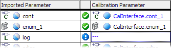

- Edit

Opens the list of available calibration parameters for selection.

- Remove (Delete)

Removes an existing mapping.

- Revert Changes

Reverts unsaved mapping changes.

- Auto-Mapping

Maps all unmapped imported parameters to calibration parameters with identical name and type.

- Export

Opens the Export Settings dialog window where you can export mappings to an *.xml or *.csv file.

- Import

Imports mappings from an *.xml or *.csv file.

# Parameter Mapping View

The Parameter Mapping view contains the following elements.

##### top bar

- information field

Shows whether parameter mapping is complete (), incomplete (), or contains invalid mappings ().

-  Update

Updates the instances of the calibration interfaces, classes and modules, i.e. imports changes in these components into the SWC.

-  Auto-Mapping

Maps all unmapped imported parameters to calibration parameters with identical name and type.

- /

Shows () or hides () the upper table.

##### upper table (hidden by default)

- Imported Parameter column

This column lists all unmapped imported parameters of scalar, enumeration array or record type from all components directly or indirectly used in the software component. The parameters are displayed as follows:

| Column 1 | Column 2 |
| --- | --- |
| imported parameters: | <parameter> |

Records that directly or indirectly (i.e. in a nested record) contain a matrix are not available for mapping.

- input field and  button above the column

You can enter a text string in the input field and then click on  to filter the list of available parameters by name. The filter is case-insensitive; it finds all parameters whose names contain the text string.

An active filter is indicated by a green overlay icon:  Click the button to remove the filter.

-  properties filter above the column

Opens the Filter Criteria dialog window, which allows filtering the list by selected properties.

An active type filter is indicated by a green overlay icon on both filter buttons: 

- Calibration Parameter column

This column lists all unmapped calibration parameters (scalar, enumeration, array and record elements of calibration interfaces; scalar, enumeration and array elements of records in calibration interfaces) that are available for mapping. The elements are displayed as follows:

| Column 1 | Column 2 |
| --- | --- |
| interface elements: | <interface>.<element> |
| elements in complex interface elements: | <interface>.<record>[.<nested record>...].<element> |

Record elements of nested records (record A contains record B, which contains record C, etc.) in calibration interfaces are not listed.

- input field,  properties filter and  button above the column

The same as in the [Imported Parameter](#Available) column.

- [context menu (upper table)](javascript:kadovTextPopup(this))<!-- kadovTextPopupInit('a1'); //-->

#####  button

Maps an imported parameter selected in the Imported Parameter column to a calibration parameter selected in the Calibration Parameter column.

##### Mapping field - lower table

- input field,  properties filter and  button above the column
- Imported Parameter column
- icon column
- Calibration Parameter column

If no mapping exists (---), the Calibration Parameter column can be used to perform mapping. A double-click in a table cell opens a list of all suitable calibration parameters.

Unsaved changed mappings are indicated by [blue font](javascript:kadovTextPopup(this))<!-- kadovTextPopupInit('a3'); //-->.

- [context menu (lower table)](javascript:kadovTextPopup(this))<!-- kadovTextPopupInit('a2'); //-->

The [Mapping](markdown/ASCMappingMenu.md) menu contains the same options as the context menu.

See also

[Accessing Calibration Parameters](markdown/ASCaccessCalibrationParameters.md)

[Export message/parameter mappings](markdown/ASC_ExportMessageParameterMappings.md)

[Import message/parameter mappings](markdown/ASC_ImportMessageParameterMappings.md)

/* Heikki Komulainen, Comet Computer GmbH 2004 */ cc_plus_pic = '&nbsp;'; cc_minus_pic = '&nbsp;'; cc_stat_pic = '&nbsp;'; gpstyle = ''; var iframes_created = 0; if (document.body && document.body.insertAdjacentHTML && document.getElementsByTagName && document.getElementById) { collect_popups(); set_poplinks_pictures(); if (iframes_created) { document.write(gpstyle); document.write('
<nobr><a id="einauslink" style="position:absolute;top:expression(document.body.scrollTop + this.offsetHeight - this.offsetHeight);left:expression(document.body.offsetWidth - (this.offsetWidth + 28));background:white;padding:5px" href="javascript:show_all_poptext()">Show all hidden text</a></nobr>
'); } } function collect_popups() { bsscpopups = new Array(); for (x = 0; x < document.links.length; x++) { if (document.links[x].href.indexOf("BSSCPopup")>-1) { seekmatch = /BSSCPopup.'[^'](markdown/+)'/; poplink = seekmatch.exec(document.links[x].href); poplink = "" + poplink; poplink = poplink.substring(poplink.indexOf("'")+1, poplink.lastIndexOf("'")); ifid = "CCGENIFRAMEID" + x; new_iframe = '<iframe id="' + ifid + '"src="' + poplink + '" onload="get_text(\'' + ifid + '\')" width="0" height="0" frameborder=0></iframe>'; document.links[x].parentNode.insertAdjacentHTML("afterEnd", new_iframe); gpid = "CCID_" + ifid; document.links[x].href = "javascript:expand_poptext('" + gpid + "')"; cc_plus = '' + cc_plus_pic + ''; document.links[x].insertAdjacentHTML("afterBegin", cc_plus); iframes_created = 1; } } }// end function function get_text(ifr_id) { frpars = document.frames[ifr_id].document.getElementsByTagName("body"); popbody = frpars[0].innerHTML; gpid = "CCID_" + ifr_id; if (!document.getElementById(gpid)) { //avoiding doubles document.getElementById(ifr_id).insertAdjacentHTML("afterEnd", '
'+popbody+'
'); } }//end function function expand_poptext(x_frame_id) { if (!document.getElementById(x_frame_id)) return; if (document.getElementById(x_frame_id).className == "CCGENPOPTEXTH") { document.getElementById(x_frame_id).className = "CCGENPOPTEXTV"; document.getElementById(x_frame_id).style.visibility = "visible"; if (document.getElementById("CCPMB_" + x_frame_id )) { document.getElementById("CCPMB_" + x_frame_id ).innerHTML = cc_minus_pic; } } else { document.getElementById(x_frame_id).className = "CCGENPOPTEXTH"; document.getElementById(x_frame_id).style.visibility = "hidden"; if (document.getElementById("CCPMB_" + x_frame_id )) { document.getElementById("CCPMB_" + x_frame_id ).innerHTML = cc_plus_pic; } } }// end function function show_all_poptext() { var pulldowntxt = document.getElementsByTagName("div"); for (b = 0; b < pulldowntxt.length; b++) { if (pulldowntxt[b].className == "droptext") { pulldowntxt[b].style.display=""; } } var gptxt = document.getElementsByTagName("div"); for (z = 0; z < gptxt.length; z++) { if (gptxt[z].className == "CCGENPOPTEXTH") { gptxt[z].className = "CCGENPOPTEXTV"; gptxt[z].style.visibility = "visible"; if (document.getElementById("CCPMB_" + gptxt[z].id )) { document.getElementById("CCPMB_" + gptxt[z].id ).innerHTML = cc_minus_pic; } } } var dxpoplinks = document.getElementsByTagName("a"); if (dxpoplinks) { for (pxl = 0; pxl < dxpoplinks.length; pxl++) { if (dxpoplinks[pxl].href.indexOf("kadovTextPopup")>-1) { if (document.getElementById("CCPMB_" + dxpoplinks[pxl].id)) { document.getElementById("CCPMB_" + dxpoplinks[pxl].id).innerHTML = cc_stat_pic; dxpoplinks[pxl].symbol = "minus"; } } } } document.getElementById('einauslink').innerText = 'Hide all hideable text'; document.getElementById('einauslink').href = "javascript:self.location.reload()"; self.focus(); }// end function function eat_click() { return false; }// end function function set_poplinks_pictures() { var dpoplinks = document.getElementsByTagName("a"); if (dpoplinks) { for (pl = 0; pl < dpoplinks.length; pl++) { if (dpoplinks[pl].href.indexOf("kadovTextPopup")>-1) { cc_plus = '' + cc_stat_pic + ''; //dpoplinks[pl].onmouseup = plusminuspoplink; dpoplinks[pl].insertAdjacentHTML("afterBegin", cc_plus); dpoplinks[pl].symbol = "plus"; } } } }// end function function plusminuspoplink() { if (document.getElementById("CCPMB_" + this.id)) { if (this.symbol == "plus") { document.getElementById("CCPMB_" + this.id).innerHTML = cc_minus_pic; this.symbol = "minus"; } else { document.getElementById("CCPMB_" + this.id).innerHTML = cc_plus_pic; this.symbol = "plus"; } } return true; }

---

## Message Mapping View

_Source: `markdown/ASC_MessageMappingView.md`_

# Message Mapping View

The Message Mapping view contains two tabs:

- [Internal Access](markdown/ASC_MessageMappingView_InternalAccess.md) tab
- [External Access](markdown/ASC_MessageMappingView_ExternalAccess.md) tab

See also

[Accessing ASCET Messages](markdown/asc_accessmessages.md)

[Exporting Message/Parameter Mappings](markdown/ASC_ExportMessageParameterMappings.md)

[Importing Message/Parameter Mappings](markdown/ASC_ImportMessageParameterMappings.md)

---

## Internal Access

_Source: `markdown/ASC_MessageMappingView_InternalAccess.md`_

- Update

Updates the instances of the SenderReceiver interfaces and modules, i.e. imports changes in these components into the SWC.

- Auto-Mapping

Maps all unmapped messages to interrunnable variables or SenderReceiver interface ports with identical name and type.

- Edit

Opens the list of available interrunnable variables for selection.

- Remove (Delete)

Removes an existing mapping.

- Revert Changes

Reverts unsaved mapping changes.

- Toggle Pages (Ctrl + Shift +t)

Switches between the Internal Access and External Access tabs.

- Create Interrunnable

Creates a new interrunnable variable for a selected message, and maps it.

- Auto-Mapping

Maps all unmapped messages to interrunnable variables with identical name and type.

- Export

Opens the Export Settings dialog window where you can export mappings to an *.xml or *.csv file.

- Import

Imports mappings from an *.xml or *.csv file.

# Message Mapping View - Internal Access

This part of the Message Mapping view is used to map ASCET messages to AUTOSAR interrunnable variables.

##### top bar

- information field

Shows whether message mapping is complete (), incomplete (), or contains invalid mappings ().

-  Update

Updates the instances of the SenderReceiver interfaces and modules, i.e. imports changes in these components into the SWC.

-  Auto-Mapping

This button maps all unmapped messages to scalar interrunnable variables or elements of Record interrunnable variables with identical name and type.

- /

Shows () or hides () the upper table.

##### upper table (hidden by default)

- Messages column

This column lists all unmapped messages from all modules directly or indirectly used in the software component. The messages are displayed as follows:

| Column 1 | Column 2 |
| --- | --- |
| exported or imported messages: | <message> |
| local messages: | self.<module>[.<nested module>...].<message> |

- input field and  button above the column

You can enter a text string in the input field and then click on  to filter the list of available messages by name. The filter is case-insensitive; it finds all messages whose names contain the text string.

-  properties filter above the column

Opens the Filter Criteria dialog window, which allows filtering the list by selected properties.

An active type filter is indicated by a green overlay icon on both filter buttons: 

An active filter is indicated by a green overlay icon:  Click the button to remove the filter.

- Variables column

This column lists all unmapped elements (scalar interrunnable variables, data elements of complex interrunnable variables, data elements of records in SenderReceiver or NVData interfaces) that are available for mapping. The elements are displayed as follows:

| Column 1 | Column 2 |
| --- | --- |
| interrunnable variables: | <element> |
| elements in complex interrunnable variables: | <record>[.<nested record>...].<element> |

Complex elements of nested records (record A contains record B, which contains record C, etc.) used as interrunnable variables are not listed.

- input field,  properties filter and  button above the column

The same as in the [Messages](#Available) column.

- [context menu (upper table)](javascript:kadovTextPopup(this))<!-- kadovTextPopupInit('a1'); //-->

#####  button

Maps a message selected in the Message column to an interrunnable variable selected in the Variables column.

##### Mapping field - lower table

- input field,  properties filter and  button

The same as in the [Messages](#Available) column.

- Messages column
- icon column
- Variables column

If no mapping exists (---), the Messages column can be used to perform mapping. A double-click in a table cell opens a list of all suitable calibration parameters.

Unsaved changed mappings are indicated by [blue font](javascript:kadovTextPopup(this))<!-- kadovTextPopupInit('a3'); //-->.

- [context menu (lower table)](javascript:kadovTextPopup(this))<!-- kadovTextPopupInit('a2'); //-->

The [Mapping](markdown/ASCMappingMenu.md) menu contains the same options as the context menu in the lower table.

You can

[Access ASCET messages](markdown/asc_accessmessages.md)

[Export message/parameter mappings](markdown/ASC_ExportMessageParameterMappings.md)

[Import message/parameter mappings](markdown/ASC_ImportMessageParameterMappings.md)

See also

[Filter Criteria Dialog Window](markdown/SWC_FilterCriteria_Window.md)

[Message Mapping View: External Access](markdown/ASC_MessageMappingView_ExternalAccess.md)

/* Heikki Komulainen, Comet Computer GmbH 2004 */ cc_plus_pic = '&nbsp;'; cc_minus_pic = '&nbsp;'; cc_stat_pic = '&nbsp;'; gpstyle = ''; var iframes_created = 0; if (document.body && document.body.insertAdjacentHTML && document.getElementsByTagName && document.getElementById) { collect_popups(); set_poplinks_pictures(); if (iframes_created) { document.write(gpstyle); document.write('
<nobr><a id="einauslink" style="position:absolute;top:expression(document.body.scrollTop + this.offsetHeight - this.offsetHeight);left:expression(document.body.offsetWidth - (this.offsetWidth + 28));background:white;padding:5px" href="javascript:show_all_poptext()">Show all hidden text</a></nobr>
'); } } function collect_popups() { bsscpopups = new Array(); for (x = 0; x < document.links.length; x++) { if (document.links[x].href.indexOf("BSSCPopup")>-1) { seekmatch = /BSSCPopup.'[^'](markdown/+)'/; poplink = seekmatch.exec(document.links[x].href); poplink = "" + poplink; poplink = poplink.substring(poplink.indexOf("'")+1, poplink.lastIndexOf("'")); ifid = "CCGENIFRAMEID" + x; new_iframe = '<iframe id="' + ifid + '"src="' + poplink + '" onload="get_text(\'' + ifid + '\')" width="0" height="0" frameborder=0></iframe>'; document.links[x].parentNode.insertAdjacentHTML("afterEnd", new_iframe); gpid = "CCID_" + ifid; document.links[x].href = "javascript:expand_poptext('" + gpid + "')"; cc_plus = '' + cc_plus_pic + ''; document.links[x].insertAdjacentHTML("afterBegin", cc_plus); iframes_created = 1; } } }// end function function get_text(ifr_id) { frpars = document.frames[ifr_id].document.getElementsByTagName("body"); popbody = frpars[0].innerHTML; gpid = "CCID_" + ifr_id; if (!document.getElementById(gpid)) { //avoiding doubles document.getElementById(ifr_id).insertAdjacentHTML("afterEnd", '
'+popbody+'
'); } }//end function function expand_poptext(x_frame_id) { if (!document.getElementById(x_frame_id)) return; if (document.getElementById(x_frame_id).className == "CCGENPOPTEXTH") { document.getElementById(x_frame_id).className = "CCGENPOPTEXTV"; document.getElementById(x_frame_id).style.visibility = "visible"; if (document.getElementById("CCPMB_" + x_frame_id )) { document.getElementById("CCPMB_" + x_frame_id ).innerHTML = cc_minus_pic; } } else { document.getElementById(x_frame_id).className = "CCGENPOPTEXTH"; document.getElementById(x_frame_id).style.visibility = "hidden"; if (document.getElementById("CCPMB_" + x_frame_id )) { document.getElementById("CCPMB_" + x_frame_id ).innerHTML = cc_plus_pic; } } }// end function function show_all_poptext() { var pulldowntxt = document.getElementsByTagName("div"); for (b = 0; b < pulldowntxt.length; b++) { if (pulldowntxt[b].className == "droptext") { pulldowntxt[b].style.display=""; } } var gptxt = document.getElementsByTagName("div"); for (z = 0; z < gptxt.length; z++) { if (gptxt[z].className == "CCGENPOPTEXTH") { gptxt[z].className = "CCGENPOPTEXTV"; gptxt[z].style.visibility = "visible"; if (document.getElementById("CCPMB_" + gptxt[z].id )) { document.getElementById("CCPMB_" + gptxt[z].id ).innerHTML = cc_minus_pic; } } } var dxpoplinks = document.getElementsByTagName("a"); if (dxpoplinks) { for (pxl = 0; pxl < dxpoplinks.length; pxl++) { if (dxpoplinks[pxl].href.indexOf("kadovTextPopup")>-1) { if (document.getElementById("CCPMB_" + dxpoplinks[pxl].id)) { document.getElementById("CCPMB_" + dxpoplinks[pxl].id).innerHTML = cc_stat_pic; dxpoplinks[pxl].symbol = "minus"; } } } } document.getElementById('einauslink').innerText = 'Hide all hideable text'; document.getElementById('einauslink').href = "javascript:self.location.reload()"; self.focus(); }// end function function eat_click() { return false; }// end function function set_poplinks_pictures() { var dpoplinks = document.getElementsByTagName("a"); if (dpoplinks) { for (pl = 0; pl < dpoplinks.length; pl++) { if (dpoplinks[pl].href.indexOf("kadovTextPopup")>-1) { cc_plus = '' + cc_stat_pic + ''; //dpoplinks[pl].onmouseup = plusminuspoplink; dpoplinks[pl].insertAdjacentHTML("afterBegin", cc_plus); dpoplinks[pl].symbol = "plus"; } } } }// end function function plusminuspoplink() { if (document.getElementById("CCPMB_" + this.id)) { if (this.symbol == "plus") { document.getElementById("CCPMB_" + this.id).innerHTML = cc_minus_pic; this.symbol = "minus"; } else { document.getElementById("CCPMB_" + this.id).innerHTML = cc_plus_pic; this.symbol = "plus"; } } return true; }

---

## External Access

_Source: `markdown/ASC_MessageMappingView_ExternalAccess.md`_

- Update

Updates the instances of the SenderReceiver interfaces and modules, i.e. imports changes in these components into the SWC.

- Auto-Mapping

Maps all unmapped messages to interrunnable variables or SenderReceiver interface ports with identical name and type.

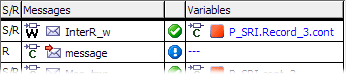

- Edit

Opens the list of available interrunnable variables for selection.

- Remove (Delete)

Removes an existing mapping.

- Revert Changes

Reverts unsaved mapping changes.

- Toggle Pages (Ctrl + Shift +t)

Switches between the Internal Access and External Access tabs.

- Create Interrunnable

Not available in the External Access tab.

- Auto-Mapping

Maps all unmapped messages to interrunnable variables with identical name and type.

- Export

Opens the Export Settings dialog window where you can export mappings to an *.xml or *.csv file.

- Import

Imports mappings from an *.xml or *.csv file.

# Message Mapping View - External Access

This part of the Message Mapping view is used to map ASCET messages to ports of SenderReceiver/NVData interfaces.

##### top bar

- information field

Shows whether message mapping is complete (), incomplete (), or contains invalid mappings ().

-  Update

Updates the instances of the SenderReceiver interfaces and modules, i.e. imports changes in these components into the SWC.

-  Auto-Mapping

This button maps all unmapped messages to interrunnable variables with identical name and type.

- /

Shows () or hides () the upper table.

##### upper table (hidden by default)

- Messages column

This column lists all messages that are either unmapped or can be multiply mapped from all modules directly or indirectly used in the software component. The messages are displayed as follows:

| Column 1 | Column 2 |
| --- | --- |
| exported or imported messages: | <message> |
| local messages: | self.<module>[.<nested module>...].<message> |

- input field and  button above the column

You can enter a text string in the input field and then click on  to filter the list of available messages by name. The filter is case-insensitive; it finds all messages whose names contain the text string.

-  properties filter above the column

Opens the Filter Criteria dialog window, which allows filtering the list by scope, internal access, and type.

An active type filter is indicated by a green overlay icon on both filter buttons: 

An active filter is indicated by a green overlay icon:  Click the button to remove the filter.

- Variables column

This column lists all unmapped ports, including data elements of records, of SenderReceiver or NVData interfaces. The elements are displayed as follows:

| Column 1 | Column 2 |
| --- | --- |
| interface elements: | <interface>.<element> |
| elements in complex interface elements: | <interface>.<record>[.<nested record>...].<element> |

Complex elements of nested records (record A contains record B, which contains record C, etc.) used as SenderReceiver/NVData interface elements are not listed.

- input field,  properties filter and  button above the column

The same as in the [Messages](#Available1) column.

- [context menu (upper table)](javascript:kadovTextPopup(this))<!-- kadovTextPopupInit('a1'); //-->

#####  button

Maps a message selected in the Message column to a port selected in the Variables column.

##### Mapping field - lower table

- input field,  properties filter and  button

The same as in the [Messages](#Available1) column.

- S/R column

Shows the message type (see [Message Mapping](markdown/ASC_MessageMapping.md) for definitions): S - pure send message, R - pure receive message, S/R - other messages.

- Messages column
- icon column
- Variables column

If no mapping exists (---), the Variables column can be used to perform mapping. A double-click in a table cell opens a list of all suitable calibration parameters.

Unsaved changed mappings are indicated by [blue font](javascript:kadovTextPopup(this))<!-- kadovTextPopupInit('a2'); //-->.

- [context menu (lower table)](javascript:kadovTextPopup(this))<!-- kadovTextPopupInit('a3'); //-->

The [Mapping](markdown/ASCMappingMenu.md) menu contains the same options as the context menu in the lower table.

You can

[Access ASCET messages](markdown/asc_accessmessages.md)

[Export message/parameter mappings](markdown/ASC_ExportMessageParameterMappings.md)

[Import message/parameter mappings](markdown/ASC_ImportMessageParameterMappings.md)

See also

[Message Mapping View: External Access](markdown/ASC_MessageMappingView_ExternalAccess.md)

[Message Mapping](markdown/ASC_MessageMapping.md)

/* Heikki Komulainen, Comet Computer GmbH 2004 */ cc_plus_pic = '&nbsp;'; cc_minus_pic = '&nbsp;'; cc_stat_pic = '&nbsp;'; gpstyle = ''; var iframes_created = 0; if (document.body && document.body.insertAdjacentHTML && document.getElementsByTagName && document.getElementById) { collect_popups(); set_poplinks_pictures(); if (iframes_created) { document.write(gpstyle); document.write('
<nobr><a id="einauslink" style="position:absolute;top:expression(document.body.scrollTop + this.offsetHeight - this.offsetHeight);left:expression(document.body.offsetWidth - (this.offsetWidth + 28));background:white;padding:5px" href="javascript:show_all_poptext()">Show all hidden text</a></nobr>
'); } } function collect_popups() { bsscpopups = new Array(); for (x = 0; x < document.links.length; x++) { if (document.links[x].href.indexOf("BSSCPopup")>-1) { seekmatch = /BSSCPopup.'[^'](markdown/+)'/; poplink = seekmatch.exec(document.links[x].href); poplink = "" + poplink; poplink = poplink.substring(poplink.indexOf("'")+1, poplink.lastIndexOf("'")); ifid = "CCGENIFRAMEID" + x; new_iframe = '<iframe id="' + ifid + '"src="' + poplink + '" onload="get_text(\'' + ifid + '\')" width="0" height="0" frameborder=0></iframe>'; document.links[x].parentNode.insertAdjacentHTML("afterEnd", new_iframe); gpid = "CCID_" + ifid; document.links[x].href = "javascript:expand_poptext('" + gpid + "')"; cc_plus = '' + cc_plus_pic + ''; document.links[x].insertAdjacentHTML("afterBegin", cc_plus); iframes_created = 1; } } }// end function function get_text(ifr_id) { frpars = document.frames[ifr_id].document.getElementsByTagName("body"); popbody = frpars[0].innerHTML; gpid = "CCID_" + ifr_id; if (!document.getElementById(gpid)) { //avoiding doubles document.getElementById(ifr_id).insertAdjacentHTML("afterEnd", '
'+popbody+'
'); } }//end function function expand_poptext(x_frame_id) { if (!document.getElementById(x_frame_id)) return; if (document.getElementById(x_frame_id).className == "CCGENPOPTEXTH") { document.getElementById(x_frame_id).className = "CCGENPOPTEXTV"; document.getElementById(x_frame_id).style.visibility = "visible"; if (document.getElementById("CCPMB_" + x_frame_id )) { document.getElementById("CCPMB_" + x_frame_id ).innerHTML = cc_minus_pic; } } else { document.getElementById(x_frame_id).className = "CCGENPOPTEXTH"; document.getElementById(x_frame_id).style.visibility = "hidden"; if (document.getElementById("CCPMB_" + x_frame_id )) { document.getElementById("CCPMB_" + x_frame_id ).innerHTML = cc_plus_pic; } } }// end function function show_all_poptext() { var pulldowntxt = document.getElementsByTagName("div"); for (b = 0; b < pulldowntxt.length; b++) { if (pulldowntxt[b].className == "droptext") { pulldowntxt[b].style.display=""; } } var gptxt = document.getElementsByTagName("div"); for (z = 0; z < gptxt.length; z++) { if (gptxt[z].className == "CCGENPOPTEXTH") { gptxt[z].className = "CCGENPOPTEXTV"; gptxt[z].style.visibility = "visible"; if (document.getElementById("CCPMB_" + gptxt[z].id )) { document.getElementById("CCPMB_" + gptxt[z].id ).innerHTML = cc_minus_pic; } } } var dxpoplinks = document.getElementsByTagName("a"); if (dxpoplinks) { for (pxl = 0; pxl < dxpoplinks.length; pxl++) { if (dxpoplinks[pxl].href.indexOf("kadovTextPopup")>-1) { if (document.getElementById("CCPMB_" + dxpoplinks[pxl].id)) { document.getElementById("CCPMB_" + dxpoplinks[pxl].id).innerHTML = cc_stat_pic; dxpoplinks[pxl].symbol = "minus"; } } } } document.getElementById('einauslink').innerText = 'Hide all hideable text'; document.getElementById('einauslink').href = "javascript:self.location.reload()"; self.focus(); }// end function function eat_click() { return false; }// end function function set_poplinks_pictures() { var dpoplinks = document.getElementsByTagName("a"); if (dpoplinks) { for (pl = 0; pl < dpoplinks.length; pl++) { if (dpoplinks[pl].href.indexOf("kadovTextPopup")>-1) { cc_plus = '' + cc_stat_pic + ''; //dpoplinks[pl].onmouseup = plusminuspoplink; dpoplinks[pl].insertAdjacentHTML("afterBegin", cc_plus); dpoplinks[pl].symbol = "plus"; } } } }// end function function plusminuspoplink() { if (document.getElementById("CCPMB_" + this.id)) { if (this.symbol == "plus") { document.getElementById("CCPMB_" + this.id).innerHTML = cc_minus_pic; this.symbol = "minus"; } else { document.getElementById("CCPMB_" + this.id).innerHTML = cc_plus_pic; this.symbol = "plus"; } } return true; }

---

## Filter Criteria Dialog Window

_Source: `markdown/SWC_FilterCriteria_Window.md`_

- Type combo box

Select the [data type](IntroductionEnglishUS.chm::/INT_scalar_summary.htm) you want to show in the table. In addition to the types present in the list, an entry <all> is available.

- State combo box

Select the mapping state you want to show in the table. In addition to the states present in the list, an entry <all> is available.

- Type combo box

Select the [data type](IntroductionEnglishUS.chm::/INT_scalar_summary.htm) you want to show in the table. In addition to the types present in the list, an entry <all> is available.

- Scope combo box

Select the [scope](IntroductionEnglishUS.chm::/INT_the_scope_of_elements.htm) you want to show in the table. In addition to the scopes present in the list, an entry <all> is available.

- Internal Access combo box

Select the message type (Send, Receive, Send Receive) you want to show in the table. In addition to the message types present in the list, an entry <all> is available.

- Type combo box

Select the [data type](IntroductionEnglishUS.chm::/INT_scalar_summary.htm) you want to show in the table. In addition to the types present in the list, an entry <all> is available.

- Internal Access combo box

In the Internal Access tab, this combo box provides a filter for the communication mode of the [interrunnable variables](markdown/ASC_InterrunnableVariables.md). In the External Access tab, this compo box provides a filter for the port class (see [Ports and Interfaces](markdown/ASCportsInterfaces.md)) of the SenderReceiver/NVData interface ports.

Select the internal access you want to show in the table. In addition to the values present in the list, an entry <all> is available.

- Type combo box

Select the [data type](IntroductionEnglishUS.chm::/INT_scalar_summary.htm) you want to show in the table. In addition to the types present in the list, an entry <all> is available.

- State combo box

Select the mapping state you want to show in the table. In addition to the states present in the list, an entry <all> is available.

- Scope combo box

Select the [scope](IntroductionEnglishUS.chm::/INT_the_scope_of_elements.htm) you want to show in the table. In addition to the scopes present in the list, an entry <all> is available.

- Internal Access combo box

Select the message type (Send, Receive, Send Receive) you want to show in the table. In addition to the message types present in the list, an entry <all> is available.

- Type combo box

Select the [data type](IntroductionEnglishUS.chm::/INT_scalar_summary.htm) you want to show in the table. In addition to the types present in the list, an entry <all> is available.

# Filter Criteria Dialog Window

This window can be opened with the  buttons in the Parameter Mapping or Message Mapping views of the SWC editor.

The Filter Criteria dialog window allows to filter the lists in the [Parameter Mapping](#Parameter) or [Message Mapping](#Message) view. The filter criteria differ for each list.

##### Parameter Mapping view

[Imported Parameter column or Calibration Parameter column](javascript:kadovTextPopup(this))<!-- kadovTextPopupInit('a1'); //--> (upper table)

[Mapping field](javascript:kadovTextPopup(this))<!-- kadovTextPopupInit('a2'); //--> (lower table)

##### Message Mapping view

[Messages column](javascript:kadovTextPopup(this))<!-- kadovTextPopupInit('a3'); //--> (upper table)

[Variables column](javascript:kadovTextPopup(this))<!-- kadovTextPopupInit('a4'); //--> (upper table)

[Mapping field](javascript:kadovTextPopup(this))<!-- kadovTextPopupInit('a5'); //--> (lower table)

##### all

-  Clear All
-  OK
-  Cancel

Closes the window without activating the filter.

See also

[Accessing Calibration Parameters](markdown/ASCaccessCalibrationParameters.md)

[Parameter Mapping View](markdown/ASCParameterMappingView.md)

[Accessing ASCET Messages](markdown/asc_accessmessages.md)

[Message Mapping View](markdown/ASC_MessageMappingView.md)

[The Scope of Elements](IntroductionEnglishUS.chm::/INT_the_scope_of_elements.htm)

[Scalar Types - Summary](IntroductionEnglishUS.chm::/INT_scalar_summary.htm)

/* Heikki Komulainen, Comet Computer GmbH 2004 */ cc_plus_pic = '&nbsp;'; cc_minus_pic = '&nbsp;'; cc_stat_pic = '&nbsp;'; gpstyle = ''; var iframes_created = 0; if (document.body && document.body.insertAdjacentHTML && document.getElementsByTagName && document.getElementById) { collect_popups(); set_poplinks_pictures(); if (iframes_created) { document.write(gpstyle); document.write('
<nobr><a id="einauslink" style="position:absolute;top:expression(document.body.scrollTop + this.offsetHeight - this.offsetHeight);left:expression(document.body.offsetWidth - (this.offsetWidth + 28));background:white;padding:5px" href="javascript:show_all_poptext()">Show all hidden text</a></nobr>
'); } } function collect_popups() { bsscpopups = new Array(); for (x = 0; x < document.links.length; x++) { if (document.links[x].href.indexOf("BSSCPopup")>-1) { seekmatch = /BSSCPopup.'[^'](markdown/+)'/; poplink = seekmatch.exec(document.links[x].href); poplink = "" + poplink; poplink = poplink.substring(poplink.indexOf("'")+1, poplink.lastIndexOf("'")); ifid = "CCGENIFRAMEID" + x; new_iframe = '<iframe id="' + ifid + '"src="' + poplink + '" onload="get_text(\'' + ifid + '\')" width="0" height="0" frameborder=0></iframe>'; document.links[x].parentNode.insertAdjacentHTML("afterEnd", new_iframe); gpid = "CCID_" + ifid; document.links[x].href = "javascript:expand_poptext('" + gpid + "')"; cc_plus = '' + cc_plus_pic + ''; document.links[x].insertAdjacentHTML("afterBegin", cc_plus); iframes_created = 1; } } }// end function function get_text(ifr_id) { frpars = document.frames[ifr_id].document.getElementsByTagName("body"); popbody = frpars[0].innerHTML; gpid = "CCID_" + ifr_id; if (!document.getElementById(gpid)) { //avoiding doubles document.getElementById(ifr_id).insertAdjacentHTML("afterEnd", '
'+popbody+'
'); } }//end function function expand_poptext(x_frame_id) { if (!document.getElementById(x_frame_id)) return; if (document.getElementById(x_frame_id).className == "CCGENPOPTEXTH") { document.getElementById(x_frame_id).className = "CCGENPOPTEXTV"; document.getElementById(x_frame_id).style.visibility = "visible"; if (document.getElementById("CCPMB_" + x_frame_id )) { document.getElementById("CCPMB_" + x_frame_id ).innerHTML = cc_minus_pic; } } else { document.getElementById(x_frame_id).className = "CCGENPOPTEXTH"; document.getElementById(x_frame_id).style.visibility = "hidden"; if (document.getElementById("CCPMB_" + x_frame_id )) { document.getElementById("CCPMB_" + x_frame_id ).innerHTML = cc_plus_pic; } } }// end function function show_all_poptext() { var pulldowntxt = document.getElementsByTagName("div"); for (b = 0; b < pulldowntxt.length; b++) { if (pulldowntxt[b].className == "droptext") { pulldowntxt[b].style.display=""; } } var gptxt = document.getElementsByTagName("div"); for (z = 0; z < gptxt.length; z++) { if (gptxt[z].className == "CCGENPOPTEXTH") { gptxt[z].className = "CCGENPOPTEXTV"; gptxt[z].style.visibility = "visible"; if (document.getElementById("CCPMB_" + gptxt[z].id )) { document.getElementById("CCPMB_" + gptxt[z].id ).innerHTML = cc_minus_pic; } } } var dxpoplinks = document.getElementsByTagName("a"); if (dxpoplinks) { for (pxl = 0; pxl < dxpoplinks.length; pxl++) { if (dxpoplinks[pxl].href.indexOf("kadovTextPopup")>-1) { if (document.getElementById("CCPMB_" + dxpoplinks[pxl].id)) { document.getElementById("CCPMB_" + dxpoplinks[pxl].id).innerHTML = cc_stat_pic; dxpoplinks[pxl].symbol = "minus"; } } } } document.getElementById('einauslink').innerText = 'Hide all hideable text'; document.getElementById('einauslink').href = "javascript:self.location.reload()"; self.focus(); }// end function function eat_click() { return false; }// end function function set_poplinks_pictures() { var dpoplinks = document.getElementsByTagName("a"); if (dpoplinks) { for (pl = 0; pl < dpoplinks.length; pl++) { if (dpoplinks[pl].href.indexOf("kadovTextPopup")>-1) { cc_plus = '' + cc_stat_pic + ''; //dpoplinks[pl].onmouseup = plusminuspoplink; dpoplinks[pl].insertAdjacentHTML("afterBegin", cc_plus); dpoplinks[pl].symbol = "plus"; } } } }// end function function plusminuspoplink() { if (document.getElementById("CCPMB_" + this.id)) { if (this.symbol == "plus") { document.getElementById("CCPMB_" + this.id).innerHTML = cc_minus_pic; this.symbol = "minus"; } else { document.getElementById("CCPMB_" + this.id).innerHTML = cc_plus_pic; this.symbol = "plus"; } } return true; }

---

## Export Selections Dialog Window

_Source: `markdown/ASC_ExportSelections_Window.md`_

# Export Selections Dialog Window

This window can be opened as follows: a) with the File menu, Export submenu, Mapping menu option b) with the Export option in the Mapping menu or in the context menu of the Parameter Mapping or Message Mapping view.

The Export Selection dialog window allows to refine the export of message/parameter mappings into an *.xml or *.csv file. It contains the following elements:

##### Mapping Types area

- Message Mapping Internal

If activated, all mappings in the Internal Access tab are exported.

- Message Mapping External

If activated, all mappings in the External Access tab are exported.

- Parameter Mapping

If activated, all mappings in the Parameter Mapping view are exported.

##### Only Selected Elements in Mapping Table

Only mappings selected in the Mapping field of the current mapping view are exported.

This option is preselected when you selected one or more mappings. It is not available when no mappings are selected.

Either Only Selected Elements in Mapping Table or one or more options in the Mapping Types area can be activated.

 OK

Closes the Export Selection dialog window and accepts the settings. The export is continued..

 Close

Closes the Export Selection dialog window without accepting the settings. The export is aborted.

See also

[Exporting Message/Parameter Mappings](markdown/ASC_ExportMessageParameterMappings.md)

---

## Tree Pane

_Source: `markdown/ASCcomponentPane.md`_

# Tree Pane

The Tree pane contains the following tabs and filter functions:

##### Outline

In this tab all elements of the component self:<component name> are listed, as well as all diagrams, runnables and methods.

For a better handling of these elements you can use several filters and a search function:

| Column 1 | Column 2 |
| --- | --- |
|  | Opens the Options dialog window, reduced to the settings of the Filter. |
|  | Changes the criteria of sort. |
|  | Expands the Outline tree. |
|  | Collapses the Outline tree. |
|  | Runs a search in the Outline tree for the admitted letters. |

##### Navigation

In this tab, all graphical elements selected in the Navigation Tree node of the [ASCET options dialog](ComponentManagerEnglishUS.chm::/cm_user_interface_of_the_ascet_options_window.htm) are listed in a tree view named Graphic Blocks. Elements with multiple occurrences in the diagram are listed several times. A click on a node in the Graphic Blocks tree highlights the occurrence of the element.

Elements used in a method or process are displayed below the Sequence Calls tree, as subnodes of the method or process. The whole hierarchy of block-local sequence calls in a statement block is shown, as well as the outgoing control flow of control-flow elements. Some examples are given [here](markdown/asC_exampleselementsnavigationtab.md).

A click on a node in the Sequence Calls tree highlights the occurrence of the element.

Note: If you delete graphic blocks from the Specification view, they still occur in this navigation tree.

| Column 1 | Column 2 |
| --- | --- |
|  | Opens the Options dialog window, reduced to the settings of the Filter. |
|  | Expands the Navigation-tree. |
|  | Collapses the Navigation-tree. |
|  | Runs a search in the Navigation tab for the admitted letters. |

##### Database / Workspace

The folders and items contained in the current database/workspace are displayed here. The database/workspace name is the root of the tree structure. Each database/workspace contains one or more folders, which in turn contain other folders and items.

| Column 1 | Column 2 |
| --- | --- |
|  | Expands the Database/Workspace tree. |
|  | Collapses the Database/Workspace tree. |
|  | Runs a search in the Database/Workspace tab for the admitted letters. |

See also

[Context Menu Tree Pane](markdown/ASCcontextmenusPanes.md)

[Filtering the Tree Pane](markdown/ascfiltercomponentpane.md)

[Searching the Tree Pane](IntroductionEnglishUS.chm::/INT_SearchTreePane.htm)

[ASCET Options Dialog](ComponentManagerEnglishUS.chm::/cm_user_interface_of_the_ascet_options_window.htm)

[Examples: Elements in Navigation Tab](markdown/asC_exampleselementsnavigationtab.md)

---

## Context Menus Tree Pane

_Source: `markdown/ASCcontextmenusPanes.md`_

# Context Menus Tree Pane

The following context menus are available in the Tree pane:

- [Context Menu Components and Elements](markdown/ASCcontextMenuCPcomponentsAndElements.md)
- [Context Menu Diagram, Method or Runnable](markdown/ASCcontextMenuDiagramMethodOrRunnable.md)
- [Context Menu Hierarchies and Statement Blocks](BlockDiagramEditorEnglishUS.chm::/BDE_ContextMenu_Hierarchies_StatementBlocks.htm)

---

## Palettes

_Source: `markdown/ASCPalettes.md`_

# Palettes

The Palette pane contains three palettes :

- [Elements Palette](markdown/ASCelementsPalette.md)
- [Basic Blocks Palette](markdown/ASCbasicBlocksPalette.md)
- [Library Palette](markdown/ASClibraryPalette.md)

---

## Elements Palette

_Source: `markdown/ASCelementsPalette.md`_

# Elements Palette

The Elements palette contains following functions:

<table style="x-cell-content-align: Top;
				border-left-style: Outset;
				border-top-style: Outset;
				border-right-style: Outset;
				border-bottom-style: Outset;
				border-left-width: 1px;
				border-right-width: 1px;
				border-top-width: 1px;
				border-bottom-width: 1px;
				margin-top: 6px;" x-use-null-cells="">
<col/>
<col style="width: 150px;"/>
<col/>
<tr class="hcp1" valign="top">
<td class="hcp2">

</td>
<td class="hcp2" style="width:150px;" width="150px">

Logic Variable
</td>
<td class="hcp2" colspan="1" rowspan="10">

The Variable and Parameter buttons can be used to create elements of type 
 logic, limitInt, wrapInt, udisc, sdisc, cont, or enumeration.

By default, the Limited Integer * 
 and Wrap-Around Integer * buttons are displayed. 
 To display the Signed Discrete * and Unsigned 
 Discrete * buttons instead, the <a href="ComponentManagerEnglishUS.chm::/cm_options_for_editors.htm">editor 
 option</a> Use signed/unsigned discrete types must 
 be activated.

See also <a href="markdown/ascbasicelement.md">Creating a 
 Basic Element</a> and <a href="markdown/ascinsertenumeration.md">Inserting an 
 Enumeration</a>.
</td></tr>
<tr class="hcp1" valign="top">
<td class="hcp2">

 ()
</td>
<td class="hcp2" style="width:150px;" width="150px">

Limited Integer Variable  
(Signed Discrete Variable)
</td>
</tr>
<tr class="hcp1" valign="top">
<td class="hcp2">

 ()
</td>
<td class="hcp2" style="width:150px;" width="150px">

Wrap-Around Integer Variable  
(Unsigned Discrete Variable)
</td>
</tr>
<tr class="hcp1" valign="top">
<td class="hcp2">

</td>
<td class="hcp2" style="width:150px;" width="150px">

Continuous Variable
</td>
</tr>
<tr class="hcp1" valign="top">
<td class="hcp2">

</td>
<td class="hcp2" style="width:150px;" width="150px">

Enumeration Variable
</td>
</tr>
<tr class="hcp1" valign="top">
<td class="hcp2">

</td>
<td class="hcp2" style="width:150px;" width="150px">

Logic Parameter
</td>
</tr>
<tr class="hcp1" valign="top">
<td class="hcp2">

 ()
</td>
<td class="hcp2" style="width:150px;" width="150px">

Limited Integer Parameter  
(Signed Discrete Parameter)
</td>
</tr>
<tr class="hcp1" valign="top">
<td class="hcp2">

 ()
</td>
<td class="hcp2" style="width:150px;" width="150px">

Wrap-Around Integer Parameter  
(Unsigned Discrete Parameter)
</td>
</tr>
<tr class="hcp1" valign="top">
<td class="hcp2">

</td>
<td class="hcp2" style="width:150px;" width="150px">

Continuous Parameter
</td>
</tr>
<tr class="hcp1" valign="top">
<td class="hcp2">

</td>
<td class="hcp2" style="width:150px;" width="150px">

Enumeration Parameter
</td>
</tr>
<tr class="hcp1" valign="top">
<td class="hcp2">

</td>
<td class="hcp2" style="width:150px;" width="150px">

Implementation Cast
</td>
<td class="hcp2">

See also <a href="markdown/ascimplementationcasts.md">Implementation 
 Casts in Software Components</a>.
</td></tr>
<tr class="hcp1" valign="top">
<td class="hcp2">

</td>
<td class="hcp2" style="width:150px;" width="150px">

Delta T
</td>
<td class="hcp2">

dt system parameter

The name dT 
 is reserved for the system parameter. You cannot create any other element 
 with the name dT. 
 Since upper and lower case letters are not distinguished, the names DT, 
 dt, and Dt are reserved, too.
</td></tr>
<tr class="hcp1" valign="top">
<td class="hcp2">

</td>
<td class="hcp2" style="width:150px;" width="150px">

Resource
</td>
<td class="hcp4" colspan="1" rowspan="1" valign="middle">

See also <a href="markdown/ASCusingExclusiveAreas.md">Using 
 Exclusive Areas</a>.
</td></tr>
<tr class="hcp1" valign="top">
<td class="hcp2">

</td>
<td class="hcp2" style="width:150px;" width="150px">

Interrunnable Variable
</td>
<td class="hcp4" valign="middle">

See also <a href="markdown/asc_createinterrunnablevariable.md">Creating 
 a Scalar Interrunnable Variable</a>. 
</td></tr>
<tr class="hcp1" valign="top">
<td class="hcp2">

</td>
<td class="hcp2" style="width:150px;" width="150px">

Array
</td>
<td class="hcp4" colspan="1" rowspan="2" valign="middle">

See also <a href="markdown/asccreatearray.md">Creating 
 an Array or Matrix</a>.
</td></tr>
<tr class="hcp1" valign="top">
<td class="hcp2">

</td>
<td class="hcp2" style="width:150px;" width="150px">

Matrix
</td>
</tr>
<tr class="hcp1" valign="top">
<td class="hcp2">

</td>
<td class="hcp2" style="width:150px;" width="150px">

Distribution 
</td>
<td class="hcp2">

See also <a href="markdown/asccreatedistribution.md">Creating 
 a Distribution</a>.
</td></tr>
<tr class="hcp1" valign="top">
<td class="hcp2">

</td>
<td class="hcp2" style="width:150px;" width="150px">

One D Table
</td>
<td class="hcp2" colspan="1" rowspan="2">

The table buttons can be used to create normal, 
 group, or fixed tables, depending on the selection in the combo box. 

See also <a href="markdown/asccreatenormal.md">Creating a 
 Normal or Fixed Characteristic Line/Map</a> and <a href="markdown/asccreategroup.md">Creating 
 a Group Characteristic Line/Map</a>.
</td></tr>
<tr class="hcp1" valign="top">
<td class="hcp2">

</td>
<td class="hcp2" style="width:150px;" width="150px">

Two D Table
</td>
</tr>
<tr class="hcp1" valign="top">
<td class="hcp2">

</td>
<td class="hcp2" style="width:150px;" width="150px">

 
</td>
<td class="hcp2">

Combo box to select the type of the characteristic 
 line/map
</td></tr>
</table>

See also

[Toolbar Elements](markdown/ASCtoolbarElements.md)

---

## Basic Blocks Palette

_Source: `markdown/ASCbasicBlocksPalette.md`_

# Basic Blocks Palette

The palette Basic Blocks contains following functions:

<table cellspacing="0" style="x-cell-content-align: Center;
				border-left-style: Outset;
				border-top-style: Outset;
				border-right-style: Outset;
				border-bottom-style: Outset;
				border-left-width: 1px;
				border-right-width: 1px;
				border-top-width: 1px;
				border-bottom-width: 1px;
				margin-top: 9px;
				border-spacing: 0px;
				border-spacing: 0px;" x-use-null-cells="">
<col/>
<col/>
<col/>
<tr class="hcp1" valign="top">
<td class="hcp2" colspan="1" rowspan="1">

 
</td>
<td class="hcp3" colspan="1" rowspan="1" valign="middle">

 
</td>
<td class="hcp3" colspan="1" rowspan="1" valign="middle">

See also 
</td></tr>
<tr class="hcp1" valign="top">
<td class="hcp2" colspan="1" rowspan="1">

</td>
<td class="hcp3" colspan="1" rowspan="1" valign="middle">

Combo box to select the number of some operator 
 inputs

(addition, multiplication, AND, OR, Max, Min, MUX, 
 Case)
</td>
<td class="hcp3" colspan="1" rowspan="1" valign="middle">

 
</td></tr>
<tr class="hcp1" valign="top">
<td class="hcp2" colspan="1" rowspan="1">

</td>
<td class="hcp3" colspan="1" rowspan="1" valign="middle">

Addition
</td>
<td class="hcp3" colspan="1" rowspan="5" valign="middle">

<a href="markdown/ASCarithmeticOperators.md">Arithmetic 
 Operators</a>
</td></tr>
<tr class="hcp1" valign="top">
<td class="hcp2" colspan="1" rowspan="1">

</td>
<td class="hcp3" colspan="1" rowspan="1" valign="middle">

Subtraction
</td>
</tr>
<tr class="hcp1" valign="top">
<td class="hcp2" colspan="1" rowspan="1">

</td>
<td class="hcp3" colspan="1" rowspan="1" valign="middle">

Multiplication
</td>
</tr>
<tr class="hcp1" valign="top">
<td class="hcp2" colspan="1" rowspan="1">

</td>
<td class="hcp3" colspan="1" rowspan="1" valign="middle">

Division
</td>
</tr>
<tr class="hcp1" valign="top">
<td class="hcp2" colspan="1" rowspan="1">

</td>
<td class="hcp3" colspan="1" rowspan="1" valign="middle">

Modulo
</td>
</tr>
<tr class="hcp1" valign="top">
<td class="hcp2" colspan="1" rowspan="1">

</td>
<td class="hcp3" colspan="1" rowspan="1" valign="middle">

And
</td>
<td class="hcp3" colspan="1" rowspan="3" valign="middle">

<a href="markdown/ASClogicalOperators.md">Logical Operators</a>
</td></tr>
<tr class="hcp1" valign="top">
<td class="hcp2" colspan="1" rowspan="1">

</td>
<td class="hcp3" colspan="1" rowspan="1" valign="middle">

Or
</td>
</tr>
<tr class="hcp1" valign="top">
<td class="hcp2" colspan="1" rowspan="1">

</td>
<td class="hcp3" colspan="1" rowspan="1" valign="middle">

Not
</td>
</tr>
<tr class="hcp1" valign="top">
<td class="hcp2" colspan="1" rowspan="1">

</td>
<td class="hcp3" colspan="1" rowspan="1" valign="middle">

Greater
</td>
<td class="hcp3" colspan="1" rowspan="6" valign="middle">

<a href="markdown/ASCcomparisonOperators.md">Comparison 
 Operators</a>
</td></tr>
<tr class="hcp1" valign="top">
<td class="hcp2" colspan="1" rowspan="1">

</td>
<td class="hcp3" colspan="1" rowspan="1" valign="middle">

Less
</td>
</tr>
<tr class="hcp1" valign="top">
<td class="hcp2" colspan="1" rowspan="1">

</td>
<td class="hcp3" colspan="1" rowspan="1" valign="middle">

Less or Equal
</td>
</tr>
<tr class="hcp1" valign="top">
<td class="hcp2" colspan="1" rowspan="1">

</td>
<td class="hcp3" colspan="1" rowspan="1" valign="middle">

Greater or Equal
</td>
</tr>
<tr class="hcp1" valign="top">
<td class="hcp2" colspan="1" rowspan="1">

</td>
<td class="hcp3" colspan="1" rowspan="1" valign="middle">

Equal
</td>
</tr>
<tr class="hcp1" valign="top">
<td class="hcp2" colspan="1" rowspan="1">

</td>
<td class="hcp3" colspan="1" rowspan="1" valign="middle">

Not Equal
</td>
</tr>
<tr class="hcp1" valign="top">
<td class="hcp2" colspan="1" rowspan="1">

</td>
<td class="hcp3" colspan="1" rowspan="1" valign="middle">

Verify (see also <a href="BlockDiagramEditorEnglishUS.chm::/BDE_UseVerifyOperator.htm">Using 
 the Verify Operator</a>) 
</td>
<td class="hcp3" colspan="1" rowspan="1" valign="middle">

<a href="IntroductionEnglishUS.chm::/INT_RedundantDataStorage.htm">Redundant 
 Data Storage</a>
</td></tr>
<tr class="hcp1" valign="top">
<td class="hcp2" colspan="1" rowspan="1">

</td>
<td class="hcp3" colspan="1" rowspan="1" valign="middle">

Abs 
 (returns the absolute value of the input)
</td>
<td class="hcp3" colspan="1" rowspan="4" valign="middle">

<a href="markdown/ASCinputOperators.md">Input Operators</a>
</td></tr>
<tr class="hcp1" valign="top">
<td class="hcp2" colspan="1" rowspan="1">

</td>
<td class="hcp3" colspan="1" rowspan="1" valign="middle">

Max (returns the largest input)
</td>
</tr>
<tr class="hcp1" valign="top">
<td class="hcp2" colspan="1" rowspan="1">

</td>
<td class="hcp3" colspan="1" rowspan="1" valign="middle">

Min 
 (returns the smallest input)
</td>
</tr>
<tr class="hcp1" valign="top">
<td class="hcp2" colspan="1" rowspan="1">

</td>
<td class="hcp3" colspan="1" rowspan="1" valign="middle">

Between 

(checks whether the input lies between the limiting 
 values)
</td>
</tr>
<tr class="hcp1" valign="top">
<td class="hcp2" colspan="1" rowspan="1">

</td>
<td class="hcp3" colspan="1" rowspan="1" valign="middle">

Negation (reverses the input sign)
</td>
<td class="hcp3" colspan="1" rowspan="1" valign="middle">

<a href="markdown/ascnegationoperator.md">Negation Operator</a>
</td></tr>
<tr class="hcp1" valign="top">
<td class="hcp2" colspan="1" rowspan="1">

 
</td>
<td class="hcp3" colspan="1" rowspan="1" valign="middle">

Conversion Limit
</td>
<td class="hcp3" colspan="1" rowspan="2" valign="middle">

<a href="markdown/asc_conversionoperator.md">Conversion 
 Operator</a> 
</td></tr>
<tr class="hcp1" valign="top">
<td class="hcp2" colspan="1" rowspan="1">

 
</td>
<td class="hcp3" colspan="1" rowspan="1" valign="middle">

Conversion WrapAround
</td>
</tr>
<tr class="hcp1" valign="top">
<td class="hcp2" colspan="1" rowspan="1">

 
</td>
<td class="hcp3" colspan="1" rowspan="1" valign="middle">

Assert
</td>
<td class="hcp3" colspan="1" rowspan="1" valign="middle">

<a href="markdown/asc_assertoperator.md">Assert Operator</a>
</td></tr>
<tr class="hcp1" valign="top">
<td class="hcp2" colspan="1" rowspan="1">

</td>
<td class="hcp3" colspan="1" rowspan="1" valign="middle">

MUX
</td>
<td class="hcp3" colspan="1" rowspan="2" valign="middle">

<a href="markdown/ASCconditionaloperators.md">Conditional 
 Operators</a>
</td></tr>
<tr class="hcp1" valign="top">
<td class="hcp2" colspan="1" rowspan="1">

</td>
<td class="hcp3" colspan="1" rowspan="1" valign="middle">

Case
</td>
</tr>
<tr class="hcp1" valign="top">
<td class="hcp2" colspan="1" rowspan="1">

</td>
<td class="hcp3" colspan="1" rowspan="1" valign="middle">

If-Then (see also <a href="markdown/ascuseif.md">Using 
 the If Statements</a>)
</td>
<td class="hcp3" colspan="1" rowspan="5" valign="middle">

<a href="markdown/ASCcontrolFlowOperators.md">Control 
 Flow Operators</a>
</td></tr>
<tr class="hcp1" valign="top">
<td class="hcp2" colspan="1" rowspan="1">

</td>
<td class="hcp3" colspan="1" rowspan="1" valign="middle">

If-Then-Else (see also <a href="markdown/ascuseif.md">Using 
 the If Statements</a>)
</td>
</tr>
<tr class="hcp1" valign="top">
<td class="hcp2" colspan="1" rowspan="1">

</td>
<td class="hcp3" colspan="1" rowspan="1" valign="middle">

While (see also <a href="markdown/ascusewhileloop.md">Using 
 the While Loop</a>)
</td>
</tr>
<tr class="hcp1" valign="top">
<td class="hcp2" colspan="1" rowspan="1">

</td>
<td class="hcp3" colspan="1" rowspan="1" valign="middle">

Switch (see also <a href="markdown/ascuseswitch.md">Using 
 the Switch Operator</a>) 
</td>
</tr>
<tr class="hcp1" valign="top">
<td class="hcp2" colspan="1" rowspan="1">

</td>
<td class="hcp3" colspan="1" rowspan="1" valign="middle">

Break 

(specifies immediate exit from a process/method)
</td>
</tr>
<tr class="hcp1" valign="top">
<td class="hcp2" colspan="1" rowspan="1">

</td>
<td class="hcp3" colspan="1" rowspan="1" valign="middle">

RTE Access 

(allows selection of explicit/implicit access to 
 SenderReceiver/NVData interfaces)
</td>
<td class="hcp3" colspan="1" rowspan="1" valign="middle">

<a href="markdown/ASCsendToPort.md">Sending to a Port</a>

<a href="markdown/ASCreceiveFromPort.md">Receiving from a 
 Port</a>
</td></tr>
<tr class="hcp1" valign="top">
<td class="hcp2" colspan="1" rowspan="1">

</td>
<td class="hcp3" colspan="1" rowspan="1" valign="middle">

RTE Invoke
</td>
<td class="hcp3" colspan="1" rowspan="1" valign="middle">

<a href="markdown/ASCmakeClientRequest_on_Port.md">Making 
 a Client Request on a Port</a>
</td></tr>
<tr class="hcp1" valign="top">
<td class="hcp2" colspan="1" rowspan="1">

</td>
<td colspan="1" rowspan="1" style="x-cell-content-align: top;
			padding-top: 2px;
			padding-bottom: 2px;
			border-left-style: Inset;
			border-left-width: 1px;
			border-top-width: 1px;
			border-top-style: Inset;
			border-right-style: Inset;
			border-right-width: 1px;
			border-bottom-width: 1px;
			border-bottom-style: Inset;
			padding-right: 2px;
			padding-left: 2px;" valign="top">

RTE Status 

(returns the status of an explicit read or write 
 procedure)
</td>
<td class="hcp3" colspan="1" rowspan="1" valign="middle">

<a href="markdown/ASCsendToPort.md">Sending to a Port</a>

<a href="markdown/ASCreceiveFromPort.md">Receiving from a 
 Port</a>

<a href="markdown/ASCmakeClientRequest_on_Port.md">Making 
 a Client Request on a Port</a>
</td></tr>
<tr class="hcp1" valign="top">
<td class="hcp3" colspan="1" rowspan="1" valign="middle">

</td>
<td class="hcp3" colspan="1" rowspan="1" valign="middle">

Enumeration Literal
</td>
<td class="hcp3" colspan="1" rowspan="5" valign="middle">

<a href="BlockDiagramEditorEnglishUS.chm::/BDE_AddLiteral.htm">Adding 
 and Editing a Literal</a>
</td></tr>
<tr class="hcp1" valign="top">
<td class="hcp2" colspan="1" rowspan="1">

</td>
<td class="hcp3" colspan="1" rowspan="1" valign="middle">

Logic Literal true
</td>
</tr>
<tr class="hcp1" valign="top">
<td class="hcp2" colspan="1" rowspan="1">

</td>
<td class="hcp3" colspan="1" rowspan="1" valign="middle">

Logic Literal false
</td>
</tr>
<tr class="hcp1" valign="top">
<td class="hcp2" colspan="1" rowspan="1">

</td>
<td class="hcp3" colspan="1" rowspan="1" valign="middle">

Continuous Literal 0.0
</td>
</tr>
<tr class="hcp1" valign="top">
<td class="hcp2" colspan="1" rowspan="1">

</td>
<td class="hcp3" colspan="1" rowspan="1" valign="middle">

Continuous Literal 1.0
</td>
</tr>
<tr class="hcp1" valign="top">
<td class="hcp2" colspan="1" rowspan="1">

</td>
<td class="hcp3" colspan="1" rowspan="1" valign="middle">

Hierarchy
</td>
<td class="hcp3" colspan="1" rowspan="1" valign="middle">

<a href="markdown/ascaddhierarchy.md">Adding a Hierarchy</a>
</td></tr>
<tr class="hcp1" valign="top">
<td class="hcp2" colspan="1" rowspan="1">

</td>
<td class="hcp3" colspan="1" rowspan="1" valign="middle">

Statement Block 
</td>
<td class="hcp3" colspan="1" rowspan="1" valign="middle">

<a href="markdown/ASC_addstatementblock.md">Adding a Statement 
 Block</a>
</td></tr>
<tr class="hcp1" valign="top">
<td class="hcp2" colspan="1" rowspan="1">

</td>
<td class="hcp3" colspan="1" rowspan="1" valign="middle">

Comment
</td>
<td class="hcp3" colspan="1" rowspan="1" valign="middle">

<a href="BlockDiagramEditorEnglishUS.chm::/Addcomment.htm">Adding 
 and Editing a Comment</a>
</td></tr>
<tr class="hcp1" valign="top">
<td class="hcp2" colspan="1" rowspan="1">

</td>
<td class="hcp3" colspan="1" rowspan="1" valign="middle">

Self (reference to the current object itself)
</td>
<td class="hcp3" colspan="1" rowspan="1" valign="middle">

 
</td></tr>
</table>

See also

[Toolbar Basic Blocks](markdown/ASCtoolbarBasicBlocks.md)

---

## Library Palette

_Source: `markdown/ASClibraryPalette.md`_

# Library Palette

The Library palette is read-only, you cannot add or remove block library items via the palette. It contains following elements.

- display field

Shows the layout of the selected library item.

- category selection combo box

Contains all available library categories.

- library item list

Lists the block library items of the selected category.

See also

[Block Libraries](ComponentManagerEnglishUS.chm::/CM_BlockLibraries.htm)

[Including a Component via the Block Library](markdown/ascincludecomponentblocklibrary.md)

---

## Signature Editor

_Source: `markdown/ascsignatureeditor.md`_

# Signature Editors

This window can be opened with a double-click on a runnable or method in the Outline tab.

The signature editor for runnables contains the following elements.

- [Local Variable](markdown/asclocalvariablemenu.md) menu
- [Locals](markdown/asclocalstab.md) tab
- [Settings](markdown/ASCSettingsTab.md) tab

The signature editor for methods contains a Settings tab with different content, and - in addition to the [Local Variable](markdown/asclocalvariablemenu.md) menu and [Locals](markdown/asclocalstab.md) Tab - the following elements.

- [Arguments](markdown/ascargumentsmenu.md) menu
- [Return](markdown/ascreturnmenu.md) menu
- [Arguments](markdown/ascargumentstab.md) tab
- [Return](markdown/ascreturntab.md) tab
- [Settings tab](BlockDiagramEditorEnglishUS.chm::/BDE_SettingsTab.htm)

Both signature editors contain the following buttons:

 OK

Closes the signature editor and accepts the settings.

 Cancel

Closes the signature editor without accepting the settings.

You can

[Edit the Signature of a Runnable or Method](markdown/asceditsignature.md)

---

## Local Variable Menu

_Source: `markdown/asclocalvariablemenu.md`_

# Local Variable Menu

This menu contains the following options.

Add

Adds a new local variable of the type cont.

Rename

Renames the local variable selected in the Locals tab.

Delete

Deletes the local variable selected in the Locals tab.

Move Up

Moves the local variable selected in the Locals tab up.

Move Down

Moves the local variable selected in the Locals tab down.

Edit Max Size

Edits the maximum size of a local variable of type array or matrix.

---

## Locals Tab

_Source: `markdown/asclocalstab.md`_

- Default Value

Inserts the default minimum value for the selected type.

- Copy (Ctrl + c)

Copies the selected field content to the clipboard.

- Paste (Ctrl + v)

Inserts the clipboard content into the Min field.

- 0 (minimum for uint*)
- -2^7 (-128) (minimum for sint8)
- -2^15 (-32768) (minimum for sint16)
- -2^31 (-2147483648) (minimum for sint32)

Inserts the respective value.

- Default Value

Inserts the default maximum value for the selected type.

- Copy (Ctrl + c)

Copies the selected field content to the clipboard.

- Paste (Ctrl + v)

Inserts the clipboard content into the Min field.

- 2^7-1 (127) or 2^8-1 (255) (maximum for sint8 / uint8)
- 2^15-1 (32767) or 2^16-1 (65535) (maximum for sint16 / uint16)
- 2^31-1 (2147483647) or 2^32-1 (4294967295) (maximum for sint32 / uint32)

Inserts the respective value.

# Locals Tab

This tab contains the following elements.

Local Variables field

Lists all existing local variables with name and type.

 Add local variable

Adds a new local variable of the type cont.

 Delete selected local variable

Deletes the local variable selected in the Local Variables field.

Local Variable Type combo box

Select the type of the local variable selected in the Local Variables field. Possible values are:

| Column 1 | Column 2 |
| --- | --- |
| <user defined> | component or enumeration as local variable |
| <enumeration> | enumeration as local variable |
| cont , sdisc , udisc , limitInt , wrapInt , log | scalar local variable of the respective type |
| array[cont] , array[sdisc] , array[udisc] , array[log] , array[limitInt] , array[wrapInt] | array local variable of the respective type |
| mat[cont], mat[sdisc], mat[udisc] , mat[log] , mat[limitInt] , mat[wrapInt] | matrix local variable of the respective type |

Unit field

Enter the unit of the selected local variable.

Comment field

Enter a comment for the selected local variable.

Type combo box

Select a type for a [wrapInt](IntroductionEnglishUS.chm::/INT_ScalarTypes_WrapAroundInteger.htm) local variable.

Min and Max fields

Enter lower and upper limit for a [limitInt](IntroductionEnglishUS.chm::/INT_ScalarTypes_LimitedInteger.htm) or wrapInt local variable.

For limitInt, the values in Min and Max must be representable in sint32 or uint32.

For wrapInt, the values in Min and Max must be representable in the selected Type.

- [context menu](javascript:kadovTextPopup(this))<!-- kadovTextPopupInit('a8'); //--> in the Min field
- [context menu](javascript:kadovTextPopup(this))<!-- kadovTextPopupInit('a9'); //--> in the Max field

Reference option

Only available for local variables of array, matrix and record type.

This option determines if the local variable is an explicit reference.

If this option is deactivated, you can export the model only in AMD format V6.4.0 or higher. An export to AMD format V6.3.* or older will result in an export error.

Read for Referenced Element option

Only available for explicit references (i.e. arrays/matrices/records with activated Reference option, or components). It is not possible to disable both * for Referenced Element options at the same time.

If this option is active, the internal access to the referenced element is set to Read.

Write for Referenced Element option

Only available for explicit references (i.e. arrays/matrices/records with activated Reference option, or components). It is not possible to disable both * for Referenced Element options at the same time.

If this option is active, the internal access to the referenced element is set to Write.

You can

[Add Local Variables to a Runnable or Method](markdown/ASCaddLocalvariables.md)

[Edit Local Variables](markdown/asceditarguments.md)

[Introduction - Explicit References](IntroductionEnglishUS.chm::/INT_ExplicitReferences.htm)

/* Heikki Komulainen, Comet Computer GmbH 2004 */ cc_plus_pic = '&nbsp;'; cc_minus_pic = '&nbsp;'; cc_stat_pic = '&nbsp;'; gpstyle = ''; var iframes_created = 0; if (document.body && document.body.insertAdjacentHTML && document.getElementsByTagName && document.getElementById) { collect_popups(); set_poplinks_pictures(); if (iframes_created) { document.write(gpstyle); document.write('
<nobr><a id="einauslink" style="position:absolute;top:expression(document.body.scrollTop + this.offsetHeight - this.offsetHeight);left:expression(document.body.offsetWidth - (this.offsetWidth + 28));background:white;padding:5px" href="javascript:show_all_poptext()">Show all hidden text</a></nobr>
'); } } function collect_popups() { bsscpopups = new Array(); for (x = 0; x < document.links.length; x++) { if (document.links[x].href.indexOf("BSSCPopup")>-1) { seekmatch = /BSSCPopup.'[^'](markdown/+)'/; poplink = seekmatch.exec(document.links[x].href); poplink = "" + poplink; poplink = poplink.substring(poplink.indexOf("'")+1, poplink.lastIndexOf("'")); ifid = "CCGENIFRAMEID" + x; new_iframe = '<iframe id="' + ifid + '"src="' + poplink + '" onload="get_text(\'' + ifid + '\')" width="0" height="0" frameborder=0></iframe>'; document.links[x].parentNode.insertAdjacentHTML("afterEnd", new_iframe); gpid = "CCID_" + ifid; document.links[x].href = "javascript:expand_poptext('" + gpid + "')"; cc_plus = '' + cc_plus_pic + ''; document.links[x].insertAdjacentHTML("afterBegin", cc_plus); iframes_created = 1; } } }// end function function get_text(ifr_id) { frpars = document.frames[ifr_id].document.getElementsByTagName("body"); popbody = frpars[0].innerHTML; gpid = "CCID_" + ifr_id; if (!document.getElementById(gpid)) { //avoiding doubles document.getElementById(ifr_id).insertAdjacentHTML("afterEnd", '
'+popbody+'
'); } }//end function function expand_poptext(x_frame_id) { if (!document.getElementById(x_frame_id)) return; if (document.getElementById(x_frame_id).className == "CCGENPOPTEXTH") { document.getElementById(x_frame_id).className = "CCGENPOPTEXTV"; document.getElementById(x_frame_id).style.visibility = "visible"; if (document.getElementById("CCPMB_" + x_frame_id )) { document.getElementById("CCPMB_" + x_frame_id ).innerHTML = cc_minus_pic; } } else { document.getElementById(x_frame_id).className = "CCGENPOPTEXTH"; document.getElementById(x_frame_id).style.visibility = "hidden"; if (document.getElementById("CCPMB_" + x_frame_id )) { document.getElementById("CCPMB_" + x_frame_id ).innerHTML = cc_plus_pic; } } }// end function function show_all_poptext() { var pulldowntxt = document.getElementsByTagName("div"); for (b = 0; b < pulldowntxt.length; b++) { if (pulldowntxt[b].className == "droptext") { pulldowntxt[b].style.display=""; } } var gptxt = document.getElementsByTagName("div"); for (z = 0; z < gptxt.length; z++) { if (gptxt[z].className == "CCGENPOPTEXTH") { gptxt[z].className = "CCGENPOPTEXTV"; gptxt[z].style.visibility = "visible"; if (document.getElementById("CCPMB_" + gptxt[z].id )) { document.getElementById("CCPMB_" + gptxt[z].id ).innerHTML = cc_minus_pic; } } } var dxpoplinks = document.getElementsByTagName("a"); if (dxpoplinks) { for (pxl = 0; pxl < dxpoplinks.length; pxl++) { if (dxpoplinks[pxl].href.indexOf("kadovTextPopup")>-1) { if (document.getElementById("CCPMB_" + dxpoplinks[pxl].id)) { document.getElementById("CCPMB_" + dxpoplinks[pxl].id).innerHTML = cc_stat_pic; dxpoplinks[pxl].symbol = "minus"; } } } } document.getElementById('einauslink').innerText = 'Hide all hideable text'; document.getElementById('einauslink').href = "javascript:self.location.reload()"; self.focus(); }// end function function eat_click() { return false; }// end function function set_poplinks_pictures() { var dpoplinks = document.getElementsByTagName("a"); if (dpoplinks) { for (pl = 0; pl < dpoplinks.length; pl++) { if (dpoplinks[pl].href.indexOf("kadovTextPopup")>-1) { cc_plus = '' + cc_stat_pic + ''; //dpoplinks[pl].onmouseup = plusminuspoplink; dpoplinks[pl].insertAdjacentHTML("afterBegin", cc_plus); dpoplinks[pl].symbol = "plus"; } } } }// end function function plusminuspoplink() { if (document.getElementById("CCPMB_" + this.id)) { if (this.symbol == "plus") { document.getElementById("CCPMB_" + this.id).innerHTML = cc_minus_pic; this.symbol = "minus"; } else { document.getElementById("CCPMB_" + this.id).innerHTML = cc_plus_pic; this.symbol = "plus"; } } return true; }

---

## Settings Tab

_Source: `markdown/ASCSettingsTab.md`_

# Settings Tab

This tab contains the following elements.

Can be Invoked Concurrently option

If activated, the RTE can optimize invocation of the current runnable by clients on the same ECU to a direct function call. This means that no queuing is required (or possible) and therefore multiple invocations of the server runnable can occur concurrently.

Minimum Start Time (ms) field

The activation of a runnable is delayed by the specified time (in milliseconds) to prevent that the runnable is started more than once within the interval.

Runnables invoked by an OperationInvoked event cannot be delayed. For these, the Minimum Start Time value must be 0.

---

## Arguments Menu

_Source: `markdown/ascargumentsmenu.md`_

# Arguments Menu

This menu contains the following options.

Add

Adds a new argument of the type cont.

Rename

Renames the argument selected in the Arguments tab.

Delete

Deletes the argument selected in the Arguments tab.

Move Up

Moves the argument selected in the Arguments tab up.

Move Down

Moves the argument selected in the Arguments tab down.

Edit Max Size

Edits the maximum size of an array or matrix argument.

See also

[Arguments Tab](markdown/ascargumentstab.md)

---

## Arguments Tab

_Source: `markdown/ascargumentstab.md`_

- Default Value

Inserts the default minimum value for the selected type.

- Copy (Ctrl + c)

Copies the selected field content to the clipboard.

- Paste (Ctrl + v)

Inserts the clipboard content into the Min field.

- 0 (minimum for uint*)
- -2^7 (-128) (minimum for sint8)
- -2^15 (-32768) (minimum for sint16)
- -2^31 (-2147483648) (minimum for sint32)

Inserts the respective value.

- Default Value

Inserts the default maximum value for the selected type.

- Copy (Ctrl + c)

Copies the selected field content to the clipboard.

- Paste (Ctrl + v)

Inserts the clipboard content into the Min field.

- 2^7-1 (127) or 2^8-1 (255) (maximum for sint8 / uint8)
- 2^15-1 (32767) or 2^16-1 (65535) (maximum for sint16 / uint16)
- 2^31-1 (2147483647) or 2^32-1 (4294967295) (maximum for sint32 / uint32)

Inserts the respective value.

# Arguments Tab

This tab contains the following elements.

Arguments field

Lists all existing arguments with name and type.

 Add

Adds a new argument of the type cont.

 Del

Deletes the argument selected in the Arguments field.

Argument Type combo box

Select the type of the argument selected in the Arguments field. Possible values are:

| Column 1 | Column 2 |
| --- | --- |
| <user defined> | component or enumeration as argument |
| <enumeration> | enumeration as argument |
| cont , sdisc , udisc , limitInt , wrapInt , log | scalar argument of the respective type |
| array[cont] , array[sdisc] , array[udisc] , array[log] , array[limitInt] , array[wrapInt] | array argument of the respective type |
| mat[cont], mat[sdisc], mat[udisc] , mat[log] , mat[limitInt] , mat[wrapInt] | matrix argument of the respective type |

Unit field

Enter the unit of the selected argument.

Comment field

Enter a comment for the selected argument.

Type combo box

Select a type for a [wrapInt](IntroductionEnglishUS.chm::/INT_ScalarTypes_WrapAroundInteger.htm) local variable.

Min and Max fields

Enter lower and upper limit for a [limitInt](IntroductionEnglishUS.chm::/INT_ScalarTypes_LimitedInteger.htm) or wrapInt local variable.

For limitInt, the values in Min and Max must be representable in sint32 or uint32.

For wrapInt, the values in Min and Max must be representable in the selected Type.

- [context menu](javascript:kadovTextPopup(this))<!-- kadovTextPopupInit('a8'); //--> in the Min field
- [context menu](javascript:kadovTextPopup(this))<!-- kadovTextPopupInit('a9'); //--> in the Max field

Direction combo box

Select the direction of the argument (see [Directions of Method Arguments](BlockDiagramEditorEnglishUS.chm::/BDE_DirectionsMethodArguments.htm)).

| Column 1 | Column 2 |
| --- | --- |
| In | The argument can be read in the method. |
| Out | The argument must be written in the method. |
| InOut | The argument can be read and written in the method. |

You can

[A](markdown/ascaddargument.md)dd an Argument to a Method

[Edit Arguments](markdown/asceditarguments.md)

See also

[Directions of Method Arguments](BlockDiagramEditorEnglishUS.chm::/BDE_DirectionsMethodArguments.htm)

[Assigning a Component as an Argument](markdown/ASCAssignComponent.md)

/* Heikki Komulainen, Comet Computer GmbH 2004 */ cc_plus_pic = '&nbsp;'; cc_minus_pic = '&nbsp;'; cc_stat_pic = '&nbsp;'; gpstyle = ''; var iframes_created = 0; if (document.body && document.body.insertAdjacentHTML && document.getElementsByTagName && document.getElementById) { collect_popups(); set_poplinks_pictures(); if (iframes_created) { document.write(gpstyle); document.write('
<nobr><a id="einauslink" style="position:absolute;top:expression(document.body.scrollTop + this.offsetHeight - this.offsetHeight);left:expression(document.body.offsetWidth - (this.offsetWidth + 28));background:white;padding:5px" href="javascript:show_all_poptext()">Show all hidden text</a></nobr>
'); } } function collect_popups() { bsscpopups = new Array(); for (x = 0; x < document.links.length; x++) { if (document.links[x].href.indexOf("BSSCPopup")>-1) { seekmatch = /BSSCPopup.'[^'](markdown/+)'/; poplink = seekmatch.exec(document.links[x].href); poplink = "" + poplink; poplink = poplink.substring(poplink.indexOf("'")+1, poplink.lastIndexOf("'")); ifid = "CCGENIFRAMEID" + x; new_iframe = '<iframe id="' + ifid + '"src="' + poplink + '" onload="get_text(\'' + ifid + '\')" width="0" height="0" frameborder=0></iframe>'; document.links[x].parentNode.insertAdjacentHTML("afterEnd", new_iframe); gpid = "CCID_" + ifid; document.links[x].href = "javascript:expand_poptext('" + gpid + "')"; cc_plus = '' + cc_plus_pic + ''; document.links[x].insertAdjacentHTML("afterBegin", cc_plus); iframes_created = 1; } } }// end function function get_text(ifr_id) { frpars = document.frames[ifr_id].document.getElementsByTagName("body"); popbody = frpars[0].innerHTML; gpid = "CCID_" + ifr_id; if (!document.getElementById(gpid)) { //avoiding doubles document.getElementById(ifr_id).insertAdjacentHTML("afterEnd", '
'+popbody+'
'); } }//end function function expand_poptext(x_frame_id) { if (!document.getElementById(x_frame_id)) return; if (document.getElementById(x_frame_id).className == "CCGENPOPTEXTH") { document.getElementById(x_frame_id).className = "CCGENPOPTEXTV"; document.getElementById(x_frame_id).style.visibility = "visible"; if (document.getElementById("CCPMB_" + x_frame_id )) { document.getElementById("CCPMB_" + x_frame_id ).innerHTML = cc_minus_pic; } } else { document.getElementById(x_frame_id).className = "CCGENPOPTEXTH"; document.getElementById(x_frame_id).style.visibility = "hidden"; if (document.getElementById("CCPMB_" + x_frame_id )) { document.getElementById("CCPMB_" + x_frame_id ).innerHTML = cc_plus_pic; } } }// end function function show_all_poptext() { var pulldowntxt = document.getElementsByTagName("div"); for (b = 0; b < pulldowntxt.length; b++) { if (pulldowntxt[b].className == "droptext") { pulldowntxt[b].style.display=""; } } var gptxt = document.getElementsByTagName("div"); for (z = 0; z < gptxt.length; z++) { if (gptxt[z].className == "CCGENPOPTEXTH") { gptxt[z].className = "CCGENPOPTEXTV"; gptxt[z].style.visibility = "visible"; if (document.getElementById("CCPMB_" + gptxt[z].id )) { document.getElementById("CCPMB_" + gptxt[z].id ).innerHTML = cc_minus_pic; } } } var dxpoplinks = document.getElementsByTagName("a"); if (dxpoplinks) { for (pxl = 0; pxl < dxpoplinks.length; pxl++) { if (dxpoplinks[pxl].href.indexOf("kadovTextPopup")>-1) { if (document.getElementById("CCPMB_" + dxpoplinks[pxl].id)) { document.getElementById("CCPMB_" + dxpoplinks[pxl].id).innerHTML = cc_stat_pic; dxpoplinks[pxl].symbol = "minus"; } } } } document.getElementById('einauslink').innerText = 'Hide all hideable text'; document.getElementById('einauslink').href = "javascript:self.location.reload()"; self.focus(); }// end function function eat_click() { return false; }// end function function set_poplinks_pictures() { var dpoplinks = document.getElementsByTagName("a"); if (dpoplinks) { for (pl = 0; pl < dpoplinks.length; pl++) { if (dpoplinks[pl].href.indexOf("kadovTextPopup")>-1) { cc_plus = '' + cc_stat_pic + ''; //dpoplinks[pl].onmouseup = plusminuspoplink; dpoplinks[pl].insertAdjacentHTML("afterBegin", cc_plus); dpoplinks[pl].symbol = "plus"; } } } }// end function function plusminuspoplink() { if (document.getElementById("CCPMB_" + this.id)) { if (this.symbol == "plus") { document.getElementById("CCPMB_" + this.id).innerHTML = cc_minus_pic; this.symbol = "minus"; } else { document.getElementById("CCPMB_" + this.id).innerHTML = cc_plus_pic; this.symbol = "plus"; } } return true; }

---

## Return Menu

_Source: `markdown/ascreturnmenu.md`_

# Return Menu

This menu contains the following options.

Edit Max Size

Edits the maximum size of a return value of type array or matrix.

See also

[Return Tab](markdown/ascreturntab.md)

---

## Return Tab

_Source: `markdown/ascreturntab.md`_

- Default Value

Inserts the default minimum value for the selected type.

- Copy (Ctrl + c)

Copies the selected field content to the clipboard.

- Paste (Ctrl + v)

Inserts the clipboard content into the Min field.

- 0 (minimum for uint*)
- -2^7 (-128) (minimum for sint8)
- -2^15 (-32768) (minimum for sint16)
- -2^31 (-2147483648) (minimum for sint32)

Inserts the respective value.

- Default Value

Inserts the default maximum value for the selected type.

- Copy (Ctrl + c)

Copies the selected field content to the clipboard.

- Paste (Ctrl + v)

Inserts the clipboard content into the Min field.

- 2^7-1 (127) or 2^8-1 (255) (maximum for sint8 / uint8)
- 2^15-1 (32767) or 2^16-1 (65535) (maximum for sint16 / uint16)
- 2^31-1 (2147483647) or 2^32-1 (4294967295) (maximum for sint32 / uint32)

Inserts the respective value.

# Return Tab

This tab contains the following elements.

Return Value option

Switches the return value on/off.

The following elements are only available when Return Value is activated.

Return Type combo box

Select the type of the return value. Possible values are:

| Column 1 | Column 2 |
| --- | --- |
| <user defined> | component or enumeration as return value |
| <enumeration> | enumeration as return value |
| cont , sdisc , udisc , limitInt , wrapInt , log | scalar return value of the respective type |
| array[cont] , array[sdisc] , array[udisc] , array[log] , array[limitInt] , array[wrapInt] | array return value of the respective type |
| mat[cont], mat[sdisc], mat[udisc] , mat[log] , mat[limitInt] , mat[wrapInt] | matrix return value of the respective type |

Unit field

Enter the unit of the return value.

Comment field

Enter a comment for the return value.

Type combo box

Select a type for a [wrapInt](IntroductionEnglishUS.chm::/INT_ScalarTypes_WrapAroundInteger.htm) local variable.

Min and Max fields

Enter lower and upper limit for a [limitInt](IntroductionEnglishUS.chm::/INT_ScalarTypes_LimitedInteger.htm) or wrapInt local variable.

For limitInt, the values in Min and Max must be representable in sint32 or uint32.

For wrapInt, the values in Min and Max must be representable in the selected Type.

- [context menu](javascript:kadovTextPopup(this))<!-- kadovTextPopupInit('a8'); //--> in the Min field
- [context menu](javascript:kadovTextPopup(this))<!-- kadovTextPopupInit('a9'); //--> in the Max field

The following options are available for explicit references (i.e. arrays, matrices, or components). It is not possible to disable both options at the same time.

Read for Referenced Element option

If this option is active, the internal access to the referenced element is set to Read.

Write for Referenced Element option

If this option is active, the internal access to the referenced element is set to Write.

You can

[Add a Return Value to a Method](markdown/ascaddreturnvalue.md)

/* Heikki Komulainen, Comet Computer GmbH 2004 */ cc_plus_pic = '&nbsp;'; cc_minus_pic = '&nbsp;'; cc_stat_pic = '&nbsp;'; gpstyle = ''; var iframes_created = 0; if (document.body && document.body.insertAdjacentHTML && document.getElementsByTagName && document.getElementById) { collect_popups(); set_poplinks_pictures(); if (iframes_created) { document.write(gpstyle); document.write('
<nobr><a id="einauslink" style="position:absolute;top:expression(document.body.scrollTop + this.offsetHeight - this.offsetHeight);left:expression(document.body.offsetWidth - (this.offsetWidth + 28));background:white;padding:5px" href="javascript:show_all_poptext()">Show all hidden text</a></nobr>
'); } } function collect_popups() { bsscpopups = new Array(); for (x = 0; x < document.links.length; x++) { if (document.links[x].href.indexOf("BSSCPopup")>-1) { seekmatch = /BSSCPopup.'[^'](markdown/+)'/; poplink = seekmatch.exec(document.links[x].href); poplink = "" + poplink; poplink = poplink.substring(poplink.indexOf("'")+1, poplink.lastIndexOf("'")); ifid = "CCGENIFRAMEID" + x; new_iframe = '<iframe id="' + ifid + '"src="' + poplink + '" onload="get_text(\'' + ifid + '\')" width="0" height="0" frameborder=0></iframe>'; document.links[x].parentNode.insertAdjacentHTML("afterEnd", new_iframe); gpid = "CCID_" + ifid; document.links[x].href = "javascript:expand_poptext('" + gpid + "')"; cc_plus = '' + cc_plus_pic + ''; document.links[x].insertAdjacentHTML("afterBegin", cc_plus); iframes_created = 1; } } }// end function function get_text(ifr_id) { frpars = document.frames[ifr_id].document.getElementsByTagName("body"); popbody = frpars[0].innerHTML; gpid = "CCID_" + ifr_id; if (!document.getElementById(gpid)) { //avoiding doubles document.getElementById(ifr_id).insertAdjacentHTML("afterEnd", '
'+popbody+'
'); } }//end function function expand_poptext(x_frame_id) { if (!document.getElementById(x_frame_id)) return; if (document.getElementById(x_frame_id).className == "CCGENPOPTEXTH") { document.getElementById(x_frame_id).className = "CCGENPOPTEXTV"; document.getElementById(x_frame_id).style.visibility = "visible"; if (document.getElementById("CCPMB_" + x_frame_id )) { document.getElementById("CCPMB_" + x_frame_id ).innerHTML = cc_minus_pic; } } else { document.getElementById(x_frame_id).className = "CCGENPOPTEXTH"; document.getElementById(x_frame_id).style.visibility = "hidden"; if (document.getElementById("CCPMB_" + x_frame_id )) { document.getElementById("CCPMB_" + x_frame_id ).innerHTML = cc_plus_pic; } } }// end function function show_all_poptext() { var pulldowntxt = document.getElementsByTagName("div"); for (b = 0; b < pulldowntxt.length; b++) { if (pulldowntxt[b].className == "droptext") { pulldowntxt[b].style.display=""; } } var gptxt = document.getElementsByTagName("div"); for (z = 0; z < gptxt.length; z++) { if (gptxt[z].className == "CCGENPOPTEXTH") { gptxt[z].className = "CCGENPOPTEXTV"; gptxt[z].style.visibility = "visible"; if (document.getElementById("CCPMB_" + gptxt[z].id )) { document.getElementById("CCPMB_" + gptxt[z].id ).innerHTML = cc_minus_pic; } } } var dxpoplinks = document.getElementsByTagName("a"); if (dxpoplinks) { for (pxl = 0; pxl < dxpoplinks.length; pxl++) { if (dxpoplinks[pxl].href.indexOf("kadovTextPopup")>-1) { if (document.getElementById("CCPMB_" + dxpoplinks[pxl].id)) { document.getElementById("CCPMB_" + dxpoplinks[pxl].id).innerHTML = cc_stat_pic; dxpoplinks[pxl].symbol = "minus"; } } } } document.getElementById('einauslink').innerText = 'Hide all hideable text'; document.getElementById('einauslink').href = "javascript:self.location.reload()"; self.focus(); }// end function function eat_click() { return false; }// end function function set_poplinks_pictures() { var dpoplinks = document.getElementsByTagName("a"); if (dpoplinks) { for (pl = 0; pl < dpoplinks.length; pl++) { if (dpoplinks[pl].href.indexOf("kadovTextPopup")>-1) { cc_plus = '' + cc_stat_pic + ''; //dpoplinks[pl].onmouseup = plusminuspoplink; dpoplinks[pl].insertAdjacentHTML("afterBegin", cc_plus); dpoplinks[pl].symbol = "plus"; } } } }// end function function plusminuspoplink() { if (document.getElementById("CCPMB_" + this.id)) { if (this.symbol == "plus") { document.getElementById("CCPMB_" + this.id).innerHTML = cc_minus_pic; this.symbol = "minus"; } else { document.getElementById("CCPMB_" + this.id).innerHTML = cc_plus_pic; this.symbol = "plus"; } } return true; }

---

## Conversion Attributes Dialog Window

_Source: `markdown/asc_conversionattributeswindow.md`_

- Default Value

Inserts the default minimum value for the selected type.

- Copy (Ctrl + c)

Copies the selected field content to the clipboard.

- Paste (Ctrl + v)

Inserts the clipboard content into the Min field.

- 0 (minimum for uint*)
- -2^7 (-128) (minimum for sint8)
- -2^15 (-32768) (minimum for sint16)
- -2^31 (-2147483648) (minimum for sint32)

Inserts the respective value.

- Default Value

Inserts the default maximum value for the selected type.

- Copy (Ctrl + c)

Copies the selected field content to the clipboard.

- Paste (Ctrl + v)

Inserts the clipboard content into the Min field.

- 2^7-1 (127) or 2^8-1 (255) (maximum for sint8 / uint8)
- 2^15-1 (32767) or 2^16-1 (65535) (maximum for sint16 / uint16)
- 2^31-1 (2147483647) or 2^32-1 (4294967295) (maximum for sint32 / uint32)

Inserts the respective value.

# Conversion Attributes Dialog Window

This window is opened with the Conversion menu option in the context menu of a conversion operator.

This window contains the following elements:

- Type combo box

Only available for conversion to the wrapInt type.

Allows the selection of an implementation data type for the resulting wrapInt.

- Min field

Lower limit of the model interval.

- [context menu](javascript:kadovTextPopup(this))<!-- kadovTextPopupInit('a1'); //--> in the Min field

- Max field

Upper limit of the model interval.

- [context menu](javascript:kadovTextPopup(this))<!-- kadovTextPopupInit('a2'); //--> in the Max field

Min and Max are only available if [Use Limits](markdown/ASCcontextMenuOperators.md#UseLimits) has been selected in the context menu of the conversion operator.

See also

[Scalar Types - Limited Integer](IntroductionEnglishUS.chm::/INT_ScalarTypes_LimitedInteger.htm)

[Scalar Types - Wrap-Around Integer](IntroductionEnglishUS.chm::/INT_ScalarTypes_WrapAroundInteger.htm)

/* Heikki Komulainen, Comet Computer GmbH 2004 */ cc_plus_pic = '&nbsp;'; cc_minus_pic = '&nbsp;'; cc_stat_pic = '&nbsp;'; gpstyle = ''; var iframes_created = 0; if (document.body && document.body.insertAdjacentHTML && document.getElementsByTagName && document.getElementById) { collect_popups(); set_poplinks_pictures(); if (iframes_created) { document.write(gpstyle); document.write('
<nobr><a id="einauslink" style="position:absolute;top:expression(document.body.scrollTop + this.offsetHeight - this.offsetHeight);left:expression(document.body.offsetWidth - (this.offsetWidth + 28));background:white;padding:5px" href="javascript:show_all_poptext()">Show all hidden text</a></nobr>
'); } } function collect_popups() { bsscpopups = new Array(); for (x = 0; x < document.links.length; x++) { if (document.links[x].href.indexOf("BSSCPopup")>-1) { seekmatch = /BSSCPopup.'[^'](markdown/+)'/; poplink = seekmatch.exec(document.links[x].href); poplink = "" + poplink; poplink = poplink.substring(poplink.indexOf("'")+1, poplink.lastIndexOf("'")); ifid = "CCGENIFRAMEID" + x; new_iframe = '<iframe id="' + ifid + '"src="' + poplink + '" onload="get_text(\'' + ifid + '\')" width="0" height="0" frameborder=0></iframe>'; document.links[x].parentNode.insertAdjacentHTML("afterEnd", new_iframe); gpid = "CCID_" + ifid; document.links[x].href = "javascript:expand_poptext('" + gpid + "')"; cc_plus = '' + cc_plus_pic + ''; document.links[x].insertAdjacentHTML("afterBegin", cc_plus); iframes_created = 1; } } }// end function function get_text(ifr_id) { frpars = document.frames[ifr_id].document.getElementsByTagName("body"); popbody = frpars[0].innerHTML; gpid = "CCID_" + ifr_id; if (!document.getElementById(gpid)) { //avoiding doubles document.getElementById(ifr_id).insertAdjacentHTML("afterEnd", '
'+popbody+'
'); } }//end function function expand_poptext(x_frame_id) { if (!document.getElementById(x_frame_id)) return; if (document.getElementById(x_frame_id).className == "CCGENPOPTEXTH") { document.getElementById(x_frame_id).className = "CCGENPOPTEXTV"; document.getElementById(x_frame_id).style.visibility = "visible"; if (document.getElementById("CCPMB_" + x_frame_id )) { document.getElementById("CCPMB_" + x_frame_id ).innerHTML = cc_minus_pic; } } else { document.getElementById(x_frame_id).className = "CCGENPOPTEXTH"; document.getElementById(x_frame_id).style.visibility = "hidden"; if (document.getElementById("CCPMB_" + x_frame_id )) { document.getElementById("CCPMB_" + x_frame_id ).innerHTML = cc_plus_pic; } } }// end function function show_all_poptext() { var pulldowntxt = document.getElementsByTagName("div"); for (b = 0; b < pulldowntxt.length; b++) { if (pulldowntxt[b].className == "droptext") { pulldowntxt[b].style.display=""; } } var gptxt = document.getElementsByTagName("div"); for (z = 0; z < gptxt.length; z++) { if (gptxt[z].className == "CCGENPOPTEXTH") { gptxt[z].className = "CCGENPOPTEXTV"; gptxt[z].style.visibility = "visible"; if (document.getElementById("CCPMB_" + gptxt[z].id )) { document.getElementById("CCPMB_" + gptxt[z].id ).innerHTML = cc_minus_pic; } } } var dxpoplinks = document.getElementsByTagName("a"); if (dxpoplinks) { for (pxl = 0; pxl < dxpoplinks.length; pxl++) { if (dxpoplinks[pxl].href.indexOf("kadovTextPopup")>-1) { if (document.getElementById("CCPMB_" + dxpoplinks[pxl].id)) { document.getElementById("CCPMB_" + dxpoplinks[pxl].id).innerHTML = cc_stat_pic; dxpoplinks[pxl].symbol = "minus"; } } } } document.getElementById('einauslink').innerText = 'Hide all hideable text'; document.getElementById('einauslink').href = "javascript:self.location.reload()"; self.focus(); }// end function function eat_click() { return false; }// end function function set_poplinks_pictures() { var dpoplinks = document.getElementsByTagName("a"); if (dpoplinks) { for (pl = 0; pl < dpoplinks.length; pl++) { if (dpoplinks[pl].href.indexOf("kadovTextPopup")>-1) { cc_plus = '' + cc_stat_pic + ''; //dpoplinks[pl].onmouseup = plusminuspoplink; dpoplinks[pl].insertAdjacentHTML("afterBegin", cc_plus); dpoplinks[pl].symbol = "plus"; } } } }// end function function plusminuspoplink() { if (document.getElementById("CCPMB_" + this.id)) { if (this.symbol == "plus") { document.getElementById("CCPMB_" + this.id).innerHTML = cc_minus_pic; this.symbol = "minus"; } else { document.getElementById("CCPMB_" + this.id).innerHTML = cc_plus_pic; this.symbol = "plus"; } } return true; }

---

