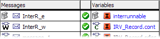

- Update

Updates the instances of the SenderReceiver interfaces and modules, i.e. imports changes in these components into the SWC.

- Auto-Mapping

Maps all unmapped messages to interrunnable variables or SenderReceiver interface ports with identical name and type.

- Edit

Opens the list of available interrunnable variables for selection.

- Remove (Delete)

Removes an existing mapping.

- Revert Changes

Reverts unsaved mapping changes.

- Toggle Pages (Ctrl + Shift +t)

Switches between the Internal Access and External Access tabs.

- Create Interrunnable

Creates a new interrunnable variable for a selected message, and maps it.

- Auto-Mapping

Maps all unmapped messages to interrunnable variables with identical name and type.

- Export

Opens the Export Settings dialog window where you can export mappings to an *.xml or *.csv file.

- Import

Imports mappings from an *.xml or *.csv file.

# Message Mapping View - Internal Access

This part of the Message Mapping view is used to map ASCET messages to AUTOSAR interrunnable variables.

##### top bar

- information field

Shows whether message mapping is complete (), incomplete (), or contains invalid mappings ().

-  Update

Updates the instances of the SenderReceiver interfaces and modules, i.e. imports changes in these components into the SWC.

-  Auto-Mapping

This button maps all unmapped messages to scalar interrunnable variables or elements of Record interrunnable variables with identical name and type.

- /

Shows () or hides () the upper table.

##### upper table (hidden by default)

- Messages column

This column lists all unmapped messages from all modules directly or indirectly used in the software component. The messages are displayed as follows:

| Column 1 | Column 2 |
| --- | --- |
| exported or imported messages: | <message> |
| local messages: | self.<module>[.<nested module>...].<message> |

- input field and  button above the column

You can enter a text string in the input field and then click on  to filter the list of available messages by name. The filter is case-insensitive; it finds all messages whose names contain the text string.

-  properties filter above the column

Opens the Filter Criteria dialog window, which allows filtering the list by selected properties.

An active type filter is indicated by a green overlay icon on both filter buttons: 

An active filter is indicated by a green overlay icon:  Click the button to remove the filter.

- Variables column

This column lists all unmapped elements (scalar interrunnable variables, data elements of complex interrunnable variables, data elements of records in SenderReceiver or NVData interfaces) that are available for mapping. The elements are displayed as follows:

| Column 1 | Column 2 |
| --- | --- |
| interrunnable variables: | <element> |
| elements in complex interrunnable variables: | <record>[.<nested record>...].<element> |

Complex elements of nested records (record A contains record B, which contains record C, etc.) used as interrunnable variables are not listed.

- input field,  properties filter and  button above the column

The same as in the [Messages](#Available) column.

- [context menu (upper table)](javascript:kadovTextPopup(this))<!-- kadovTextPopupInit('a1'); //-->

#####  button

Maps a message selected in the Message column to an interrunnable variable selected in the Variables column.

##### Mapping field - lower table

- input field,  properties filter and  button

The same as in the [Messages](#Available) column.

- Messages column
- icon column
- Variables column

If no mapping exists (---), the Messages column can be used to perform mapping. A double-click in a table cell opens a list of all suitable calibration parameters.

Unsaved changed mappings are indicated by [blue font](javascript:kadovTextPopup(this))<!-- kadovTextPopupInit('a3'); //-->.

- [context menu (lower table)](javascript:kadovTextPopup(this))<!-- kadovTextPopupInit('a2'); //-->

The [Mapping](ASCMappingMenu.md) menu contains the same options as the context menu in the lower table.

You can

[Access ASCET messages](asc_accessmessages.md)

[Export message/parameter mappings](ASC_ExportMessageParameterMappings.md)

[Import message/parameter mappings](ASC_ImportMessageParameterMappings.md)

See also

[Filter Criteria Dialog Window](SWC_FilterCriteria_Window.md)

[Message Mapping View: External Access](ASC_MessageMappingView_ExternalAccess.md)

/* Heikki Komulainen, Comet Computer GmbH 2004 */ cc_plus_pic = '&nbsp;'; cc_minus_pic = '&nbsp;'; cc_stat_pic = '&nbsp;'; gpstyle = ''; var iframes_created = 0; if (document.body && document.body.insertAdjacentHTML && document.getElementsByTagName && document.getElementById) { collect_popups(); set_poplinks_pictures(); if (iframes_created) { document.write(gpstyle); document.write('
<nobr><a id="einauslink" style="position:absolute;top:expression(document.body.scrollTop + this.offsetHeight - this.offsetHeight);left:expression(document.body.offsetWidth - (this.offsetWidth + 28));background:white;padding:5px" href="javascript:show_all_poptext()">Show all hidden text</a></nobr>
'); } } function collect_popups() { bsscpopups = new Array(); for (x = 0; x < document.links.length; x++) { if (document.links[x].href.indexOf("BSSCPopup")>-1) { seekmatch = /BSSCPopup.'[^'](.+)'/; poplink = seekmatch.exec(document.links[x].href); poplink = "" + poplink; poplink = poplink.substring(poplink.indexOf("'")+1, poplink.lastIndexOf("'")); ifid = "CCGENIFRAMEID" + x; new_iframe = '<iframe id="' + ifid + '"src="' + poplink + '" onload="get_text(\'' + ifid + '\')" width="0" height="0" frameborder=0></iframe>'; document.links[x].parentNode.insertAdjacentHTML("afterEnd", new_iframe); gpid = "CCID_" + ifid; document.links[x].href = "javascript:expand_poptext('" + gpid + "')"; cc_plus = '' + cc_plus_pic + ''; document.links[x].insertAdjacentHTML("afterBegin", cc_plus); iframes_created = 1; } } }// end function function get_text(ifr_id) { frpars = document.frames[ifr_id].document.getElementsByTagName("body"); popbody = frpars[0].innerHTML; gpid = "CCID_" + ifr_id; if (!document.getElementById(gpid)) { //avoiding doubles document.getElementById(ifr_id).insertAdjacentHTML("afterEnd", '
'+popbody+'
'); } }//end function function expand_poptext(x_frame_id) { if (!document.getElementById(x_frame_id)) return; if (document.getElementById(x_frame_id).className == "CCGENPOPTEXTH") { document.getElementById(x_frame_id).className = "CCGENPOPTEXTV"; document.getElementById(x_frame_id).style.visibility = "visible"; if (document.getElementById("CCPMB_" + x_frame_id )) { document.getElementById("CCPMB_" + x_frame_id ).innerHTML = cc_minus_pic; } } else { document.getElementById(x_frame_id).className = "CCGENPOPTEXTH"; document.getElementById(x_frame_id).style.visibility = "hidden"; if (document.getElementById("CCPMB_" + x_frame_id )) { document.getElementById("CCPMB_" + x_frame_id ).innerHTML = cc_plus_pic; } } }// end function function show_all_poptext() { var pulldowntxt = document.getElementsByTagName("div"); for (b = 0; b < pulldowntxt.length; b++) { if (pulldowntxt[b].className == "droptext") { pulldowntxt[b].style.display=""; } } var gptxt = document.getElementsByTagName("div"); for (z = 0; z < gptxt.length; z++) { if (gptxt[z].className == "CCGENPOPTEXTH") { gptxt[z].className = "CCGENPOPTEXTV"; gptxt[z].style.visibility = "visible"; if (document.getElementById("CCPMB_" + gptxt[z].id )) { document.getElementById("CCPMB_" + gptxt[z].id ).innerHTML = cc_minus_pic; } } } var dxpoplinks = document.getElementsByTagName("a"); if (dxpoplinks) { for (pxl = 0; pxl < dxpoplinks.length; pxl++) { if (dxpoplinks[pxl].href.indexOf("kadovTextPopup")>-1) { if (document.getElementById("CCPMB_" + dxpoplinks[pxl].id)) { document.getElementById("CCPMB_" + dxpoplinks[pxl].id).innerHTML = cc_stat_pic; dxpoplinks[pxl].symbol = "minus"; } } } } document.getElementById('einauslink').innerText = 'Hide all hideable text'; document.getElementById('einauslink').href = "javascript:self.location.reload()"; self.focus(); }// end function function eat_click() { return false; }// end function function set_poplinks_pictures() { var dpoplinks = document.getElementsByTagName("a"); if (dpoplinks) { for (pl = 0; pl < dpoplinks.length; pl++) { if (dpoplinks[pl].href.indexOf("kadovTextPopup")>-1) { cc_plus = '' + cc_stat_pic + ''; //dpoplinks[pl].onmouseup = plusminuspoplink; dpoplinks[pl].insertAdjacentHTML("afterBegin", cc_plus); dpoplinks[pl].symbol = "plus"; } } } }// end function function plusminuspoplink() { if (document.getElementById("CCPMB_" + this.id)) { if (this.symbol == "plus") { document.getElementById("CCPMB_" + this.id).innerHTML = cc_minus_pic; this.symbol = "minus"; } else { document.getElementById("CCPMB_" + this.id).innerHTML = cc_plus_pic; this.symbol = "plus"; } } return true; }
