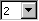
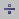
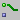
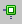
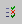

# Basic Blocks Palette

The palette Basic Blocks contains following functions:

<table cellspacing="0" style="x-cell-content-align: Center;
				border-left-style: Outset;
				border-top-style: Outset;
				border-right-style: Outset;
				border-bottom-style: Outset;
				border-left-width: 1px;
				border-right-width: 1px;
				border-top-width: 1px;
				border-bottom-width: 1px;
				margin-top: 9px;
				border-spacing: 0px;
				border-spacing: 0px;" x-use-null-cells="">
<col/>
<col/>
<col/>
<tr class="hcp1" valign="top">
<td class="hcp2" colspan="1" rowspan="1">

 
</td>
<td class="hcp3" colspan="1" rowspan="1" valign="middle">

 
</td>
<td class="hcp3" colspan="1" rowspan="1" valign="middle">

See also 
</td></tr>
<tr class="hcp1" valign="top">
<td class="hcp2" colspan="1" rowspan="1">

</td>
<td class="hcp3" colspan="1" rowspan="1" valign="middle">

Combo box to select the number of some operator 
 inputs

(addition, multiplication, AND, OR, Max, Min, MUX, 
 Case)
</td>
<td class="hcp3" colspan="1" rowspan="1" valign="middle">

 
</td></tr>
<tr class="hcp1" valign="top">
<td class="hcp2" colspan="1" rowspan="1">

</td>
<td class="hcp3" colspan="1" rowspan="1" valign="middle">

Addition
</td>
<td class="hcp3" colspan="1" rowspan="5" valign="middle">

<a href="ASCarithmeticOperators.md">Arithmetic 
 Operators</a>
</td></tr>
<tr class="hcp1" valign="top">
<td class="hcp2" colspan="1" rowspan="1">

</td>
<td class="hcp3" colspan="1" rowspan="1" valign="middle">

Subtraction
</td>
</tr>
<tr class="hcp1" valign="top">
<td class="hcp2" colspan="1" rowspan="1">

</td>
<td class="hcp3" colspan="1" rowspan="1" valign="middle">

Multiplication
</td>
</tr>
<tr class="hcp1" valign="top">
<td class="hcp2" colspan="1" rowspan="1">

</td>
<td class="hcp3" colspan="1" rowspan="1" valign="middle">

Division
</td>
</tr>
<tr class="hcp1" valign="top">
<td class="hcp2" colspan="1" rowspan="1">

</td>
<td class="hcp3" colspan="1" rowspan="1" valign="middle">

Modulo
</td>
</tr>
<tr class="hcp1" valign="top">
<td class="hcp2" colspan="1" rowspan="1">

</td>
<td class="hcp3" colspan="1" rowspan="1" valign="middle">

And
</td>
<td class="hcp3" colspan="1" rowspan="3" valign="middle">

<a href="ASClogicalOperators.md">Logical Operators</a>
</td></tr>
<tr class="hcp1" valign="top">
<td class="hcp2" colspan="1" rowspan="1">

</td>
<td class="hcp3" colspan="1" rowspan="1" valign="middle">

Or
</td>
</tr>
<tr class="hcp1" valign="top">
<td class="hcp2" colspan="1" rowspan="1">

</td>
<td class="hcp3" colspan="1" rowspan="1" valign="middle">

Not
</td>
</tr>
<tr class="hcp1" valign="top">
<td class="hcp2" colspan="1" rowspan="1">

</td>
<td class="hcp3" colspan="1" rowspan="1" valign="middle">

Greater
</td>
<td class="hcp3" colspan="1" rowspan="6" valign="middle">

<a href="ASCcomparisonOperators.md">Comparison 
 Operators</a>
</td></tr>
<tr class="hcp1" valign="top">
<td class="hcp2" colspan="1" rowspan="1">

</td>
<td class="hcp3" colspan="1" rowspan="1" valign="middle">

Less
</td>
</tr>
<tr class="hcp1" valign="top">
<td class="hcp2" colspan="1" rowspan="1">

</td>
<td class="hcp3" colspan="1" rowspan="1" valign="middle">

Less or Equal
</td>
</tr>
<tr class="hcp1" valign="top">
<td class="hcp2" colspan="1" rowspan="1">

</td>
<td class="hcp3" colspan="1" rowspan="1" valign="middle">

Greater or Equal
</td>
</tr>
<tr class="hcp1" valign="top">
<td class="hcp2" colspan="1" rowspan="1">

</td>
<td class="hcp3" colspan="1" rowspan="1" valign="middle">

Equal
</td>
</tr>
<tr class="hcp1" valign="top">
<td class="hcp2" colspan="1" rowspan="1">

</td>
<td class="hcp3" colspan="1" rowspan="1" valign="middle">

Not Equal
</td>
</tr>
<tr class="hcp1" valign="top">
<td class="hcp2" colspan="1" rowspan="1">

</td>
<td class="hcp3" colspan="1" rowspan="1" valign="middle">

Verify (see also <a href="BlockDiagramEditorEnglishUS.chm::/BDE_UseVerifyOperator.htm">Using 
 the Verify Operator</a>) 
</td>
<td class="hcp3" colspan="1" rowspan="1" valign="middle">

<a href="IntroductionEnglishUS.chm::/INT_RedundantDataStorage.htm">Redundant 
 Data Storage</a>
</td></tr>
<tr class="hcp1" valign="top">
<td class="hcp2" colspan="1" rowspan="1">

</td>
<td class="hcp3" colspan="1" rowspan="1" valign="middle">

Abs 
 (returns the absolute value of the input)
</td>
<td class="hcp3" colspan="1" rowspan="4" valign="middle">

<a href="ASCinputOperators.md">Input Operators</a>
</td></tr>
<tr class="hcp1" valign="top">
<td class="hcp2" colspan="1" rowspan="1">

</td>
<td class="hcp3" colspan="1" rowspan="1" valign="middle">

Max (returns the largest input)
</td>
</tr>
<tr class="hcp1" valign="top">
<td class="hcp2" colspan="1" rowspan="1">

</td>
<td class="hcp3" colspan="1" rowspan="1" valign="middle">

Min 
 (returns the smallest input)
</td>
</tr>
<tr class="hcp1" valign="top">
<td class="hcp2" colspan="1" rowspan="1">

</td>
<td class="hcp3" colspan="1" rowspan="1" valign="middle">

Between 

(checks whether the input lies between the limiting 
 values)
</td>
</tr>
<tr class="hcp1" valign="top">
<td class="hcp2" colspan="1" rowspan="1">

</td>
<td class="hcp3" colspan="1" rowspan="1" valign="middle">

Negation (reverses the input sign)
</td>
<td class="hcp3" colspan="1" rowspan="1" valign="middle">

<a href="ascnegationoperator.md">Negation Operator</a>
</td></tr>
<tr class="hcp1" valign="top">
<td class="hcp2" colspan="1" rowspan="1">

 
</td>
<td class="hcp3" colspan="1" rowspan="1" valign="middle">

Conversion Limit
</td>
<td class="hcp3" colspan="1" rowspan="2" valign="middle">

<a href="asc_conversionoperator.md">Conversion 
 Operator</a> 
</td></tr>
<tr class="hcp1" valign="top">
<td class="hcp2" colspan="1" rowspan="1">

 
</td>
<td class="hcp3" colspan="1" rowspan="1" valign="middle">

Conversion WrapAround
</td>
</tr>
<tr class="hcp1" valign="top">
<td class="hcp2" colspan="1" rowspan="1">

 
</td>
<td class="hcp3" colspan="1" rowspan="1" valign="middle">

Assert
</td>
<td class="hcp3" colspan="1" rowspan="1" valign="middle">

<a href="asc_assertoperator.md">Assert Operator</a>
</td></tr>
<tr class="hcp1" valign="top">
<td class="hcp2" colspan="1" rowspan="1">

</td>
<td class="hcp3" colspan="1" rowspan="1" valign="middle">

MUX
</td>
<td class="hcp3" colspan="1" rowspan="2" valign="middle">

<a href="ASCconditionaloperators.md">Conditional 
 Operators</a>
</td></tr>
<tr class="hcp1" valign="top">
<td class="hcp2" colspan="1" rowspan="1">

</td>
<td class="hcp3" colspan="1" rowspan="1" valign="middle">

Case
</td>
</tr>
<tr class="hcp1" valign="top">
<td class="hcp2" colspan="1" rowspan="1">

</td>
<td class="hcp3" colspan="1" rowspan="1" valign="middle">

If-Then (see also <a href="ascuseif.md">Using 
 the If Statements</a>)
</td>
<td class="hcp3" colspan="1" rowspan="5" valign="middle">

<a href="ASCcontrolFlowOperators.md">Control 
 Flow Operators</a>
</td></tr>
<tr class="hcp1" valign="top">
<td class="hcp2" colspan="1" rowspan="1">

</td>
<td class="hcp3" colspan="1" rowspan="1" valign="middle">

If-Then-Else (see also <a href="ascuseif.md">Using 
 the If Statements</a>)
</td>
</tr>
<tr class="hcp1" valign="top">
<td class="hcp2" colspan="1" rowspan="1">

</td>
<td class="hcp3" colspan="1" rowspan="1" valign="middle">

While (see also <a href="ascusewhileloop.md">Using 
 the While Loop</a>)
</td>
</tr>
<tr class="hcp1" valign="top">
<td class="hcp2" colspan="1" rowspan="1">

</td>
<td class="hcp3" colspan="1" rowspan="1" valign="middle">

Switch (see also <a href="ascuseswitch.md">Using 
 the Switch Operator</a>) 
</td>
</tr>
<tr class="hcp1" valign="top">
<td class="hcp2" colspan="1" rowspan="1">

</td>
<td class="hcp3" colspan="1" rowspan="1" valign="middle">

Break 

(specifies immediate exit from a process/method)
</td>
</tr>
<tr class="hcp1" valign="top">
<td class="hcp2" colspan="1" rowspan="1">

</td>
<td class="hcp3" colspan="1" rowspan="1" valign="middle">

RTE Access 

(allows selection of explicit/implicit access to 
 SenderReceiver/NVData interfaces)
</td>
<td class="hcp3" colspan="1" rowspan="1" valign="middle">

<a href="ASCsendToPort.md">Sending to a Port</a>

<a href="ASCreceiveFromPort.md">Receiving from a 
 Port</a>
</td></tr>
<tr class="hcp1" valign="top">
<td class="hcp2" colspan="1" rowspan="1">

</td>
<td class="hcp3" colspan="1" rowspan="1" valign="middle">

RTE Invoke
</td>
<td class="hcp3" colspan="1" rowspan="1" valign="middle">

<a href="ASCmakeClientRequest_on_Port.md">Making 
 a Client Request on a Port</a>
</td></tr>
<tr class="hcp1" valign="top">
<td class="hcp2" colspan="1" rowspan="1">

</td>
<td colspan="1" rowspan="1" style="x-cell-content-align: top;
			padding-top: 2px;
			padding-bottom: 2px;
			border-left-style: Inset;
			border-left-width: 1px;
			border-top-width: 1px;
			border-top-style: Inset;
			border-right-style: Inset;
			border-right-width: 1px;
			border-bottom-width: 1px;
			border-bottom-style: Inset;
			padding-right: 2px;
			padding-left: 2px;" valign="top">

RTE Status 

(returns the status of an explicit read or write 
 procedure)
</td>
<td class="hcp3" colspan="1" rowspan="1" valign="middle">

<a href="ASCsendToPort.md">Sending to a Port</a>

<a href="ASCreceiveFromPort.md">Receiving from a 
 Port</a>

<a href="ASCmakeClientRequest_on_Port.md">Making 
 a Client Request on a Port</a>
</td></tr>
<tr class="hcp1" valign="top">
<td class="hcp3" colspan="1" rowspan="1" valign="middle">

</td>
<td class="hcp3" colspan="1" rowspan="1" valign="middle">

Enumeration Literal
</td>
<td class="hcp3" colspan="1" rowspan="5" valign="middle">

<a href="BlockDiagramEditorEnglishUS.chm::/BDE_AddLiteral.htm">Adding 
 and Editing a Literal</a>
</td></tr>
<tr class="hcp1" valign="top">
<td class="hcp2" colspan="1" rowspan="1">

</td>
<td class="hcp3" colspan="1" rowspan="1" valign="middle">

Logic Literal true
</td>
</tr>
<tr class="hcp1" valign="top">
<td class="hcp2" colspan="1" rowspan="1">

</td>
<td class="hcp3" colspan="1" rowspan="1" valign="middle">

Logic Literal false
</td>
</tr>
<tr class="hcp1" valign="top">
<td class="hcp2" colspan="1" rowspan="1">

</td>
<td class="hcp3" colspan="1" rowspan="1" valign="middle">

Continuous Literal 0.0
</td>
</tr>
<tr class="hcp1" valign="top">
<td class="hcp2" colspan="1" rowspan="1">

</td>
<td class="hcp3" colspan="1" rowspan="1" valign="middle">

Continuous Literal 1.0
</td>
</tr>
<tr class="hcp1" valign="top">
<td class="hcp2" colspan="1" rowspan="1">

</td>
<td class="hcp3" colspan="1" rowspan="1" valign="middle">

Hierarchy
</td>
<td class="hcp3" colspan="1" rowspan="1" valign="middle">

<a href="ascaddhierarchy.md">Adding a Hierarchy</a>
</td></tr>
<tr class="hcp1" valign="top">
<td class="hcp2" colspan="1" rowspan="1">

</td>
<td class="hcp3" colspan="1" rowspan="1" valign="middle">

Statement Block 
</td>
<td class="hcp3" colspan="1" rowspan="1" valign="middle">

<a href="ASC_addstatementblock.md">Adding a Statement 
 Block</a>
</td></tr>
<tr class="hcp1" valign="top">
<td class="hcp2" colspan="1" rowspan="1">

</td>
<td class="hcp3" colspan="1" rowspan="1" valign="middle">

Comment
</td>
<td class="hcp3" colspan="1" rowspan="1" valign="middle">

<a href="BlockDiagramEditorEnglishUS.chm::/Addcomment.htm">Adding 
 and Editing a Comment</a>
</td></tr>
<tr class="hcp1" valign="top">
<td class="hcp2" colspan="1" rowspan="1">

</td>
<td class="hcp3" colspan="1" rowspan="1" valign="middle">

Self (reference to the current object itself)
</td>
<td class="hcp3" colspan="1" rowspan="1" valign="middle">

 
</td></tr>
</table>

See also

[Toolbar Basic Blocks](ASCtoolbarBasicBlocks.md)
