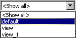

# Merged CHM Content

## Overview

_Source: `markdown/AD_Overview.md`_

# Overview - Automatic Documentation

ASCET can automatically generate a documentation file for folders and database/workspace items. The documentation file contains information about the documented item, e.g. the interface and specification diagrams, plus any notes the user adds. Documentation can be generated in either RTF, HTML, ASCII or Postscript format, and then printed or used within other documents.

See also

[Generating Documentation](markdown/generating_documentation.md)

[Documentation File Output Formats](markdown/docu_file_output_formats.md)

[Views](markdown/AD_views.md)

[Notes](markdown/AD_notes.md)

[Component Manager - Database/Workspace Items](ComponentManagerEnglishUS.chm::/DatabaseItems.htm)

---

## Generating Documentation

_Source: `markdown/generating_documentation.md`_

# Generating Documentation

Before the documentation can be generated, the folders or items that should be documented must be added to the contents of the documentation. It is possible to generate documentation for one or more entire folders, or just for one or more database/workspace items.

See also

[Selecting the Items for Generating Documentation](markdown/select_items_gen_docu.md)

[Changing the Selection](markdown/change_selection.md)

[Storing the Documentation Contents to a File](markdown/store_docu_contents.md)

[Generating Documentation for a Folder or Database Items](markdown/generate_docu_folder_database.md)

[Viewing the Generated Documentation](markdown/view_generated_docu.md)

[Setting the Options for Documentation Generation](markdown/set_options_docu_generation.md)

---

## Documentation Output Formats

_Source: `markdown/docu_file_output_formats.md`_

# Documentation File Output Formats

All documentation you generate is written to the documentation directory. This directory is specified in the ASCET options window, Paths subnode of the Environment node. The file names ASCET uses for the documentation files are, by default, always the same, any old files in the directory will be overwritten.

The following formats are available:

- [ASCII Format](markdown/ascii_format.md)
- [HTML Format](markdown/html_format.md)
- [Postscript Format](markdown/postscript_format.md)
- [RTF Format](markdown/rtf_format.md)

See also

[Setting the Options for Documentation Generation](markdown/set_options_docu_generation.md)

[Component Manager - Paths Options (Environment)](ComponentManagerEnglishUS.chm::/CM_PathsNode.htm)

---

## ASCII Format

_Source: `markdown/ascii_format.md`_

# ASCII Format

If you have selected ASCII as the output format, all generated text is written to a text file. The file name can be defined by the user. If the item being documented contains any diagrams, they are written to Postscript files, one for each diagram. The text file contains the filename of each diagram. If a documented item contains C code or ESDL code, the code is incorporated into the text file.

You can load the ASCII text produced by ASCET into any editor or word-processor, and use it as a basis for your own documentation of applications developed with ASCET.

See also

[Setting the Options for Documentation Generation](markdown/set_options_docu_generation.md)

[Generating Documentation for a Folder or Database/Workspace Items](markdown/generate_docu_folder_database.md)

---

## HTML Format

_Source: `markdown/html_format.md`_

# HTML Format

HTML is the standard format of information interchange on the World Wide Web. HTML documents can be viewed with any World Wide Web browser, such as Internet Explorer or Mozilla Firefox. The HTML source text of the document is written to a *.htm file with user-defined name. All diagrams are stored in the GIF format, which is also standard on the World Wide Web.

See also

[Setting the Options for Documentation Generation](markdown/set_options_docu_generation.md)

[Generating Documentation for a Folder or Database/Workspace Items](markdown/generate_docu_folder_database.md)

---

## Postscript Format

_Source: `markdown/postscript_format.md`_

# Postscript Format

If you select Postscript as the output format, ASCET generates a LaTeX file which is converted into a postscript file (<name>.ps) and a PDF file (<name>.pdf). The file name <name> can be defined by the user.

To generate documentation in postscript/PDF format, you need a LaTeX installation (e.g., MikTex V<x>.<y>, available in the ToolsAndUtilities\MikTex directory on the ASCET installation disk or on [http://www.miktex.org](http://www.miktex.org)).

See also

[Providing a Path to LaTeX](markdown/AD_ProvidePathLaTeX.md)

[Installing MiKTeX](markdown/AD_InstallMiKTeX.md)

---

## RTF Format

_Source: `markdown/rtf_format.md`_

# RTF Format

RTF is a standard format for exchanging formatted documents. It can be read by most word processing programs, such as Microsoft Word or WordPerfect. The formatted documentation can be edited or incorporated into other documents. The document is written to an *.rtf file with user-defined name.

See also

[Setting the Options for Documentation Generation](markdown/set_options_docu_generation.md)

[Generating Documentation for a Folder or Database/Workspace Items](markdown/generate_docu_folder_database.md)

---

## Options for Element Types

_Source: `markdown/Options_for_Element_Types.md`_

# Options for Element Types

The Elements tab of the [ASCET Document Contents for](markdown/AD_ASCET_DocContents_Window.md) window is the central place to adjust the representation of several element groups in the block diagram or state machine editor. These global options apply to all elements of the group, anywhere in the database, for which no individual settings are available.

Diagram elements with an individual setting other than Normal ([Editing the View of a Diagram Item](markdown/AD_EditView_of_DiagramItem.md)) are not affected by the global settings.

See also

[Editing the View of a Diagram Item](markdown/AD_EditView_of_DiagramItem.md)

[Making Global Settings for Element Groups](markdown/Global_Settings_Elem_Grps.md)

[ASCET Document Contents Window](markdown/AD_ASCET_DocContents_Window.md)

---

## Views

_Source: `markdown/AD_views.md`_

# Views

In the ASCET block diagram editor, software component editor and state machine editor, so-called views exist. Automatic documentation (not available for software components) and diagrams can be designed differently in different views by hiding parts of the information.

Views can be set up individually. The settings include global and element-specific options for presentation in the block diagram or state machine editor and for automatic documentation.

The following information can be shown/hidden globally:

- Sequence calls and connectors
- Method names for method-local elements, process names for process-local elements
- Graphical comments (see also [Adding and Editing a Comment](BlockDiagramEditorEnglishUS.chm::/Addcomment.htm))
- A default representation can be defined for various element groups for each view (e.g., all cont parameters are displayed as line).

The element-specific settings are described in [Editing the Views of a Diagram Item](markdown/AD_EditView_of_DiagramItem.md).

When a view is selected, all global and element-specific settings become active. A diagram's representation in the editor conforms to its representation in the documentation.

If desired, a view configuration can be specified that is used as default for newly created databases/workspaces, see [Creating and Using a Default View Configuration](markdown/AD_CreateUseDefaultViewConfiguration.md).

See also

[Creating and Managing Views](markdown/AD_create_docu_views.md)

[Editing a View](markdown/determine_content_docu_file.md)

[Editing the View of a Diagram Item](markdown/AD_EditView_of_DiagramItem.md)

[Creating and Using a Default View Configuration](markdown/AD_CreateUseDefaultViewConfiguration.md)

[Adding and Editing a Comment](BlockDiagramEditorEnglishUS.chm::/Addcomment.htm)

---

## Notes

_Source: `markdown/AD_notes.md`_

# Notes

Every folder or database/workspace item can have notes associated with it. These are not the same as comments, which are incorporated in block diagrams and printed with those. A note is associated with a folder or database/workspace item, and becomes part of the text of the generated documentation. In notes, information can be included, that is not part of the functional specification.

See also

[Creating a Note](markdown/create_note.md)

[Creating a Text Segment](markdown/create_text_segment.md)

[Editing a Text Segment](markdown/edit_text_segment.md)

[Assigning a Text Segment to a View](markdown/assign_text_segment.md)

[Deassigning a View](markdown/deassign_view.md)

[Viewing Text Segment Assignments](markdown/view_text_segment_assignments.md)

---

## Setting the Options for Documentation Generation

_Source: `markdown/set_options_docu_generation.md`_

# Setting the Options for Documentation Generation

To set the options for documentation generation, proceed as follows:

1. In the Component Manager, point to the Tools menu, then point to Documentation and select Options.
1. Type your name into the Author field and type a title for the generated document into the Title field.
1. Select the view of the documentation file from the View combo box (see [Views](markdown/AD_views.md) for details).
1. Select the document format from the Output Format combo box.
1. Click OK.

The options are used the next time you generate documentation.

See also

[Providing a Path to LaTeX](markdown/AD_ProvidePathLaTeX.md)

[Views](markdown/AD_views.md)

[Generating Documentation for a Folder or Database/Workspace Items](markdown/generate_docu_folder_database.md)

[Installing MiKTeX](markdown/AD_InstallMiKTeX.md)

---

## Selecting the Items for Generating Documentation

_Source: `markdown/select_items_gen_docu.md`_

# Selecting the Items for Generating Documentation

To select the items for generating documentation, proceed as follows:

1. In the Component Manager, point to the Tools menu, then point to Documentation and select Contents.
1. Do one of the following.
1. Activate the Referenced Items option at the bottom of the window to have referenced items included in the documentation contents as you add new items.
1. If necessary, [change the selection](markdown/change_selection.md).
1. If desired, [store the documentation contents to a file](markdown/store_docu_contents.md).
1. [Generate the docum[entation](markdown/store_docu_contents.md) for the selected items.](generate_docu_folder_database.md)

See also

[Providing a Path to LaTeX](markdown/AD_ProvidePathLaTeX.md)

[Generating Documentation for a Folder or Database/Workspace Items](markdown/generate_docu_folder_database.md)

[Changing the Selection](markdown/change_selection.md)

[Storing the Documentation Contents to a File](markdown/store_docu_contents.md)

[Setting the Options for Documentation Generation](markdown/set_options_docu_generation.md)

---

## Providing a Path to LaTeX

_Source: `markdown/AD_ProvidePathLaTeX.md`_

# Providing a Path to LaTeX

When you [select items for documentation generation](markdown/select_items_gen_docu.md), or [set documentation options](markdown/set_options_docu_generation.md), for the first time, you are asked to provide a path to a LaTeX installation. Proceed as follows.

1. Confirm the message with OK.
1. Select a volume in the Volume combo box.
1. Select the LaTeX directory from the Directories list.
1. Click OK to close the Path Selection dialog window.
1. Restart ASCET for the path setting to become effective.

If there is no LaTeX installation on your PC, you can close the Path Selection dialog window with Cancel. After that, the Documentation Contents window or the ASCET Document Options window opens, and you can continue. You cannot, however, generate documentation in postscript format.

See also

[Setting the Options for Documentation Generation](markdown/set_options_docu_generation.md)

[Selecting the Items for Generating Documentation](markdown/select_items_gen_docu.md)

[Path Selection Window](ComponentManagerEnglishUS.chm::/CM_Path_Selection_Window.htm)

[Installing MiKTeX](markdown/AD_InstallMiKTeX.md)

---

## Changing the Selection

_Source: `markdown/change_selection.md`_

# Changing the Selection

To change the selection, proceed as follows:

1. In the Component Manager, point to the Tools menu, then point to Documentation and select Contents to open the Documentation Contents window.
1. In the Items pane of the Documentation Contents dialog window, select a database/workspace item.
1. Right-click on the item and select Delete from the context menu.

The item is deleted from the items pane, i.e. it will not be included when documentation is generated.

1. Select Move Up or Move Down to change the position of the item in the Items pane.

The position determines the order in which items appear in the generated documentation.

---

## Generating Documentation for a Folder or Database/Workspace Items

_Source: `markdown/generate_docu_folder_database.md`_

# Generating Documentation for a Folder or Database/Workspace Items

To generate documentation for a folder or database/workspace items, proceed as follows:

1. [Set the options for documentation generation](markdown/set_options_docu_generation.md).
1. [Select the items](markdown/select_items_gen_docu.md) you want to document.
1. In the Documentation Contents window, open the Document menu and select Generate Document.
1. Enter a file name and click OK.
1. Select the target(s) for which you wand to generate documentation, then click OK.
1. If desired, [view](markdown/view_generated_docu.md) or print the generated documentation.

The generated files are stored in the documentation directory of your ASCET installation. This directory is specified in the ASCET Options window, Environment node, [Paths](ComponentManagerEnglishUS.chm::/CM_PathsNode.htm) subnode. Every time you generate documentation, any older files with identical names are overwritten.

See also

[Setting the Options for Documentation Generation](markdown/set_options_docu_generation.md)

[Selecting the Items for Generating Documentation](markdown/select_items_gen_docu.md)

[Component Manager - Paths Options (Environment)](ComponentManagerEnglishUS.chm::/CM_PathsNode.htm)

---

## Storing the Documentation Contents to a File

_Source: `markdown/store_docu_contents.md`_

# Storing the Documentation Contents to a File

You can store the contents of generated documentation as a list of database/workspace items and their order to the file system.

To store the documentation contents to a file, proceed as follows:

1. In the Documentation Contents window, open the Document menu and select Save Document Items to File.

A file selection dialog window opens. The file extension *.cfg is preselected.

1. Select the path and file name for the contents file and click Save.

The file is stored at the specified location.

1. In the Document menu, select Load Document Items From File to load a previously saved documentation content.

---

## Viewing the Generated Documentation

_Source: `markdown/view_generated_docu.md`_

# Viewing the Generated Documentation

To view the generated documentation, proceed as follows:

- In the Documentation Contents window, point to Document menu, select Preview Document.

The viewer for the type of documentation you have generated opens with the generated file.

On Windows 10, previewing HTML file does not work with the built-in browser.

---

## Working on Views

_Source: `markdown/AD_Working_on_Views.md`_

# Working on Views

Working on the views of a component comprises the following actions.

- [Creating and Managing Views](markdown/AD_create_docu_views.md)
- [Editing a View](markdown/determine_content_docu_file.md)
- [Exporting Views](markdown/Exporting_Views.md)
- [Importing Views](markdown/Importing_Views.md)
- [Selecting a Default View](markdown/select_default_view.md)
- [Changing the View Display of a Diagram](markdown/change_view_display_diagram.md)
- [Making Global Settings for Element Groups](markdown/Global_Settings_Elem_Grps.md)
- [Editing the Views of a Diagram Item](markdown/AD_EditView_of_DiagramItem.md)
- [Creating and Using a Default View Configuration](markdown/AD_CreateUseDefaultViewConfiguration.md)

---

## Creating and Managing Views

_Source: `markdown/AD_create_docu_views.md`_

# Creating and Managing Views

To create documentation views, proceed as follows:

1. In the Component Manager, point to the Tools menu and select Views.
1. Click on Add.
1. Enter a name for the view and press Enter.
1. [Edit the view.](markdown/determine_content_docu_file.md)
1. Click Rename to rename a selected view.
1. Click Delete to remove a selected view.
1. Close the Views window.

See also

[Editing a View](markdown/determine_content_docu_file.md)

[Exporting Views](markdown/Exporting_Views.md)

[Importing Views](markdown/Importing_Views.md)

[Selecting a Default View](markdown/select_default_view.md)

---

## Editing a View

_Source: `markdown/determine_content_docu_file.md`_

# Editing a View

You determine, for a given view, which information will be written to the generated documentation.

1. In the Component Manager, do one of the following:
1. In the Views window, select the view you want to edit.
1. Click on Edit.
1. In these tabs, make your settings for the edited view.
1. Select or deselect the relevant options.
1. Click on OK.

The views you have thus set up are not included in the export of database/workspace items. Instead, the Views window offers the possibility to export one or more views to an XML file, and to import previously exported views.

See also

[ASCET Document Contents Window](markdown/AD_ASCET_DocContents_Window.md)

[Documentation Tab](markdown/AD_Documentation_Tab.md)

[BDE Tab](markdown/AD_BDE_Tab.md)

[Elements Tab](markdown/AD_Elements_Tab.md)

[Exporting Views](markdown/Exporting_Views.md)

[Importing Views](markdown/Importing_Views.md)

---

## Exporting Views

_Source: `markdown/Exporting_Views.md`_

# Exporting Views

To export views proceed as follows:

1. In the [Views](markdown/AD_Views_Window.md) window, select one or more views.
1. Click on Export.

The Export File window opens. It shows all XML files in the ASCET export directory.

1. Enter path and name (with extension *.xml) of the export file.
1. Click on Save.

The selected views are written to the file.

An export file for views has a very simple structure. The name of a view is stored in the <View> element, the settings in the tabs of the ASCET Document Contents window are stored in the <Documentation>, <BDE Settings>, and <ElementDefaults> elements. Each setting in a tab corresponds to an attribute of the respective element. In addition, the <BasicBlockDefaults> element defines the visibility for graphical comments.

Only the <View> element containing the name of the view is mandatory, the other elements and attributes are optional. Missing attributes are set to true during import.

When you export several views, separate <View> elements are created for each exported view.

See also

[Example: View Export File](markdown/AD_ExampleViewExportFile.md)

[Views Window](markdown/AD_Views_Window.md)

[Block Diagram Editor - Adding and Editing a Comment](BlockDiagramEditorEnglishUS.chm::/Addcomment.htm)

---

## Example: View Export File

_Source: `markdown/AD_ExampleViewExportFile.md`_

# Example: View Export File

<?xml version="1.0" encoding="ISO8859-1" ?>

<Views>

<View name="view">

<DocumentationSettings>

<Components

graphic="true"

notes="true"

layout="true"

processes="true"

elements="true"

implementation="true"

exportedElements="true"

importedElements="true"

privateMethods="true"

publicMethods="true"

data="true" >

</Components>

<Projects

notes="true"

elements="true"

taskSchedule="true"

targetOptions="true"

operatingSystem="true"

taskSettings="true"

implementation="true"

codegenOptions="true"

bindings="true"

formulas="true"

data="true" >

</Projects>

</DocumentationSettings>

<BDESettings

unusedsequenceCalls="true"

usedsequenceCalls="true"

graphicalComments="true"

processNameLocals="false"

</BDESettings>

<ElementDefaults>

<AsLine>

<Element

dependency="*"

existence="Non-Virtual"

type="Scalar"

kind="Parameter"

scope="*"

memory="*"

modelType="Continuous"

calibration="*"

</Element>

</AsLine>

<Invisible></Invisible>

<Contour></Contour>

<HideContents></HideContents>

</ElementDefaults>

<BasicBlockDefaults>

<AsLine></AsLine>

<Invisible></Invisible>

<Contour></Contour>

<HideContents></HideContents>

<Normal>

<Comment></Comment>

</Normal>

</BasicBlockDefaults>

</View>

</Views>

---

## Importing Views

_Source: `markdown/Importing_Views.md`_

# Importing Views

You can import previously exported views. If an export file contains several views, all of them are imported.

To import views proceed as follows:

1. In the Views window, click on Import.

A warning opens that existing views (identical names) are overwritten upon import.

1. Confirm the warning with Yes.

The Import File window opens. It shows all XML files in the ASCET export directory.

1. Select the file you want to import.
1. Click on Open.

The views in the selected file are imported in the ASCET database/workspace.

---

## Selecting a Default View

_Source: `markdown/select_default_view.md`_

# Selecting a Default View

You can choose one of the views as default view. When you open a component in the block diagram editor afterwards, it is shown in the default view.

1. In the Views window, select one of the available views.
1. Click on Default

or

1. Select Default from the context menu.

The selected view is marked as default, the Default context menu is tick marked.

1. To undo the selection as default, proceed as follows:

1. Select the default view.
1. Click once more on Default.

The default selection is undone. No view is now marked as default.

1. To select another view as default, proceed as follows:

1. Select the new view.
1. Click on Default.

The marking of the old default view is removed. The new view is selected as default.

The view selection in the state machine or block diagram editor (see [Selecting a View of the Diagram](BlockDiagramEditorEnglishUS.chm::/BDE_Selecting_View_the_Diagram.htm)) is not affected by selecting a default.

See also

[Changing the View Display of a Diagram](markdown/change_view_display_diagram.md)

[Selecting a View of the Diagram](BlockDiagramEditorEnglishUS.chm::/BDE_Selecting_View_the_Diagram.htm)

---

## Changing the View Display of a Diagram

_Source: `markdown/change_view_display_diagram.md`_

# Changing the View Display of a Diagram

To change the view display of a diagram, proceed as follows:

1. Open the block diagram editor, project editor or state machine editor for the diagram.
1. Select a view from the View combo box in the General toolbar.

The view changes according to the view settings of the diagram items. All items that are marked invisible for the selected view are hidden.

---

## Making Global Settings for Element Groups

_Source: `markdown/Global_Settings_Elem_Grps.md`_

# Making Global Settings for Element Groups

To make global settings for element groups, proceed as follows:

1. Open the ASCET Document Content for window for a selected view, as described in [Editing a View](markdown/determine_content_docu_file.md).
1. Go to the Elements tab.
1. In the combo box, select the representation you want to assign to the element group.
1. Click on the  button to add an element group.
1. In the Element Properties window, select type, model type, kind, scope, and the attributes.
1. Click OK to accept the settings and close the window.
1. Click OK to accept the settings and close the window.

If the element groups for a view are defined in a way that some elements belong to more than one group (e.g., As Line for exported system constants, Hide for logical system constants), the actual representation results from the processing sequence of the view options in ASCET, it is not clearly defined. In the example, a logical, exported system constant can be displayed as line, or hidden.

When defining element groups, take care to avoid conflicts by multiple assignments of elements to groups.

See also

[Editing a View](markdown/determine_content_docu_file.md)

[Editing the Views of a Diagram Item](markdown/AD_EditView_of_DiagramItem.md)

[Editing an Element Configuration](ElementEditorEnglishUS.chm::/EEd_edit_element_configuration.htm)

---

## Editing the Views of a Diagram Item

_Source: `markdown/AD_EditView_of_DiagramItem.md`_

Default setting in which all available elements, such as symbols, names, sequence calls etc., are displayed.

The element is replaced by one or more lines from the middle to the pins.

In the As Line mode, it is not always clear that this is an element. This is why the following warning is displayed if you select an element in As Line mode or select a connection to this kind of element:

CAUTION: Elements shown in "As Line" view could be affected!

The element disappears from the graphic display and can no longer be selected in the drawing area. It is, however, still present in the Outline tab.

Only the contours of the element and possibly the names of the pins are shown. Sequence calls, name, symbol etc. disappear.

The screen display is the same as for Normal, but the component or hierarchy can no longer be opened from the drawing area.

The content of a hierarchy thus marked is left out of the documentation, the content of a component is included in the documentation.

Uses the global setting for this element group; see [Making Global Settings for Element Groups](markdown/Global_Settings_Elem_Grps.md).

# Editing the Views of a Diagram Item

You can edit the display of individual diagram elements (basic elements, included components, operators, connections, etc.) in the different [views](markdown/AD_views.md). The command is available for all diagram elements.

To edit the views of a block diagram or SWC item, proceed as follows:

1. Select the element whose display you want to edit.
1. Do one of the following:
1. Open the combo box of the required view.
1. Select the required representation for the diagram element from the combo box.
1. Use the Apply to all graphical objects of the same type and Apply to all occurrences of this element options to determine the range of your settings.
1. Click OK to confirm your selection.

The element is displayed in the selected view in accordance with your selection.

For graphical comments, there is an easier way to edit the views; see [Adding and Editing a Comment](BlockDiagramEditorEnglishUS.chm::/Addcomment.htm).

See also

[Views](AutomaticDocumentationEnglishUS.chm::/AD_views.htm)

[Views Window (Graphical Editors)](markdown/AD_ViewsWindow_GraphicalEditors.md)

[Making Global Settings for Element Groups](markdown/Global_Settings_Elem_Grps.md)

[Adding and Editing a Comment](BlockDiagramEditorEnglishUS.chm::/Addcomment.htm)

/* Heikki Komulainen, Comet Computer GmbH 2004 */ cc_plus_pic = '&nbsp;'; cc_minus_pic = '&nbsp;'; cc_stat_pic = '&nbsp;'; gpstyle = ''; var iframes_created = 0; if (document.body && document.body.insertAdjacentHTML && document.getElementsByTagName && document.getElementById) { collect_popups(); set_poplinks_pictures(); if (iframes_created) { document.write(gpstyle); document.write('
<nobr><a id="einauslink" style="position:absolute;top:expression(document.body.scrollTop + this.offsetHeight - this.offsetHeight);left:expression(document.body.offsetWidth - (this.offsetWidth + 28));background:white;padding:5px" href="javascript:show_all_poptext()">Alle texte einblenden</a></nobr>
'); } } function collect_popups() { bsscpopups = new Array(); for (x = 0; x < document.links.length; x++) { if (document.links[x].href.indexOf("BSSCPopup")>-1) { seekmatch = /BSSCPopup.'[^'](markdown/+)'/; poplink = seekmatch.exec(document.links[x].href); poplink = "" + poplink; poplink = poplink.substring(poplink.indexOf("'")+1, poplink.lastIndexOf("'")); ifid = "CCGENIFRAMEID" + x; new_iframe = '<iframe id="' + ifid + '"src="' + poplink + '" onload="get_text(\'' + ifid + '\')" width="0" height="0" frameborder=0></iframe>'; document.links[x].parentNode.insertAdjacentHTML("afterEnd", new_iframe); gpid = "CCID_" + ifid; document.links[x].href = "javascript:expand_poptext('" + gpid + "')"; cc_plus = '' + cc_plus_pic + ''; document.links[x].insertAdjacentHTML("afterBegin", cc_plus); iframes_created = 1; } } }// end function function get_text(ifr_id) { frpars = document.frames[ifr_id].document.getElementsByTagName("body"); popbody = frpars[0].innerHTML; gpid = "CCID_" + ifr_id; if (!document.getElementById(gpid)) { //avoiding doubles document.getElementById(ifr_id).insertAdjacentHTML("afterEnd", '
'+popbody+'
'); } }//end function function expand_poptext(x_frame_id) { if (!document.getElementById(x_frame_id)) return; if (document.getElementById(x_frame_id).className == "CCGENPOPTEXTH") { document.getElementById(x_frame_id).className = "CCGENPOPTEXTV"; document.getElementById(x_frame_id).style.visibility = "visible"; if (document.getElementById("CCPMB_" + x_frame_id )) { document.getElementById("CCPMB_" + x_frame_id ).innerHTML = cc_minus_pic; } } else { document.getElementById(x_frame_id).className = "CCGENPOPTEXTH"; document.getElementById(x_frame_id).style.visibility = "hidden"; if (document.getElementById("CCPMB_" + x_frame_id )) { document.getElementById("CCPMB_" + x_frame_id ).innerHTML = cc_plus_pic; } } }// end function function show_all_poptext() { var pulldowntxt = document.getElementsByTagName("div"); for (b = 0; b < pulldowntxt.length; b++) { if (pulldowntxt[b].className == "droptext") { pulldowntxt[b].style.display=""; } } var gptxt = document.getElementsByTagName("div"); for (z = 0; z < gptxt.length; z++) { if (gptxt[z].className == "CCGENPOPTEXTH") { gptxt[z].className = "CCGENPOPTEXTV"; gptxt[z].style.visibility = "visible"; if (document.getElementById("CCPMB_" + gptxt[z].id )) { document.getElementById("CCPMB_" + gptxt[z].id ).innerHTML = cc_minus_pic; } } } var dxpoplinks = document.getElementsByTagName("a"); if (dxpoplinks) { for (pxl = 0; pxl < dxpoplinks.length; pxl++) { if (dxpoplinks[pxl].href.indexOf("kadovTextPopup")>-1) { if (document.getElementById("CCPMB_" + dxpoplinks[pxl].id)) { document.getElementById("CCPMB_" + dxpoplinks[pxl].id).innerHTML = cc_stat_pic; dxpoplinks[pxl].symbol = "minus"; } } } } document.getElementById('einauslink').innerText = 'Alle texte ausblenden'; document.getElementById('einauslink').href = "javascript:self.location.reload()"; self.focus(); }// end function function eat_click() { return false; }// end function function set_poplinks_pictures() { var dpoplinks = document.getElementsByTagName("a"); if (dpoplinks) { for (pl = 0; pl < dpoplinks.length; pl++) { if (dpoplinks[pl].href.indexOf("kadovTextPopup")>-1) { cc_plus = '' + cc_stat_pic + ''; //dpoplinks[pl].onmouseup = plusminuspoplink; dpoplinks[pl].insertAdjacentHTML("afterBegin", cc_plus); dpoplinks[pl].symbol = "plus"; } } } }// end function function plusminuspoplink() { if (document.getElementById("CCPMB_" + this.id)) { if (this.symbol == "plus") { document.getElementById("CCPMB_" + this.id).innerHTML = cc_minus_pic; this.symbol = "minus"; } else { document.getElementById("CCPMB_" + this.id).innerHTML = cc_plus_pic; this.symbol = "plus"; } } return true; }

---

## Creating and Using a Default View Configuration

_Source: `markdown/AD_CreateUseDefaultViewConfiguration.md`_

# Creating and Using a Default View Configuration

You can create a view configuration that is used as default for newly created databases and workspaces. Proceed as follows.

1. In the Component Manager, point to the Tools menu and select Options.
1. In the Options window, open the Modeling node.
1. Activate the Use View Configuration option.
1. In the View Configuration field, enter or select (via the  button) the view configuration file to be used as default configuration.
1. Close the Options window with OK.

Newly created databases and workspaces will use the view configuration(s) stored in the configuration file. Existing databases and workspaces are not affected.

See also

[Exporting Views](markdown/Exporting_Views.md)

[Example: View Export File](markdown/AD_ExampleViewExportFile.md)

[Component Manager - Modeling Options](componentmanagerenglishus.chm::/CM_Modeling_Node.htm)

---

## Working on Notes

_Source: `markdown/AD_Working_on_Notes.md`_

# Working on Notes

Working on the notes of a component comprises the following actions.

- [Creating a Note](markdown/create_note.md)
- [Creating a Text Segment](markdown/create_text_segment.md)
- [Editing a Text Segment](markdown/edit_text_segment.md)
- [Assigning a Text Segment to a View](markdown/assign_text_segment.md)
- [Deassigning a View](markdown/deassign_view.md)
- [Viewing Text Segment Assignments](markdown/view_text_segment_assignments.md)

---

## Creating a Note

_Source: `markdown/create_note.md`_

# Creating a Note

To create a note, proceed as follows:

1. Select the folder or database/workspace item that the note is to belong to.
1. In the Edit menu, select Notes to add a new note.

The notes editor window opens.

A note consists of a number of text segments, each of which is assigned to a view. A text segment can be assigned to more than one view. That way it is not necessary to re-type the same text for different views. When a document is generated, all text segments that belong to the selected view are included.

See also

[Creating a Text Segment](markdown/create_text_segment.md)

[Editing a Text Segment](markdown/edit_text_segment.md)

[Assigning a Text Segment to a View](markdown/assign_text_segment.md)

[Deassigning a View](markdown/deassign_view.md)

[Viewing Text Segment Assignments](markdown/view_text_segment_assignments.md)

---

## Creating a Text Segment

_Source: `markdown/create_text_segment.md`_

# Creating a Text Segment

To create a text segment, proceed as follows:

1. In the notes editor, point to Text Segments menu and select Add.
1. Enter a name for the text segment and press Enter.

The name of the text segment is listed in the Text Segments pane. The new text segment is assigned to all currently selected views.

1. Type in the text for the segment in the text entry pane underneath the Text Segment pane.

The name of the current text segment is shown as the title of the text entry pane.

1. In the Text Segment menu, select Rename to rename the text segment.
1. In the Text Segment menu, select Delete to delete the text segment.

See also

[Creating a Note](markdown/create_note.md)

[Editing a Text Segment](markdown/edit_text_segment.md)

[Assigning a Text Segment to a View](markdown/assign_text_segment.md)

[Deassigning a View](markdown/deassign_view.md)

[Viewing Text Segment Assignments](markdown/view_text_segment_assignments.md)

---

## Editing a Text Segment

_Source: `markdown/edit_text_segment.md`_

# Editing a Text Segment

To edit a text segment, proceed as follows:

1. In the Edit menu, select Cut, Copy or Paste to edit the text in the window.

These operations work with the standard Windows clipboard and can thus be used to exchange text with other applications.

1. In the Edit menu, select Select All to select all the text in the text entry pane.
1. In the Edit menu, select Read from File to read in data from an external file.

A copy of the source text is created, the source file is not changed by this operation.

1. In the Edit menu, select Write to File to write the text of a note to an external file.

You are prompted for a path and a filename and the file is stored at that location.

1. In the Edit menu, select Save to save the current text segment.

See also

[Creating a Note](markdown/create_note.md)

[Creating a Text Segment](markdown/create_text_segment.md)

[Assigning a Text Segment to a View](markdown/assign_text_segment.md)

[Deassigning a View](markdown/deassign_view.md)

[Viewing Text Segment Assignments](markdown/view_text_segment_assignments.md)

---

## Assigning a Text Segment to a View

_Source: `markdown/assign_text_segment.md`_

# Assigning a Text Segment to a View

When it is created, a text segment is assigned to all the views selected in the Views pane.

1. Select a text segment in the Text Segment pane.
1. Select a view in the Views pane.
1. Do one of the following:

- In the Views menu, select Assign Views.
- Click the  button.

A text segment can be assigned to more than one view. To do so, select all views in the Views pane while pressing the Ctrl key.

---

## Deassigning a View

_Source: `markdown/deassign_view.md`_

# Deassigning a View

To deassign a view, proceed as follows:

1. Select a text segment.
1. Select a view in the Views pane.
1. Do one of the following:
1. In the Text Segment menu, select Deassign Views.

1. Click on the << button.

---

## Viewing Text Segment Assignments

_Source: `markdown/view_text_segment_assignments.md`_

# Viewing Text Segment Assignments

To view text segment assignments, proceed as follows:

1. Select a view in the Views pane.
1. In the Views menu, select Select Text Segments.

The text segments assigned to the view are highlighted in the Text Segments pane.

1. Select a text segment in the Text Segments pane.
1. In the Text Segments menu, select Select Assigned Views.

All views the text segment is assigned to are highlighted in the Views pane.

---

## Installing MiKTeX

_Source: `markdown/AD_InstallMiKTeX.md`_

1. In the Windows file system, search for the file basic-miktex-<x>.<y>.<z>.exe.

<x>, <y>, and <z> are parts of the MiKTeX version number.

1. Double-click the file.
1. Follow the instructions in the installer windows.

MiKTex is installed.

1. In the Windows Start menu, open the MiKTeX <x>.<y> program group, then open the Maintenance subgroup and start the Package Manager.

<x>.<y> is the MiKTeX version number.

This window lists the LaTex Packages.

1. In the MiKTeX Package Manager, select all packages you need to install.
1. Open the Repository menu and select Change Package Repository.

The Change Package Repository window opens.

1. Activate the Packages shall be installed from the Internet option.

The next two steps are only necessary when there is a proxy server between your PC and the internet.

1. Click on the Connection Settings button.
1. In the Connection Settings window, make the necessary settings and click OK.

The Use a proxy server option must be activated, and a valid IP address and port number must be provided.

1. In the Change Package Repository window, click on Next.

A list of remote package repositories is shown.

1. Select a suitable remote package repository and click Finish.

The packages are installed.

# Installing MiKTeX

To generate documentation in postscript/PDF format, you need a LaTeX installation (e.g., MikTex, available in the ToolsAndUtilities\MikTex directory on the ASCET installation disk or on [http://www.miktex.org](http://www.miktex.org)).

1. Proceed as follows to [install MiKTeX](javascript:kadovTextPopup(this))<!-- kadovTextPopupInit('a1'); //-->.
1. Proceed as follows to [install the additional packages directly from the internet](javascript:kadovTextPopup(this))<!-- kadovTextPopupInit('a2'); //-->.

See also

[Providing a Path to LaTeX](markdown/AD_ProvidePathLaTeX.md)

/* Heikki Komulainen, Comet Computer GmbH 2004 */ cc_plus_pic = '&nbsp;'; cc_minus_pic = '&nbsp;'; cc_stat_pic = '&nbsp;'; gpstyle = ''; var iframes_created = 0; if (document.body && document.body.insertAdjacentHTML && document.getElementsByTagName && document.getElementById) { collect_popups(); set_poplinks_pictures(); if (iframes_created) { document.write(gpstyle); document.write('
<nobr><a id="einauslink" style="position:absolute;top:expression(document.body.scrollTop + this.offsetHeight - this.offsetHeight);left:expression(document.body.offsetWidth - (this.offsetWidth + 28));background:white;padding:5px" href="javascript:show_all_poptext()">Show all hidden text</a></nobr>
'); } } function collect_popups() { bsscpopups = new Array(); for (x = 0; x < document.links.length; x++) { if (document.links[x].href.indexOf("BSSCPopup")>-1) { seekmatch = /BSSCPopup.'[^'](markdown/+)'/; poplink = seekmatch.exec(document.links[x].href); poplink = "" + poplink; poplink = poplink.substring(poplink.indexOf("'")+1, poplink.lastIndexOf("'")); ifid = "CCGENIFRAMEID" + x; new_iframe = '<iframe id="' + ifid + '"src="' + poplink + '" onload="get_text(\'' + ifid + '\')" width="0" height="0" frameborder=0></iframe>'; document.links[x].parentNode.insertAdjacentHTML("afterEnd", new_iframe); gpid = "CCID_" + ifid; document.links[x].href = "javascript:expand_poptext('" + gpid + "')"; cc_plus = '' + cc_plus_pic + ''; document.links[x].insertAdjacentHTML("afterBegin", cc_plus); iframes_created = 1; } } }// end function function get_text(ifr_id) { frpars = document.frames[ifr_id].document.getElementsByTagName("body"); popbody = frpars[0].innerHTML; gpid = "CCID_" + ifr_id; if (!document.getElementById(gpid)) { //avoiding doubles document.getElementById(ifr_id).insertAdjacentHTML("afterEnd", '
'+popbody+'
'); } }//end function function expand_poptext(x_frame_id) { if (!document.getElementById(x_frame_id)) return; if (document.getElementById(x_frame_id).className == "CCGENPOPTEXTH") { document.getElementById(x_frame_id).className = "CCGENPOPTEXTV"; document.getElementById(x_frame_id).style.visibility = "visible"; if (document.getElementById("CCPMB_" + x_frame_id )) { document.getElementById("CCPMB_" + x_frame_id ).innerHTML = cc_minus_pic; } } else { document.getElementById(x_frame_id).className = "CCGENPOPTEXTH"; document.getElementById(x_frame_id).style.visibility = "hidden"; if (document.getElementById("CCPMB_" + x_frame_id )) { document.getElementById("CCPMB_" + x_frame_id ).innerHTML = cc_plus_pic; } } }// end function function show_all_poptext() { var pulldowntxt = document.getElementsByTagName("div"); for (b = 0; b < pulldowntxt.length; b++) { if (pulldowntxt[b].className == "droptext") { pulldowntxt[b].style.display=""; } } var gptxt = document.getElementsByTagName("div"); for (z = 0; z < gptxt.length; z++) { if (gptxt[z].className == "CCGENPOPTEXTH") { gptxt[z].className = "CCGENPOPTEXTV"; gptxt[z].style.visibility = "visible"; if (document.getElementById("CCPMB_" + gptxt[z].id )) { document.getElementById("CCPMB_" + gptxt[z].id ).innerHTML = cc_minus_pic; } } } var dxpoplinks = document.getElementsByTagName("a"); if (dxpoplinks) { for (pxl = 0; pxl < dxpoplinks.length; pxl++) { if (dxpoplinks[pxl].href.indexOf("kadovTextPopup")>-1) { if (document.getElementById("CCPMB_" + dxpoplinks[pxl].id)) { document.getElementById("CCPMB_" + dxpoplinks[pxl].id).innerHTML = cc_stat_pic; dxpoplinks[pxl].symbol = "minus"; } } } } document.getElementById('einauslink').innerText = 'Hide all hideable text'; document.getElementById('einauslink').href = "javascript:self.location.reload()"; self.focus(); }// end function function eat_click() { return false; }// end function function set_poplinks_pictures() { var dpoplinks = document.getElementsByTagName("a"); if (dpoplinks) { for (pl = 0; pl < dpoplinks.length; pl++) { if (dpoplinks[pl].href.indexOf("kadovTextPopup")>-1) { cc_plus = '' + cc_stat_pic + ''; //dpoplinks[pl].onmouseup = plusminuspoplink; dpoplinks[pl].insertAdjacentHTML("afterBegin", cc_plus); dpoplinks[pl].symbol = "plus"; } } } }// end function function plusminuspoplink() { if (document.getElementById("CCPMB_" + this.id)) { if (this.symbol == "plus") { document.getElementById("CCPMB_" + this.id).innerHTML = cc_minus_pic; this.symbol = "minus"; } else { document.getElementById("CCPMB_" + this.id).innerHTML = cc_plus_pic; this.symbol = "plus"; } } return true; }

---

## Documentation Contents Window

_Source: `markdown/AD_Documentation_Contents_Window.md`_

# Documentation Contents Window

This window is opened from the Component Manager, via the Tools menu, Documentation submenu, Contents menu option.

The Documentation Contents window contains the following items:

- [Document](markdown/AD_Document_Menu.md) menu
- Top Folder list

Lists the top-level folders of the items selected for documentation.

- Items list

Lists the items selected for documentation in the selected top-level folder.

-  Move Up and Move Down

These buttons are used to sort the Items list.

- Referenced Items option

If activated, components referenced in the selected items are documented as well.

You can

[Select the Items for Generating Documentation](markdown/select_items_gen_docu.md)

[Generate Documentation for a Folder or Database/Workspace Items](markdown/generate_docu_folder_database.md)

[Store the Documentation Contents to a File](markdown/store_docu_contents.md)

[View the Generated Documentation](markdown/view_generated_docu.md)

---

## Document Menu

_Source: `markdown/AD_Document_Menu.md`_

# Document Menu

This menu contains the following options:

Generate Document

Generates documentation for all items in the Documentation Contents window.

Preview Document

Shows the generated documentation in a suitable viewer.

If no documentation was generated, this menu option does not work.

Print Document

Prints the generated documentation to a selected printer.

Load Document Items From File

Loads a list of items selected for documentation from a *.cfg file.

Save Document Items To File

Saves a list of the items selected for documentation to a *.cfg file.

---

## ASCET Document Contents Window

_Source: `markdown/AD_ASCET_DocContents_Window.md`_

# ASCET Document Content for Window

This window is opened as described in [Editing a View](markdown/determine_content_docu_file.md).

The ASCET Document Content for window contains three tabs, one for the documentation content, one for representation in the block diagram/state machine editor, and one for the representation of special elements.

- [Documentation Tab](markdown/AD_Documentation_Tab.md)
- [BDE Tab](markdown/AD_BDE_Tab.md)
- [Elements Tab](markdown/AD_Elements_Tab.md)

 OK

Closes the window and accepts the settings

 Cancel

Closes the window without accepting the settings.

---

## Documentation Tab

_Source: `markdown/AD_Documentation_Tab.md`_

# Documentation Tab

The Documentation tab in the ASCET Document Contents for window contains the documentation content settings, for components ([top](#Included_Items_for_Components)) and projects ([bottom](#Included_Items_for_Projects)).

##### Included Items for Components

- Elements

All elements of the component are displayed.

- Notes

The notes associated with the current view are displayed.

- Imported Elements

All imported elements of the component, i.e. messages and global variables, are displayed.

- Exported Elements

All exported elements are displayed.

- Layout

The block layout of the component is displayed.

- Public Methods

All methods in a public diagram are displayed.

- Data

All data sets of the component are displayed.

- Implementations

All implementations of the component are displayed.

- Private Methods

All methods in a private diagram are displayed.

- Processes

All processes of the component are displayed ( modules only).

- Diagrams/C Code

If the component contains block diagrams or state machine diagrams, they are shown. If the component contains C code, that is shown.

##### Included Items for Projects

- Global elements

All global elements that are defined within the project are displayed.

- Data

All data sets of the project are displayed.

- Implementations

All implementations of the project are displayed.

- Bindings

Shows to which elements the global elements declared within the project are bound.

- Formulas

All global formulas declared in the project are displayed.

- Target Options

The current target settings for the project are displayed.

- Operating System

All task and process settings made in the operating system editor are displayed.

- Task Settings

The settings for each task of the project are displayed.

- Task Schedule

Information about the scheduling of the tasks in the project is displayed.

- Code Generation Options

The current code generation settings for the project are displayed.

- Notes

The notes associated with the current view are displayed.

See also

[BDE Tab](markdown/AD_BDE_Tab.md)

[Elements Tab](markdown/AD_Elements_Tab.md)

---

## BDE Tab

_Source: `markdown/AD_BDE_Tab.md`_

# BDE Tab

The BDE tab contains options for representation in the block diagram and state machine editor. The following options are available:

- Show Sequence Calls

If this option is deactivated for a view, all assigned sequence calls in the diagrams are hidden in this view.

 

Option activated Option deactivated

- Show Unused Sequence Calls

If this option is deactivated for a view, all unused sequence in the diagrams are hidden in this view.

 

Option activated Option deactivated

The Show * Sequence Calls options are not identical with the procedure described in [Changing the Visibility of Individual Sequence Calls](BlockDiagramEditorEnglishUS.chm::/Changevisibility.htm) and [Changing the Visibility of Several Sequence Calls](BlockDiagramEditorEnglishUS.chm::/Changevisibility.htm). The menu options described there are ineffective if Show * Sequence Calls is deactivated for the current view.

- Show Method/Process for Locals

If this option is deactivated, the method names in method-local elements and the process names in process-local elements are hidden. The / separator remains visible.

 

Option activated Option deactivated

- Show Graphical Comments

If this option is deactivated for a view, all comments in the diagrams are hidden for this view.

If the option is activated, comments are displayed. If the Invisible attribute was selected in the element-specific options for one or more comments, these comments are hidden nonetheless. For more information on element-specific options, see [Editing the Views of a Diagram Item](markdown/AD_EditView_of_DiagramItem.md) and [Options for Element Types](markdown/Options_for_Element_Types.md).

 

Option activated Option deactivated

See also

[Changing the Visibility of Individual Sequence Calls](BlockDiagramEditorEnglishUS.chm::/Changevisibility.htm)

[Changing the Visibility of Several Sequence Calls](BlockDiagramEditorEnglishUS.chm::/Changevisibility.htm)

[Editing the Views of a Diagram Item](markdown/AD_EditView_of_DiagramItem.md)

[Options for Element Types](markdown/Options_for_Element_Types.md)

[Documentation Tab](markdown/AD_Documentation_Tab.md)

[Elements Tab](markdown/AD_Elements_Tab.md)

---

## Elements Tab

_Source: `markdown/AD_Elements_Tab.md`_

# Elements Tab

The Elements tab is the central place to adjust the representation of several element groups in the block diagram or state machine editor. These global options apply to all elements of the group, anywhere in the database/workspace, for which no individual settings are available.

Diagram elements with an individual setting other than Normal (see [Changing the Appearance of a Diagram Item](BlockDiagramEditorEnglishUS.chm::/Changeappearance.htm) and [Editing the Views of a Diagram Item](markdown/AD_EditView_of_DiagramItem.md)) are not affected by the global settings.

The tab contains the following elements:

- combo box

This combo box offers the available representations, see [Editing the Views of a Diagram Item](markdown/AD_EditView_of_DiagramItem.md).

- display field

The display field lists the element groups to which the representation in the combo box is applied.

-  +

Adds an element group.

-  -

Removes a selected element group.

See also

[Changing the Appearance of a Diagram Item](BlockDiagramEditorEnglishUS.chm::/Changeappearance.htm)

[Editing the Views of a Diagram Item](markdown/AD_EditView_of_DiagramItem.md)

[Documentation Tab](markdown/AD_Documentation_Tab.md)

[BDE Tab](markdown/AD_BDE_Tab.md)

---

## Notes Editor

_Source: `markdown/AD_NotesEditorWindow.md`_

# Notes Editor Window

The notes editor window contains the following elements:

- [Views](markdown/AD_ViewsMenu_NotesEditor.md) menu
- [Text Segments](markdown/AD_TextSegmentsMenu.md) menu
- [Edit](markdown/AD_EditMenu_NotesEditor.md) menu
- Views list

Lists the available views.

- Text Segments list

Lists the available text segments.

-  >> and <<

>> assigns a selected view to a selected text segment. << deassigns a selected view from a text segment.

- edit field for text segments

Used to enter the content of a selected text segment.

- You can
- [Create a Text Segment](markdown/create_text_segment.md)
- [Edit a Text Segment](markdown/edit_text_segment.md)
- [Assign a Text Segment to a View](markdown/assign_text_segment.md)
- [Deassign a View](markdown/deassign_view.md)
- [View Text Segment Assignments](markdown/view_text_segment_assignments.md)
- (item)

---

## Views Menu (Notes Editor)

_Source: `markdown/AD_ViewsMenu_NotesEditor.md`_

# Views Menu (Notes Editor)

This menu is also available as context menu in the Views list. It contains the following options:

Assign Views

Assigns selected views to selected text segments.

Select Text Segments

Selects the text segments assigned to one or more selected view.

See also

[Assigning a Text Segment to a View](markdown/assign_text_segment.md)

[Deassigning a View](markdown/deassign_view.md)

---

## Text Segments Menu

_Source: `markdown/AD_TextSegmentsMenu.md`_

# Text Segments Menu

This menu is also available as context menu in the Text Segments list. It contains the following options:

Add

Adds a new text segment.

Rename

Renames a selected text segment.

Delete

Deletes selected text segments.

Move Up

Moves a text segment upwards in the Text Segments list.

Move Down

Moves a text segment downwards in the Text Segments list.

Deassign Views

Deassigns selected views from selected text segments.

Select Assigned Views

Selects the views assigned to one or more selected text segments.

See also

[Creating a Text Segment](markdown/create_text_segment.md)

[Editing a Text Segment](markdown/edit_text_segment.md)

[Deassigning a View](markdown/deassign_view.md)

[Viewing Text Segment Assignments](markdown/view_text_segment_assignments.md)

---

## Edit Menu (Notes Editor)

_Source: `markdown/AD_EditMenu_NotesEditor.md`_

# Edit Menu (Notes Editor)

This menu is also available as context menu in the edit field for text segments. It contains the following options:

Cut

Cuts the selected text from the edit field.

Copy

Copies the selected text to the clipboard.

Paste

Pastes the clipboard content to the edit field.

Select All

Selects the entire content of the edit field.

Save

Saves the content of the edit field.

Read from File

Reads an external file and inserts the text into the text segment.

Write to File

Writes the content of a text segment to an external file.

See also

[Editing a Text Segment](markdown/edit_text_segment.md)

---

## Element Properties Dialog Window

_Source: `markdown/AD_Element_Properties_Window.md`_

# Element Properties Dialog Window

The Element Properties window contains the following elements.

- Type combo box

This combo box contains seven possibilities for the element type: Scalar, Array, Matrix, 1D Table, 2D Table, Distribution, Implementation Cast. You must select one of them; wildcards are not possible.

- Model type combo box

This combo box contains six possibilities for the element type: * (all model types), Logic, Signed Discrete, Unsigned Discrete, Continuous, Enumeration.

- Kind combo box

This combo box contains seven possibilities for the element kind: * (all kinds), Constant, System Constant, Parameter, Variable, Input, Output.

- Scope combo box

This combo box contains four possibilities for the element scope: * (all scopes), Local, Imported, Exported.

- Existence combo box

This combo box contains three possibilities for the existence attribute: * (all), Virtual, Non-Virtual.

- Dependency combo box

This combo box contains three possibilities for the dependency attribute: * (all), Dependent, Independent.

- Memory combo box

This combo box contains three possibilities for the memory attribute: * (all), Volatile, Non-Volatile.

- Calibration combo box

This combo box contains three possibilities for the calibration attribute: * (all), Calibrated, Non-Calibrated.

 OK

Closes the window and accepts the settings

 Cancel

Closes the window without accepting the settings.

You can

[Make Global Settings for Element Groups](markdown/Global_Settings_Elem_Grps.md)

---

## Views Window

_Source: `markdown/AD_Views_Window.md`_

# Views Window

This window contains the following elements.

- views list

A list of all available views.

 Export

Exports selected views in an XML file, see [Exporting Views](markdown/Exporting_Views.md).

 Import

Imports views, see [Importing Views](markdown/Importing_Views.md).

 Add

Creates a new view, see [Creating and Managing Views](markdown/AD_create_docu_views.md)

 Rename

Renames a selected view, see [Creating and Managing Views](markdown/AD_create_docu_views.md).

 Edit

Edits the properties of a selected view, see [Editing a View](markdown/determine_content_docu_file.md).

 Delete

Deletes selected views, see [Creating and Managing Views](markdown/AD_create_docu_views.md).

 Default

Makes the selected view the default view, see [Selecting a Default View](markdown/select_default_view.md).

---

## Views Window (Graphical Editors)

_Source: `markdown/AD_ViewsWindow_GraphicalEditors.md`_

# Views Window (Graphical Editors)

The Views window available in graphical editors is used to edit the views for elements in all kinds of block diagrams and AUTOSAR SWC. It is opened via the View context menu option of a selected diagram element.

The Views window contains the following elements:

- view combo box

This combo box contains the possible display modes for the selected element in the view named view.

| Column 1 | Column 2 |
| --- | --- |
| As line | The element is replaced by one or more lines from the middle to the pins. |
| Invisible | The element disappears from the graphic display and can no longer be selected in the drawing area. It is, however, still visible in the Outline tab. |
| Contour | Only the contours of the element and possibly the names of the pins are shown. Sequence calls, name, symbol etc. disappear. |
| Hide Contents | The screen display is the same as Normal , but the component or hierarchy can no longer be opened from the drawing area. The content of a hierarchy thus marked is left out of the documentation, the content of a component is included in the documentation. |
| Normal | Default setting, all available elements (symbols, names, sequence calls etc.) are displayed. |
| Use Global Settings (*) | Uses the global setting for this element group; see Making Global Settings for Element Groups . |

- <view name> combo boxes

Combo boxes for other views. Their number and names depend on the views available in the database/workspace.

- Apply to all graphical objects of the same type option

If activated, the settings apply to all block diagram elements of the same type as the selected one.

- Apply to all occurrences of this element option

If activated, the settings apply to all occurrences of the selected element in the given block diagram.

- Change Global Settings

Opens the [Views Window](markdown/AD_Views_Window.md) where you can [edit the global settings](markdown/Global_Settings_Elem_Grps.md) for the element group.

 OK

Closes the window and accepts the settings.

 Cancel

Closes the window without accepting the settings.

See also

[Views](markdown/AD_views.md)

[Editing the View of a Diagram Item](markdown/AD_EditView_of_DiagramItem.md)

[Making Global Settings for Element Groups](markdown/Global_Settings_Elem_Grps.md)

[Views Window](markdown/AD_Views_Window.md)

---

