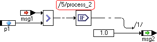
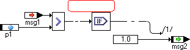
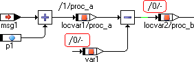
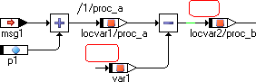
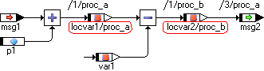
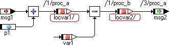
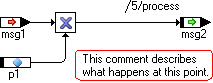
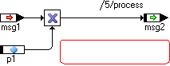

# BDE Tab

The BDE tab contains options for representation in the block diagram and state machine editor. The following options are available:

- Show Sequence Calls

If this option is deactivated for a view, all assigned sequence calls in the diagrams are hidden in this view.

 

Option activated Option deactivated

- Show Unused Sequence Calls

If this option is deactivated for a view, all unused sequence in the diagrams are hidden in this view.

 

Option activated Option deactivated

The Show * Sequence Calls options are not identical with the procedure described in [Changing the Visibility of Individual Sequence Calls](BlockDiagramEditorEnglishUS.chm::/Changevisibility.htm) and [Changing the Visibility of Several Sequence Calls](BlockDiagramEditorEnglishUS.chm::/Changevisibility.htm). The menu options described there are ineffective if Show * Sequence Calls is deactivated for the current view.

- Show Method/Process for Locals

If this option is deactivated, the method names in method-local elements and the process names in process-local elements are hidden. The / separator remains visible.

 

Option activated Option deactivated

- Show Graphical Comments

If this option is deactivated for a view, all comments in the diagrams are hidden for this view.

If the option is activated, comments are displayed. If the Invisible attribute was selected in the element-specific options for one or more comments, these comments are hidden nonetheless. For more information on element-specific options, see [Editing the Views of a Diagram Item](AD_EditView_of_DiagramItem.md) and [Options for Element Types](Options_for_Element_Types.md).

 

Option activated Option deactivated

See also

[Changing the Visibility of Individual Sequence Calls](BlockDiagramEditorEnglishUS.chm::/Changevisibility.htm)

[Changing the Visibility of Several Sequence Calls](BlockDiagramEditorEnglishUS.chm::/Changevisibility.htm)

[Editing the Views of a Diagram Item](AD_EditView_of_DiagramItem.md)

[Options for Element Types](Options_for_Element_Types.md)

[Documentation Tab](AD_Documentation_Tab.md)

[Elements Tab](AD_Elements_Tab.md)
