# Merged CHM Content

## Overview

_Source: `markdown/BDE_Overview.md`_

# Overview - Block Diagram Editor

This section describes in detail how to use the block diagram editor. It focuses on using the program rather than developing any particular functionality.

The ASCET block diagram editor is used to specify components graphically. The user draws a block diagram that determines what the component does.

A component can contain basic and complex elements, operators, control flow statements and references to other components.

With the block-oriented description language of ASCET embedded control systems can be specified graphically. It is the graphical equivalent of the ESDL language used for specifying control systems textually.

This section describes how to specify software modes using block diagrams in ASCET. The following section starts with a brief introduction to the graphical description of components, which is followed by an overview of the graphic modelling language.

The overview section presents linguistic means available in block diagrams:

- Elements
- Expressions

- Statements

Block diagrams and ESDL are, for the most part, functionally equivalent in ASCET. The differences between block diagrams and ESDL are summarized in [ESDL vs. Block Diagrams.](ESDLEditorEnglishUS.chm::/ESDL_ESDL_vs._Block_Diagrams.htm)

- See also

[Defining a Component Signature](markdown/DefiningInterface.md)

[Complex Types as Signature Elements](markdown/BDE_ComplexTypes.md)

[Creating Block Diagrams](markdown/Creatingblockdiagram.md)

[Editing Block Diagrams](markdown/EditingBlockDiagram.md)

[Sequence Calls](markdown/BDE_SequenceCalls.md)

[Implementation Casts in Block Diagrams](markdown/BDE_ImplementationCasts.md)

[Graphical Hierarchies](markdown/GraphicalHierarchies.md)

[Navigating between Components](markdown/NavigatingComponents.md)

[Analyzing Components](markdown/AnalyzingComponents.md)

[Data Exchange](markdown/DataExchange.md)

[ESDL vs. Block Diagrams](ESDLEditorEnglishUS.chm::/ESDL_ESDL_vs._Block_Diagrams.htm)

[Creating a Module](ComponentManagerEnglishUS.chm::/Creating_a_Module.htm)

[Creating a Class](ComponentManagerEnglishUS.chm::/Creating_Classes.htm)

[Creating Continuous Time Blocks](ComponentManagerEnglishUS.chm::/Creating_CT_Blocks.htm)

[Creating a State Machine](ComponentManagerEnglishUS.chm::/Creating_a_State_Machine.htm)

---

## Graphical Description of Elements

_Source: `markdown/bde_graphical_description_of_elements.md`_

# Graphical Description of Elements

Every element and operator used in a component is graphically represented by a diagram item in the form of a rectangle. The interaction between these elements is represented by lines connecting the corresponding diagram items.

The interface of an element is represented graphically by pins (first figure). Each argument of a method is represented by an argument pin (with a little arrow head pointing towards the block) at the block frame. The return values are represented by a return pin. The call to a method is associated with its return pin. Methods without arguments or return values are represented by a method pin.

The name of the element is placed underneath the rectangle. An icon can be used to illustrate the functionality of an element. The position of the pins can be changed by the user.

The example in the second figure shows a complex element with three methods. Method m1 has one argument and a return value. Method m2 has no return value and is represented by its arguments, method m3 has neither arguments nor a return value and is represented by a method pin.

---

## Basic Elements

_Source: `markdown/bde_overview_-_basic_elements.md`_

# Overview - Basic Elements

Elements are represented as rectangular blocks with the arguments and return values represented as pins. Each element has a name that is placed underneath the block by default, but this position can be changed. Except for [reserved keywords](IntroductionEnglishUS.chm::/INT_Reserved_Keywords.htm), the name can be freely chosen.

All basic types have a fixed interface and their graphical representation is also fixed.

See also

[Basic Scalar Elements](markdown/BDE_Basic_Scalar_Elements.md)

[Messages](markdown/BDE_Messages.md)

[Arrays and Matrices](markdown/BDE_Arrays_and_Matrices.md)

[Get and Set Ports for Arrays and Matrices](markdown/BDE_Get_and_Set_Ports_for_Arrays_and_Matrices.md)

[Characteristic Tables](markdown/BDE_Characteristic_Tables.md)

[Resources](markdown/BDE_Resources.md)

[Implementation Casts](markdown/BDE_Implementation_Casts.md)

1. [Reserved Keywords](IntroductionEnglishUS.chm::/INT_Reserved_Keywords.htm)

---

## Basic Scalar Elements

_Source: `markdown/BDE_Basic_Scalar_Elements.md`_

# Basic Scalar Elements

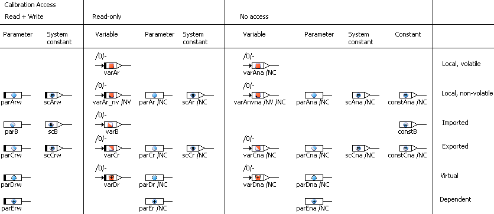

Basic scalar elements have one argument pin for setting a new value (if their value can be set), and one return pin for reading the current value. The icon inside the block represents the kind of the element: variables are marked by a square, parameters are marked by a circle. Smaller overlay icons are used to mark constants, system constants, non-volatile variables

The scope of an element is also indicated by the icon: a fully colored icon represents a local element, an icon with a colored lower-left half represents an imported element, an icon with a colored upper-right half represents an exported element.

If the kind of the basic scalar element does not permit writing to it (e.g. parameters), the corresponding pin is missing.

Parameters with calibration access set to read/write and variables with calibration access set to read-only are marked with a black bar at the left side.

Imported elements will inherit their properties from their exported counterparts.

See also

[Properties Editor - Calibration Access](ElementEditorEnglishUS.chm::/EEd_CalibrationAccess.htm)

---

## Messages

_Source: `markdown/BDE_Messages.md`_

# Messages

Messages are the input and output variables of processes. Depending on the message type, they are displayed with pin(s) on the left side, the right side, or both sides.

The first figure shows scalar messages in the block diagram editor. The colored symbols mark the directions of the messages. Scope and other properties, which are marked by certain symbols on variables and parameters, are not marked.

The second figure shows non-scalar messages in the block diagram editor. The colored symbols mark the directions of the messages. Scope and other properties are not marked.

For exported and local messages of scalar, array or matrix type, [calibration access](ElementEditorEnglishUS.chm::/EEd_CalibrationAccess.htm) is set to read-only, indicated by the black bar at the left end of the message icons. Changing the calibration access makes the display change as shown for variables in [Basic Scalar Elements](markdown/BDE_Basic_Scalar_Elements.md). Imported messages of the said types will inherit their properties from their exported counterparts.

For messages of record type, calibration access is not reflected in the message icon.

See also

[Introduction - Messages](IntroductionEnglishUS.chm::/INT_messages.htm)

[Creating a Message](markdown/BDE_CreateMessage.md)

[Calibration Access](ElementEditorEnglishUS.chm::/EEd_CalibrationAccess.htm)

[Basic Scalar Elements](markdown/BDE_Basic_Scalar_Elements.md)

---

## Arrays and Matrices

_Source: `markdown/BDE_Arrays_and_Matrices.md`_

# Arrays and Matrices

##### Normal arrays and matrices

A normal array or matrix, i.e. an array or matrix not used as message, has two methods, one for setting the content of a specific element and one for retrieving it. The read and write operations can occur independently of each other. The value to be written to the array is represented by the left (argument) pin, the corresponding index by the bottom left pin. The result of reading from the array is represented by the return pin and the index by the bottom right argument pin.

Matrices are represented similarly, but each method takes two index arguments. The x-index is represented by the bottom left pin, like the index of an array. The y-index is represented by the pin at the top of the block with the top left pin being the index for writing to the matrix, and the top right pin the index when reading from it.

##### Arrays and matrices used as messages

An array or matrix used as message has one or two methods, depending on the message type. The available methods are the same as for normal arrays/matrices.

##### Both

In the context of a project, you can use the [Protected Vector Indices](ProjectEditorEnglishUS.chm::/PE_Code_Generation_Options.htm) option to protect array and matrix indices against over- or underflow.

See also

[G](markdown/BDE_Get_and_Set_Ports_for_Arrays_and_Matrices.md)et and Set Ports for Arrays and Matrices

[Arrays, Matrices, Characteristic Lines and Maps](markdown/BDE_ArraysMatrices.md)

[Introduction - Variant Size for Arrays and Matrices](IntroductionEnglishUS.chm::/INT_VariantSize_ArraysMatrices.htm)

[Introduction - Variable Size for Arrays and Matrices](IntroductionEnglishUS.chm::/INT_VariableSize_ArraysMatrices.htm)

[Project Editor - Code Generation Options](ProjectEditorEnglishUS.chm::/PE_Code_Generation_Options.htm)

[Creating an Array or Matrix](markdown/CreateArray.md)

[Creating a Message](markdown/BDE_CreateMessage.md)

---

## Get and Set Ports for Arrays and Matrices

_Source: `markdown/BDE_Get_and_Set_Ports_for_Arrays_and_Matrices.md`_

# Get and Set Ports for Arrays and Matrices

When arrays or matrices are to be passed as method arguments, or returned as return values, this is done with the help of Get and Set ports. These are made available via the Get/Set Ports context menu function in the drawing area.

The Get port provides a pointer to the entire data content of the respective element; the Set port directs the element to access a certain memory area.

If you want to use the Set port of an array or matrix, that array/matrix must be specified as explicit reference. Otherwise, an error (MMdl3) is issued during code generation:

<array/matrix name> - due to <reason> (without reference flag) - is not a left value for assignment

The availability of get and Set ports depends on whether an array or matrix is used as [normal element](#NormalArray) or as [message](#MessageArray).

##### Normal arrays and matrices

Normal arrays and matrices can have get and Set ports.

In the above figure, array reads from the memory area used by arg_array, while matrix reads from the memory area used by arg_matrix. The pointers to the respective memory areas are passed via the Get and Set ports. It is important that writing to the Set port is performed as the first step of the method; otherwise, inconsistencies arise.

The same mechanism is used to pass classes, too.

##### Arrays and matrices used as messages

Arrays and matrices used as Receive or SendReceive messages can have only Get ports. Arrays and matrices used as Send messages can have neither Set nor Get ports.

See also

[Arrays and Matrices](markdown/BDE_Arrays_and_Matrices.md)

[Messages](markdown/BDE_Messages.md)

[Arrays, Matrices, Characteristic Lines and Maps](markdown/BDE_ArraysMatrices.md)

---

## Characteristic Lines and Maps

_Source: `markdown/BDE_Characteristic_Tables.md`_

# Characteristic Lines and Maps

Depending on the dimension, characteristic lines and maps, including fixed characteristic lines and maps, have one or two argument pins on the left side where the sample values are supplied, and one return pin where the value of the interpolation is given.

The above representation corresponds to using the getAt method in ESDL (cf. [Characteristic Lines - Description](ESDLEditorEnglishUS.chm::/ESDL_One-Dimensional_Tables_-_Description.htm) and [Characteristic Maps - Description](ESDLEditorEnglishUS.chm::/ESDL_Two-Dimensional_Tables_-_Description.htm)).

As with ESDL, the search and interpolate steps in characteristic lines and maps can be separated in the block diagram editor. To do so, the extended table interface has to be made available via the Extended Interface context menu function in the drawing area.

A distribution has one argument pin for the sample value on the left side of the distribution. A group characteristic line/map has one return pin on the right side. It contains no own sample point distribution, but references one or two distributions instead. Group characteristic lines/maps and distributions do not have an extended interface.

The green arrows in the images above indicate strictly increasing axis points (in characteristic maps: strictly increasing x axis points) of normal and fixed characteristic lines/maps and distributions. Characteristic lines/maps or distributions with strictly decreasing axis points are marked with red downward arrows.

Group characteristic lines/maps inherit the arrow from the assigned (X) distribution.

As with arrays and matrices, Get and Set ports can be made available via the Get/Set Ports context menu function.

If you want to pass characteristic tables as method arguments, you have to embed them in classes, and pass the class via the Get port.

ASCET provides linear and rounded interpolation, as well as [high-resolution interpolation](IntroductionEnglishUS.chm::/INT_HighRes_InterpolationRoutines.htm), for characteristic lines and maps, plus the possibility to add [user-defined interpolation routines](IntroductionEnglishUS.chm::/INT_UserDefinedInterpolationRoutines.htm).

See also

[Characteristic Lines - Description](ESDLEditorEnglishUS.chm::/ESDL_One-Dimensional_Tables_-_Description.htm)

[Characteristic Maps - Description](ESDLEditorEnglishUS.chm::/ESDL_Two-Dimensional_Tables_-_Description.htm)

[User-Defined Interpolation Routines](IntroductionEnglishUS.chm::/INT_UserDefinedInterpolationRoutines.htm)

[High-Resolution Interpolation Routines](IntroductionEnglishUS.chm::/INT_HighRes_InterpolationRoutines.htm)

---

## Resources

_Source: `markdown/BDE_Resources.md`_

# Resources

Resources are represented by a block with the two methods reserve and release at the top. Both methods have no arguments or return values and are represented as method pins:

---

## Implementation Casts

_Source: `markdown/BDE_Implementation_Casts.md`_

# Implementation Casts

Implementation casts are represented by a small diamond with two pins.

---

## Elements of User-Defined Type

_Source: `markdown/bde_elements_of_user-defined_type.md`_

# Elements of User-Defined Type

The methods, arguments and return values of elements of user-defined type are represented by argument or return pins at the graphical block. The user can define the layout of the representation for each user defined type. Get and Set ports can be made available for these elements, too.

---

## Expressions

_Source: `markdown/BDE_Expressions.md`_

# Expressions

Expressions are formed in block diagrams by connecting elements or other expressions with operators. Like in ESDL, expressions are built up recursively, as follows:

- An element is an expression.
- The result of an operator is an expression (the operands itself are expressions).
- The return value of a method call is an expression. If arguments are supplied to the method, these arguments also belong to the expression.

The range of an expression is therefore limited by the base expressions in that expression, which are either elements or return values of methods without arguments.

Expressions are built graphically by connecting the return pins of elements or operators with the argument pins of methods or other operators.

There are no precedence rules for operators in the BDE, since the expressions are “bracketed” by the way the lines and operators are connected. The following example shows the difference between the expressions (a*b)+c and a*(b+c) in the graphical representation.

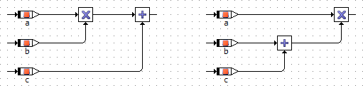

The evaluation order of the arguments of operators is sometimes very important. In the graphical representation this sequence is always from top to bottom, except for the four basic arithmetic operators with at most three inputs. The order of evaluation is illustrated in the following diagram:

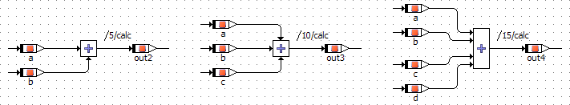

In block diagrams the number of arguments to the operators is often limited to a maximum of 10 or 20 inputs. The evaluation order of method arguments depends on the order in which they are defined. Since the layout of an element can be changed, the order in the layout must not coincide with that in the definition.

---

## Statements

_Source: `markdown/BDE_Statements.md`_

# Statements

Graphical specifications of components can be hierarchically distributed over several diagrams. In a diagram one or more methods or processes can be described which can be executed independently of each other. The order in which calculations are executed, as well as the particular method or process a calculation belongs to is determined by sequence calls.

For each statement of a block diagram, there is a sequence call that assigns it to a process or method. The order within a process or method is determined by the sequence number that is part of the sequence call. A sequence call is represented graphically as follows:

 (<n> being the sequence number)

With the sequence numbers the order of the operations belonging to one method or process can be determined by the user. A built-in sequencing algorithm can be used to assign sequence numbers that correspond to the evaluation order of standard block diagrams.

A sequence call generally consists of three fields:

- The name of the method called.
- The sequence number determining the position of the called method in the calling method or process.

- The name of the method or process calling.

In the case of scalar elements, the name of the method called is left blank as this is always the assignment of a new value.

There are three kinds of statements:

- Assignment statements
- Method calls
- [Control Flow Statements](markdown/BDE_ControlFlow_Summary.md), e.g. if…then…else, while

See also

[Sequence Calls](markdown/BDE_SequenceCalls.md)

[Control Flow Elements - Summary](markdown/BDE_ControlFlow_Summary.md)

[Assignment](markdown/BDE_Assignment.md)

---

## Assignment

_Source: `markdown/BDE_Assignment.md`_

# Method Call and Assignment

An assignment statement is the assignment of the value of an expression to an element. In case of an assignment to a complex element, only an element of the same type can be assigned. The assignment is then not the assignment of a value but of a reference.

A special case is that of assigning a value to the return value of a method. The associated sequence call must be the last sequence call of that method.

An assignment is a special case of a method call. When calling a method in a block diagram, the corresponding sequence call has to be filled in properly and the arguments to the method have to be supplied.

See also

[Statements](markdown/BDE_Statements.md)

[Sequence Calls](markdown/BDE_SequenceCalls.md)

---

## Component Signature

_Source: `markdown/DefiningInterface.md`_

# Defining a Component Signature

The first step in specifying a component is to define its signature. The signature determines how the component interacts with other components, i.e. what data it receives and passes on, and how it can be addressed. The signature is the main difference when specifying different types of components in the block diagram editor. Therefore it is explained separately for classes and modules.

See also

[Classes](markdown/BDE_Classes.md)

[Modules](markdown/BDE_Modules.md)

[Directions of Method Arguments](markdown/BDE_DirectionsMethodArguments.md)

[Complex Types as Signature Elements](markdown/BDE_ComplexTypes.md)

[Conversion of Methods or Processes](markdown/BDE_Conversion_MethodsProcesses.md)

---

## Classes

_Source: `markdown/BDE_Classes.md`_

# Classes

The signature of a class consists of its public methods and their arguments and return values. The arguments form the input parameters of the class, the return values form the output parameters. The methods can be stimulated externally to trigger the calculations within a component.

See also

[Creating a Method](markdown/CreateMethod.md)

[Editing the Signature of a Method](markdown/EditMethod.md)

[Adding an Argument to the Method](markdown/Addargument.md)

[Adding a Return Value to the Method](markdown/Returnvalue.md)

[Adding Local Variables to the Method](markdown/BDE_Localvariables.md)

[Editing Arguments and Local Variables](markdown/EditArguments.md)

[Renaming or Deleting a Method](markdown/RenameorDelete.md)

[Moving a Diagram or Method](markdown/MoveDiagram.md)

[Assigning a Component as an Argument](markdown/BDE_AssignComponent.md)

---

## Modules

_Source: `markdown/BDE_Modules.md`_

# Modules

The signature of a module consists of processes and - if present - public methods. A default process is created automatically for every new module; further processes and methods must be added manually. Processes determine the activation of the module functionality, but they do not define inputs or outputs. Modules communicate and interact using messages and global elements (imported, exported elements).

See also

[Creating a Process](markdown/Createprocess.md)

[Creating a Method](markdown/CreateMethod.md)

[Conversion of Methods or Processes](markdown/BDE_Conversion_MethodsProcesses.md)

[Messages](markdown/BDE_Messages.md)

---

## Directions of Method Arguments

_Source: `markdown/BDE_DirectionsMethodArguments.md`_

- Default direction for arguments of value type.
- In arguments can be read in the method. An error is produced for each write access to an In argument.
- In arguments get the value from the expression passed to the invoked method.

- Default direction for arguments of reference type.
- InOut arguments can be read and written in the method.
- InOut arguments must be initialized before they are passed to the invoked method.
- If an InOut argument is only read, or only written, in the method, you are informed that you can change the direction to In, or Out.
- Since an InOut argument can be written, and its value passed to the calling entity, only variables can be assigned to InOut arguments. Parameters, the output of a calculation, etc., are not allowed.

- Out arguments can be written in the method. An error is produced for each read access to an Out argument.
- Out arguments need not be initialized before they are passed to the invoked method. They are considered initialized for the code following the invocation.
- All Out arguments must be written before the method is exited. An error is produced if one or more Out arguments is not written.
- Since an Out argument must be written, and its value is passed to the calling entity, only variables can be assigned to an Out argument. Parameters, the output of a calculation, etc., are not allowed.
- Classes cannot be used as Out arguments.

# Directions of Method Arguments

Since ASCET 6.0, the attribute Direction is available for method arguments. This attribute can be set in the [Arguments](markdown/BDE_Arguments_Tab.md) tab of the signature editor. The argument direction determines access semantic for the argument as well as the way parameters are passed. The latter can be different for value types and reference types (see [Value Types and Reference Types](IntroductionEnglishUS.chm::/INT_ValueTypes_ReferenceTypes.htm))

Available directions and their properties are summarized in the following table.

<table style="x-cell-content-align: Top;
				margin-top: 3px;
				border-left-style: Outset;
				border-top-style: Outset;
				border-right-style: Outset;
				border-bottom-style: Outset;
				border-left-width: 1px;
				border-right-width: 1px;
				border-top-width: 1px;
				border-bottom-width: 1px;" x-use-null-cells="">
<col/>
<col/>
<col/>
<col/>
<tr class="hcp1" valign="top">
<td class="hcp2" colspan="1" rowspan="2">

Argument direction
</td>
<td class="hcp2" colspan="1" rowspan="2">

Access semantic
</td>
<td class="hcp2" colspan="2" rowspan="1">

Parameter Passing 
</td>
</tr>
<tr class="hcp1" valign="top">
<td class="hcp2">

value types
</td>
<td class="hcp2">

reference types
</td></tr>
<tr class="hcp1" valign="top">
<td class="hcp2">

In
</td>
<td class="hcp2">

read only
</td>
<td class="hcp2">

by value
</td>
<td class="hcp2">

by reference
</td></tr>
<tr class="hcp1" valign="top">
<td class="hcp2">

Out
</td>
<td class="hcp2">

write only
</td>
<td class="hcp2">

by reference
</td>
<td class="hcp2">

by reference
</td></tr>
<tr class="hcp1" valign="top">
<td class="hcp2">

InOut
</td>
<td class="hcp2">

read and write
</td>
<td class="hcp2">

by reference
</td>
<td class="hcp2">

by reference
</td></tr>
</table>

The following must be kept in mind when setting the direction:

##### [In](javascript:kadovTextPopup(this))<!-- kadovTextPopupInit('a1'); //-->

##### [InOut](javascript:kadovTextPopup(this))<!-- kadovTextPopupInit('a2'); //-->

##### [Out](javascript:kadovTextPopup(this))<!-- kadovTextPopupInit('a3'); //-->

See also

[Arguments Tab](markdown/BDE_Arguments_Tab.md)

[Value Types and Reference Types](IntroductionEnglishUS.chm::/INT_ValueTypes_ReferenceTypes.htm)

[Adding an Argument to the Method](markdown/Addargument.md)

/* Heikki Komulainen, Comet Computer GmbH 2004 */ cc_plus_pic = '&nbsp;'; cc_minus_pic = '&nbsp;'; cc_stat_pic = '&nbsp;'; gpstyle = ''; var iframes_created = 0; if (document.body && document.body.insertAdjacentHTML && document.getElementsByTagName && document.getElementById) { collect_popups(); set_poplinks_pictures(); if (iframes_created) { document.write(gpstyle); document.write('
<nobr><a id="einauslink" style="position:absolute;top:expression(document.body.scrollTop + this.offsetHeight - this.offsetHeight);left:expression(document.body.offsetWidth - (this.offsetWidth + 28));background:white;padding:5px" href="javascript:show_all_poptext()">Alle texte einblenden</a></nobr>
'); } } function collect_popups() { bsscpopups = new Array(); for (x = 0; x < document.links.length; x++) { if (document.links[x].href.indexOf("BSSCPopup")>-1) { seekmatch = /BSSCPopup.'[^'](markdown/+)'/; poplink = seekmatch.exec(document.links[x].href); poplink = "" + poplink; poplink = poplink.substring(poplink.indexOf("'")+1, poplink.lastIndexOf("'")); ifid = "CCGENIFRAMEID" + x; new_iframe = '<iframe id="' + ifid + '"src="' + poplink + '" onload="get_text(\'' + ifid + '\')" width="0" height="0" frameborder=0></iframe>'; document.links[x].parentNode.insertAdjacentHTML("afterEnd", new_iframe); gpid = "CCID_" + ifid; document.links[x].href = "javascript:expand_poptext('" + gpid + "')"; cc_plus = '' + cc_plus_pic + ''; document.links[x].insertAdjacentHTML("afterBegin", cc_plus); iframes_created = 1; } } }// end function function get_text(ifr_id) { frpars = document.frames[ifr_id].document.getElementsByTagName("body"); popbody = frpars[0].innerHTML; gpid = "CCID_" + ifr_id; if (!document.getElementById(gpid)) { //avoiding doubles document.getElementById(ifr_id).insertAdjacentHTML("afterEnd", '
'+popbody+'
'); } }//end function function expand_poptext(x_frame_id) { if (!document.getElementById(x_frame_id)) return; if (document.getElementById(x_frame_id).className == "CCGENPOPTEXTH") { document.getElementById(x_frame_id).className = "CCGENPOPTEXTV"; document.getElementById(x_frame_id).style.visibility = "visible"; if (document.getElementById("CCPMB_" + x_frame_id )) { document.getElementById("CCPMB_" + x_frame_id ).innerHTML = cc_minus_pic; } } else { document.getElementById(x_frame_id).className = "CCGENPOPTEXTH"; document.getElementById(x_frame_id).style.visibility = "hidden"; if (document.getElementById("CCPMB_" + x_frame_id )) { document.getElementById("CCPMB_" + x_frame_id ).innerHTML = cc_plus_pic; } } }// end function function show_all_poptext() { var pulldowntxt = document.getElementsByTagName("div"); for (b = 0; b < pulldowntxt.length; b++) { if (pulldowntxt[b].className == "droptext") { pulldowntxt[b].style.display=""; } } var gptxt = document.getElementsByTagName("div"); for (z = 0; z < gptxt.length; z++) { if (gptxt[z].className == "CCGENPOPTEXTH") { gptxt[z].className = "CCGENPOPTEXTV"; gptxt[z].style.visibility = "visible"; if (document.getElementById("CCPMB_" + gptxt[z].id )) { document.getElementById("CCPMB_" + gptxt[z].id ).innerHTML = cc_minus_pic; } } } var dxpoplinks = document.getElementsByTagName("a"); if (dxpoplinks) { for (pxl = 0; pxl < dxpoplinks.length; pxl++) { if (dxpoplinks[pxl].href.indexOf("kadovTextPopup")>-1) { if (document.getElementById("CCPMB_" + dxpoplinks[pxl].id)) { document.getElementById("CCPMB_" + dxpoplinks[pxl].id).innerHTML = cc_stat_pic; dxpoplinks[pxl].symbol = "minus"; } } } } document.getElementById('einauslink').innerText = 'Alle texte ausblenden'; document.getElementById('einauslink').href = "javascript:self.location.reload()"; self.focus(); }// end function function eat_click() { return false; }// end function function set_poplinks_pictures() { var dpoplinks = document.getElementsByTagName("a"); if (dpoplinks) { for (pl = 0; pl < dpoplinks.length; pl++) { if (dpoplinks[pl].href.indexOf("kadovTextPopup")>-1) { cc_plus = '' + cc_stat_pic + ''; //dpoplinks[pl].onmouseup = plusminuspoplink; dpoplinks[pl].insertAdjacentHTML("afterBegin", cc_plus); dpoplinks[pl].symbol = "plus"; } } } }// end function function plusminuspoplink() { if (document.getElementById("CCPMB_" + this.id)) { if (this.symbol == "plus") { document.getElementById("CCPMB_" + this.id).innerHTML = cc_minus_pic; this.symbol = "minus"; } else { document.getElementById("CCPMB_" + this.id).innerHTML = cc_plus_pic; this.symbol = "plus"; } } return true; }

---

## Complex Types as Signature Elements

_Source: `markdown/BDE_ComplexTypes.md`_

# Complex Types as Signature Elements

You can use [composite elements](IntroductionEnglishUS.chm::/INT_composite_summaryct.htm) and classes as method signature elements. The usage is explained with the help of examples.

In offline experiments, methods with composite arguments, i.e. array, matrix or component arguments, do not appear in the [event generator](ExperimentationEnglishUS.chm::/event_generator.htm). No event can be created for them, and they cannot be accessed during the offline experiment.

##### Arrays, Matrices and Classes as Signature Elements

When using a composite or user-defined signature element (array, matrix, class), you can access it via the normal element pins. In addition, you can use the Get and Set ports to access the entire data structure. A matrix is used as an example to describe the procedure; see [Using a Matrix Argument (Example)](markdown/BDE_UseMatrixArgument_Example.md).

##### Characteristic Lines and Maps as Arguments

You cannot directly pass a characteristic line or map as argument. To do so, you have to include the characteristic line/map in a class, and use the class as an argument. The procedure is described for a characteristic line; see [Characteristic Line as Argument (Example)](markdown/BDE_CharacteristicLineArgument_Example.md).

See also

[Using a Matrix Argument (Example)](markdown/BDE_UseMatrixArgument_Example.md)

[Characteristic Line as Argument (Example)](markdown/BDE_CharacteristicLineArgument_Example.md)

[Composite Types - Summary](IntroductionEnglishUS.chm::/INT_composite_summaryct.htm)

---

## Conversion of Methods or Processes

_Source: `markdown/BDE_Conversion_MethodsProcesses.md`_

A method with two arguments and some local variables shall be converted into a process.

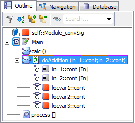

The arguments have no corresponding signature elements in a process; they cannot be kept, and the conversion fails. The reason is displayed in the ASCET monitor window.

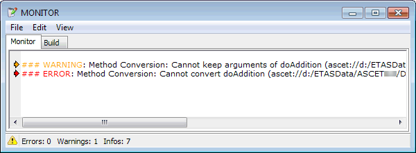

# Conversion of Methods or Processes

ASCET offers the possibility to convert one signature type into another, e.g., a method into a process, or vice versa.

During conversion, the behavior specified for the signature type is kept. All external references (e.g., in other components) to the signature type are removed. This includes

- process assignments to a task of a project (will become <undefined> Tasks field of the project editor)
- assigned sequence calls if the original method/process was used in the graphical specification of another component (will be reset)
- references in the EHOOKS configuration

## Restrictions

The following restrictions apply:

- Only one method or process can be converted at a time.

Simultaneous conversion of several methods/processes is not supported.

- Conversion is not possible if the component provides only one signature type.
- Conversion is not possible if any information would be lost.

In such a case, conversion starts, but aborts with an error message shown in the ASCET monitor window. Click [here](javascript:kadovTextPopup(this))<!-- kadovTextPopupInit('a1'); //--> for an example.

- In block diagram components, you can convert only methods/processes that belong to the currently loaded diagram.

- The conversion algorithm does not check semantical equivalence.
- The following signature types cannot be converted:
- AUTOSAR runnables
- operations in AUTOSAR ClientServer interfaces
- triggers, actions and conditions in state machines
- methods in CT blocks, Boolean or conditional tables
- Methods cannot be converted to AUTOSAR runnables.
- It is not possible to undo a conversion.

See also

[Converting a Method or Process](markdown/BDE_Convert_MethodProcess.md)

[Project Editor - Processes](ProjectEditorEnglishUS.chm::/PE_processes.htm)

/* Heikki Komulainen, Comet Computer GmbH 2004 */ cc_plus_pic = '&nbsp;'; cc_minus_pic = '&nbsp;'; cc_stat_pic = '&nbsp;'; gpstyle = ''; var iframes_created = 0; if (document.body && document.body.insertAdjacentHTML && document.getElementsByTagName && document.getElementById) { collect_popups(); set_poplinks_pictures(); if (iframes_created) { document.write(gpstyle); document.write('
<nobr><a id="einauslink" style="position:absolute;top:expression(document.body.scrollTop + this.offsetHeight - this.offsetHeight);left:expression(document.body.offsetWidth - (this.offsetWidth + 28));background:white;padding:5px" href="javascript:show_all_poptext()">Show all hidden text</a></nobr>
'); } } function collect_popups() { bsscpopups = new Array(); for (x = 0; x < document.links.length; x++) { if (document.links[x].href.indexOf("BSSCPopup")>-1) { seekmatch = /BSSCPopup.'[^'](markdown/+)'/; poplink = seekmatch.exec(document.links[x].href); poplink = "" + poplink; poplink = poplink.substring(poplink.indexOf("'")+1, poplink.lastIndexOf("'")); ifid = "CCGENIFRAMEID" + x; new_iframe = '<iframe id="' + ifid + '"src="' + poplink + '" onload="get_text(\'' + ifid + '\')" width="0" height="0" frameborder=0></iframe>'; document.links[x].parentNode.insertAdjacentHTML("afterEnd", new_iframe); gpid = "CCID_" + ifid; document.links[x].href = "javascript:expand_poptext('" + gpid + "')"; cc_plus = '' + cc_plus_pic + ''; document.links[x].insertAdjacentHTML("afterBegin", cc_plus); iframes_created = 1; } } }// end function function get_text(ifr_id) { frpars = document.frames[ifr_id].document.getElementsByTagName("body"); popbody = frpars[0].innerHTML; gpid = "CCID_" + ifr_id; if (!document.getElementById(gpid)) { //avoiding doubles document.getElementById(ifr_id).insertAdjacentHTML("afterEnd", '
'+popbody+'
'); } }//end function function expand_poptext(x_frame_id) { if (!document.getElementById(x_frame_id)) return; if (document.getElementById(x_frame_id).className == "CCGENPOPTEXTH") { document.getElementById(x_frame_id).className = "CCGENPOPTEXTV"; document.getElementById(x_frame_id).style.visibility = "visible"; if (document.getElementById("CCPMB_" + x_frame_id )) { document.getElementById("CCPMB_" + x_frame_id ).innerHTML = cc_minus_pic; } } else { document.getElementById(x_frame_id).className = "CCGENPOPTEXTH"; document.getElementById(x_frame_id).style.visibility = "hidden"; if (document.getElementById("CCPMB_" + x_frame_id )) { document.getElementById("CCPMB_" + x_frame_id ).innerHTML = cc_plus_pic; } } }// end function function show_all_poptext() { var pulldowntxt = document.getElementsByTagName("div"); for (b = 0; b < pulldowntxt.length; b++) { if (pulldowntxt[b].className == "droptext") { pulldowntxt[b].style.display=""; } } var gptxt = document.getElementsByTagName("div"); for (z = 0; z < gptxt.length; z++) { if (gptxt[z].className == "CCGENPOPTEXTH") { gptxt[z].className = "CCGENPOPTEXTV"; gptxt[z].style.visibility = "visible"; if (document.getElementById("CCPMB_" + gptxt[z].id )) { document.getElementById("CCPMB_" + gptxt[z].id ).innerHTML = cc_minus_pic; } } } var dxpoplinks = document.getElementsByTagName("a"); if (dxpoplinks) { for (pxl = 0; pxl < dxpoplinks.length; pxl++) { if (dxpoplinks[pxl].href.indexOf("kadovTextPopup")>-1) { if (document.getElementById("CCPMB_" + dxpoplinks[pxl].id)) { document.getElementById("CCPMB_" + dxpoplinks[pxl].id).innerHTML = cc_stat_pic; dxpoplinks[pxl].symbol = "minus"; } } } } document.getElementById('einauslink').innerText = 'Hide all hideable text'; document.getElementById('einauslink').href = "javascript:self.location.reload()"; self.focus(); }// end function function eat_click() { return false; }// end function function set_poplinks_pictures() { var dpoplinks = document.getElementsByTagName("a"); if (dpoplinks) { for (pl = 0; pl < dpoplinks.length; pl++) { if (dpoplinks[pl].href.indexOf("kadovTextPopup")>-1) { cc_plus = '' + cc_stat_pic + ''; //dpoplinks[pl].onmouseup = plusminuspoplink; dpoplinks[pl].insertAdjacentHTML("afterBegin", cc_plus); dpoplinks[pl].symbol = "plus"; } } } }// end function function plusminuspoplink() { if (document.getElementById("CCPMB_" + this.id)) { if (this.symbol == "plus") { document.getElementById("CCPMB_" + this.id).innerHTML = cc_minus_pic; this.symbol = "minus"; } else { document.getElementById("CCPMB_" + this.id).innerHTML = cc_plus_pic; this.symbol = "plus"; } } return true; }

---

## Creating Block Diagrams

_Source: `markdown/Creatingblockdiagram.md`_

# Creating Block Diagrams

After the interface for a component has been defined, the arguments and return values or the inputs and outputs are shown in the Outline tab of the block diagram editor. They can now be arranged on the drawing area and connected to other graphical elements, such as variables or operators.

See also

[Placing a Signature Element](markdown/PlaceElement.md)

[Creating a Basic Element](markdown/BasicElement.md)

[Inserting an Enumeration](markdown/InsertEnumeration.md)

[Positioning an Operator](markdown/PositionOperator.md)

[Connecting Diagram Elements](markdown/Connectdiagram.md)

[Arrays, Matrices, Characteristic Curves and Maps](markdown/BDE_ArraysMatrices.md)

[Using the If Statements](markdown/UseIf.md)

[Using the Switch](markdown/UseSwitch.md)

[Using the While Loop](markdown/Usewhileloop.md)

[Components as Complex Elements](markdown/BDE_ComplexElements.md)

[Comments and Notes](markdown/CommentsandNotes.md)

---

## Arrays,Matrices,Characteristic Lines and Maps

_Source: `markdown/BDE_ArraysMatrices.md`_

# Arrays, Matrices, Characteristic Lines and Maps

This section describes how to create arrays, matrices, characteristic lines and maps. [Editing Data](DataEditorEnglishUS.chm::/DEd_Overview.htm) describes how to edit the table data.

See also

[Creating an Array or Matrix](markdown/CreateArray.md)

[Complex Types as Signature Elements](markdown/BDE_ComplexTypes.md)

[Creating a Group Characteristic Line/Map](markdown/Creategroup.md)

[Editing Data - Overview](DataEditorEnglishUS.chm::/DEd_Overview.htm)

---

## Components as Complex Elements

_Source: `markdown/BDE_ComplexElements.md`_

# Components as Complex Elements

Components can be used as complex elements within other components. Whereas basic elements are defined in the component they are contained in, complex elements are included by reference, i.e. if the included component is changed, those changes are effective within the including component. You can connect other diagram items to the inputs and outputs of the included component.

When you include a component, its instance name is shown in the Outline tab. The plus sign in front of the instance name () indicates that the tree structure can be further expanded.

If you include the same component again, a new instance of the component is created and assigned a unique instance name. In the diagram, the instance name is displayed below the graphical block. In the Outline tab, both the instance and class name are displayed, using the following format: <instanceName>::<className>. You can adjust the width of the list to view its entire contents.

See also

[Including a Component as a Complex Element](markdown/IncludeComponent.md)

[Layout of Included Components](markdown/BDE_Layout.md)

---

## Comments and Notes

_Source: `markdown/CommentsandNotes.md`_

# Comments and Notes

Comments do not in any way influence the functionality of a component. They only contain explanatory text that can help document your software model.

See also

[Adding a Comment](markdown/Addcomment.md)

[Editing the Notes for a Component](markdown/BDE_Editnotes.md)

---

## Editing Block Diagrams

_Source: `markdown/EditingBlockDiagram.md`_

# Editing Block Diagrams

Editing block diagrams describes the general editing features of the drawing area, and the features that modify the appearance of diagram items.

In some cases it is useful to retrace actions taken or to return to an earlier version of the diagram in order to rework it from there. To do this, the actions carried out in the diagram are recorded step by step on the internal clipboard. However, you can only return to an earlier version of the diagram if you are working in an open editor. When you exit from the editor, only the most recently edited version is saved; the versions recorded in the clipboard are deleted.

See also

[Viewing all Graphical Occurrences of an Element](markdown/ViewElements.md)

[Renaming or Deleting a Diagram Item](markdown/BDE_rename_delete.md)

[Replacing a Diagram Item](markdown/ReplaceDiagram.md)

[Copying or Moving Graphical Items](markdown/BDE_CopyMove_GraphicItems.md)

[Deleting a Connection or an Element](markdown/Deleteconnection.md)

[Changing the Appearance of a Diagram Item](markdown/Changeappearance.md)

[Layout of Included Components](markdown/BDE_Layout.md)

[Changing the Way a Block Diagram is Displayed](markdown/ViewingandPrinting.md)

---

## Copying or Moving Graphical Items

_Source: `markdown/BDE_CopyMove_GraphicItems.md`_

All graphical elements are pasted to the currently loaded diagram.

Sequence calls of method-/process-/runnable-local elements are adjusted to the target method/process/runnable the elements belong to. Possible adjustments are

- different method name
- different (or reset) sequence number if the old numbers are in use.

Sequence calls of other elements are reset.

All graphical elements are pasted to the currently loaded diagram.

Sequence calls of method-/process-/runnable-local elements are adjusted to the target method/process/runnable the elements belong to. Possible adjustments are

- different method name
- different (or reset) sequence number if the old numbers are in use.

Sequence calls of other elements are reset.

If you selected the respective solution, the conflicting element names are changed.

If necessary, the visual properties (e.g., read/write access pins) are changed to reflect property changes.

All graphical elements are pasted to the currently loaded diagram.

Sequence calls of method-/process-/runnable-local elements are adjusted to the target method/process/runnable the elements belong to. Possible adjustments are

- different method name
- different (or reset) sequence number if the old numbers are in use.

Sequence calls of other elements are reset.

If you selected the respective solution, the following adjustments can be performed:

- Conflicting element names are changed.
- Visual properties (e.g., read/write access pins) are changed to reflect property changes.
- The graphical item is changed to reflect the type change (e.g., array vs. scalar element).
- Connection lines are updated to reflect type changes and/or invalid connections (e.g. connections between cont and log).

# Copying or Moving Graphical Items

Graphical items of a block diagram can be added to the same diagram, another diagram of the same component, or a diagram of another component, via cut, copy and paste. ASCET uses its own internal clipboard for graphical information, so these operations have no effect on the Windows clipboard.

You can cut/copy/paste all kinds of graphical items: elements, operators, included components, method-/process-local elements, etc. However, keep in mind the following restrictions:

- Graphical items can be pasted only to the currently loaded diagram.
- Method-/process-local elements can be pasted only to a single method or process at a time.

Elements copied/cut from different source methods/processes are pasted to the same target method or process.

- Pasting an element or included component to the same diagram creates a new graphical occurrence of the same object, not a new object.
- Pasting a method-/process-local element to the same diagram and the same method/process/runnable creates a new graphical occurrence of the same element, not a new element.
- You cannot paste elements to a method/process/runnable that does not support additional elements (e.g., a CT block method, or automatically generated runnables in an SWC).
- Only those elements are pasted that are allowed in the target component and the target method/process/runnable.

You cannot, e.g., paste a return value into a process, a state into a block diagram class, etc.

The following happens when you paste graphical items, depending on where you paste:

##### A. same component, same diagram

All graphical elements are pasted. Sequence calls are reset.

##### B. same component, different diagram

The behavior depends on the conflicts found during paste, and to the solutions you select.

- [no conflicts](javascript:kadovTextPopup(this))<!-- kadovTextPopupInit('a2'); //-->

- [Name conflicts](javascript:kadovTextPopup(this))<!-- kadovTextPopupInit('a1'); //-->

A name conflict occurs if a method-/process-/runnable-local element (argument or local variable) in the target diagram and method has the same name and type as a pasted method-/process-/runnable-local element.

- [Type conflicts](javascript:kadovTextPopup(this))<!-- kadovTextPopupInit('a3'); //-->

A type conflict occurs if a method-/process-/runnable-local element in the target diagram and method has the same name and a different type as a pasted method-/process-/runnable-local element.

- C. different component

The behavior is basically the same as for "same component, different diagram".

In addition, it is checked if pasting is allowed at all. If it is not, an error message opens and pasting is canceled.

If pasting is allowed, it is checked if the pasted elements are allowed in the target component and method/process/runnable. If at least one pasted element is not allowed (e.g., a return value in a process), another error message opens that lists the elements that cannot be pasted. You can continue pasting the allowed elements, or cancel the procedure.

A schematic view of the procedure for B and C is given in [Flow Chart: Copying or Moving Graphical Items](markdown/BDE_Flowchart_CopyMoveItems.md).

See also

[Flow Chart: Copying or Moving Graphical Items](markdown/BDE_Flowchart_CopyMoveItems.md)

[Copying/Moving Diagram Items in the Same Diagram](markdown/BDE_Cutcopypaste.md)

[Copying/Moving Diagram Items Between Diagrams](markdown/BDE_CopyMove_Items_betweenDiagram.md)

/* Heikki Komulainen, Comet Computer GmbH 2004 */ cc_plus_pic = '&nbsp;'; cc_minus_pic = '&nbsp;'; cc_stat_pic = '&nbsp;'; gpstyle = ''; var iframes_created = 0; if (document.body && document.body.insertAdjacentHTML && document.getElementsByTagName && document.getElementById) { collect_popups(); set_poplinks_pictures(); if (iframes_created) { document.write(gpstyle); document.write('
<nobr><a id="einauslink" style="position:absolute;top:expression(document.body.scrollTop + this.offsetHeight - this.offsetHeight);left:expression(document.body.offsetWidth - (this.offsetWidth + 28));background:white;padding:5px" href="javascript:show_all_poptext()">Show all hidden text</a></nobr>
'); } } function collect_popups() { bsscpopups = new Array(); for (x = 0; x < document.links.length; x++) { if (document.links[x].href.indexOf("BSSCPopup")>-1) { seekmatch = /BSSCPopup.'[^'](markdown/+)'/; poplink = seekmatch.exec(document.links[x].href); poplink = "" + poplink; poplink = poplink.substring(poplink.indexOf("'")+1, poplink.lastIndexOf("'")); ifid = "CCGENIFRAMEID" + x; new_iframe = '<iframe id="' + ifid + '"src="' + poplink + '" onload="get_text(\'' + ifid + '\')" width="0" height="0" frameborder=0></iframe>'; document.links[x].parentNode.insertAdjacentHTML("afterEnd", new_iframe); gpid = "CCID_" + ifid; document.links[x].href = "javascript:expand_poptext('" + gpid + "')"; cc_plus = '' + cc_plus_pic + ''; document.links[x].insertAdjacentHTML("afterBegin", cc_plus); iframes_created = 1; } } }// end function function get_text(ifr_id) { frpars = document.frames[ifr_id].document.getElementsByTagName("body"); popbody = frpars[0].innerHTML; gpid = "CCID_" + ifr_id; if (!document.getElementById(gpid)) { //avoiding doubles document.getElementById(ifr_id).insertAdjacentHTML("afterEnd", '
'+popbody+'
'); } }//end function function expand_poptext(x_frame_id) { if (!document.getElementById(x_frame_id)) return; if (document.getElementById(x_frame_id).className == "CCGENPOPTEXTH") { document.getElementById(x_frame_id).className = "CCGENPOPTEXTV"; document.getElementById(x_frame_id).style.visibility = "visible"; if (document.getElementById("CCPMB_" + x_frame_id )) { document.getElementById("CCPMB_" + x_frame_id ).innerHTML = cc_minus_pic; } } else { document.getElementById(x_frame_id).className = "CCGENPOPTEXTH"; document.getElementById(x_frame_id).style.visibility = "hidden"; if (document.getElementById("CCPMB_" + x_frame_id )) { document.getElementById("CCPMB_" + x_frame_id ).innerHTML = cc_plus_pic; } } }// end function function show_all_poptext() { var pulldowntxt = document.getElementsByTagName("div"); for (b = 0; b < pulldowntxt.length; b++) { if (pulldowntxt[b].className == "droptext") { pulldowntxt[b].style.display=""; } } var gptxt = document.getElementsByTagName("div"); for (z = 0; z < gptxt.length; z++) { if (gptxt[z].className == "CCGENPOPTEXTH") { gptxt[z].className = "CCGENPOPTEXTV"; gptxt[z].style.visibility = "visible"; if (document.getElementById("CCPMB_" + gptxt[z].id )) { document.getElementById("CCPMB_" + gptxt[z].id ).innerHTML = cc_minus_pic; } } } var dxpoplinks = document.getElementsByTagName("a"); if (dxpoplinks) { for (pxl = 0; pxl < dxpoplinks.length; pxl++) { if (dxpoplinks[pxl].href.indexOf("kadovTextPopup")>-1) { if (document.getElementById("CCPMB_" + dxpoplinks[pxl].id)) { document.getElementById("CCPMB_" + dxpoplinks[pxl].id).innerHTML = cc_stat_pic; dxpoplinks[pxl].symbol = "minus"; } } } } document.getElementById('einauslink').innerText = 'Hide all hideable text'; document.getElementById('einauslink').href = "javascript:self.location.reload()"; self.focus(); }// end function function eat_click() { return false; }// end function function set_poplinks_pictures() { var dpoplinks = document.getElementsByTagName("a"); if (dpoplinks) { for (pl = 0; pl < dpoplinks.length; pl++) { if (dpoplinks[pl].href.indexOf("kadovTextPopup")>-1) { cc_plus = '' + cc_stat_pic + ''; //dpoplinks[pl].onmouseup = plusminuspoplink; dpoplinks[pl].insertAdjacentHTML("afterBegin", cc_plus); dpoplinks[pl].symbol = "plus"; } } } }// end function function plusminuspoplink() { if (document.getElementById("CCPMB_" + this.id)) { if (this.symbol == "plus") { document.getElementById("CCPMB_" + this.id).innerHTML = cc_minus_pic; this.symbol = "minus"; } else { document.getElementById("CCPMB_" + this.id).innerHTML = cc_plus_pic; this.symbol = "plus"; } } return true; }

---

## Flow Chart: Copying or Moving Graphical Items

_Source: `markdown/BDE_Flowchart_CopyMoveItems.md`_

# Flow Chart: Copying or Moving Graphical Items

The diagram contains a schematic view of the procedure for copying/moving graphical items between block diagrams.

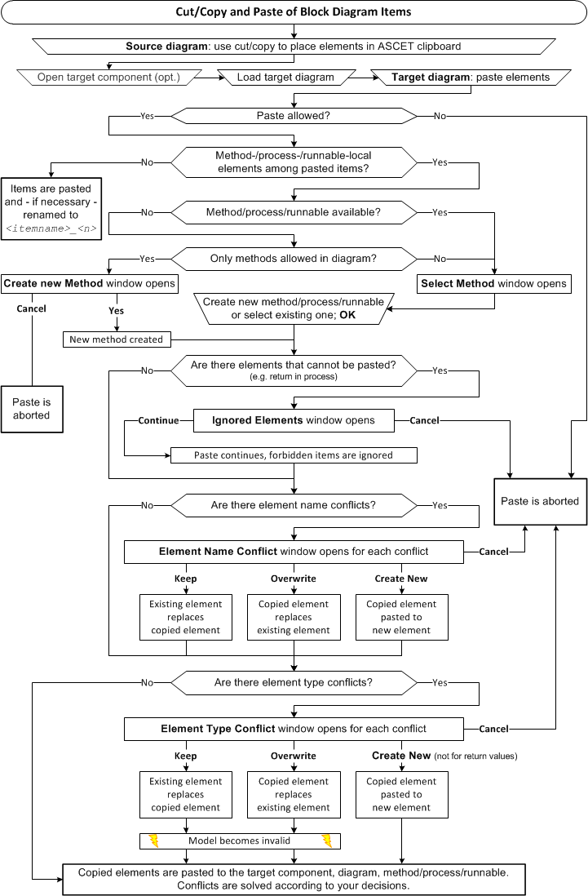

---

## Layout of Included Components

_Source: `markdown/BDE_Layout.md`_

# Layout of Included Components

If you add a component to your component (see [Including a Component as a Complex Element](markdown/IncludeComponent.md)) and place it in the drawing area, the default layout of the added component, defined in the layout editor, is displayed. If this default layout does not suit your purposes, you can react in two different ways.

One possibility is to adapt the default layout in the [layout editor](LayoutEditorEnglishUS.chm::/LEd_Overview.htm). Changes in the layout editor do not, however, have any influence on individual graphical occurrences of the component in block diagrams. Existing diagrams remain unchanged, you have to replace the occurrences manually to load the changed layout.

The other possibility is to adapt the layout of a specific graphical occurrence in the block diagram. You can enable or disable flexible layout for each included component individually, either in the component manager (see [Activating/Deactivating Flexible Layout](ComponentManagerEnglishUS.chm::/Activating_Flexible_Layout.htm)) or via the Activate flexible layout menu option in the layout editor.

Only the layout of the edited graphical occurrence is modified, neither the default layout nor the layout of other graphical occurrences of the same component in the diagram is changed automatically. This means that, if necessary, you can assign each graphical occurrence of the same component a different layout.

You can change the size of a block and move, show or hide the ports. The following must, however, be taken into consideration:

1. A graphical occurrence must at least be the size of an addition operator with two inputs.
1. The minimum size of a graphical occurrence is also limited by the number of visible ports: two ports cannot have the same position.
1. If the default layout contains an icon, it is cut off if the size of the graphical occurrence is smaller than the icon itself.

If you copy or cut out a graphical occurrence which has been edited in this way and insert it at a different location as described in [Copying/Moving Diagram Items in the Same Diagram](markdown/BDE_Cutcopypaste.md) and [Copying/Moving Diagram Items Between Diagrams](markdown/BDE_CopyMove_Items_betweenDiagram.md), the inserted graphical occurrence is assigned the layout of the copied/cut out graphical occurrence.

If you [edit](markdown/BDE_Editcomponent.md) an included component, add or remove existing pins (e.g., by removing an arguments or return value), and then return to the parent component, the missing pins are treated according to the Show Missing Pins and Connections option in the ASCET options window, [Block Diagram](ComponentManagerEnglishUS.chm::/cm_options_for_block_diagrams.htm) node.

See also

[Components as Complex Elements](markdown/BDE_ComplexElements.md)

[Including a Component as a Complex Element](markdown/IncludeComponent.md)

[Activating/Deactivating Flexible Layout](ComponentManagerEnglishUS.chm::/Activating_Flexible_Layout.htm)

[Layout Editor - Overview](LayoutEditorEnglishUS.chm::/LEd_Overview.htm)

[Copying/Moving Diagram Items in the Same Diagram](markdown/BDE_Cutcopypaste.md)

[Copying/Moving Diagram Items Between Diagrams](markdown/BDE_CopyMove_Items_betweenDiagram.md)

[Editing an Included Component](markdown/BDE_Editcomponent.md)

[Block Diagram Options](ComponentManagerEnglishUS.chm::/cm_options_for_block_diagrams.htm)

[Editing the Size of an Occurrence](markdown/Editsize.md)

[Editing Ports](markdown/Editports.md)

[Show/Hide Ports of an Included Component](markdown/Public_Methods.md)

[Using Changes as a New Default Layout](markdown/BDE_Defaultlayout.md)

[Restoring the Default Layout](markdown/Restoredefault.md)

---

## The Semantics of Block Diagrams

_Source: `markdown/bde_the_semantics_of_block_diagrams.md`_

# The Semantics of Block Diagrams

Each part of a block diagram is assigned to a process or method. The execution order is determined by the sequence numbers in the sequence calls. When a process or method is activated, all statements whose sequence calls are attached to that process or method are executed in the order given by the sequence numbers.

In contrast to standard block diagrams, an operation is executed only on demand, i.e. when its sequence call is activated. The order of execution is similar to the left-to-right principle of standard block diagrams: before an operation, for example an addition, can be performed, the values for all its arguments have to be computed.

The order of evaluation of the arguments of methods of user-defined components is given by the order of their declaration. This order, however, may not coincide with the order implied by the diagram, as the argument pins can be arranged arbitrarily at the block frame.

The evaluation of operands etc. is directly associated with the statements that use the results. This may result in multiple evaluations of an expression.

In this example, the addition is executed three times, for each of the assignments to the variables c, d, and e. The addition is used in assignments in two different processes. Without multiple execution, it would not be clear in which of the processes the addition should be executed. The expression a + b is evaluated twice in the process 10ms.

---

## Sequence Calls

_Source: `markdown/BDE_SequenceCalls.md`_

# Sequence Calls

A sequence call is linked to each assignment operation and each method call of an included component. Each sequence call represents an instruction in an ASCET diagram. Sequence calls determine the control flow in diagrams by assigning every instruction to a method or process and determining the order of the instructions within a method/process.

In the Block Diagram Editor, connecting lines between elements and/or operators are shown as colored lines as long as the sequencing for the instruction or operation linked to the element has not been resolved. The color indicates that the sequencing still has to be resolved. All lines to which a sequence call has been assigned are shown in black.

You can edit the sequence calls individually or in groups, manually or automatically.

See also

[Editing Individual Sequence Calls](markdown/BDE_EditIndividualSequenceCalls.md)

[Editing Several Sequence Calls](markdown/Editingsequence.md)

[Connectors](markdown/Connectors.md)

[Block-Local Sequence Calls](markdown/BDE_BlockLocal_SequenceCalls.md)

---

## Editing Individual Sequence Calls

_Source: `markdown/BDE_EditIndividualSequenceCalls.md`_

# Editing Individual Sequence Calls

Individual sequence calls can be [assigned automatically](markdown/Assignindividual.md) or [edited in the sequence editor](markdown/EditSequence.md). In the sequence editor, you can either enter a sequence number, or use a button to assign the next free number.

Automatic assignment, as well as the Next free button in the sequence editor, use a [set of rules](javascript:BSSCPopup('BDE_SequencingRules.htm');)<!-- kadovFilePopupInit('a1'); //--> to determine the sequence number.

See also

[Automatically Assigning Individual Sequence Calls](markdown/Assignindividual.md)

[Editing a Sequence Call in the Sequence Editor](markdown/EditSequence.md)

[Sequence Calls - Editing Individual Sequence Calls](markdown/BDE_WorkingOnSequenceCalls.md#EditingIndividual)

[Sequence Editor](markdown/Editingindividual.md)

/* Heikki Komulainen, Comet Computer GmbH 2004 */ cc_plus_pic = '&nbsp;'; cc_minus_pic = '&nbsp;'; cc_stat_pic = '&nbsp;'; gpstyle = ''; var iframes_created = 0; if (document.body && document.body.insertAdjacentHTML && document.getElementsByTagName && document.getElementById) { collect_popups(); set_poplinks_pictures(); if (iframes_created) { document.write(gpstyle); document.write('
<nobr><a id="einauslink" style="position:absolute;top:expression(document.body.scrollTop + this.offsetHeight - this.offsetHeight);left:expression(document.body.offsetWidth - (this.offsetWidth + 28));background:white;padding:5px" href="javascript:show_all_poptext()">Show all hidden text</a></nobr>
'); } } function collect_popups() { bsscpopups = new Array(); for (x = 0; x < document.links.length; x++) { if (document.links[x].href.indexOf("BSSCPopup")>-1) { seekmatch = /BSSCPopup.'[^'](markdown/+)'/; poplink = seekmatch.exec(document.links[x].href); poplink = "" + poplink; poplink = poplink.substring(poplink.indexOf("'")+1, poplink.lastIndexOf("'")); ifid = "CCGENIFRAMEID" + x; new_iframe = '<iframe id="' + ifid + '"src="' + poplink + '" onload="get_text(\'' + ifid + '\')" width="0" height="0" frameborder=0></iframe>'; document.links[x].parentNode.insertAdjacentHTML("afterEnd", new_iframe); gpid = "CCID_" + ifid; document.links[x].href = "javascript:expand_poptext('" + gpid + "')"; cc_plus = '' + cc_plus_pic + ''; document.links[x].insertAdjacentHTML("afterBegin", cc_plus); iframes_created = 1; } } }// end function function get_text(ifr_id) { frpars = document.frames[ifr_id].document.getElementsByTagName("body"); popbody = frpars[0].innerHTML; gpid = "CCID_" + ifr_id; if (!document.getElementById(gpid)) { //avoiding doubles document.getElementById(ifr_id).insertAdjacentHTML("afterEnd", '
'+popbody+'
'); } }//end function function expand_poptext(x_frame_id) { if (!document.getElementById(x_frame_id)) return; if (document.getElementById(x_frame_id).className == "CCGENPOPTEXTH") { document.getElementById(x_frame_id).className = "CCGENPOPTEXTV"; document.getElementById(x_frame_id).style.visibility = "visible"; if (document.getElementById("CCPMB_" + x_frame_id )) { document.getElementById("CCPMB_" + x_frame_id ).innerHTML = cc_minus_pic; } } else { document.getElementById(x_frame_id).className = "CCGENPOPTEXTH"; document.getElementById(x_frame_id).style.visibility = "hidden"; if (document.getElementById("CCPMB_" + x_frame_id )) { document.getElementById("CCPMB_" + x_frame_id ).innerHTML = cc_plus_pic; } } }// end function function show_all_poptext() { var pulldowntxt = document.getElementsByTagName("div"); for (b = 0; b < pulldowntxt.length; b++) { if (pulldowntxt[b].className == "droptext") { pulldowntxt[b].style.display=""; } } var gptxt = document.getElementsByTagName("div"); for (z = 0; z < gptxt.length; z++) { if (gptxt[z].className == "CCGENPOPTEXTH") { gptxt[z].className = "CCGENPOPTEXTV"; gptxt[z].style.visibility = "visible"; if (document.getElementById("CCPMB_" + gptxt[z].id )) { document.getElementById("CCPMB_" + gptxt[z].id ).innerHTML = cc_minus_pic; } } } var dxpoplinks = document.getElementsByTagName("a"); if (dxpoplinks) { for (pxl = 0; pxl < dxpoplinks.length; pxl++) { if (dxpoplinks[pxl].href.indexOf("kadovTextPopup")>-1) { if (document.getElementById("CCPMB_" + dxpoplinks[pxl].id)) { document.getElementById("CCPMB_" + dxpoplinks[pxl].id).innerHTML = cc_stat_pic; dxpoplinks[pxl].symbol = "minus"; } } } } document.getElementById('einauslink').innerText = 'Hide all hideable text'; document.getElementById('einauslink').href = "javascript:self.location.reload()"; self.focus(); }// end function function eat_click() { return false; }// end function function set_poplinks_pictures() { var dpoplinks = document.getElementsByTagName("a"); if (dpoplinks) { for (pl = 0; pl < dpoplinks.length; pl++) { if (dpoplinks[pl].href.indexOf("kadovTextPopup")>-1) { cc_plus = '' + cc_stat_pic + ''; //dpoplinks[pl].onmouseup = plusminuspoplink; dpoplinks[pl].insertAdjacentHTML("afterBegin", cc_plus); dpoplinks[pl].symbol = "plus"; } } } }// end function function plusminuspoplink() { if (document.getElementById("CCPMB_" + this.id)) { if (this.symbol == "plus") { document.getElementById("CCPMB_" + this.id).innerHTML = cc_minus_pic; this.symbol = "minus"; } else { document.getElementById("CCPMB_" + this.id).innerHTML = cc_plus_pic; this.symbol = "plus"; } } return true; }

---

## Editing  Several Sequence Calls

_Source: `markdown/Editingsequence.md`_

# Editing Several Sequence Calls

A large number of sequence calls may be necessary in complex diagrams. In that case, the possibilities to edit sequence calls in groups can be helpful. You can edit all sequence calls in a selected part of the diagram, all sequence calls assigned to a selected method/process, or all sequence calls in a complete diagram.

The sequencing algorithm uses a logical model graph that is computed from the inputs and outputs of all graphical elements. The algorithm tries to find dependencies between the graphical elements, but severe restrictions apply.

- independent subgraphs

One diagram can have several independent subgraphs. The order the sequencing algorithm assigns to the independent subgraphs cannot be predicted.

Example:

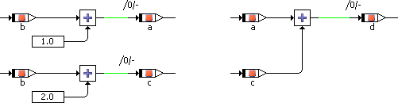

The sequencing algorithm will notice that the addition d = a + c has to be computed last because it depends on the results of the additions a = b + 1 and c = b + 2. Therefore, the addition d = a + c will be assigned the highest sequence number. However, the algorithm cannot decide whether a or c needs to be computed first. The lowest sequence number is assigned arbitrarily either to a = b + 1 or to c = b + 2.

- control flow elements

If the branch of a control flow element is connected to more than one action, the sequencing algorithm cannot decide which action has to be computed first. The sequence numbers of the connectors are assigned arbitrarily.

Example: [If statement](markdown/UseIf.md)

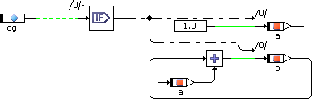

Even though the lower action on the Then branch, b = b + a, depends on the upper action a = 1.0, the sequencing algorithm may assign the lower sequence number to b = b + a.

- several methods/processes

One diagram can contain several methods or processes. Elements that belong to a method or process (i.e. arguments, return values, method-/process-local variables) can be used only in that particular method or process, but all other elements (i.e. variables, messages, ...) can be computed in any method or process. For these elements, the sequencing algorithm tries to determine a method/process by checking whether the inputs/outputs of a computation chain belong to a particular method/process. If that check fails, any method/process can be used.

Example: a class with three methods (compute, reset, out)

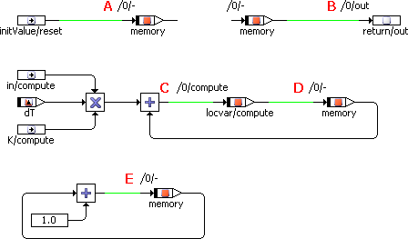

- Sequence call A can only be assigned to the reset method because the initValue argument is not available in the other methods. If another method is selected for sequencing, this sequence call remains empty.
- Sequence call B can only be assigned to the out method. If another method is selected for sequencing, this sequence call remains empty.
- Sequence call C can only be assigned to the compute method. If another method is selected for sequencing, this sequence call remains empty.
- Sequence call D can only be assigned to the compute method because the local variable locvar argument is not available in the other methods. If another method is selected for sequencing, this sequence call remains empty.
- Sequence call E does not belong to a particular method. It will be assigned to whichever method is selected for sequencing.

See also

[Automatically Assigning Sequence Calls](markdown/AssignSequence.md)

[Automatically Assigning Sequence Calls from a Specific Number](markdown/BDE_AutomaticallyAssign.md)

[Adding Sequence Calls to an Existing Sequence](markdown/AddSequence.md)

[Shifting Several Sequence Calls](markdown/ShiftSequence.md)

[Scaling Sequence Calls](markdown/ScaleSequence.md)

[Resetting Several Sequence Calls](markdown/ResetSequence.md)

[Changing the Visibility of Several Sequence Calls](markdown/ChangeSequence.md)

---

## Connectors

_Source: `markdown/Connectors.md`_

# Connectors

Connectors are used to connect an assignment with a control flow instruction such as If...Then or If...Then...Else.

See also

[Creating Connectors](markdown/CreateConnectors.md)

[Control Flow Elements](markdown/BDE_ControlFlow_Summary.md)

---

## Block-Local Sequence Calls

_Source: `markdown/BDE_BlockLocal_SequenceCalls.md`_

# Block-Local Sequence Calls

The sequence calls inside a [statement block](markdown/BDE_StatementBlocks.md) are local to that block. They consist of a sequence number and the name of the enclosing statement block. (Normal sequence calls consist of a number and a method/process name.)

The following rules apply:

- A block-local sequence call must not be used outside its enclosing statement block.

If a block-local sequence call is used outside its statement block (e.g., in the main diagram, in a different statement block, or in a graphical hierarchy inside or outside the statement block), an error is issued during code generation:

YBdl74 - Statement block-local sequence call used in %1

with %1 being top level diagram, different executable hierarchy named %2, or different regular hierarchy named %2.

- Only block-local sequence calls are allowed in a statement block.

If a normal sequence call is used in a statement block - either directly or indirectly (i.e. in a graphical hierarchy inside the statement block) -, a warning is issued during code generation:

WBdl30 - Method sequence call should not be used inside a statement block

You can convert a block-local sequence call to a connector and vice versa, see [Toggling Between Connector and Block-Local Sequence Call](markdown/BDE_Convert_Connector_SequenceCall.md).

See also

[Statement Blocks](markdown/BDE_StatementBlocks.md)

[Sequence Calls](markdown/BDE_SequenceCalls.md)

[Toggling Between Connector and Block-Local Sequence Call](markdown/BDE_Convert_Connector_SequenceCall.md)

---

## Components with Multiple Diagrams

_Source: `markdown/ComponentsMultiple.md`_

# Components with Multiple Diagrams

A component specification for a class or module can consist of more than one diagram. This feature is useful for structuring complex specifications. A diagram can either be public, i.e. contain only public methods and processes, or private, i.e. contain only private methods.

Public methods can be accessed from other components, private methods cannot. Private methods can only be accessed from inside the component. Private diagrams containing actions and conditions are a special case. These are used in state machines only.

Each component specified as block diagram contains at least one public diagram named Main. Classes can have any number of public or private diagrams, whereas modules only have public diagrams.

See also

[Creating a New Diagram](markdown/BDE_Createnew.md)

[Loading a Diagram](markdown/LoadDiagram.md)

[Renaming or Deleting a Diagram, Method or Process](markdown/RenameorDelete.md)

[Moving Methods between Diagrams](markdown/MoveMethods.md)

[Navigating between Components](markdown/NavigatingComponents.md)

---

## Navigating between Components

_Source: `markdown/NavigatingComponents.md`_

# Navigating between Components

When you are editing a component that includes other components in the block diagram editor, you can edit those sub-components without having to go through the Component Manager to open the editor on an included component.

See also

[Navigating between Different Levels of a Block Diagram](markdown/Navigatedifferent.md)

---

## Graphical Hierarchies

_Source: `markdown/GraphicalHierarchies.md`_

# Graphical Hierarchies

In order to structure a graphical specification, graphical hierarchies can be used. Graphical hierarchies do not influence the semantics of a block diagram but are used for structuring only.

A hierarchy contains a part of the block diagram. At its parent level of the diagram, it is visible only as a symbol. The lines that cross the border of the hierarchy, i.e. that connect elements inside the hierarchy with those outside, are represented by pins.

Hierarchies can be nested so that hierarchy blocks can contain other hierarchy blocks.

An icon can be assigned to hierarchies in the block diagram editor.

See also

[Adding a Hierarchy](markdown/BDE_AddHierarchy.md)

[Converting Diagram Elements into a Hierarchy Block](markdown/Converthierarchy.md)

[Using Graphical Hierarchies and Statement Blocks](markdown/BDE_UseHierarchiesStatementBlocks.md)

[The Semantics of Block Diagrams](markdown/bde_the_semantics_of_block_diagrams.md)

---

## Statement Blocks

_Source: `markdown/BDE_StatementBlocks.md`_

# Statement Blocks

Statement blocks can be used to encapsulate a continuous set of block diagram statements.

Each statement block must have an unambiguous name. If a statement block has the same name as another statement block, a normal hierarchy, a method, process, or runnable, an error is issued during code generation.

YBdl75 - Duplicate name "<name>" for statement block

A statement block is very similar to a graphical hierarchy, except that

- a statement block has a sequence call, and
- sequence calls inside a statement block are local to that block (see [Block-Local Sequence Calls](markdown/BDE_BlockLocal_SequenceCalls.md)).

Changing the block's sequence call does not change the execution sequence within the block. During code generation, the statement block is generated in the place indicated by the block's sequence call. The content of the statement block is generated in the order determined by the block-local sequence calls (see [Example: Statement Block](markdown/BDE_Example_StatementBlock.md)).

Data flow between the various hierarchy/statement block levels works via input and output pins. These are simply connection lines that extend across the levels. In statement blocks, input and output pins are not intended for control flow. If a control-flow element is connected to the input pin of a statement block, an warning is issued during code generation.

WBdl31 - A statement block should not have a control-flow pin

By default, this warning is promoted to an error.

See also

[Block-Local Sequence Calls](markdown/BDE_BlockLocal_SequenceCalls.md)

[Example: Statement Block](markdown/BDE_Example_StatementBlock.md)

[Graphical Hierarchies](markdown/GraphicalHierarchies.md)

[Using Graphical Hierarchies and Statement Blocks](markdown/BDE_UseHierarchiesStatementBlocks.md)

---

## Block-Local Sequence Calls

_Source: `markdown/BDE_BlockLocal_SequenceCalls.md`_

# Block-Local Sequence Calls

The sequence calls inside a [statement block](markdown/BDE_StatementBlocks.md) are local to that block. They consist of a sequence number and the name of the enclosing statement block. (Normal sequence calls consist of a number and a method/process name.)

The following rules apply:

- A block-local sequence call must not be used outside its enclosing statement block.

If a block-local sequence call is used outside its statement block (e.g., in the main diagram, in a different statement block, or in a graphical hierarchy inside or outside the statement block), an error is issued during code generation:

YBdl74 - Statement block-local sequence call used in %1

with %1 being top level diagram, different executable hierarchy named %2, or different regular hierarchy named %2.

- Only block-local sequence calls are allowed in a statement block.

If a normal sequence call is used in a statement block - either directly or indirectly (i.e. in a graphical hierarchy inside the statement block) -, a warning is issued during code generation:

WBdl30 - Method sequence call should not be used inside a statement block

You can convert a block-local sequence call to a connector and vice versa, see [Toggling Between Connector and Block-Local Sequence Call](markdown/BDE_Convert_Connector_SequenceCall.md).

See also

[Statement Blocks](markdown/BDE_StatementBlocks.md)

[Sequence Calls](markdown/BDE_SequenceCalls.md)

[Toggling Between Connector and Block-Local Sequence Call](markdown/BDE_Convert_Connector_SequenceCall.md)

---

## Example: Statement Block

_Source: `markdown/BDE_Example_StatementBlock.md`_

# Example: Statement Block

The following screenshot shows a simple block diagram with a statement block. The (diagram-wide) sequence calls are numbered A, B, and C.

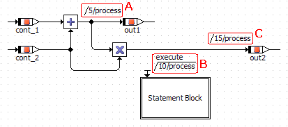

The statement block contains the following sub-graph. The block-local sequence calls are numbered B.1 and B.2.

During code generation, the statement block is generated in the place indicated by the block's sequence call (B). The content of the statement block is generated in the order determined by the block-local sequence calls (B.1 and B.2).

| Column 1 | Column 2 |
| --- | --- |
|  | /* public process [] */ |
|  | void MODULE_BDE_EXHIER_IMPL_process(void) |
|  | { |
|  | /* temp. variables */ |
|  | sint16 _t1sint16; |
| A | /* process: sequence call #5 */ |
|  | _t1sint16 = (sint16)_cont_1 + _cont_2; |
|  | _out1 = _t1sint16; |
| B.1 | /* Statement Block: sequence call #5 */ |
|  | _buffer = (sint16)((_cont_3 * ((sint32)_dT * _Ki)) + _buffer); |
| B.2 | /* Statement Block: sequence call #20 */ |
|  | _out_3 = _buffer; |
| C | /* process: sequence call #15 */ |
|  | _t1sint16 = (sint16)_cont_1 + _cont_2; |
|  | _out2 = (sint32)_t1sint16 * _cont_2; |
|  | } |

The example code was generated with the ANSI-C target (available in ASCET-SE) for better readability.

---

## Analyzing Components

_Source: `markdown/AnalyzingComponents.md`_

# Analyzing Components

After you have created a block diagram, you will usually want to experiment with it to see whether it works as intended. This section describes how to prepare for experimenting with a component, and how to start the experimentation environment.

For a single ASCET module, code can be generated and simulated without project context only in the physical experiment. For the other code generators the module must be integrated into a project. A so-called default project can be defined for each class or module for that purpose. This is the only way to access the implementation information. Without project context, the conversion formulas as well as all implementations of imported entities are missing.

See also

[Analyzing a Diagram](markdown/AnalyzeDiagram.md)

[Generating Code for a Component](markdown/GenerateCode.md)

[Viewing the Generated Code](markdown/Viewcode.md)

[Starting an Offline Experiment](markdown/startoffline.md)

[Defining Global Elements in the Default Project](markdown/BDE_Globalelements.md)

[Project Editor - Banners in the Generated Code](ProjectEditorEnglishUS.chm::/PE_Banners_in_GeneratedCode.htm)

---

## Implementation Casts in Block Diagrams

_Source: `markdown/BDE_ImplementationCasts.md`_

# Implementation Casts in Block Diagrams

In the block diagram editor, implementation casts (see also [Implementation Casts](IntroductionEnglishUS.chm::/INT_implementation_casts.htm)) can be inserted in the same way as all other elements using the relevant button in the button bar (here: , ). Once generated, they can be added to the drawing area from the element list by Drag & Drop and can be connected there in the same way as all other elements.

Implementation casts cannot be applied to logical elements. If you connect an implementation cast to a logical element, the connecting line is shown in red to indicate the error.

There are no sequence calls for implementation casts, the correct order is determined from the context by code generation.

In the block diagram editor, there is another very convenient way of adding implementation casts. This is particularly useful for existing arithmetical calculation chains. Using the context menu of the arithmetic operators +, -, *, /, abs and neg you can add implementation casts automatically for all inputs and outputs of the operation by selecting Add Implementation Casts.

See also

[Adding Implementation Casts to Operators Automatically](markdown/Addimplementation.md)

[Adding Implementation Casts to a Connection Automatically](markdown/Addtoconnect.md)

---

## Automatic Naming  of Implementation Casts

_Source: `markdown/Automatic_Naming__of_Implementation_Casts.md`_

# Automatic Naming of Implementation Casts

The implementation casts are named automatically in accordance with the following scheme:

<operator><m>_<pin type><n>

- operator

Depending on the selected operator, have the values add, sub, mul, div, abs or neg.

- m

Is the number of the operator. The first operator of a type for which implementation casts are generated in this way is assigned the number 1, further operators of the same type are then numbered consecutively (2,3,....).

- pin type

Is the description of the operator pin connected to the implementation cast, i.e. in for inputs and out for outputs.

- n

Is the number of the implementation cast. Implementation casts connected to the inputs and output of the operator are numbered separately.

1. The implementation cast connected to the first operator input is assigned the number 1, further inputs are numbered consecutively.

The number is omitted if the operator has only one input.

1. If the operator output is connected to more than one element, the implementation casts are numbered, beginning with 1.

If the operator input is connected to one element, the number is omitted.

---

## Data Exchange

_Source: `markdown/DataExchange.md`_

# Data Exchange

A data set is always associated with the component it came from. Data can be imported and exported in the block diagram editor, via the Import and Export submenus of the File menu.

See also

[Export of Folders and Database/Workspace Items](ComponentManagerEnglishUS.chm::/ExportingFolders.htm)

[Exporting the Data Set of a Component](markdown/ExportData.md)

[Writing the Data from an Array or a Table to a File](markdown/WriteData.md)

[Reading the Data for an Array or a Table from a File](markdown/ReadData.md)

---

## Opening the Block Diagram Editor

_Source: `markdown/Opening.md`_

# Opening the Block Diagram Editor

To open the block diagram editor, proceed as follows:

1. In the Component Manager, select the desired item.
1. Double-click on the item
1. In the Edit menu, select Open Component
1. Select Open Component from the context menu
1. Press Enter.

The selected item opens in the block diagram editor.

When you open a component that exceeds the currently selected size of the drawing area (see [Setting the Size of the Drawing Area](markdown/BDE_Setting_the_Size_of_the_Drawing_Area.md)), a message window opens. It displays the size of the drawing area and the size of the component, and offers the possibility to adjust the former.

See also

[Setting the Size of the Drawing Area](markdown/BDE_Setting_the_Size_of_the_Drawing_Area.md)

---

## Opening an Oversized Component

_Source: `markdown/BDE_Opening_an_Oversized_Component.md`_

# Opening an Oversized Component

If you open a component that exceeds the currently selected size of the drawing area, a message window opens. It displays the current size of the drawing area, as well as the component size, and it offers the possibility to resize the drawing area.

1. Activate the option Remember my Decision if you want to give the same answer to all questions of this type.
1. Click Yes to select a suitable size for the drawing area.
1. Click No if you do not want to change the size of the drawing area.

You cannot see the entire component. Elements outside the drawing area cannot be deleted.

See also

[Confirmation Dialog Options](ComponentManagerEnglishUS.chm::/CM_Options_for_Confirmation_Dialogs.htm)

---

## Creating a New Diagram

_Source: `markdown/BDE_Createnew.md`_

# Creating a New Diagram

To create a diagram, proceed as follows:

1. In the Insert menu, point to Diagram and select Public or Private

or

1. In the context menu of the Outline pane, point to Diagram and select Public or Private.

A new public or private diagram is added in the Outline pane. The name of the new diagram is selected automatically.

1. Type in a name and press Enter.

You can also rename the diagram later. To do so, in the Outline pane, select Rename in the context menu of the respective diagram or press F2.

1. Add the methods or processes necessary to specify the functionality of the diagram.

In the block diagram editor, you work on one diagram at a time. If a component contains more than one diagram, you can switch between diagrams by loading a new diagram into the drawing area.

1. See also

[Reserved Keywords](IntroductionEnglishUS.chm::/INT_Reserved_Keywords.htm)

---

## Loading a Diagram

_Source: `markdown/LoadDiagram.md`_

# Loading a Diagram

To load a diagram, proceed as follows:

1. Select a diagram.
1. In the Windows menu, select Load Diagram
1. In the context menu, select Load Diagram.

The diagram is loaded in the drawing area.

If there are unsaved changes in the current diagram, you are prompted to save the current diagram before the new diagram is loaded.

---

## Shifting a Diagram

_Source: `markdown/MoveDiagram.md`_

# Shifting a Diagram

In the Outline list, the diagrams and their methods and processes are shown in chronological order by default. Each new diagram is added at the end of the list, methods/processes are sorted alphabetically. The order of diagrams can be modified by moving diagrams and methods/processes within the list.

To move a diagram, proceed as follows:

1. In the Outline tab, select the diagram you want to move.
1. Open the diagram's context menu or the Windows menu
1. Select Move Up Diagram to move the selected diagram one position up in the list.
1. Select Move Down Diagram to move the selected diagram one position down in the list.

Public diagrams and private diagrams occupy different regions in the Outline tab. You cannot shift a private diagram into the public diagram area, or a public diagram in the private diagram area.

See also

[Components with Multiple Diagrams](markdown/ComponentsMultiple.md)

---

## Navigating Between Different Levels of a Block Diagram

_Source: `markdown/Navigatedifferent.md`_

# Navigating between Different Levels of a Block Diagram

To navigate between different levels of a block diagram, proceed as follows:

1. In the drawing area or Outline pane, select the component you want to edit.
1. In the Edit menu, select Open Component

or

1. Select Open Component from the context menu of the component

or

1. Double-click on the included component.

An editor opens for the selected component.

If the including component has unsaved changes, a new editor window opens. Otherwise, the sub-component is loaded into the original editor window.

1. To navigate upwards in a containment hierarchy, double click in the drawing area, not on a diagram item.

You are moved back up one level. If you have modified the sub-component, a new editor window opens for the previous component. The window for the sub-component remains open.

The mechanism described here is also used for navigating between different levels of graphical hierarchies in the same component.

---

## Selecting a View of the Diagram

_Source: `markdown/BDE_Selecting_View_the_Diagram.md`_

# Selecting a View of the Diagram

Details on views are given in [Views](AutomaticDocumentationEnglishUS.chm::/AD_views.htm).

- From the View combo box in the upper right corner of the toolbar, select a view.

The view changes according to the view settings of the diagram items. All items that are marked invisible for the selected view are hidden.

See also

[Views](AutomaticDocumentationEnglishUS.chm::/AD_views.htm)

---

## Saving a Component Specification

_Source: `markdown/SavingDiagrams.md`_

# Saving a Component Specification

To save the specified component, proceed as follows:

1. To save the component to the ASCET cache, do one of the following:
1. To make the changes permanent, go to the Component Manager and do one of the following:

- Open the File menu and select Save.
- Click on the Save button in the Component Manager.

The Save command in the Component Manager stores all the changes you have made in the database/workspace.

---

## Exiting the Block Diagram Editor

_Source: `markdown/Exiting.md`_

# Exiting the Block Diagram Editor

To exit the block diagram editor, proceed as follows:

1. In the block diagram editor, in the File menu, select Close

or

1. Click on the X at the right side of the title bar.

If any diagram contains unsaved changes, you are asked whether you want to save the changes.

1. Activate the option Remember my Decision if you want to give the same answer to all questions of this type.

In that case, the Save Changes in Graphic window no longer opens. You can revoke this setting in the ASCET options window, [Confirmation Dialogs node](ComponentManagerEnglishUS.chm::/CM_Options_for_Confirmation_Dialogs.htm).

1. Click Yes to confirm the saving.

The changes are stored to the cache, the block diagram editor is closed.

1. Click No to reject the changes.

The block diagram editor is closed without saving the changes.

1. Click Cancel to abort closing the block diagram editor.

See also

[Confirmation Dialog Options](ComponentManagerEnglishUS.chm::/CM_Options_for_Confirmation_Dialogs.htm)

---

## Defining a Component Signature

_Source: `markdown/BDE_DefineComponentSignature.md`_

# Defining a Component Signature

Defining the interface of a software component includes the following steps:

1. [Creating a Method](markdown/CreateMethod.md)
1. [Creating a Process](markdown/Createprocess.md)
1. [Editing the Signature of a Method or Process](markdown/EditMethod.md)
1. [Adding an Argument to the Method](markdown/Addargument.md)
1. [Adding a Return Value to the Method](markdown/Returnvalue.md)
1. [Adding Local Variables to the Method or Process](markdown/BDE_Localvariables.md)
1. [Editing Arguments and Local Variables](markdown/EditArguments.md)

The following steps may also be necessary

- [Shifting a Diagram](markdown/MoveDiagram.md)
- [Moving Methods and Processes Between Diagrams](markdown/MoveMethods.md)
- [Renaming or Deleting a Diagram, Method or Process](markdown/RenameorDelete.md)
- [Converting a Method or Process](markdown/BDE_Convert_MethodProcess.md)
- [Searching/Deleting Unused Processes/Methods](markdown/bde_searchdel_unused_procsmethodsrunnables.md)

---

## Creating a Method

_Source: `markdown/CreateMethod.md`_

# Creating a Method

To create a method, proceed as follows:

1. Activate the Outline pane.
1. Select a diagram.
1. In the Insert menu, select Method
1. click the  button.
1. Type in a name for the method and press Enter.

Every class contains one or more methods, the default method calc is created automatically. A method can have a number of arguments and a return value. The arguments and the return value can be modified using the method signature editor.

1. See also

[Reserved Keywords](IntroductionEnglishUS.chm::/INT_Reserved_Keywords.htm)

[Adding an Argument to the Method](markdown/Addargument.md)

[Adding a Return Value to the Method](markdown/Returnvalue.md)

[Adding Local Variables to the Method or Process](markdown/BDE_Localvariables.md)

---

## Creating a Process

_Source: `markdown/Createprocess.md`_

# Creating a Process

To create a process, proceed as follows:

1. Activate the Outline pane.
1. Select a public diagram.
1. In the Insert menu, select Process
1. click the  button.
1. Enter a name for the process and press Enter.

You can move, rename or delete processes the same way as methods.

As a process does not have any arguments, only the Locals tab and the Local Variable menu (see [Adding Local Variables to the Method or Process](markdown/BDE_Localvariables.md)) are available in the Signature Editor.

See also

[Moving a Diagram, Method or Process](markdown/MoveDiagram.md)

[Renaming or Deleting a Method or Process](markdown/RenameorDelete.md)

[Adding Local Variables to the Method or Process](markdown/BDE_Localvariables.md)

1. [Reserved Keywords](IntroductionEnglishUS.chm::/INT_Reserved_Keywords.htm)

---

## Selecting a Default Method/Process

_Source: `markdown/BDE_SelectDefaultMethodProcess.md`_

# Selecting a Default Method/Process

In each diagram, one method or one process can be selected as default method/process. The default method/process is selected automatically for [sequencing](markdown/BDE_SequenceCalls.md).

Proceed as follows.

1. In the Outline tab, open the method/process list of a diagram.
1. Do one of the following:
1. Right-click the method you want to select as default method, and select Default Method from the context menu.
1. Right-click the process you want to select as default process, and select Default Process from the context menu.

The selected method or process is now the default method/process.

See also

[Sequence Calls](markdown/BDE_SequenceCalls.md)

---

## Editing the Signature of a Method or Process

_Source: `markdown/EditMethod.md`_

# Editing the Signature of a Method or Process

To edit the signature of a method or process, proceed as follows:

1. In the Outline pane, select the name of the method or process you want to modify.
1. In the Edit menu, select Properties
1. In the context menu, select Properties
1. Double-click on the method.
1. Define the arguments and return value for the method as described in [Adding an Argument to the Method](markdown/Addargument.md) and [Adding a Return Value to the Method](markdown/Returnvalue.md).
1. Define local variables for the method or process as described in [Adding Local Variables to the Method or Process](markdown/BDE_Localvariables.md).
1. Click OK to close the Signature Editor.
1. [Adding an Argument to the Method](markdown/Addargument.md)
1. [Adding a Return Value to the Method](markdown/Returnvalue.md)
1. [Adding Local Variables to the Method or Process](markdown/BDE_Localvariables.md)
1. [Editing Arguments and Local Variables](markdown/EditArguments.md)

---

## Adding an Argument to the Method

_Source: `markdown/Addargument.md`_

1. In the Max Size x (and Max Size y) field(s), enter the array or matrix size.
1. To specify a [variant size](IntroductionEnglishUS.chm::/INT_VariantSize_ArraysMatrices.htm), use the Variant Size x (and Variant Size y) field(s) to select the system constants you want to use as dimension values.

The value of a system constant should be in the range 1 ... X (or 1 ... Y).

1. To specify a [variable size](IntroductionEnglishUS.chm::/INT_VariableSize_ArraysMatrices.htm), use the Variant Size x (and Variant Size y) field(s) to select *.

The Max Size x (and Max Size y) field(s) are disabled.

1. Click OK to close the window and accept your settings.

# Adding an Argument to the Method

To add an argument to the method, proceed as follows:

1. In the Signature Editor, go to the Arguments tab.
1. Do one of the following.
1. Name the argument and press Enter.
1. Specify the type of argument by selecting the value you want from the Argument Type combo box.
1. If you selected an array or matrix as type, open the Argument menu or the context menu and select Edit Max Size.
1. In the Max and Variant Size for: <argument> window, [do the following](javascript:kadovTextPopup(this))<!-- kadovTextPopupInit('a2'); //-->.
1. Enter a unit for the argument in the Unit box.
1. Type a comment relating to the argument into the Comment box.
1. In the Direction combo box, select a direction for the argument.

In - the argument can be read in the method; Out - the argument can be written in the method; InOut - the argument can be read and written in the method. See also [Directions of Method Arguments](markdown/BDE_DirectionsMethodArguments.md).

If the argument is of type array, matrix, or component, the selection in the Direction combo box also determines internal access to the referenced element: In - read access; Out - write access; InOut - read and write access.

See also

[Introduction - Variant Size for Arrays and Matrices](IntroductionEnglishUS.chm::/INT_VariantSize_ArraysMatrices.htm)

[Introduction - Variable Size for Arrays and Matrices](IntroductionEnglishUS.chm::/INT_VariableSize_ArraysMatrices.htm)

[Introduction - Explicit References](IntroductionEnglishUS.chm::/INT_ExplicitReferences.htm)

[Directions of Method Arguments](markdown/BDE_DirectionsMethodArguments.md)

1. [Editing Arguments and Local Variables](markdown/EditArguments.md)

[Assigning a Component as an Argument](markdown/BDE_AssignComponent.md)

[Creating the Matrix Argument](markdown/Matrixargument.md)

1. [Reserved Keywords](IntroductionEnglishUS.chm::/INT_Reserved_Keywords.htm)

/* Heikki Komulainen, Comet Computer GmbH 2004 */ cc_plus_pic = '&nbsp;'; cc_minus_pic = '&nbsp;'; cc_stat_pic = '&nbsp;'; gpstyle = ''; var iframes_created = 0; if (document.body && document.body.insertAdjacentHTML && document.getElementsByTagName && document.getElementById) { collect_popups(); set_poplinks_pictures(); if (iframes_created) { document.write(gpstyle); document.write('
<nobr><a id="einauslink" style="position:absolute;top:expression(document.body.scrollTop + this.offsetHeight - this.offsetHeight);left:expression(document.body.offsetWidth - (this.offsetWidth + 28));background:white;padding:5px" href="javascript:show_all_poptext()">Show all hidden text</a></nobr>
'); } } function collect_popups() { bsscpopups = new Array(); for (x = 0; x < document.links.length; x++) { if (document.links[x].href.indexOf("BSSCPopup")>-1) { seekmatch = /BSSCPopup.'[^'](markdown/+)'/; poplink = seekmatch.exec(document.links[x].href); poplink = "" + poplink; poplink = poplink.substring(poplink.indexOf("'")+1, poplink.lastIndexOf("'")); ifid = "CCGENIFRAMEID" + x; new_iframe = '<iframe id="' + ifid + '"src="' + poplink + '" onload="get_text(\'' + ifid + '\')" width="0" height="0" frameborder=0></iframe>'; document.links[x].parentNode.insertAdjacentHTML("afterEnd", new_iframe); gpid = "CCID_" + ifid; document.links[x].href = "javascript:expand_poptext('" + gpid + "')"; cc_plus = '' + cc_plus_pic + ''; document.links[x].insertAdjacentHTML("afterBegin", cc_plus); iframes_created = 1; } } }// end function function get_text(ifr_id) { frpars = document.frames[ifr_id].document.getElementsByTagName("body"); popbody = frpars[0].innerHTML; gpid = "CCID_" + ifr_id; if (!document.getElementById(gpid)) { //avoiding doubles document.getElementById(ifr_id).insertAdjacentHTML("afterEnd", '
'+popbody+'
'); } }//end function function expand_poptext(x_frame_id) { if (!document.getElementById(x_frame_id)) return; if (document.getElementById(x_frame_id).className == "CCGENPOPTEXTH") { document.getElementById(x_frame_id).className = "CCGENPOPTEXTV"; document.getElementById(x_frame_id).style.visibility = "visible"; if (document.getElementById("CCPMB_" + x_frame_id )) { document.getElementById("CCPMB_" + x_frame_id ).innerHTML = cc_minus_pic; } } else { document.getElementById(x_frame_id).className = "CCGENPOPTEXTH"; document.getElementById(x_frame_id).style.visibility = "hidden"; if (document.getElementById("CCPMB_" + x_frame_id )) { document.getElementById("CCPMB_" + x_frame_id ).innerHTML = cc_plus_pic; } } }// end function function show_all_poptext() { var pulldowntxt = document.getElementsByTagName("div"); for (b = 0; b < pulldowntxt.length; b++) { if (pulldowntxt[b].className == "droptext") { pulldowntxt[b].style.display=""; } } var gptxt = document.getElementsByTagName("div"); for (z = 0; z < gptxt.length; z++) { if (gptxt[z].className == "CCGENPOPTEXTH") { gptxt[z].className = "CCGENPOPTEXTV"; gptxt[z].style.visibility = "visible"; if (document.getElementById("CCPMB_" + gptxt[z].id )) { document.getElementById("CCPMB_" + gptxt[z].id ).innerHTML = cc_minus_pic; } } } var dxpoplinks = document.getElementsByTagName("a"); if (dxpoplinks) { for (pxl = 0; pxl < dxpoplinks.length; pxl++) { if (dxpoplinks[pxl].href.indexOf("kadovTextPopup")>-1) { if (document.getElementById("CCPMB_" + dxpoplinks[pxl].id)) { document.getElementById("CCPMB_" + dxpoplinks[pxl].id).innerHTML = cc_stat_pic; dxpoplinks[pxl].symbol = "minus"; } } } } document.getElementById('einauslink').innerText = 'Hide all hideable text'; document.getElementById('einauslink').href = "javascript:self.location.reload()"; self.focus(); }// end function function eat_click() { return false; }// end function function set_poplinks_pictures() { var dpoplinks = document.getElementsByTagName("a"); if (dpoplinks) { for (pl = 0; pl < dpoplinks.length; pl++) { if (dpoplinks[pl].href.indexOf("kadovTextPopup")>-1) { cc_plus = '' + cc_stat_pic + ''; //dpoplinks[pl].onmouseup = plusminuspoplink; dpoplinks[pl].insertAdjacentHTML("afterBegin", cc_plus); dpoplinks[pl].symbol = "plus"; } } } }// end function function plusminuspoplink() { if (document.getElementById("CCPMB_" + this.id)) { if (this.symbol == "plus") { document.getElementById("CCPMB_" + this.id).innerHTML = cc_minus_pic; this.symbol = "minus"; } else { document.getElementById("CCPMB_" + this.id).innerHTML = cc_plus_pic; this.symbol = "plus"; } } return true; }

---

## Assigning a Component as an Argument

_Source: `markdown/BDE_AssignComponent.md`_

# Assigning a Component as an Argument

You can use other components as interface elements of components. The procedure is described here for an argument of type user-defined. The same procedure can be used for a complex return value.

From ASCET V6.3.0 on, complex arguments are always explicit references, even though they are not marked with the overlay icon .

To assign a component as an argument, proceed as follows:

1. Open the Signature Editor for the method to which you want to add the component.
1. From the Arguments list, select the item for which you want to specify the data type (or add a new item).
1. In the Argument Type list, select the entry <user defined>.
1. From the 1 Database or 1 Workspace list, select the component you want and click OK to close the dialog.
1. Click OK to store the changes you made to the interface.

---

## Adding a Return Value to the Method

_Source: `markdown/Returnvalue.md`_

1. In the Max Size x (and Max Size y) field(s), enter the array or matrix size.
1. To specify a [variant size](IntroductionEnglishUS.chm::/INT_VariantSize_ArraysMatrices.htm), use the Variant Size x (and Variant Size y) field(s) to select the system constants you want to use as dimension values.

The value of a system constant should be in the range 1 ... X (or 1 ... Y).

1. To specify a [variable size](IntroductionEnglishUS.chm::/INT_VariableSize_ArraysMatrices.htm), use the Variant Size x (and Variant Size y) field(s) to select *.

The Max Size x (and Max Size y) field(s) are disabled.

1. Click OK to close the window and accept your settings.

# Adding a Return Value to the Method

To add a return value to the method, proceed as follows:

1. Go to the Return tab of the Signature Editor.
1. Activate the Return Value option, if the method is to have a return value.
1. Specify the data type of the return value.
1. Type in a comment and a unit.
1. To edit the array/matrix size, open the Return menu and select Edit Max Size.
1. In the Max and Variant Size for: return window, [do the following](javascript:kadovTextPopup(this))<!-- kadovTextPopupInit('a1'); //-->.
1. Use the Read for Referenced Element and Write for Referenced Element options to set internal access to the referenced element to Read, Write, or both.

See also

[Introduction - Variant Size for Arrays and Matrices](IntroductionEnglishUS.chm::/INT_VariantSize_ArraysMatrices.htm)

[Introduction - Variable Size for Arrays and Matrices](IntroductionEnglishUS.chm::/INT_VariableSize_ArraysMatrices.htm)

[Introduction - Explicit References](IntroductionEnglishUS.chm::/INT_ExplicitReferences.htm)

[Editing the Signature of a Method or Process](markdown/EditMethod.md)

/* Heikki Komulainen, Comet Computer GmbH 2004 */ cc_plus_pic = '&nbsp;'; cc_minus_pic = '&nbsp;'; cc_stat_pic = '&nbsp;'; gpstyle = ''; var iframes_created = 0; if (document.body && document.body.insertAdjacentHTML && document.getElementsByTagName && document.getElementById) { collect_popups(); set_poplinks_pictures(); if (iframes_created) { document.write(gpstyle); document.write('
<nobr><a id="einauslink" style="position:absolute;top:expression(document.body.scrollTop + this.offsetHeight - this.offsetHeight);left:expression(document.body.offsetWidth - (this.offsetWidth + 28));background:white;padding:5px" href="javascript:show_all_poptext()">Show all hidden text</a></nobr>
'); } } function collect_popups() { bsscpopups = new Array(); for (x = 0; x < document.links.length; x++) { if (document.links[x].href.indexOf("BSSCPopup")>-1) { seekmatch = /BSSCPopup.'[^'](markdown/+)'/; poplink = seekmatch.exec(document.links[x].href); poplink = "" + poplink; poplink = poplink.substring(poplink.indexOf("'")+1, poplink.lastIndexOf("'")); ifid = "CCGENIFRAMEID" + x; new_iframe = '<iframe id="' + ifid + '"src="' + poplink + '" onload="get_text(\'' + ifid + '\')" width="0" height="0" frameborder=0></iframe>'; document.links[x].parentNode.insertAdjacentHTML("afterEnd", new_iframe); gpid = "CCID_" + ifid; document.links[x].href = "javascript:expand_poptext('" + gpid + "')"; cc_plus = '' + cc_plus_pic + ''; document.links[x].insertAdjacentHTML("afterBegin", cc_plus); iframes_created = 1; } } }// end function function get_text(ifr_id) { frpars = document.frames[ifr_id].document.getElementsByTagName("body"); popbody = frpars[0].innerHTML; gpid = "CCID_" + ifr_id; if (!document.getElementById(gpid)) { //avoiding doubles document.getElementById(ifr_id).insertAdjacentHTML("afterEnd", '
'+popbody+'
'); } }//end function function expand_poptext(x_frame_id) { if (!document.getElementById(x_frame_id)) return; if (document.getElementById(x_frame_id).className == "CCGENPOPTEXTH") { document.getElementById(x_frame_id).className = "CCGENPOPTEXTV"; document.getElementById(x_frame_id).style.visibility = "visible"; if (document.getElementById("CCPMB_" + x_frame_id )) { document.getElementById("CCPMB_" + x_frame_id ).innerHTML = cc_minus_pic; } } else { document.getElementById(x_frame_id).className = "CCGENPOPTEXTH"; document.getElementById(x_frame_id).style.visibility = "hidden"; if (document.getElementById("CCPMB_" + x_frame_id )) { document.getElementById("CCPMB_" + x_frame_id ).innerHTML = cc_plus_pic; } } }// end function function show_all_poptext() { var pulldowntxt = document.getElementsByTagName("div"); for (b = 0; b < pulldowntxt.length; b++) { if (pulldowntxt[b].className == "droptext") { pulldowntxt[b].style.display=""; } } var gptxt = document.getElementsByTagName("div"); for (z = 0; z < gptxt.length; z++) { if (gptxt[z].className == "CCGENPOPTEXTH") { gptxt[z].className = "CCGENPOPTEXTV"; gptxt[z].style.visibility = "visible"; if (document.getElementById("CCPMB_" + gptxt[z].id )) { document.getElementById("CCPMB_" + gptxt[z].id ).innerHTML = cc_minus_pic; } } } var dxpoplinks = document.getElementsByTagName("a"); if (dxpoplinks) { for (pxl = 0; pxl < dxpoplinks.length; pxl++) { if (dxpoplinks[pxl].href.indexOf("kadovTextPopup")>-1) { if (document.getElementById("CCPMB_" + dxpoplinks[pxl].id)) { document.getElementById("CCPMB_" + dxpoplinks[pxl].id).innerHTML = cc_stat_pic; dxpoplinks[pxl].symbol = "minus"; } } } } document.getElementById('einauslink').innerText = 'Hide all hideable text'; document.getElementById('einauslink').href = "javascript:self.location.reload()"; self.focus(); }// end function function eat_click() { return false; }// end function function set_poplinks_pictures() { var dpoplinks = document.getElementsByTagName("a"); if (dpoplinks) { for (pl = 0; pl < dpoplinks.length; pl++) { if (dpoplinks[pl].href.indexOf("kadovTextPopup")>-1) { cc_plus = '' + cc_stat_pic + ''; //dpoplinks[pl].onmouseup = plusminuspoplink; dpoplinks[pl].insertAdjacentHTML("afterBegin", cc_plus); dpoplinks[pl].symbol = "plus"; } } } }// end function function plusminuspoplink() { if (document.getElementById("CCPMB_" + this.id)) { if (this.symbol == "plus") { document.getElementById("CCPMB_" + this.id).innerHTML = cc_minus_pic; this.symbol = "minus"; } else { document.getElementById("CCPMB_" + this.id).innerHTML = cc_plus_pic; this.symbol = "plus"; } } return true; }

---

## Adding Local Variables to the Method or Process

_Source: `markdown/BDE_Localvariables.md`_

1. In the Max Size x (and Max Size y) field(s), enter the array or matrix size.
1. To specify a [variant size](IntroductionEnglishUS.chm::/INT_VariantSize_ArraysMatrices.htm), use the Variant Size x (and Variant Size y) field(s) to select the system constants you want to use as dimension values.

The value of a system constant should be in the range 1 ... X (or 1 ... Y).

1. To specify a [variable size](IntroductionEnglishUS.chm::/INT_VariableSize_ArraysMatrices.htm), use the Variant Size x (and Variant Size y) field(s) to select *.

The Max Size x (and Max Size y) field(s) are disabled.

1. Click OK to close the window and accept your settings.

# Adding Local Variables to the Method or Process

To add local variables to the method or process, proceed as follows:

1. [Open the signature editor](markdown/EditMethod.md) for the method or process.
1. Go to the Locals tab of the Signature Editor.
1. Do one of the following.
1. Enter a name for the local variable.
1. Specify the type for the local variable.
1. Enter a comment and a unit for the variable.
1. To edit the array/matrix size, open the Local Variable menu or the context menu and select Edit Max Size.
1. In the Max and Variant Size for: <local> window, [do the following](javascript:kadovTextPopup(this))<!-- kadovTextPopupInit('a1'); //-->.
1. Activate (deactivate) the Reference option to mark the local variable as explicit reference (instance).
1. Use the Read for Referenced Element and Write for Referenced Element options to set internal access to the referenced element to Read, Write, or both.

Non-scalar local variables specified as instances must be initialized before they are read. For method-/process-local records marked as instances, the separate assignment to each record element is recognized as initialization. The expression must only contain accesses to record elements that are already initialized. Assigning each element of an array or matrix is recognized as initialization. Passing a local variable of array, matrix or record type as [Out argument](markdown/BDE_DirectionsMethodArguments.md) is recognized as initialization.

See also

[Editing the Signature of a Method or Process](markdown/EditMethod.md)

[Locals Tab](markdown/bde_locals_tab.md)

[Introduction - Variant Size for Arrays and Matrices](IntroductionEnglishUS.chm::/INT_VariantSize_ArraysMatrices.htm)

[Introduction - Variable Size for Arrays and Matrices](IntroductionEnglishUS.chm::/INT_VariableSize_ArraysMatrices.htm)

[Introduction - Explicit References](IntroductionEnglishUS.chm::/INT_ExplicitReferences.htm)

[Reserved Keywords](IntroductionEnglishUS.chm::/INT_Reserved_Keywords.htm)

[Editing Arguments and Local Variables](markdown/EditArguments.md)

[Directions of Method Arguments](markdown/BDE_DirectionsMethodArguments.md)

/* Heikki Komulainen, Comet Computer GmbH 2004 */ cc_plus_pic = '&nbsp;'; cc_minus_pic = '&nbsp;'; cc_stat_pic = '&nbsp;'; gpstyle = ''; var iframes_created = 0; if (document.body && document.body.insertAdjacentHTML && document.getElementsByTagName && document.getElementById) { collect_popups(); set_poplinks_pictures(); if (iframes_created) { document.write(gpstyle); document.write('
<nobr><a id="einauslink" style="position:absolute;top:expression(document.body.scrollTop + this.offsetHeight - this.offsetHeight);left:expression(document.body.offsetWidth - (this.offsetWidth + 28));background:white;padding:5px" href="javascript:show_all_poptext()">Show all hidden text</a></nobr>
'); } } function collect_popups() { bsscpopups = new Array(); for (x = 0; x < document.links.length; x++) { if (document.links[x].href.indexOf("BSSCPopup")>-1) { seekmatch = /BSSCPopup.'[^'](markdown/+)'/; poplink = seekmatch.exec(document.links[x].href); poplink = "" + poplink; poplink = poplink.substring(poplink.indexOf("'")+1, poplink.lastIndexOf("'")); ifid = "CCGENIFRAMEID" + x; new_iframe = '<iframe id="' + ifid + '"src="' + poplink + '" onload="get_text(\'' + ifid + '\')" width="0" height="0" frameborder=0></iframe>'; document.links[x].parentNode.insertAdjacentHTML("afterEnd", new_iframe); gpid = "CCID_" + ifid; document.links[x].href = "javascript:expand_poptext('" + gpid + "')"; cc_plus = '' + cc_plus_pic + ''; document.links[x].insertAdjacentHTML("afterBegin", cc_plus); iframes_created = 1; } } }// end function function get_text(ifr_id) { frpars = document.frames[ifr_id].document.getElementsByTagName("body"); popbody = frpars[0].innerHTML; gpid = "CCID_" + ifr_id; if (!document.getElementById(gpid)) { //avoiding doubles document.getElementById(ifr_id).insertAdjacentHTML("afterEnd", '
'+popbody+'
'); } }//end function function expand_poptext(x_frame_id) { if (!document.getElementById(x_frame_id)) return; if (document.getElementById(x_frame_id).className == "CCGENPOPTEXTH") { document.getElementById(x_frame_id).className = "CCGENPOPTEXTV"; document.getElementById(x_frame_id).style.visibility = "visible"; if (document.getElementById("CCPMB_" + x_frame_id )) { document.getElementById("CCPMB_" + x_frame_id ).innerHTML = cc_minus_pic; } } else { document.getElementById(x_frame_id).className = "CCGENPOPTEXTH"; document.getElementById(x_frame_id).style.visibility = "hidden"; if (document.getElementById("CCPMB_" + x_frame_id )) { document.getElementById("CCPMB_" + x_frame_id ).innerHTML = cc_plus_pic; } } }// end function function show_all_poptext() { var pulldowntxt = document.getElementsByTagName("div"); for (b = 0; b < pulldowntxt.length; b++) { if (pulldowntxt[b].className == "droptext") { pulldowntxt[b].style.display=""; } } var gptxt = document.getElementsByTagName("div"); for (z = 0; z < gptxt.length; z++) { if (gptxt[z].className == "CCGENPOPTEXTH") { gptxt[z].className = "CCGENPOPTEXTV"; gptxt[z].style.visibility = "visible"; if (document.getElementById("CCPMB_" + gptxt[z].id )) { document.getElementById("CCPMB_" + gptxt[z].id ).innerHTML = cc_minus_pic; } } } var dxpoplinks = document.getElementsByTagName("a"); if (dxpoplinks) { for (pxl = 0; pxl < dxpoplinks.length; pxl++) { if (dxpoplinks[pxl].href.indexOf("kadovTextPopup")>-1) { if (document.getElementById("CCPMB_" + dxpoplinks[pxl].id)) { document.getElementById("CCPMB_" + dxpoplinks[pxl].id).innerHTML = cc_stat_pic; dxpoplinks[pxl].symbol = "minus"; } } } } document.getElementById('einauslink').innerText = 'Hide all hideable text'; document.getElementById('einauslink').href = "javascript:self.location.reload()"; self.focus(); }// end function function eat_click() { return false; }// end function function set_poplinks_pictures() { var dpoplinks = document.getElementsByTagName("a"); if (dpoplinks) { for (pl = 0; pl < dpoplinks.length; pl++) { if (dpoplinks[pl].href.indexOf("kadovTextPopup")>-1) { cc_plus = '' + cc_stat_pic + ''; //dpoplinks[pl].onmouseup = plusminuspoplink; dpoplinks[pl].insertAdjacentHTML("afterBegin", cc_plus); dpoplinks[pl].symbol = "plus"; } } } }// end function function plusminuspoplink() { if (document.getElementById("CCPMB_" + this.id)) { if (this.symbol == "plus") { document.getElementById("CCPMB_" + this.id).innerHTML = cc_minus_pic; this.symbol = "minus"; } else { document.getElementById("CCPMB_" + this.id).innerHTML = cc_plus_pic; this.symbol = "plus"; } } return true; }

---

## Editing Arguments and Local Variables

_Source: `markdown/EditArguments.md`_

# Editing Arguments and Local Variables

To edit arguments and local variables, proceed as follows:

1. [Open the signature editor](markdown/EditMethod.md) for the method or process.
1. In the signature editor, go to the Locals tab.
1. In the Local Variable menu, select Rename to rename an argument.
1. In the Local Variable menu, select Move Up or Move Down to move an argument in the list.
1. To delete a selected local variable, do one of the following:

- In the Local Variable menu, select Delete.
- Click on .

For editing arguments, the Arguments tab offers the Argument menu, which contains the same menu functions.

See also

[Editing the Signature of a Method or Process](markdown/EditMethod.md)

---

## Moving Methods and Processes Between Diagrams

_Source: `markdown/MoveMethods.md`_

# Moving Methods and Processes Between Diagrams

To move methods between diagrams, proceed as follows:

1. [Load the diagram](markdown/LoadDiagram.md) that contains the method or process you want to move.
1. In the Outline pane, select the method/process you want to move.
1. In the Window menu, select Move Method to to move the method/process.
1. Select the diagram to which you want to move the method/process and click OK.

The selected method/process is moved to the target diagram. Any sequence calls present in the original diagram for the method/process are reset.

You can move methods only if their signature elements do not appear in the diagram. Otherwise, remove the graphical occurrences of signature elements first and then move the method.

See also

[Loading a Diagram](markdown/LoadDiagram.md)

---

## Renaming or Deleting a Diagram, Method or Process

_Source: `markdown/RenameorDelete.md`_

# Renaming or Deleting a Diagram, Method or Process

To rename or delete a diagram, method or process, proceed as follows:

1. Select the item in the Outline pane.
1. Do one of the following to rename the diagram, method or process:
1. Do one of the following to delete the diagram, method or process:

- Open the Edit menu and select Delete.
- Press Del.

See also

[Reserved Keywords](IntroductionEnglishUS.chm::/INT_Reserved_Keywords.htm)

---

## Converting a Method or Process

_Source: `markdown/BDE_Convert_MethodProcess.md`_

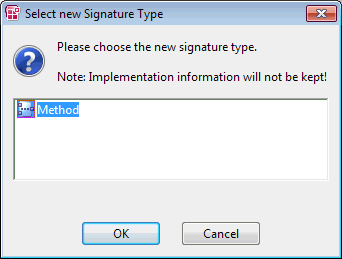

1. Activate the Always save changes option if you want to answer Yes to all questions of this type.

The option has no effect if you click on No.

1. Click Yes (No) to save (discard) the changes.

A method with two arguments and some local variables shall be converted into a process.

The arguments cannot be kept, and the conversion fails. The reason is displayed in the ASCET monitor window.

# Converting a Method or Process

To convert a method into a process, or vice versa, proceed as follows.

Keep in mind the [conversion restrictions](markdown/BDE_Conversion_MethodsProcesses.md).

1. In the Outline tab, right-click the method or process you want to convert and select Convert Method to or Convert Process to from the context menu.
1. Click OK continue.
1. Select a signature type and click OK.

If any diagram contains unsaved changes, you are asked if you want to save the changes. [Proceed as follows.](javascript:kadovTextPopup(this))<!-- kadovTextPopupInit('a5'); //-->

If you try to convert a method with argument(s) or a return value, the conversion fails because arguments and return values have no counterparts in a process. An error message window opens, and the reason for the failure ([example](javascript:kadovTextPopup(this))<!-- kadovTextPopupInit('a2'); //-->) is displayed in the ASCET monitor window. Nothing is converted in this case.

Some information of the original method/process may still be cached, which could lead to unexpected, but obsolete, code generation messages (e.g., "method xyz not used"). Therefore, two code generation runs might be required.

See also

[Conversion of Methods or Processes](markdown/BDE_Conversion_MethodsProcesses.md)

[Generating Code for a Component](markdown/GenerateCode.md) (block diagrams)

[Confirmation Dialog Options](ComponentManagerEnglishUS.chm::/CM_Options_for_Confirmation_Dialogs.htm)

/* Heikki Komulainen, Comet Computer GmbH 2004 */ cc_plus_pic = '&nbsp;'; cc_minus_pic = '&nbsp;'; cc_stat_pic = '&nbsp;'; gpstyle = ''; var iframes_created = 0; if (document.body && document.body.insertAdjacentHTML && document.getElementsByTagName && document.getElementById) { collect_popups(); set_poplinks_pictures(); if (iframes_created) { document.write(gpstyle); document.write('
<nobr><a id="einauslink" style="position:absolute;top:expression(document.body.scrollTop + this.offsetHeight - this.offsetHeight);left:expression(document.body.offsetWidth - (this.offsetWidth + 28));background:white;padding:5px" href="javascript:show_all_poptext()">Show all hidden text</a></nobr>
'); } } function collect_popups() { bsscpopups = new Array(); for (x = 0; x < document.links.length; x++) { if (document.links[x].href.indexOf("BSSCPopup")>-1) { seekmatch = /BSSCPopup.'[^'](markdown/+)'/; poplink = seekmatch.exec(document.links[x].href); poplink = "" + poplink; poplink = poplink.substring(poplink.indexOf("'")+1, poplink.lastIndexOf("'")); ifid = "CCGENIFRAMEID" + x; new_iframe = '<iframe id="' + ifid + '"src="' + poplink + '" onload="get_text(\'' + ifid + '\')" width="0" height="0" frameborder=0></iframe>'; document.links[x].parentNode.insertAdjacentHTML("afterEnd", new_iframe); gpid = "CCID_" + ifid; document.links[x].href = "javascript:expand_poptext('" + gpid + "')"; cc_plus = '' + cc_plus_pic + ''; document.links[x].insertAdjacentHTML("afterBegin", cc_plus); iframes_created = 1; } } }// end function function get_text(ifr_id) { frpars = document.frames[ifr_id].document.getElementsByTagName("body"); popbody = frpars[0].innerHTML; gpid = "CCID_" + ifr_id; if (!document.getElementById(gpid)) { //avoiding doubles document.getElementById(ifr_id).insertAdjacentHTML("afterEnd", '
'+popbody+'
'); } }//end function function expand_poptext(x_frame_id) { if (!document.getElementById(x_frame_id)) return; if (document.getElementById(x_frame_id).className == "CCGENPOPTEXTH") { document.getElementById(x_frame_id).className = "CCGENPOPTEXTV"; document.getElementById(x_frame_id).style.visibility = "visible"; if (document.getElementById("CCPMB_" + x_frame_id )) { document.getElementById("CCPMB_" + x_frame_id ).innerHTML = cc_minus_pic; } } else { document.getElementById(x_frame_id).className = "CCGENPOPTEXTH"; document.getElementById(x_frame_id).style.visibility = "hidden"; if (document.getElementById("CCPMB_" + x_frame_id )) { document.getElementById("CCPMB_" + x_frame_id ).innerHTML = cc_plus_pic; } } }// end function function show_all_poptext() { var pulldowntxt = document.getElementsByTagName("div"); for (b = 0; b < pulldowntxt.length; b++) { if (pulldowntxt[b].className == "droptext") { pulldowntxt[b].style.display=""; } } var gptxt = document.getElementsByTagName("div"); for (z = 0; z < gptxt.length; z++) { if (gptxt[z].className == "CCGENPOPTEXTH") { gptxt[z].className = "CCGENPOPTEXTV"; gptxt[z].style.visibility = "visible"; if (document.getElementById("CCPMB_" + gptxt[z].id )) { document.getElementById("CCPMB_" + gptxt[z].id ).innerHTML = cc_minus_pic; } } } var dxpoplinks = document.getElementsByTagName("a"); if (dxpoplinks) { for (pxl = 0; pxl < dxpoplinks.length; pxl++) { if (dxpoplinks[pxl].href.indexOf("kadovTextPopup")>-1) { if (document.getElementById("CCPMB_" + dxpoplinks[pxl].id)) { document.getElementById("CCPMB_" + dxpoplinks[pxl].id).innerHTML = cc_stat_pic; dxpoplinks[pxl].symbol = "minus"; } } } } document.getElementById('einauslink').innerText = 'Hide all hideable text'; document.getElementById('einauslink').href = "javascript:self.location.reload()"; self.focus(); }// end function function eat_click() { return false; }// end function function set_poplinks_pictures() { var dpoplinks = document.getElementsByTagName("a"); if (dpoplinks) { for (pl = 0; pl < dpoplinks.length; pl++) { if (dpoplinks[pl].href.indexOf("kadovTextPopup")>-1) { cc_plus = '' + cc_stat_pic + ''; //dpoplinks[pl].onmouseup = plusminuspoplink; dpoplinks[pl].insertAdjacentHTML("afterBegin", cc_plus); dpoplinks[pl].symbol = "plus"; } } } }// end function function plusminuspoplink() { if (document.getElementById("CCPMB_" + this.id)) { if (this.symbol == "plus") { document.getElementById("CCPMB_" + this.id).innerHTML = cc_minus_pic; this.symbol = "minus"; } else { document.getElementById("CCPMB_" + this.id).innerHTML = cc_plus_pic; this.symbol = "plus"; } } return true; }

---

## Searching/Deleting Unused Processes/Methods

_Source: `markdown/bde_searchdel_unused_procsmethodsrunnables.md`_

= Block Diagram or ESDL or C Code

# Searching/Deleting Unused Processes/Methods

You cannot search for unused processes/methods in a component and its sub-components in the same way as for [unused elements](markdown/BDE_SearchDeleteUnusedElements.md). Instead, proceed as follows:

1. Do one of the following:
1. To delete an unused process/method, proceed as follows:

See also

[Searching/Deleting Unused Elements](markdown/BDE_SearchDeleteUnusedElements.md)

/* Heikki Komulainen, Comet Computer GmbH 2004 */ cc_plus_pic = '&nbsp;'; cc_minus_pic = '&nbsp;'; cc_stat_pic = '&nbsp;'; gpstyle = ''; var iframes_created = 0; if (document.body && document.body.insertAdjacentHTML && document.getElementsByTagName && document.getElementById) { collect_popups(); set_poplinks_pictures(); if (iframes_created) { document.write(gpstyle); document.write('
<nobr><a id="einauslink" style="position:absolute;top:expression(document.body.scrollTop + this.offsetHeight - this.offsetHeight);left:expression(document.body.offsetWidth - (this.offsetWidth + 28));background:white;padding:5px" href="javascript:show_all_poptext()">Show all hidden text</a></nobr>
'); } } function collect_popups() { bsscpopups = new Array(); for (x = 0; x < document.links.length; x++) { if (document.links[x].href.indexOf("BSSCPopup")>-1) { seekmatch = /BSSCPopup.'[^'](markdown/+)'/; poplink = seekmatch.exec(document.links[x].href); poplink = "" + poplink; poplink = poplink.substring(poplink.indexOf("'")+1, poplink.lastIndexOf("'")); ifid = "CCGENIFRAMEID" + x; new_iframe = '<iframe id="' + ifid + '"src="' + poplink + '" onload="get_text(\'' + ifid + '\')" width="0" height="0" frameborder=0></iframe>'; document.links[x].parentNode.insertAdjacentHTML("afterEnd", new_iframe); gpid = "CCID_" + ifid; document.links[x].href = "javascript:expand_poptext('" + gpid + "')"; cc_plus = '' + cc_plus_pic + ''; document.links[x].insertAdjacentHTML("afterBegin", cc_plus); iframes_created = 1; } } }// end function function get_text(ifr_id) { frpars = document.frames[ifr_id].document.getElementsByTagName("body"); popbody = frpars[0].innerHTML; gpid = "CCID_" + ifr_id; if (!document.getElementById(gpid)) { //avoiding doubles document.getElementById(ifr_id).insertAdjacentHTML("afterEnd", '
'+popbody+'
'); } }//end function function expand_poptext(x_frame_id) { if (!document.getElementById(x_frame_id)) return; if (document.getElementById(x_frame_id).className == "CCGENPOPTEXTH") { document.getElementById(x_frame_id).className = "CCGENPOPTEXTV"; document.getElementById(x_frame_id).style.visibility = "visible"; if (document.getElementById("CCPMB_" + x_frame_id )) { document.getElementById("CCPMB_" + x_frame_id ).innerHTML = cc_minus_pic; } } else { document.getElementById(x_frame_id).className = "CCGENPOPTEXTH"; document.getElementById(x_frame_id).style.visibility = "hidden"; if (document.getElementById("CCPMB_" + x_frame_id )) { document.getElementById("CCPMB_" + x_frame_id ).innerHTML = cc_plus_pic; } } }// end function function show_all_poptext() { var pulldowntxt = document.getElementsByTagName("div"); for (b = 0; b < pulldowntxt.length; b++) { if (pulldowntxt[b].className == "droptext") { pulldowntxt[b].style.display=""; } } var gptxt = document.getElementsByTagName("div"); for (z = 0; z < gptxt.length; z++) { if (gptxt[z].className == "CCGENPOPTEXTH") { gptxt[z].className = "CCGENPOPTEXTV"; gptxt[z].style.visibility = "visible"; if (document.getElementById("CCPMB_" + gptxt[z].id )) { document.getElementById("CCPMB_" + gptxt[z].id ).innerHTML = cc_minus_pic; } } } var dxpoplinks = document.getElementsByTagName("a"); if (dxpoplinks) { for (pxl = 0; pxl < dxpoplinks.length; pxl++) { if (dxpoplinks[pxl].href.indexOf("kadovTextPopup")>-1) { if (document.getElementById("CCPMB_" + dxpoplinks[pxl].id)) { document.getElementById("CCPMB_" + dxpoplinks[pxl].id).innerHTML = cc_stat_pic; dxpoplinks[pxl].symbol = "minus"; } } } } document.getElementById('einauslink').innerText = 'Hide all hideable text'; document.getElementById('einauslink').href = "javascript:self.location.reload()"; self.focus(); }// end function function eat_click() { return false; }// end function function set_poplinks_pictures() { var dpoplinks = document.getElementsByTagName("a"); if (dpoplinks) { for (pl = 0; pl < dpoplinks.length; pl++) { if (dpoplinks[pl].href.indexOf("kadovTextPopup")>-1) { cc_plus = '' + cc_stat_pic + ''; //dpoplinks[pl].onmouseup = plusminuspoplink; dpoplinks[pl].insertAdjacentHTML("afterBegin", cc_plus); dpoplinks[pl].symbol = "plus"; } } } }// end function function plusminuspoplink() { if (document.getElementById("CCPMB_" + this.id)) { if (this.symbol == "plus") { document.getElementById("CCPMB_" + this.id).innerHTML = cc_minus_pic; this.symbol = "minus"; } else { document.getElementById("CCPMB_" + this.id).innerHTML = cc_plus_pic; this.symbol = "plus"; } } return true; }

---

## Using a Matrix Argument (Example)

_Source: `markdown/BDE_UseMatrixArgument_Example.md`_

# Using a Matrix Argument (Example)

The following steps provide an example of using a matrix argument for a matrix addition.

1. [Creating the Matrix Argument](markdown/Matrixargument.md)
1. [Creating the Computation Class](markdown/Computationclass.md)
1. [Specifying the Matrix Addition](markdown/Matrixaddition.md)
1. [Performing the Calculation](markdown/Performcalculation.md)

---

## Creating the Matrix Argument

_Source: `markdown/Matrixargument.md`_

# Creating the Matrix Argument

To create a matrix argument, proceed as follows:

1. [Add an argument](markdown/Addargument.md) with argument type mat[cont] to a method.
1. Place the argument in the drawing area.
1. Use the normal readout pins.

The procedure to return matrices or arrays is more complicated. It is described in the following paragraphs, using the addition of two matrices as an example.

See also

[Creating the Computation Class](markdown/Computationclass.md)

[Specifying the Matrix Addition](markdown/Matrixaddition.md)

[Performing the Calculation](markdown/Performcalculation.md)

[Adding an Argument to the Method](markdown/Addargument.md)

---

## Creating the Computation Class

_Source: `markdown/Computationclass.md`_

# Creating the Computation Class

To create the computation class, proceed as follows:

1. Create a class with a method to contain the matrix calculation.
1. In the method, add two arguments arg_matrix1 and arg_matrix2 of type mat[cont] and direction In for the matrices to be added.
1. Add another argument arg_OutMatrix of the same type, and with the direction InOut, for the result matrix.
1. Use the  button to create a matrix of type cont.
1. In the Properties editor, accept the preset values for the Dimension and activate the Reference option.
1. [Specify the Matrix Addition](markdown/Matrixaddition.md).

---

## Specifying the Matrix Addition

_Source: `markdown/Matrixaddition.md`_

# Specifying the Matrix Addition

To specify the matrix addition, proceed as follows:

1. Place the auxiliary matrix and the argument arg_OutMatrix in the drawing area.
1. Right-click on each element, and select Get/Set Ports from the context menu.
1. Assign the argument arg_OutMatrix to the auxiliary matrix via its Set port.
1. Select the sequence number 1 for the [sequence call](markdown/BDE_SequenceCalls.md), so that the assignment is executed as the first step of the method.
1. Create the necessary indices, and specify the matrix addition.
1. [Perform the Calculation](markdown/Performcalculation.md).

See also

[Sequence Calls](markdown/BDE_SequenceCalls.md)

---

## Performing the Calculation

_Source: `markdown/Performcalculation.md`_

# Performing the Calculation

To perform the calculation, proceed as follows:

1. Create a class or module.
1. Open the default project and permit [using references without initialization](IntroductionEnglishUS.chm::/INT_UseReferencesWithoutInit.htm).
1. In the Insert menu, select Component to include the computation class as a complex element.
1. Create two matrices of type cont, and fill them with the input data.
1. Create a third matrix of the same type and size for the result.
1. Place the elements in the drawing area, and connect them as shown below.

1. Use the output pins of the result matrix to read it.

When you assigned a size to these matrices other than the preset values in the Properties dialog, the code generation will produce an error message of the following kind: type mismatch: expected <mat[cont][3@3]> (<matrix name>), got <mat[cont][x@y]> (<matrix name>)

A frequently tried approach to return a matrix or an array is to add a return value of the respective type to a method, and access the return value via the Get/Set ports. The following figure shows such an arrangement, the class cls_calcmatrix contains the calc method with two matrix arguments and a matrix return value.

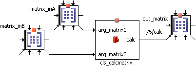

This does not work! The ports transfer pointers, in this case, pointers to a structure within the method. This structure, though, is only available while the method is computing - which means that, in the example, the data no longer exist at the time of the assignment to out_matrix.

See also

[Including a Component as a Complex Element](markdown/IncludeComponent.md)

---

## Characteristic Line as Argument (Example)

_Source: `markdown/BDE_CharacteristicLineArgument_Example.md`_

# Characteristic Line as Argument (Example)

The following steps provide an example of using a matrix argument for a matrix addition.

1. [Preparations](markdown/Preparations.md)
1. [Passing the Characteristic Line as Method Argument](markdown/Passcharacteristic.md)
1. [Using the Characteristic Line as Method Argument](markdown/Usecharacteristic.md)

---

## Preparations

_Source: `markdown/Preparations.md`_

# Preparations

To prepare characteristic line, proceed as follows:

1. Create a class, e.g. Class_charline.
1. In the Class_charline class, create and set up a characteristic line via the  button.
1. Open the properties window for the characteristic line (see [Element Configuration](ElementEditorEnglishUS.chm::/EEd_element_configuration.htm)).
1. Add an output for the characteristic line by activating the Get() Method option.
1. Close the Properties window.

An output for the characteristic line is added to the class layout.

See also

[Passing the Characteristic Line as Method Argument](markdown/Passcharacteristic.md)

[Using the Characteristic Line as Method Argument](markdown/Usecharacteristic.md)

[Characteristic Lines and Maps as Arguments](markdown/BDE_ComplexTypes.md#CharLineMap_Argument)

[Arrays, Matrices, Characteristic Curves and Maps](markdown/BDE_ArraysMatrices.md)

[Element Configuration](ElementEditorEnglishUS.chm::/EEd_element_configuration.htm)

---

## Passing the Characteristic Line as Method Argument

_Source: `markdown/Passcharacteristic.md`_

# Passing the Characteristic Line as Method Argument

To pass the characteristic line as method argument, proceed as follows:

1. Create a class that is to contain the characteristic line as method argument.
1. Add the class Class_charline as an argument of type <user-defined> to one of the methods.
1. Click OK to close the signature editor.

See also

[Preparations](markdown/Preparations.md)

[Using the Characteristic Line as Method Argument](markdown/Usecharacteristic.md)

[Characteristic Lines and Maps as Arguments](markdown/BDE_ComplexTypes.md#CharLineMap_Argument)

[Assigning a Component as an Argument](markdown/BDE_AssignComponent.md)

---

## Using the Characteristic Line as Method Argument

_Source: `markdown/Usecharacteristic.md`_

# Using the Characteristic Line as Method Argument

To actually use the method argument, proceed as follows:

1. Place the complex argument in the drawing area.
1. Create and set up a characteristic line (), and place it in the drawing area.
1. Right-click on the characteristic line, and select Get/Set Ports from the context menu.
1. Open the properties window for the characteristic table, and assign the kind Variable (see [Element Configuration](ElementEditorEnglishUS.chm::/EEd_element_configuration.htm)).
1. Connect the argument output to the Set port of the characteristic line.

Select the sequence number 1 for the sequence call, so that the assignment is executed as the first step of the method.

If this assignment is not performed as the first step of the method, inconsistencies arise.

You can now analyze the characteristic line as usual. Data are read from the memory area in which the characteristic line passed as argument is located.

See also

[Preparations](markdown/Preparations.md)

[Passing the Characteristic Line as Method Argument](markdown/Passcharacteristic.md)

[Characteristic Lines and Maps as Arguments](markdown/BDE_ComplexTypes.md#CharLineMap_Argument)

[Arrays, Matrices, Characteristic Curves and Maps](markdown/BDE_ArraysMatrices.md)

[Element Configuration](ElementEditorEnglishUS.chm::/EEd_element_configuration.htm)

---

## Creating the Block Diagram Content

_Source: `markdown/bde_createcontent.md`_

# Creating the Block Diagram Content

Defining the content of a software component includes the following steps:

1. [Placing a Signature Element](markdown/PlaceElement.md)
1. Creating the necessary elements:
1. [creating operators](markdown/PositionOperator.md), among them [If statements](markdown/UseIf.md), [switch](markdown/UseSwitch.md) and the [while loop](markdown/Usewhileloop.md)
1. [connecting diagram elements](markdown/Connectdiagram.md)
1. [editing the sequence calls](markdown/BDE_WorkingOnSequenceCalls.md)
1. add implementation casts to [connections](markdown/Addtoconnect.md) or [operators](markdown/Addimplementation.md)
1. add [a comment](markdown/Addcomment.md) or [a literal](markdown/BDE_AddLiteral.md)
1. use [assert](markdown/BDE_Use_AssertOperator.md) or [conversion](markdown/BDE_UseConversionOperator.md) operators
1. move or copy diagram items [in the same diagram](markdown/BDE_Cutcopypaste.md) or [between diagrams](markdown/BDE_CopyMove_Items_betweenDiagram.md)
1. [rename or delete diagram items](markdown/BDE_rename_delete.md)
1. [search and delete unused elements](markdown/BDE_SearchDeleteUnusedElements.md)
1. [use graphical hierarchies and statement blocks](markdown/BDE_UseHierarchiesStatementBlocks.md)

---

## Placing a Signature Element

_Source: `markdown/PlaceElement.md`_

# Placing a Signature Element

To place a signature element, proceed as follows:

1. From the Outline tab, select the element you want and drag it to where you want it in the drawing area.
1. You can select and drag the element in the drawing area to move it to another position.

See also

[Creating a Basic Element](markdown/BasicElement.md)

[Inserting an Enumeration](markdown/InsertEnumeration.md)

[Positioning an Operator](markdown/PositionOperator.md)

[Connecting Diagram Elements](markdown/Connectdiagram.md)

---

## Creating a Basic Element

_Source: `markdown/BasicElement.md`_

# Creating a Basic Element

To create a basic element, proceed as follows:

1. In the Elements palette or toolbar, click on the button for the element you want to create ( ) in order to load the mouse cursor with the corresponding type of element.
1. If you do not want to open the properties editor upon an element’s creation, deactivate the Always show Editor for new Elements option at the bottom of the editor.
1. Close the properties editor with OK.
1. Click inside the drawing area to place the new element.

In the diagram, the element appears at the point where you clicked. You can drag it to another position.

In the Outline tab, a new element is added.

You can change the properties of an element later via [re-opening](ElementEditorEnglishUS.chm::/EEd_open_element_editor.htm) the [properties editor](ElementEditorEnglishUS.chm::/EEd_Overview.htm).

See also

[Inserting an Element into a Connection](markdown/BDE_InsertElement_in_Connection.md)

[Reserved Keywords](IntroductionEnglishUS.chm::/INT_Reserved_Keywords.htm)

[Overview - Properties Editor](ElementEditorEnglishUS.chm::/EEd_Overview.htm)

[Opening the Properties Editor](ElementEditorEnglishUS.chm::/EEd_open_element_editor.htm)

[Confirmation Dialog Options](ComponentManagerEnglishUS.chm::/CM_Options_for_Confirmation_Dialogs.htm)

[Editor Options](ComponentManagerEnglishUS.chm::/cm_options_for_editors.htm)

---

## Inserting an Enumeration

_Source: `markdown/InsertEnumeration.md`_

# Inserting an Enumeration

To insert an enumeration, proceed as follows:

1. Click on the  button of the Elements palette.
1. Select the enumeration you want from the combo box.
1. Click OK to close the selection window.
1. Adjust the element properties according to your needs and click OK.
1. Click in the drawing area.

This positions the enumeration.

See also

[Reserved Keywords](IntroductionEnglishUS.chm::/INT_Reserved_Keywords.htm)

[Inserting an Element into a Connection](markdown/BDE_InsertElement_in_Connection.md)

---

## Creating an Array or Matrix

_Source: `markdown/CreateArray.md`_

For arrays, <limit > is 2048.

For matrices, <limit > is 63@63.

1. If you want to suppress the warning for future occasions, activate Don't show this hint again.

You can revoke this setting in the ASCET options window, [Confirmation Dialogs](ComponentManagerEnglishUS.chm::/CM_Options_for_Confirmation_Dialogs.htm) node.

1. To return to the properties editor, click Cancel.
1. To select the system constant anyway, confirm the warning with OK.

# Creating an Array or Matrix

To create an array or matrix of kind variable or parameter, proceed as follows:

1. In the Elements palette or toolbar, click on the  or  button.
1. In the Kind combo box, select Variable or Parameter.
1. Set the dimension(s) and the variant size(s) of the array or matrix.
1. Adjust the other element properties according to your needs and click OK.
1. Place the element in the drawing area.
1. If necessary, re-open the properties editor and adjust the size.

Creating an array or matrix of kind message is described in [Creating a Message](markdown/BDE_CreateMessage.md).

See also

[Introduction - Variant Size for Arrays and Matrices](IntroductionEnglishUS.chm::/INT_VariantSize_ArraysMatrices.htm)

[Introduction - Variable Size for Arrays and Matrices](IntroductionEnglishUS.chm::/INT_VariableSize_ArraysMatrices.htm)

[Reserved Keywords](IntroductionEnglishUS.chm::/INT_Reserved_Keywords.htm)

[Inserting an Element into a Connection](markdown/BDE_InsertElement_in_Connection.md)

[Creating a Message](markdown/BDE_CreateMessage.md)

/* Heikki Komulainen, Comet Computer GmbH 2004 */ cc_plus_pic = '&nbsp;'; cc_minus_pic = '&nbsp;'; cc_stat_pic = '&nbsp;'; gpstyle = ''; var iframes_created = 0; if (document.body && document.body.insertAdjacentHTML && document.getElementsByTagName && document.getElementById) { collect_popups(); set_poplinks_pictures(); if (iframes_created) { document.write(gpstyle); document.write('
<nobr><a id="einauslink" style="position:absolute;top:expression(document.body.scrollTop + this.offsetHeight - this.offsetHeight);left:expression(document.body.offsetWidth - (this.offsetWidth + 28));background:white;padding:5px" href="javascript:show_all_poptext()">Alle texte einblenden</a></nobr>
'); } } function collect_popups() { bsscpopups = new Array(); for (x = 0; x < document.links.length; x++) { if (document.links[x].href.indexOf("BSSCPopup")>-1) { seekmatch = /BSSCPopup.'[^'](markdown/+)'/; poplink = seekmatch.exec(document.links[x].href); poplink = "" + poplink; poplink = poplink.substring(poplink.indexOf("'")+1, poplink.lastIndexOf("'")); ifid = "CCGENIFRAMEID" + x; new_iframe = '<iframe id="' + ifid + '"src="' + poplink + '" onload="get_text(\'' + ifid + '\')" width="0" height="0" frameborder=0></iframe>'; document.links[x].parentNode.insertAdjacentHTML("afterEnd", new_iframe); gpid = "CCID_" + ifid; document.links[x].href = "javascript:expand_poptext('" + gpid + "')"; cc_plus = '' + cc_plus_pic + ''; document.links[x].insertAdjacentHTML("afterBegin", cc_plus); iframes_created = 1; } } }// end function function get_text(ifr_id) { frpars = document.frames[ifr_id].document.getElementsByTagName("body"); popbody = frpars[0].innerHTML; gpid = "CCID_" + ifr_id; if (!document.getElementById(gpid)) { //avoiding doubles document.getElementById(ifr_id).insertAdjacentHTML("afterEnd", '
'+popbody+'
'); } }//end function function expand_poptext(x_frame_id) { if (!document.getElementById(x_frame_id)) return; if (document.getElementById(x_frame_id).className == "CCGENPOPTEXTH") { document.getElementById(x_frame_id).className = "CCGENPOPTEXTV"; document.getElementById(x_frame_id).style.visibility = "visible"; if (document.getElementById("CCPMB_" + x_frame_id )) { document.getElementById("CCPMB_" + x_frame_id ).innerHTML = cc_minus_pic; } } else { document.getElementById(x_frame_id).className = "CCGENPOPTEXTH"; document.getElementById(x_frame_id).style.visibility = "hidden"; if (document.getElementById("CCPMB_" + x_frame_id )) { document.getElementById("CCPMB_" + x_frame_id ).innerHTML = cc_plus_pic; } } }// end function function show_all_poptext() { var pulldowntxt = document.getElementsByTagName("div"); for (b = 0; b < pulldowntxt.length; b++) { if (pulldowntxt[b].className == "droptext") { pulldowntxt[b].style.display=""; } } var gptxt = document.getElementsByTagName("div"); for (z = 0; z < gptxt.length; z++) { if (gptxt[z].className == "CCGENPOPTEXTH") { gptxt[z].className = "CCGENPOPTEXTV"; gptxt[z].style.visibility = "visible"; if (document.getElementById("CCPMB_" + gptxt[z].id )) { document.getElementById("CCPMB_" + gptxt[z].id ).innerHTML = cc_minus_pic; } } } var dxpoplinks = document.getElementsByTagName("a"); if (dxpoplinks) { for (pxl = 0; pxl < dxpoplinks.length; pxl++) { if (dxpoplinks[pxl].href.indexOf("kadovTextPopup")>-1) { if (document.getElementById("CCPMB_" + dxpoplinks[pxl].id)) { document.getElementById("CCPMB_" + dxpoplinks[pxl].id).innerHTML = cc_stat_pic; dxpoplinks[pxl].symbol = "minus"; } } } } document.getElementById('einauslink').innerText = 'Alle texte ausblenden'; document.getElementById('einauslink').href = "javascript:self.location.reload()"; self.focus(); }// end function function eat_click() { return false; }// end function function set_poplinks_pictures() { var dpoplinks = document.getElementsByTagName("a"); if (dpoplinks) { for (pl = 0; pl < dpoplinks.length; pl++) { if (dpoplinks[pl].href.indexOf("kadovTextPopup")>-1) { cc_plus = '' + cc_stat_pic + ''; //dpoplinks[pl].onmouseup = plusminuspoplink; dpoplinks[pl].insertAdjacentHTML("afterBegin", cc_plus); dpoplinks[pl].symbol = "plus"; } } } }// end function function plusminuspoplink() { if (document.getElementById("CCPMB_" + this.id)) { if (this.symbol == "plus") { document.getElementById("CCPMB_" + this.id).innerHTML = cc_minus_pic; this.symbol = "minus"; } else { document.getElementById("CCPMB_" + this.id).innerHTML = cc_plus_pic; this.symbol = "plus"; } } return true; }

---

## Creating a Normal or Fixed Characteristic Line/Map

_Source: `markdown/Createnormal.md`_

For characteristic lines, <limit > is 2048.

For characteristic maps, <limit > is 63@63.

# Creating a Normal or Fixed Characteristic Line/Map

To create a normal or fixed characteristic line/map, proceed as follows:

1. In the combo box of the Elements palette or with the arrow buttons in the toolbar, select the table type Normal or Fixed.
1. Click on the  or  button.
1. Adjust the element properties according to your needs.
1. Adjust the maximum number of sample points in the Dimension fields.
1. In the Interpolation combo box, select an interpolation routine for the characteristic line/map.
1. Click OK.
1. Confirm the warning with OK.
1. Place the element in the drawing area.
1. If necessary, re-open the Properties editor and adjust the size.

See also

[User-Defined Interpolation Routines](IntroductionEnglishUS.chm::/INT_UserDefinedInterpolationRoutines.htm)

[Reserved Keywords](IntroductionEnglishUS.chm::/INT_Reserved_Keywords.htm)

[I](markdown/BDE_InsertElement_in_Connection.md)nserting an Element into a Connection

/* Heikki Komulainen, Comet Computer GmbH 2004 */ cc_plus_pic = '&nbsp;'; cc_minus_pic = '&nbsp;'; cc_stat_pic = '&nbsp;'; gpstyle = ''; var iframes_created = 0; if (document.body && document.body.insertAdjacentHTML && document.getElementsByTagName && document.getElementById) { collect_popups(); set_poplinks_pictures(); if (iframes_created) { document.write(gpstyle); document.write('
<nobr><a id="einauslink" style="position:absolute;top:expression(document.body.scrollTop + this.offsetHeight - this.offsetHeight);left:expression(document.body.offsetWidth - (this.offsetWidth + 28));background:white;padding:5px" href="javascript:show_all_poptext()">Alle texte einblenden</a></nobr>
'); } } function collect_popups() { bsscpopups = new Array(); for (x = 0; x < document.links.length; x++) { if (document.links[x].href.indexOf("BSSCPopup")>-1) { seekmatch = /BSSCPopup.'[^'](markdown/+)'/; poplink = seekmatch.exec(document.links[x].href); poplink = "" + poplink; poplink = poplink.substring(poplink.indexOf("'")+1, poplink.lastIndexOf("'")); ifid = "CCGENIFRAMEID" + x; new_iframe = '<iframe id="' + ifid + '"src="' + poplink + '" onload="get_text(\'' + ifid + '\')" width="0" height="0" frameborder=0></iframe>'; document.links[x].parentNode.insertAdjacentHTML("afterEnd", new_iframe); gpid = "CCID_" + ifid; document.links[x].href = "javascript:expand_poptext('" + gpid + "')"; cc_plus = '' + cc_plus_pic + ''; document.links[x].insertAdjacentHTML("afterBegin", cc_plus); iframes_created = 1; } } }// end function function get_text(ifr_id) { frpars = document.frames[ifr_id].document.getElementsByTagName("body"); popbody = frpars[0].innerHTML; gpid = "CCID_" + ifr_id; if (!document.getElementById(gpid)) { //avoiding doubles document.getElementById(ifr_id).insertAdjacentHTML("afterEnd", '
'+popbody+'
'); } }//end function function expand_poptext(x_frame_id) { if (!document.getElementById(x_frame_id)) return; if (document.getElementById(x_frame_id).className == "CCGENPOPTEXTH") { document.getElementById(x_frame_id).className = "CCGENPOPTEXTV"; document.getElementById(x_frame_id).style.visibility = "visible"; if (document.getElementById("CCPMB_" + x_frame_id )) { document.getElementById("CCPMB_" + x_frame_id ).innerHTML = cc_minus_pic; } } else { document.getElementById(x_frame_id).className = "CCGENPOPTEXTH"; document.getElementById(x_frame_id).style.visibility = "hidden"; if (document.getElementById("CCPMB_" + x_frame_id )) { document.getElementById("CCPMB_" + x_frame_id ).innerHTML = cc_plus_pic; } } }// end function function show_all_poptext() { var pulldowntxt = document.getElementsByTagName("div"); for (b = 0; b < pulldowntxt.length; b++) { if (pulldowntxt[b].className == "droptext") { pulldowntxt[b].style.display=""; } } var gptxt = document.getElementsByTagName("div"); for (z = 0; z < gptxt.length; z++) { if (gptxt[z].className == "CCGENPOPTEXTH") { gptxt[z].className = "CCGENPOPTEXTV"; gptxt[z].style.visibility = "visible"; if (document.getElementById("CCPMB_" + gptxt[z].id )) { document.getElementById("CCPMB_" + gptxt[z].id ).innerHTML = cc_minus_pic; } } } var dxpoplinks = document.getElementsByTagName("a"); if (dxpoplinks) { for (pxl = 0; pxl < dxpoplinks.length; pxl++) { if (dxpoplinks[pxl].href.indexOf("kadovTextPopup")>-1) { if (document.getElementById("CCPMB_" + dxpoplinks[pxl].id)) { document.getElementById("CCPMB_" + dxpoplinks[pxl].id).innerHTML = cc_stat_pic; dxpoplinks[pxl].symbol = "minus"; } } } } document.getElementById('einauslink').innerText = 'Alle texte ausblenden'; document.getElementById('einauslink').href = "javascript:self.location.reload()"; self.focus(); }// end function function eat_click() { return false; }// end function function set_poplinks_pictures() { var dpoplinks = document.getElementsByTagName("a"); if (dpoplinks) { for (pl = 0; pl < dpoplinks.length; pl++) { if (dpoplinks[pl].href.indexOf("kadovTextPopup")>-1) { cc_plus = '' + cc_stat_pic + ''; //dpoplinks[pl].onmouseup = plusminuspoplink; dpoplinks[pl].insertAdjacentHTML("afterBegin", cc_plus); dpoplinks[pl].symbol = "plus"; } } } }// end function function plusminuspoplink() { if (document.getElementById("CCPMB_" + this.id)) { if (this.symbol == "plus") { document.getElementById("CCPMB_" + this.id).innerHTML = cc_minus_pic; this.symbol = "minus"; } else { document.getElementById("CCPMB_" + this.id).innerHTML = cc_plus_pic; this.symbol = "plus"; } } return true; }

---

## Creating a Distribution

_Source: `markdown/CreateDistribution.md`_

For distributions, <limit > is 2048.

# Creating a Distribution

Distributions are required when you are using group characteristic lines or maps.

1. In the Elements palette or toolbar, click on the  button.
1. Adjust the element properties to your needs and click OK.
1. Confirm the warning with OK.
1. Place the element in the drawing area.
1. If necessary, re-open the Properties editor and adjust the size.

See also

[Group Tables](DataEditorEnglishUS.chm::/DEd_group_tables.htm)

[Creating a Group Characteristic Line/Map](markdown/Creategroup.md)

[Reserved Keywords](IntroductionEnglishUS.chm::/INT_Reserved_Keywords.htm)

[Inserting an Element into a Connection](markdown/BDE_InsertElement_in_Connection.md)

/* Heikki Komulainen, Comet Computer GmbH 2004 */ cc_plus_pic = '&nbsp;'; cc_minus_pic = '&nbsp;'; cc_stat_pic = '&nbsp;'; gpstyle = ''; var iframes_created = 0; if (document.body && document.body.insertAdjacentHTML && document.getElementsByTagName && document.getElementById) { collect_popups(); set_poplinks_pictures(); if (iframes_created) { document.write(gpstyle); document.write('
<nobr><a id="einauslink" style="position:absolute;top:expression(document.body.scrollTop + this.offsetHeight - this.offsetHeight);left:expression(document.body.offsetWidth - (this.offsetWidth + 28));background:white;padding:5px" href="javascript:show_all_poptext()">Alle texte einblenden</a></nobr>
'); } } function collect_popups() { bsscpopups = new Array(); for (x = 0; x < document.links.length; x++) { if (document.links[x].href.indexOf("BSSCPopup")>-1) { seekmatch = /BSSCPopup.'[^'](markdown/+)'/; poplink = seekmatch.exec(document.links[x].href); poplink = "" + poplink; poplink = poplink.substring(poplink.indexOf("'")+1, poplink.lastIndexOf("'")); ifid = "CCGENIFRAMEID" + x; new_iframe = '<iframe id="' + ifid + '"src="' + poplink + '" onload="get_text(\'' + ifid + '\')" width="0" height="0" frameborder=0></iframe>'; document.links[x].parentNode.insertAdjacentHTML("afterEnd", new_iframe); gpid = "CCID_" + ifid; document.links[x].href = "javascript:expand_poptext('" + gpid + "')"; cc_plus = '' + cc_plus_pic + ''; document.links[x].insertAdjacentHTML("afterBegin", cc_plus); iframes_created = 1; } } }// end function function get_text(ifr_id) { frpars = document.frames[ifr_id].document.getElementsByTagName("body"); popbody = frpars[0].innerHTML; gpid = "CCID_" + ifr_id; if (!document.getElementById(gpid)) { //avoiding doubles document.getElementById(ifr_id).insertAdjacentHTML("afterEnd", '
'+popbody+'
'); } }//end function function expand_poptext(x_frame_id) { if (!document.getElementById(x_frame_id)) return; if (document.getElementById(x_frame_id).className == "CCGENPOPTEXTH") { document.getElementById(x_frame_id).className = "CCGENPOPTEXTV"; document.getElementById(x_frame_id).style.visibility = "visible"; if (document.getElementById("CCPMB_" + x_frame_id )) { document.getElementById("CCPMB_" + x_frame_id ).innerHTML = cc_minus_pic; } } else { document.getElementById(x_frame_id).className = "CCGENPOPTEXTH"; document.getElementById(x_frame_id).style.visibility = "hidden"; if (document.getElementById("CCPMB_" + x_frame_id )) { document.getElementById("CCPMB_" + x_frame_id ).innerHTML = cc_plus_pic; } } }// end function function show_all_poptext() { var pulldowntxt = document.getElementsByTagName("div"); for (b = 0; b < pulldowntxt.length; b++) { if (pulldowntxt[b].className == "droptext") { pulldowntxt[b].style.display=""; } } var gptxt = document.getElementsByTagName("div"); for (z = 0; z < gptxt.length; z++) { if (gptxt[z].className == "CCGENPOPTEXTH") { gptxt[z].className = "CCGENPOPTEXTV"; gptxt[z].style.visibility = "visible"; if (document.getElementById("CCPMB_" + gptxt[z].id )) { document.getElementById("CCPMB_" + gptxt[z].id ).innerHTML = cc_minus_pic; } } } var dxpoplinks = document.getElementsByTagName("a"); if (dxpoplinks) { for (pxl = 0; pxl < dxpoplinks.length; pxl++) { if (dxpoplinks[pxl].href.indexOf("kadovTextPopup")>-1) { if (document.getElementById("CCPMB_" + dxpoplinks[pxl].id)) { document.getElementById("CCPMB_" + dxpoplinks[pxl].id).innerHTML = cc_stat_pic; dxpoplinks[pxl].symbol = "minus"; } } } } document.getElementById('einauslink').innerText = 'Alle texte ausblenden'; document.getElementById('einauslink').href = "javascript:self.location.reload()"; self.focus(); }// end function function eat_click() { return false; }// end function function set_poplinks_pictures() { var dpoplinks = document.getElementsByTagName("a"); if (dpoplinks) { for (pl = 0; pl < dpoplinks.length; pl++) { if (dpoplinks[pl].href.indexOf("kadovTextPopup")>-1) { cc_plus = '' + cc_stat_pic + ''; //dpoplinks[pl].onmouseup = plusminuspoplink; dpoplinks[pl].insertAdjacentHTML("afterBegin", cc_plus); dpoplinks[pl].symbol = "plus"; } } } }// end function function plusminuspoplink() { if (document.getElementById("CCPMB_" + this.id)) { if (this.symbol == "plus") { document.getElementById("CCPMB_" + this.id).innerHTML = cc_minus_pic; this.symbol = "minus"; } else { document.getElementById("CCPMB_" + this.id).innerHTML = cc_plus_pic; this.symbol = "plus"; } } return true; }

---

## Creating a Group Characteristic Line/Map

_Source: `markdown/Creategroup.md`_

# Creating a Group Characteristic Line/Map

To create a group characteristic line/map, proceed as follows:

1. [Create a distribution.](markdown/CreateDistribution.md)
1. In the combo box of the Elements palette or with the arrow buttons in the toolbar, select the table type Group.
1. Click on the  or  button.
1. In the Interpolation combo box, select an interpolation routine for the characteristic line/map.
1. Adjust the other element properties according to your needs and click OK.
1. From the X-Distribution and Y-Distribution combo boxes, select suitable distributions.
1. Click OK.
1. Place the element in the drawing area.

See also

[Group Tables](DataEditorEnglishUS.chm::/DEd_group_tables.htm)

[Creating a Distribution](markdown/CreateDistribution.md)

[User-Defined Interpolation Routines](IntroductionEnglishUS.chm::/INT_UserDefinedInterpolationRoutines.htm)

[Reserved Keywords](IntroductionEnglishUS.chm::/INT_Reserved_Keywords.htm)

---

## Creating a Message

_Source: `markdown/BDE_CreateMessage.md`_

1. In the Elements palette or toolbar, click on the button for the scalar message you want to create (  ).
1. If you do not want to open the properties editor upon a message’s creation, deactivate the Always show Editor for new Elements option at the bottom of the editor.
1. Click inside the drawing area to place the new message.

In the diagram, the message appears at the point where you clicked.

1. Do one of the following:

- Use  or  to [create an array or matrix](markdown/CreateArray.md).
- Include a record [manually](markdown/IncludeComponent.md) or [via the block library](markdown/BDE_IncludeComponent_BlockLibrary.md).

The new element appears in the Outline tab. The properties editor of the element opens automatically and allows the user to change the element properties immediately.

1. If you do not want to open the properties editor upon an element’s creation, deactivate the Always show Editor for new Elements option at the bottom of the editor.

You can revoke this setting in the ASCET options window, [Confirmation Dialogs node](ComponentManagerEnglishUS.chm::/CM_Options_for_Confirmation_Dialogs.htm).

1. In the properties editor, Kind combo box, select Message.

The array, matrix or record is now a message. The "Internal Access" area of the properties editor is changed accordingly, and the Reference option is deactivated and disabled.

1. In the Scope field, select the scope of the message.

Messages with scope Local are always SendReceive messages.

1. Use the options in the Internal Access area to fine-tune the kind of an imported or exported message.

You can activate one or both options. You cannot deactivate both options at the same time.

# Creating a Message

You can create scalar and non-scalar messages.

Message names must not begin with a number. If you enter a name that begins with a number, an allowed name is suggested instead.

1. To create a scalar message, [proceed as follows](javascript:kadovTextPopup(this))<!-- kadovTextPopupInit('a1'); //-->.
1. To create a non-scalar message, i.e. a message of array, matrix or record type, [proceed as follows](javascript:kadovTextPopup(this))<!-- kadovTextPopupInit('a2'); //-->.

You can change the properties of a message later via [re-opening](ElementEditorEnglishUS.chm::/EEd_open_element_editor.htm) the [properties editor](ElementEditorEnglishUS.chm::/EEd_Overview.htm).

See also

[Reserved Keywords](IntroductionEnglishUS.chm::/INT_Reserved_Keywords.htm)

[Confirmation Dialog Options](ComponentManagerEnglishUS.chm::/CM_Options_for_Confirmation_Dialogs.htm)

[Creating an Array or Matrix](markdown/CreateArray.md)

[Including a Component as a Complex Element](markdown/IncludeComponent.md)

[Including a Component via the Block Library](markdown/BDE_IncludeComponent_BlockLibrary.md)

[Inserting an Element into a Connection](markdown/BDE_InsertElement_in_Connection.md)

[Overview - Properties Editor](ElementEditorEnglishUS.chm::/EEd_Overview.htm)

[Opening the Properties Editor](ElementEditorEnglishUS.chm::/EEd_open_element_editor.htm)

/* Heikki Komulainen, Comet Computer GmbH 2004 */ cc_plus_pic = '&nbsp;'; cc_minus_pic = '&nbsp;'; cc_stat_pic = '&nbsp;'; gpstyle = ''; var iframes_created = 0; if (document.body && document.body.insertAdjacentHTML && document.getElementsByTagName && document.getElementById) { collect_popups(); set_poplinks_pictures(); if (iframes_created) { document.write(gpstyle); document.write('
<nobr><a id="einauslink" style="position:absolute;top:expression(document.body.scrollTop + this.offsetHeight - this.offsetHeight);left:expression(document.body.offsetWidth - (this.offsetWidth + 28));background:white;padding:5px" href="javascript:show_all_poptext()">Alle texte einblenden</a></nobr>
'); } } function collect_popups() { bsscpopups = new Array(); for (x = 0; x < document.links.length; x++) { if (document.links[x].href.indexOf("BSSCPopup")>-1) { seekmatch = /BSSCPopup.'[^'](markdown/+)'/; poplink = seekmatch.exec(document.links[x].href); poplink = "" + poplink; poplink = poplink.substring(poplink.indexOf("'")+1, poplink.lastIndexOf("'")); ifid = "CCGENIFRAMEID" + x; new_iframe = '<iframe id="' + ifid + '"src="' + poplink + '" onload="get_text(\'' + ifid + '\')" width="0" height="0" frameborder=0></iframe>'; document.links[x].parentNode.insertAdjacentHTML("afterEnd", new_iframe); gpid = "CCID_" + ifid; document.links[x].href = "javascript:expand_poptext('" + gpid + "')"; cc_plus = '' + cc_plus_pic + ''; document.links[x].insertAdjacentHTML("afterBegin", cc_plus); iframes_created = 1; } } }// end function function get_text(ifr_id) { frpars = document.frames[ifr_id].document.getElementsByTagName("body"); popbody = frpars[0].innerHTML; gpid = "CCID_" + ifr_id; if (!document.getElementById(gpid)) { //avoiding doubles document.getElementById(ifr_id).insertAdjacentHTML("afterEnd", '
'+popbody+'
'); } }//end function function expand_poptext(x_frame_id) { if (!document.getElementById(x_frame_id)) return; if (document.getElementById(x_frame_id).className == "CCGENPOPTEXTH") { document.getElementById(x_frame_id).className = "CCGENPOPTEXTV"; document.getElementById(x_frame_id).style.visibility = "visible"; if (document.getElementById("CCPMB_" + x_frame_id )) { document.getElementById("CCPMB_" + x_frame_id ).innerHTML = cc_minus_pic; } } else { document.getElementById(x_frame_id).className = "CCGENPOPTEXTH"; document.getElementById(x_frame_id).style.visibility = "hidden"; if (document.getElementById("CCPMB_" + x_frame_id )) { document.getElementById("CCPMB_" + x_frame_id ).innerHTML = cc_plus_pic; } } }// end function function show_all_poptext() { var pulldowntxt = document.getElementsByTagName("div"); for (b = 0; b < pulldowntxt.length; b++) { if (pulldowntxt[b].className == "droptext") { pulldowntxt[b].style.display=""; } } var gptxt = document.getElementsByTagName("div"); for (z = 0; z < gptxt.length; z++) { if (gptxt[z].className == "CCGENPOPTEXTH") { gptxt[z].className = "CCGENPOPTEXTV"; gptxt[z].style.visibility = "visible"; if (document.getElementById("CCPMB_" + gptxt[z].id )) { document.getElementById("CCPMB_" + gptxt[z].id ).innerHTML = cc_minus_pic; } } } var dxpoplinks = document.getElementsByTagName("a"); if (dxpoplinks) { for (pxl = 0; pxl < dxpoplinks.length; pxl++) { if (dxpoplinks[pxl].href.indexOf("kadovTextPopup")>-1) { if (document.getElementById("CCPMB_" + dxpoplinks[pxl].id)) { document.getElementById("CCPMB_" + dxpoplinks[pxl].id).innerHTML = cc_stat_pic; dxpoplinks[pxl].symbol = "minus"; } } } } document.getElementById('einauslink').innerText = 'Alle texte ausblenden'; document.getElementById('einauslink').href = "javascript:self.location.reload()"; self.focus(); }// end function function eat_click() { return false; }// end function function set_poplinks_pictures() { var dpoplinks = document.getElementsByTagName("a"); if (dpoplinks) { for (pl = 0; pl < dpoplinks.length; pl++) { if (dpoplinks[pl].href.indexOf("kadovTextPopup")>-1) { cc_plus = '' + cc_stat_pic + ''; //dpoplinks[pl].onmouseup = plusminuspoplink; dpoplinks[pl].insertAdjacentHTML("afterBegin", cc_plus); dpoplinks[pl].symbol = "plus"; } } } }// end function function plusminuspoplink() { if (document.getElementById("CCPMB_" + this.id)) { if (this.symbol == "plus") { document.getElementById("CCPMB_" + this.id).innerHTML = cc_minus_pic; this.symbol = "minus"; } else { document.getElementById("CCPMB_" + this.id).innerHTML = cc_plus_pic; this.symbol = "plus"; } } return true; }

---

## Including a Component as a  Complex Element

_Source: `markdown/IncludeComponent.md`_

# Including a Component as a Complex Element

To include a component, proceed as follows:

1. Do one of the following:
1. From the 1 Database or 1 Workspace list, select the component you want to add.
1. Click OK to add the component.
1. Adjust the properties according to your needs and click OK.
1. Drag the component to the drawing area to add it to the diagram.
1. [Connect](markdown/Connectdiagram.md) the pins of the component in the same way as the pins of other diagram items.

As an alternative to adding components via the menu options described here, you can drag items from the Component Manager or from the Database or Workspace tab in the Tree pane onto the block diagram editor.

See also

[Including a Component via the Block Library](markdown/BDE_IncludeComponent_BlockLibrary.md)

[Connecting Diagram Elements](markdown/Connectdiagram.md)

[Components as Complex Elements](markdown/BDE_ComplexElements.md)

[Properties Editor for Included Components](ElementEditorEnglishUS.chm::/EEd_Element_Editor_Included_Component.htm)

---

## Including a Component via the Block Library

_Source: `markdown/BDE_IncludeComponent_BlockLibrary.md`_

# Including a Component via the Block Library

When you stored frequently used components in a block library, you can include them via the Library palette. Proceed as follows.

1. In the Tree pane, go to the Outline tab.
1. In the Library palette, use the combo box to select the category that contains the desired item.
1. In the item list, select the item you want to add to the component.
1. Drag the item to the Outline tab or to the drawing area.
1. Adjust the properties according to your needs and click OK.
1. [Connect](markdown/Connectdiagram.md) the pins of the component in the same way as the pins of other diagram items.

See also

[Connecting Diagram Elements](markdown/Connectdiagram.md)

[Block Libraries](ComponentManagerEnglishUS.chm::/CM_BlockLibraries.htm)

[Library Palette](markdown/bde_librarypalette.md)

[Including a Component as a Complex Element](markdown/IncludeComponent.md)

---

## Positioning an Operator

_Source: `markdown/PositionOperator.md`_

# Positioning an Operator

To position an operator, proceed as follows:

1. In the  combo box in the Basic Blocks palette, select the number of inputs for the operator.
1. In the Basic Blocks panel, select the operator you want to create. This loads the mouse cursor with that operator.
1. Click inside the drawing area to position the operator.

The operator is added to the diagram. You can adjust its position by dragging it to another position.

The flow of information in diagrams is determined by connecting the items in the drawing area.

See also

[Inserting an Element into a Connection](markdown/BDE_InsertElement_in_Connection.md)

---

## Connecting  Diagram Elements

_Source: `markdown/Connectdiagram.md`_

| Column 1 | Column 2 |
| --- | --- |
| black/solid | Connection between two numerical pins. |
| black/dashed | Connection between two logical pins. |
| black/dash-dotted | Control flow connection. |
| colored (default: green) | Comment line, the sequencing for this statement or operation is still unresolved. The color of comment lines can be selected in the ASCET options window, Colors node . |
| red | Wrong connection, e.g. between numerical and logical pins. |

# Connecting Diagram Elements

To connect diagram elements, proceed as follows:

1. To enter connection mode, do one of the following:
1. To start a connection, do one of the following:
1. Move the cursor to the end point of the connection to create a connection.
1. To complete the connection, do one of the following:
1. To end the connection mode, click again on the 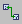 Switch to Connection mode button or right-click on an empty place of the drawing area.

When you drag an element, the connection line follows. It may however be necessary to change the path of a line to keep the diagram neat and clear. You can do this by simply dragging the line.

See also

[Connection Popup Window](markdown/BDE_ConnectionPopupWindow.md)

[Inserting an Element into a Connection](markdown/BDE_InsertElement_in_Connection.md)

[Component Manager - Colors Options](ComponentManagerEnglishUS.chm::/cm_color_settings.htm)

[Using the If Statements](markdown/UseIf.md)

[Sequence Calls](markdown/BDE_SequenceCalls.md)

/* Heikki Komulainen, Comet Computer GmbH 2004 */ cc_plus_pic = '&nbsp;'; cc_minus_pic = '&nbsp;'; cc_stat_pic = '&nbsp;'; gpstyle = ''; var iframes_created = 0; if (document.body && document.body.insertAdjacentHTML && document.getElementsByTagName && document.getElementById) { collect_popups(); set_poplinks_pictures(); if (iframes_created) { document.write(gpstyle); document.write('
<nobr><a id="einauslink" style="position:absolute;top:expression(document.body.scrollTop + this.offsetHeight - this.offsetHeight);left:expression(document.body.offsetWidth - (this.offsetWidth + 28));background:white;padding:5px" href="javascript:show_all_poptext()">Alle texte einblenden</a></nobr>
'); } } function collect_popups() { bsscpopups = new Array(); for (x = 0; x < document.links.length; x++) { if (document.links[x].href.indexOf("BSSCPopup")>-1) { seekmatch = /BSSCPopup.'[^'](markdown/+)'/; poplink = seekmatch.exec(document.links[x].href); poplink = "" + poplink; poplink = poplink.substring(poplink.indexOf("'")+1, poplink.lastIndexOf("'")); ifid = "CCGENIFRAMEID" + x; new_iframe = '<iframe id="' + ifid + '"src="' + poplink + '" onload="get_text(\'' + ifid + '\')" width="0" height="0" frameborder=0></iframe>'; document.links[x].parentNode.insertAdjacentHTML("afterEnd", new_iframe); gpid = "CCID_" + ifid; document.links[x].href = "javascript:expand_poptext('" + gpid + "')"; cc_plus = '' + cc_plus_pic + ''; document.links[x].insertAdjacentHTML("afterBegin", cc_plus); iframes_created = 1; } } }// end function function get_text(ifr_id) { frpars = document.frames[ifr_id].document.getElementsByTagName("body"); popbody = frpars[0].innerHTML; gpid = "CCID_" + ifr_id; if (!document.getElementById(gpid)) { //avoiding doubles document.getElementById(ifr_id).insertAdjacentHTML("afterEnd", '
'+popbody+'
'); } }//end function function expand_poptext(x_frame_id) { if (!document.getElementById(x_frame_id)) return; if (document.getElementById(x_frame_id).className == "CCGENPOPTEXTH") { document.getElementById(x_frame_id).className = "CCGENPOPTEXTV"; document.getElementById(x_frame_id).style.visibility = "visible"; if (document.getElementById("CCPMB_" + x_frame_id )) { document.getElementById("CCPMB_" + x_frame_id ).innerHTML = cc_minus_pic; } } else { document.getElementById(x_frame_id).className = "CCGENPOPTEXTH"; document.getElementById(x_frame_id).style.visibility = "hidden"; if (document.getElementById("CCPMB_" + x_frame_id )) { document.getElementById("CCPMB_" + x_frame_id ).innerHTML = cc_plus_pic; } } }// end function function show_all_poptext() { var pulldowntxt = document.getElementsByTagName("div"); for (b = 0; b < pulldowntxt.length; b++) { if (pulldowntxt[b].className == "droptext") { pulldowntxt[b].style.display=""; } } var gptxt = document.getElementsByTagName("div"); for (z = 0; z < gptxt.length; z++) { if (gptxt[z].className == "CCGENPOPTEXTH") { gptxt[z].className = "CCGENPOPTEXTV"; gptxt[z].style.visibility = "visible"; if (document.getElementById("CCPMB_" + gptxt[z].id )) { document.getElementById("CCPMB_" + gptxt[z].id ).innerHTML = cc_minus_pic; } } } var dxpoplinks = document.getElementsByTagName("a"); if (dxpoplinks) { for (pxl = 0; pxl < dxpoplinks.length; pxl++) { if (dxpoplinks[pxl].href.indexOf("kadovTextPopup")>-1) { if (document.getElementById("CCPMB_" + dxpoplinks[pxl].id)) { document.getElementById("CCPMB_" + dxpoplinks[pxl].id).innerHTML = cc_stat_pic; dxpoplinks[pxl].symbol = "minus"; } } } } document.getElementById('einauslink').innerText = 'Alle texte ausblenden'; document.getElementById('einauslink').href = "javascript:self.location.reload()"; self.focus(); }// end function function eat_click() { return false; }// end function function set_poplinks_pictures() { var dpoplinks = document.getElementsByTagName("a"); if (dpoplinks) { for (pl = 0; pl < dpoplinks.length; pl++) { if (dpoplinks[pl].href.indexOf("kadovTextPopup")>-1) { cc_plus = '' + cc_stat_pic + ''; //dpoplinks[pl].onmouseup = plusminuspoplink; dpoplinks[pl].insertAdjacentHTML("afterBegin", cc_plus); dpoplinks[pl].symbol = "plus"; } } } }// end function function plusminuspoplink() { if (document.getElementById("CCPMB_" + this.id)) { if (this.symbol == "plus") { document.getElementById("CCPMB_" + this.id).innerHTML = cc_minus_pic; this.symbol = "minus"; } else { document.getElementById("CCPMB_" + this.id).innerHTML = cc_plus_pic; this.symbol = "plus"; } } return true; }

---

## Using the If Statements

_Source: `markdown/UseIf.md`_

# Using the If Statements

To use the If statements, proceed as follows:

1. In the Basic Blocks palette or toolbar, click on the  or  button to load the mouse cursor with the respective block.
1. Place the block in the drawing area.
1. Connect the input to a logical element.
1. Specify the actions for the branches.
1. Right-click on the sequence call you want to connect to a branch, and select Connector from the context menu.
1. Connect the desired branch to the connector.
1. Repeat these actions for the second branch of the If…Then…Else block.

See also

[Editing the Sequence Call in the Sequence Editor](markdown/EditSequence.md)

[Using the Switch](markdown/UseSwitch.md)

[Using the While Loop](markdown/Usewhileloop.md)

---

## Using the Switch

_Source: `markdown/UseSwitch.md`_

# Using the Switch

To use the [switch](markdown/BDE_switch.md), proceed as follows:

1. From the No. of arguments combo box of the Basic Blocks palette or toolbar, select the number of branches for the switch.
1. Click on the  Switch button to load the mouse cursor with the respective block.
1. Place the block in the drawing area.
1. To change the values for the alternative branches, right-click on the block and select Edit Literals from the context menu.
1. Connect the input at the top of the block to a limitInt or wrapInt (sdisc or udisc) element or to an enumeration.
1. Specify the actions for the branches.
1. Right-click on the sequence call you want to connect to a branch, and select Connector from the context menu.
1. Connect the desired branch to the connector.
1. Repeat these actions for the other branches.

 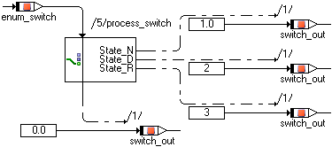

See also

[Switch](markdown/BDE_switch.md)

[Editing the Sequence Call in the Sequence Editor](markdown/EditSequence.md)

---

## Using the While Loop

_Source: `markdown/Usewhileloop.md`_

# Using the While Loop

The only loop construct available in block diagrams is the While loop. To use the While loop, proceed as follows:

1. In the Basic Blocks palette or toolbar, click on the  button to load the mouse cursor with the respective block.
1. Place the block in the drawing area.
1. Specify the loop condition.
1. Connect the condition to the loop input.
1. Specify the loop action.
1. Right-click on the sequence call you want to connect to the loop output, and select Connector from the context menu.
1. Connect the loop output to the connector.

You can connect the output to more than one actions. In that case, edit the connector numbers (according to [Editing the Sequence Call in the Sequence Editor](markdown/EditSequence.md)). As for sequence calls, each number must be unique.

Make sure that you avoid infinite loops or loops unsuitable for real-time applications, e.g., via an appropriate setting for Max Number of Loop Iterations in the project properties, Experiment Code node, of the associated project.

See also

[Editing the Sequence Call in the Sequence Editor](markdown/EditSequence.md)

[Project Editor - Experiment Code Node](ProjectEditorEnglishUS.chm::/Exp_Code_Options_Window.htm)

---

## Using the Verify Operator

_Source: `markdown/BDE_UseVerifyOperator.md`_

# Using the Verify Operator

The Verify operator is used to check if the original and the complement of an element marked as redundant are consistent. The operator returns a Boolean value.

Proceed as follows to check the consistency of an element marked as redundant:

1. In the Basic Blocks palette or toolbar, click on the  Verify button to add a Verify operator.
1. Place the operator in the drawing area.
1. For a scalar element marked as redundant, do the following:
1. For an array or matrix marked as redundant, do the following:
1. Connect the output of the Verify operator to a block that accepts Boolean values (e.g., a logic variable or the connector of an If block).

See [Code Generation with Redundant Data Storage](IntroductionEnglishUS.chm::/INT_CodeGen_RedundantDataStorage.htm#VerifyScalar) for examples of generated code.

You must connect only an element marked as redundant to the Verify operator. If you connect a non-redundant element to the Verify operator, an error is issued during code generation: MMdl371 - verify operator can only be used on model identifier with redundant flag set

See also

[Redundant Data Storage](IntroductionEnglishUS.chm::/INT_RedundantDataStorage.htm)

[Code Generation with Redundant Data Storage](IntroductionEnglishUS.chm::/INT_CodeGen_RedundantDataStorage.htm)

---

## Using the Conversion Operator

_Source: `markdown/BDE_UseConversionOperator.md`_

# Using the Conversion Operator

To use the Conversion operator, proceed as follows:

1. In the Basic Blocks palette or toolbar, click on the  Conversion Limit or  Conversion WrapAround button.
1. Place the operator in the drawing area.
1. To determine the conversion result, do the following:
1. Connect the operator input to a scalar element of numerical or enumeration type.
1. Connect the operator output to a suitable operator or element.

Some examples are given in [Examples: Conversion Operator](markdown/BDE_Example_ConversionOperator.md).

See also

[Converting sdisc/udisc to limitInt/wrapInt](IntroductionEnglishUS.chm::/INT_Convert_SdiscUdisc_to_limitInt_wrapInt.htm)

[Conversion Operator](markdown/BDE_ConversionOperator.md)

[Conversion Attributes Dialog Window](markdown/BDE_ConversionAttributesWindow.md)

[Examples: Conversion Operator](markdown/BDE_Example_ConversionOperator.md)

---

## Using the Assert Operator

_Source: `markdown/BDE_Use_AssertOperator.md`_

# Using the Assert Operator

To use the Assert operator in a block diagram, proceed as follows:

1. In the Basic Blocks palette or toolbar, click on the  Assert button.
1. Place the operator in the drawing area.
1. To determine the interval for the operand, do the following:
1. Connect the operator input to a scalar operand of numerical type (i.e., cont, limitInt, wrapInt, sdisc or udisc).
1. Connect the operator output to a suitable operator or element.

An example is given in [Example: Assert Operator](markdown/BDE_Example_AssertOperator.md).

See also

[Assert Operator](markdown/BDE_Assert_Operator.md)

[Example: Assert Operator](markdown/BDE_Example_AssertOperator.md)

[Assert Attributes Dialog Window](markdown/BDE_AssertAttributes_Window.md)

---

## Adding and Editing a Comment

_Source: `markdown/Addcomment.md`_

# Adding and Editing a Comment

To add a comment, proceed as follows:

1. In the Basic Blocks palette or toolbar, click on the  Comment button.
1. In the text field of the Insert Comment window, enter the text for your comment.
1. In the View Configuration area, use the combo boxes to set the comment visibility in the available views.
1. Click on OK.
1. Click in the drawing area to place the comment.

To edit a comment, proceed as follows:

1. To move the comment, drag it to a new position.
1. To change the comment text or visibility, do the following:

1. Double-click the comment.
1. In the text field of the Edit Comment window, change the comment text.
1. In the View Configuration area, use the combo boxes to set the comment visibility in the available views.
1. Click on OK to close the window and accept your changes.

Your settings in the View Configuration area will be used as defaults for new comments, as long as ASCET runs. The settings are not stored when you close ASCET. When you [export the view](AutomaticDocumentationEnglishUS.chm::/Exporting_Views.htm), the settings are stored in the <BasicBlockDefaults> section of the [view export file](AutomaticDocumentationEnglishUS.chm::/AD_ExampleViewExportFile.htm).

See also

[Insert/Edit Comment Dialog Window](markdown/BDE_InsertEditComment_Window.md)

1. [Automatic Documentation - Views](AutomaticDocumentationEnglishUS.chm::/AD_views.htm) [Automatic Documentation - Exporting Views](AutomaticDocumentationEnglishUS.chm::/Exporting_Views.htm) [Automatic Documentation - Example: View Export File](AutomaticDocumentationEnglishUS.chm::/AD_ExampleViewExportFile.htm)

---

## Adding and Editing a Literal

_Source: `markdown/BDE_AddLiteral.md`_

# Adding and Editing a Literal

To add a literal, proceed as follows:

1. In the Basic Blocks palette or toolbar, click on a literal button ( , , , , ).
1. Click in the drawing area to place the literal.
1. Do one of the following:
1. Activate the respective Numeric * option when you need a numeric literal in hexadecimal or binary format.
1. Activate the Others option when you need a numeric literal in physical representation or a non-numeric literal.
1. In the combo box, enter or select a value for the literal.
1. Click OK to close the Literal editor.
1. Click OK to confirm the message, and correct the value in the Literal editor.

See also

[Literals](IntroductionEnglishUS.chm::/INT_literals.htm)

---

## Renaming or Deleting an Element

_Source: `markdown/BDE_rename_delete.md`_

# Renaming or Deleting an Element

To rename or delete an element from the component, proceed as follows:

1. In the Outline tab, select an element.
1. In the Edit menu, select Rename to rename the element.
1. In the Edit menu, select Delete to delete the element.

See also

[Searching/Deleting Unused Elements](markdown/BDE_SearchDeleteUnusedElements.md)

[Removing a Connection or an Element](markdown/Deleteconnection.md)

[Replacing a Diagram Item](markdown/ReplaceDiagram.md)

[Copying/Moving Diagram Items in the Same Diagram](markdown/BDE_Cutcopypaste.md)

[Copying/Moving Diagram Items Between Diagrams](markdown/BDE_CopyMove_Items_betweenDiagram.md)

[Reserved Keywords](IntroductionEnglishUS.chm::/INT_Reserved_Keywords.htm)

---

## Searching/Deleting Unused Elements

_Source: `markdown/BDE_SearchDeleteUnusedElements.md`_

# Searching/Deleting Unused Elements

To delete elements (scalar, composite or complex) not used in the block diagram, proceed as follows:

1. In the Extras menu, select Show Unused Elements.
1. In the Elements tab of the Search Results view, select one, several, or all (Ctrl + a) elements.
1. Do one of the following:

- Open the context menu and select Delete.
- Press Delete.

The selected unused elements are deleted.

See also

[Search Results View](markdown/bde_SearchResultsView.md)

[Renaming or Deleting an Element](markdown/BDE_rename_delete.md)

[Reserved Keywords](IntroductionEnglishUS.chm::/INT_Reserved_Keywords.htm)

/* Heikki Komulainen, Comet Computer GmbH 2004 */ cc_plus_pic = '&nbsp;'; cc_minus_pic = '&nbsp;'; cc_stat_pic = '&nbsp;'; gpstyle = ''; var iframes_created = 0; if (document.body && document.body.insertAdjacentHTML && document.getElementsByTagName && document.getElementById) { collect_popups(); set_poplinks_pictures(); if (iframes_created) { document.write(gpstyle); document.write('
<nobr><a id="einauslink" style="position:absolute;top:expression(document.body.scrollTop + this.offsetHeight - this.offsetHeight);left:expression(document.body.offsetWidth - (this.offsetWidth + 28));background:#ffffe0;padding:5px" href="javascript:show_all_poptext()">Show all hidden text</a></nobr>
'); } } function collect_popups() { bsscpopups = new Array(); for (x = 0; x < document.links.length; x++) { if (document.links[x].href.indexOf("BSSCPopup")>-1) { seekmatch = /BSSCPopup.'[^'](markdown/+)'/; poplink = seekmatch.exec(document.links[x].href); poplink = "" + poplink; poplink = poplink.substring(poplink.indexOf("'")+1, poplink.lastIndexOf("'")); ifid = "CCGENIFRAMEID" + x; new_iframe = '<iframe id="' + ifid + '"src="' + poplink + '" onload="get_text(\'' + ifid + '\')" width="0" height="0" frameborder=0></iframe>'; document.links[x].parentNode.insertAdjacentHTML("afterEnd", new_iframe); gpid = "CCID_" + ifid; document.links[x].href = "javascript:expand_poptext('" + gpid + "')"; cc_plus = '' + cc_plus_pic + ''; document.links[x].insertAdjacentHTML("afterBegin", cc_plus); iframes_created = 1; } } }// end function function get_text(ifr_id) { frpars = document.frames[ifr_id].document.getElementsByTagName("body"); popbody = frpars[0].innerHTML; gpid = "CCID_" + ifr_id; if (!document.getElementById(gpid)) { //avoiding doubles document.getElementById(ifr_id).insertAdjacentHTML("afterEnd", '
'+popbody+'
'); } }//end function function expand_poptext(x_frame_id) { if (!document.getElementById(x_frame_id)) return; if (document.getElementById(x_frame_id).className == "CCGENPOPTEXTH") { document.getElementById(x_frame_id).className = "CCGENPOPTEXTV"; document.getElementById(x_frame_id).style.visibility = "visible"; if (document.getElementById("CCPMB_" + x_frame_id )) { document.getElementById("CCPMB_" + x_frame_id ).innerHTML = cc_minus_pic; } } else { document.getElementById(x_frame_id).className = "CCGENPOPTEXTH"; document.getElementById(x_frame_id).style.visibility = "hidden"; if (document.getElementById("CCPMB_" + x_frame_id )) { document.getElementById("CCPMB_" + x_frame_id ).innerHTML = cc_plus_pic; } } }// end function function show_all_poptext() { var pulldowntxt = document.getElementsByTagName("div"); for (b = 0; b < pulldowntxt.length; b++) { if (pulldowntxt[b].className == "droptext") { pulldowntxt[b].style.display=""; } } var gptxt = document.getElementsByTagName("div"); for (z = 0; z < gptxt.length; z++) { if (gptxt[z].className == "CCGENPOPTEXTH") { gptxt[z].className = "CCGENPOPTEXTV"; gptxt[z].style.visibility = "visible"; if (document.getElementById("CCPMB_" + gptxt[z].id )) { document.getElementById("CCPMB_" + gptxt[z].id ).innerHTML = cc_minus_pic; } } } var dxpoplinks = document.getElementsByTagName("a"); if (dxpoplinks) { for (pxl = 0; pxl < dxpoplinks.length; pxl++) { if (dxpoplinks[pxl].href.indexOf("kadovTextPopup")>-1) { if (document.getElementById("CCPMB_" + dxpoplinks[pxl].id)) { document.getElementById("CCPMB_" + dxpoplinks[pxl].id).innerHTML = cc_stat_pic; dxpoplinks[pxl].symbol = "minus"; } } } } document.getElementById('einauslink').innerText = 'Hide all hideable text'; document.getElementById('einauslink').href = "javascript:self.location.reload()"; self.focus(); }// end function function eat_click() { return false; }// end function function set_poplinks_pictures() { var dpoplinks = document.getElementsByTagName("a"); if (dpoplinks) { for (pl = 0; pl < dpoplinks.length; pl++) { if (dpoplinks[pl].href.indexOf("kadovTextPopup")>-1) { cc_plus = '' + cc_stat_pic + ''; //dpoplinks[pl].onmouseup = plusminuspoplink; dpoplinks[pl].insertAdjacentHTML("afterBegin", cc_plus); dpoplinks[pl].symbol = "plus"; } } } }// end function function plusminuspoplink() { if (document.getElementById("CCPMB_" + this.id)) { if (this.symbol == "plus") { document.getElementById("CCPMB_" + this.id).innerHTML = cc_minus_pic; this.symbol = "minus"; } else { document.getElementById("CCPMB_" + this.id).innerHTML = cc_plus_pic; this.symbol = "plus"; } } return true; }

---

## Inserting an Element into a Connection

_Source: `markdown/BDE_InsertElement_in_Connection.md`_

# Inserting an Element into a Connection

To insert an element into an existing connection, proceed as follows:

1. Do one of the following:
1. Do one of the following:
1. If you do not want to be asked each time you insert an element, activate the Don't show this hint again option.
1. Do one of the following:

See also

[Removing an Element](markdown/BDE_RemoveElement.md)

[Confirmation Dialog Options](ComponentManagerEnglishUS.chm::/CM_Options_for_Confirmation_Dialogs.htm)

---

## Removing a Connection

_Source: `markdown/Deleteconnection.md`_

# Removing a Connection

To remove a connection from the diagram, proceed as follows:

1. In the drawing area, select the connection you want to remove.
1. Press Delete.

The selected connection is removed from the block diagram.

See also

[Removing an Element](markdown/BDE_RemoveElement.md)

[Renaming or Deleting an Element](markdown/BDE_rename_delete.md)

---

## Removing an Element

_Source: `markdown/BDE_RemoveElement.md`_

| Column 1 | Column 2 | Column 3 |
| --- | --- | --- |
| removed diagram element | resulting connection | example |
| scalar/logical/enumeration element, left and right side connected to other elements | input and output connected directly |  |
| operator | first input value connected to output value, other connections deleted |  |
| array or matrix | input value connected to output value, connections to index value(s) deleted |  |
| characteristic line/map | line: input value connected to output value map: X input value connected to output value |  |
| complex element (e.g., included class) | connections deleted without question |  |

# Removing an Element

To remove an element from the diagram, proceed as follows:

1. In the drawing area, select the element you want to remove.
1. Do one of the following:
1. If you do not want to be asked each time you delete a connected element, activate the Don't show this hint again option.
1. Do one of the following:

The selected element is removed from the block diagram (but not from the component). If you clicked Yes, existing connections are kept or removed, [depending on the removed element](javascript:kadovTextPopup(this))<!-- kadovTextPopupInit('a1'); //-->.

See also

[Renaming or Deleting an Element](markdown/BDE_rename_delete.md)

[Inserting an Element into a Connection](markdown/BDE_InsertElement_in_Connection.md)

[Confirmation Dialog Options](ComponentManagerEnglishUS.chm::/CM_Options_for_Confirmation_Dialogs.htm)

/* Heikki Komulainen, Comet Computer GmbH 2004 */ cc_plus_pic = '&nbsp;'; cc_minus_pic = '&nbsp;'; cc_stat_pic = '&nbsp;'; gpstyle = ''; var iframes_created = 0; if (document.body && document.body.insertAdjacentHTML && document.getElementsByTagName && document.getElementById) { collect_popups(); set_poplinks_pictures(); if (iframes_created) { document.write(gpstyle); document.write('
<nobr><a id="einauslink" style="position:absolute;top:expression(document.body.scrollTop + this.offsetHeight - this.offsetHeight);left:expression(document.body.offsetWidth - (this.offsetWidth + 28));background:white;padding:5px" href="javascript:show_all_poptext()">Show all hidden text</a></nobr>
'); } } function collect_popups() { bsscpopups = new Array(); for (x = 0; x < document.links.length; x++) { if (document.links[x].href.indexOf("BSSCPopup")>-1) { seekmatch = /BSSCPopup.'[^'](markdown/+)'/; poplink = seekmatch.exec(document.links[x].href); poplink = "" + poplink; poplink = poplink.substring(poplink.indexOf("'")+1, poplink.lastIndexOf("'")); ifid = "CCGENIFRAMEID" + x; new_iframe = '<iframe id="' + ifid + '"src="' + poplink + '" onload="get_text(\'' + ifid + '\')" width="0" height="0" frameborder=0></iframe>'; document.links[x].parentNode.insertAdjacentHTML("afterEnd", new_iframe); gpid = "CCID_" + ifid; document.links[x].href = "javascript:expand_poptext('" + gpid + "')"; cc_plus = '' + cc_plus_pic + ''; document.links[x].insertAdjacentHTML("afterBegin", cc_plus); iframes_created = 1; } } }// end function function get_text(ifr_id) { frpars = document.frames[ifr_id].document.getElementsByTagName("body"); popbody = frpars[0].innerHTML; gpid = "CCID_" + ifr_id; if (!document.getElementById(gpid)) { //avoiding doubles document.getElementById(ifr_id).insertAdjacentHTML("afterEnd", '
'+popbody+'
'); } }//end function function expand_poptext(x_frame_id) { if (!document.getElementById(x_frame_id)) return; if (document.getElementById(x_frame_id).className == "CCGENPOPTEXTH") { document.getElementById(x_frame_id).className = "CCGENPOPTEXTV"; document.getElementById(x_frame_id).style.visibility = "visible"; if (document.getElementById("CCPMB_" + x_frame_id )) { document.getElementById("CCPMB_" + x_frame_id ).innerHTML = cc_minus_pic; } } else { document.getElementById(x_frame_id).className = "CCGENPOPTEXTH"; document.getElementById(x_frame_id).style.visibility = "hidden"; if (document.getElementById("CCPMB_" + x_frame_id )) { document.getElementById("CCPMB_" + x_frame_id ).innerHTML = cc_plus_pic; } } }// end function function show_all_poptext() { var pulldowntxt = document.getElementsByTagName("div"); for (b = 0; b < pulldowntxt.length; b++) { if (pulldowntxt[b].className == "droptext") { pulldowntxt[b].style.display=""; } } var gptxt = document.getElementsByTagName("div"); for (z = 0; z < gptxt.length; z++) { if (gptxt[z].className == "CCGENPOPTEXTH") { gptxt[z].className = "CCGENPOPTEXTV"; gptxt[z].style.visibility = "visible"; if (document.getElementById("CCPMB_" + gptxt[z].id )) { document.getElementById("CCPMB_" + gptxt[z].id ).innerHTML = cc_minus_pic; } } } var dxpoplinks = document.getElementsByTagName("a"); if (dxpoplinks) { for (pxl = 0; pxl < dxpoplinks.length; pxl++) { if (dxpoplinks[pxl].href.indexOf("kadovTextPopup")>-1) { if (document.getElementById("CCPMB_" + dxpoplinks[pxl].id)) { document.getElementById("CCPMB_" + dxpoplinks[pxl].id).innerHTML = cc_stat_pic; dxpoplinks[pxl].symbol = "minus"; } } } } document.getElementById('einauslink').innerText = 'Hide all hideable text'; document.getElementById('einauslink').href = "javascript:self.location.reload()"; self.focus(); }// end function function eat_click() { return false; }// end function function set_poplinks_pictures() { var dpoplinks = document.getElementsByTagName("a"); if (dpoplinks) { for (pl = 0; pl < dpoplinks.length; pl++) { if (dpoplinks[pl].href.indexOf("kadovTextPopup")>-1) { cc_plus = '' + cc_stat_pic + ''; //dpoplinks[pl].onmouseup = plusminuspoplink; dpoplinks[pl].insertAdjacentHTML("afterBegin", cc_plus); dpoplinks[pl].symbol = "plus"; } } } }// end function function plusminuspoplink() { if (document.getElementById("CCPMB_" + this.id)) { if (this.symbol == "plus") { document.getElementById("CCPMB_" + this.id).innerHTML = cc_minus_pic; this.symbol = "minus"; } else { document.getElementById("CCPMB_" + this.id).innerHTML = cc_plus_pic; this.symbol = "plus"; } } return true; }

---

## Copying/Moving Diagram Items in the Same Diagram

_Source: `markdown/BDE_Cutcopypaste.md`_

1. In the Edit menu, select Cut.
1. Press Ctrl + x.
1. Click on  Cut.

1. In the Edit menu, select Copy.
1. Press Ctrl + c.
1. Click on  Copy.

1. In the Edit menu, select Paste.
1. Press Ctrl + v.
1. Click on  Paste.

# Copying/Moving Diagram Items in the Same Diagram

You create a new graphical occurrence of the same element, not a new element, when you paste a diagram item from the clipboard to the diagram.

To cut, copy and paste diagram items in the same diagram, proceed as follows:

1. In the drawing area, select the diagram items you want to cut or copy.
1. To cut the selected items, do [one of the following](javascript:kadovTextPopup(this))<!-- kadovTextPopupInit('a1'); //-->.
1. To copy the selected items, do [one of the following](javascript:kadovTextPopup(this))<!-- kadovTextPopupInit('a2'); //-->.
1. To paste the items, do [one of the following](javascript:kadovTextPopup(this))<!-- kadovTextPopupInit('a3'); //-->.
1. Drag the new diagram items to a suitable location.
1. Edit the pasted sequence calls.
1. If your selection contained method-local elements, make sure that the return value is assigned only once and has the highest sequence number.

See also

[Copying/Moving Diagram Items Between Diagrams](markdown/BDE_CopyMove_Items_betweenDiagram.md)

[Copying or Moving Graphical Items](markdown/BDE_CopyMove_GraphicItems.md)

[Working on Sequence Calls](markdown/BDE_WorkingOnSequenceCalls.md)

/* Heikki Komulainen, Comet Computer GmbH 2004 */ cc_plus_pic = '&nbsp;'; cc_minus_pic = '&nbsp;'; cc_stat_pic = '&nbsp;'; gpstyle = ''; var iframes_created = 0; if (document.body && document.body.insertAdjacentHTML && document.getElementsByTagName && document.getElementById) { collect_popups(); set_poplinks_pictures(); if (iframes_created) { document.write(gpstyle); document.write('
<nobr><a id="einauslink" style="position:absolute;top:expression(document.body.scrollTop + this.offsetHeight - this.offsetHeight);left:expression(document.body.offsetWidth - (this.offsetWidth + 28));background:white;padding:5px" href="javascript:show_all_poptext()">Show all hidden text</a></nobr>
'); } } function collect_popups() { bsscpopups = new Array(); for (x = 0; x < document.links.length; x++) { if (document.links[x].href.indexOf("BSSCPopup")>-1) { seekmatch = /BSSCPopup.'[^'](markdown/+)'/; poplink = seekmatch.exec(document.links[x].href); poplink = "" + poplink; poplink = poplink.substring(poplink.indexOf("'")+1, poplink.lastIndexOf("'")); ifid = "CCGENIFRAMEID" + x; new_iframe = '<iframe id="' + ifid + '"src="' + poplink + '" onload="get_text(\'' + ifid + '\')" width="0" height="0" frameborder=0></iframe>'; document.links[x].parentNode.insertAdjacentHTML("afterEnd", new_iframe); gpid = "CCID_" + ifid; document.links[x].href = "javascript:expand_poptext('" + gpid + "')"; cc_plus = '' + cc_plus_pic + ''; document.links[x].insertAdjacentHTML("afterBegin", cc_plus); iframes_created = 1; } } }// end function function get_text(ifr_id) { frpars = document.frames[ifr_id].document.getElementsByTagName("body"); popbody = frpars[0].innerHTML; gpid = "CCID_" + ifr_id; if (!document.getElementById(gpid)) { //avoiding doubles document.getElementById(ifr_id).insertAdjacentHTML("afterEnd", '
'+popbody+'
'); } }//end function function expand_poptext(x_frame_id) { if (!document.getElementById(x_frame_id)) return; if (document.getElementById(x_frame_id).className == "CCGENPOPTEXTH") { document.getElementById(x_frame_id).className = "CCGENPOPTEXTV"; document.getElementById(x_frame_id).style.visibility = "visible"; if (document.getElementById("CCPMB_" + x_frame_id )) { document.getElementById("CCPMB_" + x_frame_id ).innerHTML = cc_minus_pic; } } else { document.getElementById(x_frame_id).className = "CCGENPOPTEXTH"; document.getElementById(x_frame_id).style.visibility = "hidden"; if (document.getElementById("CCPMB_" + x_frame_id )) { document.getElementById("CCPMB_" + x_frame_id ).innerHTML = cc_plus_pic; } } }// end function function show_all_poptext() { var pulldowntxt = document.getElementsByTagName("div"); for (b = 0; b < pulldowntxt.length; b++) { if (pulldowntxt[b].className == "droptext") { pulldowntxt[b].style.display=""; } } var gptxt = document.getElementsByTagName("div"); for (z = 0; z < gptxt.length; z++) { if (gptxt[z].className == "CCGENPOPTEXTH") { gptxt[z].className = "CCGENPOPTEXTV"; gptxt[z].style.visibility = "visible"; if (document.getElementById("CCPMB_" + gptxt[z].id )) { document.getElementById("CCPMB_" + gptxt[z].id ).innerHTML = cc_minus_pic; } } } var dxpoplinks = document.getElementsByTagName("a"); if (dxpoplinks) { for (pxl = 0; pxl < dxpoplinks.length; pxl++) { if (dxpoplinks[pxl].href.indexOf("kadovTextPopup")>-1) { if (document.getElementById("CCPMB_" + dxpoplinks[pxl].id)) { document.getElementById("CCPMB_" + dxpoplinks[pxl].id).innerHTML = cc_stat_pic; dxpoplinks[pxl].symbol = "minus"; } } } } document.getElementById('einauslink').innerText = 'Hide all hideable text'; document.getElementById('einauslink').href = "javascript:self.location.reload()"; self.focus(); }// end function function eat_click() { return false; }// end function function set_poplinks_pictures() { var dpoplinks = document.getElementsByTagName("a"); if (dpoplinks) { for (pl = 0; pl < dpoplinks.length; pl++) { if (dpoplinks[pl].href.indexOf("kadovTextPopup")>-1) { cc_plus = '' + cc_stat_pic + ''; //dpoplinks[pl].onmouseup = plusminuspoplink; dpoplinks[pl].insertAdjacentHTML("afterBegin", cc_plus); dpoplinks[pl].symbol = "plus"; } } } }// end function function plusminuspoplink() { if (document.getElementById("CCPMB_" + this.id)) { if (this.symbol == "plus") { document.getElementById("CCPMB_" + this.id).innerHTML = cc_minus_pic; this.symbol = "minus"; } else { document.getElementById("CCPMB_" + this.id).innerHTML = cc_plus_pic; this.symbol = "plus"; } } return true; }

---

## Copying/Moving Diagram Items Between Diagrams

_Source: `markdown/BDE_CopyMove_Items_betweenDiagram.md`_

1. In the Edit menu, select Cut or Copy.
1. Press Ctrl + x or Ctrl + c.
1. Click on  Cut or  Copy.

1. Click in the drawing area of the target component.
1. In the Edit menu, select Paste.
1. Press Ctrl + v.
1. Click on  Paste.

| Column 1 | Column 2 |
| --- | --- |
| Keep | The existing element replaces the copied element. |
| Overwrite | The copied element replaces the existing element. |
| Create New (not available for return values) | Pastes the copied element to a new element named <element name>_<n> , <n> being the lowest integer number that causes no name clash. If the renamed element causes a new name conflict, renaming is done in alphabetical order; see the example . |
| Cancel | Aborts the paste procedure. |

The Apply to the next <x> conflicts option allows you to apply your selection to all name conflicts.

If arg_1 and arg_2 are pasted to a method with an existing arg_1, the following happens:

- The names of the copied arg_1 and the existing arg_1 conflict, and the copied arg_1 is renamed to arg_2.
- Now, the names of the copied arg_2 and the newly created arg_2 (the copied arg_1) conflict, and the copied arg_2 is renamed to arg_3.

| Column 1 | Column 2 |
| --- | --- |
| Keep | The existing element replaces the copied element. Keeping an element of different type (e.g., log vs. cont, array vs. scalar) than the copied element can lead to an invalid model. |
| Overwrite | The copied element replaces the existing element. Replacing an existing element with a copied element of different type (e.g., log vs. cont, array vs. scalar) can lead to an invalid model. |
| Create New (not available for return values) | Pastes the copied element to a new element named <element name> . If the new element causes a name conflict, it is renamed to <element name>_<n> ( <n> being the lowest integer number that causes no name clash); see the example . It is strongly recommended that you use Create New . |
| Cancel | Aborts the paste procedure. |

The Apply to the next <x> conflicts option allows you to apply your selection to all type conflicts, with the exception of conflicting return values.

If arg_1 (cont) is pasted to a method with existing arguments arg_1 (log) and arg_2 (cont), the following happens:

- The types of the copied arg_1 and the existing arg_1 conflict, and the copied arg_1 is renamed to arg_2.
- Now, the names of the newly created arg_2 (the copied arg_1) and the existing arg_2 conflict, and the newly created arg_2 is renamed to arg_3.

# Copying/Moving Diagram Items Between Diagrams

To cut/copy diagram items from one diagram and paste them to another diagram, proceed as follows:

1. In the drawing area, select the diagram items you want to cut or copy.
1. To cut or copy the selected items, do [one of the following](javascript:kadovTextPopup(this))<!-- kadovTextPopupInit('a1'); //-->.
1. Open the target component and load the target diagram.
1. To paste the items, do [one of the following](javascript:kadovTextPopup(this))<!-- kadovTextPopupInit('a3'); //-->.
1. In the Select Method window, select an existing method/process/runnable, or create a new one, and click OK.
1. In the Create new Method window, click Yes to create the new method/process/runnable and paste the diagram items.
1. In the Ignored Elements window, click Continue to paste the allowed diagram items.

The model will be invalid, due to the ignored elements. You must edit it before you can use it.

1. See also

[Copying/Moving Diagram Items in the Same Diagram](markdown/BDE_Cutcopypaste.md)

[Copying or Moving Graphical Items](markdown/BDE_CopyMove_GraphicItems.md)

[Working on Sequence Calls](markdown/BDE_WorkingOnSequenceCalls.md)

/* Heikki Komulainen, Comet Computer GmbH 2004 */ cc_plus_pic = '&nbsp;'; cc_minus_pic = '&nbsp;'; cc_stat_pic = '&nbsp;'; gpstyle = ''; var iframes_created = 0; if (document.body && document.body.insertAdjacentHTML && document.getElementsByTagName && document.getElementById) { collect_popups(); set_poplinks_pictures(); if (iframes_created) { document.write(gpstyle); document.write('
<nobr><a id="einauslink" style="position:absolute;top:expression(document.body.scrollTop + this.offsetHeight - this.offsetHeight);left:expression(document.body.offsetWidth - (this.offsetWidth + 28));background:white;padding:5px" href="javascript:show_all_poptext()">Show all hidden text</a></nobr>
'); } } function collect_popups() { bsscpopups = new Array(); for (x = 0; x < document.links.length; x++) { if (document.links[x].href.indexOf("BSSCPopup")>-1) { seekmatch = /BSSCPopup.'[^'](markdown/+)'/; poplink = seekmatch.exec(document.links[x].href); poplink = "" + poplink; poplink = poplink.substring(poplink.indexOf("'")+1, poplink.lastIndexOf("'")); ifid = "CCGENIFRAMEID" + x; new_iframe = '<iframe id="' + ifid + '"src="' + poplink + '" onload="get_text(\'' + ifid + '\')" width="0" height="0" frameborder=0></iframe>'; document.links[x].parentNode.insertAdjacentHTML("afterEnd", new_iframe); gpid = "CCID_" + ifid; document.links[x].href = "javascript:expand_poptext('" + gpid + "')"; cc_plus = '' + cc_plus_pic + ''; document.links[x].insertAdjacentHTML("afterBegin", cc_plus); iframes_created = 1; } } }// end function function get_text(ifr_id) { frpars = document.frames[ifr_id].document.getElementsByTagName("body"); popbody = frpars[0].innerHTML; gpid = "CCID_" + ifr_id; if (!document.getElementById(gpid)) { //avoiding doubles document.getElementById(ifr_id).insertAdjacentHTML("afterEnd", '
'+popbody+'
'); } }//end function function expand_poptext(x_frame_id) { if (!document.getElementById(x_frame_id)) return; if (document.getElementById(x_frame_id).className == "CCGENPOPTEXTH") { document.getElementById(x_frame_id).className = "CCGENPOPTEXTV"; document.getElementById(x_frame_id).style.visibility = "visible"; if (document.getElementById("CCPMB_" + x_frame_id )) { document.getElementById("CCPMB_" + x_frame_id ).innerHTML = cc_minus_pic; } } else { document.getElementById(x_frame_id).className = "CCGENPOPTEXTH"; document.getElementById(x_frame_id).style.visibility = "hidden"; if (document.getElementById("CCPMB_" + x_frame_id )) { document.getElementById("CCPMB_" + x_frame_id ).innerHTML = cc_plus_pic; } } }// end function function show_all_poptext() { var pulldowntxt = document.getElementsByTagName("div"); for (b = 0; b < pulldowntxt.length; b++) { if (pulldowntxt[b].className == "droptext") { pulldowntxt[b].style.display=""; } } var gptxt = document.getElementsByTagName("div"); for (z = 0; z < gptxt.length; z++) { if (gptxt[z].className == "CCGENPOPTEXTH") { gptxt[z].className = "CCGENPOPTEXTV"; gptxt[z].style.visibility = "visible"; if (document.getElementById("CCPMB_" + gptxt[z].id )) { document.getElementById("CCPMB_" + gptxt[z].id ).innerHTML = cc_minus_pic; } } } var dxpoplinks = document.getElementsByTagName("a"); if (dxpoplinks) { for (pxl = 0; pxl < dxpoplinks.length; pxl++) { if (dxpoplinks[pxl].href.indexOf("kadovTextPopup")>-1) { if (document.getElementById("CCPMB_" + dxpoplinks[pxl].id)) { document.getElementById("CCPMB_" + dxpoplinks[pxl].id).innerHTML = cc_stat_pic; dxpoplinks[pxl].symbol = "minus"; } } } } document.getElementById('einauslink').innerText = 'Hide all hideable text'; document.getElementById('einauslink').href = "javascript:self.location.reload()"; self.focus(); }// end function function eat_click() { return false; }// end function function set_poplinks_pictures() { var dpoplinks = document.getElementsByTagName("a"); if (dpoplinks) { for (pl = 0; pl < dpoplinks.length; pl++) { if (dpoplinks[pl].href.indexOf("kadovTextPopup")>-1) { cc_plus = '' + cc_stat_pic + ''; //dpoplinks[pl].onmouseup = plusminuspoplink; dpoplinks[pl].insertAdjacentHTML("afterBegin", cc_plus); dpoplinks[pl].symbol = "plus"; } } } }// end function function plusminuspoplink() { if (document.getElementById("CCPMB_" + this.id)) { if (this.symbol == "plus") { document.getElementById("CCPMB_" + this.id).innerHTML = cc_minus_pic; this.symbol = "minus"; } else { document.getElementById("CCPMB_" + this.id).innerHTML = cc_plus_pic; this.symbol = "plus"; } } return true; }

---

## Replacing a Diagram Item

_Source: `markdown/ReplaceDiagram.md`_

1. Do one of the following:
1. Use the Basic Blocks toolbar or palette to load the mouse cursor with a new diagram item.
1. Drag an existing unconnected operator from the diagram..

1. Click on an existing operator in the diagram to replace it with the new operator.

A confirmation window with additional information on replacing diagram items opens.

1. Activate the option Remember my Decision if you want to give the same answer to all questions of this type.

You can revoke this setting in the ASCET options window, [Confirmation Dialogs](ComponentManagerEnglishUS.chm::/CM_Options_for_Confirmation_Dialogs.htm) node.

1. Click Yes to replace the operator.

If you click No, the new operator is placed on top of the existing one. The borders of both operators are displayed in the [intersection color](ComponentManagerEnglishUS.chm::/cm_color_settings.htm) used to indicate overlapping diagram items.

1. Do one of the following:
1. Use the Elements toolbar or palette to load the mouse cursor with a new diagram item.
1. Drag an existing item from the Outline tab.

1. Click on an existing diagram item to replace it with the new item.

A confirmation window with additional information on replacing diagram items opens.

1. Activate the option Remember my Decision if you want to give the same answer to all questions of this type.

You can revoke this setting in the ASCET options window, [Confirmation Dialogs](ComponentManagerEnglishUS.chm::/CM_Options_for_Confirmation_Dialogs.htm) node.

1. Click Yes, No, or Cancel.

If you click No, the new diagram item is placed on top of the existing one. The borders of both items are displayed in the [intersection color](ComponentManagerEnglishUS.chm::/cm_color_settings.htm) used to indicate overlapping diagram items. The procedure is finished.

If you click Yes, the following happens:

1. If the replaced occurrence is the only one in the diagram, the occurrence is replaced.
1. If there are further occurrences of the replaced diagram item, you are asked if you want to replace the other occurrences, too.
1. Activate the option Remember my Decision if you want to give the same answer to all questions of this type.

You can revoke this setting in the ASCET options window, Confirmation Dialogs node.

1. Click Yes, No, or Cancel.

If you click Yes, all occurrences of the diagram item are replaced.

If you click No, only the first occurrence is replaced.

If you click Cancel, the procedure aborts and no occurrence is replaced.

# Replacing a Diagram Item

To replace a diagram item, proceed as follows.

1. To replace an operator, [proceed as follows](javascript:kadovTextPopup(this))<!-- kadovTextPopupInit('a1'); //-->.
1. To replace a scalar, composite or complex diagram element, [proceed as follows](javascript:kadovTextPopup(this))<!-- kadovTextPopupInit('a2'); //-->.

Connections of the replaced occurrence are kept if possible.

See also

[Confirmation Dialog Options](ComponentManagerEnglishUS.chm::/CM_Options_for_Confirmation_Dialogs.htm)

/* Heikki Komulainen, Comet Computer GmbH 2004 */ cc_plus_pic = '&nbsp;'; cc_minus_pic = '&nbsp;'; cc_stat_pic = '&nbsp;'; gpstyle = ''; var iframes_created = 0; if (document.body && document.body.insertAdjacentHTML && document.getElementsByTagName && document.getElementById) { collect_popups(); set_poplinks_pictures(); if (iframes_created) { document.write(gpstyle); document.write('
<nobr><a id="einauslink" style="position:absolute;top:expression(document.body.scrollTop + this.offsetHeight - this.offsetHeight);left:expression(document.body.offsetWidth - (this.offsetWidth + 28));background:white;padding:5px" href="javascript:show_all_poptext()">Alle texte einblenden</a></nobr>
'); } } function collect_popups() { bsscpopups = new Array(); for (x = 0; x < document.links.length; x++) { if (document.links[x].href.indexOf("BSSCPopup")>-1) { seekmatch = /BSSCPopup.'[^'](markdown/+)'/; poplink = seekmatch.exec(document.links[x].href); poplink = "" + poplink; poplink = poplink.substring(poplink.indexOf("'")+1, poplink.lastIndexOf("'")); ifid = "CCGENIFRAMEID" + x; new_iframe = '<iframe id="' + ifid + '"src="' + poplink + '" onload="get_text(\'' + ifid + '\')" width="0" height="0" frameborder=0></iframe>'; document.links[x].parentNode.insertAdjacentHTML("afterEnd", new_iframe); gpid = "CCID_" + ifid; document.links[x].href = "javascript:expand_poptext('" + gpid + "')"; cc_plus = '' + cc_plus_pic + ''; document.links[x].insertAdjacentHTML("afterBegin", cc_plus); iframes_created = 1; } } }// end function function get_text(ifr_id) { frpars = document.frames[ifr_id].document.getElementsByTagName("body"); popbody = frpars[0].innerHTML; gpid = "CCID_" + ifr_id; if (!document.getElementById(gpid)) { //avoiding doubles document.getElementById(ifr_id).insertAdjacentHTML("afterEnd", '
'+popbody+'
'); } }//end function function expand_poptext(x_frame_id) { if (!document.getElementById(x_frame_id)) return; if (document.getElementById(x_frame_id).className == "CCGENPOPTEXTH") { document.getElementById(x_frame_id).className = "CCGENPOPTEXTV"; document.getElementById(x_frame_id).style.visibility = "visible"; if (document.getElementById("CCPMB_" + x_frame_id )) { document.getElementById("CCPMB_" + x_frame_id ).innerHTML = cc_minus_pic; } } else { document.getElementById(x_frame_id).className = "CCGENPOPTEXTH"; document.getElementById(x_frame_id).style.visibility = "hidden"; if (document.getElementById("CCPMB_" + x_frame_id )) { document.getElementById("CCPMB_" + x_frame_id ).innerHTML = cc_plus_pic; } } }// end function function show_all_poptext() { var pulldowntxt = document.getElementsByTagName("div"); for (b = 0; b < pulldowntxt.length; b++) { if (pulldowntxt[b].className == "droptext") { pulldowntxt[b].style.display=""; } } var gptxt = document.getElementsByTagName("div"); for (z = 0; z < gptxt.length; z++) { if (gptxt[z].className == "CCGENPOPTEXTH") { gptxt[z].className = "CCGENPOPTEXTV"; gptxt[z].style.visibility = "visible"; if (document.getElementById("CCPMB_" + gptxt[z].id )) { document.getElementById("CCPMB_" + gptxt[z].id ).innerHTML = cc_minus_pic; } } } var dxpoplinks = document.getElementsByTagName("a"); if (dxpoplinks) { for (pxl = 0; pxl < dxpoplinks.length; pxl++) { if (dxpoplinks[pxl].href.indexOf("kadovTextPopup")>-1) { if (document.getElementById("CCPMB_" + dxpoplinks[pxl].id)) { document.getElementById("CCPMB_" + dxpoplinks[pxl].id).innerHTML = cc_stat_pic; dxpoplinks[pxl].symbol = "minus"; } } } } document.getElementById('einauslink').innerText = 'Alle texte ausblenden'; document.getElementById('einauslink').href = "javascript:self.location.reload()"; self.focus(); }// end function function eat_click() { return false; }// end function function set_poplinks_pictures() { var dpoplinks = document.getElementsByTagName("a"); if (dpoplinks) { for (pl = 0; pl < dpoplinks.length; pl++) { if (dpoplinks[pl].href.indexOf("kadovTextPopup")>-1) { cc_plus = '' + cc_stat_pic + ''; //dpoplinks[pl].onmouseup = plusminuspoplink; dpoplinks[pl].insertAdjacentHTML("afterBegin", cc_plus); dpoplinks[pl].symbol = "plus"; } } } }// end function function plusminuspoplink() { if (document.getElementById("CCPMB_" + this.id)) { if (this.symbol == "plus") { document.getElementById("CCPMB_" + this.id).innerHTML = cc_minus_pic; this.symbol = "minus"; } else { document.getElementById("CCPMB_" + this.id).innerHTML = cc_plus_pic; this.symbol = "plus"; } } return true; }

---

## Adding Implementation Casts to Operators Automatically

_Source: `markdown/Addimplementation.md`_

<operator><m>_<pin type><n>

- <operator> can have, depending on the selected operator, the values add, sub, mul, div, abs or neg.
- <m> is the number of the operator. The first operator of a type for which implementation casts are generated in this way is assigned the number 1; further operators of the same type are then numbered consecutively (2,3,...).
- <pin type> is the description of the operator pin connected to the implementation cast, i.e. in for inputs and out for outputs.
- <n> is the number of the implementation cast. Implementation casts connected to the inputs and output of the operator are numbered separately.
- The implementation cast connected to the first operator input is assigned the number 1; further inputs are numbered consecutively. The number is omitted if the operator has only one input.
- If the operator output is connected to more than one element, the implementation casts are numbered, beginning with 1. If the operator input is connected to one element, the number is omitted.

# Adding Implementation Casts to Operators Automatically

The procedure only works if none of the inputs and outputs of the operator is directly connected to an implementation cast. Otherwise the following error message appears: This operator is already connected to at least one implementation cast. Please specify further implementation casts individually.

To add implementation casts to operators automatically, proceed as follows:

1. Select the operator which is to have implementation casts added to it.
1. Right-click the operator and select Add Implementation Cast from the context menu.

If there is sufficient space in the drawing area, implementation casts are added to all connections with inputs and outputs of the operator.

The implementation casts are named automatically in accordance with the [following scheme](javascript:kadovTextPopup(this))<!-- kadovTextPopupInit('a1'); //-->.

See also

[Implementation Casts in Block Diagrams](markdown/BDE_ImplementationCasts.md)

[Adding Implementation Casts to a Connection](markdown/Addtoconnect.md)

/* Heikki Komulainen, Comet Computer GmbH 2004 */ cc_plus_pic = '&nbsp;'; cc_minus_pic = '&nbsp;'; cc_stat_pic = '&nbsp;'; gpstyle = ''; var iframes_created = 0; if (document.body && document.body.insertAdjacentHTML && document.getElementsByTagName && document.getElementById) { collect_popups(); set_poplinks_pictures(); if (iframes_created) { document.write(gpstyle); document.write('
<nobr><a id="einauslink" style="position:absolute;top:expression(document.body.scrollTop + this.offsetHeight - this.offsetHeight);left:expression(document.body.offsetWidth - (this.offsetWidth + 28));background:white;padding:5px" href="javascript:show_all_poptext()">Alle texte einblenden</a></nobr>
'); } } function collect_popups() { bsscpopups = new Array(); for (x = 0; x < document.links.length; x++) { if (document.links[x].href.indexOf("BSSCPopup")>-1) { seekmatch = /BSSCPopup.'[^'](markdown/+)'/; poplink = seekmatch.exec(document.links[x].href); poplink = "" + poplink; poplink = poplink.substring(poplink.indexOf("'")+1, poplink.lastIndexOf("'")); ifid = "CCGENIFRAMEID" + x; new_iframe = '<iframe id="' + ifid + '"src="' + poplink + '" onload="get_text(\'' + ifid + '\')" width="0" height="0" frameborder=0></iframe>'; document.links[x].parentNode.insertAdjacentHTML("afterEnd", new_iframe); gpid = "CCID_" + ifid; document.links[x].href = "javascript:expand_poptext('" + gpid + "')"; cc_plus = '' + cc_plus_pic + ''; document.links[x].insertAdjacentHTML("afterBegin", cc_plus); iframes_created = 1; } } }// end function function get_text(ifr_id) { frpars = document.frames[ifr_id].document.getElementsByTagName("body"); popbody = frpars[0].innerHTML; gpid = "CCID_" + ifr_id; if (!document.getElementById(gpid)) { //avoiding doubles document.getElementById(ifr_id).insertAdjacentHTML("afterEnd", '
'+popbody+'
'); } }//end function function expand_poptext(x_frame_id) { if (!document.getElementById(x_frame_id)) return; if (document.getElementById(x_frame_id).className == "CCGENPOPTEXTH") { document.getElementById(x_frame_id).className = "CCGENPOPTEXTV"; document.getElementById(x_frame_id).style.visibility = "visible"; if (document.getElementById("CCPMB_" + x_frame_id )) { document.getElementById("CCPMB_" + x_frame_id ).innerHTML = cc_minus_pic; } } else { document.getElementById(x_frame_id).className = "CCGENPOPTEXTH"; document.getElementById(x_frame_id).style.visibility = "hidden"; if (document.getElementById("CCPMB_" + x_frame_id )) { document.getElementById("CCPMB_" + x_frame_id ).innerHTML = cc_plus_pic; } } }// end function function show_all_poptext() { var pulldowntxt = document.getElementsByTagName("div"); for (b = 0; b < pulldowntxt.length; b++) { if (pulldowntxt[b].className == "droptext") { pulldowntxt[b].style.display=""; } } var gptxt = document.getElementsByTagName("div"); for (z = 0; z < gptxt.length; z++) { if (gptxt[z].className == "CCGENPOPTEXTH") { gptxt[z].className = "CCGENPOPTEXTV"; gptxt[z].style.visibility = "visible"; if (document.getElementById("CCPMB_" + gptxt[z].id )) { document.getElementById("CCPMB_" + gptxt[z].id ).innerHTML = cc_minus_pic; } } } var dxpoplinks = document.getElementsByTagName("a"); if (dxpoplinks) { for (pxl = 0; pxl < dxpoplinks.length; pxl++) { if (dxpoplinks[pxl].href.indexOf("kadovTextPopup")>-1) { if (document.getElementById("CCPMB_" + dxpoplinks[pxl].id)) { document.getElementById("CCPMB_" + dxpoplinks[pxl].id).innerHTML = cc_stat_pic; dxpoplinks[pxl].symbol = "minus"; } } } } document.getElementById('einauslink').innerText = 'Alle texte ausblenden'; document.getElementById('einauslink').href = "javascript:self.location.reload()"; self.focus(); }// end function function eat_click() { return false; }// end function function set_poplinks_pictures() { var dpoplinks = document.getElementsByTagName("a"); if (dpoplinks) { for (pl = 0; pl < dpoplinks.length; pl++) { if (dpoplinks[pl].href.indexOf("kadovTextPopup")>-1) { cc_plus = '' + cc_stat_pic + ''; //dpoplinks[pl].onmouseup = plusminuspoplink; dpoplinks[pl].insertAdjacentHTML("afterBegin", cc_plus); dpoplinks[pl].symbol = "plus"; } } } }// end function function plusminuspoplink() { if (document.getElementById("CCPMB_" + this.id)) { if (this.symbol == "plus") { document.getElementById("CCPMB_" + this.id).innerHTML = cc_minus_pic; this.symbol = "minus"; } else { document.getElementById("CCPMB_" + this.id).innerHTML = cc_plus_pic; this.symbol = "plus"; } } return true; }

---

## Adding Implementation Casts to a Connection Automatically

_Source: `markdown/Addtoconnect.md`_

impl_cast_<n>

<n> is the number of the implementation cast. The first implementation cast created automatically on a connection is not assigned a number, the second one is assigned the number 1, further implementation casts created automatically on any connections are then numbered accordingly.

# Adding Implementation Casts to a Connection Automatically

You can also add an implementation cast to all connecting lines (data paths) of arithmetical values via the context menu.

This is not the case for connections with other operators than +, -, *, /, abs, neg, max, min, and mux, connections to to logical elements or control flow connecting lines.

To add implementation casts to a connection automatically, proceed as follows:

1. Select the connection you want to add an implementation cast to.
1. Right-click on the connection and select Add Implementation Cast from the context menu.
1. Select <new implementation task> from the List and click OK.

An implementation cast is automatically added to the connection.

The implementation casts are named automatically in accordance with the [following scheme](javascript:kadovTextPopup(this))<!-- kadovTextPopupInit('a1'); //-->.

This scheme applies to all implementation casts which were not created automatically for an operator (see [Adding Implementation Casts to Operators Automatically](markdown/Addimplementation.md)).

See also

[Implementation Casts in Block Diagrams](markdown/BDE_ImplementationCasts.md)

[Adding Implementation Casts to Operators Automatically](markdown/Addimplementation.md)

/* Heikki Komulainen, Comet Computer GmbH 2004 */ cc_plus_pic = '&nbsp;'; cc_minus_pic = '&nbsp;'; cc_stat_pic = '&nbsp;'; gpstyle = ''; var iframes_created = 0; if (document.body && document.body.insertAdjacentHTML && document.getElementsByTagName && document.getElementById) { collect_popups(); set_poplinks_pictures(); if (iframes_created) { document.write(gpstyle); document.write('
<nobr><a id="einauslink" style="position:absolute;top:expression(document.body.scrollTop + this.offsetHeight - this.offsetHeight);left:expression(document.body.offsetWidth - (this.offsetWidth + 28));background:white;padding:5px" href="javascript:show_all_poptext()">Alle texte einblenden</a></nobr>
'); } } function collect_popups() { bsscpopups = new Array(); for (x = 0; x < document.links.length; x++) { if (document.links[x].href.indexOf("BSSCPopup")>-1) { seekmatch = /BSSCPopup.'[^'](markdown/+)'/; poplink = seekmatch.exec(document.links[x].href); poplink = "" + poplink; poplink = poplink.substring(poplink.indexOf("'")+1, poplink.lastIndexOf("'")); ifid = "CCGENIFRAMEID" + x; new_iframe = '<iframe id="' + ifid + '"src="' + poplink + '" onload="get_text(\'' + ifid + '\')" width="0" height="0" frameborder=0></iframe>'; document.links[x].parentNode.insertAdjacentHTML("afterEnd", new_iframe); gpid = "CCID_" + ifid; document.links[x].href = "javascript:expand_poptext('" + gpid + "')"; cc_plus = '' + cc_plus_pic + ''; document.links[x].insertAdjacentHTML("afterBegin", cc_plus); iframes_created = 1; } } }// end function function get_text(ifr_id) { frpars = document.frames[ifr_id].document.getElementsByTagName("body"); popbody = frpars[0].innerHTML; gpid = "CCID_" + ifr_id; if (!document.getElementById(gpid)) { //avoiding doubles document.getElementById(ifr_id).insertAdjacentHTML("afterEnd", '
'+popbody+'
'); } }//end function function expand_poptext(x_frame_id) { if (!document.getElementById(x_frame_id)) return; if (document.getElementById(x_frame_id).className == "CCGENPOPTEXTH") { document.getElementById(x_frame_id).className = "CCGENPOPTEXTV"; document.getElementById(x_frame_id).style.visibility = "visible"; if (document.getElementById("CCPMB_" + x_frame_id )) { document.getElementById("CCPMB_" + x_frame_id ).innerHTML = cc_minus_pic; } } else { document.getElementById(x_frame_id).className = "CCGENPOPTEXTH"; document.getElementById(x_frame_id).style.visibility = "hidden"; if (document.getElementById("CCPMB_" + x_frame_id )) { document.getElementById("CCPMB_" + x_frame_id ).innerHTML = cc_plus_pic; } } }// end function function show_all_poptext() { var pulldowntxt = document.getElementsByTagName("div"); for (b = 0; b < pulldowntxt.length; b++) { if (pulldowntxt[b].className == "droptext") { pulldowntxt[b].style.display=""; } } var gptxt = document.getElementsByTagName("div"); for (z = 0; z < gptxt.length; z++) { if (gptxt[z].className == "CCGENPOPTEXTH") { gptxt[z].className = "CCGENPOPTEXTV"; gptxt[z].style.visibility = "visible"; if (document.getElementById("CCPMB_" + gptxt[z].id )) { document.getElementById("CCPMB_" + gptxt[z].id ).innerHTML = cc_minus_pic; } } } var dxpoplinks = document.getElementsByTagName("a"); if (dxpoplinks) { for (pxl = 0; pxl < dxpoplinks.length; pxl++) { if (dxpoplinks[pxl].href.indexOf("kadovTextPopup")>-1) { if (document.getElementById("CCPMB_" + dxpoplinks[pxl].id)) { document.getElementById("CCPMB_" + dxpoplinks[pxl].id).innerHTML = cc_stat_pic; dxpoplinks[pxl].symbol = "minus"; } } } } document.getElementById('einauslink').innerText = 'Alle texte ausblenden'; document.getElementById('einauslink').href = "javascript:self.location.reload()"; self.focus(); }// end function function eat_click() { return false; }// end function function set_poplinks_pictures() { var dpoplinks = document.getElementsByTagName("a"); if (dpoplinks) { for (pl = 0; pl < dpoplinks.length; pl++) { if (dpoplinks[pl].href.indexOf("kadovTextPopup")>-1) { cc_plus = '' + cc_stat_pic + ''; //dpoplinks[pl].onmouseup = plusminuspoplink; dpoplinks[pl].insertAdjacentHTML("afterBegin", cc_plus); dpoplinks[pl].symbol = "plus"; } } } }// end function function plusminuspoplink() { if (document.getElementById("CCPMB_" + this.id)) { if (this.symbol == "plus") { document.getElementById("CCPMB_" + this.id).innerHTML = cc_minus_pic; this.symbol = "minus"; } else { document.getElementById("CCPMB_" + this.id).innerHTML = cc_plus_pic; this.symbol = "plus"; } } return true; }

---

## Sequence Calls

_Source: `markdown/BDE_WorkingOnSequenceCalls.md`_

# Working on Sequence Calls

##### Editing individual sequence calls

1. [Editing a Sequence Call in the Sequence Editor](markdown/EditSequence.md)
1. [Using Numbers Already Assigned](markdown/Usenumbers.md)
1. [Automatically Assigning Individual Sequence Calls](markdown/Assignindividual.md)
1. [Incrementing/Decrementing Individual Sequence Calls](markdown/Incrementordecrement.md)
1. [Resetting an Individual Sequence Call](markdown/Resetindividual.md)
1. [Changing the Visibility of Individual Sequence Calls](markdown/Changevisibility.md)

##### Editing several sequence calls

1. [Automatically Assigning Sequence Calls](markdown/AssignSequence.md)
1. [Automatically Assigning Sequence Calls from a Specific Number](markdown/BDE_AutomaticallyAssign.md)
1. [Adding Sequence Calls to an Existing Sequence](markdown/AddSequence.md)
1. [Scaling Sequence Calls](markdown/ScaleSequence.md)
1. [Shifting Several Sequence Calls](markdown/ShiftSequence.md)
1. [Resetting Several Sequence Calls](markdown/ResetSequence.md)
1. [Creating a Sequence of Protected Sequence Calls](markdown/Createsequence.md)
1. [Moving Between Sequence Calls](markdown/Movesequence.md)
1. [Changing the Visibility of Several Sequence Calls](markdown/ChangeSequence.md)

##### Connectors

1. [Creating Connectors](markdown/CreateConnectors.md)
1. [Toggling Between Connector and Block-Local Sequence Call](markdown/BDE_Convert_Connector_SequenceCall.md)

---

## Editing a Sequence Call in the Sequence Editor

_Source: `markdown/EditSequence.md`_

# Editing a Sequence Call in the Sequence Editor

To edit a sequence call, block-local sequence call, or connector, in the Sequence Editor, proceed as follows:

1. Right-click a sequence call in the drawing area and select Edit from the context menu.
1. From the Method/Process Name combo box, select the method/process for a normal sequence call.
1. Do one of the following:
1. In the Sequence Shift Offset field, enter the offset value for a sequence shift.
1. In the Sequence Step Size field, enter the step size for automatic determination of the sequence number.
1. Activate the Use Gaps option if gaps between existing numbers are to be taken into consideration in the automatic determination of sequence numbers.
1. Click OK.

A check is carried out to see whether the set combination of number and - for sequence calls - process/method or statement block has already been assigned. If not, the combination is assigned to the sequence call or connector and displayed in the block diagram.

Sequence Shift Offset, Sequence Step Size and Use Gaps are accepted in the [Sequencing node](ComponentManagerEnglishUS.chm::/CM_SequencingNode.htm) of the ASCET option window.

The [following rules](javascript:BSSCPopup('BDE_SequencingRules.htm');)<!-- kadovFilePopupInit('a2'); //--> apply for determining the number using Next free.

See also

[Sequence Calls](markdown/BDE_SequenceCalls.md)

[Block-Local Sequence Calls](markdown/BDE_BlockLocal_SequenceCalls.md)

[Sequencing Options](ComponentManagerEnglishUS.chm::/CM_SequencingNode.htm)

[Sequence Editor](markdown/Editingindividual.md)

[Automatically Assigning Individual Sequence Calls](markdown/Assignindividual.md)

[Incrementing/Decrementing Individual Sequence Calls](markdown/Incrementordecrement.md)

[Resetting an Individual Sequence Call](markdown/Resetindividual.md)

[Resetting Several Sequence Calls](markdown/ResetSequence.md)

[Using Numbers Already Assigned](markdown/Usenumbers.md)

/* Heikki Komulainen, Comet Computer GmbH 2004 */ cc_plus_pic = '&nbsp;'; cc_minus_pic = '&nbsp;'; cc_stat_pic = '&nbsp;'; gpstyle = ''; var iframes_created = 0; if (document.body && document.body.insertAdjacentHTML && document.getElementsByTagName && document.getElementById) { collect_popups(); set_poplinks_pictures(); if (iframes_created) { document.write(gpstyle); document.write('
<nobr><a id="einauslink" style="position:absolute;top:expression(document.body.scrollTop + this.offsetHeight - this.offsetHeight);left:expression(document.body.offsetWidth - (this.offsetWidth + 28));background:#ffffe0;padding:5px" href="javascript:show_all_poptext()">Show all hidden text</a></nobr>
'); } } function collect_popups() { bsscpopups = new Array(); for (x = 0; x < document.links.length; x++) { if (document.links[x].href.indexOf("BSSCPopup")>-1) { seekmatch = /BSSCPopup.'[^'](markdown/+)'/; poplink = seekmatch.exec(document.links[x].href); poplink = "" + poplink; poplink = poplink.substring(poplink.indexOf("'")+1, poplink.lastIndexOf("'")); ifid = "CCGENIFRAMEID" + x; new_iframe = '<iframe id="' + ifid + '"src="' + poplink + '" onload="get_text(\'' + ifid + '\')" width="0" height="0" frameborder=0></iframe>'; document.links[x].parentNode.insertAdjacentHTML("afterEnd", new_iframe); gpid = "CCID_" + ifid; document.links[x].href = "javascript:expand_poptext('" + gpid + "')"; cc_plus = '' + cc_plus_pic + ''; document.links[x].insertAdjacentHTML("afterBegin", cc_plus); iframes_created = 1; } } }// end function function get_text(ifr_id) { frpars = document.frames[ifr_id].document.getElementsByTagName("body"); popbody = frpars[0].innerHTML; gpid = "CCID_" + ifr_id; if (!document.getElementById(gpid)) { //avoiding doubles document.getElementById(ifr_id).insertAdjacentHTML("afterEnd", '
'+popbody+'
'); } }//end function function expand_poptext(x_frame_id) { if (!document.getElementById(x_frame_id)) return; if (document.getElementById(x_frame_id).className == "CCGENPOPTEXTH") { document.getElementById(x_frame_id).className = "CCGENPOPTEXTV"; document.getElementById(x_frame_id).style.visibility = "visible"; if (document.getElementById("CCPMB_" + x_frame_id )) { document.getElementById("CCPMB_" + x_frame_id ).innerHTML = cc_minus_pic; } } else { document.getElementById(x_frame_id).className = "CCGENPOPTEXTH"; document.getElementById(x_frame_id).style.visibility = "hidden"; if (document.getElementById("CCPMB_" + x_frame_id )) { document.getElementById("CCPMB_" + x_frame_id ).innerHTML = cc_plus_pic; } } }// end function function show_all_poptext() { var pulldowntxt = document.getElementsByTagName("div"); for (b = 0; b < pulldowntxt.length; b++) { if (pulldowntxt[b].className == "droptext") { pulldowntxt[b].style.display=""; } } var gptxt = document.getElementsByTagName("div"); for (z = 0; z < gptxt.length; z++) { if (gptxt[z].className == "CCGENPOPTEXTH") { gptxt[z].className = "CCGENPOPTEXTV"; gptxt[z].style.visibility = "visible"; if (document.getElementById("CCPMB_" + gptxt[z].id )) { document.getElementById("CCPMB_" + gptxt[z].id ).innerHTML = cc_minus_pic; } } } var dxpoplinks = document.getElementsByTagName("a"); if (dxpoplinks) { for (pxl = 0; pxl < dxpoplinks.length; pxl++) { if (dxpoplinks[pxl].href.indexOf("kadovTextPopup")>-1) { if (document.getElementById("CCPMB_" + dxpoplinks[pxl].id)) { document.getElementById("CCPMB_" + dxpoplinks[pxl].id).innerHTML = cc_stat_pic; dxpoplinks[pxl].symbol = "minus"; } } } } document.getElementById('einauslink').innerText = 'Hide all hideable text'; document.getElementById('einauslink').href = "javascript:self.location.reload()"; self.focus(); }// end function function eat_click() { return false; }// end function function set_poplinks_pictures() { var dpoplinks = document.getElementsByTagName("a"); if (dpoplinks) { for (pl = 0; pl < dpoplinks.length; pl++) { if (dpoplinks[pl].href.indexOf("kadovTextPopup")>-1) { cc_plus = '' + cc_stat_pic + ''; //dpoplinks[pl].onmouseup = plusminuspoplink; dpoplinks[pl].insertAdjacentHTML("afterBegin", cc_plus); dpoplinks[pl].symbol = "plus"; } } } }// end function function plusminuspoplink() { if (document.getElementById("CCPMB_" + this.id)) { if (this.symbol == "plus") { document.getElementById("CCPMB_" + this.id).innerHTML = cc_minus_pic; this.symbol = "minus"; } else { document.getElementById("CCPMB_" + this.id).innerHTML = cc_plus_pic; this.symbol = "plus"; } } return true; }

---

## Using Numbers Already Assigned

_Source: `markdown/Usenumbers.md`_

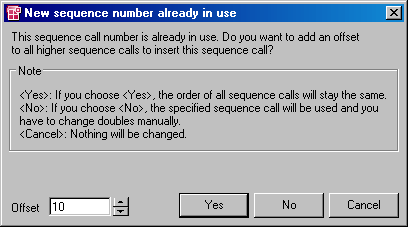

# Using Numbers Already Assigned

If you want to assign an existing combination of process/method or statement block and number to a normal or block-local sequence call, or an existing number to a connector (in the Sequence Editor or when incrementing/decrementing), the [following warning](javascript:kadovTextPopup(this))<!-- kadovTextPopupInit('a1'); //--> is displayed.

It is possible to shift the existing number as well as all higher numbers by an offset which can be defined. The order of the shifted sequence calls is retained.

1. To assign the existing combination anyway, click No.
1. To shift the existing number and all higher numbers, do the following:
1. To set another value, do the following:

1. Click Cancel to return to the Sequence Editor.
1. In the Sequence Editor, set a combination which has not yet been assigned.

See also

[Sequence Calls](markdown/BDE_SequenceCalls.md)

[Block-Local Sequence Calls](markdown/BDE_BlockLocal_SequenceCalls.md)

[Sequencing Node](ComponentManagerEnglishUS.chm::/CM_SequencingNode.htm)

[Editing a Sequence Call in the Sequence Editor](markdown/EditSequence.md)

/* Heikki Komulainen, Comet Computer GmbH 2004 */ cc_plus_pic = '&nbsp;'; cc_minus_pic = '&nbsp;'; cc_stat_pic = '&nbsp;'; gpstyle = ''; var iframes_created = 0; if (document.body && document.body.insertAdjacentHTML && document.getElementsByTagName && document.getElementById) { collect_popups(); set_poplinks_pictures(); if (iframes_created) { document.write(gpstyle); document.write('
<nobr><a id="einauslink" style="position:absolute;top:expression(document.body.scrollTop + this.offsetHeight - this.offsetHeight);left:expression(document.body.offsetWidth - (this.offsetWidth + 28));background:white;padding:5px" href="javascript:show_all_poptext()">Show all hidden text</a></nobr>
'); } } function collect_popups() { bsscpopups = new Array(); for (x = 0; x < document.links.length; x++) { if (document.links[x].href.indexOf("BSSCPopup")>-1) { seekmatch = /BSSCPopup.'[^'](markdown/+)'/; poplink = seekmatch.exec(document.links[x].href); poplink = "" + poplink; poplink = poplink.substring(poplink.indexOf("'")+1, poplink.lastIndexOf("'")); ifid = "CCGENIFRAMEID" + x; new_iframe = '<iframe id="' + ifid + '"src="' + poplink + '" onload="get_text(\'' + ifid + '\')" width="0" height="0" frameborder=0></iframe>'; document.links[x].parentNode.insertAdjacentHTML("afterEnd", new_iframe); gpid = "CCID_" + ifid; document.links[x].href = "javascript:expand_poptext('" + gpid + "')"; cc_plus = '' + cc_plus_pic + ''; document.links[x].insertAdjacentHTML("afterBegin", cc_plus); iframes_created = 1; } } }// end function function get_text(ifr_id) { frpars = document.frames[ifr_id].document.getElementsByTagName("body"); popbody = frpars[0].innerHTML; gpid = "CCID_" + ifr_id; if (!document.getElementById(gpid)) { //avoiding doubles document.getElementById(ifr_id).insertAdjacentHTML("afterEnd", '
'+popbody+'
'); } }//end function function expand_poptext(x_frame_id) { if (!document.getElementById(x_frame_id)) return; if (document.getElementById(x_frame_id).className == "CCGENPOPTEXTH") { document.getElementById(x_frame_id).className = "CCGENPOPTEXTV"; document.getElementById(x_frame_id).style.visibility = "visible"; if (document.getElementById("CCPMB_" + x_frame_id )) { document.getElementById("CCPMB_" + x_frame_id ).innerHTML = cc_minus_pic; } } else { document.getElementById(x_frame_id).className = "CCGENPOPTEXTH"; document.getElementById(x_frame_id).style.visibility = "hidden"; if (document.getElementById("CCPMB_" + x_frame_id )) { document.getElementById("CCPMB_" + x_frame_id ).innerHTML = cc_plus_pic; } } }// end function function show_all_poptext() { var pulldowntxt = document.getElementsByTagName("div"); for (b = 0; b < pulldowntxt.length; b++) { if (pulldowntxt[b].className == "droptext") { pulldowntxt[b].style.display=""; } } var gptxt = document.getElementsByTagName("div"); for (z = 0; z < gptxt.length; z++) { if (gptxt[z].className == "CCGENPOPTEXTH") { gptxt[z].className = "CCGENPOPTEXTV"; gptxt[z].style.visibility = "visible"; if (document.getElementById("CCPMB_" + gptxt[z].id )) { document.getElementById("CCPMB_" + gptxt[z].id ).innerHTML = cc_minus_pic; } } } var dxpoplinks = document.getElementsByTagName("a"); if (dxpoplinks) { for (pxl = 0; pxl < dxpoplinks.length; pxl++) { if (dxpoplinks[pxl].href.indexOf("kadovTextPopup")>-1) { if (document.getElementById("CCPMB_" + dxpoplinks[pxl].id)) { document.getElementById("CCPMB_" + dxpoplinks[pxl].id).innerHTML = cc_stat_pic; dxpoplinks[pxl].symbol = "minus"; } } } } document.getElementById('einauslink').innerText = 'Hide all hideable text'; document.getElementById('einauslink').href = "javascript:self.location.reload()"; self.focus(); }// end function function eat_click() { return false; }// end function function set_poplinks_pictures() { var dpoplinks = document.getElementsByTagName("a"); if (dpoplinks) { for (pl = 0; pl < dpoplinks.length; pl++) { if (dpoplinks[pl].href.indexOf("kadovTextPopup")>-1) { cc_plus = '' + cc_stat_pic + ''; //dpoplinks[pl].onmouseup = plusminuspoplink; dpoplinks[pl].insertAdjacentHTML("afterBegin", cc_plus); dpoplinks[pl].symbol = "plus"; } } } }// end function function plusminuspoplink() { if (document.getElementById("CCPMB_" + this.id)) { if (this.symbol == "plus") { document.getElementById("CCPMB_" + this.id).innerHTML = cc_minus_pic; this.symbol = "minus"; } else { document.getElementById("CCPMB_" + this.id).innerHTML = cc_plus_pic; this.symbol = "plus"; } } return true; }

---

## Automatically Assigning Individual Sequence Calls

_Source: `markdown/Assignindividual.md`_

# Automatically Assigning Individual Sequence Calls

You can edit individual normal or block-local sequence calls, empty or assigned, simply and quickly as follows.

1. In the Outline tab, select the method or process to which the sequence call is to be assigned.
1. Do one of the following:

- In the drawing area, double-click the sequence call you want to edit.
- Right-click the sequence call and select Next Number from the context menu.

The selected method/process as well as the next free number are assigned to the sequence call.

The [rules](javascript:BSSCPopup('BDE_SequencingRules.htm');)<!-- kadovFilePopupInit('a1'); //--> described in [Editing a Sequence Call in the Sequence Editor](markdown/EditSequence.md) apply here as well, in using the values for Sequence Step Size and Use gaps set in the ASCET option window.

See also

[Editing a Sequence Call in the Sequence Editor](markdown/EditSequence.md)

[Incrementing/Decrementing Individual Sequence Calls](markdown/Incrementordecrement.md)

[Resetting an Individual Sequence Call](markdown/Resetindividual.md)

[Selecting a Default Method/Process](markdown/BDE_SelectDefaultMethodProcess.md)

[Sequence Calls](markdown/BDE_SequenceCalls.md)

[Block-Local Sequence Calls](markdown/BDE_BlockLocal_SequenceCalls.md)

/* Heikki Komulainen, Comet Computer GmbH 2004 */ cc_plus_pic = '&nbsp;'; cc_minus_pic = '&nbsp;'; cc_stat_pic = '&nbsp;'; gpstyle = ''; var iframes_created = 0; if (document.body && document.body.insertAdjacentHTML && document.getElementsByTagName && document.getElementById) { collect_popups(); set_poplinks_pictures(); if (iframes_created) { document.write(gpstyle); document.write('
<nobr><a id="einauslink" style="position:absolute;top:expression(document.body.scrollTop + this.offsetHeight - this.offsetHeight);left:expression(document.body.offsetWidth - (this.offsetWidth + 28));background:#ffffe0;padding:5px" href="javascript:show_all_poptext()">Show all hidden text</a></nobr>
'); } } function collect_popups() { bsscpopups = new Array(); for (x = 0; x < document.links.length; x++) { if (document.links[x].href.indexOf("BSSCPopup")>-1) { seekmatch = /BSSCPopup.'[^'](markdown/+)'/; poplink = seekmatch.exec(document.links[x].href); poplink = "" + poplink; poplink = poplink.substring(poplink.indexOf("'")+1, poplink.lastIndexOf("'")); ifid = "CCGENIFRAMEID" + x; new_iframe = '<iframe id="' + ifid + '"src="' + poplink + '" onload="get_text(\'' + ifid + '\')" width="0" height="0" frameborder=0></iframe>'; document.links[x].parentNode.insertAdjacentHTML("afterEnd", new_iframe); gpid = "CCID_" + ifid; document.links[x].href = "javascript:expand_poptext('" + gpid + "')"; cc_plus = '' + cc_plus_pic + ''; document.links[x].insertAdjacentHTML("afterBegin", cc_plus); iframes_created = 1; } } }// end function function get_text(ifr_id) { frpars = document.frames[ifr_id].document.getElementsByTagName("body"); popbody = frpars[0].innerHTML; gpid = "CCID_" + ifr_id; if (!document.getElementById(gpid)) { //avoiding doubles document.getElementById(ifr_id).insertAdjacentHTML("afterEnd", '
'+popbody+'
'); } }//end function function expand_poptext(x_frame_id) { if (!document.getElementById(x_frame_id)) return; if (document.getElementById(x_frame_id).className == "CCGENPOPTEXTH") { document.getElementById(x_frame_id).className = "CCGENPOPTEXTV"; document.getElementById(x_frame_id).style.visibility = "visible"; if (document.getElementById("CCPMB_" + x_frame_id )) { document.getElementById("CCPMB_" + x_frame_id ).innerHTML = cc_minus_pic; } } else { document.getElementById(x_frame_id).className = "CCGENPOPTEXTH"; document.getElementById(x_frame_id).style.visibility = "hidden"; if (document.getElementById("CCPMB_" + x_frame_id )) { document.getElementById("CCPMB_" + x_frame_id ).innerHTML = cc_plus_pic; } } }// end function function show_all_poptext() { var pulldowntxt = document.getElementsByTagName("div"); for (b = 0; b < pulldowntxt.length; b++) { if (pulldowntxt[b].className == "droptext") { pulldowntxt[b].style.display=""; } } var gptxt = document.getElementsByTagName("div"); for (z = 0; z < gptxt.length; z++) { if (gptxt[z].className == "CCGENPOPTEXTH") { gptxt[z].className = "CCGENPOPTEXTV"; gptxt[z].style.visibility = "visible"; if (document.getElementById("CCPMB_" + gptxt[z].id )) { document.getElementById("CCPMB_" + gptxt[z].id ).innerHTML = cc_minus_pic; } } } var dxpoplinks = document.getElementsByTagName("a"); if (dxpoplinks) { for (pxl = 0; pxl < dxpoplinks.length; pxl++) { if (dxpoplinks[pxl].href.indexOf("kadovTextPopup")>-1) { if (document.getElementById("CCPMB_" + dxpoplinks[pxl].id)) { document.getElementById("CCPMB_" + dxpoplinks[pxl].id).innerHTML = cc_stat_pic; dxpoplinks[pxl].symbol = "minus"; } } } } document.getElementById('einauslink').innerText = 'Hide all hideable text'; document.getElementById('einauslink').href = "javascript:self.location.reload()"; self.focus(); }// end function function eat_click() { return false; }// end function function set_poplinks_pictures() { var dpoplinks = document.getElementsByTagName("a"); if (dpoplinks) { for (pl = 0; pl < dpoplinks.length; pl++) { if (dpoplinks[pl].href.indexOf("kadovTextPopup")>-1) { cc_plus = '' + cc_stat_pic + ''; //dpoplinks[pl].onmouseup = plusminuspoplink; dpoplinks[pl].insertAdjacentHTML("afterBegin", cc_plus); dpoplinks[pl].symbol = "plus"; } } } }// end function function plusminuspoplink() { if (document.getElementById("CCPMB_" + this.id)) { if (this.symbol == "plus") { document.getElementById("CCPMB_" + this.id).innerHTML = cc_minus_pic; this.symbol = "minus"; } else { document.getElementById("CCPMB_" + this.id).innerHTML = cc_plus_pic; this.symbol = "plus"; } } return true; }

---

## Incrementing/Decrementing Individual Sequence Calls

_Source: `markdown/Incrementordecrement.md`_

# Incrementing/Decrementing Individual Sequence Calls

To increment/decrement an individual sequence call (normal or block-local) or connector, proceed as follows:

1. Right-click the sequence call or connector whose number you want to edit.
1. In the context menu, point to Change and select Increment to increase the sequence number of the call by 1.
1. In the context menu, point to Change and select Decrement to decrease the sequence number of the call by 1.

See also

[Editing a Sequence Call in the Sequence Editor](markdown/EditSequence.md)

[Automatically Assigning Individual Sequence Calls](markdown/Assignindividual.md)

[Res[etting an Individual Sequence Call](markdown/BDE_SequenceCalls.md)](Resetindividual.md)

[Sequence Calls](markdown/BDE_SequenceCalls.md)

[Block-Local Sequence Calls](markdown/BDE_BlockLocal_SequenceCalls.md)

---

## Resetting an Individual Sequence Call

_Source: `markdown/Resetindividual.md`_

# Resetting an Individual Sequence Call

To reset an individual sequence call, block-local sequence call or connector, proceed as follows:

1. Right-click a sequence call.
1. In the context menu, point to Change and select Reset.

The current values of the sequence call are reset, the connecting line is again shown colored.

At the same time, the number last assigned saved internally is deleted so that automatic assignments start again at the lowest possible value.

See also

[Resetting Several Sequence Calls](markdown/ResetSequence.md)

[Sequence Calls](markdown/BDE_SequenceCalls.md)

[Block-Local Sequence Calls](markdown/BDE_BlockLocal_SequenceCalls.md)

---

## Changing the Visibility of Individual Sequence Calls

_Source: `markdown/Changevisibility.md`_

# Changing the Visibility of Individual Sequence Calls

To change the visibility of individual sequence calls, block-local sequence calls or connectors, proceed as follows.

##### Hiding a sequence call:

1. Do one of the following:

The sequence call/connector is hidden.

##### Showing a sequence call:

1. Do one of the following:

The sequence call/connector is displayed.

##### Highlighting a port:

1. Right-click a sequence call.
1. In the context menu, select Select Complete Port to mark the port to which the sequence call/connector is linked.

The input port of the relevant diagram element is shown in blue. This feature is useful in order to follow sequence calls in complex diagrams.

See also

[Sequence Calls](markdown/BDE_SequenceCalls.md)

[Block-Local Sequence Calls](markdown/BDE_BlockLocal_SequenceCalls.md)

---

## Automatically Assigning Sequence Calls

_Source: `markdown/AssignSequence.md`_

# Automatically Assigning Sequence Calls

To assign sequence calls or block-local sequence calls automatically, proceed as follows:

1. To assign normal sequence calls, do the following:
1. To assign block-local sequence calls, do the following:
1. In the Tools menu, point to Sequence Calls, then point to Sequencing and select Ignore Current.

The selected diagram part is analyzed, and the sequence calls are assigned in accordance with the integrated sequencing algorithm.

The sequencing algorithm is subject to several restrictions, see [Editing Several Sequence Calls - Restrictions](markdown/Editingsequence.md). It is therefore necessary that you proofread the automatic sequence call assignments, and correct them where necessary.

See also

[Editing Several Sequence Calls](markdown/Editingsequence.md)

[Automatically Assigning Sequence Calls from a Specific Number](markdown/BDE_AutomaticallyAssign.md)

[Adding Sequence Calls to an Existing Sequence](markdown/AddSequence.md)

[Scaling Sequence Calls](markdown/ScaleSequence.md)

[Resetting Several Sequence Calls](markdown/ResetSequence.md)

[Editing a Sequence Call in the Sequence Editor](markdown/EditSequence.md)

[Sequence Calls](markdown/BDE_SequenceCalls.md)

[Block-Local Sequence Calls](markdown/BDE_BlockLocal_SequenceCalls.md)

---

## Automatically Assigning Sequence Calls from a Specific Number

_Source: `markdown/BDE_AutomaticallyAssign.md`_

# Automatically Assigning Sequence Calls from a Specific Number

To automatically assign sequence calls or block-local sequence calls from a specific number, proceed as follows:

1. To assign normal sequence calls, do the following:
1. To assign block-local sequence calls, do the following:
1. In the Tools menu, point to Sequence Calls, then point to Sequencing and select Starting With.
1. In the input box, enter a number and click OK.

The selected diagram part is analyzed, and the sequence calls are assigned in accordance with the integrated sequencing algorithm. The specified sequence number is assigned as lowest sequence number.

The sequencing algorithm is subject to several restrictions, see [Editing Several Sequence Calls - Restrictions](markdown/Editingsequence.md#Sequencing_restrictions). It is therefore necessary that you proofread the automatic sequence call assignments, and correct them where necessary.

See also

[Editing Several Sequence Calls](markdown/Editingsequence.md)

[Automatically Assigning Sequence Calls](markdown/AssignSequence.md)

[Adding Sequence Calls to an Existing Sequence](markdown/AddSequence.md)

[Scaling Sequence Calls](markdown/ScaleSequence.md)

[Resetting Several Sequence Calls](markdown/ResetSequence.md)

[Editing a Sequence Call in the Sequence Editor](markdown/EditSequence.md)

[Sequence Calls](markdown/BDE_SequenceCalls.md)

[Block-Local Sequence Calls](markdown/BDE_BlockLocal_SequenceCalls.md)

---

## Adding Sequence Calls to an Existing Sequence

_Source: `markdown/AddSequence.md`_

# Adding Sequence Calls to an Existing Sequence

It is possible to add normal or block-local sequence calls to a sequence which was defined earlier, i.e. to a number of sequence calls which have already been assigned to a process/method or statement block. In this case, the first of the newly assigned sequence calls receives a number which is one higher than the last one in the sequence defined earlier.

1. To assign normal sequence calls, do the following:
1. To assign block-local sequence calls, do the following:
1. In the Tools menu, point to Sequence Calls, then point to Sequencing and select Appending.

The selected diagram part is analyzed, and the sequence calls are appended to the defined sequence for the selected process/method, in accordance with the integrated sequencing algorithm.

The sequencing algorithm is subject to several restrictions, see [Editing Several Sequence Calls - Restrictions](markdown/Editingsequence.md#Sequencing_restrictions). It is therefore necessary that you proofread the automatic sequence call assignments, and correct them where necessary.

See also

[Editing Several Sequence Calls](markdown/Editingsequence.md)

[Automatically Assigning Sequence Calls](markdown/AssignSequence.md)

[Automatically Assigning Sequence Calls from a Specific Number](markdown/BDE_AutomaticallyAssign.md)

[Scaling Sequence Calls](markdown/ScaleSequence.md)

[Resetting Several Sequence Calls](markdown/ResetSequence.md)

[Editing a Sequence Call in the Sequence Editor](markdown/EditSequence.md)

[Sequence Calls](markdown/BDE_SequenceCalls.md)

[Block-Local Sequence Calls](markdown/BDE_BlockLocal_SequenceCalls.md)

---

## Scaling Sequence Calls

_Source: `markdown/ScaleSequence.md`_

# Scaling Sequence Calls

It is possible to scale all sequence calls of a process/method or the entire diagram.

1. In the Tools menu, point to Sequence Calls, then point to Scale to Step Size and select For Diagram.
1. In the Outline tab, select the process/method whose sequence calls you want to scale.
1. In the Tools menu, point to Sequence Calls, then point to Scale to Step Size and select For Method.

The sequence calls of the selected method/process are scaled in accordance with the value entered under Sequence Step Size in the Sequencing node of the ASCET option window.

See also

[Sequencing Options](ComponentManagerEnglishUS.chm::/CM_SequencingNode.htm)

[Working on Sequence Calls - Editing Several Sequence Calls](markdown/BDE_WorkingOnSequenceCalls.md#EditingSeveral)

---

## Shifting Several Sequence Calls

_Source: `markdown/ShiftSequence.md`_

# Shifting Several Sequence Calls

This instruction does not apply to block-local sequence calls.

Proceed as follows if you want to shift the sequence numbers of a group of sequence calls:

1. Right-click the sequence call with the lowest number.
1. In the context menu, point to Change and select Shift by offset.

The sequence numbers of the call and all calls with a higher number which are linked to the same method/process are offset upwards with the value set in the Sequence Shift Offset option in the [Sequencing node](ComponentManagerEnglishUS.chm::/CM_SequencingNode.htm) of the ASCET option window.

See also

[Sequencing Options](ComponentManagerEnglishUS.chm::/CM_SequencingNode.htm)

[Working on Sequence Calls - Editing Several Sequence Calls](markdown/BDE_WorkingOnSequenceCalls.md#EditingSeveral)

---

## Resetting Several Sequence Calls

_Source: `markdown/ResetSequence.md`_

# Resetting Several Sequence Calls

To reset several sequence calls, block-local sequence calls or connectors, proceed as follows:

##### Resetting all sequence calls and connectors of a diagram

1. In the Tools menu, point to Sequence Calls, then point to Reset and select For Diagram.
1. Confirm the safety inquiry with OK.

All sequence calls,block-local sequence calls and connectors of the current diagram are reset.

##### Resetting all sequence calls of a selected method or process

This resets only normal sequence calls. Connectors and block-local sequence calls are not reset.

1. In the Outline tab, select the method or process whose sequence calls you want to reset.
1. In the Tools menu, point to Sequence Calls, then point to Reset and select For Method/Process.
1. Confirm the safety inquiry with OK.

All sequence calls assigned to the selected method/process are reset.

##### Resetting selected sequence calls and connectors

1. In the drawing area, select the diagram elements whose sequence calls you want to reset.
1. In the Tools menu, point to Sequence Calls, then point to Reset and select For Selection.
1. Confirm the safety inquiry with OK.

All sequence calls, block-local sequence calls or connectors assigned to the selected elements are reset.

The relevant sequence numbers are set to 0 and the sequence names are deleted. The connecting lines are again shown colored.

See also

[Working on Sequence Calls - Editing Individual Sequence Calls](markdown/BDE_WorkingOnSequenceCalls.md#EditingIndividual)

[Working on Sequence Calls - Editing Several Sequence Calls](markdown/BDE_WorkingOnSequenceCalls.md#EditingSeveral)

[Sequence Calls](markdown/BDE_SequenceCalls.md)

[Block-Local Sequence Calls](markdown/BDE_BlockLocal_SequenceCalls.md)

---

## Creating a Sequence of Protected Sequence Calls

_Source: `markdown/Createsequence.md`_

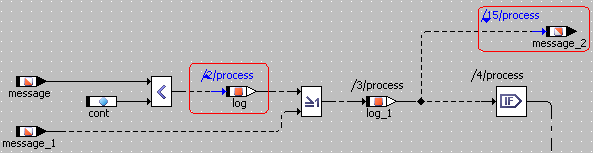

# Creating a Sequence of Protected Sequence Calls

A sequence of protected sequence calls or block-local sequence calls cannot be interrupted in a real-time environment. To create such a sequence, proceed as follows:

1. In the context menu of a sequence call, select Atomic and then Start to start a sequence of protected sequence calls.
1. In the context menu of a sequence call, select Atomic and then Stop to end a sequence of protected sequence calls.

Start and stop of a protected sequence are displayed in blue, and marked with a small upward or downward triangle (see the [example](javascript:kadovTextPopup(this))<!-- kadovTextPopupInit('a1'); //-->). All sequence calls or block-local sequence calls with numbers between start and stop numbers are part of the sequence.

See also

[Working on Sequence Calls](markdown/BDE_WorkingOnSequenceCalls.md)

[Sequence Calls](markdown/BDE_SequenceCalls.md)

[Block-Local Sequence Calls](markdown/BDE_BlockLocal_SequenceCalls.md)

/* Heikki Komulainen, Comet Computer GmbH 2004 */ cc_plus_pic = '&nbsp;'; cc_minus_pic = '&nbsp;'; cc_stat_pic = '&nbsp;'; gpstyle = ''; var iframes_created = 0; if (document.body && document.body.insertAdjacentHTML && document.getElementsByTagName && document.getElementById) { collect_popups(); set_poplinks_pictures(); if (iframes_created) { document.write(gpstyle); document.write('
<nobr><a id="einauslink" style="position:absolute;top:expression(document.body.scrollTop + this.offsetHeight - this.offsetHeight);left:expression(document.body.offsetWidth - (this.offsetWidth + 28));background:white;padding:5px" href="javascript:show_all_poptext()">Show all hidden text</a></nobr>
'); } } function collect_popups() { bsscpopups = new Array(); for (x = 0; x < document.links.length; x++) { if (document.links[x].href.indexOf("BSSCPopup")>-1) { seekmatch = /BSSCPopup.'[^'](markdown/+)'/; poplink = seekmatch.exec(document.links[x].href); poplink = "" + poplink; poplink = poplink.substring(poplink.indexOf("'")+1, poplink.lastIndexOf("'")); ifid = "CCGENIFRAMEID" + x; new_iframe = '<iframe id="' + ifid + '"src="' + poplink + '" onload="get_text(\'' + ifid + '\')" width="0" height="0" frameborder=0></iframe>'; document.links[x].parentNode.insertAdjacentHTML("afterEnd", new_iframe); gpid = "CCID_" + ifid; document.links[x].href = "javascript:expand_poptext('" + gpid + "')"; cc_plus = '' + cc_plus_pic + ''; document.links[x].insertAdjacentHTML("afterBegin", cc_plus); iframes_created = 1; } } }// end function function get_text(ifr_id) { frpars = document.frames[ifr_id].document.getElementsByTagName("body"); popbody = frpars[0].innerHTML; gpid = "CCID_" + ifr_id; if (!document.getElementById(gpid)) { //avoiding doubles document.getElementById(ifr_id).insertAdjacentHTML("afterEnd", '
'+popbody+'
'); } }//end function function expand_poptext(x_frame_id) { if (!document.getElementById(x_frame_id)) return; if (document.getElementById(x_frame_id).className == "CCGENPOPTEXTH") { document.getElementById(x_frame_id).className = "CCGENPOPTEXTV"; document.getElementById(x_frame_id).style.visibility = "visible"; if (document.getElementById("CCPMB_" + x_frame_id )) { document.getElementById("CCPMB_" + x_frame_id ).innerHTML = cc_minus_pic; } } else { document.getElementById(x_frame_id).className = "CCGENPOPTEXTH"; document.getElementById(x_frame_id).style.visibility = "hidden"; if (document.getElementById("CCPMB_" + x_frame_id )) { document.getElementById("CCPMB_" + x_frame_id ).innerHTML = cc_plus_pic; } } }// end function function show_all_poptext() { var pulldowntxt = document.getElementsByTagName("div"); for (b = 0; b < pulldowntxt.length; b++) { if (pulldowntxt[b].className == "droptext") { pulldowntxt[b].style.display=""; } } var gptxt = document.getElementsByTagName("div"); for (z = 0; z < gptxt.length; z++) { if (gptxt[z].className == "CCGENPOPTEXTH") { gptxt[z].className = "CCGENPOPTEXTV"; gptxt[z].style.visibility = "visible"; if (document.getElementById("CCPMB_" + gptxt[z].id )) { document.getElementById("CCPMB_" + gptxt[z].id ).innerHTML = cc_minus_pic; } } } var dxpoplinks = document.getElementsByTagName("a"); if (dxpoplinks) { for (pxl = 0; pxl < dxpoplinks.length; pxl++) { if (dxpoplinks[pxl].href.indexOf("kadovTextPopup")>-1) { if (document.getElementById("CCPMB_" + dxpoplinks[pxl].id)) { document.getElementById("CCPMB_" + dxpoplinks[pxl].id).innerHTML = cc_stat_pic; dxpoplinks[pxl].symbol = "minus"; } } } } document.getElementById('einauslink').innerText = 'Hide all hideable text'; document.getElementById('einauslink').href = "javascript:self.location.reload()"; self.focus(); }// end function function eat_click() { return false; }// end function function set_poplinks_pictures() { var dpoplinks = document.getElementsByTagName("a"); if (dpoplinks) { for (pl = 0; pl < dpoplinks.length; pl++) { if (dpoplinks[pl].href.indexOf("kadovTextPopup")>-1) { cc_plus = '' + cc_stat_pic + ''; //dpoplinks[pl].onmouseup = plusminuspoplink; dpoplinks[pl].insertAdjacentHTML("afterBegin", cc_plus); dpoplinks[pl].symbol = "plus"; } } } }// end function function plusminuspoplink() { if (document.getElementById("CCPMB_" + this.id)) { if (this.symbol == "plus") { document.getElementById("CCPMB_" + this.id).innerHTML = cc_minus_pic; this.symbol = "minus"; } else { document.getElementById("CCPMB_" + this.id).innerHTML = cc_plus_pic; this.symbol = "plus"; } } return true; }

---

## Moving Between Sequence Calls

_Source: `markdown/Movesequence.md`_

# Moving Between Sequence Calls

To move between sequence calls, proceed as follows:

1. Select a sequence call in the drawing area.
1. In the View menu, select Sequence Calls and then Next to select the next call in the sequence.
1. In the View menu, select Sequence Calls and then Previous to select the previous call in the sequence.

---

## Changing the Visibility of Several Sequence Calls

_Source: `markdown/ChangeSequence.md`_

# Changing the Visibility of Several Sequence Calls

To change the visibility of several sequence calls, block-local sequence calls or connectors, proceed as follows.

##### Hiding all sequence calls in a diagram:

1. In the View menu, point to Sequence Calls and then to Hide and select For Diagram.

All sequence calls, block-local sequence calls and connectors in the current diagram are hidden.

##### Hiding all sequence calls of a method/process:

1. In the Outline tab, select the method/process whose sequence calls you want to hide.
1. In the View menu, point to Sequence Calls and then to Hide and select For Method/Process.

All sequence calls assigned to the selected method/process are hidden.

##### Hiding the sequence calls of selected elements:

1. In the drawing area, select the diagram elements whose sequence calls you want to hide.
1. In the View menu, point to Sequence Calls and then to Hide and select For Selection.

The sequence calls, block-local sequence calls or connectors of the selected elements are hidden.

##### Hiding unused sequence calls:

1. In the View menu, point to Sequence Calls and then to Hide and select Unused.

All unused sequence calls, block-local sequence calls and connectors are hidden.

In all four cases, blue color of highlighted ports (see [Changing the Visibility of Individual Sequence Calls](markdown/Changevisibility.md)) and [protected sequences](markdown/Createsequence.md) remains visible.

The Show command reverts the effect of the Hide command with the same four options being available.

See also

[Changing the Visibility of Individual Sequence Calls](markdown/Changevisibility.md)

[Creating a Sequence of Protected Sequence Calls](markdown/Createsequence.md)

[Working on Sequence Calls](markdown/BDE_WorkingOnSequenceCalls.md)

[Sequence Calls](markdown/BDE_SequenceCalls.md)

[Block-Local Sequence Calls](markdown/BDE_BlockLocal_SequenceCalls.md)

---

## Creating and Removing Connectors

_Source: `markdown/CreateConnectors.md`_

# Creating and Removing Connectors

This instruction does not apply to connectors and block-local sequence calls in statement blocks.

To create a connector from a normal sequence call, proceed as follows:

1. Right-click the sequence call you want to change into a connector.
1. Select Connector from the context menu.
1. Connect the connector to a suitable control-flow element.
1. If necessary, edit the sequence number.

Connectors can be edited like sequence calls in the Sequence Editor (see [Editing a Sequence Call in the Sequence Editor](markdown/EditSequence.md)). The Next free button and the Method/Process Name field are, however, deactivated. Double-clicking the connector and the context menu Next Number also open the Sequence Editor.

To remove a connector, proceed as follows.

1. Right-click the connector and select Connector from the context menu.
1. Edit the sequence call.

See also

[Editing a Sequence Call in the Sequence Editor](markdown/EditSequence.md)

[Sequence Editor](markdown/Editingindividual.md)

---

## Toggling Between Connector and Block-Local Sequence Call

_Source: `markdown/BDE_Convert_Connector_SequenceCall.md`_

# Toggling Between Connector and Block-Local Sequence Call

This instruction applies only to connectors and block-local sequence calls in statement blocks.

To convert a block-local sequence call into a connector, proceed as follows.

1. Right-click the block-local sequence call you want to convert.
1. Select Connector from the context menu.
1. Connect the connector to a suitable control-flow element.

To convert a connector into a block-local sequence call, proceed as follows.

1. Right-click the connector you want to convert.
1. Select Block-local sequence call from the context menu.

The connector is converted into a block-local sequence call. The number is kept, and the name of the statement block is inserted automatically.

See also

[Statement Blocks](markdown/BDE_StatementBlocks.md)

[Block-Local Sequence Calls](markdown/BDE_BlockLocal_SequenceCalls.md)

---

## Using Graphical Hierarchies and Statement Blocks

_Source: `markdown/BDE_UseHierarchiesStatementBlocks.md`_

# Using Graphical Hierarchies and Statement Blocks

Using graphical hierarchies contains the following steps:

- adding a [hierarchy](markdown/BDE_AddHierarchy.md) or a [statement block](markdown/BDE_AddStatementBlock.md)
- [adding input and output pins](markdown/Addinputhiera.md)
- converting diagram elements into a [hierarchy](markdown/Converthierarchy.md) or [statement block](markdown/BDE_Convert_DiagramElements_StatementBlock.md)
- [moving elements into/out of a hierarchy/statement block](markdown/Moveelements.md)
- [changing the appearance of a hierarchy/statement block](markdown/appearancehierarchy.md)
- [changing the appearance of input and output pins](markdown/Changeinputpins.md)
- [navigating between hierarchy/statement block levels](markdown/Navigatehierarchy.md)
- [resolving a hierarchy/statement block](markdown/Resolvinghierarchy.md)

See also

[Graphical Hierarchies](markdown/GraphicalHierarchies.md)

[Statement Blocks](markdown/BDE_StatementBlocks.md)

---

## Adding a Hierarchy

_Source: `markdown/BDE_AddHierarchy.md`_

# Adding a Hierarchy

To add a new Hierarchy, proceed as follows:

1. In the Basic Blocks palette or toolbar, click on the  Hierarchy button to load the mouse cursor with a hierarchy.
1. Click inside the drawing area where you want to position the hierarchy.

The hierarchy block is added to the diagram.

- See also
- [Graphical Hierarchies](markdown/GraphicalHierarchies.md)
- [Using Graphical Hierarchies and Statement Blocks](markdown/BDE_UseHierarchiesStatementBlocks.md)
- (item)

---

## Adding a Statement Block

_Source: `markdown/BDE_AddStatementBlock.md`_

# Adding a Statement Block

To add a new statement block, proceed as follows:

1. In the Basic Blocks palette or toolbar, click on the  Statement Block button.
1. Click inside the drawing area where you want to position the statement block.

The statement block is added to the diagram.

- See also

[Statement Blocks](markdown/BDE_StatementBlocks.md)

[Using Graphical Hierarchies and Statement Blocks](markdown/BDE_UseHierarchiesStatementBlocks.md)

---

## Adding Input and Output Pins to the Hierarchy/Statement Block

_Source: `markdown/Addinputhiera.md`_

# Adding Input and Output Pins to the Hierarchy/Statement Block

Data flow between the various hierarchy/statement block levels works via input and output pins. These are simply connection lines that extend across the levels.

To add input and output pins to the hierarchy/statement block, proceed as follows:

1. Right-click on the hierarchy/statement block.
1. Select Add Inpin or Add Outpin from the context menu.

You can add any number of input and output pins to the hierarchy/statement block. The input and output pins are represented by arrow symbols containing the pin name inside the block.

- See also
- [Graphical Hierarchies](markdown/GraphicalHierarchies.md)
- [Statement Blocks](markdown/BDE_StatementBlocks.md)
- [Using Graphical Hierarchies and Statement Blocks](markdown/BDE_UseHierarchiesStatementBlocks.md)
- (item)

---

## Converting Diagram Elements into a Hierarchy Block

_Source: `markdown/Converthierarchy.md`_

# Converting Diagram Elements into a Hierarchy Block

To convert diagram elements into a hierarchy block, proceed as follows:

1. Select the diagram elements you want to put in a hierarchy block.
1. In the Basic Blocks palette or toolbar, click on the  Hierarchy button.

A hierarchy block that contains the selected elements is added to the diagram.

The selected diagram elements are placed inside a newly created hierarchy block. A pin with a default name is created for each line that connects a diagram element outside the hierarchy block with a diagram element inside. It is not possible to move diagram elements into a hierarchy block directly, e.g. by drag-and-drop. They always have to be [copied via the clipboard](markdown/Moveelements.md) or moved as described here.

- See also
- [Graphical Hierarchies](markdown/GraphicalHierarchies.md)
- [Using Graphical Hierarchies and Statement Blocks](markdown/BDE_UseHierarchiesStatementBlocks.md)
- (item)

---

## Converting Diagram Elements into a Statement Block

_Source: `markdown/BDE_Convert_DiagramElements_StatementBlock.md`_

# Converting Diagram Elements into a Statement Block

To convert diagram elements into a statement block, proceed as follows:

1. Select the diagram elements you want to put in a statement block.
1. In the Basic Blocks palette or toolbar, click on the  Statement Block button.

A statement block that contains the selected elements is added to the diagram.

The selected diagram elements are placed inside a newly created statement block. Existing sequence calls are converted to [block-local sequence calls](markdown/BDE_BlockLocal_SequenceCalls.md). A pin with a default name is created for each line that connects a diagram element outside the statement block with a diagram element inside.

It is not possible to move diagram elements into a statement block directly, e.g. by drag-and-drop. They always have to be copied via the clipboard or moved as described here.

- See also

[Statement Blocks](markdown/BDE_StatementBlocks.md)

[Block-Local Sequence Calls](markdown/BDE_BlockLocal_SequenceCalls.md)

[Using Graphical Hierarchies and Statement Blocks](markdown/BDE_UseHierarchiesStatementBlocks.md)

---

## Moving Elements Into/Out of a Hierarchy or Statement Block

_Source: `markdown/Moveelements.md`_

# Moving Elements Into/Out of a Hierarchy or Statement Block

To move existing elements into or out of a hierarchy or statement block, proceed as follows:

1. Use Cut or Copy to move/copy selected diagram elements to the clipboard.
1. Double-click on the hierarchy or statement block that is to contain the elements.
1. Use Paste to insert the diagram elements.
1. Edit the pasted sequence calls.
1. Double-click in the drawing area to return to the higher level.

Copying or moving existing elements from a hierarchy or statement block to a higher diagram level is done accordingly. The following happens to copied/moved sequence calls in that case:

- If you copied the elements from a hierarchy, the sequence calls are reset.
- If you copied the elements from a statement block, the block-local sequence calls are converted into connectors.

See also

[Graphical Hierarchies](markdown/GraphicalHierarchies.md)

[Statement Blocks](markdown/BDE_StatementBlocks.md)

[Using Graphical Hierarchies and Statement Blocks](markdown/BDE_UseHierarchiesStatementBlocks.md)

---

## Changing the Appearance of a Hierarchy or Statement Block

_Source: `markdown/appearancehierarchy.md`_

# Changing the Appearance of a Hierarchy or Statement Block

To change the appearance of a hierarchy or statement block, proceed as follows:

1. Right-click inside the hierarchy/statement block and select Rename Hierarchy or Rename Statement Block from the context menu to rename the block.
1. Type the name into the prompt box and click OK.
1. Right-click inside the block and select Show/Hide Name from the context menu.
1. Select Change Icon from the context menu to assign an icon file to the block.
1. Select the image file you want and click OK.
1. Select Fill Color from the context menu to select a color for the hierarchy/statement block.
1. Select the hierarchy/statement block and drag the sizing handles to resize the block.
1. Select Set To Default Size from the context menu to revert to the default size of the hierarchy/statement block.
1. See also

[Reserved Keywords](IntroductionEnglishUS.chm::/INT_Reserved_Keywords.htm)

[Graphical Hierarchies](markdown/GraphicalHierarchies.md)

[Statement Blocks](markdown/BDE_StatementBlocks.md)

[Using Graphical Hierarchies and Statement Blocks](markdown/BDE_UseHierarchiesStatementBlocks.md)

---

## Changing the Appearance of Input and Output Pins

_Source: `markdown/Changeinputpins.md`_

# Changing the Appearance of Input and Output Pins

To change the appearance of input and output pins, proceed as follows:

1. Right-click on an input or output pin of the hierarchy/statement block element.
1. Do one of the following:
1. Right-click on the block and select Show Pin Names or Hide Pin Names to show or hide all the pin names for the hierarchy/statement block.

When you connect a diagram element to a pin, and then connect the pin to another item inside the hierarchy block, it is equivalent to connecting the two elements directly.

See also

[Reserved Keywords](IntroductionEnglishUS.chm::/INT_Reserved_Keywords.htm)

[Graphical Hierarchies](markdown/GraphicalHierarchies.md)

[Statement Blocks](markdown/BDE_StatementBlocks.md)

[Using Graphical Hierarchies and Statement Blocks](markdown/BDE_UseHierarchiesStatementBlocks.md)

---

## Navigating Between Hierarchy/Statement Block Levels

_Source: `markdown/Navigatehierarchy.md`_

# Navigating Between Hierarchy/Statement Block Levels

The technique for navigating between hierarchy or statement block levels is the same as that for navigating between included components of a diagram.

To navigate between hierarchy/statement block levels, proceed as follows:

1. Do one of the following to enter a lower-level block:
1. Inside the hierarchy/statement block, double-click on the drawing area (not on a diagram item).

You leave the hierarchy/statement block and enter the parent level. The block you have left is selected.

See also

[Graphical Hierarchies](markdown/GraphicalHierarchies.md)

[Statement Blocks](markdown/BDE_StatementBlocks.md)

[Using Graphical Hierarchies and Statement Blocks](markdown/BDE_UseHierarchiesStatementBlocks.md)

---

## Resolving a Hierarchy or Statement Block

_Source: `markdown/Resolvinghierarchy.md`_

# Resolving a Hierarchy or Statement Block

To resolve a hierarchy/statement block and keep its content, proceed as follows:

1. Right-click on the hierarchy block and select Resolve Hierarchy or Resolve Statement Block from the context menu.
1. If necessary, do the following for former block-local sequence calls:
1. If necessary, clean up the block diagram.

To remove a hierarchy/statement block and delete its content, proceed as follows:

1. Select a hierarchy/statement block.
1. In the Edit menu, select Delete.

The block, and all diagram elements it contains, are deleted.

See also

[Graphical Hierarchies](markdown/GraphicalHierarchies.md)

[Statement Blocks](markdown/BDE_StatementBlocks.md)

[Using Graphical Hierarchies and Statement Blocks](markdown/BDE_UseHierarchiesStatementBlocks.md)

[Connectors](markdown/Connectors.md)

---

## Working on Block Diagrams

_Source: `markdown/BDE_Working_on_BlockDiagrams.md`_

# Working on Block Diagrams

Viewing elements:

- [Viewing all Graphical Occurrences of an Element](markdown/ViewElements.md)
- [Viewing All Elements Connected to an Item](markdown/ViewItem.md)
- [Changing the Way a Block Diagram is Displayed](markdown/ViewingandPrinting.md)

Appearance and Views:

- [Changing the Appearance of a Diagram Item](markdown/Changeappearance.md)
- [Editing the Views of a Diagram Item](AutomaticDocumentationEnglishUS.chm::/AD_EditView_of_DiagramItem.htm)

Data Exchange:

- [Exporting the Data Set of a Component](markdown/ExportData.md)
- [Writing the Data from an Array or a Table to a File](markdown/WriteData.md)
- [Reading the Data for an Array or a Table from a File](markdown/ReadData.md)

Printing/Exporting Block Diagrams:

- [Setting up the Printing Area](markdown/BDE_Setting_up_the_Printing_Area.md)
- [Printing a Block Diagram](markdown/Printblock.md)
- [Exporting a Block Diagram](markdown/BDE_Export_BlockDiagram.md)

---

## Viewing all Graphical Occurrences of an Element

_Source: `markdown/ViewElements.md`_

# Viewing all Graphical Occurrences of an Element

To view all graphical occurrences of an element, proceed as follows:

1. Select the element, either in the drawing area or in the Outline tab.
1. Do one of the following:

- In the Extras menu, select Show Occurrences
- In the context menu, select Show Occurrences.

All graphical occurrences of the element in the current diagram are highlighted and the Occurrences for window opens in which all graphical occurrences of the selected element are listed.

See also

[Occurrences for Dialog Window](markdown/BDE_OccurrencesDialogWindow.md)

[Viewing All Elements Connected to an Item](markdown/ViewItem.md)

---

## Viewing All Elements Connected to an Item

_Source: `markdown/ViewItem.md`_

- [Editing Elements](componentmanagerenglishus.chm::/EditDatabaseB.htm)
- [Renaming Elements](ComponentManagerEnglishUS.chm::/Renaming_Elements_Views.htm)
- [Deleting Elements](ComponentManagerEnglishUS.chm::/Deleting_Elements_Views.htm)
- [Editing Data](ComponentManagerEnglishUS.chm::/Editdata.htm)
- [Copying Data](ComponentManagerEnglishUS.chm::/CM_Copying_Data.htm)
- [Editing Implementations](ComponentManagerEnglishUS.chm::/EditImplementation.htm)
- [Copying Implementations](ComponentManagerEnglishUS.chm::/Copying_Implementations.htm)

# Viewing All Elements Connected to an Item

To view all elements connected to an item, proceed as follows:

You do not have to change to the browser view if you want to look at or edit the implementations of the elements connected directly to a graphic object (element, operator, connection). This function is of particular interest for testing the implementations of the inputs and outputs of an operator which is why this is the only case described below.

1. Right-click on a graphic object and select Browse Connected Elements from the context menu.
1. Work in the tabs as described in the [following topics](javascript:kadovTextPopup(this))<!-- kadovTextPopupInit('a1'); //-->.
1. Click the X at the top right of the field to hide the field.
1. In the View menu, point to Show/Hide and select Search Results.
1. You can redisplay the field via the View menu, Show/ Hide submenu, Search Results option, as well as via the context menu, although the content is not adapted to the current selection in the drawing area in the first case.

See also

[Search Results View](markdown/bde_SearchResultsView.md)

[Views in the Component Manager](ComponentManagerEnglishUS.chm::/ViewsinCM.htm)

/* Heikki Komulainen, Comet Computer GmbH 2004 */ cc_plus_pic = '&nbsp;'; cc_minus_pic = '&nbsp;'; cc_stat_pic = '&nbsp;'; gpstyle = ''; var iframes_created = 0; if (document.body && document.body.insertAdjacentHTML && document.getElementsByTagName && document.getElementById) { collect_popups(); set_poplinks_pictures(); if (iframes_created) { document.write(gpstyle); document.write('
<nobr><a id="einauslink" style="position:absolute;top:expression(document.body.scrollTop + this.offsetHeight - this.offsetHeight);left:expression(document.body.offsetWidth - (this.offsetWidth + 28));background:white;padding:5px" href="javascript:show_all_poptext()">Alle texte einblenden</a></nobr>
'); } } function collect_popups() { bsscpopups = new Array(); for (x = 0; x < document.links.length; x++) { if (document.links[x].href.indexOf("BSSCPopup")>-1) { seekmatch = /BSSCPopup.'[^'](markdown/+)'/; poplink = seekmatch.exec(document.links[x].href); poplink = "" + poplink; poplink = poplink.substring(poplink.indexOf("'")+1, poplink.lastIndexOf("'")); ifid = "CCGENIFRAMEID" + x; new_iframe = '<iframe id="' + ifid + '"src="' + poplink + '" onload="get_text(\'' + ifid + '\')" width="0" height="0" frameborder=0></iframe>'; document.links[x].parentNode.insertAdjacentHTML("afterEnd", new_iframe); gpid = "CCID_" + ifid; document.links[x].href = "javascript:expand_poptext('" + gpid + "')"; cc_plus = '' + cc_plus_pic + ''; document.links[x].insertAdjacentHTML("afterBegin", cc_plus); iframes_created = 1; } } }// end function function get_text(ifr_id) { frpars = document.frames[ifr_id].document.getElementsByTagName("body"); popbody = frpars[0].innerHTML; gpid = "CCID_" + ifr_id; if (!document.getElementById(gpid)) { //avoiding doubles document.getElementById(ifr_id).insertAdjacentHTML("afterEnd", '
'+popbody+'
'); } }//end function function expand_poptext(x_frame_id) { if (!document.getElementById(x_frame_id)) return; if (document.getElementById(x_frame_id).className == "CCGENPOPTEXTH") { document.getElementById(x_frame_id).className = "CCGENPOPTEXTV"; document.getElementById(x_frame_id).style.visibility = "visible"; if (document.getElementById("CCPMB_" + x_frame_id )) { document.getElementById("CCPMB_" + x_frame_id ).innerHTML = cc_minus_pic; } } else { document.getElementById(x_frame_id).className = "CCGENPOPTEXTH"; document.getElementById(x_frame_id).style.visibility = "hidden"; if (document.getElementById("CCPMB_" + x_frame_id )) { document.getElementById("CCPMB_" + x_frame_id ).innerHTML = cc_plus_pic; } } }// end function function show_all_poptext() { var pulldowntxt = document.getElementsByTagName("div"); for (b = 0; b < pulldowntxt.length; b++) { if (pulldowntxt[b].className == "droptext") { pulldowntxt[b].style.display=""; } } var gptxt = document.getElementsByTagName("div"); for (z = 0; z < gptxt.length; z++) { if (gptxt[z].className == "CCGENPOPTEXTH") { gptxt[z].className = "CCGENPOPTEXTV"; gptxt[z].style.visibility = "visible"; if (document.getElementById("CCPMB_" + gptxt[z].id )) { document.getElementById("CCPMB_" + gptxt[z].id ).innerHTML = cc_minus_pic; } } } var dxpoplinks = document.getElementsByTagName("a"); if (dxpoplinks) { for (pxl = 0; pxl < dxpoplinks.length; pxl++) { if (dxpoplinks[pxl].href.indexOf("kadovTextPopup")>-1) { if (document.getElementById("CCPMB_" + dxpoplinks[pxl].id)) { document.getElementById("CCPMB_" + dxpoplinks[pxl].id).innerHTML = cc_stat_pic; dxpoplinks[pxl].symbol = "minus"; } } } } document.getElementById('einauslink').innerText = 'Alle texte ausblenden'; document.getElementById('einauslink').href = "javascript:self.location.reload()"; self.focus(); }// end function function eat_click() { return false; }// end function function set_poplinks_pictures() { var dpoplinks = document.getElementsByTagName("a"); if (dpoplinks) { for (pl = 0; pl < dpoplinks.length; pl++) { if (dpoplinks[pl].href.indexOf("kadovTextPopup")>-1) { cc_plus = '' + cc_stat_pic + ''; //dpoplinks[pl].onmouseup = plusminuspoplink; dpoplinks[pl].insertAdjacentHTML("afterBegin", cc_plus); dpoplinks[pl].symbol = "plus"; } } } }// end function function plusminuspoplink() { if (document.getElementById("CCPMB_" + this.id)) { if (this.symbol == "plus") { document.getElementById("CCPMB_" + this.id).innerHTML = cc_minus_pic; this.symbol = "minus"; } else { document.getElementById("CCPMB_" + this.id).innerHTML = cc_plus_pic; this.symbol = "plus"; } } return true; }

---

## Changing the Way a Block Diagram is Displayed

_Source: `markdown/ViewingandPrinting.md`_

# Changing the Way a Block Diagram is Displayed

To change the way a block diagram is displayed, proceed as follows:

1. In the Window menu, select Redraw to redraw the diagram.
1. In the Zoom combo box, select a value to scale the diagram.
1. In the Zoom combo box, select Page Layout to view one Print page.
1. In the Zoom combo box, select 100% to return to the default size.

See also

[Printing a Block Diagram](markdown/Printblock.md)

---

## Changing the Appearance of a Diagram Item

_Source: `markdown/Changeappearance.md`_

1. Drag the name of the element's graphical occurrence to the place where you want it to appear.
1. In the context menu of an element, use the Fill Color menu option to select a color to fill the background of the respective item.
1. In the context menu of an array, matrix or characteristic line/map, use the Get/Set Ports menu option to show or hide the get and set pins of the graphical occurrence.

1. Drag the name of the component's graphical occurrence to the place where you want it to appear.
1. In the context menu of an included component, point to Ports and select Unconnected Ports to show or hide unconnected ports of the graphical occurrence.

This way, ports are only hidden, not removed. Operations like Minimal Size behave as if the ports were visible.

1. In the context menu of an included component, point to Ports and select Get/Set to show or hide the get and set pins of the graphical occurrence.
1. Right-click on a port and select Pin Names <pin name> from the context menu to show/hide the display of the port name.
1. Right-click on a port with a sequence call and select Sequence Call from the context menu to show/hide the display of the sequence call.

If flexible layout is activated (see [Layout of Included Components](markdown/BDE_Layout.md)), the following possibilities are also available.

1. Use the mouse to drag the port you want to move to the required position.
1. In the context menu of an included component, point to Layout and then select Attributes to open the Layout Settings window.
1. In the Layout Settings window, do the following:

1. In the Visibility area of the Layout Settings window, choose the attributes to be displayed within the respective diagram item in the drawing area.
1. In the Size area, set the Horizontal and Vertical size of the item, the Set Minimal Size Button reduces its size to the minimum.
1. In the Fill Color area, select a color to fill the background of the respective item.
1. Click OK to close the Layout Settings window and accept the settings.

1. In the context menu of the included component, point to Layout and click on Set Attributes as Default to make your individual layout of the included its default layout.

The default layout is adapted by every graphical occurrence of the respective item.

# Changing the Appearance of a Diagram Item

To change the appearance of a certain graphical occurrence of a diagram item, proceed as follows:

[Elements](javascript:kadovTextPopup(this))<!-- kadovTextPopupInit('a2'); //--> (i.e. variables, parameters, characteristic line/map)

1. [Included components](javascript:kadovTextPopup(this))<!-- kadovTextPopupInit('a1'); //-->

See also

[Layout of Included Components](markdown/BDE_Layout.md)

[Editing the Views of a Diagram Item](AutomaticDocumentationEnglishUS.chm::/AD_EditView_of_DiagramItem.htm)

[Component Manager - Activating/Deactivating Flexible Layout](ComponentManagerEnglishUS.chm::/Activating_Flexible_Layout.htm)

/* Heikki Komulainen, Comet Computer GmbH 2004 */ cc_plus_pic = '&nbsp;'; cc_minus_pic = '&nbsp;'; cc_stat_pic = '&nbsp;'; gpstyle = ''; var iframes_created = 0; if (document.body && document.body.insertAdjacentHTML && document.getElementsByTagName && document.getElementById) { collect_popups(); set_poplinks_pictures(); if (iframes_created) { document.write(gpstyle); document.write('
<nobr><a id="einauslink" style="position:absolute;top:expression(document.body.scrollTop + this.offsetHeight - this.offsetHeight);left:expression(document.body.offsetWidth - (this.offsetWidth + 28));background:white;padding:5px" href="javascript:show_all_poptext()">Alle texte einblenden</a></nobr>
'); } } function collect_popups() { bsscpopups = new Array(); for (x = 0; x < document.links.length; x++) { if (document.links[x].href.indexOf("BSSCPopup")>-1) { seekmatch = /BSSCPopup.'[^'](markdown/+)'/; poplink = seekmatch.exec(document.links[x].href); poplink = "" + poplink; poplink = poplink.substring(poplink.indexOf("'")+1, poplink.lastIndexOf("'")); ifid = "CCGENIFRAMEID" + x; new_iframe = '<iframe id="' + ifid + '"src="' + poplink + '" onload="get_text(\'' + ifid + '\')" width="0" height="0" frameborder=0></iframe>'; document.links[x].parentNode.insertAdjacentHTML("afterEnd", new_iframe); gpid = "CCID_" + ifid; document.links[x].href = "javascript:expand_poptext('" + gpid + "')"; cc_plus = '' + cc_plus_pic + ''; document.links[x].insertAdjacentHTML("afterBegin", cc_plus); iframes_created = 1; } } }// end function function get_text(ifr_id) { frpars = document.frames[ifr_id].document.getElementsByTagName("body"); popbody = frpars[0].innerHTML; gpid = "CCID_" + ifr_id; if (!document.getElementById(gpid)) { //avoiding doubles document.getElementById(ifr_id).insertAdjacentHTML("afterEnd", '
'+popbody+'
'); } }//end function function expand_poptext(x_frame_id) { if (!document.getElementById(x_frame_id)) return; if (document.getElementById(x_frame_id).className == "CCGENPOPTEXTH") { document.getElementById(x_frame_id).className = "CCGENPOPTEXTV"; document.getElementById(x_frame_id).style.visibility = "visible"; if (document.getElementById("CCPMB_" + x_frame_id )) { document.getElementById("CCPMB_" + x_frame_id ).innerHTML = cc_minus_pic; } } else { document.getElementById(x_frame_id).className = "CCGENPOPTEXTH"; document.getElementById(x_frame_id).style.visibility = "hidden"; if (document.getElementById("CCPMB_" + x_frame_id )) { document.getElementById("CCPMB_" + x_frame_id ).innerHTML = cc_plus_pic; } } }// end function function show_all_poptext() { var pulldowntxt = document.getElementsByTagName("div"); for (b = 0; b < pulldowntxt.length; b++) { if (pulldowntxt[b].className == "droptext") { pulldowntxt[b].style.display=""; } } var gptxt = document.getElementsByTagName("div"); for (z = 0; z < gptxt.length; z++) { if (gptxt[z].className == "CCGENPOPTEXTH") { gptxt[z].className = "CCGENPOPTEXTV"; gptxt[z].style.visibility = "visible"; if (document.getElementById("CCPMB_" + gptxt[z].id )) { document.getElementById("CCPMB_" + gptxt[z].id ).innerHTML = cc_minus_pic; } } } var dxpoplinks = document.getElementsByTagName("a"); if (dxpoplinks) { for (pxl = 0; pxl < dxpoplinks.length; pxl++) { if (dxpoplinks[pxl].href.indexOf("kadovTextPopup")>-1) { if (document.getElementById("CCPMB_" + dxpoplinks[pxl].id)) { document.getElementById("CCPMB_" + dxpoplinks[pxl].id).innerHTML = cc_stat_pic; dxpoplinks[pxl].symbol = "minus"; } } } } document.getElementById('einauslink').innerText = 'Alle texte ausblenden'; document.getElementById('einauslink').href = "javascript:self.location.reload()"; self.focus(); }// end function function eat_click() { return false; }// end function function set_poplinks_pictures() { var dpoplinks = document.getElementsByTagName("a"); if (dpoplinks) { for (pl = 0; pl < dpoplinks.length; pl++) { if (dpoplinks[pl].href.indexOf("kadovTextPopup")>-1) { cc_plus = '' + cc_stat_pic + ''; //dpoplinks[pl].onmouseup = plusminuspoplink; dpoplinks[pl].insertAdjacentHTML("afterBegin", cc_plus); dpoplinks[pl].symbol = "plus"; } } } }// end function function plusminuspoplink() { if (document.getElementById("CCPMB_" + this.id)) { if (this.symbol == "plus") { document.getElementById("CCPMB_" + this.id).innerHTML = cc_minus_pic; this.symbol = "minus"; } else { document.getElementById("CCPMB_" + this.id).innerHTML = cc_plus_pic; this.symbol = "plus"; } } return true; }

---

## Exporting the Data Set of a Component

_Source: `markdown/ExportData.md`_

# Exporting the Data Set of a Component

To export the data set of a component, proceed as follows:

1. In the File menu, point to Export, then to Data and select For Component.
1. Select a file name and a path name.
1. Click on OK.

The data set is written to the file selected.

---

## Writing the Data from an Array or a Table to a File

_Source: `markdown/WriteData.md`_

# Writing the Data from an Array or a Table to a File

It is possible to write the data from a table or an array to a file and to read it in again. The data is written in tab-delimited ASCII format, so it can be read and edited with any spreadsheet or word processor.

To write the data from an array or a table to a file, proceed as follows:

1. Select the table or array in the Outline pane.
1. In the Edit menu, select Data.
1. Right-click on the array or table in the Outline pane or in the drawing area and select Data from the context menu.
1. In the Table Editor dialog open the Edit menu and select File Out Data.
1. Select a path and a filename with the extension .dat.
1. Click on OK.

---

## Reading the Data for an Array or a Table from a File

_Source: `markdown/ReadData.md`_

# Reading the Data for an Array or a Table from a File

It is possible to read the data for a table or an array from a file. The data is expected to be tab-delimited ASCII format. This format can be edited and exported by any spreadsheet or word processor.

To read data to an array or a table from a file, proceed as follows:

1. Select the table or array in the Outline pane.
1. In the Edit menu, select Data.
1. Right-click on the array or table in the Outline pane or in the drawing area and select Data from the context menu.
1. In the Table Editor dialog open the Edit menu and select File In Data.
1. Select a path and a filename with the extension .dat.
1. Click on Open.

---

## Setting up the Printing Area

_Source: `markdown/BDE_Setting_up_the_Printing_Area.md`_

# Setting up the Printing Area

To set the print area, proceed as follows:

1. In the ASCET options window, [Paper Size](ComponentManagerEnglishUS.chm::/CM_Page_Layout_Node.htm) node, select the paper size.

The settings becomes effective the next time you open the block diagram editor.

1. In the View menu of the block diagram editor, point to Page Layout and select Portrait to print the diagram in portrait format.
1. In the View menu of the block diagram editor, point to Page Layout and select Landscape to print the diagram in landscape format.

The default for the orientation is set in the ASCET options window, Paper Size node, Paper Orientation option.

When the drawing area exceeds the selected page format, print pages are marked by dashed lines in the drawing area. In addition, you can use the ASCET options dialog (see [Block Diagram Options](ComponentManagerEnglishUS.chm::/cm_options_for_block_diagrams.htm), Show Page Number) to switch on the display of page numbers in the block diagram editor. Dashed lines and page numbers can be covered by diagram elements.

The color of lines and page numbers is set in the ASCET options window, [Colors node](ComponentManagerEnglishUS.chm::/CM_Color_Settings.htm), Watermark Color option.

See also

[Paper Size Options](ComponentManagerEnglishUS.chm::/CM_Page_Layout_Node.htm)

[Block Diagram Options](ComponentManagerEnglishUS.chm::/cm_options_for_block_diagrams.htm)

[Colors Options](ComponentManagerEnglishUS.chm::/CM_Color_Settings.htm)

---

## Printing a Block Diagram

_Source: `markdown/Printblock.md`_

# Printing a Block Diagram

To print a block diagram, proceed as follows:

1. In the File menu, select Print to print the drawing area.

The [Print Diagrams](markdown/BDE_Print_Diagrams_Window.md) Window opens.

1. In the Print Diagram window, set the print options.
1. Click OK.

The Printer Selection window opens.

1. In the Printers field, select a printer.

Use Setup to change the printer settings.

1. Click OK to accept the selection.

The component is printed according to your settings.

See also

[Setting up the Printing Area](markdown/BDE_Setting_up_the_Printing_Area.md)

[Print Diagrams Window](markdown/BDE_Print_Diagrams_Window.md)

---

## Exporting a Block Diagram

_Source: `markdown/BDE_Export_BlockDiagram.md`_

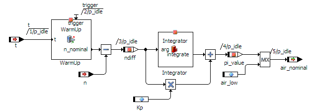

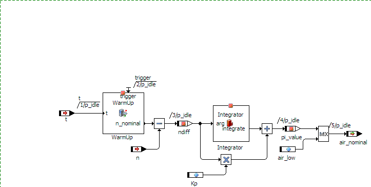

= Postscript or BMP or GIF or RTF

# Exporting a Block Diagram

To export a block diagram into a graphic file, proceed as follows:

1. Determine the export area for the graphic.
1. To exclude page borders, water marks and page numbers from the export, deactivate the respective options in the [Block Diagram](ComponentManagerEnglishUS.chm::/cm_options_for_block_diagrams.htm) node of the ASCET Options window.
1. Open the component and load the block diagram you want to export as graphic.
1. Open the File menu, then open the Export submenu, then open the Graphic submenu and select [<file format>](javascript:kadovTextPopup(this))<!-- kadovTextPopupInit('a1'); //-->.
1. Enter name and path of the export file and click on Save.

The export file is created according to your settings in the ASCET Options window.

See also

[Setting ASCET Options](ComponentManagerEnglishUS.chm::/SettingASCET.htm)

[Block Diagram Options](ComponentManagerEnglishUS.chm::/cm_options_for_block_diagrams.htm)

/* Heikki Komulainen, Comet Computer GmbH 2004 */ cc_plus_pic = '&nbsp;'; cc_minus_pic = '&nbsp;'; cc_stat_pic = '&nbsp;'; gpstyle = ''; var iframes_created = 0; if (document.body && document.body.insertAdjacentHTML && document.getElementsByTagName && document.getElementById) { collect_popups(); set_poplinks_pictures(); if (iframes_created) { document.write(gpstyle); document.write('
<nobr><a id="einauslink" style="position:absolute;top:expression(document.body.scrollTop + this.offsetHeight - this.offsetHeight);left:expression(document.body.offsetWidth - (this.offsetWidth + 28));background:white;padding:5px" href="javascript:show_all_poptext()">Show all hidden text</a></nobr>
'); } } function collect_popups() { bsscpopups = new Array(); for (x = 0; x < document.links.length; x++) { if (document.links[x].href.indexOf("BSSCPopup")>-1) { seekmatch = /BSSCPopup.'[^'](markdown/+)'/; poplink = seekmatch.exec(document.links[x].href); poplink = "" + poplink; poplink = poplink.substring(poplink.indexOf("'")+1, poplink.lastIndexOf("'")); ifid = "CCGENIFRAMEID" + x; new_iframe = '<iframe id="' + ifid + '"src="' + poplink + '" onload="get_text(\'' + ifid + '\')" width="0" height="0" frameborder=0></iframe>'; document.links[x].parentNode.insertAdjacentHTML("afterEnd", new_iframe); gpid = "CCID_" + ifid; document.links[x].href = "javascript:expand_poptext('" + gpid + "')"; cc_plus = '' + cc_plus_pic + ''; document.links[x].insertAdjacentHTML("afterBegin", cc_plus); iframes_created = 1; } } }// end function function get_text(ifr_id) { frpars = document.frames[ifr_id].document.getElementsByTagName("body"); popbody = frpars[0].innerHTML; gpid = "CCID_" + ifr_id; if (!document.getElementById(gpid)) { //avoiding doubles document.getElementById(ifr_id).insertAdjacentHTML("afterEnd", '
'+popbody+'
'); } }//end function function expand_poptext(x_frame_id) { if (!document.getElementById(x_frame_id)) return; if (document.getElementById(x_frame_id).className == "CCGENPOPTEXTH") { document.getElementById(x_frame_id).className = "CCGENPOPTEXTV"; document.getElementById(x_frame_id).style.visibility = "visible"; if (document.getElementById("CCPMB_" + x_frame_id )) { document.getElementById("CCPMB_" + x_frame_id ).innerHTML = cc_minus_pic; } } else { document.getElementById(x_frame_id).className = "CCGENPOPTEXTH"; document.getElementById(x_frame_id).style.visibility = "hidden"; if (document.getElementById("CCPMB_" + x_frame_id )) { document.getElementById("CCPMB_" + x_frame_id ).innerHTML = cc_plus_pic; } } }// end function function show_all_poptext() { var pulldowntxt = document.getElementsByTagName("div"); for (b = 0; b < pulldowntxt.length; b++) { if (pulldowntxt[b].className == "droptext") { pulldowntxt[b].style.display=""; } } var gptxt = document.getElementsByTagName("div"); for (z = 0; z < gptxt.length; z++) { if (gptxt[z].className == "CCGENPOPTEXTH") { gptxt[z].className = "CCGENPOPTEXTV"; gptxt[z].style.visibility = "visible"; if (document.getElementById("CCPMB_" + gptxt[z].id )) { document.getElementById("CCPMB_" + gptxt[z].id ).innerHTML = cc_minus_pic; } } } var dxpoplinks = document.getElementsByTagName("a"); if (dxpoplinks) { for (pxl = 0; pxl < dxpoplinks.length; pxl++) { if (dxpoplinks[pxl].href.indexOf("kadovTextPopup")>-1) { if (document.getElementById("CCPMB_" + dxpoplinks[pxl].id)) { document.getElementById("CCPMB_" + dxpoplinks[pxl].id).innerHTML = cc_stat_pic; dxpoplinks[pxl].symbol = "minus"; } } } } document.getElementById('einauslink').innerText = 'Hide all hideable text'; document.getElementById('einauslink').href = "javascript:self.location.reload()"; self.focus(); }// end function function eat_click() { return false; }// end function function set_poplinks_pictures() { var dpoplinks = document.getElementsByTagName("a"); if (dpoplinks) { for (pl = 0; pl < dpoplinks.length; pl++) { if (dpoplinks[pl].href.indexOf("kadovTextPopup")>-1) { cc_plus = '' + cc_stat_pic + ''; //dpoplinks[pl].onmouseup = plusminuspoplink; dpoplinks[pl].insertAdjacentHTML("afterBegin", cc_plus); dpoplinks[pl].symbol = "plus"; } } } }// end function function plusminuspoplink() { if (document.getElementById("CCPMB_" + this.id)) { if (this.symbol == "plus") { document.getElementById("CCPMB_" + this.id).innerHTML = cc_minus_pic; this.symbol = "minus"; } else { document.getElementById("CCPMB_" + this.id).innerHTML = cc_plus_pic; this.symbol = "plus"; } } return true; }

---

## Working on Included Components

_Source: `markdown/bde_work_includedcomponents.md`_

# Working on Included Components

Working on included components contains the following steps (in no particular order):

- [Editing an Included Component](markdown/BDE_Editcomponent.md)
- [Editing the Size of a Graphical Occurrence](markdown/Editsize.md)
- [Editing Ports](markdown/Editports.md)
- [Show/Hide Ports of an Included Component](markdown/Public_Methods.md)
- [Using Changes as a New Default Layout](markdown/BDE_Defaultlayout.md)
- [Restoring the Default Layout](markdown/Restoredefault.md)
- [Editing the Notes for a Component](markdown/BDE_Editnotes.md)
- [Replacing an Included Component](markdown/bde_replaceincludedcomponent.md)

---

## Editing an Included Component

_Source: `markdown/BDE_Editcomponent.md`_

# Editing an Included Component

To edit an included component, proceed as follows:

1. In the Outline pane, select the included component.
1. In the Edit menu, select Notes to view the notes for the imported component.
1. In the Edit menu, select Open Component to open the block diagram for the selected component.
1. Edit the included component according to your needs.
1. To return to the parent component, do one of the following.
1. Click Yes (No) to return to the parent component and save (discard) your changes.

See also

[Notes](AutomaticDocumentationEnglishUS.chm::/AD_notes.htm)

---

## Editing the Size of a Graphical Occurrence

_Source: `markdown/Editsize.md`_

# Editing the Size of a Graphical Occurrence

If flexible layout is activated (see [Layout of Included Components](markdown/BDE_Layout.md)), you can edit the size of each graphical occurrence of an included component individually.

Proceed as follows:

1. In the drawing area, mark the graphical occurrence of the added component you want to edit.
1. Drag the handles to set the size you require for the graphical occurrence.
1. If necessary, rearrange the diagram elements so that everything is kept clear.

See also

[Layout of Included Components](markdown/BDE_Layout.md)

[Activating/Deactivating Flexible Layout](ComponentManagerEnglishUS.chm::/Activating_Flexible_Layout.htm)

[Using Changes as a New Default Layout](markdown/BDE_Defaultlayout.md)

---

## Editing Ports

_Source: `markdown/Editports.md`_

# Editing Ports

You can move the ports of a graphical occurrence and show/hide their names.

To edit ports, proceed as follows:

1. Right-click on the included component, point to Ports in the context menu and select Unconnected Ports to show or hide all unconnected ports of the graphical occurrence.
1. Right-click on a port and select Pin Names <pin name> from the context menu to show/hide the display of the port name.
1. Right-click on a port with a sequence call and select Sequence Call from the context menu to show/hide the display of the sequence call.
1. Use the mouse to drag the port you want to move to the required position.
1. Right-click on the included component, point to Layout in the context menu and select Attributes.
1. In the Layout Settings window, do the following:

1. In the Visibility area, activate or deactivate the Name of Pins option to show/hide the name of all pins in the selected element.
1. Confirm your settings with OK.

See also

[Show/Hide Ports of an Included Component](markdown/Public_Methods.md)

[Layout of Included Components](markdown/BDE_Layout.md)

[Activating/Deactivating Flexible Layout](ComponentManagerEnglishUS.chm::/Activating_Flexible_Layout.htm)

[Using Changes as a New Default Layout](markdown/BDE_Defaultlayout.md)

---

## Show/Hide Ports of an Included Component

_Source: `markdown/Public_Methods.md`_

# Show/Hide Ports of an Included Component

If flexible layout is activated (see [Layout of Included Components](markdown/BDE_Layout.md)), you can modify the representation of an included component by means of the Methods option in the context menu Ports. Ports of a component can be added or removed by the method this way.

The ports of a method can only be added or removed together.

To show/hide ports of an included component, proceed as follows:

1. In the context menu of the graphical occurrence, point to Ports and select Methods.
1. Activate an unmarked entry to select it.
1. Click on Select All to select all entries.
1. Deactivate a marked entry to deselect it.
1. Click on Deselect All to deselect all entries.
1. Click on Revert to invert all current settings.
1. Click on Default to restore the setting specified in the layout editor.
1. Confirm your selection with OK.

The ports of the marked methods/processes are displayed in the graphical occurrence, those of the methods/processes not marked are removed.

If you remove a port which is connected to another element, the connecting line is removed with it.

The positions for newly added ports are determined automatically. Inputs are created on the left-hand side, outputs on the right. If you want to add ports for which the current size of the graphical occurrence has no space, the layout is enlarged automatically.

See also

[Layout of Included Components](markdown/BDE_Layout.md)

[Activating/Deactivating Flexible Layout](ComponentManagerEnglishUS.chm::/Activating_Flexible_Layout.htm)

[Using Changes as a New Default Layout](markdown/BDE_Defaultlayout.md)

---

## Using Changes as a New Default Layout

_Source: `markdown/BDE_Defaultlayout.md`_

# Using Changes as a New Default Layout

This procedure is only relevant if flexible layout is activated (see [Layout of Included Components](markdown/BDE_Layout.md)).

If you want to use the modified layout of a graphical occurrence as the new default layout, proceed as follows.

1. In the context menu of the graphical occurrence, point to Layout and select Set Attributes as Defaults.
1. Confirm with OK.

The modified layout is now the new default layout. It is available in the layout editor of the component.

If you create new graphical occurrences of the component, the new default layout is used. Existing graphical occurrences in diagrams, however, are not updated.

See also

[Restoring the Default Layout](markdown/Restoredefault.md)

[Editing the Size of a Graphical Occurrence](markdown/Editsize.md)

[Editing Ports](markdown/Editports.md)

[Show/Hide Ports of an Included Component](markdown/Public_Methods.md)

[Layout of Included Components](markdown/BDE_Layout.md)

[Activating/Deactivating Flexible Layout](ComponentManagerEnglishUS.chm::/Activating_Flexible_Layout.htm)

---

## Restoring the Default Layout

_Source: `markdown/Restoredefault.md`_

# Restoring the Default Layout

This procedure is only relevant if flexible layout is activated (see [Layout of Included Components](markdown/BDE_Layout.md)).

To restore the default layout, proceed as follows:

As long as you have not used the command Set Attributes as Default (see [Using Changes as a New Default Layout](markdown/BDE_Defaultlayout.md)), you can restore the default layout defined in the layout editor of the component.

- In the context menu of the graphical occurrence, point to Layout and select Use Default Attributes.

The default layout defined in the layout editor of the component is restored.

If connected ports are removed in this process, the connecting lines are removed with them.

If connected ports are moved, the connecting lines are moved with them. They are retained.

See also

[Layout of Included Components](markdown/BDE_Layout.md)

[Activating/Deactivating Flexible Layout](ComponentManagerEnglishUS.chm::/Activating_Flexible_Layout.htm)

[Using Changes as a New Default Layout](markdown/BDE_Defaultlayout.md)

[Editing the Size of a Graphical Occurrence](markdown/Editsize.md)

[Editing Ports](markdown/Editports.md)

[Show/Hide Ports of an Included Component](markdown/Public_Methods.md)

---

## Editing the Notes for a Component

_Source: `markdown/BDE_Editnotes.md`_

# Editing the Notes for a Component

You can also attach notes to the entire component, or to an included component. The notes for a database/workspace item are entered in a separate editor window. When documentation is generated automatically, the notes are included.

To edit the notes for a component, proceed as follows:

1. If you want to change the notes of the edited component, open the Edit menu, point to Component and select Notes.
1. In the Outline tab, highlight the included component whose notes you want to edit.
1. From the context menu of the highlighted component, select Notes.
1. [Edit the notes](AutomaticDocumentationEnglishUS.chm::/AD_Working_on_Notes.htm) according to your needs.

See also

[Notes](AutomaticDocumentationEnglishUS.chm::/AD_notes.htm)

[Working on Notes](AutomaticDocumentationEnglishUS.chm::/AD_Working_on_Notes.htm)

---

## Replacing an Included Component

_Source: `markdown/bde_replaceincludedcomponent.md`_

# Replacing an Included Component

Projects and several components (i.e. modules, classes, AUTOSAR software components, state machines) can contain other components. To replace an included component, proceed as follows.

1. In the Outline tab of the project or component editor, select the included component you want to replace.
1. Do one of the following.
1. Click Yes to continue.
1. From the 1 Database or 1 Workspace list, select the component you want to use as replacement.
1. Click OK to perform the replacement.
1. Continue with All or Selected.
1. Answer the question with Yes (all component instances in the project contest are replaced), No (only the current instance is replaced) or Cancel.

The new component replaces the old component.

In a block diagram, existing connections are restored if the new component contains pins (i.e. the interface elements) with identical names as the old component.

The type of the new component's pins is not checked; you must remove illegal (e.g., between log and cont) and non-matching (e.g., between cont and limitInt) connections manually.

In a project, process assignments to tasks are restored if the new module contains processes with identical names as the old module.

See also

[Connecting Diagram Elements](markdown/Connectdiagram.md)

[Project Editor - Assigning a Process to a Task](ProjectEditorEnglishUS.chm::/assignprocess.htm)

---

## Analyzing a Diagram

_Source: `markdown/AnalyzeDiagram.md`_

# Analyzing a Diagram

To analyze a diagram, proceed as follows:

1. In the Build menu, select Analyze Diagram to analyze the current diagram.
1. If you are working with a database larger than 3 GB, [another step is inserted](javascript:BSSCPopup('codegen_dbtoolarge.htm');)<!-- kadovFilePopupInit('a1'); //-->.
1. Click on an error message in the monitor window, Build tab, to have the error highlighted automatically in the block diagram editor.

See also

[ASCET Monitor Window](ComponentManagerEnglishUS.chm::/MonitorWindow.htm)

/* Heikki Komulainen, Comet Computer GmbH 2004 */ cc_plus_pic = '&nbsp;'; cc_minus_pic = '&nbsp;'; cc_stat_pic = '&nbsp;'; gpstyle = ''; var iframes_created = 0; if (document.body && document.body.insertAdjacentHTML && document.getElementsByTagName && document.getElementById) { collect_popups(); set_poplinks_pictures(); if (iframes_created) { document.write(gpstyle); document.write('
<nobr><a id="einauslink" style="position:absolute;top:expression(document.body.scrollTop + this.offsetHeight - this.offsetHeight);left:expression(document.body.offsetWidth - (this.offsetWidth + 28));background:#ffffe0;padding:5px" href="javascript:show_all_poptext()">Show all hidden text</a></nobr>
'); } } function collect_popups() { bsscpopups = new Array(); for (x = 0; x < document.links.length; x++) { if (document.links[x].href.indexOf("BSSCPopup")>-1) { seekmatch = /BSSCPopup.'[^'](markdown/+)'/; poplink = seekmatch.exec(document.links[x].href); poplink = "" + poplink; poplink = poplink.substring(poplink.indexOf("'")+1, poplink.lastIndexOf("'")); ifid = "CCGENIFRAMEID" + x; new_iframe = '<iframe id="' + ifid + '"src="' + poplink + '" onload="get_text(\'' + ifid + '\')" width="0" height="0" frameborder=0></iframe>'; document.links[x].parentNode.insertAdjacentHTML("afterEnd", new_iframe); gpid = "CCID_" + ifid; document.links[x].href = "javascript:expand_poptext('" + gpid + "')"; cc_plus = '' + cc_plus_pic + ''; document.links[x].insertAdjacentHTML("afterBegin", cc_plus); iframes_created = 1; } } }// end function function get_text(ifr_id) { frpars = document.frames[ifr_id].document.getElementsByTagName("body"); popbody = frpars[0].innerHTML; gpid = "CCID_" + ifr_id; if (!document.getElementById(gpid)) { //avoiding doubles document.getElementById(ifr_id).insertAdjacentHTML("afterEnd", '
'+popbody+'
'); } }//end function function expand_poptext(x_frame_id) { if (!document.getElementById(x_frame_id)) return; if (document.getElementById(x_frame_id).className == "CCGENPOPTEXTH") { document.getElementById(x_frame_id).className = "CCGENPOPTEXTV"; document.getElementById(x_frame_id).style.visibility = "visible"; if (document.getElementById("CCPMB_" + x_frame_id )) { document.getElementById("CCPMB_" + x_frame_id ).innerHTML = cc_minus_pic; } } else { document.getElementById(x_frame_id).className = "CCGENPOPTEXTH"; document.getElementById(x_frame_id).style.visibility = "hidden"; if (document.getElementById("CCPMB_" + x_frame_id )) { document.getElementById("CCPMB_" + x_frame_id ).innerHTML = cc_plus_pic; } } }// end function function show_all_poptext() { var pulldowntxt = document.getElementsByTagName("div"); for (b = 0; b < pulldowntxt.length; b++) { if (pulldowntxt[b].className == "droptext") { pulldowntxt[b].style.display=""; } } var gptxt = document.getElementsByTagName("div"); for (z = 0; z < gptxt.length; z++) { if (gptxt[z].className == "CCGENPOPTEXTH") { gptxt[z].className = "CCGENPOPTEXTV"; gptxt[z].style.visibility = "visible"; if (document.getElementById("CCPMB_" + gptxt[z].id )) { document.getElementById("CCPMB_" + gptxt[z].id ).innerHTML = cc_minus_pic; } } } var dxpoplinks = document.getElementsByTagName("a"); if (dxpoplinks) { for (pxl = 0; pxl < dxpoplinks.length; pxl++) { if (dxpoplinks[pxl].href.indexOf("kadovTextPopup")>-1) { if (document.getElementById("CCPMB_" + dxpoplinks[pxl].id)) { document.getElementById("CCPMB_" + dxpoplinks[pxl].id).innerHTML = cc_stat_pic; dxpoplinks[pxl].symbol = "minus"; } } } } document.getElementById('einauslink').innerText = 'Hide all hideable text'; document.getElementById('einauslink').href = "javascript:self.location.reload()"; self.focus(); }// end function function eat_click() { return false; }// end function function set_poplinks_pictures() { var dpoplinks = document.getElementsByTagName("a"); if (dpoplinks) { for (pl = 0; pl < dpoplinks.length; pl++) { if (dpoplinks[pl].href.indexOf("kadovTextPopup")>-1) { cc_plus = '' + cc_stat_pic + ''; //dpoplinks[pl].onmouseup = plusminuspoplink; dpoplinks[pl].insertAdjacentHTML("afterBegin", cc_plus); dpoplinks[pl].symbol = "plus"; } } } }// end function function plusminuspoplink() { if (document.getElementById("CCPMB_" + this.id)) { if (this.symbol == "plus") { document.getElementById("CCPMB_" + this.id).innerHTML = cc_minus_pic; this.symbol = "minus"; } else { document.getElementById("CCPMB_" + this.id).innerHTML = cc_plus_pic; this.symbol = "plus"; } } return true; }

---

## Generating Code for a Component

_Source: `markdown/GenerateCode.md`_

# Generating Code for a Component

To generate code for a component, proceed as follows:

1. In the block diagram editor, perform one of the following actions.
1. If you are working with a database larger than 3 GB, [another step is inserted](javascript:BSSCPopup('codegen_dbtoolarge.htm');)<!-- kadovFilePopupInit('a1'); //-->.

The C code for the current component is generated.

The system will display any error messages returned by the Code Generator. Again, you can find the relevant diagram item by clicking on an error message.

If the database size exceeds the max. size of 3.5 GB, the Database size limit exceeded message window opens. You have to close this window and reduce the database size before you can continue your work.

When the code for a component has been generated successfully, you can open the experimentation environment for the component.

See also

[Project Editor - Banners in the Generated Code](ProjectEditorEnglishUS.chm::/PE_Banners_in_GeneratedCode.htm)

[Starting an Offline Experiment](markdown/startoffline.md)

/* Heikki Komulainen, Comet Computer GmbH 2004 */ cc_plus_pic = '&nbsp;'; cc_minus_pic = '&nbsp;'; cc_stat_pic = '&nbsp;'; gpstyle = ''; var iframes_created = 0; if (document.body && document.body.insertAdjacentHTML && document.getElementsByTagName && document.getElementById) { collect_popups(); set_poplinks_pictures(); if (iframes_created) { document.write(gpstyle); document.write('
<nobr><a id="einauslink" style="position:absolute;top:expression(document.body.scrollTop + this.offsetHeight - this.offsetHeight);left:expression(document.body.offsetWidth - (this.offsetWidth + 28));background:#ffffe0;padding:5px" href="javascript:show_all_poptext()">Show all hidden text</a></nobr>
'); } } function collect_popups() { bsscpopups = new Array(); for (x = 0; x < document.links.length; x++) { if (document.links[x].href.indexOf("BSSCPopup")>-1) { seekmatch = /BSSCPopup.'[^'](markdown/+)'/; poplink = seekmatch.exec(document.links[x].href); poplink = "" + poplink; poplink = poplink.substring(poplink.indexOf("'")+1, poplink.lastIndexOf("'")); ifid = "CCGENIFRAMEID" + x; new_iframe = '<iframe id="' + ifid + '"src="' + poplink + '" onload="get_text(\'' + ifid + '\')" width="0" height="0" frameborder=0></iframe>'; document.links[x].parentNode.insertAdjacentHTML("afterEnd", new_iframe); gpid = "CCID_" + ifid; document.links[x].href = "javascript:expand_poptext('" + gpid + "')"; cc_plus = '' + cc_plus_pic + ''; document.links[x].insertAdjacentHTML("afterBegin", cc_plus); iframes_created = 1; } } }// end function function get_text(ifr_id) { frpars = document.frames[ifr_id].document.getElementsByTagName("body"); popbody = frpars[0].innerHTML; gpid = "CCID_" + ifr_id; if (!document.getElementById(gpid)) { //avoiding doubles document.getElementById(ifr_id).insertAdjacentHTML("afterEnd", '
'+popbody+'
'); } }//end function function expand_poptext(x_frame_id) { if (!document.getElementById(x_frame_id)) return; if (document.getElementById(x_frame_id).className == "CCGENPOPTEXTH") { document.getElementById(x_frame_id).className = "CCGENPOPTEXTV"; document.getElementById(x_frame_id).style.visibility = "visible"; if (document.getElementById("CCPMB_" + x_frame_id )) { document.getElementById("CCPMB_" + x_frame_id ).innerHTML = cc_minus_pic; } } else { document.getElementById(x_frame_id).className = "CCGENPOPTEXTH"; document.getElementById(x_frame_id).style.visibility = "hidden"; if (document.getElementById("CCPMB_" + x_frame_id )) { document.getElementById("CCPMB_" + x_frame_id ).innerHTML = cc_plus_pic; } } }// end function function show_all_poptext() { var pulldowntxt = document.getElementsByTagName("div"); for (b = 0; b < pulldowntxt.length; b++) { if (pulldowntxt[b].className == "droptext") { pulldowntxt[b].style.display=""; } } var gptxt = document.getElementsByTagName("div"); for (z = 0; z < gptxt.length; z++) { if (gptxt[z].className == "CCGENPOPTEXTH") { gptxt[z].className = "CCGENPOPTEXTV"; gptxt[z].style.visibility = "visible"; if (document.getElementById("CCPMB_" + gptxt[z].id )) { document.getElementById("CCPMB_" + gptxt[z].id ).innerHTML = cc_minus_pic; } } } var dxpoplinks = document.getElementsByTagName("a"); if (dxpoplinks) { for (pxl = 0; pxl < dxpoplinks.length; pxl++) { if (dxpoplinks[pxl].href.indexOf("kadovTextPopup")>-1) { if (document.getElementById("CCPMB_" + dxpoplinks[pxl].id)) { document.getElementById("CCPMB_" + dxpoplinks[pxl].id).innerHTML = cc_stat_pic; dxpoplinks[pxl].symbol = "minus"; } } } } document.getElementById('einauslink').innerText = 'Hide all hideable text'; document.getElementById('einauslink').href = "javascript:self.location.reload()"; self.focus(); }// end function function eat_click() { return false; }// end function function set_poplinks_pictures() { var dpoplinks = document.getElementsByTagName("a"); if (dpoplinks) { for (pl = 0; pl < dpoplinks.length; pl++) { if (dpoplinks[pl].href.indexOf("kadovTextPopup")>-1) { cc_plus = '' + cc_stat_pic + ''; //dpoplinks[pl].onmouseup = plusminuspoplink; dpoplinks[pl].insertAdjacentHTML("afterBegin", cc_plus); dpoplinks[pl].symbol = "plus"; } } } }// end function function plusminuspoplink() { if (document.getElementById("CCPMB_" + this.id)) { if (this.symbol == "plus") { document.getElementById("CCPMB_" + this.id).innerHTML = cc_minus_pic; this.symbol = "minus"; } else { document.getElementById("CCPMB_" + this.id).innerHTML = cc_plus_pic; this.symbol = "plus"; } } return true; }

---

## Starting an Offline Experiment

_Source: `markdown/startoffline.md`_

# Starting an Offline Experiment

To start an offline experiment, proceed as follows:

1. In the block diagram editor, perform one of the following actions.
1. If you are working with a database larger than 3 GB, [another step is inserted](javascript:BSSCPopup('codegen_dbtoolarge.htm');)<!-- kadovFilePopupInit('a1'); //-->.

Code is generated and compiled with the compiler specific to the current target, and the experimentation environment for the component is opened. The generated files are stored in the cgen directory.

The experimentation environment is described in [Experimentation](ExperimentationEnglishUS.chm::/EE_Overview.htm).

- See also
- [Experimentation](ExperimentationEnglishUS.chm::/EE_Overview.htm)
- [Project Editor - Banners in the Generated Code](ProjectEditorEnglishUS.chm::/PE_Banners_in_GeneratedCode.htm)
- (item)
- /* Heikki Komulainen, Comet Computer GmbH 2004 */ cc_plus_pic = '&nbsp;'; cc_minus_pic = '&nbsp;'; cc_stat_pic = '&nbsp;'; gpstyle = ''; var iframes_created = 0; if (document.body && document.body.insertAdjacentHTML && document.getElementsByTagName && document.getElementById) { collect_popups(); set_poplinks_pictures(); if (iframes_created) { document.write(gpstyle); document.write('
<nobr><a id="einauslink" style="position:absolute;top:expression(document.body.scrollTop + this.offsetHeight - this.offsetHeight);left:expression(document.body.offsetWidth - (this.offsetWidth + 28));background:#ffffe0;padding:5px" href="javascript:show_all_poptext()">Show all hidden text</a></nobr>
'); } } function collect_popups() { bsscpopups = new Array(); for (x = 0; x < document.links.length; x++) { if (document.links[x].href.indexOf("BSSCPopup")>-1) { seekmatch = /BSSCPopup.'[^'](markdown/+)'/; poplink = seekmatch.exec(document.links[x].href); poplink = "" + poplink; poplink = poplink.substring(poplink.indexOf("'")+1, poplink.lastIndexOf("'")); ifid = "CCGENIFRAMEID" + x; new_iframe = '<iframe id="' + ifid + '"src="' + poplink + '" onload="get_text(\'' + ifid + '\')" width="0" height="0" frameborder=0></iframe>'; document.links[x].parentNode.insertAdjacentHTML("afterEnd", new_iframe); gpid = "CCID_" + ifid; document.links[x].href = "javascript:expand_poptext('" + gpid + "')"; cc_plus = '' + cc_plus_pic + ''; document.links[x].insertAdjacentHTML("afterBegin", cc_plus); iframes_created = 1; } } }// end function function get_text(ifr_id) { frpars = document.frames[ifr_id].document.getElementsByTagName("body"); popbody = frpars[0].innerHTML; gpid = "CCID_" + ifr_id; if (!document.getElementById(gpid)) { //avoiding doubles document.getElementById(ifr_id).insertAdjacentHTML("afterEnd", '
'+popbody+'
'); } }//end function function expand_poptext(x_frame_id) { if (!document.getElementById(x_frame_id)) return; if (document.getElementById(x_frame_id).className == "CCGENPOPTEXTH") { document.getElementById(x_frame_id).className = "CCGENPOPTEXTV"; document.getElementById(x_frame_id).style.visibility = "visible"; if (document.getElementById("CCPMB_" + x_frame_id )) { document.getElementById("CCPMB_" + x_frame_id ).innerHTML = cc_minus_pic; } } else { document.getElementById(x_frame_id).className = "CCGENPOPTEXTH"; document.getElementById(x_frame_id).style.visibility = "hidden"; if (document.getElementById("CCPMB_" + x_frame_id )) { document.getElementById("CCPMB_" + x_frame_id ).innerHTML = cc_plus_pic; } } }// end function function show_all_poptext() { var pulldowntxt = document.getElementsByTagName("div"); for (b = 0; b < pulldowntxt.length; b++) { if (pulldowntxt[b].className == "droptext") { pulldowntxt[b].style.display=""; } } var gptxt = document.getElementsByTagName("div"); for (z = 0; z < gptxt.length; z++) { if (gptxt[z].className == "CCGENPOPTEXTH") { gptxt[z].className = "CCGENPOPTEXTV"; gptxt[z].style.visibility = "visible"; if (document.getElementById("CCPMB_" + gptxt[z].id )) { document.getElementById("CCPMB_" + gptxt[z].id ).innerHTML = cc_minus_pic; } } } var dxpoplinks = document.getElementsByTagName("a"); if (dxpoplinks) { for (pxl = 0; pxl < dxpoplinks.length; pxl++) { if (dxpoplinks[pxl].href.indexOf("kadovTextPopup")>-1) { if (document.getElementById("CCPMB_" + dxpoplinks[pxl].id)) { document.getElementById("CCPMB_" + dxpoplinks[pxl].id).innerHTML = cc_stat_pic; dxpoplinks[pxl].symbol = "minus"; } } } } document.getElementById('einauslink').innerText = 'Hide all hideable text'; document.getElementById('einauslink').href = "javascript:self.location.reload()"; self.focus(); }// end function function eat_click() { return false; }// end function function set_poplinks_pictures() { var dpoplinks = document.getElementsByTagName("a"); if (dpoplinks) { for (pl = 0; pl < dpoplinks.length; pl++) { if (dpoplinks[pl].href.indexOf("kadovTextPopup")>-1) { cc_plus = '' + cc_stat_pic + ''; //dpoplinks[pl].onmouseup = plusminuspoplink; dpoplinks[pl].insertAdjacentHTML("afterBegin", cc_plus); dpoplinks[pl].symbol = "plus"; } } } }// end function function plusminuspoplink() { if (document.getElementById("CCPMB_" + this.id)) { if (this.symbol == "plus") { document.getElementById("CCPMB_" + this.id).innerHTML = cc_minus_pic; this.symbol = "minus"; } else { document.getElementById("CCPMB_" + this.id).innerHTML = cc_plus_pic; this.symbol = "plus"; } } return true; }

---

## Defining Global Elements in the Default Project

_Source: `markdown/BDE_Globalelements.md`_

# Defining Global Elements in the Default Project

Under some circumstances, the global elements (see [Global Communication](ProjectEditorEnglishUS.chm::/definingglobalcommin.htm)) are not updated properly in the default project. The following error message (MLm10) is displayed in the ASCET monitor window:

need export or mapping for imported element <name> with type <type>

To correct this error, proceed as follows:

1. In the block diagram editor, open the Extras menu, point to Default Project and select Resolve Globals to resolve the global elements.
1. In the Extras menu, point to Default Project and select Delete Unused Globals to delete unused global elements in the default project.

See also

[Global Communication](ProjectEditorEnglishUS.chm::/definingglobalcommin.htm)

[Initialization of Explicit References](IntroductionEnglishUS.chm::/INT_InitExplicitReferences.htm)

---

## Viewing the Generated Code

_Source: `markdown/Viewcode.md`_

# Viewing the Generated Code

To view the generated code, proceed as follows:

1. In the block diagram editor, open the File menu, point to Export, then to Generated Code, and select Flat, Recursive or Generic to write the code for the component to the file system.
1. Select a path.
1. Click OK to write the code to the directory you selected.
1. If you are working with a database larger than 3 GB, [another step is inserted](javascript:BSSCPopup('codegen_dbtoolarge.htm');)<!-- kadovFilePopupInit('a1'); //-->.

Another way of viewing code is to select a user-defined external editor from ASCET (e.g. Notepad, Codewright, etc.). As the external editor is connected via a file system, files with the suffixes *.c and *.h must be associated with the editor in the Windows configuration.

1. From the Build menu, select View Generated Code.
1. If you are working with a database larger than 3 GB, [another step is inserted](javascript:BSSCPopup('codegen_dbtoolarge.htm');)<!-- kadovFilePopupInit('a2'); //-->.

C code is generated and displayed in an external editor. The text editor can be selected in the ASCET option window, ACSII Editor node (see [Setting ASCET Options](ComponentManagerEnglishUS.chm::/SettingASCET.htm)).

If the database size exceeds the max. size of 3.5 GB, the Database size limit exceeded message window opens. You have to close this window and reduce the database size before you can continue your work.

- See also

[Setting ASCET Options](ComponentManagerEnglishUS.chm::/SettingASCET.htm)

- [Project Editor - Banners in the Generated Code](ProjectEditorEnglishUS.chm::/PE_Banners_in_GeneratedCode.htm)

- (item)
- /* Heikki Komulainen, Comet Computer GmbH 2004 */ cc_plus_pic = '&nbsp;'; cc_minus_pic = '&nbsp;'; cc_stat_pic = '&nbsp;'; gpstyle = ''; var iframes_created = 0; if (document.body && document.body.insertAdjacentHTML && document.getElementsByTagName && document.getElementById) { collect_popups(); set_poplinks_pictures(); if (iframes_created) { document.write(gpstyle); document.write('
<nobr><a id="einauslink" style="position:absolute;top:expression(document.body.scrollTop + this.offsetHeight - this.offsetHeight);left:expression(document.body.offsetWidth - (this.offsetWidth + 28));background:#ffffe0;padding:5px" href="javascript:show_all_poptext()">Show all hidden text</a></nobr>
'); } } function collect_popups() { bsscpopups = new Array(); for (x = 0; x < document.links.length; x++) { if (document.links[x].href.indexOf("BSSCPopup")>-1) { seekmatch = /BSSCPopup.'[^'](markdown/+)'/; poplink = seekmatch.exec(document.links[x].href); poplink = "" + poplink; poplink = poplink.substring(poplink.indexOf("'")+1, poplink.lastIndexOf("'")); ifid = "CCGENIFRAMEID" + x; new_iframe = '<iframe id="' + ifid + '"src="' + poplink + '" onload="get_text(\'' + ifid + '\')" width="0" height="0" frameborder=0></iframe>'; document.links[x].parentNode.insertAdjacentHTML("afterEnd", new_iframe); gpid = "CCID_" + ifid; document.links[x].href = "javascript:expand_poptext('" + gpid + "')"; cc_plus = '' + cc_plus_pic + ''; document.links[x].insertAdjacentHTML("afterBegin", cc_plus); iframes_created = 1; } } }// end function function get_text(ifr_id) { frpars = document.frames[ifr_id].document.getElementsByTagName("body"); popbody = frpars[0].innerHTML; gpid = "CCID_" + ifr_id; if (!document.getElementById(gpid)) { //avoiding doubles document.getElementById(ifr_id).insertAdjacentHTML("afterEnd", '
'+popbody+'
'); } }//end function function expand_poptext(x_frame_id) { if (!document.getElementById(x_frame_id)) return; if (document.getElementById(x_frame_id).className == "CCGENPOPTEXTH") { document.getElementById(x_frame_id).className = "CCGENPOPTEXTV"; document.getElementById(x_frame_id).style.visibility = "visible"; if (document.getElementById("CCPMB_" + x_frame_id )) { document.getElementById("CCPMB_" + x_frame_id ).innerHTML = cc_minus_pic; } } else { document.getElementById(x_frame_id).className = "CCGENPOPTEXTH"; document.getElementById(x_frame_id).style.visibility = "hidden"; if (document.getElementById("CCPMB_" + x_frame_id )) { document.getElementById("CCPMB_" + x_frame_id ).innerHTML = cc_plus_pic; } } }// end function function show_all_poptext() { var pulldowntxt = document.getElementsByTagName("div"); for (b = 0; b < pulldowntxt.length; b++) { if (pulldowntxt[b].className == "droptext") { pulldowntxt[b].style.display=""; } } var gptxt = document.getElementsByTagName("div"); for (z = 0; z < gptxt.length; z++) { if (gptxt[z].className == "CCGENPOPTEXTH") { gptxt[z].className = "CCGENPOPTEXTV"; gptxt[z].style.visibility = "visible"; if (document.getElementById("CCPMB_" + gptxt[z].id )) { document.getElementById("CCPMB_" + gptxt[z].id ).innerHTML = cc_minus_pic; } } } var dxpoplinks = document.getElementsByTagName("a"); if (dxpoplinks) { for (pxl = 0; pxl < dxpoplinks.length; pxl++) { if (dxpoplinks[pxl].href.indexOf("kadovTextPopup")>-1) { if (document.getElementById("CCPMB_" + dxpoplinks[pxl].id)) { document.getElementById("CCPMB_" + dxpoplinks[pxl].id).innerHTML = cc_stat_pic; dxpoplinks[pxl].symbol = "minus"; } } } } document.getElementById('einauslink').innerText = 'Hide all hideable text'; document.getElementById('einauslink').href = "javascript:self.location.reload()"; self.focus(); }// end function function eat_click() { return false; }// end function function set_poplinks_pictures() { var dpoplinks = document.getElementsByTagName("a"); if (dpoplinks) { for (pl = 0; pl < dpoplinks.length; pl++) { if (dpoplinks[pl].href.indexOf("kadovTextPopup")>-1) { cc_plus = '' + cc_stat_pic + ''; //dpoplinks[pl].onmouseup = plusminuspoplink; dpoplinks[pl].insertAdjacentHTML("afterBegin", cc_plus); dpoplinks[pl].symbol = "plus"; } } } }// end function function plusminuspoplink() { if (document.getElementById("CCPMB_" + this.id)) { if (this.symbol == "plus") { document.getElementById("CCPMB_" + this.id).innerHTML = cc_minus_pic; this.symbol = "minus"; } else { document.getElementById("CCPMB_" + this.id).innerHTML = cc_plus_pic; this.symbol = "plus"; } } return true; }

---

## Setting the Size of the Drawing Area

_Source: `markdown/BDE_Setting_the_Size_of_the_Drawing_Area.md`_

# Setting the Size of the Drawing Area

The size you set applies to all graphical editors—software component editor, block diagram editor (including CT blocks), state machine editor, project editor (Graphics tab). Currently open windows, however, are not affected by a change.

1. In the Component Manager, open the Tools menu and select Options to open the ASCET options window.
1. Open the [Paper Size](ComponentManagerEnglishUS.chm::/cm_page_layout_node.htm) node.
1. In the Drawing Area Size (px) combo box, select a size.

Three sizes are available: 2000 @ 2000, 5000 @ 5000, 10000 @ 10000

If you selected a size larger than 2000 @ 2000, the following message is displayed:

If a size > 2000 @ 2000 px is selected, components may be displayed incompletely in ASCET versions < V5.2.1!

1. Confirm the message with OK to select the size.
1. Click OK to close the options window.

The next time you open the block diagram editor (or another graphical editor), the drawing area has the selected size.

See also

[Paper Size Options](ComponentManagerEnglishUS.chm::/cm_page_layout_node.htm)

---

## Filtering the Tree Pane

_Source: `markdown/BDE_Filtering_the_Component_Pane.md`_

# Filtering the Tree Pane

The Outline and Navigation tabs can be filtered. To do so, proceed as follows.

1. In the tab you want to filter, click on the  button.

The Options window opens in the Outline Tree or Navigation Tree node.

1. In the Elements subnode or the Navigation Tree node, activate the options of the items you want to display in the tab.
1. If you are filtering the Outline tab, go to the Methods subnode to set filter options for processes and methods.
1. Click OK to close the Options window.

Only items with activated options are shown in the tab. The button is marked with a green symbol to indicate an active filter: 

The filter settings made here affect all component editors.

See also

[Searching the Tree Pane](IntroductionEnglishUS.chm::/INT_SearchTreePane.htm)

---

## Changing the Grid in the Drawing Area

_Source: `markdown/Changing_Grid_Drawing_Area.md`_

# Changing the Grid in the Drawing Area

To change the grid in the drawing area, proceed as follows:

1. In the View menu, select Grid.
1. In the Grid Format combo box, select the grid style (Points, Lines, Invisible).
1. Adjust the grid size in which the points or lines are displayed.
1. Click OK to set the grid options.

---

## Show or Hide Window Elements

_Source: `markdown/ShoworHide.md`_

# Show or Hide Window Elements

To show or hide a window element, proceed as follows:

1. Click on the X next to the name of the list you want to close.
1. In the View menu, point to Show/Hide and select one of the following menu or submenu options. Component Pane Connected Elements Toolbars General Elements Basic Blocks Palettes Elements Basic Blocks Block Library
1. To redisplay the list, in the View menu, point to Show/Hide and select the same menu or submenu option again.

---

## Block Diagram Editor

_Source: `markdown/BDE_Description_of_Window_Elements.md`_

# Block Diagram Editor - Window Elements

The block diagram editor window contains the following window elements:

- [Menu Bar](markdown/BDE_MenuBar.md)

- Toolbars
- [General](markdown/bde_toolbargeneral.md) toolbar
- [Elements](markdown/bde_toolbarelements.md) toolbar
- [Basic Blocks](markdown/bde_toolbarbasicblocks.md) toolbar
- [Tree](markdown/BDE_Component_Pane.md) pane

This pane lists all elements of the component.

- Outline tab
- Navigation tab
- Database or Workspace tab
- [Elements](markdown/bde_elementspalette.md) palette
- [Basic Blocks](markdown/bde_basicblockspalette.md)palette
- [Library](markdown/bde_librarypalette.md) palette
- [Search Results](markdown/bde_SearchResultsView.md) view

- Specification view

This view is used for component specification. It is selected via the Specification tab at the right-hand side of the editor window. In the block diagram editor, the Specification view is also called drawing area.

The size of the drawing area can be adjusted in the [Paper Size](ComponentManagerEnglishUS.chm::/cm_page_layout_node.htm) node of the ASCET options window. Keep the following in mind: If you select a size larger than the fixed size (2000 x 2000 px) of previous ASCET versions (V5.2.0 and earlier), and use the larger area for modeling, the component cannot be completely displayed in older versions. Elements outside the drawing area cannot be deleted from the component because you cannot remove their graphical occurrences from the drawing area.

- [Browse](markdown/BDE_Browse_View.md) View

This view is used for component specification. It is opened via the Browse tab at the right-hand side of the editor window.

- status bar

The status bar contains information on the element currently selected in the Outline tab (if the Mouse Over option on the [Editors](ComponentManagerEnglishUS.chm::/cm_options_for_editors.htm) node of the ASCET options is deactivated) or on the element in the Outline tab or the drawing area the mouse is currently placed on (if the Mouse Over option is activated).

---

## Menus

_Source: `markdown/BDE_MenuBar.md`_

# Menu Bar

This menu bar contains the following menus:

- [File](markdown/BDE_FileMenu.md)
- [Edit](markdown/BDE_EditMenu.md)
- [View](markdown/BDE_ViewMenu.md)
- [Insert](markdown/BDE_InsertMenu.md)
- [Build](markdown/BDE_BuildMenu.md)
- [Extras](markdown/BDE_ExtrasMenu.md)
- [Tools](markdown/BDE_ToolsMenu.md)
- [Window](markdown/BDE_WindowMenu.md)
- [Help](markdown/BDE_HelpMenu.md)

---

## File Menu

_Source: `markdown/BDE_FileMenu.md`_

# File Menu

This menu contains the following functions:

Save (Ctrl + s)

Save current block diagram.

Import

Data

| Column 1 | Column 2 |
| --- | --- |
| For Selected Element | Import data for selected element. |

Export

Component (Ctrl + e)

Exports the currently edited component.

Generated Code

Saves the code generated in the file system.

| Column 1 | Column 2 |
| --- | --- |
| Flat | The edited component. |
| Recursive | The referenced components. |
| Generic | Files out generic code for external make. |

Data

Exports a component data set.

| Column 1 | Column 2 |
| --- | --- |
| For Component | Exports a component dataset. |
| For selected Element | Exports data for the selected elements. |

Graphic

| Column 1 | Column 2 |
| --- | --- |
| Postscript | Saves the diagram as Postscript file. |
| BMP | Saves the diagram as Bitmap graphic file. |
| GIF | Saves the diagram as .gif (Graphics Interchange Format) file. |
| RTF | Saves the diagram as .rtf (Rich Text Format) file. |

Print

Prints the block diagram.

Close

Exits the block diagram editor.

---

## Edit Menu

_Source: `markdown/BDE_EditMenu.md`_

# Edit Menu

This menu contains the following functions:

Undo (Ctrl + z)

Reverses the most recent action.

Redo (Ctrl + y)

Reverses an undo command.

Cut (Ctrl + x)

Cuts (deletes) a selected diagram element or method/process.

Copy (Ctrl + c)

Copies a selected diagram element or method/process to the ASCET clipboard.

Paste (Ctrl + v)

Pastes a diagram item.

Delete (Del)

Deletes a selected element or method/process.

Rename (F2)

Renames a selected element or method/process.

Search (Ctrl + Shift + s)

Searches the component as described in [Browsing the Database or Workspace](ComponentManagerEnglishUS.chm::/Browsing.htm). The range is limited to the edited component and its included components.

Select All (Ctrl + a)

Selects all elements in the Specification Panel.

Replace Component

Replaces a component with another component. The name of the old component remains.

Open Component

Opens the specification editor for a selected included component.

Notes...

Opens the notes editor for an included component - you can make notes about the included component here.

Properties... (Ctrl + Shift + p)

Edits the properties of the selected element.

Data... (Ctrl + Shift + d)

Opens the data editor for the selected element.

Implementation (Ctrl + Shift + i)

The implementation editor for the selected element opens. Search of component implementations is possible.

Set Cache Locking

These menu options are used in connection with ASCET-RP. See [ES1135: Cache Locking](INTECRIOConnectivityRPEnglishUS.chm::/IIO_ES1135CacheLocking.htm) for a description.

Component

| Column 1 | Column 2 |
| --- | --- |
| Data | Opens the data editor for the component. Search of component data is possible. |
| Implementation | Opens the implementation editor for the component. Search of component implementations is possible. |
| Layout | Opens the layout editor for the component. |
| Notes | Opens the notes editor - you can make notes about the component here. |

---

## View Menu

_Source: `markdown/BDE_ViewMenu.md`_

# View Menu

This menu contains the following functions:

Show/Hide

Shows/hides several parts of the editor or the component.

| Column 1 | Column 2 |
| --- | --- |
| Tree Pane | Shows/hides Tree pane. |
| Search Results | Browse area for elements connected to a selected diagram element (see Viewing All Elements Connected to an Item ) or for unused elements (see Searching/Deleting Unused Elements ). |
| Toolbars | The General , Elements and Basic Blocks submenus show/hide the respective toolbars. |
| Palettes | The Elements , Basic Blocks and Block Library submenus show/hide the respective palettes. |

Configure

| Column 1 | Column 2 |
| --- | --- |
| Toolbar General | Select the buttons to be visible in the General toolbar (see Configuring a Toolbar ). |
| Toolbar Elements | Select the buttons to be visible in the Elements toolbar. |
| Toolbar Basic Blocks | Select the buttons to be visible in the Basic Blocks toolbar. |
| Reset Toolbar Configuration | Reset toolbars to default configuration. |

Sequence Calls

Show

Shows groups of sequence calls.

| Column 1 | Column 2 |
| --- | --- |
| For Diagram | For the whole diagram. |
| For Method/Process | For a single method/process. |
| For Selection | For selected blocks. |
| Unused | Unused sequence calls. |

Hide

Hides groups of sequence calls.

| Column 1 | Column 2 |
| --- | --- |
| For Diagram | For the whole diagram. |
| For Method/Process | For a single method/process. |
| For Selection | For selected blocks. |
| Unused | Unused sequence calls. |

Next (Ctrl + Right)

Moves between sequence calls (next call).

Previous (Ctrl + Left)

Moves between sequence calls (previous call)

Page Layout

Page frame Portrait

Displays the diagram in portrait format.

Page frame Landscape

Displays the diagram in landscape format.

Grid

Modifies the grid in the drawing area.

See also

[Configuring a Toolbar](IntroductionEnglishUS.chm::/INT_Configuring_Toolbar.htm)

[Viewing All Elements Connected to an Item](markdown/ViewItem.md)

[Renaming or Deleting an Element](markdown/BDE_rename_delete.md)

---

## Insert Menu

_Source: `markdown/BDE_InsertMenu.md`_

# Insert Menu

This menu contains the following functions:

Component

Inserts a component as a complex element.

Method

Creates a method. Available for classes and modules.

Process

Creates a process. Available for modules.

Diagram

Creates a new diagram.

| Column 1 | Column 2 |
| --- | --- |
| Public | Contains only public methods. |
| Private | Contains only private methods. |

---

## Build Menu

_Source: `markdown/BDE_BuildMenu.md`_

# Build Menu

This menu contains the following functions:

Touch

Forced regeneration during the next code generation.

| Column 1 | Column 2 |
| --- | --- |
| Flat | The edited component. |
| Recursive | The edited component and the referenced components. |

Clean Code Generation Directory

Deletes all files in the code generation directory.

Analyze Diagram

Analyzes the current diagram.

View Generated Code

Generates the code for the component and displays it in a text editor. The text editor can be selected in the ASCET option window, ASCII Editor node (see [Setting ASCET Options](ComponentManagerEnglishUS.chm::/SettingASCET.htm)).

Generate Code (Ctrl + F7)

Generates the code for a component.

Compile

Compiles the generated code. Not available in the context of a project with the EHOOKS target.

Experiment

Starts an experiment. Not available in the context of a project with the EHOOKS target.

See also

[Setting ASCET Options](ComponentManagerEnglishUS.chm::/SettingASCET.htm)

---

## Extras Menu

_Source: `markdown/BDE_ExtrasMenu.md`_

# Extras Menu (Block Diagram Editor)

This menu bar contains the following menus:

Browse to Parent Component

Opens an editor for the including component. (The option is only available if an included component is being edited.)

Browse to Parent Hierarchy

Displays the including graphical hierarchy or statement block (see [Graphical Hierarchies](markdown/GraphicalHierarchies.md) or [Statement Blocks](markdown/BDE_StatementBlocks.md)).

Show Path

Shows the path of an element or included component.

Show Occurrences

Shows all graphical occurrences of the item.

Copy Path to Clipboard

Copies the path of an included component to the clipboard.

| Column 1 | Column 2 |
| --- | --- |
| Model Path | Model Path. |
| Model asd:// Link | Path in ASCET protocol format that allows operating/referencing an ASCET component in a model as hyperlink. |
| Database Path | Database/workspace path. |
| Database asd:// Link | Path in ASCET protocol format that allows operating/referencing an ASCET component in the database/workspace as hyperlink. |

Create ASCET Link

Creates an [ASCET link](IntroductionEnglishUS.chm::/INT_ASCETLinks.htm) for an element selected in the Outline tab or the drawing area. The link opens the component in the block diagram editor and (except for the self element, i.e. the root of the element tree) highlights the element in the Outline tab or drawing area.

Default Project

Allows editing the default project used for experimenting with components.

| Column 1 | Column 2 |
| --- | --- |
| Open | Opens an editor for the default project. |
| Resolve Globals | Automatically creates a global element for each imported element in the component for which there is no exported element. For each explicit reference among the imported elements, Resolve Globals creates an exported reference in the default project. These exported references are not initialized; you have to initialize the exported references manually. |
| Delete Unused Globals | Deletes unused global elements. |

Check Dependency

Checks whether the allocation of formal parameters to the model parameters is correct.

Show Unused Elements

Opens the Search Results view and lists all elements from the Tree pane that do not appear in the diagram. See also [Searching/Deleting Unused Elements](markdown/BDE_SearchDeleteUnusedElements.md).

See also

[Graphical Hierarchies](markdown/GraphicalHierarchies.md)

[ASCET Links](IntroductionEnglishUS.chm::/INT_ASCETLinks.htm)

[Default Projects](ProjectEditorEnglishUS.chm::/PE_defaultproject.htm)

[Initialization of Explicit References](IntroductionEnglishUS.chm::/INT_InitExplicitReferences.htm)

[Searching/Deleting Unused Elements](markdown/BDE_SearchDeleteUnusedElements.md)

---

## Tools Menu

_Source: `markdown/BDE_ToolsMenu.md`_

# Tools Menu

This menu contains the following functions:

Sequence Calls

Reset

Resets sequence calls.

| Column 1 | Column 2 |
| --- | --- |
| For Diagram | Resets for the whole diagram. |
| For Method/Process | Resets for a single method/process. |
| For Selected Blocks | Resets for selected blocks. |

Sequencing

| Column 1 | Column 2 |
| --- | --- |
| Ignore Current | Automatic assignment of sequence calls. |
| Starting With... | Automatic assignment of sequence calls starting with a particular number. |
| Appending... | Appends sequence calls to an existing sequence. |

Scale to Step Size

Scales sequence calls.

| Column 1 | Column 2 |
| --- | --- |
| For Diagram | Scales for the whole diagram. |
| For Method/Process | Scales for a single method/process. |

Options

Opens the ASCET options dialog window.

See also

[Setting ASCET Options](ComponentManagerEnglishUS.chm::/SettingASCET.htm)

---

## Window Menu

_Source: `markdown/BDE_WindowMenu.md`_

# Window Menu

This menu contains the following functions:

Load Diagram

Loads a diagram.

Move Up Diagram

Moves a diagram (upwards).

Move Down Diagram

Moves a diagram (downwards).

Move Method to...

Moves methods/processes between diagrams.

Views...

Opens the Views dialog window. The views in which the selected diagram item(s) can currently be seen are selected and can be edited.

Redraw (F5)

Redraws the diagram.

---

## Help Menu

_Source: `markdown/BDE_HelpMenu.md`_

# Help Menu

This menu contains the following functions:

Contents (F1)

Shows the help contents.

Index

Shows the help index.

---

## Toolbars

_Source: `markdown/bde_toolbars.md`_

# Toolbars - Block Diagram Editor

The toolbar is grouped by following functional blocks:

- [General](markdown/bde_toolbargeneral.md)
- [Elements](markdown/bde_toolbarelements.md)
- [Basic Blocks](markdown/bde_toolbarbasicblocks.md)

---

## Toolbar General

_Source: `markdown/bde_toolbargeneral.md`_

# Toolbar General - Block Diagram Editor

The General toolbar contains the following buttons:

| Column 1 | Column 2 |
| --- | --- |
|  | Connect |
|  | Save |
|  | Print |
|  | Cut |
|  | Copy |
|  | Paste |
|  | Delete |
|  | Undo |
|  | Redo |
|  | Redraw |
|  | Edit Component Data |
|  | Edit Component Implementation |
|  | Edit Default Project |
|  | Tool Options |
|  | Insert Component |
|  | Insert Method |
|  | Insert Process |
|  | Browse to Parent Component |
|  | Generate Code |
|  | Compile generated code |
|  | Open Experiment for selected Experiment Target |
|  | Select Experiment Target combo box |
|  | Select View combo box |
|  | Select Zoom Factor combo box |
|  | Set Zoom to 100% |
|  | Set Zoom to Page |
|  | Set Zoom to Fit |

Icons from this list that are not visible in the block diagram editor can be added; see [Configuring a Toolbar](IntroductionEnglishUS.chm::/INT_Configuring_Toolbar.htm).

---

## Toolbar Elements

_Source: `markdown/bde_toolbarelements.md`_

# Toolbar Elements - Block Diagram Editor

The toolbar Elements contains the following buttons:

<table style="x-cell-content-align: Top;
				margin-top: 3px;
				border-left-style: Outset;
				border-top-style: Outset;
				border-right-style: Outset;
				border-bottom-style: Outset;
				border-left-width: 1px;
				border-right-width: 1px;
				border-top-width: 1px;
				border-bottom-width: 1px;" x-use-null-cells="">
<col/>
<col/>
<col/>
<tr class="hcp1" valign="top">
<td class="hcp2">

</td>
<td class="hcp2">

Variable
</td>
<td class="hcp2" colspan="1" rowspan="2">

The  button opens the element type 
 selection menu. The Variable and Parameter 
 buttons can be used to create elements of type logic, limitInt, wrapInt, 
 udisc, sdisc, or cont.

By default, the limitInt and wrapInt types are displayed. To display the sdisc 
 and udisc types instead, the <a href="ComponentManagerEnglishUS.chm::/cm_options_for_editors.htm">editor 
 option</a> Use signed/unsigned discrete types must 
 be activated.

See also <a href="markdown/BasicElement.md">Creating a Basic 
 Element</a>.
</td></tr>
<tr class="hcp1" valign="top">
<td class="hcp2">

</td>
<td class="hcp2">

Parameter
</td>
</tr>
<tr class="hcp1" valign="top">
<td class="hcp2">

</td>
<td class="hcp2">

Implementation Cast
</td>
<td class="hcp2">

See also <a href="markdown/BDE_ImplementationCasts.md">Implementation 
 Casts in Block Diagrams</a>.
</td></tr>
<tr class="hcp1" valign="top">
<td class="hcp2">

</td>
<td class="hcp2">

Delta t
</td>
<td class="hcp2">

dt system parameter

The name dT 
 is reserved for the system parameter. You cannot create any other element 
 with the name dT. 
 Since upper and lower case letters are not distinguished, the names DT, 
 dt, and Dt are reserved, too.
</td></tr>
<tr class="hcp1" valign="top">
<td class="hcp2">

</td>
<td class="hcp2">

Resource
</td>
<td class="hcp2">

See also <a href="markdown/BDE_Resources.md">Resources</a>.
</td></tr>
<tr class="hcp1" valign="top">
<td class="hcp2">

</td>
<td class="hcp2">

Receive Message
</td>
<td class="hcp2" colspan="1" rowspan="3">

These buttons can be used to create scalar messages 
 only. 

See also <a href="markdown/BDE_CreateMessage.md">Creating 
 a Message</a>.
</td></tr>
<tr class="hcp1" valign="top">
<td class="hcp2">

</td>
<td class="hcp2">

Send Receive Message
</td>
</tr>
<tr class="hcp1" valign="top">
<td class="hcp2">

</td>
<td class="hcp2">

Send Message
</td>
</tr>
<tr class="hcp1" valign="top">
<td class="hcp2">

</td>
<td class="hcp2">

Array
</td>
<td class="hcp2" colspan="1" rowspan="2">

See also <a href="markdown/CreateArray.md">Creating an Array 
 or Matrix</a>.
</td></tr>
<tr class="hcp1" valign="top">
<td class="hcp2">

</td>
<td class="hcp2">

Matrix
</td>
</tr>
<tr class="hcp1" valign="top">
<td class="hcp2">

</td>
<td class="hcp2">

Distribution
</td>
<td class="hcp2">

See also <a href="markdown/CreateDistribution.md">Creating 
 a Distribution</a>.
</td></tr>
<tr class="hcp1" valign="top">
<td class="hcp2">

</td>
<td class="hcp2">

OneD Table
</td>
<td class="hcp2" colspan="1" rowspan="2">

The  button opens the table type selection 
 menu. The table buttons can be used to create normal, group, or fixed 
 tables. 

See also <a href="markdown/Createnormal.md">Creating a Normal 
 or Fixed Characteristic Line/Map</a> and <a href="markdown/Creategroup.md">Creating 
 a Group Characteristic Line/Map</a>.
</td></tr>
<tr class="hcp1" valign="top">
<td class="hcp2">

</td>
<td class="hcp2">

TwoD Table
</td>
</tr>
</table>

See also

[Elements Palette](markdown/bde_elementspalette.md)

---

## Toolbar Basic Blocks

_Source: `markdown/bde_toolbarbasicblocks.md`_

# Toolbar Basic Blocks - Block Diagram Editor

The toolbar Basic Blocks contains the following operator groups:

- [Arithmetic Operators](markdown/bde_arithmeticoperators.md)
- [Logical Operators](markdown/BDE_logicalOperators.md)
- [Comparison Operators](markdown/BDE_comparisonOperators.md)
- [Input Operators](markdown/BDE_inputOperators.md)
- [Conversion Operator](markdown/BDE_ConversionOperator.md)
- [A](markdown/BDE_Assert_Operator.md)ssert Operator
- [Conditional Operators](markdown/BDE_conditionalOperators.md)
- [Control Flow Operators](markdown/BDE_controlFlowOperators.md)
- [Miscellaneous Operators](markdown/BDE_MiscBasicBlocks.md)

Icons from these lists that are not visible in the block diagram editor can be added; see [Configuring a Toolbar](IntroductionEnglishUS.chm::/INT_Configuring_Toolbar.htm).

See also

[Basic Blocks Palette](markdown/bde_basicblockspalette.md)

---

## Arithmetic Operators

_Source: `markdown/bde_arithmeticoperators.md`_

# Arithmetic Operators

The meaning of the operators is the same as in [ESDL](ESDLEditorEnglishUS.chm::/Arithmetic_Operators.htm). The addition and multiplication operators can have between 2 and 20 arguments. The subtraction, division and modulo operators have only two arguments.

The following arithmetic operators are available:

| Column 1 | Column 2 |
| --- | --- |
|  | Addition |
|  | Subtraction |
|  | Multiplication |
|  | Division |
|  | Modulo |

See also

[Logical Operators](markdown/BDE_logicalOperators.md)

[Comparison Operators](markdown/BDE_comparisonOperators.md)

[Input Operators](markdown/BDE_inputOperators.md)

[Conditional Operators](markdown/BDE_conditionalOperators.md)

[Control Flow Operators](markdown/BDE_controlFlowOperators.md)

[Miscellaneous Operators](markdown/BDE_MiscBasicBlocks.md)

---

## Logical Operators

_Source: `markdown/BDE_logicalOperators.md`_

# Logical Operators

The meaning of the logical operators And, Or and Not is identical to their meaning in [ESDL](ESDLEditorEnglishUS.chm::/logical_operators.htm). The And and Or operators can be applied to more than two operands.

The following Logical Operators are available:

| Column 1 | Column 2 |
| --- | --- |
|  | And |
|  | Or |
|  | Not |

See also

[Arithmetic Operators](markdown/bde_arithmeticoperators.md)

[Comparison Operators](markdown/BDE_comparisonOperators.md)

[Input Operators](markdown/BDE_inputOperators.md)

[Conditional Operators](markdown/BDE_conditionalOperators.md)

[Control Flow Operators](markdown/BDE_controlFlowOperators.md)

[Miscellaneous Operators](markdown/BDE_MiscBasicBlocks.md)

---

## Comparison Operators

_Source: `markdown/BDE_comparisonOperators.md`_

# Comparison Operators

The comparison operators are identical to their counterparts in the textual representation with ESDL.

The following comparison operators are available:

| Column 1 | Column 2 |
| --- | --- |
|  | Greater |
|  | Smaller |
|  | Smaller or Equal |
|  | Greater or Equal |
|  | Equal |
|  | Not Equal |
|  | Verify (see also Redundant Data Storage ) |

The Equal and Not Equal operators can also be applied to non-arithmetic elements.

See also

[Arithmetic Operators](markdown/bde_arithmeticoperators.md)

[Logical Operators](markdown/BDE_logicalOperators.md)

[Input Operators](markdown/BDE_inputOperators.md)

[Conditional Operators](markdown/BDE_conditionalOperators.md)

[Control Flow Operators](markdown/BDE_controlFlowOperators.md)

[Miscellaneous Operators](markdown/BDE_MiscBasicBlocks.md)

---

## Input Operators

_Source: `markdown/BDE_inputOperators.md`_

# Input Operators

The following Input Operators are available:

| Column 1 | Column 2 |
| --- | --- |
|  | Absolute (returns the absolute value of the input) |
|  | Max (returns the maximum input) |
|  | Min (returns the minimum input) |
|  | Between (checks if the input value lies between the limiters min and max) |
|  | Negation (returns the negative value of the input) |

See also

[Arithmetic Operators](markdown/bde_arithmeticoperators.md)

[Logical Operators](markdown/BDE_logicalOperators.md)

[Comparison Operators](markdown/BDE_comparisonOperators.md)

[Conditional Operators](markdown/BDE_conditionalOperators.md)

[Control Flow Operators](markdown/BDE_controlFlowOperators.md)

[Miscellaneous Operators](markdown/BDE_MiscBasicBlocks.md)

---

## Conversion Operator

_Source: `markdown/BDE_ConversionOperator.md`_

# Conversion Operator

 

The Conversion operator allows to convert scalar elements of numerical or enumeration type to [limitInt](IntroductionEnglishUS.chm::/INT_ScalarTypes_LimitedInteger.htm) or [wrapInt](IntroductionEnglishUS.chm::/INT_ScalarTypes_WrapAroundInteger.htm) types. The function of the convert operator is determined either via the button used to create the operator or via the Conversion Type submenu in the operator's context menu.

The Use Limiters option in the operator's context menu is used to determine if the limits for the converted type are user-defined or not.

The Conversion option in the operator's context menu opens the [Conversion Attributes dialog window](markdown/BDE_ConversionAttributesWindow.md), where you can enter min and max values and - for wrapInt - type for the conversion result.

- The [first example](markdown/BDE_Example_ConversionOperator.md#Example1) shows a cont variable converted to limitInt; min and max of the conversion are set manually.
- The [second example](markdown/BDE_Example_ConversionOperator.md#Example2) shows a cont variable with integer implementation converted to limitInt; min and max of the conversion are set automatically.
- The [third example](markdown/BDE_Example_ConversionOperator.md#Example3) shows a cont variable converted to wrapInt; min and max of the conversion are set manually.
- The [fourth example](markdown/BDE_Example_ConversionOperator.md#Example4) shows a cont variable converted to wrapInt; min and max of the conversion are set automatically.

See also

[Scalar Types - Limited Integer](IntroductionEnglishUS.chm::/INT_ScalarTypes_LimitedInteger.htm)

[Scalar Types - Wrap-Around Integer](IntroductionEnglishUS.chm::/INT_ScalarTypes_WrapAroundInteger.htm)

[Conversion Attributes Dialog Window](markdown/BDE_ConversionAttributesWindow.md)

[Context Menu - Operators and Control Flow Elements: Conversion Operator](markdown/BDE_ContextMenu_OperatorsControlflow.md#Conversion)

[Examples: Conversion Operator](markdown/BDE_Example_ConversionOperator.md)

[Using the Conversion Operator](markdown/BDE_UseConversionOperator.md)

---

## Assert Operator

_Source: `markdown/BDE_Assert_Operator.md`_

# Assert Operator

The Assert operator allows to specify lower and upper bound of an interval. This interval is then used by the code generator as the result interval of the Assert operator; the calculated interval of the operand is overwritten. It is possible to use the Assert operator with only one boundary; in that case, the other boundary is specified as -oo or +oo.

The result type of the assert operator is the same type as the operand, with the interval replaced by the interval specified on the assert operator.

The assert operator conveys user-defined interval information to the code generator. The Assert option in the operator's context menu opens the [Assert Attributes dialog window](markdown/BDE_AssertAttributes_Window.md), where you can enter min and max values for the operand interval. The code generator can use this information to generate more efficient code. However, the correctness of the assertion must be reviewed manually; this is supported by the semantic analysis.

In addition, the assert operator is suitable to replace implementation casts with deactivated Limit Assignments option (see also [Setting the Limitation](ImplementationEditorEnglishUS.chm::/set_limitation.htm)).

The following semantic checks are performed:

- If the physical operand interval and the assert interval have no intersection, an error (MIle76) is issued during code generation, because this is most likely a modeling error.
- If the physical operand interval and the assert interval overlap, but neither interval is fully contained in the other, an information message (IIle76) is issued during code generation.

This is potentially a modeling error, so you might want to [promote](ComponentManagerEnglishUS.chm::/CM_Promoting_Messages.htm) the information to a warning.

- If the physical operand interval is contained in the assert interval, an information message (IIle77) is issued during code generation.

- If the model contains an implementation cast with deactivated Limit Assignments option, and if the formula of the implementation cast is the same as the formula of the operand, an information message (IIle78) is issued during implementation code generation.

This message informs you that the implementation cast can be replaced by an assert operator, and specifies the required assertion interval.

See also [Example: Assert Operator](markdown/BDE_Example_AssertOperator.md).

See also

[Assert Attributes Dialog Window](markdown/BDE_AssertAttributes_Window.md)

[Using the Assert Operator](markdown/BDE_Use_AssertOperator.md)

[Context Menu - Operators and Control Flow Elements: Assert Operator](markdown/BDE_ContextMenu_OperatorsControlflow.md#Assert)

[Example: Assert Operator](markdown/BDE_Example_AssertOperator.md)

[Setting the Limitation](ImplementationEditorEnglishUS.chm::/set_limitation.htm)

[Promoting Messages](ComponentManagerEnglishUS.chm::/CM_Promoting_Messages.htm)

---

## Conditional Operators

_Source: `markdown/BDE_conditionalOperators.md`_

# Conditional Operators

The following Conditional Operators are available:

| Column 1 | Column 2 |
| --- | --- |
|  | Multiplex Operator |
|  | Case Operator |

See also

[Arithmetic Operators](markdown/bde_arithmeticoperators.md)

[Logical Operators](markdown/BDE_logicalOperators.md)

[Comparison Operators](markdown/BDE_comparisonOperators.md)

[Input Operators](markdown/BDE_inputOperators.md)

[Control Flow Operators](markdown/BDE_controlFlowOperators.md)

[Miscellaneous Operators](markdown/BDE_MiscBasicBlocks.md)

---

## Control Flow Operators

_Source: `markdown/BDE_controlFlowOperators.md`_

# Control Flow Operators

The following control flow operators are available:

| Column 1 | Column 2 |
| --- | --- |
|  | If...Then |
|  | If...Then...Else |
|  | While |
|  | Switch |
|  | Break Operator |

See also

[Arithmetic Operators](markdown/bde_arithmeticoperators.md)

[Logical Operators](markdown/BDE_logicalOperators.md)

[Comparison Operators](markdown/BDE_comparisonOperators.md)

[Input Operators](markdown/BDE_inputOperators.md)

[Conditional Operators](markdown/BDE_conditionalOperators.md)

[Miscellaneous Operators](markdown/BDE_MiscBasicBlocks.md)

---

## Miscellaneous Operators

_Source: `markdown/BDE_MiscBasicBlocks.md`_

# Miscellaneous Operators

The following miscellaneous operators are available:

| Column 1 | Column 2 |
| --- | --- |
|  | Combo box to select the number of operator inputs |
|  | Enumeration Literal |
|  | Logic Literal true |
|  | Logic Literal false |
|  | Continuous Literal 0.0 |
|  | Continuous Literal 1.0 |
|  | Hierarchy |
|  | Statement Block |
|  | Comment |
|  | Self |

See also

[Arithmetic Operators](markdown/bde_arithmeticoperators.md)

[Logical Operators](markdown/BDE_logicalOperators.md)

[Comparison Operators](markdown/BDE_comparisonOperators.md)

[Input Operators](markdown/BDE_inputOperators.md)

[Conditional Operators](markdown/BDE_conditionalOperators.md)

[Control Flow Operators](markdown/BDE_controlFlowOperators.md)

---

## Tree Pane

_Source: `markdown/BDE_Component_Pane.md`_

# Tree Pane

The Tree pane contains the following tabs and filter functions:

##### Outline

In this tab all elements of the component self:<component name> are listed. Also you find all methods and processes in this tab.

For a better handling of these elements you can use several filters and a search function:

| Column 1 | Column 2 |
| --- | --- |
|  | Opens the Options dialog window, reduced to the settings of the Filter. |
|  | Changes the criteria of sort. |
|  | Expands the trees in the Outline tab. |
|  | Collapses the trees in the Outline tab. |
|  | Runs a search in the Outline tab for the admitted letters. |

##### Navigation

In this tab, all graphical elements selected in the Navigation Tree node of the [ASCET options dialog](ComponentManagerEnglishUS.chm::/cm_user_interface_of_the_ascet_options_window.htm) are listed in a tree view named Graphic Blocks. Elements with multiple occurrences in the diagram are listed several times. A click on a node in the Graphic Blocks tree highlights the occurrence of the element.

Elements used in a method or process are displayed below the Sequence Calls tree, as subnodes of the method or process. The whole hierarchy of block-local sequence calls in a statement block is shown, as well as the outgoing control flow of control-flow elements. Some examples are given [here](markdown/BDE_Examples_Elements_NavigationTab.md).

A click on a node in the Sequence Calls tree highlights the occurrence of the element.

| Column 1 | Column 2 |
| --- | --- |
|  | Opens the Options dialog window, reduced to the settings of the Filter. |
|  | Expands the trees in the Navigation tab. |
|  | Collapses the trees in the Navigation tab. |
|  | Runs a search in the Navigation tab for the admitted letters. |

##### Database / Workspace

The folders and items contained in the current database/workspace are displayed here. The database/workspace name is the root of the tree structure. Each database/workspace contains one or more folders, which in turn contain other folders and items.

| Column 1 | Column 2 |
| --- | --- |
|  | Expands the Database/Workspace tree. |
|  | Collapses the Database/Workspace tree. |
|  | Runs a search in the Database/Workspace tab for the admitted letters. |

See also

[Context Menu - Outline Tab](markdown/bde_contextmenus.md#OutlineTab)

[Filtering the Tree Pane](markdown/BDE_Filtering_the_Component_Pane.md)

[Searching the Tree Pane](IntroductionEnglishUS.chm::/INT_SearchTreePane.htm)

[ASCET Options Dialog](ComponentManagerEnglishUS.chm::/cm_user_interface_of_the_ascet_options_window.htm)

[Examples: Elements in Navigation Tab](markdown/BDE_Examples_Elements_NavigationTab.md)

---

## Examples: Elements in Navigation Tab

_Source: `markdown/BDE_Examples_Elements_NavigationTab.md`_

| Column 1 | Column 2 |
| --- | --- |
| Navigation tab | block diagram |
|  | outside: inside: |

For more information on statement blocks, see [Statement Blocks](markdown/BDE_StatementBlocks.md).

| Column 1 | Column 2 |
| --- | --- |
| Navigation tab | block diagram |
|  |  |

For more information on If...Then blocks, see [If...Then](markdown/BDE_ifthen.md).

| Column 1 | Column 2 |
| --- | --- |
| Navigation tab | block diagram |
|  |  |

For more information on If...Then...Else blocks, see [If...Then...Else](markdown/ifthenelse.md).

| Column 1 | Column 2 |
| --- | --- |
| Navigation tab | block diagram |
|  |  |

For more information on Switch blocks, see [Switch](markdown/BDE_switch.md).

| Column 1 | Column 2 |
| --- | --- |
| Navigation tab | block diagram |
|  |  |

For more information on While loops, see [While](markdown/BDE_while.md).

| Column 1 | Column 2 | Column 3 |
| --- | --- | --- |
|  | Navigation tab | block diagram |
| Break |  |  |
| scalar / complex element |  |  |

# Examples: Elements in Navigation Tab

- [statement block](javascript:kadovTextPopup(this))<!-- kadovTextPopupInit('a1'); //-->
- [If...Then block](javascript:kadovTextPopup(this))<!-- kadovTextPopupInit('a2'); //-->
- [If...Then...Else block](javascript:kadovTextPopup(this))<!-- kadovTextPopupInit('a3'); //-->
- [Switch block](javascript:kadovTextPopup(this))<!-- kadovTextPopupInit('a4'); //-->
- [While loop](javascript:kadovTextPopup(this))<!-- kadovTextPopupInit('a5'); //-->
- [misc. elements](javascript:kadovTextPopup(this))<!-- kadovTextPopupInit('a6'); //-->

/* Heikki Komulainen, Comet Computer GmbH 2004 */ cc_plus_pic = '&nbsp;'; cc_minus_pic = '&nbsp;'; cc_stat_pic = '&nbsp;'; gpstyle = ''; var iframes_created = 0; if (document.body && document.body.insertAdjacentHTML && document.getElementsByTagName && document.getElementById) { collect_popups(); set_poplinks_pictures(); if (iframes_created) { document.write(gpstyle); document.write('
<nobr><a id="einauslink" style="position:absolute;top:expression(document.body.scrollTop + this.offsetHeight - this.offsetHeight);left:expression(document.body.offsetWidth - (this.offsetWidth + 28));background:white;padding:5px" href="javascript:show_all_poptext()">Show all hidden text</a></nobr>
'); } } function collect_popups() { bsscpopups = new Array(); for (x = 0; x < document.links.length; x++) { if (document.links[x].href.indexOf("BSSCPopup")>-1) { seekmatch = /BSSCPopup.'[^'](markdown/+)'/; poplink = seekmatch.exec(document.links[x].href); poplink = "" + poplink; poplink = poplink.substring(poplink.indexOf("'")+1, poplink.lastIndexOf("'")); ifid = "CCGENIFRAMEID" + x; new_iframe = '<iframe id="' + ifid + '"src="' + poplink + '" onload="get_text(\'' + ifid + '\')" width="0" height="0" frameborder=0></iframe>'; document.links[x].parentNode.insertAdjacentHTML("afterEnd", new_iframe); gpid = "CCID_" + ifid; document.links[x].href = "javascript:expand_poptext('" + gpid + "')"; cc_plus = '' + cc_plus_pic + ''; document.links[x].insertAdjacentHTML("afterBegin", cc_plus); iframes_created = 1; } } }// end function function get_text(ifr_id) { frpars = document.frames[ifr_id].document.getElementsByTagName("body"); popbody = frpars[0].innerHTML; gpid = "CCID_" + ifr_id; if (!document.getElementById(gpid)) { //avoiding doubles document.getElementById(ifr_id).insertAdjacentHTML("afterEnd", '
'+popbody+'
'); } }//end function function expand_poptext(x_frame_id) { if (!document.getElementById(x_frame_id)) return; if (document.getElementById(x_frame_id).className == "CCGENPOPTEXTH") { document.getElementById(x_frame_id).className = "CCGENPOPTEXTV"; document.getElementById(x_frame_id).style.visibility = "visible"; if (document.getElementById("CCPMB_" + x_frame_id )) { document.getElementById("CCPMB_" + x_frame_id ).innerHTML = cc_minus_pic; } } else { document.getElementById(x_frame_id).className = "CCGENPOPTEXTH"; document.getElementById(x_frame_id).style.visibility = "hidden"; if (document.getElementById("CCPMB_" + x_frame_id )) { document.getElementById("CCPMB_" + x_frame_id ).innerHTML = cc_plus_pic; } } }// end function function show_all_poptext() { var pulldowntxt = document.getElementsByTagName("div"); for (b = 0; b < pulldowntxt.length; b++) { if (pulldowntxt[b].className == "droptext") { pulldowntxt[b].style.display=""; } } var gptxt = document.getElementsByTagName("div"); for (z = 0; z < gptxt.length; z++) { if (gptxt[z].className == "CCGENPOPTEXTH") { gptxt[z].className = "CCGENPOPTEXTV"; gptxt[z].style.visibility = "visible"; if (document.getElementById("CCPMB_" + gptxt[z].id )) { document.getElementById("CCPMB_" + gptxt[z].id ).innerHTML = cc_minus_pic; } } } var dxpoplinks = document.getElementsByTagName("a"); if (dxpoplinks) { for (pxl = 0; pxl < dxpoplinks.length; pxl++) { if (dxpoplinks[pxl].href.indexOf("kadovTextPopup")>-1) { if (document.getElementById("CCPMB_" + dxpoplinks[pxl].id)) { document.getElementById("CCPMB_" + dxpoplinks[pxl].id).innerHTML = cc_stat_pic; dxpoplinks[pxl].symbol = "minus"; } } } } document.getElementById('einauslink').innerText = 'Hide all hideable text'; document.getElementById('einauslink').href = "javascript:self.location.reload()"; self.focus(); }// end function function eat_click() { return false; }// end function function set_poplinks_pictures() { var dpoplinks = document.getElementsByTagName("a"); if (dpoplinks) { for (pl = 0; pl < dpoplinks.length; pl++) { if (dpoplinks[pl].href.indexOf("kadovTextPopup")>-1) { cc_plus = '' + cc_stat_pic + ''; //dpoplinks[pl].onmouseup = plusminuspoplink; dpoplinks[pl].insertAdjacentHTML("afterBegin", cc_plus); dpoplinks[pl].symbol = "plus"; } } } }// end function function plusminuspoplink() { if (document.getElementById("CCPMB_" + this.id)) { if (this.symbol == "plus") { document.getElementById("CCPMB_" + this.id).innerHTML = cc_minus_pic; this.symbol = "minus"; } else { document.getElementById("CCPMB_" + this.id).innerHTML = cc_plus_pic; this.symbol = "plus"; } } return true; }

---

## Context Menus

_Source: `markdown/bde_contextmenus.md`_

# Context Menus (Block Diagram Editor)

The block diagram editor contains the following context menus:

##### in the Outline tab:

- [Context Menu for Components and Elements](markdown/BDE_ContextMenu_ComponentsElements.md)
- [Context Menu for Diagrams, Methods and Processes](markdown/BDE_ContextMenu_DiagramMethods.md)

##### in the Navigation tab:

- [Context Menu for Hierarchies and Statement Blocks](markdown/BDE_ContextMenu_Hierarchies_StatementBlocks.md)

##### in the drawing area

- [Context Menu - Elements and Included Components](markdown/bde_contextmenu_elementincludedcomponent.md)
- [Context Menu - Operators and Control Flow Elements](markdown/BDE_ContextMenu_OperatorsControlflow.md)
- [Context Menu - Miscellaneous Diagram Elements](markdown/bde_contextmenu_miscdiagramelements.md)

---

## Context Menu for Components and Elements

_Source: `markdown/BDE_ContextMenu_ComponentsElements.md`_

# Context Menu for Components and Elements (Outline Tab)

In the Outline tab, the context menu of a component or element contains the following functions:

Cut (Ctrl + x)

Moves a selected included component or element to the ASCET clipboard.

Copy (Ctrl + c)

Copies a selected included component or element to the ASCET clipboard.

Paste (Ctrl + v)

Pastes a component or element of the ASCET clipboard.

Delete (Del)

Deletes a selected included component or element.

Rename (F2)

Renames a selected included component or element.

Replace Component

Replaces a component with another included component. The name of the old component remains.

Open Component

Opens the specification editor for a selected included component.

Notes

Opens the notes editor for a selected included component - you can make notes about the included component here.

Properties (Ctrl + Shift + p)

Opens the Properties editor for a selected included component or element.

Data (Ctrl + Shift + d)

Opens the data editor for a selected included component or element.

Implementation (Ctrl + Shift + i)

Opens the implementation editor for a selected included component or element. Search of component implementations is possible.

Set Cache Locking

These menu options are used in connection with ASCET-RP. See [ES1135: Cache Locking](INTECRIOConnectivityRPEnglishUS.chm::/IIO_ES1135CacheLocking.htm) for a description.

Show Path

Shows the path of an element or included component.

Show Occurrences

Shows the graphical occurrences of an element or component in a diagram.

Copy Path to Clipboard

Copies the path of an selected included component to the clipboard.

| Column 1 | Column 2 |
| --- | --- |
| Model Path | Model Path. |
| Model asd:// Link | Path in ASCET protocol format that allows operating/referencing an ASCET component in a model as hyperlink. |
| Database Path | Database/workspace path. |
| Database asd:// Link | Path in ASCET protocol format that allows operating/referencing an ASCET component in the database/workspace as hyperlink. |

Create ASCET Link

Creates an ASCET link (see [ASCET Links](IntroductionEnglishUS.chm::/INT_ASCETLinks.htm)) that opens the component in the block diagram editor and (except for the self element, i.e. the root of the element tree) highlights the element in the Outline tab.

When you used Create ASCET Link on the element of an included component, the link opens the included component (instead of the parent component) and highlights the element in the component editor's Outline tab.

Import

Data

| Column 1 | Column 2 |
| --- | --- |
| For Selected Element | Imports data for a selected element. |

Export

Component (Ctrl + e)

Exports the current component or element.

Generated Code

Exports the generated code.

| Column 1 | Column 2 |
| --- | --- |
| Flat | Exports the generated code with the edited components. |
| Recursive | Exports the generated code with the referenced components also. |
| Generic | Exports the generated code for processing at a later point using external tools, e.g. an external Make/Build process. |

Data

Exports a component data set.

| Column 1 | Column 2 |
| --- | --- |
| For Component | Exports a component dataset. |
| For Selected Element | Exports data for the selected elements. |

Graphic

Exports a graphic.

| Column 1 | Column 2 |
| --- | --- |
| Postscript | Exports a Postscript graphic. |
| BMP | Exports a BMP graphic. |
| GIF | Exports a GIF graphic. |
| RTF | Exports a RTF graphic. |

Insert Component

Inserts a component in the editor.

---

## Context Menu for Diagrams, Methods and Processes

_Source: `markdown/BDE_ContextMenu_DiagramMethods.md`_

# Context Menu for Diagrams, Methods and Processes (Outline Tab)

In the Outline tab, the context menu of a diagram, method or process contains a sub-set of the following functions:

Copy (Ctrl + c)

Copies a selected method or process to the ASCET clipboard.

Paste (Ctrl + v)

Pastes the method or process of the ASCET clipboard.

Delete (Del)

Deletes a selected method or process.

Rename (F2)

Renames a selected method or process.

Properties (Ctrl + Shift + p)

Opens the signature editor for a selected method/process.

Implementation (Ctrl + Shift + i)

Opens the implementation editor for a selected method/process.

Add DiagramThis menu option is

| Column 1 | Column 2 |
| --- | --- |
| Public | Adds a public diagram. |
| Private | Adds a private diagram. |

Create ASCET Link

Creates an ASCET link (see [ASCET Links](IntroductionEnglishUS.chm::/INT_ASCETLinks.htm)) that opens the component, highlights the selected diagram, method/process, or method/process element in the Outline tab and shows the diagram, in the drawing area.

Load Diagram

Loads the selected diagram.

Move Up Diagram

Moves a diagram up in the Outline tab.

Move Down Diagram

Moves a diagram down in the Outline tab.

Move Method to or Move Process to

Moves a method/process from one diagram to another diagram.

Convert Method to or Convert Process to

This menu option is disabled in classes because classes allow only methods.

Converts the selected method into a process, or vice versa (see also [Converting a Method or Process](markdown/BDE_Convert_MethodProcess.md)).

Default Method or Default Process

Marks the selected method or process as default method/process (see also [Selecting a Default Method/Process](markdown/BDE_SelectDefaultMethodProcess.md)).

Add Method

Adds a method to a diagram.

Add Process

Adds a process to a diagram.

---

## Context Menu for Hierarchies and Statement Blocks

_Source: `markdown/BDE_ContextMenu_Hierarchies_StatementBlocks.md`_

# Context Menu for Hierarchies and Statement Blocks (Navigation Tab)

In the Navigation tab, only graphical hierarchies and statement blocks have a context menu. This context menu contains the following functions:

Create ASCET Link

Creates an ASCET link (see [ASCET Links](IntroductionEnglishUS.chm::/INT_ASCETLinks.htm)) that opens the component, shows the hierarchy content in the drawing area, and shows the selected hierarchy in the Navigation tab.

---

## Context Menu - Elements and Included Components

_Source: `markdown/bde_contextmenu_elementincludedcomponent.md`_

# Context Menu - Elements and Included Components

Right-clicking the graphical occurrence of an element or an included component in the block diagram opens a context menu with a selection of the entries listed below.

This description does not apply to operators, control flow elements, hierarchies, connections and sequence calls.

Views

Opens the [Views](AutomaticDocumentationEnglishUS.chm::/AD_ViewsWindow_GraphicalEditors.htm) dialog window. All available views are listed, and the visibility of the diagram element in each view can be [edited](AutomaticDocumentationEnglishUS.chm::/AD_EditView_of_DiagramItem.htm).

Create ASCET Link

Creates an ASCET link (see [ASCET Links](IntroductionEnglishUS.chm::/INT_ASCETLinks.htm)) that opens the component and highlights the selected element in the drawing area.

Ports

Only available for included components.

Opens a submenu to change the way the component ports are displayed in the selected graphical occurrence.

| Column 1 | Column 2 |
| --- | --- |
| Methods | Opens a window to show/hide ports (see Show/Hide Ports of an Included Component ). |
| Unconnected Ports | Shows/hides unconnected ports. |
| Get/Set | Adds/removes Get and Set ports to/from the selected graphical occurrence. |

Layout

Only available for included components.

Opens a submenu to [change the appearance](markdown/Changeappearance.md) of the selected diagram element.

| Column 1 | Column 2 |
| --- | --- |
| Attributes | Edits the layout settings. |
| Enable flexible layout | Shows if flexible layout has been activated in the component manager or not. Can be used to determine whether the layout of this component can be altered whenever the component is included in a block diagram or project. |
| Select Icon | Adds an icon from the database/workspace to the layout. |
| Remove Icon | Removes the icon from the layout. |
| Use Default Attributes | Restores the default layout defined in the layout editor of the component (see Restoring the Default Layout ). |
| Set Attributes as Default | Uses the current layout of the selected graphical occurrence as new default layout for the component (see Using Changes as a New Default Layout ). |

Fill Color

Not available for included components.

Sets the fill color of the diagram element.

Get/Set Ports

Only available for composite elements.

Adds Get and Set ports to the diagram element.

Extended Interface

Only available for characteristic lines/maps.

Extends the interface of the characteristic line/map.

Show Sequence Calls

Shows/hides the sequence calls.

Temporary Variable

Temporary variables are deprecated; they will be removed in a future ASCET version. Only available for composite elements and included components.

Adds a [temporary variable](IntroductionEnglishUS.chm::/INT_temporary_variables.htm) to each element or component output.

Remove Occurrence

Removes the selected diagram elements from the diagram (but not from the edited component).

Browse Connected Elements

[Browses the elements](markdown/ViewItem.md) connected to the diagram item.

Open Component

Only available for included components.

Opens the specification editor for a selected included component.

Properties (Ctrl + Shift + p)

Edits the properties of the selected element.

Data (Ctrl + Shift + d)

Opens the data editor for the selected element.

Implementation (Ctrl + Shift + i)

The implementation editor for the selected element opens. Search of component implementations is possible.

Show Path

Shows the path of an element or included component.

Show Occurrences (Ctrl + Shift + o)

Shows all graphical occurrences of the item.

---

## Context Menu - Operators and Control Flow Elements

_Source: `markdown/BDE_ContextMenu_OperatorsControlflow.md`_

# Context Menu - Operators and Control-Flow Elements

The context menu of an operator or control-flow element depends on the type of the operator or element:

- some options are available for [all operators and control-flow elements](#all)
- some options are available for [arithmetic, logical, comparison, input and conditional operators](#Arithmetic)
- some options are available only for the [conversion operator](#Conversion)
- some options are available only for the [assert operator](#Assert)
- some options are available for [control-flow elements](#Control-flow)

## All Operators and Control-Flow Elements:

- Views

Opens the [Views](AutomaticDocumentationEnglishUS.chm::/AD_ViewsWindow_GraphicalEditors.htm) dialog window. All available views are listed, and the visibility of the operator/control flow element in each view can be [edited](AutomaticDocumentationEnglishUS.chm::/AD_EditView_of_DiagramItem.htm).

- Create ASCET Link

Creates an ASCET link (see [ASCET Links](IntroductionEnglishUS.chm::/INT_ASCETLinks.htm)) that opens the component and highlights the selected operator/control flow element in the drawing area.

- Fill Color

Sets the fill color of the operator or control flow element.

- Browse Connected Elements

[Browses the elements](markdown/ViewItem.md) connected to the diagram item. Not available if the operator/control flow element is unconnected.

## Arithmetic, Logical, Comparison, Input and Conditional Operators:

- Temporary Variable

Temporary variables are deprecated; they will be removed in a future ASCET version.

Adds a [temporary variable](IntroductionEnglishUS.chm::/INT_temporary_variables.htm) to the operator output.

- Add Input

Adds another input pin (and control pin, if necessary) to the operator or control flow element.

- Remove Input

Removes an input pin (and control pin, if necessary) from the operator or control flow element.

- Implementation

Allows to view (View submenu option) or remove (Reset submenu option) an [operator implementation](ImplementationEditorEnglishUS.chm::/operator_impl.htm) from a block diagram created with an older ASCET version.

- Add Implementation Casts

[Adds implementation casts](markdown/Addimplementation.md) to the connected inputs and outputs of the operator.

## Conversion Operator:

- Conversion

Opens the [Conversion Attributes dialog window](markdown/BDE_ConversionAttributesWindow.md).

- Conversion Type

Opens a submenu that determines whether the conversion operator converts the input element to [limitInt](IntroductionEnglishUS.chm::/INT_ScalarTypes_LimitedInteger.htm) (Limited) or [wrapInt](IntroductionEnglishUS.chm::/INT_ScalarTypes_WrapAroundInteger.htm) (WrapAround) type.

- Use Limits

For limitInt elemets: Determines if the limits for the converted type are user-defined (selected) or defined by the type limits (not selected).

For wrapInt elemets: Determines if the code generator uses the entire type interval (not selected) or a smaller, user-defined interval (selected).

Selecting this menu option enables the Min and Max fields in the Conversion Attributes dialog window.

## Assert Operator:

- Assert

Opens the [Assert Attributes dialog window](markdown/BDE_AssertAttributes_Window.md).

## Control-Flow Elements:

- Show Sequence Calls

Shows/hides the sequence calls of a control flow element.

- Kind

The options in the submenu, If Then and If Then Else, determine the type of the If block.

- Add Condition

Adds a branch to the [Switch](markdown/BDE_switch.md) block; see also [Using the Switch](markdown/UseSwitch.md).

- Remove Condition

Removes the most recently added branch from the Switch block; see also [Using the Switch](markdown/UseSwitch.md).

- Edit Literals

Opens an editor window for the branches of the Switch block; see also [Using the Switch](markdown/UseSwitch.md).

See also

[Operators](markdown/BDE_OperatorsSummary.md)

[Control Flow Elements](markdown/BDE_ControlFlow_Summary.md)

[Automatic Documentation - Views Window (Graphical Editors)](AutomaticDocumentationEnglishUS.chm::/AD_ViewsWindow_GraphicalEditors.htm)

[Automatic Documentation - Editing the Views of a Diagram Item](AutomaticDocumentationEnglishUS.chm::/AD_EditView_of_DiagramItem.htm)

[Sequence Calls](markdown/BDE_SequenceCalls.md)

[Viewing All Elements Connected to an Item](markdown/ViewItem.md)

[Introduction - Temporary Variables](IntroductionEnglishUS.chm::/INT_temporary_variables.htm)

[Implementation Editor - Operator Implementation](ImplementationEditorEnglishUS.chm::/operator_impl.htm)

[Adding Implementation Casts to Operators Automatically](markdown/Addimplementation.md)

[Using the Switch](markdown/UseSwitch.md)

[Conversion Attributes Dialog Window](markdown/BDE_ConversionAttributesWindow.md)

[Scalar Types - Limited Integer](IntroductionEnglishUS.chm::/INT_ScalarTypes_LimitedInteger.htm)

[Scalar Types - Wrap-Around Integer](IntroductionEnglishUS.chm::/INT_ScalarTypes_WrapAroundInteger.htm)

---

## Context Menu - Miscellaneous Diagram Elements

_Source: `markdown/bde_contextmenu_miscdiagramelements.md`_

# Context Menu - Miscellaneous Diagram Elements

Right-clicking a diagram element opens a context menu.

- [elements and included components](markdown/bde_contextmenu_elementincludedcomponent.md)
- [operators and control flow elements](markdown/BDE_ContextMenu_OperatorsControlflow.md)
- [graphical hierarchies and statement blocks](#graphicalHierarchy)
- [connections](#connections)
- [sequence calls](#sequenceCalls)

## Graphical Hierarchies and Statement Blocks

Views

Opens the [Views](AutomaticDocumentationEnglishUS.chm::/AD_ViewsWindow_GraphicalEditors.htm) dialog window. All available views are listed, and the visibility of the graphical hierarchy or statement block in each view can be [edited](AutomaticDocumentationEnglishUS.chm::/AD_EditView_of_DiagramItem.htm).

Create ASCET Link

Creates an ASCET link (see [ASCET Links](IntroductionEnglishUS.chm::/INT_ASCETLinks.htm)) that opens the component and highlights the selected hierarchy/statement block in the drawing area.

Rename Hierarchy or Rename Statement Block

Renames the block.

Change Icon

Adds an icon to the block.

Remove Icon

Removes the icon from the block.

Fill Color

Sets the fill color of the block.

Show/Hide Name

Shows/hides the name of the block.

Show Pin Names and Hide Pin Names

Shows or hides the names of input and output pins.

Set to Default Size

Resets the size of the block to the default value.

Add Outpin and Add Inpin

[Adds an output pin or input pin](markdown/Addinputhiera.md) to the block.

Resolve Hierarchy or Resolve Statement Block

Removes the graphical hierarchy or statement block and adds the elements in the block to the current diagram level (see [Resolving a Hierarchy or Statement Block](markdown/Resolvinghierarchy.md)).

Next Level

Displays the inside of the graphical hierarchy or statement block (see [Navigating Between Hierarchy/Statement Block Levels](markdown/Navigatehierarchy.md)).

## Connections

View

Opens the [Views](AutomaticDocumentationEnglishUS.chm::/AD_ViewsWindow_GraphicalEditors.htm) dialog window. All available views are listed, and the visibility of the diagram element in each view can be [edited](AutomaticDocumentationEnglishUS.chm::/AD_EditView_of_DiagramItem.htm).

Add Implementation Cast

[Inserts an implementation cast](markdown/Addtoconnect.md) into the connection.

Browse Connected Elements

[Browses the elements](markdown/ViewItem.md) at both ends of the connection.

## Sequence Calls

Next Number

Assigns the next free number to the sequence call (see [Automatically Assigning Individual Sequence Calls](markdown/Assignindividual.md)).

Edit

Opens the sequence editor (see [Editing a Sequence Call in the Sequence Editor](markdown/EditSequence.md)).

Change

The submenus Reset, Increment, Decrement and Shift by offset can be used to change the sequence number (see [Incrementing/Decrementing Individual Sequence Calls](markdown/Incrementordecrement.md), [Resetting an Individual Sequence Call](markdown/Resetindividual.md) and [Shifting Several Sequence Calls](markdown/ShiftSequence.md)).

Connector

Converts the sequence call or block-local sequence call (in a statement block) into a connector (see [Creating Connectors](markdown/CreateConnectors.md)).

Block-local sequence call

Only available for sequence calls in statement blocks.

Converts the connector into a block-local sequence call. See also [Statement Blocks](markdown/BDE_StatementBlocks.md).

Atomic

The submenus Start and Stop can be used to [create a sequence of protected sequence calls](markdown/Createsequence.md).

Select Complete Port

Shows the complete port that belongs to the sequence call (see [Changing the Visibility of Individual Sequence Calls](markdown/Changevisibility.md)).

Hide

Hides the sequence call (see [Changing the Visibility of Individual Sequence Calls](markdown/Changevisibility.md)).

Set to default position

Moves the sequence call to its default position.

Create ASCET Link

Only available for sequence calls, block-local sequence calls, and connectors with sequence number > 0.

Creates an ASCET link (see [ASCET Links](IntroductionEnglishUS.chm::/INT_ASCETLinks.htm)) that opens the component and highlights the element that provides the selected sequence call in the drawing area.

---

## Elements Palette

_Source: `markdown/bde_elementspalette.md`_

# Elements Palette

The Elements palette contains following functions:

<table style="x-cell-content-align: Top;
				margin-top: 3px;
				border-left-style: Outset;
				border-top-style: Outset;
				border-right-style: Outset;
				border-bottom-style: Outset;
				border-left-width: 1px;
				border-right-width: 1px;
				border-top-width: 1px;
				border-bottom-width: 1px;" x-use-null-cells="">
<col/>
<col style="width: 150px;"/>
<col/>
<tr class="hcp1" valign="top">
<td class="hcp2" colspan="1" rowspan="1">

</td>
<td class="hcp2" style="width:150px;" width="150px">

Logic Variable
</td>
<td class="hcp2" colspan="1" rowspan="10">

The Variable and Parameter buttons can be used to create elements of type 
 logic, limitInt, wrapInt, udisc, sdisc, cont, or enumeration.

By default, the Limited Integer * 
 and Wrap-Around Integer * buttons are displayed. 
 To display the Signed Discrete * and Unsigned 
 Discrete * buttons instead, the <a href="ComponentManagerEnglishUS.chm::/cm_options_for_editors.htm">editor 
 option</a> Use signed/unsigned discrete types must 
 be activated.

See also <a href="markdown/BasicElement.md">Creating a Basic 
 Element</a> and <a href="markdown/InsertEnumeration.md">Inserting an Enumeration</a>.
</td></tr>
<tr class="hcp1" valign="top">
<td class="hcp2" colspan="1" rowspan="1">

 ()
</td>
<td class="hcp2" colspan="1" rowspan="1" style="width:150px;" width="150px">

Limited Integer Variable  
(Signed Discrete Variable)
</td>
</tr>
<tr class="hcp1" valign="top">
<td class="hcp2" colspan="1" rowspan="1">

 ()
</td>
<td class="hcp2" colspan="1" rowspan="1" style="width:150px;" width="150px">

Wrap-Around Integer Variable 
(Unsigned Discrete Variable)
</td>
</tr>
<tr class="hcp1" valign="top">
<td class="hcp2">

</td>
<td class="hcp2" style="width:150px;" width="150px">

Continuous Variable
</td>
</tr>
<tr class="hcp1" valign="top">
<td class="hcp2">

</td>
<td class="hcp2" style="width:150px;" width="150px">

Enumeration Variable
</td>
</tr>
<tr class="hcp1" valign="top">
<td class="hcp2">

</td>
<td class="hcp2" style="width:150px;" width="150px">

Logic Parameter
</td>
</tr>
<tr class="hcp1" valign="top">
<td class="hcp2" colspan="1" rowspan="1">

 ()
</td>
<td class="hcp2" colspan="1" rowspan="1" style="width:150px;" width="150px">

Limited Integer Parameter 
(Signed Discrete Parameter)
</td>
</tr>
<tr class="hcp1" valign="top">
<td class="hcp2" colspan="1" rowspan="1">

 ()
</td>
<td class="hcp2" colspan="1" rowspan="1" style="width:150px;" width="150px">

Wrap-Around Integer Parameter 
(Unsigned Discrete Parameter)
</td>
</tr>
<tr class="hcp1" valign="top">
<td class="hcp2">

</td>
<td class="hcp2" style="width:150px;" width="150px">

Continuous Parameter
</td>
</tr>
<tr class="hcp1" valign="top">
<td class="hcp2">

</td>
<td class="hcp2" style="width:150px;" width="150px">

Enumeration Parameter
</td>
</tr>
<tr class="hcp1" valign="top">
<td class="hcp2">

</td>
<td class="hcp2" style="width:150px;" width="150px">

Implementation Cast
</td>
<td class="hcp2">

 
</td></tr>
<tr class="hcp1" valign="top">
<td class="hcp2">

</td>
<td class="hcp2" style="width:150px;" width="150px">

Delta t
</td>
<td class="hcp2">

dt system parameter

The name dT 
 is reserved for the system parameter. You cannot create any other element 
 with the name dT. 
 Since upper and lower case letters are not distinguished, the names DT, 
 dt, and Dt are reserved, too.
</td></tr>
<tr class="hcp1" valign="top">
<td class="hcp2">

</td>
<td class="hcp2" style="width:150px;" width="150px">

Resource
</td>
<td class="hcp2">

See also <a href="markdown/BDE_Resources.md">Resources</a>.
</td></tr>
<tr class="hcp1" valign="top">
<td class="hcp2">

</td>
<td class="hcp2" style="width:150px;" width="150px">

Receive Message
</td>
<td class="hcp2" colspan="1" rowspan="3">

These buttons can be used to create scalar messages 
 only. 

See also <a href="markdown/BDE_CreateMessage.md">Creating 
 a Message</a>.
</td></tr>
<tr class="hcp1" valign="top">
<td class="hcp2">

</td>
<td class="hcp2" style="width:150px;" width="150px">

Send Receive Message
</td>
</tr>
<tr class="hcp1" valign="top">
<td class="hcp2">

</td>
<td class="hcp2" style="width:150px;" width="150px">

Send Message
</td>
</tr>
<tr class="hcp1" valign="top">
<td class="hcp2">

</td>
<td class="hcp2" style="width:150px;" width="150px">

Array
</td>
<td class="hcp2" colspan="1" rowspan="2">

See also <a href="markdown/CreateArray.md">Creating an 
 Array or Matrix</a>.
</td></tr>
<tr class="hcp1" valign="top">
<td class="hcp2">

</td>
<td class="hcp2" style="width:150px;" width="150px">

Matrix
</td>
</tr>
<tr class="hcp1" valign="top">
<td class="hcp2">

</td>
<td class="hcp2" style="width:150px;" width="150px">

Distribution
</td>
<td class="hcp2">

See also <a href="markdown/CreateDistribution.md">Creating 
 a Distribution</a>.
</td></tr>
<tr class="hcp1" valign="top">
<td class="hcp2">

</td>
<td class="hcp2" style="width:150px;" width="150px">

OneD Table
</td>
<td class="hcp2" colspan="1" rowspan="2">

The table buttons can be used to create normal, 
 group, or fixed characteristic lines/maps, depending on the selection in the combo box. 

See also <a href="markdown/Createnormal.md">Creating a Normal 
 or Fixed Characteristic Line/Map</a> and <a href="markdown/Creategroup.md">Creating 
 a Group Characteristic Line/Map</a>.
</td></tr>
<tr class="hcp1" valign="top">
<td class="hcp2">

</td>
<td class="hcp2" style="width:150px;" width="150px">

TwoD Table
</td>
</tr>
<tr class="hcp1" valign="top">
<td class="hcp2">

</td>
<td class="hcp2" style="width:150px;" width="150px">

 
</td>
<td class="hcp2">

Combo box to select the type of the characteristic 
 line/map
</td></tr>
</table>

See also

[Toolbar Elements](markdown/bde_toolbarelements.md)

---

## Basic Blocks Palette

_Source: `markdown/bde_basicblockspalette.md`_

# Basic Blocks Palette (Block Diagram Editor)

The palette Basic Blocks contains following functions:

<table cellspacing="0" style="margin-top: 3px;
				x-cell-content-align: Center;
				border-left-style: Outset;
				border-left-width: 1px;
				border-right-style: Outset;
				border-right-width: 1px;
				border-top-style: Outset;
				border-top-width: 1px;
				border-bottom-style: Outset;
				border-bottom-width: 1px;
				border-spacing: 0px;
				border-spacing: 0px;" x-use-null-cells="">
<col/>
<col/>
<col/>
<tr class="hcp1" valign="top">
<td class="hcp2" colspan="1" rowspan="1" valign="middle">

icon
</td>
<td class="hcp2" colspan="1" rowspan="1" valign="middle">

name
</td>
<td class="hcp2" colspan="1" rowspan="1" valign="middle">

see also 
</td></tr>
<tr class="hcp1" valign="top">
<td class="hcp2" colspan="1" rowspan="1" valign="middle">

</td>
<td class="hcp2" colspan="1" rowspan="1" valign="middle">

Combo box to select the number of operator inputs
</td>
<td class="hcp2" colspan="1" rowspan="1" valign="middle">

 
</td></tr>
<tr class="hcp1" valign="top">
<td class="hcp2" colspan="1" rowspan="1" valign="middle">

</td>
<td class="hcp2" colspan="1" rowspan="1" valign="middle">

Addition
</td>
<td class="hcp2" colspan="1" rowspan="5" valign="middle">

<a href="markdown/bde_arithmeticoperators.md">Arithmetic 
 Operators</a> 
</td></tr>
<tr class="hcp1" valign="top">
<td class="hcp2" colspan="1" rowspan="1" valign="middle">

</td>
<td class="hcp2" colspan="1" rowspan="1" valign="middle">

Subtraction
</td>
</tr>
<tr class="hcp1" valign="top">
<td class="hcp2" colspan="1" rowspan="1" valign="middle">

</td>
<td class="hcp2" colspan="1" rowspan="1" valign="middle">

Multiplication
</td>
</tr>
<tr class="hcp1" valign="top">
<td class="hcp2" colspan="1" rowspan="1" valign="middle">

</td>
<td class="hcp2" colspan="1" rowspan="1" valign="middle">

Division 
</td>
</tr>
<tr class="hcp1" valign="top">
<td class="hcp2" colspan="1" rowspan="1" valign="middle">

</td>
<td class="hcp2" colspan="1" rowspan="1" valign="middle">

Modulo
</td>
</tr>
<tr class="hcp1" valign="top">
<td class="hcp2" colspan="1" rowspan="1" valign="middle">

</td>
<td class="hcp2" colspan="1" rowspan="1" valign="middle">

And
</td>
<td class="hcp2" colspan="1" rowspan="3" valign="middle">

<a href="markdown/BDE_logicalOperators.md">Logical Operators</a>

</td></tr>
<tr class="hcp1" valign="top">
<td class="hcp2" colspan="1" rowspan="1" valign="middle">

</td>
<td class="hcp2" colspan="1" rowspan="1" valign="middle">

Or
</td>
</tr>
<tr class="hcp1" valign="top">
<td class="hcp2" colspan="1" rowspan="1" valign="middle">

</td>
<td class="hcp2" colspan="1" rowspan="1" valign="middle">

Not
</td>
</tr>
<tr class="hcp1" valign="top">
<td class="hcp2" colspan="1" rowspan="1" valign="middle">

</td>
<td class="hcp2" colspan="1" rowspan="1" valign="middle">

Greater
</td>
<td class="hcp2" colspan="1" rowspan="6" valign="middle">

<a href="markdown/BDE_comparisonOperators.md">Comparison 
 Operators</a>
</td></tr>
<tr class="hcp1" valign="top">
<td class="hcp2" colspan="1" rowspan="1" valign="middle">

</td>
<td class="hcp2" colspan="1" rowspan="1" valign="middle">

Less
</td>
</tr>
<tr class="hcp1" valign="top">
<td class="hcp2" colspan="1" rowspan="1" valign="middle">

</td>
<td class="hcp2" colspan="1" rowspan="1" valign="middle">

Less or Equal
</td>
</tr>
<tr class="hcp1" valign="top">
<td class="hcp2" colspan="1" rowspan="1" valign="middle">

</td>
<td class="hcp2" colspan="1" rowspan="1" valign="middle">

Greater or Equal
</td>
</tr>
<tr class="hcp1" valign="top">
<td class="hcp2" colspan="1" rowspan="1" valign="middle">

</td>
<td class="hcp2" colspan="1" rowspan="1" valign="middle">

Equal
</td>
</tr>
<tr class="hcp1" valign="top">
<td class="hcp2" colspan="1" rowspan="1" valign="middle">

</td>
<td class="hcp2" colspan="1" rowspan="1" valign="middle">

Not Equal
</td>
</tr>
<tr class="hcp1" valign="top">
<td class="hcp2" colspan="1" rowspan="1" valign="middle">

</td>
<td class="hcp2" colspan="1" rowspan="1" valign="middle">

Verify (see also <a href="BlockDiagramEditorEnglishUS.chm::/BDE_UseVerifyOperator.htm">Using 
 the Verify Operator</a>)
</td>
<td class="hcp2" colspan="1" rowspan="1" valign="middle">

<a href="IntroductionEnglishUS.chm::/INT_RedundantDataStorage.htm">Redundant 
 Data Storage</a>
</td></tr>
<tr class="hcp1" valign="top">
<td class="hcp2" colspan="1" rowspan="1" valign="middle">

</td>
<td class="hcp2" colspan="1" rowspan="1" valign="middle">

Abs 
 (returns the absolute value of the input)
</td>
<td class="hcp2" colspan="1" rowspan="1" valign="middle">

<a href="markdown/abs_operator.md">Abs Operator</a>
</td></tr>
<tr class="hcp1" valign="top">
<td class="hcp2" colspan="1" rowspan="1" valign="middle">

</td>
<td class="hcp2" colspan="1" rowspan="1" valign="middle">

Max (returns the largest input)
</td>
<td class="hcp2" colspan="1" rowspan="2" valign="middle">

<a href="markdown/max_and_min_operators.md">Max and Min 
 Operators</a>
</td></tr>
<tr class="hcp1" valign="top">
<td class="hcp2" colspan="1" rowspan="1" valign="middle">

</td>
<td class="hcp2" colspan="1" rowspan="1" valign="middle">

Min 
 (returns the smallest input)
</td>
</tr>
<tr class="hcp1" valign="top">
<td class="hcp2" colspan="1" rowspan="1" valign="middle">

</td>
<td class="hcp2" colspan="1" rowspan="1" valign="middle">

Between (checks whether the input lies between 
 the limiting values)
</td>
<td class="hcp2" colspan="1" rowspan="1" valign="middle">

<a href="markdown/BDE_between_operator.md">Between Operator</a>
</td></tr>
<tr class="hcp1" valign="top">
<td class="hcp2" colspan="1" rowspan="1" valign="middle">

</td>
<td class="hcp2" colspan="1" rowspan="1" valign="middle">

Negation (reverses the input sign)
</td>
<td class="hcp2" colspan="1" rowspan="1" valign="middle">

<a href="markdown/negation_operator.md">Negation Operator</a>
</td></tr>
<tr class="hcp1" valign="top">
<td class="hcp2" colspan="1" rowspan="1" valign="middle">

 
</td>
<td class="hcp2" colspan="1" rowspan="1" valign="middle">

Conversion Limit
</td>
<td class="hcp2" colspan="1" rowspan="2" valign="middle">

<a href="markdown/BDE_ConversionOperator.md">Conversion 
 Operator</a>
</td></tr>
<tr class="hcp1" valign="top">
<td class="hcp2" colspan="1" rowspan="1" valign="middle">

 
</td>
<td class="hcp2" colspan="1" rowspan="1" valign="middle">

Conversion WrapAround
</td>
</tr>
<tr class="hcp1" valign="top">
<td class="hcp2" colspan="1" rowspan="1" valign="middle">

 
</td>
<td class="hcp2" colspan="1" rowspan="1" valign="middle">

Assert
</td>
<td class="hcp2" colspan="1" rowspan="1" valign="middle">

<a href="markdown/BDE_Assert_Operator.md">Assert Operator</a>

</td></tr>
<tr class="hcp1" valign="top">
<td class="hcp2" colspan="1" rowspan="1" valign="middle">

</td>
<td class="hcp2" colspan="1" rowspan="1" valign="middle">

MUX
</td>
<td class="hcp2" colspan="1" rowspan="1" valign="middle">

<a href="markdown/multiplex_operator.md">Multiplex Operator</a>
</td></tr>
<tr class="hcp1" valign="top">
<td class="hcp2" colspan="1" rowspan="1" valign="middle">

</td>
<td class="hcp2" colspan="1" rowspan="1" valign="middle">

Case
</td>
<td class="hcp2" colspan="1" rowspan="1" valign="middle">

<a href="markdown/BDE_case_operator.md">Case Operator</a>
</td></tr>
<tr class="hcp1" valign="top">
<td class="hcp2" colspan="1" rowspan="1" valign="middle">

</td>
<td class="hcp2" colspan="1" rowspan="1" valign="middle">

If-Then
</td>
<td class="hcp2" colspan="1" rowspan="1" valign="middle">

<a href="markdown/BDE_ifthen.md">If...Then</a>
</td></tr>
<tr class="hcp1" valign="top">
<td class="hcp2" colspan="1" rowspan="1" valign="middle">

</td>
<td class="hcp2" colspan="1" rowspan="1" valign="middle">

If-Then-Else
</td>
<td class="hcp2" valign="middle">

<a href="markdown/ifthenelse.md">If...Then...Else</a>
</td></tr>
<tr class="hcp1" valign="top">
<td class="hcp2" colspan="1" rowspan="1" valign="middle">

</td>
<td class="hcp2" colspan="1" rowspan="1" valign="middle">

While
</td>
<td class="hcp2" colspan="1" rowspan="1" valign="middle">

<a href="markdown/BDE_while.md">While</a>
</td></tr>
<tr class="hcp1" valign="top">
<td class="hcp2" colspan="1" rowspan="1" valign="middle">

</td>
<td class="hcp2" colspan="1" rowspan="1" valign="middle">

Switch
</td>
<td class="hcp2" colspan="1" rowspan="1" valign="middle">

<a href="markdown/BDE_switch.md">Switch</a>
</td></tr>
<tr class="hcp1" valign="top">
<td class="hcp2" colspan="1" rowspan="1" valign="middle">

</td>
<td class="hcp2" colspan="1" rowspan="1" valign="middle">

Break (specifies immediate exit from a process/method)
</td>
<td class="hcp2" colspan="1" rowspan="1" valign="middle">

<a href="markdown/the_break_statement.md">Break Operator</a>
</td></tr>
<tr class="hcp1" valign="top">
<td class="hcp2" colspan="1" rowspan="1" valign="middle">

</td>
<td class="hcp2" colspan="1" rowspan="1" valign="middle">

String literal
</td>
<td class="hcp2" colspan="1" rowspan="5" valign="middle">

<a href="markdown/BDE_AddLiteral.md">Adding and Editing 
 a Literal</a>
</td></tr>
<tr class="hcp1" valign="top">
<td class="hcp2" colspan="1" rowspan="1" valign="middle">

</td>
<td class="hcp2" colspan="1" rowspan="1" valign="middle">

True literal
</td>
</tr>
<tr class="hcp1" valign="top">
<td class="hcp2" colspan="1" rowspan="1" valign="middle">

</td>
<td class="hcp2" colspan="1" rowspan="1" valign="middle">

False literal
</td>
</tr>
<tr class="hcp1" valign="top">
<td class="hcp2" colspan="1" rowspan="1" valign="middle">

</td>
<td class="hcp2" colspan="1" rowspan="1" valign="middle">

0.0 literal
</td>
</tr>
<tr class="hcp1" valign="top">
<td class="hcp2" colspan="1" rowspan="1" valign="middle">

</td>
<td class="hcp2" colspan="1" rowspan="1" valign="middle">

1.0 literal
</td>
</tr>
<tr class="hcp1" valign="top">
<td class="hcp2" colspan="1" rowspan="1" valign="middle">

</td>
<td class="hcp2" colspan="1" rowspan="1" valign="middle">

Hierarchy
</td>
<td class="hcp2" colspan="1" rowspan="1" valign="middle">

<a href="markdown/BDE_AddHierarchy.md">Adding a Hierarchy</a>
</td></tr>
<tr class="hcp1" valign="top">
<td class="hcp2" colspan="1" rowspan="1" valign="middle">

</td>
<td class="hcp2" colspan="1" rowspan="1" valign="middle">

Statement Block 
</td>
<td class="hcp2" colspan="1" rowspan="1" valign="middle">

<a href="markdown/BDE_AddStatementBlock.md">Adding a Statement 
 Block</a>
</td></tr>
<tr class="hcp1" valign="top">
<td class="hcp2" colspan="1" rowspan="1" valign="middle">

</td>
<td class="hcp2" colspan="1" rowspan="1" valign="middle">

Comment
</td>
<td class="hcp2" colspan="1" rowspan="1" valign="middle">

<a href="markdown/Addcomment.md">Adding and Editing a 
 Comment</a>
</td></tr>
<tr class="hcp1" valign="top">
<td class="hcp2" colspan="1" rowspan="1" valign="middle">

</td>
<td class="hcp2" colspan="1" rowspan="1" valign="middle">

Self (reference to the current object itself)
</td>
<td class="hcp2" colspan="1" rowspan="1" valign="middle">

 
</td></tr>
</table>

See also

[Toolbar Basic Blocks](markdown/bde_toolbarbasicblocks.md)

---

## Library Palette

_Source: `markdown/bde_librarypalette.md`_

# Library Palette

The Library palette is read-only, you cannot add or remove block library items via the palette. It contains following elements.

- display field

Shows the layout of the selected library item.

- category selection combo box

Contains all available library categories.

- library item list

Lists the block library items of the selected category.

See also

[Block Libraries](ComponentManagerEnglishUS.chm::/CM_BlockLibraries.htm)

[Including a Component via the Block Library](markdown/BDE_IncludeComponent_BlockLibrary.md)

---

## Browse View

_Source: `markdown/BDE_Browse_View.md`_

# Browse View

The Browse view contains the following elements:

- Elements tab

This tab corresponds to the element view of the Component Manager. <!-- kadovTextPopupInit('a1'); //-->

- Data tab

This tab corresponds to the data view of the Component Manager.

- Implementation tab

This tab corresponds to the implementation view of the Component Manager.

- Methods tab

This tab corresponds to the methods view of the Component Manager.

This tab corresponds to the layout view of the Component Manager.

See also

[Context Menu Browse View](markdown/BDE_ContextMenu_BrowseView.md)

[Element View](ComponentManagerEnglishUS.chm::/The_Element_View.htm)

[Data View](ComponentManagerEnglishUS.chm::/Data_View.htm)

[Implementation View](ComponentManagerEnglishUS.chm::/Implementation_View.htm)

[Layout View](ComponentManagerEnglishUS.chm::/Layout_View.htm)

[Methods View](ComponentManagerEnglishUS.chm::/CM_Methods_View.htm)

---

## Context Menu Browse View

_Source: `markdown/BDE_ContextMenu_BrowseView.md`_

# Context Menu Browse View

The context menu of the Browse view contains the following functions:

In the Layout tab, the context menu contains only the function Edit (Return).

- Edit (Return) Elements tab Opens the properties editor for the selected element. Data tab Opens the data editor for the selected element. Implementation tab Opens the implementation editor for the selected element. Methods tab Opens the signature editor for the selected method/process. Layout tab Opens the layout editor for the component.

- Edit Implementation

Only available in the Methods tab.

Opens the implementation editor for the selected method/process.

- Copy (Ctrl + c)

| Column 1 | Column 2 |
| --- | --- |
| Elements tab | Copies the selected element to the ASCET clipboard. |
| Data tab | Copies the data of the selected element to the ASCET clipboard. |
| Implementation tab | Copies the implementation of the selected element to the ASCET clipboard. |
| Methods tab | Creates a copy of the selected method/process. |

- Paste (Ctrl + v)

<table class="hcp1" x-use-null-cells="">
<col/>
<col/>
<tr class="hcp2" valign="top">
<td class="hcp3">

Elements tab
</td>
<td class="hcp3">

Pastes an element from the ASCET clipboard to 
 the component. 
</td></tr>
<tr class="hcp2" valign="top">
<td class="hcp3">

Data tab
</td>
<td class="hcp3">

Pastes the data from the ASCET clipboard to the 
 selected element.
</td></tr>
<tr class="hcp2" valign="top">
<td class="hcp3">

Implementation tab
</td>
<td class="hcp3">

Pastes the implementation from the ASCET clipboard 
 to the selected element.
</td></tr>
<tr class="hcp2" valign="top">
<td class="hcp3" colspan="2" rowspan="1">

Data and Implementation 
 tabs : Works only if the receiving element has the same type as the giving 
 one.
</td>
</tr>
<tr class="hcp2" valign="top">
<td class="hcp3">

Methods tab
</td>
<td class="hcp3">

not available
</td></tr>
</table>

- Delete (Del)

Not available in the Data and Implementation tabs.

Deletes a selected element, method, or process from the component.

- Rename (F2)

Renames the selected element, method or process.

- Create ASCET link

Creates an [ASCET link](IntroductionEnglishUS.chm::/INT_ASCETLinks.htm) for the selected element, method, or process. The link opens the component and selects the element in the Elements, Data or Implementation tab - or the method in the Methods tab - of the Browse view.

In the Data or Implementation tab, the link also selects the data set or implementation set that was that was active when the link was created.

- Select All (Ctrl + a)

Selects all elements in the list.

See also

[Introduction - ASCET Links](IntroductionEnglishUS.chm::/INT_ASCETLinks.htm)

[Properties Editor - Overview](ElementEditorEnglishUS.chm::/EEd_Overview.htm)

[Data Editor - Overview](DataEditorEnglishUS.chm::/DEd_Overview.htm)

[Implementation Editor - Overview](ImplementationEditorEnglishUS.chm::/IEd_Overview.htm)

[Layout Editor - Overview](LayoutEditorEnglishUS.chm::/LEd_Overview.htm)

---

## Search Results View

_Source: `markdown/bde_SearchResultsView.md`_

A component contains a dependent parameter DepPar_sqrt, which is mapped to the parameter Ki in dataset Data, and to the parameter testPar in dataset Data_1. The active dataset is Data.

If the Search Results view is opened with the Show Unused Elements option, testPar appears in the list with the following entry in column Potentially Used:

# Search Results View

The Search Results view is opened either with the Browse Connected Elements context menu option of a selected block diagram element or with the Show Unused Elements option in the Extras menu. It contains the following elements:

- Elements tab

This tab corresponds largely to the element view of the Component Manager. It has an additional column, Potentially Used, which informs you in case an element is used in other variants.

[Example](javascript:kadovTextPopup(this))<!-- kadovTextPopupInit('a1'); //-->

Three dots at the entry indicate that the element is used in more than one other variant; the Potentially Used context menu option opens a window that lists all variants that us the element.

- Data tab

This tab corresponds to the data view of the Component Manager.

- Implementation tab

This tab corresponds to the implementation view of the Component Manager.

- context menus

The context menus of the Search Results view contains the same [context menu options](componentmanagerenglishus.chm::/cm_contextmenus.htm) as the context menus in the respective views of the component manager. There is one exception, though; the context menu in the Elements tab contains the following additional options:

- Go To

Selects the element in the Outline tab of the project editor. If the element is an included component, its sub-tree is expanded.

- Potentially Used

Opens the Ignored Elements window that lists all variants that use the element.

See also

[Viewing All Elements Connected to an Item](markdown/ViewItem.md)

[Searching/Deleting Unused Elements](markdown/BDE_SearchDeleteUnusedElements.md)

[Element View](ComponentManagerEnglishUS.chm::/The_Element_View.htm)

[Data View](ComponentManagerEnglishUS.chm::/Data_View.htm)

[Implementation View](ComponentManagerEnglishUS.chm::/Implementation_View.htm)

[Component Manager - Context Menus](ComponentManagerEnglishUS.chm::/cm_contextmenus.htm)

/* Heikki Komulainen, Comet Computer GmbH 2004 */ cc_plus_pic = '&nbsp;'; cc_minus_pic = '&nbsp;'; cc_stat_pic = '&nbsp;'; gpstyle = ''; var iframes_created = 0; if (document.body && document.body.insertAdjacentHTML && document.getElementsByTagName && document.getElementById) { collect_popups(); set_poplinks_pictures(); if (iframes_created) { document.write(gpstyle); document.write('
<nobr><a id="einauslink" style="position:absolute;top:expression(document.body.scrollTop + this.offsetHeight - this.offsetHeight);left:expression(document.body.offsetWidth - (this.offsetWidth + 28));background:white;padding:5px" href="javascript:show_all_poptext()">Show all hidden text</a></nobr>
'); } } function collect_popups() { bsscpopups = new Array(); for (x = 0; x < document.links.length; x++) { if (document.links[x].href.indexOf("BSSCPopup")>-1) { seekmatch = /BSSCPopup.'[^'](markdown/+)'/; poplink = seekmatch.exec(document.links[x].href); poplink = "" + poplink; poplink = poplink.substring(poplink.indexOf("'")+1, poplink.lastIndexOf("'")); ifid = "CCGENIFRAMEID" + x; new_iframe = '<iframe id="' + ifid + '"src="' + poplink + '" onload="get_text(\'' + ifid + '\')" width="0" height="0" frameborder=0></iframe>'; document.links[x].parentNode.insertAdjacentHTML("afterEnd", new_iframe); gpid = "CCID_" + ifid; document.links[x].href = "javascript:expand_poptext('" + gpid + "')"; cc_plus = '' + cc_plus_pic + ''; document.links[x].insertAdjacentHTML("afterBegin", cc_plus); iframes_created = 1; } } }// end function function get_text(ifr_id) { frpars = document.frames[ifr_id].document.getElementsByTagName("body"); popbody = frpars[0].innerHTML; gpid = "CCID_" + ifr_id; if (!document.getElementById(gpid)) { //avoiding doubles document.getElementById(ifr_id).insertAdjacentHTML("afterEnd", '
'+popbody+'
'); } }//end function function expand_poptext(x_frame_id) { if (!document.getElementById(x_frame_id)) return; if (document.getElementById(x_frame_id).className == "CCGENPOPTEXTH") { document.getElementById(x_frame_id).className = "CCGENPOPTEXTV"; document.getElementById(x_frame_id).style.visibility = "visible"; if (document.getElementById("CCPMB_" + x_frame_id )) { document.getElementById("CCPMB_" + x_frame_id ).innerHTML = cc_minus_pic; } } else { document.getElementById(x_frame_id).className = "CCGENPOPTEXTH"; document.getElementById(x_frame_id).style.visibility = "hidden"; if (document.getElementById("CCPMB_" + x_frame_id )) { document.getElementById("CCPMB_" + x_frame_id ).innerHTML = cc_plus_pic; } } }// end function function show_all_poptext() { var pulldowntxt = document.getElementsByTagName("div"); for (b = 0; b < pulldowntxt.length; b++) { if (pulldowntxt[b].className == "droptext") { pulldowntxt[b].style.display=""; } } var gptxt = document.getElementsByTagName("div"); for (z = 0; z < gptxt.length; z++) { if (gptxt[z].className == "CCGENPOPTEXTH") { gptxt[z].className = "CCGENPOPTEXTV"; gptxt[z].style.visibility = "visible"; if (document.getElementById("CCPMB_" + gptxt[z].id )) { document.getElementById("CCPMB_" + gptxt[z].id ).innerHTML = cc_minus_pic; } } } var dxpoplinks = document.getElementsByTagName("a"); if (dxpoplinks) { for (pxl = 0; pxl < dxpoplinks.length; pxl++) { if (dxpoplinks[pxl].href.indexOf("kadovTextPopup")>-1) { if (document.getElementById("CCPMB_" + dxpoplinks[pxl].id)) { document.getElementById("CCPMB_" + dxpoplinks[pxl].id).innerHTML = cc_stat_pic; dxpoplinks[pxl].symbol = "minus"; } } } } document.getElementById('einauslink').innerText = 'Hide all hideable text'; document.getElementById('einauslink').href = "javascript:self.location.reload()"; self.focus(); }// end function function eat_click() { return false; }// end function function set_poplinks_pictures() { var dpoplinks = document.getElementsByTagName("a"); if (dpoplinks) { for (pl = 0; pl < dpoplinks.length; pl++) { if (dpoplinks[pl].href.indexOf("kadovTextPopup")>-1) { cc_plus = '' + cc_stat_pic + ''; //dpoplinks[pl].onmouseup = plusminuspoplink; dpoplinks[pl].insertAdjacentHTML("afterBegin", cc_plus); dpoplinks[pl].symbol = "plus"; } } } }// end function function plusminuspoplink() { if (document.getElementById("CCPMB_" + this.id)) { if (this.symbol == "plus") { document.getElementById("CCPMB_" + this.id).innerHTML = cc_minus_pic; this.symbol = "minus"; } else { document.getElementById("CCPMB_" + this.id).innerHTML = cc_plus_pic; this.symbol = "plus"; } } return true; }

---

## Operators

_Source: `markdown/BDE_OperatorsSummary.md`_

# Operators - Summary

The following operators are available in block diagrams:

- [Arithmetic Operators](markdown/bde_arithmeticoperators.md)
- [Logical Operators](markdown/BDE_logicalOperators.md)
- [Comparison Operators](markdown/BDE_comparisonOperators.md)
- [Multiplex Operator](markdown/multiplex_operator.md)
- [Case Operator](markdown/BDE_case_operator.md)
- [Abs Operator](markdown/abs_operator.md)
- [Max and Min Operators](markdown/max_and_min_operators.md)
- [Between Operator](markdown/BDE_between_operator.md)
- [Negation Operator](markdown/negation_operator.md)
- [Conversion Operator](markdown/BDE_ConversionOperator.md)
- [A](markdown/BDE_Assert_Operator.md)ssert Operator

---

## Arithmetic Operators

_Source: `markdown/bde_arithmeticoperators.md`_

# Arithmetic Operators

The meaning of the operators is the same as in [ESDL](ESDLEditorEnglishUS.chm::/Arithmetic_Operators.htm). The addition and multiplication operators can have between 2 and 20 arguments. The subtraction, division and modulo operators have only two arguments.

The following arithmetic operators are available:

| Column 1 | Column 2 |
| --- | --- |
|  | Addition |
|  | Subtraction |
|  | Multiplication |
|  | Division |
|  | Modulo |

See also

[Logical Operators](markdown/BDE_logicalOperators.md)

[Comparison Operators](markdown/BDE_comparisonOperators.md)

[Input Operators](markdown/BDE_inputOperators.md)

[Conditional Operators](markdown/BDE_conditionalOperators.md)

[Control Flow Operators](markdown/BDE_controlFlowOperators.md)

[Miscellaneous Operators](markdown/BDE_MiscBasicBlocks.md)

---

## Logical Operators

_Source: `markdown/BDE_logicalOperators.md`_

# Logical Operators

The meaning of the logical operators And, Or and Not is identical to their meaning in [ESDL](ESDLEditorEnglishUS.chm::/logical_operators.htm). The And and Or operators can be applied to more than two operands.

The following Logical Operators are available:

| Column 1 | Column 2 |
| --- | --- |
|  | And |
|  | Or |
|  | Not |

See also

[Arithmetic Operators](markdown/bde_arithmeticoperators.md)

[Comparison Operators](markdown/BDE_comparisonOperators.md)

[Input Operators](markdown/BDE_inputOperators.md)

[Conditional Operators](markdown/BDE_conditionalOperators.md)

[Control Flow Operators](markdown/BDE_controlFlowOperators.md)

[Miscellaneous Operators](markdown/BDE_MiscBasicBlocks.md)

---

## Comparison Operators

_Source: `markdown/BDE_comparisonOperators.md`_

# Comparison Operators

The comparison operators are identical to their counterparts in the textual representation with ESDL.

The following comparison operators are available:

| Column 1 | Column 2 |
| --- | --- |
|  | Greater |
|  | Smaller |
|  | Smaller or Equal |
|  | Greater or Equal |
|  | Equal |
|  | Not Equal |
|  | Verify (see also Redundant Data Storage ) |

The Equal and Not Equal operators can also be applied to non-arithmetic elements.

See also

[Arithmetic Operators](markdown/bde_arithmeticoperators.md)

[Logical Operators](markdown/BDE_logicalOperators.md)

[Input Operators](markdown/BDE_inputOperators.md)

[Conditional Operators](markdown/BDE_conditionalOperators.md)

[Control Flow Operators](markdown/BDE_controlFlowOperators.md)

[Miscellaneous Operators](markdown/BDE_MiscBasicBlocks.md)

---

## Multiplex Operator

_Source: `markdown/multiplex_operator.md`_

# Multiplex Operator

The conditional operator ( ? : ) is named Multiplex operator (for short: Mux) in the graphical representation. The graphical representation of (condition ? trueValue : falseValue) is as follows:

The multiplex operator can also be used directly with several arguments (left image), the right image shows the identical functionality built as a cascade of several Mux operators:

 

The above example is equivalent to (condition1 ? (true1Value : condition2 ? ( false1true2Value : false1false2Value))), i.e., the first argument has priority over the others. A cascaded Mux operator with n logical condition arguments can select between n+1 arguments between which it switches. The type of the arguments is arbitrary, but all arguments must be of a compatible type.

---

## Case Operator

_Source: `markdown/BDE_case_operator.md`_

# Case Operator

The Case operator is a special case of the conditional operator. It does not take a logical value, but a switch value of discrete type (see [Scalar Types - Summary](IntroductionEnglishUS.chm::/INT_scalar_summary.htm)). The Case operator has n arguments, n-1 of which are numbered consecutively. The last argument is the default case.

Depending on the switch value, one of the arguments is selected. If the switch value is 1, the first argument is returned, if it is 2 the second is returned, and so on. If the switch value is less than 1, or n, or larger than n, the last argument is returned.

The above example is equivalent to

switch (self->switch_value->val) { case 1 : { out_case = case_1; break; } case 2 : { out_case = case_2; break; } default: { out_case = case_default; break; } }

---

## Abs Operator

_Source: `markdown/abs_operator.md`_

# Abs Operator

This operator returns the absolute value of the argument. Argument and return value have to be both either cont or discrete (see also [Scalar Types - Summary](IntroductionEnglishUS.chm::/INT_scalar_summary.htm)).

---

## Max and Min Operators

_Source: `markdown/max_and_min_operators.md`_

# Max and Min Operators

The Max and Min operators return the maximum or minimum of the arguments. Both operators can have 2 to 20 arguments; they can be applied only to arithmetic elements.

---

## Between Operator

_Source: `markdown/BDE_between_operator.md`_

# Between Operator

The Between operator checks if the argument value lies between the limiters min and max. If this is the case, the logical return value out_log is true, otherwise it is set to false.

The graphical representation is equivalent to out_log = (( value >= min ) && ( value <= max )). The argument and both limiters must be of the same type, either cont or a discrete type (see [Scalar Types - Summary](IntroductionEnglishUS.chm::/INT_scalar_summary.htm)).

---

## Negation Operator

_Source: `markdown/negation_operator.md`_

# Negation Operator

The Negation operator returns the negative value of the argument. Argument and return value can be cont or discrete; if the argument is cont, the type of the return value should be the same.

---

## Conversion Operator

_Source: `markdown/BDE_ConversionOperator.md`_

# Conversion Operator

 

The Conversion operator allows to convert scalar elements of numerical or enumeration type to [limitInt](IntroductionEnglishUS.chm::/INT_ScalarTypes_LimitedInteger.htm) or [wrapInt](IntroductionEnglishUS.chm::/INT_ScalarTypes_WrapAroundInteger.htm) types. The function of the convert operator is determined either via the button used to create the operator or via the Conversion Type submenu in the operator's context menu.

The Use Limiters option in the operator's context menu is used to determine if the limits for the converted type are user-defined or not.

The Conversion option in the operator's context menu opens the [Conversion Attributes dialog window](markdown/BDE_ConversionAttributesWindow.md), where you can enter min and max values and - for wrapInt - type for the conversion result.

- The [first example](markdown/BDE_Example_ConversionOperator.md#Example1) shows a cont variable converted to limitInt; min and max of the conversion are set manually.
- The [second example](markdown/BDE_Example_ConversionOperator.md#Example2) shows a cont variable with integer implementation converted to limitInt; min and max of the conversion are set automatically.
- The [third example](markdown/BDE_Example_ConversionOperator.md#Example3) shows a cont variable converted to wrapInt; min and max of the conversion are set manually.
- The [fourth example](markdown/BDE_Example_ConversionOperator.md#Example4) shows a cont variable converted to wrapInt; min and max of the conversion are set automatically.

See also

[Scalar Types - Limited Integer](IntroductionEnglishUS.chm::/INT_ScalarTypes_LimitedInteger.htm)

[Scalar Types - Wrap-Around Integer](IntroductionEnglishUS.chm::/INT_ScalarTypes_WrapAroundInteger.htm)

[Conversion Attributes Dialog Window](markdown/BDE_ConversionAttributesWindow.md)

[Context Menu - Operators and Control Flow Elements: Conversion Operator](markdown/BDE_ContextMenu_OperatorsControlflow.md#Conversion)

[Examples: Conversion Operator](markdown/BDE_Example_ConversionOperator.md)

[Using the Conversion Operator](markdown/BDE_UseConversionOperator.md)

---

## Examples: Conversion Operator

_Source: `markdown/BDE_Example_ConversionOperator.md`_

# Examples: Conversion Operator

The conversion operator is used to convert a cont variable to

| Column 1 | Column 2 | Column 3 |
| --- | --- | --- |
|  | Conversion Type | Use Limiters |
| Example 1 | Limited | activated |
| Example 2 | Limited | deactivated |
| Example 3 | WrapAround | activated |
| Example 4 | WrapAround | deactivated |

##### Example 1: Conversion Type = Limit, Use Limiters activated

Min and Max of the conversion operator are manually set to -30000 and 30000.

The generated C code (ANSI-C target, Object Based Controller Implementation code generator) looks as follows:

real64 _t1real64;

sint16 _t1sint16;

sint32 _t1sint32;

/* process: sequence call #5 */

_t1real64 = ((_cont < 0.0) ? (_cont - 0.5) : (_cont + 0.5));

_t1sint16 = ((_t1real64 >= -30000.0) ? (((_t1real64 <= 30000.0) ? (sint16)_t1real64 : 30000)) : -30000);

_t1sint32 = _t1sint16 + _limitInt;

_outLimit = ((_t1sint32 >= -32768) ? (((_t1sint32 <= 32767) ? _t1sint32 : 32767)) : -32768);

##### Example 2: Conversion Type = Limit, Use Limiters deactivated

Min and Max of the conversion operator are set automatically during code generation.

The generated C code (ANSI-C target, Object Based Controller Implementation code generator) looks as follows:

sint32 _t1sint32;

/* process: sequence call #10 */

_t1sint32 = _cont_integerIMPL + _limitInt;

_outLimit2 = ((_t1sint32 >= -32768) ? (((_t1sint32 <= 32767) ? _t1sint32 : 32767)) : -32768);

##### Example 3: Conversion Type = WrapAround, Use Limiters activated

The type uint8 is selected. Min and Max of the conversion operator are manually set to 0 and 200.

The generated C code (ANSI-C target, Object Based Controller Implementation code generator) looks as follows:

real64 _t1real64;

uint8 _t1uint8;

/* process: sequence call #15 */

_t1real64 = ((_cont < 0.0) ? (_cont - 0.5) : (_cont + 0.5));

_t1uint8 = (uint8)_t1real64 + _wrapAround;

_outWrap = _t1uint8;

##### Example 4: Conversion Type = WrapAround, Use Limiters deactivated

The type uint8 is selected. Min and Max of the conversion operator are set automatically during code generation.

The generated C code (ANSI-C target, Object Based Controller Implementation code generator) looks as follows:

real64 _t1real64;

uint8 _t1uint8;

/* process: sequence call #20 */

_t1real64 = ((_cont < 0.0) ? (_cont - 0.5) : (_cont + 0.5));

_t1uint8 = (uint8)_t1real64 + _wrapAround;

_outWrap = _t1uint8;

See also

[Conversion Operator](markdown/BDE_ConversionOperator.md)

---

## Assert Operator

_Source: `markdown/BDE_Assert_Operator.md`_

# Assert Operator

The Assert operator allows to specify lower and upper bound of an interval. This interval is then used by the code generator as the result interval of the Assert operator; the calculated interval of the operand is overwritten. It is possible to use the Assert operator with only one boundary; in that case, the other boundary is specified as -oo or +oo.

The result type of the assert operator is the same type as the operand, with the interval replaced by the interval specified on the assert operator.

The assert operator conveys user-defined interval information to the code generator. The Assert option in the operator's context menu opens the [Assert Attributes dialog window](markdown/BDE_AssertAttributes_Window.md), where you can enter min and max values for the operand interval. The code generator can use this information to generate more efficient code. However, the correctness of the assertion must be reviewed manually; this is supported by the semantic analysis.

In addition, the assert operator is suitable to replace implementation casts with deactivated Limit Assignments option (see also [Setting the Limitation](ImplementationEditorEnglishUS.chm::/set_limitation.htm)).

The following semantic checks are performed:

- If the physical operand interval and the assert interval have no intersection, an error (MIle76) is issued during code generation, because this is most likely a modeling error.
- If the physical operand interval and the assert interval overlap, but neither interval is fully contained in the other, an information message (IIle76) is issued during code generation.

This is potentially a modeling error, so you might want to [promote](ComponentManagerEnglishUS.chm::/CM_Promoting_Messages.htm) the information to a warning.

- If the physical operand interval is contained in the assert interval, an information message (IIle77) is issued during code generation.

- If the model contains an implementation cast with deactivated Limit Assignments option, and if the formula of the implementation cast is the same as the formula of the operand, an information message (IIle78) is issued during implementation code generation.

This message informs you that the implementation cast can be replaced by an assert operator, and specifies the required assertion interval.

See also [Example: Assert Operator](markdown/BDE_Example_AssertOperator.md).

See also

[Assert Attributes Dialog Window](markdown/BDE_AssertAttributes_Window.md)

[Using the Assert Operator](markdown/BDE_Use_AssertOperator.md)

[Context Menu - Operators and Control Flow Elements: Assert Operator](markdown/BDE_ContextMenu_OperatorsControlflow.md#Assert)

[Example: Assert Operator](markdown/BDE_Example_AssertOperator.md)

[Setting the Limitation](ImplementationEditorEnglishUS.chm::/set_limitation.htm)

[Promoting Messages](ComponentManagerEnglishUS.chm::/CM_Promoting_Messages.htm)

---

## Example: Assert Operator

_Source: `markdown/BDE_Example_AssertOperator.md`_

# Example: Assert Operator

A small block diagram example for the Assert operator has been created:

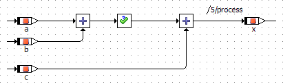

Variables a, b and c are implemented as sint8, x is implemented as sint16. The assertion interval is set as follows:

First, code is generated for an experimental target and the Implementation Experiment code generator. The assertion is generated as an assignment to a temporary variable (row 3 in the following table); this temporary variable is checked against the assertion interval (rows 5 - 8), and an experiment error (row 7) is issued if the assertion interval is violated.

The resulting C code reads as follows:

| Column 1 | Column 2 |
| --- | --- |
| 1 | void BDE_ASSERT_IMPL_process(void) |
| 2 | { |
| 3 | sint16 _t1sint16; |
| 4 | _t1sint16 = (sint16)BDE_ASSERT_IMPLinstance->a->val + BDE_ASSERT_IMPLinstance->b->val; |
| 5 | if ((_t1sint16 < 0) \|\| (_t1sint16 > 100)) |
| 6 | { |
| 7 | asdWriteUserError ("Run Time Error: Value %d outside interval [%d..%d] in component <BDE_Assert::Impl>\n", (real64)_t1sint16, 0.0, 100.0); |
| 8 | } |
| 9 | BDE_ASSERT_IMPLinstance->x->val = _t1sint16 + BDE_ASSERT_IMPLinstance->c->val; |
| 10 | } |

Next, code is generated for an ASCET-SE target and the Object Based Controller Implementation code generator. The assertion is not visible in the generated code, except for brackets and possibly suppressed optimizations.

The resulting C code reads as follows:

| Column 1 | Column 2 |
| --- | --- |
| 1 | void BDE_ASSERT_IMPL_process(void) |
| 2 | { |
| 3 | _x = (sint16)_a + _b + _c; |
| 4 | } |

See also

[Assert Operator](markdown/BDE_Assert_Operator.md)

[Using the Assert Operator](markdown/BDE_Use_AssertOperator.md)

---

## Control Flow Elements

_Source: `markdown/BDE_ControlFlow_Summary.md`_

# Control Flow Elements - Summary

The following control flow statements are available in block diagrams:

- [If…Then](markdown/BDE_ifthen.md)
- [If…Then…Else](markdown/ifthenelse.md)
- [Switch](markdown/BDE_switch.md)
- [While](markdown/BDE_while.md)
- [The Break Statement](markdown/the_break_statement.md)

All control flow except Break statements evaluate a logical expression and, depending on the result, activate a control flow branch which may contain several statements. The statements represented by sequence calls are connected to the control flow by connectors.

The Break statement can be used to exit immediately from each of the other control flow elements and return to another enclosing statement or to the remainder of the model.

The sequence number of the sequence call determines the order of the statements connected to the activated control flow branch.

---

## If...Then

_Source: `markdown/BDE_ifthen.md`_

# If...Then

The If…Then statement evaluates a logical expression and activates a control flow branch if the result is True. The control flow output is connected to one or more sequence calls which are triggered whenever the control flow branch is activated. Whenever the input expression evaluates to True, the connected sequence calls are executed.

The example above is equivalent to

if (l) {

c = b

};

As for the if…else statement in ESDL, the generated code is optimized when the expression for If…Then is always true. [If…Else (ESDL)](ESDLEditorEnglishUS.chm::/ifelse.htm) describes how the optimization works.

See also

[Using the If Statements](markdown/UseIf.md)

[If…Else (ESDL)](ESDLEditorEnglishUS.chm::/ifelse.htm)

---

## If...Then...Else

_Source: `markdown/ifthenelse.md`_

# If...Then...Else

If…Then…Else is similar to If…Then, but has two control flow branches. Depending on the value of the logical expression, the left or right branch is executed, the right branch is executed if the value is True, the left one if it is False.

The example above is equivalent to

if (l) {

d = b}

else {

c = b

};

As for the if…else statement in ESDL, the generated code is optimized when the expression for If…Then…Else is always true. [If…Else (ESDL)](ESDLEditorEnglishUS.chm::/ifelse.htm) describes how the optimization works.

See also

[Using the If Statements](markdown/UseIf.md)

[If…Else (ESDL)](ESDLEditorEnglishUS.chm::/ifelse.htm)

---

## Switch

_Source: `markdown/BDE_switch.md`_

# Switch

The Switch construct is similar to the [Case](markdown/BDE_case_operator.md) operator. A Switch evaluates a signed discrete or unsigned discrete value and, depending on that value, activates different control flow branches. These branches are separated from each other, so that a “fall through” like in the switch construct in C is not possible.

For each alternative the value for the branch can be defined by the user. The last branch at the bottom is the default branch that is executed if the input value does not equal any of the values at the branches.

The example above is equivalent to

switch (a) {

case 0: {

d = c;

break; }

case 5: {

d = b;

break; }

default: {

d = 0;

break; }

}

See also

[Using the Switch](markdown/UseSwitch.md)

[Case Operator](markdown/BDE_case_operator.md)

[Break Operator](markdown/the_break_statement.md)

---

## While

_Source: `markdown/BDE_while.md`_

# While

The only loop construct available in block diagrams is the While loop. Care has to be taken to avoid infinite loops or loops unsuitable for real-time applications.

Similarly to the If…Then statement, the control flow is activated when the value of the logical expression is True. The operation is executed as long as the value of the logical input remains True. Therefore, the value of the logical expression should be manipulated in the while loop.

In order to avoid infinite loops, the maximal number of loop iterations can be limited to a fixed number in the project properties, Experiment Code node, of the associated project (or default project).

The example above is equivalent to

while (i<5) {

c = b * c;

i = 1 + i;

};

See also

[Using the While Loop](markdown/Usewhileloop.md)

[Project Editor - Experiment Code Node](ProjectEditorEnglishUS.chm::/Exp_Code_Options_Window.htm)

---

## Break Operator

_Source: `markdown/the_break_statement.md`_

# Break Operator

The break operator in the block diagram editor behaves similar to a C language return statement.

In a method, the break operator causes an immediate return from the method. The user is responsible for the correct setting of any return values before the break operator is executed.

In a process, the break operator causes a deferred exit. Deferred exit means that all send messages are sent before the exit occurs.

The break operator in the block diagram editor behaves differently from the break statement in ESDL.

---

## Signature Editor

_Source: `markdown/bde_interface_editor.md`_

The signature editor for methods in classes and modules (block diagrams or ESDL) contains the following elements.

- [Argument](markdown/BDE_Arguments_Menu.md) menu
- [Return](markdown/BDE_Return_Menu.md) menu
- [Local Variable](markdown/BDE_Local_Variable_Menu.md) menu
- [Arguments](markdown/BDE_Arguments_Tab.md) tab
- [Return](markdown/bde_return_tab.md) tab
- [Locals](markdown/bde_locals_tab.md) tab
- [Settings Tab](markdown/BDE_SettingsTab.md)

See also

ESDL Editor online help (opens in a second help viewer window)

The signature editor for processes contains the following elements.

- [Local Variable](markdown/BDE_Local_Variable_Menu.md) menu
- [Locals](markdown/bde_locals_tab.md) tab
- [Settings Tab](markdown/BDE_SettingsTab.md)

See also

ESDL Editor online help (opens in a second help viewer window)

The signature editor for triggers in state machines contains the following elements.

- [Input](markdown/BDE_Arguments_Menu.md) menu
- [Inputs](markdown/BDE_Arguments_Tab.md) tab
- [Settings Tab](markdown/BDE_SettingsTab.md)

See also

State Machine Editor online help (opens in a second help viewer window)

The signature editor for actions and conditions in state machines contains the following elements.

- [Argument](markdown/BDE_Arguments_Menu.md) menu
- [Return](markdown/BDE_Return_Menu.md) menu
- [Local Variable](markdown/BDE_Local_Variable_Menu.md) menu
- [Arguments](markdown/BDE_Arguments_Tab.md) tab
- [Return](markdown/bde_return_tab.md) tab
- [Locals](markdown/bde_locals_tab.md) tab
- [Settings Tab](markdown/BDE_SettingsTab.md)

See also

State Machine Editor online help (opens in a second help viewer window)

The signature editor for methods in AUTOSAR software components contains the following elements.

- [Argument](markdown/BDE_Arguments_Menu.md) menu
- [Return](markdown/BDE_Return_Menu.md) menu
- [Local Variable](markdown/BDE_Local_Variable_Menu.md) menu
- [Arguments](markdown/BDE_Arguments_Tab.md) tab
- [Return](markdown/bde_return_tab.md) tab
- [Locals](markdown/bde_locals_tab.md) tab
- [Settings Tab](markdown/BDE_SettingsTab.md)

See also

Software Component Editor online help (opens in a second help viewer window)

The signature editor for methods (operations) in ClientServer interfaces contains the following elements.

- [Argument](markdown/BDE_Arguments_Menu.md) menu
- [Return](markdown/BDE_Return_Menu.md) menu
- [Arguments](markdown/BDE_Arguments_Tab.md) tab
- [Return](markdown/bde_return_tab.md) tab
- [Settings Tab](markdown/BDE_SettingsTab.md)

See also

AUTOSAR Interface Editor online help (opens in a second help viewer window)

# Signature Editor

The signature editor can be opened in various contexts. Depending on the context, the functionality the signature editor provides can differ.

##### [Signature editor for methods in classes and modules](javascript:kadovTextPopup(this))<!-- kadovTextPopupInit('a1'); //-->

##### [Signature editor for processes](javascript:kadovTextPopup(this))<!-- kadovTextPopupInit('a2'); //-->

##### [Signature editor for triggers in state machines](javascript:kadovTextPopup(this))<!-- kadovTextPopupInit('a5'); //-->

##### [Signature editor for actions and conditions in state machines](javascript:kadovTextPopup(this))<!-- kadovTextPopupInit('a6'); //-->

##### [Signature editor for methods in AUTOSAR software components](javascript:kadovTextPopup(this))<!-- kadovTextPopupInit('a3'); //-->

##### [Signature editor for methods (operations) in ClientServer interfaces](javascript:kadovTextPopup(this))<!-- kadovTextPopupInit('a4'); //-->

#####  All

 OK

Closes the signature editor and accepts the settings.

 Cancel

Closes the signature editor without accepting the settings.

/* Heikki Komulainen, Comet Computer GmbH 2004 */ cc_plus_pic = '&nbsp;'; cc_minus_pic = '&nbsp;'; cc_stat_pic = '&nbsp;'; gpstyle = ''; var iframes_created = 0; if (document.body && document.body.insertAdjacentHTML && document.getElementsByTagName && document.getElementById) { collect_popups(); set_poplinks_pictures(); if (iframes_created) { document.write(gpstyle); document.write('
<nobr><a id="einauslink" style="position:absolute;top:expression(document.body.scrollTop + this.offsetHeight - this.offsetHeight);left:expression(document.body.offsetWidth - (this.offsetWidth + 28));background:white;padding:5px" href="javascript:show_all_poptext()">Alle texte einblenden</a></nobr>
'); } } function collect_popups() { bsscpopups = new Array(); for (x = 0; x < document.links.length; x++) { if (document.links[x].href.indexOf("BSSCPopup")>-1) { seekmatch = /BSSCPopup.'[^'](markdown/+)'/; poplink = seekmatch.exec(document.links[x].href); poplink = "" + poplink; poplink = poplink.substring(poplink.indexOf("'")+1, poplink.lastIndexOf("'")); ifid = "CCGENIFRAMEID" + x; new_iframe = '<iframe id="' + ifid + '"src="' + poplink + '" onload="get_text(\'' + ifid + '\')" width="0" height="0" frameborder=0></iframe>'; document.links[x].parentNode.insertAdjacentHTML("afterEnd", new_iframe); gpid = "CCID_" + ifid; document.links[x].href = "javascript:expand_poptext('" + gpid + "')"; cc_plus = '' + cc_plus_pic + ''; document.links[x].insertAdjacentHTML("afterBegin", cc_plus); iframes_created = 1; } } }// end function function get_text(ifr_id) { frpars = document.frames[ifr_id].document.getElementsByTagName("body"); popbody = frpars[0].innerHTML; gpid = "CCID_" + ifr_id; if (!document.getElementById(gpid)) { //avoiding doubles document.getElementById(ifr_id).insertAdjacentHTML("afterEnd", '
'+popbody+'
'); } }//end function function expand_poptext(x_frame_id) { if (!document.getElementById(x_frame_id)) return; if (document.getElementById(x_frame_id).className == "CCGENPOPTEXTH") { document.getElementById(x_frame_id).className = "CCGENPOPTEXTV"; document.getElementById(x_frame_id).style.visibility = "visible"; if (document.getElementById("CCPMB_" + x_frame_id )) { document.getElementById("CCPMB_" + x_frame_id ).innerHTML = cc_minus_pic; } } else { document.getElementById(x_frame_id).className = "CCGENPOPTEXTH"; document.getElementById(x_frame_id).style.visibility = "hidden"; if (document.getElementById("CCPMB_" + x_frame_id )) { document.getElementById("CCPMB_" + x_frame_id ).innerHTML = cc_plus_pic; } } }// end function function show_all_poptext() { var pulldowntxt = document.getElementsByTagName("div"); for (b = 0; b < pulldowntxt.length; b++) { if (pulldowntxt[b].className == "droptext") { pulldowntxt[b].style.display=""; } } var gptxt = document.getElementsByTagName("div"); for (z = 0; z < gptxt.length; z++) { if (gptxt[z].className == "CCGENPOPTEXTH") { gptxt[z].className = "CCGENPOPTEXTV"; gptxt[z].style.visibility = "visible"; if (document.getElementById("CCPMB_" + gptxt[z].id )) { document.getElementById("CCPMB_" + gptxt[z].id ).innerHTML = cc_minus_pic; } } } var dxpoplinks = document.getElementsByTagName("a"); if (dxpoplinks) { for (pxl = 0; pxl < dxpoplinks.length; pxl++) { if (dxpoplinks[pxl].href.indexOf("kadovTextPopup")>-1) { if (document.getElementById("CCPMB_" + dxpoplinks[pxl].id)) { document.getElementById("CCPMB_" + dxpoplinks[pxl].id).innerHTML = cc_stat_pic; dxpoplinks[pxl].symbol = "minus"; } } } } document.getElementById('einauslink').innerText = 'Alle texte ausblenden'; document.getElementById('einauslink').href = "javascript:self.location.reload()"; self.focus(); }// end function function eat_click() { return false; }// end function function set_poplinks_pictures() { var dpoplinks = document.getElementsByTagName("a"); if (dpoplinks) { for (pl = 0; pl < dpoplinks.length; pl++) { if (dpoplinks[pl].href.indexOf("kadovTextPopup")>-1) { cc_plus = '' + cc_stat_pic + ''; //dpoplinks[pl].onmouseup = plusminuspoplink; dpoplinks[pl].insertAdjacentHTML("afterBegin", cc_plus); dpoplinks[pl].symbol = "plus"; } } } }// end function function plusminuspoplink() { if (document.getElementById("CCPMB_" + this.id)) { if (this.symbol == "plus") { document.getElementById("CCPMB_" + this.id).innerHTML = cc_minus_pic; this.symbol = "minus"; } else { document.getElementById("CCPMB_" + this.id).innerHTML = cc_plus_pic; this.symbol = "plus"; } } return true; }

---

## Arguments Menu

_Source: `markdown/BDE_Arguments_Menu.md`_

# Arguments Menu

Arguments are named Inputs in the signature editor for triggers in state machines.

This menu contains the following options.

Add

Adds a new argument of the type cont.

Rename

Renames the argument selected in the Arguments tab.

Delete

Deletes the argument selected in the Arguments tab.

Move Up

Moves the argument selected in the Arguments tab up.

Move Down

Moves the argument selected in the Arguments tab down.

Edit Max Size

Edits the maximum size of an array or matrix argument.

See also

[Signature Editor](markdown/bde_interface_editor.md)

[Arguments Tab](markdown/BDE_Arguments_Tab.md)

---

## Return Menu

_Source: `markdown/BDE_Return_Menu.md`_

# Return Menu

This menu contains the following options.

Edit Max Size

Edits the maximum size of a return value of type array or matrix.

See also

[Signature Editor](markdown/bde_interface_editor.md)

[Return Tab](markdown/bde_return_tab.md)

---

## Local Variable Menu

_Source: `markdown/BDE_Local_Variable_Menu.md`_

# Local Variable Menu

This menu contains the following options.

Add

Adds a new local variable of the type cont.

Rename

Renames the local variable selected in the Local Variable tab.

Delete

Deletes the local variable selected in the Local Variable tab.

Move Up

Moves the local variable selected in the Local Variable tab up.

Move Down

Moves the local variable selected in the Local Variable tab down.

Edit Max Size

Edits the maximum size of a local variable of type array or matrix.

See also

[Signature Editor](markdown/bde_interface_editor.md)

[Locals Tab](markdown/bde_locals_tab.md)

---

## Arguments Tab

_Source: `markdown/BDE_Arguments_Tab.md`_

- Default Value

Inserts the default minimum value for the selected type.

- Copy (Ctrl + c)

Copies the selected field content to the clipboard.

- Paste (Ctrl + v)

Inserts the clipboard content into the Min field.

- 0 (minimum for uint*)
- -2^7 (-128) (minimum for sint8)
- -2^15 (-32768) (minimum for sint16)
- -2^31 (-2147483648) (minimum for sint32)

Inserts the respective value.

- Default Value

Inserts the default maximum value for the selected type.

- Copy (Ctrl + c)

Copies the selected field content to the clipboard.

- Paste (Ctrl + v)

Inserts the clipboard content into the Min field.

- 2^7-1 (127) or 2^8-1 (255) (maximum for sint8 / uint8)
- 2^15-1 (32767) or 2^16-1 (65535) (maximum for sint16 / uint16)
- 2^31-1 (2147483647) or 2^32-1 (4294967295) (maximum for sint32 / uint32)

Inserts the respective value.

# Arguments Tab

Arguments are named Inputs in the signature editor for triggers in state machines.

This tab contains the following elements.

Arguments field

Lists all existing arguments with name and type.

-  Add

Adds a new argument of the type cont.

-  Del

Deletes the argument selected in the Arguments field.

Argument Properties field

- Argument Type combo box

Select the type of the argument selected in the Arguments field. Possible values are:

| Column 1 | Column 2 |
| --- | --- |
| <user defined> | component or enumeration as argument |
| <enumeration> | enumeration as argument |
| cont , sdisc , udisc , limitInt , wrapInt , log | scalar argument of the respective type |
| array[cont] , array[log] , array[sdisc] , array[udisc] , array[limitInt] , array[wrapInt] | array argument of the respective type |
| mat[cont] , mat[log], mat[sdisc] , mat[udisc] , mat[limitInt] , mat[wrapInt] | matrix argument of the respective type |

In the signature editor for methods (operations) in ClientServer interfaces, the available argument types are restricted: matrix arguments are not available, and only records can be used as component argument.

A state machine with a complex trigger argument cannot be stimulated in an experiment.

- Unit field

Enter the unit of the selected argument.

- Comment field

Enter a comment for the selected argument.

- Type combo box

Select a type for a [wrapInt](IntroductionEnglishUS.chm::/INT_ScalarTypes_WrapAroundInteger.htm) argument.

- Min and Max fields

Enter lower and upper limit for a [limitInt](IntroductionEnglishUS.chm::/INT_ScalarTypes_LimitedInteger.htm) or wrapInt argument.

For limitInt, the values in Min and Max must be representable in sint32 or uint32.

For wrapInt, the values in Min and Max must be representable in the selected Type.

- [context menu](javascript:kadovTextPopup(this))<!-- kadovTextPopupInit('a8'); //--> in the Min field
- [context menu](javascript:kadovTextPopup(this))<!-- kadovTextPopupInit('a9'); //--> in the Max field

- Direction combo box

Select the direction of the argument (see [Directions of Method Arguments](markdown/BDE_DirectionsMethodArguments.md)).

| Column 1 | Column 2 |
| --- | --- |
| In | The argument can be read in the method. |
| Out | The argument must be written in the method. |
| InOut | The argument can be read and written in the method. |

See also

[Directions of Method Arguments](markdown/BDE_DirectionsMethodArguments.md)

[Signature Editor](markdown/bde_interface_editor.md)

[Assigning a Component as an Argument](markdown/BDE_AssignComponent.md)

/* Heikki Komulainen, Comet Computer GmbH 2004 */ cc_plus_pic = '&nbsp;'; cc_minus_pic = '&nbsp;'; cc_stat_pic = '&nbsp;'; gpstyle = ''; var iframes_created = 0; if (document.body && document.body.insertAdjacentHTML && document.getElementsByTagName && document.getElementById) { collect_popups(); set_poplinks_pictures(); if (iframes_created) { document.write(gpstyle); document.write('
<nobr><a id="einauslink" style="position:absolute;top:expression(document.body.scrollTop + this.offsetHeight - this.offsetHeight);left:expression(document.body.offsetWidth - (this.offsetWidth + 28));background:white;padding:5px" href="javascript:show_all_poptext()">Show all hidden text</a></nobr>
'); } } function collect_popups() { bsscpopups = new Array(); for (x = 0; x < document.links.length; x++) { if (document.links[x].href.indexOf("BSSCPopup")>-1) { seekmatch = /BSSCPopup.'[^'](markdown/+)'/; poplink = seekmatch.exec(document.links[x].href); poplink = "" + poplink; poplink = poplink.substring(poplink.indexOf("'")+1, poplink.lastIndexOf("'")); ifid = "CCGENIFRAMEID" + x; new_iframe = '<iframe id="' + ifid + '"src="' + poplink + '" onload="get_text(\'' + ifid + '\')" width="0" height="0" frameborder=0></iframe>'; document.links[x].parentNode.insertAdjacentHTML("afterEnd", new_iframe); gpid = "CCID_" + ifid; document.links[x].href = "javascript:expand_poptext('" + gpid + "')"; cc_plus = '' + cc_plus_pic + ''; document.links[x].insertAdjacentHTML("afterBegin", cc_plus); iframes_created = 1; } } }// end function function get_text(ifr_id) { frpars = document.frames[ifr_id].document.getElementsByTagName("body"); popbody = frpars[0].innerHTML; gpid = "CCID_" + ifr_id; if (!document.getElementById(gpid)) { //avoiding doubles document.getElementById(ifr_id).insertAdjacentHTML("afterEnd", '
'+popbody+'
'); } }//end function function expand_poptext(x_frame_id) { if (!document.getElementById(x_frame_id)) return; if (document.getElementById(x_frame_id).className == "CCGENPOPTEXTH") { document.getElementById(x_frame_id).className = "CCGENPOPTEXTV"; document.getElementById(x_frame_id).style.visibility = "visible"; if (document.getElementById("CCPMB_" + x_frame_id )) { document.getElementById("CCPMB_" + x_frame_id ).innerHTML = cc_minus_pic; } } else { document.getElementById(x_frame_id).className = "CCGENPOPTEXTH"; document.getElementById(x_frame_id).style.visibility = "hidden"; if (document.getElementById("CCPMB_" + x_frame_id )) { document.getElementById("CCPMB_" + x_frame_id ).innerHTML = cc_plus_pic; } } }// end function function show_all_poptext() { var pulldowntxt = document.getElementsByTagName("div"); for (b = 0; b < pulldowntxt.length; b++) { if (pulldowntxt[b].className == "droptext") { pulldowntxt[b].style.display=""; } } var gptxt = document.getElementsByTagName("div"); for (z = 0; z < gptxt.length; z++) { if (gptxt[z].className == "CCGENPOPTEXTH") { gptxt[z].className = "CCGENPOPTEXTV"; gptxt[z].style.visibility = "visible"; if (document.getElementById("CCPMB_" + gptxt[z].id )) { document.getElementById("CCPMB_" + gptxt[z].id ).innerHTML = cc_minus_pic; } } } var dxpoplinks = document.getElementsByTagName("a"); if (dxpoplinks) { for (pxl = 0; pxl < dxpoplinks.length; pxl++) { if (dxpoplinks[pxl].href.indexOf("kadovTextPopup")>-1) { if (document.getElementById("CCPMB_" + dxpoplinks[pxl].id)) { document.getElementById("CCPMB_" + dxpoplinks[pxl].id).innerHTML = cc_stat_pic; dxpoplinks[pxl].symbol = "minus"; } } } } document.getElementById('einauslink').innerText = 'Hide all hideable text'; document.getElementById('einauslink').href = "javascript:self.location.reload()"; self.focus(); }// end function function eat_click() { return false; }// end function function set_poplinks_pictures() { var dpoplinks = document.getElementsByTagName("a"); if (dpoplinks) { for (pl = 0; pl < dpoplinks.length; pl++) { if (dpoplinks[pl].href.indexOf("kadovTextPopup")>-1) { cc_plus = '' + cc_stat_pic + ''; //dpoplinks[pl].onmouseup = plusminuspoplink; dpoplinks[pl].insertAdjacentHTML("afterBegin", cc_plus); dpoplinks[pl].symbol = "plus"; } } } }// end function function plusminuspoplink() { if (document.getElementById("CCPMB_" + this.id)) { if (this.symbol == "plus") { document.getElementById("CCPMB_" + this.id).innerHTML = cc_minus_pic; this.symbol = "minus"; } else { document.getElementById("CCPMB_" + this.id).innerHTML = cc_plus_pic; this.symbol = "plus"; } } return true; }

---

## Return Tab

_Source: `markdown/bde_return_tab.md`_

- Default Value

Inserts the default minimum value for the selected type.

- Copy (Ctrl + c)

Copies the selected field content to the clipboard.

- Paste (Ctrl + v)

Inserts the clipboard content into the Min field.

- 0 (minimum for uint*)
- -2^7 (-128) (minimum for sint8)
- -2^15 (-32768) (minimum for sint16)
- -2^31 (-2147483648) (minimum for sint32)

Inserts the respective value.

- Default Value

Inserts the default maximum value for the selected type.

- Copy (Ctrl + c)

Copies the selected field content to the clipboard.

- Paste (Ctrl + v)

Inserts the clipboard content into the Min field.

- 2^7-1 (127) or 2^8-1 (255) (maximum for sint8 / uint8)
- 2^15-1 (32767) or 2^16-1 (65535) (maximum for sint16 / uint16)
- 2^31-1 (2147483647) or 2^32-1 (4294967295) (maximum for sint32 / uint32)

Inserts the respective value.

# Return Tab

In the signature editor for methods (operations) in ClientServer interfaces, the possibilities of the Return tab are restricted: The Return Value cannot be deactivated, and it must be of type enumeration.

This tab contains the following elements.

Return Value option

Switches the return value on/off.

The following elements are only available when Return Value is activated.

Return Type combo box

Select the type of the return value. Possible values are:

| Column 1 | Column 2 |
| --- | --- |
| <user defined> | component or enumeration as return value |
| <enumeration> | enumeration as return value |
| cont , sdisc , udisc , limitInt , wrapInt , log | scalar return value of the respective type |
| array[cont] , array[log] , array[sdisc] , array[udisc] , array[limitInt] , array[wrapInt] | array return value of the respective type |
| mat[cont] , mat[log], mat[sdisc] , mat[udisc] , mat[limitInt] , mat[wrapInt] | matrix return value of the respective type |

Unit field

Enter the unit of the return value.

Comment field

Enter a comment for the return value.

Type combo box

Select a type for a [wrapInt](IntroductionEnglishUS.chm::/INT_ScalarTypes_WrapAroundInteger.htm) return value.

Min and Max fields

Enter lower and upper limit for a [limitInt](IntroductionEnglishUS.chm::/INT_ScalarTypes_LimitedInteger.htm) or wrapInt return value.

For limitInt, the values in Min and Max must be representable in sint32 or uint32.

For wrapInt, the values in Min and Max must be representable in the selected Type.

- [context menu](javascript:kadovTextPopup(this))<!-- kadovTextPopupInit('a8'); //--> in the Min field

- [context menu](javascript:kadovTextPopup(this))<!-- kadovTextPopupInit('a9'); //--> in the Max field

The following options are available for explicit references (i.e. arrays, matrices, or components). It is not possible to disable both options at the same time.

Read for Referenced Element option

If this option is active, the internal access to the referenced element is set to Read.

Write for Referenced Element option

If this option is active, the internal access to the referenced element is set to Write.

See also

[Signature Editor](markdown/bde_interface_editor.md)

/* Heikki Komulainen, Comet Computer GmbH 2004 */ cc_plus_pic = '&nbsp;'; cc_minus_pic = '&nbsp;'; cc_stat_pic = '&nbsp;'; gpstyle = ''; var iframes_created = 0; if (document.body && document.body.insertAdjacentHTML && document.getElementsByTagName && document.getElementById) { collect_popups(); set_poplinks_pictures(); if (iframes_created) { document.write(gpstyle); document.write('
<nobr><a id="einauslink" style="position:absolute;top:expression(document.body.scrollTop + this.offsetHeight - this.offsetHeight);left:expression(document.body.offsetWidth - (this.offsetWidth + 28));background:white;padding:5px" href="javascript:show_all_poptext()">Show all hidden text</a></nobr>
'); } } function collect_popups() { bsscpopups = new Array(); for (x = 0; x < document.links.length; x++) { if (document.links[x].href.indexOf("BSSCPopup")>-1) { seekmatch = /BSSCPopup.'[^'](markdown/+)'/; poplink = seekmatch.exec(document.links[x].href); poplink = "" + poplink; poplink = poplink.substring(poplink.indexOf("'")+1, poplink.lastIndexOf("'")); ifid = "CCGENIFRAMEID" + x; new_iframe = '<iframe id="' + ifid + '"src="' + poplink + '" onload="get_text(\'' + ifid + '\')" width="0" height="0" frameborder=0></iframe>'; document.links[x].parentNode.insertAdjacentHTML("afterEnd", new_iframe); gpid = "CCID_" + ifid; document.links[x].href = "javascript:expand_poptext('" + gpid + "')"; cc_plus = '' + cc_plus_pic + ''; document.links[x].insertAdjacentHTML("afterBegin", cc_plus); iframes_created = 1; } } }// end function function get_text(ifr_id) { frpars = document.frames[ifr_id].document.getElementsByTagName("body"); popbody = frpars[0].innerHTML; gpid = "CCID_" + ifr_id; if (!document.getElementById(gpid)) { //avoiding doubles document.getElementById(ifr_id).insertAdjacentHTML("afterEnd", '
'+popbody+'
'); } }//end function function expand_poptext(x_frame_id) { if (!document.getElementById(x_frame_id)) return; if (document.getElementById(x_frame_id).className == "CCGENPOPTEXTH") { document.getElementById(x_frame_id).className = "CCGENPOPTEXTV"; document.getElementById(x_frame_id).style.visibility = "visible"; if (document.getElementById("CCPMB_" + x_frame_id )) { document.getElementById("CCPMB_" + x_frame_id ).innerHTML = cc_minus_pic; } } else { document.getElementById(x_frame_id).className = "CCGENPOPTEXTH"; document.getElementById(x_frame_id).style.visibility = "hidden"; if (document.getElementById("CCPMB_" + x_frame_id )) { document.getElementById("CCPMB_" + x_frame_id ).innerHTML = cc_plus_pic; } } }// end function function show_all_poptext() { var pulldowntxt = document.getElementsByTagName("div"); for (b = 0; b < pulldowntxt.length; b++) { if (pulldowntxt[b].className == "droptext") { pulldowntxt[b].style.display=""; } } var gptxt = document.getElementsByTagName("div"); for (z = 0; z < gptxt.length; z++) { if (gptxt[z].className == "CCGENPOPTEXTH") { gptxt[z].className = "CCGENPOPTEXTV"; gptxt[z].style.visibility = "visible"; if (document.getElementById("CCPMB_" + gptxt[z].id )) { document.getElementById("CCPMB_" + gptxt[z].id ).innerHTML = cc_minus_pic; } } } var dxpoplinks = document.getElementsByTagName("a"); if (dxpoplinks) { for (pxl = 0; pxl < dxpoplinks.length; pxl++) { if (dxpoplinks[pxl].href.indexOf("kadovTextPopup")>-1) { if (document.getElementById("CCPMB_" + dxpoplinks[pxl].id)) { document.getElementById("CCPMB_" + dxpoplinks[pxl].id).innerHTML = cc_stat_pic; dxpoplinks[pxl].symbol = "minus"; } } } } document.getElementById('einauslink').innerText = 'Hide all hideable text'; document.getElementById('einauslink').href = "javascript:self.location.reload()"; self.focus(); }// end function function eat_click() { return false; }// end function function set_poplinks_pictures() { var dpoplinks = document.getElementsByTagName("a"); if (dpoplinks) { for (pl = 0; pl < dpoplinks.length; pl++) { if (dpoplinks[pl].href.indexOf("kadovTextPopup")>-1) { cc_plus = '' + cc_stat_pic + ''; //dpoplinks[pl].onmouseup = plusminuspoplink; dpoplinks[pl].insertAdjacentHTML("afterBegin", cc_plus); dpoplinks[pl].symbol = "plus"; } } } }// end function function plusminuspoplink() { if (document.getElementById("CCPMB_" + this.id)) { if (this.symbol == "plus") { document.getElementById("CCPMB_" + this.id).innerHTML = cc_minus_pic; this.symbol = "minus"; } else { document.getElementById("CCPMB_" + this.id).innerHTML = cc_plus_pic; this.symbol = "plus"; } } return true; }

---

## Locals Tab

_Source: `markdown/bde_locals_tab.md`_

- Default Value

Inserts the default minimum value for the selected type.

- Copy (Ctrl + c)

Copies the selected field content to the clipboard.

- Paste (Ctrl + v)

Inserts the clipboard content into the Min field.

- 0 (minimum for uint*)
- -2^7 (-128) (minimum for sint8)
- -2^15 (-32768) (minimum for sint16)
- -2^31 (-2147483648) (minimum for sint32)

Inserts the respective value.

- Default Value

Inserts the default maximum value for the selected type.

- Copy (Ctrl + c)

Copies the selected field content to the clipboard.

- Paste (Ctrl + v)

Inserts the clipboard content into the Min field.

- 2^7-1 (127) or 2^8-1 (255) (maximum for sint8 / uint8)
- 2^15-1 (32767) or 2^16-1 (65535) (maximum for sint16 / uint16)
- 2^31-1 (2147483647) or 2^32-1 (4294967295) (maximum for sint32 / uint32)

Inserts the respective value.

# Locals Tab

This tab contains the following elements.

Local Variables field

Lists all existing local variables with name and type.

 Add local variable

Adds a new local variable of the type cont.

 Delete selected local variable

Deletes the local variable selected in the Local Variables field.

Local Variable Type combo box

Select the type of the local variable selected in the Local Variables field. Possible values are:

| Column 1 | Column 2 |
| --- | --- |
| <user defined> | local variable of component or enumeration type |
| <enumeration> | local variable of enumeration type |
| cont , sdisc , udisc , limitInt , wrapInt , log | scalar local variable of the respective type |
| array[cont] , array[log] , array[sdisc] , array[udisc] , array[limitInt] , array[wrapInt] | array local variable of the respective type |
| mat[cont] , mat[log], mat[sdisc] , mat[udisc] , mat[limitInt] , mat[wrapInt] | matrix local variable of the respective type |

Unit field

Enter the unit of the selected local variable.

Comment field

Enter a comment for the selected local variable.

Type combo box

Select a type for a [wrapInt](IntroductionEnglishUS.chm::/INT_ScalarTypes_WrapAroundInteger.htm) local variable.

Min and Max fields

Enter lower and upper limit for a [limitInt](IntroductionEnglishUS.chm::/INT_ScalarTypes_LimitedInteger.htm) or wrapInt local variable.

For limitInt, the values in Min and Max must be representable in sint32 or uint32.

For wrapInt, the values in Min and Max must be representable in the selected Type.

- [context menu](javascript:kadovTextPopup(this))<!-- kadovTextPopupInit('a8'); //--> in the Min field
- [context menu](javascript:kadovTextPopup(this))<!-- kadovTextPopupInit('a9'); //--> in the Max field

Reference option

Only available for local variables of array, matrix and record type.

This option determines if the local variable is an explicit reference.

If this option is deactivated, you can export the model only in AMD format V6.4.0 or higher. An export to AMD format V6.3.* or older will result in an export error.

Read for Referenced Element option

Only available for explicit references (i.e. arrays/matrices/records with activated Reference option, or components). It is not possible to disable both * for Referenced Element options at the same time.

If this option is active, the internal access to the referenced element is set to Read.

Write for Referenced Element option

Only available for explicit references (i.e. arrays/matrices/records with activated Reference option, or components). It is not possible to disable both * for Referenced Element options at the same time.

If this option is active, the internal access to the referenced element is set to Write.

See also

[Signature Editor](markdown/bde_interface_editor.md)

/* Heikki Komulainen, Comet Computer GmbH 2004 */ cc_plus_pic = '&nbsp;'; cc_minus_pic = '&nbsp;'; cc_stat_pic = '&nbsp;'; gpstyle = ''; var iframes_created = 0; if (document.body && document.body.insertAdjacentHTML && document.getElementsByTagName && document.getElementById) { collect_popups(); set_poplinks_pictures(); if (iframes_created) { document.write(gpstyle); document.write('
<nobr><a id="einauslink" style="position:absolute;top:expression(document.body.scrollTop + this.offsetHeight - this.offsetHeight);left:expression(document.body.offsetWidth - (this.offsetWidth + 28));background:white;padding:5px" href="javascript:show_all_poptext()">Show all hidden text</a></nobr>
'); } } function collect_popups() { bsscpopups = new Array(); for (x = 0; x < document.links.length; x++) { if (document.links[x].href.indexOf("BSSCPopup")>-1) { seekmatch = /BSSCPopup.'[^'](markdown/+)'/; poplink = seekmatch.exec(document.links[x].href); poplink = "" + poplink; poplink = poplink.substring(poplink.indexOf("'")+1, poplink.lastIndexOf("'")); ifid = "CCGENIFRAMEID" + x; new_iframe = '<iframe id="' + ifid + '"src="' + poplink + '" onload="get_text(\'' + ifid + '\')" width="0" height="0" frameborder=0></iframe>'; document.links[x].parentNode.insertAdjacentHTML("afterEnd", new_iframe); gpid = "CCID_" + ifid; document.links[x].href = "javascript:expand_poptext('" + gpid + "')"; cc_plus = '' + cc_plus_pic + ''; document.links[x].insertAdjacentHTML("afterBegin", cc_plus); iframes_created = 1; } } }// end function function get_text(ifr_id) { frpars = document.frames[ifr_id].document.getElementsByTagName("body"); popbody = frpars[0].innerHTML; gpid = "CCID_" + ifr_id; if (!document.getElementById(gpid)) { //avoiding doubles document.getElementById(ifr_id).insertAdjacentHTML("afterEnd", '
'+popbody+'
'); } }//end function function expand_poptext(x_frame_id) { if (!document.getElementById(x_frame_id)) return; if (document.getElementById(x_frame_id).className == "CCGENPOPTEXTH") { document.getElementById(x_frame_id).className = "CCGENPOPTEXTV"; document.getElementById(x_frame_id).style.visibility = "visible"; if (document.getElementById("CCPMB_" + x_frame_id )) { document.getElementById("CCPMB_" + x_frame_id ).innerHTML = cc_minus_pic; } } else { document.getElementById(x_frame_id).className = "CCGENPOPTEXTH"; document.getElementById(x_frame_id).style.visibility = "hidden"; if (document.getElementById("CCPMB_" + x_frame_id )) { document.getElementById("CCPMB_" + x_frame_id ).innerHTML = cc_plus_pic; } } }// end function function show_all_poptext() { var pulldowntxt = document.getElementsByTagName("div"); for (b = 0; b < pulldowntxt.length; b++) { if (pulldowntxt[b].className == "droptext") { pulldowntxt[b].style.display=""; } } var gptxt = document.getElementsByTagName("div"); for (z = 0; z < gptxt.length; z++) { if (gptxt[z].className == "CCGENPOPTEXTH") { gptxt[z].className = "CCGENPOPTEXTV"; gptxt[z].style.visibility = "visible"; if (document.getElementById("CCPMB_" + gptxt[z].id )) { document.getElementById("CCPMB_" + gptxt[z].id ).innerHTML = cc_minus_pic; } } } var dxpoplinks = document.getElementsByTagName("a"); if (dxpoplinks) { for (pxl = 0; pxl < dxpoplinks.length; pxl++) { if (dxpoplinks[pxl].href.indexOf("kadovTextPopup")>-1) { if (document.getElementById("CCPMB_" + dxpoplinks[pxl].id)) { document.getElementById("CCPMB_" + dxpoplinks[pxl].id).innerHTML = cc_stat_pic; dxpoplinks[pxl].symbol = "minus"; } } } } document.getElementById('einauslink').innerText = 'Hide all hideable text'; document.getElementById('einauslink').href = "javascript:self.location.reload()"; self.focus(); }// end function function eat_click() { return false; }// end function function set_poplinks_pictures() { var dpoplinks = document.getElementsByTagName("a"); if (dpoplinks) { for (pl = 0; pl < dpoplinks.length; pl++) { if (dpoplinks[pl].href.indexOf("kadovTextPopup")>-1) { cc_plus = '' + cc_stat_pic + ''; //dpoplinks[pl].onmouseup = plusminuspoplink; dpoplinks[pl].insertAdjacentHTML("afterBegin", cc_plus); dpoplinks[pl].symbol = "plus"; } } } }// end function function plusminuspoplink() { if (document.getElementById("CCPMB_" + this.id)) { if (this.symbol == "plus") { document.getElementById("CCPMB_" + this.id).innerHTML = cc_minus_pic; this.symbol = "minus"; } else { document.getElementById("CCPMB_" + this.id).innerHTML = cc_plus_pic; this.symbol = "plus"; } } return true; }

---

## Settings Tab

_Source: `markdown/BDE_SettingsTab.md`_

# Settings Tab

This tab contains the following elements.

Reinitialize option

Only present for triggers, actions, conditions and methods in state machines.

If activated, the method is defined as reinitialization method for state variables. See also [Specifying a Reinitialization Method for State Variables](StateMachineEditorEnglishUS.chm::/SM_SpecifyResetMethod_StateVariables.htm)

Side Effect Free option

Only available for methods. Not available for triggers in state machines.

If activated, the code generator will check that this method is free of side effects, i.e. that it does not change data in memory.

Default: deactivated

See also

[Signature Editor](markdown/bde_interface_editor.md)

[Specifying a Reinitialization Method for State Variables](StateMachineEditorEnglishUS.chm::/SM_SpecifyResetMethod_StateVariables.htm)

---

## Max and Variant Size for Dialog Window

_Source: `markdown/bde_maxvariantsize_window.md`_

[Adding an Argument to the Method](markdown/Addargument.md)

[Adding a Return Value to the Method](markdown/Returnvalue.md)

[Adding Local Variables to the Method or Process](markdown/BDE_Localvariables.md)

[Adding an Argument to a Method](AtomicSoftwareComponentEditorEnglishUS.chm::/ascaddargument.htm)

[Adding a Return Value to a Method](AtomicSoftwareComponentEditorEnglishUS.chm::/ascaddreturnvalue.htm)

[Adding Local Variables to a Runnable or Method](AtomicSoftwareComponentEditorEnglishUS.chm::/ASCaddLocalvariables.htm)

# Max and Variant Size for Dialog Window

This dialog window can be opened from the signature editor, with the Edit Max Size menu or context menu option.

This window contains the following elements:

- Max Size x field

Input field for the maximum size of an array or the maximum x size of a matrix.

- Max Size y field

Input field for the maximum y size of a matrix.

- Variant Size x combo box

Allows to select a system constant (for variant size) or a * (for variable size) to determine the size of an array or the x size of a matrix.

- Variant Size y combo box

Allows to select a system constant or a * to determine the y size of a matrix.

-  OK

Closes the window and accepts the settings.

-  Cancel

Closes the window and discards the settings.

See also

[Introduction - Variant Size for Arrays and Matrices](IntroductionEnglishUS.chm::/INT_VariantSize_ArraysMatrices.htm)

[Introduction - Variable Size for Arrays and Matrices](IntroductionEnglishUS.chm::/INT_VariableSize_ArraysMatrices.htm)

[Block Diagram Editor links](javascript:kadovTextPopup(this))<!-- kadovTextPopupInit('a1'); //-->

[Software Component Editor links](javascript:kadovTextPopup(this))<!-- kadovTextPopupInit('a2'); //-->

/* Heikki Komulainen, Comet Computer GmbH 2004 */ cc_plus_pic = '&nbsp;'; cc_minus_pic = '&nbsp;'; cc_stat_pic = '&nbsp;'; gpstyle = ''; var iframes_created = 0; if (document.body && document.body.insertAdjacentHTML && document.getElementsByTagName && document.getElementById) { collect_popups(); set_poplinks_pictures(); if (iframes_created) { document.write(gpstyle); document.write('
<nobr><a id="einauslink" style="position:absolute;top:expression(document.body.scrollTop + this.offsetHeight - this.offsetHeight);left:expression(document.body.offsetWidth - (this.offsetWidth + 28));background:white;padding:5px" href="javascript:show_all_poptext()">Show all hidden text</a></nobr>
'); } } function collect_popups() { bsscpopups = new Array(); for (x = 0; x < document.links.length; x++) { if (document.links[x].href.indexOf("BSSCPopup")>-1) { seekmatch = /BSSCPopup.'[^'](markdown/+)'/; poplink = seekmatch.exec(document.links[x].href); poplink = "" + poplink; poplink = poplink.substring(poplink.indexOf("'")+1, poplink.lastIndexOf("'")); ifid = "CCGENIFRAMEID" + x; new_iframe = '<iframe id="' + ifid + '"src="' + poplink + '" onload="get_text(\'' + ifid + '\')" width="0" height="0" frameborder=0></iframe>'; document.links[x].parentNode.insertAdjacentHTML("afterEnd", new_iframe); gpid = "CCID_" + ifid; document.links[x].href = "javascript:expand_poptext('" + gpid + "')"; cc_plus = '' + cc_plus_pic + ''; document.links[x].insertAdjacentHTML("afterBegin", cc_plus); iframes_created = 1; } } }// end function function get_text(ifr_id) { frpars = document.frames[ifr_id].document.getElementsByTagName("body"); popbody = frpars[0].innerHTML; gpid = "CCID_" + ifr_id; if (!document.getElementById(gpid)) { //avoiding doubles document.getElementById(ifr_id).insertAdjacentHTML("afterEnd", '
'+popbody+'
'); } }//end function function expand_poptext(x_frame_id) { if (!document.getElementById(x_frame_id)) return; if (document.getElementById(x_frame_id).className == "CCGENPOPTEXTH") { document.getElementById(x_frame_id).className = "CCGENPOPTEXTV"; document.getElementById(x_frame_id).style.visibility = "visible"; if (document.getElementById("CCPMB_" + x_frame_id )) { document.getElementById("CCPMB_" + x_frame_id ).innerHTML = cc_minus_pic; } } else { document.getElementById(x_frame_id).className = "CCGENPOPTEXTH"; document.getElementById(x_frame_id).style.visibility = "hidden"; if (document.getElementById("CCPMB_" + x_frame_id )) { document.getElementById("CCPMB_" + x_frame_id ).innerHTML = cc_plus_pic; } } }// end function function show_all_poptext() { var pulldowntxt = document.getElementsByTagName("div"); for (b = 0; b < pulldowntxt.length; b++) { if (pulldowntxt[b].className == "droptext") { pulldowntxt[b].style.display=""; } } var gptxt = document.getElementsByTagName("div"); for (z = 0; z < gptxt.length; z++) { if (gptxt[z].className == "CCGENPOPTEXTH") { gptxt[z].className = "CCGENPOPTEXTV"; gptxt[z].style.visibility = "visible"; if (document.getElementById("CCPMB_" + gptxt[z].id )) { document.getElementById("CCPMB_" + gptxt[z].id ).innerHTML = cc_minus_pic; } } } var dxpoplinks = document.getElementsByTagName("a"); if (dxpoplinks) { for (pxl = 0; pxl < dxpoplinks.length; pxl++) { if (dxpoplinks[pxl].href.indexOf("kadovTextPopup")>-1) { if (document.getElementById("CCPMB_" + dxpoplinks[pxl].id)) { document.getElementById("CCPMB_" + dxpoplinks[pxl].id).innerHTML = cc_stat_pic; dxpoplinks[pxl].symbol = "minus"; } } } } document.getElementById('einauslink').innerText = 'Hide all hideable text'; document.getElementById('einauslink').href = "javascript:self.location.reload()"; self.focus(); }// end function function eat_click() { return false; }// end function function set_poplinks_pictures() { var dpoplinks = document.getElementsByTagName("a"); if (dpoplinks) { for (pl = 0; pl < dpoplinks.length; pl++) { if (dpoplinks[pl].href.indexOf("kadovTextPopup")>-1) { cc_plus = '' + cc_stat_pic + ''; //dpoplinks[pl].onmouseup = plusminuspoplink; dpoplinks[pl].insertAdjacentHTML("afterBegin", cc_plus); dpoplinks[pl].symbol = "plus"; } } } }// end function function plusminuspoplink() { if (document.getElementById("CCPMB_" + this.id)) { if (this.symbol == "plus") { document.getElementById("CCPMB_" + this.id).innerHTML = cc_minus_pic; this.symbol = "minus"; } else { document.getElementById("CCPMB_" + this.id).innerHTML = cc_plus_pic; this.symbol = "plus"; } } return true; }

---

## Assert Attributes Dialog Window

_Source: `markdown/BDE_AssertAttributes_Window.md`_

- Default Value

Inserts the default minimum value for the selected type.

- Copy (Ctrl + c)

Copies the selected field content to the clipboard.

- Paste (Ctrl + v)

Inserts the clipboard content into the Min field.

- 0 (minimum for uint*)
- -2^7 (-128) (minimum for sint8)
- -2^15 (-32768) (minimum for sint16)
- -2^31 (-2147483648) (minimum for sint32)

Inserts the respective value.

- Default Value

Inserts the default maximum value for the selected type.

- Copy (Ctrl + c)

Copies the selected field content to the clipboard.

- Paste (Ctrl + v)

Inserts the clipboard content into the Min field.

- 2^7-1 (127) or 2^8-1 (255) (maximum for sint8 / uint8)
- 2^15-1 (32767) or 2^16-1 (65535) (maximum for sint16 / uint16)
- 2^31-1 (2147483647) or 2^32-1 (4294967295) (maximum for sint32 / uint32)

Inserts the respective value.

# Assert Attributes Dialog Window

This window is opened with the Assert menu option in the context menu of an [assert operator](markdown/BDE_Assert_Operator.md).

This window contains the following elements:

- Min field

Lower limit of the interval.

- [context menu](javascript:kadovTextPopup(this))<!-- kadovTextPopupInit('a1'); //--> in the Min field

- Max field

Upper limit of the interval.

- [context menu](javascript:kadovTextPopup(this))<!-- kadovTextPopupInit('a2'); //--> in the Max field

See also

[Assert Operator](markdown/BDE_Assert_Operator.md) (block diagrams)

[Assert Operator](AtomicSoftwareComponentEditorEnglishUS.chm::/asc_assertoperator.htm) (AUTOSAR SWC)

/* Heikki Komulainen, Comet Computer GmbH 2004 */ cc_plus_pic = '&nbsp;'; cc_minus_pic = '&nbsp;'; cc_stat_pic = '&nbsp;'; gpstyle = ''; var iframes_created = 0; if (document.body && document.body.insertAdjacentHTML && document.getElementsByTagName && document.getElementById) { collect_popups(); set_poplinks_pictures(); if (iframes_created) { document.write(gpstyle); document.write('
<nobr><a id="einauslink" style="position:absolute;top:expression(document.body.scrollTop + this.offsetHeight - this.offsetHeight);left:expression(document.body.offsetWidth - (this.offsetWidth + 28));background:white;padding:5px" href="javascript:show_all_poptext()">Show all hidden text</a></nobr>
'); } } function collect_popups() { bsscpopups = new Array(); for (x = 0; x < document.links.length; x++) { if (document.links[x].href.indexOf("BSSCPopup")>-1) { seekmatch = /BSSCPopup.'[^'](markdown/+)'/; poplink = seekmatch.exec(document.links[x].href); poplink = "" + poplink; poplink = poplink.substring(poplink.indexOf("'")+1, poplink.lastIndexOf("'")); ifid = "CCGENIFRAMEID" + x; new_iframe = '<iframe id="' + ifid + '"src="' + poplink + '" onload="get_text(\'' + ifid + '\')" width="0" height="0" frameborder=0></iframe>'; document.links[x].parentNode.insertAdjacentHTML("afterEnd", new_iframe); gpid = "CCID_" + ifid; document.links[x].href = "javascript:expand_poptext('" + gpid + "')"; cc_plus = '' + cc_plus_pic + ''; document.links[x].insertAdjacentHTML("afterBegin", cc_plus); iframes_created = 1; } } }// end function function get_text(ifr_id) { frpars = document.frames[ifr_id].document.getElementsByTagName("body"); popbody = frpars[0].innerHTML; gpid = "CCID_" + ifr_id; if (!document.getElementById(gpid)) { //avoiding doubles document.getElementById(ifr_id).insertAdjacentHTML("afterEnd", '
'+popbody+'
'); } }//end function function expand_poptext(x_frame_id) { if (!document.getElementById(x_frame_id)) return; if (document.getElementById(x_frame_id).className == "CCGENPOPTEXTH") { document.getElementById(x_frame_id).className = "CCGENPOPTEXTV"; document.getElementById(x_frame_id).style.visibility = "visible"; if (document.getElementById("CCPMB_" + x_frame_id )) { document.getElementById("CCPMB_" + x_frame_id ).innerHTML = cc_minus_pic; } } else { document.getElementById(x_frame_id).className = "CCGENPOPTEXTH"; document.getElementById(x_frame_id).style.visibility = "hidden"; if (document.getElementById("CCPMB_" + x_frame_id )) { document.getElementById("CCPMB_" + x_frame_id ).innerHTML = cc_plus_pic; } } }// end function function show_all_poptext() { var pulldowntxt = document.getElementsByTagName("div"); for (b = 0; b < pulldowntxt.length; b++) { if (pulldowntxt[b].className == "droptext") { pulldowntxt[b].style.display=""; } } var gptxt = document.getElementsByTagName("div"); for (z = 0; z < gptxt.length; z++) { if (gptxt[z].className == "CCGENPOPTEXTH") { gptxt[z].className = "CCGENPOPTEXTV"; gptxt[z].style.visibility = "visible"; if (document.getElementById("CCPMB_" + gptxt[z].id )) { document.getElementById("CCPMB_" + gptxt[z].id ).innerHTML = cc_minus_pic; } } } var dxpoplinks = document.getElementsByTagName("a"); if (dxpoplinks) { for (pxl = 0; pxl < dxpoplinks.length; pxl++) { if (dxpoplinks[pxl].href.indexOf("kadovTextPopup")>-1) { if (document.getElementById("CCPMB_" + dxpoplinks[pxl].id)) { document.getElementById("CCPMB_" + dxpoplinks[pxl].id).innerHTML = cc_stat_pic; dxpoplinks[pxl].symbol = "minus"; } } } } document.getElementById('einauslink').innerText = 'Hide all hideable text'; document.getElementById('einauslink').href = "javascript:self.location.reload()"; self.focus(); }// end function function eat_click() { return false; }// end function function set_poplinks_pictures() { var dpoplinks = document.getElementsByTagName("a"); if (dpoplinks) { for (pl = 0; pl < dpoplinks.length; pl++) { if (dpoplinks[pl].href.indexOf("kadovTextPopup")>-1) { cc_plus = '' + cc_stat_pic + ''; //dpoplinks[pl].onmouseup = plusminuspoplink; dpoplinks[pl].insertAdjacentHTML("afterBegin", cc_plus); dpoplinks[pl].symbol = "plus"; } } } }// end function function plusminuspoplink() { if (document.getElementById("CCPMB_" + this.id)) { if (this.symbol == "plus") { document.getElementById("CCPMB_" + this.id).innerHTML = cc_minus_pic; this.symbol = "minus"; } else { document.getElementById("CCPMB_" + this.id).innerHTML = cc_plus_pic; this.symbol = "plus"; } } return true; }

---

## Connection Popup Window

_Source: `markdown/BDE_ConnectionPopupWindow.md`_

The table contains three examples for graphical elements and the respective connection popup windows.

| Column 1 | Column 2 | Column 3 |
| --- | --- | --- |
| addition operator |  |  |
| If...Then...Else |  |  |
| included class |  |  |

# Connection Popup Window

If the Display Connection Port Selection Box option (ASCET options window, Block Diagram node) is activated, this window pops up if the connection mode is active and the mouse pointer hovers over the body (not a pin) of a graphical element.

The popup window lists all pins available for the current connection.

- all unconnected pins of the graphical element (if you are starting a connection)

or

- all suitable unconnected pins, i.e. all pins where the current connection could end

Each list entry consists of an icon and a name.

-  denotes an input pin (including arguments with the direction Out)
- -- denotes an output pin
- the name is derived from the method and the element associated with the pin: <method name>::<method element name>

[Examples](javascript:kadovTextPopup(this))<!-- kadovTextPopupInit('a1'); //-->

If you do not want to see the connection popup window, open the ASCET options window, go to the Block Diagram node and deactivate the Display Connection Port Selection Box option.

See also

[Connecting Diagram Elements](markdown/Connectdiagram.md) (block diagram editor)

[Connecting Diagram Elements](AtomicSoftwareComponentEditorEnglishUS.chm::/ascconnectdiagram.htm) (software component editor)

[Directions of Method Arguments](markdown/BDE_DirectionsMethodArguments.md)

[Block Diagram Options](ComponentManagerEnglishUS.chm::/cm_options_for_block_diagrams.htm)

/* Heikki Komulainen, Comet Computer GmbH 2004 */ cc_plus_pic = '&nbsp;'; cc_minus_pic = '&nbsp;'; cc_stat_pic = '&nbsp;'; gpstyle = ''; var iframes_created = 0; if (document.body && document.body.insertAdjacentHTML && document.getElementsByTagName && document.getElementById) { collect_popups(); set_poplinks_pictures(); if (iframes_created) { document.write(gpstyle); document.write('
<nobr><a id="einauslink" style="position:absolute;top:expression(document.body.scrollTop + this.offsetHeight - this.offsetHeight);left:expression(document.body.offsetWidth - (this.offsetWidth + 28));background:white;padding:5px" href="javascript:show_all_poptext()">Show all hidden text</a></nobr>
'); } } function collect_popups() { bsscpopups = new Array(); for (x = 0; x < document.links.length; x++) { if (document.links[x].href.indexOf("BSSCPopup")>-1) { seekmatch = /BSSCPopup.'[^'](markdown/+)'/; poplink = seekmatch.exec(document.links[x].href); poplink = "" + poplink; poplink = poplink.substring(poplink.indexOf("'")+1, poplink.lastIndexOf("'")); ifid = "CCGENIFRAMEID" + x; new_iframe = '<iframe id="' + ifid + '"src="' + poplink + '" onload="get_text(\'' + ifid + '\')" width="0" height="0" frameborder=0></iframe>'; document.links[x].parentNode.insertAdjacentHTML("afterEnd", new_iframe); gpid = "CCID_" + ifid; document.links[x].href = "javascript:expand_poptext('" + gpid + "')"; cc_plus = '' + cc_plus_pic + ''; document.links[x].insertAdjacentHTML("afterBegin", cc_plus); iframes_created = 1; } } }// end function function get_text(ifr_id) { frpars = document.frames[ifr_id].document.getElementsByTagName("body"); popbody = frpars[0].innerHTML; gpid = "CCID_" + ifr_id; if (!document.getElementById(gpid)) { //avoiding doubles document.getElementById(ifr_id).insertAdjacentHTML("afterEnd", '
'+popbody+'
'); } }//end function function expand_poptext(x_frame_id) { if (!document.getElementById(x_frame_id)) return; if (document.getElementById(x_frame_id).className == "CCGENPOPTEXTH") { document.getElementById(x_frame_id).className = "CCGENPOPTEXTV"; document.getElementById(x_frame_id).style.visibility = "visible"; if (document.getElementById("CCPMB_" + x_frame_id )) { document.getElementById("CCPMB_" + x_frame_id ).innerHTML = cc_minus_pic; } } else { document.getElementById(x_frame_id).className = "CCGENPOPTEXTH"; document.getElementById(x_frame_id).style.visibility = "hidden"; if (document.getElementById("CCPMB_" + x_frame_id )) { document.getElementById("CCPMB_" + x_frame_id ).innerHTML = cc_plus_pic; } } }// end function function show_all_poptext() { var pulldowntxt = document.getElementsByTagName("div"); for (b = 0; b < pulldowntxt.length; b++) { if (pulldowntxt[b].className == "droptext") { pulldowntxt[b].style.display=""; } } var gptxt = document.getElementsByTagName("div"); for (z = 0; z < gptxt.length; z++) { if (gptxt[z].className == "CCGENPOPTEXTH") { gptxt[z].className = "CCGENPOPTEXTV"; gptxt[z].style.visibility = "visible"; if (document.getElementById("CCPMB_" + gptxt[z].id )) { document.getElementById("CCPMB_" + gptxt[z].id ).innerHTML = cc_minus_pic; } } } var dxpoplinks = document.getElementsByTagName("a"); if (dxpoplinks) { for (pxl = 0; pxl < dxpoplinks.length; pxl++) { if (dxpoplinks[pxl].href.indexOf("kadovTextPopup")>-1) { if (document.getElementById("CCPMB_" + dxpoplinks[pxl].id)) { document.getElementById("CCPMB_" + dxpoplinks[pxl].id).innerHTML = cc_stat_pic; dxpoplinks[pxl].symbol = "minus"; } } } } document.getElementById('einauslink').innerText = 'Hide all hideable text'; document.getElementById('einauslink').href = "javascript:self.location.reload()"; self.focus(); }// end function function eat_click() { return false; }// end function function set_poplinks_pictures() { var dpoplinks = document.getElementsByTagName("a"); if (dpoplinks) { for (pl = 0; pl < dpoplinks.length; pl++) { if (dpoplinks[pl].href.indexOf("kadovTextPopup")>-1) { cc_plus = '' + cc_stat_pic + ''; //dpoplinks[pl].onmouseup = plusminuspoplink; dpoplinks[pl].insertAdjacentHTML("afterBegin", cc_plus); dpoplinks[pl].symbol = "plus"; } } } }// end function function plusminuspoplink() { if (document.getElementById("CCPMB_" + this.id)) { if (this.symbol == "plus") { document.getElementById("CCPMB_" + this.id).innerHTML = cc_minus_pic; this.symbol = "minus"; } else { document.getElementById("CCPMB_" + this.id).innerHTML = cc_plus_pic; this.symbol = "plus"; } } return true; }

---

## Conversion Attributes Dialog Window

_Source: `markdown/BDE_ConversionAttributesWindow.md`_

- Default Value

Inserts the default minimum value for the selected type.

- Copy (Ctrl + c)

Copies the selected field content to the clipboard.

- Paste (Ctrl + v)

Inserts the clipboard content into the Min field.

- 0 (minimum for uint*)
- -2^7 (-128) (minimum for sint8)
- -2^15 (-32768) (minimum for sint16)
- -2^31 (-2147483648) (minimum for sint32)

Inserts the respective value.

- Default Value

Inserts the default maximum value for the selected type.

- Copy (Ctrl + c)

Copies the selected field content to the clipboard.

- Paste (Ctrl + v)

Inserts the clipboard content into the Min field.

- 2^7-1 (127) or 2^8-1 (255) (maximum for sint8 / uint8)
- 2^15-1 (32767) or 2^16-1 (65535) (maximum for sint16 / uint16)
- 2^31-1 (2147483647) or 2^32-1 (4294967295) (maximum for sint32 / uint32)

Inserts the respective value.

# Conversion Attributes Dialog Window

This window is opened with the Conversion menu option in the context menu of a [conversion operator](markdown/BDE_ConversionOperator.md).

This window contains the following elements:

- Type combo box

Only available for conversion to the wrapInt type.

Allows the selection of an implementation data type for the resulting wrapInt.

- Min field

Lower limit of the interval.

- [context menu](javascript:kadovTextPopup(this))<!-- kadovTextPopupInit('a1'); //--> in the Min field

- Max field

Upper limit of the interval.

- [context menu](javascript:kadovTextPopup(this))<!-- kadovTextPopupInit('a2'); //--> in the Max field

Min and Max are only available if [Use Limits](markdown/BDE_ContextMenu_OperatorsControlflow.md#UseLimits) has been selected in the context menu of the conversion operator.

See also

[Conversion Operator](markdown/BDE_ConversionOperator.md)

[Scalar Types - Limited Integer](IntroductionEnglishUS.chm::/INT_ScalarTypes_LimitedInteger.htm)

[Scalar Types - Wrap-Around Integer](IntroductionEnglishUS.chm::/INT_ScalarTypes_WrapAroundInteger.htm)

[Conversion Attributes Dialog Window](AtomicSoftwareComponentEditorEnglishUS.chm::/asc_conversionattributeswindow.htm) (software components)

/* Heikki Komulainen, Comet Computer GmbH 2004 */ cc_plus_pic = '&nbsp;'; cc_minus_pic = '&nbsp;'; cc_stat_pic = '&nbsp;'; gpstyle = ''; var iframes_created = 0; if (document.body && document.body.insertAdjacentHTML && document.getElementsByTagName && document.getElementById) { collect_popups(); set_poplinks_pictures(); if (iframes_created) { document.write(gpstyle); document.write('
<nobr><a id="einauslink" style="position:absolute;top:expression(document.body.scrollTop + this.offsetHeight - this.offsetHeight);left:expression(document.body.offsetWidth - (this.offsetWidth + 28));background:white;padding:5px" href="javascript:show_all_poptext()">Show all hidden text</a></nobr>
'); } } function collect_popups() { bsscpopups = new Array(); for (x = 0; x < document.links.length; x++) { if (document.links[x].href.indexOf("BSSCPopup")>-1) { seekmatch = /BSSCPopup.'[^'](markdown/+)'/; poplink = seekmatch.exec(document.links[x].href); poplink = "" + poplink; poplink = poplink.substring(poplink.indexOf("'")+1, poplink.lastIndexOf("'")); ifid = "CCGENIFRAMEID" + x; new_iframe = '<iframe id="' + ifid + '"src="' + poplink + '" onload="get_text(\'' + ifid + '\')" width="0" height="0" frameborder=0></iframe>'; document.links[x].parentNode.insertAdjacentHTML("afterEnd", new_iframe); gpid = "CCID_" + ifid; document.links[x].href = "javascript:expand_poptext('" + gpid + "')"; cc_plus = '' + cc_plus_pic + ''; document.links[x].insertAdjacentHTML("afterBegin", cc_plus); iframes_created = 1; } } }// end function function get_text(ifr_id) { frpars = document.frames[ifr_id].document.getElementsByTagName("body"); popbody = frpars[0].innerHTML; gpid = "CCID_" + ifr_id; if (!document.getElementById(gpid)) { //avoiding doubles document.getElementById(ifr_id).insertAdjacentHTML("afterEnd", '
'+popbody+'
'); } }//end function function expand_poptext(x_frame_id) { if (!document.getElementById(x_frame_id)) return; if (document.getElementById(x_frame_id).className == "CCGENPOPTEXTH") { document.getElementById(x_frame_id).className = "CCGENPOPTEXTV"; document.getElementById(x_frame_id).style.visibility = "visible"; if (document.getElementById("CCPMB_" + x_frame_id )) { document.getElementById("CCPMB_" + x_frame_id ).innerHTML = cc_minus_pic; } } else { document.getElementById(x_frame_id).className = "CCGENPOPTEXTH"; document.getElementById(x_frame_id).style.visibility = "hidden"; if (document.getElementById("CCPMB_" + x_frame_id )) { document.getElementById("CCPMB_" + x_frame_id ).innerHTML = cc_plus_pic; } } }// end function function show_all_poptext() { var pulldowntxt = document.getElementsByTagName("div"); for (b = 0; b < pulldowntxt.length; b++) { if (pulldowntxt[b].className == "droptext") { pulldowntxt[b].style.display=""; } } var gptxt = document.getElementsByTagName("div"); for (z = 0; z < gptxt.length; z++) { if (gptxt[z].className == "CCGENPOPTEXTH") { gptxt[z].className = "CCGENPOPTEXTV"; gptxt[z].style.visibility = "visible"; if (document.getElementById("CCPMB_" + gptxt[z].id )) { document.getElementById("CCPMB_" + gptxt[z].id ).innerHTML = cc_minus_pic; } } } var dxpoplinks = document.getElementsByTagName("a"); if (dxpoplinks) { for (pxl = 0; pxl < dxpoplinks.length; pxl++) { if (dxpoplinks[pxl].href.indexOf("kadovTextPopup")>-1) { if (document.getElementById("CCPMB_" + dxpoplinks[pxl].id)) { document.getElementById("CCPMB_" + dxpoplinks[pxl].id).innerHTML = cc_stat_pic; dxpoplinks[pxl].symbol = "minus"; } } } } document.getElementById('einauslink').innerText = 'Hide all hideable text'; document.getElementById('einauslink').href = "javascript:self.location.reload()"; self.focus(); }// end function function eat_click() { return false; }// end function function set_poplinks_pictures() { var dpoplinks = document.getElementsByTagName("a"); if (dpoplinks) { for (pl = 0; pl < dpoplinks.length; pl++) { if (dpoplinks[pl].href.indexOf("kadovTextPopup")>-1) { cc_plus = '' + cc_stat_pic + ''; //dpoplinks[pl].onmouseup = plusminuspoplink; dpoplinks[pl].insertAdjacentHTML("afterBegin", cc_plus); dpoplinks[pl].symbol = "plus"; } } } }// end function function plusminuspoplink() { if (document.getElementById("CCPMB_" + this.id)) { if (this.symbol == "plus") { document.getElementById("CCPMB_" + this.id).innerHTML = cc_minus_pic; this.symbol = "minus"; } else { document.getElementById("CCPMB_" + this.id).innerHTML = cc_plus_pic; this.symbol = "plus"; } } return true; }

---

## Distribution for Dialog Window

_Source: `markdown/BDE_DistributionforDialogWindow.md`_

# Distribution for Dialog Window

This window contains the following elements:

- X-Distribution combo box
- Y-Distribution combo box

Only available for group characteristic maps.

-  OK

Closes the window and accepts the selection.

-  Cancel

Closes the window without accepting the selections.

See also

[Creating a Group Characteristic Line/Map](markdown/Creategroup.md) (block diagram editor)

[Creating a Group Characteristic Line/Map](AtomicSoftwareComponentEditorEnglishUS.chm::/ASCCreategroup.htm) (software component editor)

---

## Enumeration / Mode Group Selection Window

_Source: `markdown/bde_enumeration_selection_window.md`_

# Enumeration / Mode Group Selection Window

The Enumeration Selection or Mode Group Selection window opens when you insert an enumeration or a mode group into a component.

The window contains the following components:

- Enumeration Type / Mode Group Type combo box

The combo box lists all enumerations/mode groups present in the database/workspace, together with their database/workspace path.

 OK

Closes the window and accepts the changes.

 Cancel

Closes the window without accepting the changes.

See also

[Inserting an Enumeration (non-AUTOSAR components)](markdown/InsertEnumeration.md)

[Inserting an Enumeration (AUTOSAR Software Component)](AtomicSoftwareComponentEditorEnglishUS.chm::/ascinsertenumeration.htm)

[Setting up a SenderReceiver or NVData Interface (AUTOSAR interfaces)](SenderReceiverEditorEnglishUS.chm::/SREsetupSenderReceiverInterface.htm)

---

## Insert/Edit Comment Dialog Window

_Source: `markdown/BDE_InsertEditComment_Window.md`_

# Insert/Edit Comment Dialog Window

This dialog window opens when you add a new comment to a block diagram or edit an existing comment.

This window contains the following elements:

- text input field
- View Configuration area

Contains one combo box for each view. Each combo box offers the same selections as the [Views](AutomaticDocumentationEnglishUS.chm::/AD_ViewsWindow_GraphicalEditors.htm) window (graphical editors).

For comments in block diagrams, only the selections Normal, Invisible, and Use Global Settings are recommended.

| Column 1 | Column 2 |
| --- | --- |
| Invisible | The comment disappears from the graphic display and can no longer be selected in the drawing area. |
| Normal | The comment is displayed. |
| Use Global Settings (*) | Uses the global setting for comments in block diagrams; see Editing a View . |

Your settings in the View Configuration area will be used as defaults for new comments, as long as ASCET runs. The settings are not stored when you close ASCET. When you [export the view](AutomaticDocumentationEnglishUS.chm::/Exporting_Views.htm), the settings are stored in the <BasicBlockDefaults> section of the [view export file](AutomaticDocumentationEnglishUS.chm::/AD_ExampleViewExportFile.htm).

-  OK Closes the window and accepts the settings.
-  Cancel

Closes the window without accepting the settings.

You can

[Add and edit a comment](markdown/Addcomment.md)

See also

[Automatic Documentation - Views](AutomaticDocumentationEnglishUS.chm::/AD_views.htm)

[Automatic Documentation - Views Window (Graphical Editors)](AutomaticDocumentationEnglishUS.chm::/AD_ViewsWindow_GraphicalEditors.htm)

[Automatic Documentation - Editing a View](AutomaticDocumentationEnglishUS.chm::/determine_content_docu_file.htm)

[Automatic Documentation - Exporting Views](AutomaticDocumentationEnglishUS.chm::/Exporting_Views.htm)

[Automatic Documentation - Example: View Export File](AutomaticDocumentationEnglishUS.chm::/AD_ExampleViewExportFile.htm)

---

## Occurrences for Dialog Window

_Source: `markdown/BDE_OccurrencesDialogWindow.md`_

# Occurrences for Dialog Window

This dialog window can be opened with the Show Occurrences option in the Extras menu or an item's context menu.

This window contains the following elements:

- Occurrences in current diagram area

Block diagrams/SWC: Lists the graphical occurrences in the currently loaded diagram.

State machines: Highlights all states and transitions that use the item.

A click on a line in this area highlights only the respective occurrence in the drawing area.

- Occurrences in other diagrams area

Lists the other diagrams that contain occurrences of the selected item.

A double-click on a diagram name loads the respective diagram in the drawing area.

-  Close

Closes the window.

See also

[Viewing all Graphical Occurrences of an Element](markdown/ViewElements.md) (block diagram editor)

[Viewing all Graphical Occurrences of an Element](atomicsoftwarecomponenteditorenglishus.chm::/ascviewoccurrence.htm) (software component editor)

[Viewing All Occurrences of an Element](StateMachineEditorEnglishUS.chm::/sm_showoccurrences.htm) (state machine editor)

---

## Paths for Window

_Source: `markdown/BDE_PathsForWindow.md`_

# Paths for Window

This dialog window can be opened with the Show Paths option in the Extras menu.

This window contains the following elements:

- Model Path area

1. text field for the item path in the model
1.  Open Component in Project Context
1.  Show Component in Component Manager

If an element - i.e. variable, constant, message, etc. - is selected, the buttons are either disabled or open/show the component that contains the selected element.

- Model Path of Export area

Only active if you selected an imported item.

1. text field for the path of the exported item
1.  Open Component in Project Context
1.  Show Component in Component Manager

If an element - i.e. variable, constant, message, etc. - is selected, the buttons are either disabled or open/show the component that contains the selected element.

- Database Path area

1. text field for the item path in the database or workspace
1.  Open Component in Default Context
1.  Show Component in Component Manager

If an element - i.e. variable, constant, message, etc. - is selected, the buttons are either disabled or open/show the component that contains the selected element.

-  OK

Closes the window.

---

## Print Diagrams Window

_Source: `markdown/BDE_Print_Diagrams_Window.md`_

# Print Diagrams Window

The Print Diagrams window contains the following options:

- All

Prints the entire drawing area.

- Scale diagram to fit page

Scales the diagram so that it fits on one print page. Only available if All is activated.

- Visible area

Prints the visible part of the drawing area.

- User defined

Prints a user-defined part of the drawing area.

If User defined is activated, the Print empty pages and Print all diagrams options are without effect.

- Pages:

Input field for the pages to be printed. A, separates individual pages, start and end of a page range are separated by two dots (..). Only available if User defined is activated.

- Print empty pages

Empty pages are printed.

- Print all diagrams

All diagrams of the component are printed.

- Current component

Only the diagrams of the current component are printed. Only available if Print all diagrams is activated.

- All components

The diagrams of included components are printed, too. Only available if Print all diagrams is activated.

-  OK button

Closes the window and accepts the settings.

-  Cancel button

Closes the window without accepting the settings.

---

## Select Item Window

_Source: `markdown/bde_select_item_window.md`_

# Select Item Window

This window contains the following elements:

- 1 Database / 1 Workspace field

The folders and items contained in the current database/workspace are displayed here. The database/workspace name is the root of the tree structure.

- 2 Comment field

This field displays any notes or internal comments on the current folder or item.

- Select Last Used Folder For Replacing Component option

Only available when you are replacing references to a database/workspace item or a database/workspace item.

The component manager commands [Replace References](ComponentManagerEnglishUS.chm::/ReplaceReferences.htm) and [Become Another Item](ComponentManagerEnglishUS.chm::/ReplaceDatabase.htm) use the Select Item window.

If the option Select Last Used Folder For Replacing Component is activated, the last folder that was used in a Select Item window is preselected the next time you use Replace References or Become Another Item.

If the option Select Last Used Folder For Replacing Component is deactivated, the folder that contains the component you used to start Replace References or Become Another Item is preselected.

This option is also available in the Component Manager node of the ASCET options window. A change of the option in one window is transferred to the other.

 OK

Closes the window and accepts the settings.

 Cancel

Closes the window without accepting the settings.

See also

[Component Manager - Replacing References to a Database/Workspace Item](ComponentManagerEnglishUS.chm::/ReplaceReferences.htm)

[Component Manager - Replacing a Database/Workspace Item](ComponentManagerEnglishUS.chm::/ReplaceDatabase.htm)

[Component Manager - Component Manager Options](ComponentManagerEnglishUS.chm::/CM_Options_for_CM.htm)

[Including a Component as a Complex Element](markdown/IncludeComponent.md) (block diagram editor)

[Including a Component as a Complex Element](AtomicSoftwareComponentEditorEnglishUS.chm::/ascincludecomponent.htm) (software component editor)

[Replacing an Included Component](markdown/bde_replaceincludedcomponent.md)

[Saving an Environment for Another Component](ExperimentationEnglishUS.chm::/EE_SaveEnvironment_for_Component.htm)

[Layout Editor - Assigning an Icon to a Component](LayoutEditorEnglishUS.chm::/assign_icon_class.htm)

---

## Sequence Editor

_Source: `markdown/Editingindividual.md`_

[Sequence Calls](markdown/BDE_SequenceCalls.md)

[Block-Local Sequence Calls](markdown/BDE_BlockLocal_SequenceCalls.md)

[Editing the Sequence Call in the Sequence Editor](markdown/EditSequence.md)

[Automatically Assigning Individual Sequence Calls](markdown/Assignindividual.md)

[Incrementing/Decrementing Individual Sequence Calls](markdown/Incrementordecrement.md)

[Using Numbers Already Assigned](markdown/Usenumbers.md)

[Resetting an Individual Sequence Call](markdown/Resetindividual.md)

[Moving Between Sequence Calls](markdown/Movesequence.md)

[Changing the Visibility of Individuals Sequence Calls](markdown/Changevisibility.md)

[Creating a Sequence of Protected Sequence Calls](markdown/Createsequence.md)

[Editing the Sequence Call in the Sequence Editor](AtomicSoftwareComponentEditorEnglishUS.chm::/ASCeditSequenceCalls.htm)

[Automatically Assigning Individual Sequence Calls](AtomicSoftwareComponentEditorEnglishUS.chm::/ASCassignindividual.htm)[Assignindividual.md](markdown/Assignindividual.md)

[Incrementing/Decrementing Individual Sequence Calls](AtomicSoftwareComponentEditorEnglishUS.chm::/ASCIncrementordecrement.htm)

[Using Numbers Already Assigned](AtomicSoftwareComponentEditorEnglishUS.chm::/ASCUsenumbers.htm)

[Resetting an Individual Sequence Call](AtomicSoftwareComponentEditorEnglishUS.chm::/ASCResetindividual.htm)

[Moving Between Sequence Calls](AtomicSoftwareComponentEditorEnglishUS.chm::/ASCMovesequence.htm)

[Changing the Visibility of Individuals Sequence Calls](AtomicSoftwareComponentEditorEnglishUS.chm::/ASCChangevisibility.htm)

[Creating a Sequence of Protected Sequence Calls](AtomicSoftwareComponentEditorEnglishUS.chm::/ASCCreatesequence.htm)

# Sequence Editor

The Sequence Editor is used to edit and configure individual sequence calls, connectors and block-local sequence calls.

This editor contains the following elements:

- Sequence Number
-  Next free

Not available for connectors and block-local sequence calls.

This is used to set the next free number in accordance with specific rules.

- Method/Process Name combo box
- Sequence Shift Offset
- Sequence Step size
- Use Gaps
-  OK
-  Cancel

Closes the Sequence Editor without accepting the changes.

See also

[Block Diagram Editor links](javascript:kadovTextPopup(this))<!-- kadovTextPopupInit('a1'); //-->

[Software Component Editor links](javascript:kadovTextPopup(this))<!-- kadovTextPopupInit('a2'); //-->

[Sequencing Options](ComponentManagerEnglishUS.chm::/SequencingOptions.htm)

/* Heikki Komulainen, Comet Computer GmbH 2004 */ cc_plus_pic = '&nbsp;'; cc_minus_pic = '&nbsp;'; cc_stat_pic = '&nbsp;'; gpstyle = ''; var iframes_created = 0; if (document.body && document.body.insertAdjacentHTML && document.getElementsByTagName && document.getElementById) { collect_popups(); set_poplinks_pictures(); if (iframes_created) { document.write(gpstyle); document.write('
<nobr><a id="einauslink" style="position:absolute;top:expression(document.body.scrollTop + this.offsetHeight - this.offsetHeight);left:expression(document.body.offsetWidth - (this.offsetWidth + 28));background:white;padding:5px" href="javascript:show_all_poptext()">Alle texte einblenden</a></nobr>
'); } } function collect_popups() { bsscpopups = new Array(); for (x = 0; x < document.links.length; x++) { if (document.links[x].href.indexOf("BSSCPopup")>-1) { seekmatch = /BSSCPopup.'[^'](markdown/+)'/; poplink = seekmatch.exec(document.links[x].href); poplink = "" + poplink; poplink = poplink.substring(poplink.indexOf("'")+1, poplink.lastIndexOf("'")); ifid = "CCGENIFRAMEID" + x; new_iframe = '<iframe id="' + ifid + '"src="' + poplink + '" onload="get_text(\'' + ifid + '\')" width="0" height="0" frameborder=0></iframe>'; document.links[x].parentNode.insertAdjacentHTML("afterEnd", new_iframe); gpid = "CCID_" + ifid; document.links[x].href = "javascript:expand_poptext('" + gpid + "')"; cc_plus = '' + cc_plus_pic + ''; document.links[x].insertAdjacentHTML("afterBegin", cc_plus); iframes_created = 1; } } }// end function function get_text(ifr_id) { frpars = document.frames[ifr_id].document.getElementsByTagName("body"); popbody = frpars[0].innerHTML; gpid = "CCID_" + ifr_id; if (!document.getElementById(gpid)) { //avoiding doubles document.getElementById(ifr_id).insertAdjacentHTML("afterEnd", '
'+popbody+'
'); } }//end function function expand_poptext(x_frame_id) { if (!document.getElementById(x_frame_id)) return; if (document.getElementById(x_frame_id).className == "CCGENPOPTEXTH") { document.getElementById(x_frame_id).className = "CCGENPOPTEXTV"; document.getElementById(x_frame_id).style.visibility = "visible"; if (document.getElementById("CCPMB_" + x_frame_id )) { document.getElementById("CCPMB_" + x_frame_id ).innerHTML = cc_minus_pic; } } else { document.getElementById(x_frame_id).className = "CCGENPOPTEXTH"; document.getElementById(x_frame_id).style.visibility = "hidden"; if (document.getElementById("CCPMB_" + x_frame_id )) { document.getElementById("CCPMB_" + x_frame_id ).innerHTML = cc_plus_pic; } } }// end function function show_all_poptext() { var pulldowntxt = document.getElementsByTagName("div"); for (b = 0; b < pulldowntxt.length; b++) { if (pulldowntxt[b].className == "droptext") { pulldowntxt[b].style.display=""; } } var gptxt = document.getElementsByTagName("div"); for (z = 0; z < gptxt.length; z++) { if (gptxt[z].className == "CCGENPOPTEXTH") { gptxt[z].className = "CCGENPOPTEXTV"; gptxt[z].style.visibility = "visible"; if (document.getElementById("CCPMB_" + gptxt[z].id )) { document.getElementById("CCPMB_" + gptxt[z].id ).innerHTML = cc_minus_pic; } } } var dxpoplinks = document.getElementsByTagName("a"); if (dxpoplinks) { for (pxl = 0; pxl < dxpoplinks.length; pxl++) { if (dxpoplinks[pxl].href.indexOf("kadovTextPopup")>-1) { if (document.getElementById("CCPMB_" + dxpoplinks[pxl].id)) { document.getElementById("CCPMB_" + dxpoplinks[pxl].id).innerHTML = cc_stat_pic; dxpoplinks[pxl].symbol = "minus"; } } } } document.getElementById('einauslink').innerText = 'Alle texte ausblenden'; document.getElementById('einauslink').href = "javascript:self.location.reload()"; self.focus(); }// end function function eat_click() { return false; }// end function function set_poplinks_pictures() { var dpoplinks = document.getElementsByTagName("a"); if (dpoplinks) { for (pl = 0; pl < dpoplinks.length; pl++) { if (dpoplinks[pl].href.indexOf("kadovTextPopup")>-1) { cc_plus = '' + cc_stat_pic + ''; //dpoplinks[pl].onmouseup = plusminuspoplink; dpoplinks[pl].insertAdjacentHTML("afterBegin", cc_plus); dpoplinks[pl].symbol = "plus"; } } } }// end function function plusminuspoplink() { if (document.getElementById("CCPMB_" + this.id)) { if (this.symbol == "plus") { document.getElementById("CCPMB_" + this.id).innerHTML = cc_minus_pic; this.symbol = "minus"; } else { document.getElementById("CCPMB_" + this.id).innerHTML = cc_plus_pic; this.symbol = "plus"; } } return true; }

---

