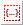

# Adding a Statement Block

To add a new statement block, proceed as follows:

1. In the Basic Blocks palette or toolbar, click on the  Statement Block button.
1. Click inside the drawing area where you want to position the statement block.

The statement block is added to the diagram.

- See also

[Statement Blocks](BDE_StatementBlocks.md)

[Using Graphical Hierarchies and Statement Blocks](BDE_UseHierarchiesStatementBlocks.md)
