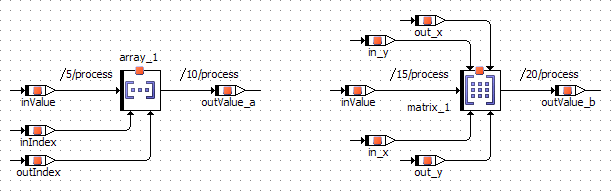
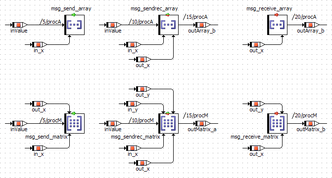

# Arrays and Matrices

##### Normal arrays and matrices

A normal array or matrix, i.e. an array or matrix not used as message, has two methods, one for setting the content of a specific element and one for retrieving it. The read and write operations can occur independently of each other. The value to be written to the array is represented by the left (argument) pin, the corresponding index by the bottom left pin. The result of reading from the array is represented by the return pin and the index by the bottom right argument pin.

Matrices are represented similarly, but each method takes two index arguments. The x-index is represented by the bottom left pin, like the index of an array. The y-index is represented by the pin at the top of the block with the top left pin being the index for writing to the matrix, and the top right pin the index when reading from it.

##### Arrays and matrices used as messages

An array or matrix used as message has one or two methods, depending on the message type. The available methods are the same as for normal arrays/matrices.

##### Both

In the context of a project, you can use the [Protected Vector Indices](ProjectEditorEnglishUS.chm::/PE_Code_Generation_Options.htm) option to protect array and matrix indices against over- or underflow.

See also

[G](BDE_Get_and_Set_Ports_for_Arrays_and_Matrices.md)et and Set Ports for Arrays and Matrices

[Arrays, Matrices, Characteristic Lines and Maps](BDE_ArraysMatrices.md)

[Introduction - Variant Size for Arrays and Matrices](IntroductionEnglishUS.chm::/INT_VariantSize_ArraysMatrices.htm)

[Introduction - Variable Size for Arrays and Matrices](IntroductionEnglishUS.chm::/INT_VariableSize_ArraysMatrices.htm)

[Project Editor - Code Generation Options](ProjectEditorEnglishUS.chm::/PE_Code_Generation_Options.htm)

[Creating an Array or Matrix](CreateArray.md)

[Creating a Message](BDE_CreateMessage.md)
