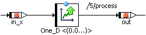
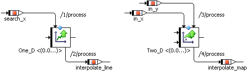
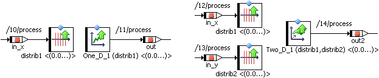

# Characteristic Lines and Maps

Depending on the dimension, characteristic lines and maps, including fixed characteristic lines and maps, have one or two argument pins on the left side where the sample values are supplied, and one return pin where the value of the interpolation is given.

The above representation corresponds to using the getAt method in ESDL (cf. [Characteristic Lines - Description](ESDLEditorEnglishUS.chm::/ESDL_One-Dimensional_Tables_-_Description.htm) and [Characteristic Maps - Description](ESDLEditorEnglishUS.chm::/ESDL_Two-Dimensional_Tables_-_Description.htm)).

As with ESDL, the search and interpolate steps in characteristic lines and maps can be separated in the block diagram editor. To do so, the extended table interface has to be made available via the Extended Interface context menu function in the drawing area.

A distribution has one argument pin for the sample value on the left side of the distribution. A group characteristic line/map has one return pin on the right side. It contains no own sample point distribution, but references one or two distributions instead. Group characteristic lines/maps and distributions do not have an extended interface.

The green arrows in the images above indicate strictly increasing axis points (in characteristic maps: strictly increasing x axis points) of normal and fixed characteristic lines/maps and distributions. Characteristic lines/maps or distributions with strictly decreasing axis points are marked with red downward arrows.

Group characteristic lines/maps inherit the arrow from the assigned (X) distribution.

As with arrays and matrices, Get and Set ports can be made available via the Get/Set Ports context menu function.

If you want to pass characteristic tables as method arguments, you have to embed them in classes, and pass the class via the Get port.

ASCET provides linear and rounded interpolation, as well as [high-resolution interpolation](IntroductionEnglishUS.chm::/INT_HighRes_InterpolationRoutines.htm), for characteristic lines and maps, plus the possibility to add [user-defined interpolation routines](IntroductionEnglishUS.chm::/INT_UserDefinedInterpolationRoutines.htm).

See also

[Characteristic Lines - Description](ESDLEditorEnglishUS.chm::/ESDL_One-Dimensional_Tables_-_Description.htm)

[Characteristic Maps - Description](ESDLEditorEnglishUS.chm::/ESDL_Two-Dimensional_Tables_-_Description.htm)

[User-Defined Interpolation Routines](IntroductionEnglishUS.chm::/INT_UserDefinedInterpolationRoutines.htm)

[High-Resolution Interpolation Routines](IntroductionEnglishUS.chm::/INT_HighRes_InterpolationRoutines.htm)
