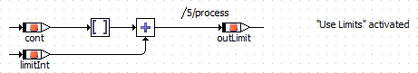
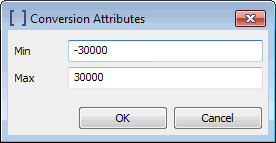
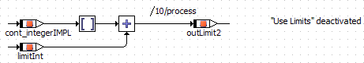
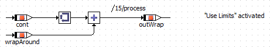
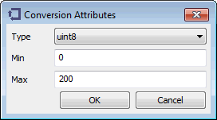
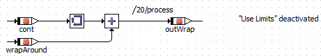
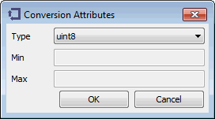

# Examples: Conversion Operator

The conversion operator is used to convert a cont variable to

| Column 1 | Column 2 | Column 3 |
| --- | --- | --- |
|  | Conversion Type | Use Limiters |
| Example 1 | Limited | activated |
| Example 2 | Limited | deactivated |
| Example 3 | WrapAround | activated |
| Example 4 | WrapAround | deactivated |

##### Example 1: Conversion Type = Limit, Use Limiters activated

Min and Max of the conversion operator are manually set to -30000 and 30000.

The generated C code (ANSI-C target, Object Based Controller Implementation code generator) looks as follows:

real64 _t1real64;

sint16 _t1sint16;

sint32 _t1sint32;

/* process: sequence call #5 */

_t1real64 = ((_cont < 0.0) ? (_cont - 0.5) : (_cont + 0.5));

_t1sint16 = ((_t1real64 >= -30000.0) ? (((_t1real64 <= 30000.0) ? (sint16)_t1real64 : 30000)) : -30000);

_t1sint32 = _t1sint16 + _limitInt;

_outLimit = ((_t1sint32 >= -32768) ? (((_t1sint32 <= 32767) ? _t1sint32 : 32767)) : -32768);

##### Example 2: Conversion Type = Limit, Use Limiters deactivated

Min and Max of the conversion operator are set automatically during code generation.

The generated C code (ANSI-C target, Object Based Controller Implementation code generator) looks as follows:

sint32 _t1sint32;

/* process: sequence call #10 */

_t1sint32 = _cont_integerIMPL + _limitInt;

_outLimit2 = ((_t1sint32 >= -32768) ? (((_t1sint32 <= 32767) ? _t1sint32 : 32767)) : -32768);

##### Example 3: Conversion Type = WrapAround, Use Limiters activated

The type uint8 is selected. Min and Max of the conversion operator are manually set to 0 and 200.

The generated C code (ANSI-C target, Object Based Controller Implementation code generator) looks as follows:

real64 _t1real64;

uint8 _t1uint8;

/* process: sequence call #15 */

_t1real64 = ((_cont < 0.0) ? (_cont - 0.5) : (_cont + 0.5));

_t1uint8 = (uint8)_t1real64 + _wrapAround;

_outWrap = _t1uint8;

##### Example 4: Conversion Type = WrapAround, Use Limiters deactivated

The type uint8 is selected. Min and Max of the conversion operator are set automatically during code generation.

The generated C code (ANSI-C target, Object Based Controller Implementation code generator) looks as follows:

real64 _t1real64;

uint8 _t1uint8;

/* process: sequence call #20 */

_t1real64 = ((_cont < 0.0) ? (_cont - 0.5) : (_cont + 0.5));

_t1uint8 = (uint8)_t1real64 + _wrapAround;

_outWrap = _t1uint8;

See also

[Conversion Operator](BDE_ConversionOperator.md)
