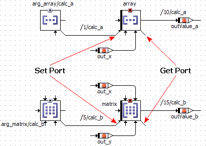
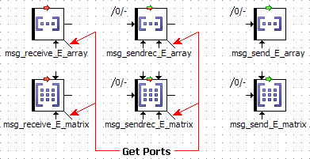

# Get and Set Ports for Arrays and Matrices

When arrays or matrices are to be passed as method arguments, or returned as return values, this is done with the help of Get and Set ports. These are made available via the Get/Set Ports context menu function in the drawing area.

The Get port provides a pointer to the entire data content of the respective element; the Set port directs the element to access a certain memory area.

If you want to use the Set port of an array or matrix, that array/matrix must be specified as explicit reference. Otherwise, an error (MMdl3) is issued during code generation:

<array/matrix name> - due to <reason> (without reference flag) - is not a left value for assignment

The availability of get and Set ports depends on whether an array or matrix is used as [normal element](#NormalArray) or as [message](#MessageArray).

##### Normal arrays and matrices

Normal arrays and matrices can have get and Set ports.

In the above figure, array reads from the memory area used by arg_array, while matrix reads from the memory area used by arg_matrix. The pointers to the respective memory areas are passed via the Get and Set ports. It is important that writing to the Set port is performed as the first step of the method; otherwise, inconsistencies arise.

The same mechanism is used to pass classes, too.

##### Arrays and matrices used as messages

Arrays and matrices used as Receive or SendReceive messages can have only Get ports. Arrays and matrices used as Send messages can have neither Set nor Get ports.

See also

[Arrays and Matrices](BDE_Arrays_and_Matrices.md)

[Messages](BDE_Messages.md)

[Arrays, Matrices, Characteristic Lines and Maps](BDE_ArraysMatrices.md)
