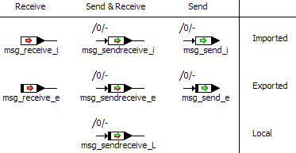
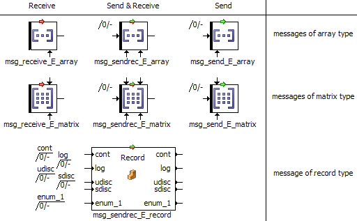

# Messages

Messages are the input and output variables of processes. Depending on the message type, they are displayed with pin(s) on the left side, the right side, or both sides.

The first figure shows scalar messages in the block diagram editor. The colored symbols mark the directions of the messages. Scope and other properties, which are marked by certain symbols on variables and parameters, are not marked.

The second figure shows non-scalar messages in the block diagram editor. The colored symbols mark the directions of the messages. Scope and other properties are not marked.

For exported and local messages of scalar, array or matrix type, [calibration access](ElementEditorEnglishUS.chm::/EEd_CalibrationAccess.htm) is set to read-only, indicated by the black bar at the left end of the message icons. Changing the calibration access makes the display change as shown for variables in [Basic Scalar Elements](BDE_Basic_Scalar_Elements.md). Imported messages of the said types will inherit their properties from their exported counterparts.

For messages of record type, calibration access is not reflected in the message icon.

See also

[Introduction - Messages](IntroductionEnglishUS.chm::/INT_messages.htm)

[Creating a Message](BDE_CreateMessage.md)

[Calibration Access](ElementEditorEnglishUS.chm::/EEd_CalibrationAccess.htm)

[Basic Scalar Elements](BDE_Basic_Scalar_Elements.md)
