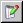

# Paths for Window

This dialog window can be opened with the Show Paths option in the Extras menu.

This window contains the following elements:

- Model Path area

1. text field for the item path in the model
1.  Open Component in Project Context
1.  Show Component in Component Manager

If an element - i.e. variable, constant, message, etc. - is selected, the buttons are either disabled or open/show the component that contains the selected element.

- Model Path of Export area

Only active if you selected an imported item.

1. text field for the path of the exported item
1.  Open Component in Project Context
1.  Show Component in Component Manager

If an element - i.e. variable, constant, message, etc. - is selected, the buttons are either disabled or open/show the component that contains the selected element.

- Database Path area

1. text field for the item path in the database or workspace
1.  Open Component in Default Context
1.  Show Component in Component Manager

If an element - i.e. variable, constant, message, etc. - is selected, the buttons are either disabled or open/show the component that contains the selected element.

-  OK

Closes the window.
