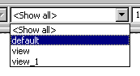

# Selecting a View of the Diagram

Details on views are given in [Views](AutomaticDocumentationEnglishUS.chm::/AD_views.htm).

- From the View combo box in the upper right corner of the toolbar, select a view.

The view changes according to the view settings of the diagram items. All items that are marked invisible for the selected view are hidden.

See also

[Views](AutomaticDocumentationEnglishUS.chm::/AD_views.htm)
