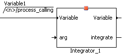

# Statements

Graphical specifications of components can be hierarchically distributed over several diagrams. In a diagram one or more methods or processes can be described which can be executed independently of each other. The order in which calculations are executed, as well as the particular method or process a calculation belongs to is determined by sequence calls.

For each statement of a block diagram, there is a sequence call that assigns it to a process or method. The order within a process or method is determined by the sequence number that is part of the sequence call. A sequence call is represented graphically as follows:

 (<n> being the sequence number)

With the sequence numbers the order of the operations belonging to one method or process can be determined by the user. A built-in sequencing algorithm can be used to assign sequence numbers that correspond to the evaluation order of standard block diagrams.

A sequence call generally consists of three fields:

- The name of the method called.
- The sequence number determining the position of the called method in the calling method or process.

- The name of the method or process calling.

In the case of scalar elements, the name of the method called is left blank as this is always the assignment of a new value.

There are three kinds of statements:

- Assignment statements
- Method calls
- [Control Flow Statements](BDE_ControlFlow_Summary.md), e.g. if…then…else, while

See also

[Sequence Calls](BDE_SequenceCalls.md)

[Control Flow Elements - Summary](BDE_ControlFlow_Summary.md)

[Assignment](BDE_Assignment.md)
