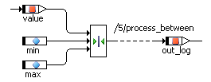

# Between Operator

The Between operator checks if the argument value lies between the limiters min and max. If this is the case, the logical return value out_log is true, otherwise it is set to false.

The graphical representation is equivalent to out_log = (( value >= min ) && ( value <= max )). The argument and both limiters must be of the same type, either cont or a discrete type (see [Scalar Types - Summary](IntroductionEnglishUS.chm::/INT_scalar_summary.htm)).
