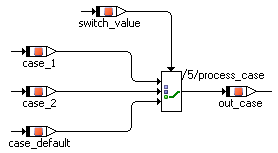

# Case Operator

The Case operator is a special case of the conditional operator. It does not take a logical value, but a switch value of discrete type (see [Scalar Types - Summary](IntroductionEnglishUS.chm::/INT_scalar_summary.htm)). The Case operator has n arguments, n-1 of which are numbered consecutively. The last argument is the default case.

Depending on the switch value, one of the arguments is selected. If the switch value is 1, the first argument is returned, if it is 2 the second is returned, and so on. If the switch value is less than 1, or n, or larger than n, the last argument is returned.

The above example is equivalent to

switch (self->switch_value->val) { case 1 : { out_case = case_1; break; } case 2 : { out_case = case_2; break; } default: { out_case = case_default; break; } }
