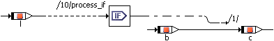

# If...Then

The If…Then statement evaluates a logical expression and activates a control flow branch if the result is True. The control flow output is connected to one or more sequence calls which are triggered whenever the control flow branch is activated. Whenever the input expression evaluates to True, the connected sequence calls are executed.

The example above is equivalent to

if (l) {

c = b

};

As for the if…else statement in ESDL, the generated code is optimized when the expression for If…Then is always true. [If…Else (ESDL)](ESDLEditorEnglishUS.chm::/ifelse.htm) describes how the optimization works.

See also

[Using the If Statements](UseIf.md)

[If…Else (ESDL)](ESDLEditorEnglishUS.chm::/ifelse.htm)
