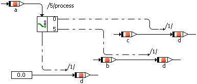

# Switch

The Switch construct is similar to the [Case](BDE_case_operator.md) operator. A Switch evaluates a signed discrete or unsigned discrete value and, depending on that value, activates different control flow branches. These branches are separated from each other, so that a “fall through” like in the switch construct in C is not possible.

For each alternative the value for the branch can be defined by the user. The last branch at the bottom is the default branch that is executed if the input value does not equal any of the values at the branches.

The example above is equivalent to

switch (a) {

case 0: {

d = c;

break; }

case 5: {

d = b;

break; }

default: {

d = 0;

break; }

}

See also

[Using the Switch](UseSwitch.md)

[Case Operator](BDE_case_operator.md)

[Break Operator](the_break_statement.md)
