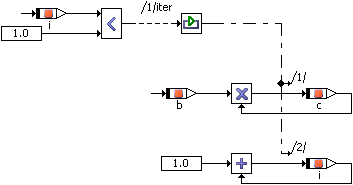

# While

The only loop construct available in block diagrams is the While loop. Care has to be taken to avoid infinite loops or loops unsuitable for real-time applications.

Similarly to the If…Then statement, the control flow is activated when the value of the logical expression is True. The operation is executed as long as the value of the logical input remains True. Therefore, the value of the logical expression should be manipulated in the while loop.

In order to avoid infinite loops, the maximal number of loop iterations can be limited to a fixed number in the project properties, Experiment Code node, of the associated project (or default project).

The example above is equivalent to

while (i<5) {

c = b * c;

i = 1 + i;

};

See also

[Using the While Loop](Usewhileloop.md)

[Project Editor - Experiment Code Node](ProjectEditorEnglishUS.chm::/Exp_Code_Options_Window.htm)
