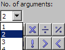

# Positioning an Operator

To position an operator, proceed as follows:

1. In the  combo box in the Basic Blocks palette, select the number of inputs for the operator.
1. In the Basic Blocks panel, select the operator you want to create. This loads the mouse cursor with that operator.
1. Click inside the drawing area to position the operator.

The operator is added to the diagram. You can adjust its position by dragging it to another position.

The flow of information in diagrams is determined by connecting the items in the drawing area.

See also

[Inserting an Element into a Connection](BDE_InsertElement_in_Connection.md)
