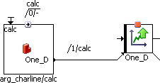

# Using the Characteristic Line as Method Argument

To actually use the method argument, proceed as follows:

1. Place the complex argument in the drawing area.
1. Create and set up a characteristic line (), and place it in the drawing area.
1. Right-click on the characteristic line, and select Get/Set Ports from the context menu.
1. Open the properties window for the characteristic table, and assign the kind Variable (see [Element Configuration](ElementEditorEnglishUS.chm::/EEd_element_configuration.htm)).
1. Connect the argument output to the Set port of the characteristic line.

Select the sequence number 1 for the sequence call, so that the assignment is executed as the first step of the method.

If this assignment is not performed as the first step of the method, inconsistencies arise.

You can now analyze the characteristic line as usual. Data are read from the memory area in which the characteristic line passed as argument is located.

See also

[Preparations](Preparations.md)

[Passing the Characteristic Line as Method Argument](Passcharacteristic.md)

[Characteristic Lines and Maps as Arguments](BDE_ComplexTypes.md#CharLineMap_Argument)

[Arrays, Matrices, Characteristic Curves and Maps](BDE_ArraysMatrices.md)

[Element Configuration](ElementEditorEnglishUS.chm::/EEd_element_configuration.htm)
