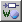

# Elements Palette

The Elements palette contains following functions:

<table style="x-cell-content-align: Top;
				margin-top: 3px;
				border-left-style: Outset;
				border-top-style: Outset;
				border-right-style: Outset;
				border-bottom-style: Outset;
				border-left-width: 1px;
				border-right-width: 1px;
				border-top-width: 1px;
				border-bottom-width: 1px;" x-use-null-cells="">
<col/>
<col style="width: 150px;"/>
<col/>
<tr class="hcp1" valign="top">
<td class="hcp2" colspan="1" rowspan="1">

</td>
<td class="hcp2" style="width:150px;" width="150px">

Logic Variable
</td>
<td class="hcp2" colspan="1" rowspan="10">

The Variable and Parameter buttons can be used to create elements of type 
 logic, limitInt, wrapInt, udisc, sdisc, cont, or enumeration.

By default, the Limited Integer * 
 and Wrap-Around Integer * buttons are displayed. 
 To display the Signed Discrete * and Unsigned 
 Discrete * buttons instead, the <a href="ComponentManagerEnglishUS.chm::/cm_options_for_editors.htm">editor 
 option</a> Use signed/unsigned discrete types must 
 be activated.

See also <a href="BasicElement.md">Creating a Basic 
 Element</a> and <a href="InsertEnumeration.md">Inserting an Enumeration</a>.
</td></tr>
<tr class="hcp1" valign="top">
<td class="hcp2" colspan="1" rowspan="1">

 ()
</td>
<td class="hcp2" colspan="1" rowspan="1" style="width:150px;" width="150px">

Limited Integer Variable  
(Signed Discrete Variable)
</td>
</tr>
<tr class="hcp1" valign="top">
<td class="hcp2" colspan="1" rowspan="1">

 ()
</td>
<td class="hcp2" colspan="1" rowspan="1" style="width:150px;" width="150px">

Wrap-Around Integer Variable 
(Unsigned Discrete Variable)
</td>
</tr>
<tr class="hcp1" valign="top">
<td class="hcp2">

</td>
<td class="hcp2" style="width:150px;" width="150px">

Continuous Variable
</td>
</tr>
<tr class="hcp1" valign="top">
<td class="hcp2">

</td>
<td class="hcp2" style="width:150px;" width="150px">

Enumeration Variable
</td>
</tr>
<tr class="hcp1" valign="top">
<td class="hcp2">

</td>
<td class="hcp2" style="width:150px;" width="150px">

Logic Parameter
</td>
</tr>
<tr class="hcp1" valign="top">
<td class="hcp2" colspan="1" rowspan="1">

 ()
</td>
<td class="hcp2" colspan="1" rowspan="1" style="width:150px;" width="150px">

Limited Integer Parameter 
(Signed Discrete Parameter)
</td>
</tr>
<tr class="hcp1" valign="top">
<td class="hcp2" colspan="1" rowspan="1">

 ()
</td>
<td class="hcp2" colspan="1" rowspan="1" style="width:150px;" width="150px">

Wrap-Around Integer Parameter 
(Unsigned Discrete Parameter)
</td>
</tr>
<tr class="hcp1" valign="top">
<td class="hcp2">

</td>
<td class="hcp2" style="width:150px;" width="150px">

Continuous Parameter
</td>
</tr>
<tr class="hcp1" valign="top">
<td class="hcp2">

</td>
<td class="hcp2" style="width:150px;" width="150px">

Enumeration Parameter
</td>
</tr>
<tr class="hcp1" valign="top">
<td class="hcp2">

</td>
<td class="hcp2" style="width:150px;" width="150px">

Implementation Cast
</td>
<td class="hcp2">

 
</td></tr>
<tr class="hcp1" valign="top">
<td class="hcp2">

</td>
<td class="hcp2" style="width:150px;" width="150px">

Delta t
</td>
<td class="hcp2">

dt system parameter

The name dT 
 is reserved for the system parameter. You cannot create any other element 
 with the name dT. 
 Since upper and lower case letters are not distinguished, the names DT, 
 dt, and Dt are reserved, too.
</td></tr>
<tr class="hcp1" valign="top">
<td class="hcp2">

</td>
<td class="hcp2" style="width:150px;" width="150px">

Resource
</td>
<td class="hcp2">

See also <a href="BDE_Resources.md">Resources</a>.
</td></tr>
<tr class="hcp1" valign="top">
<td class="hcp2">

</td>
<td class="hcp2" style="width:150px;" width="150px">

Receive Message
</td>
<td class="hcp2" colspan="1" rowspan="3">

These buttons can be used to create scalar messages 
 only. 

See also <a href="BDE_CreateMessage.md">Creating 
 a Message</a>.
</td></tr>
<tr class="hcp1" valign="top">
<td class="hcp2">

</td>
<td class="hcp2" style="width:150px;" width="150px">

Send Receive Message
</td>
</tr>
<tr class="hcp1" valign="top">
<td class="hcp2">

</td>
<td class="hcp2" style="width:150px;" width="150px">

Send Message
</td>
</tr>
<tr class="hcp1" valign="top">
<td class="hcp2">

</td>
<td class="hcp2" style="width:150px;" width="150px">

Array
</td>
<td class="hcp2" colspan="1" rowspan="2">

See also <a href="CreateArray.md">Creating an 
 Array or Matrix</a>.
</td></tr>
<tr class="hcp1" valign="top">
<td class="hcp2">

</td>
<td class="hcp2" style="width:150px;" width="150px">

Matrix
</td>
</tr>
<tr class="hcp1" valign="top">
<td class="hcp2">

</td>
<td class="hcp2" style="width:150px;" width="150px">

Distribution
</td>
<td class="hcp2">

See also <a href="CreateDistribution.md">Creating 
 a Distribution</a>.
</td></tr>
<tr class="hcp1" valign="top">
<td class="hcp2">

</td>
<td class="hcp2" style="width:150px;" width="150px">

OneD Table
</td>
<td class="hcp2" colspan="1" rowspan="2">

The table buttons can be used to create normal, 
 group, or fixed characteristic lines/maps, depending on the selection in the combo box. 

See also <a href="Createnormal.md">Creating a Normal 
 or Fixed Characteristic Line/Map</a> and <a href="Creategroup.md">Creating 
 a Group Characteristic Line/Map</a>.
</td></tr>
<tr class="hcp1" valign="top">
<td class="hcp2">

</td>
<td class="hcp2" style="width:150px;" width="150px">

TwoD Table
</td>
</tr>
<tr class="hcp1" valign="top">
<td class="hcp2">

</td>
<td class="hcp2" style="width:150px;" width="150px">

 
</td>
<td class="hcp2">

Combo box to select the type of the characteristic 
 line/map
</td></tr>
</table>

See also

[Toolbar Elements](bde_toolbarelements.md)
