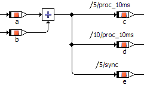

# The Semantics of Block Diagrams

Each part of a block diagram is assigned to a process or method. The execution order is determined by the sequence numbers in the sequence calls. When a process or method is activated, all statements whose sequence calls are attached to that process or method are executed in the order given by the sequence numbers.

In contrast to standard block diagrams, an operation is executed only on demand, i.e. when its sequence call is activated. The order of execution is similar to the left-to-right principle of standard block diagrams: before an operation, for example an addition, can be performed, the values for all its arguments have to be computed.

The order of evaluation of the arguments of methods of user-defined components is given by the order of their declaration. This order, however, may not coincide with the order implied by the diagram, as the argument pins can be arranged arbitrarily at the block frame.

The evaluation of operands etc. is directly associated with the statements that use the results. This may result in multiple evaluations of an expression.

In this example, the addition is executed three times, for each of the assignments to the variables c, d, and e. The addition is used in assignments in two different processes. Without multiple execution, it would not be clear in which of the processes the addition should be executed. The expression a + b is evaluated twice in the process 10ms.
