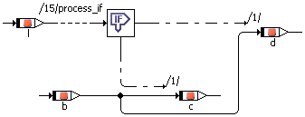

# If...Then...Else

If…Then…Else is similar to If…Then, but has two control flow branches. Depending on the value of the logical expression, the left or right branch is executed, the right branch is executed if the value is True, the left one if it is False.

The example above is equivalent to

if (l) {

d = b}

else {

c = b

};

As for the if…else statement in ESDL, the generated code is optimized when the expression for If…Then…Else is always true. [If…Else (ESDL)](ESDLEditorEnglishUS.chm::/ifelse.htm) describes how the optimization works.

See also

[Using the If Statements](UseIf.md)

[If…Else (ESDL)](ESDLEditorEnglishUS.chm::/ifelse.htm)
