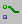
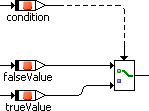
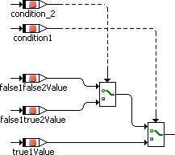

# Multiplex Operator

The conditional operator ( ? : ) is named Multiplex operator (for short: Mux) in the graphical representation. The graphical representation of (condition ? trueValue : falseValue) is as follows:

The multiplex operator can also be used directly with several arguments (left image), the right image shows the identical functionality built as a cascade of several Mux operators:

 

The above example is equivalent to (condition1 ? (true1Value : condition2 ? ( false1true2Value : false1false2Value))), i.e., the first argument has priority over the others. A cascaded Mux operator with n logical condition arguments can select between n+1 arguments between which it switches. The type of the arguments is arbitrary, but all arguments must be of a compatible type.
