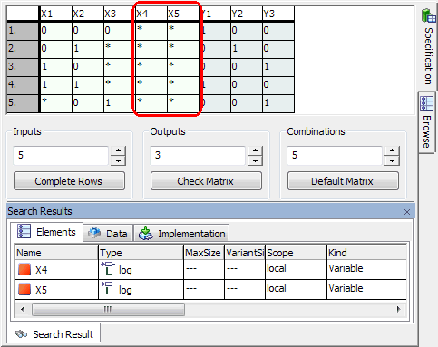

# Merged CHM Content

## Overview

_Source: `markdown/BT_Overview.md`_

# Overview - Boolean Table Editor

A Boolean table mirrors logical behavior. Its columns contain several logic inputs and outputs whose values can be specified. The lines, so-called combinations, contain the various combinations of input values and the respective output values. In other components, a Boolean table is used as logic connection. You can attach notes to a Boolean table, like other components (see [Editing the Notes for a Component](BlockDiagramEditorEnglishUS.chm::/BDE_Editnotes.htm)).

With the Boolean table editor, you can specify the Boolean table. ESDL code describing the specified output behavior is generated automatically when the editor is closed. The inputs are generates as logical variables for each output, a respective method is created.

Manipulations of the interfaces are not possible in this editor. In addition, inputs and outputs cannot be edited from the Outline tab. Therefore, most menu items from the other editors do not exist here.

The background colors of the table can be selected in the ASCET options window, [Table](componentmanagerenglishus.chm::/CM_options_for_table_editors.htm) node.

Two entries X1 and X2 and one output Y1 are created by default for a Boolean table, as well as four combinations (1 - 4) for the possible input settings. The output values of all combinations are set to 0 (false).

You can edit the input and output values of each combination.

You can

[Create a Boolean Table](markdown/create_boolean_table.md)

[Specify a Boolean Table](markdown/BT_Specifying_Boolean_Tables.md)

[Start an Offline Experiment](markdown/BT_Starting_an_Offline_Experiment.md)

See also

[Editing the Notes for a Component](BlockDiagramEditorEnglishUS.chm::/BDE_Editnotes.htm)

[Table Options](componentmanagerenglishus.chm::/CM_options_for_table_editors.htm)

---

## Creating a Boolean Table

_Source: `markdown/create_boolean_table.md`_

# Creating a Boolean Table

To create a Boolean table, proceed as follows:

1. In the Component Manager, select the folder for the new table.
1. In the Insert menu, point to Class and then select Boolean Table
1. Use the Insert Class button.
1. Enter a name for the component and press Enter.
1. Do one of the following:

- In the menu bar, point to Edit menu and select Open Component
- Press Enter
- Double-click on the selected element.

The Boolean table editor is opened.

---

## Filtering the Tree Pane

_Source: `markdown/bt_filtering_the_component_pane.md`_

# Filtering the Tree Pane

The Outline tab can be filtered. To do so, proceed as follows.

1. In the Outline tab, click on the  button.
1. In the Elements subnode, activate the options of the items you want to display in the tab.
1. Go to the Methods subnode to set filter options for processes and methods.
1. Click OK to close the Options window.

Only items with activated options are shown in the tab. The button is marked with a green symbol to indicate an active filter: 

The filter settings made here affect all component editors.

See also

[Searching the Tree Pane](IntroductionEnglishUS.chm::/INT_SearchTreePane.htm)

---

## Specifying Boolean Tables

_Source: `markdown/BT_Specifying_Boolean_Tables.md`_

# Specifying Boolean Tables

Specifying Boolean tables contains the following steps.

1. [Specifying Inputs and Outputs](markdown/BT_Specifying_Inputs_Outputs.md)
1. [Adding Inputs, Outputs and Combinations](markdown/BT_adding_ip_op.md)
1. [Generating a Default Matrix](markdown/BT_generate_default-matrix.md)
1. [Checking the Table](markdown/BT_checking_table.md)

You can also

1. [Delete Inputs and Outputs or Combinations](markdown/BT_deleting_ip_op.md)
1. [Show and Delete Unused Inputs](markdown/bt_showdeleteunusedInputts.md)
1. [Rename Inputs or Outputs](markdown/BT_renaming_ip_op.md)
1. [Shift Table Columns and Rows](markdown/BT_shift_table_columns.md)
1. [Set the Background Color](markdown/BT_Setting_the_Background_Color.md)

---

## Specifying Inputs and Outputs

_Source: `markdown/BT_Specifying_Inputs_Outputs.md`_

# Specifying Inputs and Outputs

To specify inputs and outputs, proceed as follows:

1. In the table area, double-click on the input or output value you want to modify.
1. Select the value you want to assign from the combo box (0 - false, 1 - true).

Besides 0 and 1, inputs can have the value * (undefined).

---

## Adding Inputs, Outputs and Combinations

_Source: `markdown/BT_adding_ip_op.md`_

# Adding Inputs, Outputs and Combinations

If you want to add further inputs or outputs, do one of the following:

- In the Inputs or Outputs menu, select Add.

- Right-click in the table area, open the Inputs or Outputs context menu and select Add.
- Adjust the number of inputs or outputs in the Inputs or Outputs field with the arrow buttons.

The specified number of inputs or outputs is created.

Newly created inputs are set to * (undefined) by default, new outputs to 0 (false).

Combinations can be added by selecting Add from the Combinations menu or context menu or via the Combinations field.

---

## Generating a Default Matrix

_Source: `markdown/BT_generate_default-matrix.md`_

# Generating a Default Matrix

You can now specify the input and output values as described in [Adding Inputs, Outputs and Combinations](markdown/BT_adding_ip_op.md). Instead of editing each value by hand, you can generate a default matrix automatically.

To generate a default matrix, proceed as follows:

1. Create the desired number of inputs.
1. Click on the Default Matrix button.

Enough combinations are created to include every possible input setting. The number of outputs is unchanged; all output values are set to 0 (false). If, for example, you have created three inputs and one output, Default Matrix will give the following result:

See also

[Adding Inputs, Outputs and Combinations](markdown/BT_adding_ip_op.md)

---

## Deleting Inputs and Outputs or Combinations

_Source: `markdown/BT_deleting_ip_op.md`_

# Deleting Inputs and Outputs or Combinations

Inputs, outputs or combinations can be deleted as follows:

1. In the table area, select the input, output or combination you want to delete.
1. Do one of the following:

- In the Inputs, Outputs or Combinations menu, select Delete.
- Right-click in the table area, open the Inputs, Outputs or Combinations context menu and select Delete.
- Adjust the number of inputs, outputs or combinations in the Inputs, Outputs or Combinations field with the arrow buttons.

The appropriate number of inputs, outputs or combinations is deleted.

---

## Showing and Deleting Unused Inputs

_Source: `markdown/bt_showdeleteunusedInputts.md`_

# Showing and Deleting Unused Inputs

To delete inputs not used in the Boolean table, proceed as follows:

1. In the Extras menu, select Show Unused Elements.
1. To delete an unused input, proceed as described in [Deleting Inputs and Outputs or Combinations](markdown/BT_deleting_ip_op.md).

See also

[Checking the Table](markdown/BT_checking_table.md)

[Deleting Inputs and Outputs or Combinations](markdown/BT_deleting_ip_op.md)

/* Heikki Komulainen, Comet Computer GmbH 2004 */ cc_plus_pic = '&nbsp;'; cc_minus_pic = '&nbsp;'; cc_stat_pic = '&nbsp;'; gpstyle = ''; var iframes_created = 0; if (document.body && document.body.insertAdjacentHTML && document.getElementsByTagName && document.getElementById) { collect_popups(); set_poplinks_pictures(); if (iframes_created) { document.write(gpstyle); document.write('
<nobr><a id="einauslink" style="position:absolute;top:expression(document.body.scrollTop + this.offsetHeight - this.offsetHeight);left:expression(document.body.offsetWidth - (this.offsetWidth + 28));background:white;padding:5px" href="javascript:show_all_poptext()">Show all hidden text</a></nobr>
'); } } function collect_popups() { bsscpopups = new Array(); for (x = 0; x < document.links.length; x++) { if (document.links[x].href.indexOf("BSSCPopup")>-1) { seekmatch = /BSSCPopup.'[^'](markdown/+)'/; poplink = seekmatch.exec(document.links[x].href); poplink = "" + poplink; poplink = poplink.substring(poplink.indexOf("'")+1, poplink.lastIndexOf("'")); ifid = "CCGENIFRAMEID" + x; new_iframe = '<iframe id="' + ifid + '"src="' + poplink + '" onload="get_text(\'' + ifid + '\')" width="0" height="0" frameborder=0></iframe>'; document.links[x].parentNode.insertAdjacentHTML("afterEnd", new_iframe); gpid = "CCID_" + ifid; document.links[x].href = "javascript:expand_poptext('" + gpid + "')"; cc_plus = '' + cc_plus_pic + ''; document.links[x].insertAdjacentHTML("afterBegin", cc_plus); iframes_created = 1; } } }// end function function get_text(ifr_id) { frpars = document.frames[ifr_id].document.getElementsByTagName("body"); popbody = frpars[0].innerHTML; gpid = "CCID_" + ifr_id; if (!document.getElementById(gpid)) { //avoiding doubles document.getElementById(ifr_id).insertAdjacentHTML("afterEnd", '
'+popbody+'
'); } }//end function function expand_poptext(x_frame_id) { if (!document.getElementById(x_frame_id)) return; if (document.getElementById(x_frame_id).className == "CCGENPOPTEXTH") { document.getElementById(x_frame_id).className = "CCGENPOPTEXTV"; document.getElementById(x_frame_id).style.visibility = "visible"; if (document.getElementById("CCPMB_" + x_frame_id )) { document.getElementById("CCPMB_" + x_frame_id ).innerHTML = cc_minus_pic; } } else { document.getElementById(x_frame_id).className = "CCGENPOPTEXTH"; document.getElementById(x_frame_id).style.visibility = "hidden"; if (document.getElementById("CCPMB_" + x_frame_id )) { document.getElementById("CCPMB_" + x_frame_id ).innerHTML = cc_plus_pic; } } }// end function function show_all_poptext() { var pulldowntxt = document.getElementsByTagName("div"); for (b = 0; b < pulldowntxt.length; b++) { if (pulldowntxt[b].className == "droptext") { pulldowntxt[b].style.display=""; } } var gptxt = document.getElementsByTagName("div"); for (z = 0; z < gptxt.length; z++) { if (gptxt[z].className == "CCGENPOPTEXTH") { gptxt[z].className = "CCGENPOPTEXTV"; gptxt[z].style.visibility = "visible"; if (document.getElementById("CCPMB_" + gptxt[z].id )) { document.getElementById("CCPMB_" + gptxt[z].id ).innerHTML = cc_minus_pic; } } } var dxpoplinks = document.getElementsByTagName("a"); if (dxpoplinks) { for (pxl = 0; pxl < dxpoplinks.length; pxl++) { if (dxpoplinks[pxl].href.indexOf("kadovTextPopup")>-1) { if (document.getElementById("CCPMB_" + dxpoplinks[pxl].id)) { document.getElementById("CCPMB_" + dxpoplinks[pxl].id).innerHTML = cc_stat_pic; dxpoplinks[pxl].symbol = "minus"; } } } } document.getElementById('einauslink').innerText = 'Hide all hideable text'; document.getElementById('einauslink').href = "javascript:self.location.reload()"; self.focus(); }// end function function eat_click() { return false; }// end function function set_poplinks_pictures() { var dpoplinks = document.getElementsByTagName("a"); if (dpoplinks) { for (pl = 0; pl < dpoplinks.length; pl++) { if (dpoplinks[pl].href.indexOf("kadovTextPopup")>-1) { cc_plus = '' + cc_stat_pic + ''; //dpoplinks[pl].onmouseup = plusminuspoplink; dpoplinks[pl].insertAdjacentHTML("afterBegin", cc_plus); dpoplinks[pl].symbol = "plus"; } } } }// end function function plusminuspoplink() { if (document.getElementById("CCPMB_" + this.id)) { if (this.symbol == "plus") { document.getElementById("CCPMB_" + this.id).innerHTML = cc_minus_pic; this.symbol = "minus"; } else { document.getElementById("CCPMB_" + this.id).innerHTML = cc_plus_pic; this.symbol = "plus"; } } return true; }

---

## Renaming Inputs or Outputs

_Source: `markdown/BT_renaming_ip_op.md`_

# Renaming Inputs or Outputs

You can rename inputs and outputs. Combinations cannot be renamed.

To rename inputs or outputs, proceed as follows:

1. In the table area, highlight the input or output you want to rename.
1. Do one of the following:
1. Enter the new name and confirm with OK.

---

## Shifting Table Columns and Rows

_Source: `markdown/BT_shift_table_columns.md`_

# Shifting Table Columns and Rows

You can shift the columns containing the input and output values, as well as the combination rows.

To shift table columns and rows, proceed as follows:

1. In the table area, highlight the input you want to shift.
1. Do one of the following:
1. Shift outputs with Move Left or Move Right in the Outputs menu or context menu.
1. Shift combinations with Move Up or Move Down in the Combinations menu or context menu.

---

## Checking the Table

_Source: `markdown/BT_checking_table.md`_

# Checking the Table

If you have inserted the input and output values manually, or if you have deleted inputs or outputs, you should check the table for consistency.

To check the table, proceed as follows:

1. When you have set up the table according to your wishes, click on the Check Matrix button.

If different output values are assigned to combinations with identical input values, the respective lines are marked with red borders.

1. Select one of the conflicting combinations, then open the Combinations menu and select Delete.

The selected combination is removed.

---

## Setting the Background Color

_Source: `markdown/BT_Setting_the_Background_Color.md`_

# Setting the Background Color

You can determine the background color for the input area (i.e. the X* columns) and output area (Y* columns).

1. In the Tools menu, select Options to open the ASCET Options window.
1. Select the Tables node.
1. Open the Input Color or Output Color combo box.
1. Select the background color you want.
1. Close the Options window to accept the settings.

For the color selection to become effective, close and re-open the Boolean table editor.

See also

[Table Options](componentmanagerenglishus.chm::/CM_options_for_table_editors.htm)

---

## Starting an Offline Experiment

_Source: `markdown/BT_Starting_an_Offline_Experiment.md`_

# Starting an Offline Experiment

To experiment with a Boolean table, you can start the experiment via the Open Experiment for selected Experiment Target button, as with any other component. To start an offline experiment, proceed as follows:

1. In the Boolean table editor, perform one of the following actions.
1. If you are working with a database larger than 3 GB, [another step is inserted](javascript:BSSCPopup('codegen_dbtoolarge.htm');)<!-- kadovFilePopupInit('a1'); //-->.

The generated code is compiled with the compiler specific to the current target, and the experimentation environment for the component is opened. The generated files are stored in the cgen directory.

The experimentation environment is described in [The Experimentation Environment](ExperimentationEnglishUS.chm::/EE_Overview.htm).

See also

[The Experimentation Environment](ExperimentationEnglishUS.chm::/EE_Overview.htm)

[Project Editor - Banners in the Generated Code](ProjectEditorEnglishUS.chm::/PE_Banners_in_GeneratedCode.htm)

/* Heikki Komulainen, Comet Computer GmbH 2004 */ cc_plus_pic = '&nbsp;'; cc_minus_pic = '&nbsp;'; cc_stat_pic = '&nbsp;'; gpstyle = ''; var iframes_created = 0; if (document.body && document.body.insertAdjacentHTML && document.getElementsByTagName && document.getElementById) { collect_popups(); set_poplinks_pictures(); if (iframes_created) { document.write(gpstyle); document.write('
<nobr><a id="einauslink" style="position:absolute;top:expression(document.body.scrollTop + this.offsetHeight - this.offsetHeight);left:expression(document.body.offsetWidth - (this.offsetWidth + 28));background:#ffffe0;padding:5px" href="javascript:show_all_poptext()">Show all hidden text</a></nobr>
'); } } function collect_popups() { bsscpopups = new Array(); for (x = 0; x < document.links.length; x++) { if (document.links[x].href.indexOf("BSSCPopup")>-1) { seekmatch = /BSSCPopup.'[^'](markdown/+)'/; poplink = seekmatch.exec(document.links[x].href); poplink = "" + poplink; poplink = poplink.substring(poplink.indexOf("'")+1, poplink.lastIndexOf("'")); ifid = "CCGENIFRAMEID" + x; new_iframe = '<iframe id="' + ifid + '"src="' + poplink + '" onload="get_text(\'' + ifid + '\')" width="0" height="0" frameborder=0></iframe>'; document.links[x].parentNode.insertAdjacentHTML("afterEnd", new_iframe); gpid = "CCID_" + ifid; document.links[x].href = "javascript:expand_poptext('" + gpid + "')"; cc_plus = '' + cc_plus_pic + ''; document.links[x].insertAdjacentHTML("afterBegin", cc_plus); iframes_created = 1; } } }// end function function get_text(ifr_id) { frpars = document.frames[ifr_id].document.getElementsByTagName("body"); popbody = frpars[0].innerHTML; gpid = "CCID_" + ifr_id; if (!document.getElementById(gpid)) { //avoiding doubles document.getElementById(ifr_id).insertAdjacentHTML("afterEnd", '
'+popbody+'
'); } }//end function function expand_poptext(x_frame_id) { if (!document.getElementById(x_frame_id)) return; if (document.getElementById(x_frame_id).className == "CCGENPOPTEXTH") { document.getElementById(x_frame_id).className = "CCGENPOPTEXTV"; document.getElementById(x_frame_id).style.visibility = "visible"; if (document.getElementById("CCPMB_" + x_frame_id )) { document.getElementById("CCPMB_" + x_frame_id ).innerHTML = cc_minus_pic; } } else { document.getElementById(x_frame_id).className = "CCGENPOPTEXTH"; document.getElementById(x_frame_id).style.visibility = "hidden"; if (document.getElementById("CCPMB_" + x_frame_id )) { document.getElementById("CCPMB_" + x_frame_id ).innerHTML = cc_plus_pic; } } }// end function function show_all_poptext() { var pulldowntxt = document.getElementsByTagName("div"); for (b = 0; b < pulldowntxt.length; b++) { if (pulldowntxt[b].className == "droptext") { pulldowntxt[b].style.display=""; } } var gptxt = document.getElementsByTagName("div"); for (z = 0; z < gptxt.length; z++) { if (gptxt[z].className == "CCGENPOPTEXTH") { gptxt[z].className = "CCGENPOPTEXTV"; gptxt[z].style.visibility = "visible"; if (document.getElementById("CCPMB_" + gptxt[z].id )) { document.getElementById("CCPMB_" + gptxt[z].id ).innerHTML = cc_minus_pic; } } } var dxpoplinks = document.getElementsByTagName("a"); if (dxpoplinks) { for (pxl = 0; pxl < dxpoplinks.length; pxl++) { if (dxpoplinks[pxl].href.indexOf("kadovTextPopup")>-1) { if (document.getElementById("CCPMB_" + dxpoplinks[pxl].id)) { document.getElementById("CCPMB_" + dxpoplinks[pxl].id).innerHTML = cc_stat_pic; dxpoplinks[pxl].symbol = "minus"; } } } } document.getElementById('einauslink').innerText = 'Hide all hideable text'; document.getElementById('einauslink').href = "javascript:self.location.reload()"; self.focus(); }// end function function eat_click() { return false; }// end function function set_poplinks_pictures() { var dpoplinks = document.getElementsByTagName("a"); if (dpoplinks) { for (pl = 0; pl < dpoplinks.length; pl++) { if (dpoplinks[pl].href.indexOf("kadovTextPopup")>-1) { cc_plus = '' + cc_stat_pic + ''; //dpoplinks[pl].onmouseup = plusminuspoplink; dpoplinks[pl].insertAdjacentHTML("afterBegin", cc_plus); dpoplinks[pl].symbol = "plus"; } } } }// end function function plusminuspoplink() { if (document.getElementById("CCPMB_" + this.id)) { if (this.symbol == "plus") { document.getElementById("CCPMB_" + this.id).innerHTML = cc_minus_pic; this.symbol = "minus"; } else { document.getElementById("CCPMB_" + this.id).innerHTML = cc_plus_pic; this.symbol = "plus"; } } return true; }

---

## Boolean Table Editor - Window Elements

_Source: `markdown/BT_Description_of_Window_Elements.md`_

# Boolean Table Editor - Window Elements

The Boolean table editor window contains the following window elements:

- [Menu Bar](markdown/BT_menu_bar.md)
- [Toolbar](markdown/BT_Toolbar_BoolTable_Editor.md)

- [Tree](markdown/bt_component_pane.md) pane

This pane lists all elements of the component.

- Outline tab

- [Specification](markdown/BT_Specification_View.md) View

This view is used for component specification. It is selected via the Specification tab at the right-hand side of the editor window.

- [Search Results View](markdown/bt_searchresultsview.md)
- [Browse](markdown/BT_Browse_View.md) View

This view is used for component specification. It is opened via the Browse tab at the right-hand side of the editor window.

- status bar

The status bar contains information on the element currently selected in the Outline tab (if the Mouse Over option on the [Editors](ComponentManagerEnglishUS.chm::/cm_options_for_editors.htm) node of the ASCET options is deactivated) or on the element in the Outline tab the mouse is currently placed on (if the Mouse Over option is activated).

---

## Menus

_Source: `markdown/BT_menu_bar.md`_

# Menu Bar (Boolean Table Editor)

This menu bar contains the following menus:

- [File](markdown/BT_File_Menu.md)
- [Edit](markdown/BT_Edit_Menu.md)
- [View](markdown/BT_view_menu.md)
- [Inputs](markdown/inputs_menu.md)
- [Outputs](markdown/outputs_menu.md)
- [Combinations](markdown/combinations_menu.md)
- [Build](markdown/BT_Build_Menu.md)
- [Extras](markdown/BT_Extras_Menu.md)
- [Tools](markdown/BT_Tools_Menu.md)
- [Help](markdown/BT_Help_Menu.md)

---

## File Menu

_Source: `markdown/BT_File_Menu.md`_

# File Menu

This menu contains the following functions:

Import

Data

| Column 1 | Column 2 |
| --- | --- |
| For Selected Element | Import data for selected element. |

Export

Component

Saves the currently selected component to the file that is selected in the Select Export File window.

Generated Code

Saves the code generated in the file system.

| Column 1 | Column 2 |
| --- | --- |
| Flat | The edited component. |
| Recursive | The referenced components. |
| Generic | Files out generic code for external make. |

Data

Exports a component data set.

| Column 1 | Column 2 |
| --- | --- |
| For Component | Exports a component dataset. |
| For Selected Element | Exports data for the selected elements. |

Close

Exits the boolean table editor.

---

## Edit Menu

_Source: `markdown/BT_Edit_Menu.md`_

# Edit Menu

This menu contains the following functions:

Cut (Ctrl + x)

Cuts (deletes and copies to the ASCET clipboard) selected element.

Copy (Ctrl + c)

Copies selected element to the ASCET clipboard.

Paste (Ctrl + v)

Pastes an element from the ASCET clipboard.

Delete (Del)

Deletes selected elements.

Rename (F2)

Renames a selected element.

Search (Ctrl + Shift + s)

Searches the component as described in [Browsing the Database or Workspace](ComponentManagerEnglishUS.chm::/Browsing.htm). The range is limited to the edited component and its included components.

Data (Ctrl + Shift + d)

Opens the data editor for the selected element.

Implementation (Ctrl + Shift + i)

The implementation editor for the selected element opens. Search of component implementations is possible.

Set Cache Locking

These menu options are used in connection with ASCET-RP. See [ES1135: Cache Locking](INTECRIOConnectivityRPEnglishUS.chm::/IIO_ES1135CacheLocking.htm) for a description.

Component

| Column 1 | Column 2 |
| --- | --- |
| Data | Opens the data editor for the component. Search of component data is possible. |
| Implementation | Opens the implementation editor for the component. Search of component implementations is possible. |
| Layout | Opens the layout editor for the component. |
| Notes | Opens the notes editor - you can make notes about the component here. |

---

## View Menu

_Source: `markdown/BT_view_menu.md`_

# View Menu

This menu contains the following functions:

Show/Hide

Shows/hides several parts of the editor or the component.

| Column 1 | Column 2 |
| --- | --- |
| Tree Pane | Shows/hides Tree pane. |
| Toolbars | The General submenu shows/hides this toolbar. |

Configure

| Column 1 | Column 2 |
| --- | --- |
| Toolbar General | Select the buttons to be visible in the General toolbar (see Configuring a Toolbar ). |
| Reset Toolbar Configuration | Reset toolbar to default configuration. |

---

## Inputs Menu

_Source: `markdown/inputs_menu.md`_

# Inputs Menu (Boolean Table Editor)

This menu contains the following options:

Add

Adds a new input and places it behind the last existing input.

Insert

Adds a new input and places it to the left of the selected input.

Delete

Deletes the selected input.

Rename

Renames the selected input.

Move Left (Crtl + left)

Moves the selected input to the left.

Move Right (Ctrl + right)

Moves the selected input to the right.

---

## Outputs Menu

_Source: `markdown/outputs_menu.md`_

# Outputs Menu (Boolean Table Editor)

The Outputs menu is used to edit outputs. The commands function in the same way as the [Inputs](markdown/inputs_menu.md) menu.

---

## Combinations Menu

_Source: `markdown/combinations_menu.md`_

# Combinations Menu (Boolean Table Editor)

This menu contains the following options:

Add

Adds a new combination after the last line of the table.

Insert

Adds a new combination and places it above the selected combination.

Delete

Deletes the selected combination.

Move Up (Ctrl + up)

Moves the selected combination upwards within the table.

Move Down (Ctrl + down)

Moves the selected combination downwards within the table.

---

## Build Menu

_Source: `markdown/BT_Build_Menu.md`_

# Build Menu

This menu contains the following options:

Touch

Forced regeneration during the next code generation.

| Column 1 | Column 2 |
| --- | --- |
| Flat | The edited component. |
| Recursive | The referenced components. |

Clean Code Generation Directory

Deletes all files in the code generation directory.

View Generated Code

Generates the C code for the component and displays it in a text editor. The text editor can be selected in the ASCET option window, ASCII Editor node (see [Setting ASCET Options](ComponentManagerEnglishUS.chm::/SettingASCET.htm)).

Generate Code (Ctrl + F7)

Generates the C code for a component.

Compile

Compiles the generated C code. Not available in the context of a project with the EHOOKS target.

Experiment

Starts an experiment. Not available in the context of a project with the EHOOKS target.

See also

[Setting ASCET Options](ComponentManagerEnglishUS.chm::/SettingASCET.htm)

---

## Extras Menu

_Source: `markdown/BT_Extras_Menu.md`_

# Extras Menu

This menu contains the following options:

##### Browse to Parent Component

Opens an editor for the including component. (The option is only available if an included component is being edited.)

##### Show

| Column 1 | Column 2 |
| --- | --- |
| Path | Shows the path of an element or included component. |

##### Copy Path to Clipboard

Copies the path of an included component to the clipboard.

| Column 1 | Column 2 |
| --- | --- |
| Model Path | Model Path. |
| Model asd:// Link | Path in ASCET protocol format that allows operating/referencing an ASCET component in a model as hyperlink. |
| Database Path | Database or workspace Path. |
| Database asd:// Link | Path in ASCET protocol format that allows operating/referencing an ASCET component in the database or workspace as hyperlink. |

##### Create ASCET Link

Creates an [ASCET link](IntroductionEnglishUS.chm::/INT_ASCETLinks.htm) for an element selected in the Outline tab. The link opens the component in the conditional table editor and (except for the self element, i.e. the root of the element tree) highlights the element in the Outline tab.

##### Default Project

Allows editing the default project used for experimenting with components.

| Column 1 | Column 2 |
| --- | --- |
| Open | Opens an editor for the default project. |
| Resolve Globals | Automatically creates a global element for each imported element in the component for which there is no exported element. |
| Delete Unused Globals | Deletes unused global elements. |

##### Check Dependency

Checks whether the allocation of formal parameters to the model parameters is correct.

Show Unused Elements

Opens the Search Results view and lists all elements from the Tree pane that do not appear in the diagram. See also [Showing and Deleting Unused Inputs](markdown/bt_showdeleteunusedInputts.md).

---

## Tools Menu

_Source: `markdown/BT_Tools_Menu.md`_

# Tools Menu

This menu contains the following options:

Options

Opens the ASCET options dialog window.

See also

[Setting ASCET Options](ComponentManagerEnglishUS.chm::/SettingASCET.htm)

---

## Help Menu

_Source: `markdown/BT_Help_Menu.md`_

# Help Menu

This menu contains the following options:

Contents (F1)

Shows the help contents.

Index

Shows the help index.

---

## Toolbar (Boolean Table Editor)

_Source: `markdown/BT_Toolbar_BoolTable_Editor.md`_

# Toolbar (Boolean Table Editor)

The toolbar contains the following buttons:

| Column 1 | Column 2 |
| --- | --- |
|  | Edit Component Data |
|  | Edit Component Implementation |
|  | Generate Code |
|  | Compile Generated Code |
|  | Open Experiment for selected Experiment Target |

The other buttons, as well as the combo box, are always disabled for Boolean tables.

---

## Tree Pane

_Source: `markdown/bt_component_pane.md`_

# Tree Pane

The tree pane contains the following tabs and filter functions:

##### Outline

In this tab all elements of the component self:<component name> are listed. Also you find all methods and processes in this tab.

For a better handling of these elements you can use several filters and a search function:

| Column 1 | Column 2 |
| --- | --- |
|  | Opens the Options dialog window, reduced to the settings of the Filter. |
|  | Changes the criteria of sort. |
|  | Expands the trees in the Outline tab. |
|  | Collapses the trees in the Outline tab. |
|  | Runs a search in the Outline tab for the admitted letters. |

See also

[Filtering the Tree Pane](markdown/bt_filtering_the_component_pane.md)

[Searching the Tree Pane](IntroductionEnglishUS.chm::/INT_SearchTreePane.htm)

---

## Context Menu for Components and Elements

_Source: `markdown/bt_contextmenu_self.md`_

# Context Menu for Components and Elements

In the Outline tab, only the Self element has a context menu. This context menu contains the following functions:

Notes

Opens the notes editor for a selected included component - you can make notes about the included component here.

Data (Ctrl + Shift + d)

Opens the data editor for a selected included component or element.

Implementation (Ctrl + Shift + i)

Opens the implementation editor for a selected included component or element. Search of component implementations is possible.

Set Cache Locking

These menu options are used in connection with ASCET-RP. See [ES1135: Cache Locking](INTECRIOConnectivityRPEnglishUS.chm::/IIO_ES1135CacheLocking.htm) for a description.

Show Path

Shows the path of the Boolean table.

Copy Path to Clipboard

Copies the path of the Boolean table to the clipboard.

| Column 1 | Column 2 |
| --- | --- |
| Model Path | Model Path. |
| Model asd:// Link | Path in ASCET protocol format that allows operating/referencing an ASCET component in a model as hyperlink. |
| Database Path | Database/workspace path. |
| Database asd:// Link | Path in ASCET protocol format that allows operating/referencing an ASCET component in the database/workspace as hyperlink. |

Create ASCET Link

Creates an ASCET link (see [ASCET Links](IntroductionEnglishUS.chm::/INT_ASCETLinks.htm)) that opens the Boolean table.

Import

Data

| Column 1 | Column 2 |
| --- | --- |
| For Selected Element | Imports data for a selected element. |

Export

Component (Ctrl + e)

Exports the Boolean table.

Generated Code

Exports the generated code.

| Column 1 | Column 2 |
| --- | --- |
| Flat | Exports the generated code of the current component. |
| Recursive | Exports the generated code of the referenced components also. |
| Generic | Exports the generated code for processing at a later point using external tools, e.g. an external Make/Build process. |

Data

Exports a component data set.

| Column 1 | Column 2 |
| --- | --- |
| For Component | Exports the dataset of the Boolean table. |
| For Selected Element | Exports data for the selected elements. |

---

## Specification View

_Source: `markdown/BT_Specification_View.md`_

# Specification View

The Specification view contains the following elements:

- Table field

This field contains the Boolean table. The columns contain inputs and outputs, the rows contain combinations.

The table field offers a [context menu](markdown/BT_ContextMenu_SpecificationView.md).

- Inputs field

Used to adjust the number of input columns, either by inserting a number or by using the arrow buttons.

- Outputs field

Used to adjust the number of output columns, either by inserting a number or by using the arrow buttons.

- Combinations field

Used to adjust the number of combinations, either by inserting a number or by using the arrow buttons.

 Complete Rows

Creates additional rows, if less combinations than possible input settings exist, resulting in a complete default table.

 Check Matrix

Checks whether different output values are assigned to combinations with identical input values.

 Default Matrix

Creates enough combinations to include every possible input setting.

---

## Context Menu Specification View

_Source: `markdown/BT_ContextMenu_SpecificationView.md`_

# Context Menu Specification View

The context menu of the Specification view contains the following functions:

- Inputs submenu

Contains the same options as the [Inputs menu](markdown/inputs_menu.md).

- Outputs submenu

Contains the same options as the [Outputs menu](markdown/outputs_menu.md).

- Combinations submenu

Contains the same options as the [Combinations menu](markdown/combinations_menu.md).

- Create ASCET Link

Creates an ASCET link (see [ASCET Links](IntroductionEnglishUS.chm::/INT_ASCETLinks.htm)) that opens the Boolean table and highlights the selected table cell.

---

## Search Results View

_Source: `markdown/bt_searchresultsview.md`_

# Search Results View

The Search Results view is opened with the Show Unused Elements option in the Extras menu. It contains the following elements:

- Elements tab

This tab corresponds to the element view of the Component Manager.

- Data tab

This tab corresponds to the data view of the Component Manager.

- Implementation tab

This tab corresponds to the implementation view of the Component Manager.

See also

[Showing and Deleting Unused Elements](markdown/bt_showdeleteunusedInputts.md)

[Element View](ComponentManagerEnglishUS.chm::/The_Element_View.htm)

[Data View](ComponentManagerEnglishUS.chm::/Data_View.htm)

[Implementation View](ComponentManagerEnglishUS.chm::/Implementation_View.htm)

---

## Browse View

_Source: `markdown/BT_Browse_View.md`_

# Browse View (Boolean Table Editor)

The Browse view contains the following elements:

- Elements tab

This tab corresponds to the element view of the Component Manager.

- Data tab

This tab corresponds to the data view of the Component Manager.

- Implementation tab

This tab corresponds to the implementation view of the Component Manager.

- Methods tab

This tab corresponds to the methods view of the Component Manager.

This tab corresponds to the layout view of the Component Manager.

See also

[Element View](ComponentManagerEnglishUS.chm::/The_Element_View.htm)

[Data View](ComponentManagerEnglishUS.chm::/Data_View.htm)

[Implementation View](ComponentManagerEnglishUS.chm::/Implementation_View.htm)

[Methods View](ComponentManagerEnglishUS.chm::/CM_Methods_View.htm)

[Layout View](ComponentManagerEnglishUS.chm::/Layout_View.htm)

---

## Context Menu Browse View

_Source: `markdown/bt_contextmenu_browseview.md`_

# Context Menu Browse View

The context menus of the Browse view contain the following functions:

In the Elements, Data and Implementation tabs, the context menu options are deactivated. In the Layout tab, the context menu contains only the function Edit (Return).

- Edit (Return) Methods tab Opens the signature editor for the selected method/process. Layout tab Opens the layout editor for the component.

- Edit Implementation

Only available in the Methods tab.

Opens the implementation editor for the selected method/process.

- Copy (Ctrl + c)

Creates a copy of the selected output.

- Delete (Del)

Deletes a selected output from the component.

- Rename (F2)

Renames the selected output.

- Create ASCET link

Creates an [ASCET link](IntroductionEnglishUS.chm::/INT_ASCETLinks.htm) for the selected output. The link opens the Boolean table and selects the output in the Methods tab of the Browse view.

- Select All (Ctrl + a)

Selects all elements in the list.

See also

[Introduction - ASCET Links](IntroductionEnglishUS.chm::/INT_ASCETLinks.htm)

[Properties Editor - Overview](ElementEditorEnglishUS.chm::/EEd_Overview.htm)

[Data Editor - Overview](DataEditorEnglishUS.chm::/DEd_Overview.htm)

[Implementation Editor - Overview](ImplementationEditorEnglishUS.chm::/IEd_Overview.htm)

[Layout Editor - Overview](LayoutEditorEnglishUS.chm::/LEd_Overview.htm)

---

