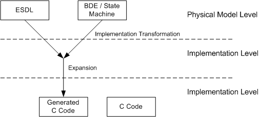
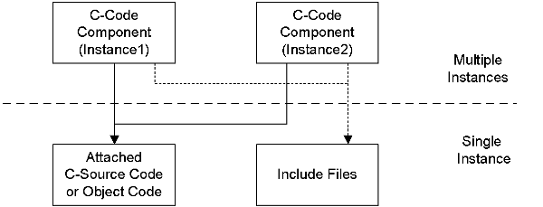
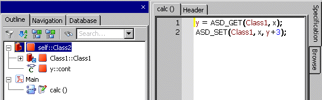
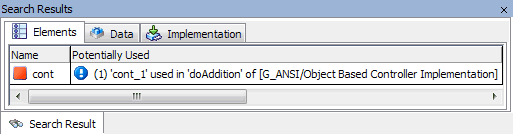

# Merged CHM Content

## Overview

_Source: `markdown/CC_Overview.md`_

# Overview - C Code Editor

The C code editor is used to specify classes, modules, or continuous time blocks in the C programming language. Components can be specified in C code either by typing in the code for the class, or by including existing programs and modifying them as required.

This section describes how to use the C code editor for specifying classes and modules. The C code editor is based on the same principles as the block diagram editor. For more information see [The Block Diagram Editor](BlockDiagramEditorEnglishUS.chm::/BDE_Overview.htm).

See also

[C Code Components](markdown/cc_c_code_components.md)

[The Block Diagram Editor - Overview](BlockDiagramEditorEnglishUS.chm::/BDE_Overview.htm)

[Creating a Method or Process](markdown/creating_method_process.md)

[External Editor](markdown/external_editor.md)

[Using the External Source Editor](markdown/using_external_source.md)

[Using the C Code Component](markdown/CC_using_CCode_component.md)

---

## C Code Components

_Source: `markdown/cc_c_code_components.md`_

# C Code Components

The specification of the body of methods and processes can be implemented in C code as well as in the form of block diagrams and ESDL. As with the other specification methods, only the body of a method or process has to be specified. The method declaration, the function head and frame, and the data instantiation and initialization are generated automatically.

In contrast to specifications in either ESDL or with block diagrams, components in C code are specified on the implementation level, rather than on the model level.

This has several important consequences:

- There is no transformation from the model to the implementation level.
- For each code variant (different target, different specification level, different implementations) the C code can be different. As a consequence, the code must be specified separately for each variant.
- The C code has to be adapted to the software architecture of the code generated by ASCET when user-defined types are used. This is because the interface is generated and the exact naming convention for the generated C functions depends on the expander and may not be transparent to the user. In the present expander, the identity tag of the class is used in the name for the generated functions in order to guarantee a unique name space.

See also

[Structure](markdown/cc_structure.md)

[Methods and Processes](markdown/cc_methods_and_processes.md)

[Overview - Variables and Function Parameters](markdown/CC_Overview_VariablesFunctionParameters.md)

[Header](markdown/CC_Header.md)

[External Source Code](markdown/CC_External_Source_Code.md)

[Overview - Access Macros](markdown/CC_Overview_-_Access_Macros.md)

---

## Structure

_Source: `markdown/cc_structure.md`_

# Structure

A component described with C code has the same structure as if it was described with ESDL or as a block diagram. The C code describes the body of methods or processes. Each code variant is stored separately.

The specification of a component in C code depends on:

- The target, e.g. whether the C code is for the PC, PPC or for a specific controller CPU. Here the code can vary, since, for instance, a controller CPU has special registers that have to be addressed directly, or the endian format is different.
- The specification level. The C code can be intended to represent the physical level. In that case the implementation level coincides with the physical level as far as possible, e.g. the type continuous is represented as a 64-bit float. Alternatively the C code can be on the implementation level of fixed point arithmetic.
- The chosen implementation, if the C code is on the implementation level, since the C code depends on the implementations of the variables, particularly on their quantizations.

See also

[Using the C Code Editor](markdown/CC_using_CCode_component.md)

[Methods and Processes](markdown/cc_methods_and_processes.md)

[Overview - Variables and Function Parameters](markdown/CC_Overview_VariablesFunctionParameters.md)

[Header](markdown/CC_Header.md)

---

## Methods and Processes

_Source: `markdown/cc_methods_and_processes.md`_

# Methods and Processes

For each method or process a C function is generated. The function head is generated automatically, the C code is only used in the function body itself.

Example:

The body of the method calc ()

a = b + d;

c = a * c;

could result in the following generated code (including function head), depending on the software architecture required for the experimental target:

void QX040H28HJ8HAMDJ870S4G7MDIBQQLSM_calc (struct QX040H28HJ8HAMDJ870S4G7MDIBQQLSM_Obj *self) {

...

/* BEGIN handwritten code */

/* calc 1 */a = b + d;

/* calc 2 */c = a * c;

/* END handwritten code */

...

}

The names of the functions generated for the methods and processes of components depend on the code expander and the software architecture of the generated code. The user has no influence on these names. Depending on the code expander a unique name space is achieved, i.e. methods at different classes can have the same name without any naming conflicts. In the above example the identity tag for the component is used to generate the unique name QX040H28HJ8HAMDJ870S4G7MDIBQQLSM_calc for the method calc.

See also

[Structure](markdown/cc_structure.md)

[Overview - Variables and Function Parameters](markdown/CC_Overview_VariablesFunctionParameters.md)

[Header](markdown/CC_Header.md)

[Conversion of Methods or Processes](BlockDiagramEditorEnglishUS.chm::/BDE_Conversion_MethodsProcesses.htm)

---

## Variables and Function Parameters

_Source: `markdown/CC_Overview_VariablesFunctionParameters.md`_

# Overview - Variables and Function Parameters

The variables of a component are held in a data structure that, like the function heads, is automatically generated. The user has no influence on this data structure. A part of this data structure consists of the instance variables of the component, which can be used in any method. Therefore they have to be passed to all generated functions. This data structure also depends on the code expander and the exact naming is therefore hidden from the user.

In the above example, the component has a data structure of its own that is passed to the generated function for the method calc. The data structure could look like this:

struct QX040H28HJ8HAMDJ870S4G7MDIBQQLSM_Obj {

ASDObjectHeader objectHeader;

real64_Obj *a;

real64_Obj *b;

real64_Obj *c;

real64_Obj *d;

};

The element names must be valid ANSI C identifiers. In addition to the reserved keywords of C, the names self and this are reserved.

When specifying components in C code, the user must ensure that the names of functions called in the method body do not collide with the names of variables defined in the interface of that same component.

See also

[Accessing Elements](markdown/CC_Accessing_Elements.md)

[Automatically Generated define Statements for Instance Variables](markdown/CC_Automatic_define_Statements_InstanceVariables.md)

[Working with Basic Elements](markdown/CC_Working_with_Basic_Elements.md)

[Messages](markdown/CC_Messages.md)

[Arguments](markdown/CC_Arguments.md)

[Local Variables](markdown/CC_Local_Variables.md)

[Characteristic Lines](markdown/CC_Characteristic_Lines.md)

[Characteristic Maps](markdown/CC_Characteristic_Maps.md)

[Structure](markdown/cc_structure.md)

[Header](markdown/CC_Header.md)

---

## Accessing Elements

_Source: `markdown/CC_Accessing_Elements.md`_

# Accessing Elements

To allow easy access to the elements of the component, a macro is defined automatically for each element. Each element can then be accessed simply by its element name.

The public elements defined in other components can be accessed from within C functions using the notation DefiningObject.PublicElement. Access is restricted to basic elements, arrays and matrices. The public interface of complex elements defined in other components, e.g. using the getAt, setAt or search and intepolate methods as in ESDL, cannot be accessed from C functions.

See also

[Overview - Variables and Function Parameters](markdown/CC_Overview_VariablesFunctionParameters.md)

[Automatically Generated define Statements for Instance Variables](markdown/CC_Automatic_define_Statements_InstanceVariables.md)

[Working with Basic Elements](markdown/CC_Working_with_Basic_Elements.md)

[Messages](markdown/CC_Messages.md)

[Arguments](markdown/CC_Arguments.md)

[Local Variables](markdown/CC_Local_Variables.md)

[Characteristic Lines](markdown/CC_Characteristic_Lines.md)

[Characteristic Maps](markdown/CC_Characteristic_Maps.md)

---

## Automatically Generated define Statements for Instance Variables

_Source: `markdown/CC_Automatic_define_Statements_InstanceVariables.md`_

# Automatically Generated define Statements for Instance Variables

#define a self->a->val

#define b self->b->val

#define d self->d->val

#define c self->c->val

/* BEGIN handwritten code */

/* calc 1 */a = b + d;

/* calc 2 */c = a * c;

/* END handwritten code */

#undef a

#undef b

#undef d

#undef c

See also

[Overview - Variables and Function Parameters](markdown/CC_Overview_VariablesFunctionParameters.md)

[Accessing Elements](markdown/CC_Accessing_Elements.md)

[Working with Basic Elements](markdown/CC_Working_with_Basic_Elements.md)

[Messages](markdown/CC_Messages.md)

[Arguments](markdown/CC_Arguments.md)

[Local Variables](markdown/CC_Local_Variables.md)

[Characteristic Lines](markdown/CC_Characteristic_Lines.md)

[Characteristic Maps](markdown/CC_Characteristic_Maps.md)

---

## Working with Basic Elements

_Source: `markdown/CC_Working_with_Basic_Elements.md`_

# Working with Basic Elements

For basic types, the method names of these types can be used. When accessing arrays or matrices, the index operator ’[]’ can be used in a C-like manner.

Since the method names of a user-defined type depend on the expander, the method of user-defined types can only be called with the knowledge of the exact generated function name for that method. In the above example the function name QX040H28HJ8HAMDJ870S4G7MDIBQQLSM_calc is generated for the method calc.

When using elements defined in ASCET, these elements are of a model type (either basic or user-defined). Basic types have the following default implementation, which is taken on the physical level:

- continuous = real64
- limitInt uses the specified interval
- wrapInt uses the specified interval
- udisc = unsigned int32
- sdisc = signed int32
- log = int16

Elements of type logical should not be used as numbers in the C code, since this depends on the default implementation, which is subject to change in further releases of ASCET.

The default implementation is replaced by the user-defined implementation when switching the specification level (e.g. fixed point code). Elements of model type logical can be represented for instance as a bit, and can therefore not be used as a number in the C code.

See also

[Scalar Types: Limited Integer](IntroductionEnglishUS.chm::/INT_ScalarTypes_LimitedInteger.htm)

[Scalar Types: Wrap-Around Integer](IntroductionEnglishUS.chm::/INT_ScalarTypes_WrapAroundInteger.htm)

[Overview - Variables and Function Parameters](markdown/CC_Overview_VariablesFunctionParameters.md)

[Accessing Elements](markdown/CC_Accessing_Elements.md)

[Automatically Generated define Statements for Instance Variables](markdown/CC_Automatic_define_Statements_InstanceVariables.md)

[Messages](markdown/CC_Messages.md)

[Arguments](markdown/CC_Arguments.md)

[Local Variables](markdown/CC_Local_Variables.md)

[Characteristic Lines](markdown/CC_Characteristic_Lines.md)

[Characteristic Maps](markdown/CC_Characteristic_Maps.md)

---

## Messages

_Source: `markdown/CC_Messages.md`_

# Messages

Messages are part of an intra-task (intra-process) communication concept used within ASCET models (see [Interprocess Communication](ProjectEditorEnglishUS.chm::/PE_Interprocess_Communication.htm)). To achieve data consistency, the ASCET code generation has to create additional message copies.

If messages are used within the functional code (read/write access), additional code is required to ensure safe copying of the current values from message originals to the local copies. Within the process body, only these local copies are used. At the end, all local copies which could change their value within the process body must be written back to the message originals.

In ESDL and block diagram components, ASCET generally detects very well, which messages are changed within a process. However, this functionality is of limited availability when using C code for the body specification. Here, the user has to take care of data consistency on his own.

In general, ASCET is not able to detect where and when a variable is written in user-specified C code. ASCET recognizes only a few special cases where, e.g., the variable name is followed by a =, or where assignment operators like ++ are used. If a variable is changed within a macro, an extern function, or via address operators and pointer arithmetic, ASCET does not detect the change.

When messages are used, this behavior results in message copies being created at the beginning of the process, but—under certain circumstances—not written back at the end.

See also

[Example: Messages](markdown/CC_Example__Messages.md)

[Overview - Variables and Function Parameters](markdown/CC_Overview_VariablesFunctionParameters.md)

[Accessing Elements](markdown/CC_Accessing_Elements.md)

[Automatically Generated define Statements for Instance Variables](markdown/CC_Automatic_define_Statements_InstanceVariables.md)

[Working with Basic Elements](markdown/CC_Working_with_Basic_Elements.md)

[Arguments](markdown/CC_Arguments.md)

[Local Variables](markdown/CC_Local_Variables.md)

[Characteristic Lines](markdown/CC_Characteristic_Lines.md)

[Characteristic Maps](markdown/CC_Characteristic_Maps.md)

---

## Example: Messages

_Source: `markdown/CC_Example__Messages.md`_

# Example: Messages

A simple example shall illustrate this. The module shown below contains the messages b2, c, and d. The messages c and d are directly written, b2 is used within a macro.

In the generated code, copies are initially created for all three messages (1). However, since only c and d are accessed in a way ASCET can recognize, only these two message copies are written back at the end (2). The change of message b2 that occurs in the macro, is not recognized and gets lost.

---

## Arguments

_Source: `markdown/CC_Arguments.md`_

# Arguments

Arguments of methods are mapped to function parameters in the parameter list of the function generated for the method. These are also accessed by the name of the argument.

See also

[Overview - Variables and Function Parameters](markdown/CC_Overview_VariablesFunctionParameters.md)

[Accessing Elements](markdown/CC_Accessing_Elements.md)

[Automatically Generated define Statements for Instance Variables](markdown/CC_Automatic_define_Statements_InstanceVariables.md)

[Working with Basic Elements](markdown/CC_Working_with_Basic_Elements.md)

[Messages](markdown/CC_Messages.md)

[Local Variables](markdown/CC_Local_Variables.md)

[Characteristic Lines](markdown/CC_Characteristic_Lines.md)

[Characteristic Maps](markdown/CC_Characteristic_Maps.md)

---

## Local Variables

_Source: `markdown/CC_Local_Variables.md`_

# Local Variables

Following the general C rules, function-local variables can be declared in the method body. Here only variables of a C data type can be declared, not however of an ASCET model type. In particular, no local variables of a user-defined type can be used in components within body specifications in C.

real64 i;

for (i=0; i < 10; i++)

{

sum = sum + a [i];

}

Since there is a code variant for each implementation variant, the user can define the local variables and their data types with respect to the implementation variant.

See also

[Overview - Variables and Function Parameters](markdown/CC_Overview_VariablesFunctionParameters.md)

[Accessing Elements](markdown/CC_Accessing_Elements.md)

[Automatically Generated define Statements for Instance Variables](markdown/CC_Automatic_define_Statements_InstanceVariables.md)

[Working with Basic Elements](markdown/CC_Working_with_Basic_Elements.md)

[Messages](markdown/CC_Messages.md)

[Arguments](markdown/CC_Arguments.md)

[Characteristic Lines](markdown/CC_Characteristic_Lines.md)

[Characteristic Maps](markdown/CC_Characteristic_Maps.md)

---

## Arrays and Matrices

_Source: `markdown/CC_Arrays_and_Matrices.md`_

# Arrays and Matrices

An array is a one-dimensional, indexed set of variables which have the same data type. In C code, arrays/matrices are available for all basic data types. The variables are accessed through the array/matrix indices, the first index position of each dimension is 0.

The maximal array or matrix size can be edited in the [Properties editor](ElementEditorEnglishUS.chm::/EED_Element_Editor_Basic_Elements.htm), the actual size can be edited in the table editor.

The array/matrix size cannot be modified at runtime. The maximum size for arrays is 2048 elements, the maximum size for matrices is 63 elements per dimension.

Array/matrix data can either be edited in the table editor or filed in from a tab-delimited ASCII file; see [The Table Editor (Editor for Combined Types)](DataEditorEnglishUS.chm::/DEd_editor_combined_types.htm).

In C code, elements of an array or matrix can be read and written to using the following syntax:

| Column 1 | Column 2 |
| --- | --- |
| array: | val = myArray[index]; myArray[index] = val; |
| matrix: | val = myMatrix[indX][indY]; myMatrix[indX][indY] = val; |

The first statement in each row reads the value of the array/matrix element at position index or indX/indY and assigns it to the variable val, which must be the same type as the array/matrix. Since array/matrix indices start from 0, myArray[3] returns the fourth element of myArray.

The second statement sets the value of the array/matrix element at position index or indX/indY to val, which must be the same data type as the array or matrix.

The actual size of an array/matrix can be determined using the following syntax:

| Column 1 | Column 2 |
| --- | --- |
| array: | length = myArray.length(); |
| matrix: | lengthX = myMatrix.xLength(); lengthY = myMatrix.yLength(); |

Arrays and matrices can have fixed or [variant](IntroductionEnglishUS.chm::/INT_VariantSize_ArraysMatrices.htm) sizes. In addition, arrays/matrices of kind Variable can have [variable](IntroductionEnglishUS.chm::/INT_VariableSize_ArraysMatrices.htm) sizes.

In the context of a project, you can use the [Protected Vector Indices option](ProjectEditorEnglishUS.chm::/PE_Code_Generation_Options.htm) to protect array/matrix indices against over- or underflow.

See also

[Properties Editor for Basic Elements](ElementEditorEnglishUS.chm::/EED_Element_Editor_Basic_Elements.htm)

[The Table Editor (Editor for Combined Types)](DataEditorEnglishUS.chm::/DEd_editor_combined_types.htm)

[Variant Size for Arrays and Matrices](IntroductionEnglishUS.chm::/INT_VariantSize_ArraysMatrices.htm)

[Variable Size for Arrays and Matrices](IntroductionEnglishUS.chm::/INT_VariableSize_ArraysMatrices.htm)

[Code Generation Options](ProjectEditorEnglishUS.chm::/PE_Code_Generation_Options.htm)

---

## Characteristic Lines

_Source: `markdown/CC_Characteristic_Lines.md`_

# Characteristic Lines

Characteristic lines defined in the component are evaluated via three subroutines each (as in ESDL).

Table LLpr from [Linear Interpolation (1D)](ESDLEditorEnglishUS.chm::/esdl_linear_interpolation(1d).htm) is again used as an example for a characteristic line.

| Column 1 | Column 2 | Column 3 | Column 4 | Column 5 | Column 6 | Column 7 | Column 8 |
| --- | --- | --- | --- | --- | --- | --- | --- |
| x axis points | 0.0 | 1000.0 | 2000.0 | 3000.0 | 4000.0 | 5000.0 | 6000.0 |
| values | 0.0 | 0.8 | 1.1 | 1.5 | 1.8 | 2.0 | 2.2 |

The CharTable1_getAt_real64_real64(charline, index) subroutine is usually sufficient for the evaluation of characteristic lines. Linear interpolation for this example works as follows:

tmpVal = CharTable1_getAt_real64_real64(LLpr,3000); // assigns 1.5 to tmpVal

tmpVal = CharTable1_getAt_real64_real64(LLpr,2280); // calculates interpolation factor for 2280 // interpolates value for 2280 as 1.212 and // assigns it to tmpVal

tmpVal = CharTable1_getAt_real64_real64(LLpr,9000); // calculates interpolation factor for 9000 // interpolates value for 9000 as 2.2 and // assigns it to tmpVal

In some special cases, though, separating the search and interpolate steps in tables can be more efficient. In these cases, the subroutines CharTable1_search_real64(charline, index) and CharTable1_interpol_real64_real64(charline) are used.

CharTable1_search_real64(LLpr, 1000); // sets sample point to 1000

tmpVal = CharTable1_interpol_real64_real64(LLpr); // assigns 0.8 to tmpVal

CharTable1_search_real64(LLpr, 2780); // calculates interpolation factor for 2780

tmpVal = CharTable1_interpol_real64_real64(LLpr); // interpolates value for 2780 as 1.412 and // assigns it to tmpVal

In addition to the interpolation routines provided by ASCET, you can add [user-defined interpolation routines](IntroductionEnglishUS.chm::/INT_UserDefinedInterpolationRoutines.htm), or you can mark interpolation routines as [high-resolution](IntroductionEnglishUS.chm::/INT_HighRes_InterpolationRoutines.htm).

The interpolation routines provided with ASCET are examples, not intended to be used in production or in ECUs running in a vehicle. See also the ASCET-SE user's guide.

See also

[Linear Interpolation (1D)](ESDLEditorEnglishUS.chm::/esdl_linear_interpolation(1d).htm)

[User-Defined Interpolation Routines](IntroductionEnglishUS.chm::/INT_UserDefinedInterpolationRoutines.htm)

[High-Resolution Interpolation Routines](IntroductionEnglishUS.chm::/INT_UserDefinedInterpolationRoutines.htm)

[Overview - Variables and Function Parameters](markdown/CC_Overview_VariablesFunctionParameters.md)

[Accessing Elements](markdown/CC_Accessing_Elements.md)

[Automatically Generated define Statements for Instance Variables](markdown/CC_Automatic_define_Statements_InstanceVariables.md)

[Working with Basic Elements](markdown/CC_Working_with_Basic_Elements.md)

[Messages](markdown/CC_Messages.md)

[Arguments](markdown/CC_Arguments.md)

[Local Variables](markdown/CC_Local_Variables.md)

[Characteristic Maps](markdown/CC_Characteristic_Maps.md)

---

## Characteristic Maps

_Source: `markdown/CC_Characteristic_Maps.md`_

# Characteristic Maps

Characteristic maps defined in the component are evaluated via three subroutines each (as in ESDL).

Table LLpr2 from [Linear Interpolation (2D)](esdleditorenglishus.chm::/esdl_linear_interpolation_(2d).htm) is again used as an example for a characteristic map:

| Column 1 | Column 2 | Column 3 | Column 4 | Column 5 |
| --- | --- | --- | --- | --- |
| y \ x | 0.0 | 1.0 | 8.0 | 15.0 |
| 1.0 | -5.0 | -3.0 | 0.0 | 1.0 |
| 3.0 | 0.0 | 1.0 | 4.0 | 6.0 |
| 5.0 | 8.0 | 5.0 | 4.0 | 4.0 |

The CharTable2_search_real64_real64(charline,indx, indY)subroutine is usually sufficient for the evaluation of characteristic lines. Linear interpolation for this example works as follows:

tmpVal = CharTable2_getAt_real64_real64_real64(LLpr2,8,5) // assigns 4.0 to tmpVal

tmpVal = CharTable2_getAt_real64_real64_real64(LLpr2,2,2); // calculates interpolation factor for x=2 and y=2 // interpolates value for (2,2) as -0.571 and // assigns it to tmpVal

tmpVal = CharTable2_getAt_real64_real64_real64(LLpr2,20,9); // calculates extrapolation factor for x=20, y=10 // extrapolates value for (20,10) as 5.0 and // assigns it to tmpVal

In some special cases, though, separating the search and interpolate steps in tables can be more efficient. In these cases, the subroutines CharTable2_search_real64_real64(charmap,indX, indY) and CharTable2_interpol_real64_real64_real64(charmap) are used.

CharTable2_search_real64_real64(LLpr2, 1, 3); // sets x sample point to 1 and y sample point to 3

tmpVal = CharTable2_interpol_real64_real64_real64(LLpr2); // assigns 1.0 to tmpVal

CharTable2_search_real64_real64(LLpr2,4,4); // calculates interpolation factor for x=4, y=4

tmpVal = CharTable2_interpol_real64_real64_real64(LLpr2); // interpolates value for (4,4) as 3.143 and // assigns it to tmpVal

In addition to the interpolation routines provided by ASCET, you can add [user-defined interpolation routines](IntroductionEnglishUS.chm::/INT_UserDefinedInterpolationRoutines.htm), or you can mark interpolation routines as [high-resolution](IntroductionEnglishUS.chm::/INT_HighRes_InterpolationRoutines.htm).

The interpolation routines provided with ASCET are examples, not intended to be used in production or in ECUs running in a vehicle. See also the ASCET-SE user's guide.

See also

[Linear Interpolation (2D)](esdleditorenglishus.chm::/esdl_linear_interpolation_(2d).htm)

[User-Defined Interpolation Routines](IntroductionEnglishUS.chm::/INT_UserDefinedInterpolationRoutines.htm)

[High-Resolution Interpolation Routines](IntroductionEnglishUS.chm::/INT_UserDefinedInterpolationRoutines.htm)

[Overview - Variables and Function Parameters](markdown/CC_Overview_VariablesFunctionParameters.md)

[Accessing Elements](markdown/CC_Accessing_Elements.md)

[Automatically Generated define Statements for Instance Variables](markdown/CC_Automatic_define_Statements_InstanceVariables.md)

[Working with Basic Elements](markdown/CC_Working_with_Basic_Elements.md)

[Messages](markdown/CC_Messages.md)

[Arguments](markdown/CC_Arguments.md)

[Local Variables](markdown/CC_Local_Variables.md)

[Characteristic Lines](markdown/CC_Characteristic_Lines.md)

[Two-Dimensional Tables - Description](ESDLEditorEnglishUS.chm::/ESDL_Two-Dimensional_Tables_-_Description.htm)

---

## Header

_Source: `markdown/CC_Header.md`_

# Header

Besides the description of the methods in the form of C code, a header can be defined for macros and for included files. This header has a local range restricted to the component. Therefore, no extra header file is generated, but the definitions are copied into the generated C code file.

---

## External Source Code

_Source: `markdown/CC_External_Source_Code.md`_

# External Source Code

Existing C code can be integrated by importing external C code source files. For this purpose, one C code file with a corresponding header file can be attached to each code variant of a component. The C code file contains standard C function definitions, the header file contains the corresponding function declarations and structure definitions. The defined functions can be called through the standard C conventions. It is possible to pass pointers and share defined structures between methods or processes of the component and the functions in the attached C code.

As an alternative to using a C code file, an object file with a corresponding header file can be attached to a component. Like the header files of the component itself, the range of the header files of the attached sources is local, i.e. they are copied into the generated C code.

The attached C file is compiled separately and linked to the other (generated and compiled) C source files. As a consequence, this compiled unit exists only once within any given context. If the code and the included data is shared between multiple instances of the same component, all instances share the same compiled unit.

The data in an attached C file is shared between multiple instances of the component, and not instantiated for each of the instances.

Additionally it is possible to have include statements in the C code. The include files however are not stored in the database/workspace, they are stored on the file system. The include statement must contain the file path to these include files. The C code therefore depends not only on items in the database/workspace but also on the file structure of the current installation. Therefore care has to be taken when exchanging data, since these files are not known to the ASCET system.

When using include files the user must take care of the correct references to these files on their own.

The figure indicates the use of external source code.

See also

[Integrating an External Source File](markdown/integrating_external_source.md)

---

## Programming Model Interface

_Source: `markdown/cc_programming_model_interface.md`_

# Programming Model Interface

In earlier ASCET versions, the names of classes and methods could only be used in C code, if they were labeled with an escape symbol ("@"). By means of this mechanism, the so called Programming Model Interface (PMI) was activated. Since ASCET 4.x, class and method names are recognized automatically, i.e. no escape symbol is necessary and the PMI is used by default (see also the description of [code generation options](ProjectEditorEnglishUS.chm::/PE_Settings_for_Window.htm)). Therefore, the escape symbol is obsolete and should not be used any longer when modelling in C code. For backward compatibility, however, the escape symbol can still be used when modifying the respective code generation option.

---

## Access Macros

_Source: `markdown/CC_Overview_-_Access_Macros.md`_

# Overview - Access Macros

Similar to access methods in ESDL, ASCET offers access macros for the usage with C code components. For the following operations, special macros are defined. By means of these macros, the user can apply pre-defined operations in the C code. The macros are described in the following sections.

See also

[Direct Access](markdown/CC_Direct_Acess.md)

[Length of Arrays](markdown/CC_Length_of_Arrays.md)

[Resource Access](markdown/CC_Resource_Access.md)

[Access to Private Methods](markdown/CC_Acess_to_Private_Methods.md)

[Making Arrays Available for Usage in External C-Code](markdown/CC_Making_Arrays_Avaiable_for_Usage_in_External_C-Code.md)

---

## Direct Access

_Source: `markdown/CC_Direct_Acess.md`_

# Direct Access

Elements of classes embedded into C code components can be accessed directly using the macros

ASD_GET(receiver, variable);

and

ASD_SET(receiver, variable, value);

Example:

See also

[Overview - Access Macros](markdown/CC_Overview_-_Access_Macros.md)

[Length of Arrays](markdown/CC_Length_of_Arrays.md)

[Resource Access](markdown/CC_Resource_Access.md)

[Access to Private Methods](markdown/CC_Acess_to_Private_Methods.md)

[Making Arrays Available for Usage in External C-Code](markdown/CC_Making_Arrays_Avaiable_for_Usage_in_External_C-Code.md)

---

## Length of Arrays

_Source: `markdown/CC_Length_of_Arrays.md`_

# Length of Arrays

The current length of an array can be determined using the macro

ASD_LENGTH (receiver);

Example:

z = ASD_LENGTH(array);

See also

[Overview - Access Macros](markdown/CC_Overview_-_Access_Macros.md)

[Direct Access](markdown/CC_Direct_Acess.md)

[Resource Access](markdown/CC_Resource_Access.md)

[Access to Private Methods](markdown/CC_Acess_to_Private_Methods.md)

[Making Arrays Available for Usage in External C-Code](markdown/CC_Making_Arrays_Avaiable_for_Usage_in_External_C-Code.md)

---

## Resource Access

_Source: `markdown/CC_Resource_Access.md`_

# Resource Access

Resources can be reserved and released using the macros

ASD_RESERVE(resource);

and

ASD_RELEASE(resource);

See also

[Overview - Access Macros](markdown/CC_Overview_-_Access_Macros.md)

[Direct Access](markdown/CC_Direct_Acess.md)

[Length of Arrays](markdown/CC_Length_of_Arrays.md)

[Access to Private Methods](markdown/CC_Acess_to_Private_Methods.md)

[Making Arrays Available for Usage in External C-Code](markdown/CC_Making_Arrays_Avaiable_for_Usage_in_External_C-Code.md)

---

## Access to Private Methods

_Source: `markdown/CC_Acess_to_Private_Methods.md`_

# Access to Private Methods

Private methods can be accessed using

self.

Example:

y = self.method_private(x);

See also

[Overview - Access Macros](markdown/CC_Overview_-_Access_Macros.md)

[Direct Access](markdown/CC_Direct_Acess.md)

[Length of Arrays](markdown/CC_Length_of_Arrays.md)

[Resource Access](markdown/CC_Resource_Access.md)

[Making Arrays Available for Usage in External C-Code](markdown/CC_Making_Arrays_Avaiable_for_Usage_in_External_C-Code.md)

---

## Making Arrays Available for Usage in External C Code

_Source: `markdown/CC_Making_Arrays_Avaiable_for_Usage_in_External_C-Code.md`_

# Making Arrays Available for Usage in External C Code

Using the macro

ASD_USE_ARRAY_EXTERNAL(array)

array access can be converted from the ASCET internal representation to the standard C code representation. The macro is a synonym for:

&array[0]

Example:

y = c_function(ASD_USE_ARRAY_EXTERNAL(array));

See also

[Overview - Access Macros](markdown/CC_Overview_-_Access_Macros.md)

[Direct Access](markdown/CC_Direct_Acess.md)

[Length of Arrays](markdown/CC_Length_of_Arrays.md)

[Resource Access](markdown/CC_Resource_Access.md)

[Access to Private Methods](markdown/CC_Acess_to_Private_Methods.md)

---

## Using the C Code Editor

_Source: `markdown/CC_using_CCode_component.md`_

# Using the C Code Editor

The Outline, Navigation and Database/Workspace panes work in the same way as in the block diagram editor. The outline feature is available, but it only serves to structure the methods of the component into groups of public and private methods. The code for the body of each method or process of a C code component is shown in the code pane, when the method or process is selected in the Outline tab. The title bar shows the name of the component, the current project and the current target.

The Target combo box shows the current target. A C code component can contain code for several targets, but the code has to be specified for each target individually. This is because C code is platform-dependent; you cannot assume that C code developed for one platform will run on another platform without modifications.

Different experimentation arithmetic, e.g. floating point or fixed point is possible for each target; the C code has to be specified separately for each of them. It is possible to copy the code for each target/arithmetic combination to any other, so you only need to enter the code once, and it can then be adapted as required.

If the body of a C code method or process is empty for the combination of target, arithmetic, and implementation selected in the associated project, the following warning is issued: WARNING (WBDL2): process/method name (using <C Code>) is not defined If an empty method requires a return value, an error is issued: ERROR(YBdl22): method <name> must be defined; need a return value

You will specify the body of a method or process in the code pane. A method corresponds to a function in C, i.e. it can have several arguments but only one return value. A process has neither arguments nor return values. The declaration of the function is generated by ASCET, the user has to define only the content of the function.

calc (a,b)

{

<user-defined content in C Code >

}

The arguments and return values of the function are specified as in the Block Diagram Editor.

If you want to include any system libraries, you can do this with an ordinary include statement. This is written in the header of the class or module. Click on the Header tab of the Code pane to display the header. Variables local to a method are also declared here with normal C-statements. The scope of a variable is the method or process it has been declared in, i.e. you cannot reference a variable that was declared in one method or process in another one.

Basic elements are created as in the block diagram editor by clicking on one of the element buttons. Elements work like elements in components described by block diagrams, i.e. they can be used in all methods or processes of the component, and can also be made global. Once you have created an element, you can reference it by simply typing its name in the Code pane.

Similarly, you can define arguments and return values for classes, and messages for modules, as you would in a block diagram component. However, if the component is to reference other components there is a difference in syntax; you should therefore decide early on whether the component references others.

See also

[The Block Diagram Editor - Overview](BlockDiagramEditorEnglishUS.chm::/BDE_Overview.htm)

[Copying C Code for Single Classes or Modules](markdown/copy_ccode_single.md)

---

## Specifying Components in C Code

_Source: `markdown/creating_method_process.md`_

# Specifying Components in C Code

For each C code module or class, one process (named process) or one method (named calc) is created automatically. Creating methods and processes, as well as specifying their interfaces, is the same as in the block diagram editor and is described in [Defining a Component Interface](BlockDiagramEditorEnglishUS.chm::/DefiningInterface.htm). Creating basic elements (See [Creating a Basic Element](BlockDiagramEditorEnglishUS.chm::/BasicElement.htm)) and enumerations (See [Inserting an Enumeration](BlockDiagramEditorEnglishUS.chm::/InsertEnumeration.htm)), including components as complex elements (See [Including a Component as a Complex Element](BlockDiagramEditorEnglishUS.chm::/IncludeComponent.htm)) and editing notes (See [Editing the Notes for a Component](BlockDiagramEditorEnglishUS.chm::/BDE_Editnotes.htm)) also works the same way as in block diagrams.

See also

[Specifying a Method or Process](markdown/CC_specifying_method.md)

[Copying C code for Single Classes or Modules](markdown/copy_ccode_single.md)

[Editing the Code for a Method or Process](markdown/CC_edit_code.md)

[Searching and Replacing C Code](markdown/search_replace_ccode.md)

[Saving a Method or Process](markdown/CC_saving_method.md)

[Printing the C Code](markdown/printing_ccode.md)

[Defining a Component Signature](BlockDiagramEditorEnglishUS.chm::/DefiningInterface.htm)

[Creating a Basic Element](BlockDiagramEditorEnglishUS.chm::/BasicElement.htm)

[Inserting an Enumeration](BlockDiagramEditorEnglishUS.chm::/InsertEnumeration.htm)

[Including a Component as a Complex Element](BlockDiagramEditorEnglishUS.chm::/IncludeComponent.htm)

[Editing the Notes for a Component](BlockDiagramEditorEnglishUS.chm::/BDE_Editnotes.htm)

---

## External Editor

_Source: `markdown/external_editor.md`_

# External Editor

The editor available for creating C code is limited and can only carry out simple operations. Another way of creating code is to select a user defined external editor (e.g. Notepad, Codewright, etc.). As the external editor is connected via a file system, files with the suffixes *.c and *.h must be associated with the editor in the Windows configuration. Without this association, the external editor cannot be opened from the ASCET environment. However, an error message indicates that the association is missing.

After using the button for the external editor, the view of the C code editor is changed. It is divided into an upper section listing all the available methods or processes of a component and a lower section showing the C code.

When the external editor is opened, the code for a method or a process is written to one or more files which are stored in a temporary directory. After you have finished working, the files first have to be saved in the external editor, before they can be returned to the ASCET environment. Closing the external editor from the ASCET environment writes the stored code changes from the external editor to the ASCET environment, at the same time reading and deleting the temporary file. Code changes made afterwards in the external editor environment can no longer be returned to the ASCET environment. If you need to re-edit the code, you must call the external editor from the ASCET environment again.

In order to return code changes made in the external editor to the ASCET environment, you must save the code in the external editor first.

See also

[Opening an External Editor](markdown/open-external-editor.md)

[Closing an External Editor](markdown/CC_close_external_editor.md)

[Ending the External Editor Mode](markdown/end-external-editor.md)

---

## External Source Editor

_Source: `markdown/using_external_source.md`_

# External Source Editor

The external source editor allows you to integrate existing C-programs and use them as part of the specification of a C code component. You can include either C-source or object code. All the functions contained in an external source file (for both source and object modules) have to be declared in a header file that is also part of the component.

External modules also have to be specified separately for each target and arithmetic. Target and arithmetic selection is as described earlier.

See also

[Integrating an External Source File](markdown/integrating_external_source.md)

[Adding a Header File to the Source Module](markdown/adding_headerfile.md)

[Testing the External Module](markdown/testing-external_module.md)

---

## Creating a C Code Component

_Source: `markdown/creating_c_code.md`_

# Creating a C Code Component

To create a C Code component, proceed as follows:

1. In the Component Manager, select a folder for the new component.
1. In the Insert menu, point to Class or Module and select C Code.
1. Use the or  buttons.
1. Type in a name for the component and press Enter.
1. Do one of the following:

The C code editor for the new component opens.

---

## Filtering the Tree Pane

_Source: `markdown/cc_filtering_the_component_pane.md`_

# Filtering the Tree Pane

The Outline tab can be filtered. To do so, proceed as follows.

1. In the Outline tab, click on the  button.

The Options window opens in the Outline Tree node.

1. In the Elements subnode, activate the options of the items you want to display in the tab.
1. Go to the Methods subnode to set filter options for processes and methods.
1. Click OK to close the Options window.

Only items with activated options are shown in the tab. The button is marked with a green symbol to indicate an active filter: 

The filter settings made here affect all component editors.

See also

[Searching the Tree Pane](IntroductionEnglishUS.chm::/INT_SearchTreePane.htm)

---

## Specifying a Method or Process

_Source: `markdown/CC_specifying_method.md`_

# Specifying a Method or Process

To specify a method or process, proceed as follows:

1. In the Outline tab, select the method or process you want to specify.

The name of the method appears on the left tab.

1. From the Target combo box, select a target.

All targets installed on your ASCET system are available in the list.

1. From the Arithmetic combo box, select an arithmetic for the code.
1. Click on the Header tab.
1. Enter the header information for the class or method, e.g. local variables, include statements or macros.
1. Click on the <method name> tab.
1. Enter the code for the method.

Basic elements defined in the Outline tab can be referred to simply by typing their names. This is however only the case if no referenced components are used within the component.

1. Repeat for all methods or processes.

---

## Selecting a Default Method/Process

_Source: `markdown/cc_selectdefaultmethodprocess.md`_

# Selecting a Default Method/Process

In each diagram, one method or one process can be selected as default method/process. The default method/process of the first diagram is displayed when you open the component in the C code editor.

Proceed as follows.

1. In the Outline tab, open the method/process list of a diagram.
1. Do one of the following:
1. Right-click the method you want to select as default method, and select Default Method from the context menu.
1. Right-click the process you want to select as default process, and select Default Process from the context menu.

The selected method or process is now the default method/process.

See also

[Block Diagram Editor - Shifting a Diagram](BlockDiagramEditorEnglishUS.chm::/MoveDiagram.htm)

---

## Copying C Code for Single Classes or Modules

_Source: `markdown/copy_ccode_single.md`_

# Copying C Code for Single Classes or Modules

As C code is always platform-dependent, you have to specify the code of a C code component for each combination of target, arithmetic (or experiment type), and implementation individually. You can copy code developed for one combination to another one.

If the body of a C code method or process is empty for the combination of target, arithmetic, and implementation selected in the associated project, the following warning is issued: WARNING (WBDL2): component name (using <C Code>) is not defined If an empty method requires a return value, an error is issued: ERROR(YBdl22): method <name> must be defined; need a return value

To copy existing C code of a single class or module to another combination of target, arithmetic, and implementation, use one of the two possibilities described here (via Copy To) and in [Using Copy From](markdown/CC_copy_code_from.md).

1. Open the module/class in the C code editor.
1. In the Target combo box, select the target the C code was written for.
1. In the Arithmetic combo box, select the experiment type the C code was written for.
1. In the Implementation combo box, select the implementation the C code was written for.
1. In the Tools menu, point to Code Variants and select Copy To.
1. In the Code for Target field, select the target to which you want to copy the code.
1. In the Code Gen. Arithmetic field, select the appropriate experiment type.
1. In the Implementation field, select the implementation you want to use.
1. Click on OK.

The C code is copied to the selected combination of target, arithmetic, and implementation.

See also

[Using Copy From](markdown/CC_copy_code_from.md)

---

## Using Copy From

_Source: `markdown/CC_copy_code_from.md`_

# Using Copy From

As C code is always platform-dependent, you have to specify the code of a C code component for each combination of target, arithmetic (or experiment type), and implementation individually. You can copy code developed for one combination to another one.

If the body of a C code method or process is empty for the combination of target, arithmetic, and implementation selected in the associated project, the following warning is issued: WARNING (WBDL2): component name (using <C Code>) is not defined If an empty method requires a return value, an error is issued: ERROR(YBdl22): method <name> must be defined; need a return value

To copy existing C code of a single class or module to another combination of target, arithmetic, and implementation, use one of the two possibilities described here (via Copy From) and in [Copying C Code for Single Classes or Modules](markdown/copy_ccode_single.md).

1. Open the module/class in the C code editor.
1. In the C code editor, use the Target, Arithmetic, and Implementation combo boxes to select the target, experiment type, and implementation you intend to use.
1. In the Tools menu, point to Code Variants and select Copy From.

The Selection Required window opens.

1. Select the target, experiment type, and implementation you want to copy the code from, and click OK.

The C code is copied to the current target.

See also

[Copying C Code for Single Classes or Modules](markdown/copy_ccode_single.md)

---

## Editing the Code for a Method or Process

_Source: `markdown/CC_edit_code.md`_

# Editing the Code for a Method or Process

To edit the code for a method or process, proceed as follows:

1. Highlight the section of code you want to edit
1. In the Edit menu, select Select All to highlight the entire code of the current method or process.
1. In the Edit menu, select Cut to remove the code highlighted and store it on the clipboard.
1. In the Edit menu, select Copy to copy the highlighted code to the clipboard.
1. In the Edit menu, select Paste to paste the code from the clipboard.

The text you cut or copy is stored on the Windows clipboard and can be exchanged between other applications (e.g. C development systems). You can also copy and paste code between methods or processes, or between components.

---

## Finding and Replacing C Code

_Source: `markdown/search_replace_ccode.md`_

# Finding and Replacing C Code

To find and replace C Code, proceed as follows:

1. Select the Specification view.
1. Open the Edit menu and select Find/Replace.
1. In the Find field, enter a search string.
1. In the Replace With field, enter a replace string.
1. Use the options below the Replace With field to customize the search.
1. Click the Find Next button to find the next occurrence of the search string.
1. To replace a single occurrence of the search string, do one of the following.
1. Click Replace All to replace all occurrences.
1. To extend the search to all methods/processes of the component, proceed as follows.
1. Click Close to close the Find/Replace window.

See also

[Find/Replace Dialog Window](IntroductionEnglishUS.chm::/INT_FindReplace_Window.htm)

---

## Searching/Deleting Unused Elements

_Source: `markdown/CC_SearchDeleteUnusedElements.md`_

# Searching/Deleting Unused Elements

To delete elements (scalar, composite, complex) not used in the C code, proceed as follows:

1. In the Extras menu, select Show Unused Elements.
1. In the Elements tab of the Search Results view, select one, several, or all (Ctrl + a) elements.
1. Do one of the following:

- Open the context menu and select Delete.
- Press Delete.

The selected unused elements are deleted.

See also

[Search Results View](markdown/CC_SearchResultsView.md)

/* Heikki Komulainen, Comet Computer GmbH 2004 */ cc_plus_pic = '&nbsp;'; cc_minus_pic = '&nbsp;'; cc_stat_pic = '&nbsp;'; gpstyle = ''; var iframes_created = 0; if (document.body && document.body.insertAdjacentHTML && document.getElementsByTagName && document.getElementById) { collect_popups(); set_poplinks_pictures(); if (iframes_created) { document.write(gpstyle); document.write('
<nobr><a id="einauslink" style="position:absolute;top:expression(document.body.scrollTop + this.offsetHeight - this.offsetHeight);left:expression(document.body.offsetWidth - (this.offsetWidth + 28));background:#ffffe0;padding:5px" href="javascript:show_all_poptext()">Show all hidden text</a></nobr>
'); } } function collect_popups() { bsscpopups = new Array(); for (x = 0; x < document.links.length; x++) { if (document.links[x].href.indexOf("BSSCPopup")>-1) { seekmatch = /BSSCPopup.'[^'](markdown/+)'/; poplink = seekmatch.exec(document.links[x].href); poplink = "" + poplink; poplink = poplink.substring(poplink.indexOf("'")+1, poplink.lastIndexOf("'")); ifid = "CCGENIFRAMEID" + x; new_iframe = '<iframe id="' + ifid + '"src="' + poplink + '" onload="get_text(\'' + ifid + '\')" width="0" height="0" frameborder=0></iframe>'; document.links[x].parentNode.insertAdjacentHTML("afterEnd", new_iframe); gpid = "CCID_" + ifid; document.links[x].href = "javascript:expand_poptext('" + gpid + "')"; cc_plus = '' + cc_plus_pic + ''; document.links[x].insertAdjacentHTML("afterBegin", cc_plus); iframes_created = 1; } } }// end function function get_text(ifr_id) { frpars = document.frames[ifr_id].document.getElementsByTagName("body"); popbody = frpars[0].innerHTML; gpid = "CCID_" + ifr_id; if (!document.getElementById(gpid)) { //avoiding doubles document.getElementById(ifr_id).insertAdjacentHTML("afterEnd", '
'+popbody+'
'); } }//end function function expand_poptext(x_frame_id) { if (!document.getElementById(x_frame_id)) return; if (document.getElementById(x_frame_id).className == "CCGENPOPTEXTH") { document.getElementById(x_frame_id).className = "CCGENPOPTEXTV"; document.getElementById(x_frame_id).style.visibility = "visible"; if (document.getElementById("CCPMB_" + x_frame_id )) { document.getElementById("CCPMB_" + x_frame_id ).innerHTML = cc_minus_pic; } } else { document.getElementById(x_frame_id).className = "CCGENPOPTEXTH"; document.getElementById(x_frame_id).style.visibility = "hidden"; if (document.getElementById("CCPMB_" + x_frame_id )) { document.getElementById("CCPMB_" + x_frame_id ).innerHTML = cc_plus_pic; } } }// end function function show_all_poptext() { var pulldowntxt = document.getElementsByTagName("div"); for (b = 0; b < pulldowntxt.length; b++) { if (pulldowntxt[b].className == "droptext") { pulldowntxt[b].style.display=""; } } var gptxt = document.getElementsByTagName("div"); for (z = 0; z < gptxt.length; z++) { if (gptxt[z].className == "CCGENPOPTEXTH") { gptxt[z].className = "CCGENPOPTEXTV"; gptxt[z].style.visibility = "visible"; if (document.getElementById("CCPMB_" + gptxt[z].id )) { document.getElementById("CCPMB_" + gptxt[z].id ).innerHTML = cc_minus_pic; } } } var dxpoplinks = document.getElementsByTagName("a"); if (dxpoplinks) { for (pxl = 0; pxl < dxpoplinks.length; pxl++) { if (dxpoplinks[pxl].href.indexOf("kadovTextPopup")>-1) { if (document.getElementById("CCPMB_" + dxpoplinks[pxl].id)) { document.getElementById("CCPMB_" + dxpoplinks[pxl].id).innerHTML = cc_stat_pic; dxpoplinks[pxl].symbol = "minus"; } } } } document.getElementById('einauslink').innerText = 'Hide all hideable text'; document.getElementById('einauslink').href = "javascript:self.location.reload()"; self.focus(); }// end function function eat_click() { return false; }// end function function set_poplinks_pictures() { var dpoplinks = document.getElementsByTagName("a"); if (dpoplinks) { for (pl = 0; pl < dpoplinks.length; pl++) { if (dpoplinks[pl].href.indexOf("kadovTextPopup")>-1) { cc_plus = '' + cc_stat_pic + ''; //dpoplinks[pl].onmouseup = plusminuspoplink; dpoplinks[pl].insertAdjacentHTML("afterBegin", cc_plus); dpoplinks[pl].symbol = "plus"; } } } }// end function function plusminuspoplink() { if (document.getElementById("CCPMB_" + this.id)) { if (this.symbol == "plus") { document.getElementById("CCPMB_" + this.id).innerHTML = cc_minus_pic; this.symbol = "minus"; } else { document.getElementById("CCPMB_" + this.id).innerHTML = cc_plus_pic; this.symbol = "plus"; } } return true; }

---

## Saving a Method or Process

_Source: `markdown/CC_saving_method.md`_

# Saving a Method or Process

To save a method or process, proceed as follows:

- In the File menu, select Save

or

- Press Ctrl + s to save the current method or process.

This command is only available if the current method or process has been changed since it was last saved. If you switch between methods without saving, you are asked whether you want to save the current method.

---

## Printing the C Code

_Source: `markdown/printing_ccode.md`_

# Printing the C Code

To print the C code, proceed as follows:

1. In the File menu, select Print to print the code to your default printer.
1. In the File menu, select Printer Setup to select a printer.

The Printer Selection window opens.

1. Select a printer in the Printers field.
1. Click on Setup to change the printer setup.
1. In the printer setup window, make the settings.
1. Click OK to accept the selection.

The Printer Font Selection window opens.

1. Select the font you want to use.
1. Click OK to accept the selection.

---

## Including a Component via the Block Library

_Source: `markdown/cc_includecomponent_blocklibrary.md`_

# Including a Component via the Block Library

When you stored frequently used components in a block library, you can include them via the Library palette. Proceed as follows.

1. In the Component pane, go to the Outline tab.
1. In the Library palette, use the combo box to select the category that contains the desired item.
1. In the item list, select the item you want to add to the component.
1. Drag the item to the Outline tab.

The item is included in the edited component.

See also

[Block Libraries](ComponentManagerEnglishUS.chm::/CM_BlockLibraries.htm)

[Library Palette](markdown/CC_Library_Palette.md)

---

## Opening an External Editor

_Source: `markdown/open-external-editor.md`_

# Opening an External Editor

To open an external editor, proceed as follows:

1. Click on the  button in the General toolbar.
1. From the selection field, select the method or process for which you wish to change the code.
1. Click on Start Edit to open the external editor with the code of the highlighted method or process.
1. Edit the code in the external editor.

See also

[Closing an External Editor](markdown/CC_close_external_editor.md)

[Ending the External Editor Mode](markdown/end-external-editor.md)

---

## Closing an External Editor

_Source: `markdown/CC_close_external_editor.md`_

# Closing an External Editor

To close an external editor, proceed as follows:

1. Save the newly created or modified code in the external editor.
1. In the C code editor, click on the Update button.

The current version of the code modifications in the external editor is transmitted to the ASCET environment. The code changes are displayed in the text field.

This does not close the connection to the external editor. Thus, you can continue working in the external editor, making changes and, when you have saved these changes, updating them in the ASCET environment.

1. Click on the End Edit button to stop working with the external editor.

The connection to the external editor is closed, the green pen in the method or process symbol is deleted. Any changes made afterwards in the open external editor are not applied.

1. Close the external editor.

See also

[Opening an External Editor](markdown/open-external-editor.md)

[Ending the External Editor Mode](markdown/end-external-editor.md)

---

## Ending the External Editor Mode

_Source: `markdown/end-external-editor.md`_

# Ending the External Editor Mode

To end the external editor mode, proceed as follows:

1. Click on the  button.
1. If necessary, save the file in the external editor to include the most recent alterations.
1. Confirm the warning.

The external editor mode is ended, and the original view of the C code editor is restored.

See also

[Opening an External Editor](markdown/open-external-editor.md)

[Closing an External Editor](markdown/CC_close_external_editor.md)

---

## Integrating an External Source File

_Source: `markdown/integrating_external_source.md`_

# Integrating an External Source File

To integrate an external source file, proceed as follows:

1. Click the  Switch to External Source Editor button.
1. In the External Source Editor, click the Code tab.
1. Activate the C Code or Object Code option.
1. Enter the functions of the external module (option C Code only).
1. Do the following to load a C code or object module.
1. If desired, open the Edit menu and use the Store to File option to save the external module.
1. [Add a header file](markdown/adding_headerfile.md).

The same editing commands are available in the external source editor as in the C code editor.

See also

[Adding a Header File to the Source Module](markdown/adding_headerfile.md)

[Testing the External Module](markdown/testing-external_module.md)

[External Source Editor](markdown/using_external_source.md)

---

## Adding a Header File to the Source Module

_Source: `markdown/adding_headerfile.md`_

# Adding a Header File to the Source Module

If an external class contains an external source module, there also has to be a header file that declares the functions in the source module.

To add a header file to the source module, proceed as follows:

1. Click on the Header tab.
1. Type in the text of the header file or load it as described in step 5 of [Integrating an External Source File](markdown/integrating_external_source.md).
1. Activate the Use header global option to use the same header file for all your C code.
1. [Test the external module](markdown/testing-external_module.md).

See also

[Integrating an External Source File](markdown/integrating_external_source.md)

[Testing the External Module](markdown/testing-external_module.md)

[External Source Editor](markdown/using_external_source.md)

---

## Testing the External Module

_Source: `markdown/testing-external_module.md`_

# Testing the External Module

To test the external module, proceed as follows:

1. Perform one of the following actions.
1. If you are working with a database larger than 3 GB, [another step is inserted](javascript:BSSCPopup('codegen_dbtoolarge.htm');)<!-- kadovFilePopupInit('a1'); //-->.

This command calls up the currently selected compiler and compiles the .c and .h files in the external module. This does not result in any executable code, but merely serves as a test whether the source code is syntactically correct. If it is not, the compiler will display the appropriate error messages.

See also

[Integrating an External Source File](markdown/integrating_external_source.md)

[Adding a Header File to the Source Module](markdown/adding_headerfile.md)

[External Source Editor](markdown/using_external_source.md)

/* Heikki Komulainen, Comet Computer GmbH 2004 */ cc_plus_pic = '&nbsp;'; cc_minus_pic = '&nbsp;'; cc_stat_pic = '&nbsp;'; gpstyle = ''; var iframes_created = 0; if (document.body && document.body.insertAdjacentHTML && document.getElementsByTagName && document.getElementById) { collect_popups(); set_poplinks_pictures(); if (iframes_created) { document.write(gpstyle); document.write('
<nobr><a id="einauslink" style="position:absolute;top:expression(document.body.scrollTop + this.offsetHeight - this.offsetHeight);left:expression(document.body.offsetWidth - (this.offsetWidth + 28));background:#ffffe0;padding:5px" href="javascript:show_all_poptext()">Show all hidden text</a></nobr>
'); } } function collect_popups() { bsscpopups = new Array(); for (x = 0; x < document.links.length; x++) { if (document.links[x].href.indexOf("BSSCPopup")>-1) { seekmatch = /BSSCPopup.'[^'](markdown/+)'/; poplink = seekmatch.exec(document.links[x].href); poplink = "" + poplink; poplink = poplink.substring(poplink.indexOf("'")+1, poplink.lastIndexOf("'")); ifid = "CCGENIFRAMEID" + x; new_iframe = '<iframe id="' + ifid + '"src="' + poplink + '" onload="get_text(\'' + ifid + '\')" width="0" height="0" frameborder=0></iframe>'; document.links[x].parentNode.insertAdjacentHTML("afterEnd", new_iframe); gpid = "CCID_" + ifid; document.links[x].href = "javascript:expand_poptext('" + gpid + "')"; cc_plus = '' + cc_plus_pic + ''; document.links[x].insertAdjacentHTML("afterBegin", cc_plus); iframes_created = 1; } } }// end function function get_text(ifr_id) { frpars = document.frames[ifr_id].document.getElementsByTagName("body"); popbody = frpars[0].innerHTML; gpid = "CCID_" + ifr_id; if (!document.getElementById(gpid)) { //avoiding doubles document.getElementById(ifr_id).insertAdjacentHTML("afterEnd", '
'+popbody+'
'); } }//end function function expand_poptext(x_frame_id) { if (!document.getElementById(x_frame_id)) return; if (document.getElementById(x_frame_id).className == "CCGENPOPTEXTH") { document.getElementById(x_frame_id).className = "CCGENPOPTEXTV"; document.getElementById(x_frame_id).style.visibility = "visible"; if (document.getElementById("CCPMB_" + x_frame_id )) { document.getElementById("CCPMB_" + x_frame_id ).innerHTML = cc_minus_pic; } } else { document.getElementById(x_frame_id).className = "CCGENPOPTEXTH"; document.getElementById(x_frame_id).style.visibility = "hidden"; if (document.getElementById("CCPMB_" + x_frame_id )) { document.getElementById("CCPMB_" + x_frame_id ).innerHTML = cc_plus_pic; } } }// end function function show_all_poptext() { var pulldowntxt = document.getElementsByTagName("div"); for (b = 0; b < pulldowntxt.length; b++) { if (pulldowntxt[b].className == "droptext") { pulldowntxt[b].style.display=""; } } var gptxt = document.getElementsByTagName("div"); for (z = 0; z < gptxt.length; z++) { if (gptxt[z].className == "CCGENPOPTEXTH") { gptxt[z].className = "CCGENPOPTEXTV"; gptxt[z].style.visibility = "visible"; if (document.getElementById("CCPMB_" + gptxt[z].id )) { document.getElementById("CCPMB_" + gptxt[z].id ).innerHTML = cc_minus_pic; } } } var dxpoplinks = document.getElementsByTagName("a"); if (dxpoplinks) { for (pxl = 0; pxl < dxpoplinks.length; pxl++) { if (dxpoplinks[pxl].href.indexOf("kadovTextPopup")>-1) { if (document.getElementById("CCPMB_" + dxpoplinks[pxl].id)) { document.getElementById("CCPMB_" + dxpoplinks[pxl].id).innerHTML = cc_stat_pic; dxpoplinks[pxl].symbol = "minus"; } } } } document.getElementById('einauslink').innerText = 'Hide all hideable text'; document.getElementById('einauslink').href = "javascript:self.location.reload()"; self.focus(); }// end function function eat_click() { return false; }// end function function set_poplinks_pictures() { var dpoplinks = document.getElementsByTagName("a"); if (dpoplinks) { for (pl = 0; pl < dpoplinks.length; pl++) { if (dpoplinks[pl].href.indexOf("kadovTextPopup")>-1) { cc_plus = '' + cc_stat_pic + ''; //dpoplinks[pl].onmouseup = plusminuspoplink; dpoplinks[pl].insertAdjacentHTML("afterBegin", cc_plus); dpoplinks[pl].symbol = "plus"; } } } }// end function function plusminuspoplink() { if (document.getElementById("CCPMB_" + this.id)) { if (this.symbol == "plus") { document.getElementById("CCPMB_" + this.id).innerHTML = cc_minus_pic; this.symbol = "minus"; } else { document.getElementById("CCPMB_" + this.id).innerHTML = cc_plus_pic; this.symbol = "plus"; } } return true; }

---

## C Code Editor - Window Elements

_Source: `markdown/CC_Description_of_Window_Elements.md`_

# C Code Editor - Window Elements

The C code editor window contains the following window elements:

- [Menu Bar](markdown/CC_menu_bar.md)
- Toolbars
- [General](markdown/CC_Toolbar_General.md) toolbar
- [Elements](markdown/CC_Toolbar_Elements.md) toolbar

- [Tree](markdown/cc_componentpane.md) pane

This pane lists all elements of the component.

- Outline tab
- Navigation tab
- Database/Workspace tab
- [Elements](markdown/CC_Elements_Palette.md) palette

- [Library](markdown/CC_Library_Palette.md) palette

- [Specification](markdown/CC_Specification_View.md) View
- [Search Results View](markdown/CC_SearchResultsView.md)
- [Browse](markdown/CC_Browse_View.md) View
- [External Editor View](markdown/CC_External_Editor_View.md)

This view is used for component specification via an external editor. It is opened with the  button in the General toolbar.

- status bar

The status bar contains information on the element currently selected in the Outline tab (if the Mouse Over option on the [Editors](ComponentManagerEnglishUS.chm::/cm_options_for_editors.htm) node of the ASCET options is deactivated) or on the element in the Outline tab the mouse is currently placed on (if the Mouse Over option is activated).

---

## Toolbars

_Source: `markdown/CC_Toolbars.md`_

# Toolbars

The following toolbars are available in the C-Code Editor:

- [General](markdown/CC_Toolbar_General.md)
- [Elements](markdown/CC_Toolbar_Elements.md)

---

## Toolbar General

_Source: `markdown/CC_Toolbar_General.md`_

# Toolbar General - C-Code Editor

The toolbar General contains following icons:

| Column 1 | Column 2 |
| --- | --- |
|  | Save |
|  | Print |
|  | Cut |
|  | Copy |
|  | Paste |
|  | Delete |
|  | Undo |
|  | Redo |
|  | Edit Component Data |
|  | Edit Component Implementation |
|  | Insert Component |
|  | Insert Method |
|  | Insert Process |
|  | Generate Code |
|  | Compile Generated Code |
|  | Open Experiment for selected Experiment Target |
|  | Select Online Type |
|  | Switch to External Source Editor |
|  | Activate External Editor |

---

## Toolbar Elements

_Source: `markdown/CC_Toolbar_Elements.md`_

# Toolbar Elements - C-Code Editor

The toolbar Elements contains the following icons:

<table style="x-cell-content-align: Top;
				margin-top: 3px;
				border-left-style: Outset;
				border-top-style: Outset;
				border-right-style: Outset;
				border-bottom-style: Outset;
				border-left-width: 1px;
				border-right-width: 1px;
				border-top-width: 1px;
				border-bottom-width: 1px;" x-use-null-cells="">
<col/>
<col/>
<col/>
<tr class="hcp1" valign="top">
<td class="hcp2">

</td>
<td class="hcp2">

Variable
</td>
<td class="hcp2" colspan="1" rowspan="2">

The  button opens the element type 
 selection menu. The Variable and Parameter 
 buttons can be used to create elements of type logic, limitInt, wrapInt, 
 udisc, sdisc, or cont.

By default, the limitInt and wrapInt types are displayed. To display the sdisc 
 and udisc types instead, the <a href="ComponentManagerEnglishUS.chm::/cm_options_for_editors.htm">editor 
 option</a> Use signed/unsigned discrete types must 
 be activated.
</td></tr>
<tr class="hcp1" valign="top">
<td class="hcp2">

</td>
<td class="hcp2">

Parameter
</td>
</tr>
<tr class="hcp1" valign="top">
<td class="hcp2">

</td>
<td class="hcp2">

Delta t
</td>
<td class="hcp2">

dt system parameter

The name dT 
 is reserved for the system parameter. You cannot create any other element 
 with the name dT. 
 Since upper and lower case letters are not distinguished, the names DT, 
 dt, and Dt are reserved, too.
</td></tr>
<tr class="hcp1" valign="top">
<td class="hcp2">

</td>
<td class="hcp2">

Resource
</td>
<td class="hcp2">

See also <a href="IntroductionEnglishUS.chm::/INT_resources.htm">Resources</a>.
</td></tr>
<tr class="hcp1" valign="top">
<td class="hcp2">

</td>
<td class="hcp2">

Receive Message
</td>
<td class="hcp2" colspan="1" rowspan="3">

These buttons can be used to create scalar messages 
 only. 

See also <a href="IntroductionEnglishUS.chm::/INT_messages.htm">Messages</a>.
</td></tr>
<tr class="hcp1" valign="top">
<td class="hcp2">

</td>
<td class="hcp2">

Send Receive Message
</td>
</tr>
<tr class="hcp1" valign="top">
<td class="hcp2">

</td>
<td class="hcp2">

Send Message
</td>
</tr>
<tr class="hcp1" valign="top">
<td class="hcp2">

</td>
<td class="hcp2">

Array
</td>
<td class="hcp2" colspan="1" rowspan="2">

See also <a href="IntroductionEnglishUS.chm::/INT_Array.htm">Array</a> 
 and <a href="IntroductionEnglishUS.chm::/INT_matrix.htm">Matrix</a>.
</td></tr>
<tr class="hcp1" valign="top">
<td class="hcp2">

</td>
<td class="hcp2">

Matrix
</td>
</tr>
<tr class="hcp1" valign="top">
<td class="hcp2">

</td>
<td class="hcp2">

Distribution
</td>
<td class="hcp2">

See also <a href="IntroductionEnglishUS.chm::/INT_group_table_and_distribution.htm">Group 
 Table and Distribution</a>.
</td></tr>
<tr class="hcp1" valign="top">
<td class="hcp2">

</td>
<td class="hcp2">

OneD Table
</td>
<td class="hcp2" colspan="1" rowspan="2">

The  button opens the table type selection 
 menu. The table buttons can be used to create normal, group, or fixed 
 tables. 

See also <a href="IntroductionEnglishUS.chm::/INT_characteristic_lines_and_maps.htm">Characteristic 
 Lines and Maps</a>.
</td></tr>
<tr class="hcp1" valign="top">
<td class="hcp2">

</td>
<td class="hcp2">

TwoD Table
</td>
</tr>
</table>

---

## Menus

_Source: `markdown/CC_menu_bar.md`_

# Menu Bar

This menu bar contains the following menus:

- [File](markdown/CC_File_Menu.md)
- [Edit](markdown/CC_edit.md)
- [View](markdown/CC_view.md)
- [Insert](markdown/CC_Insert_Menu.md)
- [Build](markdown/CC_Build_Menu.md)
- [Extras](markdown/CC_Extras_Menu.md)
- [Tools](markdown/CC_Tools_Menu.md)
- [Window](markdown/CC_Window_Menu.md)
- [Help](markdown/CC_Help_Menu.md)

---

## File Menu

_Source: `markdown/CC_File_Menu.md`_

# File Menu

This menu contains the following functions:

Save (Ctrl + s)

Saves the C-Code component.

Import

Data

| Column 1 | Column 2 |
| --- | --- |
| For Selected Element | Import data for selected element. |

Export

Component

Saves the currently selected component to the file that is selected in the Select Export File window.

Generated Code

Saves the code generated in the file system.

| Column 1 | Column 2 |
| --- | --- |
| Flat | The edited component. |
| Recursive | The referenced components. |
| Generic | Files out generic code for external make. |

Data

Exports a component data set.

| Column 1 | Column 2 |
| --- | --- |
| For Component | Exports a component dataset. |
| For Selected Element | Exports data for the selected elements. |

Print

Prints the C-Code.

Print Setup

Opens a printer setup window.

Close

Exits the C-Code editor.

---

## Edit Menu

_Source: `markdown/CC_edit.md`_

# Edit Menu

This menu contains the following functions:

Undo (Ctrl + z)

Reverses the most recent action.

Redo (Ctrl + y)

Reverses an undo command.

Cut (Ctrl + x)

Cuts (deletes and copies to the ASCET clipboard) selected code.

Copy (Ctrl + c)

Copies selected code or selected element to the ASCET clipboard.

Paste (Ctrl + v)

Pastes code or an element from the ASCET clipboard.

Delete (Del)

Deletes selected lines of code or selected elements.

Rename (F2)

Renames a selected element or method/process.

Find/Replace (Ctrl + f)

Opens the editor for finding and replacing ESDL code.

Search (Ctrl + Shift + s)

Searches the component as described in [Browsing the Database or Workspace](ComponentManagerEnglishUS.chm::/Browsing.htm). The range is limited to the edited component and its included components.

Select All (Ctrl + a)

Selects all text in the Specification Panel.

Replace Component

Replaces a component with another component. The name of the old component remains.

Open Component

Opens the specification editor for a selected included component.

Notes...

Opens the notes editor for an included component - you can make notes about the included component here.

Properties... (Ctrl + Shift + p)

Edits the properties of the selected element.

Data... (Ctrl + Shift + d)

Opens the data editor for the selected element.

Implementation (Ctrl + Shift + i)

The implementation editor for the selected element opens. Search of component implementations is possible.

Set Cache Locking

These menu options are used in connection with ASCET-RP. See [ES1135: Cache Locking](INTECRIOConnectivityRPEnglishUS.chm::/IIO_ES1135CacheLocking.htm) for a description.

Component

| Column 1 | Column 2 |
| --- | --- |
| Data | Opens the data editor for the component. Search of component data is possible. |
| Implementation | Opens the implementation editor for the component. Search of component implementations is possible. |
| Layout | Opens the layout editor for the component. |
| Notes | Opens the notes editor - you can make notes about the component here. |

---

## View Menu

_Source: `markdown/CC_view.md`_

# View Menu

This menu contains the following functions:

Show/Hide

Shows/hides several parts of the editor or the component.

| Column 1 | Column 2 |
| --- | --- |
| Tree Pane | Shows/hides Tree pane. |
| Search Results | Browse area for unused elements (see Searching Unused Elements ). |
| Toolbars | The General and Elements menu options show/hide the respective toolbars. |
| Palettes | The Elements and Block Library menu options show/hide the respective palettes. |

Configure

| Column 1 | Column 2 |
| --- | --- |
| Toolbar General | Select the buttons to be visible in the General toolbar (see Configuring a Toolbar ). |
| Toolbar Elements | Select the buttons to be visible in the Elements toolbar. |
| Reset Toolbar Configuration | Reset toolbar to default configuration. |

See also

[Searching Unused Elements](markdown/CC_SearchDeleteUnusedElements.md)

[Configuring a Toolbar](IntroductionEnglishUS.chm::/INT_Configuring_Toolbar.htm)

---

## Insert Menu

_Source: `markdown/CC_Insert_Menu.md`_

# Insert Menu

This menu contains the following functions:

Component

Inserts a component as a complex element.

Method

Creates a method.

Process

Creates a process.

Load From File

Loads the file selected in the Choose a file! dialog to the currently active code tab.

Save to File

Saves the code from the currently active tab to the file selected in the Choose a file! dialog.

Diagram

Creates a new diagram.

| Column 1 | Column 2 |
| --- | --- |
| Public | Contains only public methods. |
| Private | Contains only private methods. |

---

## Build Menu

_Source: `markdown/CC_Build_Menu.md`_

# Build Menu

This menu contains the following functions:

Touch

Forced regeneration during the next code generation.

| Column 1 | Column 2 |
| --- | --- |
| Flat | The edited component. |
| Recursive | The referenced components. |

Clean Code Generation Directory

Deletes all files in the code generation directory.

Analyze Diagram

Analyzes the syntax of the C code.

View Generated Code

Generates the C code for the component and displays it in a text editor. The text editor can be selected in the ASCET option window, ASCII Editor node (see [Setting ASCET Options](ComponentManagerEnglishUS.chm::/SettingASCET.htm)).

Generate Code (Ctrl + F7)

Generates the C code for a component.

Compile

Compiles the generated C code. Not available in the context of a project with the EHOOKS target.

Experiment

Starts an experiment. Not available in the context of a project with the EHOOKS target.

See also

[Setting ASCET Options](ComponentManagerEnglishUS.chm::/SettingASCET.htm)

---

## Extras Menu

_Source: `markdown/CC_Extras_Menu.md`_

# Extras Menu

This menu bar contains the following menus:

##### Browse to Parent Component

Opens an editor for the including component. (The option is only available if an included component is being edited.)

##### Show

| Column 1 | Column 2 |
| --- | --- |
| Path | Shows the path of an element or included component. |

##### Copy Path to Clipboard

Copies the path of an included component to the clipboard.

| Column 1 | Column 2 |
| --- | --- |
| Model Path | Model Path. |
| Model asd:// Link | Path in ASCET protocol format that allows operating/referencing an ASCET component in a model as hyperlink. |
| Database Path | Database/workspace path. |
| Database asd:// Link | Path in ASCET protocol format that allows operating/referencing an ASCET component in the database/workspace as hyperlink. |

##### Create ASCET Link

Creates an [ASCET link](IntroductionEnglishUS.chm::/INT_ASCETLinks.htm) for an element selected in the Outline tab. The link opens the component in the C code editor and (except for the self element, i.e. the root of the element tree) highlights the element in the Outline tab.

##### Default Project

Allows editing the default project used for experimenting with components.

| Column 1 | Column 2 |
| --- | --- |
| Open | Opens an editor for the default project. |
| Resolve Globals | Automatically creates a global element for each imported element in the component for which there is no exported element. For each explicit reference among the imported elements, Resolve Globals creates an exported reference in the default project. These exported references are not initialized; you have to initialize the exported references manually. |
| Delete Unused Globals | Deletes unused global elements. |

##### Check Dependency

Checks whether the allocation of formal parameters to the model parameters is correct.

##### Show Unused Elements

Opens the Search Results view and lists all elements from the Tree pane that do not appear in the code.

See also

[ASCET Links](IntroductionEnglishUS.chm::/INT_ASCETLinks.htm)

[Default Projects](ProjectEditorEnglishUS.chm::/PE_defaultproject.htm)

[Initialization of Explicit References](IntroductionEnglishUS.chm::/INT_InitExplicitReferences.htm)

---

## Tools Menu

_Source: `markdown/CC_Tools_Menu.md`_

# Tools Menu

This menu contains the following functions:

Code Variants

Allows exporting code to and importing code from different targets.

| Column 1 | Column 2 |
| --- | --- |
| Copy To | The Copy C-Code To dialog opens. Select your target, code generation arithmetic and implementation and click OK . The code is exported to the selected target. |
| Copy From | The Selection Required Window opens. Select the target to copy C code from and click OK . The code is imported from the selected target. |

Options

Opens the ASCET options dialog window.

See also

[Setting ASCET Options](ComponentManagerEnglishUS.chm::/SettingASCET.htm)

---

## Window Menu

_Source: `markdown/CC_Window_Menu.md`_

# Window Menu

This menu contains the following functions:

Move Up Diagram

Moves a diagram (upwards).

Move Down Diagram

Moves a diagram (downwards).

Move Method to...

Moves methods/processes between diagrams.

---

## Help Menu

_Source: `markdown/CC_Help_Menu.md`_

# Help Menu

This menu contains the following functions:

Contents (F1)

Shows the help contents.

Index

Shows the help index.

---

## Tree Pane

_Source: `markdown/cc_componentpane.md`_

# Tree Pane

The tree pane contains following three tabs and filter functions:

##### Outline

In this tab all elements of the component self:<component name> are listed. Also you find all methods and processes in this tab.

For a better handling of these elements you can use several filters and a search function:

| Column 1 | Column 2 |
| --- | --- |
|  | Opens the Options dialog window, reduced to the settings of the Filter. |
|  | Changes the criteria of sort. |
|  | Expands the trees in the Outline tab. |
|  | Collapses the trees in the Outline tab. |
|  | Runs a search in the Outline tab for the admitted letters. |

##### Navigation

In this tab all diagrams, methods and processes of the component are listed in a tree view. Elements used in a method or process are displayed as subnodes of the method or process. A double-click on an element opens its method in the Specification view.

| Column 1 | Column 2 |
| --- | --- |
|  | Expands the trees in the Navigation tab. |
|  | Collapses the trees in the Navigation tab. |
|  | Runs a search in the Navigation tab for the admitted letters. |

##### Database / Workspace

The folders and items contained in the current database are displayed here. The database name is the root of the tree structure. Each database contains one or more folders, which in turn contain other folders and database items.

| Column 1 | Column 2 |
| --- | --- |
|  | Expands the Database / Workspace tree. |
|  | Collapses the Database / Workspace tree. |
|  | Runs a search in the Database / Workspace tab for the admitted letters. |

See also

[Filtering the Tree Pane](markdown/cc_filtering_the_component_pane.md)

[Searching the Tree Pane](IntroductionEnglishUS.chm::/INT_SearchTreePane.htm)

---

## Context Menu for Components and Elements

_Source: `markdown/cc_contextmenu_componentselements.md`_

# Context Menu for Components and Elements

In the Outline tab, the context menu of a component or element - including method signature elements and process-local elements - contains the following functions:

Copy (Ctrl + c)

Copies a selected included component or element to the ASCET clipboard.

Paste (Ctrl + v)

Pastes a component or element of the ASCET clipboard.

Delete (Del)

Deletes a selected included component or element.

Rename (F2)

Renames a selected included component or element.

Replace Component

Replaces a component with another included component. The name of the old component remains.

Open Component

Opens the specification editor for a selected included component.

Notes

Opens the notes editor for a selected included component - you can make notes about the included component here.

Properties (Ctrl + Shift + p)

Opens the Properties editor for a selected included component or element.

Data (Ctrl + Shift + d)

Opens the data editor for a selected included component or element.

Implementation (Ctrl + Shift + i)

Opens the implementation editor for a selected included component or element. Search of component implementations is possible.

Set Cache Locking

These menu options are used in connection with ASCET-RP. See [ES1135: Cache Locking](INTECRIOConnectivityRPEnglishUS.chm::/IIO_ES1135CacheLocking.htm) for a description.

Show Path

Shows the path of an element or included component.

Copy Path to Clipboard

Copies the path of an selected included component to the clipboard.

| Column 1 | Column 2 |
| --- | --- |
| Model Path | Model Path. |
| Model asd:// Link | Path in ASCET protocol format that allows operating/referencing an ASCET component in a model as hyperlink. |
| Database Path | Database/workspace path. |
| Database asd:// Link | Path in ASCET protocol format that allows operating/referencing an ASCET component in the database/workspace as hyperlink. |

Create ASCET Link

Creates an ASCET link (see [ASCET Links](IntroductionEnglishUS.chm::/INT_ASCETLinks.htm)) that opens the component in the respective component editor and (except for the self element, i.e. the root of the element tree) highlights the element.

Import

Data

| Column 1 | Column 2 |
| --- | --- |
| For Selected Element | Imports data for a selected element. |

Export

Component (Ctrl + e)

Exports the current component or element.

Generated Code

Exports the generated code.

| Column 1 | Column 2 |
| --- | --- |
| Flat | Exports the generated code of the edited components. |
| Recursive | Exports the generated code of the referenced components also. |
| Generic | Exports the generated code for processing at a later point using external tools, e.g. an external Make/Build process. |

Data

Exports a component data set.

| Column 1 | Column 2 |
| --- | --- |
| For Component | Exports a component dataset. |
| For Selected Element | Exports data for the selected elements. |

Insert Component

Inserts a component in the editor.

---

## Context Menu for Diagrams, Methods and Processes

_Source: `markdown/cc_contextmenu_diagrammethods.md`_

# Context Menu for Diagrams, Methods and Processes

In the Outline tab, the context menu of a diagram, method or process contains the following functions:

Copy (Ctrl + c)

Copies a selected method or process to the ASCET clipboard.

Paste (Ctrl + v)

Pastes the method or process of the ASCET clipboard.

Delete (Del)

Deletes a selected diagram, method or process.

Rename (F2)

Renames a selected diagram, method or process.

Properties (Ctrl + Shift + p)

Opens the signature editor for a selected method/process.

Implementation (Ctrl + Shift + i)

Opens the implementation editor for a selected method/process.

Add Diagram

| Column 1 | Column 2 |
| --- | --- |
| Public | Adds a public diagram. |
| Private | Adds a private diagram. |

Create ASCET Link

Creates an ASCET link (see [ASCET Links](IntroductionEnglishUS.chm::/INT_ASCETLinks.htm)) that opens the component and highlights the selected diagram, method or process.

Load Diagram

Loads the diagram in the Specification view.

Move Up Diagram

Moves a diagram up in the Outline tab.

Move Down Diagram

Moves a diagram down in the Outline tab.

Move Method to

Moves a method/process from one diagram to another diagram.

Default Method or Default Process

Marks the selected method or process as default method/process (see also [Selecting a Default Method/Process](markdown/cc_selectdefaultmethodprocess.md)).

Add Method

Adds a method to a diagram.

Add Process

Adds a process to a diagram.

---

## Specification View

_Source: `markdown/CC_Specification_View.md`_

# Specification View

The Specification view contains the following elements:

- <method name> tab

In this tab, you enter the code for the method or process body.

- Header tab

In this tab, you enter header information, e.g. declaration of method-/process-local variables, include statements for system libraries, etc.

- Target combo box

This combo box is used to show the currently selected target that belongs to the code in the tabs, and to select a different target. The target PC is always available, more targets appear when you install ASCET-RP or ASCET-SE.

- Arithmetic combo box

This combo box is used to display the currently selected experimentation arithmetic for the component, and to select a different arithmetic. Possible values are:

| Column 1 | Column 2 |
| --- | --- |
| Physical Experiment | Floating-point arithmetic. |
| Quantized Physical Experiment | Quantized floating-point arithmetic. |
| Implementation Experiment | Fixed-point arithmetic. |
| Object Based Controller Implementation | Fixed-point arithmetic with additional optimizations for the electronic control unit. Only for use with microcontroller targets. |

- Implementation combo box

This combo box is only available when you selected the Implementation Experiment or Object Based Controller Implementation arithmetic. It is used to display the currently selected implementation for the component, and to select a different implementation. The Impl. implementation is always available; more entries appear when you add further implementation to the component's project or default project.

- [context menu](markdown/CC_ContextMenu_SpecificationView.md)

---

## Context Menu Specification View

_Source: `markdown/CC_ContextMenu_SpecificationView.md`_

# Context Menu Specification View

The context menu of the Specification view contains the following functions:

- Cut

Cuts (deletes and copies to the ASCET clipboard) selected code.

- Copy

Copies selected code to the ASCET clipboard.

- Paste

Pastes code from the ASCET clipboard.

- Find/Replace

Opens the editor for finding and replacing C code. See also [Finding and Replacing C Code](markdown/search_replace_ccode.md).

- Create ASCET Link

Creates an [ASCET link](IntroductionEnglishUS.chm::/INT_ASCETLinks.htm) for a selected piece of code. If no code is selected, the ASCET link is generated for the cursor position.

The link opens the component in the C code editor and highlights the code, or sets the cursor to the specified position, in the Specification view.

- Select All

Selects the entire content of the current method/process.

The context menu options Properties, Data and Implementation are only available when the cursor is placed in an element (including included components) name, or when exactly one element name is selected. These context menu options are not available for signature elements.

- Data

Edits the properties of the element marked via the cursor or via selection.

- Data

Edits the data of the element marked via the cursor or via selection.

- Implementation

Edits the implementation of the element marked via the cursor or via selection.

- Show Path

This context menu option is only useful when the cursor is placed in an element (including interface elements and included components) name, or when exactly one element name is selected. Otherwise, the path of the element selected in the Outline tab is shown.

Shows the path of the element or included component marked via the cursor or via selection.

---

## Search Results View

_Source: `markdown/CC_SearchResultsView.md`_

A class contains a variable cont, which appears in the C code for target G_ANSI and arithmetic Object Based Controller Implementation. The active selection is target PC and arithmetic Physical Experiment.

If the Search Results view is opened with the Show Unused Elements option, cont appears in the list with the following entry in column Potentially Used:

# Search Results View

The Search Results view is opened with the Show Unused Elements option in the Extras menu.

The view contains the following elements:

- Elements tab

This tab corresponds largely to the element view of the Component Manager. It has an additional column, Potentially Used, which informs you in case an element is used in other code variants.

[Example](javascript:kadovTextPopup(this))<!-- kadovTextPopupInit('a1'); //-->

Three dots at the entry indicate that the element is used in more than one other variant; the Potentially Used context menu option opens a window that lists all variants that us the element.

- Data tab

This tab corresponds to the data view of the Component Manager.

- Implementation tab

This tab corresponds to the implementation view of the Component Manager.

- context menus

The context menus of the Search Results view contains the same [context menu options](componentmanagerenglishus.chm::/cm_contextmenus.htm) as the context menus in the respective views of the component manager. There is one exception, though; the context menu in the Elements tab contains an additional option:

- Potentially Used

Opens the Ignored Elements window that lists all variants that use the element.

See also

[Searching/Deleting Unused Elements](markdown/CC_SearchDeleteUnusedElements.md)

[Element View](ComponentManagerEnglishUS.chm::/The_Element_View.htm)

[Data View](ComponentManagerEnglishUS.chm::/Data_View.htm)

[Implementation View](ComponentManagerEnglishUS.chm::/Implementation_View.htm)

[Component Manager - Context Menus](ComponentManagerEnglishUS.chm::/cm_contextmenus.htm)

/* Heikki Komulainen, Comet Computer GmbH 2004 */ cc_plus_pic = '&nbsp;'; cc_minus_pic = '&nbsp;'; cc_stat_pic = '&nbsp;'; gpstyle = ''; var iframes_created = 0; if (document.body && document.body.insertAdjacentHTML && document.getElementsByTagName && document.getElementById) { collect_popups(); set_poplinks_pictures(); if (iframes_created) { document.write(gpstyle); document.write('
<nobr><a id="einauslink" style="position:absolute;top:expression(document.body.scrollTop + this.offsetHeight - this.offsetHeight);left:expression(document.body.offsetWidth - (this.offsetWidth + 28));background:white;padding:5px" href="javascript:show_all_poptext()">Show all hidden text</a></nobr>
'); } } function collect_popups() { bsscpopups = new Array(); for (x = 0; x < document.links.length; x++) { if (document.links[x].href.indexOf("BSSCPopup")>-1) { seekmatch = /BSSCPopup.'[^'](markdown/+)'/; poplink = seekmatch.exec(document.links[x].href); poplink = "" + poplink; poplink = poplink.substring(poplink.indexOf("'")+1, poplink.lastIndexOf("'")); ifid = "CCGENIFRAMEID" + x; new_iframe = '<iframe id="' + ifid + '"src="' + poplink + '" onload="get_text(\'' + ifid + '\')" width="0" height="0" frameborder=0></iframe>'; document.links[x].parentNode.insertAdjacentHTML("afterEnd", new_iframe); gpid = "CCID_" + ifid; document.links[x].href = "javascript:expand_poptext('" + gpid + "')"; cc_plus = '' + cc_plus_pic + ''; document.links[x].insertAdjacentHTML("afterBegin", cc_plus); iframes_created = 1; } } }// end function function get_text(ifr_id) { frpars = document.frames[ifr_id].document.getElementsByTagName("body"); popbody = frpars[0].innerHTML; gpid = "CCID_" + ifr_id; if (!document.getElementById(gpid)) { //avoiding doubles document.getElementById(ifr_id).insertAdjacentHTML("afterEnd", '
'+popbody+'
'); } }//end function function expand_poptext(x_frame_id) { if (!document.getElementById(x_frame_id)) return; if (document.getElementById(x_frame_id).className == "CCGENPOPTEXTH") { document.getElementById(x_frame_id).className = "CCGENPOPTEXTV"; document.getElementById(x_frame_id).style.visibility = "visible"; if (document.getElementById("CCPMB_" + x_frame_id )) { document.getElementById("CCPMB_" + x_frame_id ).innerHTML = cc_minus_pic; } } else { document.getElementById(x_frame_id).className = "CCGENPOPTEXTH"; document.getElementById(x_frame_id).style.visibility = "hidden"; if (document.getElementById("CCPMB_" + x_frame_id )) { document.getElementById("CCPMB_" + x_frame_id ).innerHTML = cc_plus_pic; } } }// end function function show_all_poptext() { var pulldowntxt = document.getElementsByTagName("div"); for (b = 0; b < pulldowntxt.length; b++) { if (pulldowntxt[b].className == "droptext") { pulldowntxt[b].style.display=""; } } var gptxt = document.getElementsByTagName("div"); for (z = 0; z < gptxt.length; z++) { if (gptxt[z].className == "CCGENPOPTEXTH") { gptxt[z].className = "CCGENPOPTEXTV"; gptxt[z].style.visibility = "visible"; if (document.getElementById("CCPMB_" + gptxt[z].id )) { document.getElementById("CCPMB_" + gptxt[z].id ).innerHTML = cc_minus_pic; } } } var dxpoplinks = document.getElementsByTagName("a"); if (dxpoplinks) { for (pxl = 0; pxl < dxpoplinks.length; pxl++) { if (dxpoplinks[pxl].href.indexOf("kadovTextPopup")>-1) { if (document.getElementById("CCPMB_" + dxpoplinks[pxl].id)) { document.getElementById("CCPMB_" + dxpoplinks[pxl].id).innerHTML = cc_stat_pic; dxpoplinks[pxl].symbol = "minus"; } } } } document.getElementById('einauslink').innerText = 'Hide all hideable text'; document.getElementById('einauslink').href = "javascript:self.location.reload()"; self.focus(); }// end function function eat_click() { return false; }// end function function set_poplinks_pictures() { var dpoplinks = document.getElementsByTagName("a"); if (dpoplinks) { for (pl = 0; pl < dpoplinks.length; pl++) { if (dpoplinks[pl].href.indexOf("kadovTextPopup")>-1) { cc_plus = '' + cc_stat_pic + ''; //dpoplinks[pl].onmouseup = plusminuspoplink; dpoplinks[pl].insertAdjacentHTML("afterBegin", cc_plus); dpoplinks[pl].symbol = "plus"; } } } }// end function function plusminuspoplink() { if (document.getElementById("CCPMB_" + this.id)) { if (this.symbol == "plus") { document.getElementById("CCPMB_" + this.id).innerHTML = cc_minus_pic; this.symbol = "minus"; } else { document.getElementById("CCPMB_" + this.id).innerHTML = cc_plus_pic; this.symbol = "plus"; } } return true; }

---

## Browse View

_Source: `markdown/CC_Browse_View.md`_

# Browse View

The Browse view contains the following elements:

- [Element View](ComponentManagerEnglishUS.chm::/The_Element_View.htm)

This tab corresponds to the element view of the Component Manager.

- [Data View](ComponentManagerEnglishUS.chm::/Data_View.htm)

This tab corresponds to the data view of the Component Manager.

- [Implementation View](ComponentManagerEnglishUS.chm::/Implementation_View.htm)

This tab corresponds to the implementation view of the Component Manager.

- [Methods View](ComponentManagerEnglishUS.chm::/CM_Methods_View.htm)

This tab corresponds to the methods view of the Component Manager.

This tab corresponds to the layout view of the Component Manager.

---

## Context Menu Browse View and Search Results View

_Source: `markdown/cc_contextmenu_browseview.md`_

# Context Menu Browse View and Search Results View

The context menus of the Browse view and the Search Results view contain a subset of the following functions:

- Edit (Return) Elements tab Opens the properties editor for the selected element. Data tab Opens the data editor for the selected element. Implementation tab Opens the implementation editor for the selected element. Methods tab Opens the signature editor for the selected method/process. Layout tab Opens the layout editor for the component. This is the only entry in the context menu of the Layout tab.

- Edit Implementation

Opens the implementation editor for the selected method/process (Methods tab).

- Copy (Ctrl + c)

| Column 1 | Column 2 |
| --- | --- |
| Elements tab | Copies the selected element to the ASCET clipboard. |
| Data tab | Copies the data of the selected element to the ASCET clipboard. |
| Implementation tab | Copies the implementation of the selected element to the ASCET clipboard. |
| Methods tab | Creates a copy of the selected method/process. |

- Paste (Ctrl + v)

<table class="hcp1" x-use-null-cells="">
<col/>
<col/>
<tr class="hcp2" valign="top">
<td class="hcp3">

Elements tab
</td>
<td class="hcp3">

Pastes an element from the ASCET clipboard to 
 the record. 
</td></tr>
<tr class="hcp2" valign="top">
<td class="hcp3">

Data tab
</td>
<td class="hcp3">

Pastes the data from the ASCET clipboard to the 
 selected element.
</td></tr>
<tr class="hcp2" valign="top">
<td class="hcp3">

Implementation tab
</td>
<td class="hcp3">

Pastes the implementation from the ASCET clipboard 
 to the selected element.
</td></tr>
<tr class="hcp2" valign="top">
<td class="hcp3" colspan="2" rowspan="1">

Data and Implementation 
 tabs : Works only if the receiving element has the same type as the giving 
 one.
</td>
</tr>
</table>

- Delete (Del)

Deletes a selected element (Elements tab), method or process (Methods tab) from the component.

- Rename (F2)

Renames the selected element, method or process.

- Create ASCET link

Creates an [ASCET link](IntroductionEnglishUS.chm::/INT_ASCETLinks.htm) for the selected element, method, or process. The link opens the component and selects the element in the Elements, Data or Implementation tab - or the method/process in the Methods tab - of the Browse view.

In the Data or Implementation tab, the link also selects the data set or implementation set that was that was active when the link was created.

- Select All (Ctrl + a)

Selects all elements in the list.

See also

[Introduction - ASCET Links](IntroductionEnglishUS.chm::/INT_ASCETLinks.htm)

[Properties Editor - Overview](ElementEditorEnglishUS.chm::/EEd_Overview.htm)

[Data Editor - Overview](DataEditorEnglishUS.chm::/DEd_Overview.htm)

[Implementation Editor - Overview](ImplementationEditorEnglishUS.chm::/IEd_Overview.htm)

[Layout Editor - Overview](LayoutEditorEnglishUS.chm::/LEd_Overview.htm)

---

## External Editor View

_Source: `markdown/CC_External_Editor_View.md`_

# External Editor View

The external editor view contains the following elements:

- selection field

This field lists all methods/processes in the component. You select the one you want to edit.

- text field

This field shows the body code of the method/process selected in the selection field.

 Start Edit

Opens the external editor.

 End Edit

Closes the external editor.

 Update

Copies a saved version of the code in the external editor into the ASCET C code editor.

---

## Palettes

_Source: `markdown/CC_Palettes.md`_

# Palettes

The following palettes are available in the C code editor:

- [Elements](markdown/CC_Elements_Palette.md)
- [Library](markdown/CC_Library_Palette.md)

---

## Elements Palette

_Source: `markdown/CC_Elements_Palette.md`_

# Elements Palette

The Elements palette contains following functions:

<table style="x-cell-content-align: Top;
				margin-top: 3px;
				border-left-style: Outset;
				border-top-style: Outset;
				border-right-style: Outset;
				border-bottom-style: Outset;
				border-left-width: 1px;
				border-right-width: 1px;
				border-top-width: 1px;
				border-bottom-width: 1px;" x-use-null-cells="">
<col/>
<col style="width: 150px;"/>
<col/>
<tr class="hcp1" valign="top">
<td class="hcp2" colspan="1" rowspan="1">

</td>
<td class="hcp2" style="width:150px;" width="150px">

Logic Variable
</td>
<td class="hcp2" colspan="1" rowspan="10">

The Variable and Parameter buttons can be used to create elements of type 
 logic, limitInt, wrapInt, udisc, sdisc, cont, or enumeration.

By default, the Limited Integer * 
 and Wrap-Around Integer * buttons are displayed. 
 To display the Signed Discrete * and Unsigned 
 Discrete * buttons instead, the <a href="ComponentManagerEnglishUS.chm::/cm_options_for_editors.htm">editor 
 option</a> Use signed/unsigned discrete types must 
 be activated.
</td></tr>
<tr class="hcp1" valign="top">
<td class="hcp2" colspan="1" rowspan="1">

 ()
</td>
<td class="hcp2" colspan="1" rowspan="1" style="width:150px;" width="150px">

Limited Integer Variable  
(Signed Discrete Variable)
</td>
</tr>
<tr class="hcp1" valign="top">
<td class="hcp2" colspan="1" rowspan="1">

 ()
</td>
<td class="hcp2" colspan="1" rowspan="1" style="width:150px;" width="150px">

Wrap-Around Integer Variable 
(Unsigned Discrete Variable)
</td>
</tr>
<tr class="hcp1" valign="top">
<td class="hcp2">

</td>
<td class="hcp2" style="width:150px;" width="150px">

Continuous Variable
</td>
</tr>
<tr class="hcp1" valign="top">
<td class="hcp2">

</td>
<td class="hcp2" style="width:150px;" width="150px">

Enumeration Variable
</td>
</tr>
<tr class="hcp1" valign="top">
<td class="hcp2">

</td>
<td class="hcp2" style="width:150px;" width="150px">

Logic Parameter
</td>
</tr>
<tr class="hcp1" valign="top">
<td class="hcp2" colspan="1" rowspan="1">

 ()
</td>
<td class="hcp2" colspan="1" rowspan="1" style="width:150px;" width="150px">

Limited Integer Parameter 
(Signed Discrete Parameter)
</td>
</tr>
<tr class="hcp1" valign="top">
<td class="hcp2" colspan="1" rowspan="1">

 ()
</td>
<td class="hcp2" colspan="1" rowspan="1" style="width:150px;" width="150px">

Wrap-Around Integer Parameter 
(Unsigned Discrete Parameter)
</td>
</tr>
<tr class="hcp1" valign="top">
<td class="hcp2">

</td>
<td class="hcp2" style="width:150px;" width="150px">

Continuous Parameter
</td>
</tr>
<tr class="hcp1" valign="top">
<td class="hcp2">

</td>
<td class="hcp2" style="width:150px;" width="150px">

Enumeration Parameter
</td>
</tr>
<tr class="hcp1" valign="top">
<td class="hcp2">

</td>
<td class="hcp2" style="width:150px;" width="150px">

Delta t
</td>
<td class="hcp2">

dt system parameter

The name dT 
 is reserved for the system parameter. You cannot create any other element 
 with the name dT. 
 Since upper and lower case letters are not distinguished, the names DT, 
 dt, and Dt are reserved, too.
</td></tr>
<tr class="hcp1" valign="top">
<td class="hcp2">

</td>
<td class="hcp2" style="width:150px;" width="150px">

Resource
</td>
<td class="hcp2">

See also <a href="IntroductionEnglishUS.chm::/INT_resources.htm">Resources</a>.
</td></tr>
<tr class="hcp1" valign="top">
<td class="hcp2">

</td>
<td class="hcp2" style="width:150px;" width="150px">

Receive Message
</td>
<td class="hcp2" colspan="1" rowspan="3">

These buttons can be used to create scalar messages 
 only. 

See also <a href="IntroductionEnglishUS.chm::/INT_messages.htm">Messages</a>.
</td></tr>
<tr class="hcp1" valign="top">
<td class="hcp2">

</td>
<td class="hcp2" style="width:150px;" width="150px">

Send Receive Message
</td>
</tr>
<tr class="hcp1" valign="top">
<td class="hcp2">

</td>
<td class="hcp2" style="width:150px;" width="150px">

Send Message
</td>
</tr>
<tr class="hcp1" valign="top">
<td class="hcp2">

</td>
<td class="hcp2" style="width:150px;" width="150px">

Array
</td>
<td class="hcp2" colspan="1" rowspan="2">

See also <a href="IntroductionEnglishUS.chm::/INT_Array.htm">Array</a> 
 and <a href="IntroductionEnglishUS.chm::/INT_matrix.htm">Matrix</a>.
</td></tr>
<tr class="hcp1" valign="top">
<td class="hcp2">

</td>
<td class="hcp2" style="width:150px;" width="150px">

Matrix
</td>
</tr>
<tr class="hcp1" valign="top">
<td class="hcp2">

</td>
<td class="hcp2" style="width:150px;" width="150px">

Distribution
</td>
<td class="hcp2">

See also <a href="IntroductionEnglishUS.chm::/INT_group_table_and_distribution.htm">Group 
 Table and Distribution</a>.
</td></tr>
<tr class="hcp1" valign="top">
<td class="hcp2">

</td>
<td class="hcp2" style="width:150px;" width="150px">

OneD Table
</td>
<td class="hcp2" colspan="1" rowspan="2">

The table buttons can be used to create normal, 
 group, or fixed characteristic lines/maps, depending on the selection in the combo box. 

See also <a href="IntroductionEnglishUS.chm::/INT_characteristic_lines_and_maps.htm">Characteristic 
 Lines and Maps</a>.
</td></tr>
<tr class="hcp1" valign="top">
<td class="hcp2">

</td>
<td class="hcp2" style="width:150px;" width="150px">

TwoD Table
</td>
</tr>
<tr class="hcp1" valign="top">
<td class="hcp2">

</td>
<td class="hcp2" style="width:150px;" width="150px">

 
</td>
<td class="hcp2">

Combo box to select the type of the characteristic 
 line/map
</td></tr>
</table>

---

## Library Palette

_Source: `markdown/CC_Library_Palette.md`_

# Library Palette

The Library palette is read-only, you cannot add or remove block library items via the palette. It contains following elements.

- display field

Shows the layout of the selected library item.

- category selection combo box

Contains all available library categories.

- library item list

Lists the block library items of the selected category.

See also

[Block Libraries](ComponentManagerEnglishUS.chm::/CM_BlockLibraries.htm)

[Including a Component via the Block Library](markdown/cc_includecomponent_blocklibrary.md)

---

## External Source Editor Window

_Source: `markdown/CC_External_Source_Editor.md`_

# External Source Editor - Window Elements

The External Source Editor is opened with the  button.

This window contains the following elements:

- [File](markdown/CC_FileMenu_ExternalSourceEditor.md) Menu
- [Edit](markdown/CC_EditMenu_ExternalSourceEditor.md) Menu
- Code for Target field

Lists the target for the C code component.

- Code Gen. Arithmetic field

Lists the arithmetic for the C code component.

- Implementation field

Lists the implementation for the C code component.

- Code Tab

Contains the code for the method or process body. Use the options to select the external source type.

| Column 1 | Column 2 |
| --- | --- |
| C Code option | in C code |
| Object Code option | in object code |

Object code cannot be edited.

- Header tab

Contains the code for the method or process header. Activate the Use header global option when you want to apply the header code to all generated *.c filed.

---

## File Menu (External Source Editor)

_Source: `markdown/CC_FileMenu_ExternalSourceEditor.md`_

# File Menu (External Source Editor)

This menu contains the following options:

##### Compile C-Code

Compiles the generated code.

##### Exit

Closes the external source editor.

---

## Edit Menu (External Source Editor)

_Source: `markdown/CC_EditMenu_ExternalSourceEditor.md`_

# Edit Menu (External Source Editor)

This menu contains the following options.

##### Cut

Cuts the highlighted text.

##### Copy

Copies the highlighted text to the clipboard.

##### Paste

Inserts code from the clipboard.

##### Find/Replace

Opens the editor for finding and replacing code (see [Searching and Replacing C Code](markdown/search_replace_ccode.md)).

##### Select All

Selects the code in the current tab.

##### Load from File

Loads the content of an external C or object code (Code tab) or header file (Header tab).

##### Store to File

Writes the content of the selected tab to a file.

##### Save

Saves the external file.

---

