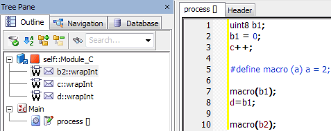

# Example: Messages

A simple example shall illustrate this. The module shown below contains the messages b2, c, and d. The messages c and d are directly written, b2 is used within a macro.

In the generated code, copies are initially created for all three messages (1). However, since only c and d are accessed in a way ASCET can recognize, only these two message copies are written back at the end (2). The change of message b2 that occurs in the macro, is not recognized and gets lost.

