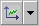

# Toolbar Elements - C-Code Editor

The toolbar Elements contains the following icons:

<table style="x-cell-content-align: Top;
				margin-top: 3px;
				border-left-style: Outset;
				border-top-style: Outset;
				border-right-style: Outset;
				border-bottom-style: Outset;
				border-left-width: 1px;
				border-right-width: 1px;
				border-top-width: 1px;
				border-bottom-width: 1px;" x-use-null-cells="">
<col/>
<col/>
<col/>
<tr class="hcp1" valign="top">
<td class="hcp2">

</td>
<td class="hcp2">

Variable
</td>
<td class="hcp2" colspan="1" rowspan="2">

The  button opens the element type 
 selection menu. The Variable and Parameter 
 buttons can be used to create elements of type logic, limitInt, wrapInt, 
 udisc, sdisc, or cont.

By default, the limitInt and wrapInt types are displayed. To display the sdisc 
 and udisc types instead, the <a href="ComponentManagerEnglishUS.chm::/cm_options_for_editors.htm">editor 
 option</a> Use signed/unsigned discrete types must 
 be activated.
</td></tr>
<tr class="hcp1" valign="top">
<td class="hcp2">

</td>
<td class="hcp2">

Parameter
</td>
</tr>
<tr class="hcp1" valign="top">
<td class="hcp2">

</td>
<td class="hcp2">

Delta t
</td>
<td class="hcp2">

dt system parameter

The name dT 
 is reserved for the system parameter. You cannot create any other element 
 with the name dT. 
 Since upper and lower case letters are not distinguished, the names DT, 
 dt, and Dt are reserved, too.
</td></tr>
<tr class="hcp1" valign="top">
<td class="hcp2">

</td>
<td class="hcp2">

Resource
</td>
<td class="hcp2">

See also <a href="IntroductionEnglishUS.chm::/INT_resources.htm">Resources</a>.
</td></tr>
<tr class="hcp1" valign="top">
<td class="hcp2">

</td>
<td class="hcp2">

Receive Message
</td>
<td class="hcp2" colspan="1" rowspan="3">

These buttons can be used to create scalar messages 
 only. 

See also <a href="IntroductionEnglishUS.chm::/INT_messages.htm">Messages</a>.
</td></tr>
<tr class="hcp1" valign="top">
<td class="hcp2">

</td>
<td class="hcp2">

Send Receive Message
</td>
</tr>
<tr class="hcp1" valign="top">
<td class="hcp2">

</td>
<td class="hcp2">

Send Message
</td>
</tr>
<tr class="hcp1" valign="top">
<td class="hcp2">

</td>
<td class="hcp2">

Array
</td>
<td class="hcp2" colspan="1" rowspan="2">

See also <a href="IntroductionEnglishUS.chm::/INT_Array.htm">Array</a> 
 and <a href="IntroductionEnglishUS.chm::/INT_matrix.htm">Matrix</a>.
</td></tr>
<tr class="hcp1" valign="top">
<td class="hcp2">

</td>
<td class="hcp2">

Matrix
</td>
</tr>
<tr class="hcp1" valign="top">
<td class="hcp2">

</td>
<td class="hcp2">

Distribution
</td>
<td class="hcp2">

See also <a href="IntroductionEnglishUS.chm::/INT_group_table_and_distribution.htm">Group 
 Table and Distribution</a>.
</td></tr>
<tr class="hcp1" valign="top">
<td class="hcp2">

</td>
<td class="hcp2">

OneD Table
</td>
<td class="hcp2" colspan="1" rowspan="2">

The  button opens the table type selection 
 menu. The table buttons can be used to create normal, group, or fixed 
 tables. 

See also <a href="IntroductionEnglishUS.chm::/INT_characteristic_lines_and_maps.htm">Characteristic 
 Lines and Maps</a>.
</td></tr>
<tr class="hcp1" valign="top">
<td class="hcp2">

</td>
<td class="hcp2">

TwoD Table
</td>
</tr>
</table>
