# Merged CHM Content

## Overview - Component Manager

_Source: `markdown/CM_ComponentOverview.md`_

# Overview - Component Manager

This chapter contains a detailed description of the Component Manager, its menu structure and operation.

The function of all menus and menu items is explained. Before reading this part, you should be familiar with ASCET by having studied chapter Understanding ASCET and the Tutorial in the ASCET Getting Started volume.

The ASCET Component Manager opens when the program starts. This is where you start the various editors (see [Block Diagram Editor - Overview](BlockDiagramEditorEnglishUS.chm::/BDE_Overview.htm)). You can also manage several user profiles and, via an option dialog, set station- and user-specific options, e.g., the definition of storage directories, preferences such as screen display options, or the start-up behavior of the software (see [Setting Up ASCET](markdown/CM_Setting_Up_ASCET.md)).

The main purpose of the Component Manager is, however, to systematically store and manage all data created during the work with ASCET in a database or workspace (see [Managing Data, Databases and Workspaces](markdown/ManagingData.md)).

This help component only describes the functions forming an integral part of the Component Manager. The editors, the experiment environment, as well as some add-ons, are described in separate help components.

See also

[Managing Data, Databases and Workspaces](markdown/ManagingData.md)

[Managing Database/Workspace Items](markdown/ManagingDatabaseItems.md)

[Views in the Component Manager](markdown/ViewsinCM.md)

[Setting Up ASCET](markdown/CM_Setting_Up_ASCET.md)

[ASCET Monitor Window](markdown/MonitorWindow.md)

[Block Diagram Editor - Overview](BlockDiagramEditorEnglishUS.chm::/BDE_Overview.htm)

---

## Views in the Component Manager

_Source: `markdown/ViewsinCM.md`_

# Views in the Component Manager

ASCET offers an enhanced concept for viewing the database or workspace items. Folder, components, projects, containers and enumerations can be displayed in the 3 Contents field under various aspects. For components and projects, the tabs of the 3 Contents field offer an element, data, and implementation view. For components, method and layout views are offered, too, where appropriate. For folders, the field offers the folder view, which displays the objects in the folder as well as some information about the objects. The container view is much the same as the folder view.

Each tab offers several editing possibilities which are available via the Edit and Component menus or the context menu in the 3 Contents field.

It is possible to modify the properties of components and projects in the Component Manager. By selecting the element you want in the 3 Contents field, you can edit the configuration, the data set, the implementation or the layout, depending on the view you selected.

Method arguments and return values are exceptions to this. These elements can only be changed in the specification editors.

[Context-Sensitive Menu Options](markdown/ContextSensitiveMenu.md)

[Views](markdown/cm_views_componentmanager.md)

You can

[Selecting the Folder View](markdown/FolderView.md)

[Selecting the Element View](markdown/Elementview.md)

[Selecting the Data View](markdown/DataView.md)

[Selecting the Implementation View](markdown/ImplementationView.md)

[Selecting the Methods View](markdown/CM_Select_Methods_View.md)

[Selecting the Layout View](markdown/LayoutView.md)

[Selecting the Container View](ContainerEnglishUS.chm::/CNT_invoke_containerview.htm)

[Selecting the Enumeration View](markdown/enumeratiion_view.md)

---

## ETAS Problem Report Support Function

_Source: `markdown/ETAS__Problem_Report__Support_Function.md`_

# ETAS Problem Report Support Function

ASCET offers you a support function to inform ETAS about problems that occurred during your work with the program. When you use the support function, ASCET compresses the entire contents of the log directory (all *.log files) including a textual description into an archive file named EtasLogFiles01.zip in the ...\ETAS\LogFiles\ directory. For additional archive files, the file name is incremented automatically (up to 19) to avoid immediate overwriting older archive files.

A maximum of 20 archive files can be created, if more archive files are used, older files are overwritten starting at 00.

You can set up ASCET so that this archive is automatically sent to the ETAS hotline service. For this purpose, you need a MAPI-compliant E-mail program (e.g., MS Exchange or Eudora). For other e-mail programs, you need to send the archive yourself as an attachment.

See also

[Setting Up the Problem Report Support Function](markdown/Setting_Up_the__Problem_Report__Support_Function.md)

[Sending a Problem Report](markdown/Sending_a_Problem_Report.md)

---

## Setting Up ASCET

_Source: `markdown/CM_Setting_Up_ASCET.md`_

# Setting Up ASCET

This help component describes the ASCET-MD options. Add-on products, such as ASCET-RP, can add their own options, these are described in the respective add-on documentation.

You can set various options in ASCET. There are two types of options: general and user-specific options. Both types are managed in the Options window and stored in XML files. When ASCET is booted for the first time after installation, these XML files do not exist. They are created automatically and assigned the default settings of the system or—if an older ASCET version was installed—the settings of the older version.

General options ( icon) are specific to the ASCET installation on your workstation. They comprise the target directory for code generation, several paths, code preview settings, and the selection of single- or multi-user mode for running the program.

General options are stored in the data directory in the stationSettings.xml file.

User-specific options ( icon) comprise a variety of topics, e.g., settings for diagrams, export/import file paths, etc. With these options, you can create a user environment customized to meet your particular needs. Changes to the user options are stored separately for each user if user selection is activated on startup. New user profiles start with the default settings.

User-specific options are stored in the directory of the relevant user (ETASData\ASCET<n>\User\<username>, <n> being the ASCET version) in the userSettings.xml file.

Before setting user-specific options, you should decide whether your ASCET installation is to run in single- or multi-user mode to make sure your options are stored in the correct user profile.

Options with invalid values are indicated by a red overlay icon containing a white X:  and .

Options for external tools (compiler, OS, interpolation routines, ...) are indicated by a green E as overlay icon:  The values of these options are stored in the data directory in the externalToolsSettings.xml file.

User-defined options, also called [external options](markdown/CM_External_Options.md), are also indicated by the green E as overlay icon: 

See also

[Setting ASCET Options](markdown/SettingASCET.md)

[User Interface of the ASCET Options Window](markdown/cm_user_interface_of_the_ascet_options_window.md)

[External Options](markdown/CM_External_Options.md)

[Path Macros](markdown/CM_PathMacros.md)

[Name T](markdown/CM_NameTemplates.md)emplates

---

## External Options

_Source: `markdown/CM_External_Options.md`_

# External Options

It is possible to include user-defined options. This takes place using an XML file which you modify to suit your own requirements. The file is stored in the ASCET installation directory; for ASCET to recognize it, it must have the extension *.aod.xml.

This topic contains three subsections:

- [Basic Option Definition](#GeneralOptionDefinition)
- [Meaning of the Attributes and Items](#Meaning)
- [Available optionClasses for User-Defined Options](#Available)

## Basic Option Definition

The definition of an option has the following basic format (code sections in italics must be replaced with suitable values for each option):

<OptionDeclaration

optionCategory="value"

attributeName="option name"

optionClass="type"

xmlCategory="path"

visible="value"

sensitive="value"

optionFile="filename.xml">

<Group>path</Group>

<Label>text</Label>

<Description>text</Description>

<Tooltip>text</Tooltip>

<InitialValue>value</InitialValue>

<DefaultValue>value</DefaultValue>

</OptionDeclaration>

The meaning of the attributes and items is listed in [Table 1](#Meaning).

Some option types have additional items, these are described in [Table 2](#Available).

Your installation disk contains the sample file externalOptionsExample.aod.xml; see also [Example: External Options File](markdown/cm_exampleexternaloptionsfile.md). This file defines the options shown here:

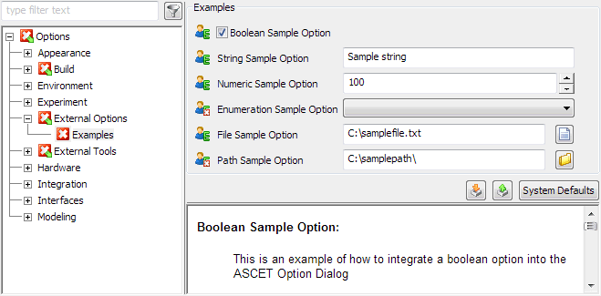

## Meaning of the Attributes and Items

This table describes the attributes and items of the basic option definition.

<table class="hcp1" x-use-null-cells="">
<col/>
<col/>
<tr class="hcp2" valign="top">
<td class="hcp3">

Attribute/Item
</td>
<td class="hcp3">

Meaning
</td></tr>
<tr class="hcp2" valign="top">
<td class="hcp3">

optionCategory
</td>
<td class="hcp3">

Way the option is saved (FILE 
 – in a file, FIXED – not saved).
</td></tr>
<tr class="hcp2" valign="top">
<td class="hcp3">

attributeName
</td>
<td class="hcp3">

Name of the option in the XML file from optionFile. 
 Has to be unique in the *.aod.xml file.
</td></tr>
<tr class="hcp2" valign="top">
<td class="hcp3">

optionClass
</td>
<td class="hcp3">

Type of option, for possible values see <a href="#Available">Table 
 2</a>. 
</td></tr>
<tr class="hcp2" valign="top">
<td class="hcp3">

xmlCategory1
</td>
<td class="hcp3">

Path under which the option in the XML file from 
 optionFile 
 is stored, e.g. Sample\Option.
</td></tr>
<tr class="hcp2" valign="top">
<td class="hcp3">

visible2
</td>
<td class="hcp3">

Determines whether the option is visible (visible="true") 
 or not (visible="false").
</td></tr>
<tr class="hcp2" valign="top">
<td class="hcp3">

sensitive2
</td>
<td class="hcp3">

Determines whether the option can be edited (sensitive="true") or not (sensitive="false").
</td></tr>
<tr class="hcp2" valign="top">
<td class="hcp3">

optionFile1
</td>
<td class="hcp3">

XML file in which the value of the option is stored. 
 
</td></tr>
<tr class="hcp2" valign="top">
<td class="hcp3">

&lt;Group&gt;
</td>
<td class="hcp3">

Path (Node\Subnode\...) 
 of the option in the ASCET options window, either new or existing.
</td></tr>
<tr class="hcp2" valign="top">
<td class="hcp3">

&lt;Label&gt;
</td>
<td class="hcp3">

Name of the option in the ASCET options window.
</td></tr>
<tr class="hcp2" valign="top">
<td class="hcp3">

&lt;Description&gt;
</td>
<td class="hcp3">

Short description of the option. Will be shown in 
 the bottom right field of the ASCET options window.
</td></tr>
<tr class="hcp2" valign="top">
<td class="hcp3">

&lt;Tooltip&gt;
</td>
<td class="hcp3">

Tooltip text of the option in the ASCET options window.
</td></tr>
<tr class="hcp2" valign="top">
<td class="hcp3">

&lt;InitialValue&gt;
</td>
<td class="hcp3">

Initial value, is only used if no value from optionFile 
 is saved in the XML file.
</td></tr>
<tr class="hcp2" valign="top">
<td class="hcp3">

&lt;DefaultValue&gt;
</td>
<td class="hcp3">

Default value, is used for System 
 Defaults and as an initial value if &lt;InitialValue&gt; 
 is not set.
</td></tr>
<tr class="hcp2" valign="top">
<td class="hcp3" colspan="2" rowspan="1">

1: The values of several options can be stored 
 in the same XML file and/or under the same path.

2: Can be omitted. Treated as true, if omitted.
</td>
</tr>
</table>

## Available optionClasses for User-Defined Options

This table describes the optionClasses available for the creation of user-defined options. If an optionClass requires more items than the basic definitions, or special settings for the basic definition, these are listed here, too.

Code sections in italics must be replaced with suitable values for each option.

<table class="hcp1" x-use-null-cells="">
<col/>
<col/>
<tr class="hcp2" valign="top">
<td class="hcp3">

optionClass
</td>
<td class="hcp3">

Explanation
</td></tr>
<tr class="hcp2" valign="top">
<td class="hcp3">

EtasBooleanOption
</td>
<td class="hcp3">

Option box, can be activated or deactivated
</td></tr>
<tr class="hcp2" valign="top">
<td class="hcp3" colspan="1" rowspan="1">

EtasButtonOption
</td>
<td class="hcp3" colspan="1" rowspan="1">

Button that executes a command.

&lt;InitialValue&gt; 
 and &lt;DefaultValue&gt; are left empty 
 or set to ignored.

Additional items for the definition:

&lt;ButtonOption&gt;

   &lt;Action&gt;path/executable file&lt;/Action&gt;

&lt;/ButtonOption&gt;
</td></tr>
<tr class="hcp2" valign="top">
<td class="hcp3" colspan="1" rowspan="2">

EtasEnumerationOption
</td>
<td class="hcp3" colspan="1" rowspan="1">

Combo box for selecting a character string.

Additional items for the definition:

&lt;EnumerationOption&gt;

   &lt;StringValues&gt;1

      &lt;StringValue&gt;string1&lt;/StringValue&gt;

      ...

      &lt;StringValue&gt;stringN&lt;/StringValue&gt;

   &lt;/StringValues&gt;

   &lt;Values&gt;2

     &lt;Value&gt;value1&lt;/Value&gt;

      ...

      &lt;Value&gt;valueN&lt;/Value&gt;

   &lt;/Values&gt;

&lt;/EnumerationOption&gt;
</td></tr>
<tr class="hcp2" valign="top">
<td class="hcp3">

1: The string values string1 
 .. stringN appear in the combo box.

2: The numerical values represented by the string 
 values. If omitted, value1 .. valueN 
 are set to the integer numbers 0 .. n-1.
</td></tr>
<tr class="hcp2" valign="top">
<td class="hcp3" colspan="1" rowspan="2">

EtasEditableEnumerationOption
</td>
<td class="hcp3" colspan="1" rowspan="1">

Combo box for selecting a character string, plus 
 an Edit button.

Additional items for the definition:

&lt;EnumerationOption&gt;

   &lt;StringValues&gt;1

      ...

   &lt;/StringValues&gt;

   &lt;Values&gt;2

      ...

   &lt;/Values&gt;

   &lt;Action&gt;path/executable file&lt;/Action&gt;

&lt;/EnumerationOption&gt;
</td></tr>
<tr class="hcp2" valign="top">
<td class="hcp3">

1: Same as &lt;StringValues&gt; 
 for EtasEnumerationOption

2: Same as &lt;Values&gt; 
 for EtasEnumerationOption
</td>
</tr>
<tr class="hcp2" valign="top">
<td class="hcp3">

EtasFileOption
</td>
<td class="hcp3">

Text field for path and name of a file as well as 
 a button for file selector window.

Additional items for the definition:

&lt;FileOption&gt;

   &lt;DialogTitle&gt;text&lt;/DialogTitle&gt;

   &lt;SearchPath&gt;path&lt;/SearchPath&gt;

   &lt;SearchMask&gt;mask&lt;/SearchMask&gt;

   &lt;InvalidCharacters&gt;characters&lt;/InvalidCharacters&gt;

   &lt;FilterTypes&gt;

      &lt;FilterTypefilter&gt;

         &lt;Description&gt;text&lt;/Description&gt;

      &lt;/FilterType&gt;

      ...

   &lt;/FilterTypes&gt;

&lt;/FileOption&gt;
</td></tr>
<tr class="hcp2" valign="top">
<td class="hcp3" colspan="1" rowspan="2">

EtasFloatOption
</td>
<td class="hcp3" colspan="1" rowspan="1">

Additional items for the definition: 

&lt;FloatOption&gt;1

   &lt;MinValue&gt;value&lt;/MinValue&gt;

   &lt;MaxValue&gt;value&lt;/MaxValue&gt;

&lt;/FloatOption&gt;
</td></tr>
<tr class="hcp2" valign="top">
<td class="hcp3">

1: Can be omitted. If &lt;FloatOption&gt; 
 is omitted, the option can have values between -100000.0 and 100000.0. 
 For min/max values beyond ]-100000.0 .. 100000.0[, you must use &lt;FloatOption&gt;.
</td></tr>
<tr class="hcp2" valign="top">
<td class="hcp3" colspan="1" rowspan="2">

EtasNumericOption
</td>
<td class="hcp3">

Entry field with arrow buttons for integer values.

Additional items for the definition:

&lt;NumericOption&gt;1

   &lt;MinValue&gt;value&lt;/MinValue&gt;

   &lt;MaxValue&gt;value&lt;/MaxValue&gt;

&lt;/NumericOption&gt;
</td></tr>
<tr class="hcp2" valign="top">
<td class="hcp3">

1: Can be omitted. If &lt;NumericOption&gt; 
 is omitted, the option can have values between -99999 and 99999. For min/max 
 values beyond [-99999 .. 99999], you must use &lt;NumericOption&gt;.
</td></tr>
<tr class="hcp2" valign="top">
<td class="hcp3" colspan="1" rowspan="1">

EtasPathOption
</td>
<td class="hcp3" colspan="1" rowspan="1">

Text field for directory path button for Path 
 Selection window.
</td></tr>
<tr class="hcp2" valign="top">
<td class="hcp3">

EtasStringOption
</td>
<td class="hcp3">

Text field for entering a character string.
</td></tr>
</table>

---

## Example: External Options File

_Source: `markdown/cm_exampleexternaloptionsfile.md`_

# Example: External Options File

<?xml version="1.0" encoding="UTF-8"?>

<OptionDeclarations xmlns:xsi="http://www.w3.org/2001/XMLSchema-instance" xsi:noNamespaceSchemaLocation="C:\ETAS\ASCET6.2\Schemas\externalOptions.xsd">

<!-- **************** EXTERNAL OPTIONS SAMPLE ******************** -->

<OptionDeclaration xmlCategory="Sample\Options" attributeName="sampleOptionBoolean" optionClass="EtasBooleanOption" optionCategory="FILE">

<Group>External Options\Examples</Group>

<Label>Boolean Sample Option</Label>

<Description>This is an example of how to integrate a boolean option into the ASCET Option Dialog</Description>

<Tooltip>Boolean Sample Option</Tooltip>

<InitialValue>true</InitialValue>

<DefaultValue>true</DefaultValue>

</OptionDeclaration>

<OptionDeclaration xmlCategory="Sample\Options" attributeName="SampleOptionString" optionClass="EtasStringOption" optionCategory="FILE">

<Group>External Options\Examples</Group>

<Label>String Sample Option</Label>

<Description>This is an example of how to integrate a string option into the ASCET Option Dialog</Description>

<Tooltip>Sting Sample Option</Tooltip>

<InitialValue>Sample string</InitialValue>

<DefaultValue>Sample string</DefaultValue>

</OptionDeclaration>

<OptionDeclaration xmlCategory="Sample\Options" attributeName="SampleOptionNumeric" optionClass="EtasNumericOption" optionCategory="FILE">

<Group>External Options\Examples</Group>

<Label>Numeric Sample Option</Label>

<Description>This is an example of how to integrate a numeric option into the ASCET Option Dialog</Description>

<Tooltip>Numeric Sample Option</Tooltip>

<InitialValue>100</InitialValue>

<DefaultValue>100</DefaultValue>

<NumericOption>

<MinValue>0</MinValue>

<MaxValue>255</MaxValue>

</NumericOption>

</OptionDeclaration>

<OptionDeclaration xmlCategory="Sample\Options" attributeName="SampleOptionEnumeration" optionClass="EtasEnumerationOption" optionCategory="FILE">

<Group>External Options\Examples</Group>

<Label>Enumeration Sample Option</Label>

<Description>This is an example of how to integrate a enumeration option into the ASCET Option Dialog</Description>

<Tooltip>Enumeration Sample Option</Tooltip>

<InitialValue>Value1</InitialValue>

<DefaultValue>Value1</DefaultValue>

<EnumerationOption>

<StringValues>

<StringValue>Value1</StringValue>

<StringValue>Value2</StringValue>

</StringValues>

<Values>

<Value>1</Value>

<Value>2</Value>

</Values>

</EnumerationOption>

</OptionDeclaration>

<OptionDeclaration xmlCategory="Sample\Options" attributeName="SampleOptionFile" optionClass="EtasFileOption" optionCategory="FILE">

<Group>External Options\Examples</Group>

<Label>File Sample Option</Label>

<Description>This is an example of how to integrate a file option into the ASCET Option Dialog</Description>

<Tooltip>File Sample Option</Tooltip>

<InitialValue>C:\samplefile.txt</InitialValue>

<DefaultValue>C:\samplefile.txt</DefaultValue>

<FileOption>

<DialogTitle>Select a Sample File</DialogTitle>

<SearchPath>C:\</SearchPath>

<SearchMask>*.txt</SearchMask>

<InvalidCharacters/>

<FilterTypes>

<FilterType extension="*.txt">

<Description>Text Files</Description>

</FilterType>

<FilterType extension="*.*">

<Description>All Files</Description>

</FilterType>

</FilterTypes>

</FileOption>

</OptionDeclaration>

<OptionDeclaration xmlCategory="Sample\Options" attributeName="SampleOptionPath" optionClass="EtasPathOption" optionCategory="FILE">

<Group>External Options\Examples</Group>

<Label>Path Sample Option</Label>

<Description>This is an example of how to integrate a path option into the ASCET Option Dialog</Description>

<Tooltip>Path Sample Option</Tooltip>

<InitialValue>C:\samplepath\</InitialValue>

<DefaultValue>C:\samplepath\</DefaultValue>

</OptionDeclaration>

<!-- **************** INTEGRATED EXTERNAL OPTIONS SAMPLE ******************** -->

<OptionDeclaration xmlCategory="IntegratedSample\Options" attributeName="IntegratedSampleOptionBoolean" optionClass="EtasBooleanOption" optionCategory="FILE">

<Group>Build\Code Generation</Group>

<Label>Integrated Boolean Sample Option</Label>

<Description>This is an example of how to integrate a boolean option into an existing group of the ASCET Option Dialog.\You can even integrate the option into the Project Options Dialog!</Description>

<Tooltip>Integrated Boolean Sample Option</Tooltip>

<InitialValue>true</InitialValue>

<DefaultValue>true</DefaultValue>

</OptionDeclaration>

</OptionDeclarations>

---

## Path Macros

_Source: `markdown/CM_PathMacros.md`_

# Path Macros

ASCET provides several macros that can be used, included in % %, to specify paths.

| Column 1 | Column 2 |
| --- | --- |
| ASCET | ASCET installation directory, e.g., C:\ETAS\ASCET <x.y> |
| DATA | ASCET data directory, e.g., D:\ETASData\ASCET <x.y> |
| DATABASE | Database root path, as specified in the Database Path field of the Paths node below the Environment node. |
| WORKSPACE | Workspace root path, as specified in the Workspace Path field of the Paths node below the Environment node. |
| CPREVIEW | Path for generated code preview files, as specified in the Code Preview Path field of the Paths node below the Build node. |
| CGEN | Path for generated code, as specified in the Code Generation Path field of the Paths node below the Build node. |
| TARGETROOT | Root path for targets, as specified in the Target Root Path field of the Paths node below the Build node. |
| SPECIFIC | Specific path (used in the context of project files), as specified in the Specific Path field of the Paths node below the Build node. |
| DOCU | Path for automatically generated documentation, as specified in the Documentor Working Path field of the Paths node below the Environment node. |
| EXPORT | Default path for export files, as specified in the Default Export Path field of the Paths node below the Environment node. |
| IMPORT | Default path where ASCET import looks for export files, as specified in the Default Import Path field of the Paths node below the Environment node. |
| LOG | ASCET log directory, e.g., C:\ETAS\LogFiles\ASCET |
| TEMP | Windows TEMP directory |
| ASCETTEMP | ASCET TEMP directory, as specified in the Temp Path field of the Paths node below the Environment node. |

---

## Name Templates

_Source: `markdown/CM_NameTemplates.md`_

# Name Templates

The generation of names (e.g., for variables) in the C code is controlled by macros. ASCET provides templates as a means of name customization. Templates are strings that may contain template parameters; these are expanded to their current value during ASCET code generation.

The set of valid template parameters is defined for each template individually. If a template uses an invalid template parameter, an error (EMake90) is issued during code generation.

ASCET provides a specific syntax for influencing the template parameter expansion.

- Template parameter names must be capitalized.

A template parameter %COMPONENT.name% causes an error.

- Templates must not contain blanks.

A template parameter % COMPONENT.NAME% causes an error.

- templates without template parameters

A template may be constant, i.e. without any template parameter. In this case, the template keeps its value in any context.

Example:

| Column 1 | Column 2 |
| --- | --- |
| template | is expanded to |
| temp | temp |

- templates with unconditional use of template parameters

Templates may use any valid template parameter, which will be expanded depending on the context. Each template parameter MUST start and end with a % (percent) character. In addition to template parameters, templates may use constant parts.

This template parameter expansion mechanism leaves all characters not embedded in '%', as they are.

Examples:

| Column 1 | Column 2 |
| --- | --- |
| template + parameter | is expanded to |
| %COMPONENT.NAME% | Classname |
|  | (for an ASCET component named Classname ) |
| %COMPONENT.NAME% | MoDuLeNaMe |
|  | (for an ASCET component named MoDuLeNaMe ) |
| myClass_%COMPONENT.NAME% | myClass_Class |
|  | (for an ASCET component named Class ) |

- Conditional use of template parameters

Templates may use any valid template parameter conditionally. In that case, a template parameter is used only if it has a value, i.e. it does not expand to an empty string. The indication for conditional usage is to embed the template parameter in two ? characters.

Examples:

| Column 1 | Column 2 |
| --- | --- |
| template + parameter | is expanded to |
| %COMPONENT.NAME%_%?COMPONENT.IMPL?% | Classname |
|  | (for an ASCET component named Classname in a context where the implementation (named Impl ) is irrelevant, e.g., an offline experiment) |
| %COMPONENT.NAME%_%?COMPONENT.IMPL?% | Classname_Impl |
|  | (for an ASCET component named Classname in a context where the implementation (named Impl ) is relevant) |

- Capitalization of template parameter values

This feature is mainly used for compatibility with previous ASCET versions, where some of the names were hard-coded and capitalized. The indication for using the uppercase equivalent for a specific template parameter value is to embed the template parameter in two ^ characters.

Examples:

| Column 1 | Column 2 |
| --- | --- |
| template + parameter | is expanded to |
| %^COMPONENT.NAME^% | CLASSNAME |
|  | (for an ASCET component named Classname ) |
| myClass_%COMPONENT.NAME% | myClass_CLASS |
|  | (for an ASCET component named Class ) |

---

## Working  with User Profiles

_Source: `markdown/WorkingUserProfiles.md`_

# Working with User Profiles

You can create and manage several user profiles in ASCET. This function enables the selection of specific settings in ASCET which apply to one user only. If, for example, several users share a computer, each user can save an ASCET configuration customized to meet his/her requirements in his/her personal user environment. This includes options such as screen font, font size, several settings for the various editors, default settings for elements, etc.

Even if only one user uses a computer, (s)he can set up several user profiles. For example, (s)he can create an optimized user profile for working in the office and one for travelling.

All settings in a respective user profile are global and apply irrespective of the concrete task.

During program execution, only the user profile for the current user environment can be changed. Editing user profiles is only possible when the functionality has been activated. Use the Multiple User Handling option in the ASCET Options window to determine whether editing user profiles is possible during program execution. Another user profile can only be selected by restarting ASCET.

By activating user selection, the user can specify whether the dialog window for user profile selection is displayed.

If user selection is not active, the program automatically uses the user profile for the user logged onto the system.

If user selection is activated, the user is prompted to log on the next time the program starts. The user can do this by selecting an existing user profile or adding a new profile to ASCET. This is described in [Activating User Selection](markdown/ActivateUser.md).

If the option is selected, the user is prompted to log on the next time the program starts. The user can do this by selecting an existing user profile or adding a new profile to ASCET.

See also

[Activating User Selection](markdown/ActivateUser.md)

[Adding a New User Profile](markdown/NewUser.md)

[Activating an Existing User Profile](markdown/ExisitingUser.md)

[General Options](markdown/CM_General_Options.md)

---

## Managing Data, Databases and Workspaces

_Source: `markdown/ManagingData.md`_

# Managing Data, Databases and Workspaces

The main purpose of the Component Manager is to systematically store all data that is created during the work with ASCET (classes, modules, projects, etc.) in a database or workspace. The Component Manager allows you to manage the database or workspace items from a comprehensible user interface. Similar to the Windows Explorer, you can create folders and subfolders, move, copy, import, and export individual items, and also create entirely new databases and workspaces. This means that you can organize your data in a similar fashion as you are accustomed to for the file system.

Besides organizing your data, you can also edit components and projects in ASCET.

When you start to work on a new project, it is helpful to create a new database or workspace. This operation is equivalent to changing to an empty directory on your computer. Then, you can create a customized folder structure, and create or import new items.

You can read the name of the current database or workspace in the bottom bar of the Component Manager.

See also

[Database/Workspace Items](markdown/DatabaseItems.md)

You can

[Manage Database/Workspace Items](markdown/ManagingDatabaseItems.md)

[Export Folders and Database/Workspace Items](markdown/ExportingFolders.md)

[Import Folders and Database/Workspace Items](markdown/ImportFolders.md)

[Set Access Rights](markdown/DatabaseAccess.md)

---

## ASCET Database

_Source: `markdown/CM_ASCETDatabase.md`_

# ASCET Database

An ASCET database is represented on the file system by several binary files:

- sobjects.dat, sobjects.idx - for database items
- codestorage.dat, codestorage.idx - for generated code

Some ASCET features are available only for databases: [Maintenance Routines](markdown/CM_Database_Maintenance_Routines.md) and the definition of [access rights and password protection](markdown/DatabaseAccess.md).

The size of an ASCET database is limited to 3.5 GB for each *.dat file. When one *.dat file exceeds 3 GB, warnings are issued upon the following actions:

- opening the database (see [Loading a Database](markdown/cm_loaddatabase.md))
- creating any object (folder, component, ...; see [Creating a Folder](markdown/CreateFolder.md), [Creating Components](markdown/CM_CreatingComponents.md))
- importing any object (see [Importing from AMD/AXL Files](markdown/CM_Importing_from_AMD_AXL_Files.md), [Importing from Binary Export Files](markdown/CM_ImportBinaryFiles.md), [Importing from ARXML or A2L Files](markdown/CM_Import_ARXML_or_A2L_Files.md) and [Importing a Directory Content](markdown/DirectoryContent.md))
- generating code or A2L descriptions (see, e.g., [Generating Code](ProjectEditorEnglishUS.chm::/PE_generatecode.htm) and [Generating Application Files](ProjectEditorEnglishUS.chm::/generating_files.htm))

When the database size (i.e. one of the *.dat files) exceeds 3.5 GB, ASCET disables several features:

- import
- creation of components
- code generation
- tool access via API

In addition, title bars of subwindows (e.g., 1 Database, Tree pane, ...) and palettes are red instead of blue, and editors open in read-only mode.

Exporting and deleting components, as well as using the [database maintenance routines](markdown/CM_Database_Maintenance_Routines.md), remains possible.

See also

[Managing Data, Databases and Workspaces](markdown/ManagingData.md)

[Database/Workspace Items](markdown/DatabaseItems.md)

[ASCET Workspace](markdown/CM_ASCETWorkspace.md)

[Maintenance Routines](markdown/CM_Database_Maintenance_Routines.md)

[Access Rights](markdown/DatabaseAccess.md)

---

## ASCET Workspace

_Source: `markdown/CM_ASCETWorkspace.md`_

| Column 1 | Column 2 | Column 3 |
| --- | --- | --- |
|  |  |  |

# ASCET Workspace

An ASCET workspace is represented on the file system by a root folder that contains the following elements:

- An XML file (*.aws) which contains information about the components in the workspace.

Only files listed in the *.aws file belong to the workspace.

- Folders and subfolders which contain the components themselves, in the form of AMD files (see [AMD Export](markdown/CM_AMD_Export.md) for more details on AMD files).

Each folder in the workspace is represented by a folder or subfolder in the root folder on the file system (see the [example](javascript:kadovTextPopup(this))<!-- kadovTextPopupInit('a1'); //-->).

Folder and component names in ASCET are limited so that not more than 260 characters are allowed when the workspace is stored on disk.

The size of an ASCET workspace is unlimited.

In a workspace, you cannot define [access rights and password protection](markdown/DatabaseAccess.md), and no maintenance beyond [discarding the generated code](markdown/DiscardCode.md) and [forcing a new build](markdown/ForceaNewbuild.md) is possible.

You can

[Create a Workspace](markdown/CM_CreateWorkspace.md)

[Convert a Database into a Workspace](markdown/CM_ConvertDatabaseToWorkspace.md)

[Create Folders](markdown/CreateFolder.md)

[Create Components](markdown/CM_CreatingComponents.md)

See also

[AMD Export](markdown/CM_AMD_Export.md)

[Managing Data, Databases and Workspaces](markdown/ManagingData.md)

[Database/Workspace Items](markdown/DatabaseItems.md)

[ASCET Database](markdown/CM_ASCETDatabase.md)

[Discarding the Generated Code](markdown/DiscardCode.md)

[Force a New Build during Code Generation](markdown/ForceaNewbuild.md)

/* Heikki Komulainen, Comet Computer GmbH 2004 */ cc_plus_pic = '&nbsp;'; cc_minus_pic = '&nbsp;'; cc_stat_pic = '&nbsp;'; gpstyle = ''; var iframes_created = 0; if (document.body && document.body.insertAdjacentHTML && document.getElementsByTagName && document.getElementById) { collect_popups(); set_poplinks_pictures(); if (iframes_created) { document.write(gpstyle); document.write('
<nobr><a id="einauslink" style="position:absolute;top:expression(document.body.scrollTop + this.offsetHeight - this.offsetHeight);left:expression(document.body.offsetWidth - (this.offsetWidth + 28));background:white;padding:5px" href="javascript:show_all_poptext()">Alle texte einblenden</a></nobr>
'); } } function collect_popups() { bsscpopups = new Array(); for (x = 0; x < document.links.length; x++) { if (document.links[x].href.indexOf("BSSCPopup")>-1) { seekmatch = /BSSCPopup.'[^'](markdown/+)'/; poplink = seekmatch.exec(document.links[x].href); poplink = "" + poplink; poplink = poplink.substring(poplink.indexOf("'")+1, poplink.lastIndexOf("'")); ifid = "CCGENIFRAMEID" + x; new_iframe = '<iframe id="' + ifid + '"src="' + poplink + '" onload="get_text(\'' + ifid + '\')" width="0" height="0" frameborder=0></iframe>'; document.links[x].parentNode.insertAdjacentHTML("afterEnd", new_iframe); gpid = "CCID_" + ifid; document.links[x].href = "javascript:expand_poptext('" + gpid + "')"; cc_plus = '' + cc_plus_pic + ''; document.links[x].insertAdjacentHTML("afterBegin", cc_plus); iframes_created = 1; } } }// end function function get_text(ifr_id) { frpars = document.frames[ifr_id].document.getElementsByTagName("body"); popbody = frpars[0].innerHTML; gpid = "CCID_" + ifr_id; if (!document.getElementById(gpid)) { //avoiding doubles document.getElementById(ifr_id).insertAdjacentHTML("afterEnd", '
'+popbody+'
'); } }//end function function expand_poptext(x_frame_id) { if (!document.getElementById(x_frame_id)) return; if (document.getElementById(x_frame_id).className == "CCGENPOPTEXTH") { document.getElementById(x_frame_id).className = "CCGENPOPTEXTV"; document.getElementById(x_frame_id).style.visibility = "visible"; if (document.getElementById("CCPMB_" + x_frame_id )) { document.getElementById("CCPMB_" + x_frame_id ).innerHTML = cc_minus_pic; } } else { document.getElementById(x_frame_id).className = "CCGENPOPTEXTH"; document.getElementById(x_frame_id).style.visibility = "hidden"; if (document.getElementById("CCPMB_" + x_frame_id )) { document.getElementById("CCPMB_" + x_frame_id ).innerHTML = cc_plus_pic; } } }// end function function show_all_poptext() { var pulldowntxt = document.getElementsByTagName("div"); for (b = 0; b < pulldowntxt.length; b++) { if (pulldowntxt[b].className == "droptext") { pulldowntxt[b].style.display=""; } } var gptxt = document.getElementsByTagName("div"); for (z = 0; z < gptxt.length; z++) { if (gptxt[z].className == "CCGENPOPTEXTH") { gptxt[z].className = "CCGENPOPTEXTV"; gptxt[z].style.visibility = "visible"; if (document.getElementById("CCPMB_" + gptxt[z].id )) { document.getElementById("CCPMB_" + gptxt[z].id ).innerHTML = cc_minus_pic; } } } var dxpoplinks = document.getElementsByTagName("a"); if (dxpoplinks) { for (pxl = 0; pxl < dxpoplinks.length; pxl++) { if (dxpoplinks[pxl].href.indexOf("kadovTextPopup")>-1) { if (document.getElementById("CCPMB_" + dxpoplinks[pxl].id)) { document.getElementById("CCPMB_" + dxpoplinks[pxl].id).innerHTML = cc_stat_pic; dxpoplinks[pxl].symbol = "minus"; } } } } document.getElementById('einauslink').innerText = 'Alle texte ausblenden'; document.getElementById('einauslink').href = "javascript:self.location.reload()"; self.focus(); }// end function function eat_click() { return false; }// end function function set_poplinks_pictures() { var dpoplinks = document.getElementsByTagName("a"); if (dpoplinks) { for (pl = 0; pl < dpoplinks.length; pl++) { if (dpoplinks[pl].href.indexOf("kadovTextPopup")>-1) { cc_plus = '' + cc_stat_pic + ''; //dpoplinks[pl].onmouseup = plusminuspoplink; dpoplinks[pl].insertAdjacentHTML("afterBegin", cc_plus); dpoplinks[pl].symbol = "plus"; } } } }// end function function plusminuspoplink() { if (document.getElementById("CCPMB_" + this.id)) { if (this.symbol == "plus") { document.getElementById("CCPMB_" + this.id).innerHTML = cc_minus_pic; this.symbol = "minus"; } else { document.getElementById("CCPMB_" + this.id).innerHTML = cc_plus_pic; this.symbol = "plus"; } } return true; }

---

## Using Databases from Previous ASCET Versions

_Source: `markdown/Usingdatabase.md`_

# Using Databases from Previous ASCET Versions

You can use existing databases from previous ASCET versions with the current ASCET version. These databases have to be converted, however, because the existing ASCET database format is not compatible with formats from previous ASCET versions.

Items of old ASCET versions that are no longer supported are either removed completely, or converted to a suitable new item type; e.g., networks are converted to containers.

Conversion of existing databases is done automatically the first time you open a database that was created with ASCET-SD 4.0 or later.

Export files from previous ASCET versions can be imported under certain conditions; see [Import From Old ASCET Versions](markdown/import_old_ascet_versions.md) for details.

See also

[Converting a Database from ASCET-SD V4.0 or later](markdown/Convert4.1.md)

[Converting a Database from ASCET-SD prior to V4.0](markdown/Convertdatabase.md)

[Import From Old ASCET Versions](markdown/import_old_ascet_versions.md)

---

## ANSI C Conversion

_Source: `markdown/ANSICConversion.md`_

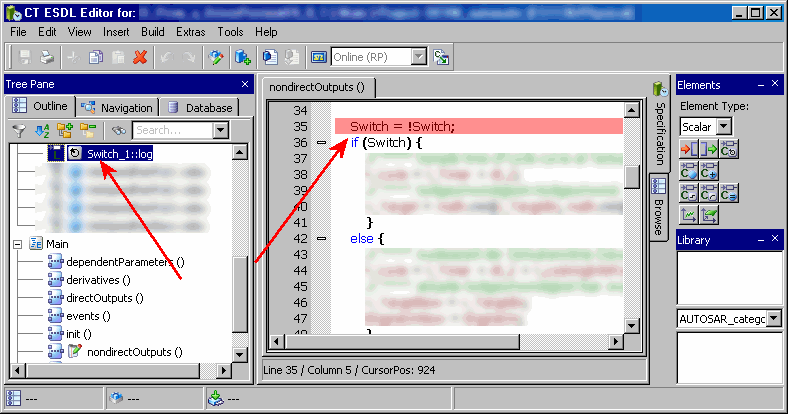

# ANSI C Conversion

In ASCET, ANSI C compliant naming is enforced for all database/workspace items for versions above 2.x. When adding new items or renaming existing ones, you must use valid ANSI C identifiers.

The conversion of folder and item names in existing databases/workspaces can be triggered explicitly, see [Converting a Database/workspace to ANSI C](markdown/ConverttoANSIC.md). All folder and item names are converted automatically, special characters are replaced as displayed in the following table. Names that are [reserved keywords](IntroductionEnglishUS.chm::/INT_Reserved_Keywords.htm) are appended a number: _<n> (<n> being the lowest available integer).

| Column 1 | Column 2 | Column 3 |
| --- | --- | --- |
| Special Characters | Mapped to | Example |
| Ä, ä, Ö, ö, Ü, ü, ß | Ae, ae, Oe, oe, Ue, ue, ss | Ma ß --> Ma ss |
| letters with diacritics, <space>, <dash>, <dot> | <underscore> | r é el --> r _ el |
| , ; : ! ? / \ \| ( ) [ ] { } < > # + * | <ignored> | Class \ test --> Classtest |

The conversion does not modify C code and ESDL code. Therefore, errors will occur in hand-written code which contains elements whose names are changed by the conversion to ANSI C. If, e.g., an [ESDL component](javascript:kadovTextPopup(this))<!-- kadovTextPopupInit('a1'); //--> contains a variable originally named Switch (a reserved keyword), the variable is renamed to Switch_1, but the occurrences in the ESDL code still read Switch.

See also

[Introduction - Reserved Keywords](IntroductionEnglishUS.chm::/INT_Reserved_Keywords.htm)

[Converting a Database/Workspace to ANSI C](markdown/ConverttoANSIC.md)

/* Heikki Komulainen, Comet Computer GmbH 2004 */ cc_plus_pic = '&nbsp;'; cc_minus_pic = '&nbsp;'; cc_stat_pic = '&nbsp;'; gpstyle = ''; var iframes_created = 0; if (document.body && document.body.insertAdjacentHTML && document.getElementsByTagName && document.getElementById) { collect_popups(); set_poplinks_pictures(); if (iframes_created) { document.write(gpstyle); document.write('
<nobr><a id="einauslink" style="position:absolute;top:expression(document.body.scrollTop + this.offsetHeight - this.offsetHeight);left:expression(document.body.offsetWidth - (this.offsetWidth + 28));background:white;padding:5px" href="javascript:show_all_poptext()">Alle texte einblenden</a></nobr>
'); } } function collect_popups() { bsscpopups = new Array(); for (x = 0; x < document.links.length; x++) { if (document.links[x].href.indexOf("BSSCPopup")>-1) { seekmatch = /BSSCPopup.'[^'](markdown/+)'/; poplink = seekmatch.exec(document.links[x].href); poplink = "" + poplink; poplink = poplink.substring(poplink.indexOf("'")+1, poplink.lastIndexOf("'")); ifid = "CCGENIFRAMEID" + x; new_iframe = '<iframe id="' + ifid + '"src="' + poplink + '" onload="get_text(\'' + ifid + '\')" width="0" height="0" frameborder=0></iframe>'; document.links[x].parentNode.insertAdjacentHTML("afterEnd", new_iframe); gpid = "CCID_" + ifid; document.links[x].href = "javascript:expand_poptext('" + gpid + "')"; cc_plus = '' + cc_plus_pic + ''; document.links[x].insertAdjacentHTML("afterBegin", cc_plus); iframes_created = 1; } } }// end function function get_text(ifr_id) { frpars = document.frames[ifr_id].document.getElementsByTagName("body"); popbody = frpars[0].innerHTML; gpid = "CCID_" + ifr_id; if (!document.getElementById(gpid)) { //avoiding doubles document.getElementById(ifr_id).insertAdjacentHTML("afterEnd", '
'+popbody+'
'); } }//end function function expand_poptext(x_frame_id) { if (!document.getElementById(x_frame_id)) return; if (document.getElementById(x_frame_id).className == "CCGENPOPTEXTH") { document.getElementById(x_frame_id).className = "CCGENPOPTEXTV"; document.getElementById(x_frame_id).style.visibility = "visible"; if (document.getElementById("CCPMB_" + x_frame_id )) { document.getElementById("CCPMB_" + x_frame_id ).innerHTML = cc_minus_pic; } } else { document.getElementById(x_frame_id).className = "CCGENPOPTEXTH"; document.getElementById(x_frame_id).style.visibility = "hidden"; if (document.getElementById("CCPMB_" + x_frame_id )) { document.getElementById("CCPMB_" + x_frame_id ).innerHTML = cc_plus_pic; } } }// end function function show_all_poptext() { var pulldowntxt = document.getElementsByTagName("div"); for (b = 0; b < pulldowntxt.length; b++) { if (pulldowntxt[b].className == "droptext") { pulldowntxt[b].style.display=""; } } var gptxt = document.getElementsByTagName("div"); for (z = 0; z < gptxt.length; z++) { if (gptxt[z].className == "CCGENPOPTEXTH") { gptxt[z].className = "CCGENPOPTEXTV"; gptxt[z].style.visibility = "visible"; if (document.getElementById("CCPMB_" + gptxt[z].id )) { document.getElementById("CCPMB_" + gptxt[z].id ).innerHTML = cc_minus_pic; } } } var dxpoplinks = document.getElementsByTagName("a"); if (dxpoplinks) { for (pxl = 0; pxl < dxpoplinks.length; pxl++) { if (dxpoplinks[pxl].href.indexOf("kadovTextPopup")>-1) { if (document.getElementById("CCPMB_" + dxpoplinks[pxl].id)) { document.getElementById("CCPMB_" + dxpoplinks[pxl].id).innerHTML = cc_stat_pic; dxpoplinks[pxl].symbol = "minus"; } } } } document.getElementById('einauslink').innerText = 'Alle texte ausblenden'; document.getElementById('einauslink').href = "javascript:self.location.reload()"; self.focus(); }// end function function eat_click() { return false; }// end function function set_poplinks_pictures() { var dpoplinks = document.getElementsByTagName("a"); if (dpoplinks) { for (pl = 0; pl < dpoplinks.length; pl++) { if (dpoplinks[pl].href.indexOf("kadovTextPopup")>-1) { cc_plus = '' + cc_stat_pic + ''; //dpoplinks[pl].onmouseup = plusminuspoplink; dpoplinks[pl].insertAdjacentHTML("afterBegin", cc_plus); dpoplinks[pl].symbol = "plus"; } } } }// end function function plusminuspoplink() { if (document.getElementById("CCPMB_" + this.id)) { if (this.symbol == "plus") { document.getElementById("CCPMB_" + this.id).innerHTML = cc_minus_pic; this.symbol = "minus"; } else { document.getElementById("CCPMB_" + this.id).innerHTML = cc_plus_pic; this.symbol = "plus"; } } return true; }

---

## Resolving Name Conflicts

_Source: `markdown/ResolvingName.md`_

# Resolving Name Conflicts

In some cases, where item names in an existing version 2.x database are distinguished only by punctuation marks or spaces, the default mapping for conversion to ANSI C can lead to naming conflicts.

For example, the item names Integrator I21 and Integrator-I21 both map to Integrator_I21. Since item names must be unique, the conversion algorithm would assign Integrator_211 to the second item.

You can either accept this solution to naming conflicts when converting to ANSI C or edit the corresponding map file. The mapping.ini file is located in the ASCET directory and can be edited using any standard text editor.

You cannot modify the mapping for spaces, they are always converted to underscores.

---

## Browsing the Database or Workspace

_Source: `markdown/Browsing.md`_

# Browsing the Database or Workspace

You can browse the whole database or workspace for information on the relationship between items and elements. In a database, you can also search for operator implementations. For example, it is completely transparent in the Component Manager which items are used or referenced by other items. You can browse the database or workspace for these relationships using complex search criteria to display only the items in the database that fulfil the criteria.

When you browse the database or workspace, ASCET always searches the entire database/workspace, regardless of which folders or items are currently selected. It is possible to use wildcard characters when specifying the search criteria, e.g. typing *acc* will find all database items and elements that have the string acc in their name. The search is not case-sensitive.

See also

[Searching for Components](markdown/searching%20_items.md)

[Searching for Declarations of Methods/Processes/Runnables](markdown/searching%20_methods.md)

[Searching for References to Elements](markdown/searching_usingelement.md)

[Searching for Declarations of Elements](markdown/searching%20_defining%20element.md)

[Searching for Senders of Messages](markdown/CM_searching_sendingmessage.md)

[Searching for References to Methods/Processes/Runnables](markdown/searching_senders%20.md)

[Searching for Receivers of Messages](markdown/searching_receivingmessage.md)

[Searching for References to Components](markdown/searching_referencesitems.md)

[Searching for Operator Implementations](ImplementationEditorEnglishUS.chm::/search_op_impl.htm)

[Search Criteria](markdown/CM_Search_Criteria.md)

---

## Search Criteria

_Source: `markdown/CM_Search_Criteria.md`_

# Search Criteria

The following types of information can be searched for:

- Component

This command finds all the items in the database/workspace where the name matches the search string.

- References to component

This command finds all references to database/workspace components whose names match the search string.

- Declaration of method/process

This command finds all methods, processes or runnable entities in the database/workspace which match the search string.

- References to method/process

This command finds all references to methods, processes or runnable entities in the database/workspace whose names match the search string.

- Declarations of method/process element

This command finds all methods, processes or runnable entities in the database/workspace that contain arguments, return values or local variables whose names match the search string.

- Declarations of element

This command finds all components that declare elements (e.g. variables or arguments) which match the search string.

- References to element

This command finds all components containing references to elements (e.g. variables or arguments) which match the search string.

- Senders of message

This command finds all modules or projects that send messages matching the search string.

- Receivers of message

This command works analogous to the previous one, but for received messages.

---

## Maintenance Routines

_Source: `markdown/CM_Database_Maintenance_Routines.md`_

# Maintenance Routines

For databases, ASCET provides tools for repair, compression and backup. In addition, you can discard generated code for the entire database, force a new build, compare of the databases, recreate the logic models of all graphical components in case data models have been damaged, or search for unreadable database items.

For workspaces, you can discard generated code and force a new build.

The utilities are accessed from the Component Manager.

For information on converting existing databases, see [Converting an ASCET-SD 4.x Database](markdown/Convert4.1.md).

See also

[Discarding the Generated Code](markdown/DiscardCode.md)

[Force a New Build during Code Generation](markdown/ForceaNewbuild.md)

[Optimizing a Database](markdown/Optimize.md)

[Comparing Two Databases](markdown/CompareTwo.md)

[Searching Unreadable Database Items](markdown/CM_Search_Unreadable_Items.md)

[Converting an ASCET-SD 4.x Database](markdown/Convert4.1.md)

---

## Managing Database/Workspace Items

_Source: `markdown/ManagingDatabaseItems.md`_

# Managing Database/Workspace Items

In ASCET, database or workspace items are organized in folders. A database or workspace can contain any number of top-level folders, which in turn can contain other folders. Database/workspace items must be stored in folders, they cannot be created at the root level of a database/workspace. Database/workspace items are identified by their object IDs. Even though identical names are not allowed in the same folder, objects in different folders can have identical names.

See also

[Creating a Folder](markdown/CreateFolder.md)

[Selecting the Default Item Type of Classes/Modules](markdown/DefaultItem.md)

[Creating an Enumeration](markdown/CreateEnumeration.md)

[Editing a Database/Workspace Item](markdown/CM_Edit_item.md)

[Renaming a Folder or Item](markdown/RenameDatabase.md)

[Deleting a Folder or Item](markdown/CM_DeleteCopy.md)

[Copying a Folder or Item](markdown/CopyDatabase.md)

[Cutting a Folder or Item](markdown/CM_CutInsert.md)

[Inserting a Folder or Item](markdown/InsertDatabase.md)

[Copying the Structure of a Component](markdown/CM_CopySave.md)

[Saving the Current Database/Workspace](markdown/SaveDatabase.md)

---

## References on Items

_Source: `markdown/ReferencesonItems.md`_

# References on Items

A reference to an item is created whenever the item is used by or included in another item (e.g. a module that is included in a project is referenced by that project). When moving items between folders, or renaming existing items in folders, all references to that item are updated automatically.

The Component Manager does not automatically resynchronize with the database/workspace if references have been modified. To ensure the consistency of references in the Component Manager, you need to update its references explicitly.

Since references can be cyclic, an item can reference an item that references it. When you delete an item, you should always make sure that the referenced components are not corrupted. ASCET displays a warning and a list of references if you attempt to remove a component that is referenced by other components.

Deleting database/workspace items that are referenced by other components can destroy the referencing components. This can be prevented by replacing the component you want to remove with a new one or a different one.

When a component is replaced, all database/workspace items that have references to the replaced component adjust their references to the replacing component. The replaced component is no longer referenced by any other database/workspace item.

See also

[Updating References in Component Manager](markdown/References.md)

[Displaying the References to a Database/Workspace Item](markdown/Displayreference.md)

[Replacing the References to a Database/Workspace Item](markdown/ReplaceReferences.md)

[Replacing a Database/Workspace Item](markdown/ReplaceDatabase.md)

---

## Editing

_Source: `markdown/CM_editing.md`_

# Editing

You can edit the layout of a component without first opening the respective component editor. The public interface of a component is declared in the layout editor.

Every database/workspace item can have two types of text attached to it: comment text and notes. The comment text is entered in the 2 Comment field in the Component Manager and is stored automatically. The notes for a database/workspace item are entered in a separate editor window. When documentation is generated automatically, notes are included, but comments are not.

Depending on the activation status of the Non-Volatile attribute, variables and parameters are treated differently by the code generation. Only volatile elements are initialized automatically. Non-volatile data are not overwritten upon initialization. You can set the Non-Volatile attribute for individual elements (see [Editing Element Properties](markdown/EditDatabaseB.md)), and you can assign one setting to all variables or all parameters (see [Assigning the Volatile Attribute to All Variables](markdown/Assign.md) and [Assigning the Non-Volatile Attribute to All Parameters](markdown/non-volatile.md)).

See also

[Editing the Layout of a Component](markdown/LayoutComponent.md)

[Layout Editor - Overview](LayoutEditorEnglishUS.chm::/LEd_Overview.htm)

[Editing the Notes for a Database/Workspace Item](markdown/EditNotes.md)

[Assigning the Volatile Attribute to All Variables](markdown/Assign.md)

[Assigning the Non-Volatile Attribute to All Parameters](markdown/non-volatile.md)

[Element Configuration](ElementEditorEnglishUS.chm::/EEd_element_configuration.htm)

---

## Find and Replace in C Code and ESDL Components

_Source: `markdown/FindReplace.md`_

# Find and Replace in C Code and ESDL Components

From within the Component Manager, you can search all C code and ESDL components for a character string. You can replace either an individual occurrence of the character string, every occurrence in a component or every occurrence in the entire database or workspace.

This function makes it easier to work with messages (or other global elements). These are linked via their names (see [Interprocess Communication](ProjectEditorEnglishUS.chm::/pe_interprocess_communication.htm)), if one name is changed, all occurrences have to be changed. The search throughout the entire database/workspace means time-consuming manual searches are a thing of the past.

The search does not distinguish between upper and lower case. If, for example, you enter cont, Cont and CONT are found, too. The character string is also found if it is part of a longer word, for example, searching for cont also finds all occurrences of Continuous.

See also

[Finding a Character String](markdown/CharacterString.md)

[Viewing the Search Results](markdown/SearchResults.md)

[Opening the Component from the Search Window](markdown/OpenComponent.md)

[Replacing Selected Character Strings](markdown/ReplaceString.md)

[Replacing All Character Strings in One Component](markdown/ReplaceCharacter.md)

[Replacing All Character Strings in the Database/Workspace](markdown/ReplaceStringsinComponent.md)

[Interprocess Communication](ProjectEditorEnglishUS.chm::/pe_interprocess_communication.htm)

---

## Copying Database/Workspace Items and Structures

_Source: `markdown/copying_databaseitems.md`_

# Copying Database/Workspace Items and Structures

You can copy database/workspace items or entire folders and their contents. When the target directory contains an object with the same name as the original, the extension 1 is added to the name of the copied object.

When items or folders are moved within the same database/workspace, item and/or folder names are usually retained in the target folder. The new item is automatically renamed only if the target folder already contains an item or a folder with the same name, thus avoiding naming conflicts.

If you want to re-implement an existing component as another item type (e.g., a block diagram component in C code or ESDL), you can use the Reproduce As command to copy the structure of the original component, so you will not have to specify it again. When you copy the structure of a component, the entire interface of the component is created automatically in the target component.

The table lists the components that can be reproduced, and the available item types for each (+: available, -: not available).

<table style="margin-top: 3px;
				border-left-style: Outset;
				border-top-style: Outset;
				border-right-style: Outset;
				border-bottom-style: Outset;
				border-left-width: 1px;
				border-right-width: 1px;
				border-top-width: 1px;
				border-bottom-width: 1px;
				x-cell-content-align: Bottom;" x-use-null-cells="">
<col/>
<col/>
<col/>
<col/>
<col/>
<col/>
<col/>
<col/>
<tr class="hcp1" valign="top">
<td colspan="2" rowspan="2" style="padding-top: 2px;
			padding-bottom: 2px;
			border-left-style: Inset;
			border-top-style: Inset;
			border-right-style: Inset;
			border-bottom-style: Inset;
			padding-left: 2px;
			padding-right: 2px;
			border-left-width: 1px;
			border-top-width: 1px;
			border-right-width: 1px;
			border-bottom-width: 1px;
			x-cell-content-align: bottom;" valign="bottom">

Component to be reproduced
</td>
<td class="hcp2" colspan="6" rowspan="1">

Can be reproduced as
</td>
</tr>
<tr class="hcp1" valign="top">
<td class="hcp2">

Block Diagram
</td>
<td class="hcp2">

C Code
</td>
<td class="hcp2">

ESDL
</td>
<td class="hcp2">

Record
</td>
<td class="hcp2" colspan="1" rowspan="1">

SenderReceiver 
Interface
</td>
<td class="hcp2">

NVData 
Interface
</td></tr>
<tr class="hcp1" valign="top">
<td class="hcp2" colspan="1" rowspan="3">

Module
</td>
<td class="hcp2" colspan="1" rowspan="1">

Block Diagram
</td>
<td class="hcp2">

-
</td>
<td class="hcp2">

+
</td>
<td class="hcp2">

+
</td>
<td class="hcp2">

-
</td>
<td class="hcp2" colspan="1" rowspan="1">

+
</td>
<td class="hcp2">

+
</td></tr>
<tr class="hcp1" valign="top">
<td class="hcp2" colspan="1" rowspan="1">

C Code
</td>
<td class="hcp2">

+
</td>
<td class="hcp2">

-
</td>
<td class="hcp2">

+
</td>
<td class="hcp2">

-
</td>
<td class="hcp2" colspan="1" rowspan="1">

+
</td>
<td class="hcp2">

+
</td></tr>
<tr class="hcp1" valign="top">
<td class="hcp2" colspan="1" rowspan="1">

ESDL
</td>
<td class="hcp2">

+
</td>
<td class="hcp2">

+
</td>
<td class="hcp2">

-
</td>
<td class="hcp2">

-
</td>
<td class="hcp2" colspan="1" rowspan="1">

+
</td>
<td class="hcp2">

+
</td></tr>
<tr class="hcp1" valign="top">
<td class="hcp2" colspan="1" rowspan="3">

Class
</td>
<td class="hcp2" colspan="1" rowspan="1">

Block Diagram
</td>
<td class="hcp2" colspan="1" rowspan="1">

-
</td>
<td class="hcp2" colspan="1" rowspan="1">

+
</td>
<td class="hcp2" colspan="1" rowspan="1">

+
</td>
<td class="hcp2" colspan="1" rowspan="1">

+
</td>
<td class="hcp2" colspan="1" rowspan="1">

+
</td>
<td class="hcp2" colspan="1" rowspan="1">

+
</td></tr>
<tr class="hcp1" valign="top">
<td class="hcp2" colspan="1" rowspan="1">

C Code
</td>
<td class="hcp2" colspan="1" rowspan="1">

+
</td>
<td class="hcp2" colspan="1" rowspan="1">

-
</td>
<td class="hcp2" colspan="1" rowspan="1">

+
</td>
<td class="hcp2" colspan="1" rowspan="1">

+
</td>
<td class="hcp2" colspan="1" rowspan="1">

+
</td>
<td class="hcp2" colspan="1" rowspan="1">

+
</td></tr>
<tr class="hcp1" valign="top">
<td class="hcp2" colspan="1" rowspan="1">

ESDL
</td>
<td class="hcp2" colspan="1" rowspan="1">

+
</td>
<td class="hcp2" colspan="1" rowspan="1">

+
</td>
<td class="hcp2" colspan="1" rowspan="1">

-
</td>
<td class="hcp2" colspan="1" rowspan="1">

+
</td>
<td class="hcp2" colspan="1" rowspan="1">

+
</td>
<td class="hcp2" colspan="1" rowspan="1">

+
</td></tr>
<tr class="hcp1" valign="top">
<td class="hcp2" colspan="1" rowspan="3">

CT block
</td>
<td class="hcp2" colspan="1" rowspan="1">

Block Diagram
</td>
<td class="hcp2">

-
</td>
<td class="hcp2">

+
</td>
<td class="hcp2">

+
</td>
<td class="hcp2">

-
</td>
<td class="hcp2" colspan="1" rowspan="1">

-
</td>
<td class="hcp2">

-
</td></tr>
<tr class="hcp1" valign="top">
<td class="hcp2" colspan="1" rowspan="1">

C Code
</td>
<td class="hcp2">

+
</td>
<td class="hcp2">

-
</td>
<td class="hcp2">

+
</td>
<td class="hcp2">

-
</td>
<td class="hcp2" colspan="1" rowspan="1">

-
</td>
<td class="hcp2">

-
</td></tr>
<tr class="hcp1" valign="top">
<td class="hcp2" colspan="1" rowspan="1">

ESDL
</td>
<td class="hcp2">

+
</td>
<td class="hcp2">

+
</td>
<td class="hcp2">

-
</td>
<td class="hcp2">

-
</td>
<td class="hcp2" colspan="1" rowspan="1">

-
</td>
<td class="hcp2">

-
</td></tr>
<tr class="hcp1" valign="top">
<td class="hcp2" colspan="2" rowspan="1">

Boolean Table
</td>
<td class="hcp2" colspan="1" rowspan="1">

+
</td>
<td class="hcp2" colspan="1" rowspan="1">

+
</td>
<td class="hcp2" colspan="1" rowspan="1">

+
</td>
<td class="hcp2" colspan="1" rowspan="1">

+
</td>
<td class="hcp2" colspan="1" rowspan="1">

+
</td>
<td class="hcp2" colspan="1" rowspan="1">

+
</td></tr>
<tr class="hcp1" valign="top">
<td class="hcp2" colspan="2" rowspan="1">

Conditional Table
</td>
<td class="hcp2" colspan="1" rowspan="1">

+
</td>
<td class="hcp2" colspan="1" rowspan="1">

+
</td>
<td class="hcp2" colspan="1" rowspan="1">

+
</td>
<td class="hcp2" colspan="1" rowspan="1">

+
</td>
<td class="hcp2" colspan="1" rowspan="1">

+
</td>
<td class="hcp2" colspan="1" rowspan="1">

+
</td></tr>
<tr class="hcp1" valign="top">
<td class="hcp2" colspan="2" rowspan="1">

Record
</td>
<td class="hcp2">

-
</td>
<td class="hcp2">

-
</td>
<td class="hcp2">

-
</td>
<td class="hcp2">

-
</td>
<td class="hcp2" colspan="1" rowspan="1">

+
</td>
<td class="hcp2">

+
</td></tr>
</table>

See also

[C](markdown/CopyDatabase.md)opying a Folder or Item

[Cutting a Folder or Item](markdown/CM_CutInsert.md)

[Inserting a Folder or Item](markdown/InsertDatabase.md)

[Deleting a Folder or Item](markdown/CM_DeleteCopy.md)

[Copying the Structure of a Component](markdown/CM_CopySave.md)

---

## Database/Workspace Items

_Source: `markdown/DatabaseItems.md`_

# Database/Workspace Items

An ASCET database or workspace contains different types of items. The following types of items are available in ASCET.

- [Components](markdown/CM_Components.md)
- [AUTOSAR Components](markdown/CM_AUTOSAR_Components.md)
- [Projects](markdown/Projects.md)
- [Icons](markdown/Icons.md)
- [Signals](markdown/Signals.md)
- [Container](markdown/CM_Container.md)
- [Enumerations](markdown/Enumerations.md)
- [ASAM-MCD-2MC Project](markdown/ASAM-MCD-2MC.md)
- [Records](markdown/CM_Records.md)

---

## Components

_Source: `markdown/CM_Components.md`_

# Components

The specification of an embedded software system in ASCET is made up of components. A component is a modular piece of functionality which contains algorithms and data. The different algorithms specified within a component can be executed independently of each other. The components of an Embedded Control System can be combined into projects.

On a physical level, components are specified either graphically as block diagrams or state machines, or in ESDL-Code. Alternatively, they can be specified in C code. Components that are specified either graphically or in ESDL are implementation-independent, i.e. they can be used to generate code for different platforms. Components specified in C code are always platform-dependent. They encapsulate target-specific behavior.

For more information on the types of component available in ASCET and their usage, see [Overview - Components](introductionenglishus.chm::/INT_Overview_Components.htm) and references therein.

---

## AUTOSAR Components

_Source: `markdown/CM_AUTOSAR_Components.md`_

# AUTOSAR Components

ASCET provides the following types of database/workspace items for use with AUTOSAR.

- Software components - the unit of distribution in an AUTOSAR system; a software component consists of
- a complete formal SWC description that indicates how the infrastructure of the component must be configured,
- an SWC implementation that contains the functionality (in the form of C code or object code).
- SenderReceiver interfaces - used to specify sender-receiver communication between AUTOSAR components.
- NVData interfaces - same as SenderReceiver interfaces, but all interface elements are non-volatile.
- ClientServer interfaces - used to specify client-server communication between AUTOSAR components.
- Calibration interfaces - used for communication with Calibration components.
- Mode Groups - these items represents AUTOSAR mode declaration groups used to communicate modes.
- See also
- [Overview - Software Component Editor](AtomicSoftwareComponentEditorEnglishUS.chm::/ASCeditorOverview.htm)
- [Sender-Receiver Communication](AtomicSoftwareComponentEditorEnglishUS.chm::/ASCsenderReceiverCommunication.htm)
- [Client-Server Communication](AtomicSoftwareComponentEditorEnglishUS.chm::/ASCClientServerCommunication.htm)
- [Calibration](AtomicSoftwareComponentEditorEnglishUS.chm::/ASCcalibration.htm)

[Modes and Mode Groups](SenderReceiverEditorEnglishUS.chm::/SREmodesModeGroups.htm)

---

## Projects

_Source: `markdown/Projects.md`_

# Projects

A project specifies the functionality of an Embedded Control System. It contains all the components together with the necessary protocols, operating system and code generation settings. A project determines the communication between components and the order in which algorithms are executed.

The project concept is explained in [Projects](ProjectEditorEnglishUS.chm::/pe_project.htm). A description of how to work with projects can be found in [Project Editor](ProjectEditorEnglishUS.chm::/PE_Overview.htm) and links therein.

See also

[Projects](ProjectEditorEnglishUS.chm::/pe_project.htm)

[Project Editor - Overview](ProjectEditorEnglishUS.chm::/PE_Overview.htm)

---

## Icons

_Source: `markdown/Icons.md`_

# Icons

When a component is nested in another component, it appears as a block in the diagram of the enclosing component. You can assign an icon to a nested component to make a complex diagram more readable.

A selection of icons is provided with ASCET. In addition, users can define and edit their own. Importing, creating and editing icons is described in [Icon Editor](SignalsandIconsEnglishUS.chm::/SI_icon_editor.htm).

See also

[Signals and Icons - Overview](SignalsandIconsEnglishUS.chm::/SI_Overview.htm)

---

## Signals

_Source: `markdown/Signals.md`_

# Signals

In order to test ASCET models under realistic conditions, genuine measurement data can be imported into ASCET, and used as input in the testing of ASCET models. This data is stored in signal items.

Additional information on working with signals can be found in [Signal Viewer](SignalsandIconsEnglishUS.chm::/SI_signal_viewer.htm).

See also

[Signals and Icons - Overview](SignalsandIconsEnglishUS.chm::/SI_Overview.htm)

---

## Container

_Source: `markdown/CM_Container.md`_

# Container

Containers are used as containers for database/workspace items. Their purpose is to structure models and databases/workspaces and place different database items under a common version control. Details are given in [Containers](ContainerEnglishUS.chm::/CNT_Overview.htm).

See also

[Containers - Overview](ContainerEnglishUS.chm::/CNT_Overview.htm)

---

## Enumerations

_Source: `markdown/Enumerations.md`_

# Enumerations

An enumeration defines a sequence of text strings and values in a specific order. One pair of value and text string is called enumerator. Implicitly, the text strings may be evaluated as integer values.

The values are integer numbers. By default, the values are non-negative, consecutive integer numbers, but you can edit the values and insert negative and/or non-consecutive values. In the Enumeration view of the component manager, the enumerators are sorted by increasing values.

Enumerations with non-consecutive and/or negative values in AMD/AXL format can only be exported with AMD format V6.2.* or higher. AMD format version V6.1.4 or lower will produce an error.

In an AUTOSAR context, enumerations are used to specify texttables.

See also

[Creating an Enumeration](markdown/CreateEnumeration.md)

[Adding an Enumerator](markdown/add_enumerator.md)

[Editing an Enumerator](markdown/rename_enumerator.md)

[AMD/AXL Export](markdown/CM_AMD_Export.md)

---

## ASAM-MCD-2MC Project

_Source: `markdown/ASAM-MCD-2MC.md`_

# ASAM-MCD-2MC Project

Unlike other database/workspace items, ASAM-MCD-2MC projects are not created via the Insert menu, they are imported.

The ASAM-MCD-2MC file represents the interface between ASCET-MD and other programs (INCA, ASCET-RP, and others) that recognize the standard ASAM-MCD format.

See also

[Importing from ARXML or A2L Files](markdown/CM_Import_ARXML_or_A2L_Files.md)

---

## Records

_Source: `markdown/CM_Records.md`_

# Records

Records are user-defined composite data types.

In the AUTOSAR context, records can be used to model AUTOSAR data element prototypes of sender-receiver interfaces or operation arguments of client-server interfaces.

In a non-AUTOSAR context, records are used to group related data.

Unlike classes, records have neither diagrams nor methods.

See also

[Records - Overview](RecordsEnglishUS.chm::/RC_overview.htm)

---

## Block Libraries

_Source: `markdown/CM_BlockLibraries.md`_

# Block Libraries

Classes and modules can be used to encapsulate frequently used functionality. To provide easy access to those components, ASCET offers the possibility to create block libraries, i.e., collections of components, which are available via palettes in the specification editors.

Block libraries can contain classes (including state machines, Boolean and conditional tables and CT blocks), modules, records, software components, and AUTOSAR interfaces. Within a block library, the library items can be sorted into categories. Components can be added to a block library via the context menu in the 1 Database or 1 Workspace field of the component manager or in a special block library editor. The latter provides all functionality required to manage block libraries.

Frequently used components can be added to the block library automatically. When a component is added as instance variable to another component for the fifth time, a dialog window opens that asks whether this and other frequently used components shall be added to the block library, and whether ASCET shall remember the decision.

A block library is stored as an XML file that contains links to the components. Beyond that, a block library contains no functionality.

A block library is not coupled to a particular database or workspace. You can create several block libraries, but only one can be loaded at a time. A default block library, which is loaded when ASCET is started, can be selected in the Modeling node of the ASCET options window.

Each block library item can have the additional information Load Path, which specifies the path to an export file (*.exp, *.amd, *.axl) containing the respective component. When the block library item is accessed in a database not containing the component, the export file specified in Load Path is offered for import (see [Importing Folders and Items](markdown/ImportFolders.md)).

You can

[Add Items to the Block Library](markdown/CM_AddItems_BlockLibrary.md)

[Set a Load Path](markdown/CM_Set_LoadPath.md)

[Manage Block Library Items](markdown/CM_ManageBlockLibraryItems.md)

[Create and Manage Categories](markdown/CM_CreateManageCategories.md)

[Manage Block Libraries](markdown/CM_Manage_BlockLibraries.md)

See also

[User Interface of the Block Library Editor](markdown/CM_UI_BlockLibraryEditor.md)

[Modeling Options](markdown/CM_Modeling_Node.md)

[Importing Folders and Items](markdown/ImportFolders.md)

---

## Export of Folders and Database/Workspace Items

_Source: `markdown/ExportingFolders.md`_

1. With binary export, comments on subfolders are never exported or imported because subfolders are not part of the *.exp file.
1. With AMD export, comments on subfolders are exported.
1. With AMD import, comments on folders are imported if the following conditions are met:

- You import at least one *.main.amd file. Folders cannot be imported separately.
- The folder does not exist in the database (to avoid that folder comments are changed if components are imported).

If a folder already exists in the database/workspace, its comment is not imported.

- The folder is within the namespace of the imported component.

Comments cannot be imported separately.

# Export of Folders and Database/Workspace Items

In ASCET, it is possible to exchange folders and database/workspace items between databases and workspaces. You can export entire folders, individual items, or any selection of items and folders. A distinction is made between exporting individual items (flat export), or the items together with all other items referenced by them (recursive export).

During export, the content of the 2 Comment field is exported for items. If comments on folders exist, comments on top-level folders are exported, but comments on subfolders are exported only under [certain conditions](javascript:kadovTextPopup(this))<!-- kadovTextPopupInit('a1'); //-->.

See also

[Binary Export](markdown/CM_Binary_Export.md)

[AMD/AXL Export](markdown/CM_AMD_Export.md)

[ASAM-MCD-2MC Export](markdown/CM_Other_Export_Formats.md)

[Exporting a Folder or Database Item](markdown/SingleExport.md)

[Export Options](markdown/CM_Export_Node.md)

[Setting the Export Options](markdown/ExportOption.md)

/* Heikki Komulainen, Comet Computer GmbH 2004 */ cc_plus_pic = '&nbsp;'; cc_minus_pic = '&nbsp;'; cc_stat_pic = '&nbsp;'; gpstyle = ''; var iframes_created = 0; if (document.body && document.body.insertAdjacentHTML && document.getElementsByTagName && document.getElementById) { collect_popups(); set_poplinks_pictures(); if (iframes_created) { document.write(gpstyle); document.write('
<nobr><a id="einauslink" style="position:absolute;top:expression(document.body.scrollTop + this.offsetHeight - this.offsetHeight);left:expression(document.body.offsetWidth - (this.offsetWidth + 28));background:white;padding:5px" href="javascript:show_all_poptext()">Alle texte einblenden</a></nobr>
'); } } function collect_popups() { bsscpopups = new Array(); for (x = 0; x < document.links.length; x++) { if (document.links[x].href.indexOf("BSSCPopup")>-1) { seekmatch = /BSSCPopup.'[^'](markdown/+)'/; poplink = seekmatch.exec(document.links[x].href); poplink = "" + poplink; poplink = poplink.substring(poplink.indexOf("'")+1, poplink.lastIndexOf("'")); ifid = "CCGENIFRAMEID" + x; new_iframe = '<iframe id="' + ifid + '"src="' + poplink + '" onload="get_text(\'' + ifid + '\')" width="0" height="0" frameborder=0></iframe>'; document.links[x].parentNode.insertAdjacentHTML("afterEnd", new_iframe); gpid = "CCID_" + ifid; document.links[x].href = "javascript:expand_poptext('" + gpid + "')"; cc_plus = '' + cc_plus_pic + ''; document.links[x].insertAdjacentHTML("afterBegin", cc_plus); iframes_created = 1; } } }// end function function get_text(ifr_id) { frpars = document.frames[ifr_id].document.getElementsByTagName("body"); popbody = frpars[0].innerHTML; gpid = "CCID_" + ifr_id; if (!document.getElementById(gpid)) { //avoiding doubles document.getElementById(ifr_id).insertAdjacentHTML("afterEnd", '
'+popbody+'
'); } }//end function function expand_poptext(x_frame_id) { if (!document.getElementById(x_frame_id)) return; if (document.getElementById(x_frame_id).className == "CCGENPOPTEXTH") { document.getElementById(x_frame_id).className = "CCGENPOPTEXTV"; document.getElementById(x_frame_id).style.visibility = "visible"; if (document.getElementById("CCPMB_" + x_frame_id )) { document.getElementById("CCPMB_" + x_frame_id ).innerHTML = cc_minus_pic; } } else { document.getElementById(x_frame_id).className = "CCGENPOPTEXTH"; document.getElementById(x_frame_id).style.visibility = "hidden"; if (document.getElementById("CCPMB_" + x_frame_id )) { document.getElementById("CCPMB_" + x_frame_id ).innerHTML = cc_plus_pic; } } }// end function function show_all_poptext() { var pulldowntxt = document.getElementsByTagName("div"); for (b = 0; b < pulldowntxt.length; b++) { if (pulldowntxt[b].className == "droptext") { pulldowntxt[b].style.display=""; } } var gptxt = document.getElementsByTagName("div"); for (z = 0; z < gptxt.length; z++) { if (gptxt[z].className == "CCGENPOPTEXTH") { gptxt[z].className = "CCGENPOPTEXTV"; gptxt[z].style.visibility = "visible"; if (document.getElementById("CCPMB_" + gptxt[z].id )) { document.getElementById("CCPMB_" + gptxt[z].id ).innerHTML = cc_minus_pic; } } } var dxpoplinks = document.getElementsByTagName("a"); if (dxpoplinks) { for (pxl = 0; pxl < dxpoplinks.length; pxl++) { if (dxpoplinks[pxl].href.indexOf("kadovTextPopup")>-1) { if (document.getElementById("CCPMB_" + dxpoplinks[pxl].id)) { document.getElementById("CCPMB_" + dxpoplinks[pxl].id).innerHTML = cc_stat_pic; dxpoplinks[pxl].symbol = "minus"; } } } } document.getElementById('einauslink').innerText = 'Alle texte ausblenden'; document.getElementById('einauslink').href = "javascript:self.location.reload()"; self.focus(); }// end function function eat_click() { return false; }// end function function set_poplinks_pictures() { var dpoplinks = document.getElementsByTagName("a"); if (dpoplinks) { for (pl = 0; pl < dpoplinks.length; pl++) { if (dpoplinks[pl].href.indexOf("kadovTextPopup")>-1) { cc_plus = '' + cc_stat_pic + ''; //dpoplinks[pl].onmouseup = plusminuspoplink; dpoplinks[pl].insertAdjacentHTML("afterBegin", cc_plus); dpoplinks[pl].symbol = "plus"; } } } }// end function function plusminuspoplink() { if (document.getElementById("CCPMB_" + this.id)) { if (this.symbol == "plus") { document.getElementById("CCPMB_" + this.id).innerHTML = cc_minus_pic; this.symbol = "minus"; } else { document.getElementById("CCPMB_" + this.id).innerHTML = cc_plus_pic; this.symbol = "plus"; } } return true; }

---

## Binary Export

_Source: `markdown/CM_Binary_Export.md`_

# Binary Export

When you are using a workspace, you cannot use the binary export format for export.

The *.exp export file format is a very space-efficient binary format that can be generated and read quickly. However, generating such export files can be a memory-intensive task. If you are exporting large folders, you can distribute their contents over several files to speed up the export/import process. You can distribute the contents of large folders over several files by automatically generating one file per exported item.

Besides the components themselves, the export file also stores their paths in the exporting database and - if Read access is disabled - also the generated code. If an imported item is located in a folder existing in the target database, it is written into that folder. If an item is located in a folder in the source database that does not exist in the target database, the folder is automatically created in the target database. If necessary, several levels of folders are created. The folder hierarchy is recreated as it exists in the source database.

If duplicate paths, i.e. database items with identical name and path, but different OID, are present in the exported part of the database, only one item is exported. References to the other item are destroyed.

See also

[Export of Folders and Database/Workspace Items](markdown/ExportingFolders.md)

[Export Node](markdown/CM_Export_Node.md)

---

## AMD/AXL Export

_Source: `markdown/CM_AMD_Export.md`_

| Column 1 | Column 2 |
| --- | --- |
| Information type | Content |
| main | Names and properties of the elements in the project ( Element Editor ) |
| data | Data of the elements in the project ( Data Editor ) |
| experiments | Experiment environments defined in the project (see Experimentation ) |
| implementation | Implementations of the elements in the project ( Implementation Editor ) |
| specification | Specification details (e.g., structure of the diagram in the Graphics tab) |
| meta | Meta data of the project (e.g., time stamps for formulas or implementation types) |
| project | Project-specific data such as operating system configuration ( Scheduling in the OS Editor ), project settings ( Project Settings ) |
| project.formulas | Formulas defined in the project ( Adding Formulas ) |
| project.implementationTypes | Implementation types defined in the project ( Implementation Types ) |

| Column 1 | Column 2 |
| --- | --- |
| Information type | Content |
| main | Names and properties of the elements in the component ( Element Editor ) |
| data | Data of the elements in the component ( Data Editor ) |
| experiments | Experiment environments defined in the component (see Experimentation ) |
| implementation | Implementations of the elements in the component ( Implementation Editor ) |
| specification | Specification details (e.g., interface information, block diagram structure, code of an ESDL or C code component) |
| meta | Meta data of the component (e.g., time stamp of the last change of a global element) |
| main.dp | Names and properties of the elements in the default project of the component |
| data.dp | Data of the elements in the default project |
| experiments.dp | Experiment environments defined in the default project |
| implementation.dp | Implementations of the elements in the default project |
| specification.dp | Specification details of the default project |
| meta.dp | Meta data of the default project |
| project.dp | project-specific data for the default project, such as operating system configuration ( Scheduling in the OS Editor ), project settings ( Project Settings ) |
| project.formulas.dp | Formulas defined in the default project ( Adding Formulas ) |
| project.implementationTypes.dp | Implementation types defined in the default project ( Implementation Types ) |

# AMD/AXL Export

ASCET provides the XML-based export format *.amd. The required XML schemas for the current version are delivered with ASCET; they are stored in the Schemas subdirectory of your ASCET installation.

When you select this export format, several *.amd files are created for each exported component. These files store the various information. The names of these files are created as follows:

<component name>.<information type>.amd

The tables list the information types and file content of AMD export files:

- [for projects](javascript:kadovTextPopup(this))<!-- kadovTextPopupInit('a1'); //-->
- [for components](javascript:kadovTextPopup(this))<!-- kadovTextPopupInit('a2'); //-->

Each AMD file contains a signature which is used, during import, to check whether the file was changed between export and import.

If duplicate paths, i.e. database/workspace items with identical name and path, but different OID, are detected during AMD export, an error window opens that lists the affected items and asks you to rename them. The export is aborted.

If desired, the AMD files can be collected and compressed into a Zip file during export. This Zip file has the extension *.axl.

To grant IP protection during exchange, ASCET provides the possibility to encrypt the AMD export files: You can enter an encryption key in the respective field of the [Export](markdown/CM_Export_Node.md) node of the ASCET Options window.

Any character string can be used as encryption key; for safety reasons, a key of at least 4 characters is recommended.

To allow import with previous ASCET versions, you can select the target ASCET version for the AMD export in the respective field of the [Export](markdown/CM_Export_Node.md) node of the ASCET Options window.

Any component information not available in the selected target ASCET version is removed during export. If an entire component cannot be exported (e.g. because that kind of component was not available in the selected ASCET version), an error appears.

See also

[Exporting Folders and Database/Workspace Items](markdown/ExportingFolders.md)

[Export Options](markdown/CM_Export_Node.md)

[Element Editor - Overview](ElementEditorEnglishUS.chm::/EEd_Overview.htm)

[Data Editor - Overview](DataEditorEnglishUS.chm::/DEd_Overview.htm)

[Experimentation - Overview](ExperimentationEnglishUS.chm::/EE_Overview.htm)

[Implementation Editor - Overview](ImplementationEditorEnglishUS.chm::/IEd_Overview.htm)

[Scheduling in the OS Editor](ProjectEditorEnglishUS.chm::/schedulingos .htm)

[Project Settings](ProjectEditorEnglishUS.chm::/projectsettings.htm)

[Adding Formulas](ProjectEditorEnglishUS.chm::/PE_add_formula.htm)

[Implementation Types](ProjectEditorEnglishUS.chm::/PE_ImplementationTypes.htm)

/* Heikki Komulainen, Comet Computer GmbH 2004 */ cc_plus_pic = '&nbsp;'; cc_minus_pic = '&nbsp;'; cc_stat_pic = '&nbsp;'; gpstyle = ''; var iframes_created = 0; if (document.body && document.body.insertAdjacentHTML && document.getElementsByTagName && document.getElementById) { collect_popups(); set_poplinks_pictures(); if (iframes_created) { document.write(gpstyle); document.write('
<nobr><a id="einauslink" style="position:absolute;top:expression(document.body.scrollTop + this.offsetHeight - this.offsetHeight);left:expression(document.body.offsetWidth - (this.offsetWidth + 28));background:white;padding:5px" href="javascript:show_all_poptext()">Alle texte einblenden</a></nobr>
'); } } function collect_popups() { bsscpopups = new Array(); for (x = 0; x < document.links.length; x++) { if (document.links[x].href.indexOf("BSSCPopup")>-1) { seekmatch = /BSSCPopup.'[^'](markdown/+)'/; poplink = seekmatch.exec(document.links[x].href); poplink = "" + poplink; poplink = poplink.substring(poplink.indexOf("'")+1, poplink.lastIndexOf("'")); ifid = "CCGENIFRAMEID" + x; new_iframe = '<iframe id="' + ifid + '"src="' + poplink + '" onload="get_text(\'' + ifid + '\')" width="0" height="0" frameborder=0></iframe>'; document.links[x].parentNode.insertAdjacentHTML("afterEnd", new_iframe); gpid = "CCID_" + ifid; document.links[x].href = "javascript:expand_poptext('" + gpid + "')"; cc_plus = '' + cc_plus_pic + ''; document.links[x].insertAdjacentHTML("afterBegin", cc_plus); iframes_created = 1; } } }// end function function get_text(ifr_id) { frpars = document.frames[ifr_id].document.getElementsByTagName("body"); popbody = frpars[0].innerHTML; gpid = "CCID_" + ifr_id; if (!document.getElementById(gpid)) { //avoiding doubles document.getElementById(ifr_id).insertAdjacentHTML("afterEnd", '
'+popbody+'
'); } }//end function function expand_poptext(x_frame_id) { if (!document.getElementById(x_frame_id)) return; if (document.getElementById(x_frame_id).className == "CCGENPOPTEXTH") { document.getElementById(x_frame_id).className = "CCGENPOPTEXTV"; document.getElementById(x_frame_id).style.visibility = "visible"; if (document.getElementById("CCPMB_" + x_frame_id )) { document.getElementById("CCPMB_" + x_frame_id ).innerHTML = cc_minus_pic; } } else { document.getElementById(x_frame_id).className = "CCGENPOPTEXTH"; document.getElementById(x_frame_id).style.visibility = "hidden"; if (document.getElementById("CCPMB_" + x_frame_id )) { document.getElementById("CCPMB_" + x_frame_id ).innerHTML = cc_plus_pic; } } }// end function function show_all_poptext() { var pulldowntxt = document.getElementsByTagName("div"); for (b = 0; b < pulldowntxt.length; b++) { if (pulldowntxt[b].className == "droptext") { pulldowntxt[b].style.display=""; } } var gptxt = document.getElementsByTagName("div"); for (z = 0; z < gptxt.length; z++) { if (gptxt[z].className == "CCGENPOPTEXTH") { gptxt[z].className = "CCGENPOPTEXTV"; gptxt[z].style.visibility = "visible"; if (document.getElementById("CCPMB_" + gptxt[z].id )) { document.getElementById("CCPMB_" + gptxt[z].id ).innerHTML = cc_minus_pic; } } } var dxpoplinks = document.getElementsByTagName("a"); if (dxpoplinks) { for (pxl = 0; pxl < dxpoplinks.length; pxl++) { if (dxpoplinks[pxl].href.indexOf("kadovTextPopup")>-1) { if (document.getElementById("CCPMB_" + dxpoplinks[pxl].id)) { document.getElementById("CCPMB_" + dxpoplinks[pxl].id).innerHTML = cc_stat_pic; dxpoplinks[pxl].symbol = "minus"; } } } } document.getElementById('einauslink').innerText = 'Alle texte ausblenden'; document.getElementById('einauslink').href = "javascript:self.location.reload()"; self.focus(); }// end function function eat_click() { return false; }// end function function set_poplinks_pictures() { var dpoplinks = document.getElementsByTagName("a"); if (dpoplinks) { for (pl = 0; pl < dpoplinks.length; pl++) { if (dpoplinks[pl].href.indexOf("kadovTextPopup")>-1) { cc_plus = '' + cc_stat_pic + ''; //dpoplinks[pl].onmouseup = plusminuspoplink; dpoplinks[pl].insertAdjacentHTML("afterBegin", cc_plus); dpoplinks[pl].symbol = "plus"; } } } }// end function function plusminuspoplink() { if (document.getElementById("CCPMB_" + this.id)) { if (this.symbol == "plus") { document.getElementById("CCPMB_" + this.id).innerHTML = cc_minus_pic; this.symbol = "minus"; } else { document.getElementById("CCPMB_" + this.id).innerHTML = cc_plus_pic; this.symbol = "plus"; } } return true; }

---

## AMD/AXL Export Errors

_Source: `markdown/CM_AMDAXL_ExportErrors.md`_

# AMD/AXL Export Errors

| Column 1 | Column 2 | Column 3 | Column 4 |
| --- | --- | --- | --- |
| ID | Message Text | Causes | Autofix |
| XMLe01 | Duplicated export path |  | (none) |
| XMLe02 | Invalid export path | The export path contains keywords reserved for the file system, e.g., LPT1, COM1, ... | (none) |
| XMLw03 | Missing Implementation | The component contains C code that refers to a missing implementation. | This C-code will get lost! |
| XMLw04 | Too long export path | The export path, including the file name, is longer than 260 characters. | If possible, export path will be shortened. |
| XMLw05 | Incompatible <CustomerData> | Content of <CustomerData> not compatible with ASCET V<x>.<y> detected. | The <CustomerData> tag will get lost. |
| XMLe06 | Incompatible item. (See monitor for details) | The component contains items that are not available in the selected AMD version. | (none) |
| XMLw07 | Incompatible Object XXXX | An object not compatible with ASCET Vx.y.z was detected. You either need a patch for this version or you have to adapt the generated AMD file manually. | (none) |
| XMLe08 | Enumeration index values are NOT consecutive. (See monitor for details) | The enumeration values are either non-consecutive, or they do not start with 0. | (none) |
| XMLe13 | Software Component Mapping not compatible. (See monitor for details) | Message or parameter mapping used in the SWC is not compatible with the AMD version selected for the export. | (none) |
| XMLw21 | File uses deprecated schema a.b.c.d. Wanted is w.x.y.z. | The file was exported with an old AMD/AXL version. | Ignore the version difference. |

See also

[Introduction - Reserved Keywords](IntroductionEnglishUS.chm::/INT_Reserved_Keywords.htm)

[Editing an Enumerator](markdown/rename_enumerator.md)

---

## ASAM-MCD-2MC Export

_Source: `markdown/CM_Other_Export_Formats.md`_

# ASAM-MCD-2MC Export

For the export of ASAM-MCD-2MC projects, the export format *.a2l is available.

If you use the *.a2l format to export something other than an ASAM-MCD-2MC project, you produce an error.

See also

[Exporting a Folder or Database/Workspace Item](markdown/SingleExport.md)

---

## Import of Folders and Database/Workspace Items

_Source: `markdown/ImportFolders.md`_

# Import of Folders and Database/Workspace Items

Every object in an ASCET database or workspace has a unique identity tag, and is known to the database/workspace only by this identity tag. Database/workspace items reference each other only on the basis of these tags, not on the basis of the names displayed in the Component Manager.

You can import from one or more export files of the following formats into your database.

<table style="x-cell-content-align: Top;
				margin-top: 3px;
				border-left-style: Outset;
				border-top-style: Outset;
				border-right-style: Outset;
				border-bottom-style: Outset;
				border-left-width: 1px;
				border-right-width: 1px;
				border-top-width: 1px;
				border-bottom-width: 1px;" x-use-null-cells="">
<col/>
<col/>
<col/>
<tr class="hcp1" valign="top">
<td class="hcp2">

Binary export file (see <a href="markdown/CM_Binary_Export.md">Binary 
 Export</a>)
</td>
<td class="hcp2" colspan="1" rowspan="1">

ASCET Export files (*.exp,*.prj)
</td>
<td class="hcp2">

 
</td></tr>
<tr class="hcp1" valign="top">
<td class="hcp2">

AMD export file (see <a href="markdown/CM_AMD_Export.md">AMD 
 Export</a>) 
</td>
<td class="hcp2" colspan="1" rowspan="1">

ASCET Model Data files (*.main.amd, 
 *.main.xml)
</td>
<td class="hcp2" colspan="1" rowspan="2">

see also <a href="markdown/cm_special_features_of_the_amd_import.md">Special 
 Features of the AMD/AXL Import</a>
</td></tr>
<tr class="hcp1" valign="top">
<td class="hcp2">

compressed AMD export file
</td>
<td class="hcp2" colspan="1" rowspan="1">

ASCET compressed Model Data files (*.axl,*.zip)
</td>
</tr>
<tr class="hcp1" valign="top">
<td class="hcp2">

AUTOSAR component description files
</td>
<td class="hcp2" colspan="1" rowspan="1">

AUTOSAR XML files (*.arxml) 
 
</td>
<td class="hcp2">

see also <a href="markdown/CM_SpecialFeatures_ARXMLImport.md">Special 
 Features of the ARXML Import</a>
</td></tr>
<tr class="hcp1" valign="top">
<td class="hcp2">

ASAM-MCD-2MC project
</td>
<td class="hcp2" colspan="1" rowspan="1">

ASAP2 files (*.a2l)
</td>
<td class="hcp2">

 
</td></tr>
</table>

When you are using a workspace, you cannot use the binary export format for import.

The folders and items required are created automatically. You are prompted for confirmation when an existing item is overwritten by an imported item.

Besides the components themselves, the export files also store the component paths in the exporting database/workspace. If an imported item is located in a folder existing in the target database/workspace, it is written into that folder. If an item is located in a folder in the source database/workspace that does not exist in the target database/workspace, the folder is automatically created. If necessary, several levels of folders are created. The folder hierarchy is recreated as it exists in the source database/workspace.

When an item is imported that already exists in the target database/workspace, the existing item is overwritten, unless it is protected (see [Disallowing Overwriting of Items](markdown/Disallowoverwriting.md)). Renaming offers no protection against overwriting because items are identified by their object IDs or UUIDs, not their names.

With ARXML import, the import option Use UUIDs for Identification ensures that, if no OIDs are available, UUIDs are used instead of names to identify components in the database/workspace.

If an imported item overwrites an existing item, the behavior of existing implementations can be specified in the [import options](markdown/CM_Import_Node.md). When you activate the Discard Existing Implementations option, all existing implementations are replaced by imported implementations. To keep existing implementations, Discard Existing Implementations must be deactivated.

With EXP import, you can specify the target database path for an imported item overwriting an existing item. When you deactivate the Keep Folder Path of Components option, the imported item is stored at the export database path, even in case it is stored in a different folder in the target database. To keep the existing path name, Keep Folder Path of Components has to be activated.

Before you import folders or items, set the [import options](markdown/CM_Import_Node.md) in the ASCET options.

You can

[I](markdown/CM_Importing_from_AMD_AXL_Files.md)mport from AMD/AXL files

[Import from binary export files](markdown/CM_ImportBinaryFiles.md)

[Import from ARXML or A2L files](markdown/CM_Import_ARXML_or_A2L_Files.md)

[Use the AUTOSAR to ASCET Converter](markdown/CM_Use_A2AConverter.md)

[Disallow overwriting of Items](markdown/Disallowoverwriting.md)

See also

[Import of a Directory Content](markdown/ImportingDirectory.md)

[Importing Projects](markdown/ImportingProjects.md)

[Import Options](markdown/CM_Import_Node.md)

[Binary Export](markdown/CM_Binary_Export.md)

[AMD Export](markdown/CM_AMD_Export.md)

[Other Export Formats](markdown/CM_Other_Export_Formats.md)

---

## Import of a  Directory Content

_Source: `markdown/ImportingDirectory.md`_

# Import of a Directory Content

When you are using a workspace, you cannot use the binary export format for import.

The mechanism to import all export files in a given directory fundamentally differs from the mechanism to import from one file. Existing folders and entries are automatically overwritten, unless they are protected (see [Disallowing Overwriting of Items](markdown/Disallowoverwriting.md)).

This mechanism should not be used for directories that contain export files of more than one type. In addition, it should not be used for directories that contain AMD or AXL files, even if that is the only export file type in the directory. It is highly likely that objects get overwritten when importing a complete directory with mixed contents or with AMD/AXL files which may result in several unexpected problems. Instead, use the procedure described in [Importing from AMD/AXL Files](markdown/CM_Importing_from_AMD_AXL_Files.md).

This import function should only be used to exchange large numbers of database items between databases. It is highly recommended that only experienced users use this mechanism.

See also

[Importing a Directory Content](markdown/DirectoryContent.md)

[Importing Folders and Database/Workspace Items](markdown/ImportFolders.md)

[I](markdown/CM_Importing_from_AMD_AXL_Files.md)mporting from AMD/AXL Files

[Importing from Binary Export Files](markdown/CM_ImportBinaryFiles.md)

[Importing from ARXML or A2L Files](markdown/CM_Import_ARXML_or_A2L_Files.md)

[Using the AUTOSAR to ASCET Converter](markdown/CM_Use_A2AConverter.md)

[Disallowing Overwriting of Items](markdown/Disallowoverwriting.md)

---

## Special Features of the AMD/AXL Import

_Source: `markdown/cm_special_features_of_the_amd_import.md`_

<table style="x-cell-content-align: Top;
				margin-top: 3px;
				border-left-style: Outset;
				border-top-style: Outset;
				border-right-style: Outset;
				border-bottom-style: Outset;
				border-left-width: 1px;
				border-right-width: 1px;
				border-top-width: 1px;
				border-bottom-width: 1px;
				margin-left: 0.886cm;" x-use-null-cells="">
<col/>
<col/>
<col/>
<col/>
<col/>
<col/>
<col/>
<col/>
<col/>
<col/>
<col/>
<col/>
<col/>
<col/>
<tr class="hcp1" valign="top">
<td colspan="1" rowspan="2" style="padding-top: 2px;
			padding-bottom: 2px;
			border-left-style: Inset;
			border-top-style: Inset;
			border-right-style: Inset;
			border-bottom-style: Inset;
			padding-left: 2px;
			padding-right: 2px;
			border-left-width: 1px;
			border-top-width: 1px;
			border-right-width: 1px;
			border-bottom-width: 1px;
			x-cell-content-align: bottom;" valign="bottom">

AMD  
format 
version
</td>
<th colspan="13" rowspan="1" style="padding-top: 2px;
			padding-bottom: 2px;
			border-left-style: Inset;
			border-top-style: Inset;
			border-right-style: Inset;
			border-bottom-style: Inset;
			padding-left: 2px;
			padding-right: 2px;
			border-left-width: 1px;
			border-top-width: 1px;
			border-right-width: 1px;
			border-bottom-width: 1px;">

ASCET version
</th>
</tr>
<tr class="hcp1" valign="top">
<td class="hcp2" colspan="1" rowspan="1">

V6.4.0
</td>
<td class="hcp2">

V6.3.0
</td>
<td class="hcp2">

V6.2.1
</td>
<td class="hcp2">

V6.2.0
</td>
<td class="hcp2" colspan="1" rowspan="1">

V6.1.4
</td>
<td class="hcp2" colspan="1" rowspan="1">

V6.1.3
</td>
<td class="hcp2" colspan="1" rowspan="1">

V6.1.2
</td>
<td class="hcp2" colspan="1" rowspan="1">

V6.1.1
</td>
<td class="hcp2" colspan="1" rowspan="1">

V6.1.0
</td>
<td class="hcp2" colspan="1" rowspan="1">

V6.0.1
</td>
<td class="hcp2" colspan="1" rowspan="1">

V6.0.0
</td>
<td class="hcp2" colspan="1" rowspan="1">

V5.2.2
</td>
<td class="hcp2">

V5.1.4/ 
5.2.0/ 
5.2.1
</td></tr>
<tr class="hcp1" valign="top">
<td class="hcp2" colspan="1" rowspan="1">

V6.4.0
</td>
<td class="hcp2" colspan="1" rowspan="1">

x
</td>
<td class="hcp2" colspan="1" rowspan="1">

 
</td>
<td class="hcp2" colspan="1" rowspan="1">

 
</td>
<td class="hcp2" colspan="1" rowspan="1">

 
</td>
<td class="hcp2" colspan="1" rowspan="1">

 
</td>
<td class="hcp2" colspan="1" rowspan="1">

 
</td>
<td class="hcp2" colspan="1" rowspan="1">

 
</td>
<td class="hcp2" colspan="1" rowspan="1">

 
</td>
<td class="hcp2" colspan="1" rowspan="1">

 
</td>
<td class="hcp2" colspan="1" rowspan="1">

 
</td>
<td class="hcp2" colspan="1" rowspan="1">

 
</td>
<td class="hcp2" colspan="1" rowspan="1">

 
</td>
<td class="hcp2" colspan="1" rowspan="1">

 
</td></tr>
<tr class="hcp1" valign="top">
<td class="hcp2">

V6.3.0
</td>
<td class="hcp2" colspan="1" rowspan="1">

x
</td>
<td class="hcp2">

x
</td>
<td class="hcp2">

 
</td>
<td class="hcp2">

 
</td>
<td class="hcp2" colspan="1" rowspan="1">

 
</td>
<td class="hcp2" colspan="1" rowspan="1">

 
</td>
<td class="hcp2" colspan="1" rowspan="1">

 
</td>
<td class="hcp2" colspan="1" rowspan="1">

 
</td>
<td class="hcp2" colspan="1" rowspan="1">

 
</td>
<td class="hcp2" colspan="1" rowspan="1">

 
</td>
<td class="hcp2" colspan="1" rowspan="1">

 
</td>
<td class="hcp2" colspan="1" rowspan="1">

 
</td>
<td class="hcp2">

 
</td></tr>
<tr class="hcp1" valign="top">
<td class="hcp2">

V6.2.1
</td>
<td class="hcp2" colspan="1" rowspan="1">

x
</td>
<td class="hcp2">

x
</td>
<td class="hcp2">

x
</td>
<td class="hcp2">

 
</td>
<td class="hcp2" colspan="1" rowspan="1">

 
</td>
<td class="hcp2" colspan="1" rowspan="1">

 
</td>
<td class="hcp2" colspan="1" rowspan="1">

 
</td>
<td class="hcp2" colspan="1" rowspan="1">

 
</td>
<td class="hcp2" colspan="1" rowspan="1">

 
</td>
<td class="hcp2" colspan="1" rowspan="1">

 
</td>
<td class="hcp2" colspan="1" rowspan="1">

 
</td>
<td class="hcp2" colspan="1" rowspan="1">

 
</td>
<td class="hcp2">

 
</td></tr>
<tr class="hcp1" valign="top">
<td class="hcp2">

V6.2.0
</td>
<td class="hcp2" colspan="1" rowspan="1">

x
</td>
<td class="hcp2">

x
</td>
<td class="hcp2">

x
</td>
<td class="hcp2">

x
</td>
<td class="hcp2" colspan="1" rowspan="1">

 
</td>
<td class="hcp2" colspan="1" rowspan="1">

 
</td>
<td class="hcp2" colspan="1" rowspan="1">

 
</td>
<td class="hcp2" colspan="1" rowspan="1">

 
</td>
<td class="hcp2" colspan="1" rowspan="1">

 
</td>
<td class="hcp2" colspan="1" rowspan="1">

 
</td>
<td class="hcp2" colspan="1" rowspan="1">

 
</td>
<td class="hcp2" colspan="1" rowspan="1">

 
</td>
<td class="hcp2">

 
</td></tr>
<tr class="hcp1" valign="top">
<td class="hcp2">

V6.1.4
</td>
<td class="hcp2" colspan="1" rowspan="1">

x
</td>
<td class="hcp2">

x
</td>
<td class="hcp2">

x
</td>
<td class="hcp2">

x
</td>
<td class="hcp2" colspan="1" rowspan="1">

x
</td>
<td class="hcp2" colspan="1" rowspan="1">

 
</td>
<td class="hcp2" colspan="1" rowspan="1">

 
</td>
<td class="hcp2" colspan="1" rowspan="1">

 
</td>
<td class="hcp2" colspan="1" rowspan="1">

 
</td>
<td class="hcp2" colspan="1" rowspan="1">

 
</td>
<td class="hcp2" colspan="1" rowspan="1">

 
</td>
<td class="hcp2" colspan="1" rowspan="1">

 
</td>
<td class="hcp2">

 
</td></tr>
<tr class="hcp1" valign="top">
<td class="hcp2" colspan="1" rowspan="1">

V6.1.3
</td>
<td class="hcp2" colspan="1" rowspan="1">

x
</td>
<td class="hcp2" colspan="1" rowspan="1">

x
</td>
<td class="hcp2" colspan="1" rowspan="1">

x
</td>
<td class="hcp2" colspan="1" rowspan="1">

x
</td>
<td class="hcp2" colspan="1" rowspan="1">

x
</td>
<td class="hcp2" colspan="1" rowspan="1">

x
</td>
<td class="hcp2" colspan="1" rowspan="1">

 
</td>
<td class="hcp2" colspan="1" rowspan="1">

 
</td>
<td class="hcp2" colspan="1" rowspan="1">

 
</td>
<td class="hcp2" colspan="1" rowspan="1">

 
</td>
<td class="hcp2" colspan="1" rowspan="1">

 
</td>
<td class="hcp2" colspan="1" rowspan="1">

 
</td>
<td class="hcp2" colspan="1" rowspan="1">

 
</td></tr>
<tr class="hcp1" valign="top">
<td class="hcp2" colspan="1" rowspan="1">

V6.1.2
</td>
<td class="hcp2" colspan="1" rowspan="1">

x
</td>
<td class="hcp2" colspan="1" rowspan="1">

x
</td>
<td class="hcp2" colspan="1" rowspan="1">

x
</td>
<td class="hcp2" colspan="1" rowspan="1">

x
</td>
<td class="hcp2" colspan="1" rowspan="1">

x
</td>
<td class="hcp2" colspan="1" rowspan="1">

x
</td>
<td class="hcp2" colspan="1" rowspan="1">

x
</td>
<td class="hcp2" colspan="1" rowspan="1">

 
</td>
<td class="hcp2" colspan="1" rowspan="1">

 
</td>
<td class="hcp2" colspan="1" rowspan="1">

 
</td>
<td class="hcp2" colspan="1" rowspan="1">

 
</td>
<td class="hcp2" colspan="1" rowspan="1">

 
</td>
<td class="hcp2" colspan="1" rowspan="1">

 
</td></tr>
<tr class="hcp1" valign="top">
<td class="hcp2" colspan="1" rowspan="1">

V6.1.1
</td>
<td class="hcp2" colspan="1" rowspan="1">

x
</td>
<td class="hcp2" colspan="1" rowspan="1">

x
</td>
<td class="hcp2" colspan="1" rowspan="1">

x
</td>
<td class="hcp2" colspan="1" rowspan="1">

x
</td>
<td class="hcp2" colspan="1" rowspan="1">

x
</td>
<td class="hcp2" colspan="1" rowspan="1">

x
</td>
<td class="hcp2" colspan="1" rowspan="1">

x
</td>
<td class="hcp2" colspan="1" rowspan="1">

x
</td>
<td class="hcp2" colspan="1" rowspan="1">

 
</td>
<td class="hcp2" colspan="1" rowspan="1">

 
</td>
<td class="hcp2" colspan="1" rowspan="1">

 
</td>
<td class="hcp2" colspan="1" rowspan="1">

 
</td>
<td class="hcp2" colspan="1" rowspan="1">

 
</td></tr>
<tr class="hcp1" valign="top">
<td class="hcp2" colspan="1" rowspan="1">

V6.1.0
</td>
<td class="hcp2" colspan="1" rowspan="1">

x
</td>
<td class="hcp2" colspan="1" rowspan="1">

x
</td>
<td class="hcp2" colspan="1" rowspan="1">

x
</td>
<td class="hcp2" colspan="1" rowspan="1">

x
</td>
<td class="hcp2" colspan="1" rowspan="1">

x
</td>
<td class="hcp2" colspan="1" rowspan="1">

x
</td>
<td class="hcp2" colspan="1" rowspan="1">

x
</td>
<td class="hcp2" colspan="1" rowspan="1">

x
</td>
<td class="hcp2" colspan="1" rowspan="1">

x
</td>
<td class="hcp2" colspan="1" rowspan="1">

 
</td>
<td class="hcp2" colspan="1" rowspan="1">

 
</td>
<td class="hcp2" colspan="1" rowspan="1">

 
</td>
<td class="hcp2" colspan="1" rowspan="1">

 
</td></tr>
<tr class="hcp1" valign="top">
<td class="hcp2" colspan="1" rowspan="1">

V6.0.1
</td>
<td class="hcp2" colspan="1" rowspan="1">

x
</td>
<td class="hcp2" colspan="1" rowspan="1">

x
</td>
<td class="hcp2" colspan="1" rowspan="1">

x
</td>
<td class="hcp2" colspan="1" rowspan="1">

x
</td>
<td class="hcp2" colspan="1" rowspan="1">

x
</td>
<td class="hcp2" colspan="1" rowspan="1">

x
</td>
<td class="hcp2" colspan="1" rowspan="1">

x
</td>
<td class="hcp2" colspan="1" rowspan="1">

x
</td>
<td class="hcp2" colspan="1" rowspan="1">

x
</td>
<td class="hcp2" colspan="1" rowspan="1">

x
</td>
<td class="hcp2" colspan="1" rowspan="1">

 
</td>
<td class="hcp2" colspan="1" rowspan="1">

 
</td>
<td class="hcp2" colspan="1" rowspan="1">

 
</td></tr>
<tr class="hcp1" valign="top">
<td class="hcp2" colspan="1" rowspan="1">

V6.0.0
</td>
<td class="hcp2" colspan="1" rowspan="1">

x
</td>
<td class="hcp2" colspan="1" rowspan="1">

x
</td>
<td class="hcp2" colspan="1" rowspan="1">

x
</td>
<td class="hcp2" colspan="1" rowspan="1">

x
</td>
<td class="hcp2" colspan="1" rowspan="1">

x
</td>
<td class="hcp2" colspan="1" rowspan="1">

x
</td>
<td class="hcp2" colspan="1" rowspan="1">

x
</td>
<td class="hcp2" colspan="1" rowspan="1">

x
</td>
<td class="hcp2" colspan="1" rowspan="1">

x
</td>
<td class="hcp2" colspan="1" rowspan="1">

x
</td>
<td class="hcp2" colspan="1" rowspan="1">

x
</td>
<td class="hcp2" colspan="1" rowspan="1">

 
</td>
<td class="hcp2" colspan="1" rowspan="1">

 
</td></tr>
<tr class="hcp1" valign="top">
<td class="hcp2" colspan="1" rowspan="1">

V5.2.2
</td>
<td class="hcp2" colspan="1" rowspan="1">

x
</td>
<td class="hcp2" colspan="1" rowspan="1">

x
</td>
<td class="hcp2" colspan="1" rowspan="1">

x
</td>
<td class="hcp2" colspan="1" rowspan="1">

x
</td>
<td class="hcp2" colspan="1" rowspan="1">

x
</td>
<td class="hcp2" colspan="1" rowspan="1">

x
</td>
<td class="hcp2" colspan="1" rowspan="1">

x
</td>
<td class="hcp2" colspan="1" rowspan="1">

x
</td>
<td class="hcp2" colspan="1" rowspan="1">

x
</td>
<td class="hcp2" colspan="1" rowspan="1">

x
</td>
<td class="hcp2" colspan="1" rowspan="1">

x
</td>
<td class="hcp2" colspan="1" rowspan="1">

x
</td>
<td class="hcp2" colspan="1" rowspan="1">

 
</td></tr>
<tr class="hcp1" valign="top">
<td class="hcp2">

V5.2.1
</td>
<td class="hcp2" colspan="1" rowspan="1">

x
</td>
<td class="hcp2">

x
</td>
<td class="hcp2">

x
</td>
<td class="hcp2">

x
</td>
<td class="hcp2" colspan="1" rowspan="1">

x
</td>
<td class="hcp2" colspan="1" rowspan="1">

x
</td>
<td class="hcp2" colspan="1" rowspan="1">

x
</td>
<td class="hcp2" colspan="1" rowspan="1">

x
</td>
<td class="hcp2" colspan="1" rowspan="1">

x
</td>
<td class="hcp2" colspan="1" rowspan="1">

x
</td>
<td class="hcp2" colspan="1" rowspan="1">

x
</td>
<td class="hcp2" colspan="1" rowspan="1">

 
</td>
<td class="hcp2">

x
</td></tr>
</table>

If one of the AMD files is invalid, i.e. unreadable, not XML conforming, or not conforming to the respective XML schema, the following happens.

- The component is not imported.
- The Import Problems window lists file and problem.
- No automatic solution exists.

An ASCET component is specified by several files (see [AMD Export](markdown/CM_AMD_Export.md)). If one or more of these files are missing, the following happens.

- The component is not imported.
- The Import Problems window lists the missing files.
- The user is offered the opportunity to create default files for the missing files.

At least the *.main.amd file must be present for the system to be able to generate any of the other files (specification, data, implementation, &). The system will NOT generate a missing *.main.amd file if any of the other files is present. If files are missing because of activated IP protection, the system will NOT offer the possibility of creating default files.

If a referenced component does not exist, or is unavailable, the Import Problems window lists the missing files.

If information is missing in an AMD file (e.g. an element was defined, but its data are missing), but the file itself is valid (i.e. readable, conforming to XML and the respective schema), the following happens.

- The component is not imported.
- The Import Problems window lists the missing information.
- The user is offered the opportunity to create default values for the missing information.

If an AMD file contains wrong information (e.g. data that do not agree with information in other AMD files of the component), the following happens.

- The component is not imported.
- The Import Problems window lists the wrong information.
- No automatic solution exists.

If an AMD file contains more information than required (e.g., a data configuration for a non-existing element), the following happens.

- The component is not imported.
- The Import Problems window lists the obsolete information.
- The user is offered the opportunity to ignore the obsolete information.

If you decide to ignore the obsolete information, the information is removed from the AMD file the next time ASCET stores the file.

# Special Features of the AMD/AXL Import

Each ASCET version (beginning with V5.2) can import AMD/AXL files from previous versions (beginning with V5.1.4); see this [AMD format overview](javascript:kadovTextPopup(this))<!-- kadovTextPopupInit('a7'); //-->.

During import from AMD or AXL files, several tests are performed.

Integrity check

The signatures are used to check whether the files have been changed by third parties.

Consistency check

The system checks for the following errors:

[invalid file](javascript:kadovTextPopup(this))<!-- kadovTextPopupInit('a2'); //-->

[missing file](javascript:kadovTextPopup(this))<!-- kadovTextPopupInit('a1'); //-->

[missing components during import](javascript:kadovTextPopup(this))<!-- kadovTextPopupInit('a6'); //-->

[missing information in a file](javascript:kadovTextPopup(this))<!-- kadovTextPopupInit('a3'); //-->

[wrong information in a file](javascript:kadovTextPopup(this))<!-- kadovTextPopupInit('a4'); //-->

[obsolete information in a file](javascript:kadovTextPopup(this))<!-- kadovTextPopupInit('a5'); //-->

The terms "missing, obsolete, and wrong information" are defined as follows:

- missing: An item is found in the *.main.amd file, but no corresponding item in any other file exists.
- obsolete: An item is referenced in one or more of the other files, but it is not found in the *.main.amd file.

Example: Data for an element are defined in the *.data.amd file, but the element does not exist in the *.main.amd file.

- wrong: The information in the other files does not match the definition in the *.maim.amd file.

Example: Float data are specified in the *.data.amd file, but the corresponding element defined in the *.main.amd file is of type Boolean.

To grant IP protection during exchange, ASCET provides the possibility to import encrypted AMD export files: You can enter a decryption key in the respective field of the [Import](markdown/CM_Import_Node.md) node of the ASCET Options window.

When an AMD file with multiple code variants for the same key is imported, the code variants overwrite each other. Only the last code variant is kept.

See also

[AMD Export](markdown/CM_AMD_Export.md)

[Import Options](markdown/CM_Import_Node.md)

[Import Problems Window](markdown/cm_import_problems_window.md)

[ASCET AMD Import Errors](markdown/ASCET_AMD_Import_Errors.md)

/* Heikki Komulainen, Comet Computer GmbH 2004 */ cc_plus_pic = '&nbsp;'; cc_minus_pic = '&nbsp;'; cc_stat_pic = '&nbsp;'; gpstyle = ''; var iframes_created = 0; if (document.body && document.body.insertAdjacentHTML && document.getElementsByTagName && document.getElementById) { collect_popups(); set_poplinks_pictures(); if (iframes_created) { document.write(gpstyle); document.write('
<nobr><a id="einauslink" style="position:absolute;top:expression(document.body.scrollTop + this.offsetHeight - this.offsetHeight);left:expression(document.body.offsetWidth - (this.offsetWidth + 28));background:white;padding:5px" href="javascript:show_all_poptext()">Alle texte einblenden</a></nobr>
'); } } function collect_popups() { bsscpopups = new Array(); for (x = 0; x < document.links.length; x++) { if (document.links[x].href.indexOf("BSSCPopup")>-1) { seekmatch = /BSSCPopup.'[^'](markdown/+)'/; poplink = seekmatch.exec(document.links[x].href); poplink = "" + poplink; poplink = poplink.substring(poplink.indexOf("'")+1, poplink.lastIndexOf("'")); ifid = "CCGENIFRAMEID" + x; new_iframe = '<iframe id="' + ifid + '"src="' + poplink + '" onload="get_text(\'' + ifid + '\')" width="0" height="0" frameborder=0></iframe>'; document.links[x].parentNode.insertAdjacentHTML("afterEnd", new_iframe); gpid = "CCID_" + ifid; document.links[x].href = "javascript:expand_poptext('" + gpid + "')"; cc_plus = '' + cc_plus_pic + ''; document.links[x].insertAdjacentHTML("afterBegin", cc_plus); iframes_created = 1; } } }// end function function get_text(ifr_id) { frpars = document.frames[ifr_id].document.getElementsByTagName("body"); popbody = frpars[0].innerHTML; gpid = "CCID_" + ifr_id; if (!document.getElementById(gpid)) { //avoiding doubles document.getElementById(ifr_id).insertAdjacentHTML("afterEnd", '
'+popbody+'
'); } }//end function function expand_poptext(x_frame_id) { if (!document.getElementById(x_frame_id)) return; if (document.getElementById(x_frame_id).className == "CCGENPOPTEXTH") { document.getElementById(x_frame_id).className = "CCGENPOPTEXTV"; document.getElementById(x_frame_id).style.visibility = "visible"; if (document.getElementById("CCPMB_" + x_frame_id )) { document.getElementById("CCPMB_" + x_frame_id ).innerHTML = cc_minus_pic; } } else { document.getElementById(x_frame_id).className = "CCGENPOPTEXTH"; document.getElementById(x_frame_id).style.visibility = "hidden"; if (document.getElementById("CCPMB_" + x_frame_id )) { document.getElementById("CCPMB_" + x_frame_id ).innerHTML = cc_plus_pic; } } }// end function function show_all_poptext() { var pulldowntxt = document.getElementsByTagName("div"); for (b = 0; b < pulldowntxt.length; b++) { if (pulldowntxt[b].className == "droptext") { pulldowntxt[b].style.display=""; } } var gptxt = document.getElementsByTagName("div"); for (z = 0; z < gptxt.length; z++) { if (gptxt[z].className == "CCGENPOPTEXTH") { gptxt[z].className = "CCGENPOPTEXTV"; gptxt[z].style.visibility = "visible"; if (document.getElementById("CCPMB_" + gptxt[z].id )) { document.getElementById("CCPMB_" + gptxt[z].id ).innerHTML = cc_minus_pic; } } } var dxpoplinks = document.getElementsByTagName("a"); if (dxpoplinks) { for (pxl = 0; pxl < dxpoplinks.length; pxl++) { if (dxpoplinks[pxl].href.indexOf("kadovTextPopup")>-1) { if (document.getElementById("CCPMB_" + dxpoplinks[pxl].id)) { document.getElementById("CCPMB_" + dxpoplinks[pxl].id).innerHTML = cc_stat_pic; dxpoplinks[pxl].symbol = "minus"; } } } } document.getElementById('einauslink').innerText = 'Alle texte ausblenden'; document.getElementById('einauslink').href = "javascript:self.location.reload()"; self.focus(); }// end function function eat_click() { return false; }// end function function set_poplinks_pictures() { var dpoplinks = document.getElementsByTagName("a"); if (dpoplinks) { for (pl = 0; pl < dpoplinks.length; pl++) { if (dpoplinks[pl].href.indexOf("kadovTextPopup")>-1) { cc_plus = '' + cc_stat_pic + ''; //dpoplinks[pl].onmouseup = plusminuspoplink; dpoplinks[pl].insertAdjacentHTML("afterBegin", cc_plus); dpoplinks[pl].symbol = "plus"; } } } }// end function function plusminuspoplink() { if (document.getElementById("CCPMB_" + this.id)) { if (this.symbol == "plus") { document.getElementById("CCPMB_" + this.id).innerHTML = cc_minus_pic; this.symbol = "minus"; } else { document.getElementById("CCPMB_" + this.id).innerHTML = cc_plus_pic; this.symbol = "plus"; } } return true; }

---

## ASCET AMD Import Errors

_Source: `markdown/ASCET_AMD_Import_Errors.md`_

# ASCET AMD Import Errors

| Column 1 | Column 2 | Column 3 | Column 4 |
| --- | --- | --- | --- |
| Errors | ID | Causes | Autofix |
| Bad A2L file | XMLe01 | The A2L file to be imported is invalid and could not be read | % |
| Can't process file | XMLe02 | Invalid file location – You tried to import a component into the database/workspace root. | % |
| Can't process file | XMLe02 | Invalid nameSpace – The mane space in the *.main.amd file is invalid (in most cases, empty) | % |
| Duplicated name | XMLw03 | The name of an element is already present. | Resolve name conflicts by renaming – the element will be renamed (name_1) |
| Duplicated OID | XMLe04 | Another component with this OID exists in the database/workspace, or another element with this OID exists in a component. | % |
| File not found | XMLw05 | An explicitly referenced file (required) cannot be read (e.g., a *.main.amd file). | % |
| File not found | XMLw05 | A signal file cannot be found | Use defaults for missing files – an empty signal is generated |
| File not found | XMLw05 | A *.data.amd file or *.implementation.amd file cannot be found | Use defaults for missing files – defaults for all data and implementations are created |
| Inconsistent data | XMLw06 | Different widget types in group … – in an *.experiment.amd file, different window types are defined in the same group | Discard inconsistent data – the defective window elements re not imported |
| Inconsistent data | XMLw06 | Different widget categories in group … – in an *.experiment.amd file, different window categories are defined in the same group | Discard inconsistent data – the defective window elements re not imported |
| Inconsistent data | XMLw06 | Wrong type for module element – an invalid complex element was found while reading the tasks (project | % |
| Inconsistent data | XMLw06 | Inconsistent IfThen layout – an invalid If-Then block was found while reading a *.specification.amd file | % |
| Inconsistent data | XMLw06 | Inconsistent IfThenElse layout – an invalid If-Then-Else block was found while reading a *.specification.amd file | % |
| Invalid file | XMLe07 | AMD parse error – the indicated file could not be read | % |
| Invalid file | XMLe07 | Decryption failed – the indicated file could not be decrypted | % |
| Invalid file | XMLe07 | Schema validation failed – the indicated file could not be validated against the schema | % |
| Missing configuration | XMLw08 | A data set or implementation set in a *.data.amd file or *.implementation.amd file is invalid/incomplete | Create default configuration – a data set/implementation set with default values is created |
| Orphaned configuration | XMLw09 | For date or implementation stated in a *.data.amd file or *.implementation.amd file, no element exists in the *.main.amd file | Ignore the configuration – the data or implementation is not read |
| Short name not found | XMLw10 | For a C code component, the indicated code generator could not be identified (misspelled in most cases) | Ignore data referring to missing generators – all C code variants for this generator are not read |
| Short name not found | XMLe11 | More than one class configuration exist in a *.data.amd file or *.implementation.amd file | % |
| Unhandled exception | XMLe12 | A critical error occurred | % |
| Unhandled exception | XMLe12 | An error occurred | Use defaults – the file in question is ignored, and defaults are generated instead |
| Unreadable file | XMLw13 | A file from the ProjectFile tab could not be read | Ignore unreadable references to project files – the file is not read, it is missing in the ProjectFile tab |
| Unreadable image file | XMLe14 | A graphic (icon) cannot be read | % |
| Unresolvable name | XMLw15 | An element (or component) that is referenced (only) by name cannot be found. This error can occur wherever elements or components are referenced. | Ignore unresolvable class/element references – the reference is ignored and nor read |
| Unsuitable element | XMLw15 | A method is referenced as measurement/calibration element in an *.experiment.amd file | Ignore element – the measurement/calibration element is not read |
| Write access denied | XMLe18 | A component cannot be imported because the „Disallow Overwrite“ option is set. | % |
| Wrong parameter number | XMLe19 | A formula has more (or fewer) parameters than expected | % |
| Invalid formula | XMLw20 | An invalid formula (syntax error) was specified for a dependent parameter | Use the formula with invalid content – the formula is read as it is, however, it cannot be evaluated during code generation |
| The file to be imported uses a deprecated schema | XMLw21 | The indicated file was written for an older version of the corresponding schema. | Ignore schema version differences – the file is read in spite of the version conflict. However, the file may contain defective data that can cause problems at a later time. |
| An invalid OID has been encountered | XMLw22 | An invalid local OID (variable, method etc.) was detected. | % |
| An invalid OID has been encountered | XMLw22 | An invalid local OID (component) was detected. | Replace the bad OID by a better one – The OID, as well as references to it, are replaced by a valid OID |
| Illegal specification type | XMLw23 | The *.main.amd file of a component, contains a specification type not allowed for this component. | % |
| Illegal specification type | XMLw23 | The *. specification.amd file of a component, contains a specification type not allowed for this component. | ignore the specification – the specification is not imported |
| A declared method has no counterpart in any specification | XMLw24 | For a method signature in *.main.amd, no method body exists in *.specification.amd | Add [name] to specification [name] – an empty method is created in the corresponding specification |
| A problematic coordinate value has been encountered | XMLw25 | A graphical object has a negative coordinate. | Replace the old value [oldValue] with [newValue] – the negative coordinate is replaced by a positive one |
| Component cannot overwrite folder | XMLe26 | In the destination folder for a component import, a subfolder with the component name already exists | % |

---

## Special Features of the ARXML Import

_Source: `markdown/CM_SpecialFeatures_ARXMLImport.md`_

<table class="hcp1" x-use-null-cells="">
<col style="width: 155px;"/>
<col/>
<col/>
<col/>
<col/>
<tr class="hcp2" valign="top">
<td colspan="1" rowspan="2" style="width: 155px;
			padding-top: 2px;
			padding-bottom: 2px;
			border-left-style: Inset;
			border-top-style: Inset;
			border-right-style: Inset;
			border-bottom-style: Inset;
			padding-left: 2px;
			padding-right: 2px;
			border-left-width: 1px;
			border-top-width: 1px;
			border-right-width: 1px;
			border-bottom-width: 1px;
			x-cell-content-align: bottom;" valign="bottom" width="155px">

AUTOSAR Releases
</td>
<th colspan="4" rowspan="1" style="padding-top: 2px;
			padding-bottom: 2px;
			border-left-style: Inset;
			border-top-style: Inset;
			border-right-style: Inset;
			border-bottom-style: Inset;
			padding-left: 2px;
			padding-right: 2px;
			border-left-width: 1px;
			border-top-width: 1px;
			border-right-width: 1px;
			border-bottom-width: 1px;">

ASCET versions
</th>
</tr>
<tr class="hcp2" valign="top">
<td class="hcp3" colspan="1" rowspan="1">

V6.1.0/1/2
</td>
<td class="hcp3" colspan="1" rowspan="1">

V6.1.3/4
</td>
<td class="hcp3" colspan="1" rowspan="1">

V6.2
</td>
<td class="hcp3">

V6.3
</td></tr>
<tr class="hcp2" valign="top">
<td class="hcp3" style="width:155px;" width="155px">

R2.1.2 
</td>
<td class="hcp3" colspan="1" rowspan="1">

x
</td>
<td class="hcp3" colspan="1" rowspan="1">

x
</td>
<td class="hcp3" colspan="1" rowspan="1">

x
</td>
<td class="hcp3">

 
</td></tr>
<tr class="hcp2" valign="top">
<td class="hcp3" colspan="1" rowspan="1" style="width:155px;" width="155px">

R2.1.4
</td>
<td class="hcp3" colspan="1" rowspan="1">

x
</td>
<td class="hcp3" colspan="1" rowspan="1">

x
</td>
<td class="hcp3" colspan="1" rowspan="1">

x
</td>
<td class="hcp3" colspan="1" rowspan="1">

 
</td></tr>
<tr class="hcp2" valign="top">
<td class="hcp3" colspan="1" rowspan="1" style="width:155px;" width="155px">

R3.0.2
</td>
<td class="hcp3" colspan="1" rowspan="1">

x
</td>
<td class="hcp3" colspan="1" rowspan="1">

x
</td>
<td class="hcp3" colspan="1" rowspan="1">

x
</td>
<td class="hcp3" colspan="1" rowspan="1">

x
</td></tr>
<tr class="hcp2" valign="top">
<td class="hcp3" style="width:155px;" width="155px">

R3.0.4
</td>
<td class="hcp3" colspan="1" rowspan="1">

x
</td>
<td class="hcp3" colspan="1" rowspan="1">

x
</td>
<td class="hcp3" colspan="1" rowspan="1">

x
</td>
<td class="hcp3">

x
</td></tr>
<tr class="hcp2" valign="top">
<td class="hcp3" colspan="1" rowspan="1" style="width:155px;" width="155px">

R3.0.6 
</td>
<td class="hcp3" colspan="1" rowspan="1">

 
</td>
<td class="hcp3" colspan="1" rowspan="1">

 
</td>
<td class="hcp3" colspan="1" rowspan="1">

x
</td>
<td class="hcp3" colspan="1" rowspan="1">

x
</td></tr>
<tr class="hcp2" valign="top">
<td class="hcp3" colspan="1" rowspan="1" style="width:155px;" width="155px">

R3.0.7 
</td>
<td class="hcp3" colspan="1" rowspan="1">

 
</td>
<td class="hcp3" colspan="1" rowspan="1">

 
</td>
<td class="hcp3" colspan="1" rowspan="1">

x
</td>
<td class="hcp3" colspan="1" rowspan="1">

x
</td></tr>
<tr class="hcp2" valign="top">
<td class="hcp3" colspan="1" rowspan="1" style="width:155px;" width="155px">

R3.1.0
</td>
<td class="hcp3" colspan="1" rowspan="1">

x
</td>
<td class="hcp3" colspan="1" rowspan="1">

x
</td>
<td class="hcp3" colspan="1" rowspan="1">

x
</td>
<td class="hcp3" colspan="1" rowspan="1">

x
</td></tr>
<tr class="hcp2" valign="top">
<td class="hcp3" colspan="1" rowspan="1" style="width:155px;" width="155px">

R3.1.1 
</td>
<td class="hcp3" colspan="1" rowspan="1">

 
</td>
<td class="hcp3" colspan="1" rowspan="1">

 
</td>
<td class="hcp3" colspan="1" rowspan="1">

x
</td>
<td class="hcp3" colspan="1" rowspan="1">

x
</td></tr>
<tr class="hcp2" valign="top">
<td class="hcp3" colspan="1" rowspan="1" style="width:155px;" width="155px">

R3.1.2
</td>
<td class="hcp3" colspan="1" rowspan="1">

x
</td>
<td class="hcp3" colspan="1" rowspan="1">

x
</td>
<td class="hcp3" colspan="1" rowspan="1">

x
</td>
<td class="hcp3" colspan="1" rowspan="1">

x
</td></tr>
<tr class="hcp2" valign="top">
<td class="hcp3" colspan="1" rowspan="1" style="width:155px;" width="155px">

R3.1.4
</td>
<td class="hcp3" colspan="1" rowspan="1">

 
</td>
<td class="hcp3" colspan="1" rowspan="1">

x
</td>
<td class="hcp3" colspan="1" rowspan="1">

x
</td>
<td class="hcp3" colspan="1" rowspan="1">

x
</td></tr>
<tr class="hcp2" valign="top">
<td class="hcp3" colspan="1" rowspan="1" style="width:155px;" width="155px">

R3.1.5
</td>
<td class="hcp3" colspan="1" rowspan="1">

 
</td>
<td class="hcp3" colspan="1" rowspan="1">

x
</td>
<td class="hcp3" colspan="1" rowspan="1">

x
</td>
<td class="hcp3" colspan="1" rowspan="1">

x
</td></tr>
<tr class="hcp2" valign="top">
<td class="hcp3" colspan="1" rowspan="1" style="width:155px;" width="155px">

R3.2.1 
</td>
<td class="hcp3" colspan="1" rowspan="1">

 
</td>
<td class="hcp3" colspan="1" rowspan="1">

 
</td>
<td class="hcp3" colspan="1" rowspan="1">

x
</td>
<td class="hcp3" colspan="1" rowspan="1">

x
</td></tr>
<tr class="hcp2" valign="top">
<td class="hcp3" colspan="1" rowspan="1" style="width:155px;" width="155px">

R4.0.2
</td>
<td class="hcp3" colspan="1" rowspan="1">

 
</td>
<td class="hcp3" colspan="1" rowspan="1">

 
</td>
<td class="hcp3" colspan="1" rowspan="1">

x
</td>
<td class="hcp3" colspan="1" rowspan="1">

x
</td></tr>
<tr class="hcp2" valign="top">
<td class="hcp3" style="width:155px;" width="155px">

R4.0.3
</td>
<td class="hcp3" colspan="1" rowspan="1">

 
</td>
<td class="hcp3" colspan="1" rowspan="1">

 
</td>
<td class="hcp3" colspan="1" rowspan="1">

x
</td>
<td class="hcp3">

x
</td></tr>
</table>

# Special Features of the ARXML Import

ASCET can import ARXML files from several AUTOSAR versions; see this [AUTOSAR format overview](javascript:kadovTextPopup(this))<!-- kadovTextPopupInit('a1'); //-->.

ARXML import is performed as follows:

- The importer checks whether all ARXML files use the same AUTOSAR release. If not, the import is aborted.
- The importer analyses all AR-Packages to gather information about primitive data types, mode declaration groups, record types, CalPrm (R3.* and earlier) or Parameter (R4.0.*) interfaces, Sender-Receiver and NVData interfaces, Client-Server interfaces, software component types, compu_methods, interrunnable variables, ports, runnable entities, Operation Invoked events, Mode Switch events, and Timing events. This information is used to create the ASCET counterparts of the AUTOSAR elements.
- The AUTOSAR name space is mapped to a folder structure in ASCET.
- AUTOSAR COMPU-METHODs are mapped as follows:
- The primitive AUTOSAR types INTEGER-TYPE, REAL-TYPE, BOOLEAN-TYPE and OPAQUE-TYPE are mapped to suitable implementation types (see also [Implementation Types](ProjectEditorEnglishUS.chm::/PE_ImplementationTypes.htm)) in the default project of the software component.
- AUTOSAR mode declaration groups are mapped to ASCET [mode groups](SenderReceiverEditorEnglishUS.chm::/SREmodesModeGroups.htm).
- AUTOSAR record types are mapped to ASCET [records](RecordsEnglishUS.chm::/RC_overview.htm). All elements and implementation information are preserved.
- AUTOSAR Sender-Receiver and NVData interfaces are mapped to ASCET [SenderReceiver interfaces and NVData interfaces](SenderReceiverEditorEnglishUS.chm::/SREeditorOverview.htm).

ASCET supports only elements with the IS-QUEUED attribute set to false. If this attribute is set to true, a warning "not yet supported" is issued.

All attributes from the SW-DATA-DEF-PROPS section of an element are currently ignored, since there are no adequate properties in ASCET.

- AUTOSAR Client-Server interfaces are mapped to ASCET [ClientServer interfaces](senderreceivereditorenglishus.chm::/SREBasicsClientServerInterfaces.htm). Operation prototypes are mapped to public methods with method arguments.

For all POSSIBLE-ERRORS defined in the interface, an enumeration type is created in ASCET (in the same folder as the ClientServer interface). The name of the enumeration is set to <name of CS-Interface>_AppError.

- AUTOSAR CalPrm (R3.* and earlier) or Parameter (R4.0.*) interfaces are mapped to ASCET [calibration interfaces](SenderReceiverEditorEnglishUS.chm::/SREBasicsCalibrationInterfaces.htm). All child elements with implementation information are converted accordingly.
- An AUTOSAR software component is mapped to an [ASCET SWC](AtomicSoftwareComponentEditorEnglishUS.chm::/ASCeditorOverview.htm). In detail, this means the following:

- For each Provided port prototype, a [Pport](AtomicSoftwareComponentEditorEnglishUS.chm::/ASCportsInterfaces.htm) is created in the SWC.

If the port is of type Client-Server interface, a public diagram named <port name>_<interface name> is created, too. Within this diagram, runnable entities with suitable signatures are created for each operation.

- For each Required port prototype, an [Rport](AtomicSoftwareComponentEditorEnglishUS.chm::/ASCportsInterfaces.htm) is created in the SWC.
- For each runnable, the attributes CAN-BE-INVOKED-CONCURRENTLY and MINIMUM-START-INTERVAL are converted to appropriate settings in the [Settings](AtomicSoftwareComponentEditorEnglishUS.chm::/ASCSettingsTab.htm) tab of the runnable's [signature editor](AtomicSoftwareComponentEditorEnglishUS.chm::/ascsignatureeditor.htm).

The [implementation of the runnable](implementationeditorenglishus.chm::/IEd_edit_process_method.htm) is set as follows:

| Column 1 | Column 2 |
| --- | --- |
| Inline | deactivated |
| Use FPU | activated |
| Memory Location | Default |
| Memory Segment | Automatic |
| Symbol | derived from the SYMBOL attribute in the AUTOSAR runnable definition |

- For each TIMING-EVENT, MODE-SWITCH-EVENT and OPERATION-INVOKED-EVENT, a corresponding event is created in the SWC.

See also

[Importing Folders and Database/Workspace Items](markdown/ImportFolders.md)

[Project Editor - Implementation Types](ProjectEditorEnglishUS.chm::/PE_ImplementationTypes.htm)

[Software Component Editor - Ports and Interfaces](AtomicSoftwareComponentEditorEnglishUS.chm::/ASCportsInterfaces.htm)

[AUTOSAR Interfaces - SenderReceiver and NVData Interfaces](SenderReceiverEditorEnglishUS.chm::/SREeditorOverview.htm)

[AUTOSAR Interfaces - ClientServer Interfaces](senderreceivereditorenglishus.chm::/SREBasicsClientServerInterfaces.htm)

[AUTOSAR Interfaces - Calibration Interfaces](SenderReceiverEditorEnglishUS.chm::/SREBasicsCalibrationInterfaces.htm)

/* Heikki Komulainen, Comet Computer GmbH 2004 */ cc_plus_pic = '&nbsp;'; cc_minus_pic = '&nbsp;'; cc_stat_pic = '&nbsp;'; gpstyle = ''; var iframes_created = 0; if (document.body && document.body.insertAdjacentHTML && document.getElementsByTagName && document.getElementById) { collect_popups(); set_poplinks_pictures(); if (iframes_created) { document.write(gpstyle); document.write('
<nobr><a id="einauslink" style="position:absolute;top:expression(document.body.scrollTop + this.offsetHeight - this.offsetHeight);left:expression(document.body.offsetWidth - (this.offsetWidth + 28));background:white;padding:5px" href="javascript:show_all_poptext()">Alle texte einblenden</a></nobr>
'); } } function collect_popups() { bsscpopups = new Array(); for (x = 0; x < document.links.length; x++) { if (document.links[x].href.indexOf("BSSCPopup")>-1) { seekmatch = /BSSCPopup.'[^'](markdown/+)'/; poplink = seekmatch.exec(document.links[x].href); poplink = "" + poplink; poplink = poplink.substring(poplink.indexOf("'")+1, poplink.lastIndexOf("'")); ifid = "CCGENIFRAMEID" + x; new_iframe = '<iframe id="' + ifid + '"src="' + poplink + '" onload="get_text(\'' + ifid + '\')" width="0" height="0" frameborder=0></iframe>'; document.links[x].parentNode.insertAdjacentHTML("afterEnd", new_iframe); gpid = "CCID_" + ifid; document.links[x].href = "javascript:expand_poptext('" + gpid + "')"; cc_plus = '' + cc_plus_pic + ''; document.links[x].insertAdjacentHTML("afterBegin", cc_plus); iframes_created = 1; } } }// end function function get_text(ifr_id) { frpars = document.frames[ifr_id].document.getElementsByTagName("body"); popbody = frpars[0].innerHTML; gpid = "CCID_" + ifr_id; if (!document.getElementById(gpid)) { //avoiding doubles document.getElementById(ifr_id).insertAdjacentHTML("afterEnd", '
'+popbody+'
'); } }//end function function expand_poptext(x_frame_id) { if (!document.getElementById(x_frame_id)) return; if (document.getElementById(x_frame_id).className == "CCGENPOPTEXTH") { document.getElementById(x_frame_id).className = "CCGENPOPTEXTV"; document.getElementById(x_frame_id).style.visibility = "visible"; if (document.getElementById("CCPMB_" + x_frame_id )) { document.getElementById("CCPMB_" + x_frame_id ).innerHTML = cc_minus_pic; } } else { document.getElementById(x_frame_id).className = "CCGENPOPTEXTH"; document.getElementById(x_frame_id).style.visibility = "hidden"; if (document.getElementById("CCPMB_" + x_frame_id )) { document.getElementById("CCPMB_" + x_frame_id ).innerHTML = cc_plus_pic; } } }// end function function show_all_poptext() { var pulldowntxt = document.getElementsByTagName("div"); for (b = 0; b < pulldowntxt.length; b++) { if (pulldowntxt[b].className == "droptext") { pulldowntxt[b].style.display=""; } } var gptxt = document.getElementsByTagName("div"); for (z = 0; z < gptxt.length; z++) { if (gptxt[z].className == "CCGENPOPTEXTH") { gptxt[z].className = "CCGENPOPTEXTV"; gptxt[z].style.visibility = "visible"; if (document.getElementById("CCPMB_" + gptxt[z].id )) { document.getElementById("CCPMB_" + gptxt[z].id ).innerHTML = cc_minus_pic; } } } var dxpoplinks = document.getElementsByTagName("a"); if (dxpoplinks) { for (pxl = 0; pxl < dxpoplinks.length; pxl++) { if (dxpoplinks[pxl].href.indexOf("kadovTextPopup")>-1) { if (document.getElementById("CCPMB_" + dxpoplinks[pxl].id)) { document.getElementById("CCPMB_" + dxpoplinks[pxl].id).innerHTML = cc_stat_pic; dxpoplinks[pxl].symbol = "minus"; } } } } document.getElementById('einauslink').innerText = 'Alle texte ausblenden'; document.getElementById('einauslink').href = "javascript:self.location.reload()"; self.focus(); }// end function function eat_click() { return false; }// end function function set_poplinks_pictures() { var dpoplinks = document.getElementsByTagName("a"); if (dpoplinks) { for (pl = 0; pl < dpoplinks.length; pl++) { if (dpoplinks[pl].href.indexOf("kadovTextPopup")>-1) { cc_plus = '' + cc_stat_pic + ''; //dpoplinks[pl].onmouseup = plusminuspoplink; dpoplinks[pl].insertAdjacentHTML("afterBegin", cc_plus); dpoplinks[pl].symbol = "plus"; } } } }// end function function plusminuspoplink() { if (document.getElementById("CCPMB_" + this.id)) { if (this.symbol == "plus") { document.getElementById("CCPMB_" + this.id).innerHTML = cc_minus_pic; this.symbol = "minus"; } else { document.getElementById("CCPMB_" + this.id).innerHTML = cc_plus_pic; this.symbol = "plus"; } } return true; }

---

## Importing Projects

_Source: `markdown/ImportingProjects.md`_

# Importing Projects

Projects are imported like all other database/workspace items. Any modules belonging to a project which are not available in the database or workspace after an import are shown in the element display of the Component Manager.

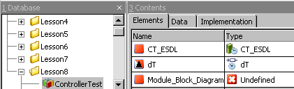

If the project is opened in the project editor (see [Project Editor](ProjectEditorEnglishUS.chm::/PE_Overview.htm)), the names of the missing modules appear in the Outline tab. In the operating system editor (OS tab, see [Defining the Scheduling in the OS Editor](ProjectEditorEnglishUS.chm::/schedulingos .htm)), the missing processes are deleted from the Processes field, they are, however, retained in the task list as open references (undef::undef).

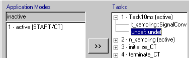

You can import the missing modules at a later time even if you have opened the project. Afterwards, the project has no open references, and the processes are automatically inserted into the right tasks.

See also

[Importing Folders and Database/Workspace Items](markdown/ImportFolders.md)

[Import of a Directory Content](markdown/ImportingDirectory.md)

[Project Editor - Overview](ProjectEditorEnglishUS.chm::/PE_Overview.htm)

[Operating System Menu](ProjectEditorEnglishUS.chm::/PE_OS_Tab.htm)

[Defining the Scheduling in the OS Editor](ProjectEditorEnglishUS.chm::/schedulingos .htm)

---

## Import From Old ASCET Versions

_Source: `markdown/import_old_ascet_versions.md`_

# Importing Items from Old ASCET Versions

Export files created with ASCET-SD 4.0 or later can be imported into the current ASCET version; see [Importing an Export File from ASCET-SD prior to Version 4.0](markdown/ImportingOldASCET.md) and [Importing a Directory Content](markdown/DirectoryContent.md).

Export files created with versions prior to ASCET-SD 4.0 cannot be imported into the current ASCET version because the current version offers no interface to the old database formats. When you try to import such a file, you get the following error message:

This file is compatible with ASCET-SD V3.0 or earlier. It cannot be imported directly. Convert it to a database using your old version of ASCET-SD, then open this database.

See also

[Importing an Export File from ASCET-SD prior to Version 4.0](markdown/ImportingOldASCET.md)

[Importing from Binary Export Files](markdown/CM_ImportBinaryFiles.md)

[Importing a Directory Content](markdown/DirectoryContent.md)

---

## ASCET Monitor Window

_Source: `markdown/MonitorWindow.md`_

# ASCET Monitor Window

The results of various operations are displayed in the ASCET monitor window in two tabs.

The Monitor tab shows the results of the following operations:

1. Code generation, experimenting ([Analyzing Components](BlockDiagramEditorEnglishUS.chm::/AnalyzingComponents.htm), [Experimenting with State Machines](StateMachineEditorEnglishUS.chm::/SM_experiment_with_state_machines.htm), [Experimenting with Continuous Time Blocks](SpecifyingCTBlocksEnglishUS.chm::/CTB_Experimenting_with_CT_Blocks.htm), [Experimenting with Projects](ProjectEditorEnglishUS.chm::/experimentingprojects.htm))
1. Analysis of components (e.g., [block diagrams](BlockDiagramEditorEnglishUS.chm::/AnalyzingComponents.htm), AUTOSAR [software components](AtomicSoftwareComponentEditorEnglishUS.chm::/ASCanalyzeAtomicSWC.htm), [ESDL components](ESDLEditorEnglishUS.chm::/ESDL_analyzing_esdl_components.htm)).
1. Database optimizations ([Optimizing a Database](markdown/Optimize.md)).
1. Export and import processes ([Export of Folders and Database/Workspace Items,](markdown/ExportingFolders.md) [Import of Folders and Database/Workspace Items](markdown/ImportFolders.md)).
1. Search for operator implementations.

Each time new information appears in the Monitor tab, this information is written to the Ascet_Monitor.log file in the ASCET log directory, e.g., C:\ETAS\LogFiles\ASCET.

The Build tab shows the results of the following operations:

1. Code generation, experimenting.
1. Analysis of diagrams.

You can read and save the content of both tabs. If you do not want to save the entire text of the Monitor tab, you can delete, copy and add sections in the monitor window in the same way as you can with any other text. The Edit menu contains the items Cut, Copy and Paste for this purpose. You can also find and replace text strings using Edit menu, and selecting Find/Replace.

Default options for the monitor window can be set in the Monitor node of the [ASCET options window](markdown/cm_user_interface_of_the_ascet_options_window.md).

Remember that there is no undo function when you are editing.

You can

[Saving the Content of the Monitor Tab](markdown/SaveMonitor.md)

[Saving the Content of the Monitor Tab under a Different Name](markdown/SaveDifferent.md)

[Find or Replace in the Monitor Tab](markdown/FindOrReplace.md)

[Clearing the Monitor Tab](markdown/Clear.md)

[Displaying the Cause of the Error/Warning](markdown/DisplayErrorcause.md)

[Configuring Messages](markdown/cm_configuremessages.md)

[Saving the Content of the Build Tab](markdown/SaveContent.md)

[Saving the Content of the Build Tab under a Different Name](markdown/SavedifferentName.md)

See also

[Description of Monitor Window](markdown/UserInterfacemonitor.md)

[Promoting Messages](markdown/CM_Promoting_Messages.md)

[Analyzing Components](BlockDiagramEditorEnglishUS.chm::/AnalyzingComponents.htm)

[Experimenting with State Machines](StateMachineEditorEnglishUS.chm::/SM_experiment_with_state_machines.htm)

[Experimenting with Continuous Time Blocks](SpecifyingCTBlocksEnglishUS.chm::/CTB_Experimenting_with_CT_Blocks.htm)

[Experimenting with Projects](ProjectEditorEnglishUS.chm::/experimentingprojects.htm)

[Analyzing a Diagram](ESDLEditorEnglishUS.chm::/ESDL_analyze_diagram.htm)

[Analyzing ESDL Components](ESDLEditorEnglishUS.chm::/ESDL_analyzing_esdl_components.htm)

[Optimizing a Database](markdown/Optimize.md)

[Export of Folders and Database/Workspace Items](markdown/ExportingFolders.md)

[Import of Folders and Database/Workspace Items](markdown/ImportFolders.md)

---

## Configuring Messages

_Source: `markdown/cm_configuremessages.md`_

# Configuring Messages

The way messages are displayed in the Build tab of the ASCET monitor window can be configured. Some configurations are done directly in the Build tab:

1. [promoting information and warnings](markdown/to_promote_information_and_warnings.md) to warnings and errors and [revoking a promotion](markdown/To_Revoke_a_Promotion.md)
1. [hiding messages](markdown/Hiding_Messages.md) and [showing all hidden messages](markdown/Showing_all_Hidden_Messages.md)

Additional configuration possibilities are offered in the project-specific CodeGen Message Configuration window. This window can be accessed from the ASCET monitor window or from a project's Project Properties window. You can do the following:

1. [promote](markdown/Promoting_Information_and_Warnings.md) or [hide](markdown/Hiding_Messages_Monitor_Window.md) not only the messages currently displayed in the Build tab, but all existing messages,
1. [revoke promotions](markdown/Revoking_a_Promotion.md)
1. [show](markdown/Showing_Hidden_Messages.md) all or selected hidden messages

Unless specified otherwise, project-specific promotions are overridden by global configurations (see [Promoting Messages](markdown/CM_Promoting_Messages.md)).

See also

[Promoting Messages](markdown/CM_Promoting_Messages.md)

[Promoting Information and Warnings (Monitor Window)](markdown/to_promote_information_and_warnings.md)

[Revoking a Promotion (Monitor Window)](markdown/To_Revoke_a_Promotion.md)

[Hiding Messages (Monitor Window)](markdown/Hiding_Messages.md)

[Showing all Hidden Messages](markdown/Showing_all_Hidden_Messages.md)

[Promoting Information and Warnings](markdown/Promoting_Information_and_Warnings.md)

[Hiding Messages](markdown/Hiding_Messages_Monitor_Window.md)

[Revoking a Promotion](markdown/Revoking_a_Promotion.md)

[Showing Hidden Messages](markdown/Showing_Hidden_Messages.md)

---

## Promoting Messages

_Source: `markdown/CM_Promoting_Messages.md`_

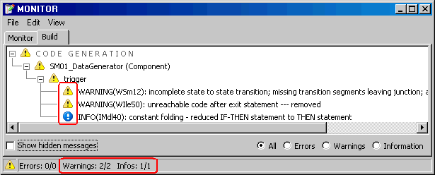

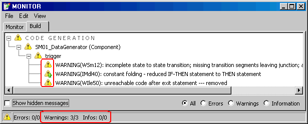

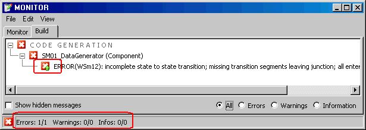

# Promoting Messages

Information and warning messages do not interrupt the code generation process. The relevant context of a project may require a stricter interpretation for some information or warnings which is why it is possible to promote information or warnings of one type, either for a particular project or on a global level. Unless specified otherwise, global configurations override project-specific configurations.

The table below shows the possible promotions.

| Column 1 | Column 2 | Column 3 | Column 4 |
| --- | --- | --- | --- |
| Promote to | Information | Warning | Error message |
| Information |  | possible | possible |
| Warning | --- |  | possible |
| Error message | --- | --- |  |

The identifier of a promoted message remains unchanged which is why promoting does not affect showing/hiding messages.

If a hidden message is promoted, it is displayed again.

The following figures are intended to clarify promoting. The [first figure](javascript:kadovTextPopup(this))<!-- kadovTextPopupInit('a1'); //--> shows two warnings and an information message as they are issued by code generation.

In the [second figure](javascript:kadovTextPopup(this))<!-- kadovTextPopupInit('a2'); //-->, the information has been promoted to a warning. The type remains the same – IMdl40 – but the message is assigned the icon for warnings with an indication that this warning is promoted information:  In the Build tab, three warnings are displayed and counted.

In the [third figure](javascript:kadovTextPopup(this))<!-- kadovTextPopupInit('a3'); //-->, the first warning has been promoted to an error message. The type remains the same – WSm12 – but the message is assigned the icon for error messages with an indication that this is a promoted message:

Promotion to an error message causes code generation to abort at this point, it does not reach the stage of the second message. This is why only one error message is displayed in this case in the Build tab.

See also

[Promoting Information and Warnings](markdown/Promoting_Information_and_Warnings.md)

[Promoting Information and Warnings (Monitor Window)](markdown/to_promote_information_and_warnings.md)

[Revoking a Promotion (Configuration Windows)](markdown/Revoking_a_Promotion.md)

[Revoking a Promotion (Monitor Window)](markdown/To_Revoke_a_Promotion.md)

[List of Error Messages](markdown/List_of_Error_Messages.md)

[List of Information Messages](markdown/List_of_Information_Messages.md)

[List of Warning Messages](markdown/List_of_Warning_Messages.md)

/* Heikki Komulainen, Comet Computer GmbH 2004 */ cc_plus_pic = '&nbsp;'; cc_minus_pic = '&nbsp;'; cc_stat_pic = '&nbsp;'; gpstyle = ''; var iframes_created = 0; if (document.body && document.body.insertAdjacentHTML && document.getElementsByTagName && document.getElementById) { collect_popups(); set_poplinks_pictures(); if (iframes_created) { document.write(gpstyle); document.write('
<nobr><a id="einauslink" style="position:absolute;top:expression(document.body.scrollTop + this.offsetHeight - this.offsetHeight);left:expression(document.body.offsetWidth - (this.offsetWidth + 28));background:white;padding:5px" href="javascript:show_all_poptext()">Alle texte einblenden</a></nobr>
'); } } function collect_popups() { bsscpopups = new Array(); for (x = 0; x < document.links.length; x++) { if (document.links[x].href.indexOf("BSSCPopup")>-1) { seekmatch = /BSSCPopup.'[^'](markdown/+)'/; poplink = seekmatch.exec(document.links[x].href); poplink = "" + poplink; poplink = poplink.substring(poplink.indexOf("'")+1, poplink.lastIndexOf("'")); ifid = "CCGENIFRAMEID" + x; new_iframe = '<iframe id="' + ifid + '"src="' + poplink + '" onload="get_text(\'' + ifid + '\')" width="0" height="0" frameborder=0></iframe>'; document.links[x].parentNode.insertAdjacentHTML("afterEnd", new_iframe); gpid = "CCID_" + ifid; document.links[x].href = "javascript:expand_poptext('" + gpid + "')"; cc_plus = '' + cc_plus_pic + ''; document.links[x].insertAdjacentHTML("afterBegin", cc_plus); iframes_created = 1; } } }// end function function get_text(ifr_id) { frpars = document.frames[ifr_id].document.getElementsByTagName("body"); popbody = frpars[0].innerHTML; gpid = "CCID_" + ifr_id; if (!document.getElementById(gpid)) { //avoiding doubles document.getElementById(ifr_id).insertAdjacentHTML("afterEnd", '
'+popbody+'
'); } }//end function function expand_poptext(x_frame_id) { if (!document.getElementById(x_frame_id)) return; if (document.getElementById(x_frame_id).className == "CCGENPOPTEXTH") { document.getElementById(x_frame_id).className = "CCGENPOPTEXTV"; document.getElementById(x_frame_id).style.visibility = "visible"; if (document.getElementById("CCPMB_" + x_frame_id )) { document.getElementById("CCPMB_" + x_frame_id ).innerHTML = cc_minus_pic; } } else { document.getElementById(x_frame_id).className = "CCGENPOPTEXTH"; document.getElementById(x_frame_id).style.visibility = "hidden"; if (document.getElementById("CCPMB_" + x_frame_id )) { document.getElementById("CCPMB_" + x_frame_id ).innerHTML = cc_plus_pic; } } }// end function function show_all_poptext() { var pulldowntxt = document.getElementsByTagName("div"); for (b = 0; b < pulldowntxt.length; b++) { if (pulldowntxt[b].className == "droptext") { pulldowntxt[b].style.display=""; } } var gptxt = document.getElementsByTagName("div"); for (z = 0; z < gptxt.length; z++) { if (gptxt[z].className == "CCGENPOPTEXTH") { gptxt[z].className = "CCGENPOPTEXTV"; gptxt[z].style.visibility = "visible"; if (document.getElementById("CCPMB_" + gptxt[z].id )) { document.getElementById("CCPMB_" + gptxt[z].id ).innerHTML = cc_minus_pic; } } } var dxpoplinks = document.getElementsByTagName("a"); if (dxpoplinks) { for (pxl = 0; pxl < dxpoplinks.length; pxl++) { if (dxpoplinks[pxl].href.indexOf("kadovTextPopup")>-1) { if (document.getElementById("CCPMB_" + dxpoplinks[pxl].id)) { document.getElementById("CCPMB_" + dxpoplinks[pxl].id).innerHTML = cc_stat_pic; dxpoplinks[pxl].symbol = "minus"; } } } } document.getElementById('einauslink').innerText = 'Alle texte ausblenden'; document.getElementById('einauslink').href = "javascript:self.location.reload()"; self.focus(); }// end function function eat_click() { return false; }// end function function set_poplinks_pictures() { var dpoplinks = document.getElementsByTagName("a"); if (dpoplinks) { for (pl = 0; pl < dpoplinks.length; pl++) { if (dpoplinks[pl].href.indexOf("kadovTextPopup")>-1) { cc_plus = '' + cc_stat_pic + ''; //dpoplinks[pl].onmouseup = plusminuspoplink; dpoplinks[pl].insertAdjacentHTML("afterBegin", cc_plus); dpoplinks[pl].symbol = "plus"; } } } }// end function function plusminuspoplink() { if (document.getElementById("CCPMB_" + this.id)) { if (this.symbol == "plus") { document.getElementById("CCPMB_" + this.id).innerHTML = cc_minus_pic; this.symbol = "minus"; } else { document.getElementById("CCPMB_" + this.id).innerHTML = cc_plus_pic; this.symbol = "plus"; } } return true; }

---

## IP Protection

_Source: `markdown/CM_IntellectualPropertyProtection.md`_

# Intellectual Property Protection

##### Introduction

ASCET provides means for intellectual property protection (IP protection), i.e. for secure exchange of sensitive components. The parties involved in such an exchange could be, e.g., OEM & Tier 1 supplier. The IP protection allows the exchange of protected components by keeping simulation (offline and online experiments) and build capabilities (for production code generation), including the generation of the respective ASAM-MCD-2MC description file (see also [ASAM-MCD-2MC Generation for Protected Components](markdown/CM_ASAM2MCGenerationProtectedComponents.md)).

IP protection works with ASCET V5.2.2+HF1 and higher.

##### Build Mechanism

The IP protection mechanism requires both companies to use the identical context, i.e. the identical project as well as identical settings/options.

ASCET uses the project OID to identify the generated code as well as the object code stored in the database. The code exported with the protected component will not be found if the component is used in a different project, and therefore ASCET will try - and fail - to regenerate code for the protected component.

In general, the attempt to regenerate code is an indication that the generation context (project, settings, options, etc.) is different. This must not happen for the IP protection use case to work.

When using old ASCET-SCM versions, be aware that the versioning tool changes the time stamps of the components. As a consequence, ASCET tries to rebuild the code even if nothing really changed. With ASCET-SCM V5.2.2-1018 or higher and ASCET V6.0.1 or higher, this problem is solved and time stamps are not changed during component import.

See also

[Preconditions for IP Protection](markdown/CM_PreconditionsIPProtection.md)

[IP Protection Procedure](markdown/CM_IPProtectionProcedure.md)

[ASAM-MCD-2MC Generation for Protected Components](markdown/CM_ASAM2MCGenerationProtectedComponents.md)

---

## Preconditions for IP Protection

_Source: `markdown/CM_PreconditionsIPProtection.md`_

# Preconditions for IP Protection

The following conditions must be kept in mind for IP protection to work properly:

- Both partners must use the same ASCET version.

With different ASCET versions, re-generation of the code will be enforced at the receiving partner, and data model conversions may take place. Both require Write access to the components.

- The code generation settings including [data type name settings](IntroductionEnglishUS.chm::/INT_DataTypeNames.htm) and [code generation message configuration](markdown/CM_ConfigMessages_in_ConfigWindows.md) have to be the same for all components which are involved.

It is recommended that both development partners use the same project to build the code, and keep the settings - i.e. [project properties](ProjectEditorEnglishUS.chm::/projectsettings.htm), [ASCET options](markdown/CM_Setting_Up_ASCET.md), settings in files such as codegen.ini,codegen_ecco.ini, memory_sections.xml, settings_<compiler>.mk etc. - unchanged.

- The required interface of an IP protected component must not be changed in the BUILD project. This includes:
- method signatures of embedded components (including their implementation specification)

It is recommended to include all embedded components in the IP protection to avoid this particular problem. For ASCET-SE targets using ASCET modules, this is mandatory since init code of embedded components will be generated into the module code.

- [formula](ProjectEditorEnglishUS.chm::/PE_TransformationFormulas.htm) / [implementation type](ProjectEditorEnglishUS.chm::/PE_ImplementationTypes.htm) definitions
- Declaration of all imported elements
- Only protected (Read and Write [access rights](markdown/DatabaseAccess.md) removed) modules and classes which are referenced by the very same project should be exchanged.

If Write access is possible, the component can be "touched" (see [Force a New Build during Code Generation](markdown/ForceaNewbuild.md)), which would make the generated code invalid.

For security reasons it is recommended to remove also the Generate access right. With that, any change in the code generation relevant settings will lead to an error early in the build process phase.

- It is recommended that, for communication between modules from both partners, the protected modules always contain the exported messages. ASCET needs to regenerate imported messages (which are exported in unprotected modules) in protected modules. For that purpose, full access rights are required.

So, if partner A transfers a protected module with messages to partner B, all shared messages are best exported in the protected module. If necessary, a shared interface module with message copies can be defined.

- Use the __NON_OPT_COPY setting for the modularMessageUse option in the codegen_ecco.ini file (see the ASCET-SE user's guide for details).
- All formulas and implementation types must remain unchanged. Adding or changing formulas or implementation types forces a rebuild for all components, not only those which use these formulas. In this, case you will lose the build capability for the IP protected components.

If more than one instance of the protected component is (or may be) present in the project context, the implementation setting Optimized Method Calls should be disabled in the [implementation editor of the component](ImplementationEditorEnglishUS.chm::/IEd_ImplementationEditor_for_ComponentsProjects.htm).

See also

[IP Protection](markdown/CM_IntellectualPropertyProtection.md)

[Access Rights](markdown/DatabaseAccess.md)

[IP Protection Procedure](markdown/CM_IPProtectionProcedure.md)

[ASAM-MCD-2MC Generation for Protected Components](markdown/CM_ASAM2MCGenerationProtectedComponents.md)

[Introduction - Data Type Names](IntroductionEnglishUS.chm::/INT_DataTypeNames.htm)

[Configuring Messages in the Configuration Windows](markdown/CM_ConfigMessages_in_ConfigWindows.md)

[Project Editor - Project Settings](ProjectEditorEnglishUS.chm::/projectsettings.htm)

[Setting Up ASCET](markdown/CM_Setting_Up_ASCET.md)

[Project Editor - Transformation Formulas](ProjectEditorEnglishUS.chm::/PE_TransformationFormulas.htm)

[Project Editor - Implementation Types](ProjectEditorEnglishUS.chm::/PE_ImplementationTypes.htm)

[Force a New Build during Code Generation](markdown/ForceaNewbuild.md)

[Editing Implementations - Implementation Editor for Components/Projects](ImplementationEditorEnglishUS.chm::/IEd_ImplementationEditor_for_ComponentsProjects.htm)

---

## IP Protection Procedure

_Source: `markdown/CM_IPProtectionProcedure.md`_

# IP Protection Procedure

The procedure to create and exchange IP protected components contains the following steps.

1. Both partners must deactivate [external code storage](ProjectEditorEnglishUS.chm::/PE_ExternalCodeStorage.htm).
1. Before transferring an IP protected model to a development partner, a [rebuild](ProjectEditorEnglishUS.chm::/generateexecutable.htm) has to be executed with full access rights for the modules and classes which are to be exchanged.
1. After that, the [access rights](markdown/DatabaseAccess.md), except Execute, for these components can be [disabled](markdown/ChangeAccess.md).
1. [Export](markdown/SingleExport.md) the protected components in the [*.exp](markdown/CM_Binary_Export.md) format.
1. Old versions of the components in the partner's database must be deleted.
1. The protected model can now be [imported](markdown/CM_ImportBinaryFiles.md) in the partner's database with the same project.
1. The project can be [rebuilt](ProjectEditorEnglishUS.chm::/generateexecutable.htm).

Rebuilding the project can only work when both partners use the same ASCET version (see [Preconditions for IP Protection](markdown/CM_PreconditionsIPProtection.md)).

See also

[IP Protection](markdown/CM_IntellectualPropertyProtection.md)

[Preconditions for IP Protection](markdown/CM_PreconditionsIPProtection.md)

[ASAM-MCD-2MC Generation for Protected Components](markdown/CM_ASAM2MCGenerationProtectedComponents.md)

[Access Rights](markdown/DatabaseAccess.md)

[Changing the Access Rights to a Folder or Item](markdown/ChangeAccess.md)

[Exporting a Folder or Database/Workspace Item](markdown/SingleExport.md)

[Binary Export](markdown/CM_Binary_Export.md)

[Importing from Binary Export Files](markdown/CM_ImportBinaryFiles.md)

[Project Editor - External Code Storage](ProjectEditorEnglishUS.chm::/PE_ExternalCodeStorage.htm)

[Project Editor - Building/Rebuilding Executable Code](projecteditorenglishus.chm::/generateexecutable.htm)

---

## ASAM-MCD-2MC Generation for Protected Components

_Source: `markdown/CM_ASAM2MCGenerationProtectedComponents.md`_

# ASAM-MCD-2MC Generation for Protected Components

IP protected components must be generated and compiled with virtual address table (see ASCET-SE user's guide for details). You must activate the Generate Map File option in the [Production Code](ProjectEditorEnglishUS.chm::/Production_Code_Options_Window.htm) node of the Project Properties window and the addressTable option in the codegen_ecco.ini file.

You also need to define the COMPILE_VAT macro in the project_settings.mk file. The macro is added to the PROJECT_DEFINES section, e.g.,

PROJECT_DEFINES = $(MEM_LAYOUT) $(COMPILE_UNUSED_DEF) __DCC__ __GENERATE_ISR_DUMMY COMPILE_VAT

It is recommended to use these settings in all ASCET installations involved in the component exchange.

Then you can generate code with the unprotected components, protect the components and transfer them to the development partner. The partner can build the project as described before. See also [IP Protection Procedure](markdown/CM_IPProtectionProcedure.md) and [Building/Rebuilding Executable Code](projecteditorenglishus.chm::/generateexecutable.htm).

To generate a complete a2l file, the partner has to read the information from the precompiled objects. This is done in the project editor, via the Tools menu, ASAM-2MC submenu, Read Hex File option. Afterwards, the a2l file can be written as described in [Generating Application Files](ProjectEditorEnglishUS.chm::/generating_files.htm); it should contain the complete addresses.

See also

[IP Protection](markdown/CM_IntellectualPropertyProtection.md)

[Preconditions for IP Protection](markdown/CM_PreconditionsIPProtection.md)

[IP Protection Procedure](markdown/CM_IPProtectionProcedure.md)

[Project Editor - Production Code Node](ProjectEditorEnglishUS.chm::/Production_Code_Options_Window.htm)

[Project Editor - Building/Rebuilding Executable Code](projecteditorenglishus.chm::/generateexecutable.htm)

[Project Editor - Generating Application Files](ProjectEditorEnglishUS.chm::/generating_files.htm)

---

## Access Rights

_Source: `markdown/DatabaseAccess.md`_

# Access Rights

In a database, it is possible to adjust the access rights for each individual component, as well as those for entire folders. Access rights can be password protected, so that only users who know the password can change them. This ensures confidentiality when ASCET data is exchanged.

In a workspace, neither access rights nor password protection can be set.

If, for instance, the access rights of a particular component are set to execute only, that component can be used as a building block in other components, but it cannot be looked at, i.e. the algorithms it uses are protected from view.

The following access rights can be assigned:

Read

The database item can be looked at with the appropriate item editor. If read access is removed, the 3 Contents field shows only a note No read flag for <component name>!

Write

Items can be added to the database and deleted. Items can be edited in the appropriate editor. If write access is removed, the [item symbol](markdown/DescriptionofSymbols.md) in the 1 Database field and elsewhere is marked with a red frame (, , etc.).

Calibration

Items can be calibrated in experiments.

Execute

Items can be experimented on. This also goes for referenced items, i.e. if a user has no execute rights to an item, they cannot use it within another item, and then experiment with that.

Code Generation

This option allows code generation even if write access is not set. If read access is set, the component can be viewed, but not modified, experimentation is possible.

The most recent changes always apply. If, for instance, access rights for a single component are changed, and then later the rights for the entire folder are changed, those changes overrule the ones made earlier to the component.

Access rights can be specified for any database item. However, only limited modifications are permitted if password protection has been activated. Password protection can be activated separately for each root folder in the database. If password protection is activated, users can modify access rights only if they know the correct password.

If password protection is active, you must enter the password for every change to the access rights. This can be quite cumbersome if you want to modify more than just a few items. Therefore, it is more efficient to specify access rights first and then activate password protection.

See also

[Changing the Access Rights of a Folder or Item](markdown/ChangeAccess.md)

[Activating Password Protection](markdown/ActivatePassword.md)

[Deactivating Password Protection](markdown/DeactivatePassword.md)

[Symbols for Database/Workspace Items](markdown/DescriptionofSymbols.md)

---

## Creating a Database

_Source: `markdown/BasicTasks.md`_

# Creating a Database

It is recommended to use several databases or workspaces to keep the data volume small and comprehensible and to ensure optimal use of ASCET’s performance.

To create a new database, proceed as follows:

1. Do one of the following.
1. Enter a name for the new database and click OK.
1. Now proceed as described in [Managing Database/Workspace Items](markdown/ManagingDatabaseItems.md).

See also

[Loading a Database](markdown/cm_loaddatabase.md)

[Loading a Workspace](markdown/cm_loadworkspace.md)

[Saving the Current Database/Workspace](markdown/SaveDatabase.md)

[Saving a Database Under a Different Name](markdown/Differentname.md)

[Closing a Database/Workspace](markdown/CM_CloseDB.md)

[Deleting a Database/Workspace](markdown/DeleteDatabase.md)

[Optimizing a Database](markdown/Optimize.md)

[Comparing Two Databases](markdown/CompareTwo.md)

[Paths Options (Environment)](markdown/CM_PathsNode.md)

[Managing Database/Workspace Items](markdown/ManagingDatabaseItems.md)

---

## Creating a Workspace

_Source: `markdown/CM_CreateWorkspace.md`_

A warning message opens:

The folder "<folder path and name>" is not empty! Shall a new, empty subdirectory be created or do you want to select another location?

- Proceed as follows:

1. Activate Remember my Decision if you want to apply your answer to all such cases.

You can revoke this setting in the ASCET options window, [Confirmation Dialogs](markdown/CM_Options_for_Confirmation_Dialogs.md) node.

1. In the message window, click Create new to create an empty directory <workspace name> at the selected location.

Or

1. Click Select other to return to the Save new workspace as window and select another, empty folder.

Or

1. Click Cancel to abort the procedure.

# Creating a Workspace

It is recommended to use several databases or workspaces to keep the data volume small and comprehensible and to ensure optimal use of ASCET’s performance.

To create a new workspace, proceed as follows:

1. Do one of the following:
1. In the Save new workspace as window, enter path and filename for the new workspace and click on Save.
1. If you selected a non-empty directory, [another step is inserted](javascript:kadovTextPopup(this))<!-- kadovTextPopupInit('a1'); //-->.
1. Now proceed as described in [Managing Database/Workspace Items](markdown/ManagingDatabaseItems.md).

See also

[Loading a Workspace](markdown/cm_loadworkspace.md)

[Saving the Current Database/Workspace](markdown/SaveDatabase.md)

[Closing a Database/Workspace](markdown/CM_CloseDB.md)

[Deleting a Database](markdown/DeleteDatabase.md)

[Paths Options (Environment)](markdown/CM_PathsNode.md)

[Confirmation Dialog Options](markdown/CM_Options_for_Confirmation_Dialogs.md)

[Managing Database/Workspace Items](markdown/ManagingDatabaseItems.md)

/* Heikki Komulainen, Comet Computer GmbH 2004 */ cc_plus_pic = '&nbsp;'; cc_minus_pic = '&nbsp;'; cc_stat_pic = '&nbsp;'; gpstyle = ''; var iframes_created = 0; if (document.body && document.body.insertAdjacentHTML && document.getElementsByTagName && document.getElementById) { collect_popups(); set_poplinks_pictures(); if (iframes_created) { document.write(gpstyle); document.write('
<nobr><a id="einauslink" style="position:absolute;top:expression(document.body.scrollTop + this.offsetHeight - this.offsetHeight);left:expression(document.body.offsetWidth - (this.offsetWidth + 28));background:white;padding:5px" href="javascript:show_all_poptext()">Alle texte einblenden</a></nobr>
'); } } function collect_popups() { bsscpopups = new Array(); for (x = 0; x < document.links.length; x++) { if (document.links[x].href.indexOf("BSSCPopup")>-1) { seekmatch = /BSSCPopup.'[^'](markdown/+)'/; poplink = seekmatch.exec(document.links[x].href); poplink = "" + poplink; poplink = poplink.substring(poplink.indexOf("'")+1, poplink.lastIndexOf("'")); ifid = "CCGENIFRAMEID" + x; new_iframe = '<iframe id="' + ifid + '"src="' + poplink + '" onload="get_text(\'' + ifid + '\')" width="0" height="0" frameborder=0></iframe>'; document.links[x].parentNode.insertAdjacentHTML("afterEnd", new_iframe); gpid = "CCID_" + ifid; document.links[x].href = "javascript:expand_poptext('" + gpid + "')"; cc_plus = '' + cc_plus_pic + ''; document.links[x].insertAdjacentHTML("afterBegin", cc_plus); iframes_created = 1; } } }// end function function get_text(ifr_id) { frpars = document.frames[ifr_id].document.getElementsByTagName("body"); popbody = frpars[0].innerHTML; gpid = "CCID_" + ifr_id; if (!document.getElementById(gpid)) { //avoiding doubles document.getElementById(ifr_id).insertAdjacentHTML("afterEnd", '
'+popbody+'
'); } }//end function function expand_poptext(x_frame_id) { if (!document.getElementById(x_frame_id)) return; if (document.getElementById(x_frame_id).className == "CCGENPOPTEXTH") { document.getElementById(x_frame_id).className = "CCGENPOPTEXTV"; document.getElementById(x_frame_id).style.visibility = "visible"; if (document.getElementById("CCPMB_" + x_frame_id )) { document.getElementById("CCPMB_" + x_frame_id ).innerHTML = cc_minus_pic; } } else { document.getElementById(x_frame_id).className = "CCGENPOPTEXTH"; document.getElementById(x_frame_id).style.visibility = "hidden"; if (document.getElementById("CCPMB_" + x_frame_id )) { document.getElementById("CCPMB_" + x_frame_id ).innerHTML = cc_plus_pic; } } }// end function function show_all_poptext() { var pulldowntxt = document.getElementsByTagName("div"); for (b = 0; b < pulldowntxt.length; b++) { if (pulldowntxt[b].className == "droptext") { pulldowntxt[b].style.display=""; } } var gptxt = document.getElementsByTagName("div"); for (z = 0; z < gptxt.length; z++) { if (gptxt[z].className == "CCGENPOPTEXTH") { gptxt[z].className = "CCGENPOPTEXTV"; gptxt[z].style.visibility = "visible"; if (document.getElementById("CCPMB_" + gptxt[z].id )) { document.getElementById("CCPMB_" + gptxt[z].id ).innerHTML = cc_minus_pic; } } } var dxpoplinks = document.getElementsByTagName("a"); if (dxpoplinks) { for (pxl = 0; pxl < dxpoplinks.length; pxl++) { if (dxpoplinks[pxl].href.indexOf("kadovTextPopup")>-1) { if (document.getElementById("CCPMB_" + dxpoplinks[pxl].id)) { document.getElementById("CCPMB_" + dxpoplinks[pxl].id).innerHTML = cc_stat_pic; dxpoplinks[pxl].symbol = "minus"; } } } } document.getElementById('einauslink').innerText = 'Alle texte ausblenden'; document.getElementById('einauslink').href = "javascript:self.location.reload()"; self.focus(); }// end function function eat_click() { return false; }// end function function set_poplinks_pictures() { var dpoplinks = document.getElementsByTagName("a"); if (dpoplinks) { for (pl = 0; pl < dpoplinks.length; pl++) { if (dpoplinks[pl].href.indexOf("kadovTextPopup")>-1) { cc_plus = '' + cc_stat_pic + ''; //dpoplinks[pl].onmouseup = plusminuspoplink; dpoplinks[pl].insertAdjacentHTML("afterBegin", cc_plus); dpoplinks[pl].symbol = "plus"; } } } }// end function function plusminuspoplink() { if (document.getElementById("CCPMB_" + this.id)) { if (this.symbol == "plus") { document.getElementById("CCPMB_" + this.id).innerHTML = cc_minus_pic; this.symbol = "minus"; } else { document.getElementById("CCPMB_" + this.id).innerHTML = cc_plus_pic; this.symbol = "plus"; } } return true; }

---

## Converting a Database into a Workspace

_Source: `markdown/CM_ConvertDatabaseToWorkspace.md`_

# Converting a Database into a Workspace

You can convert a database into a workspace. To do so, proceed as follows.

1. [Open the database](markdown/cm_loaddatabase.md) you want to convert.
1. In the File menu, select Convert to Workspace.
1. Follow the instructions on the wizard pages.
1. On the last wizard page, activate Open Workspace now if you want the workspace to open immediately.
1. Close the wizard.

The original database remains intact in any case.

See also

[Loading a Database](markdown/cm_loaddatabase.md)

[Creating a Workspace](markdown/CM_CreateWorkspace.md)

[ASCET Workspace](markdown/CM_ASCETWorkspace.md)

---

## Loading a Database

_Source: `markdown/cm_loaddatabase.md`_

DB size > 3 GB

The size of the database '<database name>' is <DB size> GB.

The maximum supported database size is about 3.5 GB.

To decrease the database size, please perform the Optimize action in the database utility dialog "Tools->Database->Performance Utilities..." in the component manager.

or

DB size > 3 GB

The size of the internal code storage of database '<database name>' is <code size> GB.

The maximum supported code storage size is about 3.5 GB.

To decrease the database size, please perform a "Build->Clean All (w/o DB optimize" in the component manager.

# Loading a Database

You can also load databases from previous program versions (see [Converting an ASCET-SD 4.x Database](markdown/Convert4.1.md)).

To load a database, proceed as follows:

1. Open the Select database or workspace window with one of the following actions.
1. Perform one of the following actions.
1. Click OK.
1. Perform one of the following actions.

See also

[ASCET Database](markdown/CM_ASCETDatabase.md)

[Using Databases from Previous ASCET Versions](markdown/CM_UseDatabasesFromPrevious_ASCETversions.md)

[Paths Options (Environment)](markdown/CM_PathsNode.md)

[Creating a Database](markdown/BasicTasks.md)

[Creating a Workspace](markdown/CM_CreateWorkspace.md)

/* Heikki Komulainen, Comet Computer GmbH 2004 */ cc_plus_pic = '&nbsp;'; cc_minus_pic = '&nbsp;'; cc_stat_pic = '&nbsp;'; gpstyle = ''; var iframes_created = 0; if (document.body && document.body.insertAdjacentHTML && document.getElementsByTagName && document.getElementById) { collect_popups(); set_poplinks_pictures(); if (iframes_created) { document.write(gpstyle); document.write('
<nobr><a id="einauslink" style="position:absolute;top:expression(document.body.scrollTop + this.offsetHeight - this.offsetHeight);left:expression(document.body.offsetWidth - (this.offsetWidth + 28));background:white;padding:5px" href="javascript:show_all_poptext()">Alle texte einblenden</a></nobr>
'); } } function collect_popups() { bsscpopups = new Array(); for (x = 0; x < document.links.length; x++) { if (document.links[x].href.indexOf("BSSCPopup")>-1) { seekmatch = /BSSCPopup.'[^'](markdown/+)'/; poplink = seekmatch.exec(document.links[x].href); poplink = "" + poplink; poplink = poplink.substring(poplink.indexOf("'")+1, poplink.lastIndexOf("'")); ifid = "CCGENIFRAMEID" + x; new_iframe = '<iframe id="' + ifid + '"src="' + poplink + '" onload="get_text(\'' + ifid + '\')" width="0" height="0" frameborder=0></iframe>'; document.links[x].parentNode.insertAdjacentHTML("afterEnd", new_iframe); gpid = "CCID_" + ifid; document.links[x].href = "javascript:expand_poptext('" + gpid + "')"; cc_plus = '' + cc_plus_pic + ''; document.links[x].insertAdjacentHTML("afterBegin", cc_plus); iframes_created = 1; } } }// end function function get_text(ifr_id) { frpars = document.frames[ifr_id].document.getElementsByTagName("body"); popbody = frpars[0].innerHTML; gpid = "CCID_" + ifr_id; if (!document.getElementById(gpid)) { //avoiding doubles document.getElementById(ifr_id).insertAdjacentHTML("afterEnd", '
'+popbody+'
'); } }//end function function expand_poptext(x_frame_id) { if (!document.getElementById(x_frame_id)) return; if (document.getElementById(x_frame_id).className == "CCGENPOPTEXTH") { document.getElementById(x_frame_id).className = "CCGENPOPTEXTV"; document.getElementById(x_frame_id).style.visibility = "visible"; if (document.getElementById("CCPMB_" + x_frame_id )) { document.getElementById("CCPMB_" + x_frame_id ).innerHTML = cc_minus_pic; } } else { document.getElementById(x_frame_id).className = "CCGENPOPTEXTH"; document.getElementById(x_frame_id).style.visibility = "hidden"; if (document.getElementById("CCPMB_" + x_frame_id )) { document.getElementById("CCPMB_" + x_frame_id ).innerHTML = cc_plus_pic; } } }// end function function show_all_poptext() { var pulldowntxt = document.getElementsByTagName("div"); for (b = 0; b < pulldowntxt.length; b++) { if (pulldowntxt[b].className == "droptext") { pulldowntxt[b].style.display=""; } } var gptxt = document.getElementsByTagName("div"); for (z = 0; z < gptxt.length; z++) { if (gptxt[z].className == "CCGENPOPTEXTH") { gptxt[z].className = "CCGENPOPTEXTV"; gptxt[z].style.visibility = "visible"; if (document.getElementById("CCPMB_" + gptxt[z].id )) { document.getElementById("CCPMB_" + gptxt[z].id ).innerHTML = cc_minus_pic; } } } var dxpoplinks = document.getElementsByTagName("a"); if (dxpoplinks) { for (pxl = 0; pxl < dxpoplinks.length; pxl++) { if (dxpoplinks[pxl].href.indexOf("kadovTextPopup")>-1) { if (document.getElementById("CCPMB_" + dxpoplinks[pxl].id)) { document.getElementById("CCPMB_" + dxpoplinks[pxl].id).innerHTML = cc_stat_pic; dxpoplinks[pxl].symbol = "minus"; } } } } document.getElementById('einauslink').innerText = 'Alle texte ausblenden'; document.getElementById('einauslink').href = "javascript:self.location.reload()"; self.focus(); }// end function function eat_click() { return false; }// end function function set_poplinks_pictures() { var dpoplinks = document.getElementsByTagName("a"); if (dpoplinks) { for (pl = 0; pl < dpoplinks.length; pl++) { if (dpoplinks[pl].href.indexOf("kadovTextPopup")>-1) { cc_plus = '' + cc_stat_pic + ''; //dpoplinks[pl].onmouseup = plusminuspoplink; dpoplinks[pl].insertAdjacentHTML("afterBegin", cc_plus); dpoplinks[pl].symbol = "plus"; } } } }// end function function plusminuspoplink() { if (document.getElementById("CCPMB_" + this.id)) { if (this.symbol == "plus") { document.getElementById("CCPMB_" + this.id).innerHTML = cc_minus_pic; this.symbol = "minus"; } else { document.getElementById("CCPMB_" + this.id).innerHTML = cc_plus_pic; this.symbol = "plus"; } } return true; }

---

## Loading a Workspace

_Source: `markdown/cm_loadworkspace.md`_

# Loading a Workspace

To load a workspace, proceed as follows:

1. Open the Select database or workspace window with one of the following actions.
1. Select the workspace you want to open and click OK.

See also

[Paths Options (Environment)](markdown/CM_PathsNode.md)

[Creating a Database](markdown/BasicTasks.md)

[Creating a Workspace](markdown/CM_CreateWorkspace.md)

---

## Saving the Current Database/Workspace

_Source: `markdown/SaveDatabase.md`_

# Saving the Current Database/Workspace

When you make changes to an ASCET database or workspace, those changes are stored in a cache, in RAM. To make the changes permanent, you have to save them to the database/workspace on the hard disk.

To save the current database/workspace, proceed as follows:

1. Do one of the following:
1. In the File menu, select Save Database
1. Click on the  Save button.
1. Press Ctrl + s.

If the database size exceeds 3.5 GB, the Database size limit exceeded message window opens. You have to close this window and reduce the database size before you can work with the database.

The cache content is written to the hard disk. Use this command regularly to save your database or workspace.

The ASCET options (see [Environment Options](markdown/CM_Environment_Node.md)) allow you to enable the Autocommit function and to enter the desired time interval (see [Setting up Automatic Saving](markdown/SetAutomaticSaving.md)). The database/workspace is also saved automatically when you exit the Component Manager.

See also

[Setting up Automatic Saving](markdown/SetAutomaticSaving.md)

[Environment Options](markdown/CM_Environment_Node.md)

---

## Saving a Database Under a Different Name

_Source: `markdown/Differentname.md`_

# Saving a Database Under a Different Name

This procedure applies only to databases.

You can also save a database under any name. Thus you can, e.g. create a backup of an entire database and its supplementary files.

1. In the Component Manager, open the File menu and select Save As.

The Save Database as window opens.

1. Select the directory that will contain the database.

You must not select a database.

1. Click on the  New button to create a new, empty directory.

The New database path window opens.

1. Enter a name and click OK.

The new directory is created, and selected as target directory.

1. In the Save Database as window, click OK.

When you selected an existing directory, a warning is displayed that you will delete the entire content of that directory if you continue saving the database. You can cancel the procedure here.

If the database size exceeds 3.5 GB, the Database size limit exceeded message window opens. You have to close this window and reduce the database size before you can work with the database.

The content of the current database is copied, and the new database is created and loaded (see bottom bar in the Component Manager).

See also

[Creating a Database](markdown/BasicTasks.md)

---

## Saving a Workspace Under a Different Name

_Source: `markdown/cm_saveworkspace_underdifferentname.md`_

A warning message opens:

The folder "<folder path and name>" is not empty! Shall a new, empty subdirectory be created or do you want to select another location?

- Proceed as follows:

1. Activate Remember my Decision if you want to apply your answer to all such cases.

You can revoke this setting in the ASCET options window, [Confirmation Dialogs](markdown/CM_Options_for_Confirmation_Dialogs.md) node.

1. In the message window, click Create new to create an empty directory <workspace name> at the selected location.

Or

1. Click Select other to return to the Save new workspace as window and select another, empty folder.

Or

1. Click Cancel to abort the procedure.

# Saving a Workspace Under a Different Name

This procedure applies only to workspaces.

You can save a workspace under any name. Thus you can, e.g. create a backup of an entire database and its supplementary files.

1. In the Component Manager, open the File menu and select Save As.
1. In the Save new workspace as window, enter path and filename for the workspace and click on Save.
1. If you selected a non-empty directory, [another step is inserted](javascript:kadovTextPopup(this))<!-- kadovTextPopupInit('a1'); //-->.

The workspace is saved in the directory you specified. It opens automatically.

See also

[Saving a Database Under a Different Name](markdown/Differentname.md)

[Creating a Workspace](markdown/CM_CreateWorkspace.md)

/* Heikki Komulainen, Comet Computer GmbH 2004 */ cc_plus_pic = '&nbsp;'; cc_minus_pic = '&nbsp;'; cc_stat_pic = '&nbsp;'; gpstyle = ''; var iframes_created = 0; if (document.body && document.body.insertAdjacentHTML && document.getElementsByTagName && document.getElementById) { collect_popups(); set_poplinks_pictures(); if (iframes_created) { document.write(gpstyle); document.write('
<nobr><a id="einauslink" style="position:absolute;top:expression(document.body.scrollTop + this.offsetHeight - this.offsetHeight);left:expression(document.body.offsetWidth - (this.offsetWidth + 28));background:white;padding:5px" href="javascript:show_all_poptext()">Alle texte einblenden</a></nobr>
'); } } function collect_popups() { bsscpopups = new Array(); for (x = 0; x < document.links.length; x++) { if (document.links[x].href.indexOf("BSSCPopup")>-1) { seekmatch = /BSSCPopup.'[^'](markdown/+)'/; poplink = seekmatch.exec(document.links[x].href); poplink = "" + poplink; poplink = poplink.substring(poplink.indexOf("'")+1, poplink.lastIndexOf("'")); ifid = "CCGENIFRAMEID" + x; new_iframe = '<iframe id="' + ifid + '"src="' + poplink + '" onload="get_text(\'' + ifid + '\')" width="0" height="0" frameborder=0></iframe>'; document.links[x].parentNode.insertAdjacentHTML("afterEnd", new_iframe); gpid = "CCID_" + ifid; document.links[x].href = "javascript:expand_poptext('" + gpid + "')"; cc_plus = '' + cc_plus_pic + ''; document.links[x].insertAdjacentHTML("afterBegin", cc_plus); iframes_created = 1; } } }// end function function get_text(ifr_id) { frpars = document.frames[ifr_id].document.getElementsByTagName("body"); popbody = frpars[0].innerHTML; gpid = "CCID_" + ifr_id; if (!document.getElementById(gpid)) { //avoiding doubles document.getElementById(ifr_id).insertAdjacentHTML("afterEnd", '
'+popbody+'
'); } }//end function function expand_poptext(x_frame_id) { if (!document.getElementById(x_frame_id)) return; if (document.getElementById(x_frame_id).className == "CCGENPOPTEXTH") { document.getElementById(x_frame_id).className = "CCGENPOPTEXTV"; document.getElementById(x_frame_id).style.visibility = "visible"; if (document.getElementById("CCPMB_" + x_frame_id )) { document.getElementById("CCPMB_" + x_frame_id ).innerHTML = cc_minus_pic; } } else { document.getElementById(x_frame_id).className = "CCGENPOPTEXTH"; document.getElementById(x_frame_id).style.visibility = "hidden"; if (document.getElementById("CCPMB_" + x_frame_id )) { document.getElementById("CCPMB_" + x_frame_id ).innerHTML = cc_plus_pic; } } }// end function function show_all_poptext() { var pulldowntxt = document.getElementsByTagName("div"); for (b = 0; b < pulldowntxt.length; b++) { if (pulldowntxt[b].className == "droptext") { pulldowntxt[b].style.display=""; } } var gptxt = document.getElementsByTagName("div"); for (z = 0; z < gptxt.length; z++) { if (gptxt[z].className == "CCGENPOPTEXTH") { gptxt[z].className = "CCGENPOPTEXTV"; gptxt[z].style.visibility = "visible"; if (document.getElementById("CCPMB_" + gptxt[z].id )) { document.getElementById("CCPMB_" + gptxt[z].id ).innerHTML = cc_minus_pic; } } } var dxpoplinks = document.getElementsByTagName("a"); if (dxpoplinks) { for (pxl = 0; pxl < dxpoplinks.length; pxl++) { if (dxpoplinks[pxl].href.indexOf("kadovTextPopup")>-1) { if (document.getElementById("CCPMB_" + dxpoplinks[pxl].id)) { document.getElementById("CCPMB_" + dxpoplinks[pxl].id).innerHTML = cc_stat_pic; dxpoplinks[pxl].symbol = "minus"; } } } } document.getElementById('einauslink').innerText = 'Alle texte ausblenden'; document.getElementById('einauslink').href = "javascript:self.location.reload()"; self.focus(); }// end function function eat_click() { return false; }// end function function set_poplinks_pictures() { var dpoplinks = document.getElementsByTagName("a"); if (dpoplinks) { for (pl = 0; pl < dpoplinks.length; pl++) { if (dpoplinks[pl].href.indexOf("kadovTextPopup")>-1) { cc_plus = '' + cc_stat_pic + ''; //dpoplinks[pl].onmouseup = plusminuspoplink; dpoplinks[pl].insertAdjacentHTML("afterBegin", cc_plus); dpoplinks[pl].symbol = "plus"; } } } }// end function function plusminuspoplink() { if (document.getElementById("CCPMB_" + this.id)) { if (this.symbol == "plus") { document.getElementById("CCPMB_" + this.id).innerHTML = cc_minus_pic; this.symbol = "minus"; } else { document.getElementById("CCPMB_" + this.id).innerHTML = cc_plus_pic; this.symbol = "plus"; } } return true; }

---

## Closing a Database/Workspace

_Source: `markdown/CM_CloseDB.md`_

# Closing a Database/Workspace

You can close the database or workspace you are working on without exiting ASCET.

To close a database/workspace, proceed as follows:

- In the File menu, select Close.

Unsaved changes are saved to disk. The database or workspace is closed. The Component Manager remains open, but most buttons and menu options are deactivated.

When you close ASCET before you open another database/workspace, the database/workspace you closed will open at the next ASCET start.

---

## Deleting a Database/Workspace

_Source: `markdown/DeleteDatabase.md`_

# Deleting a Database/Workspace

You cannot delete a database or workspace from within ASCET.

To delete a database/workspace, proceed as follows:

1. If the database/workspace you want to delete is open in ASCET, close it.
1. In the Windows Explorer, select the directory (e.g. ..\ETASData\Ascet<n>, <n> being the ASCET version number) that contains the database/workspace you want to delete.
1. In the Windows Explorer, delete the subdirectory containing the database/workspace.

If you try to delete a database that is opened in ASCET, an error message occurs.

No error message opens when you try to delete a workspace that is opened in ASCET. So be careful when deleting a workspace.

---

## Optimizing a Database

_Source: `markdown/Optimize.md`_

# Optimizing a Database

This procedure is not available for workspaces.

To optimize a database, proceed as follows:

1. In the Component Manager, open the Tools menu, point to Database and select Performance Utilities.
1. Activate one or more of the options. Optimize Used to defragment the database. Convert Used to rewrite the database, thus improving access speeds. In most cases, regular optimization will be enough to keep the performance of your database at an acceptable level. You should only consider converting the entire database if you encounter serious problems with performance. Converting a large database can be very time-consuming. It is recommended to run this as an overnight process. Repair Used to rebuild the database from scratch. Damages of your database, e.g., destroyed references, are repaired. Repairing a database always includes the Optimize and Convert operations, the corresponding options are blocked. Check Used to verify the structures and references in the database while logging the results in the monitor window.
1. Click on the Execute button.
1. Click OK to close the message window.

See also

[ASCET Monitor Window](markdown/MonitorWindow.md)

[Database Info Dialog Window](markdown/DatabaseDialog.md)

---

## Searching Unreadable Database Items

_Source: `markdown/CM_Search_Unreadable_Items.md`_

# Searching Unreadable Database Items

This procedure is not available for workspaces.

During, e.g., a power failure, database items can be so damaged that they can no longer be read by ASCET. If Clean All or one of the database performance utilities (see [Optimizing a Database](markdown/Optimize.md)) is executed while these damaged items are still present, the entire database can be destroyed. Proceed as follows to search for unreadable database items:

- In the Component Manager, open the Tools menu, point to Database and select Show Unreadable Items.

The database is searched. A status window shows the progress of the procedure and lists the number of bad entries detected so far.

1. If unreadable items are found, they are listed in the Items with read problems in part proxies window. When you click on an item in the said window, it is highlighted in the Component Manager, and you can delete it.
1. If no unreadable item is detected in the database, a message window opens with a respective note. Confirm with OK.

See also

[Optimizing a Database](markdown/Optimize.md)

---

## Comparing Two Databases

_Source: `markdown/CompareTwo.md`_

# Comparing Two Databases

This procedure is not available for workspaces.

You can compare entire databases with each other. This is useful if you are working with different copies or development streams of the same database, or when working in development teams.

1. In the Component Manager, open the Tools menu, point to Database and select Compare Database.

The Compare database window opens.

1. Select the database that you want to compare with the current database.
1. Click OK to start the comparison.

Comparing large databases can be very time-consuming.

The databases are compared with each other. A list of items and projects in which the databases differ from each other is displayed in the monitor window.

---

## Using Databases from previous ASCET versions

_Source: `markdown/CM_UseDatabasesFromPrevious_ASCETversions.md`_

# Using Databases from Previous ASCET Versions

You can use databases from previous ASCET versions. The way to open an old database depends on the version used for its creation.

- [Converting a Database from ASCET-SD V4.0 or later](markdown/Convert4.1.md)
- [Converting a Database from ASCET-SD prior to V4.0](markdown/Convertdatabase.md)
- [Converting a Database/Workspace to ANSI C](markdown/ConverttoANSIC.md)

---

## Converting a Database from ASCET-SD V4.0 or later

_Source: `markdown/Convert4.1.md`_

# Converting a Database from ASCET-SD 4.0 or Later

To convert a database created with ASCET-SD 4.0 or later, proceed as follows:

1. Open the Select database or workspace window as described in [Loading a Database](markdown/cm_loaddatabase.md).
1. In the Select database or workspace window, select the directory that contains the old database.
1. Click OK to start the conversion.
1. Click OK to confirm the conversion.
1. Select a directory for the backup copy of the old database.
1. Start the conversion procedure by clicking OK in the Specify the directory to backup the original database window.

The database is converted to the current ASCET format. A copy of the old database is written to the selected directory. The duration of the conversion depends on the amount of data.

See also

[Loading a Database](markdown/cm_loaddatabase.md)

[Converting a Database from ASCET-SD prior to V4.0](markdown/Convertdatabase.md)

---

## Converting a Database from ASCET-SD prior to V4.0

_Source: `markdown/Convertdatabase.md`_

# Converting a Database from ASCET-SD prior to V4.0

When you still have ASCET-SD 4.x, you can use very old databases from ASCET-SD prior to V4.0 with the current ASCET version. Proceed as follows:

1. Start ASCET-SD 4.x.

These versions contain interfaces to the very old database formats.

1. Open the old database.

The database items are converted to the format of the corresponding ASCET-SD version.

1. Close ASCET-SD 4.x.
1. Start the current ASCET version.
1. Open the database you have just converted to ASCET-SD 4.x, as described in [Converting a Database from ASCET-SD V4.0 or later](markdown/Convert4.1.md).

See also

[Converting a Database from ASCET-SD V4.0 or later](markdown/Convert4.1.md)

---

## Converting a Database/Workspace to ANSI C

_Source: `markdown/ConverttoANSIC.md`_

| Column 1 | Column 2 | Column 3 |
| --- | --- | --- |
| Special Characters | Mapped to | Example |
| Ä, ä, Ö, ö, Ü, ü, ß | Ae, ae, Oe, oe, Ue, ue, ss | Ma ß e --> Ma ss e |
| letters with diacritics, <space>, <dash>, <dot> | <underscore> | r é el --> r _ el |
| , ; : ! ? / \ \| ( ) [ ] { } < > # + * | <ignored> | Class \ test --> Classtest |

# Converting a Database/Workspace to ANSI C

To convert a database or workspace to ANSI C, proceed as follows:

1. Open the database/workspace you want to convert.
1. In the Tools menu, point to Database or Workspace, then point to Convert and select All Names to ANSI C.

The names of all folders, database/workspace items, methods, messages, variables, etc. are converted to ANSI C; according to the [mapping table](javascript:kadovTextPopup(this))<!-- kadovTextPopupInit('a1'); //--> for all special characters, punctuation marks and spaces. Names that are [reserved keywords](IntroductionEnglishUS.chm::/INT_Reserved_Keywords.htm) are appended a number: _<n> (<n> being the lowest available integer).

The conversion does not modify C code and ESDL code. Therefore, errors will occur in hand-written code which contains elements whose names are changed by the conversion to ANSI C. If, e.g., an ESDL component contains a variable originally named Switch (a reserved keyword), the variable is renamed to Switch_1, but the occurrences in the code still read Switch.

When converting large databases, you should consider optimizing or converting your database after conversion to speed up database access (see [Maintenance Routines](markdown/CM_Database_Maintenance_Routines.md)).

See also

[Introduction - Reserved Keywords](IntroductionEnglishUS.chm::/INT_Reserved_Keywords.htm)

[Maintenance Routines](markdown/CM_Database_Maintenance_Routines.md)

/* Heikki Komulainen, Comet Computer GmbH 2004 */ cc_plus_pic = '&nbsp;'; cc_minus_pic = '&nbsp;'; cc_stat_pic = '&nbsp;'; gpstyle = ''; var iframes_created = 0; if (document.body && document.body.insertAdjacentHTML && document.getElementsByTagName && document.getElementById) { collect_popups(); set_poplinks_pictures(); if (iframes_created) { document.write(gpstyle); document.write('
<nobr><a id="einauslink" style="position:absolute;top:expression(document.body.scrollTop + this.offsetHeight - this.offsetHeight);left:expression(document.body.offsetWidth - (this.offsetWidth + 28));background:white;padding:5px" href="javascript:show_all_poptext()">Alle texte einblenden</a></nobr>
'); } } function collect_popups() { bsscpopups = new Array(); for (x = 0; x < document.links.length; x++) { if (document.links[x].href.indexOf("BSSCPopup")>-1) { seekmatch = /BSSCPopup.'[^'](markdown/+)'/; poplink = seekmatch.exec(document.links[x].href); poplink = "" + poplink; poplink = poplink.substring(poplink.indexOf("'")+1, poplink.lastIndexOf("'")); ifid = "CCGENIFRAMEID" + x; new_iframe = '<iframe id="' + ifid + '"src="' + poplink + '" onload="get_text(\'' + ifid + '\')" width="0" height="0" frameborder=0></iframe>'; document.links[x].parentNode.insertAdjacentHTML("afterEnd", new_iframe); gpid = "CCID_" + ifid; document.links[x].href = "javascript:expand_poptext('" + gpid + "')"; cc_plus = '' + cc_plus_pic + ''; document.links[x].insertAdjacentHTML("afterBegin", cc_plus); iframes_created = 1; } } }// end function function get_text(ifr_id) { frpars = document.frames[ifr_id].document.getElementsByTagName("body"); popbody = frpars[0].innerHTML; gpid = "CCID_" + ifr_id; if (!document.getElementById(gpid)) { //avoiding doubles document.getElementById(ifr_id).insertAdjacentHTML("afterEnd", '
'+popbody+'
'); } }//end function function expand_poptext(x_frame_id) { if (!document.getElementById(x_frame_id)) return; if (document.getElementById(x_frame_id).className == "CCGENPOPTEXTH") { document.getElementById(x_frame_id).className = "CCGENPOPTEXTV"; document.getElementById(x_frame_id).style.visibility = "visible"; if (document.getElementById("CCPMB_" + x_frame_id )) { document.getElementById("CCPMB_" + x_frame_id ).innerHTML = cc_minus_pic; } } else { document.getElementById(x_frame_id).className = "CCGENPOPTEXTH"; document.getElementById(x_frame_id).style.visibility = "hidden"; if (document.getElementById("CCPMB_" + x_frame_id )) { document.getElementById("CCPMB_" + x_frame_id ).innerHTML = cc_plus_pic; } } }// end function function show_all_poptext() { var pulldowntxt = document.getElementsByTagName("div"); for (b = 0; b < pulldowntxt.length; b++) { if (pulldowntxt[b].className == "droptext") { pulldowntxt[b].style.display=""; } } var gptxt = document.getElementsByTagName("div"); for (z = 0; z < gptxt.length; z++) { if (gptxt[z].className == "CCGENPOPTEXTH") { gptxt[z].className = "CCGENPOPTEXTV"; gptxt[z].style.visibility = "visible"; if (document.getElementById("CCPMB_" + gptxt[z].id )) { document.getElementById("CCPMB_" + gptxt[z].id ).innerHTML = cc_minus_pic; } } } var dxpoplinks = document.getElementsByTagName("a"); if (dxpoplinks) { for (pxl = 0; pxl < dxpoplinks.length; pxl++) { if (dxpoplinks[pxl].href.indexOf("kadovTextPopup")>-1) { if (document.getElementById("CCPMB_" + dxpoplinks[pxl].id)) { document.getElementById("CCPMB_" + dxpoplinks[pxl].id).innerHTML = cc_stat_pic; dxpoplinks[pxl].symbol = "minus"; } } } } document.getElementById('einauslink').innerText = 'Alle texte ausblenden'; document.getElementById('einauslink').href = "javascript:self.location.reload()"; self.focus(); }// end function function eat_click() { return false; }// end function function set_poplinks_pictures() { var dpoplinks = document.getElementsByTagName("a"); if (dpoplinks) { for (pl = 0; pl < dpoplinks.length; pl++) { if (dpoplinks[pl].href.indexOf("kadovTextPopup")>-1) { cc_plus = '' + cc_stat_pic + ''; //dpoplinks[pl].onmouseup = plusminuspoplink; dpoplinks[pl].insertAdjacentHTML("afterBegin", cc_plus); dpoplinks[pl].symbol = "plus"; } } } }// end function function plusminuspoplink() { if (document.getElementById("CCPMB_" + this.id)) { if (this.symbol == "plus") { document.getElementById("CCPMB_" + this.id).innerHTML = cc_minus_pic; this.symbol = "minus"; } else { document.getElementById("CCPMB_" + this.id).innerHTML = cc_plus_pic; this.symbol = "plus"; } } return true; }

---

## Browsing the Database/Workspace (Instructions)

_Source: `markdown/CM_BrowseDatabaseWorkspace.md`_

# Browsing the Database/Workspace (Instructions)

Browsing a database/workspace contains the following actions.

1. [Searching for Components](markdown/searching%20_items.md)
1. [Searching for References to Components](markdown/searching_referencesitems.md)
1. [Searching for Declarations of Methods/Processes/Runnables](markdown/searching%20_methods.md)
1. [Searching for References to Methods/Processes](markdown/searching_senders%20.md)
1. [Searching for Declarations of Local Elements](markdown/CM_SearchDeclarations_LocalElements.md)
1. [Searching for Declarations of Elements](markdown/searching%20_defining%20element.md)
1. [Searching for References to Elements](markdown/searching_usingelement.md)
1. [Searching for Senders of Messages](markdown/CM_searching_sendingmessage.md)
1. [Searching for Receivers of Messages](markdown/searching_receivingmessage.md)
1. [Browsing the Database/Workspace (Toolbar)](markdown/cm_browsing_the_database_toolbar.md)

---

## Searching for References to Components

_Source: `markdown/searching_referencesitems.md`_

| Column 1 | Column 2 | Column 3 | Column 4 |
| --- | --- | --- | --- |
| wildcard position | example | search result | example |
| beginning of <search string> | *test | item names ending with <search string> | ControllerTest Test |
| end of <search string> | test* | item names beginning with <search string> | testmodule Test |
| inside <search string> | p*t | item names beginning and ending with the specified explicit characters, and 0 - n arbitrary characters in between | Project polarTOcart |
| no wildcard | class | item names identical to <search string> (if no matching item are found: item names containing <search string> ) | class (testclass C_class_1) |
| more than one wildcard | p*t* | combined results of both wildcards | PT1 Project PulseGenerator |

# Searching for References to Components

To search for references to components, proceed as follows:

1. In the Component Manager, open the database or workspace you want to search.
1. Do one of the following:
1. In the Enter a string field, enter the name of the item you are searching for.
1. In the Select what you are looking for combo box, select References to Components.
1. Click Find to start the search.
1. In the Results field, click on one of the results.

The components that reference the selected item are listed in the Referenced By field. You can click on one component to highlight it in the Component Manager.

See also

[Browse References to Window](markdown/Browse_References_to_Window.md)

[Searching for Components](markdown/searching%20_items.md)

[Searching for Declarations of Methods/Processes/Runnables](markdown/searching%20_methods.md)

[Searching for References to Methods/Processes/Runnables](markdown/searching_senders%20.md)

[Searching for Declarations of Local Elements](markdown/CM_SearchDeclarations_LocalElements.md)

[Searching for Declarations of Elements](markdown/searching%20_defining%20element.md)

[Searching for References to Elements](markdown/searching_usingelement.md)

[Searching for Senders of Messages](markdown/CM_searching_sendingmessage.md)

[Searching for Receivers of Messages](markdown/searching_receivingmessage.md)

[Search Criteria](markdown/CM_Search_Criteria.md)

/* Heikki Komulainen, Comet Computer GmbH 2004 */ cc_plus_pic = '&nbsp;'; cc_minus_pic = '&nbsp;'; cc_stat_pic = '&nbsp;'; gpstyle = ''; var iframes_created = 0; if (document.body && document.body.insertAdjacentHTML && document.getElementsByTagName && document.getElementById) { collect_popups(); set_poplinks_pictures(); if (iframes_created) { document.write(gpstyle); document.write('
<nobr><a id="einauslink" style="position:absolute;top:expression(document.body.scrollTop + this.offsetHeight - this.offsetHeight);left:expression(document.body.offsetWidth - (this.offsetWidth + 28));background:white;padding:5px" href="javascript:show_all_poptext()">Alle texte einblenden</a></nobr>
'); } } function collect_popups() { bsscpopups = new Array(); for (x = 0; x < document.links.length; x++) { if (document.links[x].href.indexOf("BSSCPopup")>-1) { seekmatch = /BSSCPopup.'[^'](markdown/+)'/; poplink = seekmatch.exec(document.links[x].href); poplink = "" + poplink; poplink = poplink.substring(poplink.indexOf("'")+1, poplink.lastIndexOf("'")); ifid = "CCGENIFRAMEID" + x; new_iframe = '<iframe id="' + ifid + '"src="' + poplink + '" onload="get_text(\'' + ifid + '\')" width="0" height="0" frameborder=0></iframe>'; document.links[x].parentNode.insertAdjacentHTML("afterEnd", new_iframe); gpid = "CCID_" + ifid; document.links[x].href = "javascript:expand_poptext('" + gpid + "')"; cc_plus = '' + cc_plus_pic + ''; document.links[x].insertAdjacentHTML("afterBegin", cc_plus); iframes_created = 1; } } }// end function function get_text(ifr_id) { frpars = document.frames[ifr_id].document.getElementsByTagName("body"); popbody = frpars[0].innerHTML; gpid = "CCID_" + ifr_id; if (!document.getElementById(gpid)) { //avoiding doubles document.getElementById(ifr_id).insertAdjacentHTML("afterEnd", '
'+popbody+'
'); } }//end function function expand_poptext(x_frame_id) { if (!document.getElementById(x_frame_id)) return; if (document.getElementById(x_frame_id).className == "CCGENPOPTEXTH") { document.getElementById(x_frame_id).className = "CCGENPOPTEXTV"; document.getElementById(x_frame_id).style.visibility = "visible"; if (document.getElementById("CCPMB_" + x_frame_id )) { document.getElementById("CCPMB_" + x_frame_id ).innerHTML = cc_minus_pic; } } else { document.getElementById(x_frame_id).className = "CCGENPOPTEXTH"; document.getElementById(x_frame_id).style.visibility = "hidden"; if (document.getElementById("CCPMB_" + x_frame_id )) { document.getElementById("CCPMB_" + x_frame_id ).innerHTML = cc_plus_pic; } } }// end function function show_all_poptext() { var pulldowntxt = document.getElementsByTagName("div"); for (b = 0; b < pulldowntxt.length; b++) { if (pulldowntxt[b].className == "droptext") { pulldowntxt[b].style.display=""; } } var gptxt = document.getElementsByTagName("div"); for (z = 0; z < gptxt.length; z++) { if (gptxt[z].className == "CCGENPOPTEXTH") { gptxt[z].className = "CCGENPOPTEXTV"; gptxt[z].style.visibility = "visible"; if (document.getElementById("CCPMB_" + gptxt[z].id )) { document.getElementById("CCPMB_" + gptxt[z].id ).innerHTML = cc_minus_pic; } } } var dxpoplinks = document.getElementsByTagName("a"); if (dxpoplinks) { for (pxl = 0; pxl < dxpoplinks.length; pxl++) { if (dxpoplinks[pxl].href.indexOf("kadovTextPopup")>-1) { if (document.getElementById("CCPMB_" + dxpoplinks[pxl].id)) { document.getElementById("CCPMB_" + dxpoplinks[pxl].id).innerHTML = cc_stat_pic; dxpoplinks[pxl].symbol = "minus"; } } } } document.getElementById('einauslink').innerText = 'Alle texte ausblenden'; document.getElementById('einauslink').href = "javascript:self.location.reload()"; self.focus(); }// end function function eat_click() { return false; }// end function function set_poplinks_pictures() { var dpoplinks = document.getElementsByTagName("a"); if (dpoplinks) { for (pl = 0; pl < dpoplinks.length; pl++) { if (dpoplinks[pl].href.indexOf("kadovTextPopup")>-1) { cc_plus = '' + cc_stat_pic + ''; //dpoplinks[pl].onmouseup = plusminuspoplink; dpoplinks[pl].insertAdjacentHTML("afterBegin", cc_plus); dpoplinks[pl].symbol = "plus"; } } } }// end function function plusminuspoplink() { if (document.getElementById("CCPMB_" + this.id)) { if (this.symbol == "plus") { document.getElementById("CCPMB_" + this.id).innerHTML = cc_minus_pic; this.symbol = "minus"; } else { document.getElementById("CCPMB_" + this.id).innerHTML = cc_plus_pic; this.symbol = "plus"; } } return true; }

---

## Searching for Declarations of Local Elements

_Source: `markdown/CM_SearchDeclarations_LocalElements.md`_

| Column 1 | Column 2 | Column 3 | Column 4 |
| --- | --- | --- | --- |
| wildcard position | example | search result | example |
| beginning of <search string> | *time | item names ending with <search string> | GreenTime time |
| end of <search string> | air* | item names beginning with <search string> | air_nominal air |
| inside <search string> | c*nt | item names beginning and ending with the specified explicit characters, and 0 - n arbitrary characters in between | count cnt |
| no wildcard | cont | item names identical to <search string> (if no matching items are found: item names containing <search string> ) | cont (continuous ADBufcont) |
| more than one wildcard | x*1* | combined results of all wildcards | x 1 xin_10 |

# Searching for Declarations of Local Elements

To search for the declarations of local elements in methods, processes, and runnable entities, proceed as follows:

1. In the Component Manager, open the database or workspace you want to search.
1. Do one of the following:
1. In the Enter a string field, enter the name of the element you are searching for.
1. In the Select what you are looking for combo box, select Declarations of method/process element.
1. Click Find to start the search.

The elements matching the search string are displayed in the Browse Method Elements window, together with the name of the component they belong to. You can double-click on an entry to highlight the component in the Component Manager and open it in the respective editor.

See also

[Results Window](markdown/CM_ResultsWindow.md)

[Searching for Components](markdown/searching%20_items.md)

[Searching for References to Components](markdown/searching_referencesitems.md)

[Searching for Declarations of Methods/Processes/Runnables](markdown/searching%20_methods.md)

[Searching for References to Methods/Processes/Runnables](markdown/searching_senders%20.md)

[Searching for References to Elements](markdown/searching_usingelement.md)

[Searching for Senders of Messages](markdown/CM_searching_sendingmessage.md)

[Searching for Receivers of Messages](markdown/searching_receivingmessage.md)

[Search Criteria](markdown/CM_Search_Criteria.md)

/* Heikki Komulainen, Comet Computer GmbH 2004 */ cc_plus_pic = '&nbsp;'; cc_minus_pic = '&nbsp;'; cc_stat_pic = '&nbsp;'; gpstyle = ''; var iframes_created = 0; if (document.body && document.body.insertAdjacentHTML && document.getElementsByTagName && document.getElementById) { collect_popups(); set_poplinks_pictures(); if (iframes_created) { document.write(gpstyle); document.write('
<nobr><a id="einauslink" style="position:absolute;top:expression(document.body.scrollTop + this.offsetHeight - this.offsetHeight);left:expression(document.body.offsetWidth - (this.offsetWidth + 28));background:white;padding:5px" href="javascript:show_all_poptext()">Show all hidden text</a></nobr>
'); } } function collect_popups() { bsscpopups = new Array(); for (x = 0; x < document.links.length; x++) { if (document.links[x].href.indexOf("BSSCPopup")>-1) { seekmatch = /BSSCPopup.'[^'](markdown/+)'/; poplink = seekmatch.exec(document.links[x].href); poplink = "" + poplink; poplink = poplink.substring(poplink.indexOf("'")+1, poplink.lastIndexOf("'")); ifid = "CCGENIFRAMEID" + x; new_iframe = '<iframe id="' + ifid + '"src="' + poplink + '" onload="get_text(\'' + ifid + '\')" width="0" height="0" frameborder=0></iframe>'; document.links[x].parentNode.insertAdjacentHTML("afterEnd", new_iframe); gpid = "CCID_" + ifid; document.links[x].href = "javascript:expand_poptext('" + gpid + "')"; cc_plus = '' + cc_plus_pic + ''; document.links[x].insertAdjacentHTML("afterBegin", cc_plus); iframes_created = 1; } } }// end function function get_text(ifr_id) { frpars = document.frames[ifr_id].document.getElementsByTagName("body"); popbody = frpars[0].innerHTML; gpid = "CCID_" + ifr_id; if (!document.getElementById(gpid)) { //avoiding doubles document.getElementById(ifr_id).insertAdjacentHTML("afterEnd", '
'+popbody+'
'); } }//end function function expand_poptext(x_frame_id) { if (!document.getElementById(x_frame_id)) return; if (document.getElementById(x_frame_id).className == "CCGENPOPTEXTH") { document.getElementById(x_frame_id).className = "CCGENPOPTEXTV"; document.getElementById(x_frame_id).style.visibility = "visible"; if (document.getElementById("CCPMB_" + x_frame_id )) { document.getElementById("CCPMB_" + x_frame_id ).innerHTML = cc_minus_pic; } } else { document.getElementById(x_frame_id).className = "CCGENPOPTEXTH"; document.getElementById(x_frame_id).style.visibility = "hidden"; if (document.getElementById("CCPMB_" + x_frame_id )) { document.getElementById("CCPMB_" + x_frame_id ).innerHTML = cc_plus_pic; } } }// end function function show_all_poptext() { var pulldowntxt = document.getElementsByTagName("div"); for (b = 0; b < pulldowntxt.length; b++) { if (pulldowntxt[b].className == "droptext") { pulldowntxt[b].style.display=""; } } var gptxt = document.getElementsByTagName("div"); for (z = 0; z < gptxt.length; z++) { if (gptxt[z].className == "CCGENPOPTEXTH") { gptxt[z].className = "CCGENPOPTEXTV"; gptxt[z].style.visibility = "visible"; if (document.getElementById("CCPMB_" + gptxt[z].id )) { document.getElementById("CCPMB_" + gptxt[z].id ).innerHTML = cc_minus_pic; } } } var dxpoplinks = document.getElementsByTagName("a"); if (dxpoplinks) { for (pxl = 0; pxl < dxpoplinks.length; pxl++) { if (dxpoplinks[pxl].href.indexOf("kadovTextPopup")>-1) { if (document.getElementById("CCPMB_" + dxpoplinks[pxl].id)) { document.getElementById("CCPMB_" + dxpoplinks[pxl].id).innerHTML = cc_stat_pic; dxpoplinks[pxl].symbol = "minus"; } } } } document.getElementById('einauslink').innerText = 'Hide all hideable text'; document.getElementById('einauslink').href = "javascript:self.location.reload()"; self.focus(); }// end function function eat_click() { return false; }// end function function set_poplinks_pictures() { var dpoplinks = document.getElementsByTagName("a"); if (dpoplinks) { for (pl = 0; pl < dpoplinks.length; pl++) { if (dpoplinks[pl].href.indexOf("kadovTextPopup")>-1) { cc_plus = '' + cc_stat_pic + ''; //dpoplinks[pl].onmouseup = plusminuspoplink; dpoplinks[pl].insertAdjacentHTML("afterBegin", cc_plus); dpoplinks[pl].symbol = "plus"; } } } }// end function function plusminuspoplink() { if (document.getElementById("CCPMB_" + this.id)) { if (this.symbol == "plus") { document.getElementById("CCPMB_" + this.id).innerHTML = cc_minus_pic; this.symbol = "minus"; } else { document.getElementById("CCPMB_" + this.id).innerHTML = cc_plus_pic; this.symbol = "plus"; } } return true; }

---

## Searching for References to Elements

_Source: `markdown/searching_usingelement.md`_

| Column 1 | Column 2 | Column 3 | Column 4 |
| --- | --- | --- | --- |
| wildcard position | example | search result | example |
| beginning of <search string> | *time | item names ending with <search string> | GreenTime time |
| end of <search string> | air* | item names beginning with <search string> | air_nominal air |
| inside <search string> | c*nt | item names beginning and ending with the specified explicit characters, and 0 - n arbitrary characters in between | count cnt |
| no wildcard | cont | item names identical to <search string> (if no matching items are found: item names containing <search string> ) | cont (continuous ADBufcont) |
| more than one wildcard | x*1* | combined results of all wildcards | x 1 xin_10 |

# Searching for References to Elements

To search for the reference to elements, proceed as follows:

1. In the Component Manager, open the database or workspace you want to search.
1. Do one of the following:
1. In the Enter a string field, enter the name of the element you are searching for.
1. In the Select what you are looking for combo box, select Users of References to Elements.
1. Click Find to start the search.

The elements matching the search string are displayed in the Browse Elements window, together with the name of the component they belong to. You can double-click on an entry to highlight the component in the Component Manager and open it in the respective editor.

See also

[Results Window](markdown/CM_ResultsWindow.md)

[Searching for References to Methods/Processes/Runnables](markdown/searching_senders%20.md)

[Searching for Declarations of Methods/Processes/Runnables](markdown/searching%20_methods.md)

[Searching for Components](markdown/searching%20_items.md)

[Searching for References to Components](markdown/searching_referencesitems.md)

[Searching for Declarations of Local Elements](markdown/CM_SearchDeclarations_LocalElements.md)

[Searching for Declarations of Elements](markdown/searching%20_defining%20element.md)

[Searching for Senders of Messages](markdown/CM_searching_sendingmessage.md)

[Searching for Receivers of Messages](markdown/searching_receivingmessage.md)

[Search Criteria](markdown/CM_Search_Criteria.md)

/* Heikki Komulainen, Comet Computer GmbH 2004 */ cc_plus_pic = '&nbsp;'; cc_minus_pic = '&nbsp;'; cc_stat_pic = '&nbsp;'; gpstyle = ''; var iframes_created = 0; if (document.body && document.body.insertAdjacentHTML && document.getElementsByTagName && document.getElementById) { collect_popups(); set_poplinks_pictures(); if (iframes_created) { document.write(gpstyle); document.write('
<nobr><a id="einauslink" style="position:absolute;top:expression(document.body.scrollTop + this.offsetHeight - this.offsetHeight);left:expression(document.body.offsetWidth - (this.offsetWidth + 28));background:white;padding:5px" href="javascript:show_all_poptext()">Alle texte einblenden</a></nobr>
'); } } function collect_popups() { bsscpopups = new Array(); for (x = 0; x < document.links.length; x++) { if (document.links[x].href.indexOf("BSSCPopup")>-1) { seekmatch = /BSSCPopup.'[^'](markdown/+)'/; poplink = seekmatch.exec(document.links[x].href); poplink = "" + poplink; poplink = poplink.substring(poplink.indexOf("'")+1, poplink.lastIndexOf("'")); ifid = "CCGENIFRAMEID" + x; new_iframe = '<iframe id="' + ifid + '"src="' + poplink + '" onload="get_text(\'' + ifid + '\')" width="0" height="0" frameborder=0></iframe>'; document.links[x].parentNode.insertAdjacentHTML("afterEnd", new_iframe); gpid = "CCID_" + ifid; document.links[x].href = "javascript:expand_poptext('" + gpid + "')"; cc_plus = '' + cc_plus_pic + ''; document.links[x].insertAdjacentHTML("afterBegin", cc_plus); iframes_created = 1; } } }// end function function get_text(ifr_id) { frpars = document.frames[ifr_id].document.getElementsByTagName("body"); popbody = frpars[0].innerHTML; gpid = "CCID_" + ifr_id; if (!document.getElementById(gpid)) { //avoiding doubles document.getElementById(ifr_id).insertAdjacentHTML("afterEnd", '
'+popbody+'
'); } }//end function function expand_poptext(x_frame_id) { if (!document.getElementById(x_frame_id)) return; if (document.getElementById(x_frame_id).className == "CCGENPOPTEXTH") { document.getElementById(x_frame_id).className = "CCGENPOPTEXTV"; document.getElementById(x_frame_id).style.visibility = "visible"; if (document.getElementById("CCPMB_" + x_frame_id )) { document.getElementById("CCPMB_" + x_frame_id ).innerHTML = cc_minus_pic; } } else { document.getElementById(x_frame_id).className = "CCGENPOPTEXTH"; document.getElementById(x_frame_id).style.visibility = "hidden"; if (document.getElementById("CCPMB_" + x_frame_id )) { document.getElementById("CCPMB_" + x_frame_id ).innerHTML = cc_plus_pic; } } }// end function function show_all_poptext() { var pulldowntxt = document.getElementsByTagName("div"); for (b = 0; b < pulldowntxt.length; b++) { if (pulldowntxt[b].className == "droptext") { pulldowntxt[b].style.display=""; } } var gptxt = document.getElementsByTagName("div"); for (z = 0; z < gptxt.length; z++) { if (gptxt[z].className == "CCGENPOPTEXTH") { gptxt[z].className = "CCGENPOPTEXTV"; gptxt[z].style.visibility = "visible"; if (document.getElementById("CCPMB_" + gptxt[z].id )) { document.getElementById("CCPMB_" + gptxt[z].id ).innerHTML = cc_minus_pic; } } } var dxpoplinks = document.getElementsByTagName("a"); if (dxpoplinks) { for (pxl = 0; pxl < dxpoplinks.length; pxl++) { if (dxpoplinks[pxl].href.indexOf("kadovTextPopup")>-1) { if (document.getElementById("CCPMB_" + dxpoplinks[pxl].id)) { document.getElementById("CCPMB_" + dxpoplinks[pxl].id).innerHTML = cc_stat_pic; dxpoplinks[pxl].symbol = "minus"; } } } } document.getElementById('einauslink').innerText = 'Alle texte ausblenden'; document.getElementById('einauslink').href = "javascript:self.location.reload()"; self.focus(); }// end function function eat_click() { return false; }// end function function set_poplinks_pictures() { var dpoplinks = document.getElementsByTagName("a"); if (dpoplinks) { for (pl = 0; pl < dpoplinks.length; pl++) { if (dpoplinks[pl].href.indexOf("kadovTextPopup")>-1) { cc_plus = '' + cc_stat_pic + ''; //dpoplinks[pl].onmouseup = plusminuspoplink; dpoplinks[pl].insertAdjacentHTML("afterBegin", cc_plus); dpoplinks[pl].symbol = "plus"; } } } }// end function function plusminuspoplink() { if (document.getElementById("CCPMB_" + this.id)) { if (this.symbol == "plus") { document.getElementById("CCPMB_" + this.id).innerHTML = cc_minus_pic; this.symbol = "minus"; } else { document.getElementById("CCPMB_" + this.id).innerHTML = cc_plus_pic; this.symbol = "plus"; } } return true; }

---

## Searching for Senders of Messages

_Source: `markdown/CM_searching_sendingmessage.md`_

| Column 1 | Column 2 | Column 3 | Column 4 |
| --- | --- | --- | --- |
| wildcard position | example | search result | example |
| beginning of <search string> | *in | item names ending with <search string> | ActiveTimeIn in |
| end of <search string> | msg* | item names beginning with <search string> | msg_send msg |
| inside <search string> | c*nt | item names beginning and ending with the specified explicit characters, and 0 - n arbitrary characters in between | count cnt |
| no wildcard | in | item names identical to <search string> (if no matching items are found: item names containing <search string> ) | in (uInt16v4 Input_current) |
| more than one wildcard | s*32* | combined results of all wildcards | s32 sInt32v4 |

# Searching for Senders of Messages

To search for the component sending a particular message, proceed as follows:

1. In the Component Manager, open the database or workspace you want to search.
1. Do one of the following.
1. In the Enter a string field, enter the name of the message you are searching for.
1. In the Select what you are looking for combo box, select Sender of Messages.
1. Click Find to start the search.

The messages matching the search string are displayed in the Browse Sender Of Message window, together with the name of the component they belong to. You can double-click on an entry to highlight the component in the Component Manager and open it in the respective editor.

See also

[Messages](IntroductionEnglishUS.chm::/INT_messages.htm)

[Results Window](markdown/CM_ResultsWindow.md)

[Searching for Components](markdown/searching%20_items.md)

[Searching for References to Components](markdown/searching_referencesitems.md)

[Searching for Declarations of Methods/Processes/Runnables](markdown/searching%20_methods.md)

[Searching for References to Methods/Processes/Runnables](markdown/searching_senders%20.md)

[Searching for Declarations of Local Elements](markdown/CM_SearchDeclarations_LocalElements.md)

[Searching for References to Elements](markdown/searching_usingelement.md)

[Searching for Declarations of Elements](markdown/searching%20_defining%20element.md)

[Searching for Receivers of Messages](markdown/searching_receivingmessage.md)

[Search Criteria](markdown/CM_Search_Criteria.md)

/* Heikki Komulainen, Comet Computer GmbH 2004 */ cc_plus_pic = '&nbsp;'; cc_minus_pic = '&nbsp;'; cc_stat_pic = '&nbsp;'; gpstyle = ''; var iframes_created = 0; if (document.body && document.body.insertAdjacentHTML && document.getElementsByTagName && document.getElementById) { collect_popups(); set_poplinks_pictures(); if (iframes_created) { document.write(gpstyle); document.write('
<nobr><a id="einauslink" style="position:absolute;top:expression(document.body.scrollTop + this.offsetHeight - this.offsetHeight);left:expression(document.body.offsetWidth - (this.offsetWidth + 28));background:white;padding:5px" href="javascript:show_all_poptext()">Show all hidden text</a></nobr>
'); } } function collect_popups() { bsscpopups = new Array(); for (x = 0; x < document.links.length; x++) { if (document.links[x].href.indexOf("BSSCPopup")>-1) { seekmatch = /BSSCPopup.'[^'](markdown/+)'/; poplink = seekmatch.exec(document.links[x].href); poplink = "" + poplink; poplink = poplink.substring(poplink.indexOf("'")+1, poplink.lastIndexOf("'")); ifid = "CCGENIFRAMEID" + x; new_iframe = '<iframe id="' + ifid + '"src="' + poplink + '" onload="get_text(\'' + ifid + '\')" width="0" height="0" frameborder=0></iframe>'; document.links[x].parentNode.insertAdjacentHTML("afterEnd", new_iframe); gpid = "CCID_" + ifid; document.links[x].href = "javascript:expand_poptext('" + gpid + "')"; cc_plus = '' + cc_plus_pic + ''; document.links[x].insertAdjacentHTML("afterBegin", cc_plus); iframes_created = 1; } } }// end function function get_text(ifr_id) { frpars = document.frames[ifr_id].document.getElementsByTagName("body"); popbody = frpars[0].innerHTML; gpid = "CCID_" + ifr_id; if (!document.getElementById(gpid)) { //avoiding doubles document.getElementById(ifr_id).insertAdjacentHTML("afterEnd", '
'+popbody+'
'); } }//end function function expand_poptext(x_frame_id) { if (!document.getElementById(x_frame_id)) return; if (document.getElementById(x_frame_id).className == "CCGENPOPTEXTH") { document.getElementById(x_frame_id).className = "CCGENPOPTEXTV"; document.getElementById(x_frame_id).style.visibility = "visible"; if (document.getElementById("CCPMB_" + x_frame_id )) { document.getElementById("CCPMB_" + x_frame_id ).innerHTML = cc_minus_pic; } } else { document.getElementById(x_frame_id).className = "CCGENPOPTEXTH"; document.getElementById(x_frame_id).style.visibility = "hidden"; if (document.getElementById("CCPMB_" + x_frame_id )) { document.getElementById("CCPMB_" + x_frame_id ).innerHTML = cc_plus_pic; } } }// end function function show_all_poptext() { var pulldowntxt = document.getElementsByTagName("div"); for (b = 0; b < pulldowntxt.length; b++) { if (pulldowntxt[b].className == "droptext") { pulldowntxt[b].style.display=""; } } var gptxt = document.getElementsByTagName("div"); for (z = 0; z < gptxt.length; z++) { if (gptxt[z].className == "CCGENPOPTEXTH") { gptxt[z].className = "CCGENPOPTEXTV"; gptxt[z].style.visibility = "visible"; if (document.getElementById("CCPMB_" + gptxt[z].id )) { document.getElementById("CCPMB_" + gptxt[z].id ).innerHTML = cc_minus_pic; } } } var dxpoplinks = document.getElementsByTagName("a"); if (dxpoplinks) { for (pxl = 0; pxl < dxpoplinks.length; pxl++) { if (dxpoplinks[pxl].href.indexOf("kadovTextPopup")>-1) { if (document.getElementById("CCPMB_" + dxpoplinks[pxl].id)) { document.getElementById("CCPMB_" + dxpoplinks[pxl].id).innerHTML = cc_stat_pic; dxpoplinks[pxl].symbol = "minus"; } } } } document.getElementById('einauslink').innerText = 'Hide all hideable text'; document.getElementById('einauslink').href = "javascript:self.location.reload()"; self.focus(); }// end function function eat_click() { return false; }// end function function set_poplinks_pictures() { var dpoplinks = document.getElementsByTagName("a"); if (dpoplinks) { for (pl = 0; pl < dpoplinks.length; pl++) { if (dpoplinks[pl].href.indexOf("kadovTextPopup")>-1) { cc_plus = '' + cc_stat_pic + ''; //dpoplinks[pl].onmouseup = plusminuspoplink; dpoplinks[pl].insertAdjacentHTML("afterBegin", cc_plus); dpoplinks[pl].symbol = "plus"; } } } }// end function function plusminuspoplink() { if (document.getElementById("CCPMB_" + this.id)) { if (this.symbol == "plus") { document.getElementById("CCPMB_" + this.id).innerHTML = cc_minus_pic; this.symbol = "minus"; } else { document.getElementById("CCPMB_" + this.id).innerHTML = cc_plus_pic; this.symbol = "plus"; } } return true; }

---

## Searching for Receivers of Messages

_Source: `markdown/searching_receivingmessage.md`_

| Column 1 | Column 2 | Column 3 | Column 4 |
| --- | --- | --- | --- |
| wildcard position | example | search result | example |
| beginning of <search string> | *in | item names ending with <search string> | ActiveTimeIn in |
| end of <search string> | msg* | item names beginning with <search string> | msg_send msg |
| inside <search string> | c*nt | item names beginning and ending with the specified explicit characters, and 0 - n arbitrary characters in between | count cnt |
| no wildcard | in | item names identical to <search string> (if no matching items are found: item names containing <search string> ) | in (uInt16v4 Input_current) |
| more than one wildcard | s*32* | combined results of all wildcards | s32 sInt32v4 |

# Searching for Receivers of Messages

To search for the component receiving a particular message, proceed as follows:

1. In the Component Manager, open the database or workspace you want to search.
1. Do one of the following:
1. In the Enter a string field, enter the name of the message you are searching for.
1. In the Select what you are looking for combo box, select Receiver of Messages.
1. Click Find to start the search.

The messages matching the search string are displayed in the Browse Receiver Of Message window, together with the name of the component they belong to. You can double-click on an entry to highlight the component in the Component Manager and open it in the respective editor.

See also

[Messages](IntroductionEnglishUS.chm::/INT_messages.htm)

[Results Window](markdown/CM_ResultsWindow.md)

[Searching for Components](markdown/searching%20_items.md)

[Searching for References to Components](markdown/searching_referencesitems.md)

[Searching for Declarations of Methods/Processes/Runnables](markdown/searching%20_methods.md)

[Searching for References to Methods/Processes/Runnables](markdown/searching_senders%20.md)

[Searching for Declarations of Local Elements](markdown/CM_SearchDeclarations_LocalElements.md)

[Searching for Declarations of Elements](markdown/searching%20_defining%20element.md)

[Searching for References to Elements](markdown/searching_usingelement.md)

[Searching for Senders of Messages](markdown/CM_searching_sendingmessage.md)

[Search Criteria](markdown/CM_Search_Criteria.md)

/* Heikki Komulainen, Comet Computer GmbH 2004 */ cc_plus_pic = '&nbsp;'; cc_minus_pic = '&nbsp;'; cc_stat_pic = '&nbsp;'; gpstyle = ''; var iframes_created = 0; if (document.body && document.body.insertAdjacentHTML && document.getElementsByTagName && document.getElementById) { collect_popups(); set_poplinks_pictures(); if (iframes_created) { document.write(gpstyle); document.write('
<nobr><a id="einauslink" style="position:absolute;top:expression(document.body.scrollTop + this.offsetHeight - this.offsetHeight);left:expression(document.body.offsetWidth - (this.offsetWidth + 28));background:white;padding:5px" href="javascript:show_all_poptext()">Alle texte einblenden</a></nobr>
'); } } function collect_popups() { bsscpopups = new Array(); for (x = 0; x < document.links.length; x++) { if (document.links[x].href.indexOf("BSSCPopup")>-1) { seekmatch = /BSSCPopup.'[^'](markdown/+)'/; poplink = seekmatch.exec(document.links[x].href); poplink = "" + poplink; poplink = poplink.substring(poplink.indexOf("'")+1, poplink.lastIndexOf("'")); ifid = "CCGENIFRAMEID" + x; new_iframe = '<iframe id="' + ifid + '"src="' + poplink + '" onload="get_text(\'' + ifid + '\')" width="0" height="0" frameborder=0></iframe>'; document.links[x].parentNode.insertAdjacentHTML("afterEnd", new_iframe); gpid = "CCID_" + ifid; document.links[x].href = "javascript:expand_poptext('" + gpid + "')"; cc_plus = '' + cc_plus_pic + ''; document.links[x].insertAdjacentHTML("afterBegin", cc_plus); iframes_created = 1; } } }// end function function get_text(ifr_id) { frpars = document.frames[ifr_id].document.getElementsByTagName("body"); popbody = frpars[0].innerHTML; gpid = "CCID_" + ifr_id; if (!document.getElementById(gpid)) { //avoiding doubles document.getElementById(ifr_id).insertAdjacentHTML("afterEnd", '
'+popbody+'
'); } }//end function function expand_poptext(x_frame_id) { if (!document.getElementById(x_frame_id)) return; if (document.getElementById(x_frame_id).className == "CCGENPOPTEXTH") { document.getElementById(x_frame_id).className = "CCGENPOPTEXTV"; document.getElementById(x_frame_id).style.visibility = "visible"; if (document.getElementById("CCPMB_" + x_frame_id )) { document.getElementById("CCPMB_" + x_frame_id ).innerHTML = cc_minus_pic; } } else { document.getElementById(x_frame_id).className = "CCGENPOPTEXTH"; document.getElementById(x_frame_id).style.visibility = "hidden"; if (document.getElementById("CCPMB_" + x_frame_id )) { document.getElementById("CCPMB_" + x_frame_id ).innerHTML = cc_plus_pic; } } }// end function function show_all_poptext() { var pulldowntxt = document.getElementsByTagName("div"); for (b = 0; b < pulldowntxt.length; b++) { if (pulldowntxt[b].className == "droptext") { pulldowntxt[b].style.display=""; } } var gptxt = document.getElementsByTagName("div"); for (z = 0; z < gptxt.length; z++) { if (gptxt[z].className == "CCGENPOPTEXTH") { gptxt[z].className = "CCGENPOPTEXTV"; gptxt[z].style.visibility = "visible"; if (document.getElementById("CCPMB_" + gptxt[z].id )) { document.getElementById("CCPMB_" + gptxt[z].id ).innerHTML = cc_minus_pic; } } } var dxpoplinks = document.getElementsByTagName("a"); if (dxpoplinks) { for (pxl = 0; pxl < dxpoplinks.length; pxl++) { if (dxpoplinks[pxl].href.indexOf("kadovTextPopup")>-1) { if (document.getElementById("CCPMB_" + dxpoplinks[pxl].id)) { document.getElementById("CCPMB_" + dxpoplinks[pxl].id).innerHTML = cc_stat_pic; dxpoplinks[pxl].symbol = "minus"; } } } } document.getElementById('einauslink').innerText = 'Alle texte ausblenden'; document.getElementById('einauslink').href = "javascript:self.location.reload()"; self.focus(); }// end function function eat_click() { return false; }// end function function set_poplinks_pictures() { var dpoplinks = document.getElementsByTagName("a"); if (dpoplinks) { for (pl = 0; pl < dpoplinks.length; pl++) { if (dpoplinks[pl].href.indexOf("kadovTextPopup")>-1) { cc_plus = '' + cc_stat_pic + ''; //dpoplinks[pl].onmouseup = plusminuspoplink; dpoplinks[pl].insertAdjacentHTML("afterBegin", cc_plus); dpoplinks[pl].symbol = "plus"; } } } }// end function function plusminuspoplink() { if (document.getElementById("CCPMB_" + this.id)) { if (this.symbol == "plus") { document.getElementById("CCPMB_" + this.id).innerHTML = cc_minus_pic; this.symbol = "minus"; } else { document.getElementById("CCPMB_" + this.id).innerHTML = cc_plus_pic; this.symbol = "plus"; } } return true; }

---

## Browsing the Database/Workspace (Toolbar)

_Source: `markdown/cm_browsing_the_database_toolbar.md`_

# Browsing the Database/Workspace (Toolbar)

You can also browse the database or workspace via the Component Manager toolbar. To do so, proceed as follows:

1. In the Component Manager, click on the arrow button next to  Search - *.
1. Select an information type.
1. Do one of the following:
1. Click on  Search - * to start the search.
1. While the database/workspace is searched, the Search <objects> window is shown. In that window, click Cancel to abort the search.

The resulting information is displayed in a dialog window.

If you selected the information type Text in ESDL or C code, the  button does not open the results window. Instead, the Find (ESDL and C-Code only) window opens. Proceed as described in [Finding a Character String](markdown/CharacterString.md).

See also

[Finding a Character String](markdown/CharacterString.md)

[Search Criteria](markdown/CM_Search_Criteria.md)

---

## Discarding the Generated Code

_Source: `markdown/DiscardCode.md`_

# Discarding the Generated Code

You can remove all the code generated during experiments from the database or workspace both to reduce the size of the database/workspace and to regenerate your code.

To discard the generated code, proceed as follows:

1. In the Component Manager, open the Build menu and select Clean All.
1. In the Component Manager, open the Build menu and select Clean All (w/o DB optimize).
1. Confirm by clicking Yes.

The generated code is removed from the database or workspace, according to the command you selected. If you selected Clean All, the database is [optimized](markdown/Optimize.md) afterwards.

If you are using [external code storage](ProjectEditorEnglishUS.chm::/PE_ExternalCodeStorage.htm), all stored code files of the current database/workspace, including generated code of IP protected components, are deleted immediately.

See also

[Force a New Build during Code Generation](markdown/ForceaNewbuild.md)

[IP Protection](markdown/CM_IntellectualPropertyProtection.md)

[Optimizing a Database](markdown/Optimize.md)

[External Code Storage](ProjectEditorEnglishUS.chm::/PE_ExternalCodeStorage.htm)

---

## Force a New Build during Code Generation

_Source: `markdown/ForceaNewbuild.md`_

# Force a New Build during Code Generation

During code generation, a make operation is performed, i.e. the code is generated and compiled for new or changed items only. Sometimes you may want to make sure that a build operation is performed, i.e. code is newly generated and compiled, for all items.

To force a new build during code generation, proceed as follows:

- In the Build menu, select Touch All.

All components in the database or workspace are marked as changed (although no actual changes occurred). Thus you ensure that next time, new code is generated and compiled.

If you are using [external code storage](ProjectEditorEnglishUS.chm::/PE_ExternalCodeStorage.htm), all stored code files of the current database/workspace become invalid. They are deleted or overwritten during the next code generation run.

Forcing a new build can be very time-consuming if you are working on a large database or workspace.

See also

[Discarding the Generated Code](markdown/DiscardCode.md)

---

## Access Rights

_Source: `markdown/cm_accessrights.md`_

# Dealing with Access Rights

Dealing with access rights contains the following actions:

- [Changing the Access Rights to a Folder or Item](markdown/ChangeAccess.md)
- [Activating Password Protection](markdown/ActivatePassword.md)
- [Deactivating Password Protection](markdown/DeactivatePassword.md)

---

## Changing the Access Rights to a Folder or Item

_Source: `markdown/ChangeAccess.md`_

# Changing the Access Rights of a Folder or Item

In a workspace, no access rights can be set.

Your access rights to the item selected are displayed in the bottom bar of the Component Manager.

To change the access rights to a folder or item:

1. In the 1 Database list of the Component Manager, select the desired folder or item.
1. Do one of the following:
1. In the Change Access Rights window, activate options to grant access rights.
1. Deactivate options to revoke access rights.
1. Click OK to confirm your changes.

The settings become effective immediately.

Access right settings for a folder apply to all database items in the folder and its subfolders.

- [Change Access Rights Window](markdown/CM_Access_Rights_Window.md)

---

## Activating  Password Protection

_Source: `markdown/ActivatePassword.md`_

# Activating Password Protection

Password protection is not available for workspaces.

To activate password protection, proceed as follows:

1. In the 1 Database list of the Component Manager, select a top-level folder.
1. Do one of the following:
1. In the Confirm window, confirm with Yes.
1. Enter a password that is at least six characters long and click OK.
1. Retype the password and click OK to activate password protection.
1. Close the message window with OK.

Users now have to enter the password whenever they want to modify access rights in this folder.

See also

[Deactivating Password Protection](markdown/DeactivatePassword.md)

[Access Rights](markdown/DatabaseAccess.md)

---

## Deactivating Password Protection

_Source: `markdown/DeactivatePassword.md`_

# Deactivating Password Protection

Password protection is not available for workspaces.

To deactivate password protection, proceed as follows:

1. In the 1 Database list of the Component Manager, select the top-level folder whose password protection you want to deactivate.
1. Do one of the following:
1. Type in the password and click OK.
1. Confirm with Yes.

Password protection is deactivated.

See also

[Activating Password Protection](markdown/ActivatePassword.md)

[Access Rights](markdown/DatabaseAccess.md)

---

## Managing User Profiles

_Source: `markdown/CM_ManagingUserProfiles.md`_

# Managing User Profiles

Managing user profiles contains the following actions:

- [Activating User Selection](markdown/ActivateUser.md)
- [Adding a New User Profile](markdown/NewUser.md)
- [Activating an Existing User Profile](markdown/ExisitingUser.md)

---

## Activating User Selection

_Source: `markdown/ActivateUser.md`_

# Activating User Selection

To activate user selection, proceed as follows.

1. Do one of the following to open the ASCET Options window:
1. In the Options node, activate Multiple User Handling.

The next time you start ASCET, you are prompted to either [select an existing user name](markdown/ExisitingUser.md) or to [enter a new name](markdown/NewUser.md).

See also

[Adding a New User Profile](markdown/NewUser.md)

[Activating an Existing User Profile](markdown/ExisitingUser.md)

[General Options](markdown/CM_General_Options.md)

---

## Adding a New User Profile

_Source: `markdown/NewUser.md`_

# Adding a New User Profile

To add a new user profile, proceed as follows:

1. Start ASCET with user selection activated in the Options window.

The Select User window opens. It contains all available users.

When user selection is first activated, the user list only contains one entry: <new>.

1. Select the <new> entry from the list and click OK.

The Enter User dialog window prompts for the name of the new user profile.

1. Enter a name and click OK.

A user profile name can consist of up to eight characters.

ASCET is now started using a copy of the default user profile (default settings), the Component Manager opens. The name of the current user profile is displayed in the bottom bar of the window.

The user options specified during an ASCET session are stored in the user profile you select when the program starts. They become applicable again when the corresponding user name is selected at startup.

For instructions on how to customize the user environment to meet your requirements, see [Setting Up ASCET](markdown/CM_Setting_Up_ASCET.md).

See also

[Activating User Selection](markdown/ActivateUser.md)

[Activating an Existing User Profile](markdown/ExisitingUser.md)

[Setting Up ASCET](markdown/CM_Setting_Up_ASCET.md)

---

## Activating an Existing User Profile

_Source: `markdown/ExisitingUser.md`_

# Activating an Existing User Profile

To activate an existing user profile, proceed as follows:

1. Start ASCET with user selection activated in the Options window.

The Select User window opens.

1. Select the name you want from the list and click OK.

The Component Manager opens. The user options for the selected profile are activated.

You cannot switch user profiles while the program is running. You must exit the current session and restart the program to change users

See also

[Activating User Selection](markdown/ActivateUser.md)

[Adding a New User Profile](markdown/NewUser.md)

---

## Managing Database/Workspace Items

_Source: `markdown/cm_managedatabaseworkspaceitems.md`_

# Managing Database/Workspace Items

Managing database/workspace items contains the following actions:

- [Creating a Folder](markdown/CreateFolder.md)
- [Creating Components](markdown/CM_CreatingComponents.md)
- [Activating Flexible Layout](markdown/Activating_Flexible_Layout.md)
- [Editing a Database/Workspace Item](markdown/CM_Edit_item.md)
- [Renaming](markdown/RenameDatabase.md) or [deleting](markdown/CM_DeleteCopy.md) a folder or item
- [Cutting](markdown/CM_CutInsert.md), [copying](markdown/CopyDatabase.md) and [pasting](markdown/InsertDatabase.md) a folder or item
- [Copying the Structure of a Component](markdown/CM_CopySave.md)
- [Working with Database/Workspace Items](markdown/CM_Work_with_DB_WS_Items.md)
- [Find and Replace in C Code and ESDL](markdown/CM_FindReplace_CCode_ESDL.md)

---

## Creating a Folder

_Source: `markdown/CreateFolder.md`_

# Creating a Folder

To create a folder, proceed as follows:

1. In the Component Manager, 1 Database or 1 Workspace list, select the database/workspace name or an existing folder.
1. Do one of the following:
1. Edit the folder name and press Enter.

Folder names that differ only in the use of upper and lower case letters are not allowed.

Each database/workspace must have at least one top-level folder.

See also

[Renaming a Folder or Item](markdown/RenameDatabase.md)

[Deleting a Folder or Item](markdown/CM_DeleteCopy.md)

[Copying a Folder or Item](markdown/CopyDatabase.md)

[Cutting a Folder or Item](markdown/CM_CutInsert.md)

[Inserting a Folder or Item](markdown/InsertDatabase.md)

[Creating an Enumeration](markdown/CreateEnumeration.md)

[Reserved Keywords](IntroductionEnglishUS.chm::/INT_Reserved_Keywords.htm)

---

## Creating Components

_Source: `markdown/CM_CreatingComponents.md`_

# Creating Components

You can create the following components:

- [a Project](markdown/Creating_a_Project.md)
- [a Software Component](AtomicSoftwareComponentEditorEnglishUS.chm::/ASCcreateAtomicSoftwareComponent.htm)
- [an AUTOSAR Interface](SenderReceiverEditorEnglishUS.chm::/SREcreateSenderReceiverInterface.htm)
- [a Mode Group](SenderReceiverEditorEnglishUS.chm::/SREcreateModeGroup.htm)
- [a Module](markdown/Creating_a_Module.md)
- [a Class](markdown/Creating_Classes.md)
- [a Boolean Table](markdown/Creating_a_Boolean_Table.md)
- [a Conditional Table](markdown/Creating_a_Conditional_Table.md)
- [Continuous Time Blocks](markdown/Creating_CT_Blocks.md)
- [a State Machine](markdown/Creating_a_State_Machine.md)
- [a Record](RecordsEnglishUS.chm::/RC_Creating_a_Record.htm)
- [an Icon](markdown/Creating_a_Icon.md)
- [a Signal](markdown/Creating_a_Signal.md)
- [a Container](markdown/Creating_a_Container.md)
- [an Enumeration](markdown/CreateEnumeration.md)

---

## Creating a Project

_Source: `markdown/Creating_a_Project.md`_

# Creating a Project

To create a project, proceed as follows:

1. In the 1 Database or 1 Workspace list, select the folder you want the new project to be in.
1. In the Insert menu, select Project
1. Click on the  button.
1. If you are working with a database larger than 3 GB, [another step is inserted](javascript:BSSCPopup('CM_Create_DBtooLarge.htm');)<!-- kadovFilePopupInit('a1'); //-->.
1. Edit the name and press Enter.

See also

[Managing Database/Workspace Items](markdown/ManagingDatabaseItems.md)

[Creating a Software Component](AtomicSoftwareComponentEditorEnglishUS.chm::/ASCcreateAtomicSoftwareComponent.htm)

[Creating an AUTOSAR Interface](SenderReceiverEditorEnglishUS.chm::/SREcreateSenderReceiverInterface.htm)

[Creating a Mode Group](SenderReceiverEditorEnglishUS.chm::/SREcreateModeGroup.htm)

[Creating a Module](markdown/Creating_a_Module.md)

[Creating a Class](markdown/Creating_Classes.md)

[Creating Continuous Time Blocks](markdown/Creating_CT_Blocks.md)

[Creating a State Machine](markdown/Creating_a_State_Machine.md)

[Creating a Boolean Table](markdown/Creating_a_Boolean_Table.md)

[Creating a Conditional Table](markdown/Creating_a_Conditional_Table.md)

[Creating a Record](RecordsEnglishUS.chm::/RC_Creating_a_Record.htm)

[Creating an Icon](markdown/Creating_a_Icon.md)

[Creating a Signal](markdown/Creating_a_Signal.md)

[Creating a Container](markdown/Creating_a_Container.md)

[Reserved Keywords](IntroductionEnglishUS.chm::/INT_Reserved_Keywords.htm)

/* Heikki Komulainen, Comet Computer GmbH 2004 */ cc_plus_pic = '&nbsp;'; cc_minus_pic = '&nbsp;'; cc_stat_pic = '&nbsp;'; gpstyle = ''; var iframes_created = 0; if (document.body && document.body.insertAdjacentHTML && document.getElementsByTagName && document.getElementById) { collect_popups(); set_poplinks_pictures(); if (iframes_created) { document.write(gpstyle); document.write('
<nobr><a id="einauslink" style="position:absolute;top:expression(document.body.scrollTop + this.offsetHeight - this.offsetHeight);left:expression(document.body.offsetWidth - (this.offsetWidth + 28));background:#ffffe0;padding:5px" href="javascript:show_all_poptext()">Show all hidden text</a></nobr>
'); } } function collect_popups() { bsscpopups = new Array(); for (x = 0; x < document.links.length; x++) { if (document.links[x].href.indexOf("BSSCPopup")>-1) { seekmatch = /BSSCPopup.'[^'](markdown/+)'/; poplink = seekmatch.exec(document.links[x].href); poplink = "" + poplink; poplink = poplink.substring(poplink.indexOf("'")+1, poplink.lastIndexOf("'")); ifid = "CCGENIFRAMEID" + x; new_iframe = '<iframe id="' + ifid + '"src="' + poplink + '" onload="get_text(\'' + ifid + '\')" width="0" height="0" frameborder=0></iframe>'; document.links[x].parentNode.insertAdjacentHTML("afterEnd", new_iframe); gpid = "CCID_" + ifid; document.links[x].href = "javascript:expand_poptext('" + gpid + "')"; cc_plus = '' + cc_plus_pic + ''; document.links[x].insertAdjacentHTML("afterBegin", cc_plus); iframes_created = 1; } } }// end function function get_text(ifr_id) { frpars = document.frames[ifr_id].document.getElementsByTagName("body"); popbody = frpars[0].innerHTML; gpid = "CCID_" + ifr_id; if (!document.getElementById(gpid)) { //avoiding doubles document.getElementById(ifr_id).insertAdjacentHTML("afterEnd", '
'+popbody+'
'); } }//end function function expand_poptext(x_frame_id) { if (!document.getElementById(x_frame_id)) return; if (document.getElementById(x_frame_id).className == "CCGENPOPTEXTH") { document.getElementById(x_frame_id).className = "CCGENPOPTEXTV"; document.getElementById(x_frame_id).style.visibility = "visible"; if (document.getElementById("CCPMB_" + x_frame_id )) { document.getElementById("CCPMB_" + x_frame_id ).innerHTML = cc_minus_pic; } } else { document.getElementById(x_frame_id).className = "CCGENPOPTEXTH"; document.getElementById(x_frame_id).style.visibility = "hidden"; if (document.getElementById("CCPMB_" + x_frame_id )) { document.getElementById("CCPMB_" + x_frame_id ).innerHTML = cc_plus_pic; } } }// end function function show_all_poptext() { var pulldowntxt = document.getElementsByTagName("div"); for (b = 0; b < pulldowntxt.length; b++) { if (pulldowntxt[b].className == "droptext") { pulldowntxt[b].style.display=""; } } var gptxt = document.getElementsByTagName("div"); for (z = 0; z < gptxt.length; z++) { if (gptxt[z].className == "CCGENPOPTEXTH") { gptxt[z].className = "CCGENPOPTEXTV"; gptxt[z].style.visibility = "visible"; if (document.getElementById("CCPMB_" + gptxt[z].id )) { document.getElementById("CCPMB_" + gptxt[z].id ).innerHTML = cc_minus_pic; } } } var dxpoplinks = document.getElementsByTagName("a"); if (dxpoplinks) { for (pxl = 0; pxl < dxpoplinks.length; pxl++) { if (dxpoplinks[pxl].href.indexOf("kadovTextPopup")>-1) { if (document.getElementById("CCPMB_" + dxpoplinks[pxl].id)) { document.getElementById("CCPMB_" + dxpoplinks[pxl].id).innerHTML = cc_stat_pic; dxpoplinks[pxl].symbol = "minus"; } } } } document.getElementById('einauslink').innerText = 'Hide all hideable text'; document.getElementById('einauslink').href = "javascript:self.location.reload()"; self.focus(); }// end function function eat_click() { return false; }// end function function set_poplinks_pictures() { var dpoplinks = document.getElementsByTagName("a"); if (dpoplinks) { for (pl = 0; pl < dpoplinks.length; pl++) { if (dpoplinks[pl].href.indexOf("kadovTextPopup")>-1) { cc_plus = '' + cc_stat_pic + ''; //dpoplinks[pl].onmouseup = plusminuspoplink; dpoplinks[pl].insertAdjacentHTML("afterBegin", cc_plus); dpoplinks[pl].symbol = "plus"; } } } }// end function function plusminuspoplink() { if (document.getElementById("CCPMB_" + this.id)) { if (this.symbol == "plus") { document.getElementById("CCPMB_" + this.id).innerHTML = cc_minus_pic; this.symbol = "minus"; } else { document.getElementById("CCPMB_" + this.id).innerHTML = cc_plus_pic; this.symbol = "plus"; } } return true; }

---

## Creating a Module

_Source: `markdown/Creating_a_Module.md`_

# Creating a Module

To create a module, proceed as follows:

1. In the 1 Database or 1 Workspace list, select the folder you want the new module to be in.
1. In the Insert menu, point to Module and select <item type>.
1. Click on the  button.
1. If you are working with a database larger than 3 GB, [another step is inserted](javascript:BSSCPopup('CM_Create_DBtooLarge.htm');)<!-- kadovFilePopupInit('a1'); //-->.
1. Edit the name and press Enter.

See also

[Managing Database/Workspace Items](markdown/ManagingDatabaseItems.md)

[Selecting Default Item Type of Classes/Modules](markdown/DefaultItem.md)

[Creating a Project](markdown/Creating_a_Project.md)

[Creating a Class](markdown/Creating_Classes.md)

[Creating Continuous Time Blocks](markdown/Creating_CT_Blocks.md)

[Creating a State Machine](markdown/Creating_a_State_Machine.md)

[Creating a Boolean Table](markdown/Creating_a_Boolean_Table.md)

[Creating a Conditional Table](markdown/Creating_a_Conditional_Table.md)

[Creating an Icon](markdown/Creating_a_Icon.md)

[Creating a Signal](markdown/Creating_a_Signal.md)

[Creating a Container](markdown/Creating_a_Container.md)

[Reserved Keywords](IntroductionEnglishUS.chm::/INT_Reserved_Keywords.htm)

/* Heikki Komulainen, Comet Computer GmbH 2004 */ cc_plus_pic = '&nbsp;'; cc_minus_pic = '&nbsp;'; cc_stat_pic = '&nbsp;'; gpstyle = ''; var iframes_created = 0; if (document.body && document.body.insertAdjacentHTML && document.getElementsByTagName && document.getElementById) { collect_popups(); set_poplinks_pictures(); if (iframes_created) { document.write(gpstyle); document.write('
<nobr><a id="einauslink" style="position:absolute;top:expression(document.body.scrollTop + this.offsetHeight - this.offsetHeight);left:expression(document.body.offsetWidth - (this.offsetWidth + 28));background:#ffffe0;padding:5px" href="javascript:show_all_poptext()">Show all hidden text</a></nobr>
'); } } function collect_popups() { bsscpopups = new Array(); for (x = 0; x < document.links.length; x++) { if (document.links[x].href.indexOf("BSSCPopup")>-1) { seekmatch = /BSSCPopup.'[^'](markdown/+)'/; poplink = seekmatch.exec(document.links[x].href); poplink = "" + poplink; poplink = poplink.substring(poplink.indexOf("'")+1, poplink.lastIndexOf("'")); ifid = "CCGENIFRAMEID" + x; new_iframe = '<iframe id="' + ifid + '"src="' + poplink + '" onload="get_text(\'' + ifid + '\')" width="0" height="0" frameborder=0></iframe>'; document.links[x].parentNode.insertAdjacentHTML("afterEnd", new_iframe); gpid = "CCID_" + ifid; document.links[x].href = "javascript:expand_poptext('" + gpid + "')"; cc_plus = '' + cc_plus_pic + ''; document.links[x].insertAdjacentHTML("afterBegin", cc_plus); iframes_created = 1; } } }// end function function get_text(ifr_id) { frpars = document.frames[ifr_id].document.getElementsByTagName("body"); popbody = frpars[0].innerHTML; gpid = "CCID_" + ifr_id; if (!document.getElementById(gpid)) { //avoiding doubles document.getElementById(ifr_id).insertAdjacentHTML("afterEnd", '
'+popbody+'
'); } }//end function function expand_poptext(x_frame_id) { if (!document.getElementById(x_frame_id)) return; if (document.getElementById(x_frame_id).className == "CCGENPOPTEXTH") { document.getElementById(x_frame_id).className = "CCGENPOPTEXTV"; document.getElementById(x_frame_id).style.visibility = "visible"; if (document.getElementById("CCPMB_" + x_frame_id )) { document.getElementById("CCPMB_" + x_frame_id ).innerHTML = cc_minus_pic; } } else { document.getElementById(x_frame_id).className = "CCGENPOPTEXTH"; document.getElementById(x_frame_id).style.visibility = "hidden"; if (document.getElementById("CCPMB_" + x_frame_id )) { document.getElementById("CCPMB_" + x_frame_id ).innerHTML = cc_plus_pic; } } }// end function function show_all_poptext() { var pulldowntxt = document.getElementsByTagName("div"); for (b = 0; b < pulldowntxt.length; b++) { if (pulldowntxt[b].className == "droptext") { pulldowntxt[b].style.display=""; } } var gptxt = document.getElementsByTagName("div"); for (z = 0; z < gptxt.length; z++) { if (gptxt[z].className == "CCGENPOPTEXTH") { gptxt[z].className = "CCGENPOPTEXTV"; gptxt[z].style.visibility = "visible"; if (document.getElementById("CCPMB_" + gptxt[z].id )) { document.getElementById("CCPMB_" + gptxt[z].id ).innerHTML = cc_minus_pic; } } } var dxpoplinks = document.getElementsByTagName("a"); if (dxpoplinks) { for (pxl = 0; pxl < dxpoplinks.length; pxl++) { if (dxpoplinks[pxl].href.indexOf("kadovTextPopup")>-1) { if (document.getElementById("CCPMB_" + dxpoplinks[pxl].id)) { document.getElementById("CCPMB_" + dxpoplinks[pxl].id).innerHTML = cc_stat_pic; dxpoplinks[pxl].symbol = "minus"; } } } } document.getElementById('einauslink').innerText = 'Hide all hideable text'; document.getElementById('einauslink').href = "javascript:self.location.reload()"; self.focus(); }// end function function eat_click() { return false; }// end function function set_poplinks_pictures() { var dpoplinks = document.getElementsByTagName("a"); if (dpoplinks) { for (pl = 0; pl < dpoplinks.length; pl++) { if (dpoplinks[pl].href.indexOf("kadovTextPopup")>-1) { cc_plus = '' + cc_stat_pic + ''; //dpoplinks[pl].onmouseup = plusminuspoplink; dpoplinks[pl].insertAdjacentHTML("afterBegin", cc_plus); dpoplinks[pl].symbol = "plus"; } } } }// end function function plusminuspoplink() { if (document.getElementById("CCPMB_" + this.id)) { if (this.symbol == "plus") { document.getElementById("CCPMB_" + this.id).innerHTML = cc_minus_pic; this.symbol = "minus"; } else { document.getElementById("CCPMB_" + this.id).innerHTML = cc_plus_pic; this.symbol = "plus"; } } return true; }

---

## Creating a Class

_Source: `markdown/Creating_Classes.md`_

# Creating a Class

To create a class, proceed as follows:

1. In the 1 Database or 1 Workspace list, select the folder you want the new class to be in.
1. In the Insert menu, point to Class and select <item type>.
1. Click on the  button.
1. If you are working with a database larger than 3 GB, [another step is inserted](javascript:BSSCPopup('CM_Create_DBtooLarge.htm');)<!-- kadovFilePopupInit('a1'); //-->.
1. Edit the name and press Enter.

See also

[Managing Database/Workspace Items](markdown/ManagingDatabaseItems.md)

[Creating a Boolean Table](markdown/Creating_a_Boolean_Table.md)

[Creating a Conditional Table](markdown/Creating_a_Conditional_Table.md)

[Creating a Project](markdown/Creating_a_Project.md)

[Creating a Module](markdown/Creating_a_Module.md)

[Creating Continuous Time Blocks](markdown/Creating_CT_Blocks.md)

[Creating a State Machine](markdown/Creating_a_State_Machine.md)

[Creating an Icon](markdown/Creating_a_Icon.md)

[Creating a Signal](markdown/Creating_a_Signal.md)

[Creating a Container](markdown/Creating_a_Container.md)

[Reserved Keywords](IntroductionEnglishUS.chm::/INT_Reserved_Keywords.htm)

/* Heikki Komulainen, Comet Computer GmbH 2004 */ cc_plus_pic = '&nbsp;'; cc_minus_pic = '&nbsp;'; cc_stat_pic = '&nbsp;'; gpstyle = ''; var iframes_created = 0; if (document.body && document.body.insertAdjacentHTML && document.getElementsByTagName && document.getElementById) { collect_popups(); set_poplinks_pictures(); if (iframes_created) { document.write(gpstyle); document.write('
<nobr><a id="einauslink" style="position:absolute;top:expression(document.body.scrollTop + this.offsetHeight - this.offsetHeight);left:expression(document.body.offsetWidth - (this.offsetWidth + 28));background:#ffffe0;padding:5px" href="javascript:show_all_poptext()">Show all hidden text</a></nobr>
'); } } function collect_popups() { bsscpopups = new Array(); for (x = 0; x < document.links.length; x++) { if (document.links[x].href.indexOf("BSSCPopup")>-1) { seekmatch = /BSSCPopup.'[^'](markdown/+)'/; poplink = seekmatch.exec(document.links[x].href); poplink = "" + poplink; poplink = poplink.substring(poplink.indexOf("'")+1, poplink.lastIndexOf("'")); ifid = "CCGENIFRAMEID" + x; new_iframe = '<iframe id="' + ifid + '"src="' + poplink + '" onload="get_text(\'' + ifid + '\')" width="0" height="0" frameborder=0></iframe>'; document.links[x].parentNode.insertAdjacentHTML("afterEnd", new_iframe); gpid = "CCID_" + ifid; document.links[x].href = "javascript:expand_poptext('" + gpid + "')"; cc_plus = '' + cc_plus_pic + ''; document.links[x].insertAdjacentHTML("afterBegin", cc_plus); iframes_created = 1; } } }// end function function get_text(ifr_id) { frpars = document.frames[ifr_id].document.getElementsByTagName("body"); popbody = frpars[0].innerHTML; gpid = "CCID_" + ifr_id; if (!document.getElementById(gpid)) { //avoiding doubles document.getElementById(ifr_id).insertAdjacentHTML("afterEnd", '
'+popbody+'
'); } }//end function function expand_poptext(x_frame_id) { if (!document.getElementById(x_frame_id)) return; if (document.getElementById(x_frame_id).className == "CCGENPOPTEXTH") { document.getElementById(x_frame_id).className = "CCGENPOPTEXTV"; document.getElementById(x_frame_id).style.visibility = "visible"; if (document.getElementById("CCPMB_" + x_frame_id )) { document.getElementById("CCPMB_" + x_frame_id ).innerHTML = cc_minus_pic; } } else { document.getElementById(x_frame_id).className = "CCGENPOPTEXTH"; document.getElementById(x_frame_id).style.visibility = "hidden"; if (document.getElementById("CCPMB_" + x_frame_id )) { document.getElementById("CCPMB_" + x_frame_id ).innerHTML = cc_plus_pic; } } }// end function function show_all_poptext() { var pulldowntxt = document.getElementsByTagName("div"); for (b = 0; b < pulldowntxt.length; b++) { if (pulldowntxt[b].className == "droptext") { pulldowntxt[b].style.display=""; } } var gptxt = document.getElementsByTagName("div"); for (z = 0; z < gptxt.length; z++) { if (gptxt[z].className == "CCGENPOPTEXTH") { gptxt[z].className = "CCGENPOPTEXTV"; gptxt[z].style.visibility = "visible"; if (document.getElementById("CCPMB_" + gptxt[z].id )) { document.getElementById("CCPMB_" + gptxt[z].id ).innerHTML = cc_minus_pic; } } } var dxpoplinks = document.getElementsByTagName("a"); if (dxpoplinks) { for (pxl = 0; pxl < dxpoplinks.length; pxl++) { if (dxpoplinks[pxl].href.indexOf("kadovTextPopup")>-1) { if (document.getElementById("CCPMB_" + dxpoplinks[pxl].id)) { document.getElementById("CCPMB_" + dxpoplinks[pxl].id).innerHTML = cc_stat_pic; dxpoplinks[pxl].symbol = "minus"; } } } } document.getElementById('einauslink').innerText = 'Hide all hideable text'; document.getElementById('einauslink').href = "javascript:self.location.reload()"; self.focus(); }// end function function eat_click() { return false; }// end function function set_poplinks_pictures() { var dpoplinks = document.getElementsByTagName("a"); if (dpoplinks) { for (pl = 0; pl < dpoplinks.length; pl++) { if (dpoplinks[pl].href.indexOf("kadovTextPopup")>-1) { cc_plus = '' + cc_stat_pic + ''; //dpoplinks[pl].onmouseup = plusminuspoplink; dpoplinks[pl].insertAdjacentHTML("afterBegin", cc_plus); dpoplinks[pl].symbol = "plus"; } } } }// end function function plusminuspoplink() { if (document.getElementById("CCPMB_" + this.id)) { if (this.symbol == "plus") { document.getElementById("CCPMB_" + this.id).innerHTML = cc_minus_pic; this.symbol = "minus"; } else { document.getElementById("CCPMB_" + this.id).innerHTML = cc_plus_pic; this.symbol = "plus"; } } return true; }

---

## Creating a Boolean Table

_Source: `markdown/Creating_a_Boolean_Table.md`_

# Creating a Boolean Table

To create a boolean table, proceed as follows:

1. In the 1 Database or 1 Workspace list, select the folder you want the new Boolean table to be in.
1. In the Insert menu, point to Class and select Boolean Table
1. Use the arrow next to  and select Boolean Table.
1. If you are working with a database larger than 3 GB, [another step is inserted](javascript:BSSCPopup('CM_Create_DBtooLarge.htm');)<!-- kadovFilePopupInit('a1'); //-->.
1. Edit the name and press Enter.

See also

[Managing Database/Workspace Items](markdown/ManagingDatabaseItems.md)

[Creating a Project](markdown/Creating_a_Project.md)

[Creating a Module](markdown/Creating_a_Module.md)

[Creating a Class](markdown/Creating_Classes.md)

[Creating Continuous Time Blocks](markdown/Creating_CT_Blocks.md)

[Creating a State Machine](markdown/Creating_a_State_Machine.md)

[Creating a Conditional Table](markdown/Creating_a_Conditional_Table.md)

[Creating an Icon](markdown/Creating_a_Icon.md)

[Creating a Signal](markdown/Creating_a_Signal.md)

[Creating a Container](markdown/Creating_a_Container.md)

[Reserved Keywords](IntroductionEnglishUS.chm::/INT_Reserved_Keywords.htm)

/* Heikki Komulainen, Comet Computer GmbH 2004 */ cc_plus_pic = '&nbsp;'; cc_minus_pic = '&nbsp;'; cc_stat_pic = '&nbsp;'; gpstyle = ''; var iframes_created = 0; if (document.body && document.body.insertAdjacentHTML && document.getElementsByTagName && document.getElementById) { collect_popups(); set_poplinks_pictures(); if (iframes_created) { document.write(gpstyle); document.write('
<nobr><a id="einauslink" style="position:absolute;top:expression(document.body.scrollTop + this.offsetHeight - this.offsetHeight);left:expression(document.body.offsetWidth - (this.offsetWidth + 28));background:#ffffe0;padding:5px" href="javascript:show_all_poptext()">Show all hidden text</a></nobr>
'); } } function collect_popups() { bsscpopups = new Array(); for (x = 0; x < document.links.length; x++) { if (document.links[x].href.indexOf("BSSCPopup")>-1) { seekmatch = /BSSCPopup.'[^'](markdown/+)'/; poplink = seekmatch.exec(document.links[x].href); poplink = "" + poplink; poplink = poplink.substring(poplink.indexOf("'")+1, poplink.lastIndexOf("'")); ifid = "CCGENIFRAMEID" + x; new_iframe = '<iframe id="' + ifid + '"src="' + poplink + '" onload="get_text(\'' + ifid + '\')" width="0" height="0" frameborder=0></iframe>'; document.links[x].parentNode.insertAdjacentHTML("afterEnd", new_iframe); gpid = "CCID_" + ifid; document.links[x].href = "javascript:expand_poptext('" + gpid + "')"; cc_plus = '' + cc_plus_pic + ''; document.links[x].insertAdjacentHTML("afterBegin", cc_plus); iframes_created = 1; } } }// end function function get_text(ifr_id) { frpars = document.frames[ifr_id].document.getElementsByTagName("body"); popbody = frpars[0].innerHTML; gpid = "CCID_" + ifr_id; if (!document.getElementById(gpid)) { //avoiding doubles document.getElementById(ifr_id).insertAdjacentHTML("afterEnd", '
'+popbody+'
'); } }//end function function expand_poptext(x_frame_id) { if (!document.getElementById(x_frame_id)) return; if (document.getElementById(x_frame_id).className == "CCGENPOPTEXTH") { document.getElementById(x_frame_id).className = "CCGENPOPTEXTV"; document.getElementById(x_frame_id).style.visibility = "visible"; if (document.getElementById("CCPMB_" + x_frame_id )) { document.getElementById("CCPMB_" + x_frame_id ).innerHTML = cc_minus_pic; } } else { document.getElementById(x_frame_id).className = "CCGENPOPTEXTH"; document.getElementById(x_frame_id).style.visibility = "hidden"; if (document.getElementById("CCPMB_" + x_frame_id )) { document.getElementById("CCPMB_" + x_frame_id ).innerHTML = cc_plus_pic; } } }// end function function show_all_poptext() { var pulldowntxt = document.getElementsByTagName("div"); for (b = 0; b < pulldowntxt.length; b++) { if (pulldowntxt[b].className == "droptext") { pulldowntxt[b].style.display=""; } } var gptxt = document.getElementsByTagName("div"); for (z = 0; z < gptxt.length; z++) { if (gptxt[z].className == "CCGENPOPTEXTH") { gptxt[z].className = "CCGENPOPTEXTV"; gptxt[z].style.visibility = "visible"; if (document.getElementById("CCPMB_" + gptxt[z].id )) { document.getElementById("CCPMB_" + gptxt[z].id ).innerHTML = cc_minus_pic; } } } var dxpoplinks = document.getElementsByTagName("a"); if (dxpoplinks) { for (pxl = 0; pxl < dxpoplinks.length; pxl++) { if (dxpoplinks[pxl].href.indexOf("kadovTextPopup")>-1) { if (document.getElementById("CCPMB_" + dxpoplinks[pxl].id)) { document.getElementById("CCPMB_" + dxpoplinks[pxl].id).innerHTML = cc_stat_pic; dxpoplinks[pxl].symbol = "minus"; } } } } document.getElementById('einauslink').innerText = 'Hide all hideable text'; document.getElementById('einauslink').href = "javascript:self.location.reload()"; self.focus(); }// end function function eat_click() { return false; }// end function function set_poplinks_pictures() { var dpoplinks = document.getElementsByTagName("a"); if (dpoplinks) { for (pl = 0; pl < dpoplinks.length; pl++) { if (dpoplinks[pl].href.indexOf("kadovTextPopup")>-1) { cc_plus = '' + cc_stat_pic + ''; //dpoplinks[pl].onmouseup = plusminuspoplink; dpoplinks[pl].insertAdjacentHTML("afterBegin", cc_plus); dpoplinks[pl].symbol = "plus"; } } } }// end function function plusminuspoplink() { if (document.getElementById("CCPMB_" + this.id)) { if (this.symbol == "plus") { document.getElementById("CCPMB_" + this.id).innerHTML = cc_minus_pic; this.symbol = "minus"; } else { document.getElementById("CCPMB_" + this.id).innerHTML = cc_plus_pic; this.symbol = "plus"; } } return true; }

---

## Creating a Conditional Table

_Source: `markdown/Creating_a_Conditional_Table.md`_

# Creating a Conditional Table

To create a conditional table, proceed as follows:

1. In the 1 Database or 1 Workspace list, select the folder you want the new item to be in.
1. In the Insert menu point to Class and select Conditional Table
1. Use the arrow button next to  and select Conditional Table.
1. If you are working with a database larger than 3 GB, [another step is inserted](javascript:BSSCPopup('CM_Create_DBtooLarge.htm');)<!-- kadovFilePopupInit('a1'); //-->.
1. Edit the name and press Enter.

See also

[Managing Database/Workspace Items](markdown/ManagingDatabaseItems.md)

[Creating a Project](markdown/Creating_a_Project.md)

[Creating a Module](markdown/Creating_a_Module.md)

[Creating a Class](markdown/Creating_Classes.md)

[Creating Continuous Time Blocks](markdown/Creating_CT_Blocks.md)

[Creating a State Machine](markdown/Creating_a_State_Machine.md)

[Creating a Boolean Table](markdown/Creating_a_Boolean_Table.md)

[Creating an Icon](markdown/Creating_a_Icon.md)

[Creating a Signal](markdown/Creating_a_Signal.md)

[Creating a Container](markdown/Creating_a_Container.md)

[Reserved Keywords](IntroductionEnglishUS.chm::/INT_Reserved_Keywords.htm)

/* Heikki Komulainen, Comet Computer GmbH 2004 */ cc_plus_pic = '&nbsp;'; cc_minus_pic = '&nbsp;'; cc_stat_pic = '&nbsp;'; gpstyle = ''; var iframes_created = 0; if (document.body && document.body.insertAdjacentHTML && document.getElementsByTagName && document.getElementById) { collect_popups(); set_poplinks_pictures(); if (iframes_created) { document.write(gpstyle); document.write('
<nobr><a id="einauslink" style="position:absolute;top:expression(document.body.scrollTop + this.offsetHeight - this.offsetHeight);left:expression(document.body.offsetWidth - (this.offsetWidth + 28));background:#ffffe0;padding:5px" href="javascript:show_all_poptext()">Show all hidden text</a></nobr>
'); } } function collect_popups() { bsscpopups = new Array(); for (x = 0; x < document.links.length; x++) { if (document.links[x].href.indexOf("BSSCPopup")>-1) { seekmatch = /BSSCPopup.'[^'](markdown/+)'/; poplink = seekmatch.exec(document.links[x].href); poplink = "" + poplink; poplink = poplink.substring(poplink.indexOf("'")+1, poplink.lastIndexOf("'")); ifid = "CCGENIFRAMEID" + x; new_iframe = '<iframe id="' + ifid + '"src="' + poplink + '" onload="get_text(\'' + ifid + '\')" width="0" height="0" frameborder=0></iframe>'; document.links[x].parentNode.insertAdjacentHTML("afterEnd", new_iframe); gpid = "CCID_" + ifid; document.links[x].href = "javascript:expand_poptext('" + gpid + "')"; cc_plus = '' + cc_plus_pic + ''; document.links[x].insertAdjacentHTML("afterBegin", cc_plus); iframes_created = 1; } } }// end function function get_text(ifr_id) { frpars = document.frames[ifr_id].document.getElementsByTagName("body"); popbody = frpars[0].innerHTML; gpid = "CCID_" + ifr_id; if (!document.getElementById(gpid)) { //avoiding doubles document.getElementById(ifr_id).insertAdjacentHTML("afterEnd", '
'+popbody+'
'); } }//end function function expand_poptext(x_frame_id) { if (!document.getElementById(x_frame_id)) return; if (document.getElementById(x_frame_id).className == "CCGENPOPTEXTH") { document.getElementById(x_frame_id).className = "CCGENPOPTEXTV"; document.getElementById(x_frame_id).style.visibility = "visible"; if (document.getElementById("CCPMB_" + x_frame_id )) { document.getElementById("CCPMB_" + x_frame_id ).innerHTML = cc_minus_pic; } } else { document.getElementById(x_frame_id).className = "CCGENPOPTEXTH"; document.getElementById(x_frame_id).style.visibility = "hidden"; if (document.getElementById("CCPMB_" + x_frame_id )) { document.getElementById("CCPMB_" + x_frame_id ).innerHTML = cc_plus_pic; } } }// end function function show_all_poptext() { var pulldowntxt = document.getElementsByTagName("div"); for (b = 0; b < pulldowntxt.length; b++) { if (pulldowntxt[b].className == "droptext") { pulldowntxt[b].style.display=""; } } var gptxt = document.getElementsByTagName("div"); for (z = 0; z < gptxt.length; z++) { if (gptxt[z].className == "CCGENPOPTEXTH") { gptxt[z].className = "CCGENPOPTEXTV"; gptxt[z].style.visibility = "visible"; if (document.getElementById("CCPMB_" + gptxt[z].id )) { document.getElementById("CCPMB_" + gptxt[z].id ).innerHTML = cc_minus_pic; } } } var dxpoplinks = document.getElementsByTagName("a"); if (dxpoplinks) { for (pxl = 0; pxl < dxpoplinks.length; pxl++) { if (dxpoplinks[pxl].href.indexOf("kadovTextPopup")>-1) { if (document.getElementById("CCPMB_" + dxpoplinks[pxl].id)) { document.getElementById("CCPMB_" + dxpoplinks[pxl].id).innerHTML = cc_stat_pic; dxpoplinks[pxl].symbol = "minus"; } } } } document.getElementById('einauslink').innerText = 'Hide all hideable text'; document.getElementById('einauslink').href = "javascript:self.location.reload()"; self.focus(); }// end function function eat_click() { return false; }// end function function set_poplinks_pictures() { var dpoplinks = document.getElementsByTagName("a"); if (dpoplinks) { for (pl = 0; pl < dpoplinks.length; pl++) { if (dpoplinks[pl].href.indexOf("kadovTextPopup")>-1) { cc_plus = '' + cc_stat_pic + ''; //dpoplinks[pl].onmouseup = plusminuspoplink; dpoplinks[pl].insertAdjacentHTML("afterBegin", cc_plus); dpoplinks[pl].symbol = "plus"; } } } }// end function function plusminuspoplink() { if (document.getElementById("CCPMB_" + this.id)) { if (this.symbol == "plus") { document.getElementById("CCPMB_" + this.id).innerHTML = cc_minus_pic; this.symbol = "minus"; } else { document.getElementById("CCPMB_" + this.id).innerHTML = cc_plus_pic; this.symbol = "plus"; } } return true; }

---

## Creating Continuous Time Blocks

_Source: `markdown/Creating_CT_Blocks.md`_

# Creating Continuous Time Blocks

To create a Continuous Time block, proceed as follows:

1. In the 1 Database or 1 Workspace list, select the folder you want the new item to be in.
1. In the Insert menu, point to CT Block and select <item type>.
1. If you are working with a database larger than 3 GB, [another step is inserted](javascript:BSSCPopup('CM_Create_DBtooLarge.htm');)<!-- kadovFilePopupInit('a1'); //-->.
1. Edit the name and press Enter.

See also

[Managing Database/Workspace Items](markdown/ManagingDatabaseItems.md)

[Selecting Default Item Type of Classes/Modules](markdown/DefaultItem.md)

[Creating a Project](markdown/Creating_a_Project.md)

[Creating a Module](markdown/Creating_a_Module.md)

[Creating a Class](markdown/Creating_Classes.md)

[Creating a State Machine](markdown/Creating_a_State_Machine.md)

[Creating a Boolean Table](markdown/Creating_a_Boolean_Table.md)

[Creating a Conditional Table](markdown/Creating_a_Conditional_Table.md)

[Creating an Icon](markdown/Creating_a_Icon.md)

[Creating a Signal](markdown/Creating_a_Signal.md)

[Creating a Container](markdown/Creating_a_Container.md)

[Reserved Keywords](IntroductionEnglishUS.chm::/INT_Reserved_Keywords.htm)

/* Heikki Komulainen, Comet Computer GmbH 2004 */ cc_plus_pic = '&nbsp;'; cc_minus_pic = '&nbsp;'; cc_stat_pic = '&nbsp;'; gpstyle = ''; var iframes_created = 0; if (document.body && document.body.insertAdjacentHTML && document.getElementsByTagName && document.getElementById) { collect_popups(); set_poplinks_pictures(); if (iframes_created) { document.write(gpstyle); document.write('
<nobr><a id="einauslink" style="position:absolute;top:expression(document.body.scrollTop + this.offsetHeight - this.offsetHeight);left:expression(document.body.offsetWidth - (this.offsetWidth + 28));background:#ffffe0;padding:5px" href="javascript:show_all_poptext()">Show all hidden text</a></nobr>
'); } } function collect_popups() { bsscpopups = new Array(); for (x = 0; x < document.links.length; x++) { if (document.links[x].href.indexOf("BSSCPopup")>-1) { seekmatch = /BSSCPopup.'[^'](markdown/+)'/; poplink = seekmatch.exec(document.links[x].href); poplink = "" + poplink; poplink = poplink.substring(poplink.indexOf("'")+1, poplink.lastIndexOf("'")); ifid = "CCGENIFRAMEID" + x; new_iframe = '<iframe id="' + ifid + '"src="' + poplink + '" onload="get_text(\'' + ifid + '\')" width="0" height="0" frameborder=0></iframe>'; document.links[x].parentNode.insertAdjacentHTML("afterEnd", new_iframe); gpid = "CCID_" + ifid; document.links[x].href = "javascript:expand_poptext('" + gpid + "')"; cc_plus = '' + cc_plus_pic + ''; document.links[x].insertAdjacentHTML("afterBegin", cc_plus); iframes_created = 1; } } }// end function function get_text(ifr_id) { frpars = document.frames[ifr_id].document.getElementsByTagName("body"); popbody = frpars[0].innerHTML; gpid = "CCID_" + ifr_id; if (!document.getElementById(gpid)) { //avoiding doubles document.getElementById(ifr_id).insertAdjacentHTML("afterEnd", '
'+popbody+'
'); } }//end function function expand_poptext(x_frame_id) { if (!document.getElementById(x_frame_id)) return; if (document.getElementById(x_frame_id).className == "CCGENPOPTEXTH") { document.getElementById(x_frame_id).className = "CCGENPOPTEXTV"; document.getElementById(x_frame_id).style.visibility = "visible"; if (document.getElementById("CCPMB_" + x_frame_id )) { document.getElementById("CCPMB_" + x_frame_id ).innerHTML = cc_minus_pic; } } else { document.getElementById(x_frame_id).className = "CCGENPOPTEXTH"; document.getElementById(x_frame_id).style.visibility = "hidden"; if (document.getElementById("CCPMB_" + x_frame_id )) { document.getElementById("CCPMB_" + x_frame_id ).innerHTML = cc_plus_pic; } } }// end function function show_all_poptext() { var pulldowntxt = document.getElementsByTagName("div"); for (b = 0; b < pulldowntxt.length; b++) { if (pulldowntxt[b].className == "droptext") { pulldowntxt[b].style.display=""; } } var gptxt = document.getElementsByTagName("div"); for (z = 0; z < gptxt.length; z++) { if (gptxt[z].className == "CCGENPOPTEXTH") { gptxt[z].className = "CCGENPOPTEXTV"; gptxt[z].style.visibility = "visible"; if (document.getElementById("CCPMB_" + gptxt[z].id )) { document.getElementById("CCPMB_" + gptxt[z].id ).innerHTML = cc_minus_pic; } } } var dxpoplinks = document.getElementsByTagName("a"); if (dxpoplinks) { for (pxl = 0; pxl < dxpoplinks.length; pxl++) { if (dxpoplinks[pxl].href.indexOf("kadovTextPopup")>-1) { if (document.getElementById("CCPMB_" + dxpoplinks[pxl].id)) { document.getElementById("CCPMB_" + dxpoplinks[pxl].id).innerHTML = cc_stat_pic; dxpoplinks[pxl].symbol = "minus"; } } } } document.getElementById('einauslink').innerText = 'Hide all hideable text'; document.getElementById('einauslink').href = "javascript:self.location.reload()"; self.focus(); }// end function function eat_click() { return false; }// end function function set_poplinks_pictures() { var dpoplinks = document.getElementsByTagName("a"); if (dpoplinks) { for (pl = 0; pl < dpoplinks.length; pl++) { if (dpoplinks[pl].href.indexOf("kadovTextPopup")>-1) { cc_plus = '' + cc_stat_pic + ''; //dpoplinks[pl].onmouseup = plusminuspoplink; dpoplinks[pl].insertAdjacentHTML("afterBegin", cc_plus); dpoplinks[pl].symbol = "plus"; } } } }// end function function plusminuspoplink() { if (document.getElementById("CCPMB_" + this.id)) { if (this.symbol == "plus") { document.getElementById("CCPMB_" + this.id).innerHTML = cc_minus_pic; this.symbol = "minus"; } else { document.getElementById("CCPMB_" + this.id).innerHTML = cc_plus_pic; this.symbol = "plus"; } } return true; }

---

## Creating a State Machine

_Source: `markdown/Creating_a_State_Machine.md`_

# Creating a State Machine

To create a state machine, proceed as follows:

1. In the 1 Database or 1 Workspace list, select the folder you want the new item to be in.
1. In the Insert menu, select State Machine
1. Click on the  button.
1. If you are working with a database larger than 3 GB, [another step is inserted](javascript:BSSCPopup('CM_Create_DBtooLarge.htm');)<!-- kadovFilePopupInit('a1'); //-->.
1. Edit the name and press Enter.

See also

[Managing Database/Workspace Items](markdown/ManagingDatabaseItems.md)

[Creating a Module](markdown/Creating_a_Module.md)

[Creating a Class](markdown/Creating_Classes.md)

[Creating Continuous Time Blocks](markdown/Creating_CT_Blocks.md)

[Creating a Boolean Table](markdown/Creating_a_Boolean_Table.md)

[Creating a Conditional Table](markdown/Creating_a_Conditional_Table.md)

[Creating an Icon](markdown/Creating_a_Icon.md)

[Creating a Signal](markdown/Creating_a_Signal.md)

[Creating a Container](markdown/Creating_a_Container.md)

[Reserved Keywords](IntroductionEnglishUS.chm::/INT_Reserved_Keywords.htm)

/* Heikki Komulainen, Comet Computer GmbH 2004 */ cc_plus_pic = '&nbsp;'; cc_minus_pic = '&nbsp;'; cc_stat_pic = '&nbsp;'; gpstyle = ''; var iframes_created = 0; if (document.body && document.body.insertAdjacentHTML && document.getElementsByTagName && document.getElementById) { collect_popups(); set_poplinks_pictures(); if (iframes_created) { document.write(gpstyle); document.write('
<nobr><a id="einauslink" style="position:absolute;top:expression(document.body.scrollTop + this.offsetHeight - this.offsetHeight);left:expression(document.body.offsetWidth - (this.offsetWidth + 28));background:#ffffe0;padding:5px" href="javascript:show_all_poptext()">Show all hidden text</a></nobr>
'); } } function collect_popups() { bsscpopups = new Array(); for (x = 0; x < document.links.length; x++) { if (document.links[x].href.indexOf("BSSCPopup")>-1) { seekmatch = /BSSCPopup.'[^'](markdown/+)'/; poplink = seekmatch.exec(document.links[x].href); poplink = "" + poplink; poplink = poplink.substring(poplink.indexOf("'")+1, poplink.lastIndexOf("'")); ifid = "CCGENIFRAMEID" + x; new_iframe = '<iframe id="' + ifid + '"src="' + poplink + '" onload="get_text(\'' + ifid + '\')" width="0" height="0" frameborder=0></iframe>'; document.links[x].parentNode.insertAdjacentHTML("afterEnd", new_iframe); gpid = "CCID_" + ifid; document.links[x].href = "javascript:expand_poptext('" + gpid + "')"; cc_plus = '' + cc_plus_pic + ''; document.links[x].insertAdjacentHTML("afterBegin", cc_plus); iframes_created = 1; } } }// end function function get_text(ifr_id) { frpars = document.frames[ifr_id].document.getElementsByTagName("body"); popbody = frpars[0].innerHTML; gpid = "CCID_" + ifr_id; if (!document.getElementById(gpid)) { //avoiding doubles document.getElementById(ifr_id).insertAdjacentHTML("afterEnd", '
'+popbody+'
'); } }//end function function expand_poptext(x_frame_id) { if (!document.getElementById(x_frame_id)) return; if (document.getElementById(x_frame_id).className == "CCGENPOPTEXTH") { document.getElementById(x_frame_id).className = "CCGENPOPTEXTV"; document.getElementById(x_frame_id).style.visibility = "visible"; if (document.getElementById("CCPMB_" + x_frame_id )) { document.getElementById("CCPMB_" + x_frame_id ).innerHTML = cc_minus_pic; } } else { document.getElementById(x_frame_id).className = "CCGENPOPTEXTH"; document.getElementById(x_frame_id).style.visibility = "hidden"; if (document.getElementById("CCPMB_" + x_frame_id )) { document.getElementById("CCPMB_" + x_frame_id ).innerHTML = cc_plus_pic; } } }// end function function show_all_poptext() { var pulldowntxt = document.getElementsByTagName("div"); for (b = 0; b < pulldowntxt.length; b++) { if (pulldowntxt[b].className == "droptext") { pulldowntxt[b].style.display=""; } } var gptxt = document.getElementsByTagName("div"); for (z = 0; z < gptxt.length; z++) { if (gptxt[z].className == "CCGENPOPTEXTH") { gptxt[z].className = "CCGENPOPTEXTV"; gptxt[z].style.visibility = "visible"; if (document.getElementById("CCPMB_" + gptxt[z].id )) { document.getElementById("CCPMB_" + gptxt[z].id ).innerHTML = cc_minus_pic; } } } var dxpoplinks = document.getElementsByTagName("a"); if (dxpoplinks) { for (pxl = 0; pxl < dxpoplinks.length; pxl++) { if (dxpoplinks[pxl].href.indexOf("kadovTextPopup")>-1) { if (document.getElementById("CCPMB_" + dxpoplinks[pxl].id)) { document.getElementById("CCPMB_" + dxpoplinks[pxl].id).innerHTML = cc_stat_pic; dxpoplinks[pxl].symbol = "minus"; } } } } document.getElementById('einauslink').innerText = 'Hide all hideable text'; document.getElementById('einauslink').href = "javascript:self.location.reload()"; self.focus(); }// end function function eat_click() { return false; }// end function function set_poplinks_pictures() { var dpoplinks = document.getElementsByTagName("a"); if (dpoplinks) { for (pl = 0; pl < dpoplinks.length; pl++) { if (dpoplinks[pl].href.indexOf("kadovTextPopup")>-1) { cc_plus = '' + cc_stat_pic + ''; //dpoplinks[pl].onmouseup = plusminuspoplink; dpoplinks[pl].insertAdjacentHTML("afterBegin", cc_plus); dpoplinks[pl].symbol = "plus"; } } } }// end function function plusminuspoplink() { if (document.getElementById("CCPMB_" + this.id)) { if (this.symbol == "plus") { document.getElementById("CCPMB_" + this.id).innerHTML = cc_minus_pic; this.symbol = "minus"; } else { document.getElementById("CCPMB_" + this.id).innerHTML = cc_plus_pic; this.symbol = "plus"; } } return true; }

---

## Creating an Icon

_Source: `markdown/Creating_a_Icon.md`_

# Creating an Icon

To create a icon, proceed as follows:

1. In the 1 Database or 1 Workspace list, select the folder you want the new item to be in.
1. In the Insert menu, select Icon.
1. If you are working with a database larger than 3 GB, [another step is inserted](javascript:BSSCPopup('CM_Create_DBtooLarge.htm');)<!-- kadovFilePopupInit('a1'); //-->.
1. Edit the name and press Enter.

See also

[Managing Database/Workspace Items](markdown/ManagingDatabaseItems.md)

[Creating a Project](markdown/Creating_a_Project.md)

[Creating a Module](markdown/Creating_a_Module.md)

[Creating a Class](markdown/Creating_Classes.md)

[Creating Continuous Time Blocks](markdown/Creating_CT_Blocks.md)

[Creating a State Machine](markdown/Creating_a_State_Machine.md)

[Creating a Boolean Table](markdown/Creating_a_Boolean_Table.md)

[Creating a Conditional Table](markdown/Creating_a_Conditional_Table.md)

[Creating a Signal](markdown/Creating_a_Signal.md)

[Creating a Container](markdown/Creating_a_Container.md)

[Reserved Keywords](IntroductionEnglishUS.chm::/INT_Reserved_Keywords.htm)

/* Heikki Komulainen, Comet Computer GmbH 2004 */ cc_plus_pic = '&nbsp;'; cc_minus_pic = '&nbsp;'; cc_stat_pic = '&nbsp;'; gpstyle = ''; var iframes_created = 0; if (document.body && document.body.insertAdjacentHTML && document.getElementsByTagName && document.getElementById) { collect_popups(); set_poplinks_pictures(); if (iframes_created) { document.write(gpstyle); document.write('
<nobr><a id="einauslink" style="position:absolute;top:expression(document.body.scrollTop + this.offsetHeight - this.offsetHeight);left:expression(document.body.offsetWidth - (this.offsetWidth + 28));background:#ffffe0;padding:5px" href="javascript:show_all_poptext()">Show all hidden text</a></nobr>
'); } } function collect_popups() { bsscpopups = new Array(); for (x = 0; x < document.links.length; x++) { if (document.links[x].href.indexOf("BSSCPopup")>-1) { seekmatch = /BSSCPopup.'[^'](markdown/+)'/; poplink = seekmatch.exec(document.links[x].href); poplink = "" + poplink; poplink = poplink.substring(poplink.indexOf("'")+1, poplink.lastIndexOf("'")); ifid = "CCGENIFRAMEID" + x; new_iframe = '<iframe id="' + ifid + '"src="' + poplink + '" onload="get_text(\'' + ifid + '\')" width="0" height="0" frameborder=0></iframe>'; document.links[x].parentNode.insertAdjacentHTML("afterEnd", new_iframe); gpid = "CCID_" + ifid; document.links[x].href = "javascript:expand_poptext('" + gpid + "')"; cc_plus = '' + cc_plus_pic + ''; document.links[x].insertAdjacentHTML("afterBegin", cc_plus); iframes_created = 1; } } }// end function function get_text(ifr_id) { frpars = document.frames[ifr_id].document.getElementsByTagName("body"); popbody = frpars[0].innerHTML; gpid = "CCID_" + ifr_id; if (!document.getElementById(gpid)) { //avoiding doubles document.getElementById(ifr_id).insertAdjacentHTML("afterEnd", '
'+popbody+'
'); } }//end function function expand_poptext(x_frame_id) { if (!document.getElementById(x_frame_id)) return; if (document.getElementById(x_frame_id).className == "CCGENPOPTEXTH") { document.getElementById(x_frame_id).className = "CCGENPOPTEXTV"; document.getElementById(x_frame_id).style.visibility = "visible"; if (document.getElementById("CCPMB_" + x_frame_id )) { document.getElementById("CCPMB_" + x_frame_id ).innerHTML = cc_minus_pic; } } else { document.getElementById(x_frame_id).className = "CCGENPOPTEXTH"; document.getElementById(x_frame_id).style.visibility = "hidden"; if (document.getElementById("CCPMB_" + x_frame_id )) { document.getElementById("CCPMB_" + x_frame_id ).innerHTML = cc_plus_pic; } } }// end function function show_all_poptext() { var pulldowntxt = document.getElementsByTagName("div"); for (b = 0; b < pulldowntxt.length; b++) { if (pulldowntxt[b].className == "droptext") { pulldowntxt[b].style.display=""; } } var gptxt = document.getElementsByTagName("div"); for (z = 0; z < gptxt.length; z++) { if (gptxt[z].className == "CCGENPOPTEXTH") { gptxt[z].className = "CCGENPOPTEXTV"; gptxt[z].style.visibility = "visible"; if (document.getElementById("CCPMB_" + gptxt[z].id )) { document.getElementById("CCPMB_" + gptxt[z].id ).innerHTML = cc_minus_pic; } } } var dxpoplinks = document.getElementsByTagName("a"); if (dxpoplinks) { for (pxl = 0; pxl < dxpoplinks.length; pxl++) { if (dxpoplinks[pxl].href.indexOf("kadovTextPopup")>-1) { if (document.getElementById("CCPMB_" + dxpoplinks[pxl].id)) { document.getElementById("CCPMB_" + dxpoplinks[pxl].id).innerHTML = cc_stat_pic; dxpoplinks[pxl].symbol = "minus"; } } } } document.getElementById('einauslink').innerText = 'Hide all hideable text'; document.getElementById('einauslink').href = "javascript:self.location.reload()"; self.focus(); }// end function function eat_click() { return false; }// end function function set_poplinks_pictures() { var dpoplinks = document.getElementsByTagName("a"); if (dpoplinks) { for (pl = 0; pl < dpoplinks.length; pl++) { if (dpoplinks[pl].href.indexOf("kadovTextPopup")>-1) { cc_plus = '' + cc_stat_pic + ''; //dpoplinks[pl].onmouseup = plusminuspoplink; dpoplinks[pl].insertAdjacentHTML("afterBegin", cc_plus); dpoplinks[pl].symbol = "plus"; } } } }// end function function plusminuspoplink() { if (document.getElementById("CCPMB_" + this.id)) { if (this.symbol == "plus") { document.getElementById("CCPMB_" + this.id).innerHTML = cc_minus_pic; this.symbol = "minus"; } else { document.getElementById("CCPMB_" + this.id).innerHTML = cc_plus_pic; this.symbol = "plus"; } } return true; }

---

## Creating a Signal

_Source: `markdown/Creating_a_Signal.md`_

# Creating a Signal

To create a signal, proceed as follows:

1. In the 1 Database or 1 Workspace list, select the folder you want the new item to be in.
1. In the Insert menu, select Signal.
1. If you are working with a database larger than 3 GB, [another step is inserted](javascript:BSSCPopup('CM_Create_DBtooLarge.htm');)<!-- kadovFilePopupInit('a1'); //-->.
1. Edit the name and press Enter.

See also

[Managing Database/Workspace Items](markdown/ManagingDatabaseItems.md)

[Creating a Project](markdown/Creating_a_Project.md)

[Creating a Module](markdown/Creating_a_Module.md)

[Creating a Class](markdown/Creating_Classes.md)

[Creating Continuous Time Blocks](markdown/Creating_CT_Blocks.md)

[Creating a State Machine](markdown/Creating_a_State_Machine.md)

[Creating a Boolean Table](markdown/Creating_a_Boolean_Table.md)

[Creating a Conditional Table](markdown/Creating_a_Conditional_Table.md)

[Creating an Icon](markdown/Creating_a_Icon.md)

[Creating a Container](markdown/Creating_a_Container.md)

[Reserved Keywords](IntroductionEnglishUS.chm::/INT_Reserved_Keywords.htm)

/* Heikki Komulainen, Comet Computer GmbH 2004 */ cc_plus_pic = '&nbsp;'; cc_minus_pic = '&nbsp;'; cc_stat_pic = '&nbsp;'; gpstyle = ''; var iframes_created = 0; if (document.body && document.body.insertAdjacentHTML && document.getElementsByTagName && document.getElementById) { collect_popups(); set_poplinks_pictures(); if (iframes_created) { document.write(gpstyle); document.write('
<nobr><a id="einauslink" style="position:absolute;top:expression(document.body.scrollTop + this.offsetHeight - this.offsetHeight);left:expression(document.body.offsetWidth - (this.offsetWidth + 28));background:#ffffe0;padding:5px" href="javascript:show_all_poptext()">Show all hidden text</a></nobr>
'); } } function collect_popups() { bsscpopups = new Array(); for (x = 0; x < document.links.length; x++) { if (document.links[x].href.indexOf("BSSCPopup")>-1) { seekmatch = /BSSCPopup.'[^'](markdown/+)'/; poplink = seekmatch.exec(document.links[x].href); poplink = "" + poplink; poplink = poplink.substring(poplink.indexOf("'")+1, poplink.lastIndexOf("'")); ifid = "CCGENIFRAMEID" + x; new_iframe = '<iframe id="' + ifid + '"src="' + poplink + '" onload="get_text(\'' + ifid + '\')" width="0" height="0" frameborder=0></iframe>'; document.links[x].parentNode.insertAdjacentHTML("afterEnd", new_iframe); gpid = "CCID_" + ifid; document.links[x].href = "javascript:expand_poptext('" + gpid + "')"; cc_plus = '' + cc_plus_pic + ''; document.links[x].insertAdjacentHTML("afterBegin", cc_plus); iframes_created = 1; } } }// end function function get_text(ifr_id) { frpars = document.frames[ifr_id].document.getElementsByTagName("body"); popbody = frpars[0].innerHTML; gpid = "CCID_" + ifr_id; if (!document.getElementById(gpid)) { //avoiding doubles document.getElementById(ifr_id).insertAdjacentHTML("afterEnd", '
'+popbody+'
'); } }//end function function expand_poptext(x_frame_id) { if (!document.getElementById(x_frame_id)) return; if (document.getElementById(x_frame_id).className == "CCGENPOPTEXTH") { document.getElementById(x_frame_id).className = "CCGENPOPTEXTV"; document.getElementById(x_frame_id).style.visibility = "visible"; if (document.getElementById("CCPMB_" + x_frame_id )) { document.getElementById("CCPMB_" + x_frame_id ).innerHTML = cc_minus_pic; } } else { document.getElementById(x_frame_id).className = "CCGENPOPTEXTH"; document.getElementById(x_frame_id).style.visibility = "hidden"; if (document.getElementById("CCPMB_" + x_frame_id )) { document.getElementById("CCPMB_" + x_frame_id ).innerHTML = cc_plus_pic; } } }// end function function show_all_poptext() { var pulldowntxt = document.getElementsByTagName("div"); for (b = 0; b < pulldowntxt.length; b++) { if (pulldowntxt[b].className == "droptext") { pulldowntxt[b].style.display=""; } } var gptxt = document.getElementsByTagName("div"); for (z = 0; z < gptxt.length; z++) { if (gptxt[z].className == "CCGENPOPTEXTH") { gptxt[z].className = "CCGENPOPTEXTV"; gptxt[z].style.visibility = "visible"; if (document.getElementById("CCPMB_" + gptxt[z].id )) { document.getElementById("CCPMB_" + gptxt[z].id ).innerHTML = cc_minus_pic; } } } var dxpoplinks = document.getElementsByTagName("a"); if (dxpoplinks) { for (pxl = 0; pxl < dxpoplinks.length; pxl++) { if (dxpoplinks[pxl].href.indexOf("kadovTextPopup")>-1) { if (document.getElementById("CCPMB_" + dxpoplinks[pxl].id)) { document.getElementById("CCPMB_" + dxpoplinks[pxl].id).innerHTML = cc_stat_pic; dxpoplinks[pxl].symbol = "minus"; } } } } document.getElementById('einauslink').innerText = 'Hide all hideable text'; document.getElementById('einauslink').href = "javascript:self.location.reload()"; self.focus(); }// end function function eat_click() { return false; }// end function function set_poplinks_pictures() { var dpoplinks = document.getElementsByTagName("a"); if (dpoplinks) { for (pl = 0; pl < dpoplinks.length; pl++) { if (dpoplinks[pl].href.indexOf("kadovTextPopup")>-1) { cc_plus = '' + cc_stat_pic + ''; //dpoplinks[pl].onmouseup = plusminuspoplink; dpoplinks[pl].insertAdjacentHTML("afterBegin", cc_plus); dpoplinks[pl].symbol = "plus"; } } } }// end function function plusminuspoplink() { if (document.getElementById("CCPMB_" + this.id)) { if (this.symbol == "plus") { document.getElementById("CCPMB_" + this.id).innerHTML = cc_minus_pic; this.symbol = "minus"; } else { document.getElementById("CCPMB_" + this.id).innerHTML = cc_plus_pic; this.symbol = "plus"; } } return true; }

---

## Creating a Container

_Source: `markdown/Creating_a_Container.md`_

# Creating a Container

To create a container, proceed as follows:

1. In the 1 Database or 1 Workspace list, select the folder you want the new item to be in.
1. In the Insert menu, select Container
1. Click on the  button.
1. If you are working with a database larger than 3 GB, [another step is inserted](javascript:BSSCPopup('CM_Create_DBtooLarge.htm');)<!-- kadovFilePopupInit('a1'); //-->.
1. Edit the name and press Enter.

See also

[Managing Database/Workspace Items](markdown/ManagingDatabaseItems.md)

[Creating a Project](markdown/Creating_a_Project.md)

[Creating a Module](markdown/Creating_a_Module.md)

[Creating a Class](markdown/Creating_Classes.md)

[Creating Continuous Time Blocks](markdown/Creating_CT_Blocks.md)

[Creating a State Machine](markdown/Creating_a_State_Machine.md)

[Creating a Boolean Table](markdown/Creating_a_Boolean_Table.md)

[Creating a Conditional Table](markdown/Creating_a_Conditional_Table.md)

[Creating an Icon](markdown/Creating_a_Icon.md)

[Creating a Signal](markdown/Creating_a_Signal.md)

[Reserved Keywords](IntroductionEnglishUS.chm::/INT_Reserved_Keywords.htm)

/* Heikki Komulainen, Comet Computer GmbH 2004 */ cc_plus_pic = '&nbsp;'; cc_minus_pic = '&nbsp;'; cc_stat_pic = '&nbsp;'; gpstyle = ''; var iframes_created = 0; if (document.body && document.body.insertAdjacentHTML && document.getElementsByTagName && document.getElementById) { collect_popups(); set_poplinks_pictures(); if (iframes_created) { document.write(gpstyle); document.write('
<nobr><a id="einauslink" style="position:absolute;top:expression(document.body.scrollTop + this.offsetHeight - this.offsetHeight);left:expression(document.body.offsetWidth - (this.offsetWidth + 28));background:#ffffe0;padding:5px" href="javascript:show_all_poptext()">Show all hidden text</a></nobr>
'); } } function collect_popups() { bsscpopups = new Array(); for (x = 0; x < document.links.length; x++) { if (document.links[x].href.indexOf("BSSCPopup")>-1) { seekmatch = /BSSCPopup.'[^'](markdown/+)'/; poplink = seekmatch.exec(document.links[x].href); poplink = "" + poplink; poplink = poplink.substring(poplink.indexOf("'")+1, poplink.lastIndexOf("'")); ifid = "CCGENIFRAMEID" + x; new_iframe = '<iframe id="' + ifid + '"src="' + poplink + '" onload="get_text(\'' + ifid + '\')" width="0" height="0" frameborder=0></iframe>'; document.links[x].parentNode.insertAdjacentHTML("afterEnd", new_iframe); gpid = "CCID_" + ifid; document.links[x].href = "javascript:expand_poptext('" + gpid + "')"; cc_plus = '' + cc_plus_pic + ''; document.links[x].insertAdjacentHTML("afterBegin", cc_plus); iframes_created = 1; } } }// end function function get_text(ifr_id) { frpars = document.frames[ifr_id].document.getElementsByTagName("body"); popbody = frpars[0].innerHTML; gpid = "CCID_" + ifr_id; if (!document.getElementById(gpid)) { //avoiding doubles document.getElementById(ifr_id).insertAdjacentHTML("afterEnd", '
'+popbody+'
'); } }//end function function expand_poptext(x_frame_id) { if (!document.getElementById(x_frame_id)) return; if (document.getElementById(x_frame_id).className == "CCGENPOPTEXTH") { document.getElementById(x_frame_id).className = "CCGENPOPTEXTV"; document.getElementById(x_frame_id).style.visibility = "visible"; if (document.getElementById("CCPMB_" + x_frame_id )) { document.getElementById("CCPMB_" + x_frame_id ).innerHTML = cc_minus_pic; } } else { document.getElementById(x_frame_id).className = "CCGENPOPTEXTH"; document.getElementById(x_frame_id).style.visibility = "hidden"; if (document.getElementById("CCPMB_" + x_frame_id )) { document.getElementById("CCPMB_" + x_frame_id ).innerHTML = cc_plus_pic; } } }// end function function show_all_poptext() { var pulldowntxt = document.getElementsByTagName("div"); for (b = 0; b < pulldowntxt.length; b++) { if (pulldowntxt[b].className == "droptext") { pulldowntxt[b].style.display=""; } } var gptxt = document.getElementsByTagName("div"); for (z = 0; z < gptxt.length; z++) { if (gptxt[z].className == "CCGENPOPTEXTH") { gptxt[z].className = "CCGENPOPTEXTV"; gptxt[z].style.visibility = "visible"; if (document.getElementById("CCPMB_" + gptxt[z].id )) { document.getElementById("CCPMB_" + gptxt[z].id ).innerHTML = cc_minus_pic; } } } var dxpoplinks = document.getElementsByTagName("a"); if (dxpoplinks) { for (pxl = 0; pxl < dxpoplinks.length; pxl++) { if (dxpoplinks[pxl].href.indexOf("kadovTextPopup")>-1) { if (document.getElementById("CCPMB_" + dxpoplinks[pxl].id)) { document.getElementById("CCPMB_" + dxpoplinks[pxl].id).innerHTML = cc_stat_pic; dxpoplinks[pxl].symbol = "minus"; } } } } document.getElementById('einauslink').innerText = 'Hide all hideable text'; document.getElementById('einauslink').href = "javascript:self.location.reload()"; self.focus(); }// end function function eat_click() { return false; }// end function function set_poplinks_pictures() { var dpoplinks = document.getElementsByTagName("a"); if (dpoplinks) { for (pl = 0; pl < dpoplinks.length; pl++) { if (dpoplinks[pl].href.indexOf("kadovTextPopup")>-1) { cc_plus = '' + cc_stat_pic + ''; //dpoplinks[pl].onmouseup = plusminuspoplink; dpoplinks[pl].insertAdjacentHTML("afterBegin", cc_plus); dpoplinks[pl].symbol = "plus"; } } } }// end function function plusminuspoplink() { if (document.getElementById("CCPMB_" + this.id)) { if (this.symbol == "plus") { document.getElementById("CCPMB_" + this.id).innerHTML = cc_minus_pic; this.symbol = "minus"; } else { document.getElementById("CCPMB_" + this.id).innerHTML = cc_plus_pic; this.symbol = "plus"; } } return true; }

---

## Creating an Enumeration

_Source: `markdown/CreateEnumeration.md`_

# Creating an Enumeration

To create an Enumeration, proceed as follows:

1. In the 1 Database or 1 Workspace list, select the folder you want the enumeration to be in.
1. Do one of the following.
1. If you are working with a database larger than 3 GB, [another step is inserted](javascript:BSSCPopup('CM_Create_DBtooLarge.htm');)<!-- kadovFilePopupInit('a1'); //-->.
1. Edit the name and press Enter.
1. [Add](markdown/add_enumerator.md) and - if desired - [edit](markdown/rename_enumerator.md) the required enumerators.

See also

[Enumerations](markdown/Enumerations.md)

[Adding an Enumerator](markdown/add_enumerator.md)

[Editing an Enumerator](markdown/rename_enumerator.md)

[Deleting an Enumerator](markdown/delete_enumerator.md)

[Context-Sensitive Menu Options (Enumerations)](markdown/DatabaseField.md)

[Reserved Keywords](IntroductionEnglishUS.chm::/INT_Reserved_Keywords.htm)

/* Heikki Komulainen, Comet Computer GmbH 2004 */ cc_plus_pic = '&nbsp;'; cc_minus_pic = '&nbsp;'; cc_stat_pic = '&nbsp;'; gpstyle = ''; var iframes_created = 0; if (document.body && document.body.insertAdjacentHTML && document.getElementsByTagName && document.getElementById) { collect_popups(); set_poplinks_pictures(); if (iframes_created) { document.write(gpstyle); document.write('
<nobr><a id="einauslink" style="position:absolute;top:expression(document.body.scrollTop + this.offsetHeight - this.offsetHeight);left:expression(document.body.offsetWidth - (this.offsetWidth + 28));background:#ffffe0;padding:5px" href="javascript:show_all_poptext()">Show all hidden text</a></nobr>
'); } } function collect_popups() { bsscpopups = new Array(); for (x = 0; x < document.links.length; x++) { if (document.links[x].href.indexOf("BSSCPopup")>-1) { seekmatch = /BSSCPopup.'[^'](markdown/+)'/; poplink = seekmatch.exec(document.links[x].href); poplink = "" + poplink; poplink = poplink.substring(poplink.indexOf("'")+1, poplink.lastIndexOf("'")); ifid = "CCGENIFRAMEID" + x; new_iframe = '<iframe id="' + ifid + '"src="' + poplink + '" onload="get_text(\'' + ifid + '\')" width="0" height="0" frameborder=0></iframe>'; document.links[x].parentNode.insertAdjacentHTML("afterEnd", new_iframe); gpid = "CCID_" + ifid; document.links[x].href = "javascript:expand_poptext('" + gpid + "')"; cc_plus = '' + cc_plus_pic + ''; document.links[x].insertAdjacentHTML("afterBegin", cc_plus); iframes_created = 1; } } }// end function function get_text(ifr_id) { frpars = document.frames[ifr_id].document.getElementsByTagName("body"); popbody = frpars[0].innerHTML; gpid = "CCID_" + ifr_id; if (!document.getElementById(gpid)) { //avoiding doubles document.getElementById(ifr_id).insertAdjacentHTML("afterEnd", '
'+popbody+'
'); } }//end function function expand_poptext(x_frame_id) { if (!document.getElementById(x_frame_id)) return; if (document.getElementById(x_frame_id).className == "CCGENPOPTEXTH") { document.getElementById(x_frame_id).className = "CCGENPOPTEXTV"; document.getElementById(x_frame_id).style.visibility = "visible"; if (document.getElementById("CCPMB_" + x_frame_id )) { document.getElementById("CCPMB_" + x_frame_id ).innerHTML = cc_minus_pic; } } else { document.getElementById(x_frame_id).className = "CCGENPOPTEXTH"; document.getElementById(x_frame_id).style.visibility = "hidden"; if (document.getElementById("CCPMB_" + x_frame_id )) { document.getElementById("CCPMB_" + x_frame_id ).innerHTML = cc_plus_pic; } } }// end function function show_all_poptext() { var pulldowntxt = document.getElementsByTagName("div"); for (b = 0; b < pulldowntxt.length; b++) { if (pulldowntxt[b].className == "droptext") { pulldowntxt[b].style.display=""; } } var gptxt = document.getElementsByTagName("div"); for (z = 0; z < gptxt.length; z++) { if (gptxt[z].className == "CCGENPOPTEXTH") { gptxt[z].className = "CCGENPOPTEXTV"; gptxt[z].style.visibility = "visible"; if (document.getElementById("CCPMB_" + gptxt[z].id )) { document.getElementById("CCPMB_" + gptxt[z].id ).innerHTML = cc_minus_pic; } } } var dxpoplinks = document.getElementsByTagName("a"); if (dxpoplinks) { for (pxl = 0; pxl < dxpoplinks.length; pxl++) { if (dxpoplinks[pxl].href.indexOf("kadovTextPopup")>-1) { if (document.getElementById("CCPMB_" + dxpoplinks[pxl].id)) { document.getElementById("CCPMB_" + dxpoplinks[pxl].id).innerHTML = cc_stat_pic; dxpoplinks[pxl].symbol = "minus"; } } } } document.getElementById('einauslink').innerText = 'Hide all hideable text'; document.getElementById('einauslink').href = "javascript:self.location.reload()"; self.focus(); }// end function function eat_click() { return false; }// end function function set_poplinks_pictures() { var dpoplinks = document.getElementsByTagName("a"); if (dpoplinks) { for (pl = 0; pl < dpoplinks.length; pl++) { if (dpoplinks[pl].href.indexOf("kadovTextPopup")>-1) { cc_plus = '' + cc_stat_pic + ''; //dpoplinks[pl].onmouseup = plusminuspoplink; dpoplinks[pl].insertAdjacentHTML("afterBegin", cc_plus); dpoplinks[pl].symbol = "plus"; } } } }// end function function plusminuspoplink() { if (document.getElementById("CCPMB_" + this.id)) { if (this.symbol == "plus") { document.getElementById("CCPMB_" + this.id).innerHTML = cc_minus_pic; this.symbol = "minus"; } else { document.getElementById("CCPMB_" + this.id).innerHTML = cc_plus_pic; this.symbol = "plus"; } } return true; }

---

## Selecting the Default Item Type of Classes/Modules

_Source: `markdown/DefaultItem.md`_

# Selecting the Default Item Type of Classes/Modules

To select the default item type of classes/modules, proceed as follows:

1. Click on the arrow button next to  or .

The <edit mode> menu opens. It contains the possible modes, i.e. Block Diagram, C Code, ESDL and - for classes only - Conditional Table and Boolean Table. The current default is checked.

1. Select the default type for modules or classes.

When you now use  or  to create components, these have newly selected default item.

See also

[Creating a Module](markdown/Creating_a_Module.md)

[Creating a Class](markdown/Creating_Classes.md)

---

## Activating/Deactivating Flexible Layout

_Source: `markdown/Activating_Flexible_Layout.md`_

# Activating/Deactivating Flexible Layout

To activate or deactivate flexible layout for existing components, proceed as follows:

1. In the 1 Database or 1 Workspace list, select one or more components or folders.
1. In the context menu of the selected item(s)/folder(s), point to Flexible Class Layout and select the appropriate submenu option.

| Column 1 | Column 2 |
| --- | --- |
| submenu option | Activates/deactivates flexible layout for |
| Activate Deactivate | the selected component(s) or for all components in the selected folder(s) |
| Activate recursive Deactivate recursive | the selected component(s) and their referenced components or for all components in the selected folder(s) and their subfolders |

1. When you selected Activate or Deactivate, do the following.
1. When you selected * recursive, do the following.

A message window informs you that the recursive operation may take a lot of time.

1. Activate Don't show this message again if you want to execute similar commands without inquiry.
1. Confirm the inquiry with OK.
1. Select the components whose flexible layout status you want to change.
1. Click OK to perform the operation.

The flexible layout state of a component can be seen in the component's layout editor, Layout menu.

You can use the option Set Flexible Class Layout for new Components in the [default block layout options](markdown/CM_Default_Block_Layout_Node.md) to enable/disable flexible layout for newly created components.

See also

[Block Diagram Editor - Layout of Included Components](BlockDiagramEditorEnglishUS.chm::/BDE_Layout.htm)

[Software Component Editor - Layout of Included Components](AtomicSoftwareComponentEditorEnglishUS.chm::/asclayoutincludedcomponents.htm)

[Layout Editor - Layout Menu](LayoutEditorEnglishUS.chm::/LEd_Layout_Menu.htm)

[Confirmation Dialog Options](markdown/CM_Options_for_Confirmation_Dialogs.md)

---

## Editing a Database/Workspace Item

_Source: `markdown/CM_Edit_item.md`_

# Editing a Database/Workspace Item

To edit a database/workspace item, proceed as follows:

1. In the 1 Database or 1 Workspace list, select the entry you want to edit.
1. Do one of the following:
1. Double-click on the entry.

1. In the Edit menu, select Open Component.

1. Press the Return key.

The editor for the selected item opens.

See also

[Block Diagram Editor - Overview](BlockDiagramEditorEnglishUS.chm::/BDE_Overview.htm)

[State Machine Editor - Overview](StateMachineEditorEnglishUS.chm::/SM_overview.htm)

[C Code Editor - Overview](CCodeEditorEnglishUS.chm::/CC_Overview.htm)

[ESDL Editor - Overview](ESDLEditorEnglishUS.chm::/ESDL_Overview.htm)

[Specifying CT Blocks - Overview](SpecifyingCTBlocksEnglishUS.chm::/CTB_Overview.htm)

[Boolean Table Editor - Overview](BooleanTableEditorEnglishUS.chm::/BT_Overview.htm)

[Conditional Table Editor - Overview](ConditionalTableEditorEnglishUS.chm::/CTab_overview.htm)

[Project Editor - Overview](ProjectEditorEnglishUS.chm::/PE_Overview.htm)

[Software Component Editor - Overview](AtomicSoftwareComponentEditorEnglishUS.chm::/ASCeditorOverview.htm)

[AUTOSAR Interfaces - Overview](senderreceivereditorenglishus.chm::/SREOverviewAUTOSARInterfaces.htm)

[Records - Overview](RecordsEnglishUS.chm::/RC_overview.htm)

---

## Renaming a Folder or Item

_Source: `markdown/RenameDatabase.md`_

# Renaming a Folder or Item

To rename a folder or database/workspace item, proceed as follows:

1. In the 1 Database or 1 Workspace list, select the folder or item you want to rename.
1. Do one of the following:
1. Edit the name and press Enter.

Item names must not begin with a number. If you enter a name that begins with a number, an allowed name is suggested instead.

See also

[Reserved Keywords](IntroductionEnglishUS.chm::/INT_Reserved_Keywords.htm)

---

## Deleting a Folder or Item

_Source: `markdown/CM_DeleteCopy.md`_

# Deleting a Folder or Item

Folders and components are deleted directly from the database or workspace and cannot be recovered. When you delete a folder, all items in that folder are deleted as well. Always use the Delete command with care.

To delete a folder or database/workspace item, proceed as follows:

1. In the 1 Database or 1 Workspace list, select the folder or item you want to delete.
1. In the Edit menu, select Delete

or

1. Click on the  button

or

1. Press the <DEL> key.

A confirmation window is displayed when a component or a folder containing folders or items is to be deleted.

Empty folders are removed without confirmation.

1. Click OK to confirm the deletion.

See also

[Copying a Folder or Item](markdown/CopyDatabase.md)

[Cutting a Folder or Item](markdown/CM_CutInsert.md)

[Inserting a Folder or Item](markdown/InsertDatabase.md)

---

## Copying a Folder or Item

_Source: `markdown/CopyDatabase.md`_

# Copying a Folder or Item

You can copy database/workspace items or entire folders and their contents. When the target directory contains an object with the same name as the original, the extension _1 is added to the name of the copied object.

To copy a folder or item, proceed as follows:

1. In the 1 Database or 1 Workspace list, select the folder or item you want to copy.
1. In the Edit menu, select Copy.

or

1. Click on the  Copy button.

or

1. Press Ctrl + c.

The folder or item is copied to the clipboard.

See also

[Cutting a Folder or Item](markdown/CM_CutInsert.md)

[Inserting a Folder or Item](markdown/InsertDatabase.md)

[Deleting a Folder or Item](markdown/CM_DeleteCopy.md)

---

## Cutting a Folder or Item

_Source: `markdown/CM_CutInsert.md`_

# Cutting a Folder or Item

To cut a folder or database/workspace item, proceed as follows:

1. In the 1 Database or 1 Workspace field, select the folder or item you want to cut.
1. In the Edit menu, select Cut

or

1. Click on the  Cut button.

or

1. Press Ctrl + x.

The item or folder is moved to the clipboard. The item symbol in the Component Manager appears now black and white (e.g.).

When you close the database/workspace while the item or folder is still in the clipboard, the clipboard is emptied, but the object is not deleted.

See also

[Copying a Folder or Item](markdown/CopyDatabase.md)

[Inserting a Folder or Item](markdown/InsertDatabase.md)

[Deleting a Folder or Item](markdown/CM_DeleteCopy.md)

---

## Inserting a Folder or Item

_Source: `markdown/InsertDatabase.md`_

# Inserting a Folder or Item

To insert a folder or database/workspace item, proceed as follows:

1. In the Component Manager, select the target folder for the folder or item in the clipboard.
1. In the Edit menu, select Paste

or

1. Click on the  button

or

1. Press Ctrl + v.

The folder or item is inserted in the selected target folder. When the item was cut (see [Cutting a Folder or Item](markdown/CM_CutInsert.md)), the corresponding entry in the target folder is deleted.

See also

[Cutting a Folder or Item](markdown/CM_CutInsert.md)

---

## Copying the Structure of a Component

_Source: `markdown/CM_CopySave.md`_

# Copying the Structure of a Component

To copy the structure of a component, the following procedure is followed:

1. In the Component Manager, select the component you want to copy.
1. In the Edit menu, point to Reproduce As and select <item type> to determine the item type to be created.

The <item type> can be Block Diagram, C Code, ESDL, Record, SenderReceiver Interface or NVData Interface, depending on the selected component. The table in [Copying Database/Workspace Items and Structures](markdown/copying_databaseitems.md) lists the components that can be reproduced, and the available <item type> for each.

The new component is created in the same folder as the original one. It is named as the original, with the extension 1.

The new component contains the same interface as the original one, but no functionality is specified for the component.

1. You may want to rename the new component to avoid naming conflicts.
1. Double-click on the new item to open the relevant component editor and specify the functionality you want.

See also

[Managing Database/Workspace Items](markdown/ManagingDatabaseItems.md)

[Copying Database/Workspace Items and Structures](markdown/copying_databaseitems.md)

---

## Working with Database/Workspace Items

_Source: `markdown/CM_Work_with_DB_WS_Items.md`_

# Working with Database/Workspace Items

Working with database/workspace items contains the following actions:

- [Updating References](markdown/References.md)
- [Displaying References to a Database/Workspace Item](markdown/Displayreference.md)
- [Replacing References to a Database/Workspace Item](markdown/ReplaceReferences.md)
- [Replacing a Database/Workspace Item](markdown/ReplaceDatabase.md)
- [Editing the Layout of a Component](markdown/LayoutComponent.md)
- [Editing Notes for a Database/Workspace Item](markdown/EditNotes.md)
- [Assigning the Volatile Attribute to All Variables](markdown/Assign.md)
- [Assigning the Non-Volatile Attribute to All Parameters](markdown/non-volatile.md)
- [Converting Arrays/Matrices to Variable Size](markdown/CM_ConvertArraysMatrices_VariableSize.md)
- [Converting Old Integer Types to New Integer Types](markdown/CM_Convert_OldIntTypes_NewIntTypes.md)

---

## Updating References

_Source: `markdown/References.md`_

# Updating References in the Component Manager

To update references in the Component Manager, proceed as follows:

- In the Component Manager, open the View menu and select Update

or

- Press <F5>.

The Component Manager display is compared with the database/workspace, and updated if necessary.

See also

[Displaying References to a Database/Workspace Item](markdown/Displayreference.md)

[Replacing References to a Database/Workspace Item](markdown/ReplaceReferences.md)

[Replacing a Database/Workspace Item](markdown/ReplaceDatabase.md)

---

## Displaying References to a Database/Workspace Item

_Source: `markdown/Displayreference.md`_

# Displaying References to a Database/Workspace Item

You can view a list of references to ensure that your system is consistent before removing items or folders from the database/workspace.

To display the references to an item, proceed as follows:

1. Select a database/workspace item.
1. In the Edit menu, select Show References.

The Browse References To dialog window opens. It shows the names of all the items which reference the selected item.

See also

[Updating References in Component Manager](markdown/References.md)

[Replacing References to a Database/Workspace Item](markdown/ReplaceReferences.md)

[Replacing a Database/Workspace Item](markdown/ReplaceDatabase.md)

[Searching for References to Items](markdown/searching_referencesitems.md)

[Browse References to Window](markdown/Browse_References_to_Window.md)

---

## Replacing References to a Database/Workspace Item

_Source: `markdown/ReplaceReferences.md`_

# Replacing References to a Database/Workspace Item

To replace references to a database/workspace item, proceed as follows:

1. In the 1 Database or 1 Workspace list of the Component Manager, select the item whose references you want to replace.
1. From the Edit menu, select Replace References.
1. In the Select Item window, do the following:
1. In the Confirm window, confirm the command with OK.
1. Confirm by clicking OK.

The references to the first item are replaced throughout the database/workspace. The first item itself remains in the database/workspace.

See also

[Example: Replacing References](markdown/replacing_references.md)

[Component Manager Options](markdown/CM_Options_for_CM.md)

[Updating References in Component Manager](markdown/References.md)

[Displaying References to a Database/Workspace Item](markdown/Displayreference.md)

[Replacing a Database/Workspace Item](markdown/ReplaceDatabase.md)

[Glue <item1> with <item2> Dialog Window](markdown/CM_GlueWithWindow.md)

---

## Example: Replacing References

_Source: `markdown/replacing_references.md`_

# Example: Replacing References

Here is an example to make the way the replacement of references works clearer.

The illustration shows a section from the element view of the Component Manager for the ControllerTest project in the Lesson4 folder of the tutorial database. This project references the IdleCon component.

After the selection of IdleCon in the 1 Database list, this can be checked with the Show References option in the Edit menu.

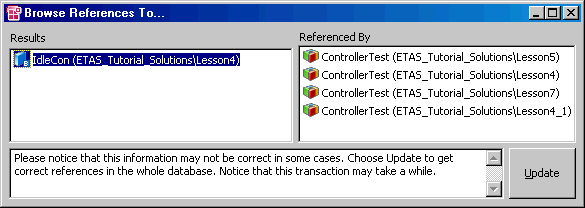

In the entire database, the IdleCon component is referenced by several projects with identical names (ControllerTest).

The Replace References option in the Edit menu is used to replace the references to IdleCon by references to IdleCon_1. After the command has been executed, the 1 Database field is unchanged, but in the element view it can be seen that the ControllerTest project, albeit using the old name, now references IdleCon_1. However, both components still exist in the database.

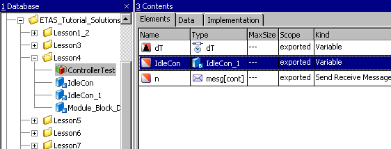

Checking both components with the Show References option in the Edit menu has the following result:

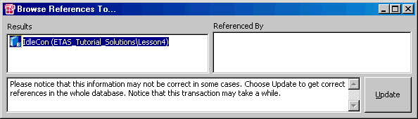

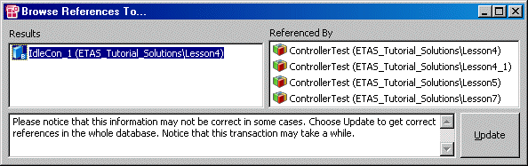

There is no longer a reference to IdleCon, the projects from above now reference IdleCon_1.

See also

[Replacing the References to a Database/Workspace Item](markdown/ReplaceReferences.md)

[Displaying the References to a Database/Workspace Item](markdown/Displayreference.md)

---

## Replacing a Database/Workspace Item

_Source: `markdown/ReplaceDatabase.md`_

# Replacing a Database/Workspace Item

In ASCET you can replace a database/workspace item and all the references to that item in other components or projects completely. This option is particularly important if you are working with a configuration management tool and need to merge divergent development streams for the same system.

To replace an item, proceed as follows:

1. In the 1 Database or 1 Workspace list of the Component Manager, select the item that will replace the original item.
1. Do one of the following:
1. In the Select Item window, do the following:
1. In the Confirm window, confirm the command with OK.
1. Confirm by clicking OK.

The original instance of the replacing item retains its identifier and is renamed to <item_name>_copy. A copy of the replacing item with the name <item> is created.

References to the replaced item become references to the replacing item <item>. The replaced item (i.e. the one you selected in step 3) is deleted.

See also

[Example: Replacing Items](markdown/Replacing_Items.md)

[Component Manager Options](markdown/CM_Options_for_CM.md)

[References on Items](markdown/ReferencesonItems.md)

[Glue <item1> with <item2> Dialog Window](markdown/CM_GlueWithWindow.md)

---

## Example: Replacing Items

_Source: `markdown/Replacing_Items.md`_

# Example: Replacing Items

Here is another example to clarify the way replacing an item works. It is the same example as in [Example: Replacing References](markdown/replacing_references.md), but this timethe IdleCon component is completely replaced, not just the references to it.

Before the Become Another Item command is executed, the ControllerTest project (and some other projects) references the IdleCon component. Another project Project references the IdleCon_new component.

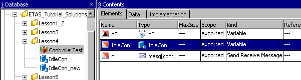

The Become Another Item command is used to [replace](markdown/ReplaceReferences.md) the IdleCon component with IdleCon_new. After the command has been executed, the IdleCon component is deleted from the Component Manager. The 1 Database list now contains the components IdleCon_new and IdleCon_new_copy.

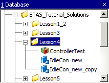

From the element view, it can be seen that ControllerTest now references IdleCon_new under the old name. IdleCon_new has the identifier from the replaced component IdleCon.

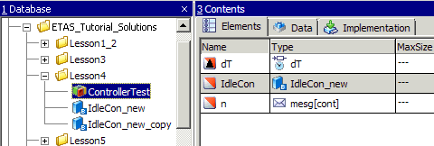

Show References reveals that all projects that originally referenced IdleCon now reference IdleCon_new.

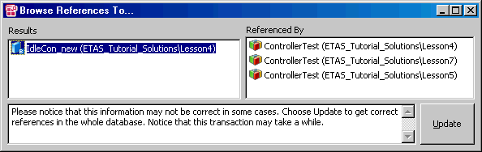

The IdleCon_new_copy component contains the original instance of the replacing component and accordingly is referenced by the project Project.

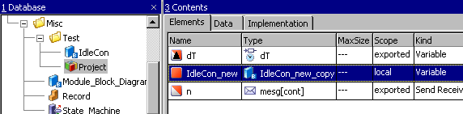

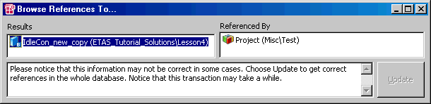

See also

[Replacing a Database/Workspace Item](markdown/ReplaceDatabase.md)

[Example: Replacing References](markdown/replacing_references.md)

---

## Editing the Layout of a Component

_Source: `markdown/LayoutComponent.md`_

# Editing the Layout of a Component

To edit the layout of a component, proceed as follows:

1. Select a component.
1. In the Edit menu, select Edit Layout.

The layout editor opens for the selected component. It is described in [Editing the Layout of a Component](LayoutEditorEnglishUS.chm::/LEd_Overview.htm).

See also

[Editing the Layout of a Component](LayoutEditorEnglishUS.chm::/LEd_Overview.htm)

---

## Editing Notes for a Database/Workspace Item

_Source: `markdown/EditNotes.md`_

# Editing Notes for a Database/Workspace Item

To edit the notes for a database/workspace item, proceed as follows:

1. Select the item with the notes you want to edit.
1. In the Edit menu, select Notes.

The notes editor opens for the selected item.

See also

[Editing](markdown/CM_editing.md)

[Notes](AutomaticDocumentationEnglishUS.chm::/AD_notes.htm)

---

## Assigning the Volatile Attribute to All Variables

_Source: `markdown/Assign.md`_

# Assigning the Volatile Attribute to All Variables

To assign the volatile attribute to all variables in the database/workspace, proceed as follows:

- In the Tools menu of the Component Manager, point to Database or Workspace, then point to Convert and select Variables to Volatile.

All variables are now volatile and are thus initialized automatically.

See also

[Editing](markdown/CM_editing.md)

[Assigning the Non-Volatile Attribute to All Parameters](markdown/non-volatile.md)

---

## Assigning the Non-Volatile Attribute to All Parameters

_Source: `markdown/non-volatile.md`_

# Assigning the Non-Volatile Attribute to All Parameters

To assign the non-volatile attribute to all parameters in the database/workspace, proceed as follows:

- In the Tools menu of the Component Manager, point to Database or Workspace, then point to Convert and select Parameters to Nonvolatile.

All parameters are now non-volatile and are thus not overwritten upon initialization.

See also

[Editing](markdown/CM_editing.md)

[Assigning the Volatile Attribute to All Variables](markdown/Assign.md)

---

## Converting Arrays/Matrices to Variable Size

_Source: `markdown/CM_ConvertArraysMatrices_VariableSize.md`_

# Converting Arrays/Matrices to Variable Size

To convert all array/matrix references in the database/workspace to arrays/matrices with variable size, proceed as follows:

1. In the Tools menu of the Component Manager, point to Database or Workspace, then point to Convert and select Convert all array references/arguments/local variables/returns to variable references.
1. In the Tools menu of the Component Manager, point to Database or Workspace, then point to Convert and select Convert all matrix references/arguments/local variables/returns to variable references.

Variable size is assigned to all matrix references/arguments/local variables/returns in the database/workspace.

See also

[Variable Size for Arrays and Matrices](IntroductionEnglishUS.chm::/INT_VariableSize_ArraysMatrices.htm)

[Initialization of Explicit References](IntroductionEnglishUS.chm::/INT_InitExplicitReferences.htm)

---

## Converting Old Integer Types to New Integer Types

_Source: `markdown/CM_Convert_OldIntTypes_NewIntTypes.md`_

e.g., C:\ETAS\LogFiles\ASCET

e.g., C:\ETAS\LogFiles\ASCET

# Converting Old Integer Types to New Integer Types

You can automatically convert scalar, array and matrix elements that use the deprecated sdisc or udisc types to limitInt or wrapInt, either in the [entire database/workspace](#InDatabase), or in [individual components](#InComponent).

If desired, you can [test the new behavior for integer types](IntroductionEnglishUS.chm::/INT_Test_NewBehavior_IntegerTypes.htm) before you convert them permanently.

You can export components that use the limited integer and wrap-around integer types only in AMD format V6.4 and higher. An AMD format V6.3 or older will result in an export error.

##### In the entire database/workspace

- In the Component Manager, open the Tools menu, point to Database or Workspace, then point to Convert and select Convert all old integer types to new integer types where possible.

The sdisc/udisc elements in all projects and their child components are converted to limitInt or wrapInt, according to the [conversion rules](IntroductionEnglishUS.chm::/INT_Convert_SdiscUdisc_to_limitInt_wrapInt.htm).

Elements that could not be converted are listed in the ASCET monitor window and in the Ascet_Monitor.log file in the [ASCET log directory](javascript:kadovTextPopup(this))<!-- kadovTextPopupInit('a1'); //-->.

##### In individual components

1. In the 1 Database or 1 Workspace list, select the component whose sdisc/udisc elements you want to convert.
1. Right-click the component, point to New Integer Types in the context menu and select Convert Selection or Convert Recursive.
1. When you selected * recursive, do the following.

1. Activate Don't show this message again if you want to execute similar commands without inquiry.
1. Click OK to perform the operation.

The sdisc/udisc elements in the selected component or in the context of the selected project are converted to limitInt or wrapInt, according to the [conversion rules](IntroductionEnglishUS.chm::/INT_Convert_SdiscUdisc_to_limitInt_wrapInt.htm).

Elements that could not be converted are listed in the ASCET monitor window and in the Ascet_Monitor.log file in the [ASCET log directory](javascript:kadovTextPopup(this))<!-- kadovTextPopupInit('a2'); //-->.

If the results of the automatic conversion do not meet your needs, or if some elements could not be converted, you can convert individual elements, see [Using the Conversion Operator](BlockDiagramEditorEnglishUS.chm::/BDE_UseConversionOperator.htm) (block diagrams) and [Conversion Operations](ESDLEditorEnglishUS.chm::/ESDL_ConversionOperations.htm) (ESDL).

See also

[Converting sdisc/udisc to limitInt/wrapInt](IntroductionEnglishUS.chm::/INT_Convert_SdiscUdisc_to_limitInt_wrapInt.htm)

[Scalar Types - Limited Integer](IntroductionEnglishUS.chm::/INT_ScalarTypes_LimitedInteger.htm)

[Scalar Types - Wrap-Around Integer](IntroductionEnglishUS.chm::/INT_ScalarTypes_WrapAroundInteger.htm)

[Confirmation Dialog Options](markdown/CM_Options_for_Confirmation_Dialogs.md)

[Using the Conversion Operator](BlockDiagramEditorEnglishUS.chm::/BDE_UseConversionOperator.htm)

[Conversion Operations](ESDLEditorEnglishUS.chm::/ESDL_ConversionOperations.htm)

[Testing the New Behavior for Integer Types](IntroductionEnglishUS.chm::/INT_Test_NewBehavior_IntegerTypes.htm)

---

## Find and Replace in C Code and ESDL

_Source: `markdown/CM_FindReplace_CCode_ESDL.md`_

# Find and Replace in C Code and ESDL

ASCET offers the possibilities to find and replace character strings in C code and ESCL components. You can

- [Find a character string](markdown/CharacterString.md)
- [View the search results](markdown/SearchResults.md)
- [Open a component from the search window](markdown/OpenComponent.md)
- [Replace selected character strings](markdown/ReplaceString.md)
- [Replace all character strings in one component](markdown/ReplaceCharacter.md)
- [Replace all character strings in the database/workspace](markdown/ReplaceStringsinComponent.md)

---

## Finding a Character String

_Source: `markdown/CharacterString.md`_

# Finding a Character String

To find a character string, proceed as follows:

1. In the Component Manager, do one of the following:
1. Enter the character string you want to find in the Find what field.
1. Click Find to start the search.

The search does not distinguish between upper and lower case.

If you are searching the database/workspace for the first time, the search may well take a few minutes.

The results of the search are displayed in the Found items list. The Select All button is now activated. The number of components which contain the character string entered in the Find what field is shown in square brackets after the name of the list.

See also

[Viewing the Search Results](markdown/SearchResults.md)

[Opening the Component from the Search Window](markdown/OpenComponent.md)

[Replacing Selected Character Strings](markdown/ReplaceString.md)

[Replacing All Character Strings in One Component](markdown/ReplaceCharacter.md)

[Replacing All Character Strings in the Database](markdown/ReplaceStringsinComponent.md)

---

## Viewing the Search Results

_Source: `markdown/SearchResults.md`_

# Viewing the Search Results

To view the search results, proceed as follows:

1. In the Find (ESDL and C Code only) or Find/Replace (ESDL and C Code only) window, do one of the following:
1. Click a line.

The relevant code line is shown in the bottom bar of the window. The Open Comp button is also activated.

See also

[Finding a Character String](markdown/CharacterString.md)

[Opening the Component from the Search Window](markdown/OpenComponent.md)

[Replacing Selected Character String](markdown/ReplaceString.md)

[Replacing All Character Strings in One Component](markdown/ReplaceCharacter.md)

[Replacing All Character Strings in the Database/Workspace](markdown/ReplaceStringsinComponent.md)

---

## Opening the Component from the Search Window

_Source: `markdown/OpenComponent.md`_

# Opening the Component from the Search Window

Proceed as follows to open the component from within the search window:

1. In the Find (ESDL and C Code only) or Find/Replace (ESDL and C Code only) window, select a code line of the component you want to open.
1. Click the Open Comp. button.

The editor for the component opens and the method/process is displayed. The line which contains the character string is highlighted.

If it is a C code component, the code for the variant specified in the Code Variant and Implementation columns is displayed, recognizable by the contents of the combo box ([C Code Editor - Overview](CCodeEditorEnglishUS.chm::/CC_Overview.htm)).

[Finding a Character String](markdown/CharacterString.md)

[Viewing the Search Results](markdown/SearchResults.md)

[Replacing Selected Character Strings](markdown/ReplaceString.md)

[Replacing All Character Strings in One Component](markdown/ReplaceCharacter.md)

[Replacing All Character Strings in the Database/Workspace](markdown/ReplaceStringsinComponent.md)

[C Code Editor - Overview](CCodeEditorEnglishUS.chm::/CC_Overview.htm)

---

## Replacing Selected Character Strings

_Source: `markdown/ReplaceString.md`_

# Replacing Selected Character Strings

Be careful using the Replace function—there is no undo!

To replace selected character strings, proceed as follows:

1. In the Component Manager, do one of the following:
1. In the Find what field, enter the character string you want to replace.
1. Enter the new text in the Replace with field.
1. Click Find to search for occurrences of the old character string.
1. Find the component in which you want to replace the character string and expand the method/process list.
1. Select one or more occurrences of the character string.
1. Click Replace.
1. If you selected an occurrence in a write-protected component, [another step is inserted](javascript:BSSCPopup('CM_Replace_Protected.htm');)<!-- kadovFilePopupInit('a2'); //-->.

The selected occurrences of the character string are replaced by the new text. The relevant lines disappear from the Found Items list.

See also

[Finding a Character String](markdown/CharacterString.md)

[Viewing the Search Results](markdown/SearchResults.md)

[Opening the Component from the Search Window](markdown/OpenComponent.md)

[Replacing All Character Strings in One Component](markdown/ReplaceCharacter.md)

[Replacing All Character Strings in the Database/Workspace](markdown/ReplaceStringsinComponent.md)

[Find and Find/Replace Dialog Windows](markdown/Find.md)

/* Heikki Komulainen, Comet Computer GmbH 2004 */ cc_plus_pic = '&nbsp;'; cc_minus_pic = '&nbsp;'; cc_stat_pic = '&nbsp;'; gpstyle = ''; var iframes_created = 0; if (document.body && document.body.insertAdjacentHTML && document.getElementsByTagName && document.getElementById) { collect_popups(); set_poplinks_pictures(); if (iframes_created) { document.write(gpstyle); document.write('
<nobr><a id="einauslink" style="position:absolute;top:expression(document.body.scrollTop + this.offsetHeight - this.offsetHeight);left:expression(document.body.offsetWidth - (this.offsetWidth + 28));background:#ffffe0;padding:5px" href="javascript:show_all_poptext()">Show all hidden text</a></nobr>
'); } } function collect_popups() { bsscpopups = new Array(); for (x = 0; x < document.links.length; x++) { if (document.links[x].href.indexOf("BSSCPopup")>-1) { seekmatch = /BSSCPopup.'[^'](markdown/+)'/; poplink = seekmatch.exec(document.links[x].href); poplink = "" + poplink; poplink = poplink.substring(poplink.indexOf("'")+1, poplink.lastIndexOf("'")); ifid = "CCGENIFRAMEID" + x; new_iframe = '<iframe id="' + ifid + '"src="' + poplink + '" onload="get_text(\'' + ifid + '\')" width="0" height="0" frameborder=0></iframe>'; document.links[x].parentNode.insertAdjacentHTML("afterEnd", new_iframe); gpid = "CCID_" + ifid; document.links[x].href = "javascript:expand_poptext('" + gpid + "')"; cc_plus = '' + cc_plus_pic + ''; document.links[x].insertAdjacentHTML("afterBegin", cc_plus); iframes_created = 1; } } }// end function function get_text(ifr_id) { frpars = document.frames[ifr_id].document.getElementsByTagName("body"); popbody = frpars[0].innerHTML; gpid = "CCID_" + ifr_id; if (!document.getElementById(gpid)) { //avoiding doubles document.getElementById(ifr_id).insertAdjacentHTML("afterEnd", '
'+popbody+'
'); } }//end function function expand_poptext(x_frame_id) { if (!document.getElementById(x_frame_id)) return; if (document.getElementById(x_frame_id).className == "CCGENPOPTEXTH") { document.getElementById(x_frame_id).className = "CCGENPOPTEXTV"; document.getElementById(x_frame_id).style.visibility = "visible"; if (document.getElementById("CCPMB_" + x_frame_id )) { document.getElementById("CCPMB_" + x_frame_id ).innerHTML = cc_minus_pic; } } else { document.getElementById(x_frame_id).className = "CCGENPOPTEXTH"; document.getElementById(x_frame_id).style.visibility = "hidden"; if (document.getElementById("CCPMB_" + x_frame_id )) { document.getElementById("CCPMB_" + x_frame_id ).innerHTML = cc_plus_pic; } } }// end function function show_all_poptext() { var pulldowntxt = document.getElementsByTagName("div"); for (b = 0; b < pulldowntxt.length; b++) { if (pulldowntxt[b].className == "droptext") { pulldowntxt[b].style.display=""; } } var gptxt = document.getElementsByTagName("div"); for (z = 0; z < gptxt.length; z++) { if (gptxt[z].className == "CCGENPOPTEXTH") { gptxt[z].className = "CCGENPOPTEXTV"; gptxt[z].style.visibility = "visible"; if (document.getElementById("CCPMB_" + gptxt[z].id )) { document.getElementById("CCPMB_" + gptxt[z].id ).innerHTML = cc_minus_pic; } } } var dxpoplinks = document.getElementsByTagName("a"); if (dxpoplinks) { for (pxl = 0; pxl < dxpoplinks.length; pxl++) { if (dxpoplinks[pxl].href.indexOf("kadovTextPopup")>-1) { if (document.getElementById("CCPMB_" + dxpoplinks[pxl].id)) { document.getElementById("CCPMB_" + dxpoplinks[pxl].id).innerHTML = cc_stat_pic; dxpoplinks[pxl].symbol = "minus"; } } } } document.getElementById('einauslink').innerText = 'Hide all hideable text'; document.getElementById('einauslink').href = "javascript:self.location.reload()"; self.focus(); }// end function function eat_click() { return false; }// end function function set_poplinks_pictures() { var dpoplinks = document.getElementsByTagName("a"); if (dpoplinks) { for (pl = 0; pl < dpoplinks.length; pl++) { if (dpoplinks[pl].href.indexOf("kadovTextPopup")>-1) { cc_plus = '' + cc_stat_pic + ''; //dpoplinks[pl].onmouseup = plusminuspoplink; dpoplinks[pl].insertAdjacentHTML("afterBegin", cc_plus); dpoplinks[pl].symbol = "plus"; } } } }// end function function plusminuspoplink() { if (document.getElementById("CCPMB_" + this.id)) { if (this.symbol == "plus") { document.getElementById("CCPMB_" + this.id).innerHTML = cc_minus_pic; this.symbol = "minus"; } else { document.getElementById("CCPMB_" + this.id).innerHTML = cc_plus_pic; this.symbol = "plus"; } } return true; }

---

## Replacing All Character Strings in One Component

_Source: `markdown/ReplaceCharacter.md`_

# Replacing All Character Strings in One Component

Proceed as follows to replace all occurrences of the character string in a selected component:

1. Find the character string you want to replace as described in [Replacing Selected Character Strings](markdown/ReplaceString.md).

1. In the Find/Replace (ESDL and C code only) window, enter the new text in the Replace with field.
1. Highlight the component within which you want to replace the character string.

With that, all occurrences of the character string in the component are selected.

1. Click Replace.
1. If you selected a write-protected component, [another step is inserted](javascript:BSSCPopup('CM_Replace_Protected.htm');)<!-- kadovFilePopupInit('a2'); //-->.

All occurrences of the character string in the selected component (for C code: including all implementations and targets) are replaced by the new text.

See also

[Finding a Character String](markdown/CharacterString.md)

[Viewing the Search Results](markdown/SearchResults.md)

[Opening the Component from the Search Window](markdown/OpenComponent.md)

[Replacing Selected Character Strings](markdown/ReplaceString.md)

[Replacing All Character Strings in the Database/Workspace](markdown/ReplaceStringsinComponent.md)

[Find and Find/Replace Dialog Windows](markdown/Find.md)

/* Heikki Komulainen, Comet Computer GmbH 2004 */ cc_plus_pic = '&nbsp;'; cc_minus_pic = '&nbsp;'; cc_stat_pic = '&nbsp;'; gpstyle = ''; var iframes_created = 0; if (document.body && document.body.insertAdjacentHTML && document.getElementsByTagName && document.getElementById) { collect_popups(); set_poplinks_pictures(); if (iframes_created) { document.write(gpstyle); document.write('
<nobr><a id="einauslink" style="position:absolute;top:expression(document.body.scrollTop + this.offsetHeight - this.offsetHeight);left:expression(document.body.offsetWidth - (this.offsetWidth + 28));background:#ffffe0;padding:5px" href="javascript:show_all_poptext()">Show all hidden text</a></nobr>
'); } } function collect_popups() { bsscpopups = new Array(); for (x = 0; x < document.links.length; x++) { if (document.links[x].href.indexOf("BSSCPopup")>-1) { seekmatch = /BSSCPopup.'[^'](markdown/+)'/; poplink = seekmatch.exec(document.links[x].href); poplink = "" + poplink; poplink = poplink.substring(poplink.indexOf("'")+1, poplink.lastIndexOf("'")); ifid = "CCGENIFRAMEID" + x; new_iframe = '<iframe id="' + ifid + '"src="' + poplink + '" onload="get_text(\'' + ifid + '\')" width="0" height="0" frameborder=0></iframe>'; document.links[x].parentNode.insertAdjacentHTML("afterEnd", new_iframe); gpid = "CCID_" + ifid; document.links[x].href = "javascript:expand_poptext('" + gpid + "')"; cc_plus = '' + cc_plus_pic + ''; document.links[x].insertAdjacentHTML("afterBegin", cc_plus); iframes_created = 1; } } }// end function function get_text(ifr_id) { frpars = document.frames[ifr_id].document.getElementsByTagName("body"); popbody = frpars[0].innerHTML; gpid = "CCID_" + ifr_id; if (!document.getElementById(gpid)) { //avoiding doubles document.getElementById(ifr_id).insertAdjacentHTML("afterEnd", '
'+popbody+'
'); } }//end function function expand_poptext(x_frame_id) { if (!document.getElementById(x_frame_id)) return; if (document.getElementById(x_frame_id).className == "CCGENPOPTEXTH") { document.getElementById(x_frame_id).className = "CCGENPOPTEXTV"; document.getElementById(x_frame_id).style.visibility = "visible"; if (document.getElementById("CCPMB_" + x_frame_id )) { document.getElementById("CCPMB_" + x_frame_id ).innerHTML = cc_minus_pic; } } else { document.getElementById(x_frame_id).className = "CCGENPOPTEXTH"; document.getElementById(x_frame_id).style.visibility = "hidden"; if (document.getElementById("CCPMB_" + x_frame_id )) { document.getElementById("CCPMB_" + x_frame_id ).innerHTML = cc_plus_pic; } } }// end function function show_all_poptext() { var pulldowntxt = document.getElementsByTagName("div"); for (b = 0; b < pulldowntxt.length; b++) { if (pulldowntxt[b].className == "droptext") { pulldowntxt[b].style.display=""; } } var gptxt = document.getElementsByTagName("div"); for (z = 0; z < gptxt.length; z++) { if (gptxt[z].className == "CCGENPOPTEXTH") { gptxt[z].className = "CCGENPOPTEXTV"; gptxt[z].style.visibility = "visible"; if (document.getElementById("CCPMB_" + gptxt[z].id )) { document.getElementById("CCPMB_" + gptxt[z].id ).innerHTML = cc_minus_pic; } } } var dxpoplinks = document.getElementsByTagName("a"); if (dxpoplinks) { for (pxl = 0; pxl < dxpoplinks.length; pxl++) { if (dxpoplinks[pxl].href.indexOf("kadovTextPopup")>-1) { if (document.getElementById("CCPMB_" + dxpoplinks[pxl].id)) { document.getElementById("CCPMB_" + dxpoplinks[pxl].id).innerHTML = cc_stat_pic; dxpoplinks[pxl].symbol = "minus"; } } } } document.getElementById('einauslink').innerText = 'Hide all hideable text'; document.getElementById('einauslink').href = "javascript:self.location.reload()"; self.focus(); }// end function function eat_click() { return false; }// end function function set_poplinks_pictures() { var dpoplinks = document.getElementsByTagName("a"); if (dpoplinks) { for (pl = 0; pl < dpoplinks.length; pl++) { if (dpoplinks[pl].href.indexOf("kadovTextPopup")>-1) { cc_plus = '' + cc_stat_pic + ''; //dpoplinks[pl].onmouseup = plusminuspoplink; dpoplinks[pl].insertAdjacentHTML("afterBegin", cc_plus); dpoplinks[pl].symbol = "plus"; } } } }// end function function plusminuspoplink() { if (document.getElementById("CCPMB_" + this.id)) { if (this.symbol == "plus") { document.getElementById("CCPMB_" + this.id).innerHTML = cc_minus_pic; this.symbol = "minus"; } else { document.getElementById("CCPMB_" + this.id).innerHTML = cc_plus_pic; this.symbol = "plus"; } } return true; }

---

## Replacing All Character Strings in the Database/Workspace

_Source: `markdown/ReplaceStringsinComponent.md`_

# Replacing All Character Strings in the Database/Workspace

Proceed as follows to replace all occurrences of the character string:

1. Find the character string you want to replace as described in [Replacing Selected Character Strings](markdown/ReplaceString.md).

1. Click Select All to select all occurrences in all components.

1. Click Replace to replace all occurrences in the entire database/workspace.
1. If a write-protected component is affected, [another step is inserted](javascript:BSSCPopup('CM_Replace_Protected.htm');)<!-- kadovFilePopupInit('a2'); //-->.

See also

[Finding a Character String](markdown/CharacterString.md)

[Viewing the Search Results](markdown/SearchResults.md)

[Opening the Component from the Search Window](markdown/OpenComponent.md)

[Replacing Selected Character Strings](markdown/ReplaceString.md)

[Replacing All Character Strings in One Component](markdown/ReplaceCharacter.md)

/* Heikki Komulainen, Comet Computer GmbH 2004 */ cc_plus_pic = '&nbsp;'; cc_minus_pic = '&nbsp;'; cc_stat_pic = '&nbsp;'; gpstyle = ''; var iframes_created = 0; if (document.body && document.body.insertAdjacentHTML && document.getElementsByTagName && document.getElementById) { collect_popups(); set_poplinks_pictures(); if (iframes_created) { document.write(gpstyle); document.write('
<nobr><a id="einauslink" style="position:absolute;top:expression(document.body.scrollTop + this.offsetHeight - this.offsetHeight);left:expression(document.body.offsetWidth - (this.offsetWidth + 28));background:#ffffe0;padding:5px" href="javascript:show_all_poptext()">Show all hidden text</a></nobr>
'); } } function collect_popups() { bsscpopups = new Array(); for (x = 0; x < document.links.length; x++) { if (document.links[x].href.indexOf("BSSCPopup")>-1) { seekmatch = /BSSCPopup.'[^'](markdown/+)'/; poplink = seekmatch.exec(document.links[x].href); poplink = "" + poplink; poplink = poplink.substring(poplink.indexOf("'")+1, poplink.lastIndexOf("'")); ifid = "CCGENIFRAMEID" + x; new_iframe = '<iframe id="' + ifid + '"src="' + poplink + '" onload="get_text(\'' + ifid + '\')" width="0" height="0" frameborder=0></iframe>'; document.links[x].parentNode.insertAdjacentHTML("afterEnd", new_iframe); gpid = "CCID_" + ifid; document.links[x].href = "javascript:expand_poptext('" + gpid + "')"; cc_plus = '' + cc_plus_pic + ''; document.links[x].insertAdjacentHTML("afterBegin", cc_plus); iframes_created = 1; } } }// end function function get_text(ifr_id) { frpars = document.frames[ifr_id].document.getElementsByTagName("body"); popbody = frpars[0].innerHTML; gpid = "CCID_" + ifr_id; if (!document.getElementById(gpid)) { //avoiding doubles document.getElementById(ifr_id).insertAdjacentHTML("afterEnd", '
'+popbody+'
'); } }//end function function expand_poptext(x_frame_id) { if (!document.getElementById(x_frame_id)) return; if (document.getElementById(x_frame_id).className == "CCGENPOPTEXTH") { document.getElementById(x_frame_id).className = "CCGENPOPTEXTV"; document.getElementById(x_frame_id).style.visibility = "visible"; if (document.getElementById("CCPMB_" + x_frame_id )) { document.getElementById("CCPMB_" + x_frame_id ).innerHTML = cc_minus_pic; } } else { document.getElementById(x_frame_id).className = "CCGENPOPTEXTH"; document.getElementById(x_frame_id).style.visibility = "hidden"; if (document.getElementById("CCPMB_" + x_frame_id )) { document.getElementById("CCPMB_" + x_frame_id ).innerHTML = cc_plus_pic; } } }// end function function show_all_poptext() { var pulldowntxt = document.getElementsByTagName("div"); for (b = 0; b < pulldowntxt.length; b++) { if (pulldowntxt[b].className == "droptext") { pulldowntxt[b].style.display=""; } } var gptxt = document.getElementsByTagName("div"); for (z = 0; z < gptxt.length; z++) { if (gptxt[z].className == "CCGENPOPTEXTH") { gptxt[z].className = "CCGENPOPTEXTV"; gptxt[z].style.visibility = "visible"; if (document.getElementById("CCPMB_" + gptxt[z].id )) { document.getElementById("CCPMB_" + gptxt[z].id ).innerHTML = cc_minus_pic; } } } var dxpoplinks = document.getElementsByTagName("a"); if (dxpoplinks) { for (pxl = 0; pxl < dxpoplinks.length; pxl++) { if (dxpoplinks[pxl].href.indexOf("kadovTextPopup")>-1) { if (document.getElementById("CCPMB_" + dxpoplinks[pxl].id)) { document.getElementById("CCPMB_" + dxpoplinks[pxl].id).innerHTML = cc_stat_pic; dxpoplinks[pxl].symbol = "minus"; } } } } document.getElementById('einauslink').innerText = 'Hide all hideable text'; document.getElementById('einauslink').href = "javascript:self.location.reload()"; self.focus(); }// end function function eat_click() { return false; }// end function function set_poplinks_pictures() { var dpoplinks = document.getElementsByTagName("a"); if (dpoplinks) { for (pl = 0; pl < dpoplinks.length; pl++) { if (dpoplinks[pl].href.indexOf("kadovTextPopup")>-1) { cc_plus = '' + cc_stat_pic + ''; //dpoplinks[pl].onmouseup = plusminuspoplink; dpoplinks[pl].insertAdjacentHTML("afterBegin", cc_plus); dpoplinks[pl].symbol = "plus"; } } } }// end function function plusminuspoplink() { if (document.getElementById("CCPMB_" + this.id)) { if (this.symbol == "plus") { document.getElementById("CCPMB_" + this.id).innerHTML = cc_minus_pic; this.symbol = "minus"; } else { document.getElementById("CCPMB_" + this.id).innerHTML = cc_plus_pic; this.symbol = "plus"; } } return true; }

---

## Working with Block Libraries

_Source: `markdown/CM_Working_with_BlockLibraries.md`_

# Working with Block Libraries

Working with [block libraries](markdown/CM_BlockLibraries.md) contains the following steps:

- [Adding Items to the Block Library](markdown/CM_AddItems_BlockLibrary.md)
- [Setting a Load Path](markdown/CM_Set_LoadPath.md)
- [Setting Up Automatic Import](markdown/CM_SetUp_AutomaticImport.md)
- [Creating and Managing Categories](markdown/CM_CreateManageCategories.md)
- [Managing Block Library Items](markdown/CM_ManageBlockLibraryItems.md)
- [Managing Block Libraries](markdown/CM_Manage_BlockLibraries.md)

---

## Adding Items to the Block Library

_Source: `markdown/CM_AddItems_BlockLibrary.md`_

This way, items can be added only to the currently loaded block library.

1. In the 1 Database or 1 Workspace list of the Component Manager, select the component(s) you want to add to the block library.

The following components can be added: all kinds of classes, modules, records, software components, AUTOSAR interfaces.

You can also select one or more folders to add the entire possible folder content to the block library. Other folder elements than the ones mentioned above are ignored.

1. From the context menu in the 1 Database or 1 Workspace list, select Add to Block Library

or

1. From the Edit menu, select Add to Block Library.

The Select Category window opens. The Category combo box contains all existing categories.

1. From the Category combo box, select the category to which you what to add the components.
1. Click OK to close the Select Category window.

The selected components, or the components in the selected folders, are added to the selected category of the currently loaded block library. They are immediately available in the Library palettes of the specification editors.

This way, items can be added to any block library.

1. In the Component Manager, open the Tools menu and select Block Library to open the block library editor.
1. [Open the block library](markdown/CM_Manage_BlockLibraries.md) to which you want to add items.
1. In the Items field, select the component(s) you want to add to the block library.

The following components can be added: all kinds of classes, modules, records, software components, AUTOSAR interfaces.

You can also select one or more folders to add the entire possible folder content to the block library. Other folder elements than the ones mentioned above are ignored.

1. From the context menu in the Items field, select Add to Block Library.

The Select Category window opens. The Category combo box contains all existing categories.

The selected components, or the components in the selected folders, are added to the selected category of the currently loaded block library. They are immediately available in the Library palettes of the specification editors.

# Adding Items to the Block Library

Two ways exist to add items to the block library: via the 1 Database or 1 Workspace field of the component manager or via the block library editor.

An item can appear only once in each category. Adding the same item (identical OID) a second time is impossible. Items with identical names, but different OIDs, are allowed.

##### [Adding items via the 1 Database/1 Workspace field](javascript:kadovTextPopup(this))<!-- kadovTextPopupInit('a1'); //-->

##### [Adding items via the block library editor](javascript:kadovTextPopup(this))<!-- kadovTextPopupInit('a2'); //-->

See also

[Block Libraries](markdown/CM_BlockLibraries.md)

[Creating and Managing Categories](markdown/CM_CreateManageCategories.md)

[Managing Block Libraries](markdown/CM_Manage_BlockLibraries.md)

[User Interface of the Block Library Editor](markdown/CM_UI_BlockLibraryEditor.md)

/* Heikki Komulainen, Comet Computer GmbH 2004 */ cc_plus_pic = '&nbsp;'; cc_minus_pic = '&nbsp;'; cc_stat_pic = '&nbsp;'; gpstyle = ''; var iframes_created = 0; if (document.body && document.body.insertAdjacentHTML && document.getElementsByTagName && document.getElementById) { collect_popups(); set_poplinks_pictures(); if (iframes_created) { document.write(gpstyle); document.write('
<nobr><a id="einauslink" style="position:absolute;top:expression(document.body.scrollTop + this.offsetHeight - this.offsetHeight);left:expression(document.body.offsetWidth - (this.offsetWidth + 28));background:white;padding:5px" href="javascript:show_all_poptext()">Alle texte einblenden</a></nobr>
'); } } function collect_popups() { bsscpopups = new Array(); for (x = 0; x < document.links.length; x++) { if (document.links[x].href.indexOf("BSSCPopup")>-1) { seekmatch = /BSSCPopup.'[^'](markdown/+)'/; poplink = seekmatch.exec(document.links[x].href); poplink = "" + poplink; poplink = poplink.substring(poplink.indexOf("'")+1, poplink.lastIndexOf("'")); ifid = "CCGENIFRAMEID" + x; new_iframe = '<iframe id="' + ifid + '"src="' + poplink + '" onload="get_text(\'' + ifid + '\')" width="0" height="0" frameborder=0></iframe>'; document.links[x].parentNode.insertAdjacentHTML("afterEnd", new_iframe); gpid = "CCID_" + ifid; document.links[x].href = "javascript:expand_poptext('" + gpid + "')"; cc_plus = '' + cc_plus_pic + ''; document.links[x].insertAdjacentHTML("afterBegin", cc_plus); iframes_created = 1; } } }// end function function get_text(ifr_id) { frpars = document.frames[ifr_id].document.getElementsByTagName("body"); popbody = frpars[0].innerHTML; gpid = "CCID_" + ifr_id; if (!document.getElementById(gpid)) { //avoiding doubles document.getElementById(ifr_id).insertAdjacentHTML("afterEnd", '
'+popbody+'
'); } }//end function function expand_poptext(x_frame_id) { if (!document.getElementById(x_frame_id)) return; if (document.getElementById(x_frame_id).className == "CCGENPOPTEXTH") { document.getElementById(x_frame_id).className = "CCGENPOPTEXTV"; document.getElementById(x_frame_id).style.visibility = "visible"; if (document.getElementById("CCPMB_" + x_frame_id )) { document.getElementById("CCPMB_" + x_frame_id ).innerHTML = cc_minus_pic; } } else { document.getElementById(x_frame_id).className = "CCGENPOPTEXTH"; document.getElementById(x_frame_id).style.visibility = "hidden"; if (document.getElementById("CCPMB_" + x_frame_id )) { document.getElementById("CCPMB_" + x_frame_id ).innerHTML = cc_plus_pic; } } }// end function function show_all_poptext() { var pulldowntxt = document.getElementsByTagName("div"); for (b = 0; b < pulldowntxt.length; b++) { if (pulldowntxt[b].className == "droptext") { pulldowntxt[b].style.display=""; } } var gptxt = document.getElementsByTagName("div"); for (z = 0; z < gptxt.length; z++) { if (gptxt[z].className == "CCGENPOPTEXTH") { gptxt[z].className = "CCGENPOPTEXTV"; gptxt[z].style.visibility = "visible"; if (document.getElementById("CCPMB_" + gptxt[z].id )) { document.getElementById("CCPMB_" + gptxt[z].id ).innerHTML = cc_minus_pic; } } } var dxpoplinks = document.getElementsByTagName("a"); if (dxpoplinks) { for (pxl = 0; pxl < dxpoplinks.length; pxl++) { if (dxpoplinks[pxl].href.indexOf("kadovTextPopup")>-1) { if (document.getElementById("CCPMB_" + dxpoplinks[pxl].id)) { document.getElementById("CCPMB_" + dxpoplinks[pxl].id).innerHTML = cc_stat_pic; dxpoplinks[pxl].symbol = "minus"; } } } } document.getElementById('einauslink').innerText = 'Alle texte ausblenden'; document.getElementById('einauslink').href = "javascript:self.location.reload()"; self.focus(); }// end function function eat_click() { return false; }// end function function set_poplinks_pictures() { var dpoplinks = document.getElementsByTagName("a"); if (dpoplinks) { for (pl = 0; pl < dpoplinks.length; pl++) { if (dpoplinks[pl].href.indexOf("kadovTextPopup")>-1) { cc_plus = '' + cc_stat_pic + ''; //dpoplinks[pl].onmouseup = plusminuspoplink; dpoplinks[pl].insertAdjacentHTML("afterBegin", cc_plus); dpoplinks[pl].symbol = "plus"; } } } }// end function function plusminuspoplink() { if (document.getElementById("CCPMB_" + this.id)) { if (this.symbol == "plus") { document.getElementById("CCPMB_" + this.id).innerHTML = cc_minus_pic; this.symbol = "minus"; } else { document.getElementById("CCPMB_" + this.id).innerHTML = cc_plus_pic; this.symbol = "plus"; } } return true; }

---

## Setting a Load Path

_Source: `markdown/CM_Set_LoadPath.md`_

# Setting a Load Path

You can assign an export file containing the respective component to each block library item. When the block library is used in a database/workspace that does not contain the component, it is imported automatically.

The block library editor provides no possibility to export ASCET components. You must create the necessary export files

1. [Create the necessary export files](markdown/SingleExport.md).
1. In the Component Manager, open the Tools menu and select Block Library to open the block library editor.
1. In the block library editor, Categories list, select the category that contains the desired item.
1. In the Items list, select the desired item.
1. Right-click on the selected item and select Load Path from the context menu.
1. Select the export file you want to assign and click on Open.

The export file is assigned to the selected item.

See also

[Setting Up Automatic Import](markdown/CM_SetUp_AutomaticImport.md)

[Exporting a Folder or Database/Workspace Item](markdown/SingleExport.md)

---

## Setting Up Automatic Import

_Source: `markdown/CM_SetUp_AutomaticImport.md`_

# Setting Up Automatic Import

When a Load Path is set for a block library item, the component is offered for import when the block library is used in a database/workspace that does not contain the component. This can happen in the block library editor and in a specification editor that allows using block libraries.

If a component is offered for import, the Import Missing Library Item window opens. You are asked whether you want to import the missing component. Proceed as follows.

1. Activate Remember my Decision if you want to apply your answer to all such cases.
1. Click No to skip the import.
1. Click Yes to import the missing component.
1. Select the items to be imported and click OK.

See also

[Setting a Load Path](markdown/CM_Set_LoadPath.md)

[Confirmation Dialog Options](markdown/CM_Options_for_Confirmation_Dialogs.md)

---

## Creating and Managing Categories

_Source: `markdown/CM_CreateManageCategories.md`_

1. In the Component Manager, open the Tools menu and select Block Library to open the block library editor.
1. In the block library editor, open the Category menu and select Add

or

1. right-click in the Categories list and select Add from the context menu.

You are prompted for a name for the new category.

1. Enter a name and click OK.

The category is created and added to the Categories list.

1. In the Component Manager, open the Tools menu and select Block Library to open the block library editor.
1. In the Categories list of the block library editor, select the category you want to rename.
1. From the Category menu, select Rename

or

1. right-click in the Categories list and select Rename from the context menu.

The category name is highlighted.

1. Enter a name and press Return.

The category is renamed.

1. In the Component Manager, open the Tools menu and select Block Library to open the block library editor.
1. In the Categories list of the block library editor, select the category or categories you want to delete.
1. From the Category menu, select Delete

or

1. right-click in the Categories list and select Delete from the context menu.

The selected categories are deleted. Their items are no longer available in the block library.

# Creating and Managing Categories

Block library categories are created and managed in the block library editor.

Category names must be unique. You cannot create two categories with identical names.

##### [Adding a category](javascript:kadovTextPopup(this))<!-- kadovTextPopupInit('a1'); //-->

##### [Renaming a category](javascript:kadovTextPopup(this))<!-- kadovTextPopupInit('a2'); //-->

##### [Deleting a category](javascript:kadovTextPopup(this))<!-- kadovTextPopupInit('a3'); //-->

See also

[User Interface of the Block Library Editor](markdown/CM_UI_BlockLibraryEditor.md)

[Adding Items to the Block Library](markdown/CM_AddItems_BlockLibrary.md)

[Managing Block Library Items](markdown/CM_ManageBlockLibraryItems.md)

[Reserved Keywords](IntroductionEnglishUS.chm::/INT_Reserved_Keywords.htm)

/* Heikki Komulainen, Comet Computer GmbH 2004 */ cc_plus_pic = '&nbsp;'; cc_minus_pic = '&nbsp;'; cc_stat_pic = '&nbsp;'; gpstyle = ''; var iframes_created = 0; if (document.body && document.body.insertAdjacentHTML && document.getElementsByTagName && document.getElementById) { collect_popups(); set_poplinks_pictures(); if (iframes_created) { document.write(gpstyle); document.write('
<nobr><a id="einauslink" style="position:absolute;top:expression(document.body.scrollTop + this.offsetHeight - this.offsetHeight);left:expression(document.body.offsetWidth - (this.offsetWidth + 28));background:white;padding:5px" href="javascript:show_all_poptext()">Alle texte einblenden</a></nobr>
'); } } function collect_popups() { bsscpopups = new Array(); for (x = 0; x < document.links.length; x++) { if (document.links[x].href.indexOf("BSSCPopup")>-1) { seekmatch = /BSSCPopup.'[^'](markdown/+)'/; poplink = seekmatch.exec(document.links[x].href); poplink = "" + poplink; poplink = poplink.substring(poplink.indexOf("'")+1, poplink.lastIndexOf("'")); ifid = "CCGENIFRAMEID" + x; new_iframe = '<iframe id="' + ifid + '"src="' + poplink + '" onload="get_text(\'' + ifid + '\')" width="0" height="0" frameborder=0></iframe>'; document.links[x].parentNode.insertAdjacentHTML("afterEnd", new_iframe); gpid = "CCID_" + ifid; document.links[x].href = "javascript:expand_poptext('" + gpid + "')"; cc_plus = '' + cc_plus_pic + ''; document.links[x].insertAdjacentHTML("afterBegin", cc_plus); iframes_created = 1; } } }// end function function get_text(ifr_id) { frpars = document.frames[ifr_id].document.getElementsByTagName("body"); popbody = frpars[0].innerHTML; gpid = "CCID_" + ifr_id; if (!document.getElementById(gpid)) { //avoiding doubles document.getElementById(ifr_id).insertAdjacentHTML("afterEnd", '
'+popbody+'
'); } }//end function function expand_poptext(x_frame_id) { if (!document.getElementById(x_frame_id)) return; if (document.getElementById(x_frame_id).className == "CCGENPOPTEXTH") { document.getElementById(x_frame_id).className = "CCGENPOPTEXTV"; document.getElementById(x_frame_id).style.visibility = "visible"; if (document.getElementById("CCPMB_" + x_frame_id )) { document.getElementById("CCPMB_" + x_frame_id ).innerHTML = cc_minus_pic; } } else { document.getElementById(x_frame_id).className = "CCGENPOPTEXTH"; document.getElementById(x_frame_id).style.visibility = "hidden"; if (document.getElementById("CCPMB_" + x_frame_id )) { document.getElementById("CCPMB_" + x_frame_id ).innerHTML = cc_plus_pic; } } }// end function function show_all_poptext() { var pulldowntxt = document.getElementsByTagName("div"); for (b = 0; b < pulldowntxt.length; b++) { if (pulldowntxt[b].className == "droptext") { pulldowntxt[b].style.display=""; } } var gptxt = document.getElementsByTagName("div"); for (z = 0; z < gptxt.length; z++) { if (gptxt[z].className == "CCGENPOPTEXTH") { gptxt[z].className = "CCGENPOPTEXTV"; gptxt[z].style.visibility = "visible"; if (document.getElementById("CCPMB_" + gptxt[z].id )) { document.getElementById("CCPMB_" + gptxt[z].id ).innerHTML = cc_minus_pic; } } } var dxpoplinks = document.getElementsByTagName("a"); if (dxpoplinks) { for (pxl = 0; pxl < dxpoplinks.length; pxl++) { if (dxpoplinks[pxl].href.indexOf("kadovTextPopup")>-1) { if (document.getElementById("CCPMB_" + dxpoplinks[pxl].id)) { document.getElementById("CCPMB_" + dxpoplinks[pxl].id).innerHTML = cc_stat_pic; dxpoplinks[pxl].symbol = "minus"; } } } } document.getElementById('einauslink').innerText = 'Alle texte ausblenden'; document.getElementById('einauslink').href = "javascript:self.location.reload()"; self.focus(); }// end function function eat_click() { return false; }// end function function set_poplinks_pictures() { var dpoplinks = document.getElementsByTagName("a"); if (dpoplinks) { for (pl = 0; pl < dpoplinks.length; pl++) { if (dpoplinks[pl].href.indexOf("kadovTextPopup")>-1) { cc_plus = '' + cc_stat_pic + ''; //dpoplinks[pl].onmouseup = plusminuspoplink; dpoplinks[pl].insertAdjacentHTML("afterBegin", cc_plus); dpoplinks[pl].symbol = "plus"; } } } }// end function function plusminuspoplink() { if (document.getElementById("CCPMB_" + this.id)) { if (this.symbol == "plus") { document.getElementById("CCPMB_" + this.id).innerHTML = cc_minus_pic; this.symbol = "minus"; } else { document.getElementById("CCPMB_" + this.id).innerHTML = cc_plus_pic; this.symbol = "plus"; } } return true; }

---

## Managing Block Library Items

_Source: `markdown/CM_ManageBlockLibraryItems.md`_

# Managing Block Library Items

You can move block library items from one category to another, and you can delete selected items from the block library. To do so, proceed as follows.

1. In the Component Manager, open the Tools menu and select Block Library to open the block library editor.
1. In the block library editor, Categories list, select the category that contains the desired items.
1. In the Items list, select the desired items.
1. In the Items menu, select Delete to delete the selected items from the block library.
1. In the Items menu, select Move to Category to move the selected items to another category.
1. From the Category combo box, select the category to which you what to add the components.
1. Click OK to close the Select Category window.

The selected items are moved to the selected category.

See also

[Adding Items to the Block Library](markdown/CM_AddItems_BlockLibrary.md)

[Creating and Managing Categories](markdown/CM_CreateManageCategories.md)

---

## Managing Block Libraries

_Source: `markdown/CM_Manage_BlockLibraries.md`_

1. From the File menu, select Open

or

1. click on the  button.

A file selection window opens.

1. Select the XML file for the new block library and click on Open.

The new block library is opened. It replaces the previously opened block library.

1. From the File menu, select Save

1. click on the  button.

1. Enter path and file name (including extension) for the block library and click on Save.

The currently open block library is saved to the selected file. If you selected an existing file, the old file content is overwritten.

1. From the File menu, select Import

or

1. click on the  button.

A file selection window opens.

1. Select the XML file for the block library you want to import and click on Open.

The block library is imported, i.e. the items and categories in the selected export file are added to the currently opened block library.

1. From the File menu, select Export

1. click on the  button.

1. Enter path and file name (including extension) for the block library and click on Save.

The currently open block library is saved to the selected file. If you selected an existing file, the content of the exported block library is added to the file.

# Managing Block Libraries

You can open, save, import and export block libraries. To do so, proceed as follows.

1. In the Component Manager, open the Tools menu and select Block Library to open the block library editor.
1. To open another block library, [proceed as follows](javascript:kadovTextPopup(this))<!-- kadovTextPopupInit('a1'); //-->.
1. To save a block library, [proceed as follows](javascript:kadovTextPopup(this))<!-- kadovTextPopupInit('a2'); //-->.
1. To import a block library, [proceed as follows](javascript:kadovTextPopup(this))<!-- kadovTextPopupInit('a3'); //-->.
1. To export a block library, [proceed as follows](javascript:kadovTextPopup(this))<!-- kadovTextPopupInit('a4'); //-->.
1. See also

[Modeling Options](markdown/CM_Modeling_Node.md)

/* Heikki Komulainen, Comet Computer GmbH 2004 */ cc_plus_pic = '&nbsp;'; cc_minus_pic = '&nbsp;'; cc_stat_pic = '&nbsp;'; gpstyle = ''; var iframes_created = 0; if (document.body && document.body.insertAdjacentHTML && document.getElementsByTagName && document.getElementById) { collect_popups(); set_poplinks_pictures(); if (iframes_created) { document.write(gpstyle); document.write('
<nobr><a id="einauslink" style="position:absolute;top:expression(document.body.scrollTop + this.offsetHeight - this.offsetHeight);left:expression(document.body.offsetWidth - (this.offsetWidth + 28));background:white;padding:5px" href="javascript:show_all_poptext()">Alle texte einblenden</a></nobr>
'); } } function collect_popups() { bsscpopups = new Array(); for (x = 0; x < document.links.length; x++) { if (document.links[x].href.indexOf("BSSCPopup")>-1) { seekmatch = /BSSCPopup.'[^'](markdown/+)'/; poplink = seekmatch.exec(document.links[x].href); poplink = "" + poplink; poplink = poplink.substring(poplink.indexOf("'")+1, poplink.lastIndexOf("'")); ifid = "CCGENIFRAMEID" + x; new_iframe = '<iframe id="' + ifid + '"src="' + poplink + '" onload="get_text(\'' + ifid + '\')" width="0" height="0" frameborder=0></iframe>'; document.links[x].parentNode.insertAdjacentHTML("afterEnd", new_iframe); gpid = "CCID_" + ifid; document.links[x].href = "javascript:expand_poptext('" + gpid + "')"; cc_plus = '' + cc_plus_pic + ''; document.links[x].insertAdjacentHTML("afterBegin", cc_plus); iframes_created = 1; } } }// end function function get_text(ifr_id) { frpars = document.frames[ifr_id].document.getElementsByTagName("body"); popbody = frpars[0].innerHTML; gpid = "CCID_" + ifr_id; if (!document.getElementById(gpid)) { //avoiding doubles document.getElementById(ifr_id).insertAdjacentHTML("afterEnd", '
'+popbody+'
'); } }//end function function expand_poptext(x_frame_id) { if (!document.getElementById(x_frame_id)) return; if (document.getElementById(x_frame_id).className == "CCGENPOPTEXTH") { document.getElementById(x_frame_id).className = "CCGENPOPTEXTV"; document.getElementById(x_frame_id).style.visibility = "visible"; if (document.getElementById("CCPMB_" + x_frame_id )) { document.getElementById("CCPMB_" + x_frame_id ).innerHTML = cc_minus_pic; } } else { document.getElementById(x_frame_id).className = "CCGENPOPTEXTH"; document.getElementById(x_frame_id).style.visibility = "hidden"; if (document.getElementById("CCPMB_" + x_frame_id )) { document.getElementById("CCPMB_" + x_frame_id ).innerHTML = cc_plus_pic; } } }// end function function show_all_poptext() { var pulldowntxt = document.getElementsByTagName("div"); for (b = 0; b < pulldowntxt.length; b++) { if (pulldowntxt[b].className == "droptext") { pulldowntxt[b].style.display=""; } } var gptxt = document.getElementsByTagName("div"); for (z = 0; z < gptxt.length; z++) { if (gptxt[z].className == "CCGENPOPTEXTH") { gptxt[z].className = "CCGENPOPTEXTV"; gptxt[z].style.visibility = "visible"; if (document.getElementById("CCPMB_" + gptxt[z].id )) { document.getElementById("CCPMB_" + gptxt[z].id ).innerHTML = cc_minus_pic; } } } var dxpoplinks = document.getElementsByTagName("a"); if (dxpoplinks) { for (pxl = 0; pxl < dxpoplinks.length; pxl++) { if (dxpoplinks[pxl].href.indexOf("kadovTextPopup")>-1) { if (document.getElementById("CCPMB_" + dxpoplinks[pxl].id)) { document.getElementById("CCPMB_" + dxpoplinks[pxl].id).innerHTML = cc_stat_pic; dxpoplinks[pxl].symbol = "minus"; } } } } document.getElementById('einauslink').innerText = 'Alle texte ausblenden'; document.getElementById('einauslink').href = "javascript:self.location.reload()"; self.focus(); }// end function function eat_click() { return false; }// end function function set_poplinks_pictures() { var dpoplinks = document.getElementsByTagName("a"); if (dpoplinks) { for (pl = 0; pl < dpoplinks.length; pl++) { if (dpoplinks[pl].href.indexOf("kadovTextPopup")>-1) { cc_plus = '' + cc_stat_pic + ''; //dpoplinks[pl].onmouseup = plusminuspoplink; dpoplinks[pl].insertAdjacentHTML("afterBegin", cc_plus); dpoplinks[pl].symbol = "plus"; } } } }// end function function plusminuspoplink() { if (document.getElementById("CCPMB_" + this.id)) { if (this.symbol == "plus") { document.getElementById("CCPMB_" + this.id).innerHTML = cc_minus_pic; this.symbol = "minus"; } else { document.getElementById("CCPMB_" + this.id).innerHTML = cc_plus_pic; this.symbol = "plus"; } } return true; }

---

## Selecting the Folder View

_Source: `markdown/FolderView.md`_

# Selecting the Folder View

To select the folder view, proceed as follows:

- In the 1 Database or 1 Workspace list, select a folder.

The content of the folder, as well as the name, type, creation date and time, access rights and method of component creation are displayed in the 3 Contents field.

[Views in the Component Manager](markdown/ViewsinCM.md) explains how to work in this tab.

See also

[Views in the Component Manager](markdown/ViewsinCM.md)

[Selecting the Element View](markdown/Elementview.md)

[Selecting the Data View](markdown/DataView.md)

[Selecting the Implementation View](markdown/ImplementationView.md)

[Selecting the Layout View](markdown/LayoutView.md)

[Selecting the Container View](ContainerEnglishUS.chm::/CNT_invoke_containerview.htm)

[Selecting the Enumeration/Mode Group View](markdown/enumeratiion_view.md)

[Folder View](markdown/Folder_View.md)

---

## Selecting the Element View

_Source: `markdown/Elementview.md`_

# Selecting the Element View

To select the element view of a component or project, proceed as follows:

1. In the 1 Database or 1 Workspace list, select a component or project.
1. In the 3 Contents field, click on the Elements tab to display the element view.

All elements of the component or project, and the name, type, scope, type and unit of the elements, are displayed. If a comment was entered for an element (see [Editing an Element Configuration](ElementEditorEnglishUS.chm::/EEd_edit_element_configuration.htm)), it is shown here, too.

For arrays, matrices and characteristic lines/maps, the maximal size is shown, too.

[Views in the Component Manager](markdown/ViewsinCM.md) explains how to edit elements.

See also

[Views in the Component Manager](markdown/ViewsinCM.md)

[Selecting the Folder View](markdown/FolderView.md)

[Selecting the Data View](markdown/DataView.md)

[Selecting the Implementation View](markdown/ImplementationView.md)

[Selecting the Layout View](markdown/LayoutView.md)

[Selecting the Container View](ContainerEnglishUS.chm::/CNT_invoke_containerview.htm)

[Selecting the Enumeration/Mode Group View](markdown/enumeratiion_view.md)

[Element View](markdown/The_Element_View.md)

[Editing an Element Configuration](ElementEditorEnglishUS.chm::/EEd_edit_element_configuration.htm)

---

## Selecting the Data View

_Source: `markdown/DataView.md`_

# Selecting the Data View

To select the data view of a component or project, proceed as follows:

1. In the 1 Database or 1 Workspace list, select a component or project.
1. In the 3 Contents field, click on the Data tab for the Data view.

Name, type and data of the elements are shown. Use the combo box to select another dataset.

[Views in the Component Manager](markdown/ViewsinCM.md) explains how to edit the data.

See also

[Views in the Component Manager](markdown/ViewsinCM.md)

[Selecting the Folder View](markdown/FolderView.md)

[Selecting the Element View](markdown/Elementview.md)

[Selecting the Implementation View](markdown/ImplementationView.md)

[Selecting the Layout View](markdown/LayoutView.md)

[Selecting the Container View](ContainerEnglishUS.chm::/CNT_invoke_containerview.htm)

[Selecting the Enumeration/Mode Group View](markdown/enumeratiion_view.md)

[Data View](markdown/Data_View.md)

---

## Selecting the Implementation View

_Source: `markdown/ImplementationView.md`_

# Selecting the Implementation View

To select the implementation view of a component or project, proceed as follows:

1. In the 1 Database or 1 Workspace list, select a component or project.
1. In the 3 Contents field, click on the Implementation tab to display the implementation view.

All the information about the current implementation is displayed. Use the combo box to select another implementation.

[Views in the Component Manager](markdown/ViewsinCM.md) explains how to edit the implementations.

See also

[Views in the Component Manager](markdown/ViewsinCM.md)

[Selecting the Folder View](markdown/FolderView.md)

[Selecting the Element View](markdown/Elementview.md)

[Selecting the Data View](markdown/DataView.md)

[Selecting the Layout View](markdown/LayoutView.md)

[Selecting the Container View](ContainerEnglishUS.chm::/CNT_invoke_containerview.htm)

[Selecting the Enumeration/Mode Group View](markdown/enumeratiion_view.md)

[Implementation View](markdown/Implementation_View.md)

---

## Selecting the Methods View

_Source: `markdown/CM_Select_Methods_View.md`_

# Selecting the Methods View

To select the data view of a component or project, proceed as follows:

1. In the 1 Database or 1 Workspace list, select a component.
1. In the 3 Contents field, click on the Methods tab for the Methods view.

Name and implementation information of the methods and processes in the component are shown.

[Views in the Component Manager](markdown/ViewsinCM.md) explains how to edit the methods and processes.

See also

[Methods View](markdown/CM_Methods_View.md)

[Views in the Component Manager](markdown/ViewsinCM.md)

[Editing Methods and Processes](markdown/CM_Edit_MethodsProcesses.md)

[Selecting the Folder View](markdown/FolderView.md)

[Selecting the Element View](markdown/Elementview.md)

[Selecting the Implementation View](markdown/ImplementationView.md)

[Selecting the Layout View](markdown/LayoutView.md)

[Selecting the Container View](ContainerEnglishUS.chm::/CNT_invoke_containerview.htm)

[Selecting the Enumeration/Mode Group View](markdown/enumeratiion_view.md)

---

## Selecting the Layout View

_Source: `markdown/LayoutView.md`_

# Selecting the Layout View

To select the data view of a component, proceed as follows:

Projects have no layout

1. In the 1 Database or 1 Workspace list, select a component.

1. In the 3 Contents field, click on the Layout tab to display the layout view.

The component layout is displayed.

[Views in the Component Manager](markdown/ViewsinCM.md) explains how to edit the layout.

See also

[Views in the Component Manager](markdown/ViewsinCM.md)

[Selecting the Folder View](markdown/FolderView.md)

[Selecting the Element View](markdown/Elementview.md)

[Selecting the Data View](markdown/DataView.md)

[Selecting the Implementation View](markdown/ImplementationView.md)

[Selecting the Container View](ContainerEnglishUS.chm::/CNT_invoke_containerview.htm)

[Selecting the Enumeration/Mode Group View](markdown/enumeratiion_view.md)

[Layout View](markdown/Layout_View.md)

---

## Selecting the Enumeration/Mode Group View

_Source: `markdown/enumeratiion_view.md`_

# Selecting the Enumeration/Mode Group View

To select the enumeration/mode group view, proceed as follows:

- In the 1 Database or 1 Workspace list, select an enumeration or a mode group.

The enumerators or modes are listed in the 3 Contents field.

[Adding an Enumerator](markdown/add_enumerator.md), [Editing an Enumerator](markdown/rename_enumerator.md) and [Deleting an Enumerator](markdown/delete_enumerator.md) explain how to edit enumerations, and [Creating a Mode Group](SenderReceiverEditorEnglishUS.chm::/SREcreateModeGroup.htm) explains how to edit mode groups.

You can

[Add an enumerator](markdown/add_enumerator.md)

[Edit an enumerator](markdown/rename_enumerator.md)

[Delete an enumerator](markdown/delete_enumerator.md)

[Edit a mode group](senderreceivereditorenglishus.chm::/SREeditModeGroup.htm)

See also

[Creating an Enumeration](markdown/CreateEnumeration.md)

[Creating a Mode Group](SenderReceiverEditorEnglishUS.chm::/SREcreateModeGroup.htm)

[Views in the Component Manager](markdown/ViewsinCM.md)

[Selecting the Folder View](markdown/FolderView.md)

[Selecting the Element View](markdown/Elementview.md)

[Selecting the Data View](markdown/DataView.md)

[Selecting the Implementation View](markdown/ImplementationView.md)

[Selecting the Layout View](markdown/LayoutView.md)

[Selecting the Container View](ContainerEnglishUS.chm::/CNT_invoke_containerview.htm)

---

## Editing Database/Workspace Items in the Folder View

_Source: `markdown/EditDatabase.md`_

# Editing Database/Workspace Items in the Folder View

To edit database/workspace items in the Folder view, proceed as follows:

1. In the 1 Database or 1 Workspace list, select a folder.
1. In the Components tab, highlight an entry.
1. Do one of the following:
1. In the Edit menu, select Open Component.
1. Press Return.
1. Double-click on the highlighted entry.

The editor for the selected item opens.

See also

[Renaming Database/Workspace Items in the Folder View](markdown/Renaming_Database_Items_Folder_View.md)

[Deleting Database/Workspace Items in the Folder View](markdown/Deleting_Database_Items_Folder_View.md)

---

## Renaming Database/Workspace Items in the Folder View

_Source: `markdown/Renaming_Database_Items_Folder_View.md`_

# Renaming Database/Workspace Items in the Folder View

To rename database/workspace items in the folder view, proceed as follows:

1. Highlight a folder in the 1 Database or 1 Workspace list.
1. Do one of the following:

In the context menu of the Components tab, select Rename

Press F2 to rename the selected item.

Item names must not begin with a number. If you enter a name that begins with a number, an allowed name is suggested instead.

See also

[Reserved Keywords](IntroductionEnglishUS.chm::/INT_Reserved_Keywords.htm)

---

## Deleting Database/Workspace Items in the Folder View

_Source: `markdown/Deleting_Database_Items_Folder_View.md`_

# Deleting Database/Workspace Items in the Folder View

To delete database/workspace items in the folder view, proceed as follows:

1. Highlight a folder in the 1 Database or 1 Workspace list.
1. In the Components tab, select one or more items
1. In the context menu, select Select All to select all entries.
1. In the context menu , select Delete
1. Press Del to delete the selected items.
1. Confirm the query with OK to delete the selected items.

---

## Editing Element Properties

_Source: `markdown/EditDatabaseB.md`_

# Editing Element Properties

To edit elements, proceed as follows:

1. Select a component or project in the 1 Database or 1 Workspace field.
1. In the 3 Contents field, click on the Elements tab.

The element view is displayed.

1. Click on a column name to sort the display by that column.
1. In the Elements tab, select an element.
1. In the Edit menu, select Open Component

or

1. Press Enter

or

1. Double-click on the selected element.

The Properties editor window opens.

[Overview - Properties Editor](ElementEditorEnglishUS.chm::/EEd_Overview.htm) contains detailed information about editing element configurations.

See also

[Overview - Properties Editor](ElementEditorEnglishUS.chm::/EEd_Overview.htm)

---

## Renaming Elements in the Views

_Source: `markdown/Renaming_Elements_Views.md`_

# Renaming Elements in the Views

Renaming applies to the element, data, implementation and method views. To rename elements in the views, proceed as follows:

1. In the respective tab, select an element.
1. From the Edit menu, select Rename
1. Press F2 to rename the selected element.

Element names must not begin with a number. If you enter a name that begins with a number, an allowed name is suggested instead.

See also

[Reserved Keywords](IntroductionEnglishUS.chm::/INT_Reserved_Keywords.htm)

---

## Deleting Elements in the Views

_Source: `markdown/Deleting_Elements_Views.md`_

# Deleting Elements in the Views

Deleting applies to element and method views. To delete elements in the views, proceed as follows:

1. In the respective tab, select one or more items

or

1. In the context menu, select Select All to select all entries.
1. From the Edit menu, select Delete

or

1. Press Del to delete the selected elements.

---

## Copying Elements

_Source: `markdown/Copying_Elements.md`_

# Copying Elements

To copy elements, proceed as follows:

1. In the 1 Database or 1 Workspace field, select a component or project.
1. In the 3 Contents field, click on the Elements tab.
1. In the element view, do one of the following:
1. Do one of the following to copy the selected elements to the clipboard.
1. Do one of the following to insert the elements from the clipboard in the component:

If an element with the same name already exists, a counter (_n) is added to the name of the pasted element.

Only the implementation/dataset attributes of the currently selected implementation/dataset are copied. The attributes of the other implementations/datasets are not copied. See also the [example](IntroductionEnglishUS.chm::/INT_Example_CopyElementsOutlineTab.htm).

See also

[Example: Copying Elements in the Outline Tab](IntroductionEnglishUS.chm::/INT_Example_CopyElementsOutlineTab.htm)

---

## Editing the Data

_Source: `markdown/Editdata.md`_

# Editing the Data

To edit the data, proceed as follows:

1. In the 1 Database or 1 Workspace field, select a component or project.
1. In the 3 Contents field, click on the Data tab.
1. Click on a column name to sort the display by that column.
1. Select the element you want.
1. In the Edit menu, select Open Component.
1. Press Enter.
1. Double-click on the selected element.

The appropriate data editor opens, depending on the kind of the selected element.

See also

[Data Editor - Overview](DataEditorEnglishUS.chm::/DEd_Overview.htm)

[Renaming Elements in the Views](markdown/Renaming_Elements_Views.md)

[Deleting Elements in the Views](markdown/Deleting_Elements_Views.md)

---

## Copying Data

_Source: `markdown/CM_Copying_Data.md`_

# Copying Data

To copy data, proceed as follows:

1. Open the Data view.
1. Select the element whose data you want to copy.
1. In the Edit menu or in the context menu, select Copy
1. Press Ctrl + c to copy the current data of the selected element to the clipboard.
1. Select the element(s) to which you want to copy the data.
1. In the Edit menu or in the context menu, select Paste
1. Press Ctrl + v to copy the data from the clipboard to the selected element(s).

You can copy and paste data only between elements of the same type. It is not possible to copy the data of one element type (e.g., a scalar) to an element of a different type (e.g., array, matrix, ...).

See also

[Deleting Elements in the Views](markdown/Deleting_Elements_Views.md)

---

## Editing the Implementation

_Source: `markdown/EditImplementation.md`_

# Editing the Implementation

1. In the 1 Database or 1 Workspace field, select a component or project.
1. In the 3 Contents field, click on the Implementation tab (implementation view).
1. Click on a column name to sort the display by that column.
1. Select the element you want.
1. You can select both basic elements and included components.
1. In the Edit menu, select Open Component
1. Press Enter
1. Double-click on the selected element.

The Implementation for: n window opens.

See also

[Editing Implementations - Overview](ImplementationEditorEnglishUS.chm::/IEd_Overview.htm)

[Renaming Elements in the Views](markdown/Renaming_Elements_Views.md)

[Deleting Elements in the Views](markdown/Deleting_Elements_Views.md)

---

## Copying Implementations

_Source: `markdown/Copying_Implementations.md`_

# Copying Implementations

To copy implementation, proceed as follows:

1. Open the Implementation view.
1. Select the element whose implementation you want to copy.
1. In the Edit menu or in the context menu, select Copy
1. Press Ctrl + c to copy the current implementation of the selected element to the clipboard.
1. Select the element(s) to which you want to copy the implementation.
1. In the Edit menu or in the context menu, select Paste
1. Press Ctrl + v to copy the implementation from the clipboard to the selected element(s).

You can copy and paste implementations only between elements of the same type. It is not possible to copy the implementation of one element type (e.g., a characteristic field) to an element of a different type (e.g., scalar, matrix, ...).

See also

[Deleting Elements in the Views](markdown/Deleting_Elements_Views.md)

---

## Selecting Another Data or Implementation Set

_Source: `markdown/Selectingdata.md`_

# Selecting Another Data or Implementation Set

If more data or implementation sets are created for a component, you can select these using a combo box. This combo box is only available in the data and implementation views.

To select another data or implementation set, proceed as follows:

1. In the Data or Implementation tab, click on the combo box.
1. Select a data or implementation set.

The values in the individual elements are changed accordingly.

See also

[Data View](markdown/Data_View.md)

[Implementation View](markdown/Implementation_View.md)

[The Data Editor - Overview](DataEditorEnglishUS.chm::/DEd_Overview.htm)

[The Implementation Editor - Overview](ImplementationEditorEnglishUS.chm::/IEd_Overview.htm)

---

## Adding an Enumerator

_Source: `markdown/add_enumerator.md`_

# Adding an Enumerator

To add an enumerator, proceed as follows:

1. In the 1 Database or 1 Workspace list, select an enumeration.
1. Click anywhere in the 3 Contents field to focus on it.
1. Press Insert.
1. Do one of the following.
1. Enter a name and press Return.
1. If desired, [edit the value](markdown/rename_enumerator.md).

See also

[Editing an Enumerator](markdown/rename_enumerator.md)

[Deleting an Enumerator](markdown/delete_enumerator.md)

[Reserved Keywords](IntroductionEnglishUS.chm::/INT_Reserved_Keywords.htm)

---

## Deleting an Enumerator

_Source: `markdown/delete_enumerator.md`_

# Deleting an Enumerator

To delete an enumerator, proceed as follows:

1. In the 1 Database or 1 Workspace list, select an enumeration.
1. In the 3 Contents field, select an enumerator.
1. Do one of the following:
1. In the Enumerator menu, select Delete.
1. Press Del.

The selected enumerator is deleted.

See also

[Adding an Enumerator](markdown/add_enumerator.md)

[Editing an Enumerator](markdown/rename_enumerator.md)

---

## Editing an Enumerator

_Source: `markdown/rename_enumerator.md`_

# Editing an Enumerator

To rename an enumerator, proceed as follows:

1. In the 1 Database or 1 Workspace list, select an enumeration.
1. In the 3 Contents field, select an enumerator.
1. To rename the enumerator, proceed as follows.
1. To change the value of the enumerator, proceed as follows.

1. In the 3 Contents field, double-click in the cell of the Value column you want to edit.
1. Enter the new value.

Values in an enumeration must be unique integer numbers in the range of [-2147483648 .. 2147483647]. You do not have to use consecutive numbers.

An enumeration that is used to represent AUTOSAR application errors must not use values outside the range of [2 .. 63].

See also

[Adding an Enumerator](markdown/add_enumerator.md)

[Deleting an Enumerator](markdown/delete_enumerator.md)

[Reserved Keywords](IntroductionEnglishUS.chm::/INT_Reserved_Keywords.htm)

---

## Editing Methods, Processes and Runnables

_Source: `markdown/CM_Edit_MethodsProcesses.md`_

# Editing Methods, Processes and Runnables

To edit a method, process or runnable in the Methods view, proceed as follows:

1. In the 1 Database or 1 Workspace list, select a component.
1. In the 3 Contents field, click on the Methods tab.
1. Select the method, process or runnable you want to edit.
1. Perform one of the following actions to open the signature editor.
1. In the context menu, select Edit Implementation to open the implementation editor for methods/processes/runnables.
1. In the context menu, select Copy to create a copy of the selected method/process/runnable.
1. In the context menu, select Delete to delete the selected method/process/runnable.
1. In the context menu, select Rename to rename the selected method/process/runnable.

See also

[Methods View](markdown/CM_Methods_View.md)

[Defining a Component Signature](BlockDiagramEditorEnglishUS.chm::/DefiningInterface.htm)

[Editing a Process/Method Implementation](ImplementationEditorEnglishUS.chm::/IEd_edit_process_method.htm)

[Editing the Implementation of a Runnable](AtomicSoftwareComponentEditorEnglishUS.chm::/ASCeditImplementationRunnable.htm)

[Implementation Editor for Methods and Processes](ImplementationEditorEnglishUS.chm::/ied_implementation_editor_methodsprocesses.htm)

---

## Editing the Layout

_Source: `markdown/EditLayout.md`_

# Editing the Layout

To edit the layout of a component, proceed as follows:

1. In the 1 Database or 1 Workspace list, select a component.
1. In the 3 Contents field, click on the Layout tab.
1. In the Edit menu, select Layout
1. Press Enter
1. Double-click on the layout displayed.

The layout editor window opens.

See also

[Layout Editor - Overview](LayoutEditorEnglishUS.chm::/LEd_Overview.htm)

---

## Exporting a Folder or Database/Workspace Item

_Source: `markdown/SingleExport.md`_

- In the File menu, select Export.
- In the context menu, select Export.
- Click on the  or  button.
- Press Ctrl + e.

1. Activate the Always save changes option if you want to answer Yes to all questions of this type.

The option has no effect if you click on No.

1. Click Yes (No) to save (discard) the changes.

| Column 1 | Column 2 |
| --- | --- |
| ASAP2 files ( *.a2l ) | only ASAM-MCD-2MC projects |
| ASCET Model Data files ( *.amd ) | AMD export (see AMD/AXL Export ) |
| ASCET compressed Model Data files ( *.axl ) | compressed AMD export (Zip file) |
| ASCET Export files ( *.exp ) This is the only export format available for IP protected components . It is not available for workspaces. | binary export (see Binary Export ) |

<table style="x-cell-content-align: Top;
				margin-top: 3px;
				border-left-style: Outset;
				border-top-style: Outset;
				border-right-style: Outset;
				border-bottom-style: Outset;
				border-left-width: 1px;
				border-right-width: 1px;
				border-top-width: 1px;
				border-bottom-width: 1px;
				margin-left: 1.522cm;" x-use-null-cells="">
<col/>
<col/>
<col/>
<col/>
<col/>
<col/>
<col/>
<col/>
<col/>
<col/>
<col/>
<col/>
<col/>
<col/>
<tr class="hcp3" valign="top">
<td colspan="1" rowspan="2" style="padding-top: 2px;
			padding-bottom: 2px;
			border-left-style: Inset;
			border-top-style: Inset;
			border-right-style: Inset;
			border-bottom-style: Inset;
			padding-left: 2px;
			padding-right: 2px;
			border-left-width: 1px;
			border-top-width: 1px;
			border-right-width: 1px;
			border-bottom-width: 1px;
			x-cell-content-align: bottom;" valign="bottom">

selectable 

AMD format

version
</td>
<th colspan="13" rowspan="1" style="padding-top: 2px;
			padding-bottom: 2px;
			border-left-style: Inset;
			border-top-style: Inset;
			border-right-style: Inset;
			border-bottom-style: Inset;
			padding-left: 2px;
			padding-right: 2px;
			border-left-width: 1px;
			border-top-width: 1px;
			border-right-width: 1px;
			border-bottom-width: 1px;">

ASCET version
</th>
</tr>
<tr class="hcp3" valign="top">
<td class="hcp4" colspan="1" rowspan="1">

V6.4.0
</td>
<td class="hcp4">

V6.3.0
</td>
<td class="hcp4">

V6.2.1
</td>
<td class="hcp4">

V6.2.0
</td>
<td class="hcp4" colspan="1" rowspan="1">

V6.1.4
</td>
<td class="hcp4" colspan="1" rowspan="1">

V6.1.3
</td>
<td class="hcp4" colspan="1" rowspan="1">

V6.1.2
</td>
<td class="hcp4" colspan="1" rowspan="1">

V6.1.1
</td>
<td class="hcp4" colspan="1" rowspan="1">

V6.1.0
</td>
<td class="hcp4" colspan="1" rowspan="1">

V6.0.1
</td>
<td class="hcp4" colspan="1" rowspan="1">

V6.0.0
</td>
<td class="hcp4" colspan="1" rowspan="1">

V5.2.2
</td>
<td class="hcp4">

V5.1.4/ 
V5.2.0/ 
V5.2.1
</td></tr>
<tr class="hcp3" valign="top">
<td class="hcp4" colspan="1" rowspan="1">

V6.4.0
</td>
<td class="hcp4" colspan="1" rowspan="1">

x
</td>
<td class="hcp4" colspan="1" rowspan="1">

 
</td>
<td class="hcp4" colspan="1" rowspan="1">

 
</td>
<td class="hcp4" colspan="1" rowspan="1">

 
</td>
<td class="hcp4" colspan="1" rowspan="1">

 
</td>
<td class="hcp4" colspan="1" rowspan="1">

 
</td>
<td class="hcp4" colspan="1" rowspan="1">

 
</td>
<td class="hcp4" colspan="1" rowspan="1">

 
</td>
<td class="hcp4" colspan="1" rowspan="1">

 
</td>
<td class="hcp4" colspan="1" rowspan="1">

 
</td>
<td class="hcp4" colspan="1" rowspan="1">

 
</td>
<td class="hcp4" colspan="1" rowspan="1">

 
</td>
<td class="hcp4" colspan="1" rowspan="1">

 
</td></tr>
<tr class="hcp3" valign="top">
<td class="hcp4">

V6.3.0
</td>
<td class="hcp4" colspan="1" rowspan="1">

x
</td>
<td class="hcp4">

x
</td>
<td class="hcp4">

 
</td>
<td class="hcp4">

 
</td>
<td class="hcp4" colspan="1" rowspan="1">

 
</td>
<td class="hcp4" colspan="1" rowspan="1">

 
</td>
<td class="hcp4" colspan="1" rowspan="1">

 
</td>
<td class="hcp4" colspan="1" rowspan="1">

 
</td>
<td class="hcp4" colspan="1" rowspan="1">

 
</td>
<td class="hcp4" colspan="1" rowspan="1">

 
</td>
<td class="hcp4" colspan="1" rowspan="1">

 
</td>
<td class="hcp4" colspan="1" rowspan="1">

 
</td>
<td class="hcp4">

 
</td></tr>
<tr class="hcp3" valign="top">
<td class="hcp4">

V6.2.1
</td>
<td class="hcp4" colspan="1" rowspan="1">

x
</td>
<td class="hcp4">

x
</td>
<td class="hcp4">

x
</td>
<td class="hcp4">

 
</td>
<td class="hcp4" colspan="1" rowspan="1">

 
</td>
<td class="hcp4" colspan="1" rowspan="1">

 
</td>
<td class="hcp4" colspan="1" rowspan="1">

 
</td>
<td class="hcp4" colspan="1" rowspan="1">

 
</td>
<td class="hcp4" colspan="1" rowspan="1">

 
</td>
<td class="hcp4" colspan="1" rowspan="1">

 
</td>
<td class="hcp4" colspan="1" rowspan="1">

 
</td>
<td class="hcp4" colspan="1" rowspan="1">

 
</td>
<td class="hcp4">

 
</td></tr>
<tr class="hcp3" valign="top">
<td class="hcp4">

V6.2.0
</td>
<td class="hcp4" colspan="1" rowspan="1">

x
</td>
<td class="hcp4">

x
</td>
<td class="hcp4">

x
</td>
<td class="hcp4">

x
</td>
<td class="hcp4" colspan="1" rowspan="1">

 
</td>
<td class="hcp4" colspan="1" rowspan="1">

 
</td>
<td class="hcp4" colspan="1" rowspan="1">

 
</td>
<td class="hcp4" colspan="1" rowspan="1">

 
</td>
<td class="hcp4" colspan="1" rowspan="1">

 
</td>
<td class="hcp4" colspan="1" rowspan="1">

 
</td>
<td class="hcp4" colspan="1" rowspan="1">

 
</td>
<td class="hcp4" colspan="1" rowspan="1">

 
</td>
<td class="hcp4">

 
</td></tr>
<tr class="hcp3" valign="top">
<td class="hcp4">

V6.1.4
</td>
<td class="hcp4" colspan="1" rowspan="1">

x
</td>
<td class="hcp4">

x
</td>
<td class="hcp4">

x
</td>
<td class="hcp4">

x
</td>
<td class="hcp4" colspan="1" rowspan="1">

x
</td>
<td class="hcp4" colspan="1" rowspan="1">

 
</td>
<td class="hcp4" colspan="1" rowspan="1">

 
</td>
<td class="hcp4" colspan="1" rowspan="1">

 
</td>
<td class="hcp4" colspan="1" rowspan="1">

 
</td>
<td class="hcp4" colspan="1" rowspan="1">

 
</td>
<td class="hcp4" colspan="1" rowspan="1">

 
</td>
<td class="hcp4" colspan="1" rowspan="1">

 
</td>
<td class="hcp4">

 
</td></tr>
<tr class="hcp3" valign="top">
<td class="hcp4" colspan="1" rowspan="1">

V6.1.3
</td>
<td class="hcp4" colspan="1" rowspan="1">

x
</td>
<td class="hcp4" colspan="1" rowspan="1">

x
</td>
<td class="hcp4" colspan="1" rowspan="1">

x
</td>
<td class="hcp4" colspan="1" rowspan="1">

x
</td>
<td class="hcp4" colspan="1" rowspan="1">

x
</td>
<td class="hcp4" colspan="1" rowspan="1">

x
</td>
<td class="hcp4" colspan="1" rowspan="1">

 
</td>
<td class="hcp4" colspan="1" rowspan="1">

 
</td>
<td class="hcp4" colspan="1" rowspan="1">

 
</td>
<td class="hcp4" colspan="1" rowspan="1">

 
</td>
<td class="hcp4" colspan="1" rowspan="1">

 
</td>
<td class="hcp4" colspan="1" rowspan="1">

 
</td>
<td class="hcp4" colspan="1" rowspan="1">

 
</td></tr>
<tr class="hcp3" valign="top">
<td class="hcp4" colspan="1" rowspan="1">

V6.1.2
</td>
<td class="hcp4" colspan="1" rowspan="1">

x
</td>
<td class="hcp4" colspan="1" rowspan="1">

x
</td>
<td class="hcp4" colspan="1" rowspan="1">

x
</td>
<td class="hcp4" colspan="1" rowspan="1">

x
</td>
<td class="hcp4" colspan="1" rowspan="1">

x
</td>
<td class="hcp4" colspan="1" rowspan="1">

x
</td>
<td class="hcp4" colspan="1" rowspan="1">

x
</td>
<td class="hcp4" colspan="1" rowspan="1">

 
</td>
<td class="hcp4" colspan="1" rowspan="1">

 
</td>
<td class="hcp4" colspan="1" rowspan="1">

 
</td>
<td class="hcp4" colspan="1" rowspan="1">

 
</td>
<td class="hcp4" colspan="1" rowspan="1">

 
</td>
<td class="hcp4" colspan="1" rowspan="1">

 
</td></tr>
<tr class="hcp3" valign="top">
<td class="hcp4" colspan="1" rowspan="1">

V6.1.1
</td>
<td class="hcp4" colspan="1" rowspan="1">

x
</td>
<td class="hcp4" colspan="1" rowspan="1">

x
</td>
<td class="hcp4" colspan="1" rowspan="1">

x
</td>
<td class="hcp4" colspan="1" rowspan="1">

x
</td>
<td class="hcp4" colspan="1" rowspan="1">

x
</td>
<td class="hcp4" colspan="1" rowspan="1">

x
</td>
<td class="hcp4" colspan="1" rowspan="1">

x
</td>
<td class="hcp4" colspan="1" rowspan="1">

x
</td>
<td class="hcp4" colspan="1" rowspan="1">

 
</td>
<td class="hcp4" colspan="1" rowspan="1">

 
</td>
<td class="hcp4" colspan="1" rowspan="1">

 
</td>
<td class="hcp4" colspan="1" rowspan="1">

 
</td>
<td class="hcp4" colspan="1" rowspan="1">

 
</td></tr>
<tr class="hcp3" valign="top">
<td class="hcp4" colspan="1" rowspan="1">

V6.1.0
</td>
<td class="hcp4" colspan="1" rowspan="1">

x
</td>
<td class="hcp4" colspan="1" rowspan="1">

x
</td>
<td class="hcp4" colspan="1" rowspan="1">

x
</td>
<td class="hcp4" colspan="1" rowspan="1">

x
</td>
<td class="hcp4" colspan="1" rowspan="1">

x
</td>
<td class="hcp4" colspan="1" rowspan="1">

x
</td>
<td class="hcp4" colspan="1" rowspan="1">

x
</td>
<td class="hcp4" colspan="1" rowspan="1">

x
</td>
<td class="hcp4" colspan="1" rowspan="1">

x
</td>
<td class="hcp4" colspan="1" rowspan="1">

 
</td>
<td class="hcp4" colspan="1" rowspan="1">

 
</td>
<td class="hcp4" colspan="1" rowspan="1">

 
</td>
<td class="hcp4" colspan="1" rowspan="1">

 
</td></tr>
<tr class="hcp3" valign="top">
<td class="hcp4" colspan="1" rowspan="1">

V6.0.1
</td>
<td class="hcp4" colspan="1" rowspan="1">

x
</td>
<td class="hcp4" colspan="1" rowspan="1">

x
</td>
<td class="hcp4" colspan="1" rowspan="1">

x
</td>
<td class="hcp4" colspan="1" rowspan="1">

x
</td>
<td class="hcp4" colspan="1" rowspan="1">

x
</td>
<td class="hcp4" colspan="1" rowspan="1">

x
</td>
<td class="hcp4" colspan="1" rowspan="1">

x
</td>
<td class="hcp4" colspan="1" rowspan="1">

x
</td>
<td class="hcp4" colspan="1" rowspan="1">

x
</td>
<td class="hcp4" colspan="1" rowspan="1">

x
</td>
<td class="hcp4" colspan="1" rowspan="1">

 
</td>
<td class="hcp4" colspan="1" rowspan="1">

 
</td>
<td class="hcp4" colspan="1" rowspan="1">

 
</td></tr>
<tr class="hcp3" valign="top">
<td class="hcp4" colspan="1" rowspan="1">

V6.0.0
</td>
<td class="hcp4" colspan="1" rowspan="1">

x
</td>
<td class="hcp4" colspan="1" rowspan="1">

x
</td>
<td class="hcp4" colspan="1" rowspan="1">

x
</td>
<td class="hcp4" colspan="1" rowspan="1">

x
</td>
<td class="hcp4" colspan="1" rowspan="1">

x
</td>
<td class="hcp4" colspan="1" rowspan="1">

x
</td>
<td class="hcp4" colspan="1" rowspan="1">

x
</td>
<td class="hcp4" colspan="1" rowspan="1">

x
</td>
<td class="hcp4" colspan="1" rowspan="1">

x
</td>
<td class="hcp4" colspan="1" rowspan="1">

x
</td>
<td class="hcp4" colspan="1" rowspan="1">

x
</td>
<td class="hcp4" colspan="1" rowspan="1">

 
</td>
<td class="hcp4" colspan="1" rowspan="1">

 
</td></tr>
<tr class="hcp3" valign="top">
<td class="hcp4" colspan="1" rowspan="1">

V5.2.2
</td>
<td class="hcp4" colspan="1" rowspan="1">

x
</td>
<td class="hcp4" colspan="1" rowspan="1">

x
</td>
<td class="hcp4" colspan="1" rowspan="1">

x
</td>
<td class="hcp4" colspan="1" rowspan="1">

x
</td>
<td class="hcp4" colspan="1" rowspan="1">

x
</td>
<td class="hcp4" colspan="1" rowspan="1">

x
</td>
<td class="hcp4" colspan="1" rowspan="1">

x
</td>
<td class="hcp4" colspan="1" rowspan="1">

x
</td>
<td class="hcp4" colspan="1" rowspan="1">

x
</td>
<td class="hcp4" colspan="1" rowspan="1">

x
</td>
<td class="hcp4" colspan="1" rowspan="1">

x
</td>
<td class="hcp4" colspan="1" rowspan="1">

x
</td>
<td class="hcp4" colspan="1" rowspan="1">

 
</td></tr>
<tr class="hcp3" valign="top">
<td class="hcp4">

V5.2.1
</td>
<td class="hcp4" colspan="1" rowspan="1">

x
</td>
<td class="hcp4">

x
</td>
<td class="hcp4">

x
</td>
<td class="hcp4">

x
</td>
<td class="hcp4" colspan="1" rowspan="1">

x
</td>
<td class="hcp4" colspan="1" rowspan="1">

x
</td>
<td class="hcp4" colspan="1" rowspan="1">

x
</td>
<td class="hcp4" colspan="1" rowspan="1">

x
</td>
<td class="hcp4" colspan="1" rowspan="1">

x
</td>
<td class="hcp4" colspan="1" rowspan="1">

x
</td>
<td class="hcp4" colspan="1" rowspan="1">

x
</td>
<td class="hcp4" colspan="1" rowspan="1">

 
</td>
<td class="hcp4">

x
</td></tr>
</table>

The Export Problems window lists all problems and - if available - the respective automatic solutions.

1. Click OK to continue the import.

For AMD export, all automatic solutions are applied, and items without errors are exported.

For AXL export, all automatic solutions are applied, and items are exported only if no error was found. If one or more errors were found, the export aborts due to unfixed problems.

1. Click Cancel to abort the entire export.

You cannot abort the export of selected components only.

If duplicate paths, i.e. items with identical name and path, but different OID, are detected during AMD export, an error window opens that lists the affected items and asks you to rename them. The export is aborted.

1. Confirm the error message with OK.
1. Rename the duplicate items/paths.
1. Restart the export.

# Exporting a Folder or Database/Workspace Item

To export a folder or database item, proceed as follows:

1. In the 1 Database or 1 Workspace list of the Component Manager, select the folders or items to be exported.
1. Start the export with one of the [following actions](javascript:kadovTextPopup(this))<!-- kadovTextPopupInit('a4'); //-->.
1. In the Export Format combo box, select an [export format](javascript:kadovTextPopup(this))<!-- kadovTextPopupInit('a3'); //-->.
1. In the Export File field, enter path and filename of the export file manually or via the  button.
1. To adjust the export options, proceed as follows.
1. Click OK to start the export.

If problems are found during AMD/AXL export, the Export Problems window opens. [Continue as follows](javascript:kadovTextPopup(this))<!-- kadovTextPopupInit('a1'); //-->.

The objects are exported to the file and folder you selected, with [one exception](javascript:kadovTextPopup(this))<!-- kadovTextPopupInit('a8'); //-->.

During binary export, generated code of read-protected components is included in the *.exp file.

When exporting items on a one file for each item basis, or when using AMD export including referenced items, you should export to an empty directory to keep your exported files manageable. ASCET automatically exports to the directory specified in Default Export Path.

See also

[Export Options](markdown/CM_Export_Node.md)

[AMD Export](markdown/CM_AMD_Export.md)

[Binary Export](markdown/CM_Binary_Export.md)

[Exporting Folders and Database/Workspace Items](markdown/ExportingFolders.md)

[Setting the Export Options](markdown/ExportOption.md)

[IP Protection](markdown/CM_IntellectualPropertyProtection.md)

/* Heikki Komulainen, Comet Computer GmbH 2004 */ cc_plus_pic = '&nbsp;'; cc_minus_pic = '&nbsp;'; cc_stat_pic = '&nbsp;'; gpstyle = ''; var iframes_created = 0; if (document.body && document.body.insertAdjacentHTML && document.getElementsByTagName && document.getElementById) { collect_popups(); set_poplinks_pictures(); if (iframes_created) { document.write(gpstyle); document.write('
<nobr><a id="einauslink" style="position:absolute;top:expression(document.body.scrollTop + this.offsetHeight - this.offsetHeight);left:expression(document.body.offsetWidth - (this.offsetWidth + 28));background:white;padding:5px" href="javascript:show_all_poptext()">Alle texte einblenden</a></nobr>
'); } } function collect_popups() { bsscpopups = new Array(); for (x = 0; x < document.links.length; x++) { if (document.links[x].href.indexOf("BSSCPopup")>-1) { seekmatch = /BSSCPopup.'[^'](markdown/+)'/; poplink = seekmatch.exec(document.links[x].href); poplink = "" + poplink; poplink = poplink.substring(poplink.indexOf("'")+1, poplink.lastIndexOf("'")); ifid = "CCGENIFRAMEID" + x; new_iframe = '<iframe id="' + ifid + '"src="' + poplink + '" onload="get_text(\'' + ifid + '\')" width="0" height="0" frameborder=0></iframe>'; document.links[x].parentNode.insertAdjacentHTML("afterEnd", new_iframe); gpid = "CCID_" + ifid; document.links[x].href = "javascript:expand_poptext('" + gpid + "')"; cc_plus = '' + cc_plus_pic + ''; document.links[x].insertAdjacentHTML("afterBegin", cc_plus); iframes_created = 1; } } }// end function function get_text(ifr_id) { frpars = document.frames[ifr_id].document.getElementsByTagName("body"); popbody = frpars[0].innerHTML; gpid = "CCID_" + ifr_id; if (!document.getElementById(gpid)) { //avoiding doubles document.getElementById(ifr_id).insertAdjacentHTML("afterEnd", '
'+popbody+'
'); } }//end function function expand_poptext(x_frame_id) { if (!document.getElementById(x_frame_id)) return; if (document.getElementById(x_frame_id).className == "CCGENPOPTEXTH") { document.getElementById(x_frame_id).className = "CCGENPOPTEXTV"; document.getElementById(x_frame_id).style.visibility = "visible"; if (document.getElementById("CCPMB_" + x_frame_id )) { document.getElementById("CCPMB_" + x_frame_id ).innerHTML = cc_minus_pic; } } else { document.getElementById(x_frame_id).className = "CCGENPOPTEXTH"; document.getElementById(x_frame_id).style.visibility = "hidden"; if (document.getElementById("CCPMB_" + x_frame_id )) { document.getElementById("CCPMB_" + x_frame_id ).innerHTML = cc_plus_pic; } } }// end function function show_all_poptext() { var pulldowntxt = document.getElementsByTagName("div"); for (b = 0; b < pulldowntxt.length; b++) { if (pulldowntxt[b].className == "droptext") { pulldowntxt[b].style.display=""; } } var gptxt = document.getElementsByTagName("div"); for (z = 0; z < gptxt.length; z++) { if (gptxt[z].className == "CCGENPOPTEXTH") { gptxt[z].className = "CCGENPOPTEXTV"; gptxt[z].style.visibility = "visible"; if (document.getElementById("CCPMB_" + gptxt[z].id )) { document.getElementById("CCPMB_" + gptxt[z].id ).innerHTML = cc_minus_pic; } } } var dxpoplinks = document.getElementsByTagName("a"); if (dxpoplinks) { for (pxl = 0; pxl < dxpoplinks.length; pxl++) { if (dxpoplinks[pxl].href.indexOf("kadovTextPopup")>-1) { if (document.getElementById("CCPMB_" + dxpoplinks[pxl].id)) { document.getElementById("CCPMB_" + dxpoplinks[pxl].id).innerHTML = cc_stat_pic; dxpoplinks[pxl].symbol = "minus"; } } } } document.getElementById('einauslink').innerText = 'Alle texte ausblenden'; document.getElementById('einauslink').href = "javascript:self.location.reload()"; self.focus(); }// end function function eat_click() { return false; }// end function function set_poplinks_pictures() { var dpoplinks = document.getElementsByTagName("a"); if (dpoplinks) { for (pl = 0; pl < dpoplinks.length; pl++) { if (dpoplinks[pl].href.indexOf("kadovTextPopup")>-1) { cc_plus = '' + cc_stat_pic + ''; //dpoplinks[pl].onmouseup = plusminuspoplink; dpoplinks[pl].insertAdjacentHTML("afterBegin", cc_plus); dpoplinks[pl].symbol = "plus"; } } } }// end function function plusminuspoplink() { if (document.getElementById("CCPMB_" + this.id)) { if (this.symbol == "plus") { document.getElementById("CCPMB_" + this.id).innerHTML = cc_minus_pic; this.symbol = "minus"; } else { document.getElementById("CCPMB_" + this.id).innerHTML = cc_plus_pic; this.symbol = "plus"; } } return true; }

---

## Disallowing Overwriting of Items

_Source: `markdown/Disallowoverwriting.md`_

# Disallowing Overwriting of Items

It is possible to protect items in a database/workspace from being overwritten during import. Proceed as follows:

1. In the Component Manager, select the items and folders you want to protect.
1. In the Edit menu, select Disallow Import.
1. In the [Import](markdown/CM_Import_Node.md) node of the Options window, deactivate the Ignore 'Disallow Import' option.

The selected items and folders are protected from being overwritten on import. Protected items are marked with <Disallow Import> in the 1 Database or 1 Workspace list.

1. If a folder has been set to disallow import, this simply means that the folder itself cannot be overwritten by an imported folder.

If the Ignore 'Disallow Import' import option is activated, existing items are overwritten during import even if Disallow Import is set.

See also

[Import Options](markdown/CM_Import_Node.md)

[Importing Folders and Database/Workspace Items](markdown/ImportFolders.md)

[I](markdown/CM_Importing_from_AMD_AXL_Files.md)mporting from AMD/AXL Files

[Importing from Binary Export Files](markdown/CM_ImportBinaryFiles.md)

[Importing from ARXML or A2L Files](markdown/CM_Import_ARXML_or_A2L_Files.md)

---

## Importing from AMD/AXL Files

_Source: `markdown/CM_Importing_from_AMD_AXL_Files.md`_

After importing the specified file(s), the database size might be larger than 3.5 GB - which is the maximum supported size in ASCET. Do you want to proceed?

- Click OK to continue the import.

# Importing from AMD/AXL Files

Each ASCET version (beginning with V5.2) can import AMD/AXL files from previous versions (beginning with V5.1.4). To import from a single AMD/AXL file, proceed as follows:

1. In the Component Manager, open the target database or workspace for the import.
1. Start the import with one of the following actions.
1. In the Select Import File field, enter path and filename of the AMD/AXL file you want to import manually or via the  button.
1. Click Options if you want to adjust the import options.
1. Set the import options.
1. Click OK to start the import.
1. Select all items to be imported and click OK.

If the size of one or all files you want to import would expand the database size to > 3.5 GB, [a warning opens](javascript:kadovTextPopup(this))<!-- kadovTextPopupInit('a3'); //-->.

The selected items are now imported. If problems occur, the [Import Problems window](markdown/cm_import_problems_window.md) opens; it lists problems and possible solutions.

If the database size exceeds the max. size of 3.5 GB, the Database size limit exceeded message window opens. The import is stopped after the message window is closed, even if not all selected items are imported.

Finally, the imported items are listed in the Imported Items window. When you click on an item in the Imported Items window, it is highlighted in the Component Manager.

When an AMD/AXL file with multiple code variants for the same key is imported, the code variants overwrite each other. Only the last code variant is kept.

See also

[Import Options](markdown/CM_Import_Node.md)

[Import Problems Window](markdown/cm_import_problems_window.md)

[Setting Options for Automatic Problem Solutions](markdown/cm_set_options_for_automatic_problem_solutions.md)

[Importing Folders and Database Items](markdown/ImportFolders.md)

[Special features of the AMD Import](markdown/cm_special_features_of_the_amd_import.md)

/* Heikki Komulainen, Comet Computer GmbH 2004 */ cc_plus_pic = '&nbsp;'; cc_minus_pic = '&nbsp;'; cc_stat_pic = '&nbsp;'; gpstyle = ''; var iframes_created = 0; if (document.body && document.body.insertAdjacentHTML && document.getElementsByTagName && document.getElementById) { collect_popups(); set_poplinks_pictures(); if (iframes_created) { document.write(gpstyle); document.write('
<nobr><a id="einauslink" style="position:absolute;top:expression(document.body.scrollTop + this.offsetHeight - this.offsetHeight);left:expression(document.body.offsetWidth - (this.offsetWidth + 28));background:#ffffe0;padding:5px" href="javascript:show_all_poptext()">Show all hidden text</a></nobr>
'); } } function collect_popups() { bsscpopups = new Array(); for (x = 0; x < document.links.length; x++) { if (document.links[x].href.indexOf("BSSCPopup")>-1) { seekmatch = /BSSCPopup.'[^'](markdown/+)'/; poplink = seekmatch.exec(document.links[x].href); poplink = "" + poplink; poplink = poplink.substring(poplink.indexOf("'")+1, poplink.lastIndexOf("'")); ifid = "CCGENIFRAMEID" + x; new_iframe = '<iframe id="' + ifid + '"src="' + poplink + '" onload="get_text(\'' + ifid + '\')" width="0" height="0" frameborder=0></iframe>'; document.links[x].parentNode.insertAdjacentHTML("afterEnd", new_iframe); gpid = "CCID_" + ifid; document.links[x].href = "javascript:expand_poptext('" + gpid + "')"; cc_plus = '' + cc_plus_pic + ''; document.links[x].insertAdjacentHTML("afterBegin", cc_plus); iframes_created = 1; } } }// end function function get_text(ifr_id) { frpars = document.frames[ifr_id].document.getElementsByTagName("body"); popbody = frpars[0].innerHTML; gpid = "CCID_" + ifr_id; if (!document.getElementById(gpid)) { //avoiding doubles document.getElementById(ifr_id).insertAdjacentHTML("afterEnd", '
'+popbody+'
'); } }//end function function expand_poptext(x_frame_id) { if (!document.getElementById(x_frame_id)) return; if (document.getElementById(x_frame_id).className == "CCGENPOPTEXTH") { document.getElementById(x_frame_id).className = "CCGENPOPTEXTV"; document.getElementById(x_frame_id).style.visibility = "visible"; if (document.getElementById("CCPMB_" + x_frame_id )) { document.getElementById("CCPMB_" + x_frame_id ).innerHTML = cc_minus_pic; } } else { document.getElementById(x_frame_id).className = "CCGENPOPTEXTH"; document.getElementById(x_frame_id).style.visibility = "hidden"; if (document.getElementById("CCPMB_" + x_frame_id )) { document.getElementById("CCPMB_" + x_frame_id ).innerHTML = cc_plus_pic; } } }// end function function show_all_poptext() { var pulldowntxt = document.getElementsByTagName("div"); for (b = 0; b < pulldowntxt.length; b++) { if (pulldowntxt[b].className == "droptext") { pulldowntxt[b].style.display=""; } } var gptxt = document.getElementsByTagName("div"); for (z = 0; z < gptxt.length; z++) { if (gptxt[z].className == "CCGENPOPTEXTH") { gptxt[z].className = "CCGENPOPTEXTV"; gptxt[z].style.visibility = "visible"; if (document.getElementById("CCPMB_" + gptxt[z].id )) { document.getElementById("CCPMB_" + gptxt[z].id ).innerHTML = cc_minus_pic; } } } var dxpoplinks = document.getElementsByTagName("a"); if (dxpoplinks) { for (pxl = 0; pxl < dxpoplinks.length; pxl++) { if (dxpoplinks[pxl].href.indexOf("kadovTextPopup")>-1) { if (document.getElementById("CCPMB_" + dxpoplinks[pxl].id)) { document.getElementById("CCPMB_" + dxpoplinks[pxl].id).innerHTML = cc_stat_pic; dxpoplinks[pxl].symbol = "minus"; } } } } document.getElementById('einauslink').innerText = 'Hide all hideable text'; document.getElementById('einauslink').href = "javascript:self.location.reload()"; self.focus(); }// end function function eat_click() { return false; }// end function function set_poplinks_pictures() { var dpoplinks = document.getElementsByTagName("a"); if (dpoplinks) { for (pl = 0; pl < dpoplinks.length; pl++) { if (dpoplinks[pl].href.indexOf("kadovTextPopup")>-1) { cc_plus = '' + cc_stat_pic + ''; //dpoplinks[pl].onmouseup = plusminuspoplink; dpoplinks[pl].insertAdjacentHTML("afterBegin", cc_plus); dpoplinks[pl].symbol = "plus"; } } } }// end function function plusminuspoplink() { if (document.getElementById("CCPMB_" + this.id)) { if (this.symbol == "plus") { document.getElementById("CCPMB_" + this.id).innerHTML = cc_minus_pic; this.symbol = "minus"; } else { document.getElementById("CCPMB_" + this.id).innerHTML = cc_plus_pic; this.symbol = "plus"; } } return true; }

---

## Importing from Binary Export Files

_Source: `markdown/CM_ImportBinaryFiles.md`_

After import of <file path and name>, the database size might be larger than 3.5 GB - which is the maximum supported size in ASCET. Do you want to proceed?

or

After importing the specified file(s), the database size might be larger than 3.5 GB - which is the maximum supported size in ASCET. Do you want to proceed?

- Click OK to continue the import.

# Importing from Binary Export Files

To import from a single binary export file, proceed as follows:

1. In the Component Manager, open the target database for the import.
1. Start the import with one of the following actions.
1. If you are working with a database larger than 3 GB, [another step is inserted](javascript:BSSCPopup('CM_Create_DBtooLarge.htm');)<!-- kadovFilePopupInit('a5'); //-->.
1. In the Import File field, enter path and filename of the file you want to import manually or via the  button.
1. Click Options if you want to adjust the import options.
1. Set the import options.
1. Click OK to start the import.
1. Select all items to be imported and click OK.
1. Confirm the message with OK.

The selected items are now imported.

If the database size exceeds the max. size of 3.5 GB, the Database size limit exceeded message window opens. The import is stopped after the message window is closed, even if not all selected items are imported.

Finally, the imported items are listed in the Imported Items window. When you click on an item in the Imported Items window, it is highlighted in the Component Manager.

See also

[Import Options](markdown/CM_Import_Node.md)

[Import Problems Window](markdown/cm_import_problems_window.md)

[Setting Options for Automatic Problem Solutions](markdown/cm_set_options_for_automatic_problem_solutions.md)

[Importing Folders and Database Items](markdown/ImportFolders.md)

[Special features of the AMD Import](markdown/cm_special_features_of_the_amd_import.md)

/* Heikki Komulainen, Comet Computer GmbH 2004 */ cc_plus_pic = '&nbsp;'; cc_minus_pic = '&nbsp;'; cc_stat_pic = '&nbsp;'; gpstyle = ''; var iframes_created = 0; if (document.body && document.body.insertAdjacentHTML && document.getElementsByTagName && document.getElementById) { collect_popups(); set_poplinks_pictures(); if (iframes_created) { document.write(gpstyle); document.write('
<nobr><a id="einauslink" style="position:absolute;top:expression(document.body.scrollTop + this.offsetHeight - this.offsetHeight);left:expression(document.body.offsetWidth - (this.offsetWidth + 28));background:#ffffe0;padding:5px" href="javascript:show_all_poptext()">Show all hidden text</a></nobr>
'); } } function collect_popups() { bsscpopups = new Array(); for (x = 0; x < document.links.length; x++) { if (document.links[x].href.indexOf("BSSCPopup")>-1) { seekmatch = /BSSCPopup.'[^'](markdown/+)'/; poplink = seekmatch.exec(document.links[x].href); poplink = "" + poplink; poplink = poplink.substring(poplink.indexOf("'")+1, poplink.lastIndexOf("'")); ifid = "CCGENIFRAMEID" + x; new_iframe = '<iframe id="' + ifid + '"src="' + poplink + '" onload="get_text(\'' + ifid + '\')" width="0" height="0" frameborder=0></iframe>'; document.links[x].parentNode.insertAdjacentHTML("afterEnd", new_iframe); gpid = "CCID_" + ifid; document.links[x].href = "javascript:expand_poptext('" + gpid + "')"; cc_plus = '' + cc_plus_pic + ''; document.links[x].insertAdjacentHTML("afterBegin", cc_plus); iframes_created = 1; } } }// end function function get_text(ifr_id) { frpars = document.frames[ifr_id].document.getElementsByTagName("body"); popbody = frpars[0].innerHTML; gpid = "CCID_" + ifr_id; if (!document.getElementById(gpid)) { //avoiding doubles document.getElementById(ifr_id).insertAdjacentHTML("afterEnd", '
'+popbody+'
'); } }//end function function expand_poptext(x_frame_id) { if (!document.getElementById(x_frame_id)) return; if (document.getElementById(x_frame_id).className == "CCGENPOPTEXTH") { document.getElementById(x_frame_id).className = "CCGENPOPTEXTV"; document.getElementById(x_frame_id).style.visibility = "visible"; if (document.getElementById("CCPMB_" + x_frame_id )) { document.getElementById("CCPMB_" + x_frame_id ).innerHTML = cc_minus_pic; } } else { document.getElementById(x_frame_id).className = "CCGENPOPTEXTH"; document.getElementById(x_frame_id).style.visibility = "hidden"; if (document.getElementById("CCPMB_" + x_frame_id )) { document.getElementById("CCPMB_" + x_frame_id ).innerHTML = cc_plus_pic; } } }// end function function show_all_poptext() { var pulldowntxt = document.getElementsByTagName("div"); for (b = 0; b < pulldowntxt.length; b++) { if (pulldowntxt[b].className == "droptext") { pulldowntxt[b].style.display=""; } } var gptxt = document.getElementsByTagName("div"); for (z = 0; z < gptxt.length; z++) { if (gptxt[z].className == "CCGENPOPTEXTH") { gptxt[z].className = "CCGENPOPTEXTV"; gptxt[z].style.visibility = "visible"; if (document.getElementById("CCPMB_" + gptxt[z].id )) { document.getElementById("CCPMB_" + gptxt[z].id ).innerHTML = cc_minus_pic; } } } var dxpoplinks = document.getElementsByTagName("a"); if (dxpoplinks) { for (pxl = 0; pxl < dxpoplinks.length; pxl++) { if (dxpoplinks[pxl].href.indexOf("kadovTextPopup")>-1) { if (document.getElementById("CCPMB_" + dxpoplinks[pxl].id)) { document.getElementById("CCPMB_" + dxpoplinks[pxl].id).innerHTML = cc_stat_pic; dxpoplinks[pxl].symbol = "minus"; } } } } document.getElementById('einauslink').innerText = 'Hide all hideable text'; document.getElementById('einauslink').href = "javascript:self.location.reload()"; self.focus(); }// end function function eat_click() { return false; }// end function function set_poplinks_pictures() { var dpoplinks = document.getElementsByTagName("a"); if (dpoplinks) { for (pl = 0; pl < dpoplinks.length; pl++) { if (dpoplinks[pl].href.indexOf("kadovTextPopup")>-1) { cc_plus = '' + cc_stat_pic + ''; //dpoplinks[pl].onmouseup = plusminuspoplink; dpoplinks[pl].insertAdjacentHTML("afterBegin", cc_plus); dpoplinks[pl].symbol = "plus"; } } } }// end function function plusminuspoplink() { if (document.getElementById("CCPMB_" + this.id)) { if (this.symbol == "plus") { document.getElementById("CCPMB_" + this.id).innerHTML = cc_minus_pic; this.symbol = "minus"; } else { document.getElementById("CCPMB_" + this.id).innerHTML = cc_plus_pic; this.symbol = "plus"; } } return true; }

---

## Importing from ARXML or A2L Files

_Source: `markdown/CM_Import_ARXML_or_A2L_Files.md`_

After importing the specified file(s), the database size might be larger than 3.5 GB - which is the maximum supported size in ASCET. Do you want to proceed?

- Click OK to continue the import.

# Importing from ARXML or A2L Files

ARXML files and A2L files can be imported via the File menu in the component manager. In addition, ARXML files can also be imported [via the AUTOSAR to ASCET converter](markdown/CM_Use_A2AConverter.md).

To import from an ARXML or A2L file, proceed as follows:

1. In the Component Manager, open the target database or workspace for the import.
1. Start the import with one of the following actions.
1. In the Select Import File field, enter path and filename of the file you want to import manually or via the  button.
1. Click Options if you want to adjust the import options.
1. Set the import options.
1. Click OK to start the import.

If the size of one or all files you want to import would expand the database size to > 3.5 GB, [a warning opens](javascript:kadovTextPopup(this))<!-- kadovTextPopupInit('a3'); //-->.

The selected items are now imported.

If the database size exceeds the max. size of 3.5 GB, the Database size limit exceeded message window opens. The import is stopped after the message window is closed, even if not all selected items are imported.

Finally, the imported items are listed in the Imported Items window. When you click on an item in the Imported Items window, it is highlighted in the Component Manager.

See also

[Using the AUTOSAR to ASCET Converter](markdown/CM_Use_A2AConverter.md)

[Import Options](markdown/CM_Import_Node.md)

[Special Features of the ARXML Import](markdown/CM_SpecialFeatures_ARXMLImport.md)

[Importing Folders and Database Items](markdown/ImportFolders.md)

/* Heikki Komulainen, Comet Computer GmbH 2004 */ cc_plus_pic = '&nbsp;'; cc_minus_pic = '&nbsp;'; cc_stat_pic = '&nbsp;'; gpstyle = ''; var iframes_created = 0; if (document.body && document.body.insertAdjacentHTML && document.getElementsByTagName && document.getElementById) { collect_popups(); set_poplinks_pictures(); if (iframes_created) { document.write(gpstyle); document.write('
<nobr><a id="einauslink" style="position:absolute;top:expression(document.body.scrollTop + this.offsetHeight - this.offsetHeight);left:expression(document.body.offsetWidth - (this.offsetWidth + 28));background:#ffffe0;padding:5px" href="javascript:show_all_poptext()">Show all hidden text</a></nobr>
'); } } function collect_popups() { bsscpopups = new Array(); for (x = 0; x < document.links.length; x++) { if (document.links[x].href.indexOf("BSSCPopup")>-1) { seekmatch = /BSSCPopup.'[^'](markdown/+)'/; poplink = seekmatch.exec(document.links[x].href); poplink = "" + poplink; poplink = poplink.substring(poplink.indexOf("'")+1, poplink.lastIndexOf("'")); ifid = "CCGENIFRAMEID" + x; new_iframe = '<iframe id="' + ifid + '"src="' + poplink + '" onload="get_text(\'' + ifid + '\')" width="0" height="0" frameborder=0></iframe>'; document.links[x].parentNode.insertAdjacentHTML("afterEnd", new_iframe); gpid = "CCID_" + ifid; document.links[x].href = "javascript:expand_poptext('" + gpid + "')"; cc_plus = '' + cc_plus_pic + ''; document.links[x].insertAdjacentHTML("afterBegin", cc_plus); iframes_created = 1; } } }// end function function get_text(ifr_id) { frpars = document.frames[ifr_id].document.getElementsByTagName("body"); popbody = frpars[0].innerHTML; gpid = "CCID_" + ifr_id; if (!document.getElementById(gpid)) { //avoiding doubles document.getElementById(ifr_id).insertAdjacentHTML("afterEnd", '
'+popbody+'
'); } }//end function function expand_poptext(x_frame_id) { if (!document.getElementById(x_frame_id)) return; if (document.getElementById(x_frame_id).className == "CCGENPOPTEXTH") { document.getElementById(x_frame_id).className = "CCGENPOPTEXTV"; document.getElementById(x_frame_id).style.visibility = "visible"; if (document.getElementById("CCPMB_" + x_frame_id )) { document.getElementById("CCPMB_" + x_frame_id ).innerHTML = cc_minus_pic; } } else { document.getElementById(x_frame_id).className = "CCGENPOPTEXTH"; document.getElementById(x_frame_id).style.visibility = "hidden"; if (document.getElementById("CCPMB_" + x_frame_id )) { document.getElementById("CCPMB_" + x_frame_id ).innerHTML = cc_plus_pic; } } }// end function function show_all_poptext() { var pulldowntxt = document.getElementsByTagName("div"); for (b = 0; b < pulldowntxt.length; b++) { if (pulldowntxt[b].className == "droptext") { pulldowntxt[b].style.display=""; } } var gptxt = document.getElementsByTagName("div"); for (z = 0; z < gptxt.length; z++) { if (gptxt[z].className == "CCGENPOPTEXTH") { gptxt[z].className = "CCGENPOPTEXTV"; gptxt[z].style.visibility = "visible"; if (document.getElementById("CCPMB_" + gptxt[z].id )) { document.getElementById("CCPMB_" + gptxt[z].id ).innerHTML = cc_minus_pic; } } } var dxpoplinks = document.getElementsByTagName("a"); if (dxpoplinks) { for (pxl = 0; pxl < dxpoplinks.length; pxl++) { if (dxpoplinks[pxl].href.indexOf("kadovTextPopup")>-1) { if (document.getElementById("CCPMB_" + dxpoplinks[pxl].id)) { document.getElementById("CCPMB_" + dxpoplinks[pxl].id).innerHTML = cc_stat_pic; dxpoplinks[pxl].symbol = "minus"; } } } } document.getElementById('einauslink').innerText = 'Hide all hideable text'; document.getElementById('einauslink').href = "javascript:self.location.reload()"; self.focus(); }// end function function eat_click() { return false; }// end function function set_poplinks_pictures() { var dpoplinks = document.getElementsByTagName("a"); if (dpoplinks) { for (pl = 0; pl < dpoplinks.length; pl++) { if (dpoplinks[pl].href.indexOf("kadovTextPopup")>-1) { cc_plus = '' + cc_stat_pic + ''; //dpoplinks[pl].onmouseup = plusminuspoplink; dpoplinks[pl].insertAdjacentHTML("afterBegin", cc_plus); dpoplinks[pl].symbol = "plus"; } } } }// end function function plusminuspoplink() { if (document.getElementById("CCPMB_" + this.id)) { if (this.symbol == "plus") { document.getElementById("CCPMB_" + this.id).innerHTML = cc_minus_pic; this.symbol = "minus"; } else { document.getElementById("CCPMB_" + this.id).innerHTML = cc_plus_pic; this.symbol = "plus"; } } return true; }

---

## Using the AUTOSAR to ASCET Converter

_Source: `markdown/CM_Use_A2AConverter.md`_

[ERROR] file [<path>\<filename>.arxml] has an ARXML version V<a><b><c> but files before are belonging to ARXML version V<x><y><z>

[ERROR] [2002] Output directory <absolute path> is not empty

# Using the AUTOSAR to ASCET Converter

The AUTOSAR to ASCET converter is an alternative to the import via the File menu (see [Importing from ARXML or A2L Files](markdown/CM_Import_ARXML_or_A2L_Files.md)). A detailed description of the AUTOSAR to ASCET converter and its functionality is given in the AUTOSAR To ASCET Converter user guide.

To use the AUTOSAR to ASCET converter for ARXML import, proceed as follows:

1. In the Component Manager, open the target database or workspace for the import.
1. In the Tools menu, select AUTOSAR to ASCET Converter.
1. In the AUTOSAR Model field, use the  button to select the *.arxml file(s) you want to import.
1. Use the Remove or Remove all button to clean up the list.
1. In the Output field, enter or select (via the  button) a directory for the resulting *.amd files.
1. Click the  button to start the conversion.

The selected *.arxml files are converted to *.amd files and - if the respective converter option is set - imported into ASCET.

See also

[Importing from ARXML or A2L Files](markdown/CM_Import_ARXML_or_A2L_Files.md)

[Special Features of the ARXML Import](markdown/CM_SpecialFeatures_ARXMLImport.md)

/* Heikki Komulainen, Comet Computer GmbH 2004 */ cc_plus_pic = '&nbsp;'; cc_minus_pic = '&nbsp;'; cc_stat_pic = '&nbsp;'; gpstyle = ''; var iframes_created = 0; if (document.body && document.body.insertAdjacentHTML && document.getElementsByTagName && document.getElementById) { collect_popups(); set_poplinks_pictures(); if (iframes_created) { document.write(gpstyle); document.write('
<nobr><a id="einauslink" style="position:absolute;top:expression(document.body.scrollTop + this.offsetHeight - this.offsetHeight);left:expression(document.body.offsetWidth - (this.offsetWidth + 28));background:#ffffe0;padding:5px" href="javascript:show_all_poptext()">Show all hidden text</a></nobr>
'); } } function collect_popups() { bsscpopups = new Array(); for (x = 0; x < document.links.length; x++) { if (document.links[x].href.indexOf("BSSCPopup")>-1) { seekmatch = /BSSCPopup.'[^'](markdown/+)'/; poplink = seekmatch.exec(document.links[x].href); poplink = "" + poplink; poplink = poplink.substring(poplink.indexOf("'")+1, poplink.lastIndexOf("'")); ifid = "CCGENIFRAMEID" + x; new_iframe = '<iframe id="' + ifid + '"src="' + poplink + '" onload="get_text(\'' + ifid + '\')" width="0" height="0" frameborder=0></iframe>'; document.links[x].parentNode.insertAdjacentHTML("afterEnd", new_iframe); gpid = "CCID_" + ifid; document.links[x].href = "javascript:expand_poptext('" + gpid + "')"; cc_plus = '' + cc_plus_pic + ''; document.links[x].insertAdjacentHTML("afterBegin", cc_plus); iframes_created = 1; } } }// end function function get_text(ifr_id) { frpars = document.frames[ifr_id].document.getElementsByTagName("body"); popbody = frpars[0].innerHTML; gpid = "CCID_" + ifr_id; if (!document.getElementById(gpid)) { //avoiding doubles document.getElementById(ifr_id).insertAdjacentHTML("afterEnd", '
'+popbody+'
'); } }//end function function expand_poptext(x_frame_id) { if (!document.getElementById(x_frame_id)) return; if (document.getElementById(x_frame_id).className == "CCGENPOPTEXTH") { document.getElementById(x_frame_id).className = "CCGENPOPTEXTV"; document.getElementById(x_frame_id).style.visibility = "visible"; if (document.getElementById("CCPMB_" + x_frame_id )) { document.getElementById("CCPMB_" + x_frame_id ).innerHTML = cc_minus_pic; } } else { document.getElementById(x_frame_id).className = "CCGENPOPTEXTH"; document.getElementById(x_frame_id).style.visibility = "hidden"; if (document.getElementById("CCPMB_" + x_frame_id )) { document.getElementById("CCPMB_" + x_frame_id ).innerHTML = cc_plus_pic; } } }// end function function show_all_poptext() { var pulldowntxt = document.getElementsByTagName("div"); for (b = 0; b < pulldowntxt.length; b++) { if (pulldowntxt[b].className == "droptext") { pulldowntxt[b].style.display=""; } } var gptxt = document.getElementsByTagName("div"); for (z = 0; z < gptxt.length; z++) { if (gptxt[z].className == "CCGENPOPTEXTH") { gptxt[z].className = "CCGENPOPTEXTV"; gptxt[z].style.visibility = "visible"; if (document.getElementById("CCPMB_" + gptxt[z].id )) { document.getElementById("CCPMB_" + gptxt[z].id ).innerHTML = cc_minus_pic; } } } var dxpoplinks = document.getElementsByTagName("a"); if (dxpoplinks) { for (pxl = 0; pxl < dxpoplinks.length; pxl++) { if (dxpoplinks[pxl].href.indexOf("kadovTextPopup")>-1) { if (document.getElementById("CCPMB_" + dxpoplinks[pxl].id)) { document.getElementById("CCPMB_" + dxpoplinks[pxl].id).innerHTML = cc_stat_pic; dxpoplinks[pxl].symbol = "minus"; } } } } document.getElementById('einauslink').innerText = 'Hide all hideable text'; document.getElementById('einauslink').href = "javascript:self.location.reload()"; self.focus(); }// end function function eat_click() { return false; }// end function function set_poplinks_pictures() { var dpoplinks = document.getElementsByTagName("a"); if (dpoplinks) { for (pl = 0; pl < dpoplinks.length; pl++) { if (dpoplinks[pl].href.indexOf("kadovTextPopup")>-1) { cc_plus = '' + cc_stat_pic + ''; //dpoplinks[pl].onmouseup = plusminuspoplink; dpoplinks[pl].insertAdjacentHTML("afterBegin", cc_plus); dpoplinks[pl].symbol = "plus"; } } } }// end function function plusminuspoplink() { if (document.getElementById("CCPMB_" + this.id)) { if (this.symbol == "plus") { document.getElementById("CCPMB_" + this.id).innerHTML = cc_minus_pic; this.symbol = "minus"; } else { document.getElementById("CCPMB_" + this.id).innerHTML = cc_plus_pic; this.symbol = "plus"; } } return true; }

---

## Importing a Directory Content

_Source: `markdown/DirectoryContent.md`_

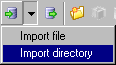

After importing the specified files, the database size might be larger than 3.5 GB - which is the maximum supported size in ASCET. Do you want to proceed?

or

After importing the specified files, the database size might be larger than 3.5 GB - which is the maximum supported size in ASCET. Do you want to proceed?

- Click OK to continue the import.

# Importing a Directory Content

To allow an easy import of all export files in a given directory, the Import directory option is provided in the File menu.

This mechanism should not be used for directories that contain export files of more than one type. In addition, it should not be used for directories that contain AMD or AXL files, even if that is the only export file type in the directory. It is highly likely that objects get overwritten when importing a complete directory with mixed contents or with AMD/AXL files which may result in several unexpected problems. Instead, use the procedure described in [Importing from AMD/AXL Files](markdown/CM_Importing_from_AMD_AXL_Files.md).

To import a directory content, proceed as follows:

1. In the Component Manager, open the target database or workspace for the import.
1. Start the import with one of the following actions.
1. If you are working with a database larger than 3 GB, [another step is inserted](javascript:BSSCPopup('CM_Create_DBtooLarge.htm');)<!-- kadovFilePopupInit('a1'); //-->.
1. In the Import Folder field, enter the path of the directory you want to import, either manually or via the  button.
1. Click Options if you want to adjust the import options.
1. Set the import options.
1. Click OK to start the import.
1. Select all items to be imported and click OK.
1. Confirm the message with OK.

The selected items are now imported. If the database size exceeds the max. size of 3.5 GB, the Database size limit exceeded message window opens. The import is stopped after the message window is closed, even if not all selected items are imported.

After all imports, the imported items are listed in the Imported Items window.

See also

[I](markdown/CM_Importing_from_AMD_AXL_Files.md)mporting from AMD/AXL Files

[Importing from Binary Export Files](markdown/CM_ImportBinaryFiles.md)

[Importing from ARXML or A2L Files](markdown/CM_Import_ARXML_or_A2L_Files.md)

[Using the AUTOSAR to ASCET Converter](markdown/CM_Use_A2AConverter.md)

[Import of a Directory Content](markdown/ImportingDirectory.md)

[Import Options](markdown/CM_Import_Node.md)

/* Heikki Komulainen, Comet Computer GmbH 2004 */ cc_plus_pic = '&nbsp;'; cc_minus_pic = '&nbsp;'; cc_stat_pic = '&nbsp;'; gpstyle = ''; var iframes_created = 0; if (document.body && document.body.insertAdjacentHTML && document.getElementsByTagName && document.getElementById) { collect_popups(); set_poplinks_pictures(); if (iframes_created) { document.write(gpstyle); document.write('
<nobr><a id="einauslink" style="position:absolute;top:expression(document.body.scrollTop + this.offsetHeight - this.offsetHeight);left:expression(document.body.offsetWidth - (this.offsetWidth + 28));background:#ffffe0;padding:5px" href="javascript:show_all_poptext()">Show all hidden text</a></nobr>
'); } } function collect_popups() { bsscpopups = new Array(); for (x = 0; x < document.links.length; x++) { if (document.links[x].href.indexOf("BSSCPopup")>-1) { seekmatch = /BSSCPopup.'[^'](markdown/+)'/; poplink = seekmatch.exec(document.links[x].href); poplink = "" + poplink; poplink = poplink.substring(poplink.indexOf("'")+1, poplink.lastIndexOf("'")); ifid = "CCGENIFRAMEID" + x; new_iframe = '<iframe id="' + ifid + '"src="' + poplink + '" onload="get_text(\'' + ifid + '\')" width="0" height="0" frameborder=0></iframe>'; document.links[x].parentNode.insertAdjacentHTML("afterEnd", new_iframe); gpid = "CCID_" + ifid; document.links[x].href = "javascript:expand_poptext('" + gpid + "')"; cc_plus = '' + cc_plus_pic + ''; document.links[x].insertAdjacentHTML("afterBegin", cc_plus); iframes_created = 1; } } }// end function function get_text(ifr_id) { frpars = document.frames[ifr_id].document.getElementsByTagName("body"); popbody = frpars[0].innerHTML; gpid = "CCID_" + ifr_id; if (!document.getElementById(gpid)) { //avoiding doubles document.getElementById(ifr_id).insertAdjacentHTML("afterEnd", '
'+popbody+'
'); } }//end function function expand_poptext(x_frame_id) { if (!document.getElementById(x_frame_id)) return; if (document.getElementById(x_frame_id).className == "CCGENPOPTEXTH") { document.getElementById(x_frame_id).className = "CCGENPOPTEXTV"; document.getElementById(x_frame_id).style.visibility = "visible"; if (document.getElementById("CCPMB_" + x_frame_id )) { document.getElementById("CCPMB_" + x_frame_id ).innerHTML = cc_minus_pic; } } else { document.getElementById(x_frame_id).className = "CCGENPOPTEXTH"; document.getElementById(x_frame_id).style.visibility = "hidden"; if (document.getElementById("CCPMB_" + x_frame_id )) { document.getElementById("CCPMB_" + x_frame_id ).innerHTML = cc_plus_pic; } } }// end function function show_all_poptext() { var pulldowntxt = document.getElementsByTagName("div"); for (b = 0; b < pulldowntxt.length; b++) { if (pulldowntxt[b].className == "droptext") { pulldowntxt[b].style.display=""; } } var gptxt = document.getElementsByTagName("div"); for (z = 0; z < gptxt.length; z++) { if (gptxt[z].className == "CCGENPOPTEXTH") { gptxt[z].className = "CCGENPOPTEXTV"; gptxt[z].style.visibility = "visible"; if (document.getElementById("CCPMB_" + gptxt[z].id )) { document.getElementById("CCPMB_" + gptxt[z].id ).innerHTML = cc_minus_pic; } } } var dxpoplinks = document.getElementsByTagName("a"); if (dxpoplinks) { for (pxl = 0; pxl < dxpoplinks.length; pxl++) { if (dxpoplinks[pxl].href.indexOf("kadovTextPopup")>-1) { if (document.getElementById("CCPMB_" + dxpoplinks[pxl].id)) { document.getElementById("CCPMB_" + dxpoplinks[pxl].id).innerHTML = cc_stat_pic; dxpoplinks[pxl].symbol = "minus"; } } } } document.getElementById('einauslink').innerText = 'Hide all hideable text'; document.getElementById('einauslink').href = "javascript:self.location.reload()"; self.focus(); }// end function function eat_click() { return false; }// end function function set_poplinks_pictures() { var dpoplinks = document.getElementsByTagName("a"); if (dpoplinks) { for (pl = 0; pl < dpoplinks.length; pl++) { if (dpoplinks[pl].href.indexOf("kadovTextPopup")>-1) { cc_plus = '' + cc_stat_pic + ''; //dpoplinks[pl].onmouseup = plusminuspoplink; dpoplinks[pl].insertAdjacentHTML("afterBegin", cc_plus); dpoplinks[pl].symbol = "plus"; } } } }// end function function plusminuspoplink() { if (document.getElementById("CCPMB_" + this.id)) { if (this.symbol == "plus") { document.getElementById("CCPMB_" + this.id).innerHTML = cc_minus_pic; this.symbol = "minus"; } else { document.getElementById("CCPMB_" + this.id).innerHTML = cc_plus_pic; this.symbol = "plus"; } } return true; }

---

## Setting Options for Automatic Problem Solutions

_Source: `markdown/cm_set_options_for_automatic_problem_solutions.md`_

# Setting Options for Automatic Problem Solutions

To set the options for automatic problem solutions, proceed as follows:

1. In the Import Problems window, click on Options.

The Options window opens. It contains only the Import node.

The Always fix AMD Import problems list contains solutions for the problems possible during AMD import.

1. Activate the options for all problems that shall be solved without being displayed in the Import Problems window.
1. Close the Options window with OK.

During the next AMD import, the selected solutions are performed automatically, you do not have to activate options in the Import Problems window.

See also

[Autofixes Node](markdown/CM_Autofixes_Node.md)

[Import Options](markdown/CM_Import_Node.md)

[Importing from AMD/AXL Files](markdown/CM_Importing_from_AMD_AXL_Files.md)

[Special Features of the AMD/AXL Import](markdown/cm_special_features_of_the_amd_import.md)

[ASCET AMD Import Errors](markdown/ASCET_AMD_Import_Errors.md)

---

## Importing an Export File from ASCET-SD prior to Version 4.0

_Source: `markdown/ImportingOldASCET.md`_

# Importing an Export File from ASCET-SD prior to Version 4.0

If you still have ASCET-SD 4.x, you can use very old export files with the current ASCET version. Proceed as follows:

1. Start ASCET-SD 4.x.

These versions contain interfaces to the very old database formats.

1. Import the old export file.

The database items are converted to the format of the corresponding ASCET-SD version.

1. Export the imported items.
1. Close ASCET-SD 4.x.
1. Start the current ASCET version.
1. Import the database items you have just exported from ASCET-SD 4.x (see [Importing from Binary Export Files](markdown/CM_ImportBinaryFiles.md)).

See also

[Importing from Binary Export Files](markdown/CM_ImportBinaryFiles.md)

---

## Setting ASCET Options

_Source: `markdown/SettingASCET.md`_

# Setting ASCET Options

To set ASCET Options, proceed as follows:

1. Do one of the following:
1. Select the required node to make the settings for ASCET.
1. Make the new setting as appropriate for the respective control element.
1. Click the System Defaults button to restore the default settings for the current node and its subnodes.
1. When you have made all settings, click on OK.

The settings are applied, and the Options window is closed.

Some new settings may not take effect immediately. If for example, you modify the list font for the ASCET user interface, this does not affect any windows that are already open. You must close the window and reopen it for the new settings to take effect.

You can

| Column 1 | Column 2 | Column 3 |
| --- | --- | --- |
| Set up Automatic Saving |  | Specify Colors |
| Enable the Automatic Transmission of E-mails |  | Set Sequencing Options |
| Set Fonts |  | Set Default Options for State Machines |
| Map Fonts |  | Set the Paths For External Tools |
| Show and Hide Confirmation Dialog Windows |  | Set the Export Options |
| Set a Path |  | Set the Import Options |
| Customize Data Type Names |  |  |
| Make Default Settings for Arithmetic Services |  | Export Options |
| Set up Default Options for Implementation |  | Import Options |
|  |  | Filter Options |

See also

[Setting Up ASCET](markdown/CM_Setting_Up_ASCET.md)

[P](markdown/CM_PathMacros.md)ath Macros

---

## Exporting Options

_Source: `markdown/cm_exporting_options.md`_

# Exporting Options

Once you have set the options of a node, you can export them to an XML file.

1. Open the ASCET options window.
1. Select the node whose options you want to export.
1. If necessary, set the options of this node.
1. Do one of the following:
1. Set path and name of the export file.
1. Click Save.

The options of the selected node are written to the XML file specified.

---

## Importing Options

_Source: `markdown/cm_import_options.md`_

# Importing Options

Exported options can be reimported again. This means that, for example, identical options can be defined for several users.

1. Open the ASCET options window.
1. Select the node whose options you want to import.
1. Do one of the following:
1. If you do not want the confirmation dialog to be displayed in future, disable Show next time (see [Confirmation Dialog Options](markdown/CM_Options_for_Confirmation_Dialogs.md)).
1. Confirm the overwriting of the existing options with OK.
1. Select the XML file which contains the options required.
1. Click Open.

The options contained in the XML file specified are applied to the options window.

See also

[Confirmation Dialog Options](markdown/CM_Options_for_Confirmation_Dialogs.md)

---

## Filtering Options

_Source: `markdown/CM_filteroptions.md`_

# Filtering Options

You can filter the options to make the display more concise.

- Enter a text in the filter text field.
- You can enter one or more words, or a part of a word.
- Click the 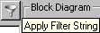 button.

The display field shows only options whose name, value, or description, contains the filter text.

The tree view shows only nodes than contain options matching the filter. If necessary, further nodes are displayed to maintain an intact hierarchy.

---

## Enabling the Automatic Transmission of E-Mails

_Source: `markdown/TransmissionOfemails.md`_

# Enabling the Automatic Transmission of E-Mails

The Send E-Mail option allows you to enable the automatic transmission of e-mails to the ETAS hotline.

1. Open the ASCET options window and go to the Options node.
1. Activate the Send E-Mail option.
1. In the E-Mail Address field, enter the current hotline address.
1. Click OK to accept the setting.

The next time you select Problem Report menu, an e-mail is sent to the hotline. This function is explained in detail in [ETAS Problem Report Support Function](markdown/ETAS__Problem_Report__Support_Function.md).

See also

[General Options](markdown/CM_General_Options.md)

[Setting Up ASCET](markdown/CM_Setting_Up_ASCET.md)

[Setting the Paths for External Tools](markdown/SetPath.md)

[ETAS Problem Report Support Function](markdown/ETAS__Problem_Report__Support_Function.md)

---

## Showing and Hiding Confirmation Dialog Windows

_Source: `markdown/CM_Showing_and_Hiding_Confirmation_Dialog_Windows.md`_

# Showing and Hiding Confirmation Dialog Windows

To change the visibility of a confirmation or hint window, proceed as follows:

1. In the ASCET options window, open the [Confirmation Dialogs](markdown/CM_Options_for_Confirmation_Dialogs.md) node.
1. In the Confirmation Dialogs or Hint Dialogs field, double-click the entry in the Decision column next to the desired option.
1. Select an entry from the combo box.

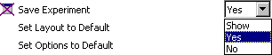

From now on, the confirmation/hint window is treated according to the selection.

See also

[Confirmation Dialog Options](markdown/CM_Options_for_Confirmation_Dialogs.md)

---

## Specifying Colors

_Source: `markdown/cm_specify_colors.md`_

# Specifying Colors

You can determine various color settings for block diagrams as well as the input area (inputs of Boolean tables, see [Boolean Table Editor - Overview](BooleanTableEditorEnglishUS.chm::/BT_Overview.htm), and the condition area of conditional tables, see [Conditional Table Editor - Overview](ConditionalTableEditorEnglishUS.chm::/CTab_overview.htm)) and output area (outputs of Boolean tables and action area of conditional tables).

To specify colors, proceed as follows:

1. Open the ASCET Options window.
1. Go to the node that contains the color you want to change.
1. Select the color combo box  of the option you want to change.
1. Select the desired color.
1. Close the Options window with OK.

See also

[Boolean Table Editor - Overview](BooleanTableEditorEnglishUS.chm::/BT_Overview.htm)

[Conditional Table Editor - Overview](ConditionalTableEditorEnglishUS.chm::/CTab_overview.htm)

---

## Setting Sequencing Options

_Source: `markdown/SequencingOptions.md`_

# Setting Sequencing Options

To set sequencing options, proceed as follows:

1. Open the Sequencing node of the ASCET Options window.
1. In the Sequence Step Size field, enter the step size for the automatic scaling of sequence call numbers.
1. In the Sequence Shift Offset field, enter the value for the automatic shift of sequence call numbers.
1. Activate the Use gaps option when you want the automatic numbering of sequence calls to fill the gaps between existing sequence numbers.
1. Close the Options window with OK.

See also

[Sequencing Options](markdown/CM_SequencingNode.md)

[Setting Up ASCET](markdown/CM_Setting_Up_ASCET.md)

[Sequence Calls](blockdiagrameditorenglishus.chm::/BDE_SequenceCalls.htm)

---

## Setting Default Options for State Machines

_Source: `markdown/StateMachines.md`_

# Setting Default Options for State Machines

To set up default options for state machines, proceed as follows:

1. Open the Statemachine node of the ASCET Options window.
1. Activate the Use ESDL as default for state machine option.
1. Select a color from the Animated States Color combo box.
1. Select a line type from the Transition Type combo box.
1. Activate the Convert Transition Types option if you want to convert existing transitions to the selected line type.
1. Click OK to accept the settings.

See also

[State Machine Options](markdown/cm_options_for_state_machines.md)

[Setting up Default Options for Implementations](markdown/ImplementationOptions.md)

---

## Setting Fonts

_Source: `markdown/SetFontOption.md`_

# Setting Fonts

The font selection does not affect existing windows.

To set Font options, proceed as follows:

1. Open the Fonts node of the ASCET Options window.
1. Click on the  button, next to the font you want to change.
1. In the Font Selection window, do the following:
1. Close the Options window with OK.

See also

[Fonts Options](markdown/CM_Fonts_Node.md)

[Setting Up ASCET](markdown/CM_Setting_Up_ASCET.md)

---

## Mapping Fonts

_Source: `markdown/cm_mapping_fonts.md`_

# Mapping Fonts

With the Edit Font Mapping option in the Fonts node of the ASCET options window, you can map the Windows fonts to Postscript fonts. When a block diagram is saved as a Postscript file, the Windows fonts are replaced by the selected Postscript fonts.

To map fonts, proceed as follows:

1. Open the ASCET options dialog.
1. Go to the Fonts node.
1. Click the  button next to Edit Font Mapping.
1. [Add or remove mapping entries](markdown/cm_adding_removing_mapping_entries.md).
1. [Edit mapping entries](markdown/cm_editing_mapping_entries.md).
1. [Conclude your work](markdown/cm_concluding_work.md).

See also

[Adding/Removing Mapping entries](markdown/cm_adding_removing_mapping_entries.md)

[Editing Mapping entries](markdown/cm_editing_mapping_entries.md)

[Concluding Work](markdown/cm_concluding_work.md)

---

## Adding/Removing Mapping Entries

_Source: `markdown/cm_adding_removing_mapping_entries.md`_

# Adding/Removing Mapping Entries

To add/remove mapping entries, proceed as follows:

1. Click the  button in the PostScript Font Mapping window to create a new mapping entry.

You can map a Windows font to several Postscript fonts. When generating Postscript files, only the first mapping entry for a font is used; the others have no effect.

1. Click the  button in the PostScript Font Mapping window to remove a mapping entry.

See also

[Mapping Fonts](markdown/cm_mapping_fonts.md)

[Editing mapping entries](markdown/cm_editing_mapping_entries.md)

[Concluding Work](markdown/cm_concluding_work.md)

---

## Editing Mapping Entries

_Source: `markdown/cm_editing_mapping_entries.md`_

# Editing Mapping Entries

To edit mapping entries, proceed as follows:

1. Double-click in a cell of the SmallTalk Font Descriptor column in the PostScript Font Mapping window.
1. The Font Selection window (see [Setting Fonts](markdown/SetFontOption.md)) opens.
1. Set the Windows font you want to map to a Postscript font in the Font Selection window and click OK.
1. Double-click a cell in the column PostScript Font Name in the PostScript Font Mapping window and enter the Postscript font which is to replace the Windows font.
1. Double-click a cell in the column PostScript Font Size in the PostScript Font Mapping window and enter the size for the Postscript font.
1. Click the  button in the PostScript Font Mapping window to display the Postscript command generated with the selected settings.

See also

[Mapping Fonts](markdown/cm_mapping_fonts.md)

[Adding/Removing Mapping entries](markdown/cm_adding_removing_mapping_entries.md)

[Concluding Work](markdown/cm_concluding_work.md)

[Setting Fonts](markdown/SetFontOption.md)

---

## Concluding Work

_Source: `markdown/cm_concluding_work.md`_

# Concluding Work

To conclude work, proceed as follows:

1. Close the PostScript Font Mapping window with OK to accept the settings.
1. Close the PostScript Font Mapping window with Cancel to reject the settings.

See also

[Mapping Fonts](markdown/cm_mapping_fonts.md)

[Adding/Removing Mapping entries](markdown/cm_adding_removing_mapping_entries.md)

[Editing mapping entries](markdown/cm_editing_mapping_entries.md)

---

## Default Settings for Arithmetic Services

_Source: `markdown/cm_default_arithmetic_services.md`_

# Default Settings for Arithmetic Services

To activate arithmetic services for newly created projects, proceed as follows:

1. Open the Options window and go to the Build node.
1. Activate the option Use Arithmetic Service.
1. Activate the option Use first available Service Set.
1. Click OK to accept the setting.

For more details on arithmetic services, see [Arithmetic Services](ArithmeticServicesEnglishUS.chm::/AS_Overview.htm).

See also

[Arithmetic Services - Overview](ArithmeticServicesEnglishUS.chm::/AS_Overview.htm)

---

## Setting a Path

_Source: `markdown/cm_setting_a_path.md`_

# Setting a Path

To set a path, proceed as follows:

1. Open the Options window and go to one of the Paths nodes (or another node that contains a path option).
1. Do one of the following.

- In the text field, enter the path you want to assign.

You can use the [path macros](javascript:BSSCPopup('CM_PathMacros.htm');)<!-- kadovFilePopupInit('a1'); //-->.

Or

1. Click on the  button next to the path option you want to change.
1. If necessary, select a volume in the Volume combo box.
1. Select an existing directory from the Directories list.
1. Create a new directory using the New button.
1. Click OK to close the Path Selection window.

The selected directory is displayed in the Options window.

See also

[Path Macros](markdown/CM_PathMacros.md)

[Setting ASCET Options](markdown/SettingASCET.md)

[ASCET Options Window](markdown/cm_user_interface_of_the_ascet_options_window.md)

/* Heikki Komulainen, Comet Computer GmbH 2004 */ cc_plus_pic = '&nbsp;'; cc_minus_pic = '&nbsp;'; cc_stat_pic = '&nbsp;'; gpstyle = ''; var iframes_created = 0; if (document.body && document.body.insertAdjacentHTML && document.getElementsByTagName && document.getElementById) { collect_popups(); set_poplinks_pictures(); if (iframes_created) { document.write(gpstyle); document.write('
<nobr><a id="einauslink" style="position:absolute;top:expression(document.body.scrollTop + this.offsetHeight - this.offsetHeight);left:expression(document.body.offsetWidth - (this.offsetWidth + 28));background:#ffffe0;padding:5px" href="javascript:show_all_poptext()">Show all hidden text</a></nobr>
'); } } function collect_popups() { bsscpopups = new Array(); for (x = 0; x < document.links.length; x++) { if (document.links[x].href.indexOf("BSSCPopup")>-1) { seekmatch = /BSSCPopup.'[^'](markdown/+)'/; poplink = seekmatch.exec(document.links[x].href); poplink = "" + poplink; poplink = poplink.substring(poplink.indexOf("'")+1, poplink.lastIndexOf("'")); ifid = "CCGENIFRAMEID" + x; new_iframe = '<iframe id="' + ifid + '"src="' + poplink + '" onload="get_text(\'' + ifid + '\')" width="0" height="0" frameborder=0></iframe>'; document.links[x].parentNode.insertAdjacentHTML("afterEnd", new_iframe); gpid = "CCID_" + ifid; document.links[x].href = "javascript:expand_poptext('" + gpid + "')"; cc_plus = '' + cc_plus_pic + ''; document.links[x].insertAdjacentHTML("afterBegin", cc_plus); iframes_created = 1; } } }// end function function get_text(ifr_id) { frpars = document.frames[ifr_id].document.getElementsByTagName("body"); popbody = frpars[0].innerHTML; gpid = "CCID_" + ifr_id; if (!document.getElementById(gpid)) { //avoiding doubles document.getElementById(ifr_id).insertAdjacentHTML("afterEnd", '
'+popbody+'
'); } }//end function function expand_poptext(x_frame_id) { if (!document.getElementById(x_frame_id)) return; if (document.getElementById(x_frame_id).className == "CCGENPOPTEXTH") { document.getElementById(x_frame_id).className = "CCGENPOPTEXTV"; document.getElementById(x_frame_id).style.visibility = "visible"; if (document.getElementById("CCPMB_" + x_frame_id )) { document.getElementById("CCPMB_" + x_frame_id ).innerHTML = cc_minus_pic; } } else { document.getElementById(x_frame_id).className = "CCGENPOPTEXTH"; document.getElementById(x_frame_id).style.visibility = "hidden"; if (document.getElementById("CCPMB_" + x_frame_id )) { document.getElementById("CCPMB_" + x_frame_id ).innerHTML = cc_plus_pic; } } }// end function function show_all_poptext() { var pulldowntxt = document.getElementsByTagName("div"); for (b = 0; b < pulldowntxt.length; b++) { if (pulldowntxt[b].className == "droptext") { pulldowntxt[b].style.display=""; } } var gptxt = document.getElementsByTagName("div"); for (z = 0; z < gptxt.length; z++) { if (gptxt[z].className == "CCGENPOPTEXTH") { gptxt[z].className = "CCGENPOPTEXTV"; gptxt[z].style.visibility = "visible"; if (document.getElementById("CCPMB_" + gptxt[z].id )) { document.getElementById("CCPMB_" + gptxt[z].id ).innerHTML = cc_minus_pic; } } } var dxpoplinks = document.getElementsByTagName("a"); if (dxpoplinks) { for (pxl = 0; pxl < dxpoplinks.length; pxl++) { if (dxpoplinks[pxl].href.indexOf("kadovTextPopup")>-1) { if (document.getElementById("CCPMB_" + dxpoplinks[pxl].id)) { document.getElementById("CCPMB_" + dxpoplinks[pxl].id).innerHTML = cc_stat_pic; dxpoplinks[pxl].symbol = "minus"; } } } } document.getElementById('einauslink').innerText = 'Hide all hideable text'; document.getElementById('einauslink').href = "javascript:self.location.reload()"; self.focus(); }// end function function eat_click() { return false; }// end function function set_poplinks_pictures() { var dpoplinks = document.getElementsByTagName("a"); if (dpoplinks) { for (pl = 0; pl < dpoplinks.length; pl++) { if (dpoplinks[pl].href.indexOf("kadovTextPopup")>-1) { cc_plus = '' + cc_stat_pic + ''; //dpoplinks[pl].onmouseup = plusminuspoplink; dpoplinks[pl].insertAdjacentHTML("afterBegin", cc_plus); dpoplinks[pl].symbol = "plus"; } } } }// end function function plusminuspoplink() { if (document.getElementById("CCPMB_" + this.id)) { if (this.symbol == "plus") { document.getElementById("CCPMB_" + this.id).innerHTML = cc_minus_pic; this.symbol = "minus"; } else { document.getElementById("CCPMB_" + this.id).innerHTML = cc_plus_pic; this.symbol = "plus"; } } return true; }

---

## Customizing Data Type Names

_Source: `markdown/CM_CustomizeDataTypeNames.md`_

# Customizing Data Type Names

ASCET allows the customization of data type names (see [Data Type Names](IntroductionEnglishUS.chm::/INT_DataTypeNames.htm)). The customized names are used in the ASCET user interface and in the code generated for ASCET-SE targets. Code generated for experimental targets (RP targets, PC target, Prototyping target) uses the default data type names.

To customize data type names, proceed as follows.

1. Open the Options window and go to the [Data Type Names](markdown/CM_Options_DataTypeNames.md) node.
1. Activate the Use Customized Data Type Names option.
1. In the <data type> fields, overwrite the default names with your names.
1. Click OK to close the Options window.
1. Confirm the message with OK.
1. Follow the recommendation and restart ASCET.
1. For an ASCET-SE target, define the customized data types with normal C type definitions in the [a_user_def.h](IntroductionEnglishUS.chm::/INT_Example_a_user_def.h.htm) include file in the <install_dir>\targets\trg_<name>\include directory.

See also

[Data Type Names Options](markdown/CM_Options_DataTypeNames.md)

[Introduction - Data Type Names](IntroductionEnglishUS.chm::/INT_DataTypeNames.htm)

[Introduction - Example: a_user_def.h](IntroductionEnglishUS.chm::/INT_Example_a_user_def.h.htm)

[Introduction - Reserved Keywords](IntroductionEnglishUS.chm::/INT_Reserved_Keywords.htm)

---

## Setting up Automatic Saving

_Source: `markdown/SetAutomaticSaving.md`_

# Setting up Automatic Saving

With the Automatic Save option, you can activate the automatic saving function and enter the time interval you want. Your data will then be saved according to the intervals you entered.

For performance reasons, some user operations that require an entry in the database/workspace are held only in a cache. Using Automatic Save, you can force the database/workspace cache to be saved in cycles.

To set up automatic saving, proceed as follows:

1. Open the ASCET options window and go to the Environment node.
1. In the Environment node, activate the Automatic Save option.
1. In the Store every ... minutes field, enter a value or use the  keys to adjust the time interval between updates.

The database/workspace cache is saved in cycles with the specified cycle time.

See also

[Environment Options](markdown/CM_Environment_Node.md)

[Setting Up ASCET](markdown/CM_Setting_Up_ASCET.md)

[Setting the Paths for External Tools](markdown/SetPath.md)

---

## Setting a Path

_Source: `markdown/cm_setting_a_path.md`_

# Setting a Path

To set a path, proceed as follows:

1. Open the Options window and go to one of the Paths nodes (or another node that contains a path option).
1. Do one of the following.

- In the text field, enter the path you want to assign.

You can use the [path macros](javascript:BSSCPopup('CM_PathMacros.htm');)<!-- kadovFilePopupInit('a1'); //-->.

Or

1. Click on the  button next to the path option you want to change.
1. If necessary, select a volume in the Volume combo box.
1. Select an existing directory from the Directories list.
1. Create a new directory using the New button.
1. Click OK to close the Path Selection window.

The selected directory is displayed in the Options window.

See also

[Path Macros](markdown/CM_PathMacros.md)

[Setting ASCET Options](markdown/SettingASCET.md)

[ASCET Options Window](markdown/cm_user_interface_of_the_ascet_options_window.md)

/* Heikki Komulainen, Comet Computer GmbH 2004 */ cc_plus_pic = '&nbsp;'; cc_minus_pic = '&nbsp;'; cc_stat_pic = '&nbsp;'; gpstyle = ''; var iframes_created = 0; if (document.body && document.body.insertAdjacentHTML && document.getElementsByTagName && document.getElementById) { collect_popups(); set_poplinks_pictures(); if (iframes_created) { document.write(gpstyle); document.write('
<nobr><a id="einauslink" style="position:absolute;top:expression(document.body.scrollTop + this.offsetHeight - this.offsetHeight);left:expression(document.body.offsetWidth - (this.offsetWidth + 28));background:#ffffe0;padding:5px" href="javascript:show_all_poptext()">Show all hidden text</a></nobr>
'); } } function collect_popups() { bsscpopups = new Array(); for (x = 0; x < document.links.length; x++) { if (document.links[x].href.indexOf("BSSCPopup")>-1) { seekmatch = /BSSCPopup.'[^'](markdown/+)'/; poplink = seekmatch.exec(document.links[x].href); poplink = "" + poplink; poplink = poplink.substring(poplink.indexOf("'")+1, poplink.lastIndexOf("'")); ifid = "CCGENIFRAMEID" + x; new_iframe = '<iframe id="' + ifid + '"src="' + poplink + '" onload="get_text(\'' + ifid + '\')" width="0" height="0" frameborder=0></iframe>'; document.links[x].parentNode.insertAdjacentHTML("afterEnd", new_iframe); gpid = "CCID_" + ifid; document.links[x].href = "javascript:expand_poptext('" + gpid + "')"; cc_plus = '' + cc_plus_pic + ''; document.links[x].insertAdjacentHTML("afterBegin", cc_plus); iframes_created = 1; } } }// end function function get_text(ifr_id) { frpars = document.frames[ifr_id].document.getElementsByTagName("body"); popbody = frpars[0].innerHTML; gpid = "CCID_" + ifr_id; if (!document.getElementById(gpid)) { //avoiding doubles document.getElementById(ifr_id).insertAdjacentHTML("afterEnd", '
'+popbody+'
'); } }//end function function expand_poptext(x_frame_id) { if (!document.getElementById(x_frame_id)) return; if (document.getElementById(x_frame_id).className == "CCGENPOPTEXTH") { document.getElementById(x_frame_id).className = "CCGENPOPTEXTV"; document.getElementById(x_frame_id).style.visibility = "visible"; if (document.getElementById("CCPMB_" + x_frame_id )) { document.getElementById("CCPMB_" + x_frame_id ).innerHTML = cc_minus_pic; } } else { document.getElementById(x_frame_id).className = "CCGENPOPTEXTH"; document.getElementById(x_frame_id).style.visibility = "hidden"; if (document.getElementById("CCPMB_" + x_frame_id )) { document.getElementById("CCPMB_" + x_frame_id ).innerHTML = cc_plus_pic; } } }// end function function show_all_poptext() { var pulldowntxt = document.getElementsByTagName("div"); for (b = 0; b < pulldowntxt.length; b++) { if (pulldowntxt[b].className == "droptext") { pulldowntxt[b].style.display=""; } } var gptxt = document.getElementsByTagName("div"); for (z = 0; z < gptxt.length; z++) { if (gptxt[z].className == "CCGENPOPTEXTH") { gptxt[z].className = "CCGENPOPTEXTV"; gptxt[z].style.visibility = "visible"; if (document.getElementById("CCPMB_" + gptxt[z].id )) { document.getElementById("CCPMB_" + gptxt[z].id ).innerHTML = cc_minus_pic; } } } var dxpoplinks = document.getElementsByTagName("a"); if (dxpoplinks) { for (pxl = 0; pxl < dxpoplinks.length; pxl++) { if (dxpoplinks[pxl].href.indexOf("kadovTextPopup")>-1) { if (document.getElementById("CCPMB_" + dxpoplinks[pxl].id)) { document.getElementById("CCPMB_" + dxpoplinks[pxl].id).innerHTML = cc_stat_pic; dxpoplinks[pxl].symbol = "minus"; } } } } document.getElementById('einauslink').innerText = 'Hide all hideable text'; document.getElementById('einauslink').href = "javascript:self.location.reload()"; self.focus(); }// end function function eat_click() { return false; }// end function function set_poplinks_pictures() { var dpoplinks = document.getElementsByTagName("a"); if (dpoplinks) { for (pl = 0; pl < dpoplinks.length; pl++) { if (dpoplinks[pl].href.indexOf("kadovTextPopup")>-1) { cc_plus = '' + cc_stat_pic + ''; //dpoplinks[pl].onmouseup = plusminuspoplink; dpoplinks[pl].insertAdjacentHTML("afterBegin", cc_plus); dpoplinks[pl].symbol = "plus"; } } } }// end function function plusminuspoplink() { if (document.getElementById("CCPMB_" + this.id)) { if (this.symbol == "plus") { document.getElementById("CCPMB_" + this.id).innerHTML = cc_minus_pic; this.symbol = "minus"; } else { document.getElementById("CCPMB_" + this.id).innerHTML = cc_plus_pic; this.symbol = "plus"; } } return true; }

---

## Setting the Paths For External Tools

_Source: `markdown/SetPath.md`_

# Setting the Paths for External Tools

Use the External Make Utility, C Preprocessor, Output Redirector Utility, C Code Beautifier and Perl Compiler options to set paths to external tools.

To set the paths for external tools, proceed as follows:

1. Open the ASCET Options window and go to the External Tools node (or another node that contains a tool path).
1. In the node, click on the  button next to the option you want to change.
1. The Windows file selection window appears.
1. Select the directory that contains the tool.
1. Select the desired file and click on Open.

File name and path are displayed in the text field.

See also

[External Tools Node](markdown/CM_Options_for_External_Tools.md)

[Setting a Path](markdown/cm_setting_a_path.md)

---

## Setting the Export Options

_Source: `markdown/ExportOption.md`_

# Setting the Export Options

To set the export options, proceed as follows:

1. Open the ASCET Options window and go to the Paths node below the Environment node.
1. Select the default target directory for export in the Default Export Path field.
1. Open the Export node.
1. Select a Default Export Format.
1. Activate the Include Referenced Items option to export database/workspace items recursively (i.e. including all referenced items).
1. Activate the One File for each Item option to write each exported database item in a separate file.
1. Activate or deactivate the options in the AMD Format field to determine the content of the AMD description file.
1. Click OK to accept the settings.

For information on exporting database/workspace items, see [Exporting Folders and Database/Workspace Items](markdown/ExportingFolders.md).

See also

[Export Options](markdown/CM_Export_Node.md)

[Path Macros](markdown/CM_PathMacros.md)

[Setting Up ASCET](markdown/CM_Setting_Up_ASCET.md)

[Exporting Folders and Database/Workspace Items](markdown/ExportingFolders.md)

---

## Setting the Import Options

_Source: `markdown/ImportOptions.md`_

# Setting the Import Options

To set the import options, proceed as follows:

1. Open the ASCET Options window and go to the Paths node below the Environment node.
1. In the Default Import Path field, select the default source directory for imports.
1. Open the Import node.
1. Select a Default Import Format.
1. Use the options below Default Import Format for general import settings.
1. Use the options in the EXP format area for EXP-specific import settings.
1. Use the options in the AMD Format area for AMD-specific import settings.
1. Click OK to accept the settings.

See also

[Import Options](markdown/CM_Import_Node.md)

[Path Macros](markdown/CM_PathMacros.md)

[Importing Folders and Database/Workspace Items](markdown/ImportFolders.md)

[Setting Up ASCET](markdown/CM_Setting_Up_ASCET.md)

---

## Specifying Colors

_Source: `markdown/cm_specify_colors.md`_

# Specifying Colors

You can determine various color settings for block diagrams as well as the input area (inputs of Boolean tables, see [Boolean Table Editor - Overview](BooleanTableEditorEnglishUS.chm::/BT_Overview.htm), and the condition area of conditional tables, see [Conditional Table Editor - Overview](ConditionalTableEditorEnglishUS.chm::/CTab_overview.htm)) and output area (outputs of Boolean tables and action area of conditional tables).

To specify colors, proceed as follows:

1. Open the ASCET Options window.
1. Go to the node that contains the color you want to change.
1. Select the color combo box  of the option you want to change.
1. Select the desired color.
1. Close the Options window with OK.

See also

[Boolean Table Editor - Overview](BooleanTableEditorEnglishUS.chm::/BT_Overview.htm)

[Conditional Table Editor - Overview](ConditionalTableEditorEnglishUS.chm::/CTab_overview.htm)

---

## Setting up Default Options for Implementation

_Source: `markdown/ImplementationOptions.md`_

# Setting up Default Options for Implementations

To set up default options for implementations, proceed as follows:

1. [Open the ASCET Options window.](markdown/SettingASCET.md)
1. In the Implementation node of the ASCET Options window, use the Implementation Master combo box to select the master page for new implementations.
1. Activate or deactivate the Automatically select the Implementation Type option according to your needs.
1. Activate or deactivate the "Limit Assignments" Flag for <type> Data Type options according to your needs.
1. Activate the option Limit to maximum bit length if the result of an operation is to be limited in the case of an overflow.
1. In the Resolution Handling combo box, select the default resolution handling.
1. Go to the Default Implementation Types node and use the Default <type> Data Type combo box to select a default implementation data type for <type> variables.
1. Click OK to accept the setting.

See also

[Setting ASCET Options](markdown/SettingASCET.md)

[Implementation Options](markdown/cm_implementation_node.md)

[Default Implementation Types Node](markdown/cm_defaultimplementationtypes.md)

[Setting Up ASCET](markdown/CM_Setting_Up_ASCET.md)

[Customizing Data Type Names](markdown/CM_CustomizeDataTypeNames.md)

---

## Saving the Content of the Monitor Tab

_Source: `markdown/SaveMonitor.md`_

# Saving the Content of the Monitor Tab

If you want to save the content of the Monitor tab, proceed as follows.

Saving the content of the Monitor tab overwrites the existing Ascet_Monitor.log file in the ASCET log directory, e.g., C:\ETAS\LogFiles\ASCET. Any information that was stored previously, but has been removed from the Monitor tab, is lost.

1. Do one of the following:
1. Confirm with OK.

The content of the Monitor tab is saved in the Ascet_Monitor.log file in the ETAS\LogFiles\Ascet directory.

See also

[Saving the Content of the Monitor Tab under a Different Name](markdown/SaveDifferent.md)

[ASCET Monitor Window](markdown/MonitorWindow.md)

[Saving the Content of the Build Tab](markdown/SaveContent.md)

[Find or Replace in the Monitor Tab](markdown/FindOrReplace.md)

---

## Saving the Content of the Monitor Tab under a Different Name

_Source: `markdown/SaveDifferent.md`_

# Saving the Content of the Monitor Tab under a Different Name

If you want to save the content of the Monitor tab under a different name, proceed as follows:

1. In the File menu, select Save As to save the log file under a name and path of your choice.

A file selector window opens.

1. Select a path and a file name and click Save.

The content of the Monitor tab is written to the relevant file.

See also

[ASCET Monitor Window](markdown/MonitorWindow.md)

[Saving the Content of the Monitor Tab](markdown/SaveMonitor.md)

[Find or Replace in the Monitor Tab](markdown/FindOrReplace.md)

---

## Find or Replace in the Monitor Tab

_Source: `markdown/FindOrReplace.md`_

# Find or Replace in the Monitor Tab

To find or replace text in the Monitor tab, proceed as follows:

1. From the Edit menu, select Find/Replace

or

1. Press Ctrl + f.

The Find/Replace window opens.

1. In the Find box, enter the search string.
1. In the Replace With box, enter the text that is to replace the text entered in the Find box.
1. Select the direction under Direction.
1. Activate Case Sensitive if the search is to take upper and lower case into consideration.
1. Activate Wrap Search if the search is to be continued at the beginning once the end has been reached in the search direction.
1. Click Find Next to find the next occurrence of the search string.
1. Click Replace Selection to replace the selected occurrence.
1. Click Replace/Find to replace the selected occurrence and search for the next one.
1. Click Replace All to replace the search string each time it occurs.
1. Close the Find/Replace window with Close.

See also

[ASCET Monitor Window](markdown/MonitorWindow.md)

---

## Clearing the Monitor Tab

_Source: `markdown/Clear.md`_

# Clearing the Monitor Tab

If you want to delete the entire content of the Monitor tab, e.g. before an operation whose result you want to save, proceed as follows:

- From the Edit menu, select Clear

or

- Press Ctrl + r.

The entire text in the Monitor tab is cleared.

Clearing the Monitor tab does not change the content of the Ascet_Monitor.log file in the ASCET log directory, e.g., C:\ETAS\LogFiles\ASCET.

See also

[ASCET Monitor Window](markdown/MonitorWindow.md)

[Saving the Content of the Monitor Tab](markdown/SaveMonitor.md)

[Saving the Content of the Monitor Tab under a Different Name](markdown/SaveDifferent.md)

---

## Displaying the Cause of the Error/Warning

_Source: `markdown/DisplayErrorcause.md`_

In this example, the incomplete transition from the status All Off to the status Yellow caused the warning.

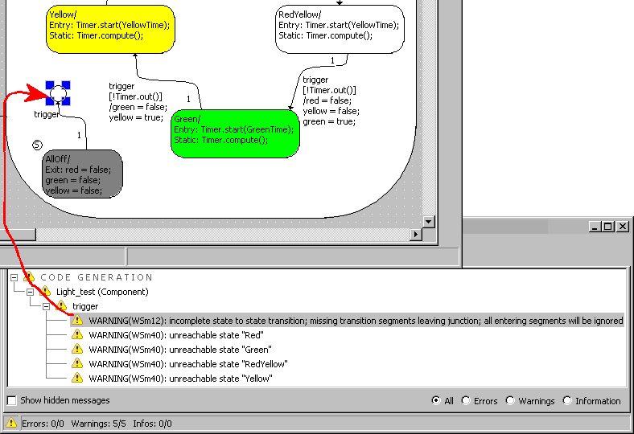

# Displaying the Cause of the Message

To display the cause of the error/warning, proceed as follows:

1. In the Build tab of the Monitor window, do one of the following:
1. To open the code generation folder, do one of the following:
1. Double-click on the C O D E G E N E R A T I O N or C O M P I L E/L I N K node.
1. Open the File menu and select Open Code Generation Directory.

You can now check the generated files.

When compiler or linker errors have occurred, a text window opens showing the relevant generated file. The use of a text editor is controlled in the [ASCII Editor](markdown/CM_ASCII_Editor_Options.md) node of the ASCET option window.

See also

[ASCET Monitor Window](markdown/MonitorWindow.md)

[Build Tab](markdown/BuildTab.md)

[ASCII Editor Options](markdown/CM_ASCII_Editor_Options.md)

/* Heikki Komulainen, Comet Computer GmbH 2004 */ cc_plus_pic = '&nbsp;'; cc_minus_pic = '&nbsp;'; cc_stat_pic = '&nbsp;'; gpstyle = ''; var iframes_created = 0; if (document.body && document.body.insertAdjacentHTML && document.getElementsByTagName && document.getElementById) { collect_popups(); set_poplinks_pictures(); if (iframes_created) { document.write(gpstyle); document.write('
<nobr><a id="einauslink" style="position:absolute;top:expression(document.body.scrollTop + this.offsetHeight - this.offsetHeight);left:expression(document.body.offsetWidth - (this.offsetWidth + 28));background:white;padding:5px" href="javascript:show_all_poptext()">Alle texte einblenden</a></nobr>
'); } } function collect_popups() { bsscpopups = new Array(); for (x = 0; x < document.links.length; x++) { if (document.links[x].href.indexOf("BSSCPopup")>-1) { seekmatch = /BSSCPopup.'[^'](markdown/+)'/; poplink = seekmatch.exec(document.links[x].href); poplink = "" + poplink; poplink = poplink.substring(poplink.indexOf("'")+1, poplink.lastIndexOf("'")); ifid = "CCGENIFRAMEID" + x; new_iframe = '<iframe id="' + ifid + '"src="' + poplink + '" onload="get_text(\'' + ifid + '\')" width="0" height="0" frameborder=0></iframe>'; document.links[x].parentNode.insertAdjacentHTML("afterEnd", new_iframe); gpid = "CCID_" + ifid; document.links[x].href = "javascript:expand_poptext('" + gpid + "')"; cc_plus = '' + cc_plus_pic + ''; document.links[x].insertAdjacentHTML("afterBegin", cc_plus); iframes_created = 1; } } }// end function function get_text(ifr_id) { frpars = document.frames[ifr_id].document.getElementsByTagName("body"); popbody = frpars[0].innerHTML; gpid = "CCID_" + ifr_id; if (!document.getElementById(gpid)) { //avoiding doubles document.getElementById(ifr_id).insertAdjacentHTML("afterEnd", '
'+popbody+'
'); } }//end function function expand_poptext(x_frame_id) { if (!document.getElementById(x_frame_id)) return; if (document.getElementById(x_frame_id).className == "CCGENPOPTEXTH") { document.getElementById(x_frame_id).className = "CCGENPOPTEXTV"; document.getElementById(x_frame_id).style.visibility = "visible"; if (document.getElementById("CCPMB_" + x_frame_id )) { document.getElementById("CCPMB_" + x_frame_id ).innerHTML = cc_minus_pic; } } else { document.getElementById(x_frame_id).className = "CCGENPOPTEXTH"; document.getElementById(x_frame_id).style.visibility = "hidden"; if (document.getElementById("CCPMB_" + x_frame_id )) { document.getElementById("CCPMB_" + x_frame_id ).innerHTML = cc_plus_pic; } } }// end function function show_all_poptext() { var pulldowntxt = document.getElementsByTagName("div"); for (b = 0; b < pulldowntxt.length; b++) { if (pulldowntxt[b].className == "droptext") { pulldowntxt[b].style.display=""; } } var gptxt = document.getElementsByTagName("div"); for (z = 0; z < gptxt.length; z++) { if (gptxt[z].className == "CCGENPOPTEXTH") { gptxt[z].className = "CCGENPOPTEXTV"; gptxt[z].style.visibility = "visible"; if (document.getElementById("CCPMB_" + gptxt[z].id )) { document.getElementById("CCPMB_" + gptxt[z].id ).innerHTML = cc_minus_pic; } } } var dxpoplinks = document.getElementsByTagName("a"); if (dxpoplinks) { for (pxl = 0; pxl < dxpoplinks.length; pxl++) { if (dxpoplinks[pxl].href.indexOf("kadovTextPopup")>-1) { if (document.getElementById("CCPMB_" + dxpoplinks[pxl].id)) { document.getElementById("CCPMB_" + dxpoplinks[pxl].id).innerHTML = cc_stat_pic; dxpoplinks[pxl].symbol = "minus"; } } } } document.getElementById('einauslink').innerText = 'Alle texte ausblenden'; document.getElementById('einauslink').href = "javascript:self.location.reload()"; self.focus(); }// end function function eat_click() { return false; }// end function function set_poplinks_pictures() { var dpoplinks = document.getElementsByTagName("a"); if (dpoplinks) { for (pl = 0; pl < dpoplinks.length; pl++) { if (dpoplinks[pl].href.indexOf("kadovTextPopup")>-1) { cc_plus = '' + cc_stat_pic + ''; //dpoplinks[pl].onmouseup = plusminuspoplink; dpoplinks[pl].insertAdjacentHTML("afterBegin", cc_plus); dpoplinks[pl].symbol = "plus"; } } } }// end function function plusminuspoplink() { if (document.getElementById("CCPMB_" + this.id)) { if (this.symbol == "plus") { document.getElementById("CCPMB_" + this.id).innerHTML = cc_minus_pic; this.symbol = "minus"; } else { document.getElementById("CCPMB_" + this.id).innerHTML = cc_plus_pic; this.symbol = "plus"; } } return true; }

---

## Saving the Content of the Build Tab

_Source: `markdown/SaveContent.md`_

# Saving the Content of the Build Tab

If you want to save the content of the Build tab, proceed as follows:

- Do one of the following:
- Open the File menu and select Save.
- Press Ctrl + s.

Unlike in the Monitor tab, an existing file of this name is simply overwritten without any warning.

The content displayed in the Build tab is written to the CodeGeneration.log file in the ETAS\LogFiles\Ascet directory.

Hidden messages (see [Hiding Messages (Monitor Window)](markdown/Hiding_Messages.md)) are not saved.

See also

[Saving the Content of the Build Tab under a Different Name](markdown/SavedifferentName.md)

[ASCET Monitor Window](markdown/MonitorWindow.md)

[Saving the Content of the Monitor Tab](markdown/SaveMonitor.md)

[Hiding Messages (Monitor Window)](markdown/Hiding_Messages.md)

---

## Saving the Content of the Build Tab Under a Different Name

_Source: `markdown/SavedifferentName.md`_

# Saving the Content of the Build Tab under a Different Name

To save the content of the Build tab under a different name, proceed as follows:

1. Open the File menu and select Save As to save the content of the Build tab under a name and path of your choice.
1. In the Save as type combo box, select the format of the log file.
1. Select a path and a file name and click Save.

The content of the Build tab is written to the relevant file.

See also

[Hiding Messages (Monitor Window)](markdown/Hiding_Messages.md)

[Hiding Messages](markdown/Hiding_Messages_Monitor_Window.md)

[ASCET Monitor Window](markdown/MonitorWindow.md)

[Saving the Content of the Monitor Tab](markdown/SaveMonitor.md)

[Saving the Content of the Monitor Tab under a Different Name](markdown/SaveDifferent.md)

[Saving the Content of the Build Tab](markdown/SaveContent.md)

---

## Using External Help Files

_Source: `markdown/CM_UseExternalHelpFiles.md`_

# Using External Help Files

ASCET offers the possibility to connect code generation messages with user-defined external help files.

Proceed as follows:

1. Open the ASCET Options window in the Build node.
1. In the External help URL field, enter a path or URL for the help file(s) you want to connect to the code generation messages.
1. Close the Options window to accept your settings.
1. In the monitor window, Build tab, right-click a message and select Show external help from the context menu.

The external help file specified for the selected message type opens.

See also [Example: Using External Help Files](markdown/CM_Example_UseExternalHelp.md)

See also

[Example: Using External Help Files](markdown/CM_Example_UseExternalHelp.md)

[ASCET Options Window](markdown/cm_user_interface_of_the_ascet_options_window.md)

---

## Example: Using External Help Files

_Source: `markdown/CM_Example_UseExternalHelp.md`_

# Example: Using External Help Files

A simple example shall illustrate the use of external help files.

In the ASCET help directory, a subdirectory UserHelp has been created. Here, user-defined external help files are stored. The names of these files are the message IDs.

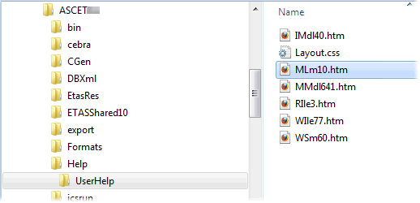

The path of the UserHelp directory and the file names (represented by the macro %ID%) have been entered as External help URL in the ASCET options window.

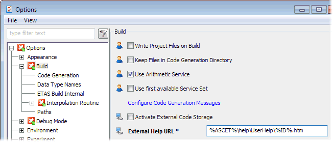

Next, an error occurs. An external help file is available for the respective message ID.

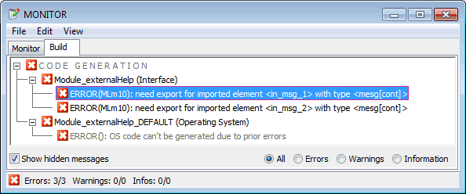

When you right-click the message and select Show external help from the context menu, the external file opens in an appropriate window.

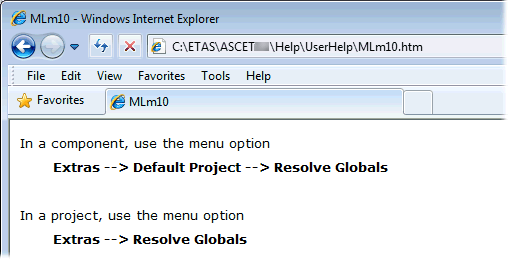

See also

[Using External Help Files](markdown/CM_UseExternalHelpFiles.md)

[ASCET Options Window](markdown/cm_user_interface_of_the_ascet_options_window.md)

---

## Configuring Messages in the Build Tab

_Source: `markdown/CM_ConfigureMessages_BuildTab.md`_

# Configuring Messages in the Build Tab

You can configure code generation messages in the Build tab of the ASCET monitor window. The following configuration possibilities are available:

- [Hiding Messages (Monitor Window)](markdown/Hiding_Messages.md)
- [Showing all Hidden Messages](markdown/Showing_all_Hidden_Messages.md)
- [Promoting Information and Warnings (Monitor Window)](markdown/to_promote_information_and_warnings.md)
- [Revoking a Promotion (Monitor Window)](markdown/To_Revoke_a_Promotion.md)

---

## Hiding Messages (Monitor Window)

_Source: `markdown/Hiding_Messages.md`_

# Hiding Messages (Monitor Window)

You can hide messages of the same identifier to keep the display clearer or to analyze one specific type of message.

Error messages cannot be hidden (even if they are promoted warnings or promoted information).

To hide messages, proceed as follows:

1. Right-click the type of message you want to hide in the Build tab.
1. Select Hide from the context menu.

All messages of the selected type are hidden. The number of messages displayed in the footer of the monitor window is adjusted.

If you hide all information messages and warnings, and no error message occurred, a green symbol () is shown at the left of the footer. The number as well as the colored icons in the status bar indicate there are hidden messages.

See also

[Showing all Hidden Messages](markdown/Showing_all_Hidden_Messages.md)

[Hiding Messages](markdown/Hiding_Messages_Monitor_Window.md)

---

## Showing all Hidden Messages

_Source: `markdown/Showing_all_Hidden_Messages.md`_

# Showing all Hidden Messages (Monitor Window)

You can display all hidden messages again.

- Activate Show hidden messages in the Build tab.

All hidden messages are displayed.

There is no option to show hidden messages of a single identifier. This can only take place in the project-specific CodeGen Message Configuration window.

See also

[Hiding Messages (Monitor Window)](markdown/Hiding_Messages.md)

[Showing Hidden Messages](markdown/Showing_Hidden_Messages.md)

[Configuring Messages in the Configuration Windows](markdown/CM_ConfigMessages_in_ConfigWindows.md)

---

## Promoting Information and Warnings (Monitor Window)

_Source: `markdown/to_promote_information_and_warnings.md`_

# Promoting Information and Warnings (Monitor Window)

1. Right-click the message you want to promote in the Build tab.
1. Do one of the following:

- Select Promote to warning from the context menu.
- Select Promote to error from the context menu.

The messages with the selected identifier are counted as warnings or error messages from the next time code is generated. They are shown accordingly in the Build tab.

Messages promoted in the monitor window are promoted on the project-specific level.

See also

[Promoting Messages](markdown/CM_Promoting_Messages.md)

[Revoking a Promotion](markdown/To_Revoke_a_Promotion.md)

[Promoting Information and Warnings (CodeGen Message Configuration window)](markdown/Promoting_Information_and_Warnings.md)

---

## Revoking a Promotion (Monitor Window)

_Source: `markdown/To_Revoke_a_Promotion.md`_

# Revoking a Promotion (Monitor Window)

If a promoted message is displayed in the Build tab, you can revoke or ignore the promotion. To do so,

1. Right-click a promoted message in the Build tab.
1. To revoke a project-specific promotion, select Revoke Promotion from the context menu.
1. To ignore a global promotion for the current project, select Ignore Global Promotion from the context menu.

Ignore Global Promotion does not affect other projects. To completely revoke a global promotion, you must revoke it in the global CodeGen Message Configuration window.

At the next code generation, messages with the selected identifier are once again displayed in their original form.

See also

[Promoting Information and Warnings](markdown/to_promote_information_and_warnings.md)

[Revoking a Promotion (Configuration Windows)](markdown/Revoking_a_Promotion.md)

[Adjusting the Usage of Global Settings](markdown/CM_AdjustUsageGlobalSettings.md)

---

## Configuring Messages in the Configuration Windows

_Source: `markdown/CM_ConfigMessages_in_ConfigWindows.md`_

# Configuring Messages in the Configuration Windows

Code generation messages can be configured on global or project-specific levels. Proceed as follows:

1. [Open the respective configuration window.](markdown/Opening_the_CodeGen_Message_Configuration_Window.md)
1. [Set up the message display.](markdown/Setting_Up_the_Display.md)
1. [Promote informations and warnings.](markdown/Promoting_Information_and_Warnings.md)
1. [Revoke a promotion.](markdown/Revoking_a_Promotion.md)
1. [Export](markdown/Exporting_the_Settings.md) or [import](markdown/Importing_the_Settings.md) message configuration settings.
1. [Adjust usage of global settings.](markdown/CM_AdjustUsageGlobalSettings.md)
1. [Hide messages.](markdown/Hiding_Messages_Monitor_Window.md)
1. [Show hidden messages.](markdown/Showing_Hidden_Messages.md)

---

## Opening a CodeGen Message Configuration Window

_Source: `markdown/Opening_the_CodeGen_Message_Configuration_Window.md`_

The global CodeGen Message Configuration window can be accessed from the Build node in the ASCET Options window.

1. Open the ASCET options window.
1. Go to the Build node.
1. Follow the Configure Code Generation Messages link.

The global CodeGen Message Configuration window opens.

You can open the project-specific CodeGen Message Configuration window either from the ASCET monitor window or from a project's Project Properties window. The first case is only available if at least one message is displayed in the Build tab.

1. In the ASCET monitor window, right-click the Build tab.
1. Select Settings from the context menu.

Or

1. Open the Project Properties window.
1. Go to the Build node.
1. Follow the Configure Code Generation Messages link.

The project-specific CodeGen Message Configuration window opens.

# Opening a CodeGen Message Configuration Window

Two CodeGen Message Configuration windows are available, one for global message configuration, one for project-specific message configuration.

##### [Opening the global configuration window](javascript:kadovTextPopup(this))<!-- kadovTextPopupInit('a2'); //-->

##### [Opening the project-specific configuration window](javascript:kadovTextPopup(this))<!-- kadovTextPopupInit('a1'); //-->

See also

[CodeGen Message Configuration Window (global)](markdown/CM_CodeGenMessageConfigWindowG.md)

[CodeGen Message Configuration Window (project-specific)](markdown/cm_codegen_message_configuration_window.md)

[Setting Up the Display](markdown/Setting_Up_the_Display.md)

[Hiding Messages](markdown/Hiding_Messages_Monitor_Window.md)

[Build Node (Project Settings)](ProjectEditorEnglishUS.chm::/Build_Options.htm)

[Build Options (ASCET Options)](markdown/cm_build_options.md)

/* Heikki Komulainen, Comet Computer GmbH 2004 */ cc_plus_pic = '&nbsp;'; cc_minus_pic = '&nbsp;'; cc_stat_pic = '&nbsp;'; gpstyle = ''; var iframes_created = 0; if (document.body && document.body.insertAdjacentHTML && document.getElementsByTagName && document.getElementById) { collect_popups(); set_poplinks_pictures(); if (iframes_created) { document.write(gpstyle); document.write('
<nobr><a id="einauslink" style="position:absolute;top:expression(document.body.scrollTop + this.offsetHeight - this.offsetHeight);left:expression(document.body.offsetWidth - (this.offsetWidth + 28));background:white;padding:5px" href="javascript:show_all_poptext()">Alle texte einblenden</a></nobr>
'); } } function collect_popups() { bsscpopups = new Array(); for (x = 0; x < document.links.length; x++) { if (document.links[x].href.indexOf("BSSCPopup")>-1) { seekmatch = /BSSCPopup.'[^'](markdown/+)'/; poplink = seekmatch.exec(document.links[x].href); poplink = "" + poplink; poplink = poplink.substring(poplink.indexOf("'")+1, poplink.lastIndexOf("'")); ifid = "CCGENIFRAMEID" + x; new_iframe = '<iframe id="' + ifid + '"src="' + poplink + '" onload="get_text(\'' + ifid + '\')" width="0" height="0" frameborder=0></iframe>'; document.links[x].parentNode.insertAdjacentHTML("afterEnd", new_iframe); gpid = "CCID_" + ifid; document.links[x].href = "javascript:expand_poptext('" + gpid + "')"; cc_plus = '' + cc_plus_pic + ''; document.links[x].insertAdjacentHTML("afterBegin", cc_plus); iframes_created = 1; } } }// end function function get_text(ifr_id) { frpars = document.frames[ifr_id].document.getElementsByTagName("body"); popbody = frpars[0].innerHTML; gpid = "CCID_" + ifr_id; if (!document.getElementById(gpid)) { //avoiding doubles document.getElementById(ifr_id).insertAdjacentHTML("afterEnd", '
'+popbody+'
'); } }//end function function expand_poptext(x_frame_id) { if (!document.getElementById(x_frame_id)) return; if (document.getElementById(x_frame_id).className == "CCGENPOPTEXTH") { document.getElementById(x_frame_id).className = "CCGENPOPTEXTV"; document.getElementById(x_frame_id).style.visibility = "visible"; if (document.getElementById("CCPMB_" + x_frame_id )) { document.getElementById("CCPMB_" + x_frame_id ).innerHTML = cc_minus_pic; } } else { document.getElementById(x_frame_id).className = "CCGENPOPTEXTH"; document.getElementById(x_frame_id).style.visibility = "hidden"; if (document.getElementById("CCPMB_" + x_frame_id )) { document.getElementById("CCPMB_" + x_frame_id ).innerHTML = cc_plus_pic; } } }// end function function show_all_poptext() { var pulldowntxt = document.getElementsByTagName("div"); for (b = 0; b < pulldowntxt.length; b++) { if (pulldowntxt[b].className == "droptext") { pulldowntxt[b].style.display=""; } } var gptxt = document.getElementsByTagName("div"); for (z = 0; z < gptxt.length; z++) { if (gptxt[z].className == "CCGENPOPTEXTH") { gptxt[z].className = "CCGENPOPTEXTV"; gptxt[z].style.visibility = "visible"; if (document.getElementById("CCPMB_" + gptxt[z].id )) { document.getElementById("CCPMB_" + gptxt[z].id ).innerHTML = cc_minus_pic; } } } var dxpoplinks = document.getElementsByTagName("a"); if (dxpoplinks) { for (pxl = 0; pxl < dxpoplinks.length; pxl++) { if (dxpoplinks[pxl].href.indexOf("kadovTextPopup")>-1) { if (document.getElementById("CCPMB_" + dxpoplinks[pxl].id)) { document.getElementById("CCPMB_" + dxpoplinks[pxl].id).innerHTML = cc_stat_pic; dxpoplinks[pxl].symbol = "minus"; } } } } document.getElementById('einauslink').innerText = 'Alle texte ausblenden'; document.getElementById('einauslink').href = "javascript:self.location.reload()"; self.focus(); }// end function function eat_click() { return false; }// end function function set_poplinks_pictures() { var dpoplinks = document.getElementsByTagName("a"); if (dpoplinks) { for (pl = 0; pl < dpoplinks.length; pl++) { if (dpoplinks[pl].href.indexOf("kadovTextPopup")>-1) { cc_plus = '' + cc_stat_pic + ''; //dpoplinks[pl].onmouseup = plusminuspoplink; dpoplinks[pl].insertAdjacentHTML("afterBegin", cc_plus); dpoplinks[pl].symbol = "plus"; } } } }// end function function plusminuspoplink() { if (document.getElementById("CCPMB_" + this.id)) { if (this.symbol == "plus") { document.getElementById("CCPMB_" + this.id).innerHTML = cc_minus_pic; this.symbol = "minus"; } else { document.getElementById("CCPMB_" + this.id).innerHTML = cc_plus_pic; this.symbol = "plus"; } } return true; }

---

## Setting Up the Display

_Source: `markdown/Setting_Up_the_Display.md`_

# Setting Up the Display

To set up the display of a CodeGen Message Configuration window, proceed as follows:

1. Open a CodeGen Message Configuration window.
1. In the Type field, activate the options of the types of message you want to display in the list field.
1. In the State field, define the display using Normal, Promoted to Warning and Promoted to Error.

The project-specific window offers two additional filter options, Hidden and Global Defined.

This enables you to search for specific groups of messages (only unpromoted information, no hidden information, promoted warnings etc.).

See also

[Opening a CodeGen Message Configuration Window](markdown/Opening_the_CodeGen_Message_Configuration_Window.md)

[Hiding Messages](markdown/Hiding_Messages_Monitor_Window.md)

[Promoting Messages](markdown/CM_Promoting_Messages.md)

---

## Promoting Information and Warnings

_Source: `markdown/Promoting_Information_and_Warnings.md`_

# Promoting Information and Warnings

To promote information and warnings, proceed as follows:

1. [Open a CodeGen Message Configuration window.](markdown/Opening_the_CodeGen_Message_Configuration_Window.md)
1. Select one or more messages you want to promote.
1. From the context menu, select Promote to warning or Promote to error.
1. Close the CodeGen Message Configuration window with OK.

The messages of the type selected are counted as warnings or error messages from the next time code is generated and shown accordingly in the Build tab.

Promoted messages are indicated with special icons in the list field.

| Column 1 | Column 2 |
| --- | --- |
|  | information promoted to a warning |
|  | information promoted to an error message |
|  | warning promoted to an error message |

By default, global message configurations override project-specific message configurations.

See also

[Opening a CodeGen Message Configuration Window](markdown/Opening_the_CodeGen_Message_Configuration_Window.md)

[Setting Up the Display](markdown/Setting_Up_the_Display.md)

[Revoking a Promotion (Configuration Window)](markdown/Revoking_a_Promotion.md)

[Adjusting the Usage of Global Settings](markdown/CM_AdjustUsageGlobalSettings.md)

[Promoting Information and Warnings (Monitor Window)](markdown/to_promote_information_and_warnings.md)

---

## Revoking a Promotion (Configuration Windows)

_Source: `markdown/Revoking_a_Promotion.md`_

# Revoking a Promotion (Configuration Windows)

To revoke a promotion from the global or project-specific CodeGen Message Configuration window, proceed as follows:

1. [Open the respective CodeGen Message Configuration window.](markdown/Opening_the_CodeGen_Message_Configuration_Window.md)
1. Select one or more messages whose promotion you want to revoke.
1. Select Revoke Promotion from the context menu.
1. Close the CodeGen Message Configuration window with OK.

Messages of these types are once again displayed in the Build tab of the ASCET monitor window in their original form during the next code generation.

See also

[Opening a CodeGen Message Configuration Window](markdown/Opening_the_CodeGen_Message_Configuration_Window.md)

[Promoting Information and Warnings](markdown/Promoting_Information_and_Warnings.md)

[Revoking a Promotion (Monitor Window)](markdown/To_Revoke_a_Promotion.md)

---

## Exporting Message Configuration Settings

_Source: `markdown/Exporting_the_Settings.md`_

# Exporting Message Configuration Settings

You can export your message configuration settings to an XML file and you can import this kind of configuration from an XML file. To export the settings, proceed as follows:

1. Open a CodeGen Message Configuration window.
1. Click the  button.

A confirmation window opens.

1. If you do not want the confirmation window to be displayed in future, disable Show next time. (see [Confirmation Dialogs Node](markdown/CM_Options_for_Confirmation_Dialogs.md))
1. Confirm the saving of your changes with OK.

The Windows file selection dialog window opens. *.xml is specified as format.

1. Set path and name of the export file.
1. Click Save.

The message configuration settings are written to the specified XML file.

Project-specific message configuration files contain a group named CodeGenMessageConfiguration, whereas global message configuration files contain a group named ToolSettings and options named Global*.

See also

[Importing Message Configuration Settings](markdown/Importing_the_Settings.md)

[Confirmation Dialog Options](markdown/CM_Options_for_Confirmation_Dialogs.md)

---

## Importing Message Configuration Settings

_Source: `markdown/Importing_the_Settings.md`_

# Importing Message Configuration Settings

To import the message configuration settings, proceed as follows:

1. Open a CodeGen Message Configuration window.
1. Click the  button.

The Windows file selection dialog window opens. *.xml is specified as format.

1. Select the XML file which contains the configuration required.
1. Click Open.

The message configuration settings contained in the XML file are imported and displayed in the CodeGen Message Configuration window and in the monitor window accordingly.

See also

[Opening the CodeGen Message Configuration Window](markdown/Opening_the_CodeGen_Message_Configuration_Window.md)

[Exporting Message Configuration Settings](markdown/Exporting_the_Settings.md)

---

## Adjusting the Usage of Global Settings

_Source: `markdown/CM_AdjustUsageGlobalSettings.md`_

# Adjusting the Usage of Global Settings

By default, global message configurations override project-specific message configurations. However, the project-specific CodeGen Message Configuration window offers the possibility to disable global settings for selected messages.

1. Open the project-specific CodeGen Message Configuration window.
1. Select one or more message with global configuration.
1. Select Ignore Global Definition from the context menu.
1. If desired, promote and/or hide the message.
1. To reactivate the global configuration, select Use Global Definition from the context menu of the message.
1. Close the CodeGen Message Configuration window with OK.

See also

[Promoting Messages](markdown/CM_Promoting_Messages.md)

[Promoting Information and Warnings](markdown/Promoting_Information_and_Warnings.md)

[CodeGen Message Configuration Window (P)](markdown/cm_codegen_message_configuration_window.md)

[Revoking a Promotion (Monitor Window)](markdown/To_Revoke_a_Promotion.md)

---

## Hiding Messages

_Source: `markdown/Hiding_Messages_Monitor_Window.md`_

# Hiding Messages

Error messages cannot be hidden (even if they are promoted warnings or promoted information).

In the project-specific CodeGen Message Configuration window, you can hide messages. Proceed as follows:

1. Open the project-specific CodeGen Message Configuration window.
1. Select one or more messages you want to hide.
1. Select Hide from the context menu.
1. Close the CodeGen Message Configuration window with OK.

All messages of the selected type are hidden in the Build tab of the monitor window.

The number of messages displayed in the footer of the monitor window is adjusted.

If you hide all error messages and warnings, a green dot is shown at the left of the footer . The number as well as the colored icons in the display field indicate there are hidden messages.

See also

[Showing the Hidden Messages](markdown/Showing_Hidden_Messages.md)

[Opening a CodeGen Message Configuration Window](markdown/Opening_the_CodeGen_Message_Configuration_Window.md)

[Hiding Messages (Monitor Window)](markdown/Hiding_Messages.md)

[Showing all Hidden Messages (Monitor Window)](markdown/Showing_all_Hidden_Messages.md)

---

## Showing Hidden Messages

_Source: `markdown/Showing_Hidden_Messages.md`_

# Showing Hidden Messages

To show all or selected hidden messages, proceed as follows:

1. Open the project-specific CodeGen Message Configuration window.
1. Select one or more hidden messages you want to show.
1. Select Show from the context menu.
1. Close the CodeGen Message Configuration window with OK.

All messages of the selected type are shown in the Build tab of the monitor window.

See also

[Showing all Hidden Messages (Monitor Window)](markdown/Showing_all_Hidden_Messages.md)

[Hiding Messages (CodeGen Message Configuration Window)](markdown/Hiding_Messages_Monitor_Window.md)

[Hiding Messages (Monitor Window)](markdown/Hiding_Messages.md)

[Opening a CodeGen Message Configuration Window](markdown/Opening_the_CodeGen_Message_Configuration_Window.md)

---

## Verifying the ASCET Installation

_Source: `markdown/CM_VerifyASCETinstallation.md`_

# Verifying the ASCET Installation

To verify your ASCET installation, proceed as follows.

1. In the component manager, open the Help menu and select Verify Installation.
1. In the Verify Installation Check message window, do one of the following.

1. Click on the Notepad button to open the log file in the Notepad editor.
1. Click on Close to end the procedure without looking at the log file immediately.

The log file is kept in both cases.

See also

[Example: InstCheck.log](markdown/CM_Example_InstCheck.log.md)

---

## Example: InstCheck.log

_Source: `markdown/CM_Example_InstCheck.log.md`_

# Example: InstCheck.log

The InstCheck.log file generated with Verify Installation contains the following sections:

- [a list of packages for the current product](#packages)
- [a list of ETAS products installed on your machine](#products)
- [the results of the installation verification](#Result)

The following code is an extract from an InstCheck.log file.

Checking installation for: 'ASCET\6.2'

Date: 31.10.2012

Time: 18:27:57

Product Path : c:\ETAS\ASCET6.2\

Data Path : d:\ETASData\ASCET6.2\

Shared Path : c:\ETAS\ASCET6.2\ETASShared10\

Additional info for the current system:

=======================================

Smalltalk packages for current product

--------------------------------------

FEP-z55_Licensing ("V1.0.35")

...

Products and add on products

----------------------------

ASCET\5.2 (V5.2.2)

...

ASCET\6.0 (V6.0.1)

...

ASCET\6.1 (V6.1.3)

...

ASCET\6.2 (V6.2.0-0109)

\ASCET-MD (V6.2.0-0109)

\ASCET-RP (V6.2.0-0109)

\ASCET-RP-VX1121 (V6.2.0-0109)

\ASCET-SCM (V6.2.0-0109)

\ASCET-SE (V6.2.0-0109)

\DeveloperInstallation (V6.2.0-0109)

...

Result from the file check for your product:

============================================

-------------------------------------------------------------------------------

1 File(s) missing in installation:

894656 - 30.06.2011/09:08:00 - C:\ETAS\ASCET6.2\Ascet.bmp

-------------------------------------------------------------------------------

31 File(s) different to installation:

31664 - 24.05.2012/13:40:32 - C:\ETAS\ASCET6.2\ETASInternalOptions.aod.xml

...

-------------------------------------------------------------------------------

3 File(s) not from installation:

0 - 31.10.2012/18:26:36 - c:\ETAS\ASCET6.2\Patchbox\Mn_dummyApp.app

877 - 19.11.2008/11:15:56 - c:\ETAS\ASCET6.2\Patchbox\Mn_dummyApp.txt

0 - 31.10.2012/18:27:13 - c:\ETAS\ASCET6.2\Toolbox\Mn_dummyToolbox.ic

-------------------------------------------------------------------------------

14291 File(s) matching with installation:

3456 - 09.01.2012/16:13:32 - C:\ETAS\ASCET6.2\.exe.config

...

See also

[Verifying the ASCET Installation](markdown/CM_VerifyASCETinstallation.md)

---

## Setting Up the Problem Report Support Function

_Source: `markdown/Setting_Up_the__Problem_Report__Support_Function.md`_

# Setting Up the Problem Report Support Function

To set up the Problem Report support function, proceed as follows:

1. In the Component Manager, open the Tools menu and select Options.

The Options window opens.

1. In the Options node, activate the Send E-Mail option

Thus, the automatic transmission of the e-mail to the ETAS hotline is enabled.

If your mail program is not MAPI-compliant, this function is ignored.

1. If necessary, change the address of the hotline service in the E-Mail Address field.

The current address can be found at [http://www.etas.com/en/hotlines.php](http://www.etas.com/en/hotlines.php).

---

## Sending a Problem Report

_Source: `markdown/Sending_a_Problem_Report.md`_

# Sending a Problem Report

To send a problem report to ETAS, proceed as follows:

1. In the Component Manager, open the Help menu and select Problem Report.
1. Type your description and click OK.
1. Click Yes to send the e-mail, otherwise, click No.

If your mail program is not MAPI-compliant, you have to send the archive file manually, e.g., as an attachment.

See also

[Setting Up the Problem Report Support Function](markdown/Setting_Up_the__Problem_Report__Support_Function.md)

---

## Component Manager Window

_Source: `markdown/CM_DescriptionWindowElement.md`_

# Component Manager - Window Elements

The Component Manager contains the following window elements:

- [Toolbars](markdown/CM_DescriptionControlElement.md)
- [Menu Bar (Component Manager)](markdown/CM_MenuBar_ComponentManager.md)
- [Context Menus (Component Manager)](markdown/cm_contextmenus.md)
- 1 Database or 1 Workspace list

The folders and items contained in the current database or workspace are displayed here. The database/workspace name is the root of the tree structure. Each database/workspace contains one or more folders, which in turn contain other folders and database/workspace items. They are organized and displayed in a hierarchy in the 1 Database or 1 Workspace list.

- 2 Comment field

This field is a text field that contains any notes or internal comments on the currently selected item. Typically, this field is used for developer comments and internal version details. This information is not included in the documentation generated automatically. It is not to be confused with the information entered via the [notes editor](AutomaticDocumentationEnglishUS.chm::/AD_NotesEditorWindow.htm).

You cannot add comments to folders. If you open an existing database/workspace with folder comments, these comments are kept. You can delete exiting comments, but they cannot be changed.

During export (see [Export of Folders and Database/Workspace Items](markdown/ExportingFolders.md)), the content of the 2 Comment field is exported for items. If comments on folders exist, comments on top-level folders are exported, but comments on subfolders are exported only under certain conditions.

- 3 Contents field

This field displays information about the selected folder or database/workspace item in various tabs. The information displayed in the 3 Contents field varies depending on the selection (folder or item) and the type of item. Details are given in [Views in the Component Manager](markdown/ViewsinCM.md).

- status bar

The status bar contains several information, e.g., on filters, the current database/workspace, and the item currently selected in the 1 Database or 1 Workspace list.

See also

[Toolbars](markdown/CM_DescriptionControlElement.md)

[Menu Bar (Component Manager)](markdown/CM_MenuBar_ComponentManager.md)

[Context-Sensitive Menu Options](markdown/ContextSensitiveMenu.md)

[Context Menus (Component Manager)](markdown/cm_contextmenus.md)

[Views in the Component Manager](markdown/ViewsinCM.md)

[Symbols for Database/Workspace Items](markdown/DescriptionofSymbols.md)

[Export of Folders and Database/Workspace Items](markdown/ExportingFolders.md)

[Automatic Documentation - Notes Editor Window](AutomaticDocumentationEnglishUS.chm::/AD_NotesEditorWindow.htm)

---

## Toolbars

_Source: `markdown/CM_DescriptionControlElement.md`_

# Toolbars (Component Manager)

The toolbars in the component manager are divided into the following parts:

- [Default toolbar](#DefaultToolbar)
- [Insert toolbar](#InsertToolbar)
- [Tools toolbar](#ToolsToolbar)
- [Search toolbar](#SearchToolbar)
- [Navigation toolbar](#NavigationToolbar)

##### Default Toolbar

| Column 1 | Column 2 | Column 3 |
| --- | --- | --- |
| / | New | Opens the Select database or workspace or Select workspace file dialog window, in which you can specify a name for the new database or workspace. The current database/workspace is closed. The new database/workspace is created and opened. |
|  | Open | Opens the Select database or workspace dialog window, in which you can select the database or workspace you want to open. |
|  | Save | Saves all changes to the current database or workspace. |
|  | Cut | Moves the marked items to the clipboard. The items are not deleted immediately: they are deleted when they are pasted from the clipboard to another folder. |
|  | Copy | Copies the marked items to the clipboard. |
|  | Paste | Inserts the items in the clipboard in the current folder. |
|  | Delete | Deletes the marked items. |
|  | Expand | Expands all folders in the 1 Database or 1 Workspace list. |
|  | Collapse | Closes all folders in the 1 Database or 1 Workspace list. |
| / | Import | Opens the Select Import File dialog window, where you can select a file to import and specify import options. |
|  |  | Opens the import type selection menu. Import file can be used to import individual export files of any type, Import directory (see Importing a Directory Content for details) can be used to import all binary export files stored in a directory. |
| / | Export | Opens the Select Export File dialog window, where you can define export format and export settings, and then export the selected database objects. |

[back to top](markdown/CM_DescriptionControlElement.md)

##### Insert Toolbar

| Column 1 | Column 2 | Column 3 |
| --- | --- | --- |
|  | Insert Folder | Inserts a new folder. |
|  | Insert Project | Inserts a new project in the current folder. |
|  | Insert Module - <module type> | Inserts a new module in the current folder. The module type was previously selected via the button |
|  |  | Opens the module type selection menu. |
|  | Insert Class- <class type> | Inserts a new class in the current folder. The class type was previously selected via the button. |
|  |  | Opens the class type selection menu. |
|  | Insert Statemachine | Inserts a state machine in the current folder. |
|  | Insert Enumeration | Inserts an enumeration in the current folder. |
|  | Insert Record | Inserts a record in the current folder. |
|  | Insert Container | Inserts a container in the current folder. |

[back to top](markdown/CM_DescriptionControlElement.md)

##### Tools Toolbar

| Column 1 | Column 2 | Column 3 |
| --- | --- | --- |
|  | Edit Views | Opens the Views window. |
|  | Options | Opens the Options dialog window. |
|  | Open Online Help | Opens the ASCET Online Help. |

[back to top](markdown/CM_DescriptionControlElement.md)

##### Search Toolbar

| Column 1 | Column 2 | Column 3 |
| --- | --- | --- |
|  | Search - <criterion> | Searches the database for a search string, using a defineable search criterion. The search criterion was previously selected via the button |
|  |  | The arrow can be used to select the search criterion. |
|  |  | Input field for the search string |

[back to top](markdown/CM_DescriptionControlElement.md)

##### Navigation Toolbar

| Column 1 | Column 2 | Column 3 |
| --- | --- | --- |
|  | Back | Goes to the previous item that was opened during the current ASCET session. |
|  | Forward | Goes to the next item that was opened during the current ASCET session. |
|  |  | input field for the database/workspace path of an item |
|  | Go to | Goes to the item specified in the input field. |

[back to top](markdown/CM_DescriptionControlElement.md)

You can

[Create a Database](markdown/BasicTasks.md)

[Create a Workspace](markdown/CM_CreateWorkspace.md)

[Load a Database](markdown/cm_loaddatabase.md)

[Load a Workspace](markdown/cm_loadworkspace.md)

[Save the current Database/Workspace](markdown/SaveDatabase.md)

[Manage Database/Workspace Items](markdown/ManagingDatabaseItems.md)

[Export a Folder or Database/Workspace Item](markdown/SingleExport.md)

[I](markdown/CM_Importing_from_AMD_AXL_Files.md)mport from AMD/AXL Files

[Import from Binary Export Files](markdown/CM_ImportBinaryFiles.md)

[Import from ARXML or A2L Files](markdown/CM_Import_ARXML_or_A2L_Files.md)

---

## Symbols for Database/Workspace Items

_Source: `markdown/DescriptionofSymbols.md`_

# Symbols for Database/Workspace Items

The following symbols are used to denote the various database/workspace items:

| Column 1 | Column 2 |
| --- | --- |
|  | database |
|  | workspace |
|  | project |
| / / | module as block diagram / ESDL / C code |
|  | software component |
| / / | class as block diagram / ESDL / C code |
|  | Boolean table |
|  | conditional table |
|  | CT block |
|  | state machine |
|  | enumeration |
|  | mode group |
|  | record |
| / / / | AUTOSAR interfaces: SenderReceiver / ClientServer / Calibration / NVData |
|  | icon |
|  | signal |
|  | container |
|  | ASAM-MCD-2MC project |
|  | hardware configuration (only relevant for ASCET-RP) |
| / | hardware description file (only relevant for ASCET-RP) |

See also

[Database/Workspace Items](markdown/DatabaseItems.md)

[Managing Database/Workspace Items](markdown/ManagingDatabaseItems.md)

[References on Items](markdown/ReferencesonItems.md)

[Editing](markdown/CM_editing.md)

[Find and Replace in C Code and ESDL Components](markdown/FindReplace.md)

[Copying Database/Workspace Items and Structures](markdown/copying_databaseitems.md)

---

## Menus

_Source: `markdown/CM_MenuBar_ComponentManager.md`_

# Menu Bar (Component Manager)

This menu bar contains the following menus:

- [File](markdown/CM_DescriptionMenuOptions.md)
- [Edit](markdown/CM_EditMenu.md)
- [View](markdown/CM_ViewMenu_ComponentManager.md)
- [Insert](markdown/CM_InsertMenu.md)
- [Build](markdown/CM_BuildMenu.md)
- [Tools](markdown/CM_ToolsMenu.md)
- [Enumeration](markdown/CM_EnumerationMenu.md) (only visible if an enumeration is selected in the 1 Database or 1 Workspace list)
- [Mode](markdown/CM_ModeMenu.md) (only visible if a mode group is selected in the 1 Database or 1 Workspace list)
- [Help](markdown/CM_Help.md)

See also

[Context-Sensitive Menu Options](markdown/ContextSensitiveMenu.md)

---

## File Menu (Component Manager)

_Source: `markdown/CM_DescriptionMenuOptions.md`_

# File Menu (Component Manager)

This menu contains the following options:

New Database (Ctrl + n)

Opens the Select database or workspace dialog window, in which you can specify a folder and name for the new database. The current database or workspace is closed. The new database is created and opened.

New Workspace (Ctrl + Shift + n)

Opens the Select workspace file dialog window, in which you can specify a name for the new workspace. The current database/workspace is closed. The new workspace is created and opened.

Open (Ctrl + o)

Opens the Select database or workspace dialog window, in which you can select a database/workspace to open.

Close

Closes the current database/workspace.

Save (Ctrl + s)

Saves the changes in the database.

Save As... (Ctrl + Shift + s)

Opens the Save database as dialog window, in which you can select an existing directory, or create a new one, to save the current database. A copy of the current database is saved in the directory. The copy is opened as the current database.

Import (Ctrl + i)

Imports database/workspace items from an export file and shows them in the 1 Database or 1 Workspace list.

Import directory (Ctrl + Shift + i)

Do not use this menu option for directories that contain export files of more than one type. In addition, do not use this menu option for directories that contain AMD or AXL files, even if that is the only export file type in the directory.

Opens the Select Import Directory dialog window, where you can where you can select a directory to import and specify import options.

Export (Ctrl + e)

This function is only available when ASCET-MD is installed. In that case, it is also available as a context menu in the 1 Database or 1 Workspace list.

Exports selected items or entire folders from the 1 Database or 1 Workspace list into one or more export files.

Convert to Workspace

This function is only available when a database is opened in the component manager.

Opens the Database to Workspace Conversion wizard, which converts the current database into a workspace.

1 D:\...\DB

(and other, similar entries)

List of most recently opened databases/workspaces.

Exit (Alt + F4)

Exits ASCET.

You can

[Create a Database](markdown/BasicTasks.md)

[Create a Workspace](markdown/CM_CreateWorkspace.md)

[Convert a Database into a Workspace](markdown/CM_ConvertDatabaseToWorkspace.md)

[Load a Database](markdown/cm_loaddatabase.md)

[Load a Workspace](markdown/cm_loadworkspace.md)

[Save a Database/Workspace](markdown/SaveDatabase.md)

[Export Folders and Database/Workspace Items](markdown/ExportingFolders.md)

[Import Folders and Database/Workspace Items](markdown/ImportFolders.md)

---

## Edit Menu (Component Manager)

_Source: `markdown/CM_EditMenu.md`_

# Edit Menu (Component Manager)

This menu contains the following options:

The functions Cut, Copy, Paste, Delete and Rename are also available as context menus in the 1 Database or 1 Workspace list. Except Find and Query, these functions are only available if ASCET-MD is installed.

Open Component (Return)

Opens a component.

Cut (Ctrl + x)

Cuts the selected item from the database/workspace.

Copy (Ctrl + c)

Copies the selected item to the clipboard.

Paste (Ctrl + v)

Pastes an item from the clipboard to the selected folder.

Delete (Del)

Be careful when using the Delete option in the Edit menu, it cannot be undone.

Finally deletes the selected item(s). When a folder is deleted, all items in the folder are deleted as well.

Rename (F2)

Renames the selected item.

Select all (Ctrl + a)

Selects all items.

Find code (Ctrl + f)

Searches a string in C code or ESDL components.

Find/Replace code (Ctrl + h)

Replaces a string in C code or ESDL components.

Search (Ctrl + q)

Searches the database/workspace from various points of view (see [Browsing the Database or Workspace](markdown/Browsing.md)).

Notes

Edits the notes for an item.

Layout

Edits a component layout.

Show References (Ctrl + r)

Displays the references to a component.

Replace References (Ctrl + Shift + r)

Replace the references to an item.

Become Another Item

Replacement of an item.

Reproduce as

Copies the structure of a component (see [Copying Database/Workspace Items and Structures](markdown/copying_databaseitems.md)).

| Column 1 | Column 2 |
| --- | --- |
| Block Diagram | The item is reproduced as block diagram. |
| C Code | The item is reproduced in C code. |
| ESDL | The item is reproduced in ESDL code. |
| Record | The item is reproduced as record. Only available for classes, Boolean tables, and conditional tables. |
| Sender Receiver Interface | The item is reproduced as SenderReceiver interface. Not available for CT blocks. |
| NVData Interface | The item is reproduced as NVData interface. Not available for CT blocks. |

Create ASCET Link

Creates an ASCET link (see [ASCET Links](IntroductionEnglishUS.chm::/INT_ASCETLinks.htm)) for the folder or item selected in the 1 Database / 1 Workspace list. The link highlights the selected folder or item in the 1 Database / 1 Workspace list.

Add to Block Library

Adds the current item to the Block Library.

Disallow Import (Ctrl + Shift + d)

Disallows overwriting of items during import (see [Disallowing Overwriting of Items](markdown/Disallowoverwriting.md)).

Access Rights (Ctrl + Shift + a)

Changes the access rights of a folder or item.

Password (Ctrl + Shift + p)

Activates and deactivates password protection (only for folders).

See also

[Browsing the Database or Workspace](markdown/Browsing.md)

[Disallowing Overwriting of Items](markdown/Disallowoverwriting.md)

[Context-Sensitive Menu Options](markdown/ContextSensitiveMenu.md)

[Find and Replace in C Code and ESDL Components](markdown/FindReplace.md)

You can

[Cut a Folder or Item](markdown/CM_CutInsert.md)

[Copy a Folder or Item](markdown/CopyDatabase.md)

[Insert a Folder or Item](markdown/InsertDatabase.md)

[Delete a Folder or Item](markdown/CM_DeleteCopy.md)

---

## View Menu (Component Manager)

_Source: `markdown/CM_ViewMenu_ComponentManager.md`_

# View Menu (Component Manager)

This menu contains the following options:

Expand all

Expands all folders in the 1 Database or 1 Workspace list.

Collapse all

Closes all folders in the 1 Database or 1 Workspace list.

Filter

Contains menu options for filtering the database items in the 1 Database or 1 Workspace list.

| Column 1 | Column 2 |
| --- | --- |
| < no Filter > | Displays all database/workspace items. |
| Project | Displays projects only. |
| Component | Displays only modules and classes (including state machines, Boolean and conditional tables). |
| Interface | Displays records only. |
| Enumeration | Displays enumerations only. |
| Mode Group | Displays mode groups only. |
| AUTOSAR | Displays AUTOSAR components and interfaces. |
| Icon | Displays icons only. |
| Signal | Displays signals only. |
| Container | Displays containers only. |
| ASAM-2MC Description | Displays ASAM-MCD-2MC projects only. |

Show/Hide

Shows/hides several window elements.

<table style="x-cell-content-align: Top;
				margin-top: 3px;
				border-left-style: Outset;
				border-top-style: Outset;
				border-right-style: Outset;
				border-bottom-style: Outset;
				border-left-width: 1px;
				border-right-width: 1px;
				border-top-width: 1px;
				border-bottom-width: 1px;
				margin-left: 0.636cm;" x-use-null-cells="">
<col/>
<col/>
<col/>
<tr class="hcp1" valign="top">
<td class="hcp2" colspan="2" rowspan="1">

Database List
</td>
<td class="hcp2">

Shows/hides the 1 Database 
 or 1 Workspace list.
</td></tr>
<tr class="hcp1" valign="top">
<td class="hcp2" colspan="2" rowspan="1">

Comment
</td>
<td class="hcp2">

Shows/hides the 2 Comment 
 field.
</td></tr>
<tr class="hcp1" valign="top">
<td class="hcp2" colspan="2" rowspan="1">

Contents
</td>
<td class="hcp2">

Shows/hides the 3 Contents 
 field.
</td></tr>
<tr class="hcp1" valign="top">
<td class="hcp2" colspan="2" rowspan="1">

Monitor
</td>
<td class="hcp2">

Shows/hides the monitor window.
</td></tr>
<tr class="hcp1" valign="top">
<td class="hcp2">

Toolbars 

</td>
<td class="hcp2" colspan="1" rowspan="1">

General

Search

Navigation
</td>
<td class="hcp2">

Shows/hides the respective toolbar.
</td></tr>
</table>

Configure

| Column 1 | Column 2 |
| --- | --- |
| Toolbar General | Select the buttons to be visible in the General toolbar (see Configuring a Toolbar ). The Search and Navigation toolbars cannot be configured. |
| Reset Toolbar Configuration | Resets the General toolbar to its default configuration. |

Update (F5)

Updates the Component Manager.

---

## Insert Menu

_Source: `markdown/CM_InsertMenu.md`_

# Insert Menu

This menu is only available when ASCET-MD is installed. In that case, it is also available as a context menu in the 1 Database or 1 Workspace list.

This menu contains the following options:

Folder (Ctrl + Alt + f)

Adds a new folder.

AUTOSAR

Adds new AUTOSAR items to the current folder.

| Column 1 | Column 2 |
| --- | --- |
| Software Component (Ctrl + Alt + a) | A new AUTOSAR software component is created. |
| SenderReceiver Interface | A new SenderReceiver interface is created. |
| NVData Interface | A new NVData interface is created. |
| Calibration Interface | A new calibration parameter interface is created. |
| ClientServer Interface | A new ClientServer interface is created. |
| Mode Group | A new mode group is created. |

This menu option is only visible when Enable Creation of AUTOSAR components is activated in the ASCET options window (see [Modeling Options](markdown/CM_Modeling_Node.md)).

Project (Ctrl + Alt + p)

Adds a new project to the current folder.

Module

Adds a new module to the current folder.

| Column 1 | Column 2 |
| --- | --- |
| Block Diagram | The new module is created as block diagram. |
| C Code | The new module is created in C code. |
| E SDL | The new module is created in ESDL code. |

Class

Adds a new class to the current folder.

| Column 1 | Column 2 |
| --- | --- |
| Block Diagram | The new class is created as block diagram. |
| ESDL | The new class is created in ESDL code. |
| C Code | The new class is created in C code. |
| Conditional Table | A new conditional table is created ( Conditional Table Editor- Overview ). |
| Boolean Table | A new Boolean table is created ( Boolean Table Editor - Overview ). |

Continuous Time Block

Adds a new Continuous Time block to the current folder.

| Column 1 | Column 2 |
| --- | --- |
| Block Diagram | The new CT block is created as block diagram. |
| C Code | The new CT block is created in C code. |
| E SDL | The new CT block is created in ESDL code. |

State Machine (Ctrl + Alt + s)

Adds a new state machine to the current folder.

Enumeration (Ctrl + Alt + e)

Adds a new enumeration to the current folder.

Record (Ctrl + Alt + r)

Adds a new enumeration to the current folder.

Icon (Ctrl + Alt + i)

Adds a new icon to the current folder.

Signal (Ctrl + Alt + g)

Adds a new signal to the current folder.

Container (Ctrl + Alt + o)

Adds a new container to the current folder.

You can

[Create a Folder](markdown/CreateFolder.md)

[Create an AUTOSAR Software Component](AtomicSoftwareComponentEditorEnglishUS.chm::/ASCcreateAtomicSoftwareComponent.htm)

[Create an AUTOSAR Interface](SenderReceiverEditorEnglishUS.chm::/SREcreateSenderReceiverInterface.htm)

[Create a Project](markdown/Creating_a_Project.md)

[Create a Class](markdown/Creating_Classes.md)

[Create a Continuous Time Block](markdown/Creating_CT_Blocks.md)

[Create a State Machine](markdown/Creating_a_State_Machine.md)

[Create an Enumeration](markdown/CreateEnumeration.md)

[Create a Boolean Table](markdown/Creating_a_Boolean_Table.md)

[Create a Conditional Table](markdown/Creating_a_Conditional_Table.md)

[Create an Icon](markdown/Creating_a_Icon.md)

[Create a Signal](markdown/Creating_a_Signal.md)

[Create a Container](markdown/Creating_a_Container.md)

See also

[Modeling Options](markdown/CM_Modeling_Node.md)

[Conditional Table Editor- Overview](ConditionalTableEditorEnglishUS.chm::/CTab_overview.htm)

[Boolean Table Editor - Overview](BooleanTableEditorEnglishUS.chm::/BT_Overview.htm)

---

## Tools Menu

_Source: `markdown/CM_ToolsMenu.md`_

# Tools Menu (Component Manager)

The Tools menu contains the following options.

##### Documentation

| Column 1 | Column 2 |
| --- | --- |
| Contents | Opens the Documentation Contents window. This is where the items to be documented are selected. |
| Options | Setting options for documentation generation. |

See also: [Automatic Documentation - Overview](AutomaticDocumentationEnglishUS.chm::/AD_Overview.htm)

##### Database

For workspaces, this menu is named Workspace. It contains only the Convert submenu structure.

<table class="hcp1" x-use-null-cells="">
<col style="width: 150px;"/>
<col style="width: 202px;"/>
<col/>
<tr class="hcp2" style="x-cell-content-align: top;" valign="top">
<td class="hcp3" style="width: 150px;" width="150px">

Performance Utilities
</td>
<td class="hcp3" colspan="2" rowspan="1">

Opens the Database Info for: &lt;database&gt; window. It provides four, partly 
 combinable, database administration functions.
</td>
</tr>
<tr class="hcp2" style="x-cell-content-align: top;" valign="top">
<td class="hcp3" colspan="1" rowspan="13" style="width: 150px;" width="150px">

Convert
</td>
<td class="hcp3" colspan="1" rowspan="1" style="width: 202px;" width="202px">

Modify Components to Force Configuration Update
</td>
<td class="hcp3" colspan="1" rowspan="1">

All components are set to modified state, so that 
 the next time a component is accessed, its implementation is checked and—if 
 necessary—adjusted.
</td></tr>
<tr class="hcp2" style="x-cell-content-align: top;" valign="top">
<td class="hcp3" colspan="1" rowspan="1" style="width: 202px;" width="202px">

All Names to ANSI C
</td>
<td class="hcp3" colspan="1" rowspan="1">

All names in the database/workspace are converted 
 to ANSI C.
</td></tr>
<tr class="hcp2" style="x-cell-content-align: top;" valign="top">
<td class="hcp3" colspan="1" rowspan="1" style="width: 202px;" width="202px">

Reserved component names
</td>
<td class="hcp3" colspan="1" rowspan="1">

Converts reserved component names (see <a href="IntroductionEnglishUS.chm::/INT_Reserved_Keywords.htm">Reserved 
 Keywords</a>) to allowed component names. 

Example: A component AUX is renamed to AUX_1. 
</td></tr>
<tr class="hcp2" style="x-cell-content-align: top;" valign="top">
<td class="hcp3" colspan="1" rowspan="1" style="width: 202px;" width="202px">

System Constants to Constants
</td>
<td class="hcp3" colspan="1" rowspan="1">

Converts system constants to constants (see <a href="IntroductionEnglishUS.chm::/INT_summaryke.htm">Kind of Elements 
 - Summary</a>).
</td></tr>
<tr class="hcp2" style="x-cell-content-align: top;" valign="top">
<td class="hcp3" colspan="1" rowspan="1" style="width: 202px;" width="202px">

Variables to Volatile
</td>
<td class="hcp3" colspan="1" rowspan="1">

Assigns the volatile attribute to all variables 
 in the database/workspace (see <a href="markdown/Assign.md">Assigning the Volatile 
 Attribute to All Variables</a>, <a href="ElementEditorEnglishUS.chm::/EEd_element_configuration.htm">Element 
 Configuration</a> and references therein).
</td></tr>
<tr class="hcp2" style="x-cell-content-align: top;" valign="top">
<td class="hcp3" colspan="1" rowspan="1" style="width: 202px;" width="202px">

Parameters to Nonvolatile
</td>
<td class="hcp3" colspan="1" rowspan="1">

Assigns the non-volatile attribute to all parameters 
 in the database/workspace.
</td></tr>
<tr class="hcp2" style="x-cell-content-align: top;" valign="top">
<td class="hcp3" colspan="1" rowspan="1" style="width: 202px;" width="202px">

Components/Elements to Default Memory Location
</td>
<td class="hcp3" colspan="1" rowspan="1">

Inserts the memory location Default into all element 
 implementations in the database/workspace.
</td></tr>
<tr class="hcp2">
<td class="hcp3" colspan="1" rowspan="1" style="width: 202px;" width="202px">

Convert Local messages in SWCs to Interrunnables
</td>
<td class="hcp3" colspan="1" rowspan="1">

Converts messages of local scope in SWC to interrunnable 
 variables (see <a href="AtomicSoftwareComponentEditorEnglishUS.chm::/ASC_InterrunnableVariables.htm">Interrunnable 
 Variables</a>).
</td></tr>
<tr class="hcp2">
<td class="hcp3" style="width: 202px;" width="202px">

Convert all array references/arguments/local variables/returns 
 to variable references
</td>
<td class="hcp3">

Converts all array references/arguments/local 
 variables/returns in the database/workspace to arrays with variable size 
 (see <a href="IntroductionEnglishUS.chm::/INT_VariableSize_ArraysMatrices.htm">Variable 
 Size for Arrays and Matrices</a>).
</td></tr>
<tr class="hcp2">
<td class="hcp3" style="width: 202px;" width="202px">

Convert all matrix references/arguments/local variables/returns 
 to variable references
</td>
<td class="hcp3">

Converts all matrix references/arguments/local 
 variables/returns in the database/workspace to matrices with variable 
 size (see <a href="IntroductionEnglishUS.chm::/INT_VariableSize_ArraysMatrices.htm">Variable 
 Size for Arrays and Matrices</a>).
</td></tr>
<tr style="x-cell-content-align: top;" valign="top">
<td class="hcp3" style="width: 202px;" width="202px">

Convert all old integer types to new integer types 
 where possible
</td>
<td class="hcp3">

Searches all projects and their included components 
 in the database/workspace for scalar, array and matrix elements that use 
 the sdisc or udisc types.

Converts the detected elements to limitInt or 
 wrapInt, if possible. 

See also <a href="markdown/CM_Convert_OldIntTypes_NewIntTypes.md">Converting 
 Old Integer Types to New Integer Types</a>.
</td></tr>
<tr class="hcp2" style="x-cell-content-align: top;" valign="top">
<td class="hcp3" colspan="1" rowspan="1" style="width: 202px;" width="202px">

Operator Implementations to Impl 
 Casts
</td>
<td class="hcp3" colspan="1" rowspan="1">

Replaces existing operator implementations with 
 implementation casts (see <a href="ImplementationEditorEnglishUS.chm::/automatic_conversion_op_impl.htm">Automatic 
 Conversion of Operator Implementations</a>).
</td></tr>
<tr class="hcp2" style="x-cell-content-align: top;" valign="top">
<td class="hcp3" colspan="1" rowspan="1" style="width: 202px;" width="202px">

Reset Operator Implementations
</td>
<td class="hcp3" colspan="1" rowspan="1">

Removes all operator implementations from the 
 database/workspace.
</td></tr>
<tr class="hcp2" style="x-cell-content-align: top;" valign="top">
<td class="hcp3" colspan="1" rowspan="1" style="width: 150px;" width="150px">

Show Operator Implementations
</td>
<td class="hcp3" colspan="2" rowspan="1">

Displays a list of operator implementations in 
 the ASCET monitor window.
</td>
</tr>
<tr class="hcp2" style="x-cell-content-align: top;" valign="top">
<td class="hcp3" colspan="1" rowspan="1" style="width: 150px;" width="150px">

Compare Database
</td>
<td class="hcp3" colspan="2" rowspan="1">

Compares the current database with a selected 
 second database.
</td>
</tr>
<tr class="hcp2" style="x-cell-content-align: top;" valign="top">
<td class="hcp3" colspan="1" rowspan="1" style="width: 150px;" width="150px">

Show Unreadable Items 
</td>
<td class="hcp3" colspan="2" rowspan="1">

Lists database items so damaged that they cannot 
 be read by ASCET.
</td>
</tr>
</table>

##### Arithmetic Service Editor

Opens the editor for arithmetic services for the available targets ([Arithmetic Services - Overview](ArithmeticServicesEnglishUS.chm::/AS_Overview.htm)).

| Column 1 | Column 2 |
| --- | --- |
| PC | For the PC target. |
| other targets | Other targets appear if ASCET-RP or ASCET-SE are installed. |

##### Network Settings (Ctrl + Shift + n)

Opens the Network settings for ETAS hardware (Page 1) window, only relevant for ASCET-RP.

##### Views (Ctrl + Shift + v)

Opens the Views window, where views are managed (see [Views](AutomaticDocumentationEnglishUS.chm::/AD_views.htm)).

##### Block Library (Ctrl + Shift + b)

Opens the Block Library Editor window, where block libraries are managed (see [Block Libraries](markdown/CM_BlockLibraries.md)).

##### Options (Ctrl + Shift + o)

Opens the Options window, which allows the setting of various options (see [Setting Up ASCET](markdown/CM_Setting_Up_ASCET.md)).

##### AUTOSAR to ASCET Converter

Opens the A2A Converter dialog window. This converter transforms the ARXML file(s) containing all necessary information describing a software component (i.e. AUTOSAR types, interfaces, software component type) into the AMD format. Afterwards, ASCET imports the AMD files into the active database or workspace.

See also

[Automatic Documentation - Overview](AutomaticDocumentationEnglishUS.chm::/AD_Overview.htm)

[Converting a Database to ANSI C](markdown/ConverttoANSIC.md)

[Reserved Keywords](IntroductionEnglishUS.chm::/INT_Reserved_Keywords.htm)

[Kind of Elements - Summary](IntroductionEnglishUS.chm::/INT_summaryke.htm)

[Assigning the Volatile Attribute to All Variables](markdown/Assign.md)

[Assigning the Non-Volatile Attribute to All Parameters](markdown/non-volatile.md)

[Interrunnable Variables](AtomicSoftwareComponentEditorEnglishUS.chm::/ASC_InterrunnableVariables.htm)

[Variable Size for Arrays and Matrices](IntroductionEnglishUS.chm::/INT_VariableSize_ArraysMatrices.htm)

[Converting Old Integer Types to New Integer Types](markdown/CM_Convert_OldIntTypes_NewIntTypes.md)

[Automatic Conversion of Operator Implementations](ImplementationEditorEnglishUS.chm::/automatic_conversion_op_impl.htm)

[Converting Operator Implementations to Implementation Casts](ImplementationEditorEnglishUS.chm::/replace_op_impl.htm)

[Removing Operator Implementations in the Database/Workspace](ImplementationEditorEnglishUS.chm::/remove_op_impl_compo.htm)

[Arithmetic Services - Overview](ArithmeticServicesEnglishUS.chm::/AS_Overview.htm)

[Opening the Arithmetic Services Editor](ArithmeticServicesEnglishUS.chm::/launching_as_editor.htm)

[Views](AutomaticDocumentationEnglishUS.chm::/AD_views.htm)

[Block Libraries](markdown/CM_BlockLibraries.md)

[Setting Up ASCET](markdown/CM_Setting_Up_ASCET.md)

[Setting Options for ASCET](markdown/SettingASCET.md)

For binary databases, see also

[Optimizing a Database](markdown/Optimize.md)

[Database Info Dialog Window](markdown/DatabaseDialog.md)

[Searching for Operator Implementations](ImplementationEditorEnglishUS.chm::/search_op_impl.htm)

[Comparing Two Databases](markdown/CompareTwo.md)

[Searching Unreadable Database Items](markdown/CM_Search_Unreadable_Items.md)

---

## Build  Menu

_Source: `markdown/CM_BuildMenu.md`_

# Build Menu

This menu contains the following options:

Touch All (Ctrl + Shift + t)

All database components are marked as changed. Thus, a compilation of the entire project is enforced.

If you are using [external code storage](ProjectEditorEnglishUS.chm::/PE_ExternalCodeStorage.htm), all stored code files of the current database/workspace become invalid. They are deleted or overwritten during the next code generation run.

Clean All (Ctrl + Shift + c)

This option is only available if you are using a database.

All generated code stored in the database is discarded, except generated code of read-protected components. After the generated code is discarded, the database is [optimized](markdown/Optimize.md).

If you are using [external code storage](ProjectEditorEnglishUS.chm::/PE_ExternalCodeStorage.htm), all stored code files of the current database are deleted immediately.

Clean All (w/o DB optimize) (Ctrl + Shift + r)

All generated code stored in the database or workspace is discarded.

Since generated code of read-protected components is discarded, too, these components become unusable for build purposes and simulation.

If you are using [external code storage](ProjectEditorEnglishUS.chm::/PE_ExternalCodeStorage.htm), all stored code files of the current database/workspace are deleted immediately.

You can

[Force a New Build during Code Generation](markdown/ForceaNewbuild.md)

[Discarding the Generated Code](markdown/DiscardCode.md)

See also

[External Code Storage](ProjectEditorEnglishUS.chm::/PE_ExternalCodeStorage.htm)

[Optimizing a Database](markdown/Optimize.md)

---

## Enumeration Menu

_Source: `markdown/CM_EnumerationMenu.md`_

# Enumeration Menu

The Enumeration menu is only visible if an enumeration is selected in the 1 Database or 1 Workspace list. It is also available as context menu in the 3 Contents field.

This menu contains the following options:

Add Enumeration

Adds a new enumerator at the selected position.

| Column 1 | Column 2 |
| --- | --- |
| Insert | before the selected enumerator |
| Append | in the last row |

Rename

Renames the selected enumerator.

Delete

Deletes the selected enumerator.

---

## Mode Menu

_Source: `markdown/CM_ModeMenu.md`_

# Mode Menu

The Mode menu is only visible if a mode group is selected in the 1 Database or 1 Workspace list. It is also available as context menu in the 3 Contents field.

This menu contains the following options:

Add Mode

Adds a new mode at the selected position.

| Column 1 | Column 2 |
| --- | --- |
| As First | in the first row |
| As Last (Insert) | in the last row |
| Before Selection | before the selected mode |
| After selection | after the selected mode |

Rename

Renames the selected mode.

Delete

Deletes the selected mode.

Shift Up

Moves the selected mode up the list.

Shift Down

Moves the selected mode down the list.

---

## Help Menu

_Source: `markdown/CM_Help.md`_

# Help Menu

This menu contains the following options:

Contents (F1)

Opens the content of the ASCET online help.

Index

Opens the index of the ASCET online help.

Loaded Packages

Displays a list of all installed integration modules (see chapter System Information in the ASCET Getting Started manual) in the monitor window.

Loaded Targets

Displays a list of the installed ASCET-SE targets in the monitor window.

Product Disclaimer

Opens the ETAS ASCET Safety Advice window that contains important safety information in several languages.

This menu option is independent of the Show Disclaimer option in the [Appearance](markdown/cm_gui_options.md) options.

Problem Report

Starts the Problem Report tool ([ETAS Problem Report Support Function](markdown/ETAS__Problem_Report__Support_Function.md)).

About

Opens a window with information on the installed products of the ASCET product family.

Support

Opens a window with the ASCET hotline addresses.

License Info

Opens a window with licensing information (see chapter Licensing in the ASCET installation guide).

Verify Installation

Checks your installation of ASCET (including add-ons, hotfixes, etc.). See also [Verifying the ASCET Installation](markdown/CM_VerifyASCETinstallation.md).

See also

[ETAS Problem Report Support Function](markdown/ETAS__Problem_Report__Support_Function.md)

[Verifying the ASCET Installation](markdown/CM_VerifyASCETinstallation.md)

---

## Context-Sensitive Menu Options

_Source: `markdown/ContextSensitiveMenu.md`_

# Context-Sensitive Menu Options

Some options in the Edit and Component menus have different meanings, depending on the focus.

- [Context-Sensitive Menu Options (Elements Tab)](markdown/ElementTab.md)
- [Context-Sensitive Menu Options (Data Tab)](markdown/DataTab.md)
- [Context-Sensitive Menu Options (Implementation Tab)](markdown/ImplementationTab.md)
- **[C](markdown/CM_ContextSensitive_MenuOptions_MethodsTab.md)**ontext-Sensitive Menu Options (Methods Tab)
- [Context-Sensitive Menu Options (Enumerations Tab)](markdown/DatabaseField.md)

---

## Context-Sensitive Menu Options (Elements Tab)

_Source: `markdown/ElementTab.md`_

# Context-Sensitive Menu Options (Elements Tab)

If the focus is in the Elements tab, some menu options in the Edit menu have special meanings.

The other options of the menu either have the same meaning regardless of the focus or are deactivated.

- Edit Menu

| Column 1 | Column 2 |
| --- | --- |
| Open Component | Opens the Properties editor for the selected element. |
| Copy | C opies the selected elements to the database/workspace clipboard. |
| Paste | Pastes the selected elements from the database/workspace clipboard to the component. |
| Delete | Deletes the selected elements from the component. |
| Rename | Renames the selected element. |

---

## Context-Sensitive Menu Options (Data Tab)

_Source: `markdown/DataTab.md`_

# Context-Sensitive Menu Options (Data Tab)

If the focus is in the Data tab, some menu options in the Edit menu have special meanings.

The other options of the menu either have the same meaning regardless of the focus or are deactivated.

- Edit Menu

| Column 1 | Column 2 |
| --- | --- |
| Open Component | Opens the data editor for the selected element. |
| Copy | Copies the current data of the selected element to the database/workspace clipboard. |
| Paste | Pastes the data from the database/workspace clipboard to the selected element. |
| Delete | Deletes the selected elements from the component. |
| Rename | Renames the selected element. |

1. (item)

---

## Context-Sensitive Menu Options (Implementation Tab)

_Source: `markdown/ImplementationTab.md`_

# Context-Sensitive Menu Options (Implementation Tab)

If the focus is in the Implementation tab, some menu options in the Edit menu have special meanings.

The other options of the menu either have the same meaning regardless of the focus or are deactivated.

- Edit Menu

| Column 1 | Column 2 |
| --- | --- |
| Open Component | Opens the implementation editor for the selected element. |
| Copy | Copies the current implementation of the selected element to the database/workspace clipboard. |
| Paste | Pastes the implementation from the clipboard to the selected element. |
| Delete | Deletes the selected elements from the component. |
| Rename | Renames the selected element. |

---

## Context-Sensitive Menu Options (Methods Tab)

_Source: `markdown/CM_ContextSensitive_MenuOptions_MethodsTab.md`_

# Context-Sensitive Menu Options (Methods Tab)

If the focus is in the Methods tab, some menu options in the Edit menu have special meanings.

The other options of the menu either have the same meaning regardless of the focus or are deactivated.

- Edit Menu Open Component Opens the signature editor for the selected method/process/runnable. Copy Creates a copy of the selected method/process/runnable. Delete Deletes the selected method(s)/process(es)/runnable(s). Rename Renames the selected method/process/runnable.

---

## Context-Sensitive Menu Options (Enumerations / Mode Groups)

_Source: `markdown/DatabaseField.md`_

# Context-Sensitive Menu Options (Enumerations / Mode Groups)

When you select an enumeration or mode group in the 1 Database or 1 Workspace list and then click in the 3 Contents field, some menu options in the Edit menu have special meanings.

The other options of the menu either have the same meaning regardless of the focus or are deactivated.

- Edit Menu

| Column 1 | Column 2 |
| --- | --- |
| Delete | Deletes the selected enumerator or mode from the component. |
| Rename | Renames the selected enumerator or mode. |

---

## Context Menus

_Source: `markdown/cm_contextmenus.md`_

# Context Menus (Component Manager)

The component manager contains the following context menus:

- [in the 1 Database / 1 Workspace list](markdown/cm_contextmenu_databaseworkspacelist.md)
- [in the Folder view](markdown/cm_contextmenu_folderview.md)
- [in the Element view](markdown/cm_contextmenu_elementsview.md)
- [in the Data view](markdown/cm_contextmenu_dataview.md)
- [in the Implementation view](markdown/cm_contextmenu_implementationview.md)
- [in the Methods view](markdown/CM_Methods_View.md)
- [in the Layout view](markdown/cm_contextmenu_layoutview.md)
- [in the Enumeration view](markdown/CM_EnumerationMenu.md)
- [in the Mode Group view](markdown/CM_ModeMenu.md)

---

## Context Menu - Database/Workspace List

_Source: `markdown/cm_contextmenu_databaseworkspacelist.md`_

# Context Menu - Database/Workspace List

The context menu in the 1 Database / 1 Workspace list contains the following options for the [root node](#rootNode), for [folders](#folder) and [database/workspace items](#databaseItem):

## Root Node

Insert

Export

Exports the database/workspace into one or more export files (see [Exporting a Folder or Database/Workspace Item](markdown/SingleExport.md)).

## Folder

Insert with submenus

Same as the [Insert](markdown/CM_InsertMenu.md) menu.

Cut (Ctrl + x)

Not available for top-level folders.

Cuts the selected folder from the database/workspace.

Copy (Ctrl + c)

Copies the selected item to the clipboard.

Paste (Ctrl + v)

Pastes an item from the clipboard to the selected folder.

Delete (Del)

Be careful when using Delete; it cannot be undone.

Finally deletes the folder and all items in the folder.

Rename (F2)

Renames the selected item.

Select all (Ctrl + a)

Selects all items in the 1 Database / 1 Workspace list.

Export (Ctrl + e)

This function is only available when ASCET-MD is installed.

Exports selected items or entire folders from the 1 Database or 1 Workspace list into one or more export files.

Find code (Ctrl + f)

Searches a string in C code or ESDL components.

Find/Replace code (Ctrl + h)

Replaces a string in C code or ESDL components.

Search (Ctrl + q)

Searches the database/workspace from various points of view (see [Browsing the Database or Workspace](markdown/Browsing.md)).

Add to Block Library

Adds the current item to the Block Library.

Disallow Import (Ctrl + Shift + d)

Disallows overwriting of items during import (see [Disallowing Overwriting of Items](markdown/Disallowoverwriting.md)).

Access Rights (Ctrl + Shift + a)

Not available for workspaces.

Changes the access rights of the selected folder (see [Access Rights](markdown/DatabaseAccess.md)).

Flexible Class Layout

Activates/deactivates flexible layout.

| Column 1 | Column 2 |
| --- | --- |
| Activate | for all components in the selected folder |
| Activate recursive | for all components in the selected folder and all its subfolders |
| Deactivate | for all components in the selected folder |
| Deactivate recursive | for all components in the selected folder and all its subfolders |

New Integer Types

Not available for folders.

Password (Ctrl + Shift + p)

Not available for workspaces.

Activates and deactivates password protection for the selected folders.

Create ASCET Link

Creates an [ASCET link](IntroductionEnglishUS.chm::/INT_ASCETLinks.htm) for the selected folder.

## Database/Workspace Item

Open Component (Return)

Not available for containers, enumerations, mode groups, ASAM-MCD 2MC projects.

Opens a component in an appropriate editor.

Insert with submenus

Same as the [Insert](markdown/CM_InsertMenu.md) menu.

Cut (Ctrl + x)

Cuts the selected item from the database/workspace.

Copy (Ctrl + c)

Copies the selected item to the clipboard.

Paste (Ctrl + v)

Pastes an item from the clipboard to the selected folder.

Delete (Del)

Be careful when using Delete; it cannot be undone.

Finally deletes the folder and all items in the folder.

Rename (F2)

Renames the selected item.

Select all (Ctrl + a)

Selects all items in the folder.

Export (Ctrl + e)

This function is only available when ASCET-MD is installed.

Exports selected items from the 1 Database or 1 Workspace list into one or more export files.

Find code (Ctrl + f)

Searches a string in C code or ESDL components.

Find/Replace code (Ctrl + h)

Replaces a string in C code or ESDL components.

Search (Ctrl + q)

Searches the database/workspace from various points of view (see [Browsing the Database or Workspace](markdown/Browsing.md)).

Notes

Edits the notes for an item.

Layout

Edits a component layout.

Show References (Ctrl + r)

Displays the references to a component.

Replace References (Ctrl + Shift + r)

Replace the references to an item.

Become Another Item

Replacement of an item.

Reproduce as

Copies the structure of a component.

| Column 1 | Column 2 |
| --- | --- |
| Block Diagram | The item is reproduced as block diagram. |
| C Code | The item is reproduced in C code. |
| ESDL | The item is reproduced in ESDL code. |
| Record | The item is reproduced as record. Only available for classes, Boolean tables, and conditional tables. |
| Sender Receiver Interface | The item is reproduced as SenderReceiver interface. Not available for CT blocks. |
| NVData Interface | The item is reproduced as NVData interface. Not available for CT blocks. |

Add to Block Library

Adds the current item to the Block Library.

Disallow Import (Ctrl + Shift + d)

Disallows overwriting of items during import (see [Disallowing Overwriting of Items](markdown/Disallowoverwriting.md)).

Access Rights (Ctrl + Shift + a)

Not available for workspaces.

Changes the access rights of the selected item (see [Access Rights](markdown/DatabaseAccess.md)).

Flexible Class Layout

Activates/deactivates flexible layout.

| Column 1 | Column 2 |
| --- | --- |
| Activate | for the selected component |
| Activate recursive | for the selected component and all its referenced components |
| Deactivate | for the selected component |
| Deactivate recursive | for the selected component and all its referenced components |

New Integer Types

Converts existing elements of sdisc and udisc type to the new integer types [limitInt](IntroductionEnglishUS.chm::/INT_ScalarTypes_LimitedInteger.htm) and [wrapInt](IntroductionEnglishUS.chm::/INT_ScalarTypes_WrapAroundInteger.htm) (see [Converting Old Integer Types to New Integer Types](markdown/CM_Convert_OldIntTypes_NewIntTypes.md)).

| Column 1 | Column 2 |
| --- | --- |
| Convert Selection | Converts elements in the selected component. Only available for non-project components. |
| Convert Recursive | Converts elements in the selected project and the components directly or indirectly referenced by the selected project. Only available for project. |

Create ASCET Link

Creates an [ASCET link](IntroductionEnglishUS.chm::/INT_ASCETLinks.htm) that highlights the selected item in the 1 Database / 1 Workspace list.

---

## Context Menu - Folder View

_Source: `markdown/cm_contextmenu_folderview.md`_

# Context Menu - Folder View

The context menu in the [Folder](markdown/Folder_View.md) view contains the following options:

##### Edit (Return)

Not available for containers, enumerations, mode groups, ASAM-MCD 2MC projects.

Opens a component in an appropriate editor.

##### Rename (F2)

Renames the selected item.

##### Delete (Del)

Be careful when using Delete; it cannot be undone.

Finally deletes the folder and all items in the folder.

##### Sort by

The submenus Name, Type, Date, Access, Specification allow to sort the view.

##### Select all (Ctrl + a)

Selects all items in the folder.

---

## Context Menu - Elements View

_Source: `markdown/cm_contextmenu_elementsview.md`_

# Context Menu - Element View

The context menu in the [Element](markdown/The_Element_View.md) view contains the following options:

##### Edit (Return)

Opens the Properties editor for the selected element.

##### Copy (Ctrl + c)

Copies the selected element to the clipboard.

##### Paste (Ctrl + v)

Pastes an element from the clipboard to the selected component.

##### Delete (Del)

Be careful when using Delete; it cannot be undone.

Deletes the selected elements from the component.

##### Rename (F2)

Renames the selected element.

##### Create ASCET Link

Creates an ASCET link (see [ASCET Links](IntroductionEnglishUS.chm::/INT_ASCETLinks.htm)) for the selected element. The link highlights the component that contains the element in the 1 Database/1 Workspace list and selects the element in the Elements tab.

##### Select all (Ctrl + a)

Selects all elements in the component.

See also

[Element View](markdown/The_Element_View.md)

[Introduction - ASCET Links](IntroductionEnglishUS.chm::/INT_ASCETLinks.htm)

---

## Context Menu - Data View

_Source: `markdown/cm_contextmenu_dataview.md`_

# Context Menu - Data View

The context menu in the [Data](markdown/Data_View.md) view contains the following options:

##### Edit (Return)

Opens the data editor for the selected element.

##### Copy (Ctrl + c)

Copies the data of the selected element to the clipboard.

##### Paste (Ctrl + v)

Pastes element data from the clipboard to the selected element.

##### Delete (Del)

Not available in the Data view.

##### Rename (F2)

Renames the selected element.

##### Create ASCET Link

Creates an ASCET link (see [ASCET Links](IntroductionEnglishUS.chm::/INT_ASCETLinks.htm)) for the selected element. The link highlights the component that contains the element in the 1 Database/1 Workspace list, selects the element in the Data tab, and selects the data set that was active when the link was created.

##### Select all (Ctrl + a)

Selects all elements in the component.

See also

[Data View](markdown/Data_View.md)

[Introduction - ASCET Links](IntroductionEnglishUS.chm::/INT_ASCETLinks.htm)

---

## Context Menu - Implementation View

_Source: `markdown/cm_contextmenu_implementationview.md`_

# Context Menu - Implementation View

The context menu in the [Implementation](markdown/Implementation_View.md) view contains the following options:

##### Edit (Return)

Opens the data editor for the selected element.

##### Copy (Ctrl + c)

Copies the implementation of the selected element to the clipboard.

##### Paste (Ctrl + v)

Pastes an element implementation from the clipboard to the selected element.

##### Delete (Del)

Not available in the Implementation view.

##### Rename (F2)

Renames the selected element.

##### Create ASCET Link

Creates an ASCET link (see [ASCET Links](IntroductionEnglishUS.chm::/INT_ASCETLinks.htm)) for the selected element. The link highlights the component that contains the element in the 1 Database/1 Workspace list, selects the element in the Implementation tab, and selects the implementation set that was active when the link was created.

##### Select all (Ctrl + a)

Selects all elements in the component.

See also

[Implementation View](markdown/Implementation_View.md)

[Introduction - ASCET Links](IntroductionEnglishUS.chm::/INT_ASCETLinks.htm)

---

## Context Menu - Methods View

_Source: `markdown/cm_contextmenu_methodview.md`_

# Context Menu - Methods View

The context menu in the [Methods view](markdown/CM_Methods_View.md) contains the following options:

##### Edit (Return)

Opens the signature editor for the selected method/process/runnable.

##### Edit Implementation

Opens the implementation editor for the selected method/process/runnable.

##### Copy (Ctrl + c)

Creates a copy of the selected method/process/runnable.

##### Delete (Del)

Be careful when using Delete; it cannot be undone.

Deletes the selected method/process/runnable.

##### Rename (F2)

Renames the selected method/process/runnable.

##### Create ASCET Link

Creates an ASCET link (see [ASCET Links](IntroductionEnglishUS.chm::/INT_ASCETLinks.htm)) for the selected method/process/runnable. The link highlights the component that contains the method/process/runnable in the 1 Database/1 Workspace list and selects the method/process/runnable in the Methods tab.

##### Select all (Ctrl + a)

Selects all methods/processes/runnables in the component.

See also

[Methods View](markdown/CM_Methods_View.md)

---

## Context Menu - Layout View

_Source: `markdown/cm_contextmenu_layoutview.md`_

# Context Menu - Layout View

The context menu in the [Layout](markdown/Layout_View.md) view contains the following options:

##### Edit (Return)

Opens the layout editor for the component.

See also

[Layout View](markdown/Layout_View.md)

---

## Views

_Source: `markdown/cm_views_componentmanager.md`_

# Component Manager Views

The 3 Contents pane shows one of the following views, depending on the item selected in the 1 Database/1 Workspace pane:

- [Folder View](markdown/Folder_View.md)
- [Element View](markdown/The_Element_View.md)
- [Data View](markdown/Data_View.md)
- [Implementation View](markdown/Implementation_View.md)
- [Methods View](markdown/CM_Methods_View.md)
- [Layout View](markdown/Layout_View.md)
- [Container View](ContainerEnglishUS.chm::/CNT_Container_View.htm)
- [Enumeration / Mode Group View](markdown/CM_Enumeration_View.md)
- [Contents View](markdown/CM_Contents_View.md)

---

## Folder View

_Source: `markdown/Folder_View.md`_

# Folder View

When you select the Folder view, the 3 Contents field displays the Components tab. This tab contains the following columns:

- Name

This column contains symbols and names of the items in the selected folder.

- Type

This column contains icons and types of the items in the selected folder.

- Date

This column shows date and time of the last change of the items in the selected folder.

- Access

This column shows the access rights of the items in the selected folder. Missing access rights are denoted by -.

| Column 1 | Column 2 |
| --- | --- |
| R | Read access |
| W | Write access |
| C | Calibration access |
| E | Execute access |
| G | Code Generation access |

The icons in this column show whether a component is read-protected () or not ().

In a workspace, this column always contains the entry " RWCEG".

- Specification

This column shows the specification mode of the components in the selected folder. Possible values are Block Diagram, C Code, ESDL and State Machine. If neither of these is applicable, the column remains empty.

See also

[Views in the Component Manager](markdown/ViewsinCM.md)

[Access Rights](markdown/DatabaseAccess.md)

[Symbols for Database/Workspace Items](markdown/DescriptionofSymbols.md)

---

## Element View

_Source: `markdown/The_Element_View.md`_

# Element View

When you select the Element view, the 3 Contents field displays the Elements tab. This tab contains the following columns:

- Name

This column contains names and kind/scope symbols of the elements in the selected component. For messages, message type symbols are shown instead of kind/scope symbols.

- Type

This column contains types and type symbols of the elements in the selected component. For messages, the type symbol represents the data type of the message (e.g. ,  etc.), not the message type (send, receive, send & receive).

- MaxSize

This column shows the maximal size of an array, matrix or characteristic line/map. For other elements (i.e. one-dimensional elements and included components), the column is crossed out (---).

<table class="hcp2" x-use-null-cells="">
<col/>
<col/>
<col/>
<tr class="hcp3" valign="top">
<td class="hcp4" colspan="2" rowspan="1">

possible values for
</td>
<td class="hcp4" colspan="1" rowspan="2">

description
</td></tr>
<tr class="hcp3" valign="top">
<td class="hcp4">

array
</td>
<td class="hcp4">

matrix
</td>
</tr>
<tr class="hcp3" valign="top">
<td class="hcp4">

[i]
</td>
<td class="hcp4">

[i][j]
</td>
<td class="hcp4">

x size (and y size) set to integer number i (and j)

For characteristic lines/maps, this is the only possibility.
</td></tr>
<tr class="hcp3" valign="top">
<td class="hcp4">

[sysConst_i]
</td>
<td class="hcp4">

[sysConst_i][sysConst_j]
</td>
<td class="hcp4">

x size (and y size) determined by system constant 
 sysConst_i (and sysConst_j)
</td></tr>
<tr class="hcp3" valign="top">
<td class="hcp4">

 
</td>
<td class="hcp4">

[sysConst_i][j] 
 /  
[i][sysConst_j]
</td>
<td class="hcp4">

one size fixed, the other determined by a system 
 constant
</td></tr>
<tr class="hcp3" valign="top">
<td class="hcp4">

[*]
</td>
<td class="hcp4">

[*][*]
</td>
<td class="hcp4">

x size (and y size) variable (see also <a href="IntroductionEnglishUS.chm::/INT_VariableSize_ArraysMatrices.htm">Variable 
 Size for Arrays and Matrices</a>)
</td></tr>
</table>

- Scope

This column shows the scope of the elements. Possible values are:

| Column 1 | Column 2 |
| --- | --- |
| Local | Element can only be used within the defining component. |
| Imported | Element is defined in another component, but can be used in the selected, importing component. |
| Exported | Element is defined in the selected component, can be accessed by other components via import. |
| <method name> | Element is the argument, local variable or return value of method <method name> . |
| <process name> | Element is the local variable of process <process name> . |
| <runnable name> | Element is the local variable of runnable entity <runnable name> . |

- Kind

This column shows the kind of the elements. Possible values are:

| Column 1 | Column 2 |
| --- | --- |
| Constant | Constants store values that can only be read from inside the model. |
| Impl. Cast | Implementation casts provide the ability to specify the implementation at a chosen position of a calculation or a data stream. |
| Method Argument Return Value | The properties of method arguments and return values can be edited only in the signature editor of the method. |
| Parameter | Parameters can only be read from inside the model. They can be calibrated from outside the model. |
| Receive Message | Receive messages (read-only) are used as inputs to a module. |
| Send Message | Send messages (write-only) are used for the results of the computations of a module. |
| Send Receive Message | Send Receive messages can be read and written from inside the model. |
|  | Messages form the input and output variables of processes and are used for inter-process communication. |
| System Constant | System constants are used like constants, but they can be implemented. |
| Variable | Variables can be read and written from inside the model. |
| Reference | Components or complex elements specified as explicit references. |

- Reference

For composite and complex elements, this column shows whether the elements are explicit references (Reference) or not (---).

For method arguments, this column shows the direction (In, Out, InOut).

For imported elements, this column is set to n/a.

- Existence

This column shows whether the elements are real or virtual.

For imported elements, the existence is determined by the exported counterpart; this column is set to n/a. For constants and system constants, the column is crossed out (---).

- Dependency

This column shows whether parameters are independent or dependent. Other elements are always independent.

For imported parameters, the dependency is determined by the exported counterpart; this column is set to n/a. For constants and system constants, the column is crossed out (---).

- Memory

This column shows whether parameters or variables are written to the volatile or nonvolatile memory.

For imported parameters, the memory is determined by the exported counterpart; this column is set to n/a. For constants and system constants, the column is crossed out (---).

- Calibration

This column shows the calibration access (read/write, read only, not Accessible) set for the elements. See also [Calibration Access](ElementEditorEnglishUS.chm::/EEd_CalibrationAccess.htm).

For imported elements, the calibration status is determined by the exported counterpart. This column is set to n/a.

For local elements of methods, processes or runnables, this column is irrelevant; the value is set to ---.

- Unit

This column shows the element unit as specified in the properties editor.

- Comment

This column shows the element comment as specified in the properties editor.

See also

[Views in the Component Manager](markdown/ViewsinCM.md)

---

## Data View

_Source: `markdown/Data_View.md`_

# Data View

When you select the Data view, the 3 Contents field displays the Data tab. This tab contains the following columns and window elements:

- Combo box

The combo box at the top-right corner offers all datasets as defined in the data editor of the selected component. The selected dataset determines the values shown in the Data column.

- Name

This column contains names and kind/scope symbols of the elements in the selected component. For messages, message type symbols are shown instead of kind/scope symbols.

- Type

This column contains types and type symbols of the elements in the selected component. For messages, the type symbol represents the data type of the message (e.g. ,  etc.), not the message type (send, receive, send & receive).

- Data

This column shows the data values for the elements in the selected component, according to the dataset selected in the combo box.

Method arguments, return values, and method-/process-runnable-local variables are displayed in gray, and with n/a in the Data column.

See also

[Views in the Component Manager](markdown/ViewsinCM.md)

[Editing the Data](markdown/Editdata.md)

---

## Implementation View

_Source: `markdown/Implementation_View.md`_

- Implementation View

When you select the Implementation view, the 3 Contents field displays the Implementation tab. This tab contains the following columns and window elements:

- Combo box

Each dimension (X, Y, Value) of a characteristic curve/map is implemented individually. Therefore, each dimension is listed in a separate row in the tab.

- Name

This column contains names and kind/scope symbols of the elements in the selected component. For messages, message type symbols are shown instead of kind/scope symbols.

- Type

This column contains types and type symbols of the elements in the selected component. For messages, the type symbol represents the data type of the message (e.g. ,  etc.), not the message type (send, receive, send & receive).

- Impl. Type

This column contains the implementation data type. If available, [customized data type names](markdown/CM_CustomizeDataTypeNames.md) are shown.

- Impl. Min

This column contains the lower limit of the implementation interval.

- Impl. Max

This column contains the upper limit of the implementation interval.

- Q

This column shows the quantization used in the Quantized Physical Experiment.

- Formula

This column contains the names of the transformation formulas of the elements. Possible values are all available formulas.

- Limit to max bit length

This column shows whether operations are limited in case of overflow. Possible values are:

| Column 1 | Column 2 |
| --- | --- |
| No | no limitation |
| Reduce | limit result and reduce resolution |
| Keep | limit result and do not reduce resolution |
| Auto | overflow handling (keep or reduce resolution) is set automatically |

- Limit Assignment
- Memory Loc. Ref.

This column contains the memory area where the reference is located. Possible values depend on the target selected in the associated project or default project.

- Memory Loc. SR

This column contains the memory area where the distribution search results (see also [Group Table and Distribution](IntroductionEnglishUS.chm::/INT_group_table_and_distribution.htm)) are located. Possible values depend on the target selected in the associated project or default project.

- Memory Segment

In a project context with an ASCET-SE target, this column shows the selected memory segments. See the ASCET-SE user's guide, chapter "Memory Segments", for more information.

In a project context with the ES1135 experimental target, this column shows the current [cache locking](INTECRIOConnectivityRPEnglishUS.chm::/IIO_ES1135CacheLocking.htm) settings.

- (item)

---

## Methods View

_Source: `markdown/CM_Methods_View.md`_

# Methods View

When you select the Methods view, the 3 Contents field displays the Methods tab. This tab contains the following columns:

- Name

This column contains names and symbols of the methods, processes or runnables in the selected component.

- Inlining

Can only be edited for methods and processes.

Indicates whether the method code is inserted directly into the model code (Inlining, Compiler) or not (None), whether a method can be evaluated by the preprocessor (Preprocessor Evaluation), or whether the code generator decides, if and how the method/process is inlined (Automatic).

- Use FPU

Only relevant for micro-controller targets.

Indicates whether the Floating Point Unit registers of the target are used (true) or not (false).

- Memory Location

Only relevant for micro-controller targets.

Names the memory area in which the method/process is located. Possible values depend on the target selected in the associated project or default project.

- Memory Segment

In a project context with an ASCET-SE target, this column shows the selected memory segments. See the ASCET-SE user's guide, chapter "Memory Segments", for more information.

In a project context with the ES1135 experimental target, this column shows the current [cache locking](INTECRIOConnectivityRPEnglishUS.chm::/IIO_ES1135CacheLocking.htm) settings.

See also

[Views in the Component Manager](markdown/ViewsinCM.md)

[Context-Sensitive Menu Options (Methods Tab)](markdown/CM_ContextSensitive_MenuOptions_MethodsTab.md)

---

## Layout View

_Source: `markdown/Layout_View.md`_

# Layout View

When you select the Layout view, the 3 Contents field displays the Layout tab. This tab contains an image of the component layout as it appears when the component is included in another component or project. A double-click in the tab opens the layout editor.

See also

[Views in the Component Manager](markdown/ViewsinCM.md)

[Editing the Layout](markdown/EditLayout.md)

---

## Enumeration / Mode Group View

_Source: `markdown/CM_Enumeration_View.md`_

# Enumeration / Mode Group View

When you select the Enumeration or Mode Group view, the 3 Contents field displays a table with the content of the selected enumeration/mode group. This table contains the following columns:

- Value
- Label or Mode

names of the enumerators or modes

The number of rows depends on the selected enumeration/mode group.

You can

[Add an Enumerator](markdown/add_enumerator.md)

[Edit an Enumerator](markdown/rename_enumerator.md)

[Delete an Enumerator](markdown/delete_enumerator.md)

[Create a Mode Group](SenderReceiverEditorEnglishUS.chm::/SREcreateModeGroup.htm)

[Edit a Mode Group](SenderReceiverEditorEnglishUS.chm::/SREeditModeGroup.htm)

---

## Contents View

_Source: `markdown/CM_Contents_View.md`_

# Contents View

When you select a signal, an icon or an ASAM-MCD-2MC project, the 3 Contents field displays the content of the selected item.

| Column 1 | Column 2 |
| --- | --- |
| Item | Displayed information |
| signal | data source and signal name |
| icon | image or symbol |
| ASAM-MCD-2MC project | basic project information |

---

## ASCET Options Window

_Source: `markdown/cm_user_interface_of_the_ascet_options_window.md`_

# User Interface of the ASCET Options Window

This dialog window is opened with the Tool menu, Options option.

The ASCET Options Window contains the following window elements:

- [File](markdown/cm_file_ascet_options.md) menu
- [View](markdown/cm_viewmenu_ascet_options.md) menu
- At the top left, a filter for the options.
- On the left, a tree view with the option groups as nodes.

The  or  symbol next to a node indicates that the node, or one of its subnodes, contains an invalid option.

- At the top right, the display field for the options of the selected node.

The  icon marks general options, i.e. options specific to the ASCET installation on your workstation.

The  icon marks user-specific options, e.g., settings for diagrams, export/import file paths, etc.

Options with invalid values are indicated by a red overlay icon containing a white X:  and .

- At the bottom right, a short description of the options displayed.

-  Import Options for selected Node from XML File

 Export Options of selected Node into XML File

 System Defaults

 OK

Click OK to close the window. Changes are accepted.

 Cancel

Click OK to close the window. Changes are discarded.

You can

[Set ASCET Options](markdown/SettingASCET.md)

[Export Options](markdown/cm_exporting_options.md)

[Import Options](markdown/cm_import_options.md)

[Filtering Options](markdown/CM_filteroptions.md)

See also

[General Options](markdown/CM_General_Options.md)

[Appearance Options](markdown/cm_gui_options.md)

[Build Options](markdown/cm_build_options.md)

[Environment Options](markdown/CM_Environment_Node.md)

[Experiment Options](markdown/CM_Experiment_Options.md)

[Options for Editors](markdown/cm_options_for_editors.md)

[Hardware Options](markdown/CM_Hardware_Options.md)

[Integration Options](markdown/cm_options_for_integration.md)

[Interfaces Node](markdown/CM_InterfacesNode.md)

[Modeling Options](markdown/CM_Modeling_Node.md)

[Targets Node](markdown/CM_TargetsNode.md)

---

## File Menu (Options Window)

_Source: `markdown/cm_file_ascet_options.md`_

# File Menu (Options Window)

This menu contains the following options:

Import

Imports the options for the selected node from an XML file.

Export

Exports the options of the selected node to an XML file.

---

## View Menu (Options Window)

_Source: `markdown/cm_viewmenu_ascet_options.md`_

# View Menu (Options Window)

This menu contains the following options:

Expand All

The tree view is expanded as far as possible.

Collapse All

The tree view is collapsed as far as possible.

Show/Hide Description

Shows/hides the brief description of the options displayed.

---

## General Options

_Source: `markdown/CM_General_Options.md`_

# General Options

You set a few general options in the top node of the options window, the Options node (see [Setting ASCET Options](markdown/SettingASCET.md)).

##### Multiple user handling

Activates/deactivates user selection.

##### Send E-Mail

Activates/deactivates automatic e-mail transfer.

##### E-Mail Address

Hotline e-mail address; see also [http://www.etas.com/en/hotlines.php](http://www.etas.com/en/hotlines.php).

##### User Actions Buffer Size

Defines the size of the last x user actions that are stored and transmitted on a walkback.

See also

[Working with User Profiles](markdown/WorkingUserProfiles.md)

[Setting ASCET Options](markdown/SettingASCET.md)

---

## Appearance Options

_Source: `markdown/cm_gui_options.md`_

# Appearance Options

In the Appearance node, you set the options which influence the appearance of ASCET or of individual editors.

The following options are available in the Appearance node itself:

##### Show Disclaimer

Activates/deactivates the display of the ETAS ASCET Safety Advice when ASCET is launched.

The option is deactivated automatically when you acknowledge the safety advice upon the first start of a newly installed ASCET.

##### Use Custom Resource Dll

If activated, icons and bitmaps for ASCET are derived from a user-defined DLL file instead of the ASCET resource DLLs.

##### Resource Dll Name

Name of the user-defined DLL file.

The DLL file must be located in the ASCET installation directory.

Other options that influence the ASCET user interface are stored in subnodes.

- [Confirmation Dialogs Options](markdown/CM_Options_for_Confirmation_Dialogs.md)
- [Options for Editors](markdown/cm_options_for_editors.md)
- [Fonts Options](markdown/CM_Fonts_Node.md)
- [Monitor Node](markdown/CM_Monitor_Node.md)
- [Tree Pane Options](markdown/CM_TreePaneOptions.md)
- [Filter Options](markdown/CM_FilterNode_General.md)

---

## Confirmation Dialog Options

_Source: `markdown/CM_Options_for_Confirmation_Dialogs.md`_

Add All Components from Sub Folders to Container

Confirmation window when a folder is dragged onto a container (see [Adding Database/Workspace Items (Drag & Drop)](ContainerEnglishUS.chm::/CNT_add_database_dd.htm) and [Adding Items Via the Container View](ContainerEnglishUS.chm::/CNT_AddItemsViaContainerView.htm)).

Add Component to Library

Confirmation window when a component is automatically added to the block library.

Adjust Acquisition Task(s)

Confirmation window for renaming a task in the OS editor (see [Working on Tasks](ProjectEditorEnglishUS.chm::/PE_Working_on_Tasks.htm), step 3).

All Attributes Get Lost if a Variable is Changed to Import

Confirmation window when the scope of an element is set to Imported (see [Editing the Element Scope](ElementEditorEnglishUS.chm::/EEd_EditElementScope.htm)).

ASCET Link check -Error-

Message window that indicates a syntax error in an ASCET link.

ASCET Link check -Warning-

Message window that indicates a missing target of an ASCET link.

Block not on Raster

Confirmation window for setting the horizontal or vertical size of a graphical block to an odd value.

Change Database Path

Confirmation window for changing the database path when opening a database which is not in the default directory.

Change Workspace Path

Confirmation window for changing the workspace path when opening a workspace which is not in the default directory.

Check Attributes 'Virtual' and 'Non-Virtual'

Message window when you open the properties editor for a variable that is set to both Virtual and Non-volatile. See also [Variables](IntroductionEnglishUS.chm::/INT_variables.htm) and [Opening the Element Editor](ElementEditorEnglishUS.chm::/EEd_open_element_editor.htm).

Close ASCET

Confirmation window when ending ASCET.

Close Boolean Table

Confirmation window when closing a Boolean table with wrong entries.

Close Existing Editor - check context

Confirmation window when an editor is opened again for the same component and the second editor tries to open the component in a different project context.

Confirm: Clean All

Confirmation window when the generated code in the entire database is to be discarded (see [Build Menu](markdown/CM_BuildMenu.md)).

Confirm: Clean All (w/o DB optimize)

Confirmation window when the generated code in the entire database/workspace is to be discarded (see [Build Menu](markdown/CM_BuildMenu.md)).

Confirm: Touch All

Confirmation window when all database/workspace items are to be touched (see [Build Menu](markdown/CM_BuildMenu.md)).

Create new Workspace Folder

Confirmation window when you try to create a new workspace in a non-empty Windows directory (see [Creating a Workspace](markdown/CM_CreateWorkspace.md)).

Customized Data Type Names Changed

Confirmation window when you have changed data type names (see [Customizing Data Type Names](markdown/CM_CustomizeDataTypeNames.md)).

Database size limit exceeded

Confirmation window when a database exceeds the maximum size of 3.5 GB.

Deassign Application Mode <inactive>

Confirmation window when the type of an init task with application mode inactive is changed in the OS editor.

Delete Component

Confirmation window when deleting a component.

Delete Element

Confirmation window when deleting an element.

Delete Formula

Confirmation window when deleting a formula.

Delete Implementation Type

Confirmation window when deleting an implementation type.

Delete Method

Confirmation window when deleting a method or process.

Delete Realized Interface

Confirmation window when deleting a realized ClientServer interface (i.e. a provided ClientServer interface) from an SWC.

Delete Task

Confirmation window when deleting a task.

Edit Element Properties

Determines whether the properties editor opens automatically (Show) for new elements or not (Hide).

Expand Tree Pane for Search

Confirmation window when the search in the Tree pane wants to expand the tree structure in the currently searched tab.

Experiment: Log all

Confirmation window when all elements in an experiment are selected for data logging.

Export Components

Confirmation window during export with activated One File for Each Item option.

Export Message Configuration

Confirmation window when exporting message configurations (see [Build Tab](markdown/BuildTab.md)).

Import Missing Library Items

Confirmation window when a block library shall be imported in the current database/workspace.

Import Options

Confirmation window when importing options.

Import Views

Confirmation window when importing views.

Insert the block?

Confirmation window when inserting a block on a connection in a block diagram.

Keep Attributes from Export if a Variable is changed to Local?

Confirmation window when the scope of an element is switched from Imported to Local or Exported (see [Editing the Element Scope](ElementEditorEnglishUS.chm::/EEd_EditElementScope.htm)).

Keep the connection line?

Confirmation window when removing a block from a connection in a block diagram.

Move code storage files

Confirmation window when changing the path for [external code storage](ProjectEditorEnglishUS.chm::/PE_ExternalCodeStorage.htm).

No components left for replace code

Confirmation window when all C code and ESDL components selected for find/replace are write-protected (see [Find and Replace in C Code and ESDL](markdown/CM_FindReplace_CCode_ESDL.md)).

Open Existing Location

Confirmation window when you try to create a database/workspace with an existing name.

Override INTECRIO Transfer Files

Confirmation window when you try an INTECRIO transfer into an existing directory.

Overwrite Files/Folders in export directory

Confirmation window when exporting into existing directories or files.

Perform Recursive Operation

Confirmation when you activate/deactivate flexible layout (see [Activating/Deactivating Flexible Layout](markdown/Activating_Flexible_Layout.md)) or convert old integer types (see [Converting Old Integer Types to New Integer Types](markdown/CM_Convert_OldIntTypes_NewIntTypes.md)) recursively.

Remove invalid Mappings

Determines whether invalid message or parameter mappings in a software component are kept or removed.

Remove Signal

Confirmation window when a signal assigned to a data generator channel is removed from the data generator.

Replace all occurrences of a block?

Determines whether further occurrences of the block you just replaced shall be replaced as well (see also [Replacing a Diagram Item](BlockDiagramEditorEnglishUS.chm::/ReplaceDiagram.htm)).

Replace code not possible

Confirmation window when you try to change a write-protected C code or ESDL component via find/replace (see [Find and Replace in C Code and ESDL](markdown/CM_FindReplace_CCode_ESDL.md)).

Replace Component All Occurrences

Confirmation window when replacing a graphical element with several occurrences in a block diagram component or state machine.

Replace Component Recursive

Confirmation window when you are replacing an included component (see [Replacing an Included Component](BlockDiagramEditorEnglishUS.chm::/bde_replaceincludedcomponent.htm)).

Replace the block (CT)?

Confirmation window when replacing a graphical element in a CT block.

Replace the block?

Confirmation window when replacing a graphical element in a block diagram component or state machine (see also [Replacing a Diagram Item](BlockDiagramEditorEnglishUS.chm::/ReplaceDiagram.htm)).

Resize Drawing Area

Confirmation window when, upon opening a block diagram, the size of the drawing area is about to be changed.

Save Experiment

Confirmation dialog for saving an experiment when the experiment is quit.

Set Layout to Default

Confirmation dialog when, in the layout editor, you are about to replace a changed component layout with the component's default layout.

Set Options to Default

Confirmation dialog when resetting options.

Set Target Settings to Default

Confirmation window when a project with unknown target or compiler is opened in ASCET.

Start Offline Simulation

Confirmation window when an offline experiment is started and the event generator contains no event.

Statemachine: Check Reinitialize method

Confirmation window when you activate the Reinitialize option for a second method in the same state machine (see [Specifying a Reset Method for State Variables](StateMachineEditorEnglishUS.chm::/SM_SpecifyResetMethod_StateVariables.htm)).

Store Changes in Block Editor

Confirmation window when a CT block in ESDL or C code with unsaved changes is closed.

Store Changes in ESDL and C-Code

Confirmation window when a class or module in ESDL or C code with unsaved changes is closed.

Store Changes in Graphic

Confirmation window when a block diagram with unsaved changes is closed.

Store Changes in Mapping Editor

Determines whether unsaved mapping changes are saved or reverted. See also [Mapping Messages and Parameters](AtomicSoftwareComponentEditorEnglishUS.chm::/ASC_MapMessagesParameters.htm).

Store Changes in Software Component Editor

Confirmation window when a software component with unsaved changes is closed.

Switch Port Type

Confirmation window when you switch a ClientServer port from Provided to Required or vice versa.

Update Realized Interfaces

Confirmation window when you update a ClientServer Pport (see the ASCET AUTOSAR user's guide, chapter 7, for more details).

Variant Size Check

Confirmation window when you close the properties editor of an array or matrix with a system constant of wrong initial value selected as variant size (see [Editing the Configuration of a Composite Element](ElementEditorEnglishUS.chm::/EEd_EditConfiguration_CompositeElement.htm)).

Continue Animation?

Confirmation window when you start the animation of a state machine with at least one state that uses the animation color.

MDF Version number higher than 2.0

Confirmation window when you are about to import a measurement data file that uses an MDF format higher than V2.0.

MDF Version number higher than 2.0 used

Confirmation window when you start an experiment that uses signal data with an MDF format higher than V2.0.

# Confirmation Dialog Options

When working with ASCET, confirmation windows and hint windows are displayed at various points. You can hide these windows, if you like. In the Confirmation Dialogs node of the Options window, you can show hidden confirmation/hint windows ( symbol).

The main purpose of this node is to show confirmation/hint windows you have hidden while working with ASCET.

It is explicitly not recommended to use the node to hide confirmation windows you have not yet seen in the program.

This node contains the following elements:

- [Confirmation Dialogs list](javascript:kadovTextPopup(this))<!-- kadovTextPopupInit('a3'); //-->
- [Hint Dialogs list](javascript:kadovTextPopup(this))<!-- kadovTextPopupInit('a4'); //-->

Each lists contains a table with two columns:

- Dialog - lists the names of the confirmation/hint windows
- Decision - lists the currently active action for each window.

The possible values in the Decision column depend on the confirmation/hint dialog window.

| Column 1 | Column 2 |
| --- | --- |
| Show | Always available; the window is displayed if Show is selected. |
| Yes | Available if the window contains a Yes or Create new button. |
| No | Can be available if the window contains a No or Select other button. |
| OK | Available if the window contains an OK button. |
|  | Yes , No , and OK hide the window; further effects depend on the combination of option name and button. |
| Hide | Available for hint windows and for the automatic opening of the properties editor for new elements. Hide prevents automatic opening of the properties editor. |

| Column 1 | Column 2 |
| --- | --- |
| The confirmation/hint windows are structured as follows. Each window contains a message text, an option and up to three buttons. Possible option names are Remember my Decision , Always save changes and Don't show this hint /message again . Possible buttons are Yes , No , Create new , Select other , OK , Set the flag , Don't set flag , Remove , Keep , Save Changes , Revert Changes , Cancel . |  |

The table summarizes the effects of the combinations of activated/deactivated options and buttons.

<table style="x-cell-content-align: Top;
				margin-top: 3px;
				border-left-style: Outset;
				border-top-style: Outset;
				border-right-style: Outset;
				border-bottom-style: Outset;
				border-left-width: 1px;
				border-right-width: 1px;
				border-top-width: 1px;
				border-bottom-width: 1px;" x-use-null-cells="">
<col/>
<col/>
<col/>
<col/>
<col/>
<col/>
<col/>
<tr class="hcp2" valign="top">
<td class="hcp3" colspan="1" rowspan="3" style="width:20px;" width="20px">

Button name
</td>
<td class="hcp3" colspan="6" rowspan="1">

Option name
</td>
</tr>
<tr class="hcp2" valign="top">
<td class="hcp3" colspan="2" rowspan="1">

Remember my Decision
</td>
<td class="hcp3" colspan="2" rowspan="1">

Always save changes
</td>
<td class="hcp3" colspan="2" rowspan="1">

Don't show this hint again

Don't show this message again
</td>
</tr>
<tr class="hcp2" valign="top">
<td class="hcp3">

activated
</td>
<td class="hcp3">

deactivated
</td>
<td class="hcp3">

activated
</td>
<td class="hcp3">

deactivated
</td>
<td class="hcp3">

activated
</td>
<td class="hcp3">

deactivated
</td></tr>
<tr class="hcp2" valign="top">
<td class="hcp3" colspan="1" rowspan="1" style="width:20px;" width="20px">

Yes
</td>
<td class="hcp3">

now: action performed

next time: performed without question
</td>
<td class="hcp3">

now: action performed

next time: new question
</td>
<td class="hcp3">

now: changes saved

next time: saved without question
</td>
<td class="hcp3">

now: changes saved

next time: new question
</td>
<td class="hcp3">

now: action performed

next time: action performed, no hint
</td>
<td class="hcp3">

now: action performed

next time: new hint
</td></tr>
<tr class="hcp2" valign="top">
<td class="hcp3" colspan="1" rowspan="1" style="width:20px;" width="20px">

No 
</td>
<td class="hcp3">

now: action not performed

next time: not performed without question
</td>
<td class="hcp3">

now: action not performed

next time: new question
</td>
<td class="hcp3">

now: changes not saved

next time: not saved, new question
</td>
<td class="hcp3">

now: changes not saved

next time: new question
</td>
<td class="hcp3">

now: action not performed

next time: not performed, no hint
</td>
<td class="hcp3">

now: action not performed

next time: new hint
</td></tr>
<tr class="hcp2" valign="top">
<td class="hcp3" colspan="1" rowspan="1" style="width:20px;" width="20px">

OK

Create new

Select other

Set the flag

Remove

Subfolders
</td>
<td class="hcp3" colspan="1" rowspan="1">

now: action performed

next time: performed without question
</td>
<td class="hcp3" colspan="1" rowspan="1">

now: action performed

next time: new question
</td>
<td class="hcp3" colspan="1" rowspan="1">

 
</td>
<td class="hcp3" colspan="1" rowspan="1">

 
</td>
<td class="hcp3" colspan="1" rowspan="1">

now: action performed

next time: action performed, no hint
</td>
<td class="hcp3" colspan="1" rowspan="1">

now: action performed

next time: new hint
</td></tr>
<tr class="hcp2" valign="top">
<td class="hcp3" colspan="1" rowspan="1" style="width:20px;" width="20px">

Don't set flag

Keep
</td>
<td class="hcp3" colspan="2" rowspan="1">

now: action not performed

next time: new question
</td>
<td class="hcp3">

 
</td>
<td class="hcp3">

 
</td>
<td class="hcp3">

 
</td>
<td class="hcp3">

 
</td></tr>
<tr class="hcp2" valign="top">
<td class="hcp3" colspan="1" rowspan="1" style="width:20px;" width="20px">

Save
</td>
<td class="hcp3" colspan="1" rowspan="1">

 
</td>
<td class="hcp3" colspan="1" rowspan="1">

 
</td>
<td class="hcp3" colspan="1" rowspan="1">

now: changes saved

next time: saved without question
</td>
<td class="hcp3" colspan="1" rowspan="1">

now: changes saved

next time: new question
</td>
<td class="hcp3" colspan="1" rowspan="1">

 
</td>
<td class="hcp3" colspan="1" rowspan="1">

 
</td></tr>
<tr class="hcp2" valign="top">
<td class="hcp3" colspan="1" rowspan="1" style="width:20px;" width="20px">

Revert
</td>
<td class="hcp3" colspan="1" rowspan="1">

 
</td>
<td class="hcp3" colspan="1" rowspan="1">

 
</td>
<td class="hcp3" colspan="2" rowspan="1">

now: changes reverted

next time: new question
</td>
<td class="hcp3" colspan="1" rowspan="1">

 
</td>
<td class="hcp3" colspan="1" rowspan="1">

 
</td></tr>
<tr class="hcp2" valign="top">
<td class="hcp3" colspan="1" rowspan="1" style="width:20px;" width="20px">

Cancel
</td>
<td class="hcp3" colspan="6" rowspan="1">

now: aborts current activity

next time: new question
</td>
</tr>
</table>

/* Heikki Komulainen, Comet Computer GmbH 2004 */ cc_plus_pic = '&nbsp;'; cc_minus_pic = '&nbsp;'; cc_stat_pic = '&nbsp;'; gpstyle = ''; var iframes_created = 0; if (document.body && document.body.insertAdjacentHTML && document.getElementsByTagName && document.getElementById) { collect_popups(); set_poplinks_pictures(); if (iframes_created) { document.write(gpstyle); document.write('
<nobr><a id="einauslink" style="position:absolute;top:expression(document.body.scrollTop + this.offsetHeight - this.offsetHeight);left:expression(document.body.offsetWidth - (this.offsetWidth + 28));background:white;padding:5px" href="javascript:show_all_poptext()">Alle texte einblenden</a></nobr>
'); } } function collect_popups() { bsscpopups = new Array(); for (x = 0; x < document.links.length; x++) { if (document.links[x].href.indexOf("BSSCPopup")>-1) { seekmatch = /BSSCPopup.'[^'](markdown/+)'/; poplink = seekmatch.exec(document.links[x].href); poplink = "" + poplink; poplink = poplink.substring(poplink.indexOf("'")+1, poplink.lastIndexOf("'")); ifid = "CCGENIFRAMEID" + x; new_iframe = '<iframe id="' + ifid + '"src="' + poplink + '" onload="get_text(\'' + ifid + '\')" width="0" height="0" frameborder=0></iframe>'; document.links[x].parentNode.insertAdjacentHTML("afterEnd", new_iframe); gpid = "CCID_" + ifid; document.links[x].href = "javascript:expand_poptext('" + gpid + "')"; cc_plus = '' + cc_plus_pic + ''; document.links[x].insertAdjacentHTML("afterBegin", cc_plus); iframes_created = 1; } } }// end function function get_text(ifr_id) { frpars = document.frames[ifr_id].document.getElementsByTagName("body"); popbody = frpars[0].innerHTML; gpid = "CCID_" + ifr_id; if (!document.getElementById(gpid)) { //avoiding doubles document.getElementById(ifr_id).insertAdjacentHTML("afterEnd", '
'+popbody+'
'); } }//end function function expand_poptext(x_frame_id) { if (!document.getElementById(x_frame_id)) return; if (document.getElementById(x_frame_id).className == "CCGENPOPTEXTH") { document.getElementById(x_frame_id).className = "CCGENPOPTEXTV"; document.getElementById(x_frame_id).style.visibility = "visible"; if (document.getElementById("CCPMB_" + x_frame_id )) { document.getElementById("CCPMB_" + x_frame_id ).innerHTML = cc_minus_pic; } } else { document.getElementById(x_frame_id).className = "CCGENPOPTEXTH"; document.getElementById(x_frame_id).style.visibility = "hidden"; if (document.getElementById("CCPMB_" + x_frame_id )) { document.getElementById("CCPMB_" + x_frame_id ).innerHTML = cc_plus_pic; } } }// end function function show_all_poptext() { var pulldowntxt = document.getElementsByTagName("div"); for (b = 0; b < pulldowntxt.length; b++) { if (pulldowntxt[b].className == "droptext") { pulldowntxt[b].style.display=""; } } var gptxt = document.getElementsByTagName("div"); for (z = 0; z < gptxt.length; z++) { if (gptxt[z].className == "CCGENPOPTEXTH") { gptxt[z].className = "CCGENPOPTEXTV"; gptxt[z].style.visibility = "visible"; if (document.getElementById("CCPMB_" + gptxt[z].id )) { document.getElementById("CCPMB_" + gptxt[z].id ).innerHTML = cc_minus_pic; } } } var dxpoplinks = document.getElementsByTagName("a"); if (dxpoplinks) { for (pxl = 0; pxl < dxpoplinks.length; pxl++) { if (dxpoplinks[pxl].href.indexOf("kadovTextPopup")>-1) { if (document.getElementById("CCPMB_" + dxpoplinks[pxl].id)) { document.getElementById("CCPMB_" + dxpoplinks[pxl].id).innerHTML = cc_stat_pic; dxpoplinks[pxl].symbol = "minus"; } } } } document.getElementById('einauslink').innerText = 'Alle texte ausblenden'; document.getElementById('einauslink').href = "javascript:self.location.reload()"; self.focus(); }// end function function eat_click() { return false; }// end function function set_poplinks_pictures() { var dpoplinks = document.getElementsByTagName("a"); if (dpoplinks) { for (pl = 0; pl < dpoplinks.length; pl++) { if (dpoplinks[pl].href.indexOf("kadovTextPopup")>-1) { cc_plus = '' + cc_stat_pic + ''; //dpoplinks[pl].onmouseup = plusminuspoplink; dpoplinks[pl].insertAdjacentHTML("afterBegin", cc_plus); dpoplinks[pl].symbol = "plus"; } } } }// end function function plusminuspoplink() { if (document.getElementById("CCPMB_" + this.id)) { if (this.symbol == "plus") { document.getElementById("CCPMB_" + this.id).innerHTML = cc_minus_pic; this.symbol = "minus"; } else { document.getElementById("CCPMB_" + this.id).innerHTML = cc_plus_pic; this.symbol = "plus"; } } return true; }

---

## Options for Editors

_Source: `markdown/cm_options_for_editors.md`_

# Editor Options

In the Editors node, you can make settings for different editors as well as for measure and calibration windows.

##### Global Sort Order

Activates/deactivates the use of a global sort order in the element list of all editors.

##### Mouse Over Info

If activated, element information is shown in the status bar when the mouse is over an element. If deactivated, the status bar shows information on the currently selected element.

##### Word Wrap in Notes

Activates/deactivates line break in the notes editor.

##### Use signed/unsigned discrete types

If deactivated (default), Elements toolbars and palettes in the editors display buttons that create integer elements of the [limitInt](IntroductionEnglishUS.chm::/INT_ScalarTypes_LimitedInteger.htm) and [wrapInt](IntroductionEnglishUS.chm::/INT_ScalarTypes_WrapAroundInteger.htm) types introduced in ASCET V6.4.

If activated, the Elements toolbars and palettes in the editors display buttons that create integer elements of sdisc and udisc types (the only integer types in ASCET V6.3 and older).

##### Toolbar Icon Size (px)

Sets the size of the icons used in toolbars (not in palettes) to 16, 24, or 32 px2.

##### Palette Icon Size (px)

Sets the size of the icons used in palettes (not in toolbars) to 16, 24, or 32 px2.

Settings that belong to a particular editor are stored in subnodes:

- [Block Diagram Options](markdown/cm_options_for_block_diagrams.md)
- [Calibration Node](markdown/CM_Options_for_calibration_windows.md)
- [Component Manager Options](markdown/CM_Options_for_CM.md)
- [Measurement Node](markdown/CM_Options_for_measurement_windows.md)
- [Signal Editor Node](markdown/CM_SignalEditorNode.md)
- [Software Component Node](markdown/CM_Options_for_SWC.md)
- [State Machine Options](markdown/cm_options_for_state_machines.md)
- [Table Options](markdown/CM_options_for_table_editors.md)
- [Text Options](markdown/cm_options_for_text_editors.md)

---

## Block Diagram Options

_Source: `markdown/cm_options_for_block_diagrams.md`_

= Parameter or Constant or System Constant

# Block Diagram Options

The options in the Block Diagram node refer to all block diagrams. Other options that affect all block diagrams are compiled in subnodes:

- [Colors Options](markdown/cm_color_settings.md)
- [Grid Node](markdown/CM_Grid_Node.md)
- [Paper Size Options](markdown/cm_page_layout_node.md)
- [Sequencing Options](markdown/CM_SequencingNode.md)

##### Size of Undo Buffer

Number of working steps in the undo buffer of block diagram and state machine editor.

##### Selection Marker Size (px)

Selection marker size in block diagrams.

##### Connection Lines Corner Radius (px)

Corner radius for rounded corners. 0 means rectangular corners.

##### Display Connection Port Selection Box

When the option is activated, the [Connection popup window](BlockDiagramEditorEnglishUS.chm::/BDE_ConnectionPopupWindow.htm) opens if the connection mode is active and the mouse pointer hovers over the body (not a pin) of a graphical element.

##### Show Watermark

Determines whether the name of the selected view is displayed as a watermark in the block diagram.

##### Watermark Size (px)

Font size of the watermark.

##### Show Page Number

Shows the page number in block diagrams.

##### Show Page Border

Shows the page borders in block diagrams.

##### Show [*](javascript:kadovTextPopup(this))<!-- kadovTextPopupInit('a1'); //--> Values

Shows the values of parameters, constants, or system constants, in block diagrams.

##### Show Missing Pins and Connections

This option affects the pins of complex elements, and lines connected to such pins.

If activated, all pins that are not available anymore and all lines connected to such pins are displayed in red. Otherwise, these pins and lines are removed automatically.

[Example](markdown/CM_Example_ShowMissingPinsConnections.md)

##### Show Overlapping

If activated, overlapping blocks are displayed in a special color in the diagram. The color is set in the [Colors node](markdown/cm_color_settings.md), option Intersection Color.

See also

[Default Block Layout Options](markdown/CM_Default_Block_Layout_Node.md)

[Example: Show Missing Pins and Connections](markdown/CM_Example_ShowMissingPinsConnections.md)

/* Heikki Komulainen, Comet Computer GmbH 2004 */ cc_plus_pic = '&nbsp;'; cc_minus_pic = '&nbsp;'; cc_stat_pic = '&nbsp;'; gpstyle = ''; var iframes_created = 0; if (document.body && document.body.insertAdjacentHTML && document.getElementsByTagName && document.getElementById) { collect_popups(); set_poplinks_pictures(); if (iframes_created) { document.write(gpstyle); document.write('
<nobr><a id="einauslink" style="position:absolute;top:expression(document.body.scrollTop + this.offsetHeight - this.offsetHeight);left:expression(document.body.offsetWidth - (this.offsetWidth + 28));background:white;padding:5px" href="javascript:show_all_poptext()">Alle texte einblenden</a></nobr>
'); } } function collect_popups() { bsscpopups = new Array(); for (x = 0; x < document.links.length; x++) { if (document.links[x].href.indexOf("BSSCPopup")>-1) { seekmatch = /BSSCPopup.'[^'](markdown/+)'/; poplink = seekmatch.exec(document.links[x].href); poplink = "" + poplink; poplink = poplink.substring(poplink.indexOf("'")+1, poplink.lastIndexOf("'")); ifid = "CCGENIFRAMEID" + x; new_iframe = '<iframe id="' + ifid + '"src="' + poplink + '" onload="get_text(\'' + ifid + '\')" width="0" height="0" frameborder=0></iframe>'; document.links[x].parentNode.insertAdjacentHTML("afterEnd", new_iframe); gpid = "CCID_" + ifid; document.links[x].href = "javascript:expand_poptext('" + gpid + "')"; cc_plus = '' + cc_plus_pic + ''; document.links[x].insertAdjacentHTML("afterBegin", cc_plus); iframes_created = 1; } } }// end function function get_text(ifr_id) { frpars = document.frames[ifr_id].document.getElementsByTagName("body"); popbody = frpars[0].innerHTML; gpid = "CCID_" + ifr_id; if (!document.getElementById(gpid)) { //avoiding doubles document.getElementById(ifr_id).insertAdjacentHTML("afterEnd", '
'+popbody+'
'); } }//end function function expand_poptext(x_frame_id) { if (!document.getElementById(x_frame_id)) return; if (document.getElementById(x_frame_id).className == "CCGENPOPTEXTH") { document.getElementById(x_frame_id).className = "CCGENPOPTEXTV"; document.getElementById(x_frame_id).style.visibility = "visible"; if (document.getElementById("CCPMB_" + x_frame_id )) { document.getElementById("CCPMB_" + x_frame_id ).innerHTML = cc_minus_pic; } } else { document.getElementById(x_frame_id).className = "CCGENPOPTEXTH"; document.getElementById(x_frame_id).style.visibility = "hidden"; if (document.getElementById("CCPMB_" + x_frame_id )) { document.getElementById("CCPMB_" + x_frame_id ).innerHTML = cc_plus_pic; } } }// end function function show_all_poptext() { var pulldowntxt = document.getElementsByTagName("div"); for (b = 0; b < pulldowntxt.length; b++) { if (pulldowntxt[b].className == "droptext") { pulldowntxt[b].style.display=""; } } var gptxt = document.getElementsByTagName("div"); for (z = 0; z < gptxt.length; z++) { if (gptxt[z].className == "CCGENPOPTEXTH") { gptxt[z].className = "CCGENPOPTEXTV"; gptxt[z].style.visibility = "visible"; if (document.getElementById("CCPMB_" + gptxt[z].id )) { document.getElementById("CCPMB_" + gptxt[z].id ).innerHTML = cc_minus_pic; } } } var dxpoplinks = document.getElementsByTagName("a"); if (dxpoplinks) { for (pxl = 0; pxl < dxpoplinks.length; pxl++) { if (dxpoplinks[pxl].href.indexOf("kadovTextPopup")>-1) { if (document.getElementById("CCPMB_" + dxpoplinks[pxl].id)) { document.getElementById("CCPMB_" + dxpoplinks[pxl].id).innerHTML = cc_stat_pic; dxpoplinks[pxl].symbol = "minus"; } } } } document.getElementById('einauslink').innerText = 'Alle texte ausblenden'; document.getElementById('einauslink').href = "javascript:self.location.reload()"; self.focus(); }// end function function eat_click() { return false; }// end function function set_poplinks_pictures() { var dpoplinks = document.getElementsByTagName("a"); if (dpoplinks) { for (pl = 0; pl < dpoplinks.length; pl++) { if (dpoplinks[pl].href.indexOf("kadovTextPopup")>-1) { cc_plus = '' + cc_stat_pic + ''; //dpoplinks[pl].onmouseup = plusminuspoplink; dpoplinks[pl].insertAdjacentHTML("afterBegin", cc_plus); dpoplinks[pl].symbol = "plus"; } } } }// end function function plusminuspoplink() { if (document.getElementById("CCPMB_" + this.id)) { if (this.symbol == "plus") { document.getElementById("CCPMB_" + this.id).innerHTML = cc_minus_pic; this.symbol = "minus"; } else { document.getElementById("CCPMB_" + this.id).innerHTML = cc_plus_pic; this.symbol = "plus"; } } return true; }

---

## Colors Options

_Source: `markdown/cm_color_settings.md`_

# Colors Options

The color settings for all kinds of block diagrams are compiled in the options window in the Colors node.

##### Background Color

Background color in the block diagram editor and the project editor, Graphics tab.

##### Grid Color

Color of the grid in block diagrams.

##### Comment Line Color

Color of comment lines in block diagrams or projects.

##### Selection Marker Color

Color of the selection markers for changeable objects in block diagrams.

##### Inactive Selection Marker Color

Color of the selection markers for unchangeable objects in block diagrams.

##### Watermark Color

Color for the watermark, i.e. the name of the view selected.

##### Intersection Color

Color to indicate overlapping diagram elements.

---

## Grid Node

_Source: `markdown/CM_Grid_Node.md`_

# Grid Node

This node contains settings for the grids in block diagram editors.

For the meaning of the options, refer to the descriptions in the Options window.

---

## Paper Size Options

_Source: `markdown/cm_page_layout_node.md`_

In the block diagram editor, open the File menu, then open the Export submenu, then open the Graphics submenu and select Postscript.

# Paper Size Options

This node contains the options which control the printing of block diagrams.

##### Scale EPS Graphic

You can [export a block diagram as an EPS graphic](javascript:kadovTextPopup(this))<!-- kadovTextPopupInit('a1'); //-->. The Scale EPS Graphic option specifies whether the EPS graphic is scaled to the paper size. If deactivated, the EPS may not fit the paper.

##### Drawing Area Size (px)

Size in pixel of the drawing area for block diagrams.

##### Paper Size

Determines the size of the print area. If Userdefined is selected, the size can be adjusted using the following two options.

Possible values: A5 (148x210) / A4 (210x297) / Letter (216x279) / Legal (216x355) / Userdefined

##### User Size Width (mm)

User-defined print area: Width.

##### User Size Height (mm)

User-defined print area: Height.

##### Paper Orientation

Orientation of the print area.

Possible values: Landscape / Portrait

/* Heikki Komulainen, Comet Computer GmbH 2004 */ cc_plus_pic = '&nbsp;'; cc_minus_pic = '&nbsp;'; cc_stat_pic = '&nbsp;'; gpstyle = ''; var iframes_created = 0; if (document.body && document.body.insertAdjacentHTML && document.getElementsByTagName && document.getElementById) { collect_popups(); set_poplinks_pictures(); if (iframes_created) { document.write(gpstyle); document.write('
<nobr><a id="einauslink" style="position:absolute;top:expression(document.body.scrollTop + this.offsetHeight - this.offsetHeight);left:expression(document.body.offsetWidth - (this.offsetWidth + 28));background:white;padding:5px" href="javascript:show_all_poptext()">Show all hidden text</a></nobr>
'); } } function collect_popups() { bsscpopups = new Array(); for (x = 0; x < document.links.length; x++) { if (document.links[x].href.indexOf("BSSCPopup")>-1) { seekmatch = /BSSCPopup.'[^'](markdown/+)'/; poplink = seekmatch.exec(document.links[x].href); poplink = "" + poplink; poplink = poplink.substring(poplink.indexOf("'")+1, poplink.lastIndexOf("'")); ifid = "CCGENIFRAMEID" + x; new_iframe = '<iframe id="' + ifid + '"src="' + poplink + '" onload="get_text(\'' + ifid + '\')" width="0" height="0" frameborder=0></iframe>'; document.links[x].parentNode.insertAdjacentHTML("afterEnd", new_iframe); gpid = "CCID_" + ifid; document.links[x].href = "javascript:expand_poptext('" + gpid + "')"; cc_plus = '' + cc_plus_pic + ''; document.links[x].insertAdjacentHTML("afterBegin", cc_plus); iframes_created = 1; } } }// end function function get_text(ifr_id) { frpars = document.frames[ifr_id].document.getElementsByTagName("body"); popbody = frpars[0].innerHTML; gpid = "CCID_" + ifr_id; if (!document.getElementById(gpid)) { //avoiding doubles document.getElementById(ifr_id).insertAdjacentHTML("afterEnd", '
'+popbody+'
'); } }//end function function expand_poptext(x_frame_id) { if (!document.getElementById(x_frame_id)) return; if (document.getElementById(x_frame_id).className == "CCGENPOPTEXTH") { document.getElementById(x_frame_id).className = "CCGENPOPTEXTV"; document.getElementById(x_frame_id).style.visibility = "visible"; if (document.getElementById("CCPMB_" + x_frame_id )) { document.getElementById("CCPMB_" + x_frame_id ).innerHTML = cc_minus_pic; } } else { document.getElementById(x_frame_id).className = "CCGENPOPTEXTH"; document.getElementById(x_frame_id).style.visibility = "hidden"; if (document.getElementById("CCPMB_" + x_frame_id )) { document.getElementById("CCPMB_" + x_frame_id ).innerHTML = cc_plus_pic; } } }// end function function show_all_poptext() { var pulldowntxt = document.getElementsByTagName("div"); for (b = 0; b < pulldowntxt.length; b++) { if (pulldowntxt[b].className == "droptext") { pulldowntxt[b].style.display=""; } } var gptxt = document.getElementsByTagName("div"); for (z = 0; z < gptxt.length; z++) { if (gptxt[z].className == "CCGENPOPTEXTH") { gptxt[z].className = "CCGENPOPTEXTV"; gptxt[z].style.visibility = "visible"; if (document.getElementById("CCPMB_" + gptxt[z].id )) { document.getElementById("CCPMB_" + gptxt[z].id ).innerHTML = cc_minus_pic; } } } var dxpoplinks = document.getElementsByTagName("a"); if (dxpoplinks) { for (pxl = 0; pxl < dxpoplinks.length; pxl++) { if (dxpoplinks[pxl].href.indexOf("kadovTextPopup")>-1) { if (document.getElementById("CCPMB_" + dxpoplinks[pxl].id)) { document.getElementById("CCPMB_" + dxpoplinks[pxl].id).innerHTML = cc_stat_pic; dxpoplinks[pxl].symbol = "minus"; } } } } document.getElementById('einauslink').innerText = 'Hide all hideable text'; document.getElementById('einauslink').href = "javascript:self.location.reload()"; self.focus(); }// end function function eat_click() { return false; }// end function function set_poplinks_pictures() { var dpoplinks = document.getElementsByTagName("a"); if (dpoplinks) { for (pl = 0; pl < dpoplinks.length; pl++) { if (dpoplinks[pl].href.indexOf("kadovTextPopup")>-1) { cc_plus = '' + cc_stat_pic + ''; //dpoplinks[pl].onmouseup = plusminuspoplink; dpoplinks[pl].insertAdjacentHTML("afterBegin", cc_plus); dpoplinks[pl].symbol = "plus"; } } } }// end function function plusminuspoplink() { if (document.getElementById("CCPMB_" + this.id)) { if (this.symbol == "plus") { document.getElementById("CCPMB_" + this.id).innerHTML = cc_minus_pic; this.symbol = "minus"; } else { document.getElementById("CCPMB_" + this.id).innerHTML = cc_plus_pic; this.symbol = "plus"; } } return true; }

---

## Sequencing Options

_Source: `markdown/CM_SequencingNode.md`_

# Sequencing Options

This node compiles options for sequence calls.

##### Sequence Shift Offset

Offset for the shift of sequence call numbers

##### Sequence Step Size

Step size for the automatic scaling of sequence call numbers

##### Use gaps

Fills the gaps between existing sequence numbers with automatic numbering of sequence calls.

See also

[Sequence Calls](BlockDiagramEditorEnglishUS.chm::/BDE_SequenceCalls.htm)

---

## Calibration Node

_Source: `markdown/CM_Options_for_calibration_windows.md`_

# Calibration Node

In the Calibration node and its subnodes, you determine default settings for calibration windows. These settings, and others, can be changed in the setup for individual calibration windows.

For the meaning of the options, refer to the descriptions in the Options window.

---

## Component Manager Options

_Source: `markdown/CM_Options_for_CM.md`_

# Component Manager Options

In this node, you can make settings for the Component Manager.

- Extended Infos for Components

Activates/deactivates the display of information on access rights in the Component Manager.

##### Missing MD Background Color

Defines the background color of the component manager in case only ASCET-RP or ASCET-SE are installed.

##### Expand Tree to Last Selection

If activated, the folder tree is expanded when a database/workspace opens, and the selected item of the previous session is shown.

##### Recently Opened Files

Sets the number of recently opened databases/workspaces that are accessible via the File menu.

##### Specification Type for Module

Default specification type for modules. The value selected here is pre-set in the Insert Module button.

Possible values: Block Diagram, C Code, ESDL

##### Specification Type for Class

Default specification type for classes. The value selected here is pre-set in the Insert Class button.

Possible values: Block Diagram, C Code, ESDL, Conditional Table, Boolean Table

##### Select Last Used Folder For Replacing Components

If activated, the folder of the selected item is pre-set the next time you replace [references to an item](markdown/ReplaceReferences.md) or [an item](markdown/ReplaceDatabase.md).

See also

[Replacing References to a Database/Workspace Item](markdown/ReplaceReferences.md)

[Replacing a Database/Workspace Item](markdown/ReplaceDatabase.md)

---

## Measurement Node

_Source: `markdown/CM_Options_for_measurement_windows.md`_

# Measurement Node

In the Measurement node and its subnodes, you determine default settings for measurement windows. These settings, and others, can be changed in the setup for individual measurement windows.

For the meaning of the options, refer to the descriptions in the Options window.

---

## Signal Editor Node

_Source: `markdown/CM_SignalEditorNode.md`_

# Signal Editor Node

This node contains options for the ASCET signal editor.

For the meaning of the options, refer to the descriptions in the Options window.

---

## Software Component Node

_Source: `markdown/CM_Options_for_SWC.md`_

# Software Component Node

This node contains options for the software component editor.

For the meaning of the options, refer to the descriptions in the Options window.

---

## State Machine Options

_Source: `markdown/cm_options_for_state_machines.md`_

# State Machine Options

In the Statemachine node, you determine default settings for state machines.

##### Use ESDL as default for state machine

If activated, ESDL is used as default for actions of states and transitions.

##### Animated States Color

Color of animated states in experiments. Setting colors is described in [Specifying Colors](markdown/cm_specify_colors.md).

##### Transition Type

Defines the way transitions are represented in the state diagram. Possible values are Bezier lines, Bezier lines - legacy, Orthogonal rounded lines.

##### Convert Transition Type

If activated, existing transitions are converted to the type selected in Transition Type.

See also

[Specifying Colors](markdown/cm_specify_colors.md)

---

## Table Options

_Source: `markdown/CM_options_for_table_editors.md`_

# Table Options

The options in the Tables node affect the editors for Boolean tables and conditional tables.

##### Input Color

Background color for the input area of a table.

##### Output Color

Background color for the output area of a table.

Setting colors is described in [Specifying Colors](markdown/cm_specify_colors.md).

See also

[Specifying Colors](markdown/cm_specify_colors.md)

---

## Text Options

_Source: `markdown/cm_options_for_text_editors.md`_

# Text Options

The options in the Text node concern the C code and ESDL editor, but not the state or transition editor.

##### Tabulator Size

Size of the tabulator in the text editors.

##### Replace All New Tabs with Blanks

If activated, a newly inserted tab is replaced with blanks automatically. The number of blanks is given in Tabulator Size.

##### Automatic Indentation

Number of blanks to indent new lines.

##### Enable Auto Completion for Local Elements

If activated, names of component elements are completed automatically. This option has no effect on names of included components, arguments, return values and local variables in methods and processes.

##### Enable Folding

Activates/deactivates folding for blocks of code.

##### Insert Closing Brackets Automatically

If activated, closing braces, square brackets and parentheses - }, ], ) - are inserted automatically.

##### Track Source Code Changes

If activated, changed lines are marked with a change bar.

##### Show Line Numbers

If activated, line numbers are shown in the text editor.

##### Show Whitespace

If activated, blanks are made visible.

The Syntax Highlighting subnode contains settings for syntax highlighting in C code and ESDL editors. For the meaning of those options, refer to the descriptions in the Options window.

---

## Fonts Options

_Source: `markdown/CM_Fonts_Node.md`_

# Fonts Options

In the Fonts node, you can select the fonts that are used in the ASCET user interface. Setting fonts is described in [Setting Fonts](markdown/SetFontOption.md).

##### List Font

Font for list entries and text fields.

This option does not apply to C code and ESDL.

##### Text Font

Font for text on the user interface.

##### Edit Font Mapping

Mapping Windows fonts to Postscript fonts. See also [Mapping Fonts](markdown/cm_mapping_fonts.md).

##### BDE Graphical Comments

Font for user comments in block diagrams.

##### BDE Graphical Names

Font for names of graphical elements in block diagrams.

##### Code Font

Font for text in ESDL and C code editors.

---

## Monitor Node

_Source: `markdown/CM_Monitor_Node.md`_

# Monitor Node

This node contains options for the [ASCET monitor window](markdown/MonitorWindow.md).

For the meaning of the options, refer to the descriptions in the Options window.

---

## Tree Pane Options

_Source: `markdown/CM_TreePaneOptions.md`_

# Tree Pane Options

This node contains options for [searching the Tree pane](IntroductionEnglishUS.chm::/INT_SearchTreePane.htm).

##### Start Search from Root Node

If activated, each search starts from the root node of the component.

##### Default Search Mode

Defines the search mode that is preselected upon ASCET start.

Available selections:

| Column 1 | Column 2 |
| --- | --- |
| Simple Mode | Adds wildcards at beginning and end of the search string. |
| Wildcard Mode | Allows the use of wildcards (* and ?) anywhere in the search string. |
| Type-Ahead Mode | Starts the search with the first character you type, and refines the search with each further character. |
| Last used | Keeps the most recent mode. |

The options are also available in the [Search in Tree](IntroductionEnglishUS.chm::/INT_SearchTreeWindow.htm) window. Settings in one of the windows are transferred to the other.

---

## Filter Options

_Source: `markdown/CM_FilterNode_General.md`_

# Filter Options

This node contains links to subnodes with various filter options.

For the meaning of the options in the various subnodes, refer to the descriptions in the Options window.

- Navigation Tree node

This node contains filter options for the Navigation tab in block diagram editors, the state machine editor and the project editor.

- Outline Tree node

- Elements node

This node contains filter options for elements in the Outline tab in component and project editors.

- Methods node

This node contains filter options for methods, processes and runnables in the Outline tab in component and project editors.

---

## Build Options

_Source: `markdown/cm_build_options.md`_

# Build Options

In the Build node, you set options which influence code generation in ASCET.

##### Write Project Files on Build

Determines whether project files are written to the hard disk during code generation.

##### Keep files in Code Generation Directory

Specifies whether the content of the code generation directory ([Code Generation Path](markdown/CM_PathsNode_Build.md) option) is to be retained or deleted when exiting ASCET.

##### Use Arithmetic Service

Activates/deactivates the use of arithmetic services for new projects.

##### Use first available Service set

Assigns the first set of arithmetic services in the file services.ini to new projects.

##### Configure Code Generation Messages

Opens the CodeGen Message Configuration window where you can configure code generation messages on a global level.

##### Activate external code storage

Specifies whether generated code is stored in the database (deactivated, default) or in encrypted files on disk (activated). See also [External Code Storage](ProjectEditorEnglishUS.chm::/PE_ExternalCodeStorage.htm) and references therein.

For workspaces, this option is always activated. This option does not affect the code generation directory selected in [Code Generation Path](markdown/CM_PathsNode_Build.md#CodeGenerationPath).

##### External Help URL

A path or URL for external help file(s) you want to connect to the code generation messages. See also [Using External Help Files](markdown/CM_UseExternalHelpFiles.md).

##### Warning threshold for power of two literals

If the project option [Use power of 2 approximations of literals](ProjectEditorEnglishUS.chm::/fixedpoint.htm#UsePower_of_2_approx) is active, the code generator generates a warning WIle18 if the relative error of the approximation is above the given threshold value.

Further build options are compiled in subnodes:

- [Data Type Names Options](markdown/CM_Options_DataTypeNames.md)
- [Interpolation Routine Node](markdown/CM_InterpolationRoutineNode.md)
- [Paths Options](markdown/CM_PathsNode_Build.md)

See also

[Arithmetic Services - Overview](ArithmeticServicesEnglishUS.chm::/AS_Overview.htm)

[Project Editor - External Code Storage](ProjectEditorEnglishUS.chm::/PE_ExternalCodeStorage.htm)

[Using External Help Files](markdown/CM_UseExternalHelpFiles.md)

---

## Data Type Names Options

_Source: `markdown/CM_Options_DataTypeNames.md`_

# Data Type Name Options

In the Data Type Names node, you can define data type names for the listed data types. The data type names defined here are used in the ASCET user interface and in the code generated for ASCET-SE targets.

Use Customized Data Types Names

This option enables the <data type> fields where you can enter user-defined data type names.

<data type> fields

Set the names for the data types. The standard ASCET data type names are predefined.

See also

[Customizing Data Type Names](markdown/CM_CustomizeDataTypeNames.md)

[Introduction - Data Type Names](IntroductionEnglishUS.chm::/INT_DataTypeNames.htm)

---

## Interpolation Routine Node

_Source: `markdown/CM_InterpolationRoutineNode.md`_

# Interpolation Routine Node

This node contains subnodes for the available interpolation routines. By default, these are Linear and Rounded; if you have added your own interpolation routines (see [User-Defined Interpolation Routines](IntroductionEnglishUS.chm::/INT_UserDefinedInterpolationRoutines.htm)), these are available as well.

For the meaning of the options, refer to the descriptions in the Options window.

---

## Paths Options

_Source: `markdown/CM_PathsNode_Build.md`_

# Paths Options (Build)

This node contains the following path options:

##### Code Generation Path

Target directory for code generation,this is where files generated during code generation are stored.

Default: %ASCET%\CGen (which corresponds to ...\ETAS\ASCET<x.y>\CGen; <x.y> being the ASCET version number)

##### Target Root Path

Target main directory, this is where subdirectories for the different targets are created.

##### Specific Path

Adjustable path for project files.

See also

[Path Macros](markdown/CM_PathMacros.md)

[Setting a Path](markdown/cm_setting_a_path.md)

---

## Environment Options

_Source: `markdown/CM_Environment_Node.md`_

# Environment Options

The Environment node contains the following options:

##### Automatic Save

Activates/deactivates the automatic saving function.

##### Store every ... minutes

Time interval for automatic saving

##### Workspace area

- Workspace Cache Memory Limit (Mbyte)
- Workspace Cache Release Limit (Objects)
- Workspace Memory Limit (MByte)

Defines how much memory the workspace can allocate.

The maximum value depends on the operating system. On a 32 bit OS, the workspace can allocate up to 2048 MByte, on a 64 bit OS, the workspace can allocate up to 4096 MByte.

##### Database area

- Pre Check Database

If activated, the database is checked for corrupted items before Clean All or one of the database performance utilities (see [Optimizing a Database](markdown/Optimize.md)) are executed.

##### GDI Handle Limit

Windows uses handles each time a new window opens. Windows itself does not control the amount of used handles; to prevent system crashes, ASCET needs to limit the amount of used handles itself.

The GDI Handle Limit option allows to set the maximum amount of open GDI handles for ASCET. The value can be between 8000 and 9000; it can differ from machine to machine, depending on the graphical environment. If all handles are used, no further ASCET windows open.

---

## Licensing Options

_Source: `markdown/CM_licensing_options.md`_

# Licensing Options

The Licensing node contains the following options:

##### Activate idle time shutdown

Determines whether ASCET shuts down after an idle period or not.

ASCET is considered idle if no user input occurs and no long operation is running.

##### Idle period [min]

Determines the length of the idle period in minutes.

---

## Paths Options

_Source: `markdown/CM_PathsNode.md`_

# Paths Options (Environment)

This node contains the following options:

##### Database Path

Main ASCET database directory

##### Workspace Path

Main ASCET workspace directory

##### Temp Path

Path used to zip/unzip AXL files or to store other temporary files. May be deleted on each ASCET start.

You can use the Clean Up Temp Path option to determine that this directory is emptied when ASCET starts.

##### Default Export Path

Default export directory.

##### Default Import Path

Default import directory.

##### Documentor Working Path

Working directory for documentation: Target directory for the documentation generated.

##### Clean Up Temp Path

If this option is activated, the Temp Path is emptied when ASCET starts.

See also

[Path Macros](markdown/CM_PathMacros.md)

---

## Experiment Options

_Source: `markdown/CM_Experiment_Options.md`_

# Experiment Options

The Experiment node contains options for offline and online experiments. Options for the integration method for CT blocks are collected in the [CT-Solver](markdown/CM_CTSolverOptions.md) subnode.

##### Initialize Variables at OS Start

Determines whether variables are initialized at each start of the simulation (offline experiment) or the operating system (online experiment).

##### Initialize Parameters at OS Start

Determines whether parameters are initialized at each start of the simulation (offline experiment) or the operating system (online experiment).

##### Activate Monitor Fading

If activated, element monitors that have not changed for a specified time will fade.

##### Monitor Fading Time [sec]

Determines the time element monitors must be unchanged before fading begins. 0 means fading is switched off.

##### Activate Monitor Refresh Delay

If activated, refreshing event monitors is delayed for a specified time.

##### Monitor Minimum Refresh Delay [msec]

The minimum delay for refreshing element monitors. 0 means the delay is switched off.

##### Automatic Monitor Mode

If activated, monitors are assigned to all elements in the currently loaded part (e.g., diagram, hierarchy level, ...) of the block diagram.

---

## CT-Solver Options

_Source: `markdown/CM_CTSolverOptions.md`_

# CT-Solver Options

In the CT-Solver node, you select the default integration method for CT blocks in offline and online experiments.

##### Default Solver

Used to select the [integration method](SpecifyingCTBlocksEnglishUS.chm::/CTB_OverviewIntegrationMethods.htm). Available selections are:

<table style="x-cell-content-align: Top;
				margin-top: 3px;
				border-left-style: Outset;
				border-top-style: Outset;
				border-right-style: Outset;
				border-bottom-style: Outset;
				border-left-width: 1px;
				border-right-width: 1px;
				border-top-width: 1px;
				border-bottom-width: 1px;
				margin-left: 0.886cm;" x-use-null-cells="">
<col/>
<col/>
<tr class="hcp1" valign="top">
<td class="hcp2">

Adams-Moulton 
 2
</td>
<td class="hcp2" colspan="1" rowspan="5">

fixed step size
</td></tr>
<tr class="hcp1" valign="top">
<td class="hcp2">

Euler 
</td>
</tr>
<tr class="hcp1" valign="top">
<td class="hcp2">

Heun
</td>
</tr>
<tr class="hcp1" valign="top">
<td class="hcp2" colspan="1" rowspan="1">

Mulstep 
 2
</td>
</tr>
<tr class="hcp1" valign="top">
<td class="hcp2">

Runge-Kutta 
 4
</td>
</tr>
<tr class="hcp1" valign="top">
<td class="hcp2">

Variable-step Calvo 6(5)
</td>
<td class="hcp2" colspan="1" rowspan="7">

variable step size
</td></tr>
<tr class="hcp1" valign="top">
<td class="hcp2">

Variable-step Dormand/Prince RK5
</td>
</tr>
<tr class="hcp1" valign="top">
<td class="hcp2">

Variable-step Dormand/Prince RK8
</td>
</tr>
<tr class="hcp1" valign="top">
<td class="hcp2">

Variable-step implicit Gear 1
</td>
</tr>
<tr class="hcp1" valign="top">
<td class="hcp2">

Variable-step implicit Gear 2
</td>
</tr>
<tr class="hcp1" valign="top">
<td class="hcp2">

Variable-step implicit RK2
</td>
</tr>
<tr class="hcp1" valign="top">
<td class="hcp2">

Variable-step implicit RK4
</td>
</tr>
</table>

The CT-Solver node contains subnodes for the available solvers. Use these subnodes to determine default settings for the solver parameters. For the meaning of the options, refer to the descriptions in the Options window.

---

## External Tools Node

_Source: `markdown/CM_Options_for_External_Tools.md`_

# External Tools Node

The External Tools node contains options for external tools. Some external tools have separate subnodes (see the list below), e.g., the compilers or the text editor which can be called from the ESDL or C code editor or from the ASCET monitor window. Other options are set directly in the External Tools node.

For the meaning of the options directly in the External Tools node, refer to the descriptions in the Options window.

- [ASCII Editor Options](markdown/CM_ASCII_Editor_Options.md)
- [Compiler Options](markdown/cm_compiler_options.md)
- [EHooks Tool Options](markdown/CM_EHooksToolOptions.md)
- [Operating System Options](markdown/cm_operating_system_node.md)

---

## ASCII Editor Options

_Source: `markdown/CM_ASCII_Editor_Options.md`_

# ASCII Editor Options

Use external ASCII Editor

Activates/deactivates the use of an external text editor.

ASCII Editor

Name and path of the external text editor.

Commandline Arguments

Command line arguments for the external text editor,first argument:file name, second argument:line number.

Begin RegionMarker

Marker for the text editor to identify the beginning of a region.

End RegionMarker

Marker for the text editor to identify the end of a region.

The combo boxes for command line arguments and region markers offer pre-defined values for some text editors.

---

## Compiler Options

_Source: `markdown/cm_compiler_options.md`_

# Compiler Options

The Compiler node contains subnodes for the existing compilers. By default, these are Borland-C V4.5, Borland-C V5.5, GNU-C V3.4.4, MinGW GNU 4.7.2, Microsoft Visual C++ (2 versions) and QCC V6.* (2 versions).

Of these, only the MinGW GNU 4.7.2 compiler is provided with ASCET.

If you install ASCET-RP or ASCET-SE, additional compiler nodes are added.

Most options are available for all compilers, some are compiler-specific. For the meaning of the options, refer to the descriptions in the Options window.

The options of each compiler are stored in a compiler declaration file. This is an XML file named <compiler>.acd.xml. All compiler declaration files are stored in the ASCET<n>\tools\compiler directory (where <n> is the ASCET version number).

---

## EHooks Tool Options

_Source: `markdown/CM_EHooksToolOptions.md`_

# EHooks Tool Options

The EHooks Tool node contains subnodes for the available EHooks versions. For the meaning of the options in the subnodes, refer to the descriptions in the Options window.

---

## Operating System Options

_Source: `markdown/cm_operating_system_node.md`_

# Operating System Node

The Operating System node contains subnodes for the operating systems available for the installed ASCET targets. For the meaning of the operating system options, refer to the descriptions in the Options window.

The options of each supported operating system are stored in an OS declaration file. This is an XML file named <operating_system>.aosd.xml. All OS declaration files are stored in the ASCET<n>\tools\operating system directory (where <n> is the ASCET version number).

---

## Hardware Options

_Source: `markdown/CM_Hardware_Options.md`_

# Hardware Options

The Hardware and Hardware Connection nodes contain options required for a successful linking of ASCET models in INTECRIO for integration and rapid prototyping.

ASCET-RP adds further subnodes to the Hardware node. For the meaning of the subnode options, refer to the descriptions in the Options window and to the ASCET-RP user's guide.

For the meaning of the options in the Hardware node, refer to the descriptions in the Options window.

The Hardware Connection subnode contains the following options:

- Check HW connection before Build

Use this option to determine whether, upon starting an experiment (Open Experiment), the hardware search is performed before and after (activated, default) or only after the build process. If no suitable hardware is detected, an error message occurs.

When the option is activated, you can correct the error by adding a suitable hardware without losing the time for the build process.

When the option is deactivated, you can perform the build process without an error message, despite missing hardware.

- Use ETAS Network Manager (enables ’Select Hardware’)

Use this option to determine whether the ETAS Network Manager is used (activated, default) or not.

When the option is activated, the Select Hardware button and the Select Hardware option in the Tools menu of the project editor become available.

To work with the ES910 or RTPRO-PC, you must use the ETAS Network Manager.

- Skip HW selection if exactly one matching target instance found

Available only when you are using the ETAS Network Manager.

When this option is activated (default), the Experimental Target Hardware Selection window does not open when only one hardware, which matches the project, is found upon experiment start.

When this option is deactivated, the next option determines whether the Experimental Target Hardware Selection window opens each time you start an experiment. This window offers all experimental targets connected to your PC for selection.

- Skip HW selection if last used target instance found

Available only when you are using the ETAS Network Manager.

When this option is activated (default), Experimental Target Hardware Selection window does not open when only that hardware which was last used with the project is found upon experiment start.

When this option is deactivated, the previous option determines whether the Experimental Target Hardware Selection window opens each time you start an experiment.

- Edit Network Settings

This link opens the ETAS Network Manager.

- HW connection

Available only when you are not using the ETAS Network Manager.

In this combo box, you select whether the ES1000 and your PC are, by default, connected via the ES1120 control unit (Indirect (ES1120), default) or via the ES113x simulation computer (Direct (ES113x)).

- Try alternative HW connection

Available only when you are not using the ETAS Network Manager.

Use this option to determine whether a connection to both the device selected in the HW connection combo box and the other device (activated, default) or only to the selected device (deactivated) is to be searched.

---

## Integration Options

_Source: `markdown/cm_options_for_integration.md`_

# Integration Options

The Integration node contains options for the creation of [ASCET links](IntroductionEnglishUS.chm::/INT_ASCETLinks.htm).

Some add-ons, e.g., ASCET-DIFF or ASCET-SCM, add their own subnodes to the Integration node. For the meaning of the subnode options, refer to the descriptions in the Options window.

This node contains the following options:

##### Include Data Storage

If activated, data storage information is added to ASCET links.

Default: deactivated

##### Destination as token

If activated, the default paths for workspaces and databases (defined in the [Paths Options](markdown/CM_PathsNode.md)) are used when links are created or executed.

Default: deactivated

See also

[Introduction - ASCET Links](IntroductionEnglishUS.chm::/INT_ASCETLinks.htm)

[Introduction - ASCET Links: Examples](IntroductionEnglishUS.chm::/INT_ASCETLinks_Examples.htm)

---

## Interfaces Node

_Source: `markdown/CM_InterfacesNode.md`_

# Interfaces Node

The Interfaces node contains subnodes for several interfacing possibilities.

- [API Node](markdown/CM_AutomationAPINode.md)
- [Data Exchange Node](markdown/CM_Data_Exchange_Node.md)
- [Export Node](markdown/CM_Export_Node.md)
- [HexFile Reader Node](markdown/cm_options_for_executables.md)
- [Import Node](markdown/CM_Import_Node.md)

---

## API Node

_Source: `markdown/CM_AutomationAPINode.md`_

# API Node

The API node contains options for the ASCET Automation API. See also [<ASCET installation directory>](ASCETAutomationAPI.chm::/index.html)\Help\ASCETAutomationAPI.chm.

For the meaning of the options in the node, refer to the descriptions in the Options window.

function parser(fn) { var X, Y, sl, a, ra, link; ra = /:/; a = location.href.search(ra); if (a == 2) X = 14; else X = 7; sl = "\\"; Y = location.href.lastIndexOf(sl) + 1; link = 'file:///' + location.href.substring(X, Y) + fn; location.href = link; }

---

## Data Exchange Options

_Source: `markdown/CM_Data_Exchange_Node.md`_

# Data Exchange Options

In the Data Exchange node, you set the options for data exchange. The exchange formats DCM V1.x and 2.x and data exchange with INCA and ASCET from V4 are supported.

This node contains the following fields and buttons:

##### Data File Path

Directory of the data file.

##### Extension for Output File

File extension for data exchange file.

Possible values: dcf / dcm / kon

##### DCM Format version

Determines the DCM version to be used.

Possible values: DCM V1.x / DCM V2.x

##### Write Enums

Determines whether enumerations are written in TEXT format (only for DCM V1.x).

##### Write Sampling Points

Determines whether sampling points are written in DCM V2.x syntax (only for DCM V1.x).

##### Case Sensitive Names

Specifies whether upper/lower case are taken into account.

If the option is disabled, e.g. a parameter named CONT is mapped to a parameter named Cont during import.

##### Include Booleans

Specifies whether Booleans are taken into account.

##### Include Dependent Parameters

Specifies whether dependent parameters are taken into account.

##### Boolean format

Determines the format of Booleans (only for DCM V2.x).

Possible values: true/false / Integer

##### Show Log File for Load / Show Log File for Save

Specifies whether the log file for read/write processes is displayed.

##### Log File for Load / Log File for Save

Path and name of the log files for read and write processes.

---

## Export Options

_Source: `markdown/CM_Export_Node.md`_

<table style="x-cell-content-align: Top;
				margin-top: 3px;
				border-left-style: Outset;
				border-top-style: Outset;
				border-right-style: Outset;
				border-bottom-style: Outset;
				border-left-width: 1px;
				border-right-width: 1px;
				border-top-width: 1px;
				border-bottom-width: 1px;
				margin-left: 0.636cm;" x-use-null-cells="">
<col/>
<col/>
<col/>
<col/>
<col/>
<col/>
<col/>
<col/>
<col/>
<col/>
<col/>
<col/>
<col/>
<col/>
<tr class="hcp1" valign="top">
<td colspan="1" rowspan="2" style="padding-top: 2px;
			padding-bottom: 2px;
			border-left-style: Inset;
			border-top-style: Inset;
			border-right-style: Inset;
			border-bottom-style: Inset;
			padding-left: 2px;
			padding-right: 2px;
			border-left-width: 1px;
			border-top-width: 1px;
			border-right-width: 1px;
			border-bottom-width: 1px;
			x-cell-content-align: bottom;" valign="bottom">

selectable  
AMD  
format 
version
</td>
<th colspan="13" rowspan="1" style="padding-top: 2px;
			padding-bottom: 2px;
			border-left-style: Inset;
			border-top-style: Inset;
			border-right-style: Inset;
			border-bottom-style: Inset;
			padding-left: 2px;
			padding-right: 2px;
			border-left-width: 1px;
			border-top-width: 1px;
			border-right-width: 1px;
			border-bottom-width: 1px;">

ASCET version
</th>
</tr>
<tr class="hcp1" valign="top">
<td class="hcp2" colspan="1" rowspan="1">

V6.4.0
</td>
<td class="hcp2">

V6.3.0
</td>
<td class="hcp2">

V6.2.1
</td>
<td class="hcp2">

V6.2.0
</td>
<td class="hcp2" colspan="1" rowspan="1">

V6.1.4
</td>
<td class="hcp2" colspan="1" rowspan="1">

V6.1.3
</td>
<td class="hcp2" colspan="1" rowspan="1">

V6.1.2
</td>
<td class="hcp2" colspan="1" rowspan="1">

V6.1.1
</td>
<td class="hcp2" colspan="1" rowspan="1">

V6.1.0
</td>
<td class="hcp2" colspan="1" rowspan="1">

V6.0.1
</td>
<td class="hcp2" colspan="1" rowspan="1">

V6.0.0
</td>
<td class="hcp2" colspan="1" rowspan="1">

V5.2.2
</td>
<td class="hcp2">

V5.1.4/ 
5.2.0/ 
5.2.1
</td></tr>
<tr class="hcp1" valign="top">
<td class="hcp2" colspan="1" rowspan="1">

V6.4.0
</td>
<td class="hcp2" colspan="1" rowspan="1">

x
</td>
<td class="hcp2" colspan="1" rowspan="1">

 
</td>
<td class="hcp2" colspan="1" rowspan="1">

 
</td>
<td class="hcp2" colspan="1" rowspan="1">

 
</td>
<td class="hcp2" colspan="1" rowspan="1">

 
</td>
<td class="hcp2" colspan="1" rowspan="1">

 
</td>
<td class="hcp2" colspan="1" rowspan="1">

 
</td>
<td class="hcp2" colspan="1" rowspan="1">

 
</td>
<td class="hcp2" colspan="1" rowspan="1">

 
</td>
<td class="hcp2" colspan="1" rowspan="1">

 
</td>
<td class="hcp2" colspan="1" rowspan="1">

 
</td>
<td class="hcp2" colspan="1" rowspan="1">

 
</td>
<td class="hcp2" colspan="1" rowspan="1">

 
</td></tr>
<tr class="hcp1" valign="top">
<td class="hcp2">

V6.3.0
</td>
<td class="hcp2" colspan="1" rowspan="1">

x
</td>
<td class="hcp2">

x
</td>
<td class="hcp2">

 
</td>
<td class="hcp2">

 
</td>
<td class="hcp2" colspan="1" rowspan="1">

 
</td>
<td class="hcp2" colspan="1" rowspan="1">

 
</td>
<td class="hcp2" colspan="1" rowspan="1">

 
</td>
<td class="hcp2" colspan="1" rowspan="1">

 
</td>
<td class="hcp2" colspan="1" rowspan="1">

 
</td>
<td class="hcp2" colspan="1" rowspan="1">

 
</td>
<td class="hcp2" colspan="1" rowspan="1">

 
</td>
<td class="hcp2" colspan="1" rowspan="1">

 
</td>
<td class="hcp2">

 
</td></tr>
<tr class="hcp1" valign="top">
<td class="hcp2">

V6.2.1
</td>
<td class="hcp2" colspan="1" rowspan="1">

x
</td>
<td class="hcp2">

x
</td>
<td class="hcp2">

x
</td>
<td class="hcp2">

 
</td>
<td class="hcp2" colspan="1" rowspan="1">

 
</td>
<td class="hcp2" colspan="1" rowspan="1">

 
</td>
<td class="hcp2" colspan="1" rowspan="1">

 
</td>
<td class="hcp2" colspan="1" rowspan="1">

 
</td>
<td class="hcp2" colspan="1" rowspan="1">

 
</td>
<td class="hcp2" colspan="1" rowspan="1">

 
</td>
<td class="hcp2" colspan="1" rowspan="1">

 
</td>
<td class="hcp2" colspan="1" rowspan="1">

 
</td>
<td class="hcp2">

 
</td></tr>
<tr class="hcp1" valign="top">
<td class="hcp2">

V6.2.0
</td>
<td class="hcp2" colspan="1" rowspan="1">

x
</td>
<td class="hcp2">

x
</td>
<td class="hcp2">

x
</td>
<td class="hcp2">

x
</td>
<td class="hcp2" colspan="1" rowspan="1">

 
</td>
<td class="hcp2" colspan="1" rowspan="1">

 
</td>
<td class="hcp2" colspan="1" rowspan="1">

 
</td>
<td class="hcp2" colspan="1" rowspan="1">

 
</td>
<td class="hcp2" colspan="1" rowspan="1">

 
</td>
<td class="hcp2" colspan="1" rowspan="1">

 
</td>
<td class="hcp2" colspan="1" rowspan="1">

 
</td>
<td class="hcp2" colspan="1" rowspan="1">

 
</td>
<td class="hcp2">

 
</td></tr>
<tr class="hcp1" valign="top">
<td class="hcp2">

V6.1.4
</td>
<td class="hcp2" colspan="1" rowspan="1">

x
</td>
<td class="hcp2">

x
</td>
<td class="hcp2">

x
</td>
<td class="hcp2">

x
</td>
<td class="hcp2" colspan="1" rowspan="1">

x
</td>
<td class="hcp2" colspan="1" rowspan="1">

 
</td>
<td class="hcp2" colspan="1" rowspan="1">

 
</td>
<td class="hcp2" colspan="1" rowspan="1">

 
</td>
<td class="hcp2" colspan="1" rowspan="1">

 
</td>
<td class="hcp2" colspan="1" rowspan="1">

 
</td>
<td class="hcp2" colspan="1" rowspan="1">

 
</td>
<td class="hcp2" colspan="1" rowspan="1">

 
</td>
<td class="hcp2">

 
</td></tr>
<tr class="hcp1" valign="top">
<td class="hcp2" colspan="1" rowspan="1">

V6.1.3
</td>
<td class="hcp2" colspan="1" rowspan="1">

x
</td>
<td class="hcp2" colspan="1" rowspan="1">

x
</td>
<td class="hcp2" colspan="1" rowspan="1">

x
</td>
<td class="hcp2" colspan="1" rowspan="1">

x
</td>
<td class="hcp2" colspan="1" rowspan="1">

x
</td>
<td class="hcp2" colspan="1" rowspan="1">

x
</td>
<td class="hcp2" colspan="1" rowspan="1">

 
</td>
<td class="hcp2" colspan="1" rowspan="1">

 
</td>
<td class="hcp2" colspan="1" rowspan="1">

 
</td>
<td class="hcp2" colspan="1" rowspan="1">

 
</td>
<td class="hcp2" colspan="1" rowspan="1">

 
</td>
<td class="hcp2" colspan="1" rowspan="1">

 
</td>
<td class="hcp2" colspan="1" rowspan="1">

 
</td></tr>
<tr class="hcp1" valign="top">
<td class="hcp2" colspan="1" rowspan="1">

V6.1.2
</td>
<td class="hcp2" colspan="1" rowspan="1">

x
</td>
<td class="hcp2" colspan="1" rowspan="1">

x
</td>
<td class="hcp2" colspan="1" rowspan="1">

x
</td>
<td class="hcp2" colspan="1" rowspan="1">

x
</td>
<td class="hcp2" colspan="1" rowspan="1">

x
</td>
<td class="hcp2" colspan="1" rowspan="1">

x
</td>
<td class="hcp2" colspan="1" rowspan="1">

x
</td>
<td class="hcp2" colspan="1" rowspan="1">

 
</td>
<td class="hcp2" colspan="1" rowspan="1">

 
</td>
<td class="hcp2" colspan="1" rowspan="1">

 
</td>
<td class="hcp2" colspan="1" rowspan="1">

 
</td>
<td class="hcp2" colspan="1" rowspan="1">

 
</td>
<td class="hcp2" colspan="1" rowspan="1">

 
</td></tr>
<tr class="hcp1" valign="top">
<td class="hcp2" colspan="1" rowspan="1">

V6.1.1
</td>
<td class="hcp2" colspan="1" rowspan="1">

x
</td>
<td class="hcp2" colspan="1" rowspan="1">

x
</td>
<td class="hcp2" colspan="1" rowspan="1">

x
</td>
<td class="hcp2" colspan="1" rowspan="1">

x
</td>
<td class="hcp2" colspan="1" rowspan="1">

x
</td>
<td class="hcp2" colspan="1" rowspan="1">

x
</td>
<td class="hcp2" colspan="1" rowspan="1">

x
</td>
<td class="hcp2" colspan="1" rowspan="1">

x
</td>
<td class="hcp2" colspan="1" rowspan="1">

 
</td>
<td class="hcp2" colspan="1" rowspan="1">

 
</td>
<td class="hcp2" colspan="1" rowspan="1">

 
</td>
<td class="hcp2" colspan="1" rowspan="1">

 
</td>
<td class="hcp2" colspan="1" rowspan="1">

 
</td></tr>
<tr class="hcp1" valign="top">
<td class="hcp2" colspan="1" rowspan="1">

V6.1.0
</td>
<td class="hcp2" colspan="1" rowspan="1">

x
</td>
<td class="hcp2" colspan="1" rowspan="1">

x
</td>
<td class="hcp2" colspan="1" rowspan="1">

x
</td>
<td class="hcp2" colspan="1" rowspan="1">

x
</td>
<td class="hcp2" colspan="1" rowspan="1">

x
</td>
<td class="hcp2" colspan="1" rowspan="1">

x
</td>
<td class="hcp2" colspan="1" rowspan="1">

x
</td>
<td class="hcp2" colspan="1" rowspan="1">

x
</td>
<td class="hcp2" colspan="1" rowspan="1">

x
</td>
<td class="hcp2" colspan="1" rowspan="1">

 
</td>
<td class="hcp2" colspan="1" rowspan="1">

 
</td>
<td class="hcp2" colspan="1" rowspan="1">

 
</td>
<td class="hcp2" colspan="1" rowspan="1">

 
</td></tr>
<tr class="hcp1" valign="top">
<td class="hcp2" colspan="1" rowspan="1">

V6.0.1
</td>
<td class="hcp2" colspan="1" rowspan="1">

x
</td>
<td class="hcp2" colspan="1" rowspan="1">

x
</td>
<td class="hcp2" colspan="1" rowspan="1">

x
</td>
<td class="hcp2" colspan="1" rowspan="1">

x
</td>
<td class="hcp2" colspan="1" rowspan="1">

x
</td>
<td class="hcp2" colspan="1" rowspan="1">

x
</td>
<td class="hcp2" colspan="1" rowspan="1">

x
</td>
<td class="hcp2" colspan="1" rowspan="1">

x
</td>
<td class="hcp2" colspan="1" rowspan="1">

x
</td>
<td class="hcp2" colspan="1" rowspan="1">

x
</td>
<td class="hcp2" colspan="1" rowspan="1">

 
</td>
<td class="hcp2" colspan="1" rowspan="1">

 
</td>
<td class="hcp2" colspan="1" rowspan="1">

 
</td></tr>
<tr class="hcp1" valign="top">
<td class="hcp2" colspan="1" rowspan="1">

V6.0.0
</td>
<td class="hcp2" colspan="1" rowspan="1">

x
</td>
<td class="hcp2" colspan="1" rowspan="1">

x
</td>
<td class="hcp2" colspan="1" rowspan="1">

x
</td>
<td class="hcp2" colspan="1" rowspan="1">

x
</td>
<td class="hcp2" colspan="1" rowspan="1">

x
</td>
<td class="hcp2" colspan="1" rowspan="1">

x
</td>
<td class="hcp2" colspan="1" rowspan="1">

x
</td>
<td class="hcp2" colspan="1" rowspan="1">

x
</td>
<td class="hcp2" colspan="1" rowspan="1">

x
</td>
<td class="hcp2" colspan="1" rowspan="1">

x
</td>
<td class="hcp2" colspan="1" rowspan="1">

x
</td>
<td class="hcp2" colspan="1" rowspan="1">

 
</td>
<td class="hcp2" colspan="1" rowspan="1">

 
</td></tr>
<tr class="hcp1" valign="top">
<td class="hcp2" colspan="1" rowspan="1">

V5.2.2
</td>
<td class="hcp2" colspan="1" rowspan="1">

x
</td>
<td class="hcp2" colspan="1" rowspan="1">

x
</td>
<td class="hcp2" colspan="1" rowspan="1">

x
</td>
<td class="hcp2" colspan="1" rowspan="1">

x
</td>
<td class="hcp2" colspan="1" rowspan="1">

x
</td>
<td class="hcp2" colspan="1" rowspan="1">

x
</td>
<td class="hcp2" colspan="1" rowspan="1">

x
</td>
<td class="hcp2" colspan="1" rowspan="1">

x
</td>
<td class="hcp2" colspan="1" rowspan="1">

x
</td>
<td class="hcp2" colspan="1" rowspan="1">

x
</td>
<td class="hcp2" colspan="1" rowspan="1">

x
</td>
<td class="hcp2" colspan="1" rowspan="1">

x
</td>
<td class="hcp2" colspan="1" rowspan="1">

 
</td></tr>
<tr class="hcp1" valign="top">
<td class="hcp2">

V5.2.1
</td>
<td class="hcp2" colspan="1" rowspan="1">

x
</td>
<td class="hcp2">

x
</td>
<td class="hcp2">

x
</td>
<td class="hcp2">

x
</td>
<td class="hcp2" colspan="1" rowspan="1">

x
</td>
<td class="hcp2" colspan="1" rowspan="1">

x
</td>
<td class="hcp2" colspan="1" rowspan="1">

x
</td>
<td class="hcp2" colspan="1" rowspan="1">

x
</td>
<td class="hcp2" colspan="1" rowspan="1">

x
</td>
<td class="hcp2" colspan="1" rowspan="1">

x
</td>
<td class="hcp2" colspan="1" rowspan="1">

x
</td>
<td class="hcp2" colspan="1" rowspan="1">

 
</td>
<td class="hcp2">

x
</td></tr>
</table>

# Export Options

The Export node allows you to specify in which way and to what extent the selected database/workspace items will be exported. In this way, you can store individual data sets as separate files and specify that the referenced entries will be exported as well.

The Export node contains the following options:

##### Default Export Format

- Selects the export format that is preselected when you start an export. Available selections are:

- ASCET Export files (*.exp) - see also [Binary Export](markdown/CM_Binary_Export.md)
- ASCET compressed Model Data files (*.axl) - see also [AMD/AXL Export](markdown/CM_AMD_Export.md)
- ASCET Model Data files (*.amd)

##### Include Referenced Items

Activates/deactivates recursive export.

##### EXP Format field

- One File for each Item

Activates/deactivates export of items in separate files.

##### AMD/AXL Format field

- AMD Format Version

Allows the selection of the [AMD format version](javascript:kadovTextPopup(this))<!-- kadovTextPopupInit('a2'); //--> used for export.

Information not available in the selected format version is dropped.

- Create complete Hierarchy

Specifies whether the exported files are stored in a directory structure which reflects the folder structure of the ASCET database during AMD export.

- Export Experiment Environment

Specifies whether the experiment environment is exported together with the component.

- Export Default Projects

Specifies whether the default project of a component is exported together with the component.

- Encryption Key

Key for file encryption during AMD export.

Options that affect the way a block diagram is printed are compiled in the Graphic subnode; for the meaning of those options, refer to the descriptions in the Options window.

See also

[Setting the Export Options](markdown/ExportOption.md)

[Exporting a Folder or Database/Workspace Item](markdown/SingleExport.md)

[Binary Export](markdown/CM_Binary_Export.md)

[AMD/AXL Export](markdown/CM_AMD_Export.md)

/* Heikki Komulainen, Comet Computer GmbH 2004 */ cc_plus_pic = '&nbsp;'; cc_minus_pic = '&nbsp;'; cc_stat_pic = '&nbsp;'; gpstyle = ''; var iframes_created = 0; if (document.body && document.body.insertAdjacentHTML && document.getElementsByTagName && document.getElementById) { collect_popups(); set_poplinks_pictures(); if (iframes_created) { document.write(gpstyle); document.write('
<nobr><a id="einauslink" style="position:absolute;top:expression(document.body.scrollTop + this.offsetHeight - this.offsetHeight);left:expression(document.body.offsetWidth - (this.offsetWidth + 28));background:white;padding:5px" href="javascript:show_all_poptext()">Alle texte einblenden</a></nobr>
'); } } function collect_popups() { bsscpopups = new Array(); for (x = 0; x < document.links.length; x++) { if (document.links[x].href.indexOf("BSSCPopup")>-1) { seekmatch = /BSSCPopup.'[^'](markdown/+)'/; poplink = seekmatch.exec(document.links[x].href); poplink = "" + poplink; poplink = poplink.substring(poplink.indexOf("'")+1, poplink.lastIndexOf("'")); ifid = "CCGENIFRAMEID" + x; new_iframe = '<iframe id="' + ifid + '"src="' + poplink + '" onload="get_text(\'' + ifid + '\')" width="0" height="0" frameborder=0></iframe>'; document.links[x].parentNode.insertAdjacentHTML("afterEnd", new_iframe); gpid = "CCID_" + ifid; document.links[x].href = "javascript:expand_poptext('" + gpid + "')"; cc_plus = '' + cc_plus_pic + ''; document.links[x].insertAdjacentHTML("afterBegin", cc_plus); iframes_created = 1; } } }// end function function get_text(ifr_id) { frpars = document.frames[ifr_id].document.getElementsByTagName("body"); popbody = frpars[0].innerHTML; gpid = "CCID_" + ifr_id; if (!document.getElementById(gpid)) { //avoiding doubles document.getElementById(ifr_id).insertAdjacentHTML("afterEnd", '
'+popbody+'
'); } }//end function function expand_poptext(x_frame_id) { if (!document.getElementById(x_frame_id)) return; if (document.getElementById(x_frame_id).className == "CCGENPOPTEXTH") { document.getElementById(x_frame_id).className = "CCGENPOPTEXTV"; document.getElementById(x_frame_id).style.visibility = "visible"; if (document.getElementById("CCPMB_" + x_frame_id )) { document.getElementById("CCPMB_" + x_frame_id ).innerHTML = cc_minus_pic; } } else { document.getElementById(x_frame_id).className = "CCGENPOPTEXTH"; document.getElementById(x_frame_id).style.visibility = "hidden"; if (document.getElementById("CCPMB_" + x_frame_id )) { document.getElementById("CCPMB_" + x_frame_id ).innerHTML = cc_plus_pic; } } }// end function function show_all_poptext() { var pulldowntxt = document.getElementsByTagName("div"); for (b = 0; b < pulldowntxt.length; b++) { if (pulldowntxt[b].className == "droptext") { pulldowntxt[b].style.display=""; } } var gptxt = document.getElementsByTagName("div"); for (z = 0; z < gptxt.length; z++) { if (gptxt[z].className == "CCGENPOPTEXTH") { gptxt[z].className = "CCGENPOPTEXTV"; gptxt[z].style.visibility = "visible"; if (document.getElementById("CCPMB_" + gptxt[z].id )) { document.getElementById("CCPMB_" + gptxt[z].id ).innerHTML = cc_minus_pic; } } } var dxpoplinks = document.getElementsByTagName("a"); if (dxpoplinks) { for (pxl = 0; pxl < dxpoplinks.length; pxl++) { if (dxpoplinks[pxl].href.indexOf("kadovTextPopup")>-1) { if (document.getElementById("CCPMB_" + dxpoplinks[pxl].id)) { document.getElementById("CCPMB_" + dxpoplinks[pxl].id).innerHTML = cc_stat_pic; dxpoplinks[pxl].symbol = "minus"; } } } } document.getElementById('einauslink').innerText = 'Alle texte ausblenden'; document.getElementById('einauslink').href = "javascript:self.location.reload()"; self.focus(); }// end function function eat_click() { return false; }// end function function set_poplinks_pictures() { var dpoplinks = document.getElementsByTagName("a"); if (dpoplinks) { for (pl = 0; pl < dpoplinks.length; pl++) { if (dpoplinks[pl].href.indexOf("kadovTextPopup")>-1) { cc_plus = '' + cc_stat_pic + ''; //dpoplinks[pl].onmouseup = plusminuspoplink; dpoplinks[pl].insertAdjacentHTML("afterBegin", cc_plus); dpoplinks[pl].symbol = "plus"; } } } }// end function function plusminuspoplink() { if (document.getElementById("CCPMB_" + this.id)) { if (this.symbol == "plus") { document.getElementById("CCPMB_" + this.id).innerHTML = cc_minus_pic; this.symbol = "minus"; } else { document.getElementById("CCPMB_" + this.id).innerHTML = cc_plus_pic; this.symbol = "plus"; } } return true; }

---

## HexFile Reader Options

_Source: `markdown/cm_options_for_executables.md`_

# HexFile Reader Options

The setting options for the executable files are located in the HexFile Reader node.

HexFile Format

Default format for exporting a hex file.

Possible values: IntelHex / MotorolaSRecord

IntelHex Record Size

Permissible number of bytes per field for the IntelHex format.

Possible values:16 / 32 / 64

SRecord Count

Determines whether the number of data fields is written at the end of each block (and before a possible subsequent termination record).

SRecord Format

Address width in bits in Motorola format.

Possible values:16 / 24 / 32

SRecord Size

Permissible number of bytes per field for the Motorola format.

Possible values:16 / 24 / 32

SRecord Termination

Specifies whether a termination record is put at the end of each block or not (and before a possible subsequent termination record).

The options SRecord* are only of any importance if MotorolaSRecord was selected under HexFile Format.

---

## Import Options

_Source: `markdown/CM_Import_Node.md`_

# Import Options

In the Import node, you set options for importing database/workspace items. Options for automatic repair during AMD/AXL import are compiled in the [Autofixes](markdown/CM_Autofixes_Node.md) node.

##### Default Import Format

- Selects the import format that is preselected when you start an import. Available selections are:

- ASCET Export files (*.exp) - see also [Importing Folders and Database/Workspace Items](markdown/ImportFolders.md)
- ASCET compressed Model Data files (*.axl) - see also [Special Features of the AMD/AXL Import](markdown/cm_special_features_of_the_amd_import.md)
- ASCET Model Data files (*.amd)

##### Ignore 'Disallow Import'

If this option is activated, the system imports and overwrites components protected by Disallow Import (see [Disallowing Overwriting of Items](markdown/Disallowoverwriting.md)) without any additional information.

##### Discard Existing Implementation

Activates/deactivates replacement of all existing implementations with the imported implementations.

##### List Imported Components After Import

If activated, the imported items are listed in the Imported Items window.

##### EXP Format area

- Keep Folder Path of Components

Activates/deactivates the usage of the path set in the database/workspace when you import existing components.

##### AMD/AXL Format area

- Keep Hierarchy

Specifies whether the directory structure of the export files in the ASCET database is reflected during AMD import. If deactivated, imported items are stored in the ASCET folder that is selected when the import is started.

- Import Referenced Items

Activates/deactivates recursive AMD import.

- Overwrite Referenced Items

Activates/deactivates overwriting of existing referenced items.

- Use UUIDs for Identification

If no OIDs are available, UUIDs are used instead of names to identify components in the database/workspace.

- Repair M2M Statemachines

State machines created with M2M do not use correct values for the start state. If activated, this option forces the state machine to be recreated after import.

Repairing state machines after import might change the semantical behavior of the state machine. Check the state machine afterwards.

- Decryption Key

Key for file decryption during AMD/AXL import.

See also

[Setting the Import Options](markdown/ImportOptions.md)

[Autofixes Node](markdown/CM_Autofixes_Node.md)

[Disallowing Overwriting of Items](markdown/Disallowoverwriting.md)

[Importing Folders and Database/Workspace Items](markdown/ImportFolders.md)

---

## Autofixes Node

_Source: `markdown/CM_Autofixes_Node.md`_

# Autofixes Node

This node contains solutions for possible problems during AMD/AXL import (see [Special Features of the AMD/AXL Import](markdown/cm_special_features_of_the_amd_import.md)).You can select which problems are solved automatically, without notification.

A list of import errors is given in [ASCET AMD Import Errors](javascript:BSSCPopup('ASCET_AMD_Import_Errors.htm');)<!-- kadovFilePopupInit('a1'); //-->.

See also

[Special Features of the AMD/AXL Import](markdown/cm_special_features_of_the_amd_import.md)

[ASCET AMD Import Errors](markdown/ASCET_AMD_Import_Errors.md)

/* Heikki Komulainen, Comet Computer GmbH 2004 */ cc_plus_pic = '&nbsp;'; cc_minus_pic = '&nbsp;'; cc_stat_pic = '&nbsp;'; gpstyle = ''; var iframes_created = 0; if (document.body && document.body.insertAdjacentHTML && document.getElementsByTagName && document.getElementById) { collect_popups(); set_poplinks_pictures(); if (iframes_created) { document.write(gpstyle); document.write('
<nobr><a id="einauslink" style="position:absolute;top:expression(document.body.scrollTop + this.offsetHeight - this.offsetHeight);left:expression(document.body.offsetWidth - (this.offsetWidth + 28));background:white;padding:5px" href="javascript:show_all_poptext()">Show all hidden text</a></nobr>
'); } } function collect_popups() { bsscpopups = new Array(); for (x = 0; x < document.links.length; x++) { if (document.links[x].href.indexOf("BSSCPopup")>-1) { seekmatch = /BSSCPopup.'[^'](markdown/+)'/; poplink = seekmatch.exec(document.links[x].href); poplink = "" + poplink; poplink = poplink.substring(poplink.indexOf("'")+1, poplink.lastIndexOf("'")); ifid = "CCGENIFRAMEID" + x; new_iframe = '<iframe id="' + ifid + '"src="' + poplink + '" onload="get_text(\'' + ifid + '\')" width="0" height="0" frameborder=0></iframe>'; document.links[x].parentNode.insertAdjacentHTML("afterEnd", new_iframe); gpid = "CCID_" + ifid; document.links[x].href = "javascript:expand_poptext('" + gpid + "')"; cc_plus = '' + cc_plus_pic + ''; document.links[x].insertAdjacentHTML("afterBegin", cc_plus); iframes_created = 1; } } }// end function function get_text(ifr_id) { frpars = document.frames[ifr_id].document.getElementsByTagName("body"); popbody = frpars[0].innerHTML; gpid = "CCID_" + ifr_id; if (!document.getElementById(gpid)) { //avoiding doubles document.getElementById(ifr_id).insertAdjacentHTML("afterEnd", '
'+popbody+'
'); } }//end function function expand_poptext(x_frame_id) { if (!document.getElementById(x_frame_id)) return; if (document.getElementById(x_frame_id).className == "CCGENPOPTEXTH") { document.getElementById(x_frame_id).className = "CCGENPOPTEXTV"; document.getElementById(x_frame_id).style.visibility = "visible"; if (document.getElementById("CCPMB_" + x_frame_id )) { document.getElementById("CCPMB_" + x_frame_id ).innerHTML = cc_minus_pic; } } else { document.getElementById(x_frame_id).className = "CCGENPOPTEXTH"; document.getElementById(x_frame_id).style.visibility = "hidden"; if (document.getElementById("CCPMB_" + x_frame_id )) { document.getElementById("CCPMB_" + x_frame_id ).innerHTML = cc_plus_pic; } } }// end function function show_all_poptext() { var pulldowntxt = document.getElementsByTagName("div"); for (b = 0; b < pulldowntxt.length; b++) { if (pulldowntxt[b].className == "droptext") { pulldowntxt[b].style.display=""; } } var gptxt = document.getElementsByTagName("div"); for (z = 0; z < gptxt.length; z++) { if (gptxt[z].className == "CCGENPOPTEXTH") { gptxt[z].className = "CCGENPOPTEXTV"; gptxt[z].style.visibility = "visible"; if (document.getElementById("CCPMB_" + gptxt[z].id )) { document.getElementById("CCPMB_" + gptxt[z].id ).innerHTML = cc_minus_pic; } } } var dxpoplinks = document.getElementsByTagName("a"); if (dxpoplinks) { for (pxl = 0; pxl < dxpoplinks.length; pxl++) { if (dxpoplinks[pxl].href.indexOf("kadovTextPopup")>-1) { if (document.getElementById("CCPMB_" + dxpoplinks[pxl].id)) { document.getElementById("CCPMB_" + dxpoplinks[pxl].id).innerHTML = cc_stat_pic; dxpoplinks[pxl].symbol = "minus"; } } } } document.getElementById('einauslink').innerText = 'Hide all hideable text'; document.getElementById('einauslink').href = "javascript:self.location.reload()"; self.focus(); }// end function function eat_click() { return false; }// end function function set_poplinks_pictures() { var dpoplinks = document.getElementsByTagName("a"); if (dpoplinks) { for (pl = 0; pl < dpoplinks.length; pl++) { if (dpoplinks[pl].href.indexOf("kadovTextPopup")>-1) { cc_plus = '' + cc_stat_pic + ''; //dpoplinks[pl].onmouseup = plusminuspoplink; dpoplinks[pl].insertAdjacentHTML("afterBegin", cc_plus); dpoplinks[pl].symbol = "plus"; } } } }// end function function plusminuspoplink() { if (document.getElementById("CCPMB_" + this.id)) { if (this.symbol == "plus") { document.getElementById("CCPMB_" + this.id).innerHTML = cc_minus_pic; this.symbol = "minus"; } else { document.getElementById("CCPMB_" + this.id).innerHTML = cc_plus_pic; this.symbol = "plus"; } } return true; }

---

## Modeling Options

_Source: `markdown/CM_Modeling_Node.md`_

# Modeling Options

The Modeling node contains options for modeling with ASCET.

##### Use Project OptionsTemplate

Activates/deactivates the use of an XML file as template for project settings of new projects.

##### Project Options Template

Name and path of the XML file which is used as template for the project settings (only available if Use Project Options Template is activated).

##### Block Library

Name and path of the block library file that is used as default.

##### Use View Configuration

If enabled, the specified view configuration will be used as default for new databases/workspaces.

##### View Configuration

Name and path of the view configuration file which is used as default (only available if Use View Configuration is activated).

##### Enable Creation of AUTOSAR components

If activated, AUTOSAR components (i.e. AUTOSAR software components, AUTOSAR interfaces, and mode groups) can be created via the Insert menu.

##### Default 1D Interpolation

Defines the default interpolation routine used for newly created characteristic lines.

##### Default 2D Interpolation

Defines the default interpolation routine used for newly created characteristic maps.

The subnodes [Default Block Layout](markdown/CM_Default_Block_Layout_Node.md) and [Implementation](markdown/cm_implementation_node.md) contain further options.

See also

[Implementation Node](markdown/cm_implementation_node.md)

[Path Macros](markdown/CM_PathMacros.md)

[Block Libraries](markdown/CM_BlockLibraries.md)

---

## Default Block Layout Options

_Source: `markdown/CM_Default_Block_Layout_Node.md`_

# Default Block Layout Options

This node contains default settings for the layout of newly created components.

##### Fill Color

Default fill color for the layout of newly created components. Existing components are not affected by this selection.

##### Show Pin Names

Shows/hides the pin names.

##### Show Icon

Shows/hides the icon.

##### Show Component Name

Shows/hides the name of the component inside the layout.

##### Show Element Name

Shows/hides the element name (i.e. the name assigned to the block in the including component) the outside the layout.

##### Default Block Width

Default horizontal block size in grid units.

##### Default Block Height

Default vertical block size in grid units.

##### Flexible Class Layout Conversion Default

When converting old (i.e. earlier than V6.2.0) ASCET models, the Flexible Class Layout Conversion Default option must be set according to the former usage of the feature.

Possible values:

| Column 1 | Column 2 |
| --- | --- |
| Keep | Keeps the existing flexible class layout settings. |
| Activate | Activates flexible class layout for all converted components. |
| Deactivate | Deactivates flexible class layout for all converted components. |

See also [Activating/Deactivating Flexible Layout](markdown/Activating_Flexible_Layout.md).

##### Set Flexible Class Layout for new Components

Determines if flexible class layout is activated for newly created components.

---

## Implementation Node

_Source: `markdown/cm_implementation_node.md`_

# Implementation Options

The implementation node contains the following options:

Implementation Master

Implementation master.

Possible values: Model / Implementation

Automatically select the Implementation Type

If this option is activated, and if you [select Model as master](ImplementationEditorEnglishUS.chm::/set_masterpg_impl.htm) in the implementation editor, the implementation data type is selected automatically.

If this option is disabled, the implementation data type is not changed automatically; you have to select the type.

"Limit Assignments" Flag for cont Data Type

If activated (= default), the "Limit assignments" flag is set for newly created scalar elements of type cont.

"Limit Assignments" Flag for sdisc Data Type

If activated (= default), the "Limit assignments" flag is set for newly created scalar elements of type sdisc.

"Limit Assignments" Flag for udisc Data Type

If activated, the "Limit assignments" flag is set for newly created scalar elements of type udisc.

Default: deactivated

The "Limit assignments" flag can be changed for each element on the [Value tab](ImplementationEditorEnglishUS.chm::/Value_Tab.htm) of the element's implementation editor.

Limit to Maximum Bit Length

Not applicable for udisc.

Specifies whether the result of an operation is to be limited in the case of an overflow.

Resolution Handling

Only available if Limit to Maximum Bit Length is activated.

Specifies how the resolution is to be handled in the case of an overflow.

Possible values: Automatic / Reduce Resolution / Keep Resolution

The [Default Implementation Types](markdown/cm_defaultimplementationtypes.md) subnode allows the selection of default implementation types for cont, log, sdisc and udisc elements.

---

## Default Implementation Types Node

_Source: `markdown/cm_defaultimplementationtypes.md`_

# Default Implementation Types Options

This node contains the following options:

Default cont Data Type

Default type for implementations of cont variables.

Possible values: real64 / real32 / sint8 / sint16 / sint32 / uint8 / uint16 / uint32

Default log Data Type

Default type for implementations of log variables.

Possible values: bit / bool / sint8 / sint16 / sint32 / uint8 / uint16 / uint32

Default sdisc Data Type

Default type for implementations of sdisc variables.

Possible values: sint8 / sint16 / sint32 / uint8 / uint16 / uint32

Default udisc Data Type

Default type for implementations of udisc variables.

Possible values: sint8 / sint16 / sint32 / uint8 / uint16 / uint32

---

## Targets Node

_Source: `markdown/CM_TargetsNode.md`_

# Targets Node

The Targets node contains subnode structures for all installed ASCET targets. For the meaning of the target-specific options, refer to the descriptions in the Options window.

Some options are available for all targets, some are available for one or more target categories or targets.

The settings of each target apply to all projects that use a particular target. The settings are stored in the data directory ([path macro](markdown/CM_PathMacros.md) %DATA%), in an XML file named targetSettings_<target name>.xml. These files are not deleted during a re-installation of ASCET. To restore default settings for a target, remove the respective targetSettings_<target name>.xml file or use the System Defaults button.

##### Build Subnode

- Using External Build Tool

This option and its subordinated options are only visible when the target.ini file contains an entry buildTools.

- Generating SCOOP-IX

This option replaces the GenerateSCOOP-IX entry in the codegen.ini file.

- Generating Message Copy

This option depends on the msgCopySemantics entry in the target.ini file.

At present, only the EHOOKS target provides a message copy semantics in target.ini.

- Resolve System Constants

For the meaning of this option, refer to the descriptions in the Options window.

This combo box replaces the ResolveSystemConstants entry in the codegen.ini file.

- Cont Implementation Type

Only changeable for ASCET-SE targets, including the EHOOKS target.

For the meaning of this option, refer to the descriptions in the Options window.

For EHOOKS, this combo box replaces the Bypass Implementation Override combo box in the project properties of ASCET V6.2.

- Function Name of memcpy

This option is available for all targets.

##### Name Templates and Filename Templates subnodes

The Name Templates\ASAM-2MC subnode is only available for the EHOOKS target.

Name templates are described in [Name Templates](markdown/CM_NameTemplates.md). A list of valid template parameters for each option is given in the descriptions in the Options window.

##### Name Templates\ANSI C Subnode

- Generating Access Macros

This option and its child options are only available for ASCET-SE targets.

This option replaces the Generate Access Macros for field in the Production Code node of the Project Properties window.

- Record Type

This option is available for all targets.

- Externally Defined Name (* Element)

These options are only available for the EHOOKS target.

See also

[Path Macros](markdown/CM_PathMacros.md)

[Name Templates](markdown/CM_NameTemplates.md)

---

## Block Library Editor Window

_Source: `markdown/CM_UI_BlockLibraryEditor.md`_

# User Interface of the Block Library Editor

This window contains the following window elements:

- [File](markdown/CM_FileMenu_BlockLibrary.md) menu
- [Category](markdown/CM_CategoryMenu_BockLibrary.md) menu
- [Items](markdown/CM_ItemsMenu_BlockLibrary.md) menu
- [Toolbar](markdown/CM_Toolbar_BlockLibrary.md)
- Database or Workspace pane
- Block Library pane

- Categories list
- Items list
- preview field

This field shows the layout of the block library element selected in the Items list.

You can

[Add Items to the Block Library](markdown/CM_AddItems_BlockLibrary.md)

[Set a Load Path](markdown/CM_Set_LoadPath.md)

[Create and Manage Categories](markdown/CM_CreateManageCategories.md)

[Manage Block Library Items](markdown/CM_ManageBlockLibraryItems.md)

[Manage Block Libraries](markdown/CM_Manage_BlockLibraries.md)

---

## File Menu (Block Library)

_Source: `markdown/CM_FileMenu_BlockLibrary.md`_

# File Menu (Block Library Editor)

This menu contains the following options.

Open (Ctrl + o)

Opens another block library. The currently opened block library is discarded.

Save (Ctrl + s)

Saves the current block library. If the block library is saved to an existing file, the old file content is overwritten.

Import

Imports another block library. The items of the imported library are added to currently opened block library.

Export

Exports the current block library. If an existing file is selected as export file, the content of the exported block library is added.

You can

[Manage Block Libraries](markdown/CM_Manage_BlockLibraries.md)

---

## Category Menu (Bock Library)

_Source: `markdown/CM_CategoryMenu_BockLibrary.md`_

# Category Menu (Bock Library Editor)

This menu contains the following options.

Add

Creates a new category.

Delete (Del)

Deletes the selected category.

Rename (F2)

Renames the selected category.

See also

[Creating and Managing Categories](markdown/CM_CreateManageCategories.md)

---

## Items Menu (Block Library)

_Source: `markdown/CM_ItemsMenu_BlockLibrary.md`_

# Items Menu (Block Library Editor)

This menu contains the following options.

Delete (Del)

Deletes the selected block library item.

Move to Category

Moves the selected block library item to another category.

See also

[Managing Block Library Items](markdown/CM_ManageBlockLibraryItems.md)

---

## Toolbar (Block Library)

_Source: `markdown/CM_Toolbar_BlockLibrary.md`_

# Toolbar (Block Library Editor)

| Column 1 | Column 2 |
| --- | --- |
|  | Opens another block library. The currently opened block library is discarded. |
|  | Saves the current block library. If the block library is saved to an existing file, the old file content is overwritten. |
|  | Imports another block library. The items of the imported library are added to currently opened block library. |
|  | Exports the current block library. If an existing file is selected as export file, the content of the exported block library is added. |

You can

[Manage Block Libraries](markdown/CM_Manage_BlockLibraries.md)

---

## Select Category Window

_Source: `markdown/CM_SelectCategoryWindow.md`_

# Select Category Window

This dialog window contains the following components.

- Category combo box

This combo box contains all existing categories.

 OK

Closes the window and accepts the selection.

 Cancel

Closes the window without accepting the selection.

See also

[Adding Items to the Block Library](markdown/CM_AddItems_BlockLibrary.md)

[Managing Block Libraries](markdown/CM_Manage_BlockLibraries.md)

---

## Browse References To Window

_Source: `markdown/Browse_References_to_Window.md`_

# Browse References To Window

This dialog window displays the results of a database/workspace search for references to components or messages/processes/runnable entities. It contains the following window components.

Results

This field lists the specified components or messages/processes/runnable entities, together with the database/workspace paths of those items.

A click on an entry highlights the relevant component/project in the Component Manager; a double-click opens a suitable editor.

Referenced By or Senders of

This field lists the search results, i.e.

- the components or projects that reference the specified components, together with the database/workspace paths of those items,

or

- the components or projects that contain the specified messages/processes/runnable entities

A click on an entry highlights the relevant component/project in the Component Manager; a double-click opens a suitable editor.

information field

This text field contains a warning.

 Update

This button updates the Results and Referenced By fields.

See also

[Searching for References to Components](markdown/searching_referencesitems.md)

[Searching for References to Methods/Processes](markdown/searching_senders%20.md)

[Search Criteria](markdown/CM_Search_Criteria.md)

---

## Change Access Rights Window

_Source: `markdown/CM_Access_Rights_Window.md`_

# Change Access Rights Window

In a workspace, no access rights can be set.

The Change Access Rights window contains the following elements.

Read

Read access to the database item

Write

Write access to the database item

Calibration

Calibration access (during experiments) to the database item

Execute

Items can be experimented on. This also goes for referenced items, i.e. if a user has no execute rights to an item, they cannot use it within another item, and then experiment with that.

Generate Code

Code generation access to the database item (code can be generated even without write access)

 OK

Closes the window and accepts the settings.

 Cancel

Closes the window without accepting the settings.

See also

[Changing the Access Rights of a Folder or Item](markdown/ChangeAccess.md)

---

## CodeGen Message Configuration Window (G)

_Source: `markdown/CM_CodeGenMessageConfigWindowG.md`_

- type icon  information  warning  error  information promoted to warning  information promoted to error  warning promoted to error

- message identifier and text

- Select All

Selects all messages displayed in the list field.

- Copy to Clipboard

Copies the selected messages and their settings to the clipboard.

- Promote to Warning

If selected, this information is treated like a warning.

- Promote to Error

If selected, this information or warning is treated like an error.

- Revoke Promotion

Resets this message to the state originally specified by the system.

# CodeGen Message Configuration Window (G)

The global CodeGen Message Configuration window contains the following elements:

- list field

This field can display all information, warnings and error messages. You control the display using the options in the Message Filter box. The list is sorted alphabetically according to identifier; a list entry consists of [two elements](javascript:kadovTextPopup(this))<!-- kadovTextPopupInit('a2'); //-->.

- [context menu of list entries](javascript:kadovTextPopup(this))<!-- kadovTextPopupInit('a1'); //-->

- Import Message Configuration from XML File and Export Message Configuration to XML File buttons

Start import and export of message configuration.

-  Import Message Configuration from XML File

-  Export Message Configuration into XML File

-  Reset All

Resets all messages to the state originally specified by the system.

- Message Filter field

You use the options in this field to set up the display in the list field.

- Type field with the options Information, Warning and Error

These options enable/disable the display of the relevant type of message globally. The following options specify the details.

- Normal

Enables/disables the display of unprocessed messages (not hidden, not promoted) of the selected identifiers.

- Promoted to Warning and Promoted to Error

Enables/disables the display of messages promoted to warnings or error messages of the selected identifiers.

See also

[List of Error Messages](markdown/List_of_Error_Messages.md)

[List of Information Messages](markdown/List_of_Information_Messages.md)

[List of Warning Messages](markdown/List_of_Warning_Messages.md)

/* Heikki Komulainen, Comet Computer GmbH 2004 */ cc_plus_pic = '&nbsp;'; cc_minus_pic = '&nbsp;'; cc_stat_pic = '&nbsp;'; gpstyle = ''; var iframes_created = 0; if (document.body && document.body.insertAdjacentHTML && document.getElementsByTagName && document.getElementById) { collect_popups(); set_poplinks_pictures(); if (iframes_created) { document.write(gpstyle); document.write('
<nobr><a id="einauslink" style="position:absolute;top:expression(document.body.scrollTop + this.offsetHeight - this.offsetHeight);left:expression(document.body.offsetWidth - (this.offsetWidth + 28));background:white;padding:5px" href="javascript:show_all_poptext()">Alle texte einblenden</a></nobr>
'); } } function collect_popups() { bsscpopups = new Array(); for (x = 0; x < document.links.length; x++) { if (document.links[x].href.indexOf("BSSCPopup")>-1) { seekmatch = /BSSCPopup.'[^'](markdown/+)'/; poplink = seekmatch.exec(document.links[x].href); poplink = "" + poplink; poplink = poplink.substring(poplink.indexOf("'")+1, poplink.lastIndexOf("'")); ifid = "CCGENIFRAMEID" + x; new_iframe = '<iframe id="' + ifid + '"src="' + poplink + '" onload="get_text(\'' + ifid + '\')" width="0" height="0" frameborder=0></iframe>'; document.links[x].parentNode.insertAdjacentHTML("afterEnd", new_iframe); gpid = "CCID_" + ifid; document.links[x].href = "javascript:expand_poptext('" + gpid + "')"; cc_plus = '' + cc_plus_pic + ''; document.links[x].insertAdjacentHTML("afterBegin", cc_plus); iframes_created = 1; } } }// end function function get_text(ifr_id) { frpars = document.frames[ifr_id].document.getElementsByTagName("body"); popbody = frpars[0].innerHTML; gpid = "CCID_" + ifr_id; if (!document.getElementById(gpid)) { //avoiding doubles document.getElementById(ifr_id).insertAdjacentHTML("afterEnd", '
'+popbody+'
'); } }//end function function expand_poptext(x_frame_id) { if (!document.getElementById(x_frame_id)) return; if (document.getElementById(x_frame_id).className == "CCGENPOPTEXTH") { document.getElementById(x_frame_id).className = "CCGENPOPTEXTV"; document.getElementById(x_frame_id).style.visibility = "visible"; if (document.getElementById("CCPMB_" + x_frame_id )) { document.getElementById("CCPMB_" + x_frame_id ).innerHTML = cc_minus_pic; } } else { document.getElementById(x_frame_id).className = "CCGENPOPTEXTH"; document.getElementById(x_frame_id).style.visibility = "hidden"; if (document.getElementById("CCPMB_" + x_frame_id )) { document.getElementById("CCPMB_" + x_frame_id ).innerHTML = cc_plus_pic; } } }// end function function show_all_poptext() { var pulldowntxt = document.getElementsByTagName("div"); for (b = 0; b < pulldowntxt.length; b++) { if (pulldowntxt[b].className == "droptext") { pulldowntxt[b].style.display=""; } } var gptxt = document.getElementsByTagName("div"); for (z = 0; z < gptxt.length; z++) { if (gptxt[z].className == "CCGENPOPTEXTH") { gptxt[z].className = "CCGENPOPTEXTV"; gptxt[z].style.visibility = "visible"; if (document.getElementById("CCPMB_" + gptxt[z].id )) { document.getElementById("CCPMB_" + gptxt[z].id ).innerHTML = cc_minus_pic; } } } var dxpoplinks = document.getElementsByTagName("a"); if (dxpoplinks) { for (pxl = 0; pxl < dxpoplinks.length; pxl++) { if (dxpoplinks[pxl].href.indexOf("kadovTextPopup")>-1) { if (document.getElementById("CCPMB_" + dxpoplinks[pxl].id)) { document.getElementById("CCPMB_" + dxpoplinks[pxl].id).innerHTML = cc_stat_pic; dxpoplinks[pxl].symbol = "minus"; } } } } document.getElementById('einauslink').innerText = 'Alle texte ausblenden'; document.getElementById('einauslink').href = "javascript:self.location.reload()"; self.focus(); }// end function function eat_click() { return false; }// end function function set_poplinks_pictures() { var dpoplinks = document.getElementsByTagName("a"); if (dpoplinks) { for (pl = 0; pl < dpoplinks.length; pl++) { if (dpoplinks[pl].href.indexOf("kadovTextPopup")>-1) { cc_plus = '' + cc_stat_pic + ''; //dpoplinks[pl].onmouseup = plusminuspoplink; dpoplinks[pl].insertAdjacentHTML("afterBegin", cc_plus); dpoplinks[pl].symbol = "plus"; } } } }// end function function plusminuspoplink() { if (document.getElementById("CCPMB_" + this.id)) { if (this.symbol == "plus") { document.getElementById("CCPMB_" + this.id).innerHTML = cc_minus_pic; this.symbol = "minus"; } else { document.getElementById("CCPMB_" + this.id).innerHTML = cc_plus_pic; this.symbol = "plus"; } } return true; }

---

## Database Info Dialog Window

_Source: `markdown/DatabaseDialog.md`_

# Database Info Dialog Window

This dialog window is only available for databases. It is opened with the Tools menu, Database submenu, Performance Utilities option.

This dialog window contains the following components.

Optimize

This option is used to recombine the various scattered fragments in the database that result from intensive editing (defragmentation).

Convert

This option is used to cleanup the internal references between the data records (X uses Y) after changes have been made to the database structure, thus improving access speeds.

Repair

This option is used to rebuild the database from scratch using the Optimize and Convert functions.

Check

This option is used to verify the structures and references in the database while logging the results in the monitor window.

See also

[Loading a Database](markdown/cm_loaddatabase.md)

[Optimizing a Database](markdown/Optimize.md)

[Comparing Two Databases](markdown/CompareTwo.md)

---

## Export Problems Window

_Source: `markdown/CM_ExportProblemsWindow.md`_

# Export Problems Window

The Export Problems window contains the following elements.

- Component / Problem column

Affected component and kind of problem, e.g., Missing Implementation.

Problems can be of type information (symbol ), warning (symbol  and ) or error (symbols  and ).

- Autofix column

Automatic solution.

The column is empty for problems without automatic solution.

- Filter options

Use the Errors, Warnings, and Information options to shows problems of the respective type.

- Context menu in the table

- Expand all Nodes

Expands all nodes in the Component / Problem column.

- Select All Autofixes

Activates all automatic solutions in the Autofix column.

- Select Autofixes of this Type

Only available when an entry in the Autofix column is selected. Activates all automatic solutions of the selected type.

- Always Autofix Problems of this Type

Only available when an entry in the Autofix column is selected. Ensures that the solutions of the selected type are, from now on, performed automatically, you do not have to activate these options in the Import Problems window.

- Save Issue List as XML

Saves the window content to an XML file. For some errors, you get additional information.

Such an XML file is helpful when you intend to analyze the problems automatically.

- OK button

Closes the window and performs the automatic solutions.

- Cancel button

Closes the window and cancels the entire export.

See also

[Exporting a Folder or Database/Workspace Item](markdown/SingleExport.md)

[AMD/AXL Export Errors](markdown/CM_AMDAXL_ExportErrors.md)

---

## Find and Find/Replace Dialog Windows

_Source: `markdown/Find.md`_

| Column 1 | Column 2 |
| --- | --- |
| R | Read access |
| W | Write access |
| C | Calibration access |
| E | Execute access |
| G | Code Generation access |

# Find and Find/Replace Dialog Windows

These dialog windows are opened with the Find code or Find/Replace code options in the Edit menu of the Component Manager.

The Find (ESDL and C-Code only) and Find/Replace (ESDL and C-Code only) dialog windows contain the following elements.

Find what combo box

This field is used to enter a new search string or select an old search string.

Replace with combo box (Find/Replace dialog window only)

This field is used to enter a new replace string or select an old replace string.

Found items list

This list displays the search results. It contains the following columns.

1. The Info column lists all components and all individual methods/processes that contain the character string. The list of methods/processes is collapsed by default.
1. The Line column specifies the number of occurrences of the character string for a component and the number of the line in which the character string occurs for individual methods/processes.
1. The Access column shows the [access rights](javascript:kadovTextPopup(this))<!-- kadovTextPopupInit('a1'); //--> of the components. Missing access rights are denoted by -.
1. The Code Variant column specifies which target and which experiment the code was specified for with C code components. The column is empty with ESDL components.
1. The Implementation column contains the implementation used.
1. The Modified column contains the date and time the component was last changed.

 Find

Starts the search.

During a search process, this button is named Cancel.

 Select All

Selects all results.

 Replace (Find/Replace dialog window only)

Replaces the search string in all selected occurrences.

 Close

Closes the window.

 Open Comp.

Opens the component for a selected occurrence in the appropriate editor and highlights the occurrence.

See also

[Find and Replace in C Code and ESDL](markdown/CM_FindReplace_CCode_ESDL.md)

/* Heikki Komulainen, Comet Computer GmbH 2004 */ cc_plus_pic = '&nbsp;'; cc_minus_pic = '&nbsp;'; cc_stat_pic = '&nbsp;'; gpstyle = ''; var iframes_created = 0; if (document.body && document.body.insertAdjacentHTML && document.getElementsByTagName && document.getElementById) { collect_popups(); set_poplinks_pictures(); if (iframes_created) { document.write(gpstyle); document.write('
<nobr><a id="einauslink" style="position:absolute;top:expression(document.body.scrollTop + this.offsetHeight - this.offsetHeight);left:expression(document.body.offsetWidth - (this.offsetWidth + 28));background:white;padding:5px" href="javascript:show_all_poptext()">Alle texte einblenden</a></nobr>
'); } } function collect_popups() { bsscpopups = new Array(); for (x = 0; x < document.links.length; x++) { if (document.links[x].href.indexOf("BSSCPopup")>-1) { seekmatch = /BSSCPopup.'[^'](markdown/+)'/; poplink = seekmatch.exec(document.links[x].href); poplink = "" + poplink; poplink = poplink.substring(poplink.indexOf("'")+1, poplink.lastIndexOf("'")); ifid = "CCGENIFRAMEID" + x; new_iframe = '<iframe id="' + ifid + '"src="' + poplink + '" onload="get_text(\'' + ifid + '\')" width="0" height="0" frameborder=0></iframe>'; document.links[x].parentNode.insertAdjacentHTML("afterEnd", new_iframe); gpid = "CCID_" + ifid; document.links[x].href = "javascript:expand_poptext('" + gpid + "')"; cc_plus = '' + cc_plus_pic + ''; document.links[x].insertAdjacentHTML("afterBegin", cc_plus); iframes_created = 1; } } }// end function function get_text(ifr_id) { frpars = document.frames[ifr_id].document.getElementsByTagName("body"); popbody = frpars[0].innerHTML; gpid = "CCID_" + ifr_id; if (!document.getElementById(gpid)) { //avoiding doubles document.getElementById(ifr_id).insertAdjacentHTML("afterEnd", '
'+popbody+'
'); } }//end function function expand_poptext(x_frame_id) { if (!document.getElementById(x_frame_id)) return; if (document.getElementById(x_frame_id).className == "CCGENPOPTEXTH") { document.getElementById(x_frame_id).className = "CCGENPOPTEXTV"; document.getElementById(x_frame_id).style.visibility = "visible"; if (document.getElementById("CCPMB_" + x_frame_id )) { document.getElementById("CCPMB_" + x_frame_id ).innerHTML = cc_minus_pic; } } else { document.getElementById(x_frame_id).className = "CCGENPOPTEXTH"; document.getElementById(x_frame_id).style.visibility = "hidden"; if (document.getElementById("CCPMB_" + x_frame_id )) { document.getElementById("CCPMB_" + x_frame_id ).innerHTML = cc_plus_pic; } } }// end function function show_all_poptext() { var pulldowntxt = document.getElementsByTagName("div"); for (b = 0; b < pulldowntxt.length; b++) { if (pulldowntxt[b].className == "droptext") { pulldowntxt[b].style.display=""; } } var gptxt = document.getElementsByTagName("div"); for (z = 0; z < gptxt.length; z++) { if (gptxt[z].className == "CCGENPOPTEXTH") { gptxt[z].className = "CCGENPOPTEXTV"; gptxt[z].style.visibility = "visible"; if (document.getElementById("CCPMB_" + gptxt[z].id )) { document.getElementById("CCPMB_" + gptxt[z].id ).innerHTML = cc_minus_pic; } } } var dxpoplinks = document.getElementsByTagName("a"); if (dxpoplinks) { for (pxl = 0; pxl < dxpoplinks.length; pxl++) { if (dxpoplinks[pxl].href.indexOf("kadovTextPopup")>-1) { if (document.getElementById("CCPMB_" + dxpoplinks[pxl].id)) { document.getElementById("CCPMB_" + dxpoplinks[pxl].id).innerHTML = cc_stat_pic; dxpoplinks[pxl].symbol = "minus"; } } } } document.getElementById('einauslink').innerText = 'Alle texte ausblenden'; document.getElementById('einauslink').href = "javascript:self.location.reload()"; self.focus(); }// end function function eat_click() { return false; }// end function function set_poplinks_pictures() { var dpoplinks = document.getElementsByTagName("a"); if (dpoplinks) { for (pl = 0; pl < dpoplinks.length; pl++) { if (dpoplinks[pl].href.indexOf("kadovTextPopup")>-1) { cc_plus = '' + cc_stat_pic + ''; //dpoplinks[pl].onmouseup = plusminuspoplink; dpoplinks[pl].insertAdjacentHTML("afterBegin", cc_plus); dpoplinks[pl].symbol = "plus"; } } } }// end function function plusminuspoplink() { if (document.getElementById("CCPMB_" + this.id)) { if (this.symbol == "plus") { document.getElementById("CCPMB_" + this.id).innerHTML = cc_minus_pic; this.symbol = "minus"; } else { document.getElementById("CCPMB_" + this.id).innerHTML = cc_plus_pic; this.symbol = "plus"; } } return true; }

---

## Glue <item1> with <item2> Dialog Window

_Source: `markdown/CM_GlueWithWindow.md`_

# Glue <item1> with <item2> Dialog Window

This dialog window opens at the end of a Replace References or Become another Item operation.

This dialog window contains the following components.

Data

In the left column, this table lists the old, replaced component and data set. In the left column, this table lists the new, replacing component and data set.

Implementation

In the left column, this table lists the old, replaced component and implementation. In the left column, this table lists the new, replacing component and implementation.

 OK

Closes the window and performs the action.

 Cancel

Closes the window without performing the action.

See also

[R](markdown/ReplaceReferences.md)eplacing References to a Database/Workspace Item

[Replacing a Database/Workspace Items](markdown/ReplaceDatabase.md)

---

## Import Problems Window

_Source: `markdown/cm_import_problems_window.md`_

# Import Problems Window

The Import Problems window contains the following elements.

- Component / Problem column

Affected component and kind of problem, e.g. unhandled exception, Invalid AMD file (missing), Data for Element <name> missing or Obsolete data for undefined element <name>.

Problems can be of type information (symbol ), warning (symbol  and ) or error (symbols  and ).

- File column

Path and name of the affected file.

- Autofix column

Automatic solution, the possible solutions must be activated for the actions to be performed.

The column is empty for problems without automatic solution.

- Filter options
- Errors

Shows problems of type error.

- Warnings

Shows problems of type warning.

- Information

Shows problems of type information.

- Autofixed Warnings

Shows automatically solved problems of type warning.

- Context menu in the table

- Expand all Nodes

Expands all nodes in the Component / Problem column.

- Select All Autofixes

Activates all automatic solutions in the Autofix column.

- Select Autofixes of this Type

Only available when an entry in the Autofix column is selected. Activates all automatic solutions of the selected type.

- Always Autofix Problems of this Type

Only available when an entry in the Autofix column is selected. Ensures that the solutions of the selected type are, from now on, performed automatically, you do not have to activate these options in the Import Problems window.

- Save Issue List as XML

Saves the window content to an XML file. For some errors, you get additional information.

Such an XML file is helpful when you intend to analyze the problems automatically.

- Edit Autofix Options button ()

Opens the Options window where settings for automatic problem solutions can be made.

- Select all Autofixes button ()

Activates all automatic solutions in the Autofix column.

- OK button

Closes the window and performs the activated automatic solutions.

- Cancel button

Closes the window without performing the activated automatic solutions.

See also

[Setting Options for Automatic Problem Solutions](markdown/cm_set_options_for_automatic_problem_solutions.md)

[I](markdown/CM_Importing_from_AMD_AXL_Files.md)mporting from AMD/AXL Files

[ASCET AMD Import Errors](markdown/ASCET_AMD_Import_Errors.md)

---

## Import Selection Window

_Source: `markdown/CM_ImportSelection_Window.md`_

# Import Selection Window

This window is named Select Import File or Select Import Directory. It contains the following elements.

Import File / Import Folder field with  /  button

Contains path and filename of the file to be imported (entered directly or selected via the button).

 Options

Opens/closes the Options field. This field contains the same options as the [Import](markdown/CM_Import_Node.md) node in the ASCET options window.

 OK

Starts the import.

 Cancel

Cancels the import.

You can

[Import from AMD/AXL Files](markdown/CM_Importing_from_AMD_AXL_Files.md)

[Import from Binary Export Files](markdown/CM_ImportBinaryFiles.md)

[Import from ARXML or A2L Files](markdown/CM_Import_ARXML_or_A2L_Files.md)

[Import a Directory Content](markdown/DirectoryContent.md)

See also

[Import Node](markdown/CM_Import_Node.md)

---

## Path Selection Window

_Source: `markdown/CM_Path_Selection_Window.md`_

# Path Selection Window

This window can have several names, e.g., Select database or workspace, Save database as, Select Export Folder, etc. It contains the following elements:

Directories list

Lists the directories contained in the selected volume.

Volume combo box

Used to select another volume.

Export Format combo box

Only available in the Select Export Folder window.

Shows the export format selected in the Select Export File window (see [Exporting a Folder or Database/Workspace Item](markdown/SingleExport.md)).

 OK

Closes the window and accepts the selection.

 Cancel

Closes the window without accepting the selection.

 New

Creates a new directory.

---

## Results Window

_Source: `markdown/CM_ResultsWindow.md`_

# Results Window

The results window can have several names, i.e.,

##### Browse <search object>

This window shows the results of the following actions:

- [Searching for Components](markdown/searching%20_items.md)
- [Searching for Declarations of Methods/Processes/Runnables](markdown/searching%20_methods.md)
- [Searching for Declarations of Local Elements](markdown/CM_SearchDeclarations_LocalElements.md)
- [Searching for Declarations of Elements](markdown/searching%20_defining%20element.md)
- [Searching for References to Elements](markdown/searching_usingelement.md)
- [Searching for Senders of Messages](markdown/CM_searching_sendingmessage.md)
- [Searching for Receivers of Messages](markdown/searching_receivingmessage.md)

##### Imported Items

This window shows the results of the following actions:

- [Importing from AMD/AXL Files](markdown/CM_Importing_from_AMD_AXL_Files.md)
- [Importing from Binary Export Files](markdown/CM_ImportBinaryFiles.md)
- [Importing from ARXML or A2L Files](markdown/CM_Import_ARXML_or_A2L_Files.md)
- [Importing a Directory Content](markdown/DirectoryContent.md)

##### Items with read problems in part proxies

This window shows the results of the following actions:

- [Searching Unreadable Database Items](markdown/CM_Search_Unreadable_Items.md)

Add-ons, e.g. ASCET-SCM, can add further instances, with own names, of the results window.

---

## Search Window

_Source: `markdown/CM_Query_Window.md`_

# Search Window

This dialog window is opened with the Search option in the Edit menu of the Component Manager or a component editor.

This window contains the following elements.

Enter a string

Input field for the search term. Previous terms can be accessed via the combo box attached to the field.

Select what you are looking for combo box

Contains the possible objects you can search for.

| Column 1 | Column 2 |
| --- | --- |
| Components | search for database/workspace items |
| References to component | search for references to a database/workspace item |
| Declarations of method/process | search for methods/processes/runnable entities |
| References to method/process | search for references to a method/process/runnable entity |
| Declarations of method/process element | search for local elements (arguments, return values, local variables) of methods/processes/runnable entities |
| Declarations of element | search for elements |
| References to element | search for references to an element |
| Senders of message | search for components sending a message |
| Receivers of message | search for components receiving a message |

 Find

Closes the window and accepts the settings.

 Close

Closes the window without starting the search.

You can

[Browse the Database/Workspace](markdown/CM_BrowseDatabaseWorkspace.md)

---

## Monitor Window

_Source: `markdown/UserInterfacemonitor.md`_

# Description of Monitor Window

The ASCET monitor window contains the following elements:

- [Menu Bar](markdown/Monitor_Window_Menu_Bar.md)
- [Context Menus](markdown/cm_context_menus_monitor.md)
- [Monitor](markdown/MonitorTab.md) tab
- [Build](markdown/BuildTab.md) tab

- status bar

The status bar shows the numbers of errors, warnings and information messages issued during code generation.

- during an operation (e.g., code generation): a progress bar and Cancel button for the operation

---

## Monitor Tab

_Source: `markdown/MonitorTab.md`_

The table lists the relevant part of the generated output without and with Verbose activated. Additional information is set in bold.

| Column 1 | Column 2 |
| --- | --- |
| Verbose deactivated | Verbose activated |
| ... GENERATING... Current generator: "Physical Experiment" Pre Generation ... Logic model creation ... Class interface generation (3) ... Project identifier generation (1) ... Module code generation (3) ... OS code generation (1) ... Init code generation (3) ... ... | ... GENERATING... Current generator: "Physical Experiment" Pre Generation ... Logic model creation ... Class interface generation ... Project identifier generation (1) ... Project Module code generation (3) ... Integrator IdleCon_1 Project OS code generation (1) ... Project>>OS Init code generation (3) ... Integrator>>Data IdleCon_1>>Data Project>>Data ... |

# Monitor Tab

The Monitor tab consists of a text field where the results of various operations are displayed. Older log texts are not overwritten. The new log texts are simply added to the end.

By default, only the number of newly generated components is displayed during code generation. You can use the Verbose option in the [View](markdown/CM_ViewMonitor.md) menu to activate the display of additional information, i.e. the names of the generated components.

[Example](javascript:kadovTextPopup(this))<!-- kadovTextPopupInit('a1'); //-->

Each time new information appears in the Monitor tab, this information is written to the Ascet_Monitor.log file in the ASCET log directory, e.g., C:\ETAS\LogFiles\ASCET.

See also

[Saving the Content of the Monitor Tab](markdown/SaveMonitor.md)

[Saving the Content of the Monitor Tab under a Different Name](markdown/SaveDifferent.md)

[Find or Replace in the Monitor Tab](markdown/FindOrReplace.md)

[Clearing the Monitor Tab](markdown/Clear.md)

[View Menu (Monitor Window)](markdown/CM_ViewMonitor.md)

/* Heikki Komulainen, Comet Computer GmbH 2004 */ cc_plus_pic = '&nbsp;'; cc_minus_pic = '&nbsp;'; cc_stat_pic = '&nbsp;'; gpstyle = ''; var iframes_created = 0; if (document.body && document.body.insertAdjacentHTML && document.getElementsByTagName && document.getElementById) { collect_popups(); set_poplinks_pictures(); if (iframes_created) { document.write(gpstyle); document.write('
<nobr><a id="einauslink" style="position:absolute;top:expression(document.body.scrollTop + this.offsetHeight - this.offsetHeight);left:expression(document.body.offsetWidth - (this.offsetWidth + 28));background:white;padding:5px" href="javascript:show_all_poptext()">Alle texte einblenden</a></nobr>
'); } } function collect_popups() { bsscpopups = new Array(); for (x = 0; x < document.links.length; x++) { if (document.links[x].href.indexOf("BSSCPopup")>-1) { seekmatch = /BSSCPopup.'[^'](markdown/+)'/; poplink = seekmatch.exec(document.links[x].href); poplink = "" + poplink; poplink = poplink.substring(poplink.indexOf("'")+1, poplink.lastIndexOf("'")); ifid = "CCGENIFRAMEID" + x; new_iframe = '<iframe id="' + ifid + '"src="' + poplink + '" onload="get_text(\'' + ifid + '\')" width="0" height="0" frameborder=0></iframe>'; document.links[x].parentNode.insertAdjacentHTML("afterEnd", new_iframe); gpid = "CCID_" + ifid; document.links[x].href = "javascript:expand_poptext('" + gpid + "')"; cc_plus = '' + cc_plus_pic + ''; document.links[x].insertAdjacentHTML("afterBegin", cc_plus); iframes_created = 1; } } }// end function function get_text(ifr_id) { frpars = document.frames[ifr_id].document.getElementsByTagName("body"); popbody = frpars[0].innerHTML; gpid = "CCID_" + ifr_id; if (!document.getElementById(gpid)) { //avoiding doubles document.getElementById(ifr_id).insertAdjacentHTML("afterEnd", '
'+popbody+'
'); } }//end function function expand_poptext(x_frame_id) { if (!document.getElementById(x_frame_id)) return; if (document.getElementById(x_frame_id).className == "CCGENPOPTEXTH") { document.getElementById(x_frame_id).className = "CCGENPOPTEXTV"; document.getElementById(x_frame_id).style.visibility = "visible"; if (document.getElementById("CCPMB_" + x_frame_id )) { document.getElementById("CCPMB_" + x_frame_id ).innerHTML = cc_minus_pic; } } else { document.getElementById(x_frame_id).className = "CCGENPOPTEXTH"; document.getElementById(x_frame_id).style.visibility = "hidden"; if (document.getElementById("CCPMB_" + x_frame_id )) { document.getElementById("CCPMB_" + x_frame_id ).innerHTML = cc_plus_pic; } } }// end function function show_all_poptext() { var pulldowntxt = document.getElementsByTagName("div"); for (b = 0; b < pulldowntxt.length; b++) { if (pulldowntxt[b].className == "droptext") { pulldowntxt[b].style.display=""; } } var gptxt = document.getElementsByTagName("div"); for (z = 0; z < gptxt.length; z++) { if (gptxt[z].className == "CCGENPOPTEXTH") { gptxt[z].className = "CCGENPOPTEXTV"; gptxt[z].style.visibility = "visible"; if (document.getElementById("CCPMB_" + gptxt[z].id )) { document.getElementById("CCPMB_" + gptxt[z].id ).innerHTML = cc_minus_pic; } } } var dxpoplinks = document.getElementsByTagName("a"); if (dxpoplinks) { for (pxl = 0; pxl < dxpoplinks.length; pxl++) { if (dxpoplinks[pxl].href.indexOf("kadovTextPopup")>-1) { if (document.getElementById("CCPMB_" + dxpoplinks[pxl].id)) { document.getElementById("CCPMB_" + dxpoplinks[pxl].id).innerHTML = cc_stat_pic; dxpoplinks[pxl].symbol = "minus"; } } } } document.getElementById('einauslink').innerText = 'Alle texte ausblenden'; document.getElementById('einauslink').href = "javascript:self.location.reload()"; self.focus(); }// end function function eat_click() { return false; }// end function function set_poplinks_pictures() { var dpoplinks = document.getElementsByTagName("a"); if (dpoplinks) { for (pl = 0; pl < dpoplinks.length; pl++) { if (dpoplinks[pl].href.indexOf("kadovTextPopup")>-1) { cc_plus = '' + cc_stat_pic + ''; //dpoplinks[pl].onmouseup = plusminuspoplink; dpoplinks[pl].insertAdjacentHTML("afterBegin", cc_plus); dpoplinks[pl].symbol = "plus"; } } } }// end function function plusminuspoplink() { if (document.getElementById("CCPMB_" + this.id)) { if (this.symbol == "plus") { document.getElementById("CCPMB_" + this.id).innerHTML = cc_minus_pic; this.symbol = "minus"; } else { document.getElementById("CCPMB_" + this.id).innerHTML = cc_plus_pic; this.symbol = "plus"; } } return true; }

---

## Build Tab

_Source: `markdown/BuildTab.md`_

# Build Tab

The Build tab displays the results of code generation and compilation as well as of the analysis of diagrams in a tree view. Unlike the Monitor tab, only the results of the last operation are displayed here.

The tab contains the following elements:

- display field

Three types of message issued in the named operations are displayed: Errors (), warnings () and information (). The different types of message are distinguished by abbreviations, e.g. WSm60 or IMdl40. The display for every operation is ordered in a tree structure according to components and methods/processes.

To make it easier to localize the problem areas, the errors and warnings displayed are also links to the problem areas.

- Show hidden messages option

If activated, hidden messages (see [Hiding Messages](markdown/Hiding_Messages_Monitor_Window.md)) are displayed.

- All / Error / Warnings / Information options

Only messages of the selected type are shown.

See also

[Displaying the Cause of the Error/Warning](markdown/DisplayErrorcause.md)

[Hiding Messages](markdown/Hiding_Messages.md)

[Saving the Content of the Build Tab](markdown/SaveContent.md)

[Saving the Content of the Build Tab under a Different Name](markdown/SavedifferentName.md)

---

## Menus

_Source: `markdown/Monitor_Window_Menu_Bar.md`_

# Monitor Window Menu Bar

This menu bar contains the following menus:

- [File menu](markdown/CM_MonitorFileMenu.md)
- [Edit menu](markdown/CM_EditMonitor.md)
- [View menu](markdown/CM_ViewMonitor.md)

In addition, context menus are available in the two tabs:

- [Context Menus (Monitor Window)](markdown/cm_context_menus_monitor.md)

---

## File Menu (Monitor Window)

_Source: `markdown/CM_MonitorFileMenu.md`_

# File Menu (Monitor Window)

This menu contains the following options:

Open (Ctrl + o)

Opens an existing log file. The file always opens in the Monitor tab even if the Build tab is currently displayed. The content of the Monitor tab is overwritten during loading.

Save (Ctrl + s)

Saves the content of the tab displayed in the file ASCET_Monitor.log (Monitor tab) or CodeGeneration.log (Build tab).

Save As

Saves the content of the tab displayed under a name and path of your choice.

Show in Editor

Opens the log file of the current tab in a text editor. The text editor can be selected in the External Tools node of the ASCET option window ([Options for External Tools](markdown/CM_Options_for_External_Tools.md)).

Open Code Generation Directory

Opens the directory specified in the Code Generation Path option (see [Paths Options (Build)](markdown/CM_PathsNode_Build.md)). This menu option can be used to check generated files, e.g., after warnings/errors occurred during code generation.

Exit (Alt + F4)

Closes the ASCET monitor window.

See also

[Options for External Tools](markdown/CM_Options_for_External_Tools.md)

[Paths Options (Build)](markdown/CM_PathsNode_Build.md)

---

## Edit Menu (Monitor Window)

_Source: `markdown/CM_EditMonitor.md`_

# Edit Menu (Monitor Window)

This menu contains the following options:

(also available as context menu in the Monitor tab)

This menu is only available in the Monitor tab.

Cut (Ctrl + x)

Cuts the selected text out of the display field.

This item is the only one that can be undone with Ctrl+Shift+z.

Copy (Ctrl + c)

Copies text from the display field into the clipboard.

Paste (Ctrl + v)

Inserts text from the clipboard into the display field. This command can be undone with

Ctrl + z.

Select All (Ctrl + a)

Selects the entire content of the display field.

Find/Replace (Ctrl + f)

Finds/replaces text in the display field.

Clear (Ctrl + r)

Deletes the content of the display field.

---

## View Menu (Monitor Window)

_Source: `markdown/CM_ViewMonitor.md`_

# View Menu (Monitor Window)

This menu has the following options:

The first two menu options are only available in the Build tab.

##### Collapse All

The display is collapsed as far as possible.

##### Expand All

The display is expanded completely.

##### Always on top

Keeps the monitor window always in the foreground of the monitor screen.

##### Verbose

If selected, additional information is shown in the Monitor tab.

##### Restore Default Layout

Restores the default size and position on the screen of the monitor window.

---

## Context Menus  (Monitor Window)

_Source: `markdown/cm_context_menus_monitor.md`_

# Context Menus (Monitor Window)

- Monitor tab

The functions of the context menu in the Monitor tab are also available in the [Edit](markdown/CM_EditMonitor.md) menu.

- Build tab

- Open

C O D E G E N E R A T I O N or C O M P I L E/L I N K node: Opens the code generation directory.

<component name> node: Opens the component in the respective editor.

error/warning/information message node: Opens

a) the editor for the component and highlights the point that caused the message,

or b) the generated file.

- Hide

Hides all messages of a selected type.

- Promote to warning

Promotes information to the status of warning.

- Promote to error

Promotes information or a warning to the status of error message.

- Revoke Promotion

Revokes a promotion and reestablishes the original type.

- Ignore Global Promotion

Revokes a global promotion for the current project.

- Settings

Opens the CodeGen Message Configuration window (see [Opening the CodeGen Message Configuration Window](markdown/Opening_the_CodeGen_Message_Configuration_Window.md)).

- Show external help

Opens a user-defined file (see [Using External Help Files](markdown/CM_UseExternalHelpFiles.md)).

See also

[Configuring Messages in the Build Tab](markdown/CM_ConfigureMessages_BuildTab.md)

[Opening the CodeGen Message Configuration Window](markdown/Opening_the_CodeGen_Message_Configuration_Window.md)

[Using External Help Files](markdown/CM_UseExternalHelpFiles.md)

---

## CodeGen Message Configuration Window (P)

_Source: `markdown/cm_codegen_message_configuration_window.md`_

- type icon  information  warning  error  information promoted to warning  information promoted to error  warning promoted to error

Hidden messages are indicated by paler icons, e.g., , etc.

- global icon - indicates whether global definitions are available and in use  global definition present and in use  global definition present, but disabled (none) no global definition present
- message identifier and text

- Select All

Selects all messages displayed in the list field.

- Copy to Clipboard

Copies the selected messages and their settings to the clipboard.

- Ignore Global Definition

If selected, global definitions for this message are ignored.

- Use Global Definition

If selected, global definitions for this message override project-specific definitions.

- Hide

If selected, this message is hidden in the ASCET monitor window.

- Show

If selected, this message is shown in the ASCET monitor window.

- Promote to warning

If selected, this information is treated like a warning.

- Promote to error

If selected, this information or warning is treated like an error.

- Revoke Promotion

Resets this message to the state originally specified by the system.

# CodeGen Message Configuration Window (P)

The project-specific CodeGen Message Configuration window contains the following elements:

- List field

This field can display all information, warnings and error messages. You control the display using the options in the Message Filter box. The list is sorted alphabetically according to type; a list entry consists of [three elements](javascript:kadovTextPopup(this))<!-- kadovTextPopupInit('a2'); //-->.

- [context menu of list entries](javascript:kadovTextPopup(this))<!-- kadovTextPopupInit('a1'); //-->

- Import Message Configuration from XML File and Export Message Configuration to XML File buttons

Start import and export of message configuration.

-  Import Message Configuration from XML File

-  Export Message Configuration into XML File

-  Reset All

Resets all messages to the state originally specified by the system.

- Message Filter field

You use the options in this field to set up the display in the list field.

- Type field with the options Information, Warning and Error

These options enable/disable the display of the relevant type of message globally. The following options specify the details.

- Normal

Enables/disables the display of unprocessed messages (not hidden, not promoted) of the selected types.

- Hidden

Enables/disables the display of hidden messages of the selected types.

- Promoted to Warning and Promoted to Error

Enables/disables the display of messages promoted to warnings or error messages of the selected types.

- Global Defined

Enables/disables the display of messages that are promoted on a global level.

See also

[List of Error Messages](markdown/List_of_Error_Messages.md)

[List of Information Messages](markdown/List_of_Information_Messages.md)

[List of Warning Messages](markdown/List_of_Warning_Messages.md)

/* Heikki Komulainen, Comet Computer GmbH 2004 */ cc_plus_pic = '&nbsp;'; cc_minus_pic = '&nbsp;'; cc_stat_pic = '&nbsp;'; gpstyle = ''; var iframes_created = 0; if (document.body && document.body.insertAdjacentHTML && document.getElementsByTagName && document.getElementById) { collect_popups(); set_poplinks_pictures(); if (iframes_created) { document.write(gpstyle); document.write('
<nobr><a id="einauslink" style="position:absolute;top:expression(document.body.scrollTop + this.offsetHeight - this.offsetHeight);left:expression(document.body.offsetWidth - (this.offsetWidth + 28));background:white;padding:5px" href="javascript:show_all_poptext()">Alle texte einblenden</a></nobr>
'); } } function collect_popups() { bsscpopups = new Array(); for (x = 0; x < document.links.length; x++) { if (document.links[x].href.indexOf("BSSCPopup")>-1) { seekmatch = /BSSCPopup.'[^'](markdown/+)'/; poplink = seekmatch.exec(document.links[x].href); poplink = "" + poplink; poplink = poplink.substring(poplink.indexOf("'")+1, poplink.lastIndexOf("'")); ifid = "CCGENIFRAMEID" + x; new_iframe = '<iframe id="' + ifid + '"src="' + poplink + '" onload="get_text(\'' + ifid + '\')" width="0" height="0" frameborder=0></iframe>'; document.links[x].parentNode.insertAdjacentHTML("afterEnd", new_iframe); gpid = "CCID_" + ifid; document.links[x].href = "javascript:expand_poptext('" + gpid + "')"; cc_plus = '' + cc_plus_pic + ''; document.links[x].insertAdjacentHTML("afterBegin", cc_plus); iframes_created = 1; } } }// end function function get_text(ifr_id) { frpars = document.frames[ifr_id].document.getElementsByTagName("body"); popbody = frpars[0].innerHTML; gpid = "CCID_" + ifr_id; if (!document.getElementById(gpid)) { //avoiding doubles document.getElementById(ifr_id).insertAdjacentHTML("afterEnd", '
'+popbody+'
'); } }//end function function expand_poptext(x_frame_id) { if (!document.getElementById(x_frame_id)) return; if (document.getElementById(x_frame_id).className == "CCGENPOPTEXTH") { document.getElementById(x_frame_id).className = "CCGENPOPTEXTV"; document.getElementById(x_frame_id).style.visibility = "visible"; if (document.getElementById("CCPMB_" + x_frame_id )) { document.getElementById("CCPMB_" + x_frame_id ).innerHTML = cc_minus_pic; } } else { document.getElementById(x_frame_id).className = "CCGENPOPTEXTH"; document.getElementById(x_frame_id).style.visibility = "hidden"; if (document.getElementById("CCPMB_" + x_frame_id )) { document.getElementById("CCPMB_" + x_frame_id ).innerHTML = cc_plus_pic; } } }// end function function show_all_poptext() { var pulldowntxt = document.getElementsByTagName("div"); for (b = 0; b < pulldowntxt.length; b++) { if (pulldowntxt[b].className == "droptext") { pulldowntxt[b].style.display=""; } } var gptxt = document.getElementsByTagName("div"); for (z = 0; z < gptxt.length; z++) { if (gptxt[z].className == "CCGENPOPTEXTH") { gptxt[z].className = "CCGENPOPTEXTV"; gptxt[z].style.visibility = "visible"; if (document.getElementById("CCPMB_" + gptxt[z].id )) { document.getElementById("CCPMB_" + gptxt[z].id ).innerHTML = cc_minus_pic; } } } var dxpoplinks = document.getElementsByTagName("a"); if (dxpoplinks) { for (pxl = 0; pxl < dxpoplinks.length; pxl++) { if (dxpoplinks[pxl].href.indexOf("kadovTextPopup")>-1) { if (document.getElementById("CCPMB_" + dxpoplinks[pxl].id)) { document.getElementById("CCPMB_" + dxpoplinks[pxl].id).innerHTML = cc_stat_pic; dxpoplinks[pxl].symbol = "minus"; } } } } document.getElementById('einauslink').innerText = 'Alle texte ausblenden'; document.getElementById('einauslink').href = "javascript:self.location.reload()"; self.focus(); }// end function function eat_click() { return false; }// end function function set_poplinks_pictures() { var dpoplinks = document.getElementsByTagName("a"); if (dpoplinks) { for (pl = 0; pl < dpoplinks.length; pl++) { if (dpoplinks[pl].href.indexOf("kadovTextPopup")>-1) { cc_plus = '' + cc_stat_pic + ''; //dpoplinks[pl].onmouseup = plusminuspoplink; dpoplinks[pl].insertAdjacentHTML("afterBegin", cc_plus); dpoplinks[pl].symbol = "plus"; } } } }// end function function plusminuspoplink() { if (document.getElementById("CCPMB_" + this.id)) { if (this.symbol == "plus") { document.getElementById("CCPMB_" + this.id).innerHTML = cc_minus_pic; this.symbol = "minus"; } else { document.getElementById("CCPMB_" + this.id).innerHTML = cc_plus_pic; this.symbol = "plus"; } } return true; }

---

## Information Messages

_Source: `markdown/List_of_Information_Messages.md`_

# List of Information Messages

| Column 1 | Column 2 |
| --- | --- |
| Message Code | Information Message |
| IBdl91 | Temporary variable used at block <%1> |
| IIa11 | Interval (physical) mismatch in assignment to <%1> %2 := %3 (will be limited) |
| IIa13 | Interval (implementation) mismatch to <%1> %2 := %3 (will be limited) |
| IIa16 | Increment/decrement operation on <%1> without limitation |
| IIa31 | Arithmetic (%1) operation overflows by %2 bits (will be handled by %3) |
| IIa32 | Expression with %1 bit type on the left hand side will be generated with %1 representable bits (project setting is %2 bits) |
| IIa33 | Expression containing a value with %1 bit type will be generated with %1 representable bits (project setting is %2 bits) |
| IIa63 | Non-linear formula <%1> of <%2> with master set to model may lead to unexpected code. |
| IIle10 | Component "%1" is generated with "Prototype Implementation" specified |
| IIle16 | Remainder is protected against rem-by-0 |
| IIle17 | Division is protected against division-by-0 |
| IIle18 | Division is protected against signed overflow |
| IIle51 | Temporary variable %1 read and written with different system constant conditions |
| IIle76 | Interval of assert operator %1 is not contained in operand interval %2 |
| IIle77 | Operand interval %2 is contained in interval of assert operator %1 |
| IIle78 | Implementation cast %1 without assignment limitation can be replaced by an assert operator with interval %2 |
| ILm1 | Ignored %1 access for element "%2" of type Module due to single instance semantics |
| ILm2 | Ignored pre/post hook specification "%1" for task "%2", since monitoring is disabled |
| IMake1 | Hint: select "%1" in project option "%2" for %3 |
| IMake2 | %1 command requires message usage variant option to be set to %2 instead of %3 --- will be set for code generation |
| IMdl150 | Memory class "%1" specified for %2 should be a const data section (%3) |
| IMdl20 | %1 specification of <%2>: "%3" is "%4" |
| IMdl201 | Deprecated feature: asReference flag is set for element <%1> in C code component. Declare an explicit reference instead! |
| IMdl40 | constant folding - reduced %1 statement to THEN statement |
| IMdl41 | constant folding - reduced %1 statement to ELSE statement |
| IMdl43 | constant folding - reduced %1 statement to EMPTY statement |
| IMdl44 | constant folding - reduced %1 statement to %2 |
| IMdl45 | constant folding - reduced %1 to EMPTY statement |
| IMdl46 | reduced assignment without side effects to EMPTY statement |
| IMdl50 | Sequencing should start with %1, but starts with %2 |
| IMdl51 | Sequencing should have step size %1, but have step size %2 |
| IMdl60 | method argument "%1" with memory class "%2" is not a reference - reset memory class to "Default" |
| IMdl620 | No conversion to intermediate representation for %1 mapping of message "%2" to ECU label "%3" |
| IMdl91 | method local variable <%1> not used in <%2> |
| IMdl92 | method argument <%1> not used in <%2> |
| IMdl93 | method <%1> not used in this project |
| IMdl941 | Variable name "%1" begins with an underscore may lead to name clashes in the generated code |
| IMdl95 | Variable "%1" without implementation got the implementation <%2> |
| IMdl97 | INOUT method argument <%1> has not been assigned at each return point |
| IMdl98 | assignment to INOUT method argument <%1> before its value is read, argument can be set to OUT direction |
| ISm95 | state reset method has no specified body - no code is lost |

See also

[List of Warning Messages](markdown/List_of_Warning_Messages.md)

[List of Error Messages](markdown/List_of_Error_Messages.md)

---

## Warning Messages: WB*

_Source: `markdown/List_of_Warning_Messages.md`_

# List of Warning Messages

The list of ASCET warning messages is split in several parts. Warning messages that are, by default, promoted to an error message, are marked with the following icons: 

| Column 1 | Column 2 | Column 3 |
| --- | --- | --- |
| List of Warning Messages, Part1 : WB* |  | List of Warning Messages, Part5 : WM* |
| List of Warning Messages, Part2 : WC* |  | List of Warning Messages, Part6 : WO* |
| List of Warning Messages, Part3 : WI* |  | List of Warning Messages, Part7 : WS* |
| List of Warning Messages, Part4 : WL* |  |  |

##### Part 1: WB*

| Column 1 | Column 2 |
| --- | --- |
| Message Code | Warning Message |
| WBdl11 | no export of <%1> --- used local in <%2> instead |
| WBdl2 | %1 "%2" (using <%3> specification) is not defined |
| WBdl30 | Method sequence call should not be used inside a statement block |
| WBdl31 | A statement block should not have a control-flow pin |
| WBdl5 | ignored all sequence calls of state machine <%1> |
| WBdl6 | ignored incomplete call <%1> at block <%2> |
| WBdl61 | ignored incomplete connection at block <%1> |
| WBdl7 | ignored return block of <%1> |
| WBdl70 | ignored local variable block <%1> |
| WBdl71 | ignored argument block <%1> |
| WBdl72 | ignored control flow at block <%1> |
| WBdl73 | ignored break block, due to missing return value |
| WBdl74 | ignored block of method <%1> during generation of diagram <%2> |
| WBdl8 | literal value <%1> does not fit type <sdisc> - limited to <%2> |
| WBdl81 | literal value <%1> does not fit type <udisc> - limited to <%2> |
| WBdl9 | empty sequence call with all arguments connected at block <%1> |
| WBdl91 | Specified temporary variable not used at block <%1> |

[back to top](#Top)

##### Part 2: WC*

| Column 1 | Column 2 |
| --- | --- |
| Message Code | Warning Message |
| WCCg10 | Undefined memory class <%1>; using default |
| WCCg11 | Unsupported record layout <%1> for parameter <%2>; using default |
| WCCg12 | Input of Characteristic table <%1> should be a non-temporary variable |
| WCCg13 | Undefined code syntax <%1>; using default |
| WCCg5 | Access Method for setting complex variable <%1> is not allowed for controller target |
| WCCg51 | Access Method for settings complex variable <%1> is not allowed, if "asReference" is not specified |
| WCCg6 | (CodeGenerator) Input of Characteristic table <%1> should be a non-temporary variable |
| WCG10 | Obsolete template parameter: "%2" used for symbol "%1" - will be replaced by modern equivalents |
| WCg5 | %1 "%2", used as SHORT-NAME tag in AUTOSAR XML generation, must not %3 |
| WCg6 | The type casting "%1" will be removed in future versions, please select one of the other type casting strategies instead. |
| WCg7 | The type casting "%1" does not support combined arithmetic services without limitation of the intermediate result. Please use the MISRA type casting instead. |
| WCta50 | put direct link statement into <directOutputs> method |
| WCta51 | put nondirect link statement into <nondirectOutputs> method |
| WCta52 | output <%1> is assigned direct and nondirect |

[back to top](#Top)

##### Part 3: WI*

| Column 1 | Column 2 |
| --- | --- |
| Message Code | Warning Message |
| WIa10 | assignment with activated limitation flag is used as running variable in FOR statement |
| WIa12 | Interval (physical) mismatch in assignment to <%1> %2 := %3 (will NOT be limited) |
| WIa13 | Interval (physical) mismatch in method argument to <%1> %2 := %3 (will NOT be limited) |
| WIa14 | overflow detection for interval (%1) with specification (<%2> and <%3>) at element "%4" |
| WIa15 | Interval (implementation) out of bounds in assignment to <%1> %2 := %3 (will NOT be limited) |
| WIa16 | Increment/decrement operation on <%1> without limitation |
| WIa17 | Interval out of bounds in assignment to <%1> %2 := %3 (will NOT be limited) |
| WIa2 | Index Interval %2 out of range %1 (will be limited) |
| WIa3 | Arithmetic operation exceeds available bit length and may not be correct |
| WIa32 | Arithmetic (%1) operation overflows by %2 bits (will NOT be handled) |
| WIa33 | Negation of an unsigned two's complement value should be avoided |
| WIa4 | An additional numerical error is introduced by incompatible quantizations |
| WIa5 | Type mismatch in call to service routine |
| WIa6 | Non-linear formula <%1> of <%2> is treated as identity; code may be unexpected. |
| WIa61 | Discrete element <%2> with non-identity formula <%1> - will be generated as cont type |
| WIa62 | Element "%1" using %2 must have identity formula --- formula "ident" is used instead of formula "%3" |
| WIa63 | Implementation flag "Limit to maximum bit length" is not supported for type %1 |
| WIa66 | Assignment of %1 reference from <%3> to <%2> with different implementations |
| WIa67 | Assignment of <%2> to INOUT parameter <%1> with different implementations |
| WIa7 | Implementation mismatch of variable <%1> and method argument <%2> |
| WIa8 | Could not avoid division (scaling factor almost zero) |
| WIa9 | Physical interval %1 of divisor contains zero. |
| WIa91 | Loosing precision: interval chosen for denominator (%1) will lead to poor result due to values close to zero |
| WIa92 | Loosing precision: interval chosen for denominator (%1) will lead to poor result due to values close to zero - use %2 instead |
| WIa93 | Scaling %1 is not representable, using approximation %2 instead. |
| WIle1 | binary operation exceeds available bit length and may not be correct |
| WIle11 | arithmetic operation exceeds available bit length and may not be correct |
| WIle110 | Two's complement operation with %1 bits wraps around, but the result is used with %2 bits |
| WIle111 | Division with a constant followed by a multiplication with a constant is not reduced |
| WIle112 | Conversion of expression of type %1 to %2 with overflow |
| WIle113 | Conversion of a calculation from %1 to %2 |
| WIle114 | Implementation flag "Limit to maximum bit length" is not supported for type %1 |
| WIle115 | Conversion of a calculation with wrap-around to floating point |
| WIle12 | arithmetic operation has singleton interval and may not be correct |
| WIle120 | result of arithmetic operation is always %1 and may be incorrect |
| WIle121 | result of arithmetic operation is always %1 or %2 and may be incorrect |
| WIle13 | arithmetic shift right operation with big shift may lead to incorrect result |
| WIle14 | potential overflow of 1 in integer division result for min_signed/-1, will be ignored |
| WIle15 | potential division by 0, will be ignored |
| WIle150 | Protection of %1 is not generated based on interval information of elements without assignment limitation |
| WIle16 | Arithmetic operation overflows by %1 bits, but only %2 bits are available |
| WIle17 | Unable to limit expression correctly, since interval %1 has width of less than 1 |
| WIle18 | Approximation of <%1> by <%2> leads to an relative error of <%3> (which is bigger than <%4> given in the tool options) |
| WIle20 | optional arithmetic service <%1> not found, will use alternative code |
| WIle201 | found complement service definition for type "%1" in file "%2" without explicit redundant data type; using "%3" as redundant data type instead (Use "complement\|%1\|%3" to explicit define the redundant data type) |
| WIle21 | Unknown service definition key "%1" in file "%2" |
| WIle22 | Distribution is filled with identical axis points |
| WIle30 | codegen.ini option entry >resolveSystemConstants=%1< not valid for experimental code - use default: %2 |
| WIle31 | codegen.ini option entry >resolveSystemConstants=%1< not valid - use default: %2 |
| WIle35 | codegen.ini option entry >%1< unknown --- ignored |
| WIle365896 | Udisc/Sdisc may be generated in an unexpected way. |
| WIle40 | unknown memory class %1 --- please provide specification in memory class declaration file "memorySections.xml" |
| WIle41 | memory class not defined for reference <%1> |
| WIle50 | unreachable code after %1 statement --- removed |
| WIle51 | Explicit %1 access to message "%2" ignored due to message usage variant option set to "%3" |
| WIle60 | The software component uses enumeration "%1". Check the ranges of the texttable compu-methods in the ARXML files generated by ASCET |
| WIle77 | index <%1> possibly out of bounds for indexed expression "%2"%3 |
| WIle78 | index <%1> possibly out of bounds for indexed expression "%2", but unable to limit correctly. |
| WIle8 | invalid compile time constant expression - floating point constant detected - generating runtime code instead |
| WIle92 | Code will violate MISRA rule 10.1: cannot assign expression with interval %1 to type %2 |
| WIle97 | Cannot determine access path to complex expression receiver %1 |

[back to top](#Top)

##### Part 4: WL*

| Column 1 | Column 2 |
| --- | --- |
| Message Code | Warning Message |
| WLm1 | formula in implementation for <%1> not known in current project --- using identity |
| WLm10 | need export for imported element <%1> with type <%2> |
| WLm11 | formula named "%1" used for item <%2> does not comply with ASAM-2MC --- please rename formula; hint: use "Extras - Global Replace Formula" menu |
| WLm20 | both export <%1> and import <%2> must be of kind <%3> |
| WLm3 | <%1> NOT touched because of missing write permission |

[back to top](#Top)

##### Part 5: WM*

| Column 1 | Column 2 |
| --- | --- |
| Message Code | Warning Message |
| WMake21 | All instances of class %1 will share the same parameter set |
| WMake22 | %1 is empty for interpolation %2 |
| WMake220 | %3 %1 (original value %2) not found for interpolation %4, but exist after replacement of make variables |
| WMake221 | Unknown interpolation ID "%1" in interpolation alias mapping file %2 - this mapping is ignored |
| WMake222 | The interpolation "%1" is not an alias, but is mapped - this mapping is ignored |
| WMake223 | The interpolation "%1" is an alias, but is the target of a mapping - this mapping is ignored |
| WMake224 | Duplicate mapping of interpolation "%1" - this mapping is ignored |
| WMake28 | ResolveSystemConstant=AtRunTime is not supported for SE targets |
| WMake30 | The batch build process is deprecated - please enable the make build process |
| WMake40 | target specific option %1="%2" not valid %3- use default: %4 |
| WMake70 | Invalid OS specification - task list must not be empty |
| WMdl0 | please note: the feature <%1> is obsolete and will be removed in the future |
| WMdl1 | inline method <%1> not yet specified - generated method call |
| WMdl104 | <%1> - due to %2 - is not a lvalue and can not be used with a %3 method argument |
| WMdl105 | method <%1> in service/prototype class has element <%2> of type <%3> - the layout is generated by ASCET (maybe only for experiments) and should therefore not be used externally |
| WMdl106 | element <%1> in service/prototype class is of type <%2> - the layout is generated by ASCET (maybe only for experiments) and should therefore not be used externally |
| WMdl11 | expected global variable <%1> for export - used local instead |
| WMdl111 | usage of "%1" variable requires additional effort for ECU integration (in AUTOSAR context) |
| WMdl1191 | RTE status variable may reference multiple status returns |
| WMdl14 | not supported for controller targets: process "%1" used in more than one task (%2) |
| WMdl140 | target %1 does not support Timetable - use Alarm Timer instead |
| WMdl15 | no tasks specified - will lead to linker errors |
| WMdl150 | Memory class "%1" specified for %2 is not declared in file "%3memorySections.xml" - Please add declaration |
| WMdl151 | Memory segment "%1" specified for %2 is not declared in file "%3memorySections.xml" - Treated as "Automatic" |
| WMdl152 | Unable to propagate memory segment "%1" to record because it is accessed via reference |
| WMdl16 | runnables of component "%1" not mapped to events - might lead to errors during compilation |
| WMdl160 | element "%1" not passed to EHOOKS, since measurement of tables is not supported by ASAM 2MC 1.4 standard |
| WMdl161 | message "%1" hooked to "%2" but not written in any bypass function |
| WMdl162 | component "%1" not passed to EHOOKS (as single instance) for ASAM-2MC generation, since it is used as a %2 |
| WMdl2 | variable "dT" not specified, generate default variable |
| WMdl200 | deprecated feature: implicit reference of <%1>. declare an explicit reference instead! |
| WMdl201 | Method call argument "%2" used multiple times with OUT or INOUT direction in "%1", values may overwrite each other |
| WMdl202 | explicit reference flag and deprecated asReference flag in C code component are not equal for element <%1>. |
| WMdl203 | Model type %1 for element %2 is deprecated - use limitInt or wrapInt instead |
| WMdl204 | deprecated feature: BDE temp variables |
| WMdl275 | Mapping of record typed element "%1" requires all fields to be mapped; missing mappings for fields (%2) |
| WMdl283 | Invalid settings of AUTOSAR attributes for element "%1": %2="%3" and %4="%5" - use %6="%7" instead |
| WMdl285 | Interrunnable Variable "%1" not used |
| WMdl286 | Interrunnable Variable "%1" used in one runnable ("%2") only |
| WMdl288 | Explicit access (%1) to explicit IRV "%2" ignored |
| WMdl2881 | Explicit access (%1) to message "%2", which is not mapped to an IRV, is ignored |
| WMdl291 | %1 preemptive priority levels exceed maximum of %2 (task priorities are in range) |
| WMdl292 | %1 cooperative priority levels exceed maximum of %2 (task priorities are in range) |
| WMdl293 | %1 software priority levels (cooperative + preemptive) exceed maximum of %2 (task priorities are in range) |
| WMdl3 | used expr <%1> as a statement |
| WMdl3026 | Unable to read from write-only element <%1> |
| WMdl3027 | Reference element <%1> may point to stack-local element <%2>, but is not allowed to do so |
| WMdl309 | Interpolation for element %5 between index %1 (value %2) and %3 (value %4) may lead to value 0, but element is specified as ZERO NOT INCLUDED |
| WMdl31 | used assignment to <%1> as expression |
| WMdl310 | application mode "%1" is assigned to several init tasks: %2 --- only one init task per application mode is allowed |
| WMdl311 | application mode "%1" requires init task to be assigned to |
| WMdl312 | read access to message "%1" in method "%2" might not return current value in context of %3 "%4" due to option "message usage variant" set to %5 |
| WMdl313 | write access to message "%1" in method "%2" might not affect current value in context of %3 "%4" due to option "message usage variant" set to %5 |
| WMdl314 | %1 access to message "%2" in function "%3", but not called from any task with option "message usage variant" set to %4 |
| WMdl315 | No task calls process "%1" defined in generic component "%2" |
| WMdl320 | disabling message copy generation might be unsafe with respect to data integrity |
| WMdl35 | unusual type <%1> for operation "%2" |
| WMdl385 | %1 message "%2" not used |
| WMdl386 | Unmapped message "%1" used in one runnable ("%2") only - generated as variable without access protection |
| WMdl40 | public %1 "%2" specified as inline may not call private method "%3" |
| WMdl400 | Element "%1" has both attributes >non volatile< and >virtual< set. This is not allowed anymore, please change settings manually. |
| WMdl42 | External %1 access activated for element "%2" but generation of data structures for component "%3" disabled |
| WMdl47 | Implementation of instance <%1> of non-rescalable component <%2> does not need a rescaling formula - will be ignored |
| WMdl491 | No dispatch point is connected to bypass function "%1" |
| WMdl492 | Unknown process reference at index %1 in bypass function "%2" - will be ignored |
| WMdl50 | Implementation type "%1" for logic typed element "%2" not supported by AUTOSAR - changed to "bool" |
| WMdl51 | Data Element "%1" of provide port "%2" (%3 "%4") not written to in SW Component |
| WMdl52 | Not supported implementation specification "%1" for executable "%2" - removed %1 for generation |
| WMdl55 | Different init values of %1 (%2) and mapped message "%3" (%4) |
| WMdl6 | type mismatch with casting from <%1> (<%2>) to <%3> |
| WMdl606 | expected VOID method, i.e. no return value |
| WMdl61 | type mismatch: propagation of implementation for <%1> from <%2> to <%3> |
| WMdl611 | Variable %1 without implementation is used as an OUT argument - default implementation is used |
| WMdl612 | Variable %1 without implementation is used as an OUT argument and assigned later - implementation is taken from assignment |
| WMdl613 | Variable %1 without implementation and discrete model type must have an integer implementation type and the identity formula - default implementation is used |
| WMdl614 | Variable %1 without implementation and udisc model type will get a signed implementation type |
| WMdl615 | Variable %1 without implementation and sdisc model type will get an unsigned implementation type |
| WMdl620 | Type mismatch in %1 mapping of message "%2". Boolean type ([0,1]) expected, got interval "%3" |
| WMdl621 | Type mismatch in %1 mapping of message "%2". Enumeration type "%3" (%4) expected, got "%5" (%6) |
| WMdl622 | Type mismatch in %1 mapping of message "%2". Float type "%3" expected, got "%4" |
| WMdl623 | Type mismatch in %1 mapping of message "%2". Formula "%3" and interval %4 expected, got "%5" (%6) |
| WMdl625 | Possible loss of precision in conversion. Intermediate type (float32) supports 23 signifiant bits only, but %1 "%2" has larger implementation interval "%3" |
| WMdl626 | Conversion of a two's complement calculation to model type %1. |
| WMdl627 | Comparison of a two's complement calculation |
| WMdl63 | type mismatch: expected <%1>, got <%2> - the value has been implicitly converted |
| WMdl635 | non identical types in %1 mapping for "%2" (defined in "%3") - %4: expected <%5>, got <%6> |
| WMdl65 | type mismatch in array max size: <%1> and <%2> - accepted since larger matches smaller |
| WMdl651 | Possible type mismatch in array max size: <%1> and <%2> - will be checked at compile time |
| WMdl66 | mismatch of interpolation: %1 and %2 |
| WMdl67 | mismatch of extrapolation: %1 and %2 |
| WMdl68 | implicit casting of array/matrix <%1> to fixed array/matrix of size 1 for method call to <%2> |
| WMdl7 | init value <%1> of element "%2" does not match specified physical interval %3 of selected implementation |
| WMdl71 | Axis points for fixed char table %1 should have equal distances |
| WMdl72 | Axis points of element %1 should be in strict monotonic %3 order %2 |
| WMdl721 | Interpolation potentially performed on a char table without previous search on "%1" |
| WMdl73 | Char table axis with only one element, should be at least two |
| WMdl74 | type <%1> of indexed expression "%2" allows negative values --- potential problem for indexing |
| WMdl8 | Non-volatile variable "%1" not supported for target %2 |
| WMdl82 | read access to method local variable "%1" possibly prior to assignment |
| WMdl821 | read access to method local variable "%1" possibly prior to initialization of reference |
| WMdl822 | read access to reference without init value "%1" possibly prior to initialization of reference |
| WMdl83 | Evaluation order may not be preserved in the compiled code and lead to unexpected behaviour |
| WMdl84 | Evaluation order may not be preserved in the compiled code and possibly lead to unexpected behaviour |
| WMdl85 | Evaluation order could not be determined because of code preview - please generate code |
| WMdl86 | send message "%1" probably used as receive message |
| WMdl87 | receive message "%1" probably used as send message |
| WMdl881 | Comparison of a continuous value for equality or inequality |
| WMdl882 | An else-clause is missing in this if .. else if construct. |
| WMdl883 | The default clause is not the last clause in this switch statement |
| WMdl884 | The switch statement does not contain a case clause |
| WMdl885 | The case or default clause is not empty and not terminated by an unconditional break or return |
| WMdl886 | Comparison of fixed point values with unknown precision for equality or inequality |
| WMdl887 | Comparison of a fixed point value and a constant value that needs to be rounded for equality or inequality |
| WMdl9 | element "%1" already declared in component scope |
| WMdl921 | project option "Max. number of Iterations" set to 0 --- no infinite loop protection |
| WMdl93 | obsolete feature: enum <%1> as index of <%2>, use "%3.value()" instead |
| WMdl94 | Unknown enum label "%1", using variable with this name instead |
| WMdl941 | Variable name "%1" has pattern _t<n>, where <n> is a decimal number, and is reserved for temporary variables |
| WMdl95 | method argument "%1" possibly not assigned, but needs assignment because of OUT direction |
| WMdl96 | method argument "%1" never assigned although declared with INOUT direction |
| WMdl961 | method "%1" is declared as side-effect-free, but has no return value |
| WMdl962 | method "%1" is declared as side-effect-free, but return value is not used |
| WMdl97 | method argument "%1" never read although declared with INOUT direction |
| WMdl98 | BDE temp variable expression <%1> has side effects and option <Disable BDE Temp Variables> is set -- this may lead to problems, please adapt your model |
| WMdl99 | previous assigments to identifier "%1" have no effect because it is used as method argument with OUT direction |

[back to top](#Top)

##### Part 6: WO*

| Column 1 | Column 2 |
| --- | --- |
| Message Code | Warning Message |
| WOS1 | missing process in task "%1" |
| WOS10 | no start application mode specified - using <%1> |
| WOS2 | missing module in project |

[back to top](#Top)

##### Part 7: WS*

| Column 1 | Column 2 |
| --- | --- |
| Message Code | Warning Message |
| WSm10 | transition startPin has no connection: transition will be ignored |
| WSm11 | transition endPin has no connection: transition will be ignored |
| WSm12 | incomplete state to state transition; missing transition segments leaving junction; all entering segments will be ignored |
| WSm13 | incomplete state to state transition; missing transition segments entering junction; all leaving segments will be ignored |
| WSm15 | %1 overlaps with other %2 |
| WSm40 | unreachable %1 |
| WSm60 | STATIC action at %1 is ineffective with %2 |
| WSm70 | condition makes other transitions at %1 unreachable |
| WSm80 | %1 not defined |
| WSm81 | Value of sm variable is not specified at this point |
| WSm95 | specified state reset method body is being discarded - possibly unintended loss of code |
| WSm96 | potential call the state reset method during a transition |

[back to top](#Top)

See also

[List of Error Messages](markdown/List_of_Error_Messages.md)

[List of Information Messages](markdown/List_of_Information_Messages.md)

---

## Error Messages: E*

_Source: `markdown/List_of_Error_Messages.md`_

1. AUTOSAR package name must consist at least of subpackage and short name - please correct AUTOSAR package name "/package" of SenderReceiver_InterfaceType

1. ISR source "Level2" not declared

1. redundant data flag is set for <message>, but redundant data and mapped messages cannot be combined.

1. could not recognize [integer]literal: <number>, because: Result too large line <line_nr> pos: <cursor position>.

# List of Error Messages

The list of ASCET error messages is split in several parts.

| Column 1 | Column 2 | Column 3 |
| --- | --- | --- |
| List of Error Messages, Part 1 : E* |  | List of Error Messages, Part 5 : MM* |
| List of Error Messages, Part 2 : F* |  | List of Error Messages, Part 6 ; MS* |
| List of Error Messages, Part 3 : G* |  | List of Error Messages, Part 7 : R* |
| List of Error Messages, Part 4 : MB* - ML* |  | List of Error Messages, Part 8 : Y* |

##### Part 1: E*

| Column 1 | Column 2 |
| --- | --- |
| Message code | Error message |
| ECCg0 | %1 |
| ECCg10 | Characteristic table/distribution must be parameter <%1> |
| ECCg11 | Separate "search"/"interpolate" functions of characteristic tables are not supported. Please use "getAt" function instead. |
| ECCg12 | Distribution of fixed characteristic <%1> must be regular. |
| ECCg13 | Bit types are not supported for instance variables of classes: <%1> |
| ECCg41 | Memory class <%1> specified for %2 is not declared in file "memorySections.xml" - Please add declaration |
| ECCg9 | (CodeGenerator) Element <%1>: size of values (%2) exceed size of type (%3) |
| ECg1 | logic has semantic errors; should not be able to generate Code |
| ECg2 | Invalid %1 path name: %2 |
| ECg5 | %1 "%2", used as SHORT-NAME tag in AUTOSAR XML generation, must not %3 |
| ECg84 | Invalid template parameter(s) "%1" used for symbol "%2" |
| ECg85 | "%1" is not a valid ANSIC identifier --- check symbol template "%2" |
| EIa1 | Code Generation (internal) - %2 |
| EIa2 | Code Generation - %2. Try smaller intervals or larger quantizations |
| EIa21 | dT implementation not representable - Try larger interval or smaller quantization (e.g. 0.001) |
| EIa3 | Interval %1 does not fit in a valid integer type, with respect to option "maximum bit length" |
| EMake10 | Cannot generate code because of a cyclic dependency of components in sub graph %1 |
| EMake20 | Class names are not unique in project: %1 |
| EMake21 | Class %1 has parameters, so all instances must have the same data set |
| EMake22 | Interpolation scheme must be the same in all instances of "%1" for element named "%2" |
| EMake220 | %3 %1 (original value %2) not found for interpolation %4 |
| EMake221 | %1 is empty for interpolation %2 |
| EMake222 | Invalid interpolation mapping because of flag "%1" |
| EMake223 | Alias interpolation "%1" is not mapped |
| EMake23 | Cannot use experimental expander for controller code generation |
| EMake24 | Object Based Controller Implementation can only be used together with an ASCET-SE target |
| EMake240 | Object Based Controller Physical can only be used together with the EHooks target supporting at least EHooks tool V3.0.0 |
| EMake25 | Cannot use experimental code generation with controller target |
| EMake26 | Generation of operating system configuration is required using experimental targets - please activate appropriate Build option |
| EMake27 | Cannot create exported element "%2" due to multiple implementations of component "%1" |
| EMake30 | Names of datasets (%1) used in current project are not unique for component "%2" |
| EMake31 | Dataset and implementation must be identical for all instances of Module "%1" |
| EMake32 | Missing implementation set for component "%1 |
| EMake33 | Missing %1 set for element "%2" in component "%3" |
| EMake41 | Module "%1" should be instantiated only once, due to single instance semantics |
| EMake42 | Only one %1 can be used in an ASCET project |
| EMake43 | AUTOSAR use case requires one instance of a %1 to be used in an ASCET project |
| EMake50 | Multiple defined conversion name "%1" - used as formula as well as enumeration name |
| EMake51 | "%1" instances can only be used in %2 components |
| EMake52 | Instances of %1 components must not be used in %2 components |
| EMake60 | Target type "%1" not unique, used in multiple declaration files: %2 |
| EMake61 | Memory segment ID "%1" not unique, used in multiple declarations |
| EMake610 | Target %1 does not support %2 - please change option or target |
| EMake611 | Unsupported value "%3" for target %1 related option "%2" - please change option |
| EMake62 | Memory segment ID "%1" is reserved for internal use |
| EMake63 | Memory segment ID "%1" contains invalid characters |
| EMake64 | Memory segment priority "%1" is not unique |
| EMake65 | Unknown Memory segment ID "%1" used to define a default memory class |
| EMake66 | Memory segment label "%1" not unique |
| EMake67 | Unreadable read costs for memory section <%1> -- see memorySections.xml in your target directory |
| EMake70 | Invalid OS specification - task list must not be empty |
| EMake80 | Component prefix "%1" is no valid ANSI C identifier; see project options |
| EMake81 | Component name "%1" is no valid ANSI C identifier |
| EMake82 | AUTOSAR SW Component name "%1" is reserved within AUTOSAR tool chain - please change |
| EMake90 | Invalid template "%2" - %1 |
| EOS1 | no operating modes specified |
| EOS3 | illegal identifier <%1> for task - must be compliant with ANSI C |
| EOS4 | Operating system %1 is not supported for target %2 |

[back to top](#Top)

##### Part 2: F*

| Column 1 | Column 2 |
| --- | --- |
| Message code | Error message |
| FCg0 | %1 |
| FCg1 | %1: expected %2 |
| FCg12 | GENERAL: missing error message |
| FCg2 | incorrectly built syntax tree |
| FCG3 | invalid method call |
| FCg4 | %1: missing keyword |
| FCg42 | %1: unknown operator |
| FCg43 | %1: still elements on stack |
| FCg5 | GENERAL: no class named <%1> |
| FCg6 | GENERAL: not yet implemented |
| FCg7 | GENERAL: stack empty |
| FCg71 | GENERAL: stack full |
| FCg81 | invalid OS expander type: %1 |
| FCg811 | invalid Init expander type: %1 |
| FCg82 | value of Macro %1 must be boolean (true,false,0 or 1) |
| FCg83 | undefined Macro: %1 |
| FCg84 | invalid value %2 of Macro: %1 |
| FCg85 | undefined Template: %1 |
| FCg86 | undefined value in compiler declaration file: %1 |
| FCg9 | temporary variables management error for <%1> |
| FIle9980 | Internal error |
| FIle9981 | Internal error |
| FIle9982 | Internal error |
| FIle9983 | Internal error |
| FIle9984 | Internal error |
| FIle9985 | Internal error |
| FIle9986 | Internal error |
| FIle9987 | Internal error |
| FIle9988 | Internal error |
| FIle9989 | Internal error |
| FIle9990 | Internal error |
| FIle9991 | Internal error |
| FIle9982 | Internal error |
| FIle9993 | Internal error |
| FIle9994 | Internal error |
| FIle9995 | Internal error |
| FIle9996 | Internal error |
| FIle9997 | Internal error |
| FIle9998 | Internal error |
| FIle9999 | Internal error |

[back to top](#Top)

##### Part 3: G*

| Column 1 | Column 2 |
| --- | --- |
| Message code | Error message |
| GLm1 | during %1 |
| GLm2 | %1: could not open file <%2> |
| GLm21 | %1: %2 |
| GLm3 | Reference init value not defined or not available. Please specify an internal init value for <%1>. |
| GLm4 | Undefined init value for reference <%1>. |
| GLm5 | Init value <%1> of reference <%2> must be in the same component. |
| GLm6 | found broken connection (red line) -- please delete and redraw if needed |

[back to top](#Top)

##### Part 4: MB* - ML*

| Column 1 | Column 2 |
| --- | --- |
| Message code | Error message |
| MBdl7 | unbalanced number of start/stop atomic in <%1> |
| MBdl71 | atomic sequence must begin with start atomic in <%1> |
| MCCg1 | Assignment to a complex variable <%1> is not allowed for controller target |
| MCCg11 | Assignment to a complex variable <%1> is not allowed, if "asReference" is not specified |
| MCCg3 | %2 <%1>: %3 not supported for controller targets |
| MCg11 | identifier <%1> already declared - used as keyword |
| MCg2 | identifier <%1> not declared |
| MCg21 | class <%1> not declared |
| MCg22 | method <%1> not declared |
| MCg3 | identifier <%1> already declared in scope <%2> |
| MCg4 | identifier <%1> not declared in scope <%2> |
| MCg5 | type mismatch between <%1> and <%2> |
| MCg6 | type mismatch: expected <%1>, got <%2> |
| MCg61 | type mismatch: expected <log> got <%1> |
| MCg62 | type mismatch: expected scalar type, got <%1> |
| MCg7 | wrong number of arguments for call of <%1> |
| MCg8 | macro on stack is not an expr |
| MCg81 | macro on stack is an expr |
| MCta33 | %1 access to %2 <%3> in method <%4> denied |
| MCta40 | reuse of derivative <%1> in argument not allowed |
| MCta45 | derivative call can only be used with states |
| MCta50 | put direct link statement into <directOutputs> method |
| MCta51 | put nondirect link statement into <nondirectOutputs> method |
| MCta52 | output <%1> is assigned direct and nondirect |
| MCta60 | missing declaration of variable <%1> in element's list |
| MCta66 | do not call function <%1> in method <%2> |
| MIa1 | Cannot generate fixed point code for the non-linear formula <%1> of <%2> |
| MIa10 | assignment: invalid specification (<Limit Assignment : TRUE>) at element "%1", due to usage as running variable in FOR stmnt |
| MIa11 | overflow detection: invalid specification (<%1> and <%2>) at element "%3", due to %4 |
| MIa12 | limited assignment of value %1 to <%2> is out of implementation interval %3 |
| MIa13 | limited assignment of <%1> to <%2> not possible without overflow limitation due to value range of <%3> exceeding maximum bit length of target |
| MIa14 | limited assignment of <%1> to interval <%2> not possible without overflow limitation due to value range of <%3> exceeding maximum bit length of target |
| MIa15 | Cannot assign <%2> to INOUT parameter <%1> because of different implementations |
| MIa2 | Implementation interval %1 of <%2> too large for implementation type |
| MIa21 | Modulus must be greater than 1, but is %1 |
| MIa3 | Physical interval %1 of divisor contains zero. |
| MIa4 | Implementation type of <%1> is too large. |
| MIa5 | Cannot mix floating point and fixed point values. |
| MIa50 | Rescalable element <%1> must be of type cont, but is of type %2 |
| MIa501 | %1 element <%2> must not have a rescalable %3 |
| MIa51 | Rescalable element <%1> must have local scope, but is %2 |
| MIa52 | Rescalable element <%1> must have a linear formula with zero offset, but formula is %2 |
| MIa53 | Rescalable element <%1> must have an integer implementation type, but the implementation is %2 |
| MIa54 | Rescalable element <%1> must have master set to implementation, but is set to model |
| MIa55 | Element <%1> cannot be rescalable due to %2 |
| MIa6 | Cannot assign %1 reference from <%3> to <%2> because of different implementations |
| MIa61 | Cannot determine implementation of method local variable %1, because the right hand side does not have an implementation |
| MIa7 | Expander <%1> does not support float type of <%2> |
| MIa8 | Implementation interval of <%1> is empty. |
| MIa9 | scale must be non negative |
| MIle1 | <%1> is not a valid ANSIC identifier |
| MIle100 | Duplicate C-Code name "%1" for component types - either change name or associated naming template |
| MIle101 | Duplicate C-Code name "%1" for exported elements - either change name or associated naming template |
| MIle11 | A BDE-Case operator is not allowed in the condition of a while loop |
| MIle12 | "%1" is not a valid ANSIC identifier --- check template "%2" |
| MIle13 | An explicit read or write with status handler is not allowed in the condition of a while loop |
| MIle2 | use of reserved name <%1> --- please change it |
| MIle20 | Arithmetic service <%1> required but not defined |
| MIle21 | Interpolation service <%1> required but not defined |
| MIle22 | Multiple complement services for type "%1" defined in file "%2" |
| MIle23 | Float types can not be used as redundant data types, see "%1" in file "%2" |
| MIle24 | Unknown type used as redundant data type, see "%1" in file "%2" |
| MIle3 | invalid template <%1> for key %2 --- unknown argument %%%3%% |
| MIle301 | invalid template <%1> for key %2 --- odd number of "%%" or "?" symbols |
| MIle33 | interval of service argument %1 is not representable. |
| MIle4 | interval %1 does not fit in a valid integer type, with respect to option "maximum bit length" |
| MIle41 | Limitation is missing on assignment |
| MIle5 | Using message "%1" in method "%2" with code generation option messageUsageVariant=NON_OPT_COPY is not supported |
| MIle60 | not supported type combination for oneDInterpolation: expected cont/cont (float/float) or disc/disc (int/int) respectively |
| MIle61 | not supported type combination for twoDInterpolation: expected cont/cont/cont (float/float/float) or disc/disc/disc (int/int/int) respectively |
| MIle7 | wrong OS specification with respect to <numHWLevels> entry in target.ini (specified <%1>, calculated <%2>) |
| MIle76 | Interval of assert operator %1 and operand interval %2 have no common values |
| MIle77 | index <%1> out of bounds for indexed expression "%2" |
| MIle8 | invalid compile time constant expression - floating point constant detected |
| MIle9 | division by zero detected |
| MIle91 | implementation interval %1 of denominator represents zero |
| MIle92 | Cannot convert an expression the negative values %1 to a modular type |
| MIle93 | F-Division is not supported for operand %1 of type %2 |
| MIle94 | Cannot choose a limit interval for floating point expressions |
| MIle9993 | Casting leads to overflow on %1 bits targets |
| MLm10 | need export or mapping for imported element <%1> with type <%2> |
| MLm11 | missing component type for <%1> |
| MLm12 | missing name for implementation type of element "%1" |
| MLm14 | implementation type "%1" of element "%2" undefined in current project |
| MLm15 | Invalid specification for "Limit to maximum bit length" at element <%1> |
| MLm2 | multiple export of <%1> in all of <%2> |
| MLm20 | both export <%1> and import <%2> must be of kind <%3> |
| MLm21 | both export <%1> and import <%2> must have identical %3 |
| MLm22 | multiple export of "%1" |
| MLm23 | multiple mapping of "%1" %2 all of (%3) --- %4 |
| MLm3 | <%1>: data types other than real are currently not supported |
| MLm302 | <%1> - due to %2 - can not be used as reference |
| MLm4 | missing %1-distribution for group char table <%2> --- possibly deleted |
| MLm41 | missing %1-distribution for group char table <%2> |
| MLm42 | expected %1-distribution for group char table <%2> to be exported |
| MLm43 | Distribution %1 without group char table |
| MLm44 | Inconsistent interpolation on group char tables for distribution %1 |
| MLm50 | could not find file <%1> |
| MLm60 | actual dependent parameter missing for formal parameter <%1> of element <%2> |
| MLm61 | dependent parameter formula missing for element <%1> |
| MLm70 | imported type <%1> and exported type <%2> different for element <%3> |
| MLm80 | must not start model element "%1" with ASCET namespace prefix "%2" |
| MLm81 | method name "builtInStateReset" not allowed in state machines |
| MLm90 | formula named "%1" used for item <%2> not known in current project --- please create formula; hint: use "Global Formulas - Add missing" menu |
| MLm901 | rescaling formula named "%1" used for item <%2> must be linear |
| MLm902 | rescaling formula named "%1" used for item <%2> must have a zero offset |
| MLm903 | rescaling formula named "%1" used for item <%2> must have a positive scale |
| MLm91 | formula name used for item <%1> is empty --- please specify valid formula name |
| MLm92 | formula named "%1" does not comply with ASAM-2MC --- please rename formula; hint: use "Extras - Global Replace Formula" menu |

[back to top](#Top)

##### Part 5: MM*

| Column 1 | Column 2 |
| --- | --- |
| Message code | Error message |
| MMdl0 | statements not allowed here |
| MMdl1 | %1 identifier "%2" already declared |
| MMdl10 | %1 - please %2 Examples |
| MMdl100 | priority of task "%1"%2 must be in interval %3 |
| MMdl101 | min period (%1s) for interrupt "%2" must not be smaller than minimum task cycle time (%3s) specified for target |
| MMdl102 | specified deadline (%1s) of task "%2" may not exceed specified period (%3s) |
| MMdl103 | OUT method argument "%1" can not be read; you may declare it as INOUT |
| MMdl104 | <%1> - due to %2 - is not a lvalue and can not be used with a OUT/INOUT method argument |
| MMdl105 | <%1> - due to %2 - can not be used as method argument |
| MMdl106 | Element "%1" of provide port "%2" can not be read |
| MMdl107 | Element "%1" of require port "%2" can not be written |
| MMdl108 | <%1> - due to %2 - can not be used as OUT method argument |
| MMdl11 | can not declare %2 "%1" - used as reserved word |
| MMdl110 | internal method (macro) "%1" of type "%2" must not be called from C code component |
| MMdl111 | usage of "%1" variable not supported in code generation for AUTOSAR |
| MMdl112 | Access operators cannot be cascaded |
| MMdl113 | An access operator can only be applied to a require or provide port, except for client server interface ports |
| MMdl1131 | An invoke operator can only be applied to a client server interface port |
| MMdl114 | An explicit write must be assigned to a variable, array element or record field |
| MMdl115 | No mode defined for mode switch event "%1" |
| MMdl116 | %1 is not allowed in arithmetic context |
| MMdl117 | %1 RTE calls cannot be used in methods that are not called from a runnable |
| MMdl1171 | %1 cannot be used in method "%2" (called from runnable "%3") with no timing event associated |
| MMdl1172 | %1 cannot be used in runnable "%2" with no timing event associated |
| MMdl118 | %1 RTE calls cannot be used in methods that are called from more than one runnable |
| MMdl119 | %1 access to a record element cannot be explicit |
| MMdl1191 | RTE status variable may reference multiple status returns |
| MMdl1192 | RTE status variable is not initialized |
| MMdl12 | %1 "%2" already declared |
| MMdl120 | expression does not have an effect |
| MMdl121 | INOUT argument "%1" and actual value "%2" must have same implementation because of reference semantics |
| MMdl122 | No %1 defined for %2 event "%3" |
| MMdl123 | Element "%1" can not be used with copy semantics, since its type "%2" forces reference semantics |
| MMdl124 | Timing Event "%1" has period of zero |
| MMdl1281 | AUTOSAR component requires an operation invoked event to be specified for each operation represented by provide port "%1" - Please add event |
| MMdl1282 | %3 mismatch between ClientServer operation "%2" and associated runnable "%1" |
| MMdl1283 | %4 mismatch of argument "%1" between ClientServer operation "%2" and associated runnable "%3" |
| MMdl1285 | AUTOSAR provide port "%1" must not be used as calibration interface, only require port allowed |
| MMdl1286 | Invalid value (%1) for enum label "%2" of %3. Values must be in range of an implementation type. |
| MMdl1287 | Wrong value (%1) for application error "%2" defined for ClientServer interface "%3". AUTOSAR restricts values to be in range 2...63. |
| MMdl1288 | Multiple enumeration types (%1) used as application errors in ClientServer interface "%2". Please restrict to one. |
| MMdl1289 | Value range ([%1,%2]) of %3 too large to fit an implementation type |
| MMdl1290 | Multiple %1 ("%2") used in %3 |
| MMdl14 | application mode id "%1" already declared |
| MMdl140 | operator "%1" not supported |
| MMdl15 | identifier "%1" not declared in project "%2" |
| MMdl150 | Memory class "%1" specified for %2 is not declared in file "%3memorySections.xml" - Please add declaration |
| MMdl16 | missing export of variable "%1" |
| MMdl160 | missing %1 of %2 "%3" |
| MMdl161 | Both export and import of "%1" must have memory attribute "%2" |
| MMdl17 | methodname "%1" already declared - used as access methodname |
| MMdl170 | %1 "%2" already declared --- %3 |
| MMdl18 | element name "%1" already declared - used in "%2" |
| MMdl180 | element name "%1" of %2 already declared - used in %3 |
| MMdl19 | multiple usage of enum value "%1" - used in "%2" and "%3" |
| MMdl190 | multiple usage of constant value "%1" in switch statement |
| MMdl20 | %1 "%2" not declared %3 Examples |
| MMdl201 | Method call argument "%2" used multiple times with OUT or INOUT direction in "%1", values overwrite each other |
| MMdl21 | class "%1" not declared |
| MMdl22 | method "%1" not defined as public in class "%2" |
| MMdl23 | method "%1" not available for enumerations |
| MMdl25 | last operation of "%1" must be return statement |
| MMdl26 | unknown attribute <%1> for identifier "%2" |
| MMdl27 | unknown class <%1> for identifier "%2" |
| MMdl270 | Invalid access to message "%1" %2 - missing or invalid message mapping |
| MMdl271 | Invalid %1 mapping for element "%2" in "%3" - mapping to %4 supported only |
| MMdl272 | Invalid %1 to message "%2" in "%3" - missing internal mapping to %4 |
| MMdl273 | Invalid %1 to message "%2" in "%3" - message acccess in c-code component not supported in AUTOSAR context |
| MMdl274 | Multiple mapping of "%1" to all of (%2) --- %3 |
| MMdl28 | call to process "%1" not allowed - use OS specification to activate process |
| MMdl280 | call to runnable "%1" not allowed - use AUTOSAR means to activate runnable |
| MMdl281 | AUTOSAR release 4x requires elements of SENDER-RECEIVER-INTERFACE "%1" to be either all mode groups or all non mode groups |
| MMdl282 | AUTOSAR attribute "%1" has invalid value (%2) for element "%3" of kind %4 |
| MMdl283 | Invalid settings of AUTOSAR attributes for element "%1": %2="%3" and %4="%5" not supported |
| MMdl284 | Explicit %1 access to SenderReceiver element "%2" due to %3 attribute set to "%4" not supported |
| MMdl285 | Invalid %1 access to "%2" due to %3 attribute set to "%4" |
| MMdl286 | AUTOSAR release 4x restricts number of elements in MODE-SWITCH-INTERFACE "%1" to 1 |
| MMdl287 | AUTOSAR release %1 does not support %2 |
| MMdl288 | Invalid explicit access (%1) to IRV "%2" specified as implicit |
| MMdl289 | Identical RTE macro name ("%1") for multiple runnables (%2) - please change naming |
| MMdl29 | need at least one cooperative level when specifying software tasks |
| MMdl290 | prio for <%1> exceeds prio levels |
| MMdl291 | %1 preemptive priority levels exceed maximum of %2 |
| MMdl292 | %1 cooperative priority levels exceed maximum of %2 |
| MMdl293 | %1 software priority levels (cooperative + preemptive) exceed maximum of %2 |
| MMdl3 | <%1> - due to %2 - is not a left value for assignment |
| MMdl30 | <%1> - due to %2 - is not a left value for increment/decrement operation |
| MMdl300 | <%1> - due to %2 - is not an expr to be used for call-by-reference semantics |
| MMdl3000 | <%1> - due to %2 - is not allowed to have set method |
| MMdl301 | cannot assign %1 element <%2> to %3 element <%4> |
| MMdl302 | <%1> - due to %2 can not be used as reference |
| MMdl3021 | Reference element <%1> must have read or write access |
| MMdl3022 | Reference element <%1> must have read and write access |
| MMdl3023 | Cannot use the address of a stack object %1 |
| MMdl3024 | Cannot use the address of a message object %1 |
| MMdl303 | cannot initialize reference <%1> with reference <%2> |
| MMdl304 | cannot initialize reference <%1> with implicit reference <%2> |
| MMdl305 | cannot initialize %3 reference <%4> with %1 element <%2> |
| MMdl306 | cannot assign to non-write reference <%1> |
| MMdl307 | <%1> - due to %2 - is not a left value for compound assignment %3 |
| MMdl308 | illegal return value in "%1" - due to %2 |
| MMdl309 | cannot initialize <%1> with zero, because element is specified as ZERO NOT INCLUDED |
| MMdl31 | application modes missing for task "%1" |
| MMdl310 | application mode "%1" is assigned to several init tasks: %2 --- only one init task per application mode is allowed |
| MMdl32 | init task "%1" contains not unique assignments to application modes %2 |
| MMdl33 | illegal use of virtual element "%1" - may not be used in specification |
| MMdl340 | Name of %1 ("%2") matches OIL keyword - please change |
| MMdl341 | Name of %1 ("%2") matches reserved name - please change |
| MMdl342 | Name of %1 ("%2") matches %3 - please change |
| MMdl345 | Process "%1" of module "%2" cannot be assigned to a task/ISR and an init task (%3) |
| MMdl351 | operating system specification must not be empty with option message usage variant set to %1 |
| MMdl352 | process %1 must not be assigned to multiple tasks with option message usage variant set to %2 |
| MMdl353 | method %1 must not be called from different tasks with option message usage variant set to %2 |
| MMdl355 | method %1 must not use messages with option message copy variant set to "%2" |
| MMdl356 | process %1 is used in task %2 and can there not be inlined |
| MMdl36 | Discrete type cannot be converted to modular or limited: %1 |
| MMdl37 | redundant data flag is set for %1, but %2 Examples |
| MMdl371 | verify operator can only be used on model identifier with redundant flag set |
| MMdl372 | redundant arrays/matrices <%1> can not be assigned to references <%2> with write-to-referenced-element flag |
| MMdl4 | invalid initial value for blocklocal variable "%1" |
| MMdl41 | wrong dimension of init value for <%1> - check maxSize |
| MMdl42 | wrong %1-dimension of init value for <%2> - check %1-maxSize |
| MMdl43 | can''''t init global reference <%1> with local instance <%2>; use a global init value instead |
| MMdl44 | init value <%1> of non modifiable element "%2" does not match specified physical interval %3 of selected implementation |
| MMdl45 | wrong init value for enumerated element "%1" --- label "%2" not found in enum type "%3" |
| MMdl451 | Dependent parameter "%1" of type "%2" currently not supported. |
| MMdl46 | init value for rescalable element "%1" must be 0 |
| MMdl47 | Implementation of instance <%1> of rescalable component <%2> must have a rescaling formula |
| MMdl471 | Rescalable element <%1> is not allowed in project |
| MMdl48 | constant folding: generated endless loop --- please change specification of %1 |
| MMdl490 | No dispatch point is connected to any bypass function |
| MMdl491 | Local messages are not supported by selected EHOOKS tool, but accessed in bypass function "%1" (%2) --- please use more recent version of EHOOKS-DEV |
| MMdl5 | n-dimensional arrays in <%1> not supported |
| MMdl50 | expected at least one element in %1 specification <%2> |
| MMdl500 | expected expression for argument, got statement |
| MMdl501 | element <%1> (no reference flag) uses external %2 which does not contain at least one element |
| MMdl502 | external %1 contains element <%2> of type %3 which should match the specification with respect to "external struct" |
| MMdl503 | element "%2" has type "%1" with external declaration which is currently not supported for %3 generation |
| MMdl51 | expected type <matrix> (<%1>) for two-dimensional access |
| MMdl510 | %1 with external struct/typedef should be defined with user-defined order |
| MMdl52 | expected type <array> (<%1>) for one-dimensional access |
| MMdl53 | expected return value for method |
| MMdl54 | illegal use of label <%1> |
| MMdl55 | implementation type <Bit> currently not supported for complex class type |
| MMdl551 | Method argument <%1> must have an implementation, but does not |
| MMdl552 | Method return of <%1> must have an implementation, but does not |
| MMdl56 | multiple defined enum value <%1> |
| MMdl560 | Multiple defined conversion name "%1" - used as formula as well as enumeration name |
| MMdl561 | multiple defined label "%1" - as enum value of %2 and label in specification of %3 |
| MMdl562 | name clash: multiple defined label "%1" as "%2" and "%3" |
| MMdl563 | ambiguous reference to element "%1" |
| MMdl57 | name clash in "%1": elements with GET() access enabled, should not start with "SET" |
| MMdl6 | type mismatch: expected <%1> (<%2>), got <%3> (<%4>) |
| MMdl60 | type mismatch: expected <%1>, got <%2> |
| MMdl600 | type mismatch for oneDInterpolation (%1): expected cont/cont or disc/disc combination |
| MMdl601 | type mismatch for twoDInterpolation (%1): expected cont/cont/cont or disc/disc/disc combination |
| MMdl602 | mismatch of interpolation: %1 and %2 |
| MMdl603 | Undefined interpolation %1 |
| MMdl604 | Char tables cannot have optimized data structures in the experiment |
| MMdl605 | type mismatch for method call ("%1"): expected return value |
| MMdl606 | type mismatch for method call ("%1"): expected VOID method, i.e. no return value |
| MMdl607 | cannot return %1 element <%2> from %3 return of method <%4> |
| MMdl608 | Char tables with optimized data structures are not supported by SCOOP-IX |
| MMdl609 | Double precision char tables are not allowed for value implementation type uint32/sint32/real64 |
| MMdl610 | type mismatch: selected implementation type <%1> is not suited for %2 "%3" and can not be used |
| MMdl62 | type mismatch: expected <cont> or <disc>, got <%1> |
| MMdl620 | cannot assign complex type to blocklocal variable "%1" without implementation |
| MMdl621 | illegal implementation type "%1" used for model type "%2" at element "%3" |
| MMdl622 | Operand <%1> of pre/post inc/decrement must not be rescalable |
| MMdl623 | Operation %1 is not supported for non-linear formula %2 |
| MMdl63 | type mismatch: expected <disc>, got <%1> |
| MMdl630 | either both or none of blocklocal variable "%1" without implementation and its assignment expression must be enumeration |
| MMdl631 | type mismatch: expected numerical type, got %1 |
| MMdl632 | type mismatch: at most one operand must be rescalable for operation <mul> |
| MMdl633 | type mismatch: the numerator must be rescalable if the denominator is rescalable for operation 
 |
| MMdl635 | non identical types in %1 mapping for "%2" (defined in "%3") - %4: expected <%5>, got <%6> |
| MMdl636 | multiple elements are mapped to %1, but only one allowed |
| MMdl639 | illegal type for input or output "%1" of %2 component - use struct (i.e. class component with no methods) or record instead |
| MMdl64 | type mismatch: type <%1> is not indexable |
| MMdl640 | illegal type for method "%1" - Module components may not be used as return type due to the single instance semantics of Modules |
| MMdl641 | illegal type for argument "%1" - Module components may not be used as type for arguments of Class methods |
| MMdl642 | illegal type %2 for record element "%1" - Record elements may only be of type cont, limited, wrap around, sdisc, udisc, log, enum, array, matrix or record |
| MMdl6421 | illegal type <%3> for record element <%2> in external %1 - External record elements in experiments may only be of cont, limited, wrap around, sdisc, udisc, log, or enum |
| MMdl643 | illegal type %2 for record element "%1" - Record elements may not be references |
| MMdl644 | Assignments to records are not allowed (only to record references or primitive record elements) |
| MMdl645 | illegal type %2 for sender/receiver interface element "%1" - Elements may be cont, limited, wrap around, sdisc, udisc, log, enum, array, or record (with such elements) |
| MMdl6451 | Illegal type %2 for calibration interface element "%1" - Elements may be cont, limited, wrap around, sdisc, udisc, log, enum, array, or record (with such fields) |
| MMdl646 | Illegal type %2 for client/server operation "%3" argument "%1" - Arguments may be cont, limited, wrap around, sdisc, udisc, log, enum, array, or record (with such fields except arrays) |
| MMdl647 | Illegal type %1 for client/server operation "%2" return type - Returns may be enumerations (application errors) or AUTOSAR Std_ReturnType |
| MMdl648 | illegal use of interrupt task "%1" --- not supported, please remove from operating system specification |
| MMdl649 | Illegal type %1 (for element "%2" in %3) - used as application error |
| MMdl65 | illegal class for interpolation: expected char table, got <%1> |
| MMdl650 | Invalid type "1" for IRV "%2" - %3 |
| MMdl651 | Illegal type %2 for IRV "%1" - IRVs may be cont, limited, wrap around, sdisc, udisc, log, enum, or record (with such fields except arrays) |
| MMdl652 | Illegal %1 for element "%2" in %3 - must be %4 |
| MMdl66 | illegal dimension for interpolation: expected 1-D char table, got 2-D |
| MMdl67 | illegal dimension for interpolation: expected 2-D char table, got 1-D |
| MMdl670 | Cannot read or change the axis points of a fixed char table |
| MMdl671 | Interpolation performed on a changed char table without previous search on "%1" |
| MMdl672 | Fixed char table "%1" with a power-of-2 distance is not compatible with fixed char table "%2" |
| MMdl673 | Fixed char table "%1" is not compatible with fixed char table "%2" due to different axis definitions |
| MMdl674 | Fixed char table "%1" has non-equidistant implementation values %2 |
| MMdl68 | illegal class for search: expected distribution, got <%1> |
| MMdl69 | illegal implementation type for array/matrix <%1>: bit type not supported |
| MMdl7 | wrong number of arguments for %1 <%2> |
| MMdl71 | illegal value <%1> for case literal - exceeds value range <1..%2> of switch entry expression |
| MMdl710 | illegal value <%1> for case literal - does not match switch entry expression type <%2> |
| MMdl72 | illegal indexing of return value (function <%1> - must enable direct access (in code generation settings) |
| MMdl721 | Illegal receiver of direct access method call - must be an identifier |
| MMdl73 | expected constant expr in case statement |
| MMdl74 | illegal value <%1> for indexed expression "%2" |
| MMdl75 | unused code due to multiple return statements in method "%1" |
| MMdl76 | multiple default statements in switch statement |
| MMdl77 | index <%1> out of bounds for indexed expression "%2" |
| MMdl780 | Cannot use the local system constant <%1> as the variant for global element <%2>. |
| MMdl781 | Variant size <%1> for element <%2> must be a system constant. |
| MMdl782 | Variant size <%1> for element <%2> must be of type limited, wrap around, udisc, sdisc, or enum. |
| MMdl783 | Variant size <%1> for element <%2> must have values inside the array index range. |
| MMdl784 | It is not possible to use the element <%1> with a variant size as an implicit reference. |
| MMdl785 | It is not possible to use the element <%1> with a variant size when ResolveSystemConstants=Runtime. |
| MMdl786 | The init value <%3> of <%1> is out of bounds %2 due to ResolveSystemConstants=Generationtime. |
| MMdl787 | Element <%1> has variable array/matrix reference flag but is no reference. |
| MMdl788 | Expression <%1> can not be converted to a variable array/matrix reference. |
| MMdl789 | Fixed/variant reference <%1> can not be converted to variable reference. |
| MMdl790 | Variable array/matrix references should not be used as runnable <%1> arguments. |
| MMdl791 | Variable array/matrix references to array/matrix instance in records <%1> are not allowed. |
| MMdl792 | Variable array/matrix references to array/matrix with external get access are not allowed for %1. |
| MMdl793 | Element <%1> uses deprecated CCode reference. Please replace CCode reference (see implementation editor) by explicit reference (see properties editor). |
| MMdl794 | Element <%1> is a message and a reference, but the combination is not allowed. |
| MMdl8 | macro on stack is not an expr |
| MMdl81 | macro on stack is an expr |
| MMdl82 | read access to method local variable "%1" prior to assignment |
| MMdl821 | read access to method local variable "%1" prior to initialization of reference |
| MMdl83 | read access to a definitely uninitialized reference "%1" |
| MMdl84 | illegal use of method call "%1" - need constant value here |
| MMdl85 | illegal use of method call "%1" - only direct access macros allowed here |
| MMdl88 | illegal use of direct access to "%1" - no assignment allowed here |
| MMdl89 | illegal definition of direct access (%1) for "%2" - due to %3 |
| MMdl91 | method "%1" of class "%2" is not exported |
| MMdl92 | invalid recursive method call to "%1" --- possibly leads to infinite loop |
| MMdl93 | illegal use of type <%1> as system constant for element <%2> |
| MMdl94 | writable value expected instead of <%1> |
| MMdl95 | method argument "%1" not assigned, but needs assignment because of OUT direction |
| MMdl96 | method "%1" declared as side-effect-free, but %2 |
| MMdl97 | method "%1" declared with preprocessor inlining, but %2 |

[back to top](#Top)

##### Part 6: MS*

| Column 1 | Column 2 |
| --- | --- |
| Message code | Error message |
| MSm14 | transition may not start and end in a junction; transition will be ignored |
| MSm95 | Return values are not allowed for state reset methods |
| MSm96 | It is not allowed to call the state reset method during a transition |

[back to top](#Top)

##### Part 7: R*

| Column 1 | Column 2 |
| --- | --- |
| Message code | Error message |
| RIle1 | division by zero with variable <%1> in component <%2> |
| RIle11 | modulo by zero with variable <%1> in component <%2> |
| RIle12 | division with signed overflow with variable <%1> in component <%2> |
| RIle13 | modulo with signed overflow with variable <%1> in component <%2> |
| RIle2 | vector index out of range with variable <%1> in component <%2> |
| RIle21 | <variable <%1> in component <%2>> Index out of range (%%lu>=%3) |
| RIle22 | <variable <%1> in component <%2>> Index out of range (%%li<%3) |
| RIle3 | reached maximum number of loop iterations in component <%1> |

[back to top](#Top)

##### Part 8: Y*

| Column 1 | Column 2 |
| --- | --- |
| Message code | Error message |
| YBdl1 | argument <%1> of method <%2> can not be used in method <%3> |
| YBdl10 | <%1> has no local variable <%2> |
| YBdl11 | name of method is not valid |
| YBdl12 | found a block with no ports |
| YBdl13 | duplicate method and number |
| YBdl14 | no methods designed |
| YBdl15 | module has no methods |
| YBdl16 | double sequence number <%1> for <%2> |
| YBdl17 | method %1 not found |
| YBdl18 | ******** Name of current module: %1 ********* |
| YBdl2 | return value does not belong to <%1> |
| YBdl21 | <%1> must either be designed by state machine or block diagram |
| YBdl22 | method <%1> must be defined; need a return value |
| YBdl4 | block connection failure |
| YBdl5 | missing connection at <%1> block |
| YBdl51 | missing argument connection for method <%1> at block <%2> |
| YBdl52 | missing connection at hierarchy port <%1> |
| YBdl6 | delay-free loop detected at <%1> block |
| YBdl61 | delay-free loop detected between: %1 |
| YBdl62 | delay-free control loop detected |
| YBdl7 | <then> part of IF block must be specified |
| YBdl71 | incorrect cycle in control flow at block <%1> |
| YBdl72 | status part of explicit access block must be specified |
| YBdl73 | output of RTE call with status part may only be used in assignment |
| YBdl74 | Statement block-local sequence call used in %1 |
| YBdl75 | Duplicate name "%1" for statement block |
| YBdl8 | control and dataflow mismatch |
| YBdl81 | missing control flow connection ending at sequence call |
| YBdl9 | found illegal character in name <%1> |
| YLm1 | %1 line: %2 pos: %3 Examples |
| YLm17 | method %1 not found |
| YPMI0 | %1 |
| YPMI1 | Error on line %1: %2 |
| YSm20 | %1 needs start state |
| YSm21 | %1 may not have multiple start states |
| YSm30 | %1 must contain (concrete) states |
| YSm50 | multiple prio %1 for trigger "%2" in %3 |
| YSm60 | missing trigger specification; each state to state transition path needs to specify a trigger |
| YSm61 | multiple trigger specification; each single state to state transition path must not specify more than one trigger |
| YSm62 | junction transition cycle is not allowed |
| YSm70 | specification error: no static action may be specified for transition segments entering junctions |
| YSm71 | specification error: name of state "%1" must be unique with respect to element/method names, but %2 already exists |
| YSm72 | higher priority transitions do not exit %1, but this transition does. |
| YSm73 | multiple states with identical label "%1" |
| YSm80 | expression expected for condition |
| YSm90 | transitions into a closed hierarchy must not be followed by a transition out of a closed hierarchy |
| YSm95 | User-specified returns are not allowed |

[back to top](#Top)

See also

[List of Information Messages](markdown/List_of_Information_Messages.md)

[List of Warning Messages](markdown/List_of_Warning_Messages.md)

/* Heikki Komulainen, Comet Computer GmbH 2004 */ cc_plus_pic = '&nbsp;'; cc_minus_pic = '&nbsp;'; cc_stat_pic = '&nbsp;'; gpstyle = ''; var iframes_created = 0; if (document.body && document.body.insertAdjacentHTML && document.getElementsByTagName && document.getElementById) { collect_popups(); set_poplinks_pictures(); if (iframes_created) { document.write(gpstyle); document.write('
<nobr><a id="einauslink" style="position:absolute;top:expression(document.body.scrollTop + this.offsetHeight - this.offsetHeight);left:expression(document.body.offsetWidth - (this.offsetWidth + 28));background:white;padding:5px" href="javascript:show_all_poptext()">Show all hidden text</a></nobr>
'); } } function collect_popups() { bsscpopups = new Array(); for (x = 0; x < document.links.length; x++) { if (document.links[x].href.indexOf("BSSCPopup")>-1) { seekmatch = /BSSCPopup.'[^'](markdown/+)'/; poplink = seekmatch.exec(document.links[x].href); poplink = "" + poplink; poplink = poplink.substring(poplink.indexOf("'")+1, poplink.lastIndexOf("'")); ifid = "CCGENIFRAMEID" + x; new_iframe = '<iframe id="' + ifid + '"src="' + poplink + '" onload="get_text(\'' + ifid + '\')" width="0" height="0" frameborder=0></iframe>'; document.links[x].parentNode.insertAdjacentHTML("afterEnd", new_iframe); gpid = "CCID_" + ifid; document.links[x].href = "javascript:expand_poptext('" + gpid + "')"; cc_plus = '' + cc_plus_pic + ''; document.links[x].insertAdjacentHTML("afterBegin", cc_plus); iframes_created = 1; } } }// end function function get_text(ifr_id) { frpars = document.frames[ifr_id].document.getElementsByTagName("body"); popbody = frpars[0].innerHTML; gpid = "CCID_" + ifr_id; if (!document.getElementById(gpid)) { //avoiding doubles document.getElementById(ifr_id).insertAdjacentHTML("afterEnd", '
'+popbody+'
'); } }//end function function expand_poptext(x_frame_id) { if (!document.getElementById(x_frame_id)) return; if (document.getElementById(x_frame_id).className == "CCGENPOPTEXTH") { document.getElementById(x_frame_id).className = "CCGENPOPTEXTV"; document.getElementById(x_frame_id).style.visibility = "visible"; if (document.getElementById("CCPMB_" + x_frame_id )) { document.getElementById("CCPMB_" + x_frame_id ).innerHTML = cc_minus_pic; } } else { document.getElementById(x_frame_id).className = "CCGENPOPTEXTH"; document.getElementById(x_frame_id).style.visibility = "hidden"; if (document.getElementById("CCPMB_" + x_frame_id )) { document.getElementById("CCPMB_" + x_frame_id ).innerHTML = cc_plus_pic; } } }// end function function show_all_poptext() { var pulldowntxt = document.getElementsByTagName("div"); for (b = 0; b < pulldowntxt.length; b++) { if (pulldowntxt[b].className == "droptext") { pulldowntxt[b].style.display=""; } } var gptxt = document.getElementsByTagName("div"); for (z = 0; z < gptxt.length; z++) { if (gptxt[z].className == "CCGENPOPTEXTH") { gptxt[z].className = "CCGENPOPTEXTV"; gptxt[z].style.visibility = "visible"; if (document.getElementById("CCPMB_" + gptxt[z].id )) { document.getElementById("CCPMB_" + gptxt[z].id ).innerHTML = cc_minus_pic; } } } var dxpoplinks = document.getElementsByTagName("a"); if (dxpoplinks) { for (pxl = 0; pxl < dxpoplinks.length; pxl++) { if (dxpoplinks[pxl].href.indexOf("kadovTextPopup")>-1) { if (document.getElementById("CCPMB_" + dxpoplinks[pxl].id)) { document.getElementById("CCPMB_" + dxpoplinks[pxl].id).innerHTML = cc_stat_pic; dxpoplinks[pxl].symbol = "minus"; } } } } document.getElementById('einauslink').innerText = 'Hide all hideable text'; document.getElementById('einauslink').href = "javascript:self.location.reload()"; self.focus(); }// end function function eat_click() { return false; }// end function function set_poplinks_pictures() { var dpoplinks = document.getElementsByTagName("a"); if (dpoplinks) { for (pl = 0; pl < dpoplinks.length; pl++) { if (dpoplinks[pl].href.indexOf("kadovTextPopup")>-1) { cc_plus = '' + cc_stat_pic + ''; //dpoplinks[pl].onmouseup = plusminuspoplink; dpoplinks[pl].insertAdjacentHTML("afterBegin", cc_plus); dpoplinks[pl].symbol = "plus"; } } } }// end function function plusminuspoplink() { if (document.getElementById("CCPMB_" + this.id)) { if (this.symbol == "plus") { document.getElementById("CCPMB_" + this.id).innerHTML = cc_minus_pic; this.symbol = "minus"; } else { document.getElementById("CCPMB_" + this.id).innerHTML = cc_plus_pic; this.symbol = "plus"; } } return true; }

---

