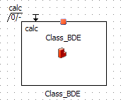
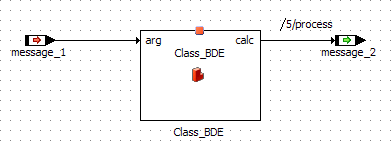

# Examples: Show Missing Pins and Connections

A block diagram component contains the following class:

The included class is opened with a double-click, and an argument and a return value are added. After returning to the parent component, the included class looks as follows, depending on the setting of Show Missing Pins and Connections (ASCET options window, [Block Diagram](cm_options_for_block_diagrams.md) node):

| Column 1 | Column 2 |
| --- | --- |
| option activated | option deactivated |
|  |  |

The parent component is edited as follows:

The included class is opened again, and the argument and return value are removed. After returning to the parent component, the included class looks as follows:

| Column 1 | Column 2 |
| --- | --- |
| option activated | option deactivated |
|  |  |
