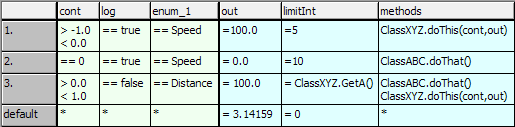
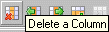

# Merged CHM Content

## Overview

_Source: `markdown/CTab_overview.md`_

if ((cont > -1.0) && (cont < 0.0) && (log == true) && (enum_1 == Speed))

{

out = 100.0;

limitInt = 5;

ClassXYZ.doThis(cont,out);

} else

if ((cont == 0.0) && (log == true)&& (enum_1 == Speed))

{

out = 0.0;

limitInt = 10;

ClassABC.doThat();

} else

if ((cont > 0.0) && (cont < 1.0) && (log == false)&& (enum_1 == Distance))

{

out = -100.0;

limitInt = ClassX.GetA();

ClassABC.doThat();

ClassXYZ.doThis(out,cont);

} else {

out = 3.14159;

limitInt = 0;

}

# Overview - Conditional Table Editor

A conditional table maps logical behavior (in the same way as the Boolean table). Its columns and rows create a logical matrix with different conditions and instructions.

Basic elements can be used in a conditional table. It is also possible to access public methods of added classes. The functionality of a conditional table is the equivalent of an If…Then…ElseIf…Then construction. Every line corresponds to an If or Elseif query. The below figure shows an example of a conditional table. The first three columns (cont, log and enum_1) contain the conditions linked by AND, the following columns (out, limitInt and methods) contain the relevant instructions.

The example in the figure corresponds to the [following ESDL code](javascript:kadovTextPopup(this))<!-- kadovTextPopupInit('a1'); //-->.

A conditional table is activated by calling a trigger method. On activation, the relevant row is detected and the instructions and calculations contained in it are executed.

Conditional tables are ESDL classes which are specified in a special editor for conditional tables. Conditions and instructions are entered in two separate areas of the table, condition and instruction area. Each area has an adjustable number of columns and its own freely selectable background color (see [Table Editor Options](ComponentManagerEnglishUS.chm::/CM_options_for_table_editors.htm)).

See also

[Setting Up Conditional Tables](markdown/setting_up_ct.md)

[Specifying Conditional Tables](markdown/specifying_ct.md)

[Experimenting with Conditional Tables](markdown/experimenting_ct.md)

[Table Editor Options](ComponentManagerEnglishUS.chm::/CM_options_for_table_editors.htm)

/* Heikki Komulainen, Comet Computer GmbH 2004 */ cc_plus_pic = '&nbsp;'; cc_minus_pic = '&nbsp;'; cc_stat_pic = '&nbsp;'; gpstyle = ''; var iframes_created = 0; if (document.body && document.body.insertAdjacentHTML && document.getElementsByTagName && document.getElementById) { collect_popups(); set_poplinks_pictures(); if (iframes_created) { document.write(gpstyle); document.write('
<nobr><a id="einauslink" style="position:absolute;top:expression(document.body.scrollTop + this.offsetHeight - this.offsetHeight);left:expression(document.body.offsetWidth - (this.offsetWidth + 28));background:white;padding:5px" href="javascript:show_all_poptext()">Alle texte einblenden</a></nobr>
'); } } function collect_popups() { bsscpopups = new Array(); for (x = 0; x < document.links.length; x++) { if (document.links[x].href.indexOf("BSSCPopup")>-1) { seekmatch = /BSSCPopup.'[^'](markdown/+)'/; poplink = seekmatch.exec(document.links[x].href); poplink = "" + poplink; poplink = poplink.substring(poplink.indexOf("'")+1, poplink.lastIndexOf("'")); ifid = "CCGENIFRAMEID" + x; new_iframe = '<iframe id="' + ifid + '"src="' + poplink + '" onload="get_text(\'' + ifid + '\')" width="0" height="0" frameborder=0></iframe>'; document.links[x].parentNode.insertAdjacentHTML("afterEnd", new_iframe); gpid = "CCID_" + ifid; document.links[x].href = "javascript:expand_poptext('" + gpid + "')"; cc_plus = '' + cc_plus_pic + ''; document.links[x].insertAdjacentHTML("afterBegin", cc_plus); iframes_created = 1; } } }// end function function get_text(ifr_id) { frpars = document.frames[ifr_id].document.getElementsByTagName("body"); popbody = frpars[0].innerHTML; gpid = "CCID_" + ifr_id; if (!document.getElementById(gpid)) { //avoiding doubles document.getElementById(ifr_id).insertAdjacentHTML("afterEnd", '
'+popbody+'
'); } }//end function function expand_poptext(x_frame_id) { if (!document.getElementById(x_frame_id)) return; if (document.getElementById(x_frame_id).className == "CCGENPOPTEXTH") { document.getElementById(x_frame_id).className = "CCGENPOPTEXTV"; document.getElementById(x_frame_id).style.visibility = "visible"; if (document.getElementById("CCPMB_" + x_frame_id )) { document.getElementById("CCPMB_" + x_frame_id ).innerHTML = cc_minus_pic; } } else { document.getElementById(x_frame_id).className = "CCGENPOPTEXTH"; document.getElementById(x_frame_id).style.visibility = "hidden"; if (document.getElementById("CCPMB_" + x_frame_id )) { document.getElementById("CCPMB_" + x_frame_id ).innerHTML = cc_plus_pic; } } }// end function function show_all_poptext() { var pulldowntxt = document.getElementsByTagName("div"); for (b = 0; b < pulldowntxt.length; b++) { if (pulldowntxt[b].className == "droptext") { pulldowntxt[b].style.display=""; } } var gptxt = document.getElementsByTagName("div"); for (z = 0; z < gptxt.length; z++) { if (gptxt[z].className == "CCGENPOPTEXTH") { gptxt[z].className = "CCGENPOPTEXTV"; gptxt[z].style.visibility = "visible"; if (document.getElementById("CCPMB_" + gptxt[z].id )) { document.getElementById("CCPMB_" + gptxt[z].id ).innerHTML = cc_minus_pic; } } } var dxpoplinks = document.getElementsByTagName("a"); if (dxpoplinks) { for (pxl = 0; pxl < dxpoplinks.length; pxl++) { if (dxpoplinks[pxl].href.indexOf("kadovTextPopup")>-1) { if (document.getElementById("CCPMB_" + dxpoplinks[pxl].id)) { document.getElementById("CCPMB_" + dxpoplinks[pxl].id).innerHTML = cc_stat_pic; dxpoplinks[pxl].symbol = "minus"; } } } } document.getElementById('einauslink').innerText = 'Alle texte ausblenden'; document.getElementById('einauslink').href = "javascript:self.location.reload()"; self.focus(); }// end function function eat_click() { return false; }// end function function set_poplinks_pictures() { var dpoplinks = document.getElementsByTagName("a"); if (dpoplinks) { for (pl = 0; pl < dpoplinks.length; pl++) { if (dpoplinks[pl].href.indexOf("kadovTextPopup")>-1) { cc_plus = '' + cc_stat_pic + ''; //dpoplinks[pl].onmouseup = plusminuspoplink; dpoplinks[pl].insertAdjacentHTML("afterBegin", cc_plus); dpoplinks[pl].symbol = "plus"; } } } }// end function function plusminuspoplink() { if (document.getElementById("CCPMB_" + this.id)) { if (this.symbol == "plus") { document.getElementById("CCPMB_" + this.id).innerHTML = cc_minus_pic; this.symbol = "minus"; } else { document.getElementById("CCPMB_" + this.id).innerHTML = cc_plus_pic; this.symbol = "plus"; } } return true; }

---

## Setting Up Conditional Tables

_Source: `markdown/setting_up_ct.md`_

# Setting Up Conditional Tables

By default, the conditional table contains no elements. The table is empty apart from the methods column. You have to add all the elements, columns and rows required. You cannot add columns until you have created at least one element, you cannot add rows until there is at least one column in the condition area.

Once you have added an element, the menu functions for creating columns for conditions and instructions are activated.

The Add a Column button can create columns in both the condition area and in the instruction area. Select an existing column to determine the area for the column to be created;this activates the button.

A variable, an enumeration or an argument is assigned to every column when it is created. Complex elements cannot be assigned to the columns, they are only used in the specification of conditions or instructions.

Conditional tables can contain scalar basic elements, enumerations and classes as elements. The trigger method can contain arguments but no return value.

See also

[Creating a Conditional Table](markdown/create_ct.md)

[Adding Basic Elements, Enumerations](markdown/add_elements.md)

[Making Elements Accessible for External Communication](markdown/make_elements_accessible.md)

[Creating Columns in the Condition Area](markdown/create_column_condition.md)

[Creating Columns in the Instruction Area](markdown/create-column_instrusction.md)

[Creating Rows](markdown/CTab_create_rows.md)

[Moving Columns](markdown/CTab_move_columns.md)

[Moving Rows](markdown/CTab_move_rows.md)

[Removing Columns](markdown/CTab_remove_columns.md)

[Deleting Rows](markdown/CTab_delete_rows.md)

[Deleting Elements](markdown/CTab_RenameDelete_elements.md)

---

## Specifying Conditional Tables

_Source: `markdown/specifying_ct.md`_

# Specifying Conditional Tables

All cells of the newly created columns and rows initially contain an asterisk (*). You have to enter the real conditions and instructions manually.

##### Conditions

The cells in the condition area can contain conditions in the following format:

== b, <= b, >= b, < b, > b, != b, *

- b

Is either a value, an element or the name of a public method of a referenced class. Complex expressions formed from these in ESDL syntax are possible.

- Asterisk

It means that any value is possible, it is used when the column element is of no significance to the current row.

- Several conditions can be specified in one cell, separated by a line break. These are interpreted as being AND-operated.

The cells in the condition area of the defaults row cannot be edited. They always contain an asterisk.

##### Instructions

The cells in the instruction area can contain assignments in the following format:

= b, class.method(variables), *

- b

Is a value, an element or the name of a public method of a referenced class. Complex expressions formed from these in ESDL syntax are possible.

- Class.method(variables)

Denotes a method call; this form of the instruction is only permissible in the methods column. All public methods of the referenced classes can be invoked.

- Asterisk

The asterisk means that no instruction (value assignment or method call) is defined in the relevant column.

You can only use elements and classes contained in the Outline tab to specify conditions and instructions. Otherwise an error message is created during code generation.

Syntax and semantics are not checked during the specification of conditions and instructions. Make sure your entries are correct, particularly when entering method names. Error messages are not created until code generation.

See also

[Entering a Condition or an Instruction](markdown/enter_condition_instruction.md)

[Altering Column Width](markdown/alter_column_width.md)

[Using Methods in Conditions/Instructions](markdown/use_methods_c_i.md)

---

## Experimenting with Conditional Tables

_Source: `markdown/experimenting_ct.md`_

# Experimenting with Conditional Tables

Once you have specified the table completely, you can generate code and execute experiments as for other components (see [Analyzing Components](BlockDiagramEditorEnglishUS.chm::/AnalyzingComponents.htm)).

The following problems may occur during code generation:

1. Any incorrect entries made when specifying the conditions and instructions result in error messages.
1. If you have specified identical conditions in different rows of the condition area, all corresponding If…Then… rows are generated during code generation but only the first one is taken into consideration when the table is evaluated.

No warning is displayed as there is no check of the content of the table.

1. If you delete, add or move enumerators in an enumeration used by the conditional table, this may lead to inconsistencies in the conditional table. A relevant error message may be displayed during code generation.
1. If you delete an enumeration used by the conditional table from the database or workspace, the enumeration is treated as an undefined element in code generation, a corresponding error message is displayed.

The conditional table can only be invoked via the trigger method. The following steps are executed every time the table is invoked:

1. The method arguments of the trigger method are processed and the values assigned to the elements.
1. A search takes place for a suitable condition. As soon as a suitable condition is found, the search is canceled, even if there are other suitable conditions specified further down.

If there is no suitable condition, the default condition (default row) is selected.

1. The instructions belonging to the condition found are executed.

As trigger cannot have a return value, the results of the instructions have to be transferred using Get Ports (see Making Elements Accessible Using Get/Set Ports). To ensure data consistency at all times, it is not recommended that you use global variables.

As with all ESDL components, the code is displayed for an offline experiment in the Physical Experiment window. This is the only point at which the user sees the ESDL code.

You can set up and execute the experiment as described in [The Experimentation Environment](ExperimentationEnglishUS.chm::/EE_Overview.htm).

See also

[Analyzing Components](BlockDiagramEditorEnglishUS.chm::/AnalyzingComponents.htm)

[The Experimentation Environment - Overview](ExperimentationEnglishUS.chm::/EE_Overview.htm)

[Starting an Offline Experiment](markdown/CTab_Starting_an_Offline_Experiment.md)

---

## Creating a Conditional Table

_Source: `markdown/create_ct.md`_

# Creating a Conditional Table

To create a conditional table, proceed as follows:

1. In the Component Manager, select the folder for the new table.
1. In the Insert menu, point to Class and select Conditional Table

or

1. Use the Insert Class button:

A new conditional table is created.

1. Enter the component name and press Return.

1. Do one of the following:

- In the Edit menu, select Open Component.
- Press <Return>.
- Double-click the selected element.

The conditional table editor window opens.

The public trigger method trigger is created automatically in every case. It is mandatory and cannot be deleted or renamed. You cannot add additional methods or diagrams.

The methods column is also created automatically. It is always at the end of the instruction area and cannot be deleted or repositioned. The table is empty apart from the methods column.

See also

[Creating Columns in the Condition Area](markdown/create_column_condition.md)

[Creating Columns in the Instruction Area](markdown/create-column_instrusction.md)

[Creating Rows](markdown/CTab_create_rows.md)

[Entering a Condition or an Instruction](markdown/enter_condition_instruction.md)

[Using Methods in Conditions/Instructions](markdown/use_methods_c_i.md)

[Setting Up Conditional Tables](markdown/setting_up_ct.md)

[Specifying Conditional Tables](markdown/specifying_ct.md)

[Experimenting with Conditional Table](markdown/experimenting_ct.md)

---

## Filtering the Tree Pane

_Source: `markdown/ctab_filtering_the_component_pane.md`_

# Filtering the Tree Pane

The Outline tab can be filtered. To do so, proceed as follows.

1. In the Outline tab, click on the  button.

The Options window opens in the Outline Tree node.

1. In the Elements subnode, activate the options of the items you want to display in the tab.
1. Go to the Methods subnode to set filter options for processes and methods.
1. Click OK to close the Options window.

Only items with activated options are shown in the tab. The button is marked with a green symbol to indicate an active filter: 

The filter settings made here affect all component editors.

See also

[Searching the Tree Pane](IntroductionEnglishUS.chm::/INT_SearchTreePane.htm)

---

## Setting the Background Color

_Source: `markdown/Setting_the_Background_Color.md`_

# Setting the Background Color

You can determine the background color for the condition area and instruction area.

1. Open the ASCET Options window.
1. Select the [Table](ComponentManagerEnglishUS.chm::/CM_options_for_table_editors.htm)node.
1. Open the Input Color combo box to select the background color for the condition area.

1. Open the Output Color combo box to select the background color for the instruction area.

A color selection prompter is displayed. The current color is marked.

1. Select the background color you want.
1. Close the Options window to accept the settings.

For the color selection to become effective, close and re-open the conditional table editor.

See also

[Table Options](ComponentManagerEnglishUS.chm::/CM_options_for_table_editors.htm)

[User Interface of the ASCET Options Window](ComponentManagerEnglishUS.chm::/cm_user_interface_of_the_ascet_options_window.htm)

---

## Setting up a Conditional Table

_Source: `markdown/Ctab_SetUp_ConditionalTable.md`_

# Setting up a Conditional Table

Setting up a conditional table consists of the following steps:

- [Adding basic elements, enumerations](markdown/add_elements.md)
- [Adding complex elements](markdown/complex_elements.md)
- [Adding arguments and method-local variables to the trigger method](markdown/arguments_variables.md)
- [Making elements accessible for external communication](markdown/make_elements_accessible.md)
- Creating columns in the [condition](markdown/create_column_condition.md) and [instruction](markdown/create-column_instrusction.md) area
- [Creating rows](markdown/CTab_create_rows.md)
- Moving [columns](markdown/CTab_move_columns.md) or [rows](markdown/CTab_move_rows.md)
- Deleting [columns](markdown/CTab_remove_columns.md) or [rows](markdown/CTab_delete_rows.md)
- [Renaming and deleting elements](markdown/CTab_RenameDelete_elements.md)
- [Showing and deleting unused elements](markdown/ctab_showdeleteunusedElements.md)

---

## Adding Basic Elements, Enumerations

_Source: `markdown/add_elements.md`_

# Adding Basic Elements, Enumerations

To add basic elements or enumerations, proceed as follows:

1. In the Elements palette or toolbar, click on the button for the element you want to create (()).
1. Enter a name for the element and press Return.

Element names must not begin with a number. If you enter a name that begins with a number, an allowed name is suggested instead.

By default, the  buttons are displayed. To display the  buttons instead, the [editor option](ComponentManagerEnglishUS.chm::/cm_options_for_editors.htm) Use signed/unsigned discrete types must be activated.

See also

[Adding Complex Elements](markdown/complex_elements.md)

[Adding Arguments and Method-Local Variables of the Trigger Method](markdown/arguments_variables.md)

[Reserved Keywords](IntroductionEnglishUS.chm::/INT_Reserved_Keywords.htm)

---

## Adding Complex Elements

_Source: `markdown/complex_elements.md`_

# Adding Complex Elements

To add complex elements, proceed as follows:

- Add a class as described in [Including a Component as a Complex Element](BlockDiagramEditorEnglishUS.chm::/IncludeComponent.htm).

You can add classes (except CT blocks) and records.

As an alternative, you can [add components via the block library palette](markdown/ctab_includecomponent_blocklibrary.md).

See also

[Including a Component as a Complex Element](BlockDiagramEditorEnglishUS.chm::/IncludeComponent.htm)

[Including a Component via the Block Library](markdown/ctab_includecomponent_blocklibrary.md)

---

## Including a Component via the Block Library

_Source: `markdown/ctab_includecomponent_blocklibrary.md`_

# Including a Component via the Block Library

When you stored frequently used components in a block library, you can include them via the Library palette. Proceed as follows.

1. In the Tree pane, go to the Outline tab.
1. In the Library palette, use the combo box to select the category that contains the desired item.
1. In the item list, select the item you want to add to the component.
1. Drag the item to the Outline tab or to the drawing area.

The item is included in the edited component and, if you dragged it there, in the drawing area.

See also

[Block Libraries](ComponentManagerEnglishUS.chm::/CM_BlockLibraries.htm)

[Library Palette](markdown/CTab_Library_Palette.md)

[Adding Complex Elements](markdown/complex_elements.md)

---

## Adding Arguments and Method-Local Variables to the Trigger Method

_Source: `markdown/arguments_variables.md`_

# Adding Arguments and Method-Local Variables to the Trigger Method

To add arguments and method-local variables to the trigger method, proceed as follows:

1. In the Outline tab, right-click the trigger method.
1. Do one of the following:
1. Add the required arguments as described in [Adding an Argument to the Method](BlockDiagramEditorEnglishUS.chm::/Addargument.htm).
1. Add the required method-local variables as described in [Adding Local Variables to the Method](BlockDiagramEditorEnglishUS.chm::/BDE_Localvariables.htm).

Method-local variables are only available within the conditional table.

You can edit the data and implementations of the elements in the usual way; for more details you can see [Editing Data](DataEditorEnglishUS.chm::/DEd_Overview.htm) and [Editing Implementations](ImplementationEditorEnglishUS.chm::/IEd_Overview.htm).

See also

[Adding an Argument to the Method](BlockDiagramEditorEnglishUS.chm::/Addargument.htm)

[Adding Local Variables to the Method](BlockDiagramEditorEnglishUS.chm::/BDE_Localvariables.htm)

[Editing Data - Overview](DataEditorEnglishUS.chm::/DEd_Overview.htm)

[Editing Implementations - Overview](ImplementationEditorEnglishUS.chm::/IEd_Overview.htm)

---

## Making Elements Accessible for External Communication

_Source: `markdown/make_elements_accessible.md`_

1. Activate the Set() option to add an input for the element.

The element can now be written from outside the conditional table.

1. Activate the Get() option to add an output for the element.

The element can now be read from outside the conditional table.

The inputs and outputs created in this way can be seen as connections in the layout of the conditional table.

1. Select the Imported option in the Scope field if the element was defined in another component/another project and is to be used in the conditional table.
1. Select Exported if you define the element in the conditional table and want to use it in other components/projects.

# Making Elements Accessible for External Communication

To make the elements accessible outside the conditional table, you have to activate the get or set ports of the elements (if available) or declare the elements as global. There is no other way of accessing elements in a conditional table.

To make elements accessible for external communication, proceed as follows:

1. Select an element from the Outline tab.
1. Do one of the following:
1. [Use the Get/Set ports.](javascript:kadovTextPopup(this))<!-- kadovTextPopupInit('a1'); //-->
1. [Use global elements.](javascript:kadovTextPopup(this))<!-- kadovTextPopupInit('a2'); //-->

See also

[Element Configuration](ElementEditorEnglishUS.chm::/EEd_element_configuration.htm)

/* Heikki Komulainen, Comet Computer GmbH 2004 */ cc_plus_pic = '&nbsp;'; cc_minus_pic = '&nbsp;'; cc_stat_pic = '&nbsp;'; gpstyle = ''; var iframes_created = 0; if (document.body && document.body.insertAdjacentHTML && document.getElementsByTagName && document.getElementById) { collect_popups(); set_poplinks_pictures(); if (iframes_created) { document.write(gpstyle); document.write('
<nobr><a id="einauslink" style="position:absolute;top:expression(document.body.scrollTop + this.offsetHeight - this.offsetHeight);left:expression(document.body.offsetWidth - (this.offsetWidth + 28));background:white;padding:5px" href="javascript:show_all_poptext()">Alle texte einblenden</a></nobr>
'); } } function collect_popups() { bsscpopups = new Array(); for (x = 0; x < document.links.length; x++) { if (document.links[x].href.indexOf("BSSCPopup")>-1) { seekmatch = /BSSCPopup.'[^'](markdown/+)'/; poplink = seekmatch.exec(document.links[x].href); poplink = "" + poplink; poplink = poplink.substring(poplink.indexOf("'")+1, poplink.lastIndexOf("'")); ifid = "CCGENIFRAMEID" + x; new_iframe = '<iframe id="' + ifid + '"src="' + poplink + '" onload="get_text(\'' + ifid + '\')" width="0" height="0" frameborder=0></iframe>'; document.links[x].parentNode.insertAdjacentHTML("afterEnd", new_iframe); gpid = "CCID_" + ifid; document.links[x].href = "javascript:expand_poptext('" + gpid + "')"; cc_plus = '' + cc_plus_pic + ''; document.links[x].insertAdjacentHTML("afterBegin", cc_plus); iframes_created = 1; } } }// end function function get_text(ifr_id) { frpars = document.frames[ifr_id].document.getElementsByTagName("body"); popbody = frpars[0].innerHTML; gpid = "CCID_" + ifr_id; if (!document.getElementById(gpid)) { //avoiding doubles document.getElementById(ifr_id).insertAdjacentHTML("afterEnd", '
'+popbody+'
'); } }//end function function expand_poptext(x_frame_id) { if (!document.getElementById(x_frame_id)) return; if (document.getElementById(x_frame_id).className == "CCGENPOPTEXTH") { document.getElementById(x_frame_id).className = "CCGENPOPTEXTV"; document.getElementById(x_frame_id).style.visibility = "visible"; if (document.getElementById("CCPMB_" + x_frame_id )) { document.getElementById("CCPMB_" + x_frame_id ).innerHTML = cc_minus_pic; } } else { document.getElementById(x_frame_id).className = "CCGENPOPTEXTH"; document.getElementById(x_frame_id).style.visibility = "hidden"; if (document.getElementById("CCPMB_" + x_frame_id )) { document.getElementById("CCPMB_" + x_frame_id ).innerHTML = cc_plus_pic; } } }// end function function show_all_poptext() { var pulldowntxt = document.getElementsByTagName("div"); for (b = 0; b < pulldowntxt.length; b++) { if (pulldowntxt[b].className == "droptext") { pulldowntxt[b].style.display=""; } } var gptxt = document.getElementsByTagName("div"); for (z = 0; z < gptxt.length; z++) { if (gptxt[z].className == "CCGENPOPTEXTH") { gptxt[z].className = "CCGENPOPTEXTV"; gptxt[z].style.visibility = "visible"; if (document.getElementById("CCPMB_" + gptxt[z].id )) { document.getElementById("CCPMB_" + gptxt[z].id ).innerHTML = cc_minus_pic; } } } var dxpoplinks = document.getElementsByTagName("a"); if (dxpoplinks) { for (pxl = 0; pxl < dxpoplinks.length; pxl++) { if (dxpoplinks[pxl].href.indexOf("kadovTextPopup")>-1) { if (document.getElementById("CCPMB_" + dxpoplinks[pxl].id)) { document.getElementById("CCPMB_" + dxpoplinks[pxl].id).innerHTML = cc_stat_pic; dxpoplinks[pxl].symbol = "minus"; } } } } document.getElementById('einauslink').innerText = 'Alle texte ausblenden'; document.getElementById('einauslink').href = "javascript:self.location.reload()"; self.focus(); }// end function function eat_click() { return false; }// end function function set_poplinks_pictures() { var dpoplinks = document.getElementsByTagName("a"); if (dpoplinks) { for (pl = 0; pl < dpoplinks.length; pl++) { if (dpoplinks[pl].href.indexOf("kadovTextPopup")>-1) { cc_plus = '' + cc_stat_pic + ''; //dpoplinks[pl].onmouseup = plusminuspoplink; dpoplinks[pl].insertAdjacentHTML("afterBegin", cc_plus); dpoplinks[pl].symbol = "plus"; } } } }// end function function plusminuspoplink() { if (document.getElementById("CCPMB_" + this.id)) { if (this.symbol == "plus") { document.getElementById("CCPMB_" + this.id).innerHTML = cc_minus_pic; this.symbol = "minus"; } else { document.getElementById("CCPMB_" + this.id).innerHTML = cc_plus_pic; this.symbol = "plus"; } } return true; }

---

## Creating Columns in the Condition Area

_Source: `markdown/create_column_condition.md`_

# Creating Columns in the Condition Area

You can create up to 100 columns in the condition area. To create columns in the condition area, proceed as follows:

1. In the Column menu, point to Add and select Condition.

The Column menu is also available as context menu in the table area.

or

1. Activate the column next to which you want to add the new column.
1. Click .

The Select Variable window opens. It contains a list of all existing variables which as yet have not been assigned to a column of the condition area.

1. Select a variable from the list.

You can assign each variable exactly once to a column of the condition area.

1. Click OK to close the window.

A column with the name of the selected variable is generated in the condition area. If the column created is the first of the entire table, the Default row is created at the same time.

The new column is created on the right-hand side of the condition area if it was created with the Column menu or context menu. If you used the Insert a Column button, the new column is created to the right of the selected column.

---

## Creating Columns in the Instruction Area

_Source: `markdown/create-column_instrusction.md`_

# Creating Columns in the Instruction Area

To create columns in the instruction area, proceed as follows:

You can create up to 100 columns in the instruction area.

1. In the Column menu, point to Add and select Instruction.

The Column menu is also available as context menu in the table area.

or

1. Activate the column next to which you want to add the new column.
1. Click .

The Select Variable window opens. It contains a list of all existing variables which as yet have not been assigned to a column of the instruction area.

1. Select a variable from the list.

You can assign each variable exactly once to a column of the instruction area.

Arguments of the trigger method cannot be assigned in the instruction area.

1. Click OK to close the window.

A column with the name of the selected variable is generated in the instruction area. Even if the column created is the first of the entire table, no row is created.

The new column is created to the left of the method column if it was created with the Column menu function, pointing to Add and selecting Instruction. If you used the  button, the new column is created to the right of the selected column.

---

## Creating Rows

_Source: `markdown/CTab_create_rows.md`_

# Creating Rows

If at least one column has been created in the condition area, you can add rows. A conditional table can contain up to 100 rows, as the default row is already specified, you can add 99 rows.

To create rows, proceed as follows:

1. Select the row after which you want to add the new row.
1. In the Row menu, select Add.

The Row menu is also available as context menu in the table area.

or

1. Click .

The new row is added after the one selected. If you have not selected a row or selected default, the new row is added immediately before the default row.

The elements of the row all initially contain an asterisk.

See also

[Specifying Conditional Tables](markdown/specifying_ct.md)

---

## Moving Columns

_Source: `markdown/CTab_move_columns.md`_

# Moving Columns

You can move columns but only within an area.

1. Mark the column you want to move.
1. In the Column menu, select Move Left or Move Right.

The Column menu is also available as context menu in the table area.

or

1. Click  or .

The column is moved one position to the left or right.

The first column of an area cannot be moved to the left, the last column of an area cannot be moved to the right. The methods column cannot be moved, it is always the last column in the instruction area.

---

## Moving Rows

_Source: `markdown/CTab_move_rows.md`_

# Moving Rows

The further up the table a row is, the higher its priority. You can move the rows and thus influence the priority of the condition specified in it.

1. Mark the row you want to move.
1. In the Row menu, select Move Up or Move Down.

The Row menu is also available as context menu in the table area.

or

1. Click either  or .

The row is moved up or down a row.

The first row cannot be moved up, the last numbered row cannot be moved down. The default row cannot be moved, it is always the last row of the table.

---

## Removing Columns

_Source: `markdown/CTab_remove_columns.md`_

# Removing Columns

You can remove columns, rows and elements from the table.

To remove columns, proceed as follows:

1. Select the column you want to remove.
1. In the Column menu, select Delete.

The Column menu is also available as context menu in the table area.

or

1. Click .

The selected column is removed. The assigned element is not, however, removed but still remains in the Elements list and can be reassigned.

---

## Deleting Rows

_Source: `markdown/CTab_delete_rows.md`_

# Deleting Rows

To delete rows, proceed as follows:

1. Select the row you want to remove.
1. In the Row menu, select Delete.

The Row menu is also available as context menu in the table area.

or

1. Click .

The selected row is deleted.

---

## Renaming and Deleting Elements

_Source: `markdown/CTab_RenameDelete_elements.md`_

# Renaming and Deleting Elements

To rename or delete an element, proceed as follows:

1. In the Outline tab, select an element.
1. Do one of the following to rename the element:
1. Do one of the following to delete the element:
1. Confirm the deletion with OK.

The element is deleted from the conditional table.

See also

[Showing and Deleting Unused Elements](markdown/ctab_showdeleteunusedElements.md)

---

## Showing and Deleting Unused Elements

_Source: `markdown/ctab_showdeleteunusedElements.md`_

# Showing and Deleting Unused Elements

To delete elements (scalar or complex) not used in the conditional table, proceed as follows:

1. In the Extras menu, select Show Unused Elements.
1. In the Elements tab of the Search Results view, select one, several, or all (Ctrl + a) elements.
1. Do one of the following:

- Open the context menu and select Delete.
- Press Delete.

The selected unused elements are deleted.

See also

[Search Results View](markdown/ctab_searchresultsview.md)

[Reserved Keywords](IntroductionEnglishUS.chm::/INT_Reserved_Keywords.htm)

/* Heikki Komulainen, Comet Computer GmbH 2004 */ cc_plus_pic = '&nbsp;'; cc_minus_pic = '&nbsp;'; cc_stat_pic = '&nbsp;'; gpstyle = ''; var iframes_created = 0; if (document.body && document.body.insertAdjacentHTML && document.getElementsByTagName && document.getElementById) { collect_popups(); set_poplinks_pictures(); if (iframes_created) { document.write(gpstyle); document.write('
<nobr><a id="einauslink" style="position:absolute;top:expression(document.body.scrollTop + this.offsetHeight - this.offsetHeight);left:expression(document.body.offsetWidth - (this.offsetWidth + 28));background:#ffffe0;padding:5px" href="javascript:show_all_poptext()">Show all hidden text</a></nobr>
'); } } function collect_popups() { bsscpopups = new Array(); for (x = 0; x < document.links.length; x++) { if (document.links[x].href.indexOf("BSSCPopup")>-1) { seekmatch = /BSSCPopup.'[^'](markdown/+)'/; poplink = seekmatch.exec(document.links[x].href); poplink = "" + poplink; poplink = poplink.substring(poplink.indexOf("'")+1, poplink.lastIndexOf("'")); ifid = "CCGENIFRAMEID" + x; new_iframe = '<iframe id="' + ifid + '"src="' + poplink + '" onload="get_text(\'' + ifid + '\')" width="0" height="0" frameborder=0></iframe>'; document.links[x].parentNode.insertAdjacentHTML("afterEnd", new_iframe); gpid = "CCID_" + ifid; document.links[x].href = "javascript:expand_poptext('" + gpid + "')"; cc_plus = '' + cc_plus_pic + ''; document.links[x].insertAdjacentHTML("afterBegin", cc_plus); iframes_created = 1; } } }// end function function get_text(ifr_id) { frpars = document.frames[ifr_id].document.getElementsByTagName("body"); popbody = frpars[0].innerHTML; gpid = "CCID_" + ifr_id; if (!document.getElementById(gpid)) { //avoiding doubles document.getElementById(ifr_id).insertAdjacentHTML("afterEnd", '
'+popbody+'
'); } }//end function function expand_poptext(x_frame_id) { if (!document.getElementById(x_frame_id)) return; if (document.getElementById(x_frame_id).className == "CCGENPOPTEXTH") { document.getElementById(x_frame_id).className = "CCGENPOPTEXTV"; document.getElementById(x_frame_id).style.visibility = "visible"; if (document.getElementById("CCPMB_" + x_frame_id )) { document.getElementById("CCPMB_" + x_frame_id ).innerHTML = cc_minus_pic; } } else { document.getElementById(x_frame_id).className = "CCGENPOPTEXTH"; document.getElementById(x_frame_id).style.visibility = "hidden"; if (document.getElementById("CCPMB_" + x_frame_id )) { document.getElementById("CCPMB_" + x_frame_id ).innerHTML = cc_plus_pic; } } }// end function function show_all_poptext() { var pulldowntxt = document.getElementsByTagName("div"); for (b = 0; b < pulldowntxt.length; b++) { if (pulldowntxt[b].className == "droptext") { pulldowntxt[b].style.display=""; } } var gptxt = document.getElementsByTagName("div"); for (z = 0; z < gptxt.length; z++) { if (gptxt[z].className == "CCGENPOPTEXTH") { gptxt[z].className = "CCGENPOPTEXTV"; gptxt[z].style.visibility = "visible"; if (document.getElementById("CCPMB_" + gptxt[z].id )) { document.getElementById("CCPMB_" + gptxt[z].id ).innerHTML = cc_minus_pic; } } } var dxpoplinks = document.getElementsByTagName("a"); if (dxpoplinks) { for (pxl = 0; pxl < dxpoplinks.length; pxl++) { if (dxpoplinks[pxl].href.indexOf("kadovTextPopup")>-1) { if (document.getElementById("CCPMB_" + dxpoplinks[pxl].id)) { document.getElementById("CCPMB_" + dxpoplinks[pxl].id).innerHTML = cc_stat_pic; dxpoplinks[pxl].symbol = "minus"; } } } } document.getElementById('einauslink').innerText = 'Hide all hideable text'; document.getElementById('einauslink').href = "javascript:self.location.reload()"; self.focus(); }// end function function eat_click() { return false; }// end function function set_poplinks_pictures() { var dpoplinks = document.getElementsByTagName("a"); if (dpoplinks) { for (pl = 0; pl < dpoplinks.length; pl++) { if (dpoplinks[pl].href.indexOf("kadovTextPopup")>-1) { cc_plus = '' + cc_stat_pic + ''; //dpoplinks[pl].onmouseup = plusminuspoplink; dpoplinks[pl].insertAdjacentHTML("afterBegin", cc_plus); dpoplinks[pl].symbol = "plus"; } } } }// end function function plusminuspoplink() { if (document.getElementById("CCPMB_" + this.id)) { if (this.symbol == "plus") { document.getElementById("CCPMB_" + this.id).innerHTML = cc_minus_pic; this.symbol = "minus"; } else { document.getElementById("CCPMB_" + this.id).innerHTML = cc_plus_pic; this.symbol = "plus"; } } return true; }

---

## Specifying a Conditional Table

_Source: `markdown/Ctab_SpecifyConditionalTable.md`_

# Specifying a Conditional Table

Specifying a conditional table consists of the following steps:

- [Entering a Condition or an Instruction](markdown/enter_condition_instruction.md)
- [Using Methods in Conditions/Instructions](markdown/use_methods_c_i.md)
- [Altering Column Width](markdown/alter_column_width.md)

---

## Entering a Condition or an Instruction

_Source: `markdown/enter_condition_instruction.md`_

# Entering a Condition or an Instruction

To enter a condition or an instruction, proceed as follows:

1. Double-click the cell you want to edit.

The cell becomes an input box.

1. Enter the condition or the instruction.

Conditions and instructions are entered as pure character strings. Rules for conditions and instructions are given in [Specifying Conditional Tables](markdown/specifying_ct.md).

No check is made to see whether different rows in the condition area contain identical conditions.

A cell in the instruction area can also contain several rows. Each row is interpreted as an individual assignment (see figure) or method call (methods column).

1. Click somewhere in the table area to accept the entry.

See also

[Specifying Conditional Tables](markdown/specifying_ct.md)

---

## Using Methods in Conditions/Instructions

_Source: `markdown/use_methods_c_i.md`_

# Using Methods in Conditions/Instructions

There is a way of avoiding errors when entering method names.

1. Mark the cell in which you want to use a method.
1. Right-click the table area and select Insert Method from the context menu.

The Select Variable window opens. It contains a list of all public methods of all referenced classes.

1. Select the method you want to use.
1. Click OK.

The name of the method is inserted in an individual row at the end of the cell.

If the method has arguments, the names defined in the class are entered.

1. You have to edit the inserted method call.

1. Enter existing variable names from your conditional table instead of the specified argument names.
1. Insert a comparing operator in the condition area (see [Specifying Conditional Tables](markdown/specifying_ct.md))
1. Add the assignment character = in the instruction area (apart from the methods column) and remove the asterisk if necessary.

See also

[Specifying Conditional Tables](markdown/specifying_ct.md)

---

## Altering Column Width

_Source: `markdown/alter_column_width.md`_

# Altering Column Width

If the width of a column is too small for the instructions or conditions contained in the cells, you can widen it.

1. Move the mouse pointer to the right-hand vertical limitation of the column.

The mouse pointer becomes a double arrow.

1. Drag the column limitation to the left or right to change the width of the column.

When you exit the editor, the column width is reset to the default value.

---

## Starting an Offline Experiment

_Source: `markdown/CTab_Starting_an_Offline_Experiment.md`_

# Starting an Offline Experiment

To start an offline experiment, proceed as follows:

1. In the conditional table editor, perform one of the following actions.
1. If you are working with a database larger than 3 GB, [another step is inserted](javascript:BSSCPopup('codegen_dbtoolarge.htm');)<!-- kadovFilePopupInit('a1'); //-->.

The generated code is compiled with the compiler specific to the current target, and the experimentation environment for the component is opened. The generated files are stored in the cgen directory.

The experimentation environment is described in [The Experimentation Environment](ExperimentationEnglishUS.chm::/EE_Overview.htm).

See also

[The Experimentation Environment](ExperimentationEnglishUS.chm::/EE_Overview.htm)

[Project Editor - Banners in the Generated Code](ProjectEditorEnglishUS.chm::/PE_Banners_in_GeneratedCode.htm)

/* Heikki Komulainen, Comet Computer GmbH 2004 */ cc_plus_pic = '&nbsp;'; cc_minus_pic = '&nbsp;'; cc_stat_pic = '&nbsp;'; gpstyle = ''; var iframes_created = 0; if (document.body && document.body.insertAdjacentHTML && document.getElementsByTagName && document.getElementById) { collect_popups(); set_poplinks_pictures(); if (iframes_created) { document.write(gpstyle); document.write('
<nobr><a id="einauslink" style="position:absolute;top:expression(document.body.scrollTop + this.offsetHeight - this.offsetHeight);left:expression(document.body.offsetWidth - (this.offsetWidth + 28));background:#ffffe0;padding:5px" href="javascript:show_all_poptext()">Show all hidden text</a></nobr>
'); } } function collect_popups() { bsscpopups = new Array(); for (x = 0; x < document.links.length; x++) { if (document.links[x].href.indexOf("BSSCPopup")>-1) { seekmatch = /BSSCPopup.'[^'](markdown/+)'/; poplink = seekmatch.exec(document.links[x].href); poplink = "" + poplink; poplink = poplink.substring(poplink.indexOf("'")+1, poplink.lastIndexOf("'")); ifid = "CCGENIFRAMEID" + x; new_iframe = '<iframe id="' + ifid + '"src="' + poplink + '" onload="get_text(\'' + ifid + '\')" width="0" height="0" frameborder=0></iframe>'; document.links[x].parentNode.insertAdjacentHTML("afterEnd", new_iframe); gpid = "CCID_" + ifid; document.links[x].href = "javascript:expand_poptext('" + gpid + "')"; cc_plus = '' + cc_plus_pic + ''; document.links[x].insertAdjacentHTML("afterBegin", cc_plus); iframes_created = 1; } } }// end function function get_text(ifr_id) { frpars = document.frames[ifr_id].document.getElementsByTagName("body"); popbody = frpars[0].innerHTML; gpid = "CCID_" + ifr_id; if (!document.getElementById(gpid)) { //avoiding doubles document.getElementById(ifr_id).insertAdjacentHTML("afterEnd", '
'+popbody+'
'); } }//end function function expand_poptext(x_frame_id) { if (!document.getElementById(x_frame_id)) return; if (document.getElementById(x_frame_id).className == "CCGENPOPTEXTH") { document.getElementById(x_frame_id).className = "CCGENPOPTEXTV"; document.getElementById(x_frame_id).style.visibility = "visible"; if (document.getElementById("CCPMB_" + x_frame_id )) { document.getElementById("CCPMB_" + x_frame_id ).innerHTML = cc_minus_pic; } } else { document.getElementById(x_frame_id).className = "CCGENPOPTEXTH"; document.getElementById(x_frame_id).style.visibility = "hidden"; if (document.getElementById("CCPMB_" + x_frame_id )) { document.getElementById("CCPMB_" + x_frame_id ).innerHTML = cc_plus_pic; } } }// end function function show_all_poptext() { var pulldowntxt = document.getElementsByTagName("div"); for (b = 0; b < pulldowntxt.length; b++) { if (pulldowntxt[b].className == "droptext") { pulldowntxt[b].style.display=""; } } var gptxt = document.getElementsByTagName("div"); for (z = 0; z < gptxt.length; z++) { if (gptxt[z].className == "CCGENPOPTEXTH") { gptxt[z].className = "CCGENPOPTEXTV"; gptxt[z].style.visibility = "visible"; if (document.getElementById("CCPMB_" + gptxt[z].id )) { document.getElementById("CCPMB_" + gptxt[z].id ).innerHTML = cc_minus_pic; } } } var dxpoplinks = document.getElementsByTagName("a"); if (dxpoplinks) { for (pxl = 0; pxl < dxpoplinks.length; pxl++) { if (dxpoplinks[pxl].href.indexOf("kadovTextPopup")>-1) { if (document.getElementById("CCPMB_" + dxpoplinks[pxl].id)) { document.getElementById("CCPMB_" + dxpoplinks[pxl].id).innerHTML = cc_stat_pic; dxpoplinks[pxl].symbol = "minus"; } } } } document.getElementById('einauslink').innerText = 'Hide all hideable text'; document.getElementById('einauslink').href = "javascript:self.location.reload()"; self.focus(); }// end function function eat_click() { return false; }// end function function set_poplinks_pictures() { var dpoplinks = document.getElementsByTagName("a"); if (dpoplinks) { for (pl = 0; pl < dpoplinks.length; pl++) { if (dpoplinks[pl].href.indexOf("kadovTextPopup")>-1) { cc_plus = '' + cc_stat_pic + ''; //dpoplinks[pl].onmouseup = plusminuspoplink; dpoplinks[pl].insertAdjacentHTML("afterBegin", cc_plus); dpoplinks[pl].symbol = "plus"; } } } }// end function function plusminuspoplink() { if (document.getElementById("CCPMB_" + this.id)) { if (this.symbol == "plus") { document.getElementById("CCPMB_" + this.id).innerHTML = cc_minus_pic; this.symbol = "minus"; } else { document.getElementById("CCPMB_" + this.id).innerHTML = cc_plus_pic; this.symbol = "plus"; } } return true; }

---

## Conditional Table Editor - Window Elements

_Source: `markdown/CTab_Description_of_Window_Elements.md`_

# Conditional Table Editor - Window Elements

The Conditional Table editor window contains the following window elements:

- [Menu Bar](markdown/CTab_menu_bar.md)
- [Toolbars](markdown/CTab_description_buttons.md)

- [Tree pane](markdown/ctab_component_pane.md)

This pane lists all elements of the component. It contains the following tabs:

- Outline tab
- Database or Workspace tab
- [Elements](markdown/CTab_Elements_Palette.md) palette

- [Library](markdown/CTab_Library_Palette.md) palette

- [Specification](markdown/CTab_Specification_View.md) View

This view is used for component specification. It is selected via the Specification tab at the right-hand side of the editor window.

- [Search Results View](markdown/ctab_searchresultsview.md)
- [Browse](markdown/CTab_Browse_View.md) View

This view is used for component specification. It is opened via the Browse tab at the right-hand side of the editor window.

- status bar

The status bar contains information on the element currently selected in the Outline tab (if the Mouse Over option on the [Editors](ComponentManagerEnglishUS.chm::/cm_options_for_editors.htm) node of the ASCET options is deactivated) or on the element in the Outline tab the mouse is currently placed on (if the Mouse Over option is activated).

---

## Menus

_Source: `markdown/CTab_menu_bar.md`_

# Menu Bar

The menu bar contains the following menus:

- [File](markdown/CTab_File_Menu.md)
- [Edit](markdown/CTab_Edit_Menu.md)
- [View](markdown/CTab_view_menu.md)
- [Column](markdown/column_menu.md)
- [Row](markdown/row_menu.md)
- [Insert](markdown/CTab_Insert_Menu.md)
- [Build](markdown/CTab_Build_Menu.md)
- [Extras](markdown/CTab_Extras_Menu.md)
- [Tools](markdown/CTab_Tools_Menu.md)
- [Help](markdown/CTab_Help_Menu.md)

---

## File Menu

_Source: `markdown/CTab_File_Menu.md`_

# File Menu

This menu contains the following functions:

Import

Data

| Column 1 | Column 2 |
| --- | --- |
| For Selected Element | Import data for selected element. |

Export

Component

Saves the currently selected component to the file that is selected in the Select Export File window.

Generated Code

Saves the code generated in the file system.

| Column 1 | Column 2 |
| --- | --- |
| Flat | The edited component. |
| Recursive | The referenced components. |
| Generic | Files out generic code for external make. |

Data

Exports a component data set.

| Column 1 | Column 2 |
| --- | --- |
| For Component | Exports a component dataset. |
| For Selected Element | Exports data for the selected elements. |

Close

Exits the conditional table editor.

---

## Edit Menu

_Source: `markdown/CTab_Edit_Menu.md`_

# Edit Menu

This menu contains the following functions:

Cut (Ctrl + x)

Cuts (deletes and copies to the ASCET clipboard) selected element.

Copy (Ctrl + c)

Copies selected element to the ASCET clipboard.

Paste (Ctrl + v)

Pastes an element from the ASCET clipboard.

Delete (Del)

Deletes selected elements.

Rename (F2)

Renames a selected element.

Search (Ctrl + Shift + s)

Searches the component as described in [Browsing the Database or Workspace](ComponentManagerEnglishUS.chm::/Browsing.htm). The range is limited to the edited component and its included components.

Properties (Ctrl + Shift + p)

Shows the properties for the selected element.

Data... (Ctrl + Shift + d)

Opens the data editor for the selected element.

Implementation (Ctrl + Shift + i)

The implementation editor for the selected element opens. Search of component implementations is possible.

Set Cache Locking

These menu options are used in connection with ASCET-RP. See [ES1135: Cache Locking](INTECRIOConnectivityRPEnglishUS.chm::/IIO_ES1135CacheLocking.htm) for a description.

Component

| Column 1 | Column 2 |
| --- | --- |
| Data | Opens the data editor for the component. Search of component data is possible. |
| Implementation | Opens the implementation editor for the component. Search of component implementations is possible. |
| Layout | Opens the layout editor for the component. |
| Notes | Opens the notes editor - you can make notes about the component here. |

See also

[Browsing the Database or Workspace](ComponentManagerEnglishUS.chm::/Browsing.htm)

---

## View Menu

_Source: `markdown/CTab_view_menu.md`_

# View Menu

This menu contains the following functions:

Show/Hide

Shows/hides several parts of the editor or the component.

| Column 1 | Column 2 |
| --- | --- |
| Tree Pane | Shows/hides Tree pane. |
| Toolbars | The General and Elements submenus show/hide the respective toolbars. |
| Palettes | The Elements and Block Library submenus show/hide the respective palettes. |

Configure

| Column 1 | Column 2 |
| --- | --- |
| Toolbar General | Select the buttons to be visible in the General toolbar (see Configuring a Toolbar ). |
| Toolbar Elements | Select the buttons to be visible in the Elements toolbar. |
| Reset Toolbar Configuration | Reset toolbar to default configuration. |

See also

[Configuring a Toolbar](IntroductionEnglishUS.chm::/INT_Configuring_Toolbar.htm)

---

## Column Menu

_Source: `markdown/column_menu.md`_

# Column Menu

This menu is also available as a context menu in the table area

This menu contains the following options:

Add

Adds a new column

| Column 1 | Column 2 |
| --- | --- |
| Condition | Adds in the condition area. |
| Instruction | Adds in the instruction area. |

Delete

Removes the selected column (without deleting the relevant element).

Move Left (Ctrl + left)

Moves the selected column to the left.

Move Right (Ctrl + right)

Moves the selected column to the right.

---

## Row Menu

_Source: `markdown/row_menu.md`_

# Row Menu

This menu is also available as a context menu in the table area.

This menu contains the following options:

Add

Adds a new row.

Delete

Deletes the selected row.

Move Up (Ctrl + up)

Moves the selected row up.

Move Down (Ctrl + down)

Moves the selected row down.

---

## Insert Menu

_Source: `markdown/CTab_Insert_Menu.md`_

# Insert Menu

This menu contains the following function:

Component

Inserts a component as a complex element.

---

## Build Menu

_Source: `markdown/CTab_Build_Menu.md`_

# Build Menu

This menu contains the following functions:

##### Touch

Forced regeneration during the next code generation.

| Column 1 | Column 2 |
| --- | --- |
| Flat | The edited component. |
| Recursive | The referenced components. |

##### Clean Code Generation Directory

Deletes all files in the code generation directory.

##### View Generated Code

Generates the C code for the component and displays it in a text editor. The text editor can be selected in the ASCET option window, [ASCII Editor](ComponentManagerEnglishUS.chm::/CM_ASCII_Editor_Options.htm) node.

##### Generate Code (Ctrl + F7)

Generates the C code for a component.

##### Compile

Compiles the generated C code. Not available in the context of a project with the EHOOKS target.

##### Experiment

Starts an experiment. Not available in the context of a project with the EHOOKS target.

See also

[ASCII Editor Options](ComponentManagerEnglishUS.chm::/CM_ASCII_Editor_Options.htm)

---

## Extras Menu

_Source: `markdown/CTab_Extras_Menu.md`_

# Extras Menu

This menu bar contains the following menus:

Browse to Parent Component

Opens an editor for the including component. (The option is only available if an included component is being edited.)

Show

| Column 1 | Column 2 |
| --- | --- |
| Path | Shows the path of an element or included component. |

Copy Path to Clipboard

Copies the path of an included component to the clipboard.

| Column 1 | Column 2 |
| --- | --- |
| Model Path | Model Path. |
| Model asd:// Link | Path in ASCET protocol format that allows operating/referencing an ASCET component in a model as hyperlink. |
| Database Path | Database or workspace path. |
| Database asd:// Link | Path in ASCET protocol format that allows operating/referencing an ASCET component in the database or workspace as hyperlink. |

Create ASCET Link

Creates an [ASCET link](IntroductionEnglishUS.chm::/INT_ASCETLinks.htm) for an element selected in the Outline tab. The link opens the component in the conditional table editor and (except for the self element, i.e. the root of the element tree) highlights the element in the Outline tab.

Default Project

Allows editing the default project used for experimenting with components.

| Column 1 | Column 2 |
| --- | --- |
| Open | Opens an editor for the default project. |
| Resolve Globals | Automatically creates a global element for each imported element in the component for which there is no exported element. |
| Delete Unused Globals | Deletes unused global elements. |

Check Dependency

Checks whether the allocation of formal parameters to the model parameters is correct.

Show Unused Elements

Opens the Search Results view and lists all elements from the Tree pane that do not appear in the diagram. See also [Showing and Deleting Unused Elements](markdown/ctab_showdeleteunusedElements.md).

---

## Tools Menu

_Source: `markdown/CTab_Tools_Menu.md`_

# Tools Menu

This menu contains the following function:

Options

Opens the ASCET options dialog window.

See also

[Setting ASCET Options](ComponentManagerEnglishUS.chm::/SettingASCET.htm)

---

## Help Menu

_Source: `markdown/CTab_Help_Menu.md`_

# Help Menu

This menu contains the following functions:

Contents (F1)

Shows the help contents.

Index

Shows the help index.

---

## Toolbars

_Source: `markdown/CTab_description_buttons.md`_

# Toolbars

##### General Toolbar

| Column 1 | Column 2 |
| --- | --- |
|  | Cut |
|  | Copy |
|  | Paste |
|  | Delete |
|  | Edit Component Data |
|  | Edit Component Implementation |
|  | Generate Code |
|  | Compile Generated Code |
|  | Insert Component |
|  | Open Experiment for selected Experiment Target |
|  | Adds a Column |
|  | Deletes a Column |
|  | Adds a Row |
|  | Deletes a Row |
|  | Moves Column Left |
|  | Moves Column Right |
|  | Moves Row Up |
|  | Moves Row Down |

##### Elements Toolbar

| Column 1 | Column 2 | Column 3 |
| --- | --- | --- |
|  | Variable | The button opens the element type selection menu. The Variable and Parameter buttons can be used to create elements of type logic, limitInt, wrapInt, udisc, sdisc, or cont. By default, the limitInt and wrapInt types are displayed. To display the sdisc and udisc types instead, the editor option Use signed/unsigned discrete types must be activated. See also Adding Basic Elements, Enumerations . |
|  | Delta t | dt system parameter The name dT is reserved for the system parameter. You cannot create any other element with the name dT. Since upper and lower case letters are not distinguished, the names DT, dt, and Dt are reserved, too. |

---

## Tree Pane

_Source: `markdown/ctab_component_pane.md`_

# Tree Pane

The tree pane contains following three tabs and filter functions:

##### Outline

In this tab all elements of the component self:<component name> are listed. Also you find all methods and processes in this tab.

For a better handling of these elements you can use several filters and a search function:

| Column 1 | Column 2 |
| --- | --- |
|  | Opens the Options dialog window, reduced to the settings of the Filter. |
|  | Changes the criteria of sort. |
|  | Expands the trees in the Outline tab. |
|  | Collapses the trees in the Outline tab. |
|  | Runs a search in the Outline tab for the admitted letters. |

##### Database or Workspace

The folders and items contained in the current database or workspace are displayed here. The database or workspace name is the root of the tree structure. Each database or workspace contains one or more folders, which in turn contain other folders and database or workspace items.

| Column 1 | Column 2 |
| --- | --- |
|  | Expands the Database or Workspace tree. |
|  | Collapses the Database or Workspace tree. |
|  | Runs a search in the Database or Workspace tab for the admitted letters. |

See also

[Filtering the Tree Pane](markdown/ctab_filtering_the_component_pane.md)

[Searching the Tree Pane](IntroductionEnglishUS.chm::/INT_SearchTreePane.htm)

---

## Context Menu for Components and Elements

_Source: `markdown/ctab_contextmenu_componentelement.md`_

# Context Menu for Components and Elements

In the Outline tab, the context menu of a component or element - including arguments and local variables of the trigger - contains the following functions:

Copy (Ctrl + c)

Copies a selected included component or element to the ASCET clipboard.

Paste (Ctrl + v)

Pastes a component or element of the ASCET clipboard.

Delete (Del)

Deletes a selected included component or element.

Rename (F2)

Renames a selected included component or element.

Replace Component

Replaces a component with another included component. The name of the old component remains.

Open Component

Opens the specification editor for a selected included component.

Notes

Opens the notes editor for a selected included component - you can make notes about the included component here.

Properties (Ctrl + Shift + p)

Opens the Properties editor for a selected included component or element.

Data (Ctrl + Shift + d)

Opens the data editor for a selected included component or element.

Implementation (Ctrl + Shift + i)

Opens the implementation editor for a selected included component or element. Search of component implementations is possible.

Set Cache Locking

These menu options are used in connection with ASCET-RP. See [ES1135: Cache Locking](INTECRIOConnectivityRPEnglishUS.chm::/IIO_ES1135CacheLocking.htm) for a description.

Show Path

Shows the path of an element or included component.

Copy Path to Clipboard

Copies the path of an selected included component to the clipboard.

| Column 1 | Column 2 |
| --- | --- |
| Model Path | Model Path. |
| Model asd:// Link | Path in ASCET protocol format that allows operating/referencing an ASCET component in a model as hyperlink. |
| Database Path | Database/workspace path. |
| Database asd:// Link | Path in ASCET protocol format that allows operating/referencing an ASCET component in the database/workspace as hyperlink. |

Create ASCET Link

Creates an ASCET link (see [ASCET Links](IntroductionEnglishUS.chm::/INT_ASCETLinks.htm)) that opens the conditional table and (except for the self element, i.e. the root of the element tree) highlights the selected element in the Outline tab.

Import

Data

| Column 1 | Column 2 |
| --- | --- |
| For Selected Element | Imports data for a selected element. |

Export

Component (Ctrl + e)

Exports the current component or element.

Generated Code

Exports the generated code.

| Column 1 | Column 2 |
| --- | --- |
| Flat | Exports the generated code of the edited components. |
| Recursive | Exports the generated code of the referenced components also. |
| Generic | Exports the generated code for processing at a later point using external tools, e.g. an external Make/Build process. |

Data

Exports a component data set.

| Column 1 | Column 2 |
| --- | --- |
| For Component | Exports a component dataset. |
| For Selected Element | Exports data for the selected elements. |

Insert Component

Inserts a component in the editor.

---

## Context Menu for Diagrams and Methods

_Source: `markdown/ctab_contextmenu_diagrammethod.md`_

# Context Menu for Diagrams and Methods

In the Outline tab, the context menu of the diagram or method contains the following functions:

Rename (F2)

Renames the diagram.

Properties (Ctrl + Shift + p)

Opens the signature editor for the method.

Implementation (Ctrl + Shift + i)

Opens the implementation editor for the method.

Create ASCET Link

Creates an ASCET link (see [ASCET Links](IntroductionEnglishUS.chm::/INT_ASCETLinks.htm)) that opens the component and selects the selected diagram or method.

Default Method

Always activated because a conditional table has a single method.

---

## Palettes

_Source: `markdown/CTab_Palettes.md`_

# Palettes

The following palettes are available in the Conditional Table Editor:

- [Elements palette](markdown/CTab_Elements_Palette.md)
- [Library palette](markdown/CTab_Library_Palette.md)

---

## Elements Palette

_Source: `markdown/CTab_Elements_Palette.md`_

# Elements Palette

The Elements palette contains following functions:

<table style="x-cell-content-align: Top;
				margin-top: 3px;
				border-left-style: Outset;
				border-top-style: Outset;
				border-right-style: Outset;
				border-bottom-style: Outset;
				border-left-width: 1px;
				border-right-width: 1px;
				border-top-width: 1px;
				border-bottom-width: 1px;" x-use-null-cells="">
<col style="width: 70px;"/>
<col style="width: 150px;"/>
<col/>
<tr class="hcp1" valign="top">
<td class="hcp2" colspan="1" rowspan="1" style="width:70px;" width="70px">

</td>
<td class="hcp2" style="width:150px;" width="150px">

Logic Variable
</td>
<td class="hcp2" colspan="1" rowspan="5">

The Variable buttons can 
 be used to create elements of type logic, limitInt, wrapInt, udisc, sdisc, 
 cont, or enumeration.

By default, the Limited Integer * 
 and Wrap-Around Integer * buttons are displayed. 
 To display the Signed Discrete * and Unsigned 
 Discrete * buttons instead, the <a href="ComponentManagerEnglishUS.chm::/cm_options_for_editors.htm">editor 
 option</a> Use signed/unsigned discrete types must 
 be activated.

See also <a href="markdown/add_elements.md">Adding Basic Elements, 
 Enumerations</a>.
</td></tr>
<tr class="hcp1" valign="top">
<td class="hcp2" colspan="1" rowspan="1" style="width:70px;" width="70px">

 ()
</td>
<td class="hcp2" colspan="1" rowspan="1" style="width:150px;" width="150px">

Limited Integer Variable  
(Signed Discrete Variable)
</td>
</tr>
<tr class="hcp1" valign="top">
<td class="hcp2" colspan="1" rowspan="1" style="width:70px;" width="70px">

 ()
</td>
<td class="hcp2" colspan="1" rowspan="1" style="width:150px;" width="150px">

Wrap-Around Integer Variable 
(Unsigned Discrete Variable)
</td>
</tr>
<tr class="hcp1" valign="top">
<td class="hcp2" style="width:70px;" width="70px">

</td>
<td class="hcp2" style="width:150px;" width="150px">

Continuous Variable
</td>
</tr>
<tr class="hcp1" valign="top">
<td class="hcp2" style="width:70px;" width="70px">

</td>
<td class="hcp2" style="width:150px;" width="150px">

Enumeration Variable
</td>
</tr>
<tr class="hcp1" valign="top">
<td class="hcp2" style="width:70px;" width="70px">

</td>
<td class="hcp2" style="width:150px;" width="150px">

Delta t
</td>
<td class="hcp2">

dt system parameter

The name dT 
 is reserved for the system parameter. You cannot create any other element 
 with the name dT. 
 Since upper and lower case letters are not distinguished, the names DT, 
 dt, and Dt are reserved, too.
</td></tr>
</table>

---

## Library Palette

_Source: `markdown/CTab_Library_Palette.md`_

# Library Palette

The Library palette is read-only, you cannot add or remove block library items via the palette. It contains the following elements.

- display field

Shows the layout of the selected library item.

- category selection combo box

Contains all available library categories.

- library item list

Lists the block library items of the selected category.

See also

[Block Libraries](ComponentManagerEnglishUS.chm::/CM_BlockLibraries.htm)

---

## Specification View

_Source: `markdown/CTab_Specification_View.md`_

# Specification View

The Specification view contains the following elements:

- table field

This field contains the conditional table. The columns contain conditions and instructions, the rows contain conditions.

You can [set the background colors](markdown/Setting_the_Background_Color.md) in the condition and instruction areas.

The table field offers a [context menu](markdown/ctab_contextmenu_specificationview.md).

See also

[Setting up a Conditional Table](markdown/Ctab_SetUp_ConditionalTable.md)

[Specifying a Conditional Table](markdown/Ctab_SpecifyConditionalTable.md)

[Setting the Background Color](markdown/Setting_the_Background_Color.md)

---

## Context Menu Specification View

_Source: `markdown/ctab_contextmenu_specificationview.md`_

# Context Menu Specification View

The context menu of the Specification view contains the following functions:

- Column submenu

Contains the same options as the [Column](markdown/column_menu.md) menu.

- Row submenu

Contains the same options as the [Row](markdown/row_menu.md) menu.

- Insert Method

Opens a selection window that lists the methods of all classes in the conditional table. Select a method from the list and click OK to insert it into the selected table cell.

- Create ASCET Link

Creates an ASCET link (see [ASCET Links](IntroductionEnglishUS.chm::/INT_ASCETLinks.htm)) that opens the conditional table and highlights the selected table cell.

---

## Search Results View

_Source: `markdown/ctab_searchresultsview.md`_

# Search Results View

The Search Results view is opened with the Show Unused Elements option in the Extras menu. It contains the following elements:

- Elements tab

This tab corresponds to the element view of the Component Manager.

- Data tab

This tab corresponds to the data view of the Component Manager.

- Implementation tab

This tab corresponds to the implementation view of the Component Manager.

See also

[Showing and Deleting Unused Elements](markdown/ctab_showdeleteunusedElements.md)

[Element View](ComponentManagerEnglishUS.chm::/The_Element_View.htm)

[Data View](ComponentManagerEnglishUS.chm::/Data_View.htm)

[Implementation View](ComponentManagerEnglishUS.chm::/Implementation_View.htm)

---

## Browse View

_Source: `markdown/CTab_Browse_View.md`_

# Browse View

The Browse view contains the following elements:

- Elements tab

This tab corresponds to the element view of the Component Manager.

- Data tab

This tab corresponds to the data view of the Component Manager.

- Implementation tab

This tab corresponds to the implementation view of the Component Manager.

- Methods tab

This tab corresponds to the methods view of the Component Manager.

This tab corresponds to the layout view of the Component Manager.

See also

[Element View](ComponentManagerEnglishUS.chm::/The_Element_View.htm)

[Data View](ComponentManagerEnglishUS.chm::/Data_View.htm)

[Implementation View](ComponentManagerEnglishUS.chm::/Implementation_View.htm)

[Methods View](ComponentManagerEnglishUS.chm::/CM_Methods_View.htm)

[Layout View](ComponentManagerEnglishUS.chm::/Layout_View.htm)

---

## Context Menu Browse View

_Source: `markdown/ctab_contextmenubrowseview.md`_

# Context Menu Browse View

The context menu of the Browse view contains a subset of the following functions:

In the Layout tab, the context menu contains only the function Edit (Return).

Edit (Return)

Elements / Data / Implementation tab: Opens the properties editor, data editor or implementation editor for the selected element.

Methods tab: Opens the signature editor for the selected method.

Edit Implementation

Opens the implementation editor for the selected method.

Copy (Ctrl + c)

Elements / Data / Implementation tab: Copies a selected element (in the Elements tab), the data (in the Data tab) or the implementation (in the Implementation tab) of a selected element to the ASCET clipboard.

Methods tab: Creates a copy of the selected method.

Paste (Ctrl + v)

Elements tab: Pastes an element from the ASCET clipboard to the record.

Data tab: Pastes the data from the ASCET clipboard to the selected element.

Implementation tab: Pastes the implementation from the ASCET clipboard to the selected element.

Data and Implementation: Works only if the receiving element has the same type as the giving one.

Delete (Del)

Deletes a selected element from the conditional table.

Rename (F2)

Renames a selected element from the conditional table.

Create ASCET Link

Creates an ASCET link (see [ASCET Links](IntroductionEnglishUS.chm::/INT_ASCETLinks.htm)) for the selected element or method. The link opens the conditional table and selects the element in the Elements, Data or Implementation tab - or the method in the Methods tab - of the conditional table editor's Browse view.

In the Data or Implementation tab, the link also selects the data set or implementation set that was that was active when the link was created.

Select all (Ctrl + a)

Selects all elements in the Browse view.

See also:

[Introduction - ASCET Links](IntroductionEnglishUS.chm::/INT_ASCETLinks.htm)

[Properties Editor - Overview](ElementEditorEnglishUS.chm::/EEd_Overview.htm)

[Data Editor - Overview](DataEditorEnglishUS.chm::/DEd_Overview.htm)

[Implementation Editor - Overview](ImplementationEditorEnglishUS.chm::/IEd_Overview.htm)

[Layout Editor - Overview](LayoutEditorEnglishUS.chm::/LEd_Overview.htm)

[Signature Editor](BlockDiagramEditorEnglishUS.chm::/bde_interface_editor.htm)

---

