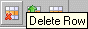

# Deleting Rows

To delete rows, proceed as follows:

1. Select the row you want to remove.
1. In the Row menu, select Delete.

The Row menu is also available as context menu in the table area.

or

1. Click .

The selected row is deleted.
