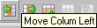
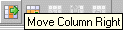

# Moving Columns

You can move columns but only within an area.

1. Mark the column you want to move.
1. In the Column menu, select Move Left or Move Right.

The Column menu is also available as context menu in the table area.

or

1. Click  or .

The column is moved one position to the left or right.

The first column of an area cannot be moved to the left, the last column of an area cannot be moved to the right. The methods column cannot be moved, it is always the last column in the instruction area.
