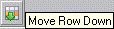

# Moving Rows

The further up the table a row is, the higher its priority. You can move the rows and thus influence the priority of the condition specified in it.

1. Mark the row you want to move.
1. In the Row menu, select Move Up or Move Down.

The Row menu is also available as context menu in the table area.

or

1. Click either  or .

The row is moved up or down a row.

The first row cannot be moved up, the last numbered row cannot be moved down. The default row cannot be moved, it is always the last row of the table.
