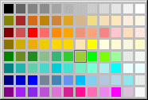

# Setting the Background Color

You can determine the background color for the condition area and instruction area.

1. Open the ASCET Options window.
1. Select the [Table](ComponentManagerEnglishUS.chm::/CM_options_for_table_editors.htm)node.
1. Open the Input Color combo box to select the background color for the condition area.

1. Open the Output Color combo box to select the background color for the instruction area.

A color selection prompter is displayed. The current color is marked.

1. Select the background color you want.
1. Close the Options window to accept the settings.

For the color selection to become effective, close and re-open the conditional table editor.

See also

[Table Options](ComponentManagerEnglishUS.chm::/CM_options_for_table_editors.htm)

[User Interface of the ASCET Options Window](ComponentManagerEnglishUS.chm::/cm_user_interface_of_the_ascet_options_window.htm)
