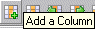

# Creating Columns in the Instruction Area

To create columns in the instruction area, proceed as follows:

You can create up to 100 columns in the instruction area.

1. In the Column menu, point to Add and select Instruction.

The Column menu is also available as context menu in the table area.

or

1. Activate the column next to which you want to add the new column.
1. Click .

The Select Variable window opens. It contains a list of all existing variables which as yet have not been assigned to a column of the instruction area.

1. Select a variable from the list.

You can assign each variable exactly once to a column of the instruction area.

Arguments of the trigger method cannot be assigned in the instruction area.

1. Click OK to close the window.

A column with the name of the selected variable is generated in the instruction area. Even if the column created is the first of the entire table, no row is created.

The new column is created to the left of the method column if it was created with the Column menu function, pointing to Add and selecting Instruction. If you used the  button, the new column is created to the right of the selected column.
