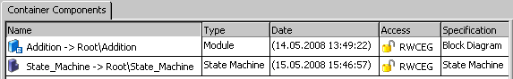
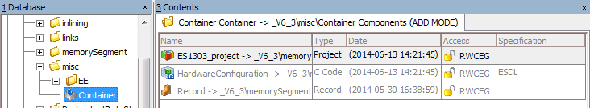

# Merged CHM Content

## Overview

_Source: `markdown/CNT_Overview.md`_

# Overview

Container components (available since ASCET 5.0) are used as containers for all kinds of ASCET components, i.e. AUTOSAR components, projects, modules, all kinds of classes, records, enumerations, etc. Their purpose is to structure models and databases/workspaces and place different database/workspace items under a common version control.

The containers in ASCET replace the networks of ASCET versions prior to ASCET 5.0. If you open an old database which contains networks, these networks are automatically converted into containers. The projects assigned to the different nodes of the network are added to the containers. Other information available in the network is not added.

Containers can contain all kinds of database/workspace items apart from folders, even other containers. Direct (the container contains itself) and indirect (the container contains a second container, which in turn contains the first) recursions are admissible. Each database/workspace item can only be contained once in the same container.

See also

[Working with Containers](markdown/CNT_working_containers.md)

[Component Manager - Database/Workspace Items](ComponentManagerEnglishUS.chm::/DatabaseItems.htm)

---

## Creating a Container

_Source: `markdown/CNT_Creating_a_Container.md`_

# Creating a Container

To create a container, proceed as follows:

1. In the 1 Database or 1 Workspace list, select the folder you want the new item to be in.
1. Do one of the following.
1. Edit the name and press Enter.

See also

[Sorting the Container View](markdown/CNT_sort_container_view.md)

[Invoking the Container View](markdown/CNT_invoke_containerview.md)

---

## Selecting the Container View

_Source: `markdown/CNT_invoke_containerview.md`_

# Selecting the Container View

To select the container view, proceed as follows:

1. In the 1 Database or 1 Workspace list of the Component Manager, select an existing container.

Or

1. [Create a container](markdown/CNT_Creating_a_Container.md).

The Container Components tab is displayed in the 3 Contents field. The content of the container, as well as the name, type, creation date and time, access rights and creation method of the objects inside are displayed.

1. Click anywhere in the Container Components tab to bring it into focus.

[Working with Containers](markdown/CNT_working_containers.md) explains how to work in this tab.

You can

[Create a container](markdown/CNT_Creating_a_Container.md)

[Work with containers](markdown/CNT_working_containers.md)

See also

[Container View](markdown/CNT_Container_View.md)

[Sorting the Container View](markdown/CNT_sort_container_view.md)

[Views in the Component Manager](ComponentManagerEnglishUS.chm::/ViewsinCM.htm)

---

## Working with Containers

_Source: `markdown/CNT_working_containers.md`_

# Working with Containers

Containers are (like enumerations) not edited in a special editor, but in the Component Manager. A context menu, similar to those of other views, is available to you there in the container view in the Container Components tab.

See also

[Creating a Container](markdown/CNT_Creating_a_Container.md)

[Invoking the Container View](markdown/CNT_invoke_containerview.md)

[Adding Database/Workspace Items (Context Menu)](markdown/CNT_add_databaseitem.md)

[Adding Database/Workspace Items (Drag & Drop)](markdown/CNT_add_database_dd.md)

[Adding Items via the Container View](markdown/CNT_AddItemsViaContainerView.md)

[Renaming Added Items](markdown/CNT_rename_added_items.md)

[Editing Items](markdown/CNT_edit_items.md)

[Deleting Items from the Container](markdown/CNT_delete_item_container.md)

[Sorting the Container View](markdown/CNT_sort_container_view.md)

---

## Adding Database/Workspace Items (Context Menu)

_Source: `markdown/CNT_add_databaseitem.md`_

# Adding Database/Workspace Items (Context Menu)

To add a database/workspace item (context menu/keyboard), proceed as follows:

1. Right-click in the Container Components tab and select Add from the context menu.
1. In the 1 Database or 1 Workspace list, select the components you want to add.
1. Click OK to add the items and close the Selected Items window.

The items are added to the container and displayed in the Container Components tab.

See also

[Adding Database/Workspace Items (Drag & Drop)](markdown/CNT_add_database_dd.md)

[Adding Items via the Container View](markdown/CNT_AddItemsViaContainerView.md)

---

## Adding Database/Workspace Items (Drag & Drop)

_Source: `markdown/CNT_add_database_dd.md`_

1. If you want to apply the answer Subfolders to all such cases, activate Don't show this message again.

In combination with Folders, Don't show this message again has no effect.

1. Click Subfolders or Folders to continue.

# Adding Database/Workspace Items (Drag & Drop)

To add database/workspace items via Drag & Drop, proceed as follows:

1. In the 1 Database or 1 Workspace list of the Component Manager, expand the folder containing the container to which the item is to be added.
1. In the 1 Database or 1 Workspace list or in the 3 Contents field, select the items or folders you want to add to the container.
1. Drag the items/folders to the container in the 1 Database or 1 Workspace list.
1. Continue [as follows](javascript:kadovTextPopup(this))<!-- kadovTextPopupInit('a1'); //-->.

The items are added to the container.

You can drag items from one container to another in the same way. The items are not removed from the first container.

See also

[Adding Database/Workspace Items (Context Menu)](markdown/CNT_add_databaseitem.md)

[Adding Items via the Container View](markdown/CNT_AddItemsViaContainerView.md)

/* Heikki Komulainen, Comet Computer GmbH 2004 */ cc_plus_pic = '&nbsp;'; cc_minus_pic = '&nbsp;'; cc_stat_pic = '&nbsp;'; gpstyle = ''; var iframes_created = 0; if (document.body && document.body.insertAdjacentHTML && document.getElementsByTagName && document.getElementById) { collect_popups(); set_poplinks_pictures(); if (iframes_created) { document.write(gpstyle); document.write('
<nobr><a id="einauslink" style="position:absolute;top:expression(document.body.scrollTop + this.offsetHeight - this.offsetHeight);left:expression(document.body.offsetWidth - (this.offsetWidth + 28));background:white;padding:5px" href="javascript:show_all_poptext()">Show all hidden text</a></nobr>
'); } } function collect_popups() { bsscpopups = new Array(); for (x = 0; x < document.links.length; x++) { if (document.links[x].href.indexOf("BSSCPopup")>-1) { seekmatch = /BSSCPopup.'[^'](markdown/+)'/; poplink = seekmatch.exec(document.links[x].href); poplink = "" + poplink; poplink = poplink.substring(poplink.indexOf("'")+1, poplink.lastIndexOf("'")); ifid = "CCGENIFRAMEID" + x; new_iframe = '<iframe id="' + ifid + '"src="' + poplink + '" onload="get_text(\'' + ifid + '\')" width="0" height="0" frameborder=0></iframe>'; document.links[x].parentNode.insertAdjacentHTML("afterEnd", new_iframe); gpid = "CCID_" + ifid; document.links[x].href = "javascript:expand_poptext('" + gpid + "')"; cc_plus = '' + cc_plus_pic + ''; document.links[x].insertAdjacentHTML("afterBegin", cc_plus); iframes_created = 1; } } }// end function function get_text(ifr_id) { frpars = document.frames[ifr_id].document.getElementsByTagName("body"); popbody = frpars[0].innerHTML; gpid = "CCID_" + ifr_id; if (!document.getElementById(gpid)) { //avoiding doubles document.getElementById(ifr_id).insertAdjacentHTML("afterEnd", '
'+popbody+'
'); } }//end function function expand_poptext(x_frame_id) { if (!document.getElementById(x_frame_id)) return; if (document.getElementById(x_frame_id).className == "CCGENPOPTEXTH") { document.getElementById(x_frame_id).className = "CCGENPOPTEXTV"; document.getElementById(x_frame_id).style.visibility = "visible"; if (document.getElementById("CCPMB_" + x_frame_id )) { document.getElementById("CCPMB_" + x_frame_id ).innerHTML = cc_minus_pic; } } else { document.getElementById(x_frame_id).className = "CCGENPOPTEXTH"; document.getElementById(x_frame_id).style.visibility = "hidden"; if (document.getElementById("CCPMB_" + x_frame_id )) { document.getElementById("CCPMB_" + x_frame_id ).innerHTML = cc_plus_pic; } } }// end function function show_all_poptext() { var pulldowntxt = document.getElementsByTagName("div"); for (b = 0; b < pulldowntxt.length; b++) { if (pulldowntxt[b].className == "droptext") { pulldowntxt[b].style.display=""; } } var gptxt = document.getElementsByTagName("div"); for (z = 0; z < gptxt.length; z++) { if (gptxt[z].className == "CCGENPOPTEXTH") { gptxt[z].className = "CCGENPOPTEXTV"; gptxt[z].style.visibility = "visible"; if (document.getElementById("CCPMB_" + gptxt[z].id )) { document.getElementById("CCPMB_" + gptxt[z].id ).innerHTML = cc_minus_pic; } } } var dxpoplinks = document.getElementsByTagName("a"); if (dxpoplinks) { for (pxl = 0; pxl < dxpoplinks.length; pxl++) { if (dxpoplinks[pxl].href.indexOf("kadovTextPopup")>-1) { if (document.getElementById("CCPMB_" + dxpoplinks[pxl].id)) { document.getElementById("CCPMB_" + dxpoplinks[pxl].id).innerHTML = cc_stat_pic; dxpoplinks[pxl].symbol = "minus"; } } } } document.getElementById('einauslink').innerText = 'Hide all hideable text'; document.getElementById('einauslink').href = "javascript:self.location.reload()"; self.focus(); }// end function function eat_click() { return false; }// end function function set_poplinks_pictures() { var dpoplinks = document.getElementsByTagName("a"); if (dpoplinks) { for (pl = 0; pl < dpoplinks.length; pl++) { if (dpoplinks[pl].href.indexOf("kadovTextPopup")>-1) { cc_plus = '' + cc_stat_pic + ''; //dpoplinks[pl].onmouseup = plusminuspoplink; dpoplinks[pl].insertAdjacentHTML("afterBegin", cc_plus); dpoplinks[pl].symbol = "plus"; } } } }// end function function plusminuspoplink() { if (document.getElementById("CCPMB_" + this.id)) { if (this.symbol == "plus") { document.getElementById("CCPMB_" + this.id).innerHTML = cc_minus_pic; this.symbol = "minus"; } else { document.getElementById("CCPMB_" + this.id).innerHTML = cc_plus_pic; this.symbol = "plus"; } } return true; }

---

## Adding Items via the Container View

_Source: `markdown/CNT_AddItemsViaContainerView.md`_

1. If you want to apply the answer Subfolders to all such cases, activate Don't show this message again.

In combination with Folders, Don't show this message again has no effect.

1. Click Subfolders or Folders to continue.

# Adding Items via the Container View

To add items to a container via the Container view, proceed as follows:

1. In the 1 Database or 1 Workspace list of the Component Manager, select the container to which you want to add the folder content.
1. Right-click in the [Container view](markdown/CNT_Container_View.md) and select Activate Add Mode from the context menu.
1. In the 1 Database or 1 Workspace list, select the items or folders you want to add to the container.
1. Drag the items to the Container view.
1. Continue [as follows](javascript:kadovTextPopup(this))<!-- kadovTextPopupInit('a2'); //-->.
1. Right-click in the Container view and select Activate Add Mode from the context menu to deactivate the Add Mode.

See also

[Container View](markdown/CNT_Container_View.md)

[Adding a Database/Workspace Item (Context Menu)](markdown/CNT_add_databaseitem.md)

[Adding a Database/Workspace Item (Drag & Drop)](markdown/CNT_add_database_dd.md)

[Confirmation Dialog Options](ComponentManagerEnglishUS.chm::/CM_Options_for_Confirmation_Dialogs.htm)

/* Heikki Komulainen, Comet Computer GmbH 2004 */ cc_plus_pic = '&nbsp;'; cc_minus_pic = '&nbsp;'; cc_stat_pic = '&nbsp;'; gpstyle = ''; var iframes_created = 0; if (document.body && document.body.insertAdjacentHTML && document.getElementsByTagName && document.getElementById) { collect_popups(); set_poplinks_pictures(); if (iframes_created) { document.write(gpstyle); document.write('
<nobr><a id="einauslink" style="position:absolute;top:expression(document.body.scrollTop + this.offsetHeight - this.offsetHeight);left:expression(document.body.offsetWidth - (this.offsetWidth + 28));background:white;padding:5px" href="javascript:show_all_poptext()">Show all hidden text</a></nobr>
'); } } function collect_popups() { bsscpopups = new Array(); for (x = 0; x < document.links.length; x++) { if (document.links[x].href.indexOf("BSSCPopup")>-1) { seekmatch = /BSSCPopup.'[^'](markdown/+)'/; poplink = seekmatch.exec(document.links[x].href); poplink = "" + poplink; poplink = poplink.substring(poplink.indexOf("'")+1, poplink.lastIndexOf("'")); ifid = "CCGENIFRAMEID" + x; new_iframe = '<iframe id="' + ifid + '"src="' + poplink + '" onload="get_text(\'' + ifid + '\')" width="0" height="0" frameborder=0></iframe>'; document.links[x].parentNode.insertAdjacentHTML("afterEnd", new_iframe); gpid = "CCID_" + ifid; document.links[x].href = "javascript:expand_poptext('" + gpid + "')"; cc_plus = '' + cc_plus_pic + ''; document.links[x].insertAdjacentHTML("afterBegin", cc_plus); iframes_created = 1; } } }// end function function get_text(ifr_id) { frpars = document.frames[ifr_id].document.getElementsByTagName("body"); popbody = frpars[0].innerHTML; gpid = "CCID_" + ifr_id; if (!document.getElementById(gpid)) { //avoiding doubles document.getElementById(ifr_id).insertAdjacentHTML("afterEnd", '
'+popbody+'
'); } }//end function function expand_poptext(x_frame_id) { if (!document.getElementById(x_frame_id)) return; if (document.getElementById(x_frame_id).className == "CCGENPOPTEXTH") { document.getElementById(x_frame_id).className = "CCGENPOPTEXTV"; document.getElementById(x_frame_id).style.visibility = "visible"; if (document.getElementById("CCPMB_" + x_frame_id )) { document.getElementById("CCPMB_" + x_frame_id ).innerHTML = cc_minus_pic; } } else { document.getElementById(x_frame_id).className = "CCGENPOPTEXTH"; document.getElementById(x_frame_id).style.visibility = "hidden"; if (document.getElementById("CCPMB_" + x_frame_id )) { document.getElementById("CCPMB_" + x_frame_id ).innerHTML = cc_plus_pic; } } }// end function function show_all_poptext() { var pulldowntxt = document.getElementsByTagName("div"); for (b = 0; b < pulldowntxt.length; b++) { if (pulldowntxt[b].className == "droptext") { pulldowntxt[b].style.display=""; } } var gptxt = document.getElementsByTagName("div"); for (z = 0; z < gptxt.length; z++) { if (gptxt[z].className == "CCGENPOPTEXTH") { gptxt[z].className = "CCGENPOPTEXTV"; gptxt[z].style.visibility = "visible"; if (document.getElementById("CCPMB_" + gptxt[z].id )) { document.getElementById("CCPMB_" + gptxt[z].id ).innerHTML = cc_minus_pic; } } } var dxpoplinks = document.getElementsByTagName("a"); if (dxpoplinks) { for (pxl = 0; pxl < dxpoplinks.length; pxl++) { if (dxpoplinks[pxl].href.indexOf("kadovTextPopup")>-1) { if (document.getElementById("CCPMB_" + dxpoplinks[pxl].id)) { document.getElementById("CCPMB_" + dxpoplinks[pxl].id).innerHTML = cc_stat_pic; dxpoplinks[pxl].symbol = "minus"; } } } } document.getElementById('einauslink').innerText = 'Hide all hideable text'; document.getElementById('einauslink').href = "javascript:self.location.reload()"; self.focus(); }// end function function eat_click() { return false; }// end function function set_poplinks_pictures() { var dpoplinks = document.getElementsByTagName("a"); if (dpoplinks) { for (pl = 0; pl < dpoplinks.length; pl++) { if (dpoplinks[pl].href.indexOf("kadovTextPopup")>-1) { cc_plus = '' + cc_stat_pic + ''; //dpoplinks[pl].onmouseup = plusminuspoplink; dpoplinks[pl].insertAdjacentHTML("afterBegin", cc_plus); dpoplinks[pl].symbol = "plus"; } } } }// end function function plusminuspoplink() { if (document.getElementById("CCPMB_" + this.id)) { if (this.symbol == "plus") { document.getElementById("CCPMB_" + this.id).innerHTML = cc_minus_pic; this.symbol = "minus"; } else { document.getElementById("CCPMB_" + this.id).innerHTML = cc_plus_pic; this.symbol = "plus"; } } return true; }

---

## Renaming Added Items

_Source: `markdown/CNT_rename_added_items.md`_

# Renaming Added Items

To rename added items, proceed as follows:

If you rename an item in a container, the original database/workspace item is also renamed. This is not the case when items added to components or projects are renamed.

1. Mark the item you want to rename in the Container Components tab.
1. Do one of the following:
1. Enter a new name and press Return.

The item is renamed both in the container and in the database/workspace.

Item names must not begin with a number. If you enter a name that begins with a number, an allowed name is suggested instead.

See also

[Reserved Keywords](IntroductionEnglishUS.chm::/INT_Reserved_Keywords.htm)

---

## Editing Items

_Source: `markdown/CNT_edit_items.md`_

# Editing Items

To edit items, proceed as follows:

You can open an item you want to edit from within the container the same way as from a folder.

1. In the Container Components tab, mark the item you want to edit.
1. Do one of the following.

- In the Edit menu, select Open Component.
- In the context menu, select Edit.
- Press Return.
- Double-click the item to open the component editor.

If the item is a container, it is selected in the 1 Database or 1 Workspace field and displayed in the 3 Container Components field.

---

## Deleting Items from the Container

_Source: `markdown/CNT_delete_item_container.md`_

# Deleting Items from the Container

To delete items from the container, proceed as follows:

1. Mark the items you want to delete in the Container components tab.
1. To select all items, do one of the following:
1. To delete the selected items from the container, do one of the following:

- In the context menu, select Delete.
- Press Del to delete the selected items from the container.

The items are only deleted from the container, not from the database/workspace.

---

## Sorting the Container View

_Source: `markdown/CNT_sort_container_view.md`_

# Sorting the Container View

To sort the container view, proceed as follows:

- In the context menu, point to Sort by and select <column>

or

- Click on the name of a column to sort the display according to the relevant column.

---

## Container View

_Source: `markdown/CNT_Container_View.md`_

- Edit

Opens the component in the appropriate editor (see [Editing Items](markdown/CNT_edit_items.md)).

- Add

Adds database/workspace items to the container (see [Adding Database/Workspace Items (Context Menu)](markdown/CNT_add_databaseitem.md)).

- Activate Add Mode

Activated the Add Mode of the Container view (see [Adding Items via the Container View](markdown/CNT_AddItemsViaContainerView.md)).

- Rename

Renames a component in the container and in the database/workspace (see [Deleting Items from the Container](markdown/CNT_delete_item_container.md)).

- Delete

Deletes a component from the container (see [Deleting Items from the Container](markdown/CNT_delete_item_container.md)).

- Sort By

Sorts the Container view by the selected <column>.

- Select All

Selects all components in the container.

# Container View

When you select the Container view, the 3 Contents field displays the Container Components tab. This tab contains the following columns:

- Name

This column contains symbols, names and database/workspace paths of the items in the selected container.

- Type

This column contains the types of the items in the selected folder.

- Date

This column shows date and time of the last change of the items in the selected folder.

- Access

This column shows the access rights of the items in the selected folder. Missing access rights are denoted by -.

| Column 1 | Column 2 |
| --- | --- |
| R | Read access |
| W | Write access |
| C | Calibration access |
| E | Execute access |
| G | Code Generation access |

The icons in this column show whether the item is write-protected () or not ().

In a workspace, this column always contains the entry " RWCEG".

- Specification

This column shows the specification mode of the components in the selected folder. Possible values are Block Diagram, C Code, ESDL and State Machine. If neither of these is applicable, the column remains empty.

- [context menu](javascript:kadovTextPopup(this))<!-- kadovTextPopupInit('a1'); //-->

See also

[Invoking the Container View](markdown/CNT_invoke_containerview.md)

[Access Rights](ComponentManagerEnglishUS.chm::/DatabaseAccess.htm)

[Views in the Component Manager](ComponentManagerEnglishUS.chm::/ViewsinCM.htm)

[Symbols for Database/Workspace Items](ComponentManagerEnglishUS.chm::/DescriptionofSymbols.htm)

/* Heikki Komulainen, Comet Computer GmbH 2004 */ cc_plus_pic = '&nbsp;'; cc_minus_pic = '&nbsp;'; cc_stat_pic = '&nbsp;'; gpstyle = ''; var iframes_created = 0; if (document.body && document.body.insertAdjacentHTML && document.getElementsByTagName && document.getElementById) { collect_popups(); set_poplinks_pictures(); if (iframes_created) { document.write(gpstyle); document.write('
<nobr><a id="einauslink" style="position:absolute;top:expression(document.body.scrollTop + this.offsetHeight - this.offsetHeight);left:expression(document.body.offsetWidth - (this.offsetWidth + 28));background:white;padding:5px" href="javascript:show_all_poptext()">Show all hidden text</a></nobr>
'); } } function collect_popups() { bsscpopups = new Array(); for (x = 0; x < document.links.length; x++) { if (document.links[x].href.indexOf("BSSCPopup")>-1) { seekmatch = /BSSCPopup.'[^'](markdown/+)'/; poplink = seekmatch.exec(document.links[x].href); poplink = "" + poplink; poplink = poplink.substring(poplink.indexOf("'")+1, poplink.lastIndexOf("'")); ifid = "CCGENIFRAMEID" + x; new_iframe = '<iframe id="' + ifid + '"src="' + poplink + '" onload="get_text(\'' + ifid + '\')" width="0" height="0" frameborder=0></iframe>'; document.links[x].parentNode.insertAdjacentHTML("afterEnd", new_iframe); gpid = "CCID_" + ifid; document.links[x].href = "javascript:expand_poptext('" + gpid + "')"; cc_plus = '' + cc_plus_pic + ''; document.links[x].insertAdjacentHTML("afterBegin", cc_plus); iframes_created = 1; } } }// end function function get_text(ifr_id) { frpars = document.frames[ifr_id].document.getElementsByTagName("body"); popbody = frpars[0].innerHTML; gpid = "CCID_" + ifr_id; if (!document.getElementById(gpid)) { //avoiding doubles document.getElementById(ifr_id).insertAdjacentHTML("afterEnd", '
'+popbody+'
'); } }//end function function expand_poptext(x_frame_id) { if (!document.getElementById(x_frame_id)) return; if (document.getElementById(x_frame_id).className == "CCGENPOPTEXTH") { document.getElementById(x_frame_id).className = "CCGENPOPTEXTV"; document.getElementById(x_frame_id).style.visibility = "visible"; if (document.getElementById("CCPMB_" + x_frame_id )) { document.getElementById("CCPMB_" + x_frame_id ).innerHTML = cc_minus_pic; } } else { document.getElementById(x_frame_id).className = "CCGENPOPTEXTH"; document.getElementById(x_frame_id).style.visibility = "hidden"; if (document.getElementById("CCPMB_" + x_frame_id )) { document.getElementById("CCPMB_" + x_frame_id ).innerHTML = cc_plus_pic; } } }// end function function show_all_poptext() { var pulldowntxt = document.getElementsByTagName("div"); for (b = 0; b < pulldowntxt.length; b++) { if (pulldowntxt[b].className == "droptext") { pulldowntxt[b].style.display=""; } } var gptxt = document.getElementsByTagName("div"); for (z = 0; z < gptxt.length; z++) { if (gptxt[z].className == "CCGENPOPTEXTH") { gptxt[z].className = "CCGENPOPTEXTV"; gptxt[z].style.visibility = "visible"; if (document.getElementById("CCPMB_" + gptxt[z].id )) { document.getElementById("CCPMB_" + gptxt[z].id ).innerHTML = cc_minus_pic; } } } var dxpoplinks = document.getElementsByTagName("a"); if (dxpoplinks) { for (pxl = 0; pxl < dxpoplinks.length; pxl++) { if (dxpoplinks[pxl].href.indexOf("kadovTextPopup")>-1) { if (document.getElementById("CCPMB_" + dxpoplinks[pxl].id)) { document.getElementById("CCPMB_" + dxpoplinks[pxl].id).innerHTML = cc_stat_pic; dxpoplinks[pxl].symbol = "minus"; } } } } document.getElementById('einauslink').innerText = 'Hide all hideable text'; document.getElementById('einauslink').href = "javascript:self.location.reload()"; self.focus(); }// end function function eat_click() { return false; }// end function function set_poplinks_pictures() { var dpoplinks = document.getElementsByTagName("a"); if (dpoplinks) { for (pl = 0; pl < dpoplinks.length; pl++) { if (dpoplinks[pl].href.indexOf("kadovTextPopup")>-1) { cc_plus = '' + cc_stat_pic + ''; //dpoplinks[pl].onmouseup = plusminuspoplink; dpoplinks[pl].insertAdjacentHTML("afterBegin", cc_plus); dpoplinks[pl].symbol = "plus"; } } } }// end function function plusminuspoplink() { if (document.getElementById("CCPMB_" + this.id)) { if (this.symbol == "plus") { document.getElementById("CCPMB_" + this.id).innerHTML = cc_minus_pic; this.symbol = "minus"; } else { document.getElementById("CCPMB_" + this.id).innerHTML = cc_plus_pic; this.symbol = "plus"; } } return true; }

---

