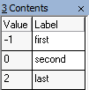
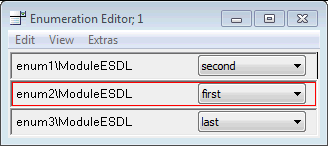
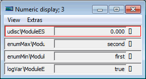
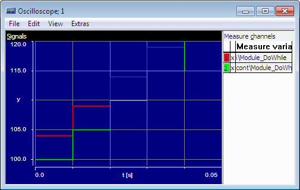
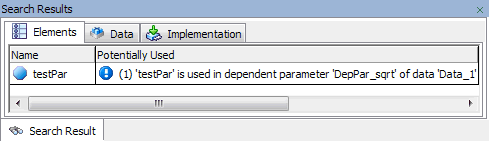

# Merged CHM Content

## Overview

_Source: `markdown/ESDL_Overview.md`_

# Overview - ESDL Editor

The ESDL editor is used to specify components in ESDL code. ESDL components can either be classes, modules or continuous time blocks. A class in ESDL code works in the same way as a class specified as a block diagram. When it is used by another component, it looks and behaves just like a class specified as a block diagram.

Before working with ESDL, you should be familiar with creating classes as block diagrams, as explained in [Block Diagram Editor](BlockDiagramEditorEnglishUS.chm::/BDE_Overview.htm).

Users are assumed to be familiar with either the C or Java programming language (or both). If you need further information on C or Java, you can use any of the standard reference manuals for these languages.

The following is a list of some common reference manuals for Java and C:

- Arnold, Ken, Gosling, James, The Java Programming Language (Reading,Mass Addison Wesley, 1996)
- Flanagan, David, Java in a Nutshell (Cambridge, Mass.: O’Reilly, 2/1997).
- Kernighan, Brian W., Ritchie, Dennis M., The C Programming Language (Englewood Cliffs: Prentice-Hall, 2/1988).

See also

[Block Diagram Editor - Overview](BlockDiagramEditorEnglishUS.chm::/BDE_Overview.htm)

[Specifying Modules in ESDL](markdown/specifying_modules.md)

[Analyzing ESDL Components](markdown/ESDL_analyzing_esdl_components.md)

[External Editor](markdown/external_editor.md)

---

## ESDL as a Modelling Language

_Source: `markdown/esdl_esdl_as_modellinglanguage.md`_

# ESDL as a Modelling Language

ESDL was designed specifically as a modelling language for the automotive environment. In ASCET, it is used to specify the method or process bodies within classes or modules. For simplicity, classes and modules are subsumed under the term classes in this section.

In ESDL, both the syntax and elements are based on the Java programming language to provide for a low learning curve. When working with ESDL, however, it is important to keep in mind that ESDL is radically different from other languages.

The main characteristics, which in part distinguish ESDL from other languages, are as follows:

- ESDL is a modelling language, not a programming language. It is a modeling language that works on the same abstract, physical level of description as the block diagrams commonly used in ASCET. Concepts that are related to or dependent on implementation, such as pointers or shift operators, are not available.
- ESDL is used for systems that run in a real-time environment. Hence, it must meet the requirements of real-time operation. As a consequence, ESDL is as object-oriented as these parameters permit. The model structure can be mapped to classes and modules, but instantiation is static and there is no inheritance.
- ESDL is used to build automotive software. While users can build complex software models in ESDL, concepts that are currently not relevant to embedded systems, such as string operations, are not implemented.
- ESDL ties in seamlessly with the ASCET development environment. The language is used at the same level as block diagrams, that is, for describing the functions contained in method or process bodies. Import of elements and variable declaration are performed using the corresponding tools in the ESDL editor.

These four main characteristics of ESDL determine the scope and usage of the language. Otherwise ESDL can—more or less—be seen as a highly specialized variant of the Java programming language.

See

[Working with Methods and Processes](markdown/esdl_working_with_methods_and_processes.md)

[ESDL Syntax](markdown/ESDL_ESDL_Syntax.md)

[Implementation Casts in ESDL](markdown/ESDL_Implementation_Casts_in_ESDL.md)

[Methods](markdown/ESDL_Methods.md)

[Overview - Composite Data Types](markdown/ESDL_Overview_-_Composite_Data_Types.md)

[Literals and Constants](markdown/literals_and_constants.md)

[Comments](markdown/ESDL_Comments.md)

[Structures](markdown/ESDL_Structures.md)

[Messages](markdown/ESDL_Messages.md)

[Mathematical Functions](markdown/ESDL_Mathematical_Functions.md)

[Specifying Modules in ESDL](markdown/specifying_modules.md)

---

## Working with Methods and Processes

_Source: `markdown/esdl_working_with_methods_and_processes.md`_

# Working with Methods and Processes

The basic elements of a functional description in ESDL are methods and processes. A method/process consists of a method/process header, which servers as an identifier, and the method/process body, which describes the operations to be performed.

The method/process header consists of the method name, a list of arguments and a return value. Method/process names are assigned when adding a new item to the methods list (Outline tab) of the ESDL Editor. They can be modified by renaming the list item.

Method/process names must be unique in ESDL. Method overloading is not supported, i.e. it is not possible for two methods to differ from each other only in the number of parameters and/or parameter types.

The arguments and the return value are optional elements of the method/process interface. The method/process header and interface can be modified using the signature editor on the ESDL Editor window. The signature editor is used to add or modify parameters and the return value as needed.

The functional description of a model is contained in the method/process body which can be edited in the text pane of the ESDL Editor.

See also

[ESDL Syntax](markdown/ESDL_ESDL_Syntax.md)

[Variable Names](markdown/ESDL_Variable_Names.md)

[Reserved Keywords](IntroductionEnglishUS.chm::/INT_Reserved_Keywords.htm)

[Data Types](markdown/ESDL_Data_Types.md)

[Type Conversion](markdown/ESDL_Type_Conversion.md)

[Primitive Methods](markdown/ESDL_Primitive_Methods.md)

[Implementation Casts in ESDL](markdown/ESDL_Implementation_Casts_in_ESDL.md)

[Methods](markdown/ESDL_Methods.md)

[Signature Editor](BlockDiagramEditorEnglishUS.chm::/bde_interface_editor.htm)

---

## ESDL Syntax

_Source: `markdown/ESDL_ESDL_Syntax.md`_

# ESDL Syntax

ESDL syntax is entirely the same as that of the Java programming language. Every statement in ESDL is terminated by a semicolon (;).

Timer.calculate();

x = a + b;

tmp = Timer.out();

Compound statements or blocks are contained in curly braces { ... }

if (x > 0) {

y = f(x);

z =1; }

Method parameters and expressions are contained in parentheses ( ... )

while (z > 4) {

z--;}

Integrator.reset(15);

Limiter.out(0, 15, 100);

The equals sign (=) is used for assignments.

low = -1;

xVar = a * (b-5);

tmp = xVar.max(15);

See also

[Working with Methods and Processes](markdown/esdl_working_with_methods_and_processes.md)

[Variable Names](markdown/ESDL_Variable_Names.md)

[Data Types](markdown/ESDL_Data_Types.md)

[Type Conversion](markdown/ESDL_Type_Conversion.md)

[Primitive Methods](markdown/ESDL_Primitive_Methods.md)

[Implementation Casts in ESDL](markdown/ESDL_Implementation_Casts_in_ESDL.md)

---

## Variable Names

_Source: `markdown/ESDL_Variable_Names.md`_

# Variable Names

In ESDL, variables names are made up of letters and digits. The first element of a variable name must be a letter. The underscore character counts as a letter. Variable names must not contain spaces.

The following are valid ESDL variable names:

i, j2a, aVar, a_Var

The names of all variables must be unique within the scope of the current element. This limitation is important when working with imported classes or modules. ESDL does not, at this stage, resolve name conflicts.

Reserved Keywords:

Several keywords are reserved and may not be used as variable names; see [Reserved Keywords](IntroductionEnglishUS.chm::/INT_Reserved_Keywords.htm) for a list. Since upper and lower case are not distinguished, any spelling of the listed names is reserved.

See also

[Reserved Keywords](IntroductionEnglishUS.chm::/INT_Reserved_Keywords.htm)

[Working with Methods and Processes](markdown/esdl_working_with_methods_and_processes.md)

[ESDL Syntax](markdown/ESDL_ESDL_Syntax.md)

[Data Types](markdown/ESDL_Data_Types.md)

[Type Conversion](markdown/ESDL_Type_Conversion.md)

[Primitive Methods](markdown/ESDL_Primitive_Methods.md)

[Implementation Casts in ESDL](markdown/ESDL_Implementation_Casts_in_ESDL.md)

---

## Data Types

_Source: `markdown/ESDL_Data_Types.md`_

# Data Types

ESDL is strongly typed and variables must be declared. The procedure here is the same as when editing block diagrams. Variables are added to the elements list and can then be edited as needed.

The following data types are available in ESDL: limitInt, wrapInt, udisc, sdisc, cont and log. They can be added to a class or module by selecting the corresponding element from the editor toolbar.

The ESDL method or process body itself does not contain variable declarations. Only variables local to the current method/process can be declared and initialized in the method body using a statement like the following:

cont set = 12.34;

cont temp = 0.78e4;

udisc i = 3, j, k;

sdisc aVar = -12;

log trigger = true;

You cannot declare and initialize method-/process-local elements of limitInt and wrapInt types in the method/process body. Use the Locals tab in the [signature editor](BlockDiagramEditorEnglishUS.chm::/bde_interface_editor.htm) instead.

See also

[Scalar Types: Limited Integer](IntroductionEnglishUS.chm::/INT_ScalarTypes_LimitedInteger.htm)

[Scalar Types: Wrap-Around Integer](IntroductionEnglishUS.chm::/INT_ScalarTypes_WrapAroundInteger.htm)

[Scalar Types - Summary](IntroductionEnglishUS.chm::/INT_scalar_summary.htm)

[Working with Methods and Processes](markdown/esdl_working_with_methods_and_processes.md)

[ESDL Syntax](markdown/ESDL_ESDL_Syntax.md)

[Variable Names](markdown/ESDL_Variable_Names.md)

[Type Conversion](markdown/ESDL_Type_Conversion.md)

[Primitive Methods](markdown/ESDL_Primitive_Methods.md)

[Implementation Casts in ESDL](markdown/ESDL_Implementation_Casts_in_ESDL.md)

[Signature Editor](BlockDiagramEditorEnglishUS.chm::/bde_interface_editor.htm)

---

## Type Conversion

_Source: `markdown/ESDL_Type_Conversion.md`_

# Type Conversion

Whenever a basic arithmetic operator like +, -, *, / has operands of different types, the result is automatically converted to that of the strongest type used in the expression.

The order of types is (from weak to strong): sdisc, udisc, cont.

cont result = varUdisc + varCont;

When assigning a value to a variable the data types must match. There is no explicit type casting. Only for the basic arithmetic types signed discrete, unsigned discrete and continuous does ESDL perform an implicit conversion.

cont tmp = 2;

A conversion of boolean and arithmetic types is not possible.

See also

[Working with Methods and Processes](markdown/esdl_working_with_methods_and_processes.md)

[ESDL Syntax](markdown/ESDL_ESDL_Syntax.md)

[Variable Names](markdown/ESDL_Variable_Names.md)

[Data Types](markdown/ESDL_Data_Types.md)

[Primitive Methods](markdown/ESDL_Primitive_Methods.md)

[Implementation Casts in ESDL](markdown/ESDL_Implementation_Casts_in_ESDL.md)

---

## Primitive Methods

_Source: `markdown/ESDL_Primitive_Methods.md`_

# Primitive Methods

Every arithmetic type has a predefined interface which covers a set of basic math functions. The following messages are available for all arithmetic types:

| Column 1 | Column 2 | Column 3 | Column 4 |
| --- | --- | --- | --- |
| Method | Receiver | Returns | Usage |
| val.abs() | arithmetic | arithmetic | absolute value of val |
| val1.max(val2) | arithmetic | arithmetic | the greater of two values |
| val1.min(val2) | arithmetic | arithmetic | the smaller of two values |
| var.between(val1, val2) | arithmetic | log | var between val1 and val2 |

The var.between(val1,val2 ) method corresponds to the between:And: element in block diagrams.

See also

[Methods](markdown/ESDL_Methods.md)

[Working with Methods and Processes](markdown/esdl_working_with_methods_and_processes.md)

[ESDL Syntax](markdown/ESDL_ESDL_Syntax.md)

[Variable Names](markdown/ESDL_Variable_Names.md)

[Data Types](markdown/ESDL_Data_Types.md)

[Type Conversion](markdown/ESDL_Type_Conversion.md)

[Implementation Casts in ESDL](markdown/ESDL_Implementation_Casts_in_ESDL.md)

---

## Implementation Casts in ESDL

_Source: `markdown/ESDL_Implementation_Casts_in_ESDL.md`_

# Implementation Casts in ESDL

Implementation casts (see [Overview - Implementation Casts](IntroductionEnglishUS.chm::/INT_implementation_casts.htm)) are available in ESDL for modules and classes (except CT blocks).

In the specification of an operation in ESDL, implementation casts must be represented by their names. An addition with implementation casts that appears as follows in BDE:

is represented as a function in ESDL as such:

c = cast_3 ( cast_1 (a) + cast_2 (b) );

Here it is important that an implementation cast is written like a method call: it is always placed before the element to which it refers; the element is enclosed in parentheses, like a method argument. If the implementation cast is to be applied to the result of an operation, the entire operation must be enclosed in parentheses.

In the example above, cast_1 refers to variable a, cast_2 to b and cast_3 to the result of the operation a + b.

If intermediate results of arithmetic operations are to be manipulated using an implementation cast, the corresponding intermediate results have to be enclosed in parentheses.

Thus, in this statement:

x = cast_1 ( (cast_2 ( (a + b) * c - d ) ) / e );

cast_2 refers to the intermediate result of the operation,

(a + b) * c - d

while cast_1 changes the overall result of the operation:

((a + b) * c - d) / e

An implementation cast in ESDL always refers to the value in the code that immediately follows the implementation cast.

It is important to note here, that the use of the syntax as described above is limited to implementation casts. The parentheses must contain an existing implementation cast; if you specify a standard type, such as uint8 (a), an error message is displayed.

When using implementation casts, remember that they are not available for use with logical variables. If an implementation cast is applied to a logical variable, the code generator generates an error message.

See also

[Overview - Implementation Casts](IntroductionEnglishUS.chm::/INT_implementation_casts.htm)

[Working with Methods and Processes](markdown/esdl_working_with_methods_and_processes.md)

[ESDL Syntax](markdown/ESDL_ESDL_Syntax.md)

[Variable Names](markdown/ESDL_Variable_Names.md)

[Data Types](markdown/ESDL_Data_Types.md)

[Type Conversion](markdown/ESDL_Type_Conversion.md)

[Primitive Methods](markdown/ESDL_Primitive_Methods.md)

---

## Methods

_Source: `markdown/ESDL_Methods.md`_

# Methods

The functional description of a software model in ESDL is contained in methods. The methods perform calculations and manipulate data. They are invoked (or called) as operations on objects.

A method call has the general form

receiverClassName.doSomething(parameterList)

where receiverClassName is the name of the receiver object, which ’executes’ the doSomething method. Parameters can be passed on as either a comma-separated list or a single parameter in the parameterList. Any expression can be a parameter, including method calls.

The following are valid method calls in ESDL.

If a method has no parameters, the parentheses at the end of the method name still have to be supplied for the statement to be interpreted as a method call.

loader.resolve(false, 1.76); //do not use characteristic, calculate value for 1.76

numbers.setAt(10*index, index); //set array numbers to 10*index at index

(12.4)between(valA, valB); //check if 12 is between valA and valB

array.length(); //return array length

Access to the length of an array or matrix via length() is not supported for microcontroller targets.

See also

[Methods with a Return Value](markdown/ESDL_Methods_with_a_Return_Value.md)

[Nested Methods](markdown/ESDL_Nested_Methods.md)

[This](markdown/this.md)

[Access Control](markdown/esdl_access_control.md)

[Direct Access Methods](markdown/ESDL_Direct_Access_Methods.md)

[Primitive Methods](markdown/ESDL_Primitive_Methods.md)

[Conversion of Methods or Processes](BlockDiagramEditorEnglishUS.chm::/BDE_Conversion_MethodsProcesses.htm)

---

## Methods with a Return Value

_Source: `markdown/ESDL_Methods_with_a_Return_Value.md`_

# Methods with a Return Value

A method call can return a value, which can in turn be assigned to a variable in the method call. The variable must be of the same type as the return value.

aNumber =anArray. getAt(index); //assign value from index position

anOffset =loader. resolve(true, 2.14); //assign value for 2.14, calculate using characteristic

If a method has a return value, the method body must be terminated with a return statement. The return statement can be followed by any expression that evaluates to the return type of the method.

return in.between(ub, lb); // returns a logical value

return intVar; //returns the value of intVar

A method call can return only a single value. If more than one value is to be passed on between modules or objects, an object can be used to hold these values (see [Structures](markdown/ESDL_Structures.md)).

Method calls cannot be nested in ESDL. The following statement is illegal:

loader.resolve(true, 2.14).sqrt();

It must be replaced with the following, legal statement:

aNumber = loader.resolve(true, 2.14);

aNumber.sqrt();

See also

[Methods](markdown/ESDL_Methods.md)

[Nested Methods](markdown/ESDL_Nested_Methods.md)

[This](markdown/this.md)

[Access Control](markdown/esdl_access_control.md)

[Direct Access Methods](markdown/ESDL_Direct_Access_Methods.md)

---

## Nested Methods

_Source: `markdown/ESDL_Nested_Methods.md`_

# Nested Methods

Only if direct access methods are enabled for access to an object’s variable, can a method call be nested. Hence, the following nested statement is legal if aa is a variable defined in anObject:

anObject.aa().sqrt()

See also

[Methods](markdown/ESDL_Methods.md)

[Methods with a Return Value](markdown/ESDL_Methods_with_a_Return_Value.md)

[This](markdown/this.md)

[Access Control](markdown/esdl_access_control.md)

[Direct Access Methods](markdown/ESDL_Direct_Access_Methods.md)

---

## This

_Source: `markdown/this.md`_

# This

The pseudo-identifier this can be used in ESDL to call a method at the current component. If, for example, you want to call the private method initCounter at the current object, you can use the following statement:

this.initCounter();

If the initCounter method has a return value, you can assign it as follows:

aValue = this.initCounter();

The reference to the current object using the this identifier is optional in both these cases because it is implicit in the context. Hence, the above statements can be written as follows:

initCounter;

aValue = initCounter();

Only if the current object is to be passed on as a parameter to another method, is the reference using this needed.

OtherObject.evaluate(this);

Here, the identifier this passes on a reference to the current object.

While ESDL accepts both the self and the this identifier, it is recommended to use this to ensure compatibility with Java syntax.

See also

[Methods](markdown/ESDL_Methods.md)

[Methods with a Return Value](markdown/ESDL_Methods_with_a_Return_Value.md)

[Nested Methods](markdown/ESDL_Nested_Methods.md)

[Access Control](markdown/esdl_access_control.md)

[Direct Access Methods](markdown/ESDL_Direct_Access_Methods.md)

---

## Access Control

_Source: `markdown/esdl_access_control.md`_

# Access Control

In ESDL, both the methods and variables of a class can be declared as either public or private to control access to these elements and hide their implementation from other objects.

Private methods can be called and private variables manipulated only from within the current object. By contrast, public methods can be called and public variables accessed from both within and outside the current object.

Methods are declared public or private by assigning them to a corresponding diagram in the ESDL Editor. The default for new objects is to have a single public diagram Main which contains the calc method.

Users can create additional public methods in the same diagram or add a new diagram. Private methods must be created as part of a private diagram. The access rights to a method can be changed by moving it from one diagram to another.

An object Caller can access the public interface of another object Receiver if the latter has been imported by adding it to the Elements list for Caller.

New variables are created as private when they are added to the Elements list in the ESDL editor. They cannot be accessed from outside the current object. The status of a variable can be modified only in the element editor for that object (see [Editing an Element Configuration](elementeditorenglishus.chm::/EEd_edit_element_configuration.htm)).

See also

[Methods](markdown/ESDL_Methods.md)

[Methods with a Return Value](markdown/ESDL_Methods_with_a_Return_Value.md)

[Nested Methods](markdown/ESDL_Nested_Methods.md)

[This](markdown/this.md)

[Direct Access Methods](markdown/ESDL_Direct_Access_Methods.md)

[Editing an Element Configuration](elementeditorenglishus.chm::/EEd_edit_element_configuration.htm)

---

## Direct Access Methods

_Source: `markdown/ESDL_Direct_Access_Methods.md`_

# Direct Access Methods

Every public variable automatically adds two methods to the current object’s interface, which are referred to as direct access methods. A direct access method can be called to access the data in a public variable. It can be used for both read and write access to that variable.

In the following example, suppose that the VisibleObject has two public variables named free and all respectively. Method calls from outside can be as follows:

sdisc tmp = VisibleObject.all();

VisibleObject.free(120);

Direct access methods are generated automatically and added to the public interface of an object whenever a variable is declared public. These methods do not have to be coded explicitly.

See also

[Methods](markdown/ESDL_Methods.md)

[Methods with a Return Value](markdown/ESDL_Methods_with_a_Return_Value.md)

[Nested Methods](markdown/ESDL_Nested_Methods.md)

[This](markdown/this.md)

[Access Control](markdown/esdl_access_control.md)

---

## Composite Data Types

_Source: `markdown/ESDL_Overview_-_Composite_Data_Types.md`_

# Overview - Composite Data Types

ESDL provides two groups of composite data types. The first group of composite types comprises common arrays and matrices, the second group is used for characteristic lines and maps.

Composite data types are explained in the following subsections, with arrays and matrices first and characteristic lines/maps and distributions to follow suit.

See

[Arrays - Description](markdown/ESDL_Arrays_-_Description.md)

[Matrices - Description](markdown/esdl_matrices_-_description.md)

[Characteristic Lines](markdown/ESDL_One-Dimensional_Tables_-_Description.md)

[Characteristic Maps](markdown/ESDL_Two-Dimensional_Tables_-_Description.md)

[Distributions and Group Tables](markdown/esdl_distributions_and_group_tables_-_description.md)

---

## Arrays

_Source: `markdown/ESDL_Arrays_-_Description.md`_

# Arrays - Description

An array is a one-dimensional, indexed set of variables which have the same data type. In ESDL, arrays are available for all basic data types. The variables are accessed through the array index, the first index position is 0.

An array can be added to a module by adding it to the Outline tab in the ESDL Editor. The array type can be specified in the properties editor as any primitive type.

The array size and its data can be edited using the Table Editor dialog which is automatically opened when the data of an array are to be edited. You can specify both the current and maximum size of the array in the table editor.

The array size cannot be modified at runtime. The maximum size for arrays is 2048 elements.

The array data can either be edited in the table editor or filed in from a tab-delimited ASCII file (see [The Table Editor (Editor for Combined Types)](DataEditorEnglishUS.chm::/DEd_editor_combined_types.htm)).

In ESDL, elements of an array can be read and written to using the following syntax:

val = myArray[index];

myArray[index] = val;

The first statement reads the value of the array element at position index and assigns it to the variable val, which must be the same type as the array. Since the array index count starts from 0, myArray[3] returns the fourth element of an array.

The second statement sets the value of the array element at position index to val, which must be the same data type as the array.

In the context of a project, you can use the [Protected Vector Indices](ProjectEditorEnglishUS.chm::/PE_Code_Generation_Options.htm) option to protect the array index against over- or underflow.

See also

[Public Interface of Arrays](markdown/ESDL_Public_Interface_of_Arrays.md)

[Data Editor - The Table Editor (Editor for Combined Types)](DataEditorEnglishUS.chm::/DEd_editor_combined_types.htm)

[Project Editor - Code Generation Options](ProjectEditorEnglishUS.chm::/PE_Code_Generation_Options.htm)

---

## Public Interface of Arrays

_Source: `markdown/ESDL_Public_Interface_of_Arrays.md`_

# Public Interface of Arrays

The table summarizes the public methods available of arrays.

| Column 1 | Column 2 | Column 3 |
| --- | --- | --- |
| Method | Returns | Usage |
| length() | udisc | get current size of array |
| getAt (index) | type of array | get array element at position index |
| setAt (val, index) | void | set array element at position index to val |

See also

[Introduction - Variant Size of Arrays and Matrices](IntroductionEnglishUS.chm::/INT_VariantSize_ArraysMatrices.htm)

[Introduction - Variable Size of Arrays and Matrices](IntroductionEnglishUS.chm::/INT_VariableSize_ArraysMatrices.htm)

[Arrays - Description](markdown/ESDL_Arrays_-_Description.md)

---

## Matrices

_Source: `markdown/esdl_matrices_-_description.md`_

# Matrices - Description

A matrix is a two-dimensional, indexed set of variables which have the same data type. In ESDL, matrices are available for all basic data types. The variables are accessed through the array indices x and y, the first index position is 0.

A matrix can be added and manipulated in the ESDL Editor in exactly the same manner as an array. The matrix size cannot be modified at runtime. The maximum size of matrices is 63 elements per dimension.

The elements of a matrix can be read and written to in ESDL using the following syntax:

val = matrix [indX] [indY];

matrix [indX] [indY] = val;

The first statement assigns the value of the matrix element at position column indX and row indY to the variable val, which must be the same type as the matrix. Since the index count starts from 0, myMatrix[2][3] returns the third element in the fourth row of a matrix.

The second statement sets the value of the matrix element at position column indX and row indY to val, which must be the same data type as the matrix.

In the context of a project, you can use the [Protected Vector Indices](ProjectEditorEnglishUS.chm::/PE_Code_Generation_Options.htm) option to protect the matrix indices against over- or underflow.

See also

[Public Interface of Matrices](markdown/ESDL_Public_Interface_of_Matrices.md)

[Data Editor - The Table Editor (Editor for Combined Types)](DataEditorEnglishUS.chm::/DEd_editor_combined_types.htm)

[Project Editor - Code Generation Options](ProjectEditorEnglishUS.chm::/PE_Code_Generation_Options.htm)

---

## Public Interface of Matrices

_Source: `markdown/ESDL_Public_Interface_of_Matrices.md`_

# Public Interface of Matrices

The table summarizes the public methods available for matrices.

| Column 1 | Column 2 | Column 3 |
| --- | --- | --- |
| Method | Returns | Usage |
| xLength() | udisc | get current x size of matrix |
| yLength() | udisc | get current y size of matrix |
| getAt (indX, indY) | type of matrix | get matrix element at position indX, indY |
| setAt (val, indX, indY) | void | set matrix element at position indX, indY to val |

See also

[Introduction - Variant Size of Arrays and Matrices](IntroductionEnglishUS.chm::/INT_VariantSize_ArraysMatrices.htm)

[Introduction - Variable Size of Arrays and Matrices](IntroductionEnglishUS.chm::/INT_VariableSize_ArraysMatrices.htm)

[Matrices - Description](markdown/esdl_matrices_-_description.md)

---

## Characteristic Lines

_Source: `markdown/ESDL_One-Dimensional_Tables_-_Description.md`_

# Characteristic Lines - Description

Characteristic lines describe parameter values in dependence of a given set of sample points rather than using an algorithm. A characteristic line is represented as a one-dimensional table.

For each sample point xn in the table, there exists a parameter value yn which can be retrieved from the one-dimensional table. In addition, the table can cover the entire range of values between sample points using a suitable interpolation.

A characteristic line can be added to a component as described in [Creating a Normal or Fixed Characteristic Line/Map](BlockDiagramEditorEnglishUS.chm::/Createnormal.htm) and [Creating a Group Characteristic Line/Map](BlockDiagramEditorEnglishUS.chm::/Creategroup.htm). Size and data type can be specified in the properties editor as any arithmetic type. The maximum size for one-dimensional tables is 2048 sample point:value pairs.

Unlike arrays and matrices, characteristic lines are created as parameters in ASCET. In ESDL, characteristic lines are adaptive, i.e. methods are available that can be used to alter the characteristic line during execution of a function without user interaction. The methods are listed in [Public Interface of Characteristic Lines](markdown/ESDL_Public_Interface_of_One-Dimensional_Tables.md).

The interpolation method for sample points can also be specified in the properties editor. ASCET provides rounded and linear interpolation. Rounded interpolation uses the value from the lower (left) sample point for a given point, whereas linear interpolation derives it from a straight line between sample values. In addition, you can add [user-defined interpolation routines](IntroductionEnglishUS.chm::/INT_UserDefinedInterpolationRoutines.htm) or mark interpolation routines as [high-resolution](IntroductionEnglishUS.chm::/INT_HighRes_InterpolationRoutines.htm).

The table data can either be edited in the table editor or filed in from a tab-delimited ASCII file (see [Description of the Table Editor](DataEditorEnglishUS.chm::/DEd_DataEditor_CombinedTypes.htm)).

See also

[Public Interface of Characteristic Lines](markdown/ESDL_Public_Interface_of_One-Dimensional_Tables.md)

[Linear Interpolation (1D)](markdown/esdl_linear_interpolation(1d).md)

[User-Defined Interpolation Routines](IntroductionEnglishUS.chm::/INT_UserDefinedInterpolationRoutines.htm)

[High-Resolution Interpolation Routines](IntroductionEnglishUS.chm::/INT_UserDefinedInterpolationRoutines.htm)

[Creating a Normal or Fixed Characteristic Line/Map](BlockDiagramEditorEnglishUS.chm::/Createnormal.htm)

[Creating a Group Characteristic Line/Map](BlockDiagramEditorEnglishUS.chm::/Creategroup.htm)

[Description of the Table Editor](DataEditorEnglishUS.chm::/DEd_DataEditor_CombinedTypes.htm)

---

## Public Interface of Characteristic Lines

_Source: `markdown/ESDL_Public_Interface_of_One-Dimensional_Tables.md`_

# Public Interface of Characteristic Lines

In ESDL, characteristic lines can only be accessed using their public interface. The table summarizes the public methods available for characteristic lines.

| Column 1 | Column 2 | Column 3 |
| --- | --- | --- |
| Method | Returns | Usage |
| search(Xvalue) | void | Sets the sample point of the table to Xvalue or calculates interpolation factor for Xvalue . |
| interpolate() | <type of char. line> | Gets the value for the current sample point or interpolate it from the table. |
| getAt(Xvalue) | <type of char. line> | Sets the sample point to Xvalue and gets the corresponding value or calculates interpolation factor for X value and interpolates the value. |
| getX(index) | <type of axis> | Gets the axis point at index . Not available for fixed characteristic lines. |
| setX(index, Xvalue) | void | Sets the axis point at index to Xvalue . Not available for fixed characteristic lines. |
| getValue(index) | <type of char. line> | Gets the value at index . |
| setValue(index, value) | void | Sets the value at index to value . |
| getMaxSize() | udisc | Gets the max. size of the characteristic line. |
| getCurrentSize() | udisc | Gets the current size of the characteristic line. |
| setCurrentSize(size) | void | Sets the current size of the characteristic line to size . |

The type of Xvalue and value must be the same as the type of the characteristic line; index and size must be non-negative integers.

See also

[Adaptive Characteristic Lines/Maps: Restrictions](markdown/ESDL_AdaptiveCharacteristic_Restrictions.md)

[Tables Characteristic Lines - Description](markdown/ESDL_One-Dimensional_Tables_-_Description.md)

[Linear Interpolation (1D)](markdown/esdl_linear_interpolation(1d).md)

---

## Linear Interpolation (1D)

_Source: `markdown/esdl_linear_interpolation(1d).md`_

# Linear Interpolation (1D)

The following example illustrates linear interpolation in characteristic lines (one-dimensional tables). It uses a table LLpr that has the following values:

| Column 1 | Column 2 | Column 3 | Column 4 | Column 5 | Column 6 | Column 7 |
| --- | --- | --- | --- | --- | --- | --- |
| 0.0 | 1000.0 | 2000.0 | 3000.0 | 4000.0 | 5000.0 | 6000.0 |
| 0.0 | 0.8 | 1.1 | 1.5 | 1.8 | 2.0 | 2.2 |

In general, the method getAt(Xvalue) is sufficient for the evaluation of characteristic lines. Linear interpolation for this example works as follows:

tmpVal = LLpr.getAt(3000); // assigns 1.5 to tmpVal

tmpVal = LLpr.getAt(2280); // calculates interpolation factor for 2280 // interpolates value for 2280 as 1.212 and // assigns it to tmpVal

tmpVal = LLrp.getAt(9000); // calculates interpolation factor for 9000 // interpolates value for 9000 as 2.2 and // assigns it to tmpVal

In some cases, though, separating the search and interpolate steps in tables can be more efficient, e.g. when generating code for experimental targets. In that case, linear interpolation is performed as follows:

LLpr.search(1000); // sets sample point to 1000

tmpVal = LLpr.interpolate(); // assigns 0.8 to tmpVal

LLpr.search(2780); // calculates interpolation factor for 2780

tmpVal = LLrp.interpolate() // interpolates value for 2780 as 1.412 and // assigns it to tmpVal

In addition to the interpolation routines provided by ASCET, you can add [user-defined interpolation routines](IntroductionEnglishUS.chm::/INT_UserDefinedInterpolationRoutines.htm), or you can mark interpolation routines as [high-resolution](IntroductionEnglishUS.chm::/INT_HighRes_InterpolationRoutines.htm).

The interpolation routines provided with ASCET are examples, not intended to be used in production or in ECUs running in a vehicle. See section "Interpolation Routines" in the ASCET-SE user's guide.

See also

[One-Dimensional Tables - Description](markdown/ESDL_One-Dimensional_Tables_-_Description.md)

[Public Interface of One-Dimensional Tables](markdown/ESDL_Public_Interface_of_One-Dimensional_Tables.md)

[User-Defined Interpolation Routines](IntroductionEnglishUS.chm::/INT_UserDefinedInterpolationRoutines.htm)

[High-Resolution Interpolation Routines](IntroductionEnglishUS.chm::/INT_UserDefinedInterpolationRoutines.htm)

---

## Characteristic Maps

_Source: `markdown/ESDL_Two-Dimensional_Tables_-_Description.md`_

# Characteristic Maps - Description

Characteristic maps describe parameter values in dependence of a given set of pairs of sample points rather than using an algorithm. A characteristic map is represented as a two-dimensional table.

For each pair of sample points (xn : yn) in the table, there exists a parameter value zn which can be retrieved from the two-dimensional table. In addition, the table can cover the entire range of values between sample points using a suitable interpolation.

A characteristic map can be added to a component as described in [Creating a Normal or Fixed Characteristic Line/Map](BlockDiagramEditorEnglishUS.chm::/Createnormal.htm) and [Creating a Group Characteristic Line/Map](BlockDiagramEditorEnglishUS.chm::/Creategroup.htm). Size and data type can be specified in the properties editor as any arithmetic type. The maximum size for two-dimensional tables is 63 pairs of sample points and corresponding values.

Unlike arrays and matrices, characteristic maps are created as parameters in ASCET. In ESDL, characteristic maps are adaptive, i.e. methods are available that can be used to alter the characteristic line during execution of a function without user interaction. The methods are listed in [Public Interface of Characteristic Maps](markdown/ESDL_Public_Interface_of_Two-Dimensional_Tables.md).

The interpolation mode for sample points can also be specified in the properties editor. ASCET provides rounded and linear interpolation. Rounded interpolation uses the value from the lower (left) sample point for a given point, whereas linear interpolation derives it from a straight line between sample values. In addition, you can add [user-defined interpolation routines](IntroductionEnglishUS.chm::/INT_UserDefinedInterpolationRoutines.htm) or mark interpolation routines as [high-resolution](IntroductionEnglishUS.chm::/INT_HighRes_InterpolationRoutines.htm).

The table data can either be edited in the table editor or filed in from a tab-delimited ASCII file (see [Description of the Table Editor](DataEditorEnglishUS.chm::/DEd_DataEditor_CombinedTypes.htm)).

See also

[Public Interface of Characteristic Maps](markdown/ESDL_Public_Interface_of_Two-Dimensional_Tables.md)

[Linear Interpolation (2D)](markdown/esdl_linear_interpolation_(2d).md)

[User-Defined Interpolation Routines](IntroductionEnglishUS.chm::/INT_UserDefinedInterpolationRoutines.htm)

[H](IntroductionEnglishUS.chm::/INT_UserDefinedInterpolationRoutines.htm)igh-Resolution Interpolation Routines

[C](BlockDiagramEditorEnglishUS.chm::/Createnormal.htm)reating a Normal or Fixed Characteristic Line/Map

[Creating a Group Characteristic Line/Map](BlockDiagramEditorEnglishUS.chm::/Creategroup.htm)

[Description of the Table Editor](DataEditorEnglishUS.chm::/DEd_DataEditor_CombinedTypes.htm)

---

## Public Interface of Characteristic Maps

_Source: `markdown/ESDL_Public_Interface_of_Two-Dimensional_Tables.md`_

# Public Interface of Characteristic Maps

In ESDL, characteristic maps can only be accessed using their public interface. The table summarizes the public methods available for characteristic maps.

| Column 1 | Column 2 | Column 3 |
| --- | --- | --- |
| Method | Returns | Usage |
| search(Xvalue, Yvalue) | void | Sets the sample point of the table to Xvalue and Yvalue or calculates interpolation factor for Xvalue and Yvalue . |
| interpolate() | <type of char. map> | Gets the value for the current sample points or interpolate it from the table. |
| getAt(Xvalue, Yvalue) | <type of char. map> | Sets the sample points to Xvalue and Yvalue and gets the corresponding value or calculates interpolation factor for Xvalue and Yvalue and interpolates the value. |
| getX(indexX) | <type of x axis> | Gets the X axis point at indexX . Not available for fixed characteristic maps. |
| setX(indexX, Xvalue) | void | Sets the X axis point at indexX to Xvalue . Not available for fixed characteristic maps. |
| getY(indexY) | <type of y axis> | Gets the Y axis point at indexY . Not available for fixed characteristic maps. |
| setY(indexY, Yvalue) | void | Sets the Y axis point at indexY to Yvalue . Not available for fixed characteristic maps. |
| getValue(indexX, indexY) | <type of char. map> | Gets the value at indexX and IndexY . |
| setValue(indexX, indexY, value) | void | Sets the value at indexX and IndexY to value . |
| getMaxSizeX() | udisc | Gets the max. size of the characteristic map. |
| getCurrentSizeX() | udisc | Gets the current size of the characteristic map. |
| setCurrentSizeX(sizeX) | void | Sets the current size of the characteristic map to sizeX . |
| getMaxSizeY() | udisc | Gets the max. size of the characteristic map. |
| getCurrentSizeY() | udisc | Gets the current size of the characteristic map. |
| setCurrentSizeY(sizeY) | void | Sets the current size of the characteristic map to sizeY . |

The type of Xvalue, Yvalue and value must be the same as the type of the characteristic map; indexX , indexY, sizeX and sizeY must be non-negative integers.

See also

[Adaptive Characteristic Lines/Maps: Restrictions](markdown/ESDL_AdaptiveCharacteristic_Restrictions.md)

[Characteristic Maps - Description](markdown/ESDL_Two-Dimensional_Tables_-_Description.md)

[Linear Interpolation (2D)](markdown/esdl_linear_interpolation_(2d).md)

---

## Linear Interpolation (2D)

_Source: `markdown/esdl_linear_interpolation_(2d).md`_

# Linear Interpolation (2D)

The following example illustrates linear interpolation in characteristic maps (two-dimensional tables). It uses a table LLpr2 that has the following values:

| Column 1 | Column 2 | Column 3 | Column 4 | Column 5 |
| --- | --- | --- | --- | --- |
| y \ x | 0.0 | 1.0 | 8.0 | 15.0 |
| 1.0 | -5.0 | -3.0 | 0.0 | 1.0 |
| 3.0 | 0.0 | 1.0 | 4.0 | 6.0 |
| 5.0 | 8.0 | 5.0 | 4.0 | 4.0 |

As with characteristic lines, the method getAt (Xvalue,Yvalue) contains everything that is needed for the evaluation of characteristic maps. Linear interpolation for this example works as follows:

tmpVal = LLpr2.getAt(8,5); // assigns 4.0 to tmpVal

tmpVal = LLpr2.getAt(0.5,1.5); // calculates interpolation factor for // x=0.5 and y=1.5 // interpolates value for (0.5,1.5) as -2.875 and // assigns it to tmpVal

tmpVal = LLrp2.getAt(20,10); // calculates extrapolation factor for x=20, y=10 // extrapolates value for (20,10) as 5.0 and // assigns it to tmpVal

With characteristic maps, too, separating the search and interpolate steps in tables can be more efficient. In that case, linear interpolation is performed as follows:

LLpr2.search(1,3); // sets x sample point to 1 and y sample point to 3

tmpVal = LLpr2.interpolate(); // assigns 1.0 to tmpVal

LLpr2.search(4,4); // calculates interpolation factor for x=4, y=4

tmpVal = LLrp2.interpolate() // interpolates value for (4,4) as 3.143 and // assigns it to tmpVal

In addition to the interpolation routines provided by ASCET, you can add [user-defined interpolation routines](IntroductionEnglishUS.chm::/INT_UserDefinedInterpolationRoutines.htm), or you can mark interpolation routines as [high-resolution](IntroductionEnglishUS.chm::/INT_HighRes_InterpolationRoutines.htm).

The interpolation routines provided with ASCET are examples, not intended to be used in production or in ECUs running in a vehicle. See section "Interpolation Routines" in the ASCET-SE user's guide.

See also

[Two-Dimensional Tables - Description](markdown/ESDL_Two-Dimensional_Tables_-_Description.md)

[Public Interface of Two-Dimensional Tables](markdown/ESDL_Public_Interface_of_Two-Dimensional_Tables.md)

[User-Defined Interpolation Routines](IntroductionEnglishUS.chm::/INT_UserDefinedInterpolationRoutines.htm)

[High-Resolution Interpolation Routines](IntroductionEnglishUS.chm::/INT_UserDefinedInterpolationRoutines.htm)

---

## Distributions and Group Tables

_Source: `markdown/esdl_distributions_and_group_tables_-_description.md`_

# Distributions and Group Tables - Description

Characteristic lines and maps can be related to each other by using the same set of sample points. In ASCET, such a shared set of sample point is modelled as a distribution, tables that use the sample points in a distribution are referred to as group tables.

A distribution is an array of sample points. Unless specified otherwise in the Editors \ Calibration \ Table Editors node of the ASCET options window, the sequence must be strictly increasing. Distributions can be used for both types of tables (one- and two-dimensional). Two-dimensional tables require a distribution for each dimension.

Using distributions and group tables can significantly reduce the time and memory required for computations since interpolation factors are computed only once and can be reused over a set of tables.

Adding a group table in the ESDL Editor consists of first adding a distribution and then a group table. When the group table is added, the system prompts for the corresponding distribution. Since the ESDL Editor cannot be used to reassign distributions to existing group tables, distributions should always be created before adding the tables.

Like normal and fixed characteristic tables, distributions and group tables are adaptive in ESDL, i.e. methods are available that can be used to alter the characteristic line during execution of a function without user interaction. The methods are listed in [Public Interface of Distributions and Group Tables](markdown/ESDL_Public_Interface_of_Distributions_and_Group_Tables.md).

The [Table Editor](DataEditorEnglishUS.chm::/DEd_DataEditor_CombinedTypes.htm) can be used to edit the data of both distributions and tables. Data can also be filed in from tab-delimited ASCII files.

See also

[Public Interface of Distributions and Group Tables](markdown/ESDL_Public_Interface_of_Distributions_and_Group_Tables.md)

[Description of the Table Editor](DataEditorEnglishUS.chm::/DEd_DataEditor_CombinedTypes.htm)

---

## Public Interface of Distributions and Group Tables

_Source: `markdown/ESDL_Public_Interface_of_Distributions_and_Group_Tables.md`_

# Public Interface of Distributions and Group Tables

Unlike plain tables, group tables do not have a getAt method. Instead, the public interface is "split" between the distribution, which has a search method, and the group table, which has an interpolate method.

A two-dimensional table requires sample points to be set for both distributions before the corresponding value can be interpolated.

##### The first table shows the public interface of distributions in ESDL.

| Column 1 | Column 2 | Column 3 |
| --- | --- | --- |
| Method | Returns | Usage |
| search(Xvalue) | void | Set the sample point of the distribution to Xvalue or calculates the interpolation factor for Xvalue . |
| getX(index) | <type of distribution> | Gets the axis point at index . |
| setX(index, value) | void | Sets the axis point at index to value . |
| getMaxSize() | udisc | Gets the max. size of the distribution. |
| getCurrentSize() | udisc | Gets the current size of the distribution. |
| setCurrentSize(size) | void | Gets the current size of the distribution to size . |

The type of Xvalue and value must be the same as the type of the distribution; index and size must be non-negative integers.

##### The second table shows the public interface of group characteristic lines (1D group tables) in ESDL.

| Column 1 | Column 2 | Column 3 |
| --- | --- | --- |
| Method | Returns | Usage |
| interpolate() | <type of group table> | Get the value for the current sample points or interpolate it from the table. |
| getValue(index) | index | Gets the value at index . |
| setValue(index, value) | void | Sets the value at index to value . |
| getMaxSize() | udisc | Gets the max. size of the group table. |
| getCurrentSize() | udisc | Gets the current size of the group table. |
| setCurrentSize(size) | void | Sets the current size of the group table to size . |

The type of Xvalue and value must be the same as the type of the distribution; index and size must be non-negative integers.

##### The third table shows the public interface of group characteristic maps (2D group tables) in ESDL.

| Column 1 | Column 2 | Column 3 |
| --- | --- | --- |
| Method | Returns | Usage |
| interpolate() | <type of group table> | Get the value for the current sample points or interpolate it from the table. |
| getValue(indexX, indexY) | index | Gets the value at indexX and indexY . |
| setValue(indexX, indexY, value) | void | Sets the value at indexX and indexY to value . |
| getMaxSizeX() | udisc | Gets the max. X size of the group table. |
| getMaxSizeY() | udisc | Gets the max. Y size of the group table. |
| getCurrentSizeX() | udisc | Gets the current X size of the group table. |
| getCurrentSizeY() | udisc | Gets the current Y size of the group table. |
| setCurrentSizeY(sizeX) | void | Sets the current X size of the group table to sizeX . |
| setCurrentSizeY(sizeY) | void | Sets the current Y size of the group table to sizeX . |

The type of Xvalue, Yvalue and value must be the same as the type of the characteristic map; indexX , indexY, sizeX and sizeY must be non-negative integers.

See also

[Distributions and Group Tables - Description](markdown/esdl_distributions_and_group_tables_-_description.md)

---

## Adaptive Characteristic Lines/Maps: Restrictions

_Source: `markdown/ESDL_AdaptiveCharacteristic_Restrictions.md`_

# Adaptive Characteristic Lines/Maps: Restrictions

When you are using the methods provided to adapt characteristic lines and maps, several restrictions must be kept:

##### Restrictions checked by ASCET:

1. An index variable (index, indexX, indexY) must be an integer value between 0 and max.size -1.
1. The new current size (size) must be an integer value between 1 and max.size.
1. No interpolation immediately after a change (set*). After a change, a search must be executed first.
1. For fixed characteristic lines/maps, getX(), setX(), getY() and setY() are not supported because no axis points exist.

##### Restrictions not checked by the ASCET code generator:

1. Strict monotony of the axis points
1. Equal sizes of a group table and its associated distribution(s)
1. data inconsistencies caused by interrupting tasks

##### ASCET-SE restrictions:

1. The function setCurrentSize() for characteristic lines/maps and distributions is not supported. Only one field is available to hold the size, this field holds the max. size. If a characteristic line/map or distribution uses less than max.size elements, the last existing table element is used to fill the table.
1. With ASCET-SE targets, the interpolation routines themselves must contain adequate reactions to errors and breaches of restrictions.

See also

[Public Interface of Characteristic Lines](markdown/ESDL_Public_Interface_of_One-Dimensional_Tables.md)

[Public Interface of Characteristic Maps](markdown/ESDL_Public_Interface_of_Two-Dimensional_Tables.md)

[Public Interface of Distributions and Group Tables](markdown/ESDL_Public_Interface_of_Distributions_and_Group_Tables.md)

---

## Literals and Constants

_Source: `markdown/literals_and_constants.md`_

# Literals and Constants

Literals are values like 12, 6.1e4 or true. Every primitive type (boolean and arithmetic), can occur as a literal in an ESDL method. The data type of literals is implicit.

Constants are named values, such as g = 9.81. They are added to a class and declared in the same manner as variables. The Element Editor can be used to assign a value and flag a variable as a constant.

Some examples:

- x = g.abs();

The absolute value of the constant g is assigned to the variable x.

- out1 = myvar.max(g); or out1 = g.max(myvar);

The larger of the values myvar (a variable) and g is assigned to the variable out1.

- out2 = myvar.min(.04); or out2 = (.04).min(myvar);

The smaller of the values myvar and 0.04 is assigned to the variable out2.

---

## Comments

_Source: `markdown/ESDL_Comments.md`_

# Comments

A comment explains the purpose of a particular piece of ESDL code. There are two types of comments, commonly referred to as single- and multi-line comment.

Single-line comments are preceded by a double slash (//). The text that follows is ignored up to the end of the current line. Multi-line comments are delimited by /*and */.

The comments used in an ESDL description are not transferred to the C code that is generated from that description.

---

## Structures

_Source: `markdown/ESDL_Structures.md`_

# Structures

In ESDL, structures (or records) are modelled using classes. A class can be used as a complex container element which holds any number of variables. If a variables in a class is public, it can be read and written to from ESDL using direct access methods.

Classes that are used as container elements are accessed in the same manner as other classes in ESDL. The first step is always to add the class to the Elements list of the ESDL Editor to make it available in the context of the current class. Variables can be declared public in the Layout Editor for the parent object.

The variables can then be accessed from within ESDL using the simple direct access method syntax:

theVar = VisibleObject.aVar() VisibleObject.aVar(5.12); // read/write access to primitive variable

theVar = VisibleObject.anArray().getAt(2) VisibleObject.anArray().setAt(2.14, 3); // read/write access to array variables

For group tables and distributions, this procedure does not work.

In ESDL, classes can be nested to model self-referential structures.

A complex assignment such as VisibleObject.anArray(myArray) is not legal in ESDL, it does not assign the values in the myArray parameter to the anArray element. Complex statements can, however, be used to pass on a reference to another object.

---

## Messages

_Source: `markdown/ESDL_Messages.md`_

# Messages

In ASCET, an additional concept of messages as real-time language constructs is used for interprocess communication. Messages, in this sense, are used as protected global variables in the real-time environment.

Messages are available only in modules. From within a module, a message is merely a variable that can be read, written to, or both. Whenever a process runs, the operating system creates copies of all its messages. These copies are accessible only to that instance of the process that created them.

Hence, if the same message is used by various processes, each process gets its own copy of the message. This strategy is used by the real-time operating system to ensure data consistency over multiple processes.

Messages are fully supported in ESDL, they can be used in all modules. A message is added like all other elements in the Elements list by selecting the corresponding icon from the ESDL Editor toolbar. Messages can be added as

- send messages—the current module can write to this variable,
- receive messages—the current module can read this variable, or
- send and receive messages—the current module can read and write to this variable.

In ESDL, messages are accessed through assignment statements:

theVar = receiveMsg + 1.24;

sendMsg = 12;

theMessage = 3 * tmpVar;

The table summarizes the public methods available for messages.

| Column 1 | Column 2 | Column 3 |
| --- | --- | --- |
| Method | Returns | Usage |
| receive () | void | read message |
| send () | void | write message |

---

## Resources

_Source: `markdown/esdl_resources.md`_

# Resources

Similar to messages, resources are available only in modules. They have two access methods, reserve and release. In ESDL, these methods can be used as shown in the following example:

resource1.reserve();

do_something();

resource1.release();

The table summarizes the public methods available for messages.

| Column 1 | Column 2 | Column 3 |
| --- | --- | --- |
| Method | Returns | Usage |
| reserve () | void | reserve a resource |
| release () | void | release a resource |

---

## Enumerations

_Source: `markdown/ESDL_Enumerations.md`_

All enumerations are of the following type: 

If enum1, enum2, and enum3 are set as shown in the left figure, udisc, enumMax, enumMin, and logVar are computed as shown in the right figure.

 

# Enumerations

Enumerations are unique types with values taken from a group of known constants called enumerators.

The table summarizes the public methods available for enumerations.

<table style="x-cell-content-align: Top;
				margin-top: 3px;
				border-left-style: Outset;
				border-top-style: Outset;
				border-right-style: Outset;
				border-bottom-style: Outset;
				border-left-width: 1px;
				border-right-width: 1px;
				border-top-width: 1px;
				border-bottom-width: 1px;" x-use-null-cells="">
<col/>
<col/>
<col/>
<tr class="hcp2" valign="top">
<td class="hcp3">

Method
</td>
<td class="hcp3">

Returns
</td>
<td class="hcp3">

Usage
</td></tr>
<tr class="hcp2" valign="top">
<td class="hcp3">

enum1.convertToNumerical()
</td>
<td class="hcp3">

udisc
</td>
<td class="hcp3">

Returns the value of the enumerator selected for 
 enum1.

The return type depends on the value of the selected 
 enumerator (positive value - udisc, negative value - sdisc).
</td></tr>
<tr class="hcp2" valign="top">
<td class="hcp3" colspan="1" rowspan="1">

enum1.min(enum2)
</td>
<td class="hcp3" colspan="1" rowspan="1">

enumeration
</td>
<td class="hcp3" colspan="1" rowspan="1">

Returns the lower of the two enumerators selected 
 for enum1 and enum2.
</td></tr>
<tr class="hcp2" valign="top">
<td class="hcp3" colspan="1" rowspan="1">

enum1.max(enum2)
</td>
<td class="hcp3" colspan="1" rowspan="1">

enumeration
</td>
<td class="hcp3" colspan="1" rowspan="1">

Returns the upper of the two enumerators selected 
 for enum1 and enum2.
</td></tr>
<tr class="hcp2" valign="top">
<td class="hcp3" colspan="1" rowspan="1">

enum1.between(enum2,enum3)
</td>
<td class="hcp3" colspan="1" rowspan="1">

log
</td>
<td class="hcp3" colspan="1" rowspan="1">

Checks whether the enumerator of enum1 
 lies between the enumerators selected for enum2 
 and enum3. 
</td></tr>
<tr class="hcp2" valign="top">
<td class="hcp3" colspan="3" rowspan="1">

All involved enumerations must be of the same type.
</td>
</tr>
</table>

In ESDL, these methods can be used as shown in the following example, provided that all enumerations are of the same type:

udisc = enum1.convertToNumerical();

enumMax = enum1.max(enum2);

enumMin = enum1.min(enum2);

logVar = enum1.between(enum2,enum3);

##### [Example](javascript:kadovTextPopup(this))<!-- kadovTextPopupInit('a2'); //-->

See also

[Component Manager - Creating an Enumeration](ComponentManagerEnglishUS.chm::/CreateEnumeration.htm)

[Component Manager - Adding an Enumerator](ComponentManagerEnglishUS.chm::/add_enumerator.htm)

[Data Editor - Selecting an Enumerator](DataEditorEnglishUS.chm::/DEd_select-enumerator.htm)

/* Heikki Komulainen, Comet Computer GmbH 2004 */ cc_plus_pic = '&nbsp;'; cc_minus_pic = '&nbsp;'; cc_stat_pic = '&nbsp;'; gpstyle = ''; var iframes_created = 0; if (document.body && document.body.insertAdjacentHTML && document.getElementsByTagName && document.getElementById) { collect_popups(); set_poplinks_pictures(); if (iframes_created) { document.write(gpstyle); document.write('
<nobr><a id="einauslink" style="position:absolute;top:expression(document.body.scrollTop + this.offsetHeight - this.offsetHeight);left:expression(document.body.offsetWidth - (this.offsetWidth + 28));background:white;padding:5px" href="javascript:show_all_poptext()">Show all hidden text</a></nobr>
'); } } function collect_popups() { bsscpopups = new Array(); for (x = 0; x < document.links.length; x++) { if (document.links[x].href.indexOf("BSSCPopup")>-1) { seekmatch = /BSSCPopup.'[^'](markdown/+)'/; poplink = seekmatch.exec(document.links[x].href); poplink = "" + poplink; poplink = poplink.substring(poplink.indexOf("'")+1, poplink.lastIndexOf("'")); ifid = "CCGENIFRAMEID" + x; new_iframe = '<iframe id="' + ifid + '"src="' + poplink + '" onload="get_text(\'' + ifid + '\')" width="0" height="0" frameborder=0></iframe>'; document.links[x].parentNode.insertAdjacentHTML("afterEnd", new_iframe); gpid = "CCID_" + ifid; document.links[x].href = "javascript:expand_poptext('" + gpid + "')"; cc_plus = '' + cc_plus_pic + ''; document.links[x].insertAdjacentHTML("afterBegin", cc_plus); iframes_created = 1; } } }// end function function get_text(ifr_id) { frpars = document.frames[ifr_id].document.getElementsByTagName("body"); popbody = frpars[0].innerHTML; gpid = "CCID_" + ifr_id; if (!document.getElementById(gpid)) { //avoiding doubles document.getElementById(ifr_id).insertAdjacentHTML("afterEnd", '
'+popbody+'
'); } }//end function function expand_poptext(x_frame_id) { if (!document.getElementById(x_frame_id)) return; if (document.getElementById(x_frame_id).className == "CCGENPOPTEXTH") { document.getElementById(x_frame_id).className = "CCGENPOPTEXTV"; document.getElementById(x_frame_id).style.visibility = "visible"; if (document.getElementById("CCPMB_" + x_frame_id )) { document.getElementById("CCPMB_" + x_frame_id ).innerHTML = cc_minus_pic; } } else { document.getElementById(x_frame_id).className = "CCGENPOPTEXTH"; document.getElementById(x_frame_id).style.visibility = "hidden"; if (document.getElementById("CCPMB_" + x_frame_id )) { document.getElementById("CCPMB_" + x_frame_id ).innerHTML = cc_plus_pic; } } }// end function function show_all_poptext() { var pulldowntxt = document.getElementsByTagName("div"); for (b = 0; b < pulldowntxt.length; b++) { if (pulldowntxt[b].className == "droptext") { pulldowntxt[b].style.display=""; } } var gptxt = document.getElementsByTagName("div"); for (z = 0; z < gptxt.length; z++) { if (gptxt[z].className == "CCGENPOPTEXTH") { gptxt[z].className = "CCGENPOPTEXTV"; gptxt[z].style.visibility = "visible"; if (document.getElementById("CCPMB_" + gptxt[z].id )) { document.getElementById("CCPMB_" + gptxt[z].id ).innerHTML = cc_minus_pic; } } } var dxpoplinks = document.getElementsByTagName("a"); if (dxpoplinks) { for (pxl = 0; pxl < dxpoplinks.length; pxl++) { if (dxpoplinks[pxl].href.indexOf("kadovTextPopup")>-1) { if (document.getElementById("CCPMB_" + dxpoplinks[pxl].id)) { document.getElementById("CCPMB_" + dxpoplinks[pxl].id).innerHTML = cc_stat_pic; dxpoplinks[pxl].symbol = "minus"; } } } } document.getElementById('einauslink').innerText = 'Hide all hideable text'; document.getElementById('einauslink').href = "javascript:self.location.reload()"; self.focus(); }// end function function eat_click() { return false; }// end function function set_poplinks_pictures() { var dpoplinks = document.getElementsByTagName("a"); if (dpoplinks) { for (pl = 0; pl < dpoplinks.length; pl++) { if (dpoplinks[pl].href.indexOf("kadovTextPopup")>-1) { cc_plus = '' + cc_stat_pic + ''; //dpoplinks[pl].onmouseup = plusminuspoplink; dpoplinks[pl].insertAdjacentHTML("afterBegin", cc_plus); dpoplinks[pl].symbol = "plus"; } } } }// end function function plusminuspoplink() { if (document.getElementById("CCPMB_" + this.id)) { if (this.symbol == "plus") { document.getElementById("CCPMB_" + this.id).innerHTML = cc_minus_pic; this.symbol = "minus"; } else { document.getElementById("CCPMB_" + this.id).innerHTML = cc_plus_pic; this.symbol = "plus"; } } return true; }

---

## Mathematical Functions

_Source: `markdown/ESDL_Mathematical_Functions.md`_

# Mathematical Functions

ASCET comes with a comprehensive library of pre-defined elements. They can be used as building block for new modules and classes.

For model descriptions in ESDL, additional mathematical functions are provided in the system library. The mathematical functions are defined in the class Etas_Systemlib_CT\Classes\MathFcn and can be accessed after this class has been added to the Elements list of the ESDL Editor.

Some examples show how to access mathematical functions from an ESDL model description.

The table in [Mathematical Functions: Summary](markdown/ESDL_Mathematical_Functions__Summary.md) summarizes the functions available in the MathFcn class. The return and parameter types are the same for all mathematical functions, they accept variables of type continuous as parameters,the return type is continuous, too.

See

[Example: Access to Mathematical Functions](markdown/esdl_example__access_to_mathematical_functions.md)

[Mathematical Functions: Summary](markdown/ESDL_Mathematical_Functions__Summary.md)

---

## Example: Access to Mathematical Functions

_Source: `markdown/esdl_example__access_to_mathematical_functions.md`_

# Example: Access to Mathematical Functions

The following examples show how to access mathematical functions from an ESDL model description.

// calculate sine of x x = x + MathFcn.pi()/2; y = MathFcn.sin(x);

// calculate square root of arg if (arg > 0) return MathFcn.sqrt(arg);

// typecast continuous arg to logical return (MathFcn.Sign(arg) = 0 ? false : true);

// fill array at x-1 with 1/x udisc x cont tmp, y;

for (x = 1; x < array.length() + 1; x++) {

tmp = x; array[x-1] = MathFcn.pow(tmp, 1/tmp); }

---

## Mathematical Functions: Summary

_Source: `markdown/ESDL_Mathematical_Functions__Summary.md`_

# Mathematical Functions: Summary

| Column 1 | Column 2 |
| --- | --- |
| Method | Operation |
| pi () | returns 3.141592654 |
| sin (x) | sine of x |
| cos (x) | cosine of x |
| tan (x) | tangent of x |
| asin (x) | sin -1 (x) (arc sine) |
| acos (x) | cos -1 (x) (arc cosine) |
| atan (x) | tan -1 (x) (arc tangent) |
| sinh (x) | hyperbolic sine of x |
| cosh (x) | hyperbolic cosine of x |
| tanh (x) | hyperbolic tangent of x |
| sch (x) | hyperbolic secant of x |
| csch (x) | hyperbolic cosecant of x |
| coth (x) | hyperbolic cotangent of x |
| exp (x) | exponential function e x |
| log (x) | natural logarithm log e (x), x > 0 |
| log10(x) | base 10 logarithm log 10 (x), x > 0 |
| pow (x, y) | x y |
| sqrt (x) | square root of x |
| abs (x) | absolute value \|x\| |
| sign (x) | sign function returns: -1 if x < 0; 0 if x = 0; 1 if x > 0 |
| limit (m, x, n) | limiter returns: m if x <= m; x if m < x < n; n if x => n |
| max (x, y) | returns the greater value of x and y |
| min (x, y) | returns the smaller value of x and y |
| fmod (x, y) | floating point remainder of x/y, same sign as x |
| ceil (x) | returns smallest integer value not smaller than x |
| floor (x) | returns largest integer value not larger than x |

---

## Operators

_Source: `markdown/summary.md`_

# Operators - Summary

In ESDL, method calls take precedence over all other operators. The order of precedence can be manipulated by adding parentheses to an expression.

The following operator types are available:

- [Unary Operators](markdown/Unary_Operators.md)
- [Arithmetic Operators](markdown/Arithmetic_Operators.md)
- [Comparison Operators](markdown/Comparison_Operators.md)
- [Verify Operation](markdown/ESDL_VerifyOperator.md)
- [Logical Operators](markdown/Logical_Operators.md)
- [Conditional Operators](markdown/conditional_operator_mux.md)
- [Shorthand Assignment Operators](markdown/Shorthand_Assignment_Operators.md)
- [Conversion Operations](markdown/ESDL_ConversionOperations.md)
- [A](markdown/ESDL_AssertOperation.md)ssert Operation

The table summarizes the precedence and associativity of operators in ESDL.

| Column 1 | Column 2 |
| --- | --- |
| Operator | Associativity |
| ++ -- | right to left |
| + - (unary) | right to left |
| ! | right to left |
| * / % | left to right |
| + - (binary) | left to right |
| < <= | left to right |
| > >= | left to right |
| == | left to right |
| != | left to right |
| && | left to right |
| \|\| | left to right |
| ?: | right to left |
| = | right to left |
| *= /= %= += -= | right to left |

See also

[Unary Operators](markdown/Unary_Operators.md)

[Arithmetic Operators](markdown/Arithmetic_Operators.md)

[Comparison Operators](markdown/Comparison_Operators.md)

[Logical Operators](markdown/Logical_Operators.md)

[Conditional Operator (MUX)](markdown/conditional_operator_mux.md)

[Shorthand Assignment Operators](markdown/Shorthand_Assignment_Operators.md)

---

## Unary Operators

_Source: `markdown/Unary_Operators.md`_

# Unary Operators

The unary operators are +, - and ! (not), the latter is used for boolean types. In addition, the increment and decrement operators ++ and -- are available. They can be used as prefix or postfix operators.

Unary operators take precedence over all other operators. They associate right to left.

---

## Arithmetic Operators

_Source: `markdown/Arithmetic_Operators.md`_

# Arithmetic Operators

The four arithmetic operators +, -, * and / can be used in ESDL. The modulus operator %, which calculates the remainder of an integer division, is also available.

The *, / and % operators take precedence over the binary + and - operators. Arithmetic operators associate left to right.

---

## Comparison Operators

_Source: `markdown/Comparison_Operators.md`_

# Comparison Operators

The operators >, >=, < and <= are applied to arithmetic types and take precedence in this group.

The operators == and != can be applied to both value and reference types. They range next in the order of precedence.

Comparison operators are binary. They associate left to right.

---

## Verify Operation

_Source: `markdown/ESDL_VerifyOperator.md`_

# Verify Operation

The verify(); operation is used to check if the original and the complement of an element marked as redundant are consistent. The operation returns a Boolean value.

You can verify scalar, array, and matrix elements marked as redundant. The verify operation can be used wherever a Boolean is accepted, e.g.,

myBooleanResult = myRedundantElement.verify();

if (myRedundantElement.verify()) { ... }

...

See [Code Generation with Redundant Data Storage](IntroductionEnglishUS.chm::/INT_CodeGen_RedundantDataStorage.htm#VerifyScalar) for examples of verify(); in assignments.

You must apply the verify(); operation only to an element marked as redundant. If you apply the verify(); operation to a non-redundant element, an error is issued during code generation: MMdl371 - verify operator can only be used on model identifier with redundant flag set

See also

[Redundant Data Storage](IntroductionEnglishUS.chm::/INT_RedundantDataStorage.htm)

[Code Generation with Redundant Data Storage](IntroductionEnglishUS.chm::/INT_CodeGen_RedundantDataStorage.htm)

---

## Logical Operators

_Source: `markdown/Logical_Operators.md`_

# Logical Operators

The logical operators && and || (AND and OR) follow next in the order of precedence with the AND operator taking precedence over an OR.

Logical expressions are evaluated only until the truth or falsehood of the entire expression is determined. If, for example, the expression a && b is evaluated and a evaluates to false, it is redundant to evaluate the remainder of the expression. The evaluation of b has no impact on the result.

Logical operators are binary. They associate left to right.

---

## Conditional Operator (MUX)

_Source: `markdown/conditional_operator_mux.md`_

# Conditional Operator (MUX)

The conditional operator ?: corresponds to the MUX operator in the block diagram editor. The operator has the general form (a ? n : m) where a is a boolean, n and m must be of the same type. They can be any primitive type, boolean or arithmetic.

The value of a conditional expression depends on the value of a. If a is true in the above example, the value of the expression is n, otherwise it is m.

The conditional operator is ternary. It ranges behind all binary operators in precedence. Association is from right to left.

---

## Shorthand Assignment Operators

_Source: `markdown/Shorthand_Assignment_Operators.md`_

# Shorthand Assignment Operators

In ESDL common shorthand assignments, such as += or *= can be used. The a += 4 operation is a shorthand for the a = a + 4 assignment operation. Shorthand notation is available for the following operators:

*=, /=, %=, +=, -=

Shorthand operators have lowest precedence. They associate from right to left.

---

## Conversion Operations

_Source: `markdown/ESDL_ConversionOperations.md`_

= Sint8, Sint16, Sint32, Uint8, Uint16, or Uint32

= Sint8, Sint16, Sint32, Uint8, Uint16, or Uint32

# Conversion Operations

Several operations allow to convert scalar elements of numerical or enumeration type to [limitInt](IntroductionEnglishUS.chm::/INT_ScalarTypes_LimitedInteger.htm) or [wrapInt](IntroductionEnglishUS.chm::/INT_ScalarTypes_WrapAroundInteger.htm) types:

- <element>.wrapAround<ImplType>()

The element <element> is converted to a wrap-around integer type with an implementation type [<ImplType>](javascript:kadovTextPopup(this))<!-- kadovTextPopupInit('a2'); //--> and an interval selected by the code generator.

- <element>.wrapAround<ImplType>(<min>,<max>)

The element <element> is converted to a wrap-around integer type with an interval specified by the user. The lower and upper bounds of the interval, <min> and <max>, must be generation-time constant integer expressions that are representable in the specified [<ImplType>](javascript:kadovTextPopup(this))<!-- kadovTextPopupInit('a1'); //-->.

- <element>.limit()

The element <element> is converted to a limited integer type with an interval selected by the code generator.

- <element>.limit(<min>,<max>)

The element <element> is converted to a limited integer type with an interval specified by the user. The lower and upper bounds of the interval, <min> and <max>, must be generation-time constant integer expressions that are representable in a common integer type.

See [Examples: Conversion Operations](markdown/ESDL_Example_ConversionOperations.md) for examples for all four operations.

See also

[Scalar Types - Limited Integer](IntroductionEnglishUS.chm::/INT_ScalarTypes_LimitedInteger.htm)

[Scalar Types - Wrap-Around Integer](IntroductionEnglishUS.chm::/INT_ScalarTypes_WrapAroundInteger.htm)

[Examples: Conversion Operations](markdown/ESDL_Example_ConversionOperations.md)

---

## Examples: Conversion Operations

_Source: `markdown/ESDL_Example_ConversionOperations.md`_

# Examples: Conversion Operations

The conversion operations are used to convert a cont variable and use the result in an addition.

| Column 1 | Column 2 | Column 3 |
| --- | --- | --- |
|  | Conversion to | Limiters |
| Example 1 | Limited | user-defined |
| Example 2 | Limited | automatic |
| Example 3 | WrapAround | user-defined |
| Example 4 | WrapAround | automatic |

##### Example 1:

outLimit = ( cont.limit(-30000,30000) + limitInt);

This ESDL code converts the cont variable to a limited integer type with min. and max. set to -30000 and 30000.

The generated C code (ANSI-C target, Object Based Controller Implementation code generator) looks as follows:

real64 _t1real64;

sint16 _t1sint16;

sint32 _t1sint32;

/* process: line #1 */

_t1real64 = ((_cont < 0.0) ? (_cont - 0.5) : (_cont + 0.5));

_t1sint16 = ((_t1real64 >= -30000.0) ? (((_t1real64 <= 30000.0) ? (sint16)_t1real64 : 30000)) : -30000);

_t1sint32 = _t1sint16 + _limitInt;

_outLimit = ((_t1sint32 >= -32768) ? (((_t1sint32 <= 32767) ? _t1sint32 : 32767)) : -32768);

##### Example 2:

outLimit2 = ( cont_integerIMPL.limit() + limitInt);

This ESDL code converts the cont variable to a limited integer type; min. and max. are set automatically during code generation.

The generated C code (ANSI-C target, Object Based Controller Implementation code generator) looks as follows:

sint32 _t1sint32;

/* process: line #3 */

_t1sint32 = _cont_integerIMPL + _limitInt;

_outLimit2 = ((_t1sint32 >= -32768) ? (((_t1sint32 <= 32767) ? _t1sint32 : 32767)) : -32768);

##### Example 3:

outWrap = ( cont.wrapAroundUint8(0,200) + wrapAround);

This ESDL code converts the cont variable to a wrap-around integer type with type uint8 and min. and max. set to 0 and 200.

The generated C code (ANSI-C target, Object Based Controller Implementation code generator) looks as follows:

real64 _t1real64;

uint8 _t1uint8;

/* process: line #5 */

_t1real64 = ((_cont < 0.0) ? (_cont - 0.5) : (_cont + 0.5));

_t1uint8 = (uint8)_t1real64 + _wrapAround;

_outWrap = _t1uint8;

##### Example 4:

outWrap2 = (cont.wrapAroundUint8() + wrapAround);

This ESDL code converts the cont variable to a wrap-around integer type with type uint8; min. and max. are set automatically during code generation.

The generated C code (ANSI-C target, Object Based Controller Implementation code generator) looks as follows:

real64 _t1real64;

uint8 _t1uint8;

/* process: line #7 */

_t1real64 = ((_cont < 0.0) ? (_cont - 0.5) : (_cont + 0.5));

_t1uint8 = (uint8)_t1real64 + _wrapAround;

_outWrap2 = _t1uint8;

See also

[Conversion Operations](markdown/ESDL_ConversionOperations.md)

---

## Assert Operation

_Source: `markdown/ESDL_AssertOperation.md`_

# Assert Operation

The Assert operation allows to specify a restricted interval in ESDL:

X.assert(lower, upper)

X is an expression of arithmetic type (i.e., cont, limitInt, wrapInt, sdisc or udisc). The lower and upper bounds of the interval must be integer expressions that are constant at generation time and can be represented in a common integer type. Otherwise, an error (MMdl361) is issued during code generation. It is possible to use the assert operation with only one boundary; in that case, the other boundary is specified as -INF or +INF.

The result type of the assert operator is the same type as the operand, with the interval replaced by the interval specified on the assert operator.

The assert operation conveys user-defined interval information to the code generator. The code generator can use this information to generate more efficient code. However, the correctness of the assertion must be reviewed manually; this is supported by the semantic analysis.

In addition, the assert operator is suitable to replace implementation casts with deactivated Limit Assignments option (see also [Setting the Limitation](ImplementationEditorEnglishUS.chm::/set_limitation.htm)).

The following semantic checks are performed:

- If the physical operand interval and the assert interval have no intersection, an error (MIle76) is issued during code generation, because this is most likely a modeling error.
- If the physical operand interval and the assert interval overlap, but neither interval is fully contained in the other, an information message (IIle76) is issued during code generation.

This is potentially a modeling error, so you might want to [promote](ComponentManagerEnglishUS.chm::/CM_Promoting_Messages.htm) the information to a warning.

- If the physical operand interval is contained in the assert interval, an information message (IIle77) is issued during code generation.

- If the model contains an implementation cast with deactivated Limit Assignments option, and if the formula of the implementation cast is the same as the formula of the operand, an information message (IIle78) is issued during implementation code generation.

This message informs you that the implementation cast can be replaced by an assert operator, and specifies the required assertion interval.

See also [Example: Assert Operation](markdown/ESDL_Example_AssertOperation.md).

See also

[Example: Assert Operation](markdown/ESDL_Example_AssertOperation.md)

[Setting the Limitation](ImplementationEditorEnglishUS.chm::/set_limitation.htm)

[Promoting Messages](ComponentManagerEnglishUS.chm::/CM_Promoting_Messages.htm)

---

## Example: Assert Operation

_Source: `markdown/ESDL_Example_AssertOperation.md`_

# Example: Assert Operation

A small ESDL example for the Assert operator has been created:

x = (a+b).assert(0,100) + c;

Variables a, b and c are implemented as sint8, x is implemented as sint16.

First, code is generated for an experimental target and the Implementation Experiment code generator. The assertion is generated as an assignment to a temporary variable (row 3 in the following table); this temporary variable is checked against the assertion interval (rows 5 - 8), and an experiment error (row 7) is issued if the assertion interval is violated.

The resulting C code reads as follows:

| Column 1 | Column 2 |
| --- | --- |
| 1 | void ESDL_ASSERT_IMPL_process(void) |
| 2 | { |
| 3 | sint16 _t1sint16; |
| 4 | _t1sint16 = (sint16)ESDL_ASSERT_IMPLinstance->a->val + ESDL_ASSERT_IMPLinstance->b->val; |
| 5 | if ((_t1sint16 < 0) \|\| (_t1sint16 > 100)) |
| 6 | { |
| 7 | asdWriteUserError ("Run Time Error: Value %d outside interval [%d..%d] in component <ESDL_Assert::Impl>\n", (real64)_t1sint16, 0.0, 100.0); |
| 8 | } |
| 9 | ESDL_ASSERT_IMPLinstance->x->val = _t1sint16 + ESDL_ASSERT_IMPLinstance->c->val; |
| 10 | } |

Next, code is generated for an ASCET-SE target and the Object Based Controller Implementation code generator. The assertion is not visible in the generated code, except for brackets and possibly suppressed optimizations.

The resulting C code reads as follows:

| Column 1 | Column 2 |
| --- | --- |
| 1 | void ESDL_ASSERT_IMPL_process (void) |
| 2 | { |
| 3 | _x = (sint16)_a + _b + _c; |
| 4 | } |

See also

[Assert Operation](markdown/ESDL_AssertOperation.md)

---

## Control Flow

_Source: `markdown/ESDL_ControlFlow_Summary.md`_

# Control Flow - Summary

The control flow elements can be used to determine the order of and conditions under which an ESDL function or statement is executed. The most common types are conditional structures and loops.

There are two types of conditional statements, if…else and switch…case…default, and three types of loop statements, while, do...while, and for.

In addition, a break statement is available.

The control flow constructions in ESDL are described in more detail in the following subsections.

See also

[If...Else](markdown/ifelse.md)

[Switch...Case...Default](markdown/switchasedefault.md)

[While](markdown/while.md)

[Do...While](markdown/ESDL_DoWhile.md)

[For](markdown/for.md)

[Break](markdown/break.md)

---

## If...Else

_Source: `markdown/ifelse.md`_

# If…Else

The if…else statement can be used for simple conditional constructions. It has the general form

if (expressionLog){

statementTrue;}

else {

statementFalse;}

The else block can be omitted. When expressionLog is evaluated, the program decides whether to execute the statementTrue block. If not, the program either executes an existing statementFalse block or it continues without doing anything.

The expressionLog that controls the decision must be explicitly of type log. An arithmetic with a value of one or zero is not accepted.

When the decision that the expression is always true can be made directly at the if statement, the construction is optimized in the generated C code. An example:

if (true || testlog_a) {

cont=1; }

else {

cont=0; }

is reduced to:

cont=1;

When an optimization is performed, an information is given in the ASCET monitor window. In the generated C code, however, no hint is given.

The decision whether optimization is performed is made locally at the if statement. If previous program parts would have to be considered to make the decision, no optimization takes place.

---

## Switch...Case...Default

_Source: `markdown/switchasedefault.md`_

# Switch…Case…Default

The switch…case…default statement or, for short, the switch statement, can be used for more complex conditional constructions. It has the general form

switch (expressionInt) {

case constIntM: {

statementM }

…

case constIntN: {

statementN }

default: {

statementDefault }

}

The switch statement is a multi-way decision that tests whether the argument expressionInt matches one of the constant values constIntM through constIntN and branches accordingly.

Each case is labelled with a constant expression. The corresponding block is executed if the expressionInt matches the value of the constant expression. expressionInt and all constant expressions must be of the same integer type. The (optional) case default is executed if no other match can be found.

If the default case is not available and no match is found, the switch statement does nothing and control returns to the remainder of the software model.

Each case block should be terminated with a break statement. This causes the switch statement to be finished immediately after the block has been executed. If the case blocks were not terminated explicitly, execution would continue immediately after a match has been found. This phenomenon is commonly referred to as fall through. The remainder of a switch statement is always executed if a block is not terminated. Although this can be useful for multi-layered filtering it is generally regarded as poor style and should be avoided by terminating every case statement with a break.

See also

[Example: Switch...Case...Default](markdown/ESDL_Example__SwitchCaseDefault.md)

---

## Example: Switch...Case...Default

_Source: `markdown/ESDL_Example__SwitchCaseDefault.md`_

# Example: Switch...Case...Default

The example below sets the value of a variable scont depending on the value of the limitIntArg.

switch(limitIntArg) {

case 1 : {

scont = 1.123;

break; }

case -1: {

scont = 0;

break; }

default: {

scont = -1;

break; }

}

In this example, every block is terminated with a break statement.

If the case blocks were not terminated explicitly, execution would continue after a match has been found. This means that for limitIntArg=-1 the value of scont would first be set to 0 by the corresponding block and then set to -1 by the default block if the break statement was missing.

---

## While

_Source: `markdown/while.md`_

# While

The while loop is used to model a simple loop. It has the general form:

while (expressionLog) {

loopStatement; }

The loop condition expressionLog is evaluated. If it is true, the loopStatement block is executed and expressionLog is evaluated again. The loop exits when expressionLog evaluates to false.

In ESDL, the loop condition expressionLog must be of type logical.

In order to avoid infinite loops, the maximal number of loop iterations can be limited to a fixed number in the project properties, Experiment Code node, of the associated project (or default project).

See also

[Project Editor - Experimental Code Node](ProjectEditorEnglishUS.chm::/Exp_Code_Options_Window.htm)

---

## Do...While

_Source: `markdown/ESDL_DoWhile.md`_

# Do ... While

The do...while loop has the general form:

do

{

loopStatement;

} while (expressionLog);

The loopStatement block is executed. After that, the loop condition expressionLog (must be of type logical) is evaluated. If it is true, the loopStatement block is executed again, otherwise, the loop exits.

This behavior is different from the [while](markdown/while.md) loop where the loop condition is evaluated before the loop statement is executed.

In order to avoid infinite loops, the maximal number of loop iterations can be limited to a fixed number in the project properties, Experiment Code node, of the associated project (or default project).

See also

[Example: Do...While](markdown/ESDL_ExampleDoWhile.md)

[While](markdown/while.md)

[Project Editor - Experimental Code Node](ProjectEditorEnglishUS.chm::/Exp_Code_Options_Window.htm)

---

## Example: Do...While

_Source: `markdown/ESDL_ExampleDoWhile.md`_

# Example: Do ... While

This is a simple example of a do...while loop:

During loop execution, i reaches a value of 100.0. With that, the condition i<100. is no longer true, the loop exits and the statements following the loop are executed, i.e. cont is set to 100.0, and i is set to 104.0.

The next time this procedure is executed, the start value of i is 104.0. The loop statement is executed, i.e. i is set to 105.0. Since the condition i<100. is false, the loop exits, cont is set to 105.0, and i is set to 109.0.

The oscilloscope shows several consecutive executions of the procedure.

---

## For

_Source: `markdown/for.md`_

# For

The for loop stands out as one of the modelling features that are available in ESDL only. There is no equivalent in block diagrams.

The for loop has the general form

for ( initExpression; expressionLog; incrExpression )

{

loopStatement; }

This is equivalent to

initExpression;

while (expressionLog) {

loopStatement;

incrExpression; }

In the for loop, every component of the loop head, initExpression, expressionLog, and incrExpression, is optional. The loop condition expressionLog must be of type logical. It is set to true if omitted, which results in an infinite loop.

In ESDL, the components of the loop head must be simple expressions. Comma-separated lists of expressions, such as i=0, j=1, or i++, j--, are not accepted. In other words, it is not possible to use more than a single statement in either the initExpression or the incrExpression.

In order to avoid infinite loops, the maximal number of loop iterations can be limited to a fixed number in the project properties, Experiment Code node, of the associated project (or default project).

See also

[Example: For](markdown/ESDL_Example__For.md)

[Project Editor - Experimental Code Node](ProjectEditorEnglishUS.chm::/Exp_Code_Options_Window.htm)

---

## Example: For

_Source: `markdown/ESDL_Example__For.md`_

# Example: For

The example is a simple combination of an if…else statement and a for loop:

if (log) {

for (index=0; index < array.length(); index++) {

array[index] = index * index; }

}

else {

for (index=0; index < array.length(); index++) {

array[index] = index; }

}

The example writes values to an array. The log condition in the if…else statement determines which of the two loops is used to write values to the array.

Each of the loops iterates over the entire array and assigns a value to each cell. The value is either the result of index * index or the value of index.

If the Max Number of Loop Iterations option in the project properties, Experiment Code node, of the associated project is set to a value > array.length() or to 0, all array elements are written.

If Max Number of Loop Iterations is set to a value < array.length(), the loop stops when Max Number of Loop Iterations is reached. Array elements with index > Max Number of Loop Iterations + 1 remain empty.

See also

[Project Editor - Experiment Code Node](ProjectEditorEnglishUS.chm::/Exp_Code_Options_Window.htm)

---

## Break

_Source: `markdown/break.md`_

# Break

The break statement can be used to exit immediately from each of the control elements listed above and return to another enclosing statement or to the remainder of the model.

Since ESDL does not support labels in the model description, there is no labeled break statement that returns control to a label.

---

## Specifying Modules in ESDL

_Source: `markdown/specifying_modules.md`_

# Specifying Modules in ESDL

Specifying modules in ESDL code works in the same way as specifying classes, except that processes are defined rather than methods. Furthermore, it is possible to define messages in modules. When specifying classes, the message buttons are grayed out in the ESDL editor, when specifying modules they are active.

See also

[Creating a Class or Module in ESDL Code](markdown/Creating_class_module.md)

[Creating ESDL Code](markdown/creating_esdl_code.md)

[Using Implementation Casts in ESDL](markdown/use_impl.casts.md)

[Conversion of Methods or Processes](BlockDiagramEditorEnglishUS.chm::/BDE_Conversion_MethodsProcesses.htm)

---

## Analyzing ESDL Components

_Source: `markdown/ESDL_analyzing_esdl_components.md`_

# Analyzing ESDL Components

After you have created a block diagram, you will usually want to experiment with it to see whether it works as intended. The procedure is the same as for block diagrams (see [Analyzing Components](BlockDiagramEditorEnglishUS.chm::\AnalyzingComponents.htm)).

For an individual ASCET module, code can be generated and simulated without project context only in the physical experiment. For the other code generators the module must be integrated into a project. A so-called default project can be defined for each class or module for that purpose. This is the only way to access the implementation information. Without project context, the conversion formulas as well as all implementations of imported entities are missing.

See also

[Analyzing Components](BlockDiagramEditorEnglishUS.chm::\AnalyzingComponents.htm)

[Analyzing a Diagram](markdown/ESDL_analyze_diagram.md)

---

## External Editor

_Source: `markdown/external_editor.md`_

# External Editor

The editor available for creating ESDL code is limited and can only carry out simple operations. Another way of creating code is to select a user-defined external editor (e.g. Notepad, Codewright, etc.). As the external editor is connected via a file system, files with the suffixes *.c and *.h must be associated with the editor in the Windows configuration. Without this association, the external editor cannot be opened from the ASCET environment. However, an error message indicates that the association is missing.

After using the button for the external editor, the view of the ESDL code editor is changed. It is divided into an upper section listing all the available methods or processes of a component and a lower section showing the ESDL code.

When the external editor is opened, the code for a method or a process is written to one or more files which are stored in a temporary directory. After you have finished working, the files first have to be saved in the external editor, before they can be returned to the ASCET environment. Closing the external editor from the ASCET environment writes the stored code changes from the external editor to the ASCET environment, at the same time reading and deleting the temporary file. Code changes made afterwards in the external editor environment can no longer be returned to the ASCET environment. If you need to re-edit the code, you must call the external editor from the ASCET environment again.

In order to return code changes made in the external editor to the ASCET environment, you must save the code in the external editor first.

See also

[Using an External Editor](markdown/open-external-editor.md)

[Ending the External Editor Mode](markdown/end-external-editor.md)

---

## Searching/Replacing and Printing ESDL Code

_Source: `markdown/ESDL_Search_replace_print_code.md`_

# Searching/Replacing and Printing ESDL Code

A sophisticated search and replace feature is available in the ESDL editor. It works in the same way as the one for the C code editor (see [Finding and Replacing C Code](CCodeEditorEnglishUS.chm::/search_replace_ccode.htm)).

You can print out ESDL code the same way as C Code (see [Printing the C Code](CCodeEditorEnglishUS.chm::/printing_ccode.htm)).

See also

[Finding and Replacing C Code](CCodeEditorEnglishUS.chm::/search_replace_ccode.htm)

[Printing the C Code](CCodeEditorEnglishUS.chm::/printing_ccode.htm)

[Finding/Replacing ESDL Code](markdown/ESDL_FindReplace_code.md)

[Printing the ESDL Code](markdown/Printing_the_C_Code.md)

---

## Accessing Block Diagrams from ESDL

_Source: `markdown/esdl_accessing_block_diagrams_from_esdl.md`_

# Accessing Block Diagrams from ESDL

This section guides you through building a simple limited integrator in ESDL. The integrator uses a limiter element from the Systemlib_ETAS folder to determine the bandwidth of the outgoing signal.

The limiter element has a single method out with three parameters mn, x, mx. The out method either returns mn if x <mn,x if mn <=x<=mx,or mx if x >mx

The block diagram for the limiter element is displayed below.

The example shows how to use an existing module as a building block for a new one. The second statement in the compute method limits the integrator signal. The limiter’s out method returns the signal value or the lower or upper bound, which is assigned to the integrator’s memory.

See also

[Example: To Build the Integrator Element](markdown/ESDL_Example__To_Build_the_Integrator_Element.md)

[Overview](BlockDiagramEditorEnglishUS.chm::/BDE_Overview.htm)

---

## Example: To Build the Integrator Element

_Source: `markdown/ESDL_Example__To_Build_the_Integrator_Element.md`_

# Example: To Build the Integrator Element

- In the Component Manager, create a new ESDL module and rename it to IntegratorLimit.
- Open an ESDL Editor for IntegratorLimit.
- Add a continuous variable named mem. The integrator’s memory stores the value of the outgoing signal.
- Add the limiter module from the following folder: Systemlib_ETAS\Nonlinears\Limiter.
- Add the methods out, reset and compute.

You can either rename the default method calc to compute or delete it.

- Use the Interface Editor to edit the corresponding method interfaces as follows:

| Column 1 | Column 2 | Column 3 |
| --- | --- | --- |
| Method | Arguments | Returns |
| compute | cont mx cont in cont mn | void |
| out | out | cont |
| reset | cont initVal | void |

- Enter the ESDL code for each method and save the method. The ESDL code for each method is listed below.

reset (initVal) mem = initVal;

cont out () return mem;

compute (mn, in, mx) mem = mem + K * in * dT;\ mem = Limiter.out (mn, mem, mx);

---

## Using ESDL in State Machines

_Source: `markdown/esdl_using_esdl_in_state_machines.md`_

# Using ESDL in State Machines

When modelling state machines in ASCET, the description in ESDL is often more compact than block diagrams. ESDL can be used to describe both states and transitions between states.

Typically, a state can have up to three different actions, which are labelled entry, static and exit. They are performed when the state is entered, while it is active, and when the state is terminated.

The actions in a state can be edited in the State Editor. They can be specified in ESDL if the <ESDL> option for the corresponding action is selected. This activates the text field for the action which is a simple ESDL editor. From this editor the output and input variables of the state machine and all other items in the Elements list of the state machine can be accessed.

A transition between states usually has a condition that triggers the transition to another state; it can have an action as well, which is executed when the transition is performed.

The transitions between states can be edited in the Transition Editor. Again, conditions and actions can be specified in the text field in ESDL after the <ESDL> option has been activated, and all items in the elements list can be accessed.

In all text fields of both editors, standard ESDL code is used. The one important point to remember in ESDL syntax is that the expression entered in the Condition tab returns a Boolean and is not terminated by a semicolon. You find more about editing actions and conditions in ESDL in [State Machines - Overview](StateMachineEditorEnglishUS.chm::/SM_overview.htm) and references therein.

See also

[State Machines - Overview](StateMachineEditorEnglishUS.chm::/SM_overview.htm)

[State Editor Window](StateMachineEditorEnglishUS.chm::/SM_State_Editor_Window.htm)

[Transition Editor Window](StateMachineEditorEnglishUS.chm::/SM_Transition_Editor_Window.htm)

---

## ESDL vs. Block Diagrams

_Source: `markdown/esdl_esdl_vs._block_diagrams.md`_

# ESDL vs. Block Diagrams

The following table presents an overview of differences in model descriptions using ESDL and block diagrams.

| Column 1 | Column 2 | Column 3 |
| --- | --- | --- |
|  | ESDL | Block Diagrams |
| this | x (available) | o (not available) |
| self | x | x |
| % operator | x | o |
| ++, -- operator | x | o |
| for statement | x | o |
| atomic sequences | o | x |

---

## Reference: ESDL vs. ANSI C

_Source: `markdown/esdl_reference__esdl_vs._ansi_c.md`_

# Reference: ESDL vs. ANSI C

The following table presents an overview of the main differences between the ESDL modelling language and the ANSI C programming language.

| Column 1 | Column 2 | Column 3 |
| --- | --- | --- |
|  | ESDL | ANSI C |
| bit data type, shift operations | o (not available) | x (available) |
| string data type, string operations | o | x |
| continue statement | o | x |
| pointer arithmetic | o | x |
| pointer arithmetic | o | x |

---

## Reference: ESDL vs. Java

_Source: `markdown/esdl_reference__esdl_vs._java.md`_

# Reference: ESDL vs. Java

The following table presents an overview of the main differences between the ESDL modelling language and the Java programming language.

| Column 1 | Column 2 | Column 3 |
| --- | --- | --- |
|  | ESDL | Java |
| inheritance | o (not available) | x (available) |
| dynamic instantiation | o | x |
| polymorphism | o | x |
| method overloading | o | x |
| explicit type casting | o | x |
| error handling | o | x |
| garbage collection | o | x |

---

## Creating a Class or Module in ESDL Code

_Source: `markdown/Creating_class_module.md`_

# Creating a Class or Module in ESDL Code

To create a class or module in ESDL code, proceed as follows:

1. In the Component Manager, select a folder for the new component.
1. In the Insert menu, point to Class or Module and select ESDL.
1. Use the  or  buttons.
1. Type in a name for the component and press Enter.
1. In the Edit menu, select Open Component
1. Press Enter
1. In the 1 Database or 1 Workspace list, double-click on the component name.

The ESDL editor for the new component opens.

As in the block diagram editor, components specified in ESDL code have methods or processes, which in turn can contain elements. The same kinds of elements are available, the interface and the methods are defined in the same way. The diagrams feature is also available, but it only serves to structure the methods of the components into groups of public and private methods. The ESDL code of the class is displayed one method/process at a time in the code pane of the ESDL editor.

See also

[Overview - Block Diagram Editor](BlockDiagramEditorEnglishUS.chm::/BDE_Overview.htm)

---

## Selecting a Default Method/Process

_Source: `markdown/esdl_selectdefaultmethodprocess.md`_

# Selecting a Default Method/Process

In each diagram, one method or one process can be selected as default method/process. The default method/process of the first diagram is displayed when you open the component in the ESDL editor.

Proceed as follows.

1. In the Outline tab, open the method/process list of a diagram.
1. Do one of the following:
1. Right-click the method you want to select as default method, and select Default Method from the context menu.
1. Right-click the process you want to select as default process, and select Default Process from the context menu.

The selected method or process is now the default method/process.

See also

[Block Diagram Editor - Shifting a Diagram](BlockDiagramEditorEnglishUS.chm::/MoveDiagram.htm)

---

## Creating ESDL Code

_Source: `markdown/creating_esdl_code.md`_

# Creating ESDL Code

To create ESDL code, proceed as follows:

1. Add the methods needed, as described in [Defining a Component Interface](BlockDiagramEditorEnglishUS.chm::/DefiningInterface.htm).
1. In the Outline tab, select a method.
1. Create the elements you want by clicking on the element buttons and typing in the names for the elements.
1. Type the code for the method into the code pane.

You can use an external editor the same way as in the C code editor.

1. In the File menu, select Save

or

1. Press Ctrl + s to save the code of the current method.

You are asked whether you want to save every time you switch to another method.

In a textual specification there are no sequence calls; the order in which statements are evaluated is determined by their order in the source code. Elements and other methods are referred to in the code by their names.

See also

[Defining a Component Interface](BlockDiagramEditorEnglishUS.chm::/DefiningInterface.htm)

[External Editor](CCodeEditorEnglishUS.chm::/external_editor.htm)

[Using Implementation Casts in ESDL](markdown/use_impl.casts.md)

[Editing ESDL Code](markdown/editing_esdl_code.md)

[Finding/Replacing ESDL Code](markdown/ESDL_FindReplace_code.md)

---

## Filtering the Tree Pane

_Source: `markdown/esdl_filtering_the_component_pane.md`_

# Filtering the Tree Pane

The Outline tab can be filtered. To do so, proceed as follows.

1. In the Outline tab, click on the  button.

The Options window opens in the Outline Tree node.

1. In the Elements subnode, activate the options of the items you want to display in the tab.
1. Go to the Methods subnode to set filter options for processes and methods.
1. Click OK to close the Options window.

Only items with activated options are shown in the tab. The button is marked with a green symbol to indicate an active filter: 

The filter settings made here affect all component editors.

See also

[Searching the Tree Pane](IntroductionEnglishUS.chm::/INT_SearchTreePane.htm)

---

## Using Implementation Casts in ESDL

_Source: `markdown/use_impl.casts.md`_

# Using Implementation Casts in ESDL

Unlike the scenario in the block diagram editor, implementation casts can only be added to the ESDL editor using a button.

To use implementation casts in ESDL, proceed as follows:

1. Add the required number of implementation casts using the Implementation cast button.
1. Use the implementation casts in ESDL code in accordance with the rules listed in [Implementation Casts in ESDL](markdown/ESDL_Implementation_Casts_in_ESDL.md) and references therein.

1. Implementation casts are referenced by their names.
1. They are always enclosed in parentheses.
1. They are immediately in front of the element they refer to.
1. If an implementation cast refers to the result of an operation, this operation has to be enclosed in parentheses. The operation can be part of a larger calculation.

When you apply an implementation cast to a logical variable or expression, an error message is generated during code generation.

See also

[Implementation Casts in ESDL](markdown/ESDL_Implementation_Casts_in_ESDL.md)

---

## Editing ESDL Code

_Source: `markdown/editing_esdl_code.md`_

# Editing ESDL Code

It is possible to cut, copy and paste ESDL code between methods or within a method.

1. Select the code you want to edit

or

1. In the Edit menu, point to Select All to select all the code of the current method.
1. In the Edit menu, select Cut to cut the highlighted text

or

1. In the Edit menu, select Copy to copy it to the clipboard.
1. Click where you want to add the text.
1. In the Edit menu, select Paste to paste the text from the clipboard.

---

## Finding/Replacing ESDL Code

_Source: `markdown/ESDL_FindReplace_code.md`_

# Finding/Replacing ESDL Code

To find/replace ESDL code, proceed as follows:

1. Select the Specification view.
1. Open the Edit menu and select Find/Replace.
1. In the Find field, enter a search string.
1. In the Replace With field, enter a replace string.
1. Use the options below the Replace With field to customize the search.
1. Click the Find Next button to find the next occurrence of the search string.
1. To replace a single occurrence of the search string, do one of the following.
1. Click Replace All to replace all occurrences of the search string.
1. To extend the search to all methods/processes of the component, proceed as follows.
1. Click Close to close the Find/Replace window.

See also

[Find/Replace Dialog Window](IntroductionEnglishUS.chm::/INT_FindReplace_Window.htm)

---

## Searching/Deleting Unused Elements

_Source: `markdown/ESDL_SearchDeleteUnusedElements.md`_

# Searching/Deleting Unused Elements

To delete elements (scalar, composite or complex) not used in the ESDL code, proceed as follows:

1. In the Extras menu, select Show Unused Elements.
1. In the Elements tab of the Search Results view, select one, several, or all (Ctrl + a) elements.
1. Do one of the following:

- Open the context menu and select Delete.
- Press Delete.

The selected unused elements are deleted.

See also

[Search Results View](markdown/ESDL_SearchResultsView.md)

/* Heikki Komulainen, Comet Computer GmbH 2004 */ cc_plus_pic = '&nbsp;'; cc_minus_pic = '&nbsp;'; cc_stat_pic = '&nbsp;'; gpstyle = ''; var iframes_created = 0; if (document.body && document.body.insertAdjacentHTML && document.getElementsByTagName && document.getElementById) { collect_popups(); set_poplinks_pictures(); if (iframes_created) { document.write(gpstyle); document.write('
<nobr><a id="einauslink" style="position:absolute;top:expression(document.body.scrollTop + this.offsetHeight - this.offsetHeight);left:expression(document.body.offsetWidth - (this.offsetWidth + 28));background:#ffffe0;padding:5px" href="javascript:show_all_poptext()">Show all hidden text</a></nobr>
'); } } function collect_popups() { bsscpopups = new Array(); for (x = 0; x < document.links.length; x++) { if (document.links[x].href.indexOf("BSSCPopup")>-1) { seekmatch = /BSSCPopup.'[^'](markdown/+)'/; poplink = seekmatch.exec(document.links[x].href); poplink = "" + poplink; poplink = poplink.substring(poplink.indexOf("'")+1, poplink.lastIndexOf("'")); ifid = "CCGENIFRAMEID" + x; new_iframe = '<iframe id="' + ifid + '"src="' + poplink + '" onload="get_text(\'' + ifid + '\')" width="0" height="0" frameborder=0></iframe>'; document.links[x].parentNode.insertAdjacentHTML("afterEnd", new_iframe); gpid = "CCID_" + ifid; document.links[x].href = "javascript:expand_poptext('" + gpid + "')"; cc_plus = '' + cc_plus_pic + ''; document.links[x].insertAdjacentHTML("afterBegin", cc_plus); iframes_created = 1; } } }// end function function get_text(ifr_id) { frpars = document.frames[ifr_id].document.getElementsByTagName("body"); popbody = frpars[0].innerHTML; gpid = "CCID_" + ifr_id; if (!document.getElementById(gpid)) { //avoiding doubles document.getElementById(ifr_id).insertAdjacentHTML("afterEnd", '
'+popbody+'
'); } }//end function function expand_poptext(x_frame_id) { if (!document.getElementById(x_frame_id)) return; if (document.getElementById(x_frame_id).className == "CCGENPOPTEXTH") { document.getElementById(x_frame_id).className = "CCGENPOPTEXTV"; document.getElementById(x_frame_id).style.visibility = "visible"; if (document.getElementById("CCPMB_" + x_frame_id )) { document.getElementById("CCPMB_" + x_frame_id ).innerHTML = cc_minus_pic; } } else { document.getElementById(x_frame_id).className = "CCGENPOPTEXTH"; document.getElementById(x_frame_id).style.visibility = "hidden"; if (document.getElementById("CCPMB_" + x_frame_id )) { document.getElementById("CCPMB_" + x_frame_id ).innerHTML = cc_plus_pic; } } }// end function function show_all_poptext() { var pulldowntxt = document.getElementsByTagName("div"); for (b = 0; b < pulldowntxt.length; b++) { if (pulldowntxt[b].className == "droptext") { pulldowntxt[b].style.display=""; } } var gptxt = document.getElementsByTagName("div"); for (z = 0; z < gptxt.length; z++) { if (gptxt[z].className == "CCGENPOPTEXTH") { gptxt[z].className = "CCGENPOPTEXTV"; gptxt[z].style.visibility = "visible"; if (document.getElementById("CCPMB_" + gptxt[z].id )) { document.getElementById("CCPMB_" + gptxt[z].id ).innerHTML = cc_minus_pic; } } } var dxpoplinks = document.getElementsByTagName("a"); if (dxpoplinks) { for (pxl = 0; pxl < dxpoplinks.length; pxl++) { if (dxpoplinks[pxl].href.indexOf("kadovTextPopup")>-1) { if (document.getElementById("CCPMB_" + dxpoplinks[pxl].id)) { document.getElementById("CCPMB_" + dxpoplinks[pxl].id).innerHTML = cc_stat_pic; dxpoplinks[pxl].symbol = "minus"; } } } } document.getElementById('einauslink').innerText = 'Hide all hideable text'; document.getElementById('einauslink').href = "javascript:self.location.reload()"; self.focus(); }// end function function eat_click() { return false; }// end function function set_poplinks_pictures() { var dpoplinks = document.getElementsByTagName("a"); if (dpoplinks) { for (pl = 0; pl < dpoplinks.length; pl++) { if (dpoplinks[pl].href.indexOf("kadovTextPopup")>-1) { cc_plus = '' + cc_stat_pic + ''; //dpoplinks[pl].onmouseup = plusminuspoplink; dpoplinks[pl].insertAdjacentHTML("afterBegin", cc_plus); dpoplinks[pl].symbol = "plus"; } } } }// end function function plusminuspoplink() { if (document.getElementById("CCPMB_" + this.id)) { if (this.symbol == "plus") { document.getElementById("CCPMB_" + this.id).innerHTML = cc_minus_pic; this.symbol = "minus"; } else { document.getElementById("CCPMB_" + this.id).innerHTML = cc_plus_pic; this.symbol = "plus"; } } return true; }

---

## Printing the ESDL Code

_Source: `markdown/Printing_the_C_Code.md`_

# Printing the ESDL Code

To print the ESDL code, proceed as follows:

1. In the File menu, select Print to print the code to your default printer.
1. In the File menu, select Printer Setup to select a printer.

The Printer Selection window opens.

1. Select a printer in the Printers field.
1. Click on Setup to change the printer setup.
1. In the printer setup window, make the settings.
1. Click OK to accept the selection.

The Printer Font Selection window opens.

1. Select the font you want to use.
1. Click OK to accept the selection.

---

## Including a Component via the Block Library

_Source: `markdown/ESDL_IncludeComponent_BlockLibrary.md`_

# Including a Component via the Block Library

When you stored frequently used components in a block library, you can include them via the Library palette. Proceed as follows.

1. In the Component pane, go to the Outline tab.
1. In the Library palette, use the combo box to select the category that contains the desired item.
1. In the item list, select the item you want to add to the component.
1. Drag the item to the Outline tab.

The item is included in the edited component.

See also

[Block Libraries](ComponentManagerEnglishUS.chm::/CM_BlockLibraries.htm)

[Library Palette](markdown/ESDL_Library_Palette.md)

---

## Analyzing a Diagram

_Source: `markdown/ESDL_analyze_diagram.md`_

# Analyzing a Diagram

As for block diagrams, you do not have to generate the complete code each time, there is an analysis function.

To analyze a diagram, proceed as follows:

1. In the Build menu, select Analyze Diagram to analyze the current ESDL component.
1. If you are working with a database larger than 3 GB, [another step is inserted](javascript:BSSCPopup('codegen_dbtoolarge.htm');)<!-- kadovFilePopupInit('a1'); //-->.
1. Click on an error message in the monitor window, Build tab, to have the error highlighted automatically in the ESDL editor.

See also

[ASCET Monitor Window](ComponentManagerEnglishUS.chm::/MonitorWindow.htm)

1. /* Heikki Komulainen, Comet Computer GmbH 2004 */ cc_plus_pic = '&nbsp;'; cc_minus_pic = '&nbsp;'; cc_stat_pic = '&nbsp;'; gpstyle = ''; var iframes_created = 0; if (document.body && document.body.insertAdjacentHTML && document.getElementsByTagName && document.getElementById) { collect_popups(); set_poplinks_pictures(); if (iframes_created) { document.write(gpstyle); document.write('
<nobr><a id="einauslink" style="position:absolute;top:expression(document.body.scrollTop + this.offsetHeight - this.offsetHeight);left:expression(document.body.offsetWidth - (this.offsetWidth + 28));background:#ffffe0;padding:5px" href="javascript:show_all_poptext()">Show all hidden text</a></nobr>
'); } } function collect_popups() { bsscpopups = new Array(); for (x = 0; x < document.links.length; x++) { if (document.links[x].href.indexOf("BSSCPopup")>-1) { seekmatch = /BSSCPopup.'[^'](markdown/+)'/; poplink = seekmatch.exec(document.links[x].href); poplink = "" + poplink; poplink = poplink.substring(poplink.indexOf("'")+1, poplink.lastIndexOf("'")); ifid = "CCGENIFRAMEID" + x; new_iframe = '<iframe id="' + ifid + '"src="' + poplink + '" onload="get_text(\'' + ifid + '\')" width="0" height="0" frameborder=0></iframe>'; document.links[x].parentNode.insertAdjacentHTML("afterEnd", new_iframe); gpid = "CCID_" + ifid; document.links[x].href = "javascript:expand_poptext('" + gpid + "')"; cc_plus = '' + cc_plus_pic + ''; document.links[x].insertAdjacentHTML("afterBegin", cc_plus); iframes_created = 1; } } }// end function function get_text(ifr_id) { frpars = document.frames[ifr_id].document.getElementsByTagName("body"); popbody = frpars[0].innerHTML; gpid = "CCID_" + ifr_id; if (!document.getElementById(gpid)) { //avoiding doubles document.getElementById(ifr_id).insertAdjacentHTML("afterEnd", '
'+popbody+'
'); } }//end function function expand_poptext(x_frame_id) { if (!document.getElementById(x_frame_id)) return; if (document.getElementById(x_frame_id).className == "CCGENPOPTEXTH") { document.getElementById(x_frame_id).className = "CCGENPOPTEXTV"; document.getElementById(x_frame_id).style.visibility = "visible"; if (document.getElementById("CCPMB_" + x_frame_id )) { document.getElementById("CCPMB_" + x_frame_id ).innerHTML = cc_minus_pic; } } else { document.getElementById(x_frame_id).className = "CCGENPOPTEXTH"; document.getElementById(x_frame_id).style.visibility = "hidden"; if (document.getElementById("CCPMB_" + x_frame_id )) { document.getElementById("CCPMB_" + x_frame_id ).innerHTML = cc_plus_pic; } } }// end function function show_all_poptext() { var pulldowntxt = document.getElementsByTagName("div"); for (b = 0; b < pulldowntxt.length; b++) { if (pulldowntxt[b].className == "droptext") { pulldowntxt[b].style.display=""; } } var gptxt = document.getElementsByTagName("div"); for (z = 0; z < gptxt.length; z++) { if (gptxt[z].className == "CCGENPOPTEXTH") { gptxt[z].className = "CCGENPOPTEXTV"; gptxt[z].style.visibility = "visible"; if (document.getElementById("CCPMB_" + gptxt[z].id )) { document.getElementById("CCPMB_" + gptxt[z].id ).innerHTML = cc_minus_pic; } } } var dxpoplinks = document.getElementsByTagName("a"); if (dxpoplinks) { for (pxl = 0; pxl < dxpoplinks.length; pxl++) { if (dxpoplinks[pxl].href.indexOf("kadovTextPopup")>-1) { if (document.getElementById("CCPMB_" + dxpoplinks[pxl].id)) { document.getElementById("CCPMB_" + dxpoplinks[pxl].id).innerHTML = cc_stat_pic; dxpoplinks[pxl].symbol = "minus"; } } } } document.getElementById('einauslink').innerText = 'Hide all hideable text'; document.getElementById('einauslink').href = "javascript:self.location.reload()"; self.focus(); }// end function function eat_click() { return false; }// end function function set_poplinks_pictures() { var dpoplinks = document.getElementsByTagName("a"); if (dpoplinks) { for (pl = 0; pl < dpoplinks.length; pl++) { if (dpoplinks[pl].href.indexOf("kadovTextPopup")>-1) { cc_plus = '' + cc_stat_pic + ''; //dpoplinks[pl].onmouseup = plusminuspoplink; dpoplinks[pl].insertAdjacentHTML("afterBegin", cc_plus); dpoplinks[pl].symbol = "plus"; } } } }// end function function plusminuspoplink() { if (document.getElementById("CCPMB_" + this.id)) { if (this.symbol == "plus") { document.getElementById("CCPMB_" + this.id).innerHTML = cc_minus_pic; this.symbol = "minus"; } else { document.getElementById("CCPMB_" + this.id).innerHTML = cc_plus_pic; this.symbol = "plus"; } } return true; }

---

## Using an External Editor

_Source: `markdown/open-external-editor.md`_

# Using an External Editor

To open an external editor, proceed as follows:

1. Click on the  Activate External Editor button in the General toolbar.
1. From the selection field, select one or more method(s)/process(es) you want to edit in an external editor.
1. Click on Start Edit to open the external editor with the code of the selected method(s)/process(es).
1. Edit the code in the external editor.
1. Save the code in the external editor.
1. You can now [end the external editor mode](markdown/end-external-editor.md).

See also

[Ending the External Editor Mode](markdown/end-external-editor.md)

---

## Ending the External Editor Mode

_Source: `markdown/end-external-editor.md`_

# Ending the External Editor Mode

To end the external editor mode, proceed as follows:

1. Click on the  Activate External Editor button.
1. If necessary, save the file in the external editor to include the most recent changes.
1. Confirm the warning.

All saved changes are transferred to ASCET. The external editor mode is ended, and the original view of the ESDL code editor is restored.

See also

[Using an External Editor](markdown/open-external-editor.md)

---

## ESDL Editor - Window Elements

_Source: `markdown/ESDL_Description_of_WindowElement.md`_

# ESDL Editor - Window Elements

The ESDL editor window contains the following window elements:

- [Menu Bar](markdown/ESDL_Menu_Bar.md)
- Toolbars
- [General](markdown/ESDL_Toolbar_General.md) toolbar
- [Elements](markdown/ESDL_Toolbar_Elements.md) toolbar

- [Tree](markdown/ESDL_TreePane.md) pane

This pane lists all elements of the component.

- Outline tab
- Navigation tab
- Database/Workspace tab
- [Elements](markdown/ESDL_Elements_Palette.md) palette

- [Library](markdown/ESDL_Library_Palette.md) palette

- [Specification](markdown/ESDL_Specification_View.md) View

This view is used for component specification. It is selected via the Specification tab at the right-hand side of the editor window.

- [Search Results View](markdown/ESDL_SearchResultsView.md)

- [Browse](markdown/ESDL_Browse_View.md) View

This view is used for component specification. It is opened via the Browse tab at the right-hand side of the editor window.

- [External Editor View](markdown/ESDL_External_Editor_View.md)

This view is used for component specification via an external editor. It is opened with the  button in the General toolbar.

- status bar

The status bar displays information on the element currently selected in the Outline tab (if the Mouse Over option on the [Editors](ComponentManagerEnglishUS.chm::/cm_options_for_editors.htm) node of the ASCET options is deactivated). If the Mouse Over option is activated, the status bar displays either information on the element in the Outline tab the mouse is currently placed on or - if the mouse is in the specification area - information on the element in the specification area the text cursor is placed in.

---

## Toolbars

_Source: `markdown/ESDL_Toolbars.md`_

# Toolbars

The following toolbars are available in the ESDL-Code Editor:

- [General](markdown/ESDL_Toolbar_General.md)
- [Elements](markdown/ESDL_Toolbar_Elements.md)

---

## Toolbar General

_Source: `markdown/ESDL_Toolbar_General.md`_

# Toolbar General - ESDL Editor

The toolbar General contains following icons:

| Column 1 | Column 2 |
| --- | --- |
|  | Save |
|  | Print |
|  | Cut |
|  | Copy |
|  | Paste |
|  | Delete |
|  | Undo |
|  | Redo |
|  | Edit Component Data |
|  | Edit Component Implementation |
|  | Insert Component |
|  | Insert Method |
|  | Insert Process |
|  | Generate Code |
|  | Compile Generated Code |
|  | Open Experiment for selected Experiment Target |
|  | Select Online Type |
|  | Activate External Editor |

---

## Toolbar Elements

_Source: `markdown/ESDL_Toolbar_Elements.md`_

# Toolbar Elements - ESDL Editor

The toolbar Elements contains following icons:

<table style="x-cell-content-align: Top;
				margin-top: 3px;
				border-left-style: Outset;
				border-top-style: Outset;
				border-right-style: Outset;
				border-bottom-style: Outset;
				border-left-width: 1px;
				border-right-width: 1px;
				border-top-width: 1px;
				border-bottom-width: 1px;" x-use-null-cells="">
<col/>
<col/>
<col/>
<tr class="hcp1" valign="top">
<td class="hcp2">

</td>
<td class="hcp2">

Variable
</td>
<td class="hcp2" colspan="1" rowspan="2">

The  button opens the element type 
 selection menu. The Variable and Parameter 
 buttons can be used to create elements of type logic, limitInt, wrapInt, 
 udisc, sdisc, or cont.

By default, the limitInt and wrapInt types are displayed. To display the sdisc 
 and udisc types instead, the <a href="ComponentManagerEnglishUS.chm::/cm_options_for_editors.htm">editor 
 option</a> Use signed/unsigned discrete types must 
 be activated.
</td></tr>
<tr class="hcp1" valign="top">
<td class="hcp2">

</td>
<td class="hcp2">

Parameter
</td>
</tr>
<tr class="hcp1" valign="top">
<td class="hcp2">

</td>
<td class="hcp2">

Implementation Cast
</td>
<td class="hcp2">

See also <a href="markdown/ESDL_Implementation_Casts_in_ESDL.md">Implementation 
 Casts in ESDL</a>.
</td></tr>
<tr class="hcp1" valign="top">
<td class="hcp2">

</td>
<td class="hcp2">

Delta t
</td>
<td class="hcp2">

dt system parameter

The name dT 
 is reserved for the system parameter. You cannot create any other element 
 with the name dT. 
 Since upper and lower case letters are not distinguished, the names DT, 
 dt, and Dt are reserved, too.
</td></tr>
<tr class="hcp1" valign="top">
<td class="hcp2">

</td>
<td class="hcp2">

Resource
</td>
<td class="hcp2">

See also <a href="IntroductionEnglishUS.chm::/INT_resources.htm">Resources</a>.
</td></tr>
<tr class="hcp1" valign="top">
<td class="hcp2">

</td>
<td class="hcp2">

Receive Message
</td>
<td class="hcp2" colspan="1" rowspan="3">

These buttons can be used to create scalar messages 
 only. 

See also <a href="IntroductionEnglishUS.chm::/INT_messages.htm">Messages</a>.
</td></tr>
<tr class="hcp1" valign="top">
<td class="hcp2">

</td>
<td class="hcp2">

Send Receive Message
</td>
</tr>
<tr class="hcp1" valign="top">
<td class="hcp2">

</td>
<td class="hcp2">

Send Message
</td>
</tr>
<tr class="hcp1" valign="top">
<td class="hcp2">

</td>
<td class="hcp2">

Array
</td>
<td class="hcp2" colspan="1" rowspan="2">

See also <a href="markdown/ESDL_Arrays_-_Description.md">Arrays</a> 
 and <a href="markdown/esdl_matrices_-_description.md">Matrices</a>.
</td></tr>
<tr class="hcp1" valign="top">
<td class="hcp2">

</td>
<td class="hcp2">

Matrix
</td>
</tr>
<tr class="hcp1" valign="top">
<td class="hcp2">

</td>
<td class="hcp2">

Distribution
</td>
<td class="hcp2">

See also <a href="markdown/esdl_distributions_and_group_tables_-_description.md">Distributions 
 and Group Tables</a>.
</td></tr>
<tr class="hcp1" valign="top">
<td class="hcp2">

</td>
<td class="hcp2">

OneD Table
</td>
<td class="hcp2" colspan="1" rowspan="2">

The  button opens the table type selection 
 menu. The table buttons can be used to create normal, group, or fixed 
 tables. 

See also <a href="markdown/ESDL_One-Dimensional_Tables_-_Description.md">Characteristic 
 Lines</a> and <a href="markdown/ESDL_Two-Dimensional_Tables_-_Description.md">Characteristic 
 Maps</a>.
</td></tr>
<tr class="hcp1" valign="top">
<td class="hcp2">

</td>
<td class="hcp2">

TwoD Table
</td>
</tr>
</table>

---

## Menus

_Source: `markdown/ESDL_Menu_Bar.md`_

# Menu Bar

This menu bar contains the following menus:

- [File](markdown/ESDL_File_Menu.md)
- [Edit](markdown/ESDL_Edit_Menu.md)
- [View](markdown/ESDL_View_Menu.md)
- [Insert](markdown/ESDL_Insert_Menu.md)
- [Build](markdown/ESDL_Build_Menu.md)
- [Extras](markdown/ESDL_Extras_Menu.md)
- [Tools](markdown/ESDL_Tools_Menu.md)
- [Window](markdown/ESDL_Window_Menu.md)
- [Help](markdown/ESDL_Help_Menu.md)

---

## File Menu

_Source: `markdown/ESDL_File_Menu.md`_

# File Menu

This menu contains the following functions:

Save (Ctrl + s)

Saves the ESDL component.

Import

Data

| Column 1 | Column 2 |
| --- | --- |
| For Selected Element | Import data for selected element. |

Export

Component

Saves the currently selected component to the file that is selected in the Select Export File window.

Generated Code

Saves the code generated in the file system.

| Column 1 | Column 2 |
| --- | --- |
| Flat | The edited component. |
| Recursive | The referenced components. |
| Generic | Files out generic code for external make. |

Data

Exports a component data set.

| Column 1 | Column 2 |
| --- | --- |
| For Component | Exports a component dataset. |
| For Selected Element | Exports data for the selected elements. |

Print

Prints the ESDL-Code.

Print Setup

Opens a printer setup window.

Close

Exits the ESDL-Code editor.

---

## Edit Menu

_Source: `markdown/ESDL_Edit_Menu.md`_

# Edit Menu

This menu contains the following options:

Undo (Ctrl + z)

Reverses the most recent action.

Redo (Ctrl + y)

Reverses an undo command.

Cut (Ctrl + x)

Cuts (deletes and copies to the ASCET clipboard) selected code.

Copy (Ctrl + c)

Copies selected code or selected element to the ASCET clipboard.

Paste (Ctrl + v)

Pastes code or an element from the ASCET clipboard.

Delete (Del)

Deletes selected lines of code or selected elements.

Rename (F2)

Renames a selected element or method/process.

Find/Replace (Ctrl + f)

Opens the editor for finding and replacing ESDL code.

Search (Ctrl + Shift + s)

Searches the component as described in [Browsing the Database or Workspace](ComponentManagerEnglishUS.chm::/Browsing.htm). The range is limited to the edited component and its included components.

Select All (Ctrl + a)

Selects all text in the Specification Panel.

Replace Component

Replaces a component with another component. The name of the old component remains.

Open Component

Opens the specification editor for a selected included component.

Notes...

Opens the notes editor for an included component - you can make notes about the included component here.

Properties... (Ctrl + Shift + p)

Edits the properties of the selected element.

Data... (Ctrl + Shift + d)

Opens the data editor for the selected element.

Implementation (Ctrl + Shift + i)

The implementation editor for the selected element opens. Search of component implementations is possible.

Set Cache Locking

These menu options are used in connection with ASCET-RP. See [ES1135: Cache Locking](INTECRIOConnectivityRPEnglishUS.chm::/IIO_ES1135CacheLocking.htm) for a description.

Component

| Column 1 | Column 2 |
| --- | --- |
| Data | Opens the data editor for the component. Search of component data is possible. |
| Implementation | Opens the implementation editor for the component. Search of component implementations is possible. |
| Layout | Opens the layout editor for the component. |
| Notes | Opens the notes editor - you can make notes about the component here. |

---

## View Menu

_Source: `markdown/ESDL_View_Menu.md`_

# View Menu

This menu contains the following functions:

Show/Hide

Shows/hides several parts of the editor or the component.

| Column 1 | Column 2 |
| --- | --- |
| Tree Pane | Shows/hides Tree pane. |
| Search Results | Browse area for unused elements (see Searching Unused Elements ). |
| Toolbars | The General and Elements menu options show/hide the respective toolbars. |
| Palettes | The Elements and Block Library menu options show/hide the respective palettes. |

Configure

| Column 1 | Column 2 |
| --- | --- |
| Toolbar General | Select the buttons to be visible in the General toolbar (see Configuring a Toolbar ). |
| Toolbar Elements | Select the buttons to be visible in the Elements toolbar. |
| Reset Toolbar Configuration | Reset toolbar to default configuration. |

See also

[Searching Unused Elements](markdown/ESDL_SearchDeleteUnusedElements.md)

[Configuring a Toolbar](IntroductionEnglishUS.chm::/INT_Configuring_Toolbar.htm)

---

## Insert Menu

_Source: `markdown/ESDL_Insert_Menu.md`_

# Insert Menu

This menu contains the following functions:

Component

Inserts a component as a complex element.

Method

Creates a method.

Process

Creates a process.

Load From File

Loads the file selected in the Choose a file! dialog to the currently active code tab.

Save to File

Saves the code from the currently active tab to the file selected in the Choose a file! dialog.

Diagram

Creates a new diagram.

| Column 1 | Column 2 |
| --- | --- |
| Public | Contains only public methods. |
| Private | Contains only private methods. |

---

## Build Menu

_Source: `markdown/ESDL_Build_Menu.md`_

# Build Menu

This menu contains the following functions:

Touch

Forced regeneration during the next code generation.

| Column 1 | Column 2 |
| --- | --- |
| Flat | The edited component. |
| Recursive | The referenced components. |

Clean Code Generation Directory

Deletes all files in the code generation directory.

Analyze Diagram

Analyzes the syntax of the ESDL code.

View Generated Code

Generates the C code for the component and displays it in a text editor. The text editor can be selected in the ASCET option window, ASCII Editor node (see [Setting ASCET Options](ComponentManagerEnglishUS.chm::/SettingASCET.htm)).

Generate Code (Ctrl + F7)

Generates the C code for a component.

Compile

Compiles the generated C code. Not available in the context of a project with the EHOOKS target.

Experiment

Starts an experiment. Not available in the context of a project with the EHOOKS target.

See also

[Setting ASCET Options](ComponentManagerEnglishUS.chm::/SettingASCET.htm)

---

## Extras Menu

_Source: `markdown/ESDL_Extras_Menu.md`_

# Extras Menu

This menu contains the following options:

Browse to Parent Component

Opens an editor for the including component. (The option is only available if an included component is being edited.)

##### Show Path

Shows the path of an element or included component.

##### Copy Path to Clipboard

Copies the path of an included component to the clipboard.

| Column 1 | Column 2 |
| --- | --- |
| Model Path | Model Path. |
| Model asd:// Link | Path in ASCET protocol format that allows operating/referencing an ASCET component in a model as hyperlink. |
| Database Path | Database/workspace path. |
| Database asd:// Link | Path in ASCET protocol format that allows operating/referencing an ASCET component in the Database/workspace as hyperlink. |

##### Create ASCET Link

Creates an [ASCET link](IntroductionEnglishUS.chm::/INT_ASCETLinks.htm) for an element selected in the Outline tab. The link opens the component in the ESDL editor and (except for the self element, i.e. the root of the element tree) highlights the element in the Outline tab.

##### Default Project

Allows editing the default project used for experimenting with components.

| Column 1 | Column 2 |
| --- | --- |
| Open | Opens an editor for the default project. |
| Resolve Globals | Automatically creates a global element for each imported element in the component for which there is no exported element. For each explicit reference among the imported elements, Resolve Globals creates an exported reference in the default project. These exported references are not initialized; you have to initialize the exported references manually. |
| Delete Unused Globals | Deletes unused global elements. |

##### Check Dependency

Checks whether the allocation of formal parameters to the model parameters is correct.

##### Show Unused Elements

Opens the Search Results view and lists all elements from the Tree pane that do not appear in the ESDL code.

See also

[Default Projects](ProjectEditorEnglishUS.chm::/PE_defaultproject.htm)

[Initialization of Explicit References](IntroductionEnglishUS.chm::/INT_InitExplicitReferences.htm)

---

## Tools Menu

_Source: `markdown/ESDL_Tools_Menu.md`_

# Tools Menu

This menu contains the following functions:

Options

Opens the ASCET options dialog window.

See also

[Setting ASCET Options](ComponentManagerEnglishUS.chm::/SettingASCET.htm)

---

## Window Menu

_Source: `markdown/ESDL_Window_Menu.md`_

# Window Menu

This menu contains the following functions:

Move Up Diagram

Moves a diagram (upwards).

Move Down Diagram

Moves a diagram (downwards).

Move Method to...

Moves methods/processes between diagrams.

---

## Help Menu

_Source: `markdown/ESDL_Help_Menu.md`_

# Help Menu

This menu contains the following functions:

Contents (F1)

Shows the help contents.

Index

Shows the help index.

---

## Tree Pane

_Source: `markdown/ESDL_TreePane.md`_

# Tree Pane

The tree pane contains following three tabs and filter functions:

##### Outline

In this tab all elements of the component self:<component name> are listed. Also you find all methods and processes in this tab.

For a better handling of these elements you can use several filters and a search function:

| Column 1 | Column 2 |
| --- | --- |
|  | Opens the Options dialog window, reduced to the settings of the Filter. |
|  | Changes the criteria of sort. |
|  | Expands the trees in the Outline tab. |
|  | Collapses the trees in the Outline tab. |
|  | Runs a search in the Outline tab for the admitted letters. |

##### Navigation

In this tab all diagrams, methods and processes of the component are listed in a tree view. Elements used in a method or process are displayed as subnodes of the method or process. A double-click on an element opens its method in the Specification view.

| Column 1 | Column 2 |
| --- | --- |
|  | Expands the trees in the Navigation tab. |
|  | Collapses the trees in the Navigation tab. |
|  | Runs a search in the Navigation tab for the admitted letters. |

##### Database / Workspace

The folders and items contained in the current database/workspace are displayed here. The database/workspace name is the root of the tree structure. Each database/workspace contains one or more folders, which in turn contain other folders and items.

| Column 1 | Column 2 |
| --- | --- |
|  | Expands the Database / Workspace tree. |
|  | Collapses the Database / Workspace tree. |
|  | Runs a search in the Navigation tab for the admitted letters. |

See also

[F](markdown/esdl_filtering_the_component_pane.md)iltering the Tree Pane

[Searching the Tree Pane](IntroductionEnglishUS.chm::/INT_SearchTreePane.htm)

---

## Context Menu for Components and Elements

_Source: `markdown/esdl_contextmenu_componentselements.md`_

# Context Menu for Components and Elements

In the Outline tab, the context menu of a component or element - including method signature elements and process-local variables - contains the following functions:

Copy (Ctrl + c)

Copies a selected included component or element to the ASCET clipboard.

Paste (Ctrl + v)

Pastes a component or element of the ASCET clipboard.

Delete (Del)

Deletes a selected included component or element.

Rename (F2)

Renames a selected included component or element.

Replace Component

Replaces a component with another included component. The name of the old component remains.

Open Component

Opens the specification editor for a selected included component.

Notes

Opens the notes editor for a selected included component - you can make notes about the included component here.

Properties (Ctrl + Shift + p)

Opens the Properties editor for a selected included component or element.

Data (Ctrl + Shift + d)

Opens the data editor for a selected included component or element.

Implementation (Ctrl + Shift + i)

Opens the implementation editor for a selected included component or element. Search of component implementations is possible.

Set Cache Locking

These menu options are used in connection with ASCET-RP. See [ES1135: Cache Locking](INTECRIOConnectivityRPEnglishUS.chm::/IIO_ES1135CacheLocking.htm) for a description.

Show Path

Shows the path of an element or included component.

Copy Path to Clipboard

Copies the path of an selected included component to the clipboard.

| Column 1 | Column 2 |
| --- | --- |
| Model Path | Model Path. |
| Model asd:// Link | Path in ASCET protocol format that allows operating/referencing an ASCET component in a model as hyperlink. |
| Database Path | Database/workspace path. |
| Database asd:// Link | Path in ASCET protocol format that allows operating/referencing an ASCET component in the database/workspace as hyperlink. |

Create ASCET Link

Creates an ASCET link (see [ASCET Links](IntroductionEnglishUS.chm::/INT_ASCETLinks.htm)) that opens the component in the respective component editor and (except for the self element, i.e. the root of the element tree) highlights the element.

Import

Data

| Column 1 | Column 2 |
| --- | --- |
| For Selected Element | Imports data for a selected element. |

Export

Component (Ctrl + e)

Exports the current component or element.

Generated Code

Exports the generated code.

| Column 1 | Column 2 |
| --- | --- |
| Flat | Exports the generated code of the edited component. |
| Recursive | Exports the generated code of the referenced components also. |
| Generic | Exports the generated code for processing at a later point using external tools, e.g. an external Make/Build process. |

Data

Exports a component data set.

| Column 1 | Column 2 |
| --- | --- |
| For Component | Exports a component dataset. |
| For Selected Element | Exports data for the selected elements. |

Insert Component

Inserts a component in the editor.

---

## Context Menu for Diagrams, Methods and Processes

_Source: `markdown/esdl_contextmenu_diagrammethods.md`_

# Context Menu for Diagrams, Methods and Processes

In the Outline tab, the context menu of a diagram, method or process contains the following functions:

Copy (Ctrl + c)

Copies a selected method or process to the ASCET clipboard.

Paste (Ctrl + v)

Pastes the method or process of the ASCET clipboard.

Delete (Del)

Deletes a selected diagram, method or process.

Rename (F2)

Renames a selected diagram, method or process.

Properties (Ctrl + Shift + p)

Opens the signature editor for a selected method/process.

Implementation (Ctrl + Shift + i)

Opens the implementation editor for a selected method/process.

Add Diagram

| Column 1 | Column 2 |
| --- | --- |
| Public | Adds a public diagram. |
| Private | Adds a private diagram. |

Create ASCET Link

Creates an ASCET link (see [ASCET Links](IntroductionEnglishUS.chm::/INT_ASCETLinks.htm)) that opens the component, highlights the selected diagram, method or process in the Outline tab and - for methods/processes - opens the method/process in the Specification view.

Move Up Diagram

Moves a diagram up in the Outline tab.

Move Down Diagram

Moves a diagram down in the Outline tab.

Move Method to

Moves a method/process from one diagram to another diagram.

Default Method or Default Process

Marks the selected method or process as default method/process (see also [Selecting a Default Method/Process](markdown/esdl_selectdefaultmethodprocess.md)).

Add Method

Adds a method to a diagram.

Add Process

Adds a process to a diagram.

---

## Specification View

_Source: `markdown/ESDL_Specification_View.md`_

# Specification View

The Specification view contains the following elements:

- <method name> tab

In this tab, you enter the code for the method or process body.

- context menu
- Cut

Cuts (deletes and copies to the ASCET clipboard) selected code.

- Copy

Copies selected code to the ASCET clipboard.

- Paste

Pastes code from the ASCET clipboard.

- Find/Replace

Opens the editor for finding and replacing ESDL code. See also [Finding/Replacing ESDL Code](markdown/ESDL_FindReplace_code.md).

- Create ASCET Link

Creates an [ASCET link](IntroductionEnglishUS.chm::/INT_ASCETLinks.htm) for a selected piece of code. If no code is selected, the ASCET link is generated for the cursor position.

The link opens the component in the ESDL editor and highlights the code, or sets the cursor to the specified position, in the Specification view.

- Select All

Selects the entire content of the current method/process.

The context menu options Properties, Data and Implementation are only available when the cursor is placed in an element (including included components) name, or when exactly one element name is selected. These context menu options are not available for signature elements.

- Properties

Edits the properties of the element marked via the cursor or via selection.

- Data

Edits the data of the element marked via the cursor or via selection.

- Implementation

Edits the implementation of the element marked via the cursor or via selection.

- Show Path

This context menu option is only useful when the cursor is placed in an element (including interface elements and included components) name, or when exactly one element name is selected. Otherwise, the path of the element selected in the Outline tab is shown.

Shows the path of the element or included component marked via the cursor or via selection.

---

## Search Results View

_Source: `markdown/ESDL_SearchResultsView.md`_

A component contains a dependent parameter DepPar_sqrt, which is mapped to the parameter Ki in dataset Data, and to the parameter testPar in dataset Data_1. The active dataset is Data.

If the Search Results view is opened with the Show Unused Elements option, testPar appears in the list with the following entry in column Potentially Used:

# Search Results View

The Search Results view is opened with the Show Unused Elements option in the Extras menu. It contains the following elements:

- Elements tab

This tab corresponds largely to the element view of the Component Manager. It has an additional column, Potentially Used, which informs you in case an element is used in other variants.

[Example](javascript:kadovTextPopup(this))<!-- kadovTextPopupInit('a1'); //-->

- Data tab

This tab corresponds to the data view of the Component Manager.

- Implementation tab

This tab corresponds to the implementation view of the Component Manager.

- context menus

The context menus of the Search Results view contains the same [context menu options](componentmanagerenglishus.chm::/cm_contextmenus.htm) as the context menus in the respective views of the component manager. There is one exception, though; the context menu in the Elements tab contains an additional option:

- Potentially Used

Opens the Ignored Elements window that lists all variants that use the element.

See also

[Searching/Deleting Unused Elements](markdown/ESDL_SearchDeleteUnusedElements.md)

[Element View](ComponentManagerEnglishUS.chm::/The_Element_View.htm)

[Data View](ComponentManagerEnglishUS.chm::/Data_View.htm)

[Implementation View](ComponentManagerEnglishUS.chm::/Implementation_View.htm)

[Component Manager - Context Menus](ComponentManagerEnglishUS.chm::/cm_contextmenus.htm)

/* Heikki Komulainen, Comet Computer GmbH 2004 */ cc_plus_pic = '&nbsp;'; cc_minus_pic = '&nbsp;'; cc_stat_pic = '&nbsp;'; gpstyle = ''; var iframes_created = 0; if (document.body && document.body.insertAdjacentHTML && document.getElementsByTagName && document.getElementById) { collect_popups(); set_poplinks_pictures(); if (iframes_created) { document.write(gpstyle); document.write('
<nobr><a id="einauslink" style="position:absolute;top:expression(document.body.scrollTop + this.offsetHeight - this.offsetHeight);left:expression(document.body.offsetWidth - (this.offsetWidth + 28));background:white;padding:5px" href="javascript:show_all_poptext()">Show all hidden text</a></nobr>
'); } } function collect_popups() { bsscpopups = new Array(); for (x = 0; x < document.links.length; x++) { if (document.links[x].href.indexOf("BSSCPopup")>-1) { seekmatch = /BSSCPopup.'[^'](markdown/+)'/; poplink = seekmatch.exec(document.links[x].href); poplink = "" + poplink; poplink = poplink.substring(poplink.indexOf("'")+1, poplink.lastIndexOf("'")); ifid = "CCGENIFRAMEID" + x; new_iframe = '<iframe id="' + ifid + '"src="' + poplink + '" onload="get_text(\'' + ifid + '\')" width="0" height="0" frameborder=0></iframe>'; document.links[x].parentNode.insertAdjacentHTML("afterEnd", new_iframe); gpid = "CCID_" + ifid; document.links[x].href = "javascript:expand_poptext('" + gpid + "')"; cc_plus = '' + cc_plus_pic + ''; document.links[x].insertAdjacentHTML("afterBegin", cc_plus); iframes_created = 1; } } }// end function function get_text(ifr_id) { frpars = document.frames[ifr_id].document.getElementsByTagName("body"); popbody = frpars[0].innerHTML; gpid = "CCID_" + ifr_id; if (!document.getElementById(gpid)) { //avoiding doubles document.getElementById(ifr_id).insertAdjacentHTML("afterEnd", '
'+popbody+'
'); } }//end function function expand_poptext(x_frame_id) { if (!document.getElementById(x_frame_id)) return; if (document.getElementById(x_frame_id).className == "CCGENPOPTEXTH") { document.getElementById(x_frame_id).className = "CCGENPOPTEXTV"; document.getElementById(x_frame_id).style.visibility = "visible"; if (document.getElementById("CCPMB_" + x_frame_id )) { document.getElementById("CCPMB_" + x_frame_id ).innerHTML = cc_minus_pic; } } else { document.getElementById(x_frame_id).className = "CCGENPOPTEXTH"; document.getElementById(x_frame_id).style.visibility = "hidden"; if (document.getElementById("CCPMB_" + x_frame_id )) { document.getElementById("CCPMB_" + x_frame_id ).innerHTML = cc_plus_pic; } } }// end function function show_all_poptext() { var pulldowntxt = document.getElementsByTagName("div"); for (b = 0; b < pulldowntxt.length; b++) { if (pulldowntxt[b].className == "droptext") { pulldowntxt[b].style.display=""; } } var gptxt = document.getElementsByTagName("div"); for (z = 0; z < gptxt.length; z++) { if (gptxt[z].className == "CCGENPOPTEXTH") { gptxt[z].className = "CCGENPOPTEXTV"; gptxt[z].style.visibility = "visible"; if (document.getElementById("CCPMB_" + gptxt[z].id )) { document.getElementById("CCPMB_" + gptxt[z].id ).innerHTML = cc_minus_pic; } } } var dxpoplinks = document.getElementsByTagName("a"); if (dxpoplinks) { for (pxl = 0; pxl < dxpoplinks.length; pxl++) { if (dxpoplinks[pxl].href.indexOf("kadovTextPopup")>-1) { if (document.getElementById("CCPMB_" + dxpoplinks[pxl].id)) { document.getElementById("CCPMB_" + dxpoplinks[pxl].id).innerHTML = cc_stat_pic; dxpoplinks[pxl].symbol = "minus"; } } } } document.getElementById('einauslink').innerText = 'Hide all hideable text'; document.getElementById('einauslink').href = "javascript:self.location.reload()"; self.focus(); }// end function function eat_click() { return false; }// end function function set_poplinks_pictures() { var dpoplinks = document.getElementsByTagName("a"); if (dpoplinks) { for (pl = 0; pl < dpoplinks.length; pl++) { if (dpoplinks[pl].href.indexOf("kadovTextPopup")>-1) { cc_plus = '' + cc_stat_pic + ''; //dpoplinks[pl].onmouseup = plusminuspoplink; dpoplinks[pl].insertAdjacentHTML("afterBegin", cc_plus); dpoplinks[pl].symbol = "plus"; } } } }// end function function plusminuspoplink() { if (document.getElementById("CCPMB_" + this.id)) { if (this.symbol == "plus") { document.getElementById("CCPMB_" + this.id).innerHTML = cc_minus_pic; this.symbol = "minus"; } else { document.getElementById("CCPMB_" + this.id).innerHTML = cc_plus_pic; this.symbol = "plus"; } } return true; }

---

## Browse View

_Source: `markdown/ESDL_Browse_View.md`_

# Browse View

The Browse view contains the following elements:

- [Element View](ComponentManagerEnglishUS.chm::/The_Element_View.htm)

This tab corresponds to the element view of the Component Manager.

- [Data View](ComponentManagerEnglishUS.chm::/Data_View.htm)

This tab corresponds to the data view of the Component Manager.

- [Implementation View](ComponentManagerEnglishUS.chm::/Implementation_View.htm)

This tab corresponds to the implementation view of the Component Manager.

- [Methods View](ComponentManagerEnglishUS.chm::/CM_Methods_View.htm)

This tab corresponds to the methods view of the Component Manager.

This tab corresponds to the layout view of the Component Manager.

---

## Context Menu Browse View and Search Results View

_Source: `markdown/esdl_contextmenu_browseview.md`_

# Context Menu Browse View and Search Results View

The context menus of the Browse view and the Search Results view contain a subset of the following functions:

- Edit (Return) Elements tab Opens the properties editor for the selected element. Data tab Opens the data editor for the selected element. Implementation tab Opens the implementation editor for the selected element. Methods tab Opens the signature editor for the selected method/process. Layout tab Opens the layout editor for the component. This is the only entry in the context menu of the Layout tab.

- Edit Implementation

Opens the implementation editor for the selected method/process (Methods tab).

- Copy (Ctrl + c)

| Column 1 | Column 2 |
| --- | --- |
| Elements tab | Copies the selected element to the ASCET clipboard. |
| Data tab | Copies the data of the selected element to the ASCET clipboard. |
| Implementation tab | Copies the implementation of the selected element to the ASCET clipboard. |
| Methods tab | Creates a copy of the selected method/process. |

- Paste (Ctrl + v)

<table class="hcp1" x-use-null-cells="">
<col/>
<col/>
<tr class="hcp2" valign="top">
<td class="hcp3">

Elements tab
</td>
<td class="hcp3">

Pastes an element from the ASCET clipboard to 
 the component. 
</td></tr>
<tr class="hcp2" valign="top">
<td class="hcp3">

Data tab
</td>
<td class="hcp3">

Pastes the data from the ASCET clipboard to the 
 selected element.
</td></tr>
<tr class="hcp2" valign="top">
<td class="hcp3">

Implementation tab
</td>
<td class="hcp3">

Pastes the implementation from the ASCET clipboard 
 to the selected element.
</td></tr>
<tr class="hcp2" valign="top">
<td class="hcp3" colspan="2" rowspan="1">

Data and Implementation 
 tabs : Works only if the receiving element has the same type as the giving 
 one.
</td>
</tr>
</table>

- Delete (Del)

Deletes a selected element (Elements tab), method, or process (Methods tab) from the component.

- Rename (F2)

Renames the selected element, method or process.

- Create ASCET link

Creates an [ASCET link](IntroductionEnglishUS.chm::/INT_ASCETLinks.htm) for the selected element, method, or process. The link opens the component and selects the element in the Elements, Data or Implementation tab - or the method/process in the Methods tab - of the Browse view.

In the Data or Implementation tab, the link also selects the data set or implementation set that was that was active when the link was created.

- Select All (Ctrl + a)

Selects all elements in the list.

See also

[Introduction - ASCET Links](IntroductionEnglishUS.chm::/INT_ASCETLinks.htm)

[Properties Editor - Overview](ElementEditorEnglishUS.chm::/EEd_Overview.htm)

[Data Editor - Overview](DataEditorEnglishUS.chm::/DEd_Overview.htm)

[Implementation Editor - Overview](ImplementationEditorEnglishUS.chm::/IEd_Overview.htm)

[Layout Editor - Overview](LayoutEditorEnglishUS.chm::/LEd_Overview.htm)

---

## External Editor View

_Source: `markdown/ESDL_External_Editor_View.md`_

# External Editor View

The external editor view contains the following elements:

- selection field

This field lists all methods/processes in the component. You select the one you want to edit. The process/method currently edited in the external editor is marked with the  symbol, other processes/methods are marked with the  symbol.

- text field

This field is read-only. It shows the body code of the method/process selected in the selection field.

 Start Edit

Opens the external editor.

See also

[Using an External Editor](markdown/open-external-editor.md)

---

## Palettes

_Source: `markdown/ESDL_Palettes.md`_

# Palettes

The following palettes are available in the ESDL editor:

- [Elements](markdown/ESDL_Elements_Palette.md)
- [Library](markdown/ESDL_Library_Palette.md)

---

## Elements Palette

_Source: `markdown/ESDL_Elements_Palette.md`_

# Elements Palette

The Elements palette contains following functions:

<table style="x-cell-content-align: Top;
				margin-top: 3px;
				border-left-style: Outset;
				border-top-style: Outset;
				border-right-style: Outset;
				border-bottom-style: Outset;
				border-left-width: 1px;
				border-right-width: 1px;
				border-top-width: 1px;
				border-bottom-width: 1px;" x-use-null-cells="">
<col/>
<col style="width: 150px;"/>
<col/>
<tr class="hcp1" valign="top">
<td class="hcp2" colspan="1" rowspan="1">

</td>
<td class="hcp2" style="width:150px;" width="150px">

Logic Variable
</td>
<td class="hcp2" colspan="1" rowspan="10">

The Variable and Parameter buttons can be used to create elements of type 
 logic, limitInt, wrapInt, udisc, sdisc, cont, or enumeration.

By default, the Limited Integer * 
 and Wrap-Around Integer * buttons are displayed. 
 To display the Signed Discrete * and Unsigned 
 Discrete * buttons instead, the <a href="ComponentManagerEnglishUS.chm::/cm_options_for_editors.htm">editor 
 option</a> Use signed/unsigned discrete types must 
 be activated.
</td></tr>
<tr class="hcp1" valign="top">
<td class="hcp2" colspan="1" rowspan="1">

 ()
</td>
<td class="hcp2" colspan="1" rowspan="1" style="width:150px;" width="150px">

Limited Integer Variable  
(Signed Discrete Variable)
</td>
</tr>
<tr class="hcp1" valign="top">
<td class="hcp2" colspan="1" rowspan="1">

 ()
</td>
<td class="hcp2" colspan="1" rowspan="1" style="width:150px;" width="150px">

Wrap-Around Integer Variable 
(Unsigned Discrete Variable)
</td>
</tr>
<tr class="hcp1" valign="top">
<td class="hcp2">

</td>
<td class="hcp2" style="width:150px;" width="150px">

Continuous Variable
</td>
</tr>
<tr class="hcp1" valign="top">
<td class="hcp2">

</td>
<td class="hcp2" style="width:150px;" width="150px">

Enumeration Variable
</td>
</tr>
<tr class="hcp1" valign="top">
<td class="hcp2">

</td>
<td class="hcp2" style="width:150px;" width="150px">

Logic Parameter
</td>
</tr>
<tr class="hcp1" valign="top">
<td class="hcp2" colspan="1" rowspan="1">

 ()
</td>
<td class="hcp2" colspan="1" rowspan="1" style="width:150px;" width="150px">

Limited Integer Parameter 
(Signed Discrete Parameter)
</td>
</tr>
<tr class="hcp1" valign="top">
<td class="hcp2" colspan="1" rowspan="1">

 ()
</td>
<td class="hcp2" colspan="1" rowspan="1" style="width:150px;" width="150px">

Wrap-Around Integer Parameter 
(Unsigned Discrete Parameter)
</td>
</tr>
<tr class="hcp1" valign="top">
<td class="hcp2">

</td>
<td class="hcp2" style="width:150px;" width="150px">

Continuous Parameter
</td>
</tr>
<tr class="hcp1" valign="top">
<td class="hcp2">

</td>
<td class="hcp2" style="width:150px;" width="150px">

Enumeration Parameter
</td>
</tr>
<tr class="hcp1" valign="top">
<td class="hcp2">

</td>
<td class="hcp2" style="width:150px;" width="150px">

Implementation Cast
</td>
<td class="hcp2">

See also <a href="markdown/ESDL_Implementation_Casts_in_ESDL.md">Implementation 
 Casts in ESDL</a>
</td></tr>
<tr class="hcp1" valign="top">
<td class="hcp2">

</td>
<td class="hcp2" style="width:150px;" width="150px">

Delta t
</td>
<td class="hcp2">

dt system parameter

The name dT 
 is reserved for the system parameter. You cannot create any other element 
 with the name dT. 
 Since upper and lower case letters are not distinguished, the names DT, 
 dt, and Dt are reserved, too.
</td></tr>
<tr class="hcp1" valign="top">
<td class="hcp2">

</td>
<td class="hcp2" style="width:150px;" width="150px">

Resource
</td>
<td class="hcp2">

See also <a href="IntroductionEnglishUS.chm::/INT_resources.htm">Resources</a>.
</td></tr>
<tr class="hcp1" valign="top">
<td class="hcp2">

</td>
<td class="hcp2" style="width:150px;" width="150px">

Receive Message
</td>
<td class="hcp2" colspan="1" rowspan="3">

These buttons can be used to create scalar messages 
 only. 

See also <a href="IntroductionEnglishUS.chm::/INT_messages.htm">Message</a>.
</td></tr>
<tr class="hcp1" valign="top">
<td class="hcp2">

</td>
<td class="hcp2" style="width:150px;" width="150px">

Send Receive Message
</td>
</tr>
<tr class="hcp1" valign="top">
<td class="hcp2">

</td>
<td class="hcp2" style="width:150px;" width="150px">

Send Message
</td>
</tr>
<tr class="hcp1" valign="top">
<td class="hcp2">

</td>
<td class="hcp2" style="width:150px;" width="150px">

Array
</td>
<td class="hcp2" colspan="1" rowspan="2">

See also <a href="markdown/ESDL_Arrays_-_Description.md">Arrays</a> 
 and <a href="markdown/esdl_matrices_-_description.md">Matrices</a>.
</td></tr>
<tr class="hcp1" valign="top">
<td class="hcp2">

</td>
<td class="hcp2" style="width:150px;" width="150px">

Matrix
</td>
</tr>
<tr class="hcp1" valign="top">
<td class="hcp2">

</td>
<td class="hcp2" style="width:150px;" width="150px">

Distribution
</td>
<td class="hcp2">

See also <a href="markdown/esdl_distributions_and_group_tables_-_description.md">Distributions 
 and Group Tables</a>.
</td></tr>
<tr class="hcp1" valign="top">
<td class="hcp2">

</td>
<td class="hcp2" style="width:150px;" width="150px">

OneD Table
</td>
<td class="hcp2" colspan="1" rowspan="2">

The table buttons can be used to create normal, 
 group, or fixed characteristic lines/maps, depending on the selection 
 in the combo box. 

See also <a href="markdown/ESDL_One-Dimensional_Tables_-_Description.md">Characteristic 
 Lines</a> and <a href="markdown/ESDL_Two-Dimensional_Tables_-_Description.md">Characteristic 
 Maps</a>.
</td></tr>
<tr class="hcp1" valign="top">
<td class="hcp2">

</td>
<td class="hcp2" style="width:150px;" width="150px">

TwoD Table
</td>
</tr>
<tr class="hcp1" valign="top">
<td class="hcp2">

</td>
<td class="hcp2" style="width:150px;" width="150px">

 
</td>
<td class="hcp2">

Combo box to select the type of the characteristic 
 line/map
</td></tr>
</table>

---

## Library Palette

_Source: `markdown/ESDL_Library_Palette.md`_

# Library Palette

The Library palette is read-only, you cannot add or remove block library items via the palette. It contains following elements.

- display field

Shows the layout of the selected library item.

- category selection combo box

Contains all available library categories.

- library item list

Lists the block library items of the selected category.

See also

[Block Libraries](ComponentManagerEnglishUS.chm::/CM_BlockLibraries.htm)

[Including a Component via the Block Library](markdown/ESDL_IncludeComponent_BlockLibrary.md)

---

