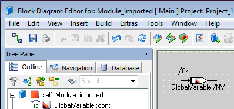
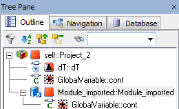
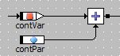
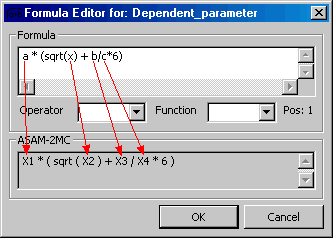

# Merged CHM Content

## Properties Editor

_Source: `markdown/EEd_Overview.md`_

# Overview - Properties Editor

Elements are signature elements, variables, tables, arrays and complex elements (referenced components).

Each element has a number of properties, which can be configured according to requirements in the model.

The configuration selected is valid for all occurrences of an element within a component.

See also

[Instances and Occurrences](markdown/EEd_instances_occurrences.md)

[Element Configuration](markdown/EEd_element_configuration.md)

[Imported Elements](markdown/EEd_ImportedElements.md)

[Dependent Elements](markdown/EEd_dependent_elements.md)

[Temporary Variables](IntroductionEnglishUS.chm::/INT_temporary_variables.htm)

---

## Overview

_Source: `markdown/EEd_Overview.md`_

# Overview - Properties Editor

Elements are signature elements, variables, tables, arrays and complex elements (referenced components).

Each element has a number of properties, which can be configured according to requirements in the model.

The configuration selected is valid for all occurrences of an element within a component.

See also

[Instances and Occurrences](markdown/EEd_instances_occurrences.md)

[Element Configuration](markdown/EEd_element_configuration.md)

[Imported Elements](markdown/EEd_ImportedElements.md)

[Dependent Elements](markdown/EEd_dependent_elements.md)

[Temporary Variables](IntroductionEnglishUS.chm::/INT_temporary_variables.htm)

---

## Instances and Occurrences

_Source: `markdown/EEd_instances_occurrences.md`_

# Instances and Occurrences

An element can have several occurrences. An occurrence of an element is the equivalent to writing down the name of the element in a text-based programming language. Changes in one occurrence of an element affect all the other occurrences of that same element.

Care has to be taken when using referenced components as elements. Here, every component can have multiple instances, each of which can in turn have multiple occurrences.

See also

[Element Configuration](markdown/EEd_element_configuration.md)

[Imported Elements](markdown/EEd_ImportedElements.md)

[Dependent Elements](markdown/EEd_dependent_elements.md)

[Temporary Variables](IntroductionEnglishUS.chm::/INT_temporary_variables.htm)

---

## Element Configuration

_Source: `markdown/EEd_element_configuration.md`_

# Element Configuration

An element configuration is edited in the properties editor. The properties editor can be called from any specification editor and from the Component Manager.

When the respective confirmation windows are set to Show in the [Confirmation Dialogs Node](ComponentManagerEnglishUS.chm::/CM_Options_for_Confirmation_Dialogs.htm) of the ASCET options window, the properties editor is opened automatically when a new element is created.

This option can be overwritten with the Always Show Editor for New Elements option present in each properties editor.

Depending on the type of the selected element, the properties editor can look differently. Not all fields exist in every case. The functions of the available fields are identical in all cases.

See also

[Opening the Properties Editor](markdown/EEd_open_element_editor.md)

[Editing the Configuration of a Scalar Element](markdown/EEd_edit_element_configuration.md)

[Editing the Configuration of a Composite Element](markdown/eed_editconfiguration_compositeelement.md)

[Editing the Configuration of a Complex Element](markdown/eed_editconfiguration_complexelement.md)

[Enabling or Disabling Elements](markdown/EEd_enable_diabale_elements.md)

[Confirmation Dialog Options](ComponentManagerEnglishUS.chm::/CM_Options_for_Confirmation_Dialogs.htm)

---

## Imported Elements

_Source: `markdown/EEd_ImportedElements.md`_

A module Module_imported contains an imported global variable. Without project context, the variable is represented as follows.

Module_imported is then added to Project_1, which contains an exported GlobalVariable with the attributes Non-Volatile and Calibration. In the Outline tab of the project editor, the imported variable in the module is displayed with the same overlay icon as the exported one. If the module is opened from the project editor, the graphical representation of GlobalVariable represents the properties of the exported variable, too.

 

Next, Module_imported is added to Project_2, which contains an exported GlobalVariable with the attribute Virtual. The imported variable in the module is again displayed with the same overlay icon as the exported one, which means that it looks different than in the context of Project_1.

 

# Imported Elements

An imported element derives its attributes (volatile/non-volatile etc., see [Properties Editor for Basic Elements - Attributes](markdown/EED_Element_Editor_Basic_Elements.md#Attributes)) from the exported counterpart. Therefore, the Attributes area in the properties editor is deactivated for imported elements.

The properties editor offers a button to synchronize the properties of an imported element with the corresponding exported element in the current project context. However, since imported and exported elements are mapped only via their instance names, synchronization will fail in the following cases:

- The kind of the exported element is not supported in the component that contains the imported element (e.g., when you try to synchronize an imported element of a class with an exported message).
- The exported element has a different dimension than the imported element (e.g., when you try to synchronize a scalar imported element with an exported array, matrix or characteristic line/map).
- The exported element is a complex element while the imported element is a basic element (or vice versa).

In these cases, a message window with a description of the failure opens.

When you create an imported element, none of the attributes are set. In the context of a project, an imported element shows the attributes of the exported counterpart in the properties editor and in the graphical representation. This means that the graphical representation of a particular imported element will differ.

##### [Example](javascript:kadovTextPopup(this))<!-- kadovTextPopupInit('a1'); //-->

See also

[Properties Editor for Basic Elements](markdown/EED_Element_Editor_Basic_Elements.md)

[Editing the Element Scope](markdown/EEd_EditElementScope.md)

[Introduction - The Scope of Elements](introductionenglishus.chm::/INT_the_scope_of_elements.htm)

/* Heikki Komulainen, Comet Computer GmbH 2004 */ cc_plus_pic = '&nbsp;'; cc_minus_pic = '&nbsp;'; cc_stat_pic = '&nbsp;'; gpstyle = ''; var iframes_created = 0; if (document.body && document.body.insertAdjacentHTML && document.getElementsByTagName && document.getElementById) { collect_popups(); set_poplinks_pictures(); if (iframes_created) { document.write(gpstyle); document.write('
<nobr><a id="einauslink" style="position:absolute;top:expression(document.body.scrollTop + this.offsetHeight - this.offsetHeight);left:expression(document.body.offsetWidth - (this.offsetWidth + 28));background:white;padding:5px" href="javascript:show_all_poptext()">Show all hidden text</a></nobr>
'); } } function collect_popups() { bsscpopups = new Array(); for (x = 0; x < document.links.length; x++) { if (document.links[x].href.indexOf("BSSCPopup")>-1) { seekmatch = /BSSCPopup.'[^'](markdown/+)'/; poplink = seekmatch.exec(document.links[x].href); poplink = "" + poplink; poplink = poplink.substring(poplink.indexOf("'")+1, poplink.lastIndexOf("'")); ifid = "CCGENIFRAMEID" + x; new_iframe = '<iframe id="' + ifid + '"src="' + poplink + '" onload="get_text(\'' + ifid + '\')" width="0" height="0" frameborder=0></iframe>'; document.links[x].parentNode.insertAdjacentHTML("afterEnd", new_iframe); gpid = "CCID_" + ifid; document.links[x].href = "javascript:expand_poptext('" + gpid + "')"; cc_plus = '' + cc_plus_pic + ''; document.links[x].insertAdjacentHTML("afterBegin", cc_plus); iframes_created = 1; } } }// end function function get_text(ifr_id) { frpars = document.frames[ifr_id].document.getElementsByTagName("body"); popbody = frpars[0].innerHTML; gpid = "CCID_" + ifr_id; if (!document.getElementById(gpid)) { //avoiding doubles document.getElementById(ifr_id).insertAdjacentHTML("afterEnd", '
'+popbody+'
'); } }//end function function expand_poptext(x_frame_id) { if (!document.getElementById(x_frame_id)) return; if (document.getElementById(x_frame_id).className == "CCGENPOPTEXTH") { document.getElementById(x_frame_id).className = "CCGENPOPTEXTV"; document.getElementById(x_frame_id).style.visibility = "visible"; if (document.getElementById("CCPMB_" + x_frame_id )) { document.getElementById("CCPMB_" + x_frame_id ).innerHTML = cc_minus_pic; } } else { document.getElementById(x_frame_id).className = "CCGENPOPTEXTH"; document.getElementById(x_frame_id).style.visibility = "hidden"; if (document.getElementById("CCPMB_" + x_frame_id )) { document.getElementById("CCPMB_" + x_frame_id ).innerHTML = cc_plus_pic; } } }// end function function show_all_poptext() { var pulldowntxt = document.getElementsByTagName("div"); for (b = 0; b < pulldowntxt.length; b++) { if (pulldowntxt[b].className == "droptext") { pulldowntxt[b].style.display=""; } } var gptxt = document.getElementsByTagName("div"); for (z = 0; z < gptxt.length; z++) { if (gptxt[z].className == "CCGENPOPTEXTH") { gptxt[z].className = "CCGENPOPTEXTV"; gptxt[z].style.visibility = "visible"; if (document.getElementById("CCPMB_" + gptxt[z].id )) { document.getElementById("CCPMB_" + gptxt[z].id ).innerHTML = cc_minus_pic; } } } var dxpoplinks = document.getElementsByTagName("a"); if (dxpoplinks) { for (pxl = 0; pxl < dxpoplinks.length; pxl++) { if (dxpoplinks[pxl].href.indexOf("kadovTextPopup")>-1) { if (document.getElementById("CCPMB_" + dxpoplinks[pxl].id)) { document.getElementById("CCPMB_" + dxpoplinks[pxl].id).innerHTML = cc_stat_pic; dxpoplinks[pxl].symbol = "minus"; } } } } document.getElementById('einauslink').innerText = 'Hide all hideable text'; document.getElementById('einauslink').href = "javascript:self.location.reload()"; self.focus(); }// end function function eat_click() { return false; }// end function function set_poplinks_pictures() { var dpoplinks = document.getElementsByTagName("a"); if (dpoplinks) { for (pl = 0; pl < dpoplinks.length; pl++) { if (dpoplinks[pl].href.indexOf("kadovTextPopup")>-1) { cc_plus = '' + cc_stat_pic + ''; //dpoplinks[pl].onmouseup = plusminuspoplink; dpoplinks[pl].insertAdjacentHTML("afterBegin", cc_plus); dpoplinks[pl].symbol = "plus"; } } } }// end function function plusminuspoplink() { if (document.getElementById("CCPMB_" + this.id)) { if (this.symbol == "plus") { document.getElementById("CCPMB_" + this.id).innerHTML = cc_minus_pic; this.symbol = "minus"; } else { document.getElementById("CCPMB_" + this.id).innerHTML = cc_plus_pic; this.symbol = "plus"; } } return true; }

---

## Dependent Elements

_Source: `markdown/EEd_dependent_elements.md`_

# Dependent Elements

Parameters can be specified as dependent parameters. This means that they derive their value from another element.

Only parameters of [scope](introductionenglishus.chm::/INT_the_scope_of_elements.htm) local or exported can be specified as dependent parameters. Dependent parameters of scope imported are not allowed. Dependent variables do not exist.

While dependent parameters of scope imported are not allowed, you can import dependent parameters exported in another component of your model, see [Importing Dependent Parameters](IntroductionEnglishUS.chm::/INT_Importing_Dependent_Parameters.htm).

See also

[Creating the Formula for Dependent Parameters](markdown/EEd_create_fromula_dependent.md)

[Editing the Formula of a Dependent Parameter](markdown/EEd_edit_formula_dependent.md)

[Data Editor - Editing Dependent Parameters](DataEditorEnglishUS.chm::/DEd_Editing_Dependent_Parameters.htm)

[Introduction - The Scope of Elements](introductionenglishus.chm::/INT_the_scope_of_elements.htm)

[Introduction - Importing Dependent Parameters](IntroductionEnglishUS.chm::/INT_Importing_Dependent_Parameters.htm)

---

## Calibration Access

_Source: `markdown/eed_calibrationaccess.md`_

# Calibration Access

Beginning with V6.2, ASCET allows a three-step configuration of calibration access to elements. In non-AUTOSAR projects, information on calibration access is required for the ASAM-MCD-2MC (*.a2l) generation. In AUTOSAR projects, this information is required for the generation of the AUTOSAR descriptions (*.arxml files).

The following calibration access settings are available:

- no access (in AUTOSAR R4: NotAccessible)

- read-only (in AUTOSAR R4: ReadOnly)

Read-only access is available for variables, parameters, and system constants.

- read/write (in AUTOSAR R4: ReadWrite)

Read/write access is available for parameters and system constants.

If a variable has read-only access, it will be included in the *.a2l file and get the keyword READ_ONLY. If the read-only access of the variable is disabled, i.e. the variable is set to no access, it will not be included in the *.a2l file.

If a parameter has read/write access, it will be included in the *.a2l file. If write access is disabled, i.e. the parameter has read-only access, it will be included in the *.a2l file and get the keyword READ_ONLY. If even the read-only access is disabled, i.e. the parameter is set to no access, it will not be included in the *.a2l file.

When you open an older database/workspace, or import older models in ASCET V6.2, the two-step calibration access setting (calibration activated or deactivated) of previous ASCET versions is migrated to the three-step configuration as follows:

<table style="x-cell-content-align: Top;
				margin-top: 3px;
				border-left-style: Outset;
				border-top-style: Outset;
				border-right-style: Outset;
				border-bottom-style: Outset;
				border-left-width: 1px;
				border-right-width: 1px;
				border-top-width: 1px;
				border-bottom-width: 1px;" x-use-null-cells="">
<col/>
<col/>
<col/>
<col/>
<col/>
<tr class="hcp1" valign="top">
<td colspan="1" rowspan="2" style="padding-top: 2px;
			padding-bottom: 2px;
			border-left-style: Inset;
			border-top-style: Inset;
			border-right-style: Inset;
			border-bottom-style: Inset;
			padding-left: 2px;
			padding-right: 2px;
			border-left-width: 1px;
			border-top-width: 1px;
			border-right-width: 1px;
			border-bottom-width: 1px;
			x-cell-content-align: bottom;" valign="bottom">

old calibration setting
</td>
<td class="hcp2" colspan="4" rowspan="1">

new calibration settings
</td>
</tr>
<tr class="hcp1" valign="top">
<td class="hcp2">

variables
</td>
<td class="hcp2">

parameters
</td>
<td class="hcp2">

system constants
</td>
<td class="hcp2">

constants
</td></tr>
<tr class="hcp1" valign="top">
<td class="hcp2">

activated
</td>
<td class="hcp2">

read
</td>
<td class="hcp2">

read + write
</td>
<td class="hcp2">

read + write
</td>
<td class="hcp2">

no access
</td></tr>
<tr class="hcp1" valign="top">
<td class="hcp2">

deactivated
</td>
<td class="hcp2">

no access
</td>
<td class="hcp2">

read
</td>
<td class="hcp2">

read
</td>
<td class="hcp2">

no access
</td></tr>
</table>

See also

[Editing the Calibration Access](markdown/EEd_EditCalibrationAccess.md)

---

## Opening the Properties Editor

_Source: `markdown/EEd_open_element_editor.md`_

# Opening the Properties Editor

To open the properties editor, proceed as follows:

1. In the Outline tab of a specification editor, highlight the element you want to edit.

1. In the Edit menu, select Properties.

or

1. Right-click on the element and select Properties from the context menu.

or

1. Double-click the basic element you want to edit.

Or

1. In the drawing area (BDE) or Graphics tab (project editor), right-click on the element and select Properties from the context menu.

Or

1. In the Component Manager or the Browser view of the specification editor, go to the Elements tab and highlight the element you want to edit.

1. Press Return

or

1. Right-click on the Elements tab and select Edit from the context menu.

All cases:

The Properties Editor window opens.

When you work on a component created with ASCET V6.1 or earlier, and selected a variable with both the Virtual and Non-Volatile attributes set, a message window opens. It informs you that the variable uses forbidden attribute settings and asks you to change at least one of the attributes. You have to close this window before you can continue your work.

See also

[Editing the Configuration of a Scalar Element](markdown/EEd_edit_element_configuration.md)

[Editing the Configuration of a Composite Element](markdown/eed_editconfiguration_compositeelement.md)

[Editing the Configuration of a Complex Element](markdown/eed_editconfiguration_complexelement.md)

[Editing the Element Scope](markdown/EEd_EditElementScope.md)

[Enabling or Disabling Elements](markdown/EEd_enable_diabale_elements.md)

[Specifying a Reference](markdown/EEd_Specifying_a_Reference.md)

[Creating the Formula for Dependent Parameters](markdown/EEd_create_fromula_dependent.md)

---

## Editing the Configuration of a Scalar Element

_Source: `markdown/EEd_edit_element_configuration.md`_

| Column 1 | Column 2 |
| --- | --- |
| Reference | This option determines whether the element is a reference or not. |
| Virtual | This option determines whether the element is virtual or not. The option is only available for variables and parameters (enumerations excluded). |
| Dependent | This option determines whether a parameter is dependent or independent. The option is only available for parameters (enumerations excluded). |
| Non-Volatile | This option determines whether the element is written to the volatile or non-volatile memory of the ECU. Data stored in the non-volatile memory of the ECU will not be overwritten upon initialization. The option is only available for variables. The sm state variable of a state machine cannot be edited in the properties editor. To assign the non-volatile attribute to this variable, open its context menu in the Outline tab, point to Settings and select Non-Volatile . |
| Variants | This option determines whether variant handling is available for this element or not. The option is only available for parameters. |
| Redundant | This option activates redundant data storage for the element. The option is available for local and exported variables and messages. Redundant and Non-volatile must not be activated simultaneously. |

# Editing the Configuration of a Scalar Element

To configure a scalar element as you wish, proceed as follows:

1. [Open the properties editor](markdown/EEd_open_element_editor.md) for the element.
1. Use the Name field to edit the element name.
1. Enter a unit into the Unit field.
1. Type a comment into the Comment field.
1. In the Kind combo box, assign the element kind.
1. Assign the element type in the Basic Type combo box.
1. In the Scope field, [determine the scope of the element](markdown/EEd_EditElementScope.md).
1. In the Attributes area, you can set the [following attributes](javascript:kadovTextPopup(this))<!-- kadovTextPopupInit('a1'); //-->.
1. Specify [external](markdown/EEd_enable_diabale_elements.md) and - if applicable - internal access.
1. [Specify calibration access.](markdown/EEd_EditCalibrationAccess.md)
1. Click OK to close the properties editor.

See also

[Opening the Properties Editor](markdown/EEd_open_element_editor.md)

[Editing the Configuration of a Composite Element](markdown/eed_editconfiguration_compositeelement.md)

[The Kind of Elements - Summary](IntroductionEnglishUS.chm::/INT_summaryke.htm)

[Editing the Element Scope](markdown/EEd_EditElementScope.md)

[The Scope of Elements](IntroductionEnglishUS.chm::/INT_the_scope_of_elements.htm)

[Specifying a Reference](markdown/EEd_Specifying_a_Reference.md)

[Enabling or Disabling Elements](markdown/EEd_enable_diabale_elements.md)

[Editing the Calibration Access](markdown/EEd_EditCalibrationAccess.md)

/* Heikki Komulainen, Comet Computer GmbH 2004 */ cc_plus_pic = '&nbsp;'; cc_minus_pic = '&nbsp;'; cc_stat_pic = '&nbsp;'; gpstyle = ''; var iframes_created = 0; if (document.body && document.body.insertAdjacentHTML && document.getElementsByTagName && document.getElementById) { collect_popups(); set_poplinks_pictures(); if (iframes_created) { document.write(gpstyle); document.write('
<nobr><a id="einauslink" style="position:absolute;top:expression(document.body.scrollTop + this.offsetHeight - this.offsetHeight);left:expression(document.body.offsetWidth - (this.offsetWidth + 28));background:white;padding:5px" href="javascript:show_all_poptext()">Alle texte einblenden</a></nobr>
'); } } function collect_popups() { bsscpopups = new Array(); for (x = 0; x < document.links.length; x++) { if (document.links[x].href.indexOf("BSSCPopup")>-1) { seekmatch = /BSSCPopup.'[^'](markdown/+)'/; poplink = seekmatch.exec(document.links[x].href); poplink = "" + poplink; poplink = poplink.substring(poplink.indexOf("'")+1, poplink.lastIndexOf("'")); ifid = "CCGENIFRAMEID" + x; new_iframe = '<iframe id="' + ifid + '"src="' + poplink + '" onload="get_text(\'' + ifid + '\')" width="0" height="0" frameborder=0></iframe>'; document.links[x].parentNode.insertAdjacentHTML("afterEnd", new_iframe); gpid = "CCID_" + ifid; document.links[x].href = "javascript:expand_poptext('" + gpid + "')"; cc_plus = '' + cc_plus_pic + ''; document.links[x].insertAdjacentHTML("afterBegin", cc_plus); iframes_created = 1; } } }// end function function get_text(ifr_id) { frpars = document.frames[ifr_id].document.getElementsByTagName("body"); popbody = frpars[0].innerHTML; gpid = "CCID_" + ifr_id; if (!document.getElementById(gpid)) { //avoiding doubles document.getElementById(ifr_id).insertAdjacentHTML("afterEnd", '
'+popbody+'
'); } }//end function function expand_poptext(x_frame_id) { if (!document.getElementById(x_frame_id)) return; if (document.getElementById(x_frame_id).className == "CCGENPOPTEXTH") { document.getElementById(x_frame_id).className = "CCGENPOPTEXTV"; document.getElementById(x_frame_id).style.visibility = "visible"; if (document.getElementById("CCPMB_" + x_frame_id )) { document.getElementById("CCPMB_" + x_frame_id ).innerHTML = cc_minus_pic; } } else { document.getElementById(x_frame_id).className = "CCGENPOPTEXTH"; document.getElementById(x_frame_id).style.visibility = "hidden"; if (document.getElementById("CCPMB_" + x_frame_id )) { document.getElementById("CCPMB_" + x_frame_id ).innerHTML = cc_plus_pic; } } }// end function function show_all_poptext() { var pulldowntxt = document.getElementsByTagName("div"); for (b = 0; b < pulldowntxt.length; b++) { if (pulldowntxt[b].className == "droptext") { pulldowntxt[b].style.display=""; } } var gptxt = document.getElementsByTagName("div"); for (z = 0; z < gptxt.length; z++) { if (gptxt[z].className == "CCGENPOPTEXTH") { gptxt[z].className = "CCGENPOPTEXTV"; gptxt[z].style.visibility = "visible"; if (document.getElementById("CCPMB_" + gptxt[z].id )) { document.getElementById("CCPMB_" + gptxt[z].id ).innerHTML = cc_minus_pic; } } } var dxpoplinks = document.getElementsByTagName("a"); if (dxpoplinks) { for (pxl = 0; pxl < dxpoplinks.length; pxl++) { if (dxpoplinks[pxl].href.indexOf("kadovTextPopup")>-1) { if (document.getElementById("CCPMB_" + dxpoplinks[pxl].id)) { document.getElementById("CCPMB_" + dxpoplinks[pxl].id).innerHTML = cc_stat_pic; dxpoplinks[pxl].symbol = "minus"; } } } } document.getElementById('einauslink').innerText = 'Alle texte ausblenden'; document.getElementById('einauslink').href = "javascript:self.location.reload()"; self.focus(); }// end function function eat_click() { return false; }// end function function set_poplinks_pictures() { var dpoplinks = document.getElementsByTagName("a"); if (dpoplinks) { for (pl = 0; pl < dpoplinks.length; pl++) { if (dpoplinks[pl].href.indexOf("kadovTextPopup")>-1) { cc_plus = '' + cc_stat_pic + ''; //dpoplinks[pl].onmouseup = plusminuspoplink; dpoplinks[pl].insertAdjacentHTML("afterBegin", cc_plus); dpoplinks[pl].symbol = "plus"; } } } }// end function function plusminuspoplink() { if (document.getElementById("CCPMB_" + this.id)) { if (this.symbol == "plus") { document.getElementById("CCPMB_" + this.id).innerHTML = cc_minus_pic; this.symbol = "minus"; } else { document.getElementById("CCPMB_" + this.id).innerHTML = cc_plus_pic; this.symbol = "plus"; } } return true; }

---

## Editing the Configuration of a Composite Element

_Source: `markdown/eed_editconfiguration_compositeelement.md`_

| Column 1 | Column 2 |
| --- | --- |
| Reference | This option determines whether the element is a reference or not. This option is only available for variables. |
| Virtual | This option determines whether the element is virtual or not. |
| Dependent | This option determines whether a parameter is dependent or independent. The option is only available for parameters. |
| Non-Volatile | This option determines whether the element is written to the volatile or non-volatile memory of the ECU. The option is only available for variables. |
| Variants | This option determines whether variant handling is available for this element or not. The option is only available for parameters. |
| Redundant | This option activates redundant data storage for the element. The option is available for arrays/matrices of kind Variable and scope Local or Exported . Redundant and Non-volatile must not be activated simultaneously. |

# Editing the Configuration of a Composite Element

This instruction does not explain how to create an array or matrix with variable size. If you want to know how to do that, see [Specifying an Array or Matrix with Variable Size](markdown/Eed_SpecifyArrayMatrix_VariableSize.md).

To configure the composite element (i.e. array, matrix, characteristic line/map, distribution) as you wish, proceed as follows:

1. [Open the properties editor](markdown/EEd_open_element_editor.md) for the element.
1. Use the Name field to edit the element name.
1. Enter a unit and a comment in the respective fields.
1. In the X and Y fields, edit the dimension of an array, matrix, characteristic line/map or distribution.
1. If desired, use the combo boxes of the Variant Size field to select system constants that will determine the array or matrix size.
1. In the Interpolation combo box, select an interpolation method for a characteristic line/map.
1. In the Kind combo box, assign the element kind.
1. In the Basic Type combo box, assign the element type.
1. In the Scope field, [determine the scope of the element](markdown/EEd_EditElementScope.md).
1. In the Attributes area, set the [following attributes](javascript:kadovTextPopup(this))<!-- kadovTextPopupInit('a1'); //-->.
1. Specify [external](markdown/EEd_enable_diabale_elements.md) and - for explicit references - internal access.
1. [Specify calibration access.](markdown/EEd_EditCalibrationAccess.md)
1. Click OK to close the properties editor.

See also

[Specifying an Array or Matrix with Variable Size](markdown/Eed_SpecifyArrayMatrix_VariableSize.md)

[Opening the Properties Editor](markdown/EEd_open_element_editor.md)

[User-Defined Interpolation Routines](IntroductionEnglishUS.chm::/INT_UserDefinedInterpolationRoutines.htm)

[Scalar Types - Summary](IntroductionEnglishUS.chm::/INT_scalar_summary.htm)

[The Kind of Elements - Summary](IntroductionEnglishUS.chm::/INT_summaryke.htm)

[Editing the Element Scope](markdown/EEd_EditElementScope.md)

[The Scope of Elements](IntroductionEnglishUS.chm::/INT_the_scope_of_elements.htm)

[Specifying a Reference](markdown/EEd_Specifying_a_Reference.md)

[Enabling or Disabling Elements](markdown/EEd_enable_diabale_elements.md)

[Editing Calibration Access](markdown/EEd_EditCalibrationAccess.md)

/* Heikki Komulainen, Comet Computer GmbH 2004 */ cc_plus_pic = '&nbsp;'; cc_minus_pic = '&nbsp;'; cc_stat_pic = '&nbsp;'; gpstyle = ''; var iframes_created = 0; if (document.body && document.body.insertAdjacentHTML && document.getElementsByTagName && document.getElementById) { collect_popups(); set_poplinks_pictures(); if (iframes_created) { document.write(gpstyle); document.write('
<nobr><a id="einauslink" style="position:absolute;top:expression(document.body.scrollTop + this.offsetHeight - this.offsetHeight);left:expression(document.body.offsetWidth - (this.offsetWidth + 28));background:white;padding:5px" href="javascript:show_all_poptext()">Alle texte einblenden</a></nobr>
'); } } function collect_popups() { bsscpopups = new Array(); for (x = 0; x < document.links.length; x++) { if (document.links[x].href.indexOf("BSSCPopup")>-1) { seekmatch = /BSSCPopup.'[^'](markdown/+)'/; poplink = seekmatch.exec(document.links[x].href); poplink = "" + poplink; poplink = poplink.substring(poplink.indexOf("'")+1, poplink.lastIndexOf("'")); ifid = "CCGENIFRAMEID" + x; new_iframe = '<iframe id="' + ifid + '"src="' + poplink + '" onload="get_text(\'' + ifid + '\')" width="0" height="0" frameborder=0></iframe>'; document.links[x].parentNode.insertAdjacentHTML("afterEnd", new_iframe); gpid = "CCID_" + ifid; document.links[x].href = "javascript:expand_poptext('" + gpid + "')"; cc_plus = '' + cc_plus_pic + ''; document.links[x].insertAdjacentHTML("afterBegin", cc_plus); iframes_created = 1; } } }// end function function get_text(ifr_id) { frpars = document.frames[ifr_id].document.getElementsByTagName("body"); popbody = frpars[0].innerHTML; gpid = "CCID_" + ifr_id; if (!document.getElementById(gpid)) { //avoiding doubles document.getElementById(ifr_id).insertAdjacentHTML("afterEnd", '
'+popbody+'
'); } }//end function function expand_poptext(x_frame_id) { if (!document.getElementById(x_frame_id)) return; if (document.getElementById(x_frame_id).className == "CCGENPOPTEXTH") { document.getElementById(x_frame_id).className = "CCGENPOPTEXTV"; document.getElementById(x_frame_id).style.visibility = "visible"; if (document.getElementById("CCPMB_" + x_frame_id )) { document.getElementById("CCPMB_" + x_frame_id ).innerHTML = cc_minus_pic; } } else { document.getElementById(x_frame_id).className = "CCGENPOPTEXTH"; document.getElementById(x_frame_id).style.visibility = "hidden"; if (document.getElementById("CCPMB_" + x_frame_id )) { document.getElementById("CCPMB_" + x_frame_id ).innerHTML = cc_plus_pic; } } }// end function function show_all_poptext() { var pulldowntxt = document.getElementsByTagName("div"); for (b = 0; b < pulldowntxt.length; b++) { if (pulldowntxt[b].className == "droptext") { pulldowntxt[b].style.display=""; } } var gptxt = document.getElementsByTagName("div"); for (z = 0; z < gptxt.length; z++) { if (gptxt[z].className == "CCGENPOPTEXTH") { gptxt[z].className = "CCGENPOPTEXTV"; gptxt[z].style.visibility = "visible"; if (document.getElementById("CCPMB_" + gptxt[z].id )) { document.getElementById("CCPMB_" + gptxt[z].id ).innerHTML = cc_minus_pic; } } } var dxpoplinks = document.getElementsByTagName("a"); if (dxpoplinks) { for (pxl = 0; pxl < dxpoplinks.length; pxl++) { if (dxpoplinks[pxl].href.indexOf("kadovTextPopup")>-1) { if (document.getElementById("CCPMB_" + dxpoplinks[pxl].id)) { document.getElementById("CCPMB_" + dxpoplinks[pxl].id).innerHTML = cc_stat_pic; dxpoplinks[pxl].symbol = "minus"; } } } } document.getElementById('einauslink').innerText = 'Alle texte ausblenden'; document.getElementById('einauslink').href = "javascript:self.location.reload()"; self.focus(); }// end function function eat_click() { return false; }// end function function set_poplinks_pictures() { var dpoplinks = document.getElementsByTagName("a"); if (dpoplinks) { for (pl = 0; pl < dpoplinks.length; pl++) { if (dpoplinks[pl].href.indexOf("kadovTextPopup")>-1) { cc_plus = '' + cc_stat_pic + ''; //dpoplinks[pl].onmouseup = plusminuspoplink; dpoplinks[pl].insertAdjacentHTML("afterBegin", cc_plus); dpoplinks[pl].symbol = "plus"; } } } }// end function function plusminuspoplink() { if (document.getElementById("CCPMB_" + this.id)) { if (this.symbol == "plus") { document.getElementById("CCPMB_" + this.id).innerHTML = cc_minus_pic; this.symbol = "minus"; } else { document.getElementById("CCPMB_" + this.id).innerHTML = cc_plus_pic; this.symbol = "plus"; } } return true; }

---

## Specifying an Array or Matrix with Variable Size

_Source: `markdown/Eed_SpecifyArrayMatrix_VariableSize.md`_

# Specifying an Array or Matrix with Variable Size

Only arrays/matrices of kind variable and specified as explicit references can have [variable sizes](IntroductionEnglishUS.chm::/INT_VariableSize_ArraysMatrices.htm). Arrays and matrices used as messages cannot have variable sizes.

To create an array or matrix with variable size, proceed as follows:

1. [Open the properties editor](markdown/EEd_open_element_editor.md) for the array/matrix.
1. Use the Name field to edit the element name.
1. In the Attributes area, activate the Reference option.
1. In the Kind combo box, select the kind Variable.
1. In the combo boxes of the Variant Size field, select *.
1. In the Basic Type combo box, assign the element type.
1. In the Scope field, [determine the scope of the element](markdown/EEd_EditElementScope.md).
1. Specify [external](markdown/EEd_enable_diabale_elements.md) and internal access.
1. Click OK to close the properties editor.
1. Initialize the reference via one of the following possibilities:

- [Map the reference](DataEditorEnglishUS.chm::/DEd_MappingReference.htm) to a non-reference element.

References must not be mapped to arrays or matrices used as messages.

- [Use the reference without initialization.](IntroductionEnglishUS.chm::/INT_UseReferencesWithoutInit.htm)

See also

[Variable Size of Arrays and Matrices](IntroductionEnglishUS.chm::/INT_VariableSize_ArraysMatrices.htm)

[Opening the Properties Editor](markdown/EEd_open_element_editor.md)

[Scalar Types - Summary](IntroductionEnglishUS.chm::/INT_scalar_summary.htm)

[Editing the Element Scope](markdown/EEd_EditElementScope.md)

[Enabling or Disabling Elements](markdown/EEd_enable_diabale_elements.md)

[Mapping a Reference](DataEditorEnglishUS.chm::/DEd_MappingReference.htm)

[Using References Without Initialization](IntroductionEnglishUS.chm::/INT_UseReferencesWithoutInit.htm)

[The Kind of Elements - Summary](IntroductionEnglishUS.chm::/INT_summaryke.htm)

/* Heikki Komulainen, Comet Computer GmbH 2004 */ cc_plus_pic = '&nbsp;'; cc_minus_pic = '&nbsp;'; cc_stat_pic = '&nbsp;'; gpstyle = ''; var iframes_created = 0; if (document.body && document.body.insertAdjacentHTML && document.getElementsByTagName && document.getElementById) { collect_popups(); set_poplinks_pictures(); if (iframes_created) { document.write(gpstyle); document.write('
<nobr><a id="einauslink" style="position:absolute;top:expression(document.body.scrollTop + this.offsetHeight - this.offsetHeight);left:expression(document.body.offsetWidth - (this.offsetWidth + 28));background:white;padding:5px" href="javascript:show_all_poptext()">Alle texte einblenden</a></nobr>
'); } } function collect_popups() { bsscpopups = new Array(); for (x = 0; x < document.links.length; x++) { if (document.links[x].href.indexOf("BSSCPopup")>-1) { seekmatch = /BSSCPopup.'[^'](markdown/+)'/; poplink = seekmatch.exec(document.links[x].href); poplink = "" + poplink; poplink = poplink.substring(poplink.indexOf("'")+1, poplink.lastIndexOf("'")); ifid = "CCGENIFRAMEID" + x; new_iframe = '<iframe id="' + ifid + '"src="' + poplink + '" onload="get_text(\'' + ifid + '\')" width="0" height="0" frameborder=0></iframe>'; document.links[x].parentNode.insertAdjacentHTML("afterEnd", new_iframe); gpid = "CCID_" + ifid; document.links[x].href = "javascript:expand_poptext('" + gpid + "')"; cc_plus = '' + cc_plus_pic + ''; document.links[x].insertAdjacentHTML("afterBegin", cc_plus); iframes_created = 1; } } }// end function function get_text(ifr_id) { frpars = document.frames[ifr_id].document.getElementsByTagName("body"); popbody = frpars[0].innerHTML; gpid = "CCID_" + ifr_id; if (!document.getElementById(gpid)) { //avoiding doubles document.getElementById(ifr_id).insertAdjacentHTML("afterEnd", '
'+popbody+'
'); } }//end function function expand_poptext(x_frame_id) { if (!document.getElementById(x_frame_id)) return; if (document.getElementById(x_frame_id).className == "CCGENPOPTEXTH") { document.getElementById(x_frame_id).className = "CCGENPOPTEXTV"; document.getElementById(x_frame_id).style.visibility = "visible"; if (document.getElementById("CCPMB_" + x_frame_id )) { document.getElementById("CCPMB_" + x_frame_id ).innerHTML = cc_minus_pic; } } else { document.getElementById(x_frame_id).className = "CCGENPOPTEXTH"; document.getElementById(x_frame_id).style.visibility = "hidden"; if (document.getElementById("CCPMB_" + x_frame_id )) { document.getElementById("CCPMB_" + x_frame_id ).innerHTML = cc_plus_pic; } } }// end function function show_all_poptext() { var pulldowntxt = document.getElementsByTagName("div"); for (b = 0; b < pulldowntxt.length; b++) { if (pulldowntxt[b].className == "droptext") { pulldowntxt[b].style.display=""; } } var gptxt = document.getElementsByTagName("div"); for (z = 0; z < gptxt.length; z++) { if (gptxt[z].className == "CCGENPOPTEXTH") { gptxt[z].className = "CCGENPOPTEXTV"; gptxt[z].style.visibility = "visible"; if (document.getElementById("CCPMB_" + gptxt[z].id )) { document.getElementById("CCPMB_" + gptxt[z].id ).innerHTML = cc_minus_pic; } } } var dxpoplinks = document.getElementsByTagName("a"); if (dxpoplinks) { for (pxl = 0; pxl < dxpoplinks.length; pxl++) { if (dxpoplinks[pxl].href.indexOf("kadovTextPopup")>-1) { if (document.getElementById("CCPMB_" + dxpoplinks[pxl].id)) { document.getElementById("CCPMB_" + dxpoplinks[pxl].id).innerHTML = cc_stat_pic; dxpoplinks[pxl].symbol = "minus"; } } } } document.getElementById('einauslink').innerText = 'Alle texte ausblenden'; document.getElementById('einauslink').href = "javascript:self.location.reload()"; self.focus(); }// end function function eat_click() { return false; }// end function function set_poplinks_pictures() { var dpoplinks = document.getElementsByTagName("a"); if (dpoplinks) { for (pl = 0; pl < dpoplinks.length; pl++) { if (dpoplinks[pl].href.indexOf("kadovTextPopup")>-1) { cc_plus = '' + cc_stat_pic + ''; //dpoplinks[pl].onmouseup = plusminuspoplink; dpoplinks[pl].insertAdjacentHTML("afterBegin", cc_plus); dpoplinks[pl].symbol = "plus"; } } } }// end function function plusminuspoplink() { if (document.getElementById("CCPMB_" + this.id)) { if (this.symbol == "plus") { document.getElementById("CCPMB_" + this.id).innerHTML = cc_minus_pic; this.symbol = "minus"; } else { document.getElementById("CCPMB_" + this.id).innerHTML = cc_plus_pic; this.symbol = "plus"; } } return true; }

---

## Editing the Configuration of a Complex Element

_Source: `markdown/eed_editconfiguration_complexelement.md`_

# Editing the Configuration of a Complex Element

To configure a complex element, proceed as follows:

1. [Open the properties editor](markdown/EEd_open_element_editor.md) for the complex element.
1. Use the Name field to edit the element name.
1. Type a comment into the Comment field.
1. In the Kind combo box, assign the element kind.
1. In the Scope field, [determine the scope of the element](markdown/EEd_EditElementScope.md).
1. In the Attributes area, you can set the following attributes. Reference This option determines whether the element is a [reference](markdown/EEd_Specifying_a_Reference.md) or not. The option is only available for variables. Virtual This option determines whether the element is virtual or not. The option is available for variables, messages and parameters of record type. Non-Volatile This option determines whether the element is written to the volatile or non-volatile memory of the ECU. The option is only editable for variables and messages of record type.
1. Specify [external](markdown/EEd_enable_diabale_elements.md) and - if applicable - internal access.
1. [Specify calibration access.](markdown/EEd_EditCalibrationAccess.md)
1. Click OK to close the properties editor.

See also

[Opening the Properties Editor](markdown/EEd_open_element_editor.md)

[The Kind of Elements - Summary](IntroductionEnglishUS.chm::/INT_summaryke.htm)

[Editing the Element Scope](markdown/EEd_EditElementScope.md)

[The Scope of Elements](IntroductionEnglishUS.chm::/INT_the_scope_of_elements.htm)

[Specifying a Reference](markdown/EEd_Specifying_a_Reference.md)

[Enabling or Disabling Elements](markdown/EEd_enable_diabale_elements.md)

[Editing Calibration Access](markdown/EEd_EditCalibrationAccess.md)

---

## Editing the Element Scope

_Source: `markdown/EEd_EditElementScope.md`_

# Editing the Element Scope

To edit the scope of an element, proceed as follows.

1. [Open the properties editor](markdown/EEd_open_element_editor.md) for the element.
1. In the Scope field, activate the Local, Imported, or Exported option to set the element scope.
1. When you switched from Local to Export, or vice versa, continue with the [last step](#lastStep).
1. When you activated Imported, continue as follows.
1. When you switched from Imported to Local or Exported, continue as follows.
1. Click OK to close the properties editor and accept the settings.

See also

[Opening the Properties Editor](markdown/EEd_open_element_editor.md)

[Component Manager - Confirmation Dialog Options](ComponentManagerEnglishUS.chm::/CM_Options_for_Confirmation_Dialogs.htm)

[Introduction - The Scope of Elements](introductionenglishus.chm::/INT_the_scope_of_elements.htm)

[Imported Elements](markdown/EEd_ImportedElements.md)

---

## Editing the Calibration Access

_Source: `markdown/EEd_EditCalibrationAccess.md`_

# Editing the Calibration Access

To edit the scope of an element, proceed as follows.

1. [Open the properties editor](markdown/EEd_open_element_editor.md) for the element.
1. In the Calibration Access field, do one of the following.
1. Click OK to close the properties editor and accept the settings.

See also

[Opening the Properties Editor](markdown/EEd_open_element_editor.md)

[Calibration Access](markdown/eed_calibrationaccess.md)

[Introduction - The Kind of Elements](IntroductionEnglishUS.chm::/INT_summaryke.htm)

---

## Enabling or Disabling Elements

_Source: `markdown/EEd_enable_diabale_elements.md`_

# Enabling or Disabling Elements

It is possible to enable individual elements within a component. Enabling an element means that the element can be accessed from outside of the current component. Parameters and constants can be read out from the current component. Variables, however, can be read in and out.

To enable or disable elements, proceed as follows:

1. Open the properties editor.
1. Click on the Set() Method option.
1. Click on the Set() Method option again to reverse the setting.
1. Activate the Get() Method option to add an output.
1. Click OK.

In the layout, an input or output is added for the element.

You have to actively set the Get() Method and Set() Method options for messages to add the respective inputs and outputs to the module layout. However, these are merely a visualization feature, assignment is performed using identical names. When you are using Get/Set ports without activating one of the Optimize Direct Access Methods (...) code optimization options, separate methods for the direct access on the respective elements are created in the generated code, which are called via function calls. When the Optimize Direct Access Methods (one level) option is activated, the direct access is used instead of separate methods. When the Optimize Direct Access Methods (multiple levels) option is activated, this is also true for nested classes.

The type of pin displayed in the layout depends on the kind of element being enabled. For parameters (including characteristic lines and maps), constants and system constants, as well as send messages, only an output pin can be added. For receive messages, only an input can be added. For variables, as well as send & receive messages, both an input and an output pin can be added.

See also

[Project Editor - Optimization Node](ProjectEditorEnglishUS.chm::/CodeOptimization.htm)

---

## Specifying a Reference

_Source: `markdown/EEd_Specifying_a_Reference.md`_

# Specifying a Reference

To specify a non-scalar element as explicit reference, proceed as follows.

Arrays, matrices and records used as messages must not be specified as explicit references. If they are, an error (MMdl794) is issued during code generation: Element <name> is a message and a reference, but the combination is not allowed.

1. In the specification editor, select the non-scalar element you want to use as explicit reference.
1. [Open the properties editor](markdown/EEd_open_element_editor.md) for the element.
1. In the properties editor, activate the Reference option in the Attributes area.
1. Activate the necessary access options in the Internal Access field.
1. Activate the necessary access options in the External Access field.
1. Close the properties editor.
1. Initialize the reference via one of the following possibilities:
1. [Edit the reference implementation.](ImplementationEditorEnglishUS.chm::/IED_ImplementingReferences.htm)

See also

[Opening the Properties Editor](markdown/EEd_open_element_editor.md)

[Mapping a Reference](DataEditorEnglishUS.chm::/DEd_MappingReference.htm)

[Using References Without Initialization](IntroductionEnglishUS.chm::/INT_UseReferencesWithoutInit.htm)

[Implementing References](ImplementationEditorEnglishUS.chm::/IED_ImplementingReferences.htm)

[Explicit References](IntroductionEnglishUS.chm::/INT_ExplicitReferences.htm)

---

## Creating the Formula for Dependent Parameters

_Source: `markdown/EEd_create_fromula_dependent.md`_

# Creating the Formula for Dependent Parameters

To create the formula for dependent parameters, proceed as follows:

1. In the properties editor of the parameter in question, select the scope Local or Exported.
1. Activate the Dependent option in the Attributes area.
1. Click on the  button.
1. Enter the formula directly in the Formula field.
1. Use the combo boxes.
1. Click OK to close the Formula Editor and accept the settings.
1. [Edit the dependent parameter](DataEditorEnglishUS.chm::/DEd_Editing_Dependent_Parameters.htm).

See also

[Editing Dependent Parameters](DataEditorEnglishUS.chm::/DEd_Editing_Dependent_Parameters.htm)

[Editing the Formula of a Dependent Parameter](markdown/EEd_edit_formula_dependent.md)

[Dependent Elements](markdown/EEd_dependent_elements.md)

[Introduction - Importing Dependent Parameters](IntroductionEnglishUS.chm::/INT_Importing_Dependent_Parameters.htm)

---

## Editing the Formula of a Dependent Parameter

_Source: `markdown/EEd_edit_formula_dependent.md`_

# Editing the Formula of a Dependent Parameter

You can edit the formula of a dependent parameter at a later state.

To edit the formula of a dependent parameter, proceed as follows:

1. Open the formula editor for the dependent parameter whose formula you want to change.
1. Edit the formula as described in [Creating the Formula for Dependent Parameters](markdown/EEd_create_fromula_dependent.md).
1. Rename a formal parameter by entering a new name.
1. Click OK to close the Formula Editor and accept the settings.

If you used an invalid name for a formal parameter, an error message opens. Confirm this message with OK and enter a valid, i.e. ANSI-C-compliant, name.

See also

[Creating the Formula for Dependent Parameters](markdown/EEd_create_fromula_dependent.md)

[Editing Dependent Parameters](DataEditorEnglishUS.chm::/DEd_Editing_Dependent_Parameters.htm)

[Dependent Elements](markdown/EEd_dependent_elements.md)

[Introduction - Importing Dependent Parameters](IntroductionEnglishUS.chm::/INT_Importing_Dependent_Parameters.htm)

---

## Using Temporary Variables

_Source: `markdown/EEd_use_temporary_variables.md`_

# Using Temporary Variables

Temporary variables are deprecated; they will be removed in a future ASCET version.

To use temporary variables in a block diagram, proceed as follows:

1. Make sure that the Disable BDE Temp Variable Generation option in the [Optimization](ProjectEditorEnglishUS.chm::/CodeOptimization.htm) node of the parent project properties is deactivated.
1. Right-click on the operator or class or hierarchy/statement block output pin to which you want to add a temporary variable.
1. Select Temporary Variable from the context menu.

The operator displays a solid rectangle on the output pin to indicate that the result of the operation is stored in a temporary variable.

1. Repeat the command to remove the temporary variable.

See also

[Temporary Variables](IntroductionEnglishUS.chm::/INT_temporary_variables.htm)

[Project Properties Window - Optimization Node](ProjectEditorEnglishUS.chm::/CodeOptimization.htm)

---

## Reference to User Interface

_Source: `markdown/EEd_Reference_to_User_Interface.md`_

# Reference to User Interface

The following variants of the properties editor are available:

- [Properties Editor for Basic Elements](markdown/EED_Element_Editor_Basic_Elements.md) (i.e. scalar variables and parameters, arrays, matrices, characteristic lines/maps, enumerations)
- [Properties Editor for Interrunnable Variables](markdown/eed_for_interrunnablevariables.md)
- [Properties Editor for CT Block Elements](markdown/EEd_Element_Editor_CT_Block_Elements.md)
- [Properties Editor for Included Components](markdown/EEd_Element_Editor_Included_Component.md)
- [Properties Editor for Implementation Casts, Records and Mode Groups](markdown/EEd_PropertiesEditor_ModeGroups.md)
- [Formula Editor for Dependent Parameters](markdown/EEd_Formula_Editor_Dependent_Parameters.md)

---

## Properties Editor for Basic Elements

_Source: `markdown/EED_Element_Editor_Basic_Elements.md`_

- Name field

This field contains the element name.

- Unit field

In this field, you can enter a unit for the element.

- Comment field

In this field, you can enter a comment for the element.

- Dimension field

Available only for arrays, matrices, characteristic lines/maps.

This field displays the dimension of the element.

- X and Y fields

In these fields, you can enter the maximum X (and Y) size of the element.

- Variant Size area

Available only for arrays and matrices.

In the combo box(es), you can select system constants you want to use as dimension values.

Possible selections are <No Selection> or available system constants of type udisc or enum ([variant size](IntroductionEnglishUS.chm::/INT_VariantSize_ArraysMatrices.htm)) or - for arrays/matrices of kind variable and specified as explicit references - * ([variable size](IntroductionEnglishUS.chm::/INT_VariableSize_ArraysMatrices.htm)).

- Interpolation combo box

Available only for characteristic lines and maps.

This combo box offers all available interpolation routines. By default, Rounded and Linear are available; further routines can be added by the user (see [User-Defined Interpolation Routines](IntroductionEnglishUS.chm::/INT_UserDefinedInterpolationRoutines.htm)).

- Kind field

This field contains a selection of the following options for the element kind: Constant, System Constant, Parameter, Variable, Interrunnable Variable, Message, Input, Output. One of them is selected at a time.

Input and Output are available only for inputs and outputs in state machines.

Beginning with ASCET V6.4, Message can also be available for arrays and matrices.

- Basic Type combo box

This combo box contains the following options for the element type: Logic, Signed Discrete, Unsigned Discrete, Limited Integer, Wrap-Around Integer, Continuous, Enumeration. One of them is selected at a time.

- Component combo box

Available only for enumerations and mode groups.

This combo box offers all enumerations/mode groups available in the database or workspace, together with the respective path.

- Min and Max fields

These fields contain lower and upper limit for a [limitInt](IntroductionEnglishUS.chm::/INT_ScalarTypes_LimitedInteger.htm) or [wrapInt](IntroductionEnglishUS.chm::/INT_ScalarTypes_WrapAroundInteger.htm) argument.

For limitInt, the values in Min and Max must be representable in sint32 or uint32.

For wrapInt, the values in Min and Max must be representable in the selected Type.

- [context menu](javascript:kadovTextPopup(this))<!-- kadovTextPopupInit('a8'); //--> in the Min field
- [context menu](javascript:kadovTextPopup(this))<!-- kadovTextPopupInit('a9'); //--> in the Max field

- Type combo box

This combo box contains the possible types for a wrapInt element.

- Default Value

Inserts the default minimum value for the selected type.

- Copy (Ctrl + c)

Copies the selected field content to the clipboard.

- Paste (Ctrl + v)

Inserts the clipboard content into the Min field.

- 0 (minimum for uint*)
- -2^7 (-128) (minimum for sint8)
- -2^15 (-32768) (minimum for sint16)
- -2^31 (-2147483648) (minimum for sint32)

Inserts the respective value.

- Default Value

Inserts the default maximum value for the selected type.

- Copy (Ctrl + c)

Copies the selected field content to the clipboard.

- Paste (Ctrl + v)

Inserts the clipboard content into the Min field.

- 2^7-1 (127) or 2^8-1 (255) (maximum for sint8 / uint8)
- 2^15-1 (32767) or 2^16-1 (65535) (maximum for sint16 / uint16)
- 2^31-1 (2147483647) or 2^32-1 (4294967295) (maximum for sint32 / uint32)

Inserts the respective value.

This area contains the following options for the element scope.

One of these options is selected at a time. See also [Editing the Element Scope](markdown/EEd_EditElementScope.md).

- Local

Select this option if the element shall be used only in the current project.

- Imported

- Exported

Select this option if the element shall be used in other projects/components.

- buttons

The buttons are only available for an element with scope Imported. See also [Imported Elements](markdown/EEd_ImportedElements.md).

-  Go to Export

Opens the properties editor for the corresponding exported element.

-  Synchronize with Export

Sets the available properties to the values of the corresponding exported element.

The buttons are not available in the following cases:

- The imported element has no matching exported element in the current project context.
- The properties editor was opened for several imported elements at the same time.
- The component that provides the exported element is read-protected.

- Reference option

This option is to be set if the element is a reference of another element.

This option is available for arrays, matrices, characteristic lines/maps of the kind Variable.

- Virtual option

This option specifies if the element is a virtual variable or parameter.

- Dependent option

This option determines whether the parameter depends on another element.

This option is only available for parameters.

-  Formula

This button opens the [formula editor](markdown/EEd_Formula_Editor_Dependent_Parameters.md) for dependent parameters.

This button is only available if Dependent is activated.

- Non-volatile option

If activated, this option places the element in the non-volatile memory area of the target.

For variables, Non-volatile and Virtual cannot be activated simultaneously.

- Variants option

This option determines whether variant handling is available for this element or not.

Variants is only available for parameters.

- Redundant option

This option activates [redundant data storage](IntroductionEnglishUS.chm::/INT_RedundantDataStorage.htm) for the element.

Redundant can only be activated for local or exported variables (scalar or composite) or messages. Redundant and Non-volatile must not be activated simultaneously. Redundant and Virtual cannot be activated simultaneously.

- Set() Method option

Adds a Set port for the selected element. The element is enabled and can be written from outside the component.

- Get() Method option

Adds a Get port for the selected element. An output for the element is added to the component.

You have to actively set the Get() Method and Set() Method options for messages to add the respective inputs and outputs to the module layout.

The following options are available for [explicit references](IntroductionEnglishUS.chm::/INT_ExplicitReferences.htm) (i.e. arrays, matrices, characteristic lines/maps with activated Reference attribute):

- Read for Referenced Element option

If this option is active, the internal access to the referenced element is set to Read.

- Write for Referenced Element option

It is not possible to disable both options at the same time.

For arrays, matrices, characteristic lines/maps not specified as explicit reference, the Internal Access field contains the options Write and Read, which are both activated and set to read-only.

The following options are only available for elements of the type Message:

- Send option

If this option is active, the internal access is set to Send.

- Receive option

If this option is active, the internal access is set to Receive.

The options determine the access to an element.

- Write option

Only editable for parameters.

Write access to the element. If Write is activated, Read is activated, too.

- Read option

Read access to the element.

See also [Editing the Calibration Access](markdown/EEd_EditCalibrationAccess.md).

# Properties Editor for Basic Elements

This window applies to scalar variables, parameters and (system) constants, arrays, matrices, characteristic lines/maps, enumerations. It contains the following elements (some of them are unavailable in certain cases).

##### [Area](javascript:kadovTextPopup(this))General<!-- kadovTextPopupInit('a1'); //-->

##### [Area](javascript:kadovTextPopup(this))Basic Type<!-- kadovTextPopupInit('a2'); //-->

##### [Area](javascript:kadovTextPopup(this))Scope<!-- kadovTextPopupInit('a3'); //-->

These options are not available for AUTOSAR components.

##### [Area](javascript:kadovTextPopup(this))Attributes<!-- kadovTextPopupInit('a4'); //-->

For imported elements in a defined project context, the area is named Attributes (derived from export); for imported elements without project context, it is named Attributes (no export found).

##### [Area](javascript:kadovTextPopup(this))External Access<!-- kadovTextPopupInit('a5'); //-->

These options are not available for AUTOSAR components.

##### [Area Internal Access](javascript:kadovTextPopup(this))<!-- kadovTextPopupInit('a6'); //-->

##### [Area Calibration Access](javascript:kadovTextPopup(this))<!-- kadovTextPopupInit('a7'); //-->

For imported elements in a defined project context, the area is named Calibration (derived from export); for imported elements without project context, it is named Calibration (no export found).

##### Always Show Editor for new Elements

This option determines whether the properties editor opens automatically if a new element of the selected kind is created.

 OK

Closes the properties editor and accepts the settings.

 Cancel

Closes the properties editor and discards the settings.

You can

[Edit the configuration of a scalar element](markdown/EEd_edit_element_configuration.md)

[Edit the configuration of a composite element](markdown/eed_editconfiguration_compositeelement.md)

[Specify an array or matrix with variable size](markdown/Eed_SpecifyArrayMatrix_VariableSize.md)

[Specify a reference](markdown/EEd_Specifying_a_Reference.md)

See also

[Variant Size of Arrays and Matrices](IntroductionEnglishUS.chm::/INT_VariantSize_ArraysMatrices.htm)

[Scalar Types - Limited Integer](IntroductionEnglishUS.chm::/INT_ScalarTypes_LimitedInteger.htm)

[Scalar Types - Wrap-Around Integer](IntroductionEnglishUS.chm::/INT_ScalarTypes_WrapAroundInteger.htm)

[User-Defined Interpolation Routines](IntroductionEnglishUS.chm::/INT_UserDefinedInterpolationRoutines.htm)

[Editing the Element Scope](markdown/EEd_EditElementScope.md)

[Imported Elements](markdown/EEd_ImportedElements.md)

[Formula Editor for Dependent Parameters](markdown/EEd_Formula_Editor_Dependent_Parameters.md)

[Redundant Data Storage](IntroductionEnglishUS.chm::/INT_RedundantDataStorage.htm)

[Explicit References](IntroductionEnglishUS.chm::/INT_ExplicitReferences.htm)

[Editing the Calibration Access](markdown/EEd_EditCalibrationAccess.md)

/* Heikki Komulainen, Comet Computer GmbH 2004 */ cc_plus_pic = '&nbsp;'; cc_minus_pic = '&nbsp;'; cc_stat_pic = '&nbsp;'; gpstyle = ''; var iframes_created = 0; if (document.body && document.body.insertAdjacentHTML && document.getElementsByTagName && document.getElementById) { collect_popups(); set_poplinks_pictures(); if (iframes_created) { document.write(gpstyle); document.write('
<nobr><a id="einauslink" style="position:absolute;top:expression(document.body.scrollTop + this.offsetHeight - this.offsetHeight);left:expression(document.body.offsetWidth - (this.offsetWidth + 28));background:white;padding:5px" href="javascript:show_all_poptext()">Alle texte einblenden</a></nobr>
'); } } function collect_popups() { bsscpopups = new Array(); for (x = 0; x < document.links.length; x++) { if (document.links[x].href.indexOf("BSSCPopup")>-1) { seekmatch = /BSSCPopup.'[^'](markdown/+)'/; poplink = seekmatch.exec(document.links[x].href); poplink = "" + poplink; poplink = poplink.substring(poplink.indexOf("'")+1, poplink.lastIndexOf("'")); ifid = "CCGENIFRAMEID" + x; new_iframe = '<iframe id="' + ifid + '"src="' + poplink + '" onload="get_text(\'' + ifid + '\')" width="0" height="0" frameborder=0></iframe>'; document.links[x].parentNode.insertAdjacentHTML("afterEnd", new_iframe); gpid = "CCID_" + ifid; document.links[x].href = "javascript:expand_poptext('" + gpid + "')"; cc_plus = '' + cc_plus_pic + ''; document.links[x].insertAdjacentHTML("afterBegin", cc_plus); iframes_created = 1; } } }// end function function get_text(ifr_id) { frpars = document.frames[ifr_id].document.getElementsByTagName("body"); popbody = frpars[0].innerHTML; gpid = "CCID_" + ifr_id; if (!document.getElementById(gpid)) { //avoiding doubles document.getElementById(ifr_id).insertAdjacentHTML("afterEnd", '
'+popbody+'
'); } }//end function function expand_poptext(x_frame_id) { if (!document.getElementById(x_frame_id)) return; if (document.getElementById(x_frame_id).className == "CCGENPOPTEXTH") { document.getElementById(x_frame_id).className = "CCGENPOPTEXTV"; document.getElementById(x_frame_id).style.visibility = "visible"; if (document.getElementById("CCPMB_" + x_frame_id )) { document.getElementById("CCPMB_" + x_frame_id ).innerHTML = cc_minus_pic; } } else { document.getElementById(x_frame_id).className = "CCGENPOPTEXTH"; document.getElementById(x_frame_id).style.visibility = "hidden"; if (document.getElementById("CCPMB_" + x_frame_id )) { document.getElementById("CCPMB_" + x_frame_id ).innerHTML = cc_plus_pic; } } }// end function function show_all_poptext() { var pulldowntxt = document.getElementsByTagName("div"); for (b = 0; b < pulldowntxt.length; b++) { if (pulldowntxt[b].className == "droptext") { pulldowntxt[b].style.display=""; } } var gptxt = document.getElementsByTagName("div"); for (z = 0; z < gptxt.length; z++) { if (gptxt[z].className == "CCGENPOPTEXTH") { gptxt[z].className = "CCGENPOPTEXTV"; gptxt[z].style.visibility = "visible"; if (document.getElementById("CCPMB_" + gptxt[z].id )) { document.getElementById("CCPMB_" + gptxt[z].id ).innerHTML = cc_minus_pic; } } } var dxpoplinks = document.getElementsByTagName("a"); if (dxpoplinks) { for (pxl = 0; pxl < dxpoplinks.length; pxl++) { if (dxpoplinks[pxl].href.indexOf("kadovTextPopup")>-1) { if (document.getElementById("CCPMB_" + dxpoplinks[pxl].id)) { document.getElementById("CCPMB_" + dxpoplinks[pxl].id).innerHTML = cc_stat_pic; dxpoplinks[pxl].symbol = "minus"; } } } } document.getElementById('einauslink').innerText = 'Alle texte ausblenden'; document.getElementById('einauslink').href = "javascript:self.location.reload()"; self.focus(); }// end function function eat_click() { return false; }// end function function set_poplinks_pictures() { var dpoplinks = document.getElementsByTagName("a"); if (dpoplinks) { for (pl = 0; pl < dpoplinks.length; pl++) { if (dpoplinks[pl].href.indexOf("kadovTextPopup")>-1) { cc_plus = '' + cc_stat_pic + ''; //dpoplinks[pl].onmouseup = plusminuspoplink; dpoplinks[pl].insertAdjacentHTML("afterBegin", cc_plus); dpoplinks[pl].symbol = "plus"; } } } }// end function function plusminuspoplink() { if (document.getElementById("CCPMB_" + this.id)) { if (this.symbol == "plus") { document.getElementById("CCPMB_" + this.id).innerHTML = cc_minus_pic; this.symbol = "minus"; } else { document.getElementById("CCPMB_" + this.id).innerHTML = cc_plus_pic; this.symbol = "plus"; } } return true; }

---

## Properties Editor for Interrunnable Variables

_Source: `markdown/eed_for_interrunnablevariables.md`_

- Default Value

Inserts the default minimum value for the selected type.

- Copy (Ctrl + c)

Copies the selected field content to the clipboard.

- Paste (Ctrl + v)

Inserts the clipboard content into the Min field.

- 0 (minimum for uint*)
- -2^7 (-128) (minimum for sint8)
- -2^15 (-32768) (minimum for sint16)
- -2^31 (-2147483648) (minimum for sint32)

Inserts the respective value.

- Default Value

Inserts the default maximum value for the selected type.

- Copy (Ctrl + c)

Copies the selected field content to the clipboard.

- Paste (Ctrl + v)

Inserts the clipboard content into the Min field.

- 2^7-1 (127) or 2^8-1 (255) (maximum for sint8 / uint8)
- 2^15-1 (32767) or 2^16-1 (65535) (maximum for sint16 / uint16)
- 2^31-1 (2147483647) or 2^32-1 (4294967295) (maximum for sint32 / uint32)

Inserts the respective value.

# Properties Editor for Interrunnable Variables

This window contains the following elements. Some of them are unavailable in certain cases.

Areas and options not described here are not available for interrunnable variables.

##### Area General

- Name field

This field contains the element name.

- Unit field

In this field, you can enter a unit for the element.

- Comment field

In this field, you can enter a comment for the element.

- Kind field

This field contains the following options for the element kind: Constant, System Constant, Parameter, Variable, Interrunnable Variable. One of them is selected at a time.

##### Area Basic Type

- Basic Type combo box

This field contains the following options for the element type: Logic, Signed Discrete, Unsigned Discrete, Limited Integer, Wrap-Around Integer, Continuous, Enumeration. One of them is selected at a time.

- Min and Max fields

These fields contain lower and upper limit for a [limitInt](IntroductionEnglishUS.chm::/INT_ScalarTypes_LimitedInteger.htm) or [wrapInt](IntroductionEnglishUS.chm::/INT_ScalarTypes_WrapAroundInteger.htm) argument.

For limitInt, the values in Min and Max must be representable in sint32 or uint32.

For wrapInt, the values in Min and Max must be representable in the selected Type.

- [context menu](javascript:kadovTextPopup(this))<!-- kadovTextPopupInit('a1'); //--> in the Min field
- [context menu](javascript:kadovTextPopup(this))<!-- kadovTextPopupInit('a2'); //--> in the Max field

- Type combo box

This combo box contains the possible types for a wrapInt element.

##### Area Scope

The scope of interrunnable variables is set to Local. It cannot be changed.

##### Area Internal Access

- Implicit option

Activates implicit communication mode for the interrunnable variable.

- Explicit option

One of these options is always active. You cannot activate or deactivate both at the same time.

##### Area Calibration Access

- Read option

When the option is activated, the interrunnable variable will be included in an ASAM-MCD-2MC file generated for the enclosing project. If the option is deactivated, the interrunnable variable will not be included in the ASAM-MCD-2MC file.

##### Always Show Editor for new Elements

This option determines whether the properties editor opens automatically if a new element of the selected kind is created.

 OK

Closes the properties editor and accepts the settings.

 Cancel

Closes the properties editor and discards the settings.

See also

[Interrunnable Variables](AtomicSoftwareComponentEditorEnglishUS.chm::/ASC_InterrunnableVariables.htm)

[Editing an Element Configuration](markdown/EEd_edit_element_configuration.md)

[Editing the Calibration Access](markdown/EEd_EditCalibrationAccess.md)

[Scalar Types - Limited Integer](IntroductionEnglishUS.chm::/INT_ScalarTypes_LimitedInteger.htm)

[Scalar Types - Wrap-Around Integer](IntroductionEnglishUS.chm::/INT_ScalarTypes_WrapAroundInteger.htm)

/* Heikki Komulainen, Comet Computer GmbH 2004 */ cc_plus_pic = '&nbsp;'; cc_minus_pic = '&nbsp;'; cc_stat_pic = '&nbsp;'; gpstyle = ''; var iframes_created = 0; if (document.body && document.body.insertAdjacentHTML && document.getElementsByTagName && document.getElementById) { collect_popups(); set_poplinks_pictures(); if (iframes_created) { document.write(gpstyle); document.write('
<nobr><a id="einauslink" style="position:absolute;top:expression(document.body.scrollTop + this.offsetHeight - this.offsetHeight);left:expression(document.body.offsetWidth - (this.offsetWidth + 28));background:white;padding:5px" href="javascript:show_all_poptext()">Show all hidden text</a></nobr>
'); } } function collect_popups() { bsscpopups = new Array(); for (x = 0; x < document.links.length; x++) { if (document.links[x].href.indexOf("BSSCPopup")>-1) { seekmatch = /BSSCPopup.'[^'](markdown/+)'/; poplink = seekmatch.exec(document.links[x].href); poplink = "" + poplink; poplink = poplink.substring(poplink.indexOf("'")+1, poplink.lastIndexOf("'")); ifid = "CCGENIFRAMEID" + x; new_iframe = '<iframe id="' + ifid + '"src="' + poplink + '" onload="get_text(\'' + ifid + '\')" width="0" height="0" frameborder=0></iframe>'; document.links[x].parentNode.insertAdjacentHTML("afterEnd", new_iframe); gpid = "CCID_" + ifid; document.links[x].href = "javascript:expand_poptext('" + gpid + "')"; cc_plus = '' + cc_plus_pic + ''; document.links[x].insertAdjacentHTML("afterBegin", cc_plus); iframes_created = 1; } } }// end function function get_text(ifr_id) { frpars = document.frames[ifr_id].document.getElementsByTagName("body"); popbody = frpars[0].innerHTML; gpid = "CCID_" + ifr_id; if (!document.getElementById(gpid)) { //avoiding doubles document.getElementById(ifr_id).insertAdjacentHTML("afterEnd", '
'+popbody+'
'); } }//end function function expand_poptext(x_frame_id) { if (!document.getElementById(x_frame_id)) return; if (document.getElementById(x_frame_id).className == "CCGENPOPTEXTH") { document.getElementById(x_frame_id).className = "CCGENPOPTEXTV"; document.getElementById(x_frame_id).style.visibility = "visible"; if (document.getElementById("CCPMB_" + x_frame_id )) { document.getElementById("CCPMB_" + x_frame_id ).innerHTML = cc_minus_pic; } } else { document.getElementById(x_frame_id).className = "CCGENPOPTEXTH"; document.getElementById(x_frame_id).style.visibility = "hidden"; if (document.getElementById("CCPMB_" + x_frame_id )) { document.getElementById("CCPMB_" + x_frame_id ).innerHTML = cc_plus_pic; } } }// end function function show_all_poptext() { var pulldowntxt = document.getElementsByTagName("div"); for (b = 0; b < pulldowntxt.length; b++) { if (pulldowntxt[b].className == "droptext") { pulldowntxt[b].style.display=""; } } var gptxt = document.getElementsByTagName("div"); for (z = 0; z < gptxt.length; z++) { if (gptxt[z].className == "CCGENPOPTEXTH") { gptxt[z].className = "CCGENPOPTEXTV"; gptxt[z].style.visibility = "visible"; if (document.getElementById("CCPMB_" + gptxt[z].id )) { document.getElementById("CCPMB_" + gptxt[z].id ).innerHTML = cc_minus_pic; } } } var dxpoplinks = document.getElementsByTagName("a"); if (dxpoplinks) { for (pxl = 0; pxl < dxpoplinks.length; pxl++) { if (dxpoplinks[pxl].href.indexOf("kadovTextPopup")>-1) { if (document.getElementById("CCPMB_" + dxpoplinks[pxl].id)) { document.getElementById("CCPMB_" + dxpoplinks[pxl].id).innerHTML = cc_stat_pic; dxpoplinks[pxl].symbol = "minus"; } } } } document.getElementById('einauslink').innerText = 'Hide all hideable text'; document.getElementById('einauslink').href = "javascript:self.location.reload()"; self.focus(); }// end function function eat_click() { return false; }// end function function set_poplinks_pictures() { var dpoplinks = document.getElementsByTagName("a"); if (dpoplinks) { for (pl = 0; pl < dpoplinks.length; pl++) { if (dpoplinks[pl].href.indexOf("kadovTextPopup")>-1) { cc_plus = '' + cc_stat_pic + ''; //dpoplinks[pl].onmouseup = plusminuspoplink; dpoplinks[pl].insertAdjacentHTML("afterBegin", cc_plus); dpoplinks[pl].symbol = "plus"; } } } }// end function function plusminuspoplink() { if (document.getElementById("CCPMB_" + this.id)) { if (this.symbol == "plus") { document.getElementById("CCPMB_" + this.id).innerHTML = cc_minus_pic; this.symbol = "minus"; } else { document.getElementById("CCPMB_" + this.id).innerHTML = cc_plus_pic; this.symbol = "plus"; } } return true; }

---

## Properties Editor for CT Block Elements

_Source: `markdown/EEd_Element_Editor_CT_Block_Elements.md`_

- Default Value

Inserts the default minimum value for the selected type.

- Copy (Ctrl + c)

Copies the selected field content to the clipboard.

- Paste (Ctrl + v)

Inserts the clipboard content into the Min field.

- 0 (minimum for uint*)
- -2^7 (-128) (minimum for sint8)
- -2^15 (-32768) (minimum for sint16)
- -2^31 (-2147483648) (minimum for sint32)

Inserts the respective value.

- Default Value

Inserts the default maximum value for the selected type.

- Copy (Ctrl + c)

Copies the selected field content to the clipboard.

- Paste (Ctrl + v)

Inserts the clipboard content into the Min field.

- 2^7-1 (127) or 2^8-1 (255) (maximum for sint8 / uint8)
- 2^15-1 (32767) or 2^16-1 (65535) (maximum for sint16 / uint16)
- 2^31-1 (2147483647) or 2^32-1 (4294967295) (maximum for sint32 / uint32)

Inserts the respective value.

# Properties Editor for CT Block Elements

This window contains the following elements. Some of them are unavailable in certain cases.

##### Area General

- Name field

This field contains the element name.

- Unit field

In this field, you can enter a unit for the element.

- Comment field

In this field, you can enter a comment for the element.

- Dimension field

This field displays the dimension of characteristic lines and maps. It is not available for other elements.

- Interpolation combo box

This combo box is only available for characteristic lines and maps. It offers all available interpolation routines. By default, Rounded and Linear are available; further routines can be added by the user (see [User-Defined Interpolation Routines](IntroductionEnglishUS.chm::/INT_UserDefinedInterpolationRoutines.htm)).

- Kind field

This field displays the element kind: Constant, System Constant, Parameter, Variable, Input, Output. The element kind cannot be changed.

##### Area Basic Type

- Basic Type combo box

This field contains a selection of following options for the element type: Logic, Signed Discrete, Unsigned Discrete, Limited Integer, Wrap-Around Integer, Continuous, Enumeration. One of them is selected at a time.

- Component combo box

This combo box is available for enumerations only. It offers all enumerations available in the database or workspace.

- Min and Max fields

These fields contain lower and upper limit for a [limitInt](IntroductionEnglishUS.chm::/INT_ScalarTypes_LimitedInteger.htm) or [wrapInt](IntroductionEnglishUS.chm::/INT_ScalarTypes_WrapAroundInteger.htm) argument.

For limitInt, the values in Min and Max must be representable in sint32 or uint32.

For wrapInt, the values in Min and Max must be representable in the selected Type.

- [context menu](javascript:kadovTextPopup(this))<!-- kadovTextPopupInit('a1'); //--> in the Min field
- [context menu](javascript:kadovTextPopup(this))<!-- kadovTextPopupInit('a2'); //--> in the Max field

- Type combo box

This combo box contains the possible types for a wrapInt element.

##### Area Scope

This field contains following three options for the element scope:

- Local

Select this option if the element shall be used only in the current project.

- Imported

- Exported

Select this option if the element shall be used in other projects/components.

One of them is selected at a time. See also [Editing the Element Scope](markdown/EEd_EditElementScope.md).

##### Always Show Editor for new Elements option

This option determines whether the properties editor opens automatically if a new element of the selected kind is created.

 OK

Closes the properties editor and accepts the settings.

 Cancel

Closes the properties editor and discards the settings.

See also

[User-defined Interpolation Routines](IntroductionEnglishUS.chm::/INT_UserDefinedInterpolationRoutines.htm)

[Editing the Element Scope](markdown/EEd_EditElementScope.md)

[Scalar Types - Limited Integer](IntroductionEnglishUS.chm::/INT_ScalarTypes_LimitedInteger.htm)

[Scalar Types - Wrap-Around Integer](IntroductionEnglishUS.chm::/INT_ScalarTypes_WrapAroundInteger.htm)

/* Heikki Komulainen, Comet Computer GmbH 2004 */ cc_plus_pic = '&nbsp;'; cc_minus_pic = '&nbsp;'; cc_stat_pic = '&nbsp;'; gpstyle = ''; var iframes_created = 0; if (document.body && document.body.insertAdjacentHTML && document.getElementsByTagName && document.getElementById) { collect_popups(); set_poplinks_pictures(); if (iframes_created) { document.write(gpstyle); document.write('
<nobr><a id="einauslink" style="position:absolute;top:expression(document.body.scrollTop + this.offsetHeight - this.offsetHeight);left:expression(document.body.offsetWidth - (this.offsetWidth + 28));background:white;padding:5px" href="javascript:show_all_poptext()">Show all hidden text</a></nobr>
'); } } function collect_popups() { bsscpopups = new Array(); for (x = 0; x < document.links.length; x++) { if (document.links[x].href.indexOf("BSSCPopup")>-1) { seekmatch = /BSSCPopup.'[^'](markdown/+)'/; poplink = seekmatch.exec(document.links[x].href); poplink = "" + poplink; poplink = poplink.substring(poplink.indexOf("'")+1, poplink.lastIndexOf("'")); ifid = "CCGENIFRAMEID" + x; new_iframe = '<iframe id="' + ifid + '"src="' + poplink + '" onload="get_text(\'' + ifid + '\')" width="0" height="0" frameborder=0></iframe>'; document.links[x].parentNode.insertAdjacentHTML("afterEnd", new_iframe); gpid = "CCID_" + ifid; document.links[x].href = "javascript:expand_poptext('" + gpid + "')"; cc_plus = '' + cc_plus_pic + ''; document.links[x].insertAdjacentHTML("afterBegin", cc_plus); iframes_created = 1; } } }// end function function get_text(ifr_id) { frpars = document.frames[ifr_id].document.getElementsByTagName("body"); popbody = frpars[0].innerHTML; gpid = "CCID_" + ifr_id; if (!document.getElementById(gpid)) { //avoiding doubles document.getElementById(ifr_id).insertAdjacentHTML("afterEnd", '
'+popbody+'
'); } }//end function function expand_poptext(x_frame_id) { if (!document.getElementById(x_frame_id)) return; if (document.getElementById(x_frame_id).className == "CCGENPOPTEXTH") { document.getElementById(x_frame_id).className = "CCGENPOPTEXTV"; document.getElementById(x_frame_id).style.visibility = "visible"; if (document.getElementById("CCPMB_" + x_frame_id )) { document.getElementById("CCPMB_" + x_frame_id ).innerHTML = cc_minus_pic; } } else { document.getElementById(x_frame_id).className = "CCGENPOPTEXTH"; document.getElementById(x_frame_id).style.visibility = "hidden"; if (document.getElementById("CCPMB_" + x_frame_id )) { document.getElementById("CCPMB_" + x_frame_id ).innerHTML = cc_plus_pic; } } }// end function function show_all_poptext() { var pulldowntxt = document.getElementsByTagName("div"); for (b = 0; b < pulldowntxt.length; b++) { if (pulldowntxt[b].className == "droptext") { pulldowntxt[b].style.display=""; } } var gptxt = document.getElementsByTagName("div"); for (z = 0; z < gptxt.length; z++) { if (gptxt[z].className == "CCGENPOPTEXTH") { gptxt[z].className = "CCGENPOPTEXTV"; gptxt[z].style.visibility = "visible"; if (document.getElementById("CCPMB_" + gptxt[z].id )) { document.getElementById("CCPMB_" + gptxt[z].id ).innerHTML = cc_minus_pic; } } } var dxpoplinks = document.getElementsByTagName("a"); if (dxpoplinks) { for (pxl = 0; pxl < dxpoplinks.length; pxl++) { if (dxpoplinks[pxl].href.indexOf("kadovTextPopup")>-1) { if (document.getElementById("CCPMB_" + dxpoplinks[pxl].id)) { document.getElementById("CCPMB_" + dxpoplinks[pxl].id).innerHTML = cc_stat_pic; dxpoplinks[pxl].symbol = "minus"; } } } } document.getElementById('einauslink').innerText = 'Hide all hideable text'; document.getElementById('einauslink').href = "javascript:self.location.reload()"; self.focus(); }// end function function eat_click() { return false; }// end function function set_poplinks_pictures() { var dpoplinks = document.getElementsByTagName("a"); if (dpoplinks) { for (pl = 0; pl < dpoplinks.length; pl++) { if (dpoplinks[pl].href.indexOf("kadovTextPopup")>-1) { cc_plus = '' + cc_stat_pic + ''; //dpoplinks[pl].onmouseup = plusminuspoplink; dpoplinks[pl].insertAdjacentHTML("afterBegin", cc_plus); dpoplinks[pl].symbol = "plus"; } } } }// end function function plusminuspoplink() { if (document.getElementById("CCPMB_" + this.id)) { if (this.symbol == "plus") { document.getElementById("CCPMB_" + this.id).innerHTML = cc_minus_pic; this.symbol = "minus"; } else { document.getElementById("CCPMB_" + this.id).innerHTML = cc_plus_pic; this.symbol = "plus"; } } return true; }

---

## Properties Editor for Included Components

_Source: `markdown/EEd_Element_Editor_Included_Component.md`_

# Properties Editor for Included Components

This window contains the following editable elements.

##### Area General

- Name field

This field contains the element name.

- Comment field

In this field, you can enter a comment for the element.

- Kind combo box

Except for records and classes/modules in SWC, the value of Kind cannot be edited.

##### Area Basic Type

- Model Type combo box

This combo box lists the element type. Included components are of type Complex.

- Component combo box

This combo box contains the element name of the inserted component, together with the database/workspace path.

##### Area Scope

These options are not available for components included in AUTOSAR software components.

This field contains following three options for the element scope:

- Local
- Imported
- Exported

Select this option if the element shall be used in other projects/components.

One of these options is selected at a time. See also [Editing the Element Scope](markdown/EEd_EditElementScope.md).

- buttons

The buttons are only available for an element with scope Imported. See also [Imported Elements](markdown/EEd_ImportedElements.md).

-  Go to Export

Opens the properties editor for the corresponding exported element.

-  Synchronize with Export

Sets the available properties to the values of the corresponding exported element.

The buttons are not available in the following cases:

- The imported element has no matching exported element in the current project context.
- The properties editor was opened for several imported elements at the same time.
- The component that provides the exported element is read-protected.

##### Area Attributes

- For included components with scope Imported in a defined project context, the area is named Attributes (derived from export).
- Reference option

This option is only available for records of the kind Variable and classes.

This option is to be set if the included component is a reference of another element.

- Virtual option

This option is only available for records that are no references. It is not available for records included in SWC.

This option specifies if the included component is virtual.

- Non-volatile option

This option is only available for records of the kind Variable that are no references. It is not available for records included in an SWC. Non-volatile and Virtual cannot be activated simultaneously.

If activated, this option places the included component in the non-volatile memory area of the target.

##### Area External Access

These options are not available for AUTOSAR software components.

- Set() Method option
- Get() Method option

Adds a Get port for the selected element. An output for the element is added to the component.

##### Area Internal Access

For the Internal Access, the behavior depends on component type and reference option:

- The component is not an AUTOSAR interface and the option Reference is not set.

In this case, the Internal Access field contains the options Write and Read, which are both activated. Editing is disabled.

- The component is a class or record specified as [explicit reference](IntroductionEnglishUS.chm::/INT_ExplicitReferences.htm).

In this case, following options for Internal Access are available:

- Write for Referenced Element option

- Read for Referenced Element option

If this option is active, the internal access to the referenced included component is set to Read.

It is not possible to disable both options at the same time.

- The component is a SenderReceiver, NVData or ClientServer interface

In this case following options for Internal Access are available:

- Provided option
- Required option

It is not possible to disable both options at the same time.

- The component is a Calibration interface

In this case, Internal Access is set to Required, and editing is disabled.

##### Area Calibration Access

This area is only available for records, except for records included in SWC.

The options determine the access to an element. See also [Editing Calibration Access](markdown/EEd_EditCalibrationAccess.md).

- Write option

Only editable for parameters.

Write access to the element. If Write is activated, Read is activated, too.

- Read option

Read access to the element.

Always Show Editor for new Elements option

This option determines whether the element editor opens automatically if a new component is inserted.

 OK

Closes the properties editor and accepts the settings.

 Cancel

Closes the properties editor and discards the settings.

You can

[Edit the element scope](markdown/EEd_EditElementScope.md)

[Edit the calibration access](markdown/EEd_EditCalibrationAccess.md)

[Specify a reference](markdown/EEd_Specifying_a_Reference.md)

See also

[Imported Elements](markdown/EEd_ImportedElements.md)

[Explicit References](IntroductionEnglishUS.chm::/INT_ExplicitReferences.htm)

[Creating a Message](BlockDiagramEditorEnglishUS.chm::/BDE_CreateMessage.htm)

---

## Properties Editor for Implementation Casts, Record Elements and Mode Groups

_Source: `markdown/EEd_PropertiesEditor_ModeGroups.md`_

- Default Value

Inserts the default minimum value for the selected type.

- Copy (Ctrl + c)

Copies the selected field content to the clipboard.

- Paste (Ctrl + v)

Inserts the clipboard content into the Min field.

- 0 (minimum for uint*)
- -2^7 (-128) (minimum for sint8)
- -2^15 (-32768) (minimum for sint16)
- -2^31 (-2147483648) (minimum for sint32)

Inserts the respective value.

- Default Value

Inserts the default maximum value for the selected type.

- Copy (Ctrl + c)

Copies the selected field content to the clipboard.

- Paste (Ctrl + v)

Inserts the clipboard content into the Min field.

- 2^7-1 (127) or 2^8-1 (255) (maximum for sint8 / uint8)
- 2^15-1 (32767) or 2^16-1 (65535) (maximum for sint16 / uint16)
- 2^31-1 (2147483647) or 2^32-1 (4294967295) (maximum for sint32 / uint32)

Inserts the respective value.

# Properties Editor for Implementation Casts, Record Elements and Mode Groups

This properties editor window is used to edit the properties of implementation casts, mode groups, and elements included in records. (Records included in modules, classes, SWC, etc. use the [Properties Editor for Included Components](markdown/EEd_Element_Editor_Included_Component.md).) It contains the following elements.

##### Area General

- Name field

This field contains the element name.

- Unit field

This field can only be edited for implementation casts.

In this field, you can enter a unit for the implementation cast.

- Comment field

In this field, you can enter a comment for the element.

- Kind field

Displays the element kind (e.g., implementation cast, variable).

##### Area Basic Type

- Basic Type combo box

This combo box lists the element type. Implementation casts are of type Continuous, records in records are of type Complex, included mode groups are of type Mode Group.

For scalar ant composite record elements, you can edit the basic type. Available selections are Logic, Signed Discrete, Unsigned Discrete, Limited Integer, Wrap-Around Integer, Continuous and - for scalars only - Enumeration.

- Component combo box

For mode groups, this combo box offers all mode groups available in the database or workspace, together with the respective path.

For implementation casts and elements in records, this combo box is deactivated.

- Min and Max fields

Only available for scalar and array record elements of type limitInt or wrapInt.

These fields contain lower and upper limit for a [limitInt](IntroductionEnglishUS.chm::/INT_ScalarTypes_LimitedInteger.htm) or [wrapInt](IntroductionEnglishUS.chm::/INT_ScalarTypes_WrapAroundInteger.htm) argument.

For limitInt, the values in Min and Max must be representable in sint32 or uint32.

For wrapInt, the values in Min and Max must be representable in the selected Type.

- [context menu](javascript:kadovTextPopup(this))<!-- kadovTextPopupInit('a1'); //--> in the Min field
- [context menu](javascript:kadovTextPopup(this))<!-- kadovTextPopupInit('a2'); //--> in the Max field

- Type combo box

Only available for scalar and array record elements of type wrapInt.

This combo box contains the possible types for a wrapInt element.

##### Area Calibration Access

The options show the possible access to an element.

- Write option

Read-only and deactivated for all elements that use this properties editor window.

- Read option

Read access to the element. The option is activated and editable for mode groups, activated and read-only for record elements, and deactivated and read-only for implementation casts.

See also [Editing Calibration Access](markdown/EEd_EditCalibrationAccess.md).

Always Show Editor for new Elements option

This option determines whether the element editor opens automatically if a new element is inserted.

 OK

Closes the properties editor and accepts the settings.

 Cancel

Closes the properties editor and discards the settings.

See also

[Properties Editor for Included Components](markdown/EEd_Element_Editor_Included_Component.md)

[Editing the Calibration Access](markdown/EEd_EditCalibrationAccess.md)

[Setting Up a SenderReceiver or NVData Interface](senderreceivereditorenglishus.chm::/SREsetupSenderReceiverInterface.htm)

[Scalar Types - Limited Integer](IntroductionEnglishUS.chm::/INT_ScalarTypes_LimitedInteger.htm)

[Scalar Types - Wrap-Around Integer](IntroductionEnglishUS.chm::/INT_ScalarTypes_WrapAroundInteger.htm)

/* Heikki Komulainen, Comet Computer GmbH 2004 */ cc_plus_pic = '&nbsp;'; cc_minus_pic = '&nbsp;'; cc_stat_pic = '&nbsp;'; gpstyle = ''; var iframes_created = 0; if (document.body && document.body.insertAdjacentHTML && document.getElementsByTagName && document.getElementById) { collect_popups(); set_poplinks_pictures(); if (iframes_created) { document.write(gpstyle); document.write('
<nobr><a id="einauslink" style="position:absolute;top:expression(document.body.scrollTop + this.offsetHeight - this.offsetHeight);left:expression(document.body.offsetWidth - (this.offsetWidth + 28));background:white;padding:5px" href="javascript:show_all_poptext()">Show all hidden text</a></nobr>
'); } } function collect_popups() { bsscpopups = new Array(); for (x = 0; x < document.links.length; x++) { if (document.links[x].href.indexOf("BSSCPopup")>-1) { seekmatch = /BSSCPopup.'[^'](markdown/+)'/; poplink = seekmatch.exec(document.links[x].href); poplink = "" + poplink; poplink = poplink.substring(poplink.indexOf("'")+1, poplink.lastIndexOf("'")); ifid = "CCGENIFRAMEID" + x; new_iframe = '<iframe id="' + ifid + '"src="' + poplink + '" onload="get_text(\'' + ifid + '\')" width="0" height="0" frameborder=0></iframe>'; document.links[x].parentNode.insertAdjacentHTML("afterEnd", new_iframe); gpid = "CCID_" + ifid; document.links[x].href = "javascript:expand_poptext('" + gpid + "')"; cc_plus = '' + cc_plus_pic + ''; document.links[x].insertAdjacentHTML("afterBegin", cc_plus); iframes_created = 1; } } }// end function function get_text(ifr_id) { frpars = document.frames[ifr_id].document.getElementsByTagName("body"); popbody = frpars[0].innerHTML; gpid = "CCID_" + ifr_id; if (!document.getElementById(gpid)) { //avoiding doubles document.getElementById(ifr_id).insertAdjacentHTML("afterEnd", '
'+popbody+'
'); } }//end function function expand_poptext(x_frame_id) { if (!document.getElementById(x_frame_id)) return; if (document.getElementById(x_frame_id).className == "CCGENPOPTEXTH") { document.getElementById(x_frame_id).className = "CCGENPOPTEXTV"; document.getElementById(x_frame_id).style.visibility = "visible"; if (document.getElementById("CCPMB_" + x_frame_id )) { document.getElementById("CCPMB_" + x_frame_id ).innerHTML = cc_minus_pic; } } else { document.getElementById(x_frame_id).className = "CCGENPOPTEXTH"; document.getElementById(x_frame_id).style.visibility = "hidden"; if (document.getElementById("CCPMB_" + x_frame_id )) { document.getElementById("CCPMB_" + x_frame_id ).innerHTML = cc_plus_pic; } } }// end function function show_all_poptext() { var pulldowntxt = document.getElementsByTagName("div"); for (b = 0; b < pulldowntxt.length; b++) { if (pulldowntxt[b].className == "droptext") { pulldowntxt[b].style.display=""; } } var gptxt = document.getElementsByTagName("div"); for (z = 0; z < gptxt.length; z++) { if (gptxt[z].className == "CCGENPOPTEXTH") { gptxt[z].className = "CCGENPOPTEXTV"; gptxt[z].style.visibility = "visible"; if (document.getElementById("CCPMB_" + gptxt[z].id )) { document.getElementById("CCPMB_" + gptxt[z].id ).innerHTML = cc_minus_pic; } } } var dxpoplinks = document.getElementsByTagName("a"); if (dxpoplinks) { for (pxl = 0; pxl < dxpoplinks.length; pxl++) { if (dxpoplinks[pxl].href.indexOf("kadovTextPopup")>-1) { if (document.getElementById("CCPMB_" + dxpoplinks[pxl].id)) { document.getElementById("CCPMB_" + dxpoplinks[pxl].id).innerHTML = cc_stat_pic; dxpoplinks[pxl].symbol = "minus"; } } } } document.getElementById('einauslink').innerText = 'Hide all hideable text'; document.getElementById('einauslink').href = "javascript:self.location.reload()"; self.focus(); }// end function function eat_click() { return false; }// end function function set_poplinks_pictures() { var dpoplinks = document.getElementsByTagName("a"); if (dpoplinks) { for (pl = 0; pl < dpoplinks.length; pl++) { if (dpoplinks[pl].href.indexOf("kadovTextPopup")>-1) { cc_plus = '' + cc_stat_pic + ''; //dpoplinks[pl].onmouseup = plusminuspoplink; dpoplinks[pl].insertAdjacentHTML("afterBegin", cc_plus); dpoplinks[pl].symbol = "plus"; } } } }// end function function plusminuspoplink() { if (document.getElementById("CCPMB_" + this.id)) { if (this.symbol == "plus") { document.getElementById("CCPMB_" + this.id).innerHTML = cc_minus_pic; this.symbol = "minus"; } else { document.getElementById("CCPMB_" + this.id).innerHTML = cc_plus_pic; this.symbol = "plus"; } } return true; }

---

## Formula Editor for Dependent Parameters

_Source: `markdown/EEd_Formula_Editor_Dependent_Parameters.md`_

# Formula Editor for Dependent Parameters

This window is used to define the element dependency as a formula (C syntax). It contains the following elements.

- Formula field

In this field, the formula for the dependent parameter is specified.

- context menu Cut Cuts the selected text out of the Formula field. Copy Copies text from the Formula field into the clipboard. Paste Inserts text from the clipboard into the Formula field. Select All Selects the entire content of the Formula field. Find/Replace Finds/replaces text in the Formula field.

- Operator combo box

This combo box offers the available operators for selection.

- Function combo box

This combo box offers the available mathematical functions for selection.

- position indicator

Shows the cursor position in the Formula field.

- ASAM-2MC field

This field shows the syntax used in ASAM-MCD-2MC to represent the formula of the dependent parameter formula. The index (1..n) corresponds to the position in the list of formula parameters; see the [example](javascript:kadovTextPopup(this))<!-- kadovTextPopupInit('a1'); //-->.

 OK

Closes the formula editor and accepts the settings.

 Cancel

Closes the formula editor and discards the settings.

You can

[Create the Formula for Dependent Parameters](markdown/EEd_create_fromula_dependent.md)

/* Heikki Komulainen, Comet Computer GmbH 2004 */ cc_plus_pic = '&nbsp;'; cc_minus_pic = '&nbsp;'; cc_stat_pic = '&nbsp;'; gpstyle = ''; var iframes_created = 0; if (document.body && document.body.insertAdjacentHTML && document.getElementsByTagName && document.getElementById) { collect_popups(); set_poplinks_pictures(); if (iframes_created) { document.write(gpstyle); document.write('
<nobr><a id="einauslink" style="position:absolute;top:expression(document.body.scrollTop + this.offsetHeight - this.offsetHeight);left:expression(document.body.offsetWidth - (this.offsetWidth + 28));background:white;padding:5px" href="javascript:show_all_poptext()">Alle texte einblenden</a></nobr>
'); } } function collect_popups() { bsscpopups = new Array(); for (x = 0; x < document.links.length; x++) { if (document.links[x].href.indexOf("BSSCPopup")>-1) { seekmatch = /BSSCPopup.'[^'](markdown/+)'/; poplink = seekmatch.exec(document.links[x].href); poplink = "" + poplink; poplink = poplink.substring(poplink.indexOf("'")+1, poplink.lastIndexOf("'")); ifid = "CCGENIFRAMEID" + x; new_iframe = '<iframe id="' + ifid + '"src="' + poplink + '" onload="get_text(\'' + ifid + '\')" width="0" height="0" frameborder=0></iframe>'; document.links[x].parentNode.insertAdjacentHTML("afterEnd", new_iframe); gpid = "CCID_" + ifid; document.links[x].href = "javascript:expand_poptext('" + gpid + "')"; cc_plus = '' + cc_plus_pic + ''; document.links[x].insertAdjacentHTML("afterBegin", cc_plus); iframes_created = 1; } } }// end function function get_text(ifr_id) { frpars = document.frames[ifr_id].document.getElementsByTagName("body"); popbody = frpars[0].innerHTML; gpid = "CCID_" + ifr_id; if (!document.getElementById(gpid)) { //avoiding doubles document.getElementById(ifr_id).insertAdjacentHTML("afterEnd", '
'+popbody+'
'); } }//end function function expand_poptext(x_frame_id) { if (!document.getElementById(x_frame_id)) return; if (document.getElementById(x_frame_id).className == "CCGENPOPTEXTH") { document.getElementById(x_frame_id).className = "CCGENPOPTEXTV"; document.getElementById(x_frame_id).style.visibility = "visible"; if (document.getElementById("CCPMB_" + x_frame_id )) { document.getElementById("CCPMB_" + x_frame_id ).innerHTML = cc_minus_pic; } } else { document.getElementById(x_frame_id).className = "CCGENPOPTEXTH"; document.getElementById(x_frame_id).style.visibility = "hidden"; if (document.getElementById("CCPMB_" + x_frame_id )) { document.getElementById("CCPMB_" + x_frame_id ).innerHTML = cc_plus_pic; } } }// end function function show_all_poptext() { var pulldowntxt = document.getElementsByTagName("div"); for (b = 0; b < pulldowntxt.length; b++) { if (pulldowntxt[b].className == "droptext") { pulldowntxt[b].style.display=""; } } var gptxt = document.getElementsByTagName("div"); for (z = 0; z < gptxt.length; z++) { if (gptxt[z].className == "CCGENPOPTEXTH") { gptxt[z].className = "CCGENPOPTEXTV"; gptxt[z].style.visibility = "visible"; if (document.getElementById("CCPMB_" + gptxt[z].id )) { document.getElementById("CCPMB_" + gptxt[z].id ).innerHTML = cc_minus_pic; } } } var dxpoplinks = document.getElementsByTagName("a"); if (dxpoplinks) { for (pxl = 0; pxl < dxpoplinks.length; pxl++) { if (dxpoplinks[pxl].href.indexOf("kadovTextPopup")>-1) { if (document.getElementById("CCPMB_" + dxpoplinks[pxl].id)) { document.getElementById("CCPMB_" + dxpoplinks[pxl].id).innerHTML = cc_stat_pic; dxpoplinks[pxl].symbol = "minus"; } } } } document.getElementById('einauslink').innerText = 'Alle texte ausblenden'; document.getElementById('einauslink').href = "javascript:self.location.reload()"; self.focus(); }// end function function eat_click() { return false; }// end function function set_poplinks_pictures() { var dpoplinks = document.getElementsByTagName("a"); if (dpoplinks) { for (pl = 0; pl < dpoplinks.length; pl++) { if (dpoplinks[pl].href.indexOf("kadovTextPopup")>-1) { cc_plus = '' + cc_stat_pic + ''; //dpoplinks[pl].onmouseup = plusminuspoplink; dpoplinks[pl].insertAdjacentHTML("afterBegin", cc_plus); dpoplinks[pl].symbol = "plus"; } } } }// end function function plusminuspoplink() { if (document.getElementById("CCPMB_" + this.id)) { if (this.symbol == "plus") { document.getElementById("CCPMB_" + this.id).innerHTML = cc_minus_pic; this.symbol = "minus"; } else { document.getElementById("CCPMB_" + this.id).innerHTML = cc_plus_pic; this.symbol = "plus"; } } return true; }

---

